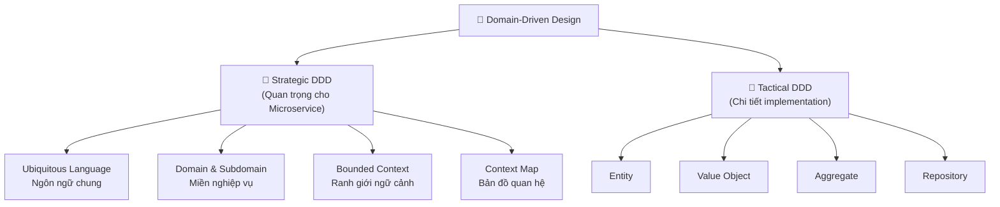
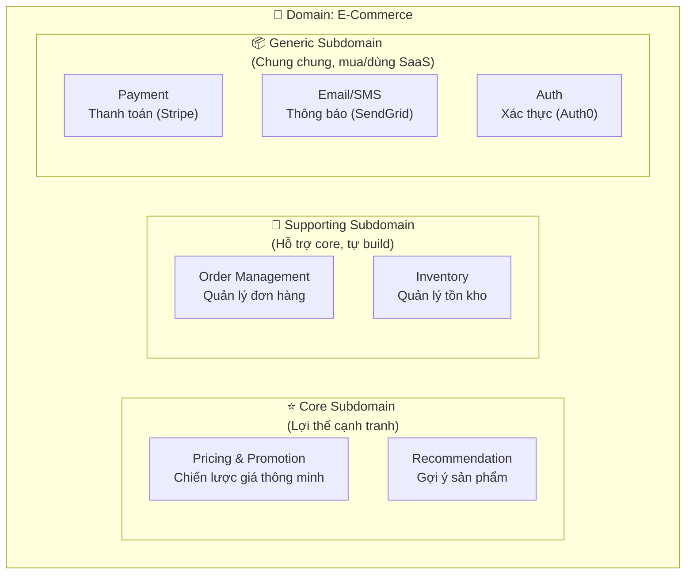
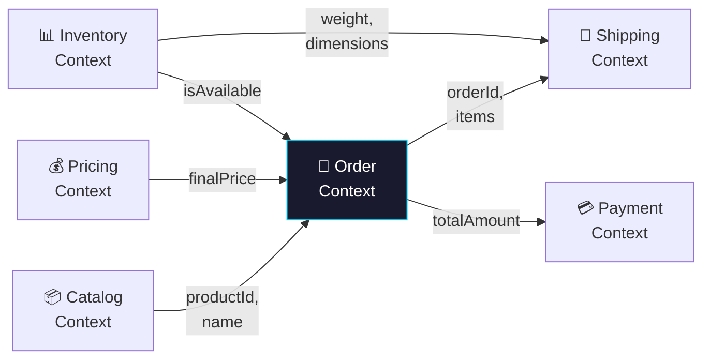
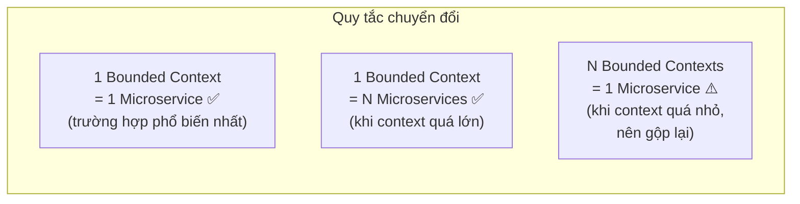
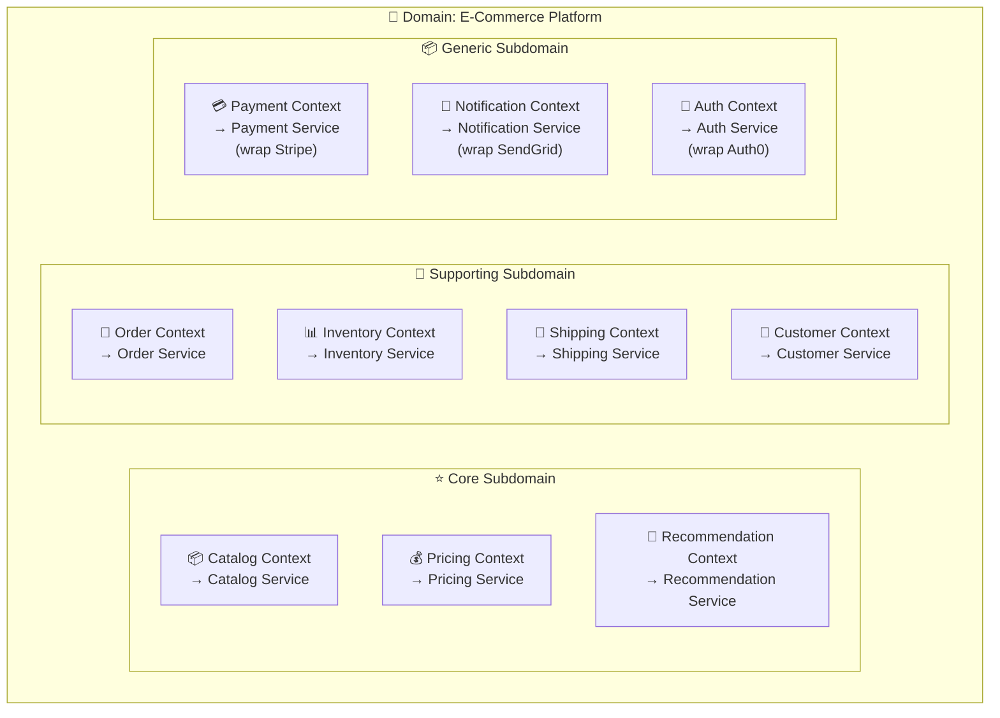
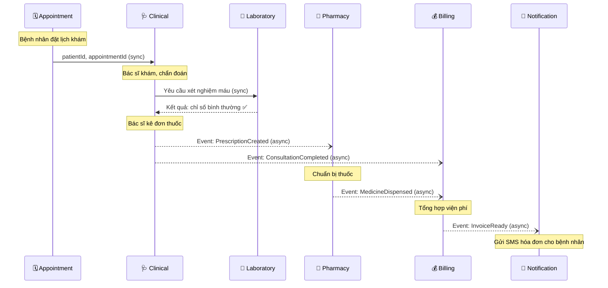
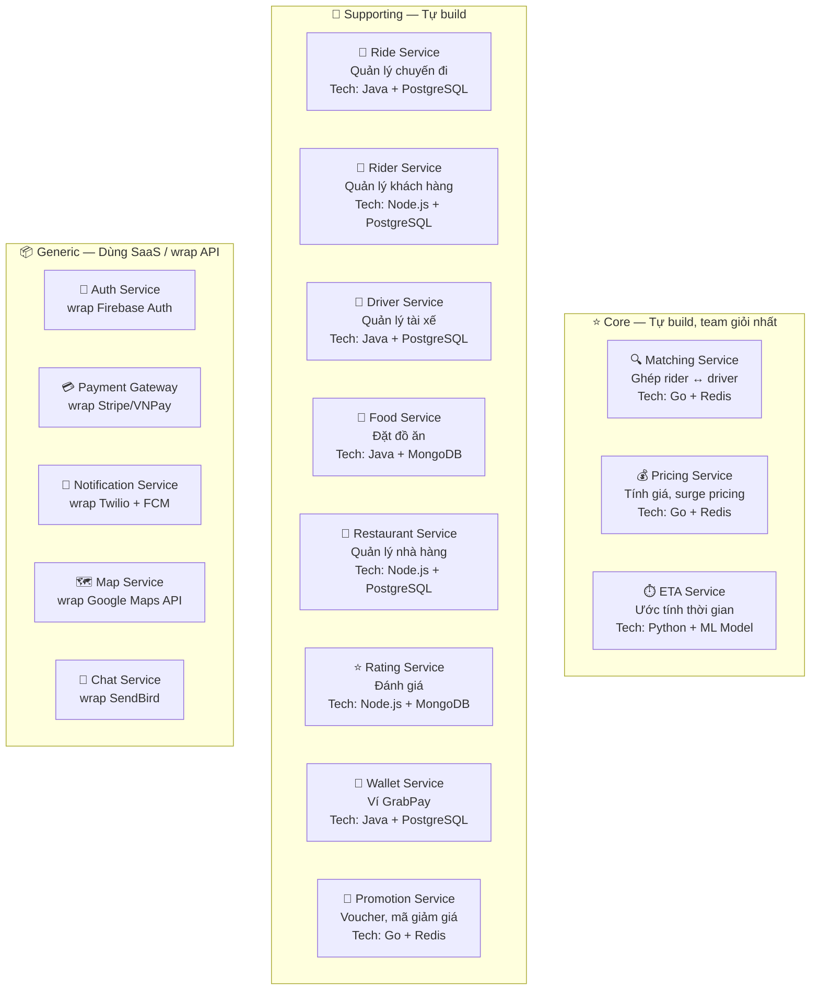
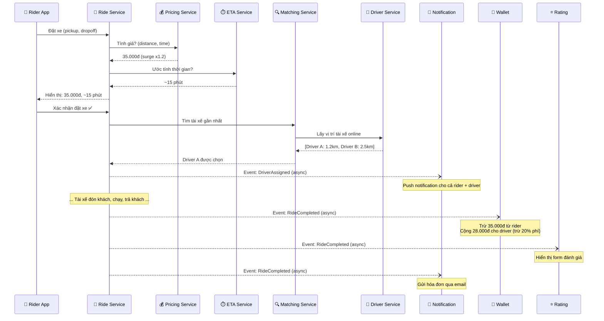
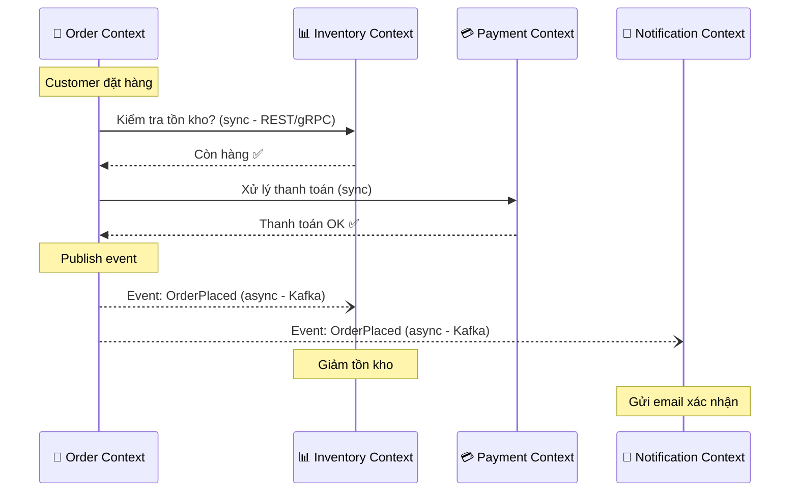

# Single Responsibility & Bounded Context

## Mục lục

- [Tại sao cần hiểu SRP và Bounded Context?](#tại-sao-cần-hiểu-srp-và-bounded-context)
- [Single Responsibility Principle (SRP)](#single-responsibility-principle-srp)
  - [SRP trong OOP vs Microservice](#srp-trong-oop-vs-microservice)
  - [Ví dụ: Service vi phạm SRP](#ví-dụ-service-vi-phạm-srp)
  - [Ví dụ: Service tuân thủ SRP](#ví-dụ-service-tuân-thủ-srp)
  - [Làm sao biết service đang vi phạm SRP?](#làm-sao-biết-service-đang-vi-phạm-srp)
- [Domain-Driven Design (DDD) — Tổng quan nhanh](#domain-driven-design-ddd--tổng-quan-nhanh)
  - [DDD là gì?](#ddd-là-gì)
  - [Ubiquitous Language](#ubiquitous-language)
  - [Domain, Subdomain và Bounded Context](#domain-subdomain-và-bounded-context)
- [Bounded Context — Chi tiết](#bounded-context--chi-tiết)
  - [Bounded Context là gì?](#bounded-context-là-gì)
  - [Ví dụ: Cùng khái niệm "Product" nhưng khác ngữ cảnh](#ví-dụ-cùng-khái-niệm-product-nhưng-khác-ngữ-cảnh)
  - [Context Map — Mối quan hệ giữa các Bounded Context](#context-map--mối-quan-hệ-giữa-các-bounded-context)
  - [Các pattern quan hệ giữa Bounded Context](#các-pattern-quan-hệ-giữa-bounded-context)
- [Từ Bounded Context đến Microservice](#từ-bounded-context-đến-microservice)
  - [1 Bounded Context = 1 Microservice?](#1-bounded-context--1-microservice)
  - [Ví dụ thực tế: Hệ thống E-Commerce](#ví-dụ-thực-tế-hệ-thống-e-commerce)
  - [Ví dụ thực tế: Hệ thống quản lý Bệnh viện](#ví-dụ-thực-tế-hệ-thống-quản-lý-bệnh-viện)
  - [Ví dụ thực tế: Grab — Super App](#ví-dụ-thực-tế-grab--super-app-chi-tiết-từng-bước)
- [Cách xác định ranh giới service](#cách-xác-định-ranh-giới-service)
  - [Bước 1: Xác định Domain và Subdomain](#bước-1-xác-định-domain-và-subdomain)
  - [Bước 2: Tìm Bounded Context](#bước-2-tìm-bounded-context)
  - [Bước 3: Định nghĩa model riêng cho mỗi context](#bước-3-định-nghĩa-model-riêng-cho-mỗi-context)
  - [Bước 4: Xác định giao tiếp giữa các context](#bước-4-xác-định-giao-tiếp-giữa-các-context)
- [Anti-patterns — Những sai lầm thường gặp](#anti-patterns--những-sai-lầm-thường-gặp)
- [Tổng kết](#tổng-kết)
- [Links liên quan](#links-liên-quan)

---

## Tại sao cần hiểu SRP và Bounded Context?

Trong [doc 01](01-microservice-overview.md), ta biết Microservice cần:
- Mỗi service **làm 1 việc** (Single Responsibility)
- Mỗi service **có ranh giới rõ ràng** (Bounded Context)

Nhưng câu hỏi thực tế là: **"Làm sao biết nên tách thành bao nhiêu service? Ranh giới ở đâu?"**

Đó chính là lúc cần **SRP** và **Bounded Context** — 2 công cụ tư duy giúp bạn xác định ranh giới service đúng đắn.

```
❌ Tách sai → service quá lớn (distributed monolith)
                hoặc quá nhỏ (nano-service hell)

✅ Tách đúng → service vừa phải, độc lập, dễ maintain

            SRP + Bounded Context = Kim chỉ nam để tách đúng
```

---

## Single Responsibility Principle (SRP)

**SRP** (Single Responsibility Principle — Nguyên tắc đơn trách nhiệm) ban đầu là 1 trong 5 nguyên tắc **SOLID** trong lập trình hướng đối tượng (OOP), được đề xuất bởi **Robert C. Martin (Uncle Bob)**.

> *"A module should have one, and only one, reason to change."*
> — Robert C. Martin

### SRP trong OOP vs Microservice

| | SRP trong OOP | SRP trong Microservice |
|--|--------------|----------------------|
| **Áp dụng cho** | Class / Module | Service |
| **"1 việc" nghĩa là** | 1 class chỉ có 1 lý do để thay đổi | 1 service chỉ phụ trách **1 business capability** |
| **Ví dụ** | Class `UserRepository` chỉ lo truy xuất DB user | `User Service` chỉ lo quản lý user (CRUD, profile, authentication) |
| **Vi phạm** | Class `UserManager` vừa query DB, vừa gửi email, vừa generate PDF | `Order Service` vừa quản lý đơn hàng, vừa xử lý thanh toán, vừa gửi notification |

### Ví dụ: Service vi phạm SRP

```
❌ "God Service" — 1 service làm quá nhiều việc

┌─────────────────────────────────────────────────────┐
│              Order Service (God Service)            │
│                                                     │
│  • Tạo / sửa / xóa đơn hàng                         │
│  • Tính giá, áp dụng mã giảm giá                    │
│  • Xử lý thanh toán (Stripe, VNPay)                 │
│  • Quản lý tồn kho                                  │
│  • Gửi email xác nhận                               │
│  • Tạo vận đơn giao hàng                            │
│  • Tạo báo cáo doanh thu                            │
│                                                     │
│  ┌───────────────────────────────────────────────┐  │
│  │              Shared Database                  │  │
│  │  orders | payments | inventory | shipments    │  │
│  └───────────────────────────────────────────────┘  │
└─────────────────────────────────────────────────────┘

Vấn đề:
  → Thay đổi logic thanh toán → phải test lại cả order
  → Thêm cổng thanh toán mới → deploy lại cả service
  → Team payment và team order phải coordinate liên tục
  → Bug ở notification kéo sập cả đặt hàng
```

### Ví dụ: Service tuân thủ SRP

```
✅ Tách theo SRP — mỗi service 1 business capability

┌──────────────┐  ┌───────────────┐  ┌──────────────┐
│ Order Service│  │Payment Service│  │Inventory Svc │
│              │  │               │  │              │
│ • Tạo order  │  │ • Thanh toán  │  │ • Kiểm tồn   │
│ • Sửa order  │  │ • Hoàn tiền   │  │ • Cập nhật   │
│ • Hủy order  │  │ • Lịch sử TT  │  │ • Cảnh báo   │
│ • Trạng thái │  │               │  │   hết hàng   │
│              │  │               │  │              │
│ ┌──────────┐ │  │ ┌──────────┐  │  │ ┌──────────┐ │
│ │ Order DB │ │  │ │Payment DB│  │  │ │ Inv. DB  │ │
│ └──────────┘ │  │ └──────────┘  │  │ └──────────┘ │
└──────────────┘  └───────────────┘  └──────────────┘

┌──────────────┐  ┌──────────────┐
│Shipping Svc  │  │Notification  │
│              │  │   Service    │
│ • Tạo vận đơn│  │ • Gửi email  │
│ • Tracking   │  │ • Gửi SMS    │
│ • Đối soát   │  │ • Push noti  │
│              │  │              │
│ ┌──────────┐ │  │ ┌──────────┐ │
│ │ Ship DB  │ │  │ │ Noti DB  │ │
│ └──────────┘ │  │ └──────────┘ │
└──────────────┘  └──────────────┘

Lợi ích:
  → Thay cổng thanh toán? Chỉ sửa Payment Service
  → Bug notification? Order vẫn chạy bình thường
  → Team payment deploy độc lập, không ảnh hưởng ai
```

### Làm sao biết service đang vi phạm SRP?

Đặt các câu hỏi sau:

| Dấu hiệu | Câu hỏi kiểm tra | Vi phạm nếu... |
|-----------|-------------------|-----------------|
| **Nhiều lý do thay đổi** | "Service này thay đổi khi nào?" | Trả lời được > 1 lý do nghiệp vụ khác nhau |
| **Nhiều team cùng sửa** | "Bao nhiêu team cần sửa service này?" | > 1 team thường xuyên sửa |
| **Quá nhiều bảng DB** | "Service này sở hữu bao nhiêu bảng?" | > 5-7 bảng không liên quan chặt chẽ |
| **Tên quá chung chung** | "Tên service có mô tả rõ ràng không?" | Tên kiểu `CommonService`, `UtilityService`, `MainService` |
| **Deploy sợ hãi** | "Có sợ deploy service này không?" | Phải test rất nhiều thứ không liên quan khi deploy |

> 💡 **Quy tắc ngón tay cái:** Nếu bạn không thể mô tả service trong **1 câu ngắn** mà không dùng từ "và" — nó có thể đang vi phạm SRP.
>
> ✅ "Order Service **quản lý vòng đời đơn hàng**"
> ❌ "Order Service **quản lý đơn hàng VÀ thanh toán VÀ giao hàng**"

---

## Domain-Driven Design (DDD) — Tổng quan nhanh

### DDD là gì?

**DDD** (Domain-Driven Design — Thiết kế hướng miền) là một phương pháp thiết kế phần mềm do **Eric Evans** giới thiệu năm 2003, tập trung vào việc **mô hình hóa phần mềm theo nghiệp vụ thực tế**.

```
Truyền thống:  Dev nghĩ về database, table, API trước
               → Phần mềm xa rời nghiệp vụ

DDD:           Dev + Business Expert cùng trao đổi
               → Mô hình phần mềm phản ánh đúng thực tế
```

DDD rất rộng, nhưng trong Microservice, ta chủ yếu quan tâm đến **Strategic DDD** — bao gồm:



### Ubiquitous Language

**Ubiquitous Language** (ngôn ngữ chung) là nguyên tắc: **Dev và Business phải dùng cùng một thuật ngữ**.

```
❌ Không có Ubiquitous Language:

Business nói:  "Khách hàng đặt đơn"
Dev hiểu:      "User tạo record trong bảng transactions"
Tester nói:    "Account submit request"

→ 3 người nói 3 kiểu → hiểu nhầm → bug

✅ Có Ubiquitous Language:

Business nói:  "Customer places an Order"
Dev code:      customer.placeOrder(order)
Tester test:   "Customer places Order → Order created"
DB schema:     table: customers, table: orders

→ Tất cả nói cùng 1 ngôn ngữ → ít hiểu nhầm
```

> 💡 **Tại sao quan trọng cho Microservice?** Vì mỗi Bounded Context sẽ có Ubiquitous Language **riêng** — cùng 1 từ nhưng ở context khác sẽ mang ý nghĩa khác.

### Domain, Subdomain và Bounded Context

Hình dung đơn giản nhất:

- **Domain** = toàn bộ bài toán kinh doanh (cả công ty)
- **Subdomain** = từng mảng nghiệp vụ (từng phòng ban)
- **Bounded Context** = ranh giới mà thuật ngữ có nghĩa riêng → cơ sở để tách Microservice

```
Ví dụ: Bạn mở công ty bán hàng online (Tiki)

🏢 Domain = "Tiki" (toàn bộ hoạt động kinh doanh)

Hỏi: "Công ty cần những phòng ban nào?"

⭐ Core (tạo lợi thế cạnh tranh - không ai làm thay được):
   → Phòng "Gợi ý sản phẩm" (thuật toán AI riêng của Tiki)
   → Phòng "Flash Sale" (chiến lược giảm giá riêng)

🔧 Supporting (hỗ trợ, tự xây):
   → Phòng "Đơn hàng"
   → Phòng "Kho hàng"
   → Phòng "Giao vận"

📦 Generic (thuê ngoài được):
   → Phòng "Thanh toán" (dùng VNPay, Momo)
   → Phòng "Gửi email/SMS" (dùng SendGrid)
```

Bounded Context — mỗi phòng ban hiểu 1 từ theo cách riêng:

```
Từ "Khách hàng" trong công ty Tiki:

📦 Phòng Kho:      "Khách hàng? Tôi chỉ cần biết ĐỊA CHỈ GIAO"
💰 Phòng Kế toán:  "Khách hàng? Tôi cần MÃ SỐ THUẾ, CÔNG NỢ"
🎯 Phòng Marketing:"Khách hàng? Tôi cần TUỔI, SỞ THÍCH, HÀNH VI MUA"
🛒 Phòng Bán hàng: "Khách hàng? Tôi cần TÊN, SĐT, LỊCH SỬ MUA"

→ Cùng 1 từ "Khách hàng" nhưng mỗi phòng hiểu KHÁC NHAU
→ Mỗi phòng = 1 Bounded Context
→ Mỗi phòng giữ RIÊNG thông tin nó cần, không cần biết phòng khác
```

Biểu đồ tổng quan:



| Loại Subdomain | Đặc điểm | Chiến lược | Ví dụ |
|---------------|-----------|------------|-------|
| **Core** | Tạo ra lợi thế cạnh tranh, khác biệt với đối thủ | **Đầu tư mạnh**, team giỏi nhất, tự phát triển | Thuật toán gợi ý của Netflix, matching của Tinder |
| **Supporting** | Hỗ trợ core, không có trên thị trường | Tự build, nhưng **không cần phức tạp** | Order management, Inventory |
| **Generic** | Chung chung, ai cũng cần | **Mua SaaS hoặc dùng open-source** | Auth, Email, Payment gateway |

---

## Bounded Context — Chi tiết

### Bounded Context là gì?

**Bounded Context** (ngữ cảnh có ranh giới) là **ranh giới rõ ràng** trong đó một model nghiệp vụ có ý nghĩa nhất quán. Bên trong ranh giới, mọi thuật ngữ đều có **1 định nghĩa duy nhất**.

Nói đơn giản: **Bounded Context = "Trong phạm vi này, từ X có nghĩa là Y"**.

### Ví dụ: Cùng khái niệm "Product" nhưng khác ngữ cảnh

Đây là ví dụ kinh điển để hiểu Bounded Context:

```
Trong hệ thống E-Commerce, "Product" xuất hiện ở NHIỀU nơi,
nhưng mỗi nơi quan tâm đến KHÍA CẠNH KHÁC NHAU:

┌─────────────────────────────────────────────────────────────┐
│                                                             │
│  📦 Catalog Context          💰 Pricing Context             │
│  ┌───────────────────┐       ┌───────────────────┐          │
│  │ Product:          │       │ Product:          │          │
│  │  - name           │       │  - basePrice      │          │
│  │  - description    │       │  - discount       │          │
│  │  - images[]       │       │  - taxRate        │          │
│  │  - category       │       │  - finalPrice()   │          │
│  │  - specifications │       │  - currency       │          │
│  └───────────────────┘       └───────────────────┘          │
│                                                             │
│  📊 Inventory Context        🚚 Shipping Context            │
│  ┌───────────────────┐       ┌───────────────────┐          │
│  │ Product:          │       │ Product:          │          │
│  │  - sku            │       │  - weight         │          │
│  │  - quantity       │       │  - dimensions     │          │
│  │  - warehouse      │       │  - isFragile      │          │
│  │  - reorderLevel   │       │  - shippingClass  │          │
│  └───────────────────┘       └───────────────────┘          │
│                                                             │
│  Cùng là "Product" nhưng mỗi context có model KHÁC NHAU!    │
│  Đây chính là lý do cần Bounded Context.                    │
└─────────────────────────────────────────────────────────────┘
```

**Nếu KHÔNG có Bounded Context** — dùng chung 1 model:

```
❌ Shared "God Model" — 1 model cho tất cả

class Product {
    // Catalog cần
    name, description, images[], category, specifications

    // Pricing cần
    basePrice, discount, taxRate, currency

    // Inventory cần
    sku, quantity, warehouse, reorderLevel

    // Shipping cần
    weight, dimensions, isFragile, shippingClass

    // → 20+ fields, ai cũng phụ thuộc vào
    // → Sửa 1 field cho Shipping có thể break Catalog
    // → Đây chính là vấn đề Monolith!
}
```

**Có Bounded Context** — mỗi context có model riêng:

```
✅ Mỗi context định nghĩa "Product" theo cách riêng

// Catalog Context
class CatalogProduct {
    name, description, images[], category
    // Chỉ có gì Catalog cần, không biết gì về giá hay tồn kho
}

// Inventory Context  
class InventoryItem {
    sku, quantity, warehouse
    // Thậm chí không gọi là "Product" mà là "InventoryItem"!
    // Vì trong kho, người ta nghĩ về "mặt hàng tồn kho"
}

→ Mỗi context ĐỘC LẬP, sửa 1 context không ảnh hưởng context khác
```

### Context Map — Mối quan hệ giữa các Bounded Context

Các Bounded Context không hoàn toàn cô lập — chúng cần **trao đổi dữ liệu** với nhau. **Context Map** là bản đồ mô tả cách chúng tương tác.



> 💡 **Lưu ý:** Mỗi context chỉ chia sẻ **dữ liệu cần thiết**, không phải toàn bộ model. Order Context chỉ cần `productId` + `name` từ Catalog, không cần `images[]` hay `specifications`.

### Các pattern quan hệ giữa Bounded Context

Khi 2 Bounded Context cần tương tác, có nhiều cách thiết kế mối quan hệ:

| Pattern | Mô tả | Khi nào dùng | Ví dụ |
|---------|--------|-------------|-------|
| **Shared Kernel** | 2 context chia sẻ 1 phần model chung | Khi 2 context thuộc cùng team, cần sync chặt | User ID dùng chung giữa Auth và Profile |
| **Customer-Supplier** | Context "nhà cung cấp" cung cấp API cho context "khách hàng" | Khi 1 context phụ thuộc context khác | Order (customer) gọi Inventory (supplier) |
| **Conformist** | Context downstream chấp nhận hoàn toàn model của upstream | Khi dùng API bên ngoài, không thể thay đổi | Dùng Stripe API → tuân theo model của Stripe |
| **Anti-corruption Layer (ACL)** | Lớp chuyển đổi giữa 2 context để chúng không ảnh hưởng nhau | Khi tích hợp hệ thống cũ (legacy) hoặc bên thứ 3 | Adapter chuyển đổi XML từ hệ thống cũ sang JSON |
| **Open Host Service** | Context public hóa API rõ ràng cho nhiều consumer | Khi nhiều context cần dùng | Product Catalog cung cấp REST API public |
| **Published Language** | Dùng format chung để trao đổi (JSON, Protobuf, Avro) | Khi cần interoperability | Event dùng Avro schema trên Kafka |

```
Anti-corruption Layer — Ví dụ thực tế:

Hệ thống mới (Microservice) tích hợp hệ thống cũ (Legacy):

┌──────────────┐     ┌─────────────┐     ┌───────────────┐
│ Order Service│     │    ACL      │     │ Legacy ERP    │
│ (new, JSON)  │────▶│ (Adapter)   │────▶│ (old, XML/    │
│              │◀────│ JSON ↔ XML  │◀────│  SOAP)        │
└──────────────┘     └─────────────┘     └───────────────┘

ACL đảm bảo:
  → Order Service không cần biết Legacy dùng XML
  → Legacy thay đổi format → chỉ sửa ACL, không sửa Order Service
```

---

## Từ Bounded Context đến Microservice

### 1 Bounded Context = 1 Microservice?

**Thường thì đúng, nhưng không phải luôn luôn.**



| Trường hợp | Khi nào | Ví dụ |
|-----------|---------|-------|
| **1 BC = 1 Service** | Context có kích thước vừa phải | Order Context → Order Service |
| **1 BC = N Services** | Context lớn, có thể tách nhỏ thêm | User Context → Auth Service + Profile Service + Preferences Service |
| **N BC = 1 Service** | Context quá nhỏ, overhead không đáng | Currency Context + Tax Context → Pricing Service |

> 💡 **Quy tắc thực tế:** Bắt đầu với **1 BC = 1 Service**. Chỉ tách nhỏ hơn khi service **thực sự quá lớn** (> 2 team cùng sửa, deploy quá chậm). Chỉ gộp khi service **quá nhỏ** (chỉ có 1-2 API, traffic rất ít).

### Ví dụ thực tế: Hệ thống E-Commerce

Từ phân tích domain → subdomain → bounded context → microservice:



Mỗi service có **model riêng** cho khái niệm "Customer":

```
👤 Customer Context:           🛒 Order Context:
┌─────────────────────┐        ┌─────────────────────┐
│ Customer:           │        │ OrderCustomer:      │
│   - id              │        │   - customerId      │
│   - fullName        │        │   - name            │
│   - email           │        │   - shippingAddress │
│   - phone           │        │                     │
│   - dateOfBirth     │        │ (chỉ cần info liên  │
│   - preferences     │        │  quan đến đơn hàng) │
│   - loyaltyPoints   │        │                     │
│   - addresses[]     │        └─────────────────────┘
└─────────────────────┘        

💳 Payment Context:            📧 Notification Context:
┌─────────────────────┐        ┌─────────────────────┐
│ Payer:              │        │ Recipient:          │
│   - customerId      │        │   - customerId      │
│   - billingAddress  │        │   - email           │
│   - paymentMethods[]│        │   - phone           │
│                     │        │   - preferences     │
│ (thậm chí gọi là    │        │     (email/sms/push)│
│  "Payer" chứ không  │        │                     │
│  phải "Customer")   │        └─────────────────────┘
└─────────────────────┘
```

### Ví dụ thực tế: Hệ thống quản lý Bệnh viện

Đi qua từng bước từ Domain → Subdomain → Bounded Context → Microservice.

**Bước 1: Xác định Domain và Subdomain**

```
🏥 Domain = "Hệ thống quản lý Bệnh viện"

Hỏi: "Bệnh viện có những mảng nghiệp vụ nào?"

⭐ Core Subdomain (lõi, tạo giá trị chính):
   → Khám chữa bệnh (Clinical)
   → Hồ sơ bệnh án (Medical Records)

🔧 Supporting Subdomain (hỗ trợ, tự xây):
   → Đặt lịch khám (Appointment)
   → Quản lý giường bệnh (Ward/Bed Management)
   → Quản lý thuốc & kho dược (Pharmacy)
   → Xét nghiệm (Laboratory)
   → Thanh toán viện phí (Billing)
   → Nhân sự (Staff Management)

📦 Generic Subdomain (thuê ngoài):
   → Xác thực đăng nhập (Auth — dùng Keycloak)
   → Gửi SMS/Email nhắc lịch (Notification — dùng Twilio)
   → Thanh toán online (Payment Gateway — dùng VNPay)
```

**Bước 2: Tìm Bounded Context — phân tích ngôn ngữ**

Cùng từ **"Bệnh nhân" (Patient)** — mỗi phòng ban hiểu khác nhau:

```
🗓️ Appointment Context:
   Patient = { name, phone, appointmentDate, doctorId }
   → "Bệnh nhân? Tôi cần TÊN, SĐT, NGÀY HẸN, BÁC SĨ NÀO"

🩺 Clinical Context:
   Patient = { medicalHistory, allergies, symptoms, vitalSigns }
   → "Bệnh nhân? Tôi cần TRIỆU CHỨNG, TIỀN SỬ BỆNH, DỊ ỨNG"

💊 Pharmacy Context:
   PrescriptionOwner = { patientId, prescriptions[], drugAllergies[] }
   → "Bệnh nhân? Tôi chỉ cần ĐƠN THUỐC, DỊ ỨNG THUỐC"
   → Thậm chí gọi là "Prescription Owner" chứ không phải "Patient"!

🧪 Laboratory Context:
   TestSubject = { sampleId, testType, results[] }
   → "Bệnh nhân? Tôi cần MẪU XÉT NGHIỆM, KẾT QUẢ, CHỈ SỐ"
   → Gọi là "Test Subject" — vì phòng lab nghĩ về mẫu xét nghiệm

💰 Billing Context:
   AccountHolder = { patientId, servicesUsed[], insuranceInfo, totalDue }
   → "Bệnh nhân? Tôi cần DỊCH VỤ ĐÃ DÙNG, BẢO HIỂM, CÔNG NỢ"
   → Gọi là "Account Holder"

🛏️ Ward Context:
   Inpatient = { patientId, bedNumber, roomNumber, admissionDate, dietaryNeeds }
   → "Bệnh nhân? Tôi cần GIƯỜNG NÀO, PHÒNG NÀO, NGÀY NHẬP VIỆN"
   → Gọi là "Inpatient" (bệnh nhân nội trú)
```

Tương tự, từ **"Bác sĩ" (Doctor)** cũng khác nhau ở mỗi context:

```
🗓️ Appointment:  Doctor = { name, specialty, availableSlots[] }
🩺 Clinical:     Doctor = { licenseNumber, qualifications, treatmentHistory[] }
💰 Billing:      Doctor = { consultationFee, revenueShare }
👥 Staff Mgmt:   Doctor = { salary, workingHours, leaveBalance, department }

→ Cùng 1 "Bác sĩ Nguyễn Văn A" nhưng mỗi context lưu thông tin KHÁC NHAU
```

**Bước 3: Mapping Bounded Context → Microservice**

```
Bounded Context → Microservice:
═══════════════════════════════════════════════

⭐ Core:
   Clinical Context        → Clinical Service
   Medical Records Context → Medical Records Service

🔧 Supporting:
   Appointment Context     → Appointment Service
   Ward Context            → Ward Service
   Pharmacy Context        → Pharmacy Service
   Laboratory Context      → Laboratory Service
   Billing Context         → Billing Service
   Staff Context           → Staff Service

📦 Generic:
   Auth Context            → Auth Service (Keycloak)
   Notification Context    → Notification Service (Twilio)
   Payment Context         → Payment Service (VNPay)
```

Cân nhắc gộp:

| Gộp? | Lý do |
|------|-------|
| Clinical + Medical Records → **Clinical Service** | Liên quan chặt, cùng team bác sĩ quản lý |
| Laboratory giữ riêng ✅ | Phòng xét nghiệm vận hành độc lập, tech khác |
| Pharmacy giữ riêng ✅ | Kho dược phức tạp, quy định riêng biệt |
| Auth + Notification → **dùng SaaS** | Không cần tự build, thuê ngoài |

**Bước 4: Luồng giao tiếp — "Bệnh nhân đi khám bệnh"**



**Bước 5: Mỗi service giữ data riêng**

```
Cùng 1 bệnh nhân "Nguyễn Văn A", mỗi service lưu KHÁC NHAU:

┌──────────────┐  ┌──────────────┐  ┌──────────────┐
│ Appointment  │  │  Clinical    │  │  Laboratory  │
│   Service    │  │   Service    │  │   Service    │
│              │  │              │  │              │
│ patient:     │  │ patient:     │  │ testSubject: │
│  - name      │  │  - history   │  │  - sampleId  │
│  - phone     │  │  - allergies │  │  - testType  │
│  - doctorId  │  │  - symptoms  │  │  - results[] │
│  - timeSlot  │  │  - diagnosis │  │              │
│              │  │              │  │              │
│ ┌──────────┐ │  │ ┌──────────┐ │  │ ┌──────────┐ │
│ │Appt DB   │ │  │ │Clinical  │ │  │ │  Lab DB  │ │
│ │(Postgres)│ │  │ │DB (Mongo)│ │  │ │(Postgres)│ │
│ └──────────┘ │  │ └──────────┘ │  │ └──────────┘ │
└──────────────┘  └──────────────┘  └──────────────┘

┌──────────────┐  ┌──────────────┐  ┌──────────────┐
│  Pharmacy    │  │   Billing    │  │    Ward      │
│   Service    │  │   Service    │  │   Service    │
│              │  │              │  │              │
│ prescOwner:  │  │ acctHolder:  │  │ inpatient:   │
│  - patientId │  │  - patientId │  │  - patientId │
│  - drugs[]   │  │  - services[]│  │  - bed: 3A   │
│  - drugAllerg│  │  - insurance │  │  - room: 201 │
│              │  │  - totalDue  │  │  - diet      │
│              │  │              │  │              │
│ ┌──────────┐ │  │ ┌──────────┐ │  │ ┌──────────┐ │
│ │Pharma DB │ │  │ │Billing DB│ │  │ │ Ward DB  │ │
│ │(Postgres)│ │  │ │(Postgres)│ │  │ │ (Redis)  │ │
│ └──────────┘ │  │ └──────────┘ │  │ └──────────┘ │
└──────────────┘  └──────────────┘  └──────────────┘

→ KHÔNG CÓ service nào biết TẤT CẢ thông tin về bệnh nhân
→ Mỗi service chỉ giữ đúng phần nó cần
```

### Ví dụ thực tế: Grab — Super App (chi tiết từng bước)

Ví dụ phức tạp hơn — app gọi xe, giao đồ ăn.

**Bước 1: Xác định Domain và Subdomain**

```
🏢 Domain = "Grab — Super App"

"Grab kiếm tiền bằng cách nào?"
→ Kết nối người cần di chuyển/đặt đồ ăn với tài xế/nhà hàng
  và thu phí mỗi giao dịch

⭐ Core Subdomain (lợi thế cạnh tranh, đối thủ không copy được):
   → Matching — ghép rider ↔ driver gần nhất, thông minh nhất
   → Pricing — tính giá theo demand, surge pricing, khuyến mãi
   → ETA — ước tính thời gian đến (dùng AI/ML)

🔧 Supporting Subdomain (tự build, hỗ trợ core):
   → Ride Management — quản lý chuyến đi
   → Driver Management — quản lý tài xế, tài liệu, xe
   → Rider Management — quản lý khách hàng
   → Food Delivery — đặt đồ ăn
   → Restaurant Management — quản lý nhà hàng, menu
   → Rating & Review — đánh giá
   → Wallet — ví điện tử GrabPay
   → Promotion — mã khuyến mãi, voucher

📦 Generic Subdomain (thuê ngoài / dùng SaaS):
   → Auth — đăng nhập OTP, Google, Facebook
   → Payment Gateway — liên kết thẻ, chuyển khoản
   → Notification — push, SMS, email
   → Map & Routing — bản đồ, tìm đường (Google Maps API)
   → Chat — nhắn tin rider ↔ driver
```

**Bước 2: Tìm Bounded Context — phân tích ngôn ngữ**

Từ **"USER"** — mỗi context hiểu hoàn toàn khác:

```
👤 Rider Context:
   User = Rider (người đi xe)
   { name, phone, savedAddresses[], rideHistory[] }

🚗 Driver Context:
   User = Driver (tài xế)
   { name, phone, licensePlate, vehicleType,
     documents[], onlineStatus, currentLocation }

🍔 Restaurant Context:
   User = Restaurant Owner (chủ nhà hàng)
   { restaurantName, address, openingHours, menuItems[] }

💰 Billing Context:
   User = Account (tài khoản tài chính)
   { balance, bankAccount, commissionRate, payoutHistory[] }

⭐ Rating Context:
   User = Rateable (đối tượng được đánh giá)
   { averageRating, totalTrips, reviews[] }

→ 5 context khác nhau, cùng từ "User" nhưng nghĩa hoàn toàn khác!
```

Từ **"TRIP" / "ORDER"** — cũng khác ở mỗi context:

```
🚗 Ride Context:
   Trip = { pickupLocation, dropoffLocation, distance,
            riderId, driverId, status, route[] }

💰 Pricing Context:
   Trip = PriceCalculation
   { distance, duration, surgeMultiplier, promoCode,
     baseFare, finalFare }
   → Không care route hay driver, chỉ care TIỀN

📊 Analytics Context:
   Trip = TripMetric
   { completionTime, waitTime, cancellationReason,
     customerSatisfaction }
   → Không care chi tiết, chỉ care SỐ LIỆU

🍔 Food Delivery Context:
   Trip = Delivery
   { restaurantLocation, customerLocation, items[],
     preparationTime, deliveryTime }
   → Gọi là "Delivery" không phải "Trip"!

💳 Wallet Context:
   Trip = Transaction
   { amount, type: "ride_payment", from, to, timestamp }
   → Chỉ là 1 dòng giao dịch, không biết gì về route
```

Từ **"LOCATION"** — khác biệt rất rõ:

```
🚗 Ride Context:
   Location = { lat, lng, address, landmark }
   → Điểm đón / trả khách

🗺️ Map Context:
   Location = GeoPoint
   { lat, lng, roadSegmentId, trafficDensity }
   → Dữ liệu bản đồ, giao thông

🔍 Matching Context:
   Location = DriverPosition
   { lat, lng, heading, speed, lastUpdated }
   → Vị trí real-time của tài xế, cập nhật mỗi 3 giây

📊 Analytics Context:
   Location = HotZone
   { areaId, demandLevel, avgWaitTime, driverSupply }
   → Vùng nóng, thống kê cung-cầu
```

**Bước 3: Mapping Bounded Context → Microservice**



**Bước 4: Luồng giao tiếp — "Khách gọi xe GrabBike"**



**Bước 5: Mỗi service giữ data riêng**

Cùng 1 chuyến đi **"Ride #12345"**, mỗi service lưu KHÁC NHAU:

```
🚗 Ride Service (source of truth cho chuyến đi):
   ride: {
     id: 12345, status: "completed",
     riderId: "R001", driverId: "D055",
     pickup: "123 Nguyễn Huệ", dropoff: "456 Lê Lợi",
     startTime: "10:00", endTime: "10:25"
   }

💰 Pricing Service (chỉ biết về giá):
   priceCalculation: {
     rideId: 12345,
     baseFare: 12000, distanceFare: 18000,
     surgeMultiplier: 1.2, promoDiscount: -5000,
     finalFare: 35000
   }

👛 Wallet Service (chỉ biết về tiền):
   transactions: [
     { type: "ride_payment", rideId: 12345,
       from: "R001", amount: -35000 },
     { type: "driver_earning", rideId: 12345,
       to: "D055", amount: +28000 },
     { type: "platform_fee", rideId: 12345,
       amount: +7000 }
   ]

⭐ Rating Service (chỉ biết về đánh giá):
   review: {
     rideId: 12345,
     riderRating: 5, riderComment: "Tài xế thân thiện",
     driverRating: 4, driverComment: "Khách OK"
   }

🔍 Matching Service (chỉ biết vị trí real-time):
   → Dữ liệu trong Redis, hết chuyến thì XÓA
   driverPositions: {
     "D055": { lat: 10.78, lng: 106.69, updated: "10:02" }
   }

→ KHÔNG CÓ service nào biết TẤT CẢ thông tin
→ Mỗi service chỉ giữ đúng phần nó cần
→ Đây chính là sức mạnh của Bounded Context!
```

**Bước 6: Tổng kết — từ Domain đến Microservice**

```
┌──────────────────────────────────────────────────────────────────┐
│                     GRAB — TÓM TẮT QUÁ TRÌNH                     │
│                                                                  │
│  Domain (Grab)                                                   │
│    ├── Core Subdomain                                            │
│    │   ├── Matching Context  ──→  Matching Service (Go+Redis)    │
│    │   ├── Pricing Context   ──→  Pricing Service (Go+Redis)     │
│    │   └── ETA Context       ──→  ETA Service (Python+ML)        │
│    │                                                             │
│    ├── Supporting Subdomain                                      │
│    │   ├── Ride Context      ──→  Ride Service (Java+PG)         │
│    │   ├── Rider Context     ──→  Rider Service (Node+PG)        │
│    │   ├── Driver Context    ──→  Driver Service (Java+PG)       │
│    │   ├── Food Context      ──→  Food Service (Java+Mongo)      │
│    │   ├── Restaurant Context──→  Restaurant Service (Node+PG)   │
│    │   ├── Rating Context    ──→  Rating Service (Node+Mongo)    │
│    │   ├── Wallet Context    ──→  Wallet Service (Java+PG)       │
│    │   └── Promotion Context ──→  Promotion Service (Go+Redis)   │
│    │                                                             │
│    └── Generic Subdomain                                         │
│        ├── Auth Context      ──→  Auth Service (Firebase Auth)   │
│        ├── Payment Context   ──→  Payment Service (Stripe)       │
│        ├── Notification Ctx  ──→  Notification Svc (Twilio+FCM)  │
│        ├── Map Context       ──→  Map Service (Google Maps)      │
│        └── Chat Context      ──→  Chat Service (SendBird)        │
│                                                                  │
│  Tổng: 16 Microservices                                          │
│  Mỗi service: DB riêng, deploy riêng, team riêng                 │
└──────────────────────────────────────────────────────────────────┘
```

---

## Cách xác định ranh giới service

### Bước 1: Xác định Domain và Subdomain

Phỏng vấn business expert, trả lời các câu hỏi:

```
1. "Công ty kiếm tiền bằng cách nào?"
   → Xác định Core Subdomain

2. "Những chức năng nào hỗ trợ cho hoạt động chính?"
   → Xác định Supporting Subdomain

3. "Những chức năng nào công ty nào cũng cần?"
   → Xác định Generic Subdomain
```

**Ví dụ với Shopee:**

| Câu hỏi | Trả lời | Loại |
|---------|---------|------|
| Shopee kiếm tiền bằng gì? | Kết nối người mua - người bán, flash sale, gợi ý sản phẩm | **Core**: Marketplace Matching, Promotion, Recommendation |
| Chức năng hỗ trợ? | Quản lý đơn hàng, đánh giá, chat | **Supporting**: Order, Review, Chat |
| Chức năng chung? | Thanh toán, gửi thông báo, xác thực | **Generic**: Payment (ShopeePay), Notification, Auth |

### Bước 2: Tìm Bounded Context

Dùng các kỹ thuật sau:

**Kỹ thuật 1: Tìm "đường nứt" trong ngôn ngữ**

```
Khi business expert dùng cùng 1 từ nhưng nghĩa khác nhau
→ Đó là ranh giới giữa 2 Bounded Context

VD: "Account" trong ngân hàng:
  - Phòng mở tài khoản: Account = hồ sơ khách hàng (tên, CMND, địa chỉ)
  - Phòng giao dịch:    Account = số dư, lịch sử giao dịch
  - Phòng IT:           Account = username, password, quyền truy cập

→ 3 Bounded Context: Customer Onboarding, Transaction, Identity
```

**Kỹ thuật 2: Event Storming (đơn giản hóa)**

```
1. Liệt kê các DOMAIN EVENT (sự kiện nghiệp vụ):
   - OrderPlaced
   - PaymentReceived
   - ItemShipped
   - InventoryUpdated
   - CustomerRegistered

2. Nhóm các event liên quan:
   ┌─────────────────┐  ┌──────────────────┐  ┌──────────────┐
   │ Order Context   │  │ Payment Context  │  │ Shipping     │
   │                 │  │                  │  │ Context      │
   │ • OrderPlaced   │  │ • PaymentReceived│  │ • ItemShipped│
   │ • OrderCancelled│  │ • RefundIssued   │  │ • Delivered  │
   │ • OrderUpdated  │  │                  │  │ • Returned   │
   └─────────────────┘  └──────────────────┘  └──────────────┘

3. Mỗi nhóm = 1 Bounded Context tiềm năng
```

### Bước 3: Định nghĩa model riêng cho mỗi context

Sau khi xác định context, tạo model **riêng** cho mỗi context — không share model.

```
Sai ❌:  Tất cả service import chung "shared-models" package
         → Thay đổi model = phải deploy lại tất cả

Đúng ✅: Mỗi service tự định nghĩa model của mình
         → Dùng API / Event để trao đổi dữ liệu cần thiết
```

### Bước 4: Xác định giao tiếp giữa các context



**Nguyên tắc chọn sync vs async:**

| Sync (REST/gRPC) | Async (Event/Message Queue) |
|-------------------|-----------------------------|
| Cần kết quả **ngay lập tức** | Không cần kết quả ngay |
| VD: Kiểm tra tồn kho trước khi đặt | VD: Gửi email sau khi đặt thành công |
| Coupling **cao hơn** | Coupling **thấp hơn** |

---

## Anti-patterns — Những sai lầm thường gặp

### 1. Distributed Monolith

```
❌ "Tách service nhưng vẫn share database"

┌──────────┐  ┌──────────┐  ┌──────────┐
│Service A │  │Service B │  │Service C │
└────┬─────┘  └─────┬────┘  └──────┬───┘
     │              │              │
     └──────────────┼──────────────┘
                    │
             ┌──────▼──────┐
             │ Shared DB   │  ← Thay đổi schema = break tất cả
             └─────────────┘

→ Có vẻ là Microservice nhưng thực tế là Monolith phân tán
→ Có TẤT CẢ nhược điểm của cả Monolith lẫn Microservice!
```

### 2. Nano-service (tách quá nhỏ)

```
❌ Tách quá mức:

┌─────────┐ ┌─────────┐ ┌─────────┐ ┌──────────┐ ┌──────────┐
│Validate │ │ Save    │ │ Format  │ │ Send     │ │ Log      │
│Email Svc│→│Email Svc│→│Email Svc│→│Email Svc │→│Email Svc │
└─────────┘ └─────────┘ └─────────┘ └──────────┘ └──────────┘

→ Mỗi service quá nhỏ, chỉ làm 1 bước
→ Network overhead cực lớn
→ Impossible to debug

✅ Nên gộp thành 1:  Email Notification Service
```

### 3. Chia theo layer thay vì business capability

```
❌ Tách theo technical layer:

┌──────────────┐  ┌──────────────┐  ┌──────────────┐
│ UI Service   │  │ Business     │  │ Data Access  │
│              │  │ Logic Service│  │ Service      │
│ (all UI)     │  │ (all logic)  │  │ (all DB)     │
└──────────────┘  └──────────────┘  └──────────────┘

→ Thêm feature mới = sửa CẢ 3 service
→ Không có team ownership rõ ràng

✅ Tách theo business capability:

┌──────────────┐  ┌──────────────┐  ┌───────────────┐
│ User Service │  │ Order Service│  │Product Service│
│ UI+Logic+DB  │  │ UI+Logic+DB  │  │ UI+Logic+DB   │
│ (vertical)   │  │ (vertical)   │  │ (vertical)    │
└──────────────┘  └──────────────┘  └───────────────┘

→ Thêm feature Order = chỉ sửa Order Service
→ Team Order sở hữu toàn bộ từ UI đến DB
```

---

## Tổng kết

```
┌─────────────────────────────────────────────────────────────────┐
│                     KIM CHỈ NAM TÁCH SERVICE                    │
│                                                                 │
│  1. SRP: Mỗi service chỉ có 1 lý do để thay đổi                 │
│                                                                 │
│  2. Bounded Context: Ranh giới nơi model có nghĩa nhất quán     │
│                                                                 │
│  3. Ubiquitous Language: Cùng từ + khác nghĩa = khác context    │
│                                                                 │
│  4. Vertical slice: Tách theo business, không theo layer        │
│                                                                 │
│  5. Database per service: Không share DB                        │
│                                                                 │
│  6. Start big, split later: Bắt đầu lớn, tách khi cần           │
│                                                                 │
│  7. Tránh: Distributed Monolith, Nano-service, Layer-based      │
└─────────────────────────────────────────────────────────────────┘
```

---

## Links liên quan

- Trước đó: [Microservice Overview](01-microservice-overview.md) — Tổng quan Microservice, Monolith, SOA
- Tiếp theo: [Loose Coupling & High Cohesion](03-loose-coupling-high-cohesion.md) — Nguyên tắc kết nối lỏng, gắn kết cao
- [Autonomy & Independence](04-autonomy-independence.md) — Tự chủ và độc lập trong Microservice
- [Decomposition Strategies](05-decomposition-strategies.md) — Chiến lược cụ thể để phân tách service
- [Data Management](09-data-management.md) — Database per Service, Saga pattern
- [Inter-Service Communication](06-inter-service-communication.md) — Cách các service giao tiếp
- [Design Patterns tổng hợp](16-design-patterns.md) — Anti-corruption Layer, Strangler Fig và các pattern khác
