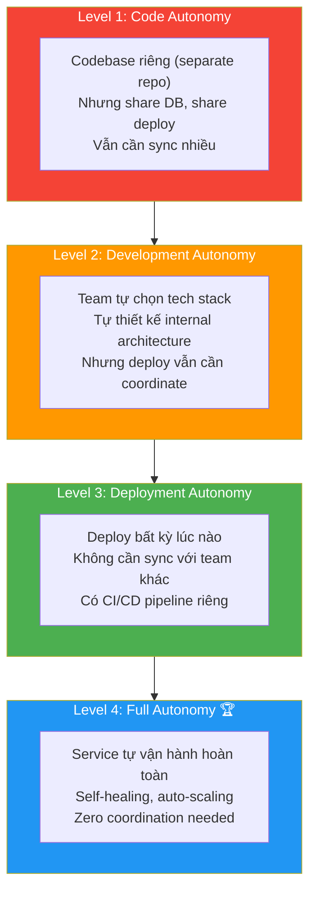
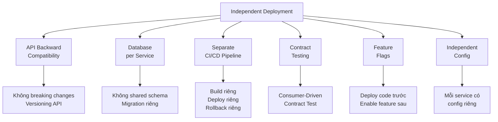
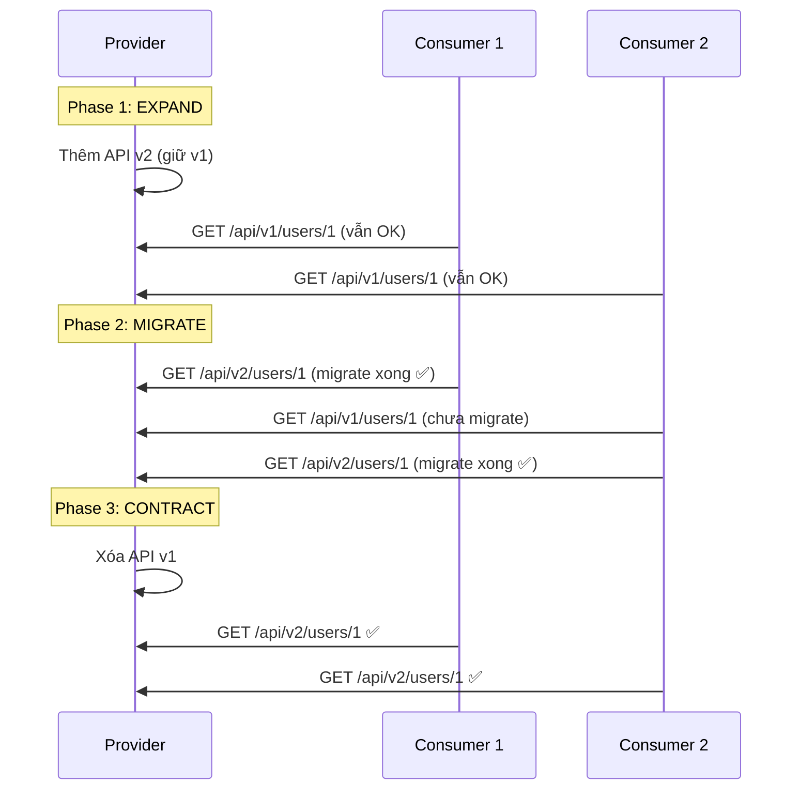
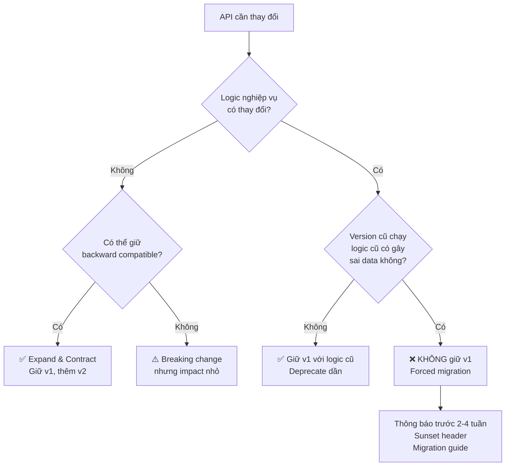
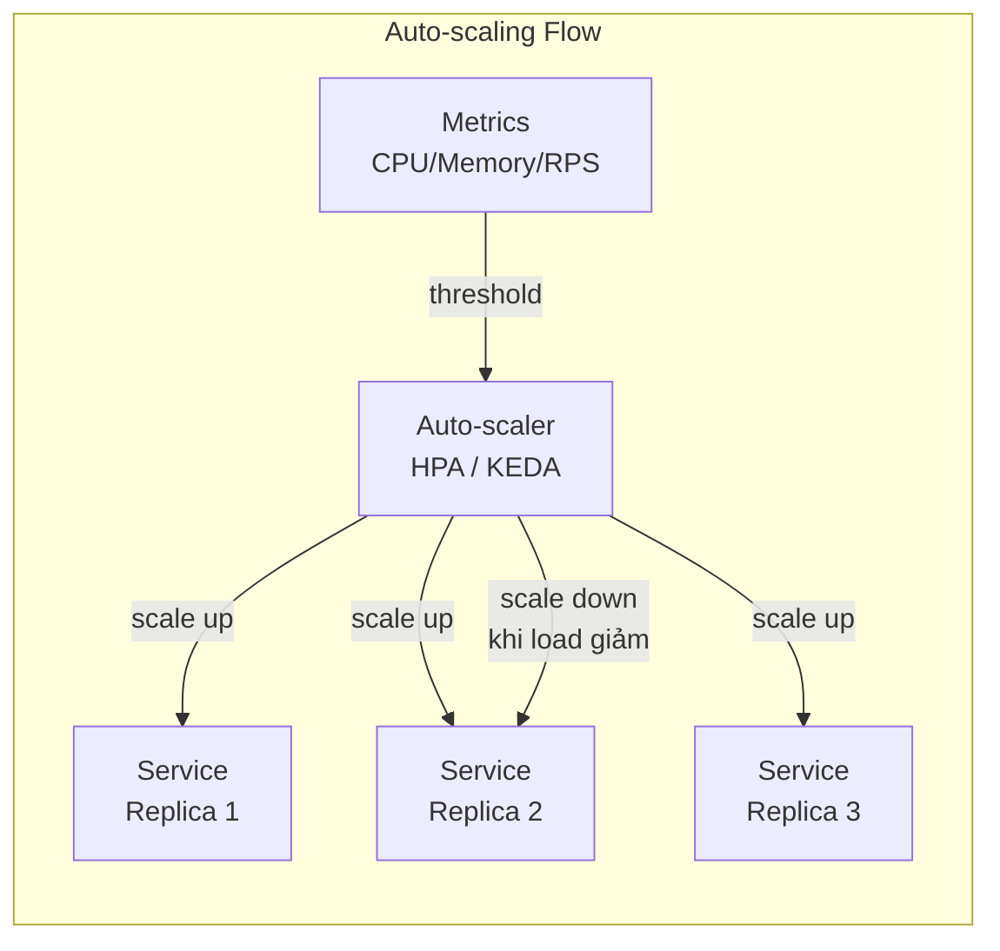
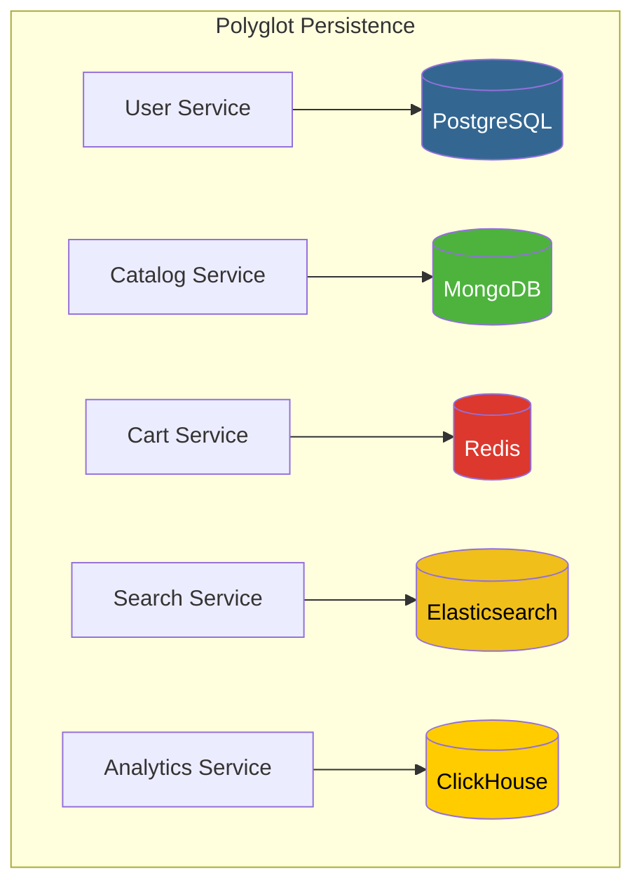
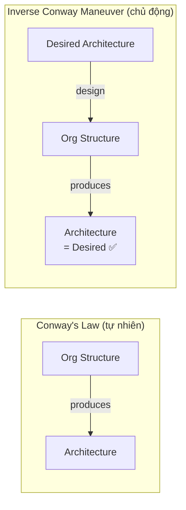
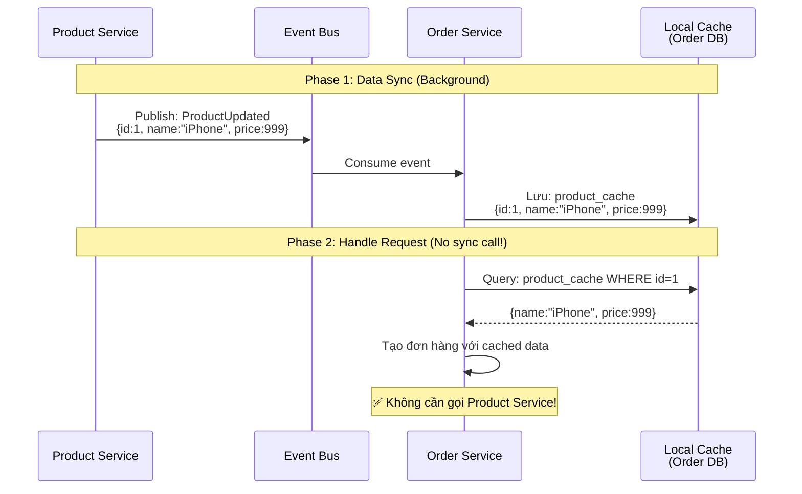

# Autonomy & Independence trong Microservice

## 📋 Mục lục

- [1. Giới thiệu](#1-giới-thiệu)
- [2. Service Autonomy — Tự chủ của Service](#2-service-autonomy--tự-chủ-của-service)
  - [2.1. Autonomy là gì?](#21-autonomy-là-gì)
  - [2.2. Bốn cấp độ Autonomy](#22-bốn-cấp-độ-autonomy)
  - [2.3. Tại sao Autonomy quan trọng?](#23-tại-sao-autonomy-quan-trọng)
- [3. Independent Deployment — Triển khai độc lập](#3-independent-deployment--triển-khai-độc-lập)
  - [3.1. Định nghĩa](#31-định-nghĩa)
  - [3.2. Yêu cầu để đạt Independent Deployment](#32-yêu-cầu-để-đạt-independent-deployment)
  - [3.3. Backward Compatibility — Tương thích ngược](#33-backward-compatibility--tương-thích-ngược)
    - [Khi nào giữ version cũ, khi nào không?](#khi-nào-giữ-version-cũ-khi-nào-không)
  - [3.4. Consumer-Driven Contract Testing](#34-consumer-driven-contract-testing)
  - [3.5. Ví dụ thực tế — Deploy Pipeline](#35-ví-dụ-thực-tế--deploy-pipeline)
- [4. Independent Scalability — Mở rộng độc lập](#4-independent-scalability--mở-rộng-độc-lập)
  - [4.1. Tại sao cần scale riêng từng service?](#41-tại-sao-cần-scale-riêng-từng-service)
  - [4.2. Horizontal vs Vertical Scaling](#42-horizontal-vs-vertical-scaling)
  - [4.3. Scaling Patterns](#43-scaling-patterns)
  - [4.4. Ví dụ thực tế — E-Commerce Black Friday](#44-ví-dụ-thực-tế--e-commerce-black-friday)
- [5. Technology Independence — Độc lập công nghệ](#5-technology-independence--độc-lập-công-nghệ)
  - [5.1. Polyglot Architecture](#51-polyglot-architecture)
  - [5.2. Polyglot Persistence](#52-polyglot-persistence)
  - [5.3. Khi nào nên / không nên đa công nghệ](#53-khi-nào-nên--không-nên-đa-công-nghệ)
- [6. Team Ownership — Sở hữu bởi Team](#6-team-ownership--sở-hữu-bởi-team)
  - [6.1. Conway's Law](#61-conways-law)
  - [6.2. Inverse Conway Maneuver](#62-inverse-conway-maneuver)
  - [6.3. Mô hình tổ chức team](#63-mô-hình-tổ-chức-team)
  - [6.4. "You Build It, You Run It"](#64-you-build-it-you-run-it)
- [7. Self-Contained Service](#7-self-contained-service)
  - [7.1. Định nghĩa](#71-định-nghĩa)
  - [7.2. Các thành phần của Self-Contained Service](#72-các-thành-phần-của-self-contained-service)
  - [7.3. Data Locality — Sao chép dữ liệu cần thiết](#73-data-locality--sao-chép-dữ-liệu-cần-thiết)
- [8. Fault Isolation — Cô lập lỗi](#8-fault-isolation--cô-lập-lỗi)
  - [8.1. Tại sao Fault Isolation quan trọng?](#81-tại-sao-fault-isolation-quan-trọng)
  - [8.2. Kỹ thuật Fault Isolation](#82-kỹ-thuật-fault-isolation)
  - [8.3. Graceful Degradation](#83-graceful-degradation)
- [9. Case Study thực tế](#9-case-study-thực-tế)
  - [9.1. Netflix — Ông tổ Microservice](#91-netflix--ông-tổ-microservice)
  - [9.2. Spotify — Squad Model](#92-spotify--squad-model)
  - [9.3. Amazon — Two-Pizza Team](#93-amazon--two-pizza-team)
- [10. Anti-patterns](#10-anti-patterns)
- [11. Checklist đánh giá Autonomy](#11-checklist-đánh-giá-autonomy)
- [12. Tổng kết](#12-tổng-kết)
- [13. Liên kết liên quan](#13-liên-kết-liên-quan)

---

## 1. Giới thiệu

Trong các doc trước, chúng ta đã tìm hiểu cách **xác định ranh giới** service ([doc 02](02-single-responsibility-bounded-context.md)) và đảm bảo **chất lượng ranh giới** qua Loose Coupling & High Cohesion ([doc 03](03-loose-coupling-high-cohesion.md)). Bài này đi vào câu hỏi tiếp theo: **Khi đã tách service rồi, mỗi service cần độc lập đến mức nào?**

**Autonomy & Independence** là mục tiêu cốt lõi của kiến trúc Microservice. Nếu các service không thực sự độc lập, bạn chỉ đang có một **Distributed Monolith** — phức tạp hơn monolith gốc mà không được lợi ích gì.

```
┌─────────────────────────────────────────────────────────────────┐
│              CÁC CHIỀU CỦA SERVICE INDEPENDENCE                 │
│                                                                 │
│    ┌──────────────┐   ┌──────────────┐   ┌──────────────┐       │
│    │   Deploy     │   │    Scale     │   │  Technology  │       │
│    │ Independently│   │ Independently│   │ Independently│       │
│    └──────┬───────┘   └──────┬───────┘   └──────┬───────┘       │
│           │                  │                  │               │
│           └──────────────────┼──────────────────┘               │
│                              │                                  │
│                    ┌─────────▼─────────┐                        │
│                    │  SERVICE AUTONOMY │                        │
│                    └─────────┬─────────┘                        │
│                              │                                  │
│           ┌──────────────────┼──────────────────┐               │
│           │                  │                  │               │
│    ┌──────▼───────┐   ┌──────▼───────┐   ┌──────▼───────┐       │
│    │     Team     │   │    Fault     │   │    Data      │       │
│    │   Ownership  │   │  Isolation   │   │  Ownership   │       │
│    └──────────────┘   └──────────────┘   └──────────────┘       │
└─────────────────────────────────────────────────────────────────┘
```

---

## 2. Service Autonomy — Tự chủ của Service

### 2.1. Autonomy là gì?

**Service Autonomy** là khả năng của một service để **hoạt động, phát triển, và vận hành** mà **không cần sự cho phép hay phối hợp** với các service khác.

Một service được coi là **autonomous** khi:
- **Tự quyết định** cách thực hiện logic nghiệp vụ
- **Tự quản lý** dữ liệu của mình
- **Tự triển khai** mà không cần chờ service khác
- **Tự phục hồi** khi gặp sự cố
- **Tự scale** theo nhu cầu riêng

### 2.2. Bốn cấp độ Autonomy



| Level | Tên | Đặc điểm | Ví dụ |
|-------|-----|-----------|-------|
| **1** | Code Autonomy | Repo riêng nhưng vẫn share DB, cùng deploy | Tách code nhưng chung database |
| **2** | Development Autonomy | Tự chọn tech, thiết kế nội bộ, nhưng deploy phối hợp | Team Java và team Go, nhưng deploy cùng lúc |
| **3** | Deployment Autonomy | Deploy độc lập, CI/CD riêng | Mỗi service tự deploy bất kỳ lúc nào |
| **4** | Full Autonomy | Tự vận hành, self-healing, auto-scaling | Netflix, Amazon — service tự xử lý mọi thứ |

**Mục tiêu**: Đạt ít nhất **Level 3** cho hầu hết các service.

### 2.3. Tại sao Autonomy quan trọng?

```
Không có Autonomy ❌                     Có Autonomy ✅
──────────────────                      ─────────────────

Team A muốn deploy feature mới          Team A deploy feature mới
         │                                       │
         ▼                                       ▼
"Chờ Team B fix bug trước"              Deploy ngay lập tức
         │                                       │
         ▼                                       ▼
"Team C cần update API"                 Không ảnh hưởng ai
         │                                       │
         ▼                                       ▼
"Schedule deploy window chung"          CI/CD tự động push
         │                                       │
         ▼                                       ▼
Deploy sau 2 tuần chờ đợi 🐌           Deploy trong 15 phút 🚀

Lead time: 2 tuần                      Lead time: 15 phút
Deploy frequency: 1 lần/tháng          Deploy frequency: 10 lần/ngày
```

**Số liệu thực tế** (theo DORA Research):

| Metric | Low Performer | Elite Performer |
|--------|--------------|-----------------|
| **Deploy Frequency** | 1 lần / tháng–6 tháng | Nhiều lần / ngày |
| **Lead Time for Changes** | 1–6 tháng | < 1 giờ |
| **Change Failure Rate** | 46–60% | 0–15% |
| **Time to Restore** | 1 tuần–1 tháng | < 1 giờ |

Autonomy là yếu tố then chốt giúp team đạt **Elite Performer** level.

---

## 3. Independent Deployment — Triển khai độc lập

### 3.1. Định nghĩa

**Independent Deployment** là khả năng deploy một service vào production mà **không cần deploy bất kỳ service nào khác** cùng lúc.

```
❌ Coordinated Deployment:
┌──────────────────────────────────────────────┐
│ Deploy Window: Thứ 7, 2AM–6AM                │
│                                              │
│ 1. Deploy Order Service v2.3        [30 min] │
│ 2. Deploy Payment Service v1.8      [20 min] │
│ 3. Deploy Inventory Service v3.1    [15 min] │
│ 4. Run integration tests            [45 min] │
│ 5. Nếu lỗi → rollback TẤT CẢ        [60 min] │
│                                              │
│ Tổng: 2h50 | Rủi ro: CAO | Stress: 💀        │
└──────────────────────────────────────────────┘

✅ Independent Deployment:
┌──────────────────────────────────────────────┐
│ Order Service v2.3:                          │
│ 1. Push code → CI chạy test         [10 min] │
│ 2. Build & push Docker image         [5 min] │
│ 3. Rolling update to production      [5 min] │
│ 4. Health check & smoke test         [2 min] │
│ 5. Nếu lỗi → rollback CHỈ service    [2 min] │
│    này                                       │
│                                              │
│ Tổng: 24 min | Rủi ro: THẤP | Bất kỳ lúc nào │
└──────────────────────────────────────────────┘
```

### 3.2. Yêu cầu để đạt Independent Deployment



| Yêu cầu | Mô tả | Tại sao cần |
|----------|--------|-------------|
| **API Backward Compatibility** | API version mới vẫn hỗ trợ client cũ | Consumer không buộc phải update cùng lúc |
| **Database per Service** | Mỗi service có DB riêng, migration riêng | Thay đổi schema không ảnh hưởng service khác |
| **Separate CI/CD** | Mỗi service có pipeline build/test/deploy riêng | Deploy không cần chờ service khác |
| **Contract Testing** | Test đảm bảo API contract không bị phá vỡ | Phát hiện breaking change trước khi deploy |
| **Feature Flags** | Bật/tắt feature mà không cần re-deploy | Deploy code anytime, enable khi sẵn sàng |
| **Independent Config** | Config riêng cho từng service và environment | Thay đổi config không ảnh hưởng service khác |

### 3.3. Backward Compatibility — Tương thích ngược

Đây là **yêu cầu quan trọng nhất** cho Independent Deployment. Khi bạn thay đổi API, phải đảm bảo **consumer cũ vẫn hoạt động**.

#### Expand and Contract Pattern (Parallel Change)

Thay vì thay đổi API một lần (breaking), chia thành **3 giai đoạn**:

```
Phase 1: EXPAND — Thêm API mới, giữ API cũ
─────────────────────────────────────────────
  Provider API:
    GET /api/v1/users/{id}          ← cũ (vẫn hoạt động)
    GET /api/v2/users/{id}          ← mới (thêm vào)
  
  Consumers: vẫn dùng v1, bắt đầu migrate sang v2

Phase 2: MIGRATE — Consumers chuyển sang API mới
─────────────────────────────────────────────
  Consumer A: đã dùng v2  ✅
  Consumer B: đã dùng v2  ✅
  Consumer C: đang migrate... ⏳

Phase 3: CONTRACT — Xóa API cũ khi tất cả đã migrate
─────────────────────────────────────────────
  Provider API:
    GET /api/v1/users/{id}          ← XÓA ❌
    GET /api/v2/users/{id}          ← giữ lại ✅
  
  Consumers: tất cả đã dùng v2
```



#### Tolerant Reader Pattern

Consumer chỉ đọc **các field mình cần**, bỏ qua field không biết:

```
# API Response thêm field mới:
{
  "id": 123,
  "name": "John",
  "email": "john@example.com",
  "phone": "+84123456789"         ← field mới được thêm
}

# Consumer cũ (Tolerant Reader):
# Chỉ đọc id, name, email → bỏ qua phone → KHÔNG LỖI ✅

# Consumer cứng nhắc (Strict Reader):
# Thấy field lạ "phone" → throw exception → LỖI ❌
```

#### Khi nào giữ version cũ, khi nào không?

Expand & Contract hoạt động tốt khi API **chỉ thêm field** hoặc **đổi format response**. Nhưng nếu **logic nghiệp vụ thay đổi**, giữ version cũ có thể gây **sai logic**:

```
Ví dụ: API Create Order thay đổi logic

Version cũ (v1):
  POST /api/v1/orders
  Body: { "productId": 1, "quantity": 2 }
  Logic: Tạo đơn → trừ kho ngay lập tức

Version mới (v2):
  POST /api/v2/orders
  Body: { "productId": 1, "quantity": 2, "warehouseId": "HN-01" }
  Logic: Tạo đơn → kiểm kho theo warehouse → reserve → xác nhận sau

❌ Vấn đề: Nếu giữ v1, logic "trừ kho ngay" đã bị xóa ở tầng DB/domain
   → v1 chạy sai hoặc phải duplicate logic cũ → maintenance nightmare
```

**Quy tắc phân loại:**

| Loại thay đổi | Giữ version cũ? | Lý do | Ví dụ |
|----------------|:---:|--------|-------|
| **Thêm field mới** (optional) | ✅ Có | Consumer cũ gửi thiếu field → dùng default value | Thêm `phone` vào User, default = null |
| **Đổi format response** | ✅ Có | Adapter layer chuyển đổi format dễ dàng | `fullName` → tách thành `firstName` + `lastName` |
| **Thêm field bắt buộc** | ⚠️ Tùy | v1 handler tự fill default value nếu hợp lý | Thêm `warehouseId`, v1 tự fill warehouse mặc định |
| **Thay đổi business logic** | ❌ Không | Logic cũ không còn đúng, giữ lại gây inconsistency | Đổi flow thanh toán từ sync → async |
| **Thay đổi validation rules** | ❌ Không | Rule cũ cho phép data sai lọt vào | Trước cho phép `quantity = 0`, giờ bắt buộc `>= 1` |
| **Thay đổi data model** | ❌ Không | Schema mới không tương thích, v1 ghi data sai | Tách `address` string thành object có `city`, `district` |

**Khi KHÔNG giữ version cũ → dùng Breaking Change Strategy:**

```
┌──────────────────────────────────────────────────────────┐
│         BREAKING CHANGE — FORCED MIGRATION               │
│                                                          │
│  1. Thông báo trước (deprecation notice)                 │
│     • Gửi email / Slack cho tất cả consumer teams        │
│     • Ghi rõ deadline migrate                            │
│     • Cung cấp migration guide                           │
│                                                          │
│  2. Sunset period (2–4 tuần)                             │
│     • v1 vẫn chạy nhưng trả thêm header:                 │
│       Deprecation: true                                  │
│       Sunset: Sat, 01 Mar 2025 00:00:00 GMT              │
│     • Log tất cả request vào v1 để track ai chưa migrate │
│                                                          │
│  3. Force migrate                                        │
│     • Tắt v1 → trả 410 Gone                              │
│     • Hoặc: v1 tự redirect/proxy sang v2                 │
│       (nếu có thể map request)                           │
└──────────────────────────────────────────────────────────┘
```



> **Nguyên tắc vàng**: Nếu giữ version cũ mà có thể gây **data inconsistency** hoặc **sai logic nghiệp vụ** → **bắt buộc breaking change**. Đừng giữ API cũ chỉ vì sợ phá consumer — data sai còn nguy hiểm hơn API bị break.

### 3.4. Consumer-Driven Contract Testing

**Vấn đề**: Làm sao biết khi thay đổi API có phá vỡ consumer nào không?

**Giải pháp**: Mỗi consumer định nghĩa **contract** (hợp đồng) mô tả những gì nó cần từ provider. Provider chạy test với **tất cả contracts** trước khi deploy.

```
┌──────────────────────────────────────────────────────────┐
│              Consumer-Driven Contract Testing            │
│                                                          │
│  ┌──────────┐     Contract: "Tôi cần field               │
│  │ Order    │──▶  id, name, price từ                     │
│  │ Service  │     GET /products/{id}"                    │
│  └──────────┘           │                                │
│                         │                                │
│  ┌──────────┐     Contract: "Tôi cần field               │
│  │ Search   │──▶  id, name, category từ                  │
│  │ Service  │     GET /products/{id}"                    │
│  └──────────┘           │                                │
│                         ▼                                │
│                 ┌──────────────┐                         │
│                 │   Product    │                         │
│                 │   Service    │                         │
│                 │              │                         │
│                 │ CI Pipeline: │                         │
│                 │ 1. Unit test │                         │
│                 │ 2. Contract  │                         │
│                 │    tests ◀── │ Run tất cả contracts    │
│                 │ 3. Deploy    │ từ consumers            │
│                 └──────────────┘                         │
│                                                          │
│  Tools: Pact, Spring Cloud Contract, Dredd               │
└──────────────────────────────────────────────────────────┘
```

### 3.5. Ví dụ thực tế — Deploy Pipeline

```
┌──────────────────────────────────────────────────────────┐
│          INDEPENDENT DEPLOYMENT PIPELINE                 │
│                                                          │
│  Developer push code                                     │
│       │                                                  │
│       ▼                                                  │
│  ┌─────────────────────┐                                 │
│  │   CI Pipeline       │                                 │
│  │   ─────────────     │                                 │
│  │   1. Lint & Format  │                                 │
│  │   2. Unit Tests     │ ← Test logic nội bộ             │
│  │   3. Integration    │ ← Test với DB, MQ riêng         │
│  │      Tests          │                                 │
│  │   4. Contract Tests │ ← Đảm bảo không phá consumer    │
│  │   5. Security Scan  │                                 │
│  │   6. Build Image    │                                 │
│  └──────────┬──────────┘                                 │
│             │                                            │
│             ▼                                            │
│  ┌─────────────────────┐                                 │
│  │   Staging Deploy    │                                 │
│  │   ─────────────     │                                 │
│  │   1. Deploy to      │                                 │
│  │      staging        │                                 │
│  │   2. Smoke Tests    │                                 │
│  │   3. Performance    │                                 │
│  │      Tests          │                                 │
│  └──────────┬──────────┘                                 │
│             │                                            │
│             ▼                                            │
│  ┌─────────────────────┐                                 │
│  │   Production Deploy │                                 │
│  │   ─────────────     │                                 │
│  │   1. Canary (5%)    │ ← 5% traffic vào version mới    │
│  │   2. Monitor 15min  │                                 │
│  │   3. Expand (25%)   │                                 │
│  │   4. Monitor 15min  │                                 │
│  │   5. Full rollout   │                                 │
│  │   6. Post-deploy    │                                 │
│  │      health check   │                                 │
│  └─────────────────────┘                                 │
│                                                          │
│  Tổng thời gian: ~30–45 phút                             │
│  Không cần chờ bất kỳ team nào                           │
└──────────────────────────────────────────────────────────┘
```

---

## 4. Independent Scalability — Mở rộng độc lập

### 4.1. Tại sao cần scale riêng từng service?

Trong một hệ thống, **không phải mọi service đều cần cùng lượng tài nguyên**. Ví dụ trong hệ thống e-commerce:

```
┌──────────────────────────────────────────────────────────┐
│              RESOURCE DEMAND KHÁC NHAU                   │
│                                                          │
│  Catalog Service:                                        │
│  ████████████████████████████████████ 90% READ           │
│  ██ 10% WRITE                                            │
│  → Cần nhiều RAM (cache), CPU thấp                       │
│  → Scale: 10 instances                                   │
│                                                          │
│  Payment Service:                                        │
│  ██████ 30% READ                                         │
│  ██████████████ 70% WRITE                                │
│  → Cần CPU cao (encryption), IO cao                      │
│  → Scale: 3 instances                                    │
│                                                          │
│  Image Processing Service:                               │
│  ████████████████████████████████████████ 100% COMPUTE   │
│  → Cần GPU hoặc CPU rất cao                              │
│  → Scale: 5 instances (burst khi upload)                 │
│                                                          │
│  Notification Service:                                   │
│  ████████████████████ BURSTY (spikes)                    │
│  → Scale from 2 → 20 instances vào giờ cao điểm          │
└──────────────────────────────────────────────────────────┘
```

Nếu là **monolith**, bạn phải scale **toàn bộ ứng dụng** — lãng phí tài nguyên. Với microservice, bạn chỉ scale **service nào cần thiết**.

### 4.2. Horizontal vs Vertical Scaling

```
Vertical Scaling (Scale Up) ⬆️          Horizontal Scaling (Scale Out) ➡️
─────────────────────────────           ──────────────────────────────

  ┌───────────────┐                     ┌───────┐ ┌───────┐ ┌───────┐
  │               │                     │Service│ │Service│ │Service│
  │               │                     │ Copy 1│ │ Copy 2│ │ Copy 3│
  │   BIG SERVER  │                     └───┬───┘ └───┬───┘ └───┬───┘
  │               │                         │         │         │
  │  32 CPU       │                     ┌───▼─────────▼─────────▼───┐
  │  128GB RAM    │                     │      Load Balancer        │
  │  2TB SSD      │                     └───────────────────────────┘
  │               │
  └───────────────┘                     Mỗi instance: 4 CPU, 8GB RAM

  Ưu điểm:                             Ưu điểm:
  • Đơn giản                            • Gần như unlimited
  • Không cần thay đổi code             • Fault tolerant (1 chết, còn lại OK)
                                        • Cost-effective
  Nhược điểm:                          
  • Có giới hạn (không thể              Nhược điểm:
    mua server vô hạn)                  • Cần stateless design
  • Single point of failure             • Phức tạp hơn (LB, session, etc.)
  • Cost tăng exponential
```

**Trong Microservice**: Luôn ưu tiên **Horizontal Scaling** vì tận dụng được fault tolerance và cost efficiency.

### 4.3. Scaling Patterns

#### 4.3.1. Auto-scaling dựa trên Metrics



| Metric | Scale Up khi | Scale Down khi | Phù hợp với |
|--------|-------------|----------------|-------------|
| **CPU** | > 70% | < 30% | CPU-intensive services |
| **Memory** | > 80% | < 40% | Cache-heavy services |
| **Request/sec** | > 1000 RPS | < 200 RPS | API services |
| **Queue depth** | > 100 messages | < 10 messages | Worker/consumer services |
| **Custom** | Business metric | Business metric | Domain-specific |

#### 4.3.2. Predictive Scaling

Scale **trước khi** traffic tăng, dựa trên pattern lịch sử:

```
Traffic Pattern hàng ngày:
    ▲
    │            ┌─────┐
    │      ┌─────┤     │
    │  ┌───┤     │     ├────┐
    │──┤   │     │     │    ├──
    │  │   │     │     │    │
    └──┴───┴─────┴─────┴────┴──► Giờ
    0  6   9    12    18   22  24

Predictive scaling: Biết traffic tăng lúc 9h
→ Scale up lúc 8:30 (trước 30 phút)
→ Không bị slow khi traffic spike
```

### 4.4. Ví dụ thực tế — E-Commerce Black Friday

```
Normal Day:
┌─────────────────────────────────────────┐
│  Catalog Service      : 3 instances     │
│  Order Service        : 2 instances     │
│  Payment Service      : 2 instances     │
│  Notification Service : 1 instance      │
│  Search Service       : 2 instances     │
│                                         │
│  Total: 10 instances                    │
│  Cost: $500/ngày                        │
└─────────────────────────────────────────┘

Black Friday:
┌─────────────────────────────────────────┐
│  Catalog Service      : 20 instances ⬆️ │  ← Nhiều người browse
│  Order Service        : 15 instances ⬆️ │  ← Nhiều đơn hàng
│  Payment Service      : 10 instances ⬆️ │  ← Nhiều thanh toán
│  Notification Service : 8 instances  ⬆️ │  ← Nhiều email
│  Search Service       : 15 instances ⬆️ │  ← Nhiều tìm kiếm
│                                         │
│  Total: 68 instances                    │
│  Cost: $3,400/ngày                      │
│                                         │
│  Nếu là monolith:                       │
│  → Scale toàn bộ: 68 × full app         │
│  → Cost: $10,000+/ngày 💸               │
└─────────────────────────────────────────┘

Tiết kiệm: ~65% chi phí so với monolith scaling
```

---

## 5. Technology Independence — Độc lập công nghệ

### 5.1. Polyglot Architecture

Mỗi service có thể chọn **ngôn ngữ lập trình** và **framework** phù hợp nhất với bài toán của nó.

```
┌───────────────────────────────────────────────────────────────┐
│                   POLYGLOT ARCHITECTURE                       │
│                                                               │
│  ┌──────────────┐  ┌───────────────┐  ┌───────────────┐       │
│  │ User Service │  │ ML/Recommend  │  │ Real-time     │       │
│  │              │  │   Service     │  │ Chat Service  │       │
│  │   Java /     │  │               │  │               │       │
│  │  Spring Boot │  │   Python /    │  │   Go /        │       │
│  │              │  │  FastAPI      │  │  Goroutines   │       │
│  │  Lý do:      │  │               │  │               │       │
│  │  • Ecosystem │  │  Lý do:       │  │  Lý do:       │       │
│  │    phong phú │  │  • ML libs    │  │  • Concurrency│       │
│  │  • Team có   │  │    (sklearn,  │  │    xuất sắc   │       │
│  │    kinh nghiệm│ │    pytorch)   │  │  • Low latency│       │
│  │  • Enterprise│  │  • Fast       │  │  • Low memory │       │
│  │    patterns  │  │    prototyping│  │               │       │
│  └──────────────┘  └───────────────┘  └───────────────┘       │
│                                                               │
│  ┌──────────────┐  ┌──────────────┐  ┌────────────────┐       │
│  │ Admin        │  │ Data Pipeline│  │ Payment        │       │
│  │ Dashboard    │  │   Service    │  │ Service        │       │
│  │              │  │              │  │                │       │
│  │  Node.js /   │  │  Scala /     │  │  Kotlin /      │       │
│  │  Next.js     │  │  Spark       │  │  Spring Boot   │       │
│  │              │  │              │  │                │       │
│  │  Lý do:      │  │  Lý do:      │  │  Lý do:        │       │
│  │  • Full-stack│  │  • Big data  │  │  • Type-safe   │       │
│  │  • Rapid dev │  │    processing│  │  • Coroutines  │       │
│  │  • SSR       │  │  • Streaming │  │  • Java interop│       │
│  └──────────────┘  └──────────────┘  └────────────────┘       │
└───────────────────────────────────────────────────────────────┘
```

### 5.2. Polyglot Persistence

Tương tự, mỗi service chọn **loại database** phù hợp nhất:

| Service | Database | Lý do chọn |
|---------|----------|------------|
| User Service | **PostgreSQL** | Relational data, ACID transactions, complex queries |
| Product Catalog | **MongoDB** | Flexible schema, nested documents (variants, attributes) |
| Shopping Cart | **Redis** | In-memory, fast read/write, TTL (session expiry) |
| Search Service | **Elasticsearch** | Full-text search, faceted search, relevance scoring |
| Analytics | **ClickHouse** | Column-oriented, aggregate queries, time-series data |
| Social Graph | **Neo4j** | Graph relationships (friends, followers, recommendations) |
| File Storage | **S3** | Binary objects, CDN integration, cost-effective |
| Event Store | **Apache Kafka** | Event streaming, high throughput, replay capability |



### 5.3. Khi nào nên / không nên đa công nghệ

#### ✅ NÊN đa công nghệ khi:

```
• Bài toán khác nhau rõ ràng cần tool khác nhau
  → ML cần Python, real-time cần Go/Rust

• Team đã có expertise với tech đó
  → Không cần training, productive ngay

• Performance requirement đặc biệt
  → Low-latency: Go/Rust. High throughput: Java/Scala

• Tech hiện tại không đáp ứng được
  → Cần graph database nhưng đang dùng toàn SQL
```

#### ❌ KHÔNG NÊN đa công nghệ khi:

```
• "Vì nó cool" hoặc "muốn thử tech mới"
  → Resume-Driven Development ❌

• Team nhỏ (< 20 developers)
  → Overhead quản lý nhiều tech stack quá lớn

• Chưa có DevOps maturity
  → Mỗi tech cần CI/CD, monitoring, security riêng

• Chỉ khác nhau chút ít
  → Java vs Kotlin? Chọn 1 thôi
```

**Quy tắc thực tế**: Bắt đầu với **1–2 tech stack chính**, chỉ thêm khi có **lý do rõ ràng và cụ thể**.

---

## 6. Team Ownership — Sở hữu bởi Team

### 6.1. Conway's Law

> *"Organizations which design systems are constrained to produce designs which are copies of the communication structures of these organizations."*  
> — Melvin Conway, 1967

Tức là: **Kiến trúc phần mềm phản ánh cấu trúc tổ chức** của team xây dựng nó.

```
Conway's Law trong thực tế:

Tổ chức theo layer:                 → Kiến trúc theo layer:
┌───────────────────┐               ┌───────────────────┐
│   Frontend Team   │               │   Frontend App    │
├───────────────────┤               ├───────────────────┤
│   Backend Team    │               │   Backend API     │
├───────────────────┤               ├───────────────────┤
│    DBA Team       │               │    Database       │
└───────────────────┘               └───────────────────┘
→ Thay đổi 1 feature = 3 team phối hợp = chậm 🐌

Tổ chức theo domain:                → Kiến trúc theo service:
┌────────┐ ┌────────┐ ┌────────┐    ┌────────┐ ┌────────┐ ┌────────┐
│ Order  │ │Payment │ │Catalog │    │ Order  │ │Payment │ │Catalog │
│  Team  │ │ Team   │ │ Team   │    │Service │ │Service │ │Service │
│(FE+BE  │ │(FE+BE  │ │(FE+BE  │    │(FE+BE  │ │(FE+BE  │ │(FE+BE  │
│ +DB)   │ │ +DB)   │ │ +DB)   │    │ +DB)   │ │ +DB)   │ │ +DB)   │
└────────┘ └────────┘ └────────┘    └────────┘ └────────┘ └────────┘
→ Thay đổi 1 feature = 1 team = nhanh 🚀
```

### 6.2. Inverse Conway Maneuver

**Ý tưởng**: Thay vì để tổ chức quyết định kiến trúc (Conway's Law), **thiết kế tổ chức** để ra đúng kiến trúc mong muốn.



**Ví dụ**: Muốn chuyển từ monolith sang microservice?
1. **Trước**: 1 team lớn → 1 monolith
2. **Inverse Conway**: Tách thành nhiều team nhỏ theo domain → Mỗi team tự nhiên xây 1 service

### 6.3. Mô hình tổ chức team

#### Cross-functional Team (Team đa chức năng)

Mỗi team có **đầy đủ skill** để phát triển, deploy, và vận hành service của mình:

```
┌─────────────────────────────────────────┐
│          ORDER TEAM (5-8 người)         │
│                                         │
│  👩‍💻 Backend Developer (2-3)             │
│  👨‍💻 Frontend Developer (1-2)            │
│  🧪 QA Engineer (1)                     │
│  🔧 DevOps/SRE (0.5-1)                  │
│  📋 Product Owner (1)                   │
│                                         │
│  Owns:                                  │
│  ├── Order Service (code)               │
│  ├── Order Database (schema, data)      │
│  ├── CI/CD Pipeline (deploy)            │
│  ├── Monitoring & Alerting              │
│  └── On-call rotation (production)      │
│                                         │
│  Tự quyết:                              │
│  ├── Tech stack choices                 │
│  ├── Release schedule                   │
│  ├── Internal architecture              │
│  └── Testing strategy                   │
└─────────────────────────────────────────┘
```

#### Platform Team (Team nền tảng)

Hỗ trợ các service team bằng cách cung cấp **shared infrastructure**:

```
┌─────────────────────────────────────────────────────────────┐
│                      PLATFORM TEAM                          │
│                                                             │
│  Cung cấp:                                                  │
│  ├── Kubernetes cluster & management                        │
│  ├── CI/CD platform (Jenkins/GitLab CI templates)           │
│  ├── Observability stack (Prometheus, Grafana, Jaeger)      │
│  ├── Service mesh (Istio/Linkerd)                           │
│  ├── Secret management (Vault)                              │
│  └── Developer portal (Backstage)                           │
│                                                             │
│  KHÔNG sở hữu: business logic, service code, data           │
│                                                             │
│  ┌──────────┐  ┌──────────┐  ┌──────────┐  ┌──────────┐     │
│  │  Order   │  │ Payment  │  │ Catalog  │  │Shipping  │     │
│  │  Team    │  │  Team    │  │  Team    │  │  Team    │     │
│  │  ↑       │  │  ↑       │  │  ↑       │  │  ↑       │     │
│  └──┼───────┘  └──┼───────┘  └──┼───────┘  └──┼───────┘     │
│     │             │             │             │             │
│     └─────────────┴─────────────┴─────────────┘             │
│                 Consume platform services                   │
└─────────────────────────────────────────────────────────────┘
```

### 6.4. "You Build It, You Run It"

> *"You build it, you run it."*  
> — Werner Vogels, CTO of Amazon

Team chịu trách nhiệm **toàn bộ lifecycle** của service: từ design → develop → test → deploy → monitor → on-call.

```
Traditional Model:                    "You Build It, You Run It":
──────────────────                    ─────────────────────────

Dev Team → Code → "Throw over        Dev Team → Code → Deploy →
the wall" → Ops Team                  Monitor → On-call → Fix

Vấn đề:                              Lợi ích:
• Dev không biết production           • Dev hiểu production
  issues                                reality
• Ops không hiểu business             • Feedback loop ngắn
  logic                               • Quality tăng (phải
• Blame game khi có sự cố              chịu hậu quả ❌ → code
• Slow feedback loop                    tốt hơn ✅)
                                      • Empathy với end user
```

**Thực tế tại Amazon**: Mỗi team (6-8 người) sở hữu 1-2 service, chịu trách nhiệm on-call 24/7. Nếu service chết lúc 3 giờ sáng, chính team đó bị gọi dậy → Động lực viết code robust hơn.

---

## 7. Self-Contained Service

### 7.1. Định nghĩa

Một **Self-Contained Service** là service có thể **hoàn thành tác vụ nghiệp vụ** mà **không cần gọi đồng bộ** đến service khác tại thời điểm xử lý request.

```
Không Self-Contained ❌:
  Request → Order Service → gọi Product Service (sync)
                          → gọi Pricing Service (sync)
                          → gọi Inventory Service (sync)
                          → trả response
  
  Vấn đề: Nếu bất kỳ service nào down → Order Service fail

Self-Contained ✅:
  Request → Order Service → dùng cached product data (local)
                          → dùng cached pricing (local)
                          → dùng cached inventory (local)
                          → trả response
                          → publish event (async) để sync data sau
  
  Lợi ích: Order Service hoạt động ngay cả khi service khác down
```

### 7.2. Các thành phần của Self-Contained Service

```
┌─────────────────────────────────────────────┐
│          SELF-CONTAINED SERVICE             │
│                                             │
│  ┌───────────────────────────────────────┐  │
│  │           API Layer                   │  │
│  │  REST / gRPC / GraphQL endpoints      │  │
│  └───────────────────┬───────────────────┘  │
│                      │                      │
│  ┌───────────────────▼───────────────────┐  │
│  │         Business Logic                │  │
│  │  Domain models, rules, workflows      │  │
│  └───────────────────┬───────────────────┘  │
│                      │                      │
│  ┌──────────┬────────▼────────┬──────────┐  │
│  │ Primary  │  Local Cache    │  Event   │  │
│  │ Database │  (Redis/In-mem) │  Store   │  │
│  │          │                 │          │  │
│  │ Own data │  Cached data    │  Outbox  │  │
│  │          │  từ services    │  events  │  │
│  │          │  khác           │          │  │
│  └──────────┘  └──────────────┘  └────┬──┘  │
│                                       │     │
│  ┌───────────────────────────────────┐│     │
│  │       Event Publisher/Consumer    ││     │
│  │  Publish events & consume events  ◀┘     │
│  │  từ/tới Event Bus                 │      │
│  └───────────────────────────────────┘      │
└─────────────────────────────────────────────┘
```

### 7.3. Data Locality — Sao chép dữ liệu cần thiết

**Vấn đề**: Order Service cần thông tin product (name, price) khi tạo đơn hàng. Nếu gọi Product Service mỗi lần → **temporal coupling**.

**Giải pháp**: Sao chép (replicate) dữ liệu cần thiết vào local database.



**Trade-off**:

| | Sync Call (gọi trực tiếp) | Data Locality (cache local) |
|---|---|---|
| **Consistency** | ✅ Luôn mới nhất | ⚠️ Có thể stale (eventual) |
| **Availability** | ❌ Phụ thuộc service kia | ✅ Hoạt động độc lập |
| **Latency** | ⚠️ Network call | ✅ Local read (fast) |
| **Complexity** | ✅ Đơn giản | ⚠️ Phải sync data, handle conflict |

**Khi nào dùng**:
- **Sync call**: Dữ liệu phải chính xác real-time (balance tài khoản, inventory count)
- **Data locality**: Dữ liệu ít thay đổi hoặc chấp nhận stale vài giây (product name, customer address)

---

## 8. Fault Isolation — Cô lập lỗi

### 8.1. Tại sao Fault Isolation quan trọng?

Trong hệ thống distributed, lỗi là **chắc chắn sẽ xảy ra** (network failure, service crash, disk full...). Vấn đề không phải "có lỗi không?" mà là **"lỗi có lan ra không?"**.

```
Không có Fault Isolation ❌:
  ┌────────┐     ┌────────┐     ┌────────┐
  │Service │────▶│Service │────▶│Service │
  │   A    │     │   B    │     │   C    │
  └────────┘     └────┬───┘     └────────┘
                      │
                   ⚡ CRASH!
                      │
                 Cascade failure:
                 A bị timeout → A crash
                 → Tất cả client timeout
                 → Toàn bộ hệ thống sụp ❌

Có Fault Isolation ✅:
  ┌────────┐     ┌────────┐     ┌────────┐
  │Service │────▶│Service │────▶│Service │
  │   A    │     │   B    │     │   C    │
  │        │     │┌──────┐│     └────────┘
  │Circuit │     ││CRASH ││
  │Breaker │     │└──────┘│
  └───┬────┘     └────────┘
      │
   Fallback!
   A trả cached response / default value
   → Client vẫn nhận response ✅
   → Hệ thống vẫn hoạt động (degraded) ✅
```

### 8.2. Kỹ thuật Fault Isolation

| Kỹ thuật | Mô tả | Khi nào dùng |
|----------|--------|-------------|
| **Circuit Breaker** | Ngắt kết nối tới service lỗi, tránh gọi liên tục | Sync calls giữa services |
| **Bulkhead** | Cách ly tài nguyên (thread pool, connection pool) cho từng dependency | Khi 1 service chậm có thể hết resource |
| **Timeout** | Giới hạn thời gian chờ response | Mọi external calls |
| **Retry with Backoff** | Thử lại với khoảng cách tăng dần | Transient failures (network blip) |
| **Fallback** | Trả kết quả dự phòng khi service lỗi | Khi có alternative response hợp lý |
| **Async Communication** | Giao tiếp qua message queue, không cần service kia online | Non-critical flows |

```
Circuit Breaker States:
                    
  ┌────────┐   failure threshold    ┌────────┐
  │ CLOSED │ ──────────────────────▶│  OPEN  │
  │        │   reached              │        │
  │ Normal │                        │ Reject │
  │ flow   │                        │  all   │
  └───┬────┘                        │requests│
      ▲                             └───┬────┘
      │                                 │
      │   success                  timeout
      │                                 │
      │         ┌──────────┐            │
      └─────────┤HALF-OPEN │◀───────────┘
                │          │
                │ Test with│
                │ limited  │
                │ requests │
                └──────────┘
```

> 📖 Chi tiết Circuit Breaker và Resilience patterns → [10-resilience-patterns.md](10-resilience-patterns.md)

### 8.3. Graceful Degradation

Khi một dependency service lỗi, service chính **vẫn hoạt động** nhưng với **chức năng giảm**.

```
┌──────────────────────────────────────────────────────────┐
│         GRACEFUL DEGRADATION — E-Commerce                │
│                                                          │
│  Scenario: Recommendation Service bị down                │
│                                                          │
│  Trước (không graceful):                                 │
│  ┌────────────────────────────────────┐                  │
│  │  Product Page                      │                  │
│  │  ❌ 500 Internal Server Error      │                  │
│  │  → Cả trang chết vì không load     │                  │
│  │    được recommendations            │                  │
│  └────────────────────────────────────┘                  │
│                                                          │
│  Sau (graceful degradation):                             │
│  ┌────────────────────────────────────┐                  │
│  │  Product Page                      │                  │
│  │  ✅ Product info: hiển thị OK      │                  │
│  │  ✅ Price: hiển thị OK             │                  │
│  │  ✅ Add to cart: hoạt động OK      │                  │
│  │  ⚠️ Recommendations: "Sản phẩm     │                  │
│  │     phổ biến" (cached/default)     │                  │
│  │  → Trang vẫn hoạt động!            │                  │
│  └────────────────────────────────────┘                  │
└──────────────────────────────────────────────────────────┘
```

**Ví dụ cụ thể — Fallback strategies**:

| Service lỗi | Fallback | Impact |
|-------------|----------|--------|
| Recommendation Service | Hiển thị "Top sellers" từ cache | Recommendations kém chính xác hơn |
| Review Service | Hiển thị "No reviews yet" | User không thấy reviews |
| Pricing Service | Dùng last known price từ cache | Giá có thể không cập nhật |
| Search Service | Redirect đến category browsing | Không tìm kiếm được, nhưng vẫn browse |
| Payment Gateway A | Chuyển sang Gateway B | Có thể fee khác |

---

## 9. Case Study thực tế

### 9.1. Netflix — Ông tổ Microservice

```
┌─────────────────────────────────────────────────────────────┐
│                    NETFLIX ARCHITECTURE                     │
│                                                             │
│  Số lượng microservices: 700+ (2023)                        │
│  Deploys per day: ~100                                      │
│  Region: Multi-region (US, EU, APAC)                        │
│                                                             │
│  Autonomy practices:                                        │
│  ─────────────────                                          │
│  ✅ Full Ownership: Mỗi team own 2-5 services               │
│  ✅ Freedom & Responsibility: Team tự chọn tech, tự deploy  │
│  ✅ Chaos Engineering: Chaos Monkey tắt service random      │
│     → Buộc service phải fault tolerant                      │
│  ✅ Polyglot: Java (chính), Python, Node.js, Go             │
│  ✅ Polyglot Persistence: Cassandra, MySQL, Redis,          │
│     Elasticsearch, S3                                       │
│                                                             │
│  Tools tự phát triển (sau thành open-source):               │
│  ├── Eureka — Service Discovery                             │
│  ├── Zuul — API Gateway                                     │
│  ├── Hystrix — Circuit Breaker                              │
│  ├── Ribbon — Client-side Load Balancer                     │
│  └── Chaos Monkey — Chaos Engineering                       │
└─────────────────────────────────────────────────────────────┘
```

### 9.2. Spotify — Squad Model

```
┌─────────────────────────────────────────────────────────────┐
│                   SPOTIFY SQUAD MODEL                       │
│                                                             │
│  Tribe: Nhóm các Squad cùng domain lớn                      │
│  Squad: Team nhỏ (6-12 người), cross-functional             │
│  Chapter: Nhóm cùng specialization xuyên suốt Squads        │
│  Guild: Cộng đồng quan tâm chung (voluntary)                │
│                                                             │
│  ┌─────────────────────────────────────────┐                │
│  │              TRIBE: Music Player        │                │
│  │                                         │                │
│  │  ┌─────────────┐   ┌─────────────┐      │                │
│  │  │ Squad:      │   │ Squad:      │      │                │
│  │  │ Playback    │   │ Queue       │      │                │
│  │  │             │   │             │      │                │
│  │  │ Owns:       │   │ Owns:       │      │                │
│  │  │ • Player    │   │ • Queue     │      │                │
│  │  │   Service   │   │   Service   │      │                │
│  │  │ • Codec     │   │ • Shuffle   │      │                │
│  │  │   Service   │   │   Service   │      │                │
│  │  └─────────────┘   └─────────────┘      │                │
│  └─────────────────────────────────────────┘                │
│                                                             │
│  ┌─────────────────────────────────────────┐                │
│  │              TRIBE: Search              │                │
│  │                                         │                │
│  │  ┌─────────────┐   ┌─────────────┐      │                │
│  │  │ Squad:      │   │ Squad:      │      │                │
│  │  │ Search Core │   │ Search UX   │      │                │
│  │  └─────────────┘   └─────────────┘      │                │
│  └─────────────────────────────────────────┘                │
│                                                             │
│  Key: Mỗi Squad = autonomous mini-startup                   │
│  • Tự quyết định what to build, how to build                │
│  • Own service end-to-end                                   │
│  • Có Product Owner riêng                                   │
│  • Release independently                                    │
└─────────────────────────────────────────────────────────────┘
```

### 9.3. Amazon — Two-Pizza Team

```
┌─────────────────────────────────────────────────────────────┐
│                AMAZON — TWO-PIZZA TEAM                      │
│                                                             │
│  Rule: Mỗi team đủ nhỏ để nuôi bằng 2 pizza (~6-8 người)    │
│                                                             │
│  Nguyên tắc:                                                │
│  ───────────                                                │
│  1. Mỗi team = 1 service (hoặc vài service liên quan)       │
│  2. Team own toàn bộ: code + data + deploy + operations     │
│  3. Giao tiếp giữa teams qua API (bắt buộc bởi Jeff Bezos,  │
│     2002 — "API Mandate")                                   │
│  4. Không shared DB, không internal interface               │
│  5. API phải designed để có thể expose ra ngoài (AWS!)      │
│                                                             │
│  Jeff Bezos API Mandate (2002):                             │
│  ──────────────────────────                                 │
│  "Từ hôm nay, tất cả teams phải expose data và              │
│   functionality qua service interfaces.                     │
│   Không được giao tiếp bằng cách khác: không shared         │
│   memory, không direct database access.                     │
│   Ai không tuân thủ sẽ bị sa thải."                         │
│                                                             │
│  Kết quả:                                                   │
│  • Amazon chuyển sang microservice thành công               │
│  • Internal services → Amazon Web Services (AWS)            │
│  • SQS, S3, EC2 đều là internal service được expose         │
└─────────────────────────────────────────────────────────────┘
```

---

## 10. Anti-patterns

| Anti-pattern | Mô tả | Triệu chứng | Cách fix |
|-------------|--------|-------------|----------|
| **Distributed Monolith** | Tách service nhưng vẫn deploy cùng nhau, share DB | Deploy 1 service = deploy 3 service | Tách DB, async communication, contract testing |
| **Shared Library Coupling** | Chia sẻ library chứa business logic | Update shared lib = deploy lại tất cả service dùng nó | Chỉ share utility (logging, tracing), không share domain logic |
| **Integration Database** | Nhiều service đọc/ghi cùng 1 database | Schema change → nhiều service lỗi | Database per service, API để truy cập data |
| **Orchestration Over-reliance** | 1 service trung tâm điều khiển tất cả service khác | "God orchestrator" là single point of failure | Dùng choreography (event-driven) thay orchestration khi có thể |
| **Resume-Driven Development** | Chọn tech vì "muốn thử" chứ không phải vì nhu cầu | Quá nhiều tech stack, không ai maintain được | Giới hạn 2-3 tech stack chính, cần justify rõ ràng |
| **Team Coupling** | Team phải sync meeting, code review chéo, shared backlog | Slow release, nhiều meeting, cross-team dependencies | Cross-functional team, clear API boundary |

---

## 11. Checklist đánh giá Autonomy

### Deployment Independence

```
□ Service có CI/CD pipeline riêng
□ Service có thể deploy mà không cần deploy service khác
□ Service có thể rollback mà không cần rollback service khác
□ API changes backward compatible
□ Database migration chạy độc lập
□ Configuration quản lý riêng (không shared config file)
□ Feature flags được sử dụng cho big changes
```

### Scalability Independence

```
□ Service có thể scale horizontal (stateless)
□ Auto-scaling dựa trên metrics riêng
□ Database có thể scale riêng (read replicas, sharding)
□ Không bottleneck bởi shared resource (shared DB, shared cache)
□ Load testing được thực hiện riêng cho từng service
```

### Technology Independence

```
□ Service có thể chọn tech stack riêng (nếu có lý do)
□ Service không phụ thuộc shared library chứa business logic
□ Database type phù hợp với use case (SQL vs NoSQL vs Graph)
□ Service communicate qua standard protocols (HTTP/gRPC/AMQP)
```

### Team Independence

```
□ Team có đầy đủ skill (FE, BE, QA, DevOps)
□ Team own toàn bộ lifecycle (build, deploy, monitor, on-call)
□ Team có Product Owner riêng
□ Team tự quyết release schedule (không shared deploy window)
□ Team size: 3-8 người (Two-Pizza Team)
□ Cross-team communication qua API contract, không qua code review chéo
```

### Fault Isolation

```
□ Service failure không cascade sang service khác
□ Circuit Breaker cho tất cả sync external calls
□ Timeout cho tất cả external calls
□ Graceful degradation khi dependency down
□ Chaos testing được thực hiện định kỳ
□ Health check endpoint được implement
□ Service có thể hoạt động (degraded) khi các dependency offline
```

---

## 12. Tổng kết

```
┌─────────────────────────────────────────────────────────────┐
│                        TÓM TẮT                              │
│                                                             │
│  SERVICE AUTONOMY = Khả năng hoạt động ĐỘC LẬP              │
│                                                             │
│  6 Chiều của Independence:                                  │
│  ════════════════════════                                   │
│  1. Deploy    → CI/CD riêng, rollback riêng                 │
│  2. Scale     → Auto-scale theo metrics riêng               │
│  3. Technology → Chọn tech phù hợp bài toán                 │
│  4. Data      → Database per Service                        │
│  5. Team      → Cross-functional, "You Build It, You Run It"│
│  6. Fault     → Fault isolation, graceful degradation       │
│                                                             │
│  Key Enablers:                                              │
│  ═════════════                                              │
│  • Backward Compatible API (Expand & Contract)              │
│  • Event-Driven Communication (Async)                       │
│  • Consumer-Driven Contract Testing                         │
│  • Self-Contained Service (Data Locality)                   │
│  • Conway's Law / Inverse Conway Maneuver                   │
│                                                             │
│  Real-world:                                                │
│  ═══════════                                                │
│  • Netflix: 700+ services, ~100 deploys/day                 │
│  • Spotify: Squad Model (autonomous mini-startups)          │
│  • Amazon: Two-Pizza Team + API Mandate → AWS               │
│                                                             │
│  NGUYÊN TẮC VÀNG:                                           │
│  "Mỗi service là một sản phẩm nhỏ,                          │
│   được sở hữu bởi một team nhỏ,                             │
│   có thể sống và chết độc lập."                             │
└─────────────────────────────────────────────────────────────┘
```

---

## 13. Liên kết liên quan

- ⬅️ [03 - Loose Coupling & High Cohesion](03-loose-coupling-high-cohesion.md) — Nguyên tắc giảm phụ thuộc giữa services
- ➡️ [05 - Decomposition Strategies](05-decomposition-strategies.md) — Chiến lược tách monolith thành microservices
- 📖 [06 - Inter-Service Communication](06-inter-service-communication.md) — REST, gRPC, Event-Driven communication
- 📖 [08 - Service Discovery](08-service-discovery.md) — Cách services tìm thấy nhau
- 📖 [09 - Data Management](09-data-management.md) — Database per Service, Saga, CQRS
- 📖 [10 - Resilience Patterns](10-resilience-patterns.md) — Circuit Breaker, Retry, Bulkhead
- 📖 [14 - CI/CD & Deployment](14-cicd-deployment.md) — Pipeline, Blue-Green, Canary deployment
