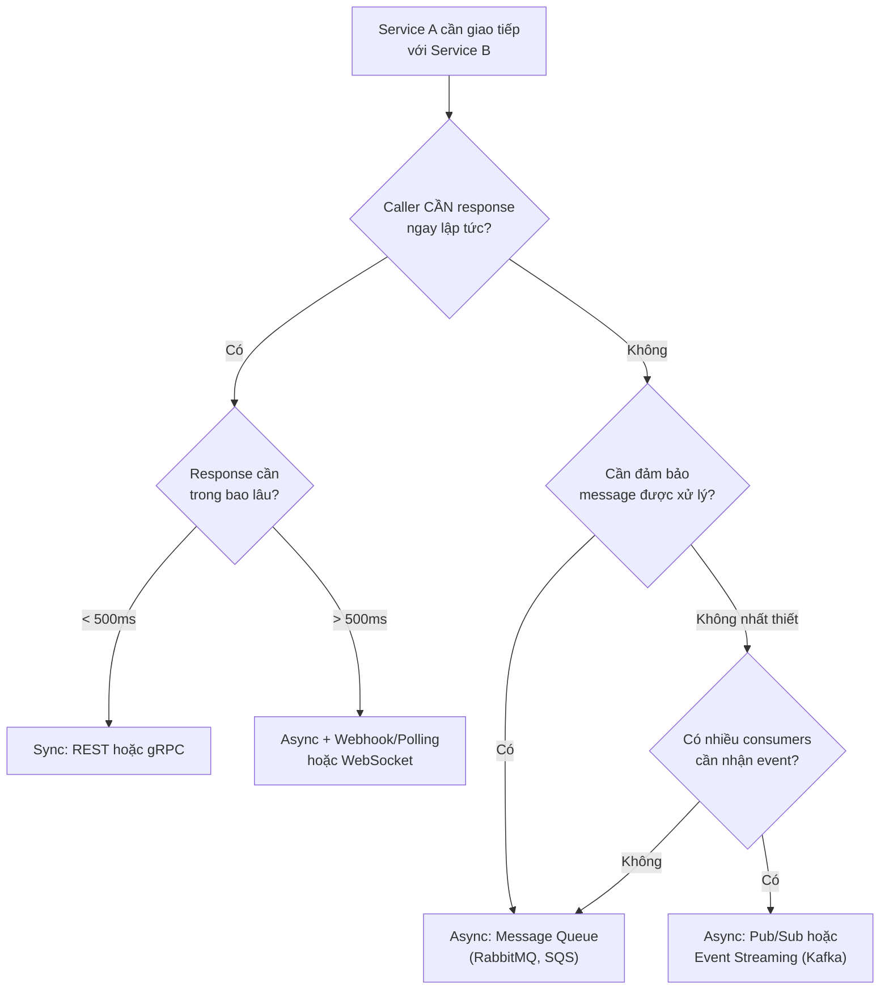
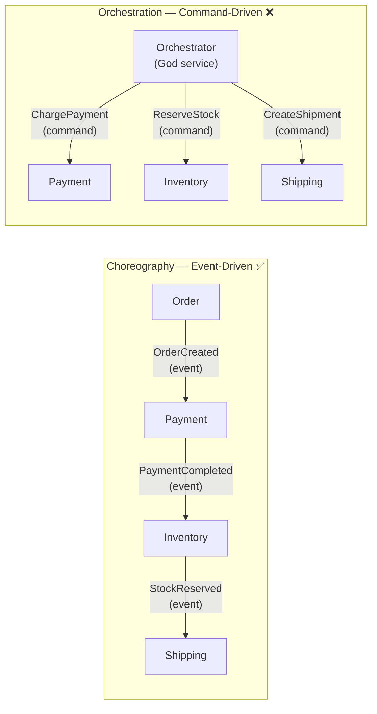

# Inter-Service Communication — Giao tiếp giữa các Service

## 📋 Mục lục

- [1. Giới thiệu](#1-giới-thiệu)
- [2. Synchronous Communication — Giao tiếp đồng bộ](#2-synchronous-communication--giao-tiếp-đồng-bộ)
  - [2.1. REST (HTTP/JSON)](#21-rest-httpjson)
  - [2.2. gRPC (HTTP/2 + Protobuf)](#22-grpc-http2--protobuf)
  - [2.3. GraphQL](#23-graphql)
  - [2.4. So sánh REST vs gRPC vs GraphQL](#24-so-sánh-rest-vs-grpc-vs-graphql)
- [3. Asynchronous Communication — Giao tiếp bất đồng bộ](#3-asynchronous-communication--giao-tiếp-bất-đồng-bộ)
  - [3.1. Tại sao cần Async?](#31-tại-sao-cần-async)
  - [3.2. Message Queue — Point-to-Point](#32-message-queue--point-to-point)
  - [3.3. Pub/Sub — Publish/Subscribe](#33-pubsub--publishsubscribe)
  - [3.4. Event Streaming — Event Log](#34-event-streaming--event-log)
  - [3.5. So sánh Message Queue vs Pub/Sub vs Event Streaming](#35-so-sánh-message-queue-vs-pubsub-vs-event-streaming)
- [4. Synchronous vs Asynchronous — Khi nào dùng gì?](#4-synchronous-vs-asynchronous--khi-nào-dùng-gì)
  - [4.1. Decision Framework](#41-decision-framework)
  - [4.2. Ví dụ thực tế — E-Commerce Order Flow](#42-ví-dụ-thực-tế--e-commerce-order-flow)
- [5. Event-Driven Architecture](#5-event-driven-architecture)
  - [5.1. Event-Driven là gì?](#51-event-driven-là-gì)
  - [5.2. Event types — Domain Event vs Integration Event](#52-event-types--domain-event-vs-integration-event)
  - [5.3. Choreography vs Orchestration — Phân biệt rõ ràng](#53-choreography-vs-orchestration--phân-biệt-rõ-ràng)
  - [5.4. Ví dụ thực tế — Food Delivery](#54-ví-dụ-thực-tế--food-delivery)
- [6. Communication Patterns nâng cao](#6-communication-patterns-nâng-cao)
  - [6.1. Request-Reply qua Message Queue](#61-request-reply-qua-message-queue)
  - [6.2. Saga Pattern (giới thiệu)](#62-saga-pattern-giới-thiệu)
  - [6.3. Outbox Pattern](#63-outbox-pattern)
  - [6.4. Dead Letter Queue](#64-dead-letter-queue)
- [7. Serialization Formats](#7-serialization-formats)
- [8. Anti-patterns](#8-anti-patterns)
- [9. Checklist chọn Communication Style](#9-checklist-chọn-communication-style)
- [10. Tổng kết](#10-tổng-kết)
- [11. Liên kết liên quan](#11-liên-kết-liên-quan)

---

## 1. Giới thiệu

Trong các doc trước, chúng ta đã tìm hiểu cách **tách service** ([doc 05](05-decomposition-strategies.md)) và đảm bảo **tính độc lập** ([doc 04](04-autonomy-independence.md)). Nhưng dù độc lập đến mấy, các service vẫn cần **giao tiếp** với nhau để hoàn thành nghiệp vụ.

Cách các service giao tiếp là **quyết định thiết kế quan trọng nhất** — nó ảnh hưởng trực tiếp đến **hiệu năng**, **reliability**, và **mức độ coupling** của hệ thống (xem [doc 03](03-loose-coupling-high-cohesion.md)).

```
┌──────────────────────────────────────────────────────────────────┐
│           INTER-SERVICE COMMUNICATION LANDSCAPE                  │
│                                                                  │
│   ┌───────────────────────────┐ ┌───────────────────────────┐    │
│   │    SYNCHRONOUS            │ │    ASYNCHRONOUS           │    │
│   │    (Request-Response)     │ │    (Fire & Forget / Event)│    │
│   │                           │ │                           │    │
│   │  ┌───────┐  ┌───────┐     │ │  ┌───────┐  ┌───────┐     │    │
│   │  │ REST  │  │ gRPC  │     │ │  │Message│  │Pub/Sub│     │    │
│   │  │(HTTP) │  │(HTTP/2)│    │ │  │ Queue │  │       │     │    │
│   │  └───────┘  └───────┘     │ │  └───────┘  └───────┘     │    │
│   │  ┌───────┐                │ │  ┌───────┐                │    │
│   │  │GraphQL│                │ │  │Event  │                │    │
│   │  │       │                │ │  │Stream │                │    │
│   │  └───────┘                │ │  └───────┘                │    │
│   │                           │ │                           │    │
│   │  Caller CHỜ response      │ │  Caller KHÔNG CHỜ         │    │
│   │  Coupling: CAO hơn        │ │  Coupling: THẤP hơn       │    │
│   │  Đơn giản hơn             │ │  Phức tạp hơn             │    │
│   └───────────────────────────┘ └───────────────────────────┘    │
└──────────────────────────────────────────────────────────────────┘
```

---

## 2. Synchronous Communication — Giao tiếp đồng bộ

Service A gọi Service B và **chờ response** trước khi tiếp tục. Giống như gọi điện thoại — hai bên phải **cùng online**.

```
Synchronous — Request / Response:

  Service A                    Service B
     │                            │
     │──── Request ──────────────▶│
     │        (chờ...)            │ (xử lý)
     │◀──── Response ─────────────│
     │                            │
     │  Tiếp tục xử lý           │
     ▼                            │
```

### 2.1. REST (HTTP/JSON)

**REST** (Representational State Transfer) là phong cách giao tiếp phổ biến nhất trong microservice, sử dụng HTTP methods và JSON.

```
REST API — Các HTTP Methods:
────────────────────────────

GET    /api/products              → Lấy danh sách products
GET    /api/products/123          → Lấy product có id=123
POST   /api/products              → Tạo product mới
PUT    /api/products/123          → Cập nhật toàn bộ product 123
PATCH  /api/products/123          → Cập nhật 1 phần product 123
DELETE /api/products/123          → Xóa product 123

Ví dụ request & response:
─────────────────────────

Request:
  POST /api/orders HTTP/1.1
  Content-Type: application/json
  Authorization: Bearer eyJhbGciOi...
  
  {
    "productId": 123,
    "quantity": 2,
    "shippingAddress": "123 Nguyen Hue, HCM"
  }

Response:
  HTTP/1.1 201 Created
  Content-Type: application/json
  
  {
    "id": 456,
    "status": "CREATED",
    "totalAmount": 500000,
    "createdAt": "2026-02-23T10:30:00Z"
  }
```

**REST Maturity Model** (Richardson):

| Level | Tên | Mô tả | Ví dụ |
|-------|-----|--------|-------|
| **0** | The Swamp of POX | 1 URL, 1 method POST cho mọi thứ | `POST /api` với action trong body |
| **1** | Resources | URL riêng cho mỗi resource, nhưng chỉ dùng POST | `POST /api/orders`, `POST /api/products` |
| **2** | HTTP Verbs | Dùng đúng HTTP methods (GET, POST, PUT, DELETE) | `GET /api/orders/123`, `DELETE /api/orders/123` |
| **3** | HATEOAS | Response chứa links tới các action tiếp theo | Response có `"links": [{"rel": "cancel", "href": "/orders/123/cancel"}]` |

> **Thực tế**: Hầu hết microservice dùng REST **Level 2**. HATEOAS (Level 3) hiếm khi được implement vì overhead cao, lợi ích ít trong internal communication.

**Ưu và nhược:**

| ✅ Ưu điểm | ❌ Nhược điểm |
|------------|--------------|
| Đơn giản, mọi developer đều biết | Text-based (JSON) → payload lớn hơn binary |
| Tooling phong phú (Postman, Swagger) | HTTP/1.1 → 1 connection = 1 request tại 1 thời điểm |
| Stateless — dễ scale | Không có contract mạnh (schema optional) |
| Human-readable | Không hỗ trợ streaming natively |
| Firewall-friendly (port 80/443) | |

### 2.2. gRPC (HTTP/2 + Protobuf)

**gRPC** (Google Remote Procedure Call) sử dụng **HTTP/2** và **Protocol Buffers** (Protobuf) — binary serialization format.

```
gRPC vs REST — Khác biệt cốt lõi:
───────────────────────────────────

REST:                               gRPC:
  HTTP/1.1                            HTTP/2
  Text (JSON)                         Binary (Protobuf)
  Loose contract (OpenAPI optional)   Strict contract (.proto file BẮT BUỘC)
  Unary only                          Unary + Streaming
  Mọi ngôn ngữ đều hỗ trợ sẵn        Cần generate code từ .proto
```

**Protobuf definition file (.proto):**

```
// order_service.proto

syntax = "proto3";

package order;

service OrderService {
  // Unary RPC — giống REST: 1 request → 1 response
  rpc CreateOrder(CreateOrderRequest) returns (OrderResponse);
  rpc GetOrder(GetOrderRequest) returns (OrderResponse);
  
  // Server streaming — server gửi nhiều response
  rpc TrackOrder(TrackOrderRequest) returns (stream OrderStatus);
  
  // Client streaming — client gửi nhiều request
  rpc UploadOrderItems(stream OrderItem) returns (UploadSummary);
  
  // Bidirectional streaming — cả hai chiều
  rpc OrderChat(stream ChatMessage) returns (stream ChatMessage);
}

message CreateOrderRequest {
  int64 product_id = 1;
  int32 quantity = 2;
  string shipping_address = 3;
}

message OrderResponse {
  int64 id = 1;
  string status = 2;
  int64 total_amount = 3;
}
```

**4 loại RPC trong gRPC:**

```
1. Unary (1:1) — Giống REST
   Client ──Request──▶ Server
   Client ◀──Response── Server

2. Server Streaming (1:N) — Server gửi nhiều response
   Client ──Request──▶ Server
   Client ◀──Response 1── Server
   Client ◀──Response 2── Server
   Client ◀──Response N── Server
   
   Use case: Real-time tracking, live feed

3. Client Streaming (N:1) — Client gửi nhiều request
   Client ──Request 1──▶ Server
   Client ──Request 2──▶ Server
   Client ──Request N──▶ Server
   Client ◀──Response── Server
   
   Use case: Upload batch data, log streaming

4. Bidirectional Streaming (N:N) — Cả hai chiều
   Client ◀──▶ Server (cùng lúc)
   
   Use case: Chat, real-time collaboration
```

**Ưu và nhược:**

| ✅ Ưu điểm | ❌ Nhược điểm |
|------------|--------------|
| Binary → nhanh hơn JSON **2-10x** | Không human-readable (debug khó hơn) |
| HTTP/2 → multiplexing, header compression | Browser support hạn chế (cần gRPC-Web proxy) |
| Strict contract (.proto) → ít lỗi integration | Cần generate code → thêm bước build |
| Streaming support native | Firewall/proxy có thể block HTTP/2 |
| Code generation cho nhiều ngôn ngữ | Learning curve cao hơn REST |

### 2.3. GraphQL

**GraphQL** cho phép client **chỉ lấy đúng data mình cần** thay vì nhận toàn bộ response cố định.

```
Vấn đề của REST — Over-fetching & Under-fetching:
──────────────────────────────────────────────────

Over-fetching: Lấy quá nhiều data
  GET /api/users/123
  Response: { id, name, email, phone, address, avatar, bio, 
              createdAt, settings, preferences, ... }
  → Client chỉ cần name và avatar → lãng phí bandwidth

Under-fetching: Phải gọi nhiều API
  GET /api/users/123           → lấy user info
  GET /api/users/123/orders    → lấy orders
  GET /api/orders/456/items    → lấy order items
  → 3 round-trips cho 1 trang → chậm

GraphQL giải quyết cả hai:
  POST /graphql
  {
    query {
      user(id: 123) {
        name
        avatar
        orders(last: 5) {
          id
          status
          items {
            productName
            price
          }
        }
      }
    }
  }
  → 1 request, chỉ lấy đúng fields cần → nhanh
```

**Ưu và nhược:**

| ✅ Ưu điểm | ❌ Nhược điểm |
|------------|--------------|
| Client quyết định data shape → flexible | Phức tạp ở server (resolver, N+1 query problem) |
| 1 endpoint, 1 request → giảm round-trips | Caching khó hơn REST (không dùng HTTP cache dễ dàng) |
| Strong typing (schema) | Security: phải giới hạn query depth, complexity |
| Self-documenting (introspection) | Overkill cho service-to-service đơn giản |

> **Trong Microservice**: GraphQL thường dùng ở **API Gateway / BFF layer** (client → gateway). Service-to-service thường dùng **REST hoặc gRPC**.

### 2.4. So sánh REST vs gRPC vs GraphQL

| Tiêu chí | REST | gRPC | GraphQL |
|----------|------|------|---------|
| **Protocol** | HTTP/1.1 (hoặc 2) | HTTP/2 | HTTP/1.1 (hoặc 2) |
| **Format** | JSON (text) | Protobuf (binary) | JSON (text) |
| **Contract** | OpenAPI (optional) | .proto (bắt buộc) | Schema (bắt buộc) |
| **Performance** | Trung bình | Cao nhất | Trung bình |
| **Streaming** | Không (cần WebSocket) | Có (4 loại) | Có (Subscription) |
| **Browser support** | Tốt nhất | Cần proxy (gRPC-Web) | Tốt |
| **Learning curve** | Thấp | Trung bình | Trung bình–Cao |
| **Tooling** | Rất phong phú | Đang phát triển | Phong phú |
| **Phù hợp cho** | Public API, CRUD services | Service-to-service nội bộ, high-perf | Client-facing API, BFF |
| **Khi nào chọn** | Mặc định, đơn giản nhất | Cần tốc độ, streaming, strict contract | Client cần flexible query |

```
Chọn nhanh:
────────────

Public API cho external clients?          → REST
Service-to-service nội bộ, cần nhanh?     → gRPC
Client cần flexible data fetching?        → GraphQL (ở API Gateway)
Không biết chọn gì?                       → REST (safe default)
```

---

## 3. Asynchronous Communication — Giao tiếp bất đồng bộ

### 3.1. Tại sao cần Async?

Service A gửi message và **không chờ** response. Giống như gửi email — bạn gửi xong rồi làm việc khác, người nhận xử lý khi nào tùy họ.

```
Vấn đề của Sync:
────────────────

  Order Service          Payment Service        Inventory Service
       │                       │                       │
       │── Charge $100 ──────▶ │                       │
       │     (chờ 200ms...)    │ (xử lý)               │
       │◀── OK ────────────────│                       │
       │                       │                       │
       │── Reserve stock ─────────────────────────────▶│
       │     (chờ 150ms...)                            │ (xử lý)
       │◀── OK ────────────────────────────────────────│
       │                                               │
       │  Tổng latency: 350ms                          │
       │  Nếu Payment down → Order CŨNG down ❌        │
       │  Temporal coupling: cả 3 phải CÙNG online     │

Async giải quyết:
─────────────────

  Order Service          Message Broker         Consumers
       │                    ┌──────┐              │
       │── OrderCreated ──▶ │      │              │
       │   (không chờ)      │      │──▶ Payment Service
       │   Latency: 5ms     │      │──▶ Inventory Service
       │                    │      │──▶ Notification Service
       │  Tiếp tục xử lý    └──────┘              │
       │                                          │
       │  Payment down? → Message chờ trong queue │
       │  → Xử lý khi Payment sống lại ✅         │
```

### 3.2. Message Queue — Point-to-Point

**Message Queue**: Producer gửi message vào queue, **1 consumer** nhận và xử lý.

```
Point-to-Point: 1 message → 1 consumer

  Producer ──▶ ┌───────────────────┐ ──▶ Consumer
               │ Queue             │
               │ [msg1][msg2][msg3]│
               └───────────────────┘

  • Message được xóa sau khi consumer xử lý (acknowledge)
  • Nếu có nhiều consumers → mỗi message chỉ đến 1 consumer (load balance)
  • Message ordering: FIFO (thường là best-effort, không guarantee tuyệt đối)

Ví dụ: Email sending
  Order Service ──▶ [email-queue] ──▶ Email Worker
                     "Gửi email xác nhận đơn #456"

  → Chỉ 1 worker xử lý, tránh gửi trùng

Tools: RabbitMQ, Amazon SQS, ActiveMQ
```

### 3.3. Pub/Sub — Publish/Subscribe

**Pub/Sub**: Publisher gửi event vào topic, **tất cả subscribers** đều nhận được.

```
Pub/Sub: 1 event → N subscribers

  Publisher ──▶ ┌──────────┐ ──▶ Subscriber A (Payment)
                │  Topic:  │ ──▶ Subscriber B (Inventory)
                │  order.  │ ──▶ Subscriber C (Notification)
                │  created │ ──▶ Subscriber D (Analytics)
                └──────────┘

  • Message KHÔNG bị xóa khi 1 subscriber đọc
  • Mỗi subscriber có cursor/offset riêng
  • Thêm subscriber mới KHÔNG ảnh hưởng publisher
  • Publisher không biết (và không cần biết) có bao nhiêu subscribers

Ví dụ: Order Created Event
  Order Service publish: OrderCreated { orderId: 456, userId: 123, amount: 500000 }
  
  → Payment Service:      Charge tiền
  → Inventory Service:    Reserve stock
  → Notification Service: Gửi email xác nhận
  → Analytics Service:    Track conversion
  
  Order Service KHÔNG cần biết có 4 subscribers

Tools: Apache Kafka, Google Pub/Sub, Amazon SNS, Redis Streams
```

### 3.4. Event Streaming — Event Log

**Event Streaming**: Giống Pub/Sub nhưng message được **lưu lại vĩnh viễn** (hoặc lâu dài) như một log. Consumer có thể **replay** từ bất kỳ thời điểm nào.

```
Event Streaming (Event Log):
────────────────────────────

  Producer ──▶ ┌──────────────────────────────────────┐
               │ Topic: orders                        │
               │                                      │
               │ Offset 0: OrderCreated {id:1}        │
               │ Offset 1: OrderCreated {id:2}        │
               │ Offset 2: OrderPaid {id:1}           │
               │ Offset 3: OrderShipped {id:1}        │
               │ Offset 4: OrderCreated {id:3}        │
               │ ...                                  │
               │ (messages KHÔNG bị xóa)              │
               └──────────┬───────────────────────────┘
                          │
          ┌───────────────┼───────────────┐
          │               │               │
   Consumer A          Consumer B      Consumer C
   (offset: 4)        (offset: 2)     (offset: 0)
   Đã đọc hết         Đang đọc        Mới join,
                       bắt kịp         replay từ đầu

Khác biệt với Pub/Sub thông thường:
  • Messages lưu lại → consumer mới có thể đọc từ quá khứ
  • Replay: Consumer có thể "quay lại" đọc từ offset bất kỳ
  • Time-based retention: giữ messages 7 ngày, 30 ngày, hoặc forever

Use cases:
  • Event Sourcing (lưu toàn bộ lịch sử thay đổi)
  • Data pipeline (ETL, analytics)
  • Audit log
  • Rebuild state (new service đọc lại toàn bộ events để build state)

Tools: Apache Kafka, Amazon Kinesis, Redpanda, Apache Pulsar
```

### 3.5. So sánh Message Queue vs Pub/Sub vs Event Streaming

| Tiêu chí | Message Queue | Pub/Sub | Event Streaming |
|----------|---------------|---------|-----------------|
| **Consumer model** | 1 message → 1 consumer | 1 message → N subscribers | 1 message → N consumers + replay |
| **Message sau khi đọc** | Xóa (acknowledge) | Xóa sau TTL | Giữ lại (retention) |
| **Replay** | ❌ Không | ❌ Thường không | ✅ Có |
| **Ordering** | FIFO (queue level) | Không guarantee | Ordering trong partition |
| **Use case** | Task distribution, work queue | Event notification, fan-out | Event sourcing, data pipeline, audit |
| **Ví dụ tool** | RabbitMQ, SQS | Google Pub/Sub, SNS | Kafka, Kinesis |
| **Throughput** | Trung bình | Cao | Rất cao |

---

## 4. Synchronous vs Asynchronous — Khi nào dùng gì?

### 4.1. Decision Framework



| Scenario | Chọn | Lý do |
|----------|------|-------|
| Lấy thông tin product để hiển thị | **Sync (REST/gRPC)** | Cần data ngay để render UI |
| Gửi email xác nhận đơn hàng | **Async (Queue)** | Không cần gửi ngay, retry nếu lỗi |
| Thông báo "đơn hàng đã tạo" cho nhiều service | **Async (Pub/Sub)** | Fan-out cho Payment, Inventory, Notification |
| Real-time order tracking | **Streaming (gRPC/WebSocket)** | Cần push update liên tục |
| Data pipeline từ order → analytics | **Event Streaming (Kafka)** | Cần replay, high throughput |
| Thanh toán (cần biết kết quả ngay) | **Sync (REST)** | User chờ xem thanh toán thành công hay không |
| Xử lý ảnh sau khi upload | **Async (Queue)** | Heavy processing, user không cần chờ |

### 4.2. Ví dụ thực tế — E-Commerce Order Flow

```
┌─────────────────────────────────────────────────────────────────┐
│         E-COMMERCE ORDER FLOW — MIXED COMMUNICATION             │
│                                                                 │
│  User click "Đặt hàng"                                          │
│       │                                                         │
│       ▼                                                         │
│  ┌─────────────┐                                                │
│  │ API Gateway │                                                │
│  └──────┬──────┘                                                │
│         │ REST (sync)                                           │
│         ▼                                                       │
│  ┌─────────────┐    gRPC (sync)     ┌─────────────┐             │
│  │   Order     │───────────────────▶│  Product    │             │
│  │   Service   │  "Lấy giá, check   │  Service    │             │
│  │             │   còn hàng không?" │             │             │
│  │             │◀────────────────── │             │             │
│  │             │                    └─────────────┘             │
│  │             │                                                │
│  │             │    REST (sync)     ┌─────────────┐             │
│  │             │───────────────────▶│  Payment    │             │
│  │             │  "Charge $100"     │  Service    │             │
│  │             │◀──── OK ────────── │             │             │
│  │             │                    └─────────────┘             │
│  │             │                                                │
│  │             │─── Publish Event ─────────────────────┐        │
│  │             │    "OrderCreated"                     │        │
│  └─────────────┘                                       │        │
│         │                                              │        │
│    Response to user:                                   ▼        │
│    "Đơn hàng #456                            ┌──────────┐     │
│     đã được tạo"                               │  Kafka   │     │
│                                                │  Topic:  │     │
│                                                │  orders  │     │
│                                                └────┬─────┘     │
│                                                     │           │
│                              ┌───────────────┬──────┴────┐      │
│                              ▼               ▼           ▼      │
│                        ┌──────────┐   ┌──────────┐ ┌──────────┐ │
│                        │Inventory │   │  Notif.  │ │Analytics │ │
│                        │ Service  │   │ Service  │ │ Service  │ │
│                        │          │   │          │ │          │ │
│                        │Reserve   │   │Gửi email │ │Track     │ │
│                        │stock     │   │xác nhận  │ │conversion│ │
│                        └──────────┘   └──────────┘ └──────────┘ │
│                                                                 │
│  Sync:  Order → Product (cần giá ngay)                          │
│         Order → Payment (cần kết quả charge ngay)               │
│  Async: Order → Inventory, Notification, Analytics              │
│         (không cần chờ, xử lý background)                       │
└─────────────────────────────────────────────────────────────────┘
```

---

## 5. Event-Driven Architecture

### 5.1. Event-Driven là gì?

**Event-Driven Architecture** (EDA) là kiến trúc mà các service giao tiếp bằng cách **phát ra events** (sự kiện) khi có thay đổi, thay vì gọi trực tiếp service khác.

```
Khác biệt tư duy:
──────────────────

Command-Driven (imperative):        Event-Driven (reactive):
"Hãy làm việc này"                  "Việc này ĐÃ XẢY RA"

Order Service:                      Order Service:
  → gọi Payment.charge()             → publish OrderCreated event
  → gọi Inventory.reserve()          
  → gọi Notification.send()         Payment Service: "Ồ, có order mới → charge"
                                    Inventory: "Ồ, có order mới → reserve"
                                    Notification: "Ồ, có order mới → email"

Order Service BIẾT về 3 service      Order Service KHÔNG BIẾT ai đang lắng nghe
→ Tight coupling                    → Loose coupling
```

### 5.2. Event types — Domain Event vs Integration Event

| | Domain Event | Integration Event |
|---|---|---|
| **Scope** | Bên trong 1 service (internal) | Giữa các services (external) |
| **Audience** | Các aggregate/module trong cùng service | Các service khác |
| **Transport** | In-memory (event bus nội bộ) | Message broker (Kafka, RabbitMQ) |
| **Schema** | Internal model, có thể thay đổi tự do | Public contract, phải backward compatible |
| **Ví dụ** | `OrderItemAdded` (internal) | `OrderCreated` (publish ra ngoài) |

```
Order Service nội bộ:
─────────────────────

  User Action         Domain Events              Integration Event
  ───────────         ─────────────              ─────────────────
  "Tạo đơn hàng"  →  OrderItemAdded (internal)
                  →  OrderPriceCalculated (internal)
                  →  OrderValidated (internal)
                  →  OrderCreated ─────────────▶ Publish ra Kafka
                                                  (cho service khác)

  Domain Events: xử lý logic nội bộ (tính giá, validate, etc.)
  Integration Event: thông báo cho thế giới bên ngoài
```

### 5.3. Choreography vs Orchestration — Phân biệt rõ ràng

> ⚠️ **Lưu ý quan trọng**: Orchestration **KHÔNG phải** Event-Driven. Hai mô hình này có **tư duy hoàn toàn khác nhau**, chỉ thường bị nhầm lẫn vì cùng được nhắc khi nói về workflow coordination.

```
Bản chất khác nhau:
───────────────────

CHOREOGRAPHY (Event-Driven ✅):
  Tư duy: "Việc này ĐÃ XẢY RA" (past tense, fact)
  Service publish EVENT → không biết ai lắng nghe
  Mỗi service TỰ QUYẾT ĐỊNH phản ứng khi nhận event
  → Không ai điều khiển → Loose coupling

ORCHESTRATION (Command-Driven ❌ không phải EDA):
  Tư duy: "HÃY LÀM việc này" (imperative, command)
  Orchestrator gửi COMMAND → biết rõ gửi cho ai
  Orchestrator QUYẾT ĐỊNH service nào làm gì, khi nào
  → Có "ông chủ" điều khiển → Tight coupling tập trung
```

```
CHOREOGRAPHY — Thuần Event-Driven
──────────────────────────────────
  Không có "nhạc trưởng". Mỗi service lắng nghe event và 
  TỰ BIẾT mình phải làm gì. Giống đàn chim bay: không con nào
  chỉ huy, mỗi con phản ứng theo con bên cạnh.

  Order Service publish: OrderCreated (event = sự kiện đã xảy ra)
       │
       │ (Order Service KHÔNG BIẾT ai subscribe)
       │
       ├──▶ Payment Service nghe thấy → tự charge
       │         → publish: PaymentCompleted
       │
       ├──▶ Inventory Service nghe thấy → tự reserve
       │
       └──▶ Notification Service nghe thấy → tự gửi email

  PaymentCompleted ──▶ Shipping Service nghe thấy → tự tạo shipment

  Đặc trưng:
  • Producer KHÔNG biết consumer là ai
  • Mỗi service tự chứa logic phản ứng
  • Thêm service mới = chỉ cần subscribe, KHÔNG sửa service cũ
  • KHÔNG có service nào "sở hữu" toàn bộ flow

ORCHESTRATION — Command-Driven (KHÔNG phải EDA)
──────────────────────────────────────
  Có "nhạc trưởng" (Orchestrator) ra lệnh cho từng service.
  Giống quân đội: chỉ huy ra lệnh, lính thực hiện.

  Order Orchestrator:
    1. → Payment Service: "Charge tiền"       ← COMMAND (lệnh)
    2. ← Payment: "OK"
    3. → Inventory: "Reserve stock"            ← COMMAND
    4. ← Inventory: "OK"
    5. → Shipping: "Tạo shipment"              ← COMMAND
    6. ← Shipping: "OK"

  Đặc trưng:
  • Orchestrator BIẾT RÕ từng service, gọi đích danh
  • Logic flow NẰM TẬP TRUNG trong orchestrator
  • Thêm step mới = SỬA orchestrator
  • Orchestrator "sở hữu" và điều khiển toàn bộ flow
```

**Tại sao Orchestration phá vỡ Event-Driven?**

```
Event-Driven cốt lõi:                Orchestration vi phạm:
─────────────────────                ──────────────────────

1. Producer không biết               Orchestrator biết RÕ
   consumer là ai                    từng service

2. Loose coupling —                  Tight coupling —
   services độc lập                  orchestrator phụ thuộc
                                     TẤT CẢ services

3. Reactive — service                Imperative — orchestrator
   tự quyết phản ứng                 ra lệnh phải làm gì

4. Decentralized logic —             Centralized logic —
   mỗi service giữ logic            flow logic tập trung
   của mình                          1 chỗ

5. Thêm consumer KHÔNG               Thêm step PHẢI SỬA
   cần sửa producer                  orchestrator
```



**Vậy Orchestration có xấu không? Khi nào vẫn nên dùng?**

Orchestration **không xấu** — nó chỉ không phải Event-Driven. Có những trường hợp orchestration là **lựa chọn thực tế hơn**:

| Tiêu chí | Choreography (EDA) | Orchestration (Command) |
|----------|-------------|---------------|
| **Tư duy** | Events (sự kiện đã xảy ra) | Commands (lệnh phải thực hiện) |
| **Coupling** | Rất loose | Tập trung ở orchestrator |
| **Flow đơn giản, linear** | ✅ Phù hợp nhất | Overkill |
| **Flow phức tạp, branching, conditions** | ❌ Logic phân tán, khó debug | ✅ Logic tập trung, dễ đọc |
| **Error handling / rollback** | Khó — compensating events phân tán | Dễ — orchestrator quản lý tập trung |
| **Visibility** | Khó thấy toàn cảnh (phải trace events) | Dễ — nhìn orchestrator là thấy flow |
| **Thêm service mới** | Dễ — chỉ subscribe | Phải sửa orchestrator |
| **Ví dụ phù hợp** | Notification, Analytics, Audit log | Saga (distributed transaction), phức tạp |

> **Nguyên tắc**: Ưu tiên **Choreography** (event-driven) làm mặc định. Chỉ dùng **Orchestration** khi flow **quá phức tạp** để mỗi service tự biết mình phải làm gì (ví dụ: Saga cần rollback nhiều bước). Và khi dùng Orchestration, hãy ý thức rằng bạn đang **trade-off** loose coupling để đổi lấy visibility và error handling dễ hơn.

### 5.4. Ví dụ thực tế — Food Delivery

```
┌─────────────────────────────────────────────────────────────────┐
│      FOOD DELIVERY — EVENT-DRIVEN CHOREOGRAPHY                  │
│                                                                 │
│  User đặt đồ ăn                                                 │
│       │                                                         │
│       ▼                                                         │
│  ┌──────────┐                                                   │
│  │  Order   │──publish──▶ OrderCreated                          │
│  │ Service  │            { orderId, userId, restaurantId,       │
│  └──────────┘              items, totalAmount }                 │
│                              │                                  │
│            ┌─────────────────┼─────────────────┐                │
│            ▼                 ▼                 ▼                │
│  ┌──────────────┐  ┌──────────────┐  ┌──────────────┐           │
│  │  Restaurant  │  │   Payment    │  │  Notification│           │
│  │   Service    │  │   Service    │  │   Service    │           │
│  │              │  │              │  │              │           │
│  │ "Accept /    │  │ "Charge      │  │ "Gửi push:   │           │
│  │  Reject      │  │  user"       │  │  Đang xử lý" │           │
│  │  order"      │  │              │  │              │           │
│  └──────┬───────┘  └──────┬───────┘  └──────────────┘           │
│         │                 │                                     │
│         ▼                 ▼                                     │
│  OrderAccepted       PaymentCompleted                           │
│         │                 │                                     │
│         └─────────┬───────┘                                     │
│                   ▼                                             │
│            ┌──────────────┐                                     │
│            │   Delivery   │──publish──▶ DriverAssigned          │
│            │   Service    │              { driverId, ETA }      │
│            │              │                                     │
│            │ "Assign      │                    │                │
│            │  driver gần  │                    ▼                │
│            │  nhất"       │           ┌──────────────┐          │
│            └──────┬───────┘           │  Notification│          │
│                   │                   │   Service    │          │
│                   ▼                   │              │          │
│            DriverPickedUp             │ "Push: Tài xế│          │
│                   │                   │  đang đến"   │          │
│                   ▼                   └──────────────┘          │
│            OrderDelivered                                       │
│                   │                                             │
│            ┌──────┴──────┐                                      │
│            ▼             ▼                                      │
│    ┌──────────────┐ ┌──────────────┐                            │
│    │   Payment    │ │  Notification│                            │
│    │   Service    │ │   Service    │                            │
│    │              │ │              │                            │
│    │ "Release     │ │ "Push: Đã    │                            │
│    │  payment to  │ │  giao xong!" │                            │
│    │  restaurant" │ │              │                            │
│    └──────────────┘ └──────────────┘                            │
└─────────────────────────────────────────────────────────────────┘
```

---

## 6. Communication Patterns nâng cao

### 6.1. Request-Reply qua Message Queue

Khi cần **response** nhưng vẫn muốn **decouple** qua message broker:

```
Request-Reply Pattern:
──────────────────────

  Service A                    Broker                    Service B
     │                          │                           │
     │── Request msg ──────────▶│                           │
     │   (replyTo: "queue-A")   │── Forward ───────────────▶│
     │                          │                           │ (xử lý)
     │                          │◀── Reply msg ─────────────│
     │◀── Response ─────────────│   (to: "queue-A")         │
     │                          │                           │

  • Service A gửi request kèm "replyTo" queue
  • Service B xử lý xong, gửi response về replyTo queue
  • Service A lắng nghe replyTo queue để nhận response
  • Correlation ID để match request–response

Khi nào dùng:
  • Cần response nhưng muốn buffer qua broker
  • Muốn retry/resilience của message queue
  • Chấp nhận latency cao hơn sync call
```

### 6.2. Saga Pattern (giới thiệu)

**Saga** quản lý distributed transaction qua chuỗi local transactions + compensating actions:

```
Saga — Place Order:
───────────────────

Happy path:
  1. Order Service:    Create order (PENDING)        ✅
  2. Payment Service:  Charge money                  ✅
  3. Inventory Service: Reserve stock                ✅
  4. Order Service:    Update order (CONFIRMED)      ✅

Failure (step 3 fails):
  1. Order Service:    Create order (PENDING)        ✅
  2. Payment Service:  Charge money                  ✅
  3. Inventory Service: Reserve stock                ❌ FAIL
  → Compensate:
  2'. Payment Service: REFUND money                  ↩️
  1'. Order Service:   Update order (CANCELLED)      ↩️
  
  Mỗi step thất bại → chạy compensating action ngược lại
```

> **Chi tiết**: Saga Pattern sẽ được trình bày kỹ trong [doc 09 — Data Management](09-data-management.md).

### 6.3. Outbox Pattern

**Vấn đề**: Khi service cần **cập nhật DB** VÀ **publish event** — làm sao đảm bảo cả hai đều xảy ra (hoặc đều không)?

```
❌ Vấn đề — Dual Write:
──────────────────────

  Order Service:
    1. Save order to DB         ✅ Thành công
    2. Publish OrderCreated     ❌ Broker down → event bị mất!
    
  → DB có order nhưng không ai biết → data inconsistency

✅ Outbox Pattern — Giải pháp:
──────────────────────────────

  Order Service:
    1. BEGIN TRANSACTION
       - INSERT INTO orders (...) 
       - INSERT INTO outbox (event_type, payload)   ← cùng transaction
    2. COMMIT TRANSACTION
    
  Outbox Publisher (background worker):
    - Poll bảng outbox
    - Publish event lên broker
    - Mark as published

  ┌──────────────────────────────────────────────────┐
  │              Order Service                       │
  │                                                  │
  │  ┌────────────┐     ┌────────────┐               │
  │  │  orders    │     │   outbox   │               │
  │  │  table     │     │   table    │               │
  │  │            │     │            │               │
  │  │ id: 456    │     │ id: 1      │               │
  │  │ status:    │     │ type:      │               │
  │  │  CREATED   │     │ OrderCrtd  │               │
  │  └────────────┘     │ payload:   │               │
  │                     │  {id:456}  │               │
  │   Cùng 1 DB         │ published: │               │
  │   transaction!      │  false     │               │
  │                     └─────┬──────┘               │
  │                           │                      │
  │                  Outbox Publisher                │
  │                  (poll + publish)                │
  │                           │                      │
  └───────────────────────────┼──────────────────────┘
                              │
                              ▼
                       ┌──────────┐
                       │  Kafka   │
                       │  Broker  │
                       └──────────┘

  → Đảm bảo: DB write + event publish LUÔN consistent
  → Tradeoff: At-least-once delivery (consumer cần idempotent)
```

### 6.4. Dead Letter Queue

**Dead Letter Queue** (DLQ) chứa messages **không thể xử lý** sau nhiều lần retry:

```
Dead Letter Queue:
──────────────────

  Producer ──▶ Main Queue ──▶ Consumer
                   │              │
                   │         ❌ Lỗi (lần 1)
                   │◀─ Retry ────┘
                   │──▶ Consumer
                   │         ❌ Lỗi (lần 2)
                   │◀─ Retry ────┘
                   │──▶ Consumer
                   │         ❌ Lỗi (lần 3 — max retries)
                   │              │
                   │         Move to DLQ
                   │              │
                   │              ▼
                   │     ┌─────────────┐
                   │     │ Dead Letter │ → Alert team
                   │     │   Queue     │ → Manual review
                   │     │             │ → Fix & replay
                   │     └─────────────┘

Tại sao cần DLQ:
  • Tránh "poison message" block cả queue
  • Không mất message (giữ lại để xử lý sau)
  • Alert team khi có lỗi bất thường
  • Có thể replay DLQ messages sau khi fix bug
```

---

## 7. Serialization Formats

Khi gửi data giữa services, cần **serialize** (chuyển object → bytes) và **deserialize** (bytes → object):

| Format | Loại | Size | Speed | Human-readable | Schema | Phù hợp |
|--------|------|------|-------|:--------------:|--------|---------|
| **JSON** | Text | Lớn | Chậm | ✅ | Optional (JSON Schema) | REST API, config, log |
| **Protobuf** | Binary | Nhỏ nhất | Nhanh nhất | ❌ | Bắt buộc (.proto) | gRPC, internal high-perf |
| **Avro** | Binary | Nhỏ | Nhanh | ❌ | Bắt buộc (JSON schema) | Kafka events, data pipeline |
| **MessagePack** | Binary | Nhỏ | Nhanh | ❌ | Không | Thay thế JSON khi cần nhanh hơn |
| **XML** | Text | Rất lớn | Chậm | ✅ | XSD | Legacy systems, SOAP |

```
So sánh kích thước cùng 1 data:
───────────────────────────────

JSON (95 bytes):
  {"id":123,"name":"iPhone 15","price":29990000,"inStock":true}

Protobuf (~30 bytes):
  08 7B 12 09 69 50 68 6F 6E 65 20 31 35 18 E0 C7 ...
  
  → Protobuf nhỏ hơn ~3x so với JSON

Avro (~35 bytes):
  (tương tự binary, schema lưu riêng trong Schema Registry)
```

> **Khuyến nghị**: JSON cho REST public API, Protobuf cho gRPC internal, Avro cho Kafka events.

---

## 8. Anti-patterns

| Anti-pattern | Mô tả | Triệu chứng | Cách fix |
|-------------|--------|-------------|----------|
| **Chatty Services** | Service gọi nhau quá nhiều lần cho 1 operation | 1 user request → 20+ internal calls, latency cao | Batch API, BFF pattern, hoặc gộp service |
| **Sync Chain** | Service A → B → C → D (sync chain dài) | Latency = tổng latency cả chain, 1 service down = cả chain down | Dùng async cho các bước không cần response ngay |
| **Temporal Coupling** | Tất cả services phải online cùng lúc | Hệ thống down khi 1 service down | Dùng message queue để decouple |
| **God Event** | 1 event chứa quá nhiều data | Event payload 10KB+, consumer phải parse nhiều field không cần | Tách thành nhiều events nhỏ, consumer chỉ subscribe events cần |
| **Event Versioning Ignored** | Thay đổi event schema không backward compatible | Consumer cũ parse lỗi event mới | Schema Registry (Avro), versioned events |
| **No Idempotency** | Consumer xử lý duplicate message 2 lần | Charge tiền 2 lần, gửi 2 email | Idempotency key, deduplication |
| **Distributed Monolith** | Sync calls everywhere, shared DB | Deploy 1 service → phải test lại tất cả | Async communication, database per service |

```
❌ Sync Chain (Temporal Coupling):

  Client → API GW → Order → Payment → Fraud → Bank API
                                                  │
  Latency: 50 + 100 + 80 + 200 = 430ms           │
  Nếu Fraud down: toàn bộ flow CHẾT                │

✅ Hybrid Sync + Async:

  Client → API GW → Order ──sync──▶ Payment (cần kết quả)
                       │
                       └──async──▶ Fraud Check (background)
                       └──async──▶ Notification
                       └──async──▶ Analytics

  Latency: 50 + 100 = 150ms
  Fraud down? → Order vẫn tạo, fraud check sau
```

---

## 9. Checklist chọn Communication Style

```
TRƯỚC KHI CHỌN — Trả lời các câu hỏi:

Về tính chất giao tiếp:
  □ Caller có CẦN response ngay không?
    → Có: Sync (REST/gRPC)
    → Không: Async (Queue/Pub-Sub)
  
  □ Có nhiều consumers cần nhận cùng 1 event?
    → Có: Pub/Sub hoặc Event Streaming
    → Không: Point-to-Point Queue
  
  □ Consumer cần replay events từ quá khứ?
    → Có: Event Streaming (Kafka)
    → Không: Message Queue hoặc Pub/Sub

Về performance:
  □ Latency budget là bao nhiêu?
    → < 100ms: gRPC
    → < 500ms: REST
    → Không quan trọng: Async
  
  □ Throughput cần bao nhiêu?
    → < 1000 req/s: REST đủ
    → > 10000 req/s: gRPC hoặc Kafka

Về reliability:
  □ Message KHÔNG ĐƯỢC mất?
    → Dùng persistent queue + acknowledgment
    → Outbox pattern cho dual write
  
  □ Consumer có thể nhận duplicate?
    → Phải implement idempotency
  
  □ Service downstream có thể down?
    → Dùng async + retry + DLQ
```

---

## 10. Tổng kết

```
┌──────────────────────────────────────────────────────────────────┐
│           COMMUNICATION CHEAT SHEET                              │
│                                                                  │
│  ┌─────────────────────────────────────────────────────────┐     │
│  │                    SYNCHRONOUS                          │     │
│  │                                                         │     │
│  │  REST     → Default choice, public API, CRUD            │     │
│  │  gRPC     → Internal high-perf, streaming, strict type  │     │
│  │  GraphQL  → Client-facing, flexible queries (ở Gateway) │     │
│  └─────────────────────────────────────────────────────────┘     │
│                                                                  │
│  ┌─────────────────────────────────────────────────────────┐     │
│  │                    ASYNCHRONOUS                         │     │
│  │                                                         │     │
│  │  Queue    → 1 producer → 1 consumer, task distribution  │     │
│  │  Pub/Sub  → 1 event → N subscribers, fan-out            │     │
│  │  Kafka    → Event streaming, replay, high throughput    │     │
│  └─────────────────────────────────────────────────────────┘     │
│                                                                  │
│  ┌─────────────────────────────────────────────────────────┐     │
│  │                    QUY TẮC VÀNG                         │     │
│  │                                                         │     │
│  │  1. Mặc định dùng ASYNC trừ khi CẦN response ngay       │     │
│  │  2. Sync cho QUERY, Async cho COMMAND                   │     │
│  │  3. Tránh sync chain dài > 3 services                   │     │
│  │  4. Luôn implement IDEMPOTENCY cho async consumer       │     │
│  │  5. Dùng Outbox Pattern khi cần DB write + event        │     │
│  │  6. Dead Letter Queue cho mọi async consumer            │     │
│  └─────────────────────────────────────────────────────────┘     │
└──────────────────────────────────────────────────────────────────┘
```

---

## 11. Liên kết liên quan

| Doc | Liên quan |
|-----|-----------|
| [03 - Loose Coupling & High Cohesion](03-loose-coupling-high-cohesion.md) | Communication style ảnh hưởng trực tiếp đến coupling |
| [04 - Autonomy & Independence](04-autonomy-independence.md) | Async giúp đạt autonomy cao hơn sync |
| [05 - Decomposition Strategies](05-decomposition-strategies.md) | Chọn communication sau khi tách service |
| [07 - API Gateway](07-api-gateway.md) | Gateway đứng trước services, xử lý routing & aggregation |
| [08 - Service Discovery](08-service-discovery.md) | Service cần tìm nhau trước khi giao tiếp (sync) |
| [09 - Data Management](09-data-management.md) | Saga Pattern, Event Sourcing, CQRS — liên quan chặt đến async communication |
| [10 - Resilience Patterns](10-resilience-patterns.md) | Circuit Breaker, Retry — bảo vệ sync calls |
