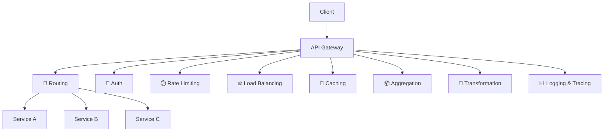
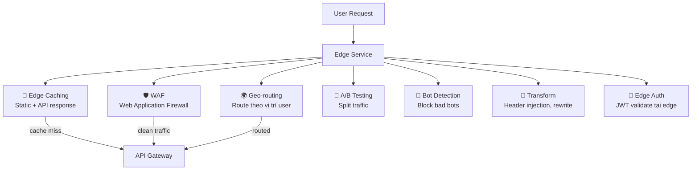

# API Gateway — Cổng vào hệ thống Microservice

## 📋 Mục lục

- [1. Giới thiệu](#1-giới-thiệu)
- [2. API Gateway là gì?](#2-api-gateway-là-gì)
  - [2.1. Vấn đề khi không có API Gateway](#21-vấn-đề-khi-không-có-api-gateway)
  - [2.2. API Gateway giải quyết gì?](#22-api-gateway-giải-quyết-gì)
  - [2.3. Vị trí của API Gateway trong kiến trúc](#23-vị-trí-của-api-gateway-trong-kiến-trúc)
- [3. Chức năng chính của API Gateway](#3-chức-năng-chính-của-api-gateway)
  - [3.1. Request Routing](#31-request-routing)
  - [3.2. API Composition / Aggregation](#32-api-composition--aggregation)
  - [3.3. Authentication & Authorization](#33-authentication--authorization)
  - [3.4. Rate Limiting & Throttling](#34-rate-limiting--throttling)
  - [3.5. Load Balancing](#35-load-balancing)
    - [Gateway có thể LB — vậy còn cần Load Balancer riêng không?](#gateway-có-thể-lb--vậy-còn-cần-load-balancer-riêng-không)
  - [3.6. Caching](#36-caching)
  - [3.7. Request/Response Transformation](#37-requestresponse-transformation)
  - [3.8. Tổng hợp chức năng](#38-tổng-hợp-chức-năng)
- [4. BFF Pattern — Backend for Frontend](#4-bff-pattern--backend-for-frontend)
  - [4.1. Vấn đề với 1 API Gateway cho tất cả](#41-vấn-đề-với-1-api-gateway-cho-tất-cả)
  - [4.2. BFF là gì?](#42-bff-là-gì)
  - [4.3. Ví dụ thực tế — E-Commerce](#43-ví-dụ-thực-tế--e-commerce)
  - [4.4. Khi nào nên / không nên dùng BFF](#44-khi-nào-nên--không-nên-dùng-bff)
- [5. API Gateway Patterns](#5-api-gateway-patterns)
  - [5.1. Single Gateway vs Multiple Gateways](#51-single-gateway-vs-multiple-gateways)
  - [5.2. Gateway Offloading](#52-gateway-offloading)
  - [5.3. Gateway Routing vs Gateway Aggregation](#53-gateway-routing-vs-gateway-aggregation)
- [6. Các giải pháp API Gateway phổ biến](#6-các-giải-pháp-api-gateway-phổ-biến)
  - [6.1. So sánh các giải pháp](#61-so-sánh-các-giải-pháp)
    - [Feature Matrix — Ai có tính năng gì?](#feature-matrix--ai-có-tính-năng-gì)
    - [Phân tích chi tiết từng giải pháp](#phân-tích-chi-tiết-từng-giải-pháp)
    - [Tổng hợp — Chọn giải pháp nào?](#tổng-hợp--chọn-giải-pháp-nào)
  - [6.2. Build vs Buy](#62-build-vs-buy)
- [7. Cross-Cutting Concerns tại Gateway](#7-cross-cutting-concerns-tại-gateway)
  - [7.1. SSL Termination](#71-ssl-termination)
  - [7.2. CORS](#72-cors)
  - [7.3. Request ID & Distributed Tracing](#73-request-id--distributed-tracing)
  - [7.4. Circuit Breaker tại Gateway](#74-circuit-breaker-tại-gateway)
- [8. Edge Service](#8-edge-service)
  - [8.1. Edge Service là gì?](#81-edge-service-là-gì)
  - [8.2. Edge Service vs API Gateway](#82-edge-service-vs-api-gateway)
  - [8.3. Chức năng của Edge Service](#83-chức-năng-của-edge-service)
  - [8.4. Các giải pháp Edge phổ biến](#84-các-giải-pháp-edge-phổ-biến)
  - [8.5. Ví dụ thực tế — E-Commerce toàn cầu](#85-ví-dụ-thực-tế--e-commerce-toàn-cầu)
  - [8.6. Khi nào cần Edge Service?](#86-khi-nào-cần-edge-service)
- [9. Anti-patterns](#9-anti-patterns)
- [10. Checklist triển khai API Gateway](#10-checklist-triển-khai-api-gateway)
- [11. Tổng kết](#11-tổng-kết)
- [12. Liên kết liên quan](#12-liên-kết-liên-quan)

---

## 1. Giới thiệu

Trong [doc 06](06-inter-service-communication.md), chúng ta đã tìm hiểu cách các service giao tiếp với nhau (REST, gRPC, Async). Nhưng câu hỏi tiếp theo là: **Client (web, mobile) nên giao tiếp với hệ thống microservice thế nào?**

Nếu client gọi trực tiếp từng service → phát sinh nhiều vấn đề. **API Gateway** là giải pháp — nó đứng giữa client và các services, đóng vai trò **"cổng vào duy nhất"** của hệ thống.

---

## 2. API Gateway là gì?

### 2.1. Vấn đề khi không có API Gateway

```
❌ Client gọi trực tiếp từng service:
──────────────────────────────────────

  Mobile App
      │
      ├── GET https://user-service:8081/api/users/123
      ├── GET https://order-service:8082/api/orders?userId=123
      ├── GET https://product-service:8083/api/products/456
      ├── GET https://review-service:8084/api/reviews?productId=456
      └── GET https://recommend-service:8085/api/recommendations/123

  Vấn đề:
  ─────────
  1. Client phải biết URL của TỪNG service → tight coupling
  2. Mỗi trang cần 5 API calls → chậm (nhất là mobile, mạng yếu)
  3. Mỗi service phải tự xử lý auth → duplicate logic
  4. Client nào cũng cần rate limiting → ai quản lý?
  5. Service đổi URL / port → phải update TẤT CẢ clients
  6. CORS, SSL cho TỪNG service → phức tạp
  7. Không có điểm chung để monitor, log, trace
```

### 2.2. API Gateway giải quyết gì?

```
✅ Có API Gateway:
──────────────────

  Mobile App
      │
      └── GET https://api.myapp.com/homepage
                      │
               ┌──────▼──────┐
               │ API Gateway │
               │             │
               │ • Auth ✓    │
               │ • Rate limit│
               │ • Route     │
               │ • Aggregate │
               │ • Cache     │
               │ • Log/Trace │
               └──────┬──────┘
                      │
         ┌────────────┼────────────┐
         ▼            ▼            ▼
    ┌─────────┐ ┌─────────┐ ┌─────────┐
    │  User   │ │  Order  │ │ Product │
    │ Service │ │ Service │ │ Service │
    └─────────┘ └─────────┘ └─────────┘

  Client chỉ biết 1 URL: api.myapp.com
  Gateway lo tất cả: auth, routing, aggregation, rate limit
```

### 2.3. Vị trí của API Gateway trong kiến trúc

```
┌─────────────────────────────────────────────────────────────────┐
│                    KIẾN TRÚC TỔNG QUAN                          │
│                                                                 │
│        External                    Internal                     │
│    ┌──────────────┐           ┌──────────────────────────┐      │
│    │              │           │                          │      │
│    │  Web App     │           │  ┌────────┐ ┌────────┐   │      │
│    │  Mobile App  │──HTTPS───▶│  │ User   │ │ Order  │   │      │
│    │  3rd Party   │           │  │ Service│ │ Service│   │      │
│    │              │    ┌──────┤  └────────┘ └────────┘   │      │
│    └──────────────┘    │      │  ┌────────┐ ┌────────┐   │      │
│                        │  API │  │Product │ │Payment │   │      │
│    DMZ / Edge          │  GW  │  │Service │ │Service │   │      │
│                        │      │  └────────┘ └────────┘   │      │
│                        └──────┤                          │      │
│                               │  Private Network         │      │
│                               └──────────────────────────┘      │
│                                                                 │
│  API Gateway nằm ở BIÊN GIỚI giữa external và internal          │
│  Client KHÔNG BAO GIỜ truy cập trực tiếp vào internal services  │
└─────────────────────────────────────────────────────────────────┘
```

---

## 3. Chức năng chính của API Gateway

### 3.1. Request Routing

Gateway nhận request từ client và **route** đến đúng service dựa trên URL path, method, header, v.v.

```
Routing Rules:
─────────────

  /api/users/**        →  User Service     (port 8081)
  /api/orders/**       →  Order Service    (port 8082)
  /api/products/**     →  Product Service  (port 8083)
  /api/payments/**     →  Payment Service  (port 8084)

Ví dụ:
  Client:  GET https://api.myapp.com/api/users/123
  Gateway: forward → http://user-service:8081/api/users/123

  Client:  POST https://api.myapp.com/api/orders
  Gateway: forward → http://order-service:8082/api/orders

Nâng cao — Route theo header / query:
  Header X-API-Version: v2  →  User Service V2
  Query ?beta=true          →  Canary deployment instance
```

### 3.2. API Composition / Aggregation

Gateway gọi **nhiều services** rồi **gộp** response trả về cho client trong **1 request duy nhất**.

```
Vấn đề: Trang "Order Detail" cần data từ 3 services
────────────────────────────────────────────────────

Không có aggregation (3 round-trips):
  Client → GET /orders/456           → Order Service
  Client → GET /users/123            → User Service
  Client → GET /products/789         → Product Service

Có aggregation (1 round-trip):
  Client → GET /order-detail/456     → API Gateway

  API Gateway:
    ┌────────────────────────────────────────┐
    │  1. GET /orders/456 → Order Service    │ ─┐
    │  2. GET /users/123  → User Service     │  │ Song song
    │  3. GET /products/789 → Product Service│ ─┘
    │                                        │
    │  4. Gộp 3 responses:                   │
    │     {                                  │
    │       "order": { id: 456, ... },       │
    │       "customer": { name: "Hiep", ...},│
    │       "product": { name: "iPhone", ...}│
    │     }                                  │
    └────────────────────────────────────────┘

  Ưu điểm: Giảm latency cho mobile (1 call thay vì 3)
  Nhược: Gateway phức tạp hơn, có thể thành bottleneck
```

### 3.3. Authentication & Authorization

Gateway xác thực **1 lần** → internal services không cần xác thực lại.

```
Auth tại Gateway:
─────────────────

  Client ──Bearer Token──▶ API Gateway
                               │
                          1. Validate JWT token
                          2. Check expiration
                          3. Extract user info
                               │
                          ┌────▼─────────────────┐
                          │ Nếu INVALID:         │
                          │ → 401 Unauthorized   │
                          └──────────────────────┘
                               │
                          ┌────▼─────────────────┐
                          │ Nếu VALID:           │
                          │ Forward request +    │
                          │ Header: X-User-Id=123│
                          │ Header: X-Roles=admin│
                          └────┬─────────────────┘
                               │
              ┌────────────────┼────────────────┐
              ▼                ▼                ▼
        ┌─────────┐     ┌─────────┐      ┌─────────┐
        │  User   │     │  Order  │      │ Product │
        │ Service │     │ Service │      │ Service │
        │         │     │         │      │         │
        │ Trust   │     │ Trust   │      │ Trust   │
        │ X-User  │     │ X-User  │      │ X-User  │
        │ header  │     │ header  │      │ header  │
        └─────────┘     └─────────┘      └─────────┘

  Internal services TRUST gateway → không cần validate
  JWT lại → giảm latency, giảm duplicate logic
```

> **Lưu ý**: Internal services vẫn cần kiểm tra **authorization** (user có quyền truy cập resource này không), nhưng **authentication** (user là ai) đã được gateway xử lý.

### 3.4. Rate Limiting & Throttling

Giới hạn số lượng request để bảo vệ backend services khỏi bị quá tải.

```
Rate Limiting Strategies:
─────────────────────────

1. Fixed Window:
   100 requests / phút cho mỗi API key
   ┌──────────────────────────────────────┐
   │ 12:00-12:01 │ 100 allowed            │
   │ 12:01-12:02 │ reset → 100 allowed    │
   └──────────────────────────────────────┘
   ⚠️ Burst vấn đề: 100 req lúc 12:00:59 + 100 req lúc 12:01:00
                    = 200 req trong 2 giây

2. Sliding Window:
   100 requests / phút, tính trượt
   → Mượt hơn, không bị burst ở biên window

3. Token Bucket:
   Bucket chứa 100 tokens, refill 10 tokens/giây
   Mỗi request tiêu 1 token
   → Cho phép burst nhỏ, smooth overall

4. Theo tier:
   ┌──────────────────────────────────────┐
   │ Free tier:     100 req/phút          │
   │ Pro tier:      1,000 req/phút        │
   │ Enterprise:    10,000 req/phút       │
   │ Internal:      Unlimited             │
   └──────────────────────────────────────┘
```

**Response khi bị rate limit:**

```
HTTP/1.1 429 Too Many Requests
Retry-After: 30
X-RateLimit-Limit: 100
X-RateLimit-Remaining: 0
X-RateLimit-Reset: 1708700000

{
  "error": "Rate limit exceeded",
  "message": "Bạn đã vượt quá 100 requests/phút. Thử lại sau 30 giây."
}
```

### 3.5. Load Balancing

Gateway phân phối traffic đến **nhiều instances** của cùng 1 service.

```
Load Balancing tại Gateway:
───────────────────────────

  Client ──▶ API Gateway ──┬──▶ Order Service (instance 1)
                           ├──▶ Order Service (instance 2)
                           └──▶ Order Service (instance 3)

Thuật toán:
  • Round Robin:     1 → 2 → 3 → 1 → 2 → 3 (luân phiên)
  • Least Connections: gửi đến instance ít connection nhất
  • Weighted:        instance mạnh nhận nhiều hơn
  • IP Hash:         cùng IP → cùng instance (sticky session)
  • Random:          chọn ngẫu nhiên

  Thường dùng: Round Robin (đơn giản, hiệu quả)
  Khi service stateful: IP Hash hoặc cookie-based sticky
```

#### Gateway có thể LB — vậy còn cần Load Balancer riêng không?

**Có**. Vì bản thân Gateway cũng chạy nhiều instances → cần **LB phía trước Gateway**. Thực tế là có **nhiều tầng LB chồng nhau**, mỗi tầng vai trò khác nhau:

```
┌──────────────────────────────────────────────────────────────────┐
│              MULTI-LAYER LOAD BALANCING (AWS)                    │
│                                                                  │
│  User                                                            │
│   │                                                              │
│   ▼                                                              │
│  ┌──────────────────────────────────────────┐                    │
│  │ Layer 1: EXTERNAL LB (ALB / NLB / CLB)   │                    │
│  │                                          │                    │
│  │ Vai trò:                                 │                    │
│  │ • LB cho chính Gateway instances         │                    │
│  │ • SSL termination                        │                    │
│  │ • Health check Gateway                   │                    │
│  │ • HA cho Gateway (Gateway chết 1 → ok)   │                    │
│  └────────────────┬─────────────────────────┘                    │
│                   │                                              │
│      ┌────────────┼────────────┐                                 │
│      ▼            ▼            ▼                                 │
│  ┌────────┐  ┌────────┐  ┌────────┐                              │
│  │Gateway │  │Gateway │  │Gateway │  ← 3 instances               │
│  │  #1    │  │  #2    │  │  #3    │                              │
│  └───┬────┘  └───┬────┘  └───┬────┘                              │
│      │           │           │                                   │
│  ┌───▼───────────▼───────────▼────┐                              │
│  │ Layer 2: GATEWAY LB            │                              │
│  │                                │                              │
│  │ Vai trò:                       │                              │
│  │ • Route đến đúng service       │                              │
│  │ • LB giữa instances của service│                              │
│  │ • Auth, rate limit, aggregate  │                              │
│  └───────────────┬────────────────┘                              │
│                  │                                               │
│     ┌────────────┼────────────┐                                  │
│     ▼            ▼            ▼                                  │
│  ┌──────┐    ┌──────┐    ┌──────┐                                │
│  │Order │    │Order │    │Order │  ← Service instances           │
│  │ #1   │    │ #2   │    │ #3   │                                │
│  └──────┘    └──────┘    └──────┘                                │
│                                                                  │
│  Trong K8s: Layer 2 có thể là K8s Service (kube-proxy)           │
│  thay vì Gateway tự LB                                           │
└──────────────────────────────────────────────────────────────────┘
```

**Ví dụ cụ thể trong AWS:**

| Scenario | Kiến trúc | Load Balancer ở đâu |
|----------|-----------|---------------------|
| **AWS API Gateway (managed)** | User → AWS API GW → Services | AWS tự LB cho API GW (managed), bạn cần ALB/NLB cho services |
| **Self-hosted Gateway (Kong/NGINX) trên EC2** | User → ALB → Kong instances → ALB → Service instances | 2 ALB: 1 trước Gateway, 1 trước services |
| **Gateway trên EKS (Kubernetes)** | User → ALB (Ingress) → Gateway pods → K8s Service → Service pods | ALB (Ingress) + K8s Service (internal LB) |
| **CloudFront + API GW** | User → CloudFront (Edge) → API GW → NLB → Services | CloudFront LB (edge) + NLB (internal) |

```
Ví dụ: Self-hosted Kong trên AWS ECS
─────────────────────────────────────

  Internet
      │
  ┌───▼──────────────┐
  │ ALB (public)     │  ← LB cho Kong containers
  │ Port 443 (HTTPS) │  ← SSL termination
  └───┬──────────────┘
      │
  ┌───▼──────────────┐
  │ ECS: Kong × 3    │  ← 3 Kong containers
  │ (API Gateway)    │     Auto-scaling 2-10
  └───┬──────────────┘
      │
  ┌───▼──────────────┐
  │ ALB (internal)   │  ← LB cho service containers
  │ Port 80 (HTTP)   │     Path-based routing:
  │                  │     /users → User target group
  │                  │     /orders → Order target group
  └───┬──────────────┘
      │
  ┌───┼─────────────────────┐
  │   │                     │
  ▼   ▼                     ▼
  ECS: User Svc × 2    ECS: Order Svc × 3

Câu hỏi: "Có cần ALB internal không? Kong cũng LB được mà?"

Trả lời: CÓ THỂ bỏ ALB internal nếu Kong tự LB.
Nhưng giữ ALB internal vì:
  • ALB có health check native (tự loại instance chết)
  • ALB tích hợp ECS service discovery (tự cập nhật target)
  • Kong không cần biết có bao nhiêu instances
  • Tách concern: Kong lo routing + auth, ALB lo LB + health
```

> **Tóm lại**: Gateway CÓ THỂ LB, nhưng **không thay thế** dedicated Load Balancer. Lý do: (1) Gateway cũng cần được LB, (2) Cloud LB (ALB/NLB) có health check, auto-scaling integration tốt hơn, (3) Tách concern — Gateway lo routing/auth, LB lo phân phối traffic và HA.

### 3.6. Caching

Gateway cache response để **giảm tải** cho backend services.

```
Caching tại Gateway:
────────────────────

  Request 1: GET /products/123
  ┌──────────┐     ┌──────────┐     ┌──────────┐
  │  Client  │────▶│ Gateway  │────▶│ Product  │
  │          │◀────│ Cache: ✗ │◀────│ Service  │
  └──────────┘     │ Store ✓  │     └──────────┘
                   └──────────┘
                   
  Request 2: GET /products/123 (trong vòng TTL)
  ┌──────────┐     ┌──────────┐
  │  Client  │────▶│ Gateway  │  ← Trả từ cache, KHÔNG gọi service
  │          │◀────│ Cache: ✓ │
  └──────────┘     └──────────┘

  Cache Headers:
    Cache-Control: public, max-age=300    (cache 5 phút)
    Cache-Control: private, no-cache       (không cache)
    ETag: "abc123"                         (conditional request)

  Nên cache:
    ✅ GET requests (read-only, idempotent)
    ✅ Data ít thay đổi (product catalog, config)
    
  KHÔNG cache:
    ❌ POST/PUT/DELETE (mutating)
    ❌ User-specific data (giỏ hàng, profile — trừ khi cache per-user)
    ❌ Real-time data (stock price, live scores)
```

### 3.7. Request/Response Transformation

Gateway **chuyển đổi** format request/response cho phù hợp với từng client.

```
Transformation ví dụ:
─────────────────────

1. Protocol Translation:
   Client (REST/JSON) ──▶ Gateway ──▶ Service (gRPC/Protobuf)

2. Response Filtering:
   Service response: { id, name, email, ssn, internalId }
   Gateway filter:   { id, name, email }  ← ẩn sensitive fields

3. Header Injection:
   Client request: GET /orders
   Gateway thêm:   X-Request-Id: uuid
                   X-User-Id: 123 (từ JWT)
                   X-Trace-Id: trace-abc

4. Response Reshaping (cho mobile):
   Desktop: nhận full response (50 fields)
   Mobile:  nhận compact response (15 fields) ← tiết kiệm bandwidth
```

### 3.8. Tổng hợp chức năng



| Chức năng | Mô tả | Ai hưởng lợi |
|-----------|--------|--------------|
| **Routing** | Route request đến đúng service | Client: 1 URL duy nhất |
| **Aggregation** | Gộp nhiều service calls → 1 response | Client: giảm round-trips |
| **Auth** | Xác thực 1 lần tại gateway | Services: không cần tự xác thực |
| **Rate Limiting** | Giới hạn request | Services: chống overload |
| **Load Balancing** | Phân phối traffic | Services: scale horizontal |
| **Caching** | Cache response phổ biến | Services: giảm tải |
| **Transformation** | Chuyển đổi protocol/format | Client & Service: decouple |
| **Logging/Tracing** | Tập trung logs, request tracing | DevOps: observability |

---

## 4. BFF Pattern — Backend for Frontend

### 4.1. Vấn đề với 1 API Gateway cho tất cả

```
❌ 1 Gateway cho Web + Mobile + 3rd Party:
──────────────────────────────────────────

  Web App (desktop):
    "Tôi cần full product detail + reviews + recommendations
     + related products + seller info"
    → Response: 50 fields, 200KB

  Mobile App (3G network):
    "Tôi chỉ cần product name, price, image"
    → Response: cũng 50 fields, 200KB?? → LÃNG PHÍ 💸

  3rd Party API consumer:
    "Tôi cần raw data, đừng format, đừng aggregate"
    → Response: vẫn bị aggregate?? → KHÔNG MUỐN

  Kết quả:
  • Gateway phải if/else theo client type → phức tạp
  • 1 thay đổi cho mobile → ảnh hưởng web
  • Gateway trở thành "God Service" → bottleneck
```

### 4.2. BFF là gì?

**Backend for Frontend** (BFF) — mỗi loại client có **gateway riêng**, tối ưu cho nhu cầu của client đó.

```
┌─────────────────────────────────────────────────────────────────┐
│                    BFF PATTERN                                  │
│                                                                 │
│  ┌──────────┐  ┌──────────┐  ┌──────────┐                       │
│  │  Web App │  │Mobile App│  │ 3rd Party│                       │
│  └────┬─────┘  └────┬─────┘  └────┬─────┘                       │
│       │             │             │                             │
│       ▼             ▼             ▼                             │
│  ┌─────────┐   ┌──────────┐   ┌──────────┐                      │
│  │ Web BFF │   │Mobile    │   │Public    │                      │
│  │         │   │  BFF     │   │  API     │                      │
│  │ Full    │   │ Compact  │   │ Raw      │                      │
│  │ response│   │ response │   │ data     │                      │
│  │ GraphQL │   │ REST     │   │ REST     │                      │
│  │ SSR     │   │ Optimized│   │ Versioned│                      │
│  └────┬────┘   └────┬─────┘   └────┬─────┘                      │
│       │             │              │                            │
│       └─────────────┼──────────────┘                            │
│                     │                                           │
│         ┌───────────┼────────────┐                              │
│         ▼           ▼            ▼                              │
│    ┌─────────┐ ┌─────────┐ ┌─────────┐                          │
│    │  User   │ │  Order  │ │ Product │                          │
│    │ Service │ │ Service │ │ Service │                          │
│    └─────────┘ └─────────┘ └─────────┘                          │
│                                                                 │
│  Mỗi BFF do team frontend tương ứng phát triển                  │
│  Web team own Web BFF, Mobile team own Mobile BFF               │
└─────────────────────────────────────────────────────────────────┘
```

### 4.3. Ví dụ thực tế — E-Commerce

```
API: GET /homepage

Web BFF response (desktop, broadband):
───────────────────────────────────────
{
  "hero": { "banners": [...full images...] },
  "categories": [...20 categories with icons...],
  "featuredProducts": [...12 products with full detail...],
  "recommendations": [...8 items based on history...],
  "recentlyViewed": [...6 items...],
  "promotions": [...full promotion banners...]
}
→ 150KB, 6 service calls aggregated

Mobile BFF response (mobile, 4G):
──────────────────────────────────
{
  "hero": { "banners": [...compressed thumbnails...] },
  "categories": [...8 top categories...],
  "featuredProducts": [...4 products, name+price+thumb only...],
  "recommendations": [...4 items...]
}
→ 30KB, 3 service calls aggregated
→ 5x nhỏ hơn desktop response

Public API response (3rd party):
────────────────────────────────
{
  "products": [...paginated raw data...],
  "pagination": { "page": 1, "total": 500 }
}
→ Raw data, không aggregate, có pagination
```

### 4.4. Khi nào nên / không nên dùng BFF

| Nên dùng BFF | Không nên dùng BFF |
|-------------|-------------------|
| Web và Mobile cần response **rất khác nhau** | Tất cả clients cần **cùng data** |
| Team frontend muốn **tự control** API shape | Team nhỏ, không đủ người maintain nhiều BFF |
| Cần tối ưu **performance** cho từng platform | Hệ thống đơn giản, ít services |
| Có nhiều loại client (web, iOS, Android, TV, IoT) | Chỉ có 1-2 loại client |
| Traffic đủ lớn để justify chi phí vận hành | Startup giai đoạn đầu |

> **Thực tế**: Nhiều team bắt đầu với **1 API Gateway**, khi hệ thống phức tạp hơn và clients đa dạng hơn thì mới tách thành BFF.

---

## 5. API Gateway Patterns

### 5.1. Single Gateway vs Multiple Gateways

```
Single Gateway:                     Multiple Gateways:
───────────────                     ──────────────────

  All Clients                         Web    Mobile   Admin
      │                                │       │       │
      ▼                                ▼       ▼       ▼
  ┌────────┐                       ┌──────┐┌──────┐┌──────┐
  │  API   │                       │ Web  ││Mobile││Admin │
  │Gateway │                       │  GW  ││  GW  ││  GW  │
  └────────┘                       └──────┘└──────┘└──────┘
      │                                │       │       │
  ┌───┼───┐                        ┌───┼───────┼───────┼───┐
  │   │   │                        │   │       │       │   │
  S1  S2  S3                       S1  S2     S3      S4

  ✅ Đơn giản                      ✅ Tối ưu per-client
  ✅ 1 chỗ quản lý                 ✅ Team riêng maintain
  ❌ Bottleneck tiềm năng          ✅ Fault isolation
  ❌ 1 size fits all               ❌ Duplicate logic
                                   ❌ Nhiều hơn để vận hành
```

### 5.2. Gateway Offloading

**Offloading** — chuyển các cross-cutting concerns từ services sang gateway:

```
Trước (mỗi service tự xử lý):
──────────────────────────────
  ┌───────────────┐  ┌───────────────┐  ┌───────────────┐
  │ User Service  │  │ Order Service │  │ Product Svc   │
  │               │  │               │  │               │
  │ ✓ SSL         │  │ ✓ SSL         │  │ ✓ SSL         │
  │ ✓ Auth        │  │ ✓ Auth        │  │ ✓ Auth        │
  │ ✓ Rate Limit  │  │ ✓ Rate Limit  │  │ ✓ Rate Limit  │
  │ ✓ CORS        │  │ ✓ CORS        │  │ ✓ CORS        │
  │ ✓ Logging     │  │ ✓ Logging     │  │ ✓ Logging     │
  │ ─────────     │  │ ─────────     │  │ ─────────     │
  │ Business Logic│  │ Business Logic│  │ Business Logic│
  └───────────────┘  └───────────────┘  └───────────────┘
  → Duplicate logic × N services

Sau (offload sang gateway):
───────────────────────────
  ┌──────────────────────────────────────┐
  │            API Gateway               │
  │ ✓ SSL   ✓ Auth   ✓ Rate Limit        │
  │ ✓ CORS  ✓ Logging                    │
  └──────────────────┬───────────────────┘
                     │
  ┌──────────────┐ ┌─┴────────────┐ ┌──────────────┐
  │ User Service │ │ Order Service│ │ Product Svc  │
  │              │ │              │ │              │
  │ Business     │ │ Business     │ │ Business     │
  │ Logic ONLY   │ │ Logic ONLY   │ │ Logic ONLY   │
  └──────────────┘ └──────────────┘ └──────────────┘
  → Services chỉ tập trung business logic
```

### 5.3. Gateway Routing vs Gateway Aggregation

| | Gateway Routing | Gateway Aggregation |
|---|---|---|
| **Hành vi** | Forward request đến 1 service | Gọi nhiều services, gộp response |
| **Complexity** | Thấp (chỉ proxy) | Cao (logic gộp, error handling) |
| **Latency** | Thấp (1 hop) | Cao hơn (fan-out + wait) |
| **Khi nào dùng** | 1 request map đến 1 service | 1 request cần data từ nhiều services |
| **Ví dụ** | `GET /users/123` → User Service | `GET /dashboard` → User + Order + Analytics |

```
Routing:                          Aggregation:
─────────                         ────────────

  Client → GW → Service A          Client → GW ─┬→ Service A
  (1:1, pass-through)                            ├→ Service B
                                                 └→ Service C
                                                 GW gộp → Client
                                                 (1:N, fan-out)
```

---

## 6. Các giải pháp API Gateway phổ biến

### 6.1. So sánh các giải pháp

Bảng tổng quan:

| Giải pháp | Loại | Bản chất | Phù hợp |
|-----------|------|----------|---------|
| **NGINX** | OSS / Plus | Reverse proxy, **KHÔNG phải** full API Gateway | Reverse proxy, LB, SSL termination |
| **Kong** | OSS / Enterprise | Full API Gateway (built on NGINX + Lua) | Medium-Large, cần plugin ecosystem |
| **Spring Cloud Gateway** | OSS | API Gateway cho Java ecosystem | Java/Spring microservice |
| **Envoy** | OSS | L7 proxy, service mesh sidecar | Kubernetes, Service Mesh (Istio) |
| **AWS API Gateway** | Managed | Full managed API Gateway | AWS-native projects |
| **Traefik** | OSS / Enterprise | Reverse proxy + auto-discovery | Docker/K8s-native |
| **KrakenD** | OSS / Enterprise | API Gateway focus aggregation | API aggregation, high-perf |

#### Feature Matrix — Ai có tính năng gì?

> ⚠️ Đây là điểm hay bị hiểu lầm: **NGINX không phải API Gateway**. NGINX là **reverse proxy** — nó routing và LB rất tốt, nhưng **không có sẵn** auth, rate limiting nâng cao, aggregation, circuit breaker. Tương tự, mỗi giải pháp có **thế mạnh riêng** và **thiếu** một số tính năng.

| Tính năng | NGINX (OSS) | NGINX Plus | Kong | Spring Cloud GW | AWS API GW | Envoy | Traefik | KrakenD |
|-----------|:-----------:|:----------:|:----:|:---------------:|:----------:|:-----:|:-------:|:-------:|
| **Routing** | ✅ | ✅ | ✅ | ✅ | ✅ | ✅ | ✅ | ✅ |
| **Load Balancing** | ✅ | ✅ | ✅ | ✅ | ✅ | ✅ | ✅ | ❌ |
| **SSL Termination** | ✅ | ✅ | ✅ | ✅ | ✅ | ✅ | ✅ | ✅ |
| **Rate Limiting** | ⚠️ Basic | ✅ | ✅ Plugin | ✅ Redis-based | ✅ | ✅ | ✅ Plugin | ✅ |
| **JWT Auth** | ❌ | ✅ | ✅ Plugin | ✅ Spring Security | ✅ Cognito/Lambda | ✅ Filter | ✅ Plugin | ✅ |
| **OAuth2/OIDC** | ❌ | ✅ | ✅ Plugin | ✅ Spring Security | ✅ Cognito | ❌ | ✅ Plugin | ✅ |
| **Request Aggregation** | ❌ | ❌ | ❌ | ⚠️ Code tự viết | ❌ | ❌ | ❌ | ✅ Native |
| **Circuit Breaker** | ❌ | ❌ | ✅ Plugin | ✅ Resilience4j | ❌ | ✅ | ✅ | ✅ |
| **Request Transform** | ⚠️ Lua module | ✅ | ✅ Plugin | ✅ Filter | ✅ VTL/Lambda | ✅ | ✅ | ✅ |
| **Logging / Metrics** | ⚠️ Access log only | ✅ Dashboard | ✅ Plugin | ✅ Micrometer | ✅ CloudWatch | ✅ Native | ✅ | ✅ |
| **Admin UI / Dashboard** | ❌ | ✅ | ✅ (Kong Manager) | ❌ | ✅ AWS Console | ❌ | ✅ | ❌ |
| **Service Discovery** | ❌ | ✅ DNS | ✅ | ✅ Eureka/Consul | ✅ Cloud Map | ✅ xDS | ✅ Docker/K8s | ❌ |
| **WebSocket** | ✅ | ✅ | ✅ | ✅ | ✅ | ✅ | ✅ | ❌ |
| **gRPC Proxy** | ✅ | ✅ | ✅ | ❌ | ✅ | ✅ | ✅ | ✅ |
| **Canary / A/B** | ⚠️ Manual config | ✅ | ✅ Plugin | ⚠️ Code tự viết | ✅ | ✅ | ✅ | ❌ |

> ✅ = Có sẵn (built-in hoặc official plugin)
> ⚠️ = Có nhưng hạn chế / cần config phức tạp / module bên thứ 3
> ❌ = Không có

#### Phân tích chi tiết từng giải pháp

```
NGINX (OSS) — Reverse Proxy, KHÔNG phải full API Gateway
──────────────────────────────────────────────────────────
  Bản chất: Web server + reverse proxy + load balancer
  
  CÓ SẴN:
    ✅ Routing (proxy_pass) — rất nhanh, battle-tested
    ✅ Load balancing (round-robin, least-conn, ip-hash)
    ✅ SSL termination
    ✅ Static file serving
    ✅ Gzip compression
    ✅ Access log (file-based)
    ✅ Basic rate limiting (ngx_http_limit_req_module)
  
  KHÔNG CÓ:
    ❌ JWT validation (cần module njs hoặc Lua)
    ❌ OAuth2 integration
    ❌ Request aggregation
    ❌ Circuit breaker
    ❌ Admin dashboard
    ❌ Plugin ecosystem
    ❌ Service discovery
  
  → NGINX phù hợp làm REVERSE PROXY / LB trước Gateway
  → Nếu cần full API Gateway features → dùng Kong (built on NGINX)
     hoặc OpenResty (NGINX + Lua)

Kong — Full API Gateway (NGINX + Lua dưới hood)
──────────────────────────────────────────────────────────
  Bản chất: NGINX + OpenResty + Plugin system + Admin API
  
  Giải quyết mọi thứ NGINX thiếu:
    ✅ 100+ plugins (auth, rate-limit, logging, transform, ...)
    ✅ JWT, OAuth2, OIDC, LDAP, Basic Auth
    ✅ Advanced rate limiting (per consumer, per route)
    ✅ Logging → Datadog, Splunk, Kafka, ELK
    ✅ Circuit breaker (plugin)
    ✅ Admin API + Kong Manager UI
    ✅ Service discovery (DNS, Consul)
    ✅ Canary deployments
  
  Nhược điểm:
    ❌ Cần PostgreSQL hoặc Cassandra (có DB-less mode)
    ❌ Phức tạp hơn NGINX thuần
    ❌ Request aggregation vẫn không có native

Spring Cloud Gateway — API Gateway cho Java
──────────────────────────────────────────────────────────
  Bản chất: Java framework (Spring WebFlux, non-blocking)
  
  CÓ SẴN:
    ✅ Routing (predicates: path, header, query, method, ...)
    ✅ Filters (pre/post processing)
    ✅ Rate limiting (Redis + Lua script)
    ✅ Circuit breaker (Resilience4j integration)
    ✅ JWT/OAuth2 (Spring Security — rất mạnh)
    ✅ Load balancing (Spring Cloud LoadBalancer)
    ✅ Service discovery (Eureka, Consul, K8s)
    ✅ Request/Response transform (custom filters)
    ✅ Retry logic
    ✅ Metrics (Micrometer → Prometheus/Grafana)
  
  KHÔNG CÓ / HẠN CHẾ:
    ❌ Không có Admin UI (phải tự build hoặc dùng Spring Boot Admin)
    ❌ Request aggregation phải tự code (WebClient fan-out)
    ❌ Chỉ Java — không dùng được nếu team dùng Go, Node.js
    ❌ Performance kém hơn NGINX/Envoy (JVM overhead)
    ❌ Không hỗ trợ gRPC proxy native
  
  → Phù hợp khi team ĐÃ dùng Spring Boot / Java ecosystem
  → Lợi thế lớn nhất: tích hợp Spring Security (auth) 
    và Resilience4j (circuit breaker) rất tốt

AWS API Gateway — Managed, zero-ops
──────────────────────────────────────────────────────────
  Bản chất: Fully managed service by AWS
  
  CÓ SẴN:
    ✅ Routing (REST API, HTTP API, WebSocket API)
    ✅ Auth (Cognito, Lambda Authorizer, IAM)
    ✅ Rate limiting & throttling
    ✅ Request/Response transform (VTL templates)
    ✅ Caching (built-in)
    ✅ Canary deployments
    ✅ CloudWatch logging & metrics
    ✅ WAF integration
    ✅ Usage plans & API keys
    ✅ Auto-scaling (managed)
  
  KHÔNG CÓ / HẠN CHẾ:
    ❌ Request aggregation (phải dùng Lambda)
    ❌ Circuit breaker (không built-in)
    ❌ Vendor lock-in (khó migrate sang khác)
    ❌ Cold start latency (khi dùng Lambda backend)
    ❌ Giới hạn 10,000 req/s per account (có thể tăng)
    ❌ Đắt hơn self-hosted nếu traffic rất cao
  
  → Phù hợp khi ĐÃ all-in AWS, team nhỏ, không muốn ops
```

#### Tổng hợp — Chọn giải pháp nào?

```
Câu hỏi quyết định:
────────────────────

"Tôi cần reverse proxy / LB đơn giản?"
  → NGINX

"Tôi cần full API Gateway với plugins?"
  → Kong (nếu cần ecosystem) hoặc KrakenD (nếu cần aggregation)

"Team tôi dùng Java / Spring Boot?"
  → Spring Cloud Gateway

"Tôi dùng AWS, không muốn tự quản lý?"
  → AWS API Gateway

"Tôi dùng Kubernetes?"
  → Envoy (+ Istio nếu cần service mesh)
  → Traefik (nếu cần đơn giản hơn Envoy)

"Tôi cần request aggregation (gộp nhiều service)?"
  → KrakenD (built-in) hoặc BFF pattern (tự build)

"Tôi không biết chọn gì?"
  → Bắt đầu NGINX làm reverse proxy
  → Khi cần thêm features → migrate sang Kong
```

### 6.2. Build vs Buy

```
Build Custom Gateway:              Use Existing Solution:
─────────────────────              ──────────────────────

✅ Full control                    ✅ Battle-tested, production-ready
✅ Tối ưu cho domain riêng         ✅ Community, docs, support
✅ Không dependency bên ngoài      ✅ Plugin ecosystem

❌ Tốn 3-6 tháng development      ❌ Có thể không fit 100%
❌ Phải maintain, fix bugs         ❌ Learning curve cho tool mới
❌ Thiếu features (rate limit,     ❌ Có thể overkill
   circuit breaker, etc.)

Khuyến nghị:
  Startup / team nhỏ    → NGINX hoặc Traefik
  Medium / enterprise   → Kong hoặc AWS API Gateway
  Java ecosystem        → Spring Cloud Gateway
  Kubernetes-native     → Envoy + Istio
  Custom nhu cầu đặc biệt → Build (rất hiếm khi cần)
```

---

## 7. Cross-Cutting Concerns tại Gateway

### 7.1. SSL Termination

```
SSL Termination tại Gateway:
────────────────────────────

  Client ═══HTTPS═══▶ API Gateway ───HTTP───▶ Services
  (encrypted)          (decrypt tại đây)      (plain HTTP)
                                               (internal network)

  Ưu điểm:
  • Services không cần xử lý SSL → đơn giản, nhanh hơn
  • Quản lý certificate 1 chỗ (gateway)
  • Giảm CPU overhead cho services

  Nhược điểm:
  • Traffic internal là HTTP (không encrypted)
  • Nếu network internal bị compromised → data lộ

  Giải pháp cho high-security:
  • mTLS (mutual TLS) giữa gateway và services
  • Service Mesh (Istio) tự động encrypt internal traffic
```

### 7.2. CORS

```
CORS tại Gateway:
─────────────────

  Browser (https://myapp.com) → API (https://api.myapp.com)
  → Cross-origin! Browser gửi preflight OPTIONS request

  Xử lý CORS tại gateway (1 chỗ):
    Access-Control-Allow-Origin: https://myapp.com
    Access-Control-Allow-Methods: GET, POST, PUT, DELETE
    Access-Control-Allow-Headers: Authorization, Content-Type
    Access-Control-Max-Age: 3600

  → Services không cần xử lý CORS → giảm duplicate config
```

### 7.3. Request ID & Distributed Tracing

Gateway **chỉ là điểm khởi tạo** Trace ID — nó generate ID rồi forward cho service đầu tiên. Nhưng service-to-service **không đi qua gateway**, nên mỗi service phải **tự forward** trace headers khi gọi service khác.

```
Luồng thực tế — Gateway KHÔNG nằm giữa service-to-service:
───────────────────────────────────────────────────────────

  Client ──▶ API Gateway ──▶ Order Service ──▶ Payment Service
                 │                 │                  │
            Generate:         Forward:            Forward:
            X-Trace-Id:       X-Trace-Id:         X-Trace-Id:
            trace-xyz-789     trace-xyz-789       trace-xyz-789
                              (tự forward,        (tự forward)
                               KHÔNG qua GW)

  ⚠️ Lưu ý: Order → Payment đi TRỰC TIẾP (gRPC/REST)
     KHÔNG đi qua API Gateway
     → Order Service PHẢI tự forward trace headers
```

```
Ai chịu trách nhiệm gì?
────────────────────────

API Gateway:
  ✅ Generate Trace ID, Request ID (nếu chưa có)
  ✅ Inject vào headers: X-Trace-Id, X-Request-Id
  ✅ Forward cho service đầu tiên
  ❌ KHÔNG tham gia service-to-service calls

Mỗi Service:
  ✅ Nhận trace headers từ request đến
  ✅ Ghi log kèm Trace ID
  ✅ Forward trace headers khi GỌI service khác
  ✅ Tạo Span ID riêng (child span) cho mỗi operation

Ví dụ — Order Service gọi Payment Service:

  // Order Service nhận request từ Gateway
  // Headers đã có: X-Trace-Id: trace-xyz-789

  // Khi gọi Payment Service → PHẢI forward:
  paymentClient.charge(
    amount = 500000,
    headers = {
      "X-Trace-Id": "trace-xyz-789",       ← forward từ gateway
      "X-Span-Id": "span-order-001",       ← span mới của Order
      "X-Parent-Span-Id": "span-gw-000"    ← parent = gateway span
    }
  );
```

**Trong thực tế**: Không ai forward headers thủ công — dùng **tracing library** tự động:

| Giải pháp | Cách hoạt động |
|-----------|---------------|
| **OpenTelemetry SDK** | Library tự inject/extract trace context trong mọi HTTP/gRPC call |
| **Spring Cloud Sleuth** (Java) | Tự động forward trace headers cho RestTemplate, WebClient, Feign |
| **Service Mesh (Istio)** | Sidecar proxy tự inject trace headers — app code KHÔNG cần làm gì |
| **AWS X-Ray SDK** | Tự động trace cho AWS services |

```
Với OpenTelemetry — Service code KHÔNG cần forward thủ công:
────────────────────────────────────────────────────────────

  // Chỉ cần setup 1 lần khi app khởi động:
  OpenTelemetry.init(serviceName = "order-service");

  // Sau đó mọi HTTP/gRPC call tự động có trace headers
  // Library tự inject X-Trace-Id, X-Span-Id vào outgoing requests
  // và extract từ incoming requests

Với Service Mesh (Istio) — App code KHÔNG cần thay đổi gì:
────────────────────────────────────────────────────────────

  Pod: [App Container] ←→ [Envoy Sidecar]
  
  Envoy sidecar tự động:
  1. Extract trace headers từ incoming request
  2. Generate span cho request hiện tại
  3. Inject trace headers vào outgoing request
  4. Report spans → tracing backend (Jaeger/Zipkin)
  
  App code không biết tracing tồn tại → zero code change
```

> **Tóm lại**: Gateway chỉ **khởi tạo** Trace ID. Service-to-service phải **tự propagate** — nhưng thực tế dùng tracing library (OpenTelemetry) hoặc Service Mesh (Istio) để tự động, không cần code thủ công.

#### Còn request KHÔNG đi qua Gateway thì sao?

Không phải mọi request đều bắt đầu từ client → Gateway. Rất nhiều operations trong hệ thống microservice **tự khởi tạo** mà không có Gateway tham gia:

```
Các nguồn request KHÔNG đi qua API Gateway:
────────────────────────────────────────────

  1. Cron Jobs / Scheduled Tasks
     Ví dụ: Mỗi đêm chạy job "xóa orders quá 30 ngày"
     → Không có client, không có Gateway

  2. Event / Message Consumers
     Ví dụ: Inventory Service nhận event "OrderCreated" từ Kafka
     → Message đến từ broker, không qua Gateway

  3. Background Workers
     Ví dụ: Worker xử lý ảnh sau khi user upload
     → Worker tự lấy job từ queue

  4. Internal Triggers
     Ví dụ: Service A gọi trực tiếp Service B qua gRPC
     (không phải từ client request ban đầu)

  5. Database Change Events (CDC)
     Ví dụ: Debezium bắt thay đổi DB → trigger processing

  ⚠️ Tất cả trường hợp trên: KHÔNG có Gateway → KHÔNG ai generate Trace ID
```

**Giải pháp: Service tự generate Trace ID khi bắt đầu operation**

```
Nguyên tắc:
───────────
  Bất kỳ "entry point" nào vào hệ thống đều PHẢI có Trace ID.
  Nếu không có Gateway → service tự tạo.

  ┌───────────────────────────────────────────────────────────────┐
  │  Entry Point             │ Ai tạo Trace ID?                   │
  │──────────────────────────│────────────────────────────────────│
  │  Client → API Gateway    │ Gateway tạo                        │
  │  Cron Job                │ Cron job tự tạo khi bắt đầu run    │
  │  Kafka Consumer          │ Consumer tạo khi nhận message      │
  │                          │ (hoặc lấy từ message header nếu    │
  │                          │  producer đã inject)               │
  │  Background Worker       │ Worker tạo khi pick job từ queue   │
  │  CDC Event               │ CDC processor tạo khi nhận event   │
  └───────────────────────────────────────────────────────────────┘
```

```
Ví dụ — Cron Job xóa expired orders:
─────────────────────────────────────

  // Cron job bắt đầu chạy lúc 02:00 AM
  // KHÔNG có Gateway → tự tạo Trace ID

  @Scheduled(cron = "0 0 2 * * *")
  void cleanupExpiredOrders() {
      // Tạo trace context MỚI cho operation này
      Span span = tracer.spanBuilder("cron:cleanup-expired-orders")
                        .startSpan();
      
      try (Scope scope = span.makeCurrent()) {
          // Trace ID được tạo tự động: trace-abc-123
          // Mọi call từ đây sẽ mang theo trace-abc-123

          orderRepository.findExpired();    // DB call → span con
          paymentService.refund(...);       // gRPC → tự inject trace headers
          notificationService.notify(...); // REST → tự inject trace headers
      } finally {
          span.end();
      }
  }

  Kết quả trong Jaeger/Zipkin:
  ┌─────────────────────────────────────────────────────┐
  │ Trace: trace-abc-123                                │
  │ Root: cron:cleanup-expired-orders (Order Service)   │
  │  ├── db:findExpired          (12ms)                 │
  │  ├── grpc:payment.refund     (45ms)                 │
  │  │    └── db:updatePayment   (8ms)                  │
  │  └── rest:notification.send  (30ms)                 │
  └─────────────────────────────────────────────────────┘
```

```
Ví dụ — Kafka Consumer nhận event:
───────────────────────────────────

  Có 2 cách xử lý Trace ID khi consume message:

  Cách 1: Producer đã inject Trace ID vào message header
  ───────────────────────────────────────────────────────
    Order Service (producer):
      publish("OrderCreated", 
        headers = { "traceparent": "00-trace-xyz-789-..." })

    Inventory Service (consumer):
      // Extract trace context từ message header
      // → TIẾP TỤC trace đã có, KHÔNG tạo mới
      // → Trace liên kết: Client → Gateway → Order → Inventory

  Cách 2: Message KHÔNG có Trace ID (legacy producer)
  ────────────────────────────────────────────────────
    Consumer tạo Trace ID MỚI:
      // Trace mới, không liên kết với trace gốc
      // Vẫn tốt hơn KHÔNG có trace

  Khuyến nghị: LUÔN inject trace context vào message headers
  → Cho phép trace END-TO-END từ client đến consumer cuối cùng
```

```
Tổng hợp — Trace ID lifecycle đầy đủ:
──────────────────────────────────────

  ┌──────────────────────────────────────────────────────────────┐
  │                                                              │
  │  Client Request Flow:                                        │
  │  Client → Gateway(tạo Trace) → Service → Service → ...       │
  │                                                              │
  │  Async Event Flow:                                           │
  │  ... → Service(publish + inject Trace) → Broker              │
  │       → Consumer(extract Trace) → Service → ...              │
  │                                                              │
  │  Cron / Background Flow:                                     │
  │  Scheduler(tạo Trace MỚI) → Service → Service → ...          │
  │                                                              │
  │  Quy tắc vàng:                                               │
  │  ─────────────                                               │
  │  1. Mọi operation PHẢI có Trace ID                           │
  │  2. Nếu có context sẵn (từ GW hoặc message) → propagate      │
  │  3. Nếu KHÔNG có context → tự tạo mới                        │
  │  4. Dùng OpenTelemetry SDK → tự động xử lý cả 3 trường hợp   │
  └──────────────────────────────────────────────────────────────┘
```

> **Thực tế**: OpenTelemetry SDK xử lý tốt cả 3 entry points (HTTP, Message, Cron). Chỉ cần setup instrumentation đúng — SDK tự biết khi nào extract context có sẵn, khi nào tạo context mới. Không cần xử lý thủ công.

### 7.4. Circuit Breaker tại Gateway

```
Circuit Breaker tại Gateway:
────────────────────────────

  Khi backend service lỗi liên tục:

  CLOSED (bình thường):
    Client → GW → Service ✅

  OPEN (service đang lỗi, ngưng gọi):
    Client → GW → 503 Service Unavailable
    (KHÔNG gọi service → tránh overload service đang bệnh)

  HALF-OPEN (thử lại):
    Client → GW → Service (thử 1 request)
    → OK → chuyển về CLOSED
    → Fail → giữ OPEN thêm 30s

  ┌────────┐     lỗi > 50%     ┌────────┐
  │ CLOSED │────────────────▶  │  OPEN  │
  │(normal)│                   │(block) │
  └────┬───┘                   └───┬────┘
       ▲                           │ sau 30s
       │    thử OK                 ▼
       └──────────────────── ┌──────────┐
                             │HALF-OPEN │
                             │ (thử lại)│
                             └──────────┘
```

#### Circuit Breaker tại Gateway CHỈ bảo vệ luồng Client → Gateway → Service

Tương tự Trace ID ở trên — Gateway circuit breaker **không cover** các request không đi qua Gateway:

```
Gateway Circuit Breaker bảo vệ AI?
───────────────────────────────────

  ✅ Client → Gateway → Order Service (lỗi) → Gateway mở CB → 503
     Gateway BIẾT Order Service đang lỗi → ngưng gọi

  ❌ Cron Job → Order Service → Payment Service (lỗi) → ???
     Không có Gateway ở đây → không ai mở CB

  ❌ Kafka Consumer → Inventory Service → Product Service (lỗi) → ???
     Message flow, không qua Gateway

  ❌ Order Service → gRPC → Payment Service (lỗi) → ???
     Service-to-service trực tiếp, Gateway không tham gia
```

```
Giải pháp: Circuit Breaker tại MỖI SERVICE
───────────────────────────────────────────

  ┌───────────────────────────────────────────────────────────┐
  │  Luồng                   │ CB ở đâu?                      │
  │──────────────────────────│─────────────────────────────── │
  │  Client → GW → Service   │ Gateway CB (Kong, Envoy, ...)  │
  │  Service → Service       │ Application-level CB           │
  │                          │ (Resilience4j, Polly, ...)     │
  │  Cron → Service          │ Application-level CB           │
  │  Consumer → Service      │ Application-level CB           │
  │  Mọi luồng               │ Service Mesh CB (Istio/Envoy   │
  │                          │  sidecar) — cover TẤT CẢ       │
  └───────────────────────────────────────────────────────────┘

  Ví dụ — Order Service gọi Payment Service (không qua Gateway):

  // Resilience4j Circuit Breaker trong Order Service
  @CircuitBreaker(name = "paymentService", fallbackMethod = "paymentFallback")
  public PaymentResult charge(Order order) {
      return paymentClient.charge(order.getAmount());
  }

  // Khi Payment Service lỗi > 50% trong 10 calls → CB OPEN
  // → gọi fallback thay vì tiếp tục gọi Payment
  public PaymentResult paymentFallback(Order order, Exception e) {
      return PaymentResult.pending("Payment temporarily unavailable");
  }
```

```
Tổng hợp — CB hoạt động ở nhiều lớp:
─────────────────────────────────────

  Client → [GW CB] → Order Service → [App CB] → Payment Service
                           │
                      [App CB] → Product Service

  Cron Job → Order Service → [App CB] → Payment Service

  Kafka → Inventory Service → [App CB] → Product Service

  Hoặc dùng Service Mesh — Envoy sidecar tự CB cho MỌI outgoing call:

  ┌──────────────────────────┐     ┌─────────────────────────┐
  │ Pod: Order Service       │     │ Pod: Payment Service    │
  │ ┌───────┐  ┌───────────┐ │     │┌──────────┐  ┌────────┐ │
  │ │  App  │→ │  Envoy    │ │────▶││  Envoy   │→ │  App   │ │
  │ │       │  │ Sidecar   │ │     ││ Sidecar  │  │        │ │
  │ │       │  │ (CB ở đây)│ │     ││          │  │        │ │
  │ └───────┘  └───────────┘ │     │└──────────┘  └────────┘ │
  └──────────────────────────┘     └─────────────────────────┘
  
  Envoy sidecar CB hoạt động cho MỌI outgoing request
  — dù từ client flow, cron job, hay event consumer
  → App code không cần implement CB
```

> **Tóm lại**: Gateway CB chỉ là **lớp đầu tiên**. Để bảo vệ toàn diện, cần CB tại **application level** (Resilience4j, Polly) hoặc **service mesh** (Istio/Envoy sidecar) — cover cả service-to-service, cron, event consumer.

> **Chi tiết**: Circuit Breaker sẽ được trình bày kỹ trong [doc 10 — Resilience Patterns](10-resilience-patterns.md).

---

## 8. Edge Service

### 8.1. Edge Service là gì?

**Edge Service** là lớp xử lý nằm ở **rìa mạng** (edge of the network), **gần user nhất** về mặt vật lý — chạy trên các **CDN PoP** (Point of Presence) phân tán toàn cầu, thay vì chạy tại data center trung tâm.

```
Không có Edge Service:
──────────────────────

  User (Việt Nam) ────── 200ms ──────▶ Data Center (US)
                                        ┌──────────┐
                                        │ API      │
                                        │ Gateway  │
                                        └──────────┘

  Mọi request đều phải bay qua Thái Bình Dương → latency cao

Có Edge Service:
────────────────

  User (Việt Nam) ──── 10ms ────▶ Edge PoP (Singapore)
                                   ┌──────────┐
                                   │  Edge    │
                                   │ Service  │
                                   └────┬─────┘
                                        │
                            Chỉ forward khi cần
                                        │
                                        ▼
                               Data Center (US)
                                   ┌──────────┐
                                   │ API      │
                                   │ Gateway  │
                                   └──────────┘

  Edge xử lý được gì → trả ngay (10ms)
  Edge không xử lý được → forward về origin (200ms)
```

### 8.2. Edge Service vs API Gateway

Hai thứ này **KHÁC NHAU** và **bổ sung cho nhau** — không thay thế nhau:

```
┌─────────────────────────────────────────────────────────────────┐
│                   VỊ TRÍ TRONG KIẾN TRÚC                        │
│                                                                 │
│  User ──▶ Edge Service ──▶ API Gateway ──▶ Microservices        │
│           (CDN PoP,        (Data Center,   (Data Center,        │
│            gần user)        centralized)    internal)            │
│                                                                 │
│  Layer 1: EDGE             Layer 2: GATEWAY   Layer 3: SERVICES │
│  ─────────────             ────────────────   ───────────────── │
│  • Phân tán toàn cầu      • Tập trung 1-2    • Internal        │
│  • Xử lý đơn giản,          data centers      network          │
│    stateless              • Business routing  • Business logic  │
│  • Cache, WAF, geo-route  • Auth, aggregate                     │
│  • Giảm latency            • Rate limit                         │
└─────────────────────────────────────────────────────────────────┘
```

| Tiêu chí | Edge Service | API Gateway |
|----------|-------------|-------------|
| **Vị trí** | CDN PoP — phân tán toàn cầu (100+ locations) | Data center — tập trung 1-2 nơi |
| **Gần user** | Rất gần (10-50ms) | Xa hơn (50-300ms tùy vùng) |
| **Xử lý** | Nhẹ, stateless, không access DB | Phức tạp hơn, có thể aggregate, access DB |
| **Chức năng chính** | Cache, WAF, geo-routing, A/B test, bot detection | Routing, auth, rate limit, aggregation |
| **Scale** | Tự động (managed CDN) | Phải tự scale (hoặc managed service) |
| **Customizable** | Hạn chế (code chạy trên CDN, giới hạn runtime) | Full control |
| **State** | Stateless hoặc KV store đơn giản | Có thể stateful (session, cache) |
| **Ví dụ** | Cloudflare Workers, Lambda@Edge | Kong, NGINX, Spring Cloud Gateway |

### 8.3. Chức năng của Edge Service



**Chi tiết từng chức năng:**

```
1. EDGE CACHING — Cache tại PoP gần user
───────────────────────────────────────────
  Request: GET /api/products/popular
  
  Edge PoP Singapore:
    Cache HIT?  → Trả ngay (10ms) ✅
    Cache MISS? → Forward về origin, cache response, trả về (250ms)
    
  Lần sau: User khác ở Việt Nam, Thái Lan, Malaysia
           → cùng PoP Singapore → cache HIT → 10ms

  Phù hợp cache tại edge:
    ✅ Product catalog, hình ảnh, config
    ✅ Public API responses (cùng cho mọi user)
    ❌ User-specific data (giỏ hàng, profile)
    ❌ Real-time data

2. WAF — Web Application Firewall
───────────────────────────────────────────
  Chặn attack TRƯỚC KHI traffic đến origin:
  
  • SQL Injection:   "SELECT * FROM..." → BLOCK ❌
  • XSS:             "<script>alert()" → BLOCK ❌
  • DDoS:            10,000 req/s từ 1 IP → BLOCK ❌
  • Known bad IPs:   Botnet IP list → BLOCK ❌
  
  → Origin server KHÔNG BAO GIỜ thấy malicious traffic
  → Giảm tải cho API Gateway và services

3. GEO-ROUTING — Route theo vị trí địa lý
───────────────────────────────────────────
  User ở Việt Nam    → Route đến DC Singapore
  User ở Mỹ          → Route đến DC US-East
  User ở Châu Âu     → Route đến DC Frankfurt
  
  Hoặc: User ở Trung Quốc → Block (do compliance)
        User ở EU → Thêm GDPR headers

4. A/B TESTING tại Edge
───────────────────────────────────────────
  Edge quyết định user vào variant nào:
  
  Request → Edge:
    Cookie "ab_variant" tồn tại?
      → Có: route theo variant trong cookie
      → Không: random assign (70% A, 30% B)
         Set cookie, route đến variant tương ứng
  
  Variant A → /api/v1/checkout (old flow)
  Variant B → /api/v2/checkout (new flow)
  
  → Không cần thay đổi backend code
  → Consistent: 1 user luôn thấy cùng variant (cookie-based)

5. BOT DETECTION
───────────────────────────────────────────
  Edge phân biệt real user vs bot:
  
  • Challenge: CAPTCHA, JavaScript challenge
  • Fingerprinting: TLS fingerprint, browser behavior
  • Rate pattern: 1000 req/s cùng pattern → bot
  • Known bots: Googlebot → allow, scraper bot → block
  
  → Block bad bots ở edge → tiết kiệm bandwidth + compute ở origin

6. EDGE AUTH — Validate JWT tại Edge
───────────────────────────────────────────
  Thay vì forward token về API Gateway → validate tại edge:
  
  Request + JWT → Edge PoP:
    1. Decode JWT header
    2. Verify signature (public key cached tại edge)
    3. Check expiration
    4. Invalid → 401 ngay tại edge (không forward)
    5. Valid → forward + inject X-User-Id header
  
  → Giảm 1 hop latency cho auth
  → Reject invalid tokens sớm nhất có thể
```

### 8.4. Các giải pháp Edge phổ biến

| Giải pháp | Loại | Runtime | Ưu điểm | Nhược điểm | Phù hợp |
|-----------|------|---------|---------|-----------|---------|
| **Cloudflare Workers** | Managed | V8 Isolates (JS/TS/Wasm) | 300+ PoPs, rẻ, nhanh (< 1ms cold start) | Giới hạn CPU time (10-50ms), không full Node.js | API routing, A/B test, auth, transform |
| **AWS CloudFront + Lambda@Edge** | Managed | Node.js, Python | Tích hợp AWS ecosystem, full Lambda | Cold start cao (100-500ms), đắt hơn | AWS-native, cần access AWS services |
| **Vercel Edge Functions** | Managed | V8 (JS/TS) | DX tuyệt vời, tích hợp Next.js | Giới hạn runtime, chủ yếu cho frontend | Next.js / Vercel projects |
| **Fastly Compute** | Managed | Wasm (Rust, Go, JS) | Cực nhanh, Wasm native | Learning curve (Wasm), community nhỏ | High-performance edge logic |
| **Akamai EdgeWorkers** | Managed | JS | Mạng CDN lớn nhất thế giới | Đắt, enterprise-focused | Enterprise, legacy integration |
| **Netflix Zuul** | Self-hosted | Java (JVM) | Battle-tested tại Netflix, filter chain linh hoạt | Phải tự host, JVM overhead | Java ecosystem, self-managed |

```
Chọn nhanh:
────────────

  Cần edge đơn giản, rẻ?              → Cloudflare Workers
  Đang dùng AWS?                       → CloudFront + Lambda@Edge
  Next.js project?                     → Vercel Edge Functions
  Cần max performance?                 → Fastly Compute (Wasm)
  Enterprise, self-managed?            → Netflix Zuul
```

### 8.5. Ví dụ thực tế — E-Commerce toàn cầu

```
┌─────────────────────────────────────────────────────────────────┐
│         E-COMMERCE GLOBAL — EDGE + GATEWAY ARCHITECTURE          │
│                                                                 │
│  User (HCM) ──── 5ms ────▶ Edge PoP (Singapore)                │
│                              │                                  │
│                         ┌────▼──────────────────────┐           │
│                         │  Cloudflare Worker         │           │
│                         │                            │           │
│                         │  1. WAF: chặn SQL inject   │           │
│                         │  2. Bot: block scraper     │           │
│                         │  3. Cache: GET /products   │           │
│                         │     → HIT? Trả ngay 5ms   │           │
│                         │     → MISS? Forward ↓       │           │
│                         │  4. Auth: validate JWT     │           │
│                         │  5. Geo: inject X-Country  │           │
│                         │  6. A/B: route checkout v2 │           │
│                         └────┬──────────────────────┘           │
│                              │                                  │
│                         ──── 40ms ────                          │
│                              │                                  │
│                         ┌────▼──────────────────────┐           │
│                         │  API Gateway (Singapore DC)│           │
│                         │                            │           │
│                         │  1. Rate limiting           │           │
│                         │  2. Route → services       │           │
│                         │  3. Aggregate (nếu cần)    │           │
│                         │  4. Circuit breaker         │           │
│                         └────┬──────────────────────┘           │
│                              │                                  │
│                     ┌────────┼────────┐                         │
│                     ▼        ▼        ▼                         │
│               ┌─────────┐┌────────┐┌─────────┐                  │
│               │ Product ││ Order  ││ Payment │                  │
│               │ Service ││Service ││ Service │                  │
│               └─────────┘└────────┘└─────────┘                  │
│                                                                 │
│  Kết quả:                                                       │
│  • Cached request:  5ms (chỉ đến edge)                          │
│  • Normal request:  45ms (edge → gateway → service)             │
│  • Malicious request: blocked tại edge, origin KHÔNG biết       │
│  • Không có edge:  200ms+ (user → US DC trực tiếp)              │
└─────────────────────────────────────────────────────────────────┘
```

### 8.6. Khi nào cần Edge Service?

| Cần Edge Service | Không cần Edge Service |
|-----------------|----------------------|
| User phân tán nhiều vùng địa lý | User tập trung 1 region |
| Cần latency thấp cho API (< 50ms) | Latency 100-200ms chấp nhận được |
| Traffic cao, cần cache aggressively | Traffic thấp-trung bình |
| Cần chống DDoS / bot ở quy mô lớn | Internal app, không public |
| Cần A/B testing / canary ở edge | A/B testing ở application level đủ |
| Compliance yêu cầu geo-blocking | Không có yêu cầu compliance đặc biệt |

> **Thực tế**: Đa số team dùng CDN (Cloudflare, CloudFront) cho **static assets** trước. Khi cần xử lý logic tại edge thì mới upgrade lên Edge Service (Workers, Lambda@Edge). Không cần over-engineer từ đầu.

---

## 9. Anti-patterns

| Anti-pattern | Mô tả | Triệu chứng | Cách fix |
|-------------|--------|-------------|----------|
| **God Gateway** | Nhồi quá nhiều business logic vào gateway | Gateway có 10,000+ LOC, deploy chậm, team bottleneck | Gateway chỉ xử lý cross-cutting, business logic ở service |
| **Gateway as ESB** | Gateway orchestrate business workflow | Gateway gọi 10 services tuần tự, xử lý if/else nghiệp vụ | Dùng BFF hoặc chuyển logic vào service, gateway chỉ route |
| **Single Point of Failure** | 1 gateway instance, không HA | Gateway chết = toàn bộ hệ thống chết | Nhiều instances + load balancer + health check |
| **No Timeout** | Gateway chờ service response vô hạn | Request hang, connection pool cạn kiệt | Set timeout cho mọi upstream call (3-10s) |
| **Cache Everything** | Cache cả mutation responses | User thấy data cũ sau khi update | Chỉ cache GET, set TTL hợp lý, invalidate khi cần |
| **Auth Logic in Services** | Mỗi service tự validate JWT | Duplicate code, inconsistent auth | Centralize auth tại gateway, services chỉ check authorization |
| **No Rate Limiting** | Không giới hạn request | 1 client spam → toàn bộ hệ thống chậm | Rate limiting per client/API key tại gateway |

```
❌ God Gateway (business logic trong gateway):

  API Gateway:
    if (order.total > 1000000) {
      applyDiscount(order, 10%);     ← business logic!
      notifyVIP(order.userId);        ← business logic!
    }
    if (product.category == "electronics") {
      requireInsurance(order);        ← business logic!
    }
    callOrderService(order);

  → Gateway trở thành "mini monolith"
  → Team gateway thành bottleneck

✅ Gateway chỉ route, services chứa logic:

  API Gateway:
    authenticate(request);
    rateLimit(request);
    route("/orders", orderService);   ← chỉ route

  Order Service:
    if (order.total > 1000000) {      ← logic ở đây
      applyDiscount(order, 10%);
    }
```

---

## 10. Checklist triển khai API Gateway

```
TRƯỚC KHI DEPLOY GATEWAY:

Routing:
  □ Routing rules cho tất cả services đã được định nghĩa
  □ Health check endpoints cho mỗi upstream service
  □ Timeout cho mỗi route (không dùng default vô hạn)

Security:
  □ SSL/TLS termination đã cấu hình
  □ CORS policy đã thiết lập
  □ Auth (JWT validation) đã integrate
  □ Rate limiting đã bật cho public endpoints
  □ Sensitive headers/fields được filter trước khi trả client

High Availability:
  □ Nhiều gateway instances (ít nhất 2)
  □ Load balancer phía trước gateway
  □ Circuit breaker cho upstream services
  □ Graceful degradation khi service down

Observability:
  □ Request ID / Trace ID được generate và forward
  □ Access logs bật (request method, path, status, latency)
  □ Metrics expose (request count, latency percentile, error rate)
  □ Alerting khi error rate > threshold

Performance:
  □ Caching cho các GET endpoint phù hợp
  □ Connection pooling đến upstream services
  □ Compression (gzip) cho response
  □ Load test đã chạy (gateway không phải bottleneck)
```

---

## 11. Tổng kết

```
┌─────────────────────────────────────────────────────────────────┐
│                 API GATEWAY CHEAT SHEET                          │
│                                                                 │
│  API Gateway = Single Entry Point cho tất cả clients             │
│                                                                 │
│  ┌─────────────────────────────────────────────────────────┐     │
│  │ Gateway NÊN làm (cross-cutting):                       │     │
│  │  ✅ Routing            ✅ Auth (authentication)         │     │
│  │  ✅ Rate Limiting      ✅ SSL Termination               │     │
│  │  ✅ Load Balancing     ✅ CORS                          │     │
│  │  ✅ Caching (GET)      ✅ Logging / Tracing             │     │
│  │  ✅ Aggregation (đơn giản)                              │     │
│  └─────────────────────────────────────────────────────────┘     │
│                                                                 │
│  ┌─────────────────────────────────────────────────────────┐     │
│  │ Gateway KHÔNG NÊN làm:                                  │     │
│  │  ❌ Business logic     ❌ Data transformation phức tạp   │     │
│  │  ❌ Orchestration      ❌ Database access                │     │
│  │  ❌ Quá nhiều aggregation (dùng BFF thay thế)           │     │
│  └─────────────────────────────────────────────────────────┘     │
│                                                                 │
│  Khi nào dùng BFF?                                              │
│  • Clients quá khác nhau (web full vs mobile compact)           │
│  • Team frontend muốn own API shape                             │
│  • 1 gateway trở thành bottleneck / quá phức tạp                │
│                                                                 │
│  Chọn giải pháp:                                                │
│  • Đơn giản, nhanh          → NGINX                             │
│  • Plugin ecosystem         → Kong                              │
│  • AWS-native               → AWS API Gateway                   │
│  • Kubernetes               → Envoy / Traefik                   │
│  • Java/Spring              → Spring Cloud Gateway              │
└─────────────────────────────────────────────────────────────────┘
```

---

## 12. Liên kết liên quan

| Doc | Liên quan |
|-----|-----------|
| [06 - Inter-Service Communication](06-inter-service-communication.md) | REST, gRPC, GraphQL — protocol mà gateway route đến |
| [08 - Service Discovery](08-service-discovery.md) | Gateway cần biết services ở đâu → Service Discovery |
| [10 - Resilience Patterns](10-resilience-patterns.md) | Circuit Breaker, Retry tại gateway |
| [14 - CI/CD & Deployment](14-cicd-deployment.md) | Canary deploy qua gateway routing |
| [15 - Security](15-security.md) | OAuth2, JWT, mTLS — auth tại gateway |
| [04 - Autonomy & Independence](04-autonomy-independence.md) | Gateway hỗ trợ independent deployment qua API versioning |
