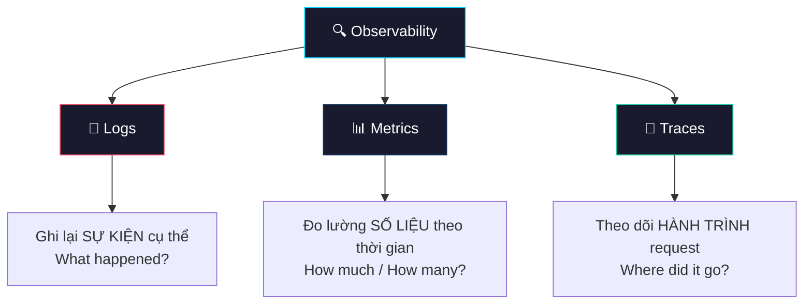
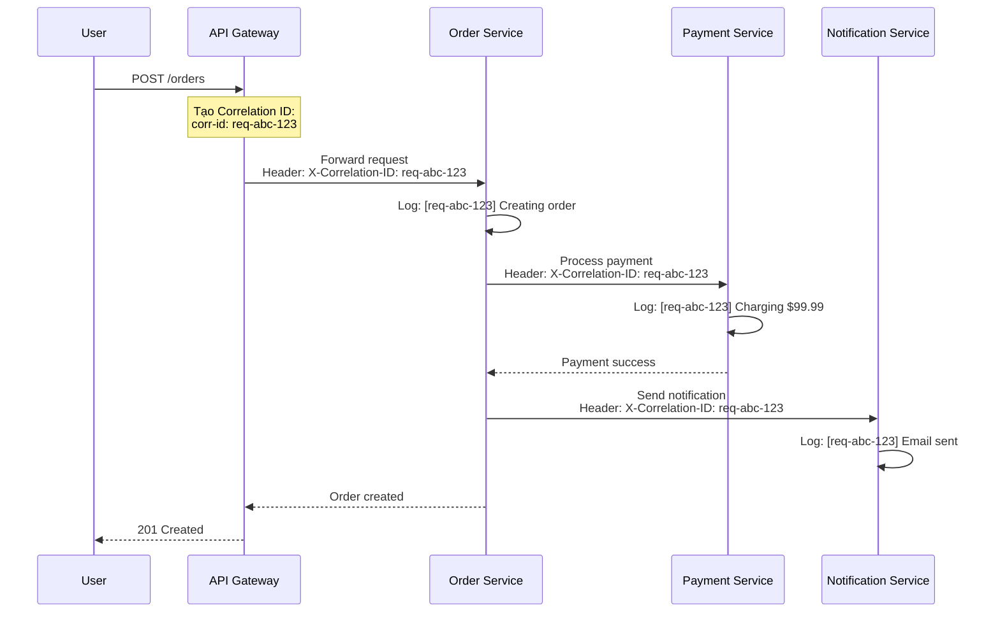
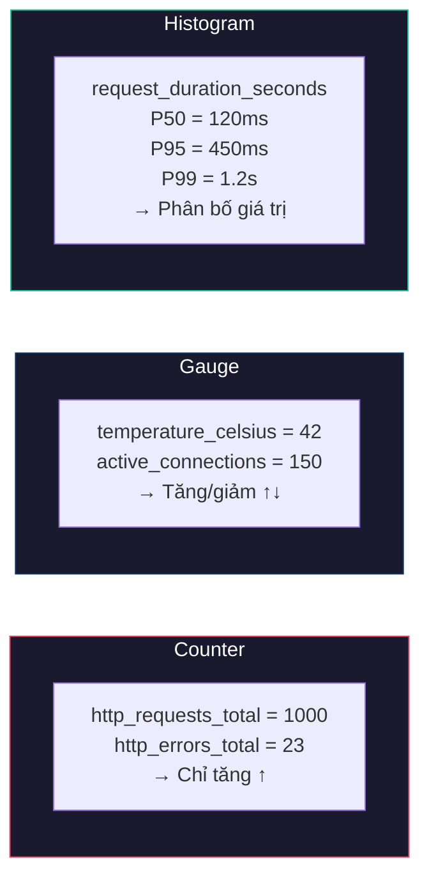
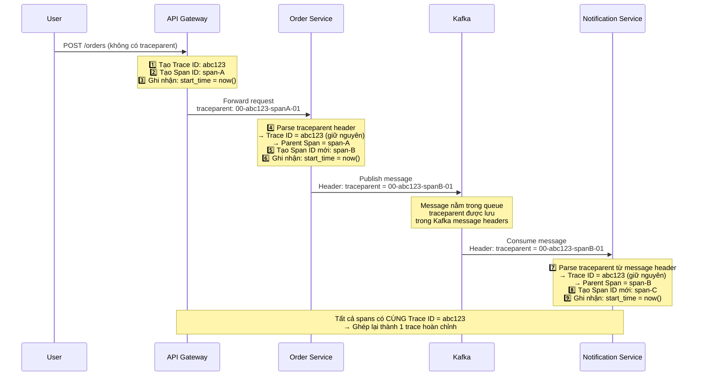
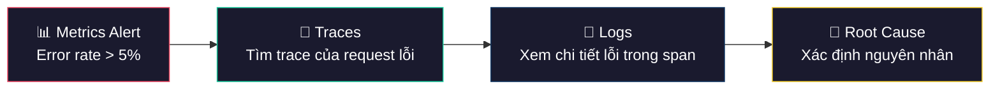
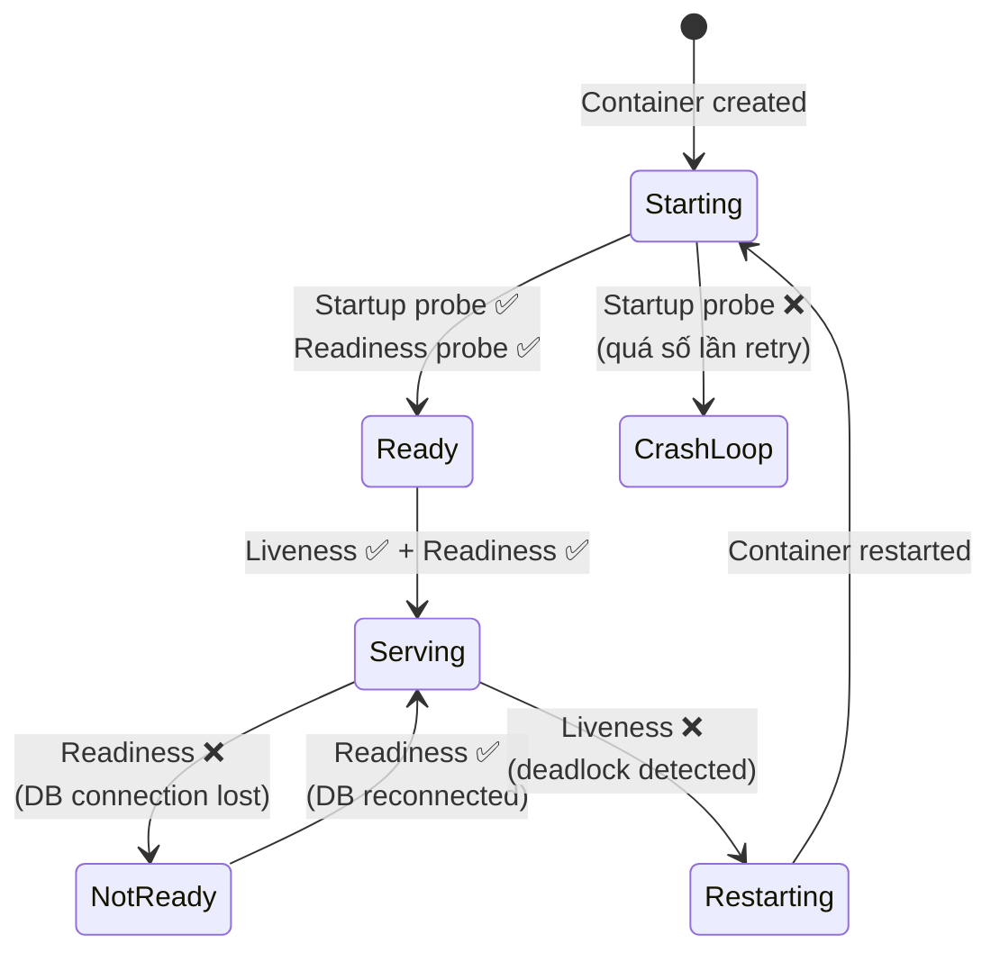
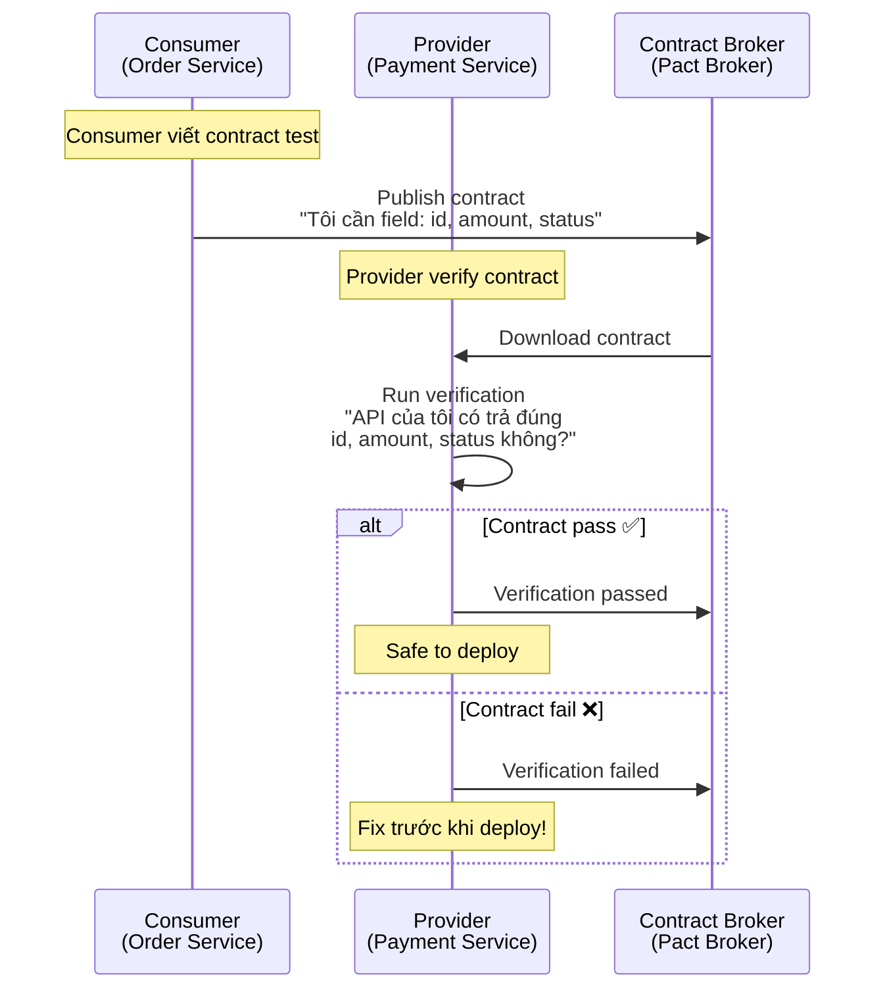
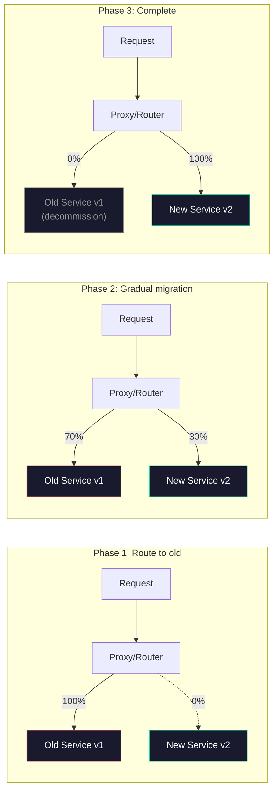

# Observability & Evolvability — Quan sát và phát triển hệ thống Microservice

## 📋 Mục lục

- [1. Giới thiệu](#1-giới-thiệu)
  - [1.1. Tại sao Observability quan trọng?](#11-tại-sao-observability-quan-trọng)
  - [1.2. Monitoring vs Observability](#12-monitoring-vs-observability)
  - [1.3. Ba trụ cột của Observability](#13-ba-trụ-cột-của-observability)
- [2. Logging — Trụ cột thứ nhất](#2-logging--trụ-cột-thứ-nhất)
  - [2.1. Logging trong Microservice khác gì Monolith?](#21-logging-trong-microservice-khác-gì-monolith)
  - [2.2. Structured Logging](#22-structured-logging)
  - [2.3. Log Levels](#23-log-levels)
  - [2.4. Correlation ID — Xuyên suốt các service](#24-correlation-id--xuyên-suốt-các-service)
  - [2.5. Centralized Logging — ELK Stack](#25-centralized-logging--elk-stack)
  - [2.6. Các lựa chọn thay thế ELK](#26-các-lựa-chọn-thay-thế-elk)
  - [2.7. Best Practices cho Logging](#27-best-practices-cho-logging)
- [3. Metrics — Trụ cột thứ hai](#3-metrics--trụ-cột-thứ-hai)
  - [3.1. Metrics là gì?](#31-metrics-là-gì)
  - [3.2. Các loại Metrics](#32-các-loại-metrics)
  - [3.3. RED Method & USE Method](#33-red-method--use-method)
  - [3.4. Four Golden Signals (Google SRE)](#34-four-golden-signals-google-sre)
  - [3.5. Prometheus — Thu thập Metrics](#35-prometheus--thu-thập-metrics)
  - [3.6. Grafana — Trực quan hóa Metrics](#36-grafana--trực-quan-hóa-metrics)
  - [3.7. Alerting — Cảnh báo](#37-alerting--cảnh-báo)
  - [3.8. Ví dụ thực tế — Dashboard cho Order Service](#38-ví-dụ-thực-tế--dashboard-cho-order-service)
- [4. Distributed Tracing — Trụ cột thứ ba](#4-distributed-tracing--trụ-cột-thứ-ba)
  - [4.1. Vấn đề khi debug hệ thống phân tán](#41-vấn-đề-khi-debug-hệ-thống-phân-tán)
  - [4.2. Distributed Tracing là gì?](#42-distributed-tracing-là-gì)
  - [4.3. Các khái niệm cốt lõi — Trace Context truyền như thế nào?](#43-các-khái-niệm-cốt-lõi--trace-context-truyền-như-thế-nào)
  - [4.4. OpenTelemetry — Tiêu chuẩn thống nhất](#44-opentelemetry--tiêu-chuẩn-thống-nhất)
  - [4.5. Jaeger — Distributed Tracing Platform](#45-jaeger--distributed-tracing-platform)
  - [4.6. Zipkin — Lựa chọn thay thế](#46-zipkin--lựa-chọn-thay-thế)
  - [4.7. Sampling Strategies](#47-sampling-strategies)
  - [4.8. Ví dụ thực tế — Trace một request đặt hàng](#48-ví-dụ-thực-tế--trace-một-request-đặt-hàng)
- [5. Kết hợp ba trụ cột — Observability Stack](#5-kết-hợp-ba-trụ-cột--observability-stack)
  - [5.1. Kiến trúc tổng quan](#51-kiến-trúc-tổng-quan)
  - [5.2. Correlating Logs, Metrics, Traces](#52-correlating-logs-metrics-traces)
  - [5.3. Ví dụ quy trình debug production issue](#53-ví-dụ-quy-trình-debug-production-issue)
- [6. Health Check & Readiness](#6-health-check--readiness)
  - [6.1. Liveness vs Readiness vs Startup Probes](#61-liveness-vs-readiness-vs-startup-probes)
  - [6.2. Health Check Endpoint Design](#62-health-check-endpoint-design)
- [7. Evolvability — Khả năng phát triển](#7-evolvability--khả-năng-phát-triển)
  - [7.1. Evolvability là gì?](#71-evolvability-là-gì)
  - [7.2. API Versioning](#72-api-versioning)
  - [7.3. Backward Compatibility](#73-backward-compatibility)
  - [7.4. Consumer-Driven Contract Testing](#74-consumer-driven-contract-testing)
  - [7.5. Feature Flags](#75-feature-flags)
  - [7.6. Strangler Fig cho Service Evolution](#76-strangler-fig-cho-service-evolution)
  - [7.7. Ví dụ thực tế — Phát triển Payment Service v2](#77-ví-dụ-thực-tế--phát-triển-payment-service-v2)
- [8. Anti-patterns](#8-anti-patterns)
- [9. Tổng kết](#9-tổng-kết)
- [10. Liên kết liên quan](#10-liên-kết-liên-quan)

---

## 1. Giới thiệu

Trong các doc trước, chúng ta đã tìm hiểu cách thiết kế hệ thống chịu lỗi với [Resilience Patterns](10-resilience-patterns.md). Nhưng khi hệ thống đã chạy, câu hỏi tiếp theo là: **"Hệ thống đang hoạt động như thế nào?"** và **"Làm sao phát triển hệ thống mà không phá vỡ những gì đang chạy?"**

> **"Observability is not about collecting data. It's about being able to ask arbitrary questions about your system without having to predict those questions in advance."**
> — Charity Majors, CEO Honeycomb

### 1.1. Tại sao Observability quan trọng?

Trong monolith, khi có lỗi → kiểm tra 1 log file, debug 1 process. Trong microservice, một request có thể đi qua **10-20 service** khác nhau:

```
┌─────────────────────────────────────────────────────────────┐
│          MỘT REQUEST ĐI QUA NHIỀU SERVICES                  │
│                                                             │
│   User ──▶ API GW ──▶ Order ──▶ Inventory ──▶ Payment       │
│                          │          │            │          │
│                          ▼          ▼            ▼          │
│                       Notification  Warehouse   Bank API    │
│                                                             │
│   ❓ Request chậm → Lỗi ở đâu? Service nào?                 │
│   ❓ Latency tăng → Bottleneck ở service nào?               │
│   ❓ Error rate tăng → Ảnh hưởng bao nhiêu user?            │
└─────────────────────────────────────────────────────────────┘
```

Không có Observability, việc debug trong microservice giống như **tìm kim trong đống rơm — trong bóng tối**.

### 1.2. Monitoring vs Observability

Hai khái niệm này thường bị nhầm lẫn:

| Tiêu chí | Monitoring | Observability |
|----------|-----------|---------------|
| **Mục đích** | Phát hiện vấn đề đã biết | Hiểu vấn đề chưa biết |
| **Câu hỏi** | "Hệ thống có đang down không?" | "Tại sao hệ thống chậm cho user ở HCM?" |
| **Cách tiếp cận** | Dashboards, alerts định sẵn | Khám phá, truy vấn linh hoạt |
| **Dữ liệu** | Metrics cố định | Logs + Metrics + Traces kết hợp |
| **Ví dụ** | CPU > 90% → Alert | Trace request chậm → tìm service gây bottleneck |

> **Monitoring** cho biết **CÓ** vấn đề. **Observability** cho biết **TẠI SAO** có vấn đề.

### 1.3. Ba trụ cột của Observability



| Trụ cột | Mô tả | Công cụ phổ biến |
|---------|--------|-----------------|
| **Logs** | Ghi lại sự kiện rời rạc, chi tiết | ELK Stack, Loki, Fluentd |
| **Metrics** | Số liệu tổng hợp theo thời gian | Prometheus, Grafana, Datadog |
| **Traces** | Theo dõi request xuyên suốt các service | Jaeger, Zipkin, OpenTelemetry |

---

## 2. Logging — Trụ cột thứ nhất

### 2.1. Logging trong Microservice khác gì Monolith?

| Tiêu chí | Monolith | Microservice |
|----------|----------|-------------|
| **Số lượng log** | 1 file / 1 server | Hàng chục service, hàng trăm instance |
| **Tìm kiếm** | `grep` trên 1 file | Cần centralized logging |
| **Correlation** | Thread ID trong 1 process | Correlation ID xuyên services |
| **Volume** | Vừa phải | Rất lớn (GB/ngày → TB/ngày) |
| **Format** | Tùy ý | Phải chuẩn hóa (structured) |

### 2.2. Structured Logging

Thay vì log text thuần:

```
❌ Unstructured Log:
[2025-01-15 10:23:45] ERROR: Payment failed for order 12345, user john@example.com, amount $99.99
```

Sử dụng **Structured Logging** (JSON format):

```json
{
  "timestamp": "2025-01-15T10:23:45.123Z",
  "level": "ERROR",
  "service": "payment-service",
  "instance": "payment-pod-abc123",
  "trace_id": "abc123def456",
  "span_id": "span789",
  "correlation_id": "req-xyz-001",
  "message": "Payment failed",
  "context": {
    "order_id": "12345",
    "user_id": "user-001",
    "amount": 99.99,
    "currency": "USD",
    "payment_method": "credit_card",
    "error_code": "INSUFFICIENT_FUNDS",
    "gateway_response_time_ms": 2340
  }
}
```

**Lợi ích của Structured Logging:**
- **Tìm kiếm dễ dàng**: Query `level:ERROR AND service:payment-service AND context.error_code:INSUFFICIENT_FUNDS`
- **Tổng hợp tự động**: Đếm số lỗi theo `error_code`, group by `service`
- **Liên kết với Trace**: Dùng `trace_id` để tìm toàn bộ hành trình request
- **Machine-readable**: Công cụ phân tích tự động xử lý được

### 2.3. Log Levels

```
┌─────────────────────────────────────────────────────────┐
│                    LOG LEVELS                           │
│                                                         │
│   FATAL   ████████████████████████████  Hệ thống crash  │
│   ERROR   ██████████████████████        Lỗi cần xử lý   │
│   WARN    ████████████████              Cảnh báo        │
│   INFO    ██████████                    Thông tin chung │
│   DEBUG   ██████                        Chi tiết debug  │
│   TRACE   ████                          Rất chi tiết    │
│                                                         │
│   ◀── Production ──▶  ◀── Dev/Debug ──▶                 │
│   (INFO trở lên)      (DEBUG/TRACE)                     │
└─────────────────────────────────────────────────────────┘
```

| Level | Khi nào dùng | Ví dụ |
|-------|-------------|-------|
| **FATAL** | Hệ thống không thể tiếp tục | Database connection pool exhausted |
| **ERROR** | Lỗi cần attention, nhưng hệ thống vẫn chạy | Payment gateway timeout |
| **WARN** | Tình huống bất thường, có thể thành lỗi | Retry lần 2/3 cho external API |
| **INFO** | Sự kiện business quan trọng | Order created, Payment processed |
| **DEBUG** | Chi tiết cho developer | Request/Response payload, SQL query |
| **TRACE** | Chi tiết nhất, hiếm khi dùng | Method entry/exit, variable values |

### 2.4. Correlation ID — Xuyên suốt các service

Correlation ID (hay Request ID) là một identifier duy nhất được truyền qua **tất cả service** mà request đi qua:



**Cách implement:**

```
1. API Gateway tạo Correlation ID (nếu client không gửi)
2. Truyền qua HTTP Header: X-Correlation-ID hoặc X-Request-ID
3. Mỗi service ghi Correlation ID vào TẤT CẢ log entries
4. Khi gọi service khác → forward Correlation ID
5. Với async messaging → đặt Correlation ID vào message header
```

#### Request ID có cần gửi từ client không? Và có liên quan tới Trace không?

**Trả lời ngắn:** Request ID **không bắt buộc** gửi từ client, và nó **KHÔNG phải** là một phần của quá trình tracing (Distributed Tracing). Đây là hai cơ chế **riêng biệt**, phục vụ mục đích khác nhau.

```
┌───────────────────────────────────────────────────────────────────┐
│     REQUEST ID vs TRACE ID — HAI THỨ KHÁC NHAU                    │
│                                                                   │
│  ┌─────────────────────────────┐  ┌──────────────────────────────┐│
│  │     REQUEST ID / CORRELATION│  │         TRACE ID             ││
│  │         ID                  │  │     (Distributed Tracing)    ││
│  │                             │  │                              ││
│  │  Ai tạo?                    │  │  Ai tạo?                     ││
│  │  → Client hoặc API Gateway  │  │  → OTel SDK (tự động)        ││
│  │                             │  │                              ││
│  │  Mục đích?                  │  │  Mục đích?                   ││
│  │  → Tìm log, support ticket  │  │  → Đo latency, tìm bottleneck││
│  │  → "User gửi ticket #abc, │  │  → "Span nào chậm nhất?"     ││
│  │     tìm log req-abc-123"    │  │  → Waterfall, dependency map ││
│  │                             │  │                              ││
│  │  Truyền qua?                │  │  Truyền qua?                 ││
│  │  → X-Request-ID header      │  │  → traceparent header        ││
│  │    (convention, không chuẩn)│  │    (W3C standard)            ││
│  │                             │  │                              ││
│  │  Ai dùng?                   │  │  Ai dùng?                    ││
│  │  → Developer đọc log        │  │  → Jaeger, Zipkin, Grafana   ││
│  │  → Customer support         │  │  → Tracing backend tự động   ││
│  └─────────────────────────────┘  └──────────────────────────────┘│
└───────────────────────────────────────────────────────────────────┘
```

**Chi tiết về Request ID:**

| Câu hỏi | Trả lời |
|---------|---------|
| Client **có cần** gửi không? | **Không bắt buộc.** API Gateway sẽ tự tạo nếu client không gửi |
| Client **có thể** gửi không? | **Có.** Gửi qua header `X-Request-ID`. Hữu ích khi client muốn tra cứu log sau |
| Nếu client gửi thì sao? | API Gateway **giữ nguyên** giá trị client gửi (hoặc validate + giữ) |
| Nếu client không gửi thì sao? | API Gateway **tự generate** một UUID |
| Có liên quan tới Tracing? | **Không trực tiếp.** Tracing dùng `traceparent` header riêng, do OTel SDK quản lý |

**Ví dụ thực tế — Cùng 1 request, 2 ID song song:**

```
Client gửi request:
─────────────────────────────────────────────────────
POST /api/orders HTTP/1.1
X-Request-ID: client-req-001          ← Client tự tạo (optional)
Content-Type: application/json

{"product_id": "P100", "quantity": 2}


API Gateway forward tới Order Service:
─────────────────────────────────────────────────────
POST /internal/orders HTTP/1.1
X-Request-ID: client-req-001          ← Giữ nguyên từ client
traceparent: 00-abc123...-spanA...-01 ← OTel SDK tự tạo (KHÔNG liên quan Request ID)
X-Correlation-ID: client-req-001      ← Có thể copy từ Request ID


Trong log của Order Service:
─────────────────────────────────────────────────────
{
  "request_id": "client-req-001",                    ← Để support tìm log
  "trace_id": "abc123def456...",                     ← Để tracing tool tìm spans
  "span_id": "spanB...",                             ← Span hiện tại
  "message": "Order created #456"
}
```

**Khi nào client NÊN gửi Request ID?**

```
✅ NÊN gửi Request ID từ client khi:
├── Mobile/Web app muốn retry → cùng Request ID để server detect duplicate
├── Client cần tra cứu kết quả request sau (polling)
├── Support team cần trace theo ticket của user
│   (User gọi: "Tôi đặt hàng lỗi" → "Cho tôi Request ID" → tìm log)
└── Idempotency: dùng Request ID làm idempotency key

❌ KHÔNG CẦN gửi từ client khi:
├── Internal service-to-service calls (API Gateway tự tạo)
├── Hệ thống không cần idempotency
└── Không có support workflow cần tra cứu từ phía client
```

> **Tóm lại:** Request ID là **business/operational concern** (tìm log, support, idempotency). Trace ID là **observability concern** (đo performance, tìm bottleneck). Chúng **tồn tại song song**, không thay thế nhau, và Trace ID **không cần client gửi** — OTel SDK tự quản lý hoàn toàn.

### 2.5. Centralized Logging — ELK Stack

ELK Stack (Elasticsearch + Logstash + Kibana) là giải pháp centralized logging phổ biến nhất:

```
┌─────────────────────────────────────────────────────────────────┐
│                      ELK STACK ARCHITECTURE                     │
│                                                                 │
│  ┌──────────┐  ┌──────────┐  ┌──────────┐                       │
│  │ Service A│  │ Service B│  │ Service C│    Log Sources        │
│  └────┬─────┘  └────┬─────┘  └────┬─────┘                       │
│       │             │             │                             │
│       ▼             ▼             ▼                             │
│  ┌─────────────────────────────────────────┐                    │
│  │          Filebeat / Fluentd             │    Log Shipper     │
│  │    (Thu thập log từ containers)         │                    │
│  └────────────────┬────────────────────────┘                    │
│                   │                                             │
│                   ▼                                             │
│  ┌─────────────────────────────────────────┐                    │
│  │            Logstash                     │    Processing      │
│  │   (Parse, Transform, Enrich)            │                    │
│  └────────────────┬────────────────────────┘                    │
│                   │                                             │
│                   ▼                                             │
│  ┌─────────────────────────────────────────┐                    │
│  │          Elasticsearch                  │    Storage &       │
│  │   (Index, Search, Aggregate)            │    Search          │
│  └────────────────┬────────────────────────┘                    │
│                   │                                             │
│                   ▼                                             │
│  ┌─────────────────────────────────────────┐                    │
│  │            Kibana                       │    Visualization   │
│  │   (Dashboard, Search, Alerts)           │                    │
│  └─────────────────────────────────────────┘                    │
└─────────────────────────────────────────────────────────────────┘
```

**Các thành phần:**

| Thành phần | Vai trò | Chi tiết |
|-----------|---------|----------|
| **Filebeat** | Thu thập log | Lightweight agent chạy trên mỗi node, đọc log file và forward |
| **Logstash** | Xử lý log | Parse, filter, transform, enrich log trước khi lưu |
| **Elasticsearch** | Lưu trữ & tìm kiếm | Full-text search engine, lưu log dạng JSON, hỗ trợ query phức tạp |
| **Kibana** | Trực quan hóa | Web UI để search log, tạo dashboard, thiết lập alerts |

**Logstash Pipeline ví dụ:**

```
input {
  beats {
    port => 5044        # Nhận log từ Filebeat
  }
}

filter {
  json {
    source => "message"  # Parse JSON log
  }
  date {
    match => ["timestamp", "ISO8601"]  # Parse timestamp
  }
  mutate {
    add_field => {
      "environment" => "production"
    }
  }
  if [level] == "ERROR" {
    mutate {
      add_tag => ["alert-worthy"]
    }
  }
}

output {
  elasticsearch {
    hosts => ["elasticsearch:9200"]
    index => "logs-%{service}-%{+YYYY.MM.dd}"  # Index theo service và ngày
  }
}
```

### 2.6. Các lựa chọn thay thế ELK

| Giải pháp | Ưu điểm | Nhược điểm | Phù hợp khi |
|----------|---------|------------|-------------|
| **ELK Stack** | Mạnh mẽ, full-text search | Tốn resource, phức tạp | Cần search log phức tạp |
| **Grafana Loki** | Nhẹ, tích hợp Grafana | Không full-text search | Đã dùng Grafana, budget thấp |
| **Fluentd + S3** | Rẻ, dễ scale | Query chậm | Lưu trữ lâu dài, compliance |
| **Datadog** | SaaS, dễ dùng | Đắt | Team nhỏ, không muốn tự quản lý |
| **Splunk** | Enterprise-grade | Rất đắt | Doanh nghiệp lớn |

### 2.7. Best Practices cho Logging

```
✅ NÊN:
├── Dùng Structured Logging (JSON)
├── Luôn có Correlation ID
├── Log ở business events (order created, payment processed)
├── Bao gồm context đủ để debug (order_id, user_id, amount)
├── Dùng đúng log level
├── Thiết lập log rotation và retention policy
└── Mask dữ liệu nhạy cảm (PII, secrets)

❌ KHÔNG NÊN:
├── Log password, token, credit card
├── Log request/response body ở production (quá nhiều data)
├── Dùng string concatenation (dùng structured fields)
├── Log trong vòng lặp (millions of entries)
├── Để log level DEBUG ở production
└── Phụ thuộc vào log cho business logic
```

---

## 3. Metrics — Trụ cột thứ hai

### 3.1. Metrics là gì?

Metrics là **số liệu đo lường** được thu thập và tổng hợp theo thời gian. Khác với Logs (ghi lại từng sự kiện), Metrics cho biết **xu hướng** và **tổng quan** về hệ thống.

```
Logs:   "Order #123 failed at 10:23:45"      → Sự kiện cụ thể
Metrics: "50 orders failed in last 5 min"     → Xu hướng tổng hợp
         "P99 latency = 2.3s"                 → Hiệu suất tổng quan
         "CPU usage = 78%"                    → Tài nguyên hệ thống
```

### 3.2. Các loại Metrics

| Loại | Mô tả | Ví dụ |
|------|--------|-------|
| **Counter** | Chỉ tăng, đếm số lượng | Tổng số request, tổng số lỗi |
| **Gauge** | Tăng/giảm, giá trị hiện tại | CPU usage, memory usage, active connections |
| **Histogram** | Phân bố giá trị, tính percentile | Request latency (P50, P95, P99) |
| **Summary** | Tương tự Histogram, tính ở client | Request duration quantiles |



### 3.3. RED Method & USE Method

Hai phương pháp phổ biến để chọn metrics cần theo dõi:

**RED Method** — Dành cho **request-driven services** (API, web service):

| Chữ cái | Metric | Ý nghĩa |
|---------|--------|---------|
| **R** — Rate | Requests/second | Lưu lượng request |
| **E** — Errors | Errors/second | Tỷ lệ lỗi |
| **D** — Duration | Latency (P50, P95, P99) | Thời gian xử lý |

**USE Method** — Dành cho **resources** (CPU, memory, disk, network):

| Chữ cái | Metric | Ý nghĩa |
|---------|--------|---------|
| **U** — Utilization | % resource đang dùng | CPU 78%, Memory 65% |
| **S** — Saturation | Mức độ quá tải | Queue length, thread pool đầy |
| **E** — Errors | Số lỗi resource | Disk errors, network drops |

### 3.4. Four Golden Signals (Google SRE)

Google SRE (Site Reliability Engineering) đề xuất **4 tín hiệu vàng** cần theo dõi:

```
┌─────────────────────────────────────────────────────────────┐
│              FOUR GOLDEN SIGNALS (Google SRE)               │
│                                                             │
│   ┌──────────────┐    ┌──────────────┐                      │
│   │   LATENCY    │    │   TRAFFIC    │                      │
│   │              │    │              │                      │
│   │  Thời gian   │    │  Lưu lượng   │                      │
│   │  phản hồi    │    │  request     │                      │
│   │  P50 / P99   │    │  req/sec     │                      │
│   └──────────────┘    └──────────────┘                      │
│                                                             │
│   ┌──────────────┐    ┌──────────────┐                      │
│   │    ERRORS    │    │  SATURATION  │                      │
│   │              │    │              │                      │
│   │  Tỷ lệ lỗi   │    │  Mức độ      │                      │
│   │  5xx / total │    │  quá tải     │                      │
│   │  error rate  │    │  % resource  │                      │
│   └──────────────┘    └──────────────┘                      │
└─────────────────────────────────────────────────────────────┘
```

| Signal | Mô tả | Metric ví dụ |
|--------|--------|-------------|
| **Latency** | Thời gian xử lý request (phân biệt success vs error) | `http_request_duration_seconds{status="200"}` |
| **Traffic** | Lượng demand đang đặt lên hệ thống | `http_requests_total`, `messages_processed_total` |
| **Errors** | Tỷ lệ request thất bại | `http_requests_total{status=~"5.."}` / total |
| **Saturation** | Mức độ "đầy" của resource | CPU %, memory %, queue depth |

### 3.5. Prometheus — Thu thập Metrics

Prometheus là hệ thống monitoring và alerting open-source, là tiêu chuẩn de-facto cho Kubernetes metrics.

**Kiến trúc Prometheus:**

```
┌─────────────────────────────────────────────────────────────────┐
│                   PROMETHEUS ARCHITECTURE                       │
│                                                                 │
│  ┌──────────────────────────────────────────┐                   │
│  │           Prometheus Server              │                   │
│  │  ┌────────────┐  ┌──────────────────┐    │                   │
│  │  │  Retrieval │  │   TSDB           │    │                   │
│  │  │  (Pull)    │  │ (Time Series DB) │    │                   │
│  │  └──────┬─────┘  └──────────────────┘    │                   │
│  │         │         ┌──────────────────┐   │                   │
│  │         │         │  Alert Manager   │   │                   │
│  │         │         └──────────────────┘   │                   │
│  └─────────┼────────────────────────────────┘                   │
│            │                                                    │
│       PULL metrics                                              │
│       (HTTP GET /metrics)                                       │
│            │                                                    │
│    ┌───────┼───────────────────────┐                            │
│    │       │                       │                            │
│    ▼       ▼                       ▼                            │
│  ┌──────┐ ┌──────┐             ┌──────────┐                     │
│  │Svc A │ │Svc B │    ...      │ Node     │                     │
│  │:8080 │ │:8081 │             │ Exporter │                     │
│  │/metrics│/metrics│           │ :9100    │                     │
│  └──────┘ └──────┘             └──────────┘                     │
└─────────────────────────────────────────────────────────────────┘
```

**Pull-based model:** Prometheus chủ động **kéo** (scrape) metrics từ các service endpoint `/metrics`, thay vì service **đẩy** metrics.

**Ưu điểm Pull model:**
- Prometheus kiểm soát tần suất thu thập
- Dễ phát hiện service nào down (scrape fail)
- Service không cần biết Prometheus ở đâu
- Dễ debug: truy cập `/metrics` trực tiếp để xem

**Prometheus metrics format:**

```
# HELP http_requests_total Total number of HTTP requests
# TYPE http_requests_total counter
http_requests_total{method="GET",endpoint="/api/orders",status="200"} 15234
http_requests_total{method="POST",endpoint="/api/orders",status="201"} 3456
http_requests_total{method="POST",endpoint="/api/orders",status="500"} 23

# HELP http_request_duration_seconds HTTP request latency
# TYPE http_request_duration_seconds histogram
http_request_duration_seconds_bucket{endpoint="/api/orders",le="0.1"} 12000
http_request_duration_seconds_bucket{endpoint="/api/orders",le="0.5"} 14500
http_request_duration_seconds_bucket{endpoint="/api/orders",le="1.0"} 15100
http_request_duration_seconds_bucket{endpoint="/api/orders",le="+Inf"} 15234

# HELP active_orders_gauge Current number of active orders
# TYPE active_orders_gauge gauge
active_orders_gauge 342
```

**PromQL — Ngôn ngữ truy vấn:**

```
# Tỷ lệ request/giây trong 5 phút gần nhất
rate(http_requests_total[5m])

# Error rate (%) cho Order Service
sum(rate(http_requests_total{service="order",status=~"5.."}[5m]))
/
sum(rate(http_requests_total{service="order"}[5m]))
* 100

# P99 latency
histogram_quantile(0.99, rate(http_request_duration_seconds_bucket[5m]))

# Top 5 endpoints chậm nhất
topk(5, histogram_quantile(0.95, rate(http_request_duration_seconds_bucket[5m])))
```

### 3.6. Grafana — Trực quan hóa Metrics

Grafana là công cụ visualization hàng đầu, kết nối với nhiều data sources:

```
┌─────────────────────────────────────────────────────────────┐
│                   GRAFANA DASHBOARD                         │
│                                                             │
│  ┌─────────────────────────────────────────────────────┐    │
│  │  Order Service Overview                             │    │
│  ├──────────────┬──────────────┬─────────────────┤     │    │
│  │  Request Rate│  Error Rate  │  P99 Latency    │     │    │
│  │  ▃▅▇▅▃▅▇▅▃   │  ▁▁▁▃▁▁▁▁▁   │  ▂▂▃▅▃▂▂▂▂      │     │    │
│  │  1.2K req/s  │  0.3%        │  245ms          │     │    │
│  ├──────────────┴──────────────┴─────────────────┤     │    │
│  │                                               │     │    │
│  │  Request Rate Over Time                       │     │    │
│  │  2K ┤                  ╭─╮                    │     │    │
│  │     │              ╭───╯ ╰──╮                 │     │    │
│  │  1K ┤         ╭────╯        ╰───╮             │     │    │
│  │     │    ╭────╯                 ╰──           │     │    │
│  │   0 ┼────╯                                    │     │    │
│  │     00:00  04:00  08:00  12:00  16:00  20:00  │     │    │
│  └───────────────────────────────────────────────┘     │    │
└─────────────────────────────────────────────────────────────┘
```

**Grafana hỗ trợ nhiều data sources:**
- Prometheus (metrics)
- Elasticsearch (logs)
- Jaeger (traces)
- Loki (logs)
- InfluxDB, CloudWatch, Datadog, ...

### 3.7. Alerting — Cảnh báo

**Alerting Rules trong Prometheus:**

```yaml
# prometheus-alerts.yml
groups:
  - name: microservice-alerts
    rules:
      # Error rate cao
      - alert: HighErrorRate
        expr: |
          sum(rate(http_requests_total{status=~"5.."}[5m]))
          /
          sum(rate(http_requests_total[5m]))
          > 0.05
        for: 5m
        labels:
          severity: critical
        annotations:
          summary: "High error rate detected"
          description: "Error rate is {{ $value | humanizePercentage }} (threshold: 5%)"

      # Latency cao
      - alert: HighLatency
        expr: histogram_quantile(0.99, rate(http_request_duration_seconds_bucket[5m])) > 2
        for: 10m
        labels:
          severity: warning
        annotations:
          summary: "P99 latency > 2s for {{ $labels.service }}"

      # Service down
      - alert: ServiceDown
        expr: up == 0
        for: 1m
        labels:
          severity: critical
        annotations:
          summary: "Service {{ $labels.instance }} is down"
```

**Alert routing (AlertManager):**

```
┌──────────────────────────────────────────────────────────┐
│                  ALERT ROUTING                           │
│                                                          │
│   Prometheus ──▶ AlertManager ──┬──▶ Slack (#alerts)     │
│                                 ├──▶ PagerDuty (on-call) │
│                                 ├──▶ Email (team lead)   │
│                                 └──▶ Webhook (auto-fix)  │
│                                                          │
│   Routing rules:                                         │
│   ├── severity: critical → PagerDuty + Slack             │
│   ├── severity: warning  → Slack only                    │
│   └── severity: info     → Email digest                  │
└──────────────────────────────────────────────────────────┘
```

### 3.8. Ví dụ thực tế — Dashboard cho Order Service

Một dashboard hoàn chỉnh cho Order Service cần theo dõi:

| Panel | PromQL | Mục đích |
|-------|--------|---------|
| Request Rate | `rate(http_requests_total{service="order"}[5m])` | Lưu lượng traffic |
| Error Rate | `rate(http_requests_total{service="order",status=~"5.."}[5m])` | Phát hiện lỗi |
| P50/P95/P99 Latency | `histogram_quantile(0.99, ...)` | Hiệu suất |
| Active Orders | `active_orders_gauge` | Business metric |
| Orders Created/min | `rate(orders_created_total[1m])` | Business throughput |
| DB Connection Pool | `db_connections_active / db_connections_max` | Resource saturation |
| Memory Usage | `process_resident_memory_bytes` | Resource utilization |
| Pod Restarts | `kube_pod_container_status_restarts_total` | Stability |

---

## 4. Distributed Tracing — Trụ cột thứ ba

### 4.1. Vấn đề khi debug hệ thống phân tán

Khi một request chậm hoặc lỗi, Logs và Metrics không đủ:

```
❓ Scenario: User báo "đặt hàng chậm quá" (mất 8 giây)

📝 Logs cho biết:
   - API Gateway: nhận request lúc 10:23:45.000
   - Order Service: xử lý xong lúc 10:23:53.200 (mất 8.2s)
   → Nhưng TRONG Order Service, nó gọi 5 services khác
   → Chậm ở service nào? Bước nào?

📊 Metrics cho biết:
   - P99 latency tăng từ 500ms → 8s
   → Nhưng không biết request cụ thể chậm ở đâu

🔗 Tracing cho biết:
   - API Gateway: 50ms
   - Order Service: 120ms
   - Inventory Check: 80ms
   - Payment Service: 7.5s ← 🔴 BOTTLENECK!
     └── Bank API call: 7.2s ← 🔴 ROOT CAUSE!
   - Notification: 45ms
```

### 4.2. Distributed Tracing là gì?

Distributed Tracing theo dõi **toàn bộ hành trình** của một request khi nó đi qua nhiều service. Nó tạo ra một **"bản đồ"** (trace) cho thấy mỗi service xử lý bao lâu và thứ tự gọi nhau.

```
Trace: POST /api/orders (Total: 8.2s)

Service              Span                  0ms                          8200ms
─────────────────────────────────────────────────────────────────────────────
API Gateway          Route request         ██ (0-50ms)
Order Service        Validate order          ██ (50-170ms)
Order Service        Save to DB                ██ (170-250ms)
Inventory Service    Check stock                 ██ (250-330ms)
Payment Service      Process payment              ██████████████████████████████ (330-7830ms) 🔴
  └─ Payment Svc     Call Bank API                 █████████████████████████████ (350-7550ms) 🔴
Notification         Send email                                                 █ (7830-7875ms)
```

#### Trace có bao gồm Async Messaging (Kafka, RabbitMQ,...) không?

**Có.** Một trace không chỉ theo dõi HTTP/gRPC synchronous calls mà còn bao gồm cả **asynchronous messaging** qua Kafka, RabbitMQ, SQS,... Khi service A publish message lên Kafka và service B consume message đó, cả hai đều thuộc **cùng một trace**.

```
┌─────────────────────────────────────────────────────────────────┐
│         TRACE BAO GỒM CẢ SYNC + ASYNC                           │
│                                                                 │
│  User ──▶ Order Service ──▶ Payment Service    (Sync: HTTP)     │
│                │                                                │
│                │ publish                                        │
│                ▼                                                │
│           ┌─────────┐                                           │
│           │  Kafka  │                                           │
│           │  Topic  │                                           │
│           └────┬────┘                                           │
│                │ consume (có thể SAU vài giây/phút)             │
│                ▼                                                │
│           Notification Service ──▶ Email Service  (Sync: gRPC)  │
│                                                                 │
│  ──────────────────────────────────────────────────             │
│  Tất cả đều thuộc CÙNG 1 TRACE (cùng Trace ID)                  │
│  Nhưng spans cho async sẽ có GAP về thời gian                   │
└─────────────────────────────────────────────────────────────────┘
```

**Cách hoạt động với async messaging:**

| Giao thức | Trace Context truyền ở đâu | Đặc điểm |
|----------|---------------------------|----------|
| **HTTP / REST** | HTTP Headers (`traceparent`, `tracestate`) | Span liên tục, không gap |
| **gRPC** | gRPC Metadata | Tương tự HTTP |
| **Kafka** | Message Headers (`traceparent` header) | Span có gap (thời gian message nằm trong queue) |
| **RabbitMQ** | Message Properties / Headers | Tương tự Kafka |
| **SQS / SNS** | Message Attributes | Tương tự Kafka |

**Ví dụ trace có Kafka:**

```
Trace ID: abc-123-def-456   (Tổng: 12.5s, nhưng thực tế xử lý chỉ ~500ms)

Order Service
├── Span: createOrder (0ms → 200ms)
│   ├── Span: saveDB (10ms → 45ms)
│   └── Span: kafka.produce → "order-events" (45ms → 60ms)
│       └── Link: SpanContext được nhúng vào Kafka message header
│
│                    ⏳ Message nằm trong Kafka queue ~12 giây
│
Notification Service
└── Span: kafka.consume ← "order-events" (12000ms → 12050ms)
    ├── messaging.system: kafka
    ├── messaging.destination: order-events
    ├── messaging.message.id: msg-789
    └── Span: sendEmail (12050ms → 12200ms)

→ Trace vẫn LIÊN TỤC dù có gap 12 giây giữa produce và consume
```

> **Lưu ý:** Với async, một số hệ thống dùng **Span Links** thay vì Parent-Child relationship, vì consumer có thể xử lý batch nhiều messages từ nhiều traces khác nhau.

### 4.3. Các khái niệm cốt lõi — Trace Context truyền như thế nào?

#### Các thành phần của Trace Context

Mỗi span cần các thông số sau để **tính ra trace** và xác định quan hệ parent-child:

| Thông số | Mô tả | Ví dụ |
|---------|--------|-------|
| **Trace ID** | ID duy nhất cho toàn bộ trace (128-bit) | `4bf92f3577b34da6a3ce929d0e0e4736` |
| **Span ID** | ID duy nhất cho span hiện tại (64-bit) | `00f067aa0ba902b7` |
| **Parent Span ID** | ID của span cha (để xây dựng cây) | `a3ce929d0e0e4736` |
| **Trace Flags** | Cờ điều khiển (sampled hay không) | `01` (sampled) |
| **Trace State** | Vendor-specific metadata | `congo=t61rcWkgMzE,rojo=00f067aa0ba902b7` |

#### Trace Context được truyền ở đâu trong request?

Theo chuẩn [W3C Trace Context](https://www.w3.org/TR/trace-context/), trace context được truyền qua **2 HTTP headers**:

```
┌───────────────────────────────────────────────────────────────────┐
│       W3C TRACE CONTEXT — TRUYỀN QUA HTTP HEADERS                 │
│                                                                   │
│  Service A gửi request tới Service B:                             │
│                                                                   │
│  POST /api/payments HTTP/1.1                                      │
│  Host: payment-service:8080                                       │
│  Content-Type: application/json                                   │
│  ┌────────────────────────────────────────────────────────────┐   │
│  │ traceparent: 00-4bf92f3577b34da6a3ce929d0e0e4736-          │   │
│  │              00f067aa0ba902b7-01                           │   │
│  │                                                            │   │
│  │ Format:  {version}-{trace-id}-{parent-span-id}-{flags}     │   │
│  │           ──┬──    ───┬────   ──────┬────────   ──┬──      │   │
│  │             │         │             │             │        │   │
│  │          Phiên bản  Trace ID     Span ID của   Sampled?    │   │
│  │          (luôn 00)  (128-bit)    service A     01 = yes    │   │
│  │                     KHÔNG ĐỔI    (64-bit)     00 = no      │   │
│  │                     suốt trace   ĐỔI mỗi hop               │   │
│  ├────────────────────────────────────────────────────────────┤   │
│  │ tracestate: vendor1=value1,vendor2=value2                  │   │
│  │ (Optional: vendor-specific data)                           │   │
│  └────────────────────────────────────────────────────────────┘   │
│                                                                   │
│  Body: {"order_id": "123", "amount": 99.99}                       │
└───────────────────────────────────────────────────────────────────┘
```

#### Quá trình tạo Trace và Span — Từng bước



**Chi tiết từng bước:**

```
Bước 1: Request đến API Gateway (KHÔNG có traceparent header)
─────────────────────────────────────────────────────────────
→ OTel SDK tự động:
  • Generate Trace ID:  4bf92f3577b34da6a3ce929d0e0e4736
  • Generate Span ID:   00f067aa0ba902b7
  • Ghi: start_time, service.name, http.method, http.url
  • Tạo header: traceparent: 00-4bf92...-00f06...-01

Bước 2: API Gateway → Order Service (HTTP call)
─────────────────────────────────────────────────────────────
→ OTel SDK tự động INJECT traceparent vào outgoing HTTP header
→ Order Service nhận request, OTel SDK tự động EXTRACT traceparent
→ Giữ nguyên Trace ID: 4bf92f3577b34da6a3ce929d0e0e4736
→ Generate Span ID MỚI: a1b2c3d4e5f6a7b8
→ Set Parent Span ID = 00f067aa0ba902b7 (span của API GW)

Bước 3: Order Service → Kafka (Async produce)
─────────────────────────────────────────────────────────────
→ OTel SDK INJECT traceparent vào Kafka message headers:
    kafka_message.headers = {
      "traceparent": "00-4bf92...-a1b2c...-01"
    }
→ Trace ID VẪN giữ nguyên

Bước 4: Kafka → Notification Service (Async consume)
─────────────────────────────────────────────────────────────
→ OTel SDK EXTRACT traceparent từ Kafka message headers
→ Giữ nguyên Trace ID: 4bf92f3577b34da6a3ce929d0e0e4736
→ Generate Span ID MỚI: b9c8d7e6f5a4b3c2
→ Set Parent Span ID = a1b2c3d4e5f6a7b8 (span của Order Svc)
```

#### Mỗi Span ghi lại những thông số gì?

Mỗi span là một bản ghi chứa đầy đủ thông tin để **tái dựng lại hành trình request**:

```json
{
  "trace_id": "4bf92f3577b34da6a3ce929d0e0e4736",
  "span_id": "a1b2c3d4e5f6a7b8",
  "parent_span_id": "00f067aa0ba902b7",
  "operation_name": "POST /api/orders",
  "service_name": "order-service",
  "start_time": "2025-01-15T10:23:45.050Z",
  "end_time": "2025-01-15T10:23:53.250Z",
  "duration_ms": 8200,
  "status": "OK",
  "kind": "SERVER",

  "attributes": {
    "http.method": "POST",
    "http.url": "/api/orders",
    "http.status_code": 201,
    "http.request_content_length": 256,
    "net.peer.ip": "10.0.1.5",
    "net.peer.port": 8080,
    "db.system": "postgresql",
    "db.statement": "INSERT INTO orders ...",
    "messaging.system": "kafka",
    "messaging.destination": "order-events"
  },

  "events": [
    {
      "name": "order.validated",
      "timestamp": "2025-01-15T10:23:45.170Z"
    },
    {
      "name": "payment.retry",
      "timestamp": "2025-01-15T10:23:48.500Z",
      "attributes": { "retry.attempt": 2, "error": "timeout" }
    }
  ],

  "links": [
    {
      "trace_id": "fff222333444",
      "span_id": "linked-span-id",
      "reason": "batch consumer linked to producer trace"
    }
  ]
}
```

| Nhóm thông số | Cách thu thập | Ghi chú |
|---------------|-------------|---------|
| **trace_id, span_id, parent_span_id** | OTel SDK tự động generate/extract | Developer KHÔNG cần tự tạo |
| **start_time, end_time, duration** | OTel SDK tự động đo | Tính từ khi span bắt đầu → kết thúc |
| **http.*, net.*, db.*** | Auto-instrumentation libraries | Tự động capture từ HTTP client, DB driver |
| **attributes tùy chỉnh** | Developer thêm bằng code | `span.setAttribute("order.id", "123")` |
| **events** | Developer thêm bằng code | `span.addEvent("payment.retry", attrs)` |
| **links** | Developer thêm khi cần liên kết traces | Dùng cho batch processing, fan-out |

> **Điểm quan trọng:** Phần lớn thông số được thu thập **tự động** bởi OTel SDK và auto-instrumentation libraries. Developer chỉ cần thêm **business-specific attributes** (order_id, user_id,...) và **events** quan trọng.

### 4.4. OpenTelemetry — Tiêu chuẩn thống nhất

OpenTelemetry (OTel) là dự án CNCF hợp nhất các tiêu chuẩn tracing/metrics trước đó (OpenTracing + OpenCensus):

```
┌─────────────────────────────────────────────────────────────┐
│              OPENTELEMETRY ECOSYSTEM                        │
│                                                             │
│  ┌─────────────────────────────────────┐                    │
│  │         Application Code            │                    │
│  │  ┌───────────────────────────────┐  │                    │
│  │  │     OTel SDK (Auto/Manual)    │  │                    │
│  │  │  ┌────────┬────────┬────────┐ │  │                    │
│  │  │  │ Traces │Metrics │  Logs  │ │  │                    │
│  │  │  └────────┴────────┴────────┘ │  │                    │
│  │  └───────────────┬───────────────┘  │                    │
│  └──────────────────┼──────────────────┘                    │
│                     │                                       │
│                     ▼                                       │
│  ┌─────────────────────────────────────┐                    │
│  │      OTel Collector                 │                    │
│  │  ┌──────────┬──────────┬──────────┐ │                    │
│  │  │Receivers │Processors│Exporters │ │                    │
│  │  └──────────┴──────────┴──────────┘ │                    │
│  └──────────┬──────────┬───────────────┘                    │
│             │          │                                    │
│        ┌────▼───┐ ┌────▼─────┐ ┌─────────┐                  │
│        │ Jaeger │ │Prometheus│ │  Loki   │                  │
│        │(Traces)│ │(Metrics) │ │ (Logs)  │                  │
│        └────────┘ └──────────┘ └─────────┘                  │
└─────────────────────────────────────────────────────────────┘
```

**Tại sao nên dùng OpenTelemetry?**
- **Vendor-neutral**: Không bị lock-in vào Jaeger, Datadog hay bất kỳ backend nào
- **Unified API**: Một SDK cho cả Traces, Metrics, Logs
- **Auto-instrumentation**: Tự động instrument HTTP, gRPC, database calls
- **CNCF Graduated**: Được backing bởi Google, Microsoft, AWS, ...

### 4.5. Jaeger — Distributed Tracing Platform

Jaeger (phát triển bởi Uber) là platform tracing open-source phổ biến nhất:

```
┌───────────────────────────────────────────────────────────┐
│                  JAEGER ARCHITECTURE                      │
│                                                           │
│  ┌──────────┐                                             │
│  │ Service  │──▶ jaeger-agent ──▶ jaeger-collector        │
│  │(OTel SDK)│    (UDP :6831)     (HTTP/gRPC)              │
│  └──────────┘                         │                   │
│                                       ▼                   │
│                              ┌──────────────┐             │
│                              │   Storage    │             │
│                              │ (Cassandra / │             │
│                              │ Elasticsearch│             │
│                              │   / Kafka)   │             │
│                              └──────┬───────┘             │
│                                     │                     │
│                                     ▼                     │
│                              ┌──────────────┐             │
│                              │  Jaeger UI   │             │
│                              │  (Query)     │             │
│                              └──────────────┘             │
└──────────────────────────────────────────────────────────┘
```

**Jaeger UI cung cấp:**
- **Search traces**: Tìm theo service, operation, duration, tags
- **Trace timeline**: Xem waterfall chart (Gantt diagram) cho từng trace
- **Compare traces**: So sánh 2 traces để tìm sự khác biệt
- **Service dependencies**: Biểu đồ dependency giữa các service (DAG)
- **Deep Dependency Graph**: Phân tích impact khi 1 service chậm

### 4.6. Zipkin — Lựa chọn thay thế

| Tiêu chí | Jaeger | Zipkin |
|----------|--------|--------|
| **Phát triển bởi** | Uber | Twitter |
| **Ngôn ngữ** | Go | Java |
| **UI** | Feature-rich hơn | Đơn giản hơn |
| **Storage** | Cassandra, ES, Kafka | MySQL, Cassandra, ES |
| **Sampling** | Adaptive sampling | Fixed/Rate sampling |
| **CNCF** | Graduated project | Không |
| **Phù hợp** | Hệ thống lớn, phức tạp | Hệ thống nhỏ-vừa |

### 4.7. Sampling Strategies

Tracing mọi request sẽ tạo ra **rất nhiều data** và ảnh hưởng performance. Sampling giúp giảm overhead:

| Strategy | Mô tả | Khi nào dùng |
|----------|--------|-------------|
| **Head-based Sampling** | Quyết định sample ở đầu trace | Đơn giản, nhưng có thể miss trace quan trọng |
| **Tail-based Sampling** | Quyết định SAU KHI trace hoàn thành | Ưu tiên trace chậm/lỗi, nhưng tốn resource hơn |
| **Rate Limiting** | Giới hạn N traces/giây | Kiểm soát volume cố định |
| **Adaptive Sampling** | Tự động điều chỉnh tỷ lệ | Production lớn, traffic thay đổi |
| **Always Sample Errors** | Luôn trace khi có lỗi | Đảm bảo không miss lỗi |

```
┌─────────────────────────────────────────────────────────┐
│              SAMPLING STRATEGIES                        │
│                                                         │
│  Head-based (1% sample):                                │
│  Request ──▶ [Sample?] ──▶ YES ──▶ Trace đầy đủ         │
│                 │                                       │
│                 └──▶ NO ──▶ Không trace                 │
│                                                         │
│  Tail-based:                                            │
│  Request ──▶ Trace tạm ──▶ [Hoàn thành] ──▶ Đánh giá    │
│                                    │                    │
│                              ┌─────┴─────┐              │
│                              │ Chậm/Lỗi? │              │
│                              └─────┬─────┘              │
│                             YES    │    NO              │
│                              ▼     │     ▼              │
│                           Lưu lại  │  Bỏ đi             │
└─────────────────────────────────────────────────────────┘
```

### 4.8. Ví dụ thực tế — Trace một request đặt hàng

```
Trace ID: 7f3e2a1b-4c5d-6e7f-8a9b-0c1d2e3f4a5b

Service             Operation              Duration    Status
─────────────────────────────────────────────────────────────
api-gateway         POST /api/orders         8.2s      OK
├── order-service   createOrder              8.1s      OK
│   ├── order-svc   validateRequest          15ms      OK
│   ├── order-svc   checkUserCredit          45ms      OK
│   ├── inventory   checkAvailability        80ms      OK
│   │   └── inv-db  SELECT stock             12ms      OK
│   ├── payment     processPayment           7.5s      OK  ⚠️
│   │   ├── pay-svc validateCard             30ms      OK
│   │   ├── pay-svc callBankAPI              7.2s      OK  🔴
│   │   │   └── Tags: bank=VCB, retry=2
│   │   │   └── Event: "Retry 1 failed: timeout after 3s"
│   │   │   └── Event: "Retry 2 success after 4.2s"
│   │   └── pay-svc updateBalance            50ms      OK
│   ├── order-svc   saveOrder                35ms      OK
│   └── notification sendConfirmation        45ms      OK
│       ├── notif   sendEmail                30ms      OK
│       └── notif   sendSMS                  15ms      OK
└── Total spans: 14
```

**Phân tích từ trace:**
1. **Bottleneck**: Payment Service chiếm 91% thời gian (7.5s / 8.2s)
2. **Root cause**: Bank API (VCB) chậm, phải retry 2 lần
3. **Action items**: 
   - Thêm Circuit Breaker cho Bank API ([doc 10](10-resilience-patterns.md))
   - Cân nhắc async payment processing
   - Liên hệ VCB về API latency

---

## 5. Kết hợp ba trụ cột — Observability Stack

### 5.1. Kiến trúc tổng quan

```
┌──────────────────────────────────────────────────────────────────────┐
│                   OBSERVABILITY STACK TỔNG HỢP                       │
│                                                                      │
│  ┌──────────┐  ┌──────────┐  ┌──────────┐  ┌──────────┐              │
│  │ Service A│  │ Service B│  │ Service C│  │ Service D│              │
│  │ (OTel)   │  │ (OTel)   │  │ (OTel)   │  │ (OTel)   │              │
│  └──┬──┬──┬─┘  └──┬──┬──┬─┘  └──┬──┬──┬─┘  └──┬──┬──┬─┘              │
│     │  │  │       │  │  │       │  │  │       │  │  │                │
│     │  │  └───────┼──┼──┼───────┼──┼──┼───────┼──┼──┘                │
│     │  └──────────┼──┼──┼───────┼──┼──┘       │  │   Logs            │
│     └─────────────┼──┼──┘       │  │          │  │   Metrics         │
│                   │  │          │  │          │  │   Traces          │
│         ┌─────────┘  └──────┐   │  │    ┌─────┘  │                   │
│         ▼                   ▼   ▼  ▼    ▼        ▼                   │
│  ┌──────────────┐  ┌────────────────┐  ┌──────────────┐              │
│  │  Loki / ELK  │  │  Prometheus    │  │    Jaeger    │              │
│  │   (Logs)     │  │  (Metrics)     │  │  (Traces)    │              │
│  └──────┬───────┘  └───────┬────────┘  └──────┬───────┘              │
│         │                  │                  │                      │
│         └──────────────────┼──────────────────┘                      │
│                            ▼                                         │
│                   ┌─────────────────┐                                │
│                   │     GRAFANA     │                                │
│                   │  (Unified UI)   │                                │
│                   │                 │                                │
│                   │ ┌─────┐┌─────┐  │                                │
│                   │ │Logs ││Trace│  │                                │
│                   │ │Panel││Panel│  │                                │
│                   │ └─────┘└─────┘  │                                │
│                   │ ┌──────┐┌─────┐ │                                │
│                   │ │Metric││Alert│ │                                │
│                   │ │Panel ││Panel│ │                                │
│                   │ └──────┘└─────┘ │                                │
│                   └─────────────────┘                                │
└──────────────────────────────────────────────────────────────────────┘
```

### 5.2. Correlating Logs, Metrics, Traces

Sức mạnh thực sự nằm ở việc **liên kết** ba trụ cột với nhau:



**Cách liên kết:**

| Từ → Đến | Liên kết qua | Ví dụ |
|----------|-------------|-------|
| Metrics → Traces | Service name + time range | Error rate tăng → tìm traces có error trong khoảng thời gian đó |
| Traces → Logs | Trace ID / Span ID | Trace chậm → xem log chi tiết của span chậm |
| Logs → Traces | Trace ID trong log | Log ERROR → click trace_id để xem toàn bộ hành trình |
| Metrics → Logs | Service + time range + labels | CPU spike → xem logs trong thời điểm đó |

### 5.3. Ví dụ quy trình debug production issue

```
Scenario: User báo "không đặt được hàng" lúc 14:30

Bước 1: METRICS (Grafana Dashboard)
├── Kiểm tra Error Rate dashboard
├── → Order Service error rate nhảy từ 0.1% → 15% lúc 14:25
├── → Payment Service error rate cũng tăng 20%
└── → Xác định: vấn đề liên quan Order + Payment

Bước 2: TRACES (Jaeger)
├── Search: service=order, status=error, time=14:25-14:35
├── → Tìm thấy traces bị lỗi
├── → Span "payment.processPayment" → status=error
├── → Span "payment.callBankAPI" → error="Connection refused"
└── → Xác định: Bank API không kết nối được

Bước 3: LOGS (Kibana/Loki)
├── Search: trace_id=xxx OR service=payment AND level=ERROR
├── → "Connection to bank-api:443 refused after 3 retries"
├── → "SSL certificate expired at 14:22:00"
└── → ROOT CAUSE: SSL certificate của Bank API hết hạn

Bước 4: ACTION
├── Liên hệ team Bank API để renew certificate
├── Tạo alert cho certificate expiry (30 ngày trước)
└── Thêm fallback payment method
```

---

## 6. Health Check & Readiness

### 6.1. Liveness vs Readiness vs Startup Probes

Trong Kubernetes, có 3 loại probe để kiểm tra trạng thái service:

| Probe | Mục đích | Khi fail |
|-------|---------|---------|
| **Liveness** | Service có đang **sống** không? | K8s restart container |
| **Readiness** | Service có **sẵn sàng** nhận traffic không? | K8s ngừng gửi traffic |
| **Startup** | Service đã **khởi động xong** chưa? | K8s chờ thêm hoặc restart |



### 6.2. Health Check Endpoint Design

```
GET /health/live     → Liveness (đơn giản, nhanh)
GET /health/ready    → Readiness (kiểm tra dependencies)
GET /health          → Tổng hợp (chi tiết)
```

**Response mẫu cho `/health`:**

```json
{
  "status": "UP",
  "version": "2.1.0",
  "uptime": "3d 14h 22m",
  "checks": {
    "database": {
      "status": "UP",
      "response_time_ms": 5,
      "connection_pool": {
        "active": 12,
        "max": 50
      }
    },
    "redis": {
      "status": "UP",
      "response_time_ms": 2
    },
    "kafka": {
      "status": "DEGRADED",
      "detail": "1/3 brokers unreachable",
      "available_brokers": 2,
      "total_brokers": 3
    },
    "disk_space": {
      "status": "UP",
      "free_gb": 45.2,
      "total_gb": 100
    }
  }
}
```

**Best practices:**
- **Liveness probe**: Chỉ kiểm tra process còn sống (không kiểm tra dependencies)
- **Readiness probe**: Kiểm tra dependencies (DB, cache, external API)
- **Không expose sensitive info**: Chỉ trả về status, không trả về connection strings

---

## 7. Evolvability — Khả năng phát triển

### 7.1. Evolvability là gì?

Evolvability là khả năng hệ thống **thay đổi và phát triển** theo thời gian mà không phá vỡ những gì đang hoạt động. Trong microservice, mỗi service có lifecycle riêng → cần cơ chế để **phát triển độc lập**.

```
┌─────────────────────────────────────────────────────────────┐
│                  EVOLVABILITY CHALLENGES                    │
│                                                             │
│   ┌──────────┐         ┌──────────┐                         │
│   │ Service A│────────▶│ Service B│                         │
│   │ v2.0     │  API    │ v1.5     │                         │
│   └──────────┘  call   └──────────┘                         │
│                                                             │
│   ❓ A muốn thêm field mới → B có bị ảnh hưởng?             │
│   ❓ A muốn đổi API format → Làm sao không break B?         │
│   ❓ A muốn deploy tính năng mới → Rollback nếu lỗi?        │
│   ❓ B muốn upgrade → Consumer contracts có đảm bảo?        │
└─────────────────────────────────────────────────────────────┘
```

### 7.2. API Versioning

Có nhiều cách version API:

| Strategy | Ví dụ | Ưu điểm | Nhược điểm |
|----------|-------|---------|------------|
| **URL Path** | `/api/v1/orders` | Rõ ràng, dễ route | URL dài, breaking change |
| **Query Param** | `/api/orders?version=2` | Dễ implement | Dễ quên, khó cache |
| **Header** | `Accept: application/vnd.myapp.v2+json` | Clean URL | Không thấy trong browser |
| **Content Negotiation** | `Accept: application/json; version=2` | RESTful chuẩn | Phức tạp hơn |

**Khuyến nghị: URL Path versioning** cho public API vì rõ ràng nhất.

```
Ví dụ evolution:

v1: GET /api/v1/orders/123
Response: { "id": 123, "total": 99.99, "status": "paid" }

v2: GET /api/v2/orders/123
Response: {
  "id": 123,
  "total": { "amount": 99.99, "currency": "USD" },   ← Thay đổi structure
  "status": "paid",
  "payment_method": "credit_card",                    ← Field mới
  "metadata": { ... }                                 ← Field mới
}

→ v1 vẫn hoạt động song song cho consumers cũ
→ v2 cho consumers mới
→ Deprecate v1 sau 6 tháng
```

### 7.3. Backward Compatibility

**Nguyên tắc Robustness (Postel's Law):**

> **"Be conservative in what you send, be liberal in what you accept."**

**Các thay đổi Backward Compatible (không breaking):**

```
✅ SAFE — Backward Compatible:
├── Thêm field mới vào response (additive)
├── Thêm endpoint mới
├── Thêm optional parameter vào request
├── Mở rộng enum values
└── Tăng rate limit

❌ BREAKING — Không backward compatible:
├── Xóa field khỏi response
├── Đổi tên field
├── Thay đổi data type (string → number)
├── Thêm required parameter vào request
├── Đổi URL endpoint
└── Thay đổi error format
```

**Tolerant Reader Pattern:**
- Consumer chỉ đọc fields mà nó cần
- Ignore fields không biết (thay vì throw error)
- Không validate schema quá chặt

### 7.4. Consumer-Driven Contract Testing

Contract Testing đảm bảo **provider** không break **consumer** khi thay đổi API:



**Công cụ phổ biến:**
- **Pact**: Framework contract testing phổ biến nhất (hỗ trợ nhiều ngôn ngữ)
- **Spring Cloud Contract**: Dành cho Java/Spring ecosystem
- **Protolock**: Kiểm tra backward compatibility cho Protobuf/gRPC

### 7.5. Feature Flags

Feature Flags (hay Feature Toggles) cho phép **bật/tắt tính năng** mà không cần deploy lại:

```
┌─────────────────────────────────────────────────────────────┐
│                    FEATURE FLAGS                            │
│                                                             │
│   ┌──────────────────────────────────────────┐              │
│   │           Feature Flag Service           │              │
│   │                                          │              │
│   │  new_checkout_flow:                      │              │
│   │    enabled: true                         │              │
│   │    rollout: 25%        ← 25% users       │              │
│   │    whitelist: [beta_users]               │              │
│   │                                          │              │
│   │  payment_v2:                             │              │
│   │    enabled: true                         │              │
│   │    rollout: 100%       ← All users       │              │
│   │                                          │              │
│   │  dark_mode:                              │              │
│   │    enabled: false      ← Off             │              │
│   └─────────────────┬────────────────────────┘              │
│                     │                                       │
│            ┌────────┼────────┐                              │
│            ▼        ▼        ▼                              │
│       ┌────────┐┌────────┐┌────────┐                        │
│       │ Svc A  ││ Svc B  ││ Svc C  │                        │
│       │if flag ││if flag ││if flag │                        │
│       │→ new   ││→ new   ││→ new   │                        │
│       │else    ││else    ││else    │                        │
│       │→ old   ││→ old   ││→ old   │                        │
│       └────────┘└────────┘└────────┘                        │
└─────────────────────────────────────────────────────────────┘
```

**Các loại Feature Flags:**

| Loại | Mục đích | Lifetime | Ví dụ |
|------|---------|----------|-------|
| **Release Toggle** | Tách deploy khỏi release | Ngắn (days-weeks) | Bật tính năng mới cho 10% users |
| **Experiment Toggle** | A/B testing | Trung bình (weeks) | Test checkout flow mới |
| **Ops Toggle** | Kill switch cho production | Dài (permanent) | Tắt tính năng khi hệ thống quá tải |
| **Permission Toggle** | Phân quyền tính năng | Dài (permanent) | Premium feature cho paid users |

**Công cụ Feature Flags:**
- **LaunchDarkly**: SaaS, enterprise-grade
- **Unleash**: Open-source, self-hosted
- **Flagsmith**: Open-source + SaaS option
- **ConfigCat**: Nhẹ, dễ dùng

### 7.6. Strangler Fig cho Service Evolution

Khi cần rewrite hoặc migrate service, áp dụng Strangler Fig Pattern ([doc 05](05-decomposition-strategies.md)):



### 7.7. Ví dụ thực tế — Phát triển Payment Service v2

```
Scenario: Payment Service cần upgrade từ v1 (REST) → v2 (gRPC + thêm features)

Timeline:

Week 1-2: CHUẨN BỊ
├── Viết Consumer-Driven Contract tests cho v1
├── Xác định tất cả consumers của Payment API
├── Thiết lập Feature Flag "payment_v2_enabled"
└── Build Payment Service v2 (parallel với v1)

Week 3: CANARY RELEASE
├── Deploy v2 bên cạnh v1
├── Route 5% traffic → v2 (via Feature Flag)
├── Monitor: error rate, latency, business metrics
├── So sánh traces v1 vs v2
└── Fix bugs phát hiện được

Week 4-5: GRADUAL ROLLOUT
├── 5% → 25% → 50% → 75% → 100%
├── Mỗi bước: monitor 24-48h
├── Rollback nếu metrics xấu
└── Cập nhật contract tests

Week 6: DEPRECATION
├── Đánh dấu v1 deprecated
├── Thông báo consumers chuyển sang v2
├── Deprecated header: Sunset: Sat, 01 Mar 2025
└── Log warning cho requests tới v1

Week 10: DECOMMISSION
├── Verify không còn traffic tới v1
├── Remove v1 code và infrastructure
└── Cập nhật documentation
```

---

## 8. Anti-patterns

| Anti-pattern | Mô tả | Giải pháp |
|-------------|--------|----------|
| **Log and Pray** | Chỉ ghi log mà không có centralized search hay alerting | Thiết lập ELK/Loki + Alerting |
| **Alert Fatigue** | Quá nhiều alerts → team ignore tất cả | Chỉ alert những gì actionable, tune thresholds |
| **Dashboard Overload** | 50+ dashboards mà không ai xem | Focus vào Golden Signals, mỗi service 1 dashboard chính |
| **No Correlation** | Log, metrics, traces tách rời, không liên kết | Dùng Trace ID xuyên suốt, tích hợp Grafana |
| **Sampling Zero** | Trace 100% requests → performance hit | Áp dụng sampling strategy phù hợp |
| **Big Bang Releases** | Deploy toàn bộ thay đổi cùng lúc | Feature Flags + Canary + Gradual rollout |
| **API Breaking Without Notice** | Đổi API mà không thông báo consumers | Contract testing + Versioning + Deprecation policy |
| **Immortal Feature Flags** | Feature flags không bao giờ được cleanup | Đặt expiry date, review định kỳ |
| **Logging Sensitive Data** | Ghi log password, token, PII | Implement log sanitization, audit logging config |

---

## 9. Tổng kết

```
┌──────────────────────────────────────────────────────────────────┐
│                      OBSERVABILITY & EVOLVABILITY                │
│                                                                  │
│  OBSERVABILITY — "Hệ thống đang chạy như thế nào?"               │
│  ┌──────────────┬──────────────┬──────────────┐                  │
│  │    LOGS      │   METRICS    │   TRACES     │                  │
│  │              │              │              │                  │
│  │  What        │  How much    │  Where       │                  │
│  │  happened?   │  / How many? │  did it go?  │                  │
│  │              │              │              │                  │
│  │  ELK / Loki  │ Prometheus   │ Jaeger       │                  │
│  │              │ + Grafana    │ + OTel       │                  │
│  └──────────────┴──────────────┴──────────────┘                  │
│           │              │              │                        │
│           └──────────────┼──────────────┘                        │
│                          ▼                                       │
│              Correlation: Trace ID                               │
│              Unified UI: Grafana                                 │
│                                                                  │
│  EVOLVABILITY — "Làm sao phát triển mà không phá vỡ?"            │
│  ┌──────────────┬──────────────┬──────────────┐                  │
│  │ API          │  Contract    │  Feature     │                  │
│  │ Versioning   │  Testing     │  Flags       │                  │
│  │              │  (Pact)      │              │                  │
│  │ Backward     │  Tolerant    │  Strangler   │                  │
│  │ Compatibility│  Reader      │  Fig Pattern │                  │
│  └──────────────┴──────────────┴──────────────┘                  │
└──────────────────────────────────────────────────────────────────┘
```

| Khía cạnh | Công cụ/Pattern | Mục đích |
|----------|----------------|---------|
| **Logs** | ELK Stack, Loki, Fluentd | Ghi lại sự kiện, debug chi tiết |
| **Metrics** | Prometheus, Grafana | Đo lường hiệu suất, alerting |
| **Traces** | Jaeger, Zipkin, OpenTelemetry | Theo dõi request xuyên services |
| **Health Check** | Liveness/Readiness probes | Kiểm tra trạng thái service |
| **API Versioning** | URL path, Header-based | Phát triển API không breaking |
| **Contract Testing** | Pact, Spring Cloud Contract | Đảm bảo consumer compatibility |
| **Feature Flags** | LaunchDarkly, Unleash | Bật/tắt tính năng linh hoạt |
| **Gradual Rollout** | Canary, Strangler Fig | Deploy an toàn, rollback dễ dàng |

---

## 10. Liên kết liên quan

- [06 - Inter-Service Communication](06-inter-service-communication.md) — Giao tiếp giữa services (context cho tracing)
- [07 - API Gateway](07-api-gateway.md) — Entry point cho observability và routing
- [09 - Data Management](09-data-management.md) — Database monitoring và metrics
- [10 - Resilience Patterns](10-resilience-patterns.md) — Circuit Breaker, Health Check liên quan observability
- [12 - Containerization](12-containerization.md) — Container logging và metrics
- [13 - Orchestration](13-orchestration.md) — Kubernetes probes và monitoring
- [14 - CI/CD & Deployment](14-cicd-deployment.md) — Canary, Blue-Green deployment
- [05 - Decomposition Strategies](05-decomposition-strategies.md) — Strangler Fig Pattern
