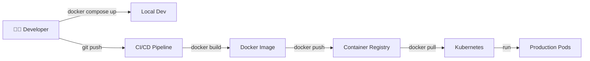

# Containerization — Đóng gói và chạy Microservice với Container

## 📋 Mục lục

- [1. Giới thiệu](#1-giới-thiệu)
- [2. Container là gì?](#2-container-là-gì)
  - [2.1. VM vs Container](#21-vm-vs-container)
  - [2.2. Tại sao Microservice cần Container?](#22-tại-sao-microservice-cần-container)
  - [2.3. Container Runtime](#23-container-runtime)
  - [2.4. Docker Alternatives](#24-docker-alternatives)
- [3. Docker](#3-docker)
  - [3.1. Docker Architecture](#31-docker-architecture)
  - [3.2. Docker Image](#32-docker-image)
  - [3.3. Dockerfile](#33-dockerfile)
  - [3.4. Image Layers & Caching](#34-image-layers--caching)
  - [3.5. Multi-stage Build](#35-multi-stage-build)
  - [3.6. Docker Networking](#36-docker-networking)
  - [3.7. Docker Volumes](#37-docker-volumes)
- [4. Docker Compose](#4-docker-compose)
  - [4.1. Docker Compose là gì?](#41-docker-compose-là-gì)
  - [4.2. Cấu trúc docker-compose.yml](#42-cấu-trúc-docker-composeyml)
  - [4.3. Networking trong Compose](#43-networking-trong-compose)
  - [4.4. Ví dụ — E-Commerce stack](#44-ví-dụ--e-commerce-stack)
- [5. Container Registry](#5-container-registry)
  - [5.1. Registry là gì?](#51-registry-là-gì)
  - [5.2. So sánh các Registry phổ biến](#52-so-sánh-các-registry-phổ-biến)
  - [5.3. Image Tagging Strategy](#53-image-tagging-strategy)
- [6. Best Practices](#6-best-practices)
  - [6.1. Tối ưu Image Size](#61-tối-ưu-image-size)
  - [6.2. Security](#62-security)
  - [6.3. Health Check](#63-health-check)
  - [6.4. Logging](#64-logging)
  - [6.5. .dockerignore](#65-dockerignore)
  - [6.6. Tổng hợp Do / Don't](#66-tổng-hợp-do--dont)
- [7. Ví dụ thực tế — E-Commerce](#7-ví-dụ-thực-tế--e-commerce)
- [8. Anti-patterns](#8-anti-patterns)
- [9. Checklist triển khai](#9-checklist-triển-khai)
- [10. Tổng kết](#10-tổng-kết)
- [11. Liên kết liên quan](#11-liên-kết-liên-quan)

---

## 1. Giới thiệu

Trong các doc trước, chúng ta đã thiết kế Microservice: tách service, giao tiếp (doc [06](06-inter-service-communication.md)), API Gateway (doc [07](07-api-gateway.md)), Service Discovery (doc [08](08-service-discovery.md)), quản lý data (doc [09](09-data-management.md)), resilience (doc [10](10-resilience-patterns.md)), observability (doc [11](11-observability-evolvability.md)).

Câu hỏi tiếp theo: **Làm sao đóng gói và chạy các service một cách nhất quán?** Dev chạy trên Mac, staging chạy trên Ubuntu, production chạy trên AWS — mỗi môi trường khác nhau → "works on my machine" problem.

**Container** giải quyết vấn đề này — đóng gói service + dependencies vào **1 đơn vị chạy được ở bất kỳ đâu**.

---

## 2. Container là gì?

### 2.1. VM vs Container

```
VM (Virtual Machine):
─────────────────────

  ┌─────────────────────────────────────────────────┐
  │  Physical Server                                │
  │                                                 │
  │  ┌───────────┐  ┌───────────┐  ┌───────────┐    │
  │  │   App A   │  │   App B   │  │   App C   │    │
  │  │  Libs/Deps│  │  Libs/Deps│  │  Libs/Deps│    │
  │  │───────────│  │───────────│  │───────────│    │
  │  │  Guest OS │  │  Guest OS │  │  Guest OS │    │
  │  │  (Ubuntu) │  │  (CentOS) │  │  (Alpine) │    │
  │  │  ~1-2 GB  │  │  ~1-2 GB  │  │  ~500 MB  │    │
  │  └───────────┘  └───────────┘  └───────────┘    │
  │  ┌─────────────────────────────────────────┐    │
  │  │           Hypervisor (VMware/KVM)       │    │
  │  └─────────────────────────────────────────┘    │
  │  ┌─────────────────────────────────────────┐    │
  │  │           Host OS (Linux)               │    │
  │  └─────────────────────────────────────────┘    │
  └─────────────────────────────────────────────────┘

  Mỗi VM chạy 1 Guest OS riêng → nặng, khởi động chậm (phút)


Container:
──────────

  ┌─────────────────────────────────────────────────┐
  │  Physical Server                                │
  │                                                 │
  │  ┌───────────┐  ┌───────────┐  ┌───────────┐    │
  │  │   App A   │  │   App B   │  │   App C   │    │
  │  │  Libs/Deps│  │  Libs/Deps│  │  Libs/Deps│    │
  │  │  ~50-200MB│  │  ~50-200MB│  │  ~30-100MB│    │
  │  └───────────┘  └───────────┘  └───────────┘    │
  │  ┌─────────────────────────────────────────┐    │
  │  │      Container Runtime (Docker/containerd)│  │
  │  └─────────────────────────────────────────┘    │
  │  ┌─────────────────────────────────────────┐    │
  │  │           Host OS (Linux Kernel)        │    │
  │  └─────────────────────────────────────────┘    │
  └─────────────────────────────────────────────────┘

  Containers CHIA SẺ kernel → nhẹ, khởi động nhanh (giây)
```

| Tiêu chí | VM | Container |
|----------|-----|-----------|
| **Isolation** | Full OS isolation | Process-level isolation (namespaces, cgroups) |
| **Size** | GB (gồm Guest OS) | MB (chỉ app + libs) |
| **Startup** | Phút | Giây (thường < 1s) |
| **Performance** | ~95% native (hypervisor overhead) | ~99% native (gần như không overhead) |
| **Density** | 10-20 VMs / server | 100-1000 containers / server |
| **OS** | Mỗi VM 1 OS riêng | Chia sẻ Host OS kernel |
| **Portability** | Nặng, khó di chuyển | Nhẹ, chạy ở đâu cũng được |
| **Use case** | Cần full OS isolation, multi-OS | Microservices, CI/CD, scale nhanh |

### 2.2. Tại sao Microservice cần Container?

```
VẤN ĐỀ KHÔNG CÓ CONTAINER:
────────────────────────────

  Hệ thống 10 services, mỗi service cần:
  • User Service:     Java 17, PostgreSQL driver
  • Order Service:    Java 21, MySQL driver
  • Product Service:  Node.js 20, sharp (image processing)
  • Payment Service:  Go 1.22
  • Notification:     Python 3.12, celery
  • ...

  Dev machine:
    → Cài Java 17 VÀ 21? → conflict JAVA_HOME
    → Cài Node.js 20 VÀ Python 3.12? → dependency hell
    → "Máy anh chạy được, máy em không chạy được" 😫

  Staging server:
    → Install tất cả runtime → mỗi lần thêm service = thêm setup
    → Service A cần libssl 1.1, Service B cần libssl 3.0 → 💥

  Production:
    → Deploy 10 services trên 5 servers
    → Service nào chạy trên server nào?
    → Scale Order Service 3 → 8 instances? → manual setup nightmare


CONTAINER GIẢI QUYẾT:
──────────────────────

  Mỗi service = 1 container image:
  ┌──────────────────────────────────────────────────────┐
  │  user-service:1.2.0                                  │
  │  ┌─────────────────────────────────────────────────┐ │
  │  │  App: user-service.jar                          │ │
  │  │  Runtime: Java 17 (JRE)                         │ │
  │  │  Libs: PostgreSQL driver, Spring Boot           │ │
  │  │  OS: Alpine Linux (minimal)                     │ │
  │  └─────────────────────────────────────────────────┘ │
  │  Tất cả đóng gói trong 1 IMAGE → chạy ở đâu cũng OK  │
  └──────────────────────────────────────────────────────┘

  Dev:   docker run user-service:1.2.0     ← chạy ngay, không cần cài Java
  Test:  docker run user-service:1.2.0     ← cùng image, kết quả giống nhau
  Prod:  docker run user-service:1.2.0     ← exact same image → no surprises
```

### 2.3. Container Runtime

Container Runtime là phần mềm **chạy containers** trên host OS. Nó được chia thành **3 tầng** với vai trò khác nhau:

```
CONTAINER RUNTIME — 3 TẦNG:
────────────────────────────

  ┌──────────────────────────────────────────────────────────┐
  │                                                          │
  │  Tầng 1 — Container Engine (High-Level):                 │
  │  ┌────────────┐  ┌────────────┐  ┌────────────┐          │
  │  │   Docker   │  │   Podman   │  │   nerdctl  │          │
  │  │  Engine    │  │ (daemonless│  │ (containerd│          │
  │  │            │  │  rootless) │  │   CLI)     │          │
  │  └─────┬──────┘  └─────┬──────┘  └─────┬──────┘          │
  │        │               │               │                 │
  │  Tầng 2 — Container Runtime (Low-Level):                 │
  │  ┌─────▼───────────────▼───────────────▼──────┐          │
  │  │            containerd / CRI-O              │          │
  │  │     (manage container lifecycle:           │          │
  │  │      pull image, create/start/stop/delete  │          │
  │  │      container, manage storage & network)  │          │
  │  └─────────────────────┬──────────────────────┘          │
  │                        │                                 │
  │  Tầng 3 — OCI Runtime (Lowest-Level):                    │
  │  ┌─────────────────────▼──────────────────────┐          │
  │  │              runc / crun                   │          │
  │  │    (tạo container process thực sự          │          │
  │  │     sử dụng Linux namespaces + cgroups)    │          │
  │  └────────────────────────────────────────────┘          │
  │                                                          │
  └──────────────────────────────────────────────────────────┘

  Docker Engine bên trong gồm:
    Docker CLI → Docker Daemon (dockerd) → containerd → runc
    │              │                        │            │
    │              │                        │            └─ Tạo process
    │              │                        └─ Quản lý lifecycle
    │              └─ Build images, manage networks, volumes
    └─ Giao diện command line cho user
```

#### Tại sao Kubernetes bỏ Docker, chuyển sang containerd?

```
VẤN ĐỀ: DOCKER TRONG KUBERNETES — QUÁ NHIỀU LAYERS:
─────────────────────────────────────────────────────

  K8s trước v1.24 — dùng Docker:
  ┌──────────────────────────────────────────────────────────┐
  │                                                          │
  │  kubelet                                                 │
  │    │                                                     │
  │    ▼                                                     │
  │  dockershim (adapter do K8s team maintain)               │
  │    │                                                     │
  │    ▼                                                     │
  │  Docker Daemon (dockerd)                                 │
  │    │  ← Docker có rất nhiều thứ K8s KHÔNG CẦN:          │
  │    │     • Docker CLI, Docker API                        │
  │    │     • Docker Compose, Docker Swarm                  │
  │    │     • Docker volumes, Docker networks               │
  │    │     • Image build                                   │
  │    ▼                                                     │
  │  containerd                                              │
  │    │                                                     │
  │    ▼                                                     │
  │  runc → Container process                                │
  │                                                          │
  │  Vấn đề:                                                 │
  │  1. dockershim = code adapter mà K8s team phải maintain  │
  │     → Mỗi bản Docker update → phải update dockershim     │
  │     → Gánh nặng maintenance cho K8s team                 │
  │                                                          │
  │  2. Docker Daemon = single point of failure              │
  │     → dockerd crash → TẤT CẢ containers trên node bị     │
  │       ảnh hưởng                                          │
  │                                                          │
  │  3. Overhead: kubelet → dockershim → dockerd → containerd│
  │     → Thừa 2 layers (dockershim + dockerd)               │
  │     → K8s chỉ cần containerd, không cần Docker           │
  │                                                          │
  │  4. CRI (Container Runtime Interface):                   │
  │     K8s định nghĩa chuẩn CRI để giao tiếp với runtime    │
  │     → containerd hỗ trợ CRI native                       │
  │     → Docker KHÔNG hỗ trợ CRI → cần dockershim           │
  └──────────────────────────────────────────────────────────┘


  K8s từ v1.24+ — dùng containerd trực tiếp:
  ┌──────────────────────────────────────────────────────────┐
  │                                                          │
  │  kubelet                                                 │
  │    │                                                     │
  │    ▼ (CRI — giao tiếp trực tiếp, không cần adapter)      │
  │  containerd                                              │
  │    │                                                     │
  │    ▼                                                     │
  │  runc → Container process                                │
  │                                                          │
  │  ✅ Bỏ 2 layers (dockershim + dockerd)                   │
  │  ✅ Ít overhead hơn → khởi động container nhanh hơn      │
  │  ✅ containerd daemon-per-container → crash 1 container  │
  │     không ảnh hưởng container khác                       │
  │  ✅ K8s team không cần maintain dockershim nữa           │
  └──────────────────────────────────────────────────────────┘
```

```
CÂU HỎI THƯỜNG GẶP:
────────────────────

  Q: "K8s bỏ Docker → Docker images không chạy được nữa?"
  A: SAI! Docker images VẪN chạy bình thường.
     Docker images tuân chuẩn OCI (Open Container Initiative).
     containerd, CRI-O, Podman đều chạy được OCI images.
     Chỉ Docker RUNTIME bị thay thế, không phải Docker IMAGE FORMAT.

  Q: "Vậy còn cần Docker không?"
  A: CÓ — cho DEV và CI/CD:
     • Dev: docker build, docker compose (local development)
     • CI/CD: docker build → push image lên registry
     • Production (K8s): containerd pull image từ registry → chạy
     → Docker để BUILD, containerd để RUN (trên K8s)

  Q: "Nếu không dùng K8s thì sao?"
  A: Docker Engine vẫn là lựa chọn tốt nhất cho:
     • Development (Docker Desktop, Docker Compose)
     • Standalone servers (docker run trực tiếp)
     • CI/CD pipelines (docker build)
```

| Runtime | Vai trò | Mô tả | Dùng khi |
|---------|---------|--------|----------|
| **Docker Engine** | Container Engine | Full-featured: CLI + build + compose + daemon + containerd | Dev, CI/CD, standalone servers |
| **containerd** | Container Runtime | Lightweight, CRI-native, CNCF graduated | K8s production (default từ v1.24) |
| **CRI-O** | Container Runtime | Minimal, chỉ cho K8s, OCI-compliant | OpenShift, K8s production |
| **runc** | OCI Runtime | Tạo container process (namespaces + cgroups) | Được dùng bởi containerd, CRI-O |
| **crun** | OCI Runtime | Alternative cho runc, viết bằng C (nhanh hơn) | Performance-focused |

### 2.4. Docker Alternatives

Docker không phải lựa chọn duy nhất. Có nhiều công cụ thay thế cho từng giai đoạn (build, run, orchestrate):

#### Podman — Drop-in Docker Replacement

```
PODMAN:
───────

  Bản chất: Container engine tương thích Docker CLI
  Phát triển bởi: Red Hat
  Đặc điểm nổi bật: DAEMONLESS + ROOTLESS

  Docker:
  ┌────────────────────────────────────────────┐
  │  docker CLI → Docker Daemon (root)         │
  │         → containerd → runc                │
  │                    │                       │
  │         Daemon chạy background, quyền ROOT │
  │         → Single point of failure          │
  │         → Security risk (root daemon)      │
  └────────────────────────────────────────────┘

  Podman:
  ┌────────────────────────────────────────────────────────────┐
  │podman CLI → conmon (per-container) → runc                  │
  │                                                            │
  │  ✅ Không có daemon (daemonless)                           │
  │     → Không có single point of failure                     │
  │     → Mỗi container có process monitor riêng (conmon)      │
  │                                                            │
  │  ✅ Chạy rootless (không cần quyền root)                   │
  │     → User thường chạy container → an toàn hơn             │
  │     → Container bị hack → chỉ có quyền user, không root    │
  │                                                            │
  │  ✅ Docker CLI compatible                                  │
  │     → alias docker=podman                                  │
  │     → Chạy Dockerfile, docker-compose* không đổi           │
  │     (*podman-compose hoặc podman với docker-compose v2)    │
  └────────────────────────────────────────────────────────────┘

  So sánh nhanh:
  ┌──────────────────────┬─────────────────┬────────────────────┐
  │                      │   Docker        │   Podman           │
  │──────────────────────│─────────────────│────────────────────│
  │ Daemon               │ ✅ Có (dockerd) │ ❌ Không           │
  │ Rootless             │ ⚠️ Có (hạn chế) │ ✅ Native          │
  │ CLI compatible       │ —               │ ✅ 99% giống       │
  │ Compose              │ ✅ Native       │ ✅ podman-compose  │
  │ Pod (group containers)│ ❌             │ ✅ (giống K8s pod) │
  │ Systemd integration  │ ⚠️ Hạn chế      │ ✅ Native          │
  │ Build images         │ ✅ docker build │ ✅ podman build    │
  │ OS                   │ Linux/Mac/Win   │ Linux (Mac qua VM) │
  └──────────────────────┴─────────────────┴────────────────────┘
```

#### Buildah & Kaniko — Build Images không cần Docker

```
BUILD IMAGE KHÔNG CẦN DOCKER DAEMON:
─────────────────────────────────────

  Vấn đề: CI/CD pipeline cần build Docker image
  → Chạy Docker daemon trong CI → phức tạp, security risk
  → "Docker in Docker" (DinD) → nhiều vấn đề

  Giải pháp:

  1. Buildah (Red Hat):
  ─────────────────────
  • Build OCI images KHÔNG cần daemon
  • Rootless build
  • Tương thích Dockerfile
  • Thường dùng cặp với Podman:
    Buildah build → Podman run

  # Build image bằng Buildah
  buildah bud -t user-service:1.0 .
  buildah push user-service:1.0 docker://registry.example.com/user-service:1.0


  2. Kaniko (Google):
  ───────────────────
  • Build image TRONG Kubernetes (không cần Docker daemon)
  • Chạy như container/pod trên K8s
  • Phổ biến trong CI/CD trên K8s (GitLab CI, Tekton)
  • Không cần privileged mode

  # Kaniko trong K8s pod
  apiVersion: v1
  kind: Pod
  spec:
    containers:
      - name: kaniko
        image: gcr.io/kaniko-project/executor:latest
        args:
          - "--dockerfile=Dockerfile"
          - "--context=git://github.com/myrepo/app.git"
          - "--destination=registry.example.com/user-service:1.0"


  3. BuildKit (Docker):
  ─────────────────────
  • Docker build engine thế hệ mới (đã thành default từ Docker 23.0)
  • Parallel build stages → nhanh hơn legacy builder
  • Better caching, secret mount
  • Có thể chạy standalone (không cần Docker daemon)
  
  DOCKER_BUILDKIT=1 docker build .
```

#### nerdctl — Docker CLI cho containerd

```
NERDCTL:
────────

  Bản chất: Docker-compatible CLI cho containerd
  → Dùng containerd trực tiếp, không cần Docker daemon

  # Tương đương docker commands:
  nerdctl run -d --name web nginx
  nerdctl build -t myapp:1.0 .
  nerdctl compose up -d
  nerdctl push myapp:1.0

  Khi nào dùng?
  → Server đã cài containerd (K8s node) mà muốn chạy container thủ công
  → Không muốn cài Docker daemon chỉ để debug
  → Muốn dùng các tính năng containerd native (lazy pulling, stargz)
```

#### Tổng hợp — Chọn công cụ nào?

```
CHỌN NHANH:
───────────

  ┌──────────────────────────────────────────────────────────────┐
  │  Giai đoạn        │  Công cụ                │  Ghi chú       │
  │───────────────────│─────────────────────────│────────────────│
  │  Dev (local)      │  Docker Desktop         │  Đơn giản nhất │
  │                   │  hoặc Podman Desktop    │  Rootless      │
  │                   │                         │                │
  │  Build (CI/CD)    │  Docker Build / BuildKit│  Phổ biến nhất │
  │                   │  Kaniko                 │  Build trên K8s│
  │                   │  Buildah                │  Rootless build│
  │                   │                         │                │
  │  Run (Production) │  containerd (K8s)       │  K8s default   │
  │                   │  CRI-O (OpenShift)      │  Minimal       │
  │                   │  Docker Engine          │  Standalone    │
  │                   │  Podman                 │  Rootless run  │
  │                   │                         │                │
  │  Debug (K8s node) │  nerdctl                │  containerd CLI│
  │                   │  crictl                 │  CRI debug CLI │
  └──────────────────────────────────────────────────────────────┘

  Phổ biến nhất (2024-2025):
  • Dev:        Docker Desktop (~70%) > Podman (~20%) > others
  • CI/CD:      Docker Build (~60%) > Kaniko (~25%) > Buildah (~10%)
  • Production: containerd (K8s) (~80%) > CRI-O (~15%) > Docker (~5%)
```

> **Tóm lại**: Docker vẫn là **best choice cho development**. Nhưng trên production (K8s), containerd đã thay thế Docker runtime. Nếu cần rootless/daemonless → Podman. Nếu build trên K8s → Kaniko. Image format (OCI) là chuẩn chung — build bằng tool nào, chạy bằng runtime nào cũng được.

---

## 3. Docker

### 3.1. Docker Architecture

```
DOCKER ARCHITECTURE:
────────────────────

  ┌─────────────┐        ┌──────────────────────────────────────────┐
  │  Docker CLI │        │  Docker Host                             │
  │             │        │                                          │
  │ docker run  │──API──▶│  ┌──────────────┐                        │
  │ docker build│        │  │ Docker Daemon│  (dockerd)             │
  │ docker pull │        │  │              │                        │
  │ docker ps   │        │  │  • Build images                       │
  │             │        │  │  • Run containers                     │
  │             │        │  │  • Manage networks                    │
  │             │        │  │  • Manage volumes                     │
  │             │        │  └──────┬───────┘                        │
  │             │        │         │                                │
  │             │        │  ┌──────▼───────┐                        │
  │             │        │  │  containerd  │                        │
  │             │        │  │  (container  │                        │
  │             │        │  │   lifecycle) │                        │
  │             │        │  └──────┬───────┘                        │
  │             │        │         │                                │
  │             │        │  ┌──────▼───────┐  ┌──────────┐          │
  │             │        │  │    runc      │  │ Container│          │
  │             │        │  │ (OCI runtime)│─▶│ Process  │          │
  │             │        │  └──────────────┘  └──────────┘          │
  │             │        │                                          │
  └─────────────┘        └──────────────────────────────────────────┘
                                    │
                         ┌──────────▼───────────┐
                         │  Container Registry  │
                         │  (Docker Hub, ECR,   │
                         │   GCR, ACR)          │
                         └──────────────────────┘

  Flow: docker run nginx
  1. CLI gửi request → Docker Daemon
  2. Daemon check image local → không có → pull từ Registry
  3. Daemon gọi containerd → tạo container
  4. containerd gọi runc → tạo process với namespaces + cgroups
  5. Container chạy!
```

### 3.2. Docker Image

Image là **template read-only** chứa mọi thứ cần để chạy application.

```
DOCKER IMAGE STRUCTURE:
───────────────────────

  Image: user-service:1.2.0
  ┌─────────────────────────────────────┐
  │  Layer 5: COPY app.jar (10 MB)      │  ← Thay đổi thường xuyên
  │  Layer 4: RUN apt-get install (50MB)│
  │  Layer 3: ENV JAVA_HOME=/usr/lib..  │  ← Metadata (0 bytes)
  │  Layer 2: RUN apt-get update (30MB) │
  │  Layer 1: Base image - Alpine (5MB) │  ← Ít thay đổi
  └─────────────────────────────────────┘

  Đặc điểm:
  • Mỗi instruction trong Dockerfile = 1 layer
  • Layers được CACHE → build lần 2 nhanh hơn
  • Layers được CHIA SẺ giữa images
    (100 images dùng Alpine → chỉ tải Alpine 1 lần)
  • Image = read-only; container = image + writable layer

  Container:
  ┌─────────────────────────────────────┐
  │  Writable Layer (container data)    │  ← Mất khi container bị xóa
  │─────────────────────────────────────│
  │  Layer 5: app.jar                   │
  │  Layer 4: apt-get install           │  ← Read-only
  │  Layer 3: ENV                       │  ← (từ Image)
  │  Layer 2: apt-get update            │
  │  Layer 1: Alpine                    │
  └─────────────────────────────────────┘
```

### 3.3. Dockerfile

Dockerfile là file chỉ dẫn **cách build Docker image**.

```dockerfile
# ===== Dockerfile cho Java Spring Boot Service =====

# 1. Base image — chọn image nhỏ nhất phù hợp
FROM eclipse-temurin:21-jre-alpine

# 2. Metadata
LABEL maintainer="team-user@company.com"
LABEL service="user-service"

# 3. Tạo user KHÔNG phải root (security best practice)
RUN addgroup -S appgroup && adduser -S appuser -G appgroup

# 4. Working directory
WORKDIR /app

# 5. Copy file cần thiết
COPY target/user-service-1.2.0.jar app.jar

# 6. Chuyển sang non-root user
USER appuser

# 7. Expose port (documentation — không thực sự mở port)
EXPOSE 8081

# 8. Health check
HEALTHCHECK --interval=30s --timeout=3s --retries=3 \
  CMD wget -qO- http://localhost:8081/actuator/health || exit 1

# 9. Entrypoint — command chạy khi container start
ENTRYPOINT ["java", "-jar", "app.jar"]
```

```dockerfile
# ===== Dockerfile cho Node.js Service =====

FROM node:20-alpine

RUN addgroup -S appgroup && adduser -S appuser -G appgroup

WORKDIR /app

# Copy package.json TRƯỚC → tận dụng cache
COPY package.json package-lock.json ./
RUN npm ci --only=production

# Copy source code SAU (thay đổi thường xuyên → layer sau)
COPY src/ ./src/

USER appuser

EXPOSE 3000

HEALTHCHECK --interval=30s --timeout=3s --retries=3 \
  CMD wget -qO- http://localhost:3000/health || exit 1

CMD ["node", "src/index.js"]
```

```dockerfile
# ===== Dockerfile cho Go Service =====

FROM golang:1.22-alpine AS builder

WORKDIR /app
COPY go.mod go.sum ./
RUN go mod download
COPY . .
RUN CGO_ENABLED=0 GOOS=linux go build -o payment-service ./cmd/server

# --- Final stage ---
FROM scratch

COPY --from=builder /app/payment-service /payment-service

EXPOSE 8084

ENTRYPOINT ["/payment-service"]
```

### 3.4. Image Layers & Caching

```
DOCKER BUILD CACHE:
───────────────────

  Dockerfile:                          Build lần 1:       Build lần 2
                                                         (chỉ đổi app.jar):
  FROM alpine                          Layer 1: BUILD ✓   Layer 1: CACHED ✓
  RUN apk add openjdk21-jre            Layer 2: BUILD ✓   Layer 2: CACHED ✓
  COPY pom.xml .                       Layer 3: BUILD ✓   Layer 3: CACHED ✓
  RUN mvn dependency:resolve           Layer 4: BUILD ✓   Layer 4: CACHED ✓
  COPY target/app.jar .                Layer 5: BUILD ✓   Layer 5: BUILD ✓ ←đổi
  CMD ["java", "-jar", "app.jar"]      Layer 6: BUILD ✓   Layer 6: BUILD ✓

  Build lần 1: ~3 phút (tải dependencies)
  Build lần 2: ~5 giây (chỉ copy jar mới) 🚀

  ⚠️ QUAN TRỌNG: Khi 1 layer thay đổi → TẤT CẢ layers SAU bị invalidate

  ❌ SAI — copy tất cả trước:
  ─────────────────────────────
  COPY . .                    ← Bất kỳ file nào đổi → invalidate
  RUN npm install             ← Phải install lại TẤT CẢ dependencies
  
  ✅ ĐÚNG — copy package.json trước:
  ──────────────────────────────────
  COPY package.json .         ← Chỉ invalidate khi package.json đổi
  RUN npm install             ← Cache nếu package.json không đổi
  COPY src/ ./src/            ← Source code đổi? Chỉ copy lại, không install lại
```

### 3.5. Multi-stage Build

Multi-stage Build (xây dựng nhiều giai đoạn) dùng **nhiều FROM** trong 1 Dockerfile — tách phần build và phần chạy → image nhỏ hơn, an toàn hơn.

```dockerfile
# ===== Multi-stage Build — Java Spring Boot =====

# ---- Stage 1: BUILD ----
FROM maven:3.9-eclipse-temurin-21-alpine AS builder

WORKDIR /app

# Copy pom.xml trước → cache dependencies
COPY pom.xml .
RUN mvn dependency:go-offline

# Copy source và build
COPY src/ ./src/
RUN mvn package -DskipTests

# ---- Stage 2: RUN ----
FROM eclipse-temurin:21-jre-alpine

RUN addgroup -S appgroup && adduser -S appuser -G appgroup

WORKDIR /app

# Chỉ copy JAR từ stage build → không có Maven, source code, build tools
COPY --from=builder /app/target/*.jar app.jar

USER appuser
EXPOSE 8081

ENTRYPOINT ["java", "-jar", "app.jar"]
```

```
TẠI SAO MULTI-STAGE?
─────────────────────

  Single-stage:
  ┌──────────────────────────────┐
  │  Maven 3.9        (200 MB)   │
  │  JDK 21           (350 MB)   │
  │  Source code       (10 MB)   │
  │  Dependencies      (150 MB)  │
  │  app.jar           (50 MB)   │
  │  .git/             (30 MB)   │
  │                              │
  │  TOTAL: ~790 MB 😱           │
  └──────────────────────────────┘

  Multi-stage:
  ┌──────────────────────────────┐
  │  JRE 21 (Alpine)   (100 MB)  │  ← Chỉ JRE, không cần JDK
  │  app.jar           (50 MB)   │  ← Chỉ artifact cuối
  │                              │
  │  TOTAL: ~150 MB ✅           │
  │  Không có: Maven, source,    │
  │  .git, build tools           │
  └──────────────────────────────┘

  → 5x nhỏ hơn
  → Ít attack surface hơn (không có build tools trong production)
  → Pull/deploy nhanh hơn
```

```dockerfile
# ===== Multi-stage Build — Node.js =====

# ---- Stage 1: Install dependencies ----
FROM node:20-alpine AS deps

WORKDIR /app
COPY package.json package-lock.json ./
RUN npm ci --only=production

# ---- Stage 2: Build (nếu cần TypeScript/bundler) ----
FROM node:20-alpine AS builder

WORKDIR /app
COPY package.json package-lock.json ./
RUN npm ci
COPY tsconfig.json ./
COPY src/ ./src/
RUN npm run build

# ---- Stage 3: Run ----
FROM node:20-alpine

RUN addgroup -S appgroup && adduser -S appuser -G appgroup

WORKDIR /app

# Chỉ copy production dependencies + compiled code
COPY --from=deps /app/node_modules ./node_modules
COPY --from=builder /app/dist ./dist
COPY package.json ./

USER appuser
EXPOSE 3000

CMD ["node", "dist/index.js"]
```

```dockerfile
# ===== Multi-stage Build — Go (extreme small) =====

# ---- Stage 1: BUILD ----
FROM golang:1.22-alpine AS builder

WORKDIR /app
COPY go.mod go.sum ./
RUN go mod download

COPY . .
RUN CGO_ENABLED=0 GOOS=linux GOARCH=amd64 \
    go build -ldflags="-s -w" -o server ./cmd/server

# ---- Stage 2: RUN ----
FROM scratch
# scratch = image TRỐNG hoàn toàn (0 bytes)

# Copy CA certificates (nếu cần gọi HTTPS)
COPY --from=builder /etc/ssl/certs/ca-certificates.crt /etc/ssl/certs/

COPY --from=builder /app/server /server

EXPOSE 8084

ENTRYPOINT ["/server"]

# Final image: ~10-15 MB (chỉ có 1 binary Go) 🚀
```

### 3.6. Docker Networking

```
DOCKER NETWORKING:
──────────────────

  Docker tạo virtual networks để containers giao tiếp:

  1. BRIDGE (default) — Containers trên cùng host:
  ─────────────────────────────────────────────────
  ┌──────────────────────────────────────────────┐
  │  Docker Host                                 │
  │                                              │
  │  ┌───────────┐       ┌───────────┐           │
  │  │ Container │       │ Container │           │
  │  │ user-svc  │       │ order-svc │           │
  │  │ 172.17.0.2│       │ 172.17.0.3│           │
  │  └─────┬─────┘       └─────┬─────┘           │
  │        │                   │                 │
  │  ┌─────┴───────────────────┴─────┐           │
  │  │     docker0 (bridge)          │           │
  │  │     172.17.0.1                │           │
  │  └───────────────────────────────┘           │
  └──────────────────────────────────────────────┘

  # Tạo custom bridge network (khuyến nghị):
  docker network create my-app
  docker run --network my-app --name user-svc user-service:1.0
  docker run --network my-app --name order-svc order-service:1.0

  # order-svc gọi user-svc bằng TÊN container:
  http://user-svc:8081/users/123
  → Docker DNS tự resolve → 172.17.0.2


  2. HOST — Container dùng network của host:
  ──────────────────────────────────────────
  docker run --network host nginx
  # Container dùng trực tiếp port của host
  # Không có network isolation
  # Performance tốt nhất (no NAT overhead)
  # Chỉ dùng trên Linux


  3. NONE — Không có network:
  ──────────────────────────
  docker run --network none alpine
  # Hoàn toàn isolated, không giao tiếp được
  # Dùng cho batch jobs, data processing
```

### 3.7. Docker Volumes

```
DOCKER VOLUMES — Persistent Data:
──────────────────────────────────

  Container xóa → data trong container MẤT.
  Volume giải quyết: lưu data BÊN NGOÀI container.

  ┌──────────────────────────────────────────────────┐
  │  Docker Host                                     │
  │                                                  │
  │  ┌───────────┐         ┌───────────┐             │
  │  │ PostgreSQL│         │ PostgreSQL│             │
  │  │ Container │         │ Container │             │
  │  │ (v15)     │ delete  │ (v16)     │  ← Upgrade  │
  │  └─────┬─────┘ ──────▶ └─────┬─────┘    version  │
  │        │                     │                   │
  │        │     CÙNG VOLUME     │                   │
  │        │         │           │                   │
  │  ┌─────▼─────────▼───────────▼─────┐             │
  │  │  Volume: postgres-data          │             │
  │  │  /var/lib/docker/volumes/...    │             │
  │  │  DATA VẪN CÒN NGUYÊN ✅         │             │
  │  └─────────────────────────────────┘             │
  └──────────────────────────────────────────────────┘

  3 loại mount:

  1. Named Volume (khuyến nghị cho production):
     docker volume create postgres-data
     docker run -v postgres-data:/var/lib/postgresql/data postgres

  2. Bind Mount (dev — mount code từ host):
     docker run -v $(pwd)/src:/app/src node:20
     → Sửa code trên host → container thấy ngay (hot reload)

  3. tmpfs Mount (temporary, in-memory):
     docker run --tmpfs /tmp my-app
     → Data chỉ ở RAM, mất khi container stop
     → Dùng cho: cache, temp files, sensitive data
```

---

## 4. Docker Compose

### 4.1. Docker Compose là gì?

Docker Compose là tool để **định nghĩa và chạy multi-container** applications bằng 1 file YAML.

```
KHÔNG CÓ COMPOSE:
──────────────────
  # Tạo network
  docker network create ecommerce

  # Chạy PostgreSQL
  docker run -d --name postgres --network ecommerce \
    -v pg-data:/var/lib/postgresql/data \
    -e POSTGRES_PASSWORD=secret postgres:16

  # Chạy Redis
  docker run -d --name redis --network ecommerce redis:7-alpine

  # Chạy User Service
  docker run -d --name user-svc --network ecommerce \
    -e DB_HOST=postgres -e REDIS_HOST=redis \
    -p 8081:8081 user-service:1.0

  # Chạy Order Service  
  docker run -d --name order-svc --network ecommerce \
    -e DB_HOST=postgres -e USER_SERVICE_URL=http://user-svc:8081 \
    -p 8082:8082 order-service:1.0

  # ... còn 4 services nữa? 😰
  # Muốn stop tất cả? docker stop từng cái? 😫


CÓ COMPOSE:
────────────
  docker compose up -d      ← Start tất cả
  docker compose down       ← Stop tất cả
  docker compose logs -f    ← Xem logs tất cả
  docker compose ps         ← Xem status

  1 command thay vì 10+ commands ✅
```

### 4.2. Cấu trúc docker-compose.yml

```yaml
# docker-compose.yml — Cấu trúc cơ bản

services:
  # ---- Service 1 ----
  user-service:
    build:
      context: ./services/user          # Thư mục chứa Dockerfile
      dockerfile: Dockerfile
    image: user-service:1.0             # Tên image sau khi build
    container_name: user-svc
    ports:
      - "8081:8081"                     # host:container
    environment:
      - DB_HOST=postgres
      - DB_PORT=5432
      - REDIS_HOST=redis
    depends_on:
      postgres:
        condition: service_healthy      # Chờ postgres healthy mới start
      redis:
        condition: service_started
    networks:
      - backend
    restart: unless-stopped             # Tự restart nếu crash

  # ---- Database ----
  postgres:
    image: postgres:16-alpine
    environment:
      POSTGRES_DB: userdb
      POSTGRES_USER: app
      POSTGRES_PASSWORD: ${DB_PASSWORD}  # Từ .env file
    volumes:
      - pg-data:/var/lib/postgresql/data
      - ./init.sql:/docker-entrypoint-initdb.d/init.sql
    ports:
      - "5432:5432"
    networks:
      - backend
    healthcheck:
      test: ["CMD-SHELL", "pg_isready -U app"]
      interval: 10s
      timeout: 5s
      retries: 5

  # ---- Cache ----
  redis:
    image: redis:7-alpine
    command: redis-server --requirepass ${REDIS_PASSWORD}
    volumes:
      - redis-data:/data
    networks:
      - backend

# ---- Volumes ----
volumes:
  pg-data:
  redis-data:

# ---- Networks ----
networks:
  backend:
    driver: bridge
```

### 4.3. Networking trong Compose

```
COMPOSE NETWORKING:
───────────────────

  Docker Compose tự tạo network cho project.
  Containers gọi nhau bằng SERVICE NAME (không phải container_name).

  docker-compose.yml:
  ┌────────────────────────────────────────────────────┐
  │  services:                                         │
  │    user-service:    ...                            │
  │    order-service:   ...                            │
  │    postgres:        ...                            │
  │    redis:           ...                            │
  └────────────────────────────────────────────────────┘
                        │
                        ▼
  ┌────────────────────────────────────────────────────┐
  │  Network: myproject_default (auto-created)         │
  │                                                    │
  │  ┌──────────────┐        ┌──────────────┐          │
  │  │ user-service │◄──────▶│ order-service│          │
  │  │ DNS: user-   │        │ DNS: order-  │          │
  │  │   service    │        │   service    │          │
  │  └──────────────┘        └──────────────┘          │
  │         │                       │                  │
  │         ▼                       ▼                  │
  │  ┌──────────────┐        ┌──────────────┐          │
  │  │   postgres   │        │    redis     │          │
  │  └──────────────┘        └──────────────┘          │
  └────────────────────────────────────────────────────┘

  Trong code Order Service:
    DB_HOST=postgres            ← service name, KHÔNG phải IP
    USER_SERVICE=http://user-service:8081/api
    REDIS_HOST=redis

  Compose DNS tự resolve:
    user-service → 172.18.0.2
    postgres     → 172.18.0.4
```

### 4.4. Ví dụ — E-Commerce stack

```yaml
# docker-compose.yml — E-Commerce Development Stack

services:
  # ===== API Gateway =====
  api-gateway:
    build: ./services/api-gateway
    ports:
      - "8080:8080"
    environment:
      - USER_SERVICE_URL=http://user-service:8081
      - ORDER_SERVICE_URL=http://order-service:8082
      - PRODUCT_SERVICE_URL=http://product-service:8083
    depends_on:
      - user-service
      - order-service
      - product-service
    networks:
      - frontend
      - backend

  # ===== Business Services =====
  user-service:
    build: ./services/user
    ports:
      - "8081:8081"
    environment:
      - DB_URL=jdbc:postgresql://postgres:5432/userdb
      - REDIS_HOST=redis
    depends_on:
      postgres:
        condition: service_healthy
    networks:
      - backend

  order-service:
    build: ./services/order
    ports:
      - "8082:8082"
    environment:
      - DB_URL=jdbc:postgresql://postgres:5432/orderdb
      - KAFKA_BROKERS=kafka:9092
      - PAYMENT_SERVICE_URL=http://payment-service:8084
    depends_on:
      postgres:
        condition: service_healthy
      kafka:
        condition: service_healthy
    networks:
      - backend

  product-service:
    build: ./services/product
    ports:
      - "8083:8083"
    environment:
      - MONGO_URI=mongodb://mongo:27017/products
      - REDIS_HOST=redis
    depends_on:
      - mongo
    networks:
      - backend

  payment-service:
    build: ./services/payment
    ports:
      - "8084:8084"
    environment:
      - DB_URL=jdbc:postgresql://postgres:5432/paymentdb
    depends_on:
      postgres:
        condition: service_healthy
    networks:
      - backend

  # ===== Infrastructure =====
  postgres:
    image: postgres:16-alpine
    environment:
      POSTGRES_USER: app
      POSTGRES_PASSWORD: ${DB_PASSWORD:-secret}
    volumes:
      - pg-data:/var/lib/postgresql/data
      - ./infra/postgres/init:/docker-entrypoint-initdb.d
    healthcheck:
      test: ["CMD-SHELL", "pg_isready -U app"]
      interval: 10s
      timeout: 5s
      retries: 5
    networks:
      - backend

  mongo:
    image: mongo:7
    volumes:
      - mongo-data:/data/db
    networks:
      - backend

  redis:
    image: redis:7-alpine
    command: redis-server --appendonly yes
    volumes:
      - redis-data:/data
    networks:
      - backend

  kafka:
    image: confluentinc/cp-kafka:7.6.0
    environment:
      KAFKA_NODE_ID: 1
      KAFKA_PROCESS_ROLES: broker,controller
      KAFKA_LISTENERS: PLAINTEXT://0.0.0.0:9092,CONTROLLER://0.0.0.0:9093
      KAFKA_ADVERTISED_LISTENERS: PLAINTEXT://kafka:9092
      KAFKA_CONTROLLER_QUORUM_VOTERS: 1@kafka:9093
      KAFKA_CONTROLLER_LISTENER_NAMES: CONTROLLER
      CLUSTER_ID: 'MkU3OEVBNTcwNTJENDM2Qk'
    volumes:
      - kafka-data:/var/lib/kafka/data
    healthcheck:
      test: kafka-broker-api-versions --bootstrap-server localhost:9092
      interval: 15s
      timeout: 10s
      retries: 5
    networks:
      - backend

volumes:
  pg-data:
  mongo-data:
  redis-data:
  kafka-data:

networks:
  frontend:
  backend:
```

```
COMPOSE COMMANDS:
─────────────────

  # Start toàn bộ stack
  docker compose up -d

  # Xem logs 1 service
  docker compose logs -f order-service

  # Scale 1 service
  docker compose up -d --scale order-service=3

  # Rebuild 1 service sau khi sửa code
  docker compose up -d --build user-service

  # Stop tất cả (giữ data)
  docker compose down

  # Stop tất cả + XÓA data (volumes)
  docker compose down -v

  # Chạy command trong container
  docker compose exec postgres psql -U app -d userdb
```

---

## 5. Container Registry

### 5.1. Registry là gì?

Container Registry là nơi **lưu trữ và phân phối Docker images** — giống như npm registry cho Node.js packages, Maven Central cho Java artifacts.

```
REGISTRY WORKFLOW:
──────────────────

  Developer                 CI/CD                    Production
  ┌──────────┐         ┌──────────┐              ┌──────────┐
  │ docker   │         │ docker   │              │ docker   │
  │ build    │         │ push     │              │ pull     │
  │          │         │          │              │          │
  └────┬─────┘         └────┬─────┘              └────┬─────┘
       │                    │                         │
       │    ┌───────────────▼─────────────────────────▼────┐
       │    │         Container Registry                   │
       │    │                                              │
       └───▶│  user-service:1.0.0                          │
            │  user-service:1.1.0                          │
            │  user-service:latest                         │
            │  order-service:2.0.0                         │
            │  order-service:2.0.0-rc1                     │
            │                                              │
            │  Lưu trữ images theo repository + tag        │
            └──────────────────────────────────────────────┘
```

### 5.2. So sánh các Registry phổ biến

| Registry | Provider | Pricing | Đặc điểm |
|----------|----------|---------|-----------|
| **Docker Hub** | Docker | Free (1 private repo) | Phổ biến nhất, public images |
| **Amazon ECR** | AWS | Pay per storage + transfer | Tích hợp ECS/EKS, IAM auth |
| **Google GCR / Artifact Registry** | GCP | Pay per storage | Tích hợp GKE, vulnerability scanning |
| **Azure ACR** | Azure | Tier-based | Tích hợp AKS, geo-replication |
| **GitHub Container Registry (ghcr.io)** | GitHub | Free for public | Tích hợp GitHub Actions |
| **GitLab Container Registry** | GitLab | Included | Built-in với GitLab CI/CD |
| **Harbor** | CNCF (self-hosted) | Free (OSS) | Self-hosted, vulnerability scanning, RBAC |

### 5.3. Image Tagging Strategy

```
IMAGE TAGGING — CHIẾN LƯỢC ĐẶT TÊN:
─────────────────────────────────────

  ❌ ĐỪNG dùng :latest trong production:
  docker pull user-service:latest
  → Phiên bản nào? Ai build? Khi nào? → KHÔNG BIẾT

  ✅ Dùng Semantic Versioning:
  user-service:1.2.3
  │            │ │ │
  │            │ │ └── Patch: bug fix
  │            │ └──── Minor: feature mới, backward compatible
  │            └────── Major: breaking change

  ✅ Hoặc Git SHA (immutable, traceable):
  user-service:a1b2c3d
  → Biết chính xác commit nào đã build image này

  ✅ Kết hợp cả hai (khuyến nghị):
  user-service:1.2.3              ← Human-readable
  user-service:1.2.3-a1b2c3d     ← Có cả version + commit
  user-service:a1b2c3d            ← CI/CD auto-tag

  Ví dụ CI/CD pipeline:
  ──────────────────────
  Build image:
    docker build -t user-service:${GIT_SHA} .
    docker tag user-service:${GIT_SHA} user-service:${VERSION}
    docker tag user-service:${GIT_SHA} user-service:latest
  Push:
    docker push user-service:${GIT_SHA}
    docker push user-service:${VERSION}
    docker push user-service:latest
  Deploy (production):
    image: user-service:1.2.3     ← Pin version cụ thể, KHÔNG dùng latest
```

---

## 6. Best Practices

### 6.1. Tối ưu Image Size

```
TỐI ƯU IMAGE SIZE:
───────────────────

  1. Chọn base image nhỏ:
  ──────────────────────
  │ Base Image              │ Size    │ Ghi chú                    │
  │─────────────────────────│─────────│────────────────────────────│
  │ ubuntu:22.04            │ 77 MB   │ Full OS, nhiều tools       │
  │ debian:bookworm-slim    │ 74 MB   │ Slim version               │
  │ alpine:3.19             │ 7 MB    │ Minimal, musl libc         │
  │ node:20                 │ 1.1 GB  │ Full Node + Debian         │
  │ node:20-slim            │ 200 MB  │ Slim Debian                │
  │ node:20-alpine          │ 130 MB  │ Alpine-based ✅            │
  │ gcr.io/distroless/java  │ 200 MB  │ No shell, no package mgr   │
  │ scratch                 │ 0 MB    │ Empty, cho Go/Rust binary  │

  2. Giảm layers:
  ───────────────
  ❌ Nhiều RUN = nhiều layers:
  RUN apt-get update
  RUN apt-get install -y curl
  RUN apt-get install -y wget
  RUN apt-get clean

  ✅ Gộp thành 1 RUN:
  RUN apt-get update && \
      apt-get install -y --no-install-recommends curl wget && \
      apt-get clean && \
      rm -rf /var/lib/apt/lists/*

  3. Dùng Multi-stage build (xem mục 3.5)

  4. Dùng .dockerignore (xem mục 6.5)

  Kết quả:
  │ Approach                        │ Image Size │
  │─────────────────────────────────│────────────│
  │ Java + Ubuntu + JDK + Maven     │ ~800 MB    │
  │ Java + Alpine + JRE + Multi     │ ~150 MB    │
  │ Node + Full image               │ ~1.1 GB    │
  │ Node + Alpine + Multi-stage     │ ~150 MB    │
  │ Go + scratch + Multi-stage      │ ~10 MB     │
```

### 6.2. Security

```
CONTAINER SECURITY:
───────────────────

  1. KHÔNG chạy container với root:
  ─────────────────────────────────
  ❌ Default Docker chạy với root → nếu container bị hack → root access
  
  ✅ Tạo non-root user:
  RUN addgroup -S appgroup && adduser -S appuser -G appgroup
  USER appuser

  2. Scan image cho vulnerabilities:
  ──────────────────────────────────
  # Docker Scout (built-in)
  docker scout cves user-service:1.0

  # Trivy (phổ biến, miễn phí)
  trivy image user-service:1.0

  # Snyk
  snyk container test user-service:1.0

  3. KHÔNG đưa secrets vào image:
  ──────────────────────────────
  ❌ ENV DB_PASSWORD=supersecret          ← Ai pull image cũng thấy
  ❌ COPY .env .                          ← .env trong image layer
  ❌ RUN echo $API_KEY > /app/config      ← Trong build history

  ✅ Truyền qua runtime:
  docker run -e DB_PASSWORD=$DB_PASSWORD user-service
  # Hoặc dùng Docker secrets, Vault, AWS Secrets Manager

  4. Pin version base image:
  ─────────────────────────
  ❌ FROM node:latest        ← Thay đổi bất kỳ lúc nào
  ❌ FROM node:20            ← 20.x nào? 20.1? 20.15?
  ✅ FROM node:20.11-alpine  ← Chính xác version

  5. Read-only filesystem:
  ────────────────────────
  docker run --read-only --tmpfs /tmp user-service
  → Container không thể ghi file → giảm attack surface
```

### 6.3. Health Check

```
HEALTH CHECK:
─────────────

  Health check cho Docker biết container có ĐANG HOẠT ĐỘNG ĐÚNG không.

  Trong Dockerfile:
  ─────────────────
  HEALTHCHECK --interval=30s --timeout=3s --start-period=40s --retries=3 \
    CMD wget -qO- http://localhost:8081/health || exit 1

  • interval:      Kiểm tra mỗi 30s
  • timeout:       Timeout mỗi lần check: 3s
  • start-period:  Chờ 40s sau khi start (cho app warm up)
  • retries:       Fail 3 lần → đánh dấu "unhealthy"

  Trong docker-compose.yml:
  ─────────────────────────
  services:
    user-service:
      healthcheck:
        test: ["CMD", "wget", "-qO-", "http://localhost:8081/health"]
        interval: 30s
        timeout: 3s
        retries: 3
        start_period: 40s

  Container states:
  ─────────────────
  starting → healthy → unhealthy
                │            │
                │            └── health check fail 3 lần liên tiếp
                └── health check pass

  depends_on + health check:
  ──────────────────────────
  services:
    order-service:
      depends_on:
        postgres:
          condition: service_healthy    # Chờ postgres HEALTHY mới start
        user-service:
          condition: service_healthy    # Chờ user-service HEALTHY
```

### 6.4. Logging

```
CONTAINER LOGGING:
──────────────────

  ✅ Log ra STDOUT/STDERR (không log ra file trong container):
  ─────────────────────────────────────────────────────────────
  Container logs → Docker logging driver → thu thập bởi:
    • docker logs
    • Fluentd / Fluent Bit
    • CloudWatch Logs (AWS)
    • ELK Stack

  ❌ Log ra file trong container:
  app → /var/log/app.log → container bị xóa → MẤT logs
  → Phải mount volume → phức tạp

  ✅ Log ra stdout:
  app → stdout → Docker capture → logging driver → centralized logs

  Ví dụ — Spring Boot:
  ────────────────────
  # application.yml
  logging:
    pattern:
      console: '{"time":"%d","level":"%p","msg":"%m","service":"user-service"}%n'

  → JSON format → dễ parse bởi ELK/CloudWatch

  Ví dụ — Node.js:
  ─────────────────
  // Dùng pino (JSON logger)
  const logger = require('pino')();
  logger.info({ userId: 123, action: 'login' }, 'User logged in');
  // → stdout: {"level":30,"time":1234,"userId":123,"msg":"User logged in"}
```

### 6.5. .dockerignore

```
.DOCKERIGNORE:
──────────────

  Giống .gitignore — loại bỏ files KHÔNG CẦN khi build image.
  Đặt ở cùng thư mục với Dockerfile.

  Tại sao cần?
  ─────────────
  COPY . .  ← Copy TẤT CẢ vào build context

  Không có .dockerignore:
    Build context: 500 MB (gồm node_modules, .git, tests, docs)
    → Gửi 500 MB cho Docker Daemon → chậm
    → Image chứa files không cần thiết → lớn

  Có .dockerignore:
    Build context: 10 MB (chỉ source code + config)
    → Build nhanh hơn
    → Image nhỏ hơn

  # .dockerignore
  ────────────────
  # Version control
  .git
  .gitignore

  # Dependencies (sẽ install trong Dockerfile)
  node_modules
  vendor

  # Build output
  dist
  build
  target

  # IDE
  .idea
  .vscode
  *.swp

  # Docker
  Dockerfile
  docker-compose*.yml
  .dockerignore

  # Docs & tests
  docs
  *.md
  __tests__
  coverage

  # Secrets
  .env
  .env.*
  *.pem
  *.key
```

### 6.6. Tổng hợp Do / Don't

| ✅ Do | ❌ Don't |
|-------|---------|
| Dùng multi-stage build | Single stage với build tools trong final image |
| Chạy với non-root user | Chạy với root (default) |
| Pin version base image (`node:20.11-alpine`) | Dùng `latest` tag |
| Log ra stdout/stderr | Log ra file trong container |
| 1 process per container | Chạy nhiều process (app + cron + nginx) |
| Dùng `.dockerignore` | Copy toàn bộ repo vào image |
| COPY files cần thiết, tách layers | `COPY . .` ở đầu Dockerfile |
| Health check trong Dockerfile | Không có health check |
| Scan image vulnerabilities | Push image không scan |
| Truyền secrets qua runtime env | Hardcode secrets trong Dockerfile |
| Dùng named volumes cho data | Lưu data trong container writable layer |
| Dùng Alpine / distroless / scratch | Dùng full OS image (ubuntu, debian) |

---

## 7. Ví dụ thực tế — E-Commerce

```
E-COMMERCE — CONTAINERIZATION ARCHITECTURE:
────────────────────────────────────────────

  Scenario: 6 services, mỗi service = 1 Docker image,
  development dùng Docker Compose, production dùng Kubernetes.

  Repository Structure:
  ─────────────────────
  ecommerce/
  ├── services/
  │   ├── user-service/
  │   │   ├── Dockerfile
  │   │   ├── .dockerignore
  │   │   ├── src/
  │   │   └── pom.xml
  │   ├── order-service/
  │   │   ├── Dockerfile
  │   │   ├── .dockerignore
  │   │   ├── src/
  │   │   └── pom.xml
  │   ├── product-service/
  │   │   ├── Dockerfile
  │   │   ├── .dockerignore
  │   │   ├── src/
  │   │   └── package.json
  │   ├── payment-service/
  │   │   ├── Dockerfile
  │   │   ├── .dockerignore
  │   │   ├── cmd/
  │   │   └── go.mod
  │   ├── notification-service/
  │   │   ├── Dockerfile
  │   │   ├── .dockerignore
  │   │   ├── src/
  │   │   └── requirements.txt
  │   └── api-gateway/
  │       ├── Dockerfile
  │       ├── .dockerignore
  │       └── src/
  ├── infra/
  │   ├── postgres/
  │   │   └── init/
  │   ├── kafka/
  │   └── monitoring/
  ├── docker-compose.yml           ← Development
  ├── docker-compose.prod.yml      ← Production-like
  └── .env.example


  Image Sizes (sau khi tối ưu):
  ──────────────────────────────
  │ Service              │ Language │ Base Image                │ Size    │
  │──────────────────────│──────────│───────────────────────────│─────────│
  │ user-service         │ Java 21  │ eclipse-temurin:21-jre-alp│ 180 MB  │
  │ order-service        │ Java 21  │ eclipse-temurin:21-jre-alp│ 190 MB  │
  │ product-service      │ Node 20  │ node:20-alpine            │ 150 MB  │
  │ payment-service      │ Go 1.22  │ scratch                   │ 12 MB   │
  │ notification-service │ Python   │ python:3.12-alpine        │ 80 MB   │
  │ api-gateway          │ Java 21  │ eclipse-temurin:21-jre-alp│ 170 MB  │


  CI/CD Pipeline (per service):
  ─────────────────────────────

  ┌──────┐    ┌──────────┐    ┌──────────┐    ┌──────────┐    ┌──────────┐
  │ Push │───▶│  Build   │───▶│  Test    │───▶│  Scan    │───▶│  Push    │
  │ code │    │  image   │    │  (unit + │    │  (Trivy) │    │  to ECR  │
  │      │    │  (multi- │    │  integra-│    │          │    │          │
  │      │    │  stage)  │    │  tion)   │    │          │    │          │
  └──────┘    └──────────┘    └──────────┘    └──────────┘    └──────────┘
                                                                  │
                                                           ┌──────▼──────┐
                                                           │   Deploy    │
                                                           │   to K8s    │
                                                           └─────────────┘

  # CI/CD build command (ví dụ GitHub Actions):
  docker build \
    --build-arg VERSION=1.2.3 \
    --tag 123456789.dkr.ecr.ap-southeast-1.amazonaws.com/user-service:${GIT_SHA} \
    --tag 123456789.dkr.ecr.ap-southeast-1.amazonaws.com/user-service:1.2.3 \
    --cache-from 123456789.dkr.ecr.ap-southeast-1.amazonaws.com/user-service:latest \
    ./services/user-service
```

---

## 8. Anti-patterns

| Anti-pattern | Mô tả | Triệu chứng | Cách fix |
|-------------|--------|-------------|----------|
| **Fat Image** | Image chứa build tools, test, docs | Image 1-2 GB, deploy chậm | Multi-stage build, .dockerignore |
| **Latest Tag** | Dùng `:latest` trong production | Không biết version nào đang chạy, rollback khó | Pin version: `service:1.2.3` |
| **Root User** | Chạy container với root | Bị hack → root access trên host | `USER nonroot` trong Dockerfile |
| **Secrets in Image** | Hardcode password, API key trong Dockerfile hoặc env | Bất kỳ ai pull image đều thấy secrets | Runtime env, Docker secrets, Vault |
| **Multiple Processes** | Chạy app + cron + nginx trong 1 container | Khó scale, khó monitor, khó debug | 1 process per container |
| **No Health Check** | Không có HEALTHCHECK | Container chạy nhưng app crash → vẫn nhận traffic | Thêm HEALTHCHECK, implement /health endpoint |
| **Data in Container** | Lưu DB data trong container layer | Container restart → mất data | Dùng volumes |
| **Build on Production** | `docker build` trên production server | Chậm, không consistent, security risk | Build ở CI/CD → push image → pull trên production |
| **Ignoring .dockerignore** | Không có .dockerignore | Build context lớn, image chứa .git, node_modules | Tạo .dockerignore đầy đủ |
| **Snowflake Containers** | SSH vào container để sửa, cài thêm packages | Mỗi container khác nhau, không reproducible | Immutable: sửa Dockerfile → rebuild → redeploy |

---

## 9. Checklist triển khai

```
CONTAINERIZATION CHECKLIST:
───────────────────────────

  Dockerfile:
  ☐ Multi-stage build
  ☐ Non-root user
  ☐ Pin base image version
  ☐ COPY dependencies file trước (tận dụng cache)
  ☐ HEALTHCHECK
  ☐ .dockerignore đầy đủ
  ☐ Gộp RUN commands (giảm layers)
  ☐ Không hardcode secrets

  Image:
  ☐ Alpine hoặc distroless base image
  ☐ Image size < 200 MB (trừ Java ~ 200 MB)
  ☐ Scan vulnerabilities (Trivy/Scout)
  ☐ Semantic versioning tags
  ☐ Push lên private registry (ECR/GCR/Harbor)

  Runtime:
  ☐ Log ra stdout/stderr
  ☐ Truyền config qua environment variables
  ☐ Volumes cho persistent data
  ☐ Resource limits (CPU, memory)
  ☐ Read-only filesystem (nếu có thể)

  Docker Compose (Development):
  ☐ Health checks cho infrastructure (DB, Redis, Kafka)
  ☐ depends_on với condition: service_healthy
  ☐ Named volumes cho data persistence
  ☐ .env file cho secrets (không commit)
  ☐ Custom network (không dùng default bridge)

  CI/CD:
  ☐ Build image trong CI pipeline
  ☐ Run tests trong container
  ☐ Scan image trước khi push
  ☐ Tag với git SHA + semantic version
  ☐ Cache Docker layers trong CI
```

---

## 10. Tổng kết

```
CONTAINERIZATION — TỔNG KẾT:
─────────────────────────────

  Container giải quyết:
  ✅ "Works on my machine" → chạy ở đâu cũng giống nhau
  ✅ Dependency hell → mỗi service tự đóng gói dependencies
  ✅ Scale → tạo container mới trong giây
  ✅ Isolation → mỗi service chạy trong môi trường riêng
  ✅ CI/CD → build once, deploy anywhere

  Stack phổ biến:
  ┌──────────────────────────────────────────────────────┐
  │                                                      │
  │  Development:                                        │
  │    Docker + Docker Compose                           │
  │    → Chạy toàn bộ stack trên laptop                  │
  │                                                      │
  │  CI/CD:                                              │
  │    Docker Build → Scan → Push to Registry            │
  │    → Build image consistent, scan security           │
  │                                                      │
  │  Production:                                         │
  │    Kubernetes + containerd                           │
  │    → Orchestrate containers at scale                 │
  │    → (Chi tiết ở doc 13 — Orchestration)             │
  │                                                      │
  └──────────────────────────────────────────────────────┘
```



---

## 11. Liên kết liên quan

| Doc | Liên quan |
|-----|-----------|
| [06 - Inter-Service Communication](06-inter-service-communication.md) | Container networking cho service-to-service |
| [07 - API Gateway](07-api-gateway.md) | Gateway cũng chạy trong container (Kong pod) |
| [08 - Service Discovery](08-service-discovery.md) | Docker DNS, K8s DNS cho service discovery |
| [09 - Data Management](09-data-management.md) | Volumes cho database containers |
| [10 - Resilience Patterns](10-resilience-patterns.md) | Health check, graceful shutdown trong container |
| [11 - Observability](11-observability-evolvability.md) | Container logging (stdout → ELK) |
| [13 - Orchestration](13-orchestration.md) | Kubernetes chạy containers ở production scale |
| [14 - CI/CD & Deployment](14-cicd-deployment.md) | Docker build trong CI/CD pipeline |
