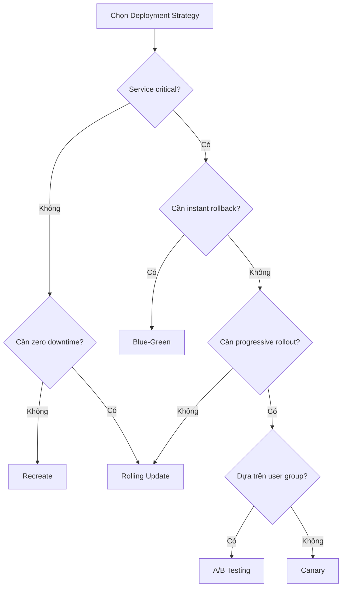

# CI/CD & Deployment Strategies cho Microservice

## 📋 Mục lục

- [1. Giới thiệu](#1-giới-thiệu)
- [2. CI — Continuous Integration](#2-ci--continuous-integration)
  - [2.1. CI là gì?](#21-ci-là-gì)
  - [2.2. CI Pipeline cho Microservice](#22-ci-pipeline-cho-microservice)
  - [2.3. Mono-repo vs Multi-repo CI](#23-mono-repo-vs-multi-repo-ci)
  - [2.4. Ví dụ — GitHub Actions CI Pipeline](#24-ví-dụ--github-actions-ci-pipeline)
- [3. CD — Continuous Delivery vs Continuous Deployment](#3-cd--continuous-delivery-vs-continuous-deployment)
  - [3.1. Phân biệt Delivery vs Deployment](#31-phân-biệt-delivery-vs-deployment)
  - [3.2. CD Pipeline cho Microservice](#32-cd-pipeline-cho-microservice)
- [4. Deployment Strategies](#4-deployment-strategies)
  - [4.1. Recreate](#41-recreate)
  - [4.2. Rolling Update](#42-rolling-update)
  - [4.3. Blue-Green Deployment](#43-blue-green-deployment)
  - [4.4. Canary Deployment](#44-canary-deployment)
  - [4.5. A/B Testing](#45-ab-testing)
  - [4.6. Rolling Update vs Blue-Green — Khác nhau thế nào?](#46-rolling-update-vs-blue-green--khác-nhau-thế-nào)
  - [4.7. So sánh tổng hợp các Deployment Strategies](#47-so-sánh-tổng-hợp-các-deployment-strategies)
- [5. GitOps](#5-gitops)
  - [5.1. GitOps là gì? Tại sao cần?](#51-gitops-là-gì-tại-sao-cần)
  - [5.2. Push-based vs Pull-based — 2 cách deploy](#52-push-based-vs-pull-based--2-cách-deploy)
  - [5.3. ArgoCD](#53-argocd)
  - [5.4. FluxCD](#54-fluxcd)
  - [5.5. So sánh ArgoCD vs FluxCD](#55-so-sánh-argocd-vs-fluxcd)
- [6. Pipeline Design cho Microservice](#6-pipeline-design-cho-microservice)
  - [6.1. Pipeline tổng quan](#61-pipeline-tổng-quan)
  - [6.2. Artifact Management](#62-artifact-management)
  - [6.3. Environment Promotion](#63-environment-promotion)
  - [6.4. Database Migration trong CI/CD](#64-database-migration-trong-cicd)
- [7. Testing trong CI/CD Pipeline](#7-testing-trong-cicd-pipeline)
  - [7.1. Testing Pyramid](#71-testing-pyramid)
  - [7.2. Contract Testing](#72-contract-testing)
  - [7.3. Smoke Test & Acceptance Test sau deploy](#73-smoke-test--acceptance-test-sau-deploy)
- [8. CI/CD Tools phổ biến](#8-cicd-tools-phổ-biến)
  - [8.1. Jenkins — CI/CD Server lâu đời nhất](#81-jenkins--cicd-server-lâu-đời-nhất)
- [9. Ví dụ thực tế — E-Commerce CI/CD](#9-ví-dụ-thực-tế--e-commerce-cicd)
- [10. Anti-patterns](#10-anti-patterns)
- [11. Checklist CI/CD cho Microservice](#11-checklist-cicd-cho-microservice)
- [12. Tổng kết](#12-tổng-kết)
- [13. Liên kết liên quan](#13-liên-kết-liên-quan)

---

## 1. Giới thiệu

Trong [doc 12](12-containerization.md) và [doc 13](13-orchestration.md), chúng ta đã biết cách đóng gói microservice thành container và triển khai lên Kubernetes. Nhưng câu hỏi quan trọng là: **Làm sao để đưa code từ developer → production một cách nhanh, an toàn và tự động?**

Với hệ thống microservice gồm 10-50+ services, mỗi service được deploy độc lập bởi team riêng — **CI/CD** (Continuous Integration / Continuous Deployment) trở thành **hạ tầng bắt buộc**, không phải optional.

```
TẠI SAO CI/CD QUAN TRỌNG VỚI MICROSERVICE?
────────────────────────────────────────────

  Monolith: 1 repo, 1 pipeline, deploy 1 lần / tuần
  Microservice: 20 repos, 20 pipelines, deploy 50 lần / ngày

  ❌ KHÔNG CÓ CI/CD:
  ┌──────────────────────────────────────────────────────┐
  │  Developer commit code                               │
  │  → SSH vào server build thủ công                     │
  │  → Chạy test bằng tay (hoặc... skip 😅)              │
  │  → Build Docker image, push lên registry             │
  │  → SSH vào production, pull image, restart container │
  │  → Cầu nguyện 🙏 không có bug                        │
  │                                                      │
  │  → 20 services × thủ công = NIGHTMARE                │
  │  → Mỗi lần deploy mất 2-3 giờ                        │
  │  → Bugs lọt qua vì test bị skip                      │
  │  → Rollback? "Uh... image cũ là tag gì nhỉ?" 🤯      │
  └──────────────────────────────────────────────────────┘

  ✅ CÓ CI/CD:
  ┌──────────────────────────────────────────────────────┐
  │  Developer push code                                 │
  │  → Pipeline TỰ ĐỘNG:                                 │
  │    1. Lint + format check                            │
  │    2. Unit test + integration test                   │
  │    3. Security scan (SAST, dependency check)         │
  │    4. Build Docker image + push registry             │
  │    5. Deploy staging → chạy acceptance test          │
  │    6. Manual approval (hoặc auto)                    │
  │    7. Deploy production (Blue-Green / Canary)        │
  │    8. Post-deploy smoke test                         │
  │    9. Auto rollback nếu error rate tăng              │
  │                                                      │
  │  → Mỗi lần deploy: 10-15 phút, HOÀN TOÀN TỰ ĐỘNG     │
  │  → 50 deploys/ngày? Không vấn đề gì                  │
  └──────────────────────────────────────────────────────┘
```

---

## 2. CI — Continuous Integration

### 2.1. CI là gì?

**Continuous Integration** (Tích hợp liên tục) là practice trong đó developers **thường xuyên merge code vào shared branch** (main/develop), mỗi lần merge đều được **tự động build và test** để phát hiện lỗi sớm.

```
CI — NGUYÊN TẮC CỐT LÕI:
──────────────────────────

  1. Commit thường xuyên (nhiều lần / ngày)
  2. Mỗi commit trigger build + test tự động
  3. Fix broken build là ưu tiên cao nhất
  4. Giữ build nhanh (< 10 phút)
  5. Test trên bản clone của production environment

  ┌──────────┐    ┌──────────┐    ┌──────────┐    ┌──────────┐
  │Developer │───▶│  Push    │───▶│  CI      │───▶│ Feedback │
  │ commit   │    │  to Git  │    │ Pipeline │    │  (pass/  │
  │          │    │          │    │ (auto)   │    │  fail)   │
  └──────────┘    └──────────┘    └──────────┘    └──────────┘
                                       │
                                       ▼
                              ┌──────────────────┐
                              │ • Compile/Build  │
                              │ • Unit Tests     │
                              │ • Lint + Format  │
                              │ • Static Analysis│
                              │ • Security Scan  │
                              └──────────────────┘
```

### 2.2. CI Pipeline cho Microservice

```
CI PIPELINE — CHI TIẾT TỪNG BƯỚC:
──────────────────────────────────

  ┌─────────────────────────────────────────────────────────────────┐
  │  TRIGGER: Push to branch / Pull Request                         │
  └──────┬──────────────────────────────────────────────────────────┘
         │
         ▼
  ┌──────────────┐    ┌─────────────┐    ┌──────────────────┐
  │ 1. CHECKOUT  │───▶│ 2. INSTALL  │───▶│ 3. LINT +        │
  │    code      │    │    deps     │    │    FORMAT CHECK  │
  └──────────────┘    └─────────────┘    └────────┬─────────┘
                                                  │
         ┌────────────────────────────────────────┘
         ▼
  ┌──────────────┐    ┌─────────────┐    ┌──────────────────┐
  │ 4. UNIT      │───▶│ 5. INTEG    │───▶│ 6. SECURITY      │
  │    TESTS     │    │    TESTS    │    │    SCAN          │
  │  (fast, no   │    │  (DB, API   │    │  (SAST, deps,    │
  │   external   │    │   testcon-  │    │   secrets leak)  │
  │   deps)      │    │   tainers)  │    │                  │
  └──────────────┘    └─────────────┘    └────────┬─────────┘
                                                  │
         ┌────────────────────────────────────────┘
         ▼
  ┌──────────────┐    ┌─────────────────┐    ┌──────────────┐
  │ 7. BUILD     │───▶│ 8. PUSH IMAGE   │───▶│ 9. NOTIFY    │
  │    DOCKER    │    │    TO REGISTRY  │    │    (Slack,   │
  │    IMAGE     │    │    (ECR, GCR,   │    │    Teams)    │
  │              │    │    DockerHub)   │    │              │
  └──────────────┘    └─────────────────┘    └──────────────┘
```

| Bước | Mục đích | Tools |
|------|----------|-------|
| Lint + Format | Đảm bảo code style nhất quán | ESLint, Prettier, checkstyle, golangci-lint |
| Unit Tests | Test logic nghiệp vụ, nhanh (< 2 phút) | JUnit, Jest, pytest, Go test |
| Integration Tests | Test với DB, queue, external APIs | Testcontainers, docker-compose |
| Security Scan | Phát hiện vulnerabilities, leaked secrets | Trivy, Snyk, SonarQube, gitleaks |
| Build Image | Tạo Docker image (multi-stage) | Docker, Buildah, kaniko |
| Push Registry | Lưu image có tag (commit SHA, version) | ECR, GCR, DockerHub, Harbor |

### 2.3. Mono-repo vs Multi-repo CI

```
MONO-REPO vs MULTI-REPO — CI STRATEGY:
───────────────────────────────────────

  ┌─────────────────────────────────────────────────────────────┐
  │  MULTI-REPO (Mỗi service = 1 repo riêng)                    │
  │                                                             │
  │  order-service/         → CI pipeline riêng                 │
  │  product-service/       → CI pipeline riêng                 │
  │  payment-service/       → CI pipeline riêng                 │
  │                                                             │
  │  ✅ Ưu: CI đơn giản, service independent                    │
  │  ❌ Nhược: Khó share code, nhiều repos quản lý              │
  └─────────────────────────────────────────────────────────────┘

  ┌─────────────────────────────────────────────────────────────┐
  │  MONO-REPO (Tất cả services trong 1 repo)                   │
  │                                                             │
  │  e-commerce/                                                │
  │  ├── services/                                              │
  │  │   ├── order-service/                                     │
  │  │   ├── product-service/                                   │
  │  │   └── payment-service/                                   │
  │  ├── libs/                                                  │
  │  │   └── shared-utils/                                      │
  │  └── infra/                                                 │
  │                                                             │
  │  CI cần SMART — chỉ build service bị thay đổi:              │
  │  → Detect changed files (git diff)                          │
  │  → Chỉ trigger pipeline cho affected services               │
  │                                                             │
  │  ✅ Ưu: Share code, atomic changes, 1 repo quản lý          │
  │  ❌ Nhược: CI phức tạp hơn, cần tooling (Nx, Turborepo,     │
  │           Bazel, Pants)                                     │
  └─────────────────────────────────────────────────────────────┘
```

| Tiêu chí | Multi-repo | Mono-repo |
|----------|-----------|-----------|
| CI complexity | Đơn giản — mỗi repo 1 pipeline | Phức tạp — cần detect changes |
| Build speed | Nhanh — chỉ build 1 service | Cần tooling (cache, affected) |
| Code sharing | Khó — cần publish packages | Dễ — import trực tiếp |
| Atomic changes | Khó — cross-repo PRs | Dễ — 1 commit thay đổi nhiều services |
| Team independence | Cao | Trung bình (shared CI config) |
| Tools | GitHub Actions, GitLab CI | Nx, Turborepo, Bazel, Pants |

### 2.4. Ví dụ — GitHub Actions CI Pipeline

```yaml
# .github/workflows/ci.yml — CI Pipeline cho Order Service
name: Order Service CI

on:
  push:
    branches: [main, develop]
    paths:
      - 'services/order-service/**'   # Chỉ trigger khi order-service thay đổi
  pull_request:
    branches: [main]
    paths:
      - 'services/order-service/**'

env:
  SERVICE_NAME: order-service
  REGISTRY: 123456789.dkr.ecr.ap-southeast-1.amazonaws.com
  IMAGE_NAME: order-service

jobs:
  # ───────────────────────────────────────────
  # Job 1: Lint + Unit Tests
  # ───────────────────────────────────────────
  test:
    runs-on: ubuntu-latest
    defaults:
      run:
        working-directory: services/order-service

    steps:
      - uses: actions/checkout@v4

      - uses: actions/setup-java@v4
        with:
          distribution: temurin
          java-version: '21'
          cache: gradle

      - name: Lint
        run: ./gradlew checkstyleMain

      - name: Unit Tests
        run: ./gradlew test

      - name: Integration Tests
        run: ./gradlew integrationTest
        # Testcontainers tự động start Postgres, Kafka

      - name: Upload test reports
        uses: actions/upload-artifact@v4
        if: always()
        with:
          name: test-reports
          path: services/order-service/build/reports/

  # ───────────────────────────────────────────
  # Job 2: Security Scan (chạy song song)
  # ───────────────────────────────────────────
  security:
    runs-on: ubuntu-latest
    steps:
      - uses: actions/checkout@v4

      - name: Secret Detection
        uses: gitleaks/gitleaks-action@v2

      - name: Dependency Vulnerability Scan
        uses: snyk/actions/gradle@master
        with:
          args: --project-name=order-service
        env:
          SNYK_TOKEN: ${{ secrets.SNYK_TOKEN }}

  # ───────────────────────────────────────────
  # Job 3: Build + Push Docker Image
  # ───────────────────────────────────────────
  build:
    needs: [test, security]   # Chỉ chạy khi test + security PASS
    runs-on: ubuntu-latest
    if: github.ref == 'refs/heads/main'   # Chỉ build image trên main

    outputs:
      image-tag: ${{ steps.meta.outputs.tags }}

    steps:
      - uses: actions/checkout@v4

      - name: Configure AWS credentials
        uses: aws-actions/configure-aws-credentials@v4
        with:
          role-to-assume: ${{ secrets.AWS_ROLE_ARN }}
          aws-region: ap-southeast-1

      - name: Login to ECR
        uses: aws-actions/amazon-ecr-login@v2

      - name: Docker meta
        id: meta
        uses: docker/metadata-action@v5
        with:
          images: ${{ env.REGISTRY }}/${{ env.IMAGE_NAME }}
          tags: |
            type=sha,prefix=
            type=semver,pattern={{version}}

      - name: Build and Push
        uses: docker/build-push-action@v5
        with:
          context: services/order-service
          push: true
          tags: ${{ steps.meta.outputs.tags }}
          cache-from: type=gha
          cache-to: type=gha,mode=max
```

---

## 3. CD — Continuous Delivery vs Continuous Deployment

### 3.1. Phân biệt Delivery vs Deployment

```
CONTINUOUS DELIVERY vs CONTINUOUS DEPLOYMENT:
─────────────────────────────────────────────

  ┌───────────────────────────────────────────────────────────────┐
  │  CONTINUOUS DELIVERY (Phân phối liên tục):                    │
  │                                                               │
  │  Code → Build → Test → Stage ──┤ MANUAL APPROVAL ├──▶ Prod    │
  │                                    (1 click)                  │
  │                                                               │
  │  → Code luôn ở trạng thái SẴN SÀNG deploy                     │
  │  → Nhưng cần người approve trước khi lên production           │
  │  → Phù hợp: regulated industries, critical systems            │
  └───────────────────────────────────────────────────────────────┘

  ┌───────────────────────────────────────────────────────────────┐
  │  CONTINUOUS DEPLOYMENT (Triển khai liên tục):                 │
  │                                                               │
  │  Code → Build → Test → Stage → Test ──────────────▶ Prod      │
  │                                (AUTO)                         │
  │                                                               │
  │  → Mọi commit pass tests → TỰ ĐỘNG deploy production          │
  │  → Không cần manual approval                                  │
  │  → Phù hợp: SaaS, startup, teams có test coverage cao         │
  │  → Yêu cầu: test suite mạnh, monitoring tốt, auto-rollback    │
  └───────────────────────────────────────────────────────────────┘
```

| Tiêu chí | Continuous Delivery | Continuous Deployment |
|----------|--------------------|-----------------------|
| Approval | Manual (1 click) | Automatic |
| Deploy frequency | Khi cần (daily/weekly) | Mỗi commit (nhiều lần/ngày) |
| Risk | Thấp (có human check) | Cần monitoring + auto-rollback |
| Test coverage yêu cầu | Cao | Rất cao |
| Phù hợp | Banking, healthcare, enterprise | SaaS, startup, consumer apps |
| Ví dụ công ty | Capital One, Target | Netflix, Amazon, Etsy |

### 3.2. CD Pipeline cho Microservice

```
CD PIPELINE — TỪ CI IMAGE ĐẾN PRODUCTION:
──────────────────────────────────────────

  CI Pipeline (đã pass)
       │
       ▼ Image: order-service:a1b2c3d
       │
  ┌────▼─────────────────────────────────────────────────────────┐
  │  1. DEPLOY → STAGING                                         │
  │     • Update K8s manifests (image tag)                       │
  │     • Apply to staging cluster                               │
  │     • Wait for rollout complete                              │
  └──────┬───────────────────────────────────────────────────────┘
         │
  ┌──────▼───────────────────────────────────────────────────────┐
  │  2. ACCEPTANCE TESTS trên STAGING                            │
  │     • API integration tests                                  │
  │     • E2E tests (Cypress, Playwright)                        │
  │     • Performance tests (k6, Gatling)                        │
  │     • Contract tests (Pact)                                  │
  └──────┬───────────────────────────────────────────────────────┘
         │
  ┌──────▼───────────────────────────────────────────────────────┐
  │  3. MANUAL APPROVAL (Continuous Delivery)                    │
  │     hoặc AUTO (Continuous Deployment)                        │
  └──────┬───────────────────────────────────────────────────────┘
         │
  ┌──────▼───────────────────────────────────────────────────────┐
  │  4. DEPLOY → PRODUCTION                                      │
  │     • Strategy: Blue-Green / Canary / Rolling                │
  │     • Progressive rollout                                    │
  └──────┬───────────────────────────────────────────────────────┘
         │
  ┌──────▼───────────────────────────────────────────────────────┐
  │  5. POST-DEPLOY VERIFICATION                                 │
  │     • Smoke tests                                            │
  │     • Monitor error rate, latency, throughput                │
  │     • Auto-rollback nếu metrics vượt threshold               │
  └──────────────────────────────────────────────────────────────┘
```

---

## 4. Deployment Strategies

### 4.1. Recreate

```
RECREATE STRATEGY — TẮT CŨ, BẬT MỚI:
──────────────────────────────────────

  Bước 1: Stop ALL v1 instances
  ┌──────────┐  ┌──────────┐  ┌──────────┐
  │  v1 ❌   │  │  v1 ❌   │  │  v1 ❌   │
  └──────────┘  └──────────┘  └──────────┘
       ⬇ DOWNTIME — không có instance nào chạy ⬇

  Bước 2: Start ALL v2 instances
  ┌──────────┐  ┌──────────┐  ┌──────────┐
  │  v2 ✅   │  │  v2 ✅   │  │  v2 ✅   │
  └──────────┘  └──────────┘  └──────────┘

  ✅ Đơn giản nhất
  ✅ Không có vấn đề v1 + v2 chạy đồng thời
  ❌ DOWNTIME — user bị ảnh hưởng
  ❌ Chỉ dùng cho: dev/staging, hoặc services không critical
```

```yaml
# Kubernetes — Recreate Strategy
apiVersion: apps/v1
kind: Deployment
metadata:
  name: order-service
spec:
  replicas: 3
  strategy:
    type: Recreate       # Tắt hết cũ → bật hết mới
  template:
    spec:
      containers:
        - name: order-service
          image: order-service:v2.0
```

### 4.2. Rolling Update

```
ROLLING UPDATE — THAY THẾ TỪNG BƯỚC:
─────────────────────────────────────

  Bước 1: Trạng thái ban đầu (3 × v1)
  ┌──────────┐  ┌──────────┐  ┌──────────┐
  │  v1 ✅   │  │  v1 ✅   │  │  v1 ✅   │
  └──────────┘  └──────────┘  └──────────┘

  Bước 2: Tạo 1 × v2, giữ v1
  ┌──────────┐  ┌──────────┐  ┌──────────┐  ┌──────────┐
  │  v1 ✅   │  │  v1 ✅   │  │  v1 ✅   │  │  v2 🟡   │
  └──────────┘  └──────────┘  └──────────┘  └──────────┘

  Bước 3: v2 healthy → stop 1 × v1
  ┌──────────┐  ┌──────────┐  ┌──────────┐
  │  v1 ✅   │  │  v1 ✅   │  │  v2 ✅   │
  └──────────┘  └──────────┘  └──────────┘

  Bước 4: Lặp lại...
  ┌──────────┐  ┌──────────┐  ┌──────────┐
  │  v1 ✅   │  │  v2 ✅   │  │  v2 ✅   │
  └──────────┘  └──────────┘  └──────────┘

  Bước 5: Hoàn thành (3 × v2)
  ┌──────────┐  ┌──────────┐  ┌──────────┐
  │  v2 ✅   │  │  v2 ✅   │  │  v2 ✅   │
  └──────────┘  └──────────┘  └──────────┘

  ✅ ZERO DOWNTIME
  ✅ Mặc định của Kubernetes
  ✅ Tiết kiệm resource (chỉ thêm 1-2 pod tạm)
  ✅ Rollback dễ (kubectl rollout undo)
  ⚠️ v1 + v2 chạy LẪN LỘN trong quá trình rollout
     → API phải backward compatible
     → User A gọi v1, User B gọi v2 cùng lúc
  ⚠️ Rollback = rolling lại từng pod → CHẬM (vài phút)
```

```yaml
# Kubernetes — Rolling Update Strategy (MẶC ĐỊNH)
apiVersion: apps/v1
kind: Deployment
metadata:
  name: order-service
spec:
  replicas: 3
  strategy:
    type: RollingUpdate
    rollingUpdate:
      maxSurge: 1          # Tối đa thêm 1 pod mới (tổng 4 pods tạm thời)
      maxUnavailable: 0    # Không cho phép pod nào unavailable (zero downtime)
  template:
    spec:
      containers:
        - name: order-service
          image: order-service:v2.0
          readinessProbe:         # BẮT BUỘC — K8s dùng để biết v2 ready
            httpGet:
              path: /actuator/health/readiness
              port: 8082
            initialDelaySeconds: 10
            periodSeconds: 5
```

```bash
# Deploy + monitoring
kubectl set image deployment/order-service order-service=order-service:v2.0
kubectl rollout status deployment/order-service    # Watch progress
kubectl rollout history deployment/order-service   # Xem revision history

# Rollback nếu có vấn đề
kubectl rollout undo deployment/order-service                    # Về revision trước
kubectl rollout undo deployment/order-service --to-revision=3    # Về revision cụ thể
```

### 4.3. Blue-Green Deployment

```
BLUE-GREEN — HAI MÔI TRƯỜNG, SWITCH TRAFFIC:
─────────────────────────────────────────────

  Bước 1: Blue (v1) đang nhận traffic — Green (v2) deploy xong
  ┌─────────────────────────────────────────────────────────┐
  │                                                         │
  │  Load Balancer / Ingress                                │
  │       │                                                 │
  │       ▼ 100% traffic                                    │
  │  ┌─────────────────┐        ┌─────────────────┐         │
  │  │  BLUE (v1) ✅   │        │  GREEN (v2) 🟡  │         │
  │  │  3 instances    │        │  3 instances    │         │
  │  │  (LIVE)         │        │  (IDLE — test)  │         │
  │  └─────────────────┘        └─────────────────┘         │
  │                                                         │
  └─────────────────────────────────────────────────────────┘

  Bước 2: Test Green OK → Switch traffic
  ┌─────────────────────────────────────────────────────────┐
  │                                                         │
  │  Load Balancer / Ingress                                │
  │                          │                              │
  │                          ▼ 100% traffic                 │
  │  ┌─────────────────┐  ┌─────────────────┐               │
  │  │  BLUE (v1)      │  │  GREEN (v2) ✅  │               │
  │  │  (IDLE —        │  │  3 instances    │               │
  │  │   keep for      │  │  (LIVE)         │               │
  │  │   rollback)     │  │                 │               │
  │  └─────────────────┘  └─────────────────┘               │
  │                                                         │
  │  Rollback? → Switch traffic về Blue — INSTANT!          │
  │                                                         │
  └─────────────────────────────────────────────────────────┘

  ✅ ZERO DOWNTIME
  ✅ KHÔNG BAO GIỜ lẫn lộn v1 + v2
     → 100% users luôn trên cùng 1 version
  ✅ Instant rollback — switch traffic về Blue (vài GIÂY)
  ✅ Test full trên Green trước khi switch
  ❌ Cần GẤP ĐÔI resources (Blue + Green chạy song song)
  ❌ Database migration phải backward compatible
```

```yaml
# Blue-Green trên Kubernetes bằng Service selector
# ───────────────────────────────────────────────

# Deployment BLUE (v1 — đang live)
apiVersion: apps/v1
kind: Deployment
metadata:
  name: order-service-blue
spec:
  replicas: 3
  selector:
    matchLabels:
      app: order-service
      version: blue
  template:
    metadata:
      labels:
        app: order-service
        version: blue
    spec:
      containers:
        - name: order-service
          image: order-service:v1.0

---
# Deployment GREEN (v2 — deploy mới)
apiVersion: apps/v1
kind: Deployment
metadata:
  name: order-service-green
spec:
  replicas: 3
  selector:
    matchLabels:
      app: order-service
      version: green
  template:
    metadata:
      labels:
        app: order-service
        version: green
    spec:
      containers:
        - name: order-service
          image: order-service:v2.0

---
# Service — Switch traffic bằng selector
apiVersion: v1
kind: Service
metadata:
  name: order-service
spec:
  selector:
    app: order-service
    version: blue        # ← Đổi thành "green" để switch traffic
  ports:
    - port: 80
      targetPort: 8082
```

```bash
# Switch traffic: Blue → Green
kubectl patch service order-service \
  -p '{"spec":{"selector":{"version":"green"}}}'

# Rollback: Green → Blue (instant!)
kubectl patch service order-service \
  -p '{"spec":{"selector":{"version":"blue"}}}'

# Cleanup Blue sau khi Green stable
kubectl delete deployment order-service-blue
```

### 4.4. Canary Deployment

```
CANARY — TRIỂN KHAI TỪNG PHẦN, THEO DÕI METRICS:
──────────────────────────────────────────────────

  Bước 1: Deploy v2 cho 5% traffic
  ┌─────────────────────────────────────────────────────────┐
  │  Load Balancer / Ingress                                │
  │       │                                                 │
  │       ├──── 95% ────▶ ┌─────────────────┐               │
  │       │               │  v1 (stable)    │               │
  │       │               │  9 instances    │               │
  │       │               └─────────────────┘               │
  │       │                                                 │
  │       └───── 5% ────▶ ┌─────────────────┐               │
  │                       │  v2 (canary) 🐤 │               │
  │                       │  1 instance     │               │
  │                       └─────────────────┘               │
  │                                                         │
  │  📊 Monitor: error rate, latency, success rate          │
  └─────────────────────────────────────────────────────────┘

  Bước 2: Metrics OK → tăng lên 25%
  ┌─────────────────────────────────────────────────────────┐
  │       ├──── 75% ────▶  v1 (7 instances)                 │
  │       └──── 25% ────▶  v2 (3 instances) 🐤              │
  └─────────────────────────────────────────────────────────┘

  Bước 3: Tiếp tục OK → 50% → 75% → 100%

  Bước 4: 100% traffic → v2 — Done!
  ┌─────────────────────────────────────────────────────────┐
  │       └── 100% ─────▶  v2 (10 instances) ✅             │
  │                        v1 removed                       │
  └─────────────────────────────────────────────────────────┘

  ✅ ZERO DOWNTIME
  ✅ Giảm blast radius — chỉ 5% users ảnh hưởng nếu bug
  ✅ Data-driven decision (dựa trên metrics thực)
  ❌ Phức tạp hơn Rolling / Blue-Green
  ❌ Cần monitoring + alerting tốt
  ❌ v1 + v2 chạy đồng thời lâu hơn
```

```yaml
# Canary với Istio VirtualService
apiVersion: networking.istio.io/v1beta1
kind: VirtualService
metadata:
  name: order-service
spec:
  hosts:
    - order-service
  http:
    - route:
        - destination:
            host: order-service
            subset: stable
          weight: 95
        - destination:
            host: order-service
            subset: canary
          weight: 5              # 5% traffic → canary

---
apiVersion: networking.istio.io/v1beta1
kind: DestinationRule
metadata:
  name: order-service
spec:
  host: order-service
  subsets:
    - name: stable
      labels:
        version: v1
    - name: canary
      labels:
        version: v2
```

**Progressive Delivery với Flagger** — tự động hóa Canary:

```yaml
# Flagger — Auto Canary Deployment
apiVersion: flagger.app/v1beta1
kind: Canary
metadata:
  name: order-service
spec:
  targetRef:
    apiVersion: apps/v1
    kind: Deployment
    name: order-service
  service:
    port: 80
    targetPort: 8082
  analysis:
    interval: 1m               # Check mỗi phút
    threshold: 5               # Max 5 lần failed → rollback
    maxWeight: 50              # Tối đa 50% traffic cho canary
    stepWeight: 10             # Tăng 10% mỗi bước
    metrics:
      - name: request-success-rate
        thresholdRange:
          min: 99              # Yêu cầu success rate >= 99%
        interval: 1m
      - name: request-duration
        thresholdRange:
          max: 500             # Latency p99 <= 500ms
        interval: 1m
    webhooks:
      - name: smoke-test
        type: pre-rollout
        url: http://flagger-loadtester/
        metadata:
          cmd: "curl -s http://order-service-canary/actuator/health"
```

### 4.5. A/B Testing

```
A/B TESTING — ROUTING DỰA TRÊN ĐIỀU KIỆN:
──────────────────────────────────────────

  Khác Canary: A/B routing dựa trên ĐIỀU KIỆN (header, cookie,
  user group), không phải % random.

  ┌─────────────────────────────────────────────────────────┐
  │  Load Balancer / Ingress                                │
  │       │                                                 │
  │       ├── Header: X-Beta=true ──▶  v2 (beta users)      │
  │       ├── Cookie: region=US   ──▶  v2 (US users)        │
  │       └── Default             ──▶  v1 (tất cả còn lại)  │
  │                                                         │
  │  → Cho phép test feature với nhóm user cụ thể           │
  │  → Thu thập metrics riêng cho từng group                │
  │  → Quyết định rollout dựa trên business metrics         │
  └─────────────────────────────────────────────────────────┘
```

```yaml
# A/B Testing với Istio — Route dựa trên header
apiVersion: networking.istio.io/v1beta1
kind: VirtualService
metadata:
  name: order-service
spec:
  hosts:
    - order-service
  http:
    # Rule 1: Beta users → v2
    - match:
        - headers:
            x-beta-user:
              exact: "true"
      route:
        - destination:
            host: order-service
            subset: v2-beta
    # Rule 2: Default → v1
    - route:
        - destination:
            host: order-service
            subset: v1-stable
```

### 4.6. Rolling Update vs Blue-Green — Khác nhau thế nào?

Hai strategy này đều **zero downtime** nên dễ nhầm. Điểm khác biệt cốt lõi:

```
ROLLING UPDATE — Thay TỪNG CON, v1 + v2 LẪN LỘN:
──────────────────────────────────────────────────

  Thời điểm 1:  [v1] [v1] [v2]    ← User A gọi v1, User B gọi v2
  Thời điểm 2:  [v1] [v2] [v2]    ← Vẫn lẫn lộn
  Thời điểm 3:  [v2] [v2] [v2]    ← Xong

  → Trong quá trình rollout, CÓ LÚC v1 + v2 chạy cùng
  → API phải backward compatible
  → Rollback = rolling lại từng pod → CHẬM (vài phút)
  → Resource: chỉ cần thêm 1-2 pod tạm


BLUE-GREEN — Deploy FULL BỘ V2, rồi SWITCH 1 LẦN:
───────────────────────────────────────────────────

  Thời điểm 1:  [v1] [v1] [v1] ← 100% traffic
                [v2] [v2] [v2] ← 0% traffic (đang test)

  Thời điểm 2:  [v1] [v1] [v1] ← 0% traffic (giữ lại phòng rollback)
                [v2] [v2] [v2] ← 100% traffic ← SWITCH!

  → KHÔNG BAO GIỜ lẫn lộn — 100% users trên cùng 1 version
  → Rollback = switch traffic về v1 → INSTANT (vài giây)
  → Resource: cần GẤP ĐÔI (giữ cả Blue + Green)
```

| Điểm so sánh | Rolling Update | Blue-Green |
|---------------|----------------|------------|
| v1 + v2 lẫn lộn? | ⚠️ **Có** — trong quá trình rollout | ✅ **Không** — switch 1 lần |
| Tốc độ rollback | Chậm (vài phút, rolling lại) | **Instant** (vài giây, switch traffic) |
| Resource cần | ~1× (thêm 1-2 pod) | **2×** (giữ 2 bộ full) |
| Khi nào dùng? | Hầu hết services, API backward compatible | Service critical, cần instant rollback, hoặc v1/v2 không thể chạy cùng |

### 4.7. So sánh tổng hợp các Deployment Strategies

| Strategy | Downtime | Rollback | Resource cần | Complexity | Use case |
|----------|:--------:|----------|:------------:|:----------:|----------|
| **Recreate** | ❌ Có | Chậm (redeploy v1) | 1× | ⭐ | Dev/staging, batch jobs |
| **Rolling Update** | ✅ Không | Nhanh (rollout undo) | 1.x× | ⭐⭐ | Default, hầu hết services |
| **Blue-Green** | ✅ Không | Instant (switch) | 2× | ⭐⭐⭐ | Critical services, DB migration |
| **Canary** | ✅ Không | Nhanh (stop canary) | 1.x× | ⭐⭐⭐⭐ | High-traffic, data-driven |
| **A/B Testing** | ✅ Không | Nhanh | 1.x× | ⭐⭐⭐⭐⭐ | Feature testing, UX experiments |



---

## 5. GitOps

### 5.1. GitOps là gì? Tại sao cần?

Trước khi hiểu GitOps, hãy xem **vấn đề thực tế** khi không có nó:

```
❌ VẤN ĐỀ KHI KHÔNG CÓ GITOPS:
────────────────────────────────

  20 microservices, 3 environments (dev, staging, prod)
  = 60 deployments cần quản lý

  Tình huống thường gặp:

  1. "Cluster đang chạy version nào?"
     → SSH vào cluster, kubectl get pods, đọc image tag
     → Mỗi service 1 version khác nhau → tra cứu MỆT
     → Không ai nhớ ai deploy gì, lúc nào 😰

  2. "Ai đã sửa config trên production?"
     → DevOps A chạy: kubectl edit deployment ... (sửa trực tiếp)
     → Không ai biết, không có record
     → 2 tuần sau bug → "ai sửa cái này?" → không ai nhận 🤷

  3. "Rollback production về trạng thái hôm qua"
     → Trạng thái hôm qua là gì? Image tag gì? Config gì?
     → Không ai nhớ → tra CI logs → thiếu thông tin 😫

  4. "Staging và Production khác nhau thế nào?"
     → Không biết — phải SSH vào 2 cluster, diff thủ công
     → Thường khác nhau do sửa tay → "staging OK, prod lỗi" 🤯

  TÓM LẠI: Không có 1 NƠI TRUNG TÂM nào
  cho biết hệ thống ĐANG ở trạng thái nào.
```

**GitOps** giải quyết bằng 1 ý tưởng đơn giản: **Ghi tất cả trạng thái mong muốn của hệ thống vào Git. Ai muốn thay đổi gì → sửa trong Git. Có agent tự động đảm bảo cluster luôn giống với Git.**

```
✅ CÓ GITOPS — GIT LÀ "SỔ CHÂN LÝ":
──────────────────────────────────────

  Mọi thứ về hệ thống đều nằm trong 1 Git repo:

  k8s-manifests/              ← "Sổ chân lý"
  ├── order-service/
  │   ├── deployment.yaml     ← image: order-service:v2.1.0, replicas: 3
  │   ├── service.yaml
  │   └── configmap.yaml
  ├── product-service/
  │   └── ...
  └── payment-service/
      └── ...

  Giờ mọi câu hỏi đều TRẢ LỜI ĐƯỢC:

  1. "Cluster đang chạy version nào?"
     → Mở Git repo → xem deployment.yaml → thấy image tag
     → git log → ai đổi, lúc nào, vì sao (commit message)

  2. "Ai đã sửa config trên production?"
     → git log -- configmap.yaml
     → Rõ ràng: ai, lúc nào, PR nào, ai approve

  3. "Rollback production về trạng thái hôm qua"
     → git revert <commit> → Agent tự động apply → DONE!

  4. "Staging vs Production khác nhau thế nào?"
     → diff overlays/staging/ overlays/production/ → rõ ràng
```

```
CÁCH GITOPS HOẠT ĐỘNG — VÍ DỤ CỤ THỂ:
───────────────────────────────────────

  Developer muốn deploy order-service v2.1:

  ① Sửa deployment.yaml → image: order-service:v2.1
  ② Tạo Pull Request → team review, approve
  ③ Merge PR vào main
  ④ GitOps Agent (ArgoCD) phát hiện Git thay đổi
  ⑤ Agent tự động apply thay đổi lên cluster
  ⑥ Agent liên tục kiểm tra: cluster = Git?
     Nếu ai sửa tay trên cluster → agent REVERT về Git

  ┌──────────────────────────────────────────────────────────┐
  │                                                          │
  │  Git repo ◄─────── ArgoCD pull (mỗi 3 phút) ─── Cluster  │
  │  (desired state)      so sánh + sync       (actual state)│
  │                                                          │
  │  Desired ≠ Actual? → ArgoCD tự sửa cluster cho giống Git │
  │                                                          │
  └──────────────────────────────────────────────────────────┘
```

Tóm lại: **"Muốn thay đổi gì trên cluster? Đừng SSH vào sửa — hãy sửa trong Git, có PR review, rồi agent tự deploy."**

> **❓ "Deploy xong rồi, sao agent vẫn cần check Git liên tục?"**
>
> Vì agent không chỉ deploy — mà còn **canh gác** cluster. Vấn đề là sau khi deploy, vẫn có người **sửa tay trực tiếp** trên cluster bằng `kubectl`, làm cluster **lệch khỏi Git** (gọi là "drift"). Agent liên tục kiểm tra để **tự động revert** những thay đổi tay đó.

> **❓ "Nhưng tại sao có người lại sửa tay trên cluster? Sửa Git rồi để agent deploy không được à?"**
>
> Đúng là **nên** làm vậy. Nhưng thực tế không phải lúc nào cũng được:

```
TẠI SAO CÓ NGƯỜI SỬA TAY TRÊN CLUSTER?
────────────────────────────────────────

  1. 🔥 DEBUG KHẨN CẤP — 3AM production sập, users la hét
     → Tạo PR → chờ review → merge → ArgoCD sync = 15-30 phút
     → kubectl scale / kubectl set env = 5 GIÂY
     → Lúc cháy nhà, ai cũng chọn cách nhanh nhất
     → Fix xong, nói "mai clean up" → rồi QUÊN 😅

  2. 🧪 THỬ NGHIỆM NHANH — Debug trên staging
     → "Tăng memory lên xem hết OOM không"
     → kubectl set resources ... → test xong → quên revert

  3. 👴 THÓI QUEN CŨ — Team chưa quen GitOps
     → DevOps quen thời chưa GitOps: SSH vào sửa
     → "kubectl edit nhanh hơn tạo PR mà"

  4. 👥 NHIỀU NGƯỜI CÓ QUYỀN — Team 20 người đều có kubectl
     → Dev A sửa replicas, Dev B sửa env, Dev C sửa resources
     → Không ai kiểm soát, không ai biết ai sửa gì

  → GitOps agent KHÔNG CẤM người ta sửa tay
  → Nhưng agent SẼ REVERT lại — như "bảo vệ" cho cluster
  → Muốn thay đổi thật? Sửa trong Git, tạo PR — cách DUY NHẤT
```

```
VÍ DỤ CỤ THỂ:
──────────────

  9:00 AM — ArgoCD deploy từ Git: order-service:v2.1, replicas: 3 ✅

  11:00 AM — DevOps Minh debug lỗi, chạy kubectl trực tiếp:
     kubectl scale deployment order-service --replicas=5
     kubectl set env deployment/order-service LOG_LEVEL=DEBUG

     → Cluster bây giờ: replicas=5, LOG_LEVEL=DEBUG
     → Git vẫn ghi:     replicas=3, không có LOG_LEVEL
     → DRIFT! Cluster ≠ Git

  Minh fix xong bug, quên revert lại. Đi ăn trưa 🍜

  ❌ KHÔNG CÓ AGENT:
     → Cluster chạy replicas=5 + DEBUG log mãi mãi
     → Tháng sau: "Sao bill server tăng?" "Log đầy disk?"
     → Không ai nhớ ai sửa gì 😰

  ✅ CÓ AGENT (ArgoCD reconcile mỗi 3 phút):
     → 11:03 AM: ArgoCD phát hiện cluster ≠ Git
     → Tự động revert: replicas=3, xóa LOG_LEVEL=DEBUG
     → Cluster luôn giống Git ✅
     → Minh muốn đổi replicas=5 thật?
       → Sửa deployment.yaml trong Git, tạo PR, được approve → ArgoCD apply
       → Có record rõ ràng: ai đổi, lúc nào, vì sao
```

```
GITOPS — 4 NGUYÊN TẮC:
───────────────────────

  1. DECLARATIVE — Mô tả hệ thống bằng file (K8s YAML, Helm)
     "Tôi muốn 3 pods order-service v2.1" — KHÔNG phải "chạy lệnh X, Y, Z"

  2. VERSIONED — Tất cả lưu trong Git
     → Ai sửa gì, lúc nào, vì sao → git log cho biết hết

  3. AUTOMATED — Agent tự động apply
     → Merge PR xong → ArgoCD/Flux tự deploy, không cần chạy lệnh

  4. RECONCILED — Agent liên tục đồng bộ
     → Ai sửa tay trên cluster → agent phát hiện → revert về Git
     → Cluster LUÔN giống Git — không bao giờ "drift"

```

> **❓ "Khoan — merge vào main thì CI/CD trigger rồi kubectl apply vào cluster luôn chứ? Cần agent làm gì?"**
>
> Đúng! Cách đó gọi là **Push-based** — hoạt động tốt và rất nhiều team dùng. GitOps (Pull-based) là **cách khác**, giải quyết 3 vấn đề mà Push-based gặp phải khi hệ thống lớn lên.

### 5.2. Push-based vs Pull-based — 2 cách deploy

```
2 CÁCH DEPLOY — PUSH vs PULL:
─────────────────────────────

  CÁCH 1 — PUSH-BASED (CI/CD truyền thống):
  ──────────────────────────────────────────
  Đây là cách BẠN ĐANG NGHĨ — hoàn toàn đúng:

  Merge PR → CI/CD trigger → Pipeline chạy kubectl apply → Cluster

  ┌──────┐    ┌──────────┐    ┌──────────────────┐    ┌─────────┐
  │ Git  │───▶│ CI/CD    │───▶│ kubectl apply    │───▶│ Cluster │
  │merge │    │(Jenkins, │    │ (pipeline PUSH   │    │         │
  │      │    │ Actions) │    │  vào cluster)    │    │         │
  └──────┘    └──────────┘    └──────────────────┘    └─────────┘

  → Hoạt động tốt! Nhiều team dùng cách này.
  → KHÔNG cần ArgoCD, Flux gì cả.


  CÁCH 2 — PULL-BASED (GitOps):
  ─────────────────────────────
  Agent nằm TRONG cluster, tự kéo config từ Git:

  ┌──────┐              ┌─────────────────────────────────────┐
  │ Git  │              │ Cluster                             │
  │merge │◀──pull───────│  ArgoCD: "Git thay đổi!" → apply    │
  │      │   (mỗi 3p)  │                                      │
  └──────┘              └─────────────────────────────────────┘

  → KHÔNG CÓ CI/CD nào push vào cluster.
  → Agent tự phát hiện Git thay đổi → tự apply.
```

```
VẬY TẠI SAO CẦN GITOPS? PUSH-BASED CÓ 3 VẤN ĐỀ:
──────────────────────────────────────────────────

  VẤN ĐỀ 1: SECURITY — CI/CD cần credentials truy cập cluster
  ┌──────────────────────────────────────────────────────────┐
  │  Jenkins/GitHub Actions phải lưu:                        │
  │  • kubeconfig / Service Account token / AWS credentials  │
  │                                                          │
  │  → Credentials nằm ở CI server (BÊN NGOÀI cluster)       │
  │  → Bị hack CI = hack được cluster production 😱          │
  │  → 20 pipelines = 20 chỗ lưu credentials = 20 rủi ro     │
  │                                                          │
  │  GitOps: Agent chạy TRONG cluster                        │
  │  → Không cần expose credentials ra ngoài                 │
  │  → Agent chỉ cần READ access tới Git repo                │
  └──────────────────────────────────────────────────────────┘

  VẤN ĐỀ 2: DRIFT — CI/CD không phát hiện ai sửa tay
  ┌──────────────────────────────────────────────────────────┐
  │  CI/CD chỉ chạy KHI CÓ TRIGGER (push, merge)             │
  │  Giữa 2 lần deploy → không ai canh cluster               │
  │                                                          │
  │  → Ai đó kubectl edit trên cluster                       │
  │  → CI/CD KHÔNG BIẾT — không có gì trigger                │
  │  → Cluster drift — không ai phát hiện                    │
  │                                                          │
  │  GitOps: Agent check LIÊN TỤC (mỗi 3 phút)               │
  │  → Phát hiện drift → tự revert                           │
  │  → Kể cả không ai deploy gì mới                          │
  └──────────────────────────────────────────────────────────┘

  VẤN ĐỀ 3: TRẠNG THÁI THẬT — "Cluster đang chạy cái gì?"
  ┌──────────────────────────────────────────────────────────┐
  │  CI/CD: "kubectl apply thành công" ✅                    │
  │  Nhưng: Pod có chạy không? OOMKill? CrashLoop?           │
  │  → CI/CD push xong là xong, KHÔNG theo dõi tiếp          │
  │                                                          │
  │  GitOps (ArgoCD UI):                                     │
  │  → Dashboard realtime:                                   │
  │    ✅ Synced — cluster = Git                             │
  │    ⚠️ OutOfSync — ai đó sửa tay / deploy pending         │
  │    ❌ Degraded — pod crash, lỗi                          │
  │  → Luôn biết cluster THỰC SỰ đang ở trạng thái nào       │
  └──────────────────────────────────────────────────────────┘
```

**Cả 2 cách đều đúng** — Push-based không sai. GitOps là bước tiến hóa khi hệ thống lớn hơn:

| | Push-based (CI/CD truyền thống) | Pull-based (GitOps) |
|---|---|---|
| Ai apply vào cluster? | CI/CD pipeline push vào | Agent trong cluster tự pull |
| Credentials | CI cần quyền truy cập cluster ⚠️ | Agent trong cluster, không expose ✅ |
| Phát hiện drift? | ❌ Không — chỉ chạy khi trigger | ✅ Có — check liên tục |
| Biết cluster đang chạy gì? | Phải SSH vào check | ArgoCD UI realtime |
| Audit trail | CI logs (có thể mất) | Git history (vĩnh viễn) |
| Phù hợp | Team nhỏ, bắt đầu, hệ thống đơn giản | Production lớn, cần security + kiểm soát |
| Tools | Jenkins, GitHub Actions, GitLab CI | ArgoCD, FluxCD, Rancher Fleet |

### 5.3. ArgoCD

```
ARGOCD — GITOPS CONTROLLER CHO KUBERNETES:
──────────────────────────────────────────

  ┌──────────────────────────────────────────────────────────┐
  │  ArgoCD Architecture:                                    │
  │                                                          │
  │  ┌────────────────┐     ┌─────────────────────────────┐  │
  │  │  Git Repo      │     │  Kubernetes Cluster         │  │
  │  │                │     │                             │  │
  │  │  k8s-manifests/│     │  ┌──────────────────────┐   │  │
  │  │  ├── base/     │◀────│──│  ArgoCD              │   │  │
  │  │  ├── staging/  │pull │  │                      │   │  │
  │  │  └── prod/     │     │  │  • API Server        │   │  │
  │  │                │     │  │  • Repo Server       │   │  │
  │  └────────────────┘     │  │  • Application       │   │  │
  │                         │  │    Controller        │   │  │
  │  ┌────────────────┐     │  │  • Redis (cache)     │   │  │
  │  │  ArgoCD UI     │     │  │                      │   │  │
  │  │  (Web Dashboard│─────│──│  Sync status:        │   │  │
  │  │   + CLI)       │     │  │  ✅ Synced           │   │  │
  │  └────────────────┘     │  │  ⚠️ OutOfSync        │   │  │
  │                         │  │  ❌ Degraded         │   │  │
  │                         │  └──────────────────────┘   │  │
  │                         └─────────────────────────────┘  │
  └──────────────────────────────────────────────────────────┘
```

```yaml
# ArgoCD Application — Deploy order-service
apiVersion: argoproj.io/v1alpha1
kind: Application
metadata:
  name: order-service
  namespace: argocd
spec:
  project: default

  source:
    repoURL: https://github.com/company/k8s-manifests.git
    targetRevision: main
    path: services/order-service/overlays/production
    # Hoặc Helm:
    # path: charts/order-service
    # helm:
    #   valueFiles:
    #     - values-production.yaml

  destination:
    server: https://kubernetes.default.svc
    namespace: production

  syncPolicy:
    automated:
      prune: true           # Xóa resources không còn trong Git
      selfHeal: true         # Tự sửa nếu ai đó manual edit cluster
    syncOptions:
      - CreateNamespace=true
    retry:
      limit: 5
      backoff:
        duration: 5s
        maxDuration: 3m
        factor: 2
```

```bash
# ArgoCD CLI
argocd app list                                    # List applications
argocd app get order-service                       # Status chi tiết
argocd app sync order-service                      # Force sync
argocd app rollback order-service                  # Rollback
argocd app diff order-service                      # Xem diff Git vs Cluster
argocd app history order-service                   # Deployment history
```

### 5.4. FluxCD

```
FLUXCD — LIGHTWEIGHT GITOPS:
────────────────────────────

  FluxCD v2 chạy như set of controllers trên K8s.
  Nhẹ hơn ArgoCD, không có UI mặc định.

  Core Components:
  ┌────────────────────────────────────────────────────┐
  │  Source Controller   — Watch Git repos, Helm repos │
  │  Kustomize Controller — Apply Kustomize overlays   │
  │  Helm Controller     — Manage Helm releases        │
  │  Notification Controller — Alerts (Slack, Teams)   │
  │  Image Automation    — Auto update image tags      │
  └────────────────────────────────────────────────────┘
```

```yaml
# FluxCD — GitRepository + Kustomization
apiVersion: source.toolkit.fluxcd.io/v1
kind: GitRepository
metadata:
  name: k8s-manifests
  namespace: flux-system
spec:
  interval: 1m           # Check Git mỗi phút
  url: https://github.com/company/k8s-manifests.git
  ref:
    branch: main

---
apiVersion: kustomize.toolkit.fluxcd.io/v1
kind: Kustomization
metadata:
  name: order-service
  namespace: flux-system
spec:
  interval: 5m
  path: ./services/order-service/overlays/production
  prune: true
  sourceRef:
    kind: GitRepository
    name: k8s-manifests
  healthChecks:
    - apiVersion: apps/v1
      kind: Deployment
      name: order-service
      namespace: production
```

### 5.5. So sánh ArgoCD vs FluxCD

| Tiêu chí | ArgoCD | FluxCD |
|----------|--------|--------|
| UI | ✅ Web UI đẹp, trực quan | ❌ Không có (cần Weave GitOps UI) |
| CLI | Mạnh | Mạnh |
| Multi-cluster | ✅ Quản lý từ 1 ArgoCD | ⚠️ Mỗi cluster cần Flux riêng |
| Helm support | ✅ | ✅ |
| Kustomize | ✅ | ✅ |
| RBAC | ✅ Fine-grained | ⚠️ Dùng K8s RBAC |
| Image auto-update | Plugin | ✅ Built-in |
| Resource usage | Cao hơn | Nhẹ hơn |
| Learning curve | Trung bình | Thấp |
| Community | Lớn hơn, CNCF Graduated | CNCF Graduated |
| Phù hợp | Enterprise, multi-cluster, cần UI | Lightweight, đơn giản, CI/CD native |

---

## 6. Pipeline Design cho Microservice

### 6.1. Pipeline tổng quan

```
END-TO-END PIPELINE — TỪ CODE ĐẾN PRODUCTION:
──────────────────────────────────────────────

  ┌─────────────────────────────────────────────────────────────────┐
  │                        CODE REPO                                │
  │  Developer ──push──▶ Feature Branch ──PR──▶ Main Branch         │
  └────────┬────────────────────────────────────────────────────────┘
           │
           ▼
  ┌───────────────────────────────────────────────────────────────┐
  │  CI PIPELINE (per service)                                    │
  │  ┌────────┐ ┌──────┐ ┌──────────┐ ┌─────────┐ ┌─────────────┐ │
  │  │ Lint   │→│ Test │→│ Security │→│  Build  │→│ Push Image  │ │
  │  │        │ │      │ │  Scan    │ │  Docker │ │  to Registry│ │
  │  └────────┘ └──────┘ └──────────┘ └─────────┘ └──────┬──────┘ │
  └──────────────────────────────────────────────────────┼────────┘
                                                         │
           ┌─────────────────────────────────────────────┘
           │  image: order-service:a1b2c3d
           ▼
  ┌─────────────────────────────────────────────────────────────────┐
  │  CONFIG REPO (GitOps)                                           │
  │  Bot/CI updates image tag in K8s manifests                      │
  │  → Auto PR → merge → ArgoCD sync                                │
  └────────┬────────────────────────────────────────────────────────┘
           │
           ▼
  ┌─────────────────────────────────────────────────────────────────┐
  │  STAGING → Acceptance Test → PRODUCTION                         │
  │  (ArgoCD/Flux auto-sync)                                        │
  └─────────────────────────────────────────────────────────────────┘
```

### 6.2. Artifact Management

```
ARTIFACT MANAGEMENT — IMAGE TAGGING STRATEGY:
──────────────────────────────────────────────

  ❌ KHÔNG dùng :latest — không biết đang chạy version nào

  ✅ Strategies:

  1. Git SHA (commit hash):
     order-service:a1b2c3d
     → Traceability: image → commit → code changes

  2. Semantic Versioning:
     order-service:2.1.0
     → Human-readable, rõ ràng major/minor/patch

  3. Kết hợp:
     order-service:2.1.0-a1b2c3d
     → Cả version lẫn commit

  4. Build number:
     order-service:build-1234
     → CI build ID

  Best practice:
  ┌────────────────────────────────────────────────────────┐
  │  • IMMUTABLE tags — không push lại cùng tag            │
  │  • Scan image trước khi push (Trivy, Grype)            │
  │  • Sign image (cosign, Notary) — verify integrity      │
  │  • Retention policy — xóa images cũ (giữ 30 ngày)      │
  │  • Multi-arch build (amd64, arm64)                     │
  └────────────────────────────────────────────────────────┘
```

### 6.3. Environment Promotion

```
ENVIRONMENT PROMOTION — ĐƯA IMAGE QUA CÁC STAGES:
───────────────────────────────────────────────────

  ┌──────────┐    ┌──────────┐    ┌──────────┐    ┌──────────┐
  │   DEV    │───▶│ STAGING  │───▶│   UAT    │───▶│   PROD   │
  │          │    │          │    │          │    │          │
  │ auto     │    │ auto     │    │ manual   │    │ manual / │
  │ deploy   │    │ deploy   │    │ approval │    │ auto     │
  └──────────┘    └──────────┘    └──────────┘    └──────────┘

  ❗ QUAN TRỌNG: CÙNG 1 IMAGE qua tất cả environments
     Chỉ KHÁC config (env vars, configmaps, secrets)

  GitOps repo structure:
  ┌────────────────────────────────────────────┐
  │  k8s-manifests/                            │
  │  └── services/                             │
  │      └── order-service/                    │
  │          ├── base/                         │
  │          │   ├── deployment.yaml           │
  │          │   ├── service.yaml              │
  │          │   └── kustomization.yaml        │
  │          └── overlays/                     │
  │              ├── dev/                      │
  │              │   └── kustomization.yaml    │
  │              ├── staging/                  │
  │              │   └── kustomization.yaml    │
  │              └── production/               │
  │                  └── kustomization.yaml    │
  └────────────────────────────────────────────┘
```

### 6.4. Database Migration trong CI/CD

```
DATABASE MIGRATION — THÁCH THỨC LỚN NHẤT:
──────────────────────────────────────────

  Microservice deploy độc lập, nhưng DB migration
  phải BACKWARD COMPATIBLE vì:
  - Rolling update: v1 + v2 chạy đồng thời
  - Canary: v1 + v2 dùng chung DB
  - Rollback: v2 → v1 phải vẫn hoạt động

  ❌ SAI — Breaking migration:
  ┌──────────────────────────────────────────────┐
  │  ALTER TABLE orders RENAME COLUMN            │
  │    customer_name TO full_name;               │
  │                                              │
  │  → v1 code: SELECT customer_name → CRASH!    │
  └──────────────────────────────────────────────┘

  ✅ ĐÚNG — Expand-Contract Pattern (3 bước):
  ┌──────────────────────────────────────────────┐
  │  Step 1 (Deploy migration TRƯỚC app):        │
  │  ALTER TABLE orders ADD COLUMN full_name;    │
  │  UPDATE orders SET full_name = customer_name;│
  │  → v1 vẫn đọc customer_name — OK ✅          │
  │                                              │
  │  Step 2 (Deploy app v2):                     │
  │  v2 đọc/ghi cả full_name VÀ customer_name    │
  │  → v1 + v2 đều hoạt động — OK ✅             │
  │                                              │
  │  Step 3 (Sau khi v1 đã bị xóa hoàn toàn):    │
  │  ALTER TABLE orders DROP COLUMN customer_name│
  │  v2 chỉ dùng full_name — OK ✅               │
  └──────────────────────────────────────────────┘
```

---

## 7. Testing trong CI/CD Pipeline

### 7.1. Testing Pyramid

```
TESTING PYRAMID CHO MICROSERVICE:
─────────────────────────────────

          ┌───────┐
         ╱   E2E   ╲          ← Ít tests, chậm, expensive
        ╱  (Cypress  ╲           Chạy trên staging
       ╱  Playwright) ╲
      ├────────────────┤
     ╱   Integration    ╲    ← Trung bình, API tests,
    ╱   (Testcontainers,  ╲      Contract tests
   ╱     Pact, REST-assured)╲
  ├───────────────────────────┤
 ╱         Unit Tests          ╲  ← Nhiều tests, nhanh, cheap
╱    (JUnit, Jest, pytest, Go)  ╲    Chạy trong CI
└────────────────────────────────┘

  ┌───────────────────────────────────────────────────┐
  │  Tỷ lệ khuyến nghị:                               │
  │                                                   │
  │  Unit:        70% — Logic nghiệp vụ, utils        │
  │  Integration: 20% — API, DB, messaging            │
  │  E2E:         10% — Critical user flows           │
  │                                                   │
  │  ⏱ Thời gian:                                     │
  │  Unit:        < 2 phút                            │
  │  Integration: < 5 phút                            │
  │  E2E:         < 15 phút                           │
  └───────────────────────────────────────────────────┘
```

### 7.2. Contract Testing

```
CONTRACT TESTING — ĐẢM BẢO SERVICE COMPATIBILITY:
──────────────────────────────────────────────────

  Vấn đề: Order Service gọi Product Service
  → Product Service thay đổi API response
  → Order Service CRASH trên production

  Contract Testing (Pact):
  ┌─────────────────────────────────────────────────────────┐
  │                                                         │
  │  Consumer (Order Service):                              │
  │  "Tôi expect Product Service trả về:                    │
  │   { id: number, name: string, price: number }"          │
  │  → Tạo CONTRACT (Pact file)                             │
  │                                                         │
  │  Provider (Product Service):                            │
  │  "Tôi verify rằng API của tôi                           │
  │   match với CONTRACT từ Order Service"                  │
  │  → Chạy provider tests against contract                 │
  │                                                         │
  │  ┌───────────────┐   Contract    ┌──────────────────┐   │
  │  │ Order Service │──────────────▶│ Product Service  │   │
  │  │ (Consumer)    │   (Pact       │ (Provider)       │   │
  │  │               │   Broker)     │                  │   │
  │  │ Tạo contract  │               │ Verify contract  │   │
  │  └───────────────┘               └──────────────────┘   │
  │                                                         │
  │  → Nếu Provider thay đổi breaking → CI FAIL             │
  │  → Phát hiện TRƯỚC khi deploy, không phải trên prod     │
  └─────────────────────────────────────────────────────────┘
```

### 7.3. Smoke Test & Acceptance Test sau deploy

```
POST-DEPLOY TESTING:
────────────────────

  ┌─────────────────────────────────────────────────────────┐
  │  1. SMOKE TEST (ngay sau deploy — 1-2 phút):            │
  │     • Health check endpoint: GET /actuator/health       │
  │     • Basic API call: GET /api/orders?limit=1           │
  │     • Verify DB connection                              │
  │     • Verify messaging (Kafka/SQS) connection           │
  │                                                         │
  │  2. ACCEPTANCE TEST (sau smoke — 5-10 phút):            │
  │     • Critical business flows:                          │
  │       - Tạo order                                       │
  │       - Thanh toán                                      │
  │       - Cancel order                                    │
  │     • Performance baseline check                        │
  │                                                         │
  │  3. MONITORING (liên tục — 15-30 phút):                 │
  │     • Error rate < threshold (< 1%)                     │
  │     • Latency p99 < threshold (< 500ms)                 │
  │     • Throughput stable                                 │
  │     • Nếu FAIL → AUTO ROLLBACK                          │
  └─────────────────────────────────────────────────────────┘
```

---

## 8. CI/CD Tools phổ biến

| Tool | Loại | Hosting | Đặc điểm | Phù hợp |
|------|------|---------|-----------|---------|
| **GitHub Actions** | CI/CD | Cloud (GitHub) | YAML workflow, marketplace, free cho public repo | Teams dùng GitHub |
| **GitLab CI** | CI/CD | Cloud / Self-hosted | Built-in GitLab, Auto DevOps, container registry | Teams dùng GitLab |
| **Jenkins** | CI/CD | Self-hosted | Extensible (1800+ plugins), Jenkinsfile, mature | Enterprise, legacy |
| **CircleCI** | CI/CD | Cloud | Fast, Docker-first, caching mạnh | Startup, mid-size |
| **ArgoCD** | CD (GitOps) | Self-hosted (K8s) | Pull-based, UI đẹp, multi-cluster | K8s GitOps |
| **FluxCD** | CD (GitOps) | Self-hosted (K8s) | Lightweight, CNCF, image automation | K8s GitOps |
| **Tekton** | CI/CD | Self-hosted (K8s) | K8s-native pipelines, cloud-agnostic | K8s-native CI/CD |
| **Spinnaker** | CD | Self-hosted | Multi-cloud, advanced deployment strategies | Netflix-style CD |
| **AWS CodePipeline** | CI/CD | Cloud (AWS) | AWS native, tích hợp CodeBuild/CodeDeploy | AWS-centric teams |

### 8.1. Jenkins — CI/CD Server lâu đời nhất

**Jenkins** là CI/CD server **self-hosted**, mã nguồn mở, ra đời từ 2011. Dù GitHub Actions / GitLab CI đang phổ biến hơn cho dự án mới, Jenkins vẫn được **rất nhiều enterprise** sử dụng vì tính linh hoạt và hệ sinh thái plugin khổng lồ.

```
JENKINS — TỔNG QUAN:
────────────────────

  ┌──────────────────────────────────────────────────────────┐
  │  Jenkins Architecture:                                   │
  │                                                          │
  │  ┌──────────────────┐                                    │
  │  │  Jenkins Master  │   ← Quản lý jobs, UI, scheduling   │
  │  │  (Controller)    │                                    │
  │  └────────┬─────────┘                                    │
  │           │                                              │
  │     ┌─────┼──────┐                                       │
  │     │     │      │                                       │
  │     ▼     ▼      ▼                                       │
  │  ┌─────┐┌─────┐┌─────┐                                   │
  │  │Agent││Agent││Agent│  ← Worker nodes chạy jobs         │
  │  │  1  ││  2  ││  3  │    (trước gọi là Slave/Node)      │
  │  └─────┘└─────┘└─────┘                                   │
  │                                                          │
  │  Pipeline viết bằng: Jenkinsfile (Groovy DSL)            │
  │  Quản lý: Web UI hoặc Configuration as Code (JCasC)      │
  │  Plugin: 1800+ plugins cho mọi thứ                       │
  └──────────────────────────────────────────────────────────┘
```

```groovy
// Jenkinsfile — Declarative Pipeline cho Order Service
pipeline {
    agent {
        kubernetes {
            yaml '''
                apiVersion: v1
                kind: Pod
                spec:
                  containers:
                  - name: gradle
                    image: gradle:8-jdk21
                    command: ['sleep', 'infinity']
                  - name: docker
                    image: docker:24-dind
                    securityContext:
                      privileged: true
            '''
        }
    }

    environment {
        REGISTRY = '123456789.dkr.ecr.ap-southeast-1.amazonaws.com'
        IMAGE_NAME = 'order-service'
    }

    stages {
        stage('Test') {
            steps {
                container('gradle') {
                    sh './gradlew checkstyleMain'    // Lint
                    sh './gradlew test'              // Unit tests
                    sh './gradlew integrationTest'   // Integration tests
                }
            }
            post {
                always {
                    junit 'build/test-results/**/*.xml'
                }
            }
        }

        stage('Security Scan') {
            parallel {                              // Chạy song song
                stage('Secret Detection') {
                    steps {
                        sh 'gitleaks detect --source=.'
                    }
                }
                stage('Dependency Scan') {
                    steps {
                        container('gradle') {
                            sh './gradlew dependencyCheckAnalyze'
                        }
                    }
                }
            }
        }

        stage('Build & Push Image') {
            when {
                branch 'main'                       // Chỉ build trên main
            }
            steps {
                container('docker') {
                    script {
                        def commitSha = sh(returnStdout: true, script: 'git rev-parse --short HEAD').trim()
                        def image = "${REGISTRY}/${IMAGE_NAME}:${commitSha}"

                        sh "docker build -t ${image} ."
                        sh "docker push ${image}"

                        // Update GitOps repo
                        sh """
                            git clone https://github.com/company/k8s-manifests.git
                            cd k8s-manifests
                            sed -i 's|image: .*order-service.*|image: ${image}|' services/order-service/deployment.yaml
                            git commit -am 'chore: update order-service to ${commitSha}'
                            git push
                        """
                    }
                }
            }
        }
    }

    post {
        failure {
            slackSend channel: '#ci-alerts',
                      message: "❌ Order Service build FAILED: ${env.BUILD_URL}"
        }
        success {
            slackSend channel: '#ci-alerts',
                      message: "✅ Order Service build #${env.BUILD_NUMBER} passed"
        }
    }
}
```

```
JENKINS vs GITHUB ACTIONS — KHI NÀO DÙNG GÌ?
──────────────────────────────────────────────

  ┌──────────────────────────────────────────────────────────┐
  │  CHỌN JENKINS KHI:                                       │
  │                                                          │
  │  • Enterprise lớn, đã có Jenkins chạy nhiều năm          │
  │  • Cần self-hosted (data không ra ngoài, compliance)     │
  │  • Pipeline phức tạp, cần Groovy scripting               │
  │  • Cần tích hợp tools nội bộ (plugin tự viết)            │
  │  • Multi-branch, multi-repo pipeline phức tạp            │
  └──────────────────────────────────────────────────────────┘

  ┌──────────────────────────────────────────────────────────┐
  │  CHỌN GITHUB ACTIONS KHI:                                │
  │                                                          │
  │  • Dự án mới, code trên GitHub                           │
  │  • Muốn setup nhanh (YAML, không cần server)             │
  │  • Team nhỏ-vừa, không muốn maintain CI server           │
  │  • Open source (free cho public repos)                   │
  │  • Marketplace có sẵn actions cho hầu hết use cases      │
  └──────────────────────────────────────────────────────────┘
```

| Tiêu chí | Jenkins | GitHub Actions |
|----------|---------|----------------|
| Hosting | Self-hosted (tự quản lý server) | Cloud (GitHub quản lý) |
| Config | Jenkinsfile (Groovy) | YAML workflow |
| Setup | Phức tạp (cài server, agents, plugins) | Đơn giản (tạo file YAML) |
| Plugins | 1800+ plugins | Marketplace actions |
| Maintenance | Cao (update server, plugins, security) | Thấp (GitHub lo) |
| Cost | Server cost + ops effort | Free (public) / $$ (private, tính theo minutes) |
| Linh hoạt | Rất cao (Groovy = code bất kỳ) | Trung bình (YAML + shell) |
| UI | Web dashboard (cũ hơn) | Tích hợp GitHub (modern) |
| Community | Rất lớn, mature | Đang phát triển nhanh |

---

## 9. Ví dụ thực tế — E-Commerce CI/CD

```
E-COMMERCE CI/CD — TỔNG QUAN HỆ THỐNG:
───────────────────────────────────────

  ┌───────────────────────────────────────────────────────────────┐
  │                                                               │
  │  DEVELOPERS                                                   │
  │  ┌──────┐ ┌───────┐ ┌───────┐                                 │
  │  │Team A│ │Team B │ │Team C │                                 │
  │  │Order │ │Product│ │Payment│                                 │
  │  └──┬───┘ └──┬────┘ └──┬────┘                                 │
  │     │        │         │                                      │
  │     ▼        ▼         ▼                                      │
  │  ┌──────────────────────────────┐                             │
  │  │  GitHub (Source Code Repos)  │                             │
  │  │  • order-service             │                             │
  │  │  • product-service           │                             │
  │  │  • payment-service           │                             │
  │  └────────────┬─────────────────┘                             │
  │               │ webhook                                       │
  │               ▼                                               │
  │  ┌──────────────────────────────┐                             │
  │  │  GitHub Actions (CI)         │                             │
  │  │  • Lint, Test, Security Scan │                             │
  │  │  • Build Docker Image        │                             │
  │  │  • Push to ECR               │                             │
  │  │  • Update GitOps repo        │                             │
  │  └────────────┬─────────────────┘                             │
  │               │ update image tag                              │
  │               ▼                                               │
  │  ┌──────────────────────────────┐                             │
  │  │  GitHub (GitOps Config Repo) │                             │
  │  │  k8s-manifests/              │                             │
  │  │  ├── services/               │                             │
  │  │  │   ├── order-service/      │                             │
  │  │  │   ├── product-service/    │                             │
  │  │  │   └── payment-service/    │                             │
  │  │  └── infrastructure/         │                             │
  │  └────────────┬─────────────────┘                             │
  │               │ pull (every 3 min)                            │
  │               ▼                                               │
  │  ┌──────────────────────────────────────────────────────────┐ │
  │  │  Kubernetes Cluster                                      │ │
  │  │                                                          │ │
  │  │  ┌──────────┐  ┌───────────┐  ┌───────────────────────┐  │ │
  │  │  │ ArgoCD   │  │ Staging   │  │ Production            │  │ │
  │  │  │          ├──▶ namespace ├──▶ namespace             │  │ │
  │  │  │ (sync)   │  │           │  │ (Canary + Flagger)    │  │ │
  │  │  └──────────┘  └───────────┘  └───────────────────────┘  │ │
  │  │                                                          │ │
  │  │  ┌──────────────────────────────────────────────────┐    │ │
  │  │  │ Monitoring: Prometheus + Grafana + AlertManager  │    │ │
  │  │  │ Tracing: Jaeger                                  │    │ │
  │  │  │ Logging: ELK Stack                               │    │ │
  │  │  └──────────────────────────────────────────────────┘    │ │
  │  └──────────────────────────────────────────────────────────┘ │
  └───────────────────────────────────────────────────────────────┘
```

**Luồng deploy chi tiết:**

1. Developer push code lên `feature/add-discount` branch
2. Tạo PR → GitHub Actions CI trigger:
   - Lint, Unit test, Integration test (Testcontainers)
   - Security scan (Snyk, gitleaks)
   - Build Docker image, push to ECR: `order-service:a1b2c3d`
3. PR approved + merged vào `main`
4. CI pipeline (on main):
   - Build image: `order-service:a1b2c3d`
   - Push to ECR
   - Bot tạo PR trên GitOps repo: update image tag
5. GitOps PR auto-merge (staging) / manual approve (production)
6. ArgoCD detect changes → sync staging
7. Acceptance tests pass trên staging
8. ArgoCD sync production (Canary via Flagger):
   - 5% → 25% → 50% → 100%
   - Flagger monitor metrics mỗi phút
   - Auto-rollback nếu error rate > 1%
9. Post-deploy smoke test pass → **Done ✅**

---

## 10. Anti-patterns

```
CI/CD ANTI-PATTERNS — TRÁNH NHỮNG LỖI NÀY:
───────────────────────────────────────────

  ❌ 1. "Works on my machine" — Không có CI
     → Code chỉ test trên laptop developer
     → Push thẳng production
     ✅ Fix: CI pipeline BẮT BUỘC, block merge nếu CI fail

  ❌ 2. Snowflake environments
     → Dev, staging, prod khác nhau hoàn toàn
     → "Staging pass, prod fail"
     ✅ Fix: Infrastructure as Code, cùng Docker image mọi env

  ❌ 3. Manual deployment steps
     → "Nhớ chạy DB migration trước khi deploy"
     → "Nhớ update config trên server X"
     ✅ Fix: Automate MỌI THỨ trong pipeline

  ❌ 4. Big bang deployments
     → Gom 2 tuần code, deploy 1 lần vào thứ 6 đêm
     → Fail → rollback mất cả đêm
     ✅ Fix: Deploy thường xuyên, small batches

  ❌ 5. Skip tests để deploy nhanh
     → "Test chạy lâu quá, skip đi"
     → Bug lọt production
     ✅ Fix: Optimize test speed (parallel, cache, testcontainers)

  ❌ 6. Shared CI/CD credentials
     → Tất cả services dùng chung 1 service account
     → Breach 1 pipeline → compromise tất cả
     ✅ Fix: Least privilege, mỗi service riêng credentials

  ❌ 7. No rollback plan
     → Deploy fail → panic → fix forward dưới áp lực
     ✅ Fix: Automated rollback, Blue-Green, revision history

  ❌ 8. Docker image tag :latest
     → Không biết đang chạy version nào
     → Không rollback được
     ✅ Fix: Immutable tags (git SHA, semver)

  ❌ 9. Coupling deployments
     → "Deploy Order service trước, rồi Product, rồi Payment"
     → Mất tính independent deployment
     ✅ Fix: Backward compatible APIs, contract testing

  ❌ 10. No monitoring after deploy
     → Deploy xong → "done!" → đi về
     → Bugs âm thầm ảnh hưởng users
     ✅ Fix: Post-deploy monitoring, auto-rollback on metrics
```

---

## 11. Checklist CI/CD cho Microservice

```
✅ CI/CD CHECKLIST:
───────────────────

  CI Pipeline:
  □ Lint + format check tự động
  □ Unit tests (coverage > 80%)
  □ Integration tests (Testcontainers)
  □ Security scan (SAST, dependency check)
  □ Docker image build (multi-stage)
  □ Image push to registry (immutable tags)
  □ Pipeline chạy < 10 phút

  CD Pipeline:
  □ Deploy staging tự động
  □ Acceptance tests trên staging
  □ Manual approval hoặc auto-promote
  □ Production deploy strategy (Rolling/Canary/Blue-Green)
  □ Post-deploy smoke test
  □ Auto-rollback on failure

  GitOps:
  □ Config repo tách biệt code repo
  □ Declarative manifests (K8s YAML / Helm)
  □ ArgoCD hoặc FluxCD cho pull-based sync
  □ Drift detection + self-heal

  Testing:
  □ Testing pyramid (Unit > Integration > E2E)
  □ Contract testing (Pact) giữa services
  □ Performance testing trên staging

  Security:
  □ Secret scanning (gitleaks)
  □ Image vulnerability scanning (Trivy)
  □ RBAC cho pipeline credentials
  □ Image signing (cosign)

  Database:
  □ Migration tự động trong pipeline
  □ Backward compatible migrations
  □ Expand-Contract pattern cho breaking changes

  Monitoring:
  □ Deploy metrics (frequency, lead time, MTTR)
  □ Error rate monitoring post-deploy
  □ Alerting khi deploy fail
```

---

## 12. Tổng kết

```
TÓM TẮT CI/CD & DEPLOYMENT CHO MICROSERVICE:
──────────────────────────────────────────────

  ┌───────────────────────────────────────────────────────────┐
  │                                                           │
  │  CI: Build → Test → Scan → Image                          │
  │      Tự động, nhanh (< 10 phút), block on failure         │
  │                                                           │
  │  CD: Stage → Test → Approve → Prod                        │
  │      Delivery (manual approve) hoặc                       │
  │      Deployment (auto, cần monitoring mạnh)               │
  │                                                           │
  │  Deploy Strategy:                                         │
  │      Rolling (default) → Canary (critical)                │
  │      → Blue-Green (instant rollback)                      │
  │                                                           │
  │  GitOps:                                                  │
  │      Git = Source of Truth                                │
  │      ArgoCD / FluxCD = Pull-based sync                    │
  │      Drift detection + Self-heal                          │
  │                                                           │
  │  Testing:                                                 │
  │      Unit (70%) → Integration (20%) → E2E (10%)           │
  │      Contract Testing giữa services                       │
  │      Post-deploy smoke + monitoring                       │
  │                                                           │
  │  KEY METRICS (DORA):                                      │
  │  ┌────────────────────────────┬──────────────────────┐    │
  │  │ Deployment Frequency       │ Nhiều lần / ngày     │    │
  │  │ Lead Time for Changes      │ < 1 giờ              │    │
  │  │ Change Failure Rate        │ < 5%                 │    │
  │  │ Mean Time to Recovery      │ < 1 giờ              │    │
  │  └────────────────────────────┴──────────────────────┘    │
  │                                                           │
  └───────────────────────────────────────────────────────────┘
```

---

## 13. Liên kết liên quan

- [12. Containerization](12-containerization.md) — Docker, image build (CI cần)
- [13. Orchestration](13-orchestration.md) — Kubernetes, Helm (CD target)
- [10. Resilience Patterns](10-resilience-patterns.md) — Circuit Breaker trong Canary/Rolling
- [11. Observability & Evolvability](11-observability-evolvability.md) — Monitoring post-deploy
- [15. Security](15-security.md) — Pipeline security, image scanning
- [16. Configuration & Secrets Management](16-configuration-secrets-management.md) — Config trong CD pipeline
