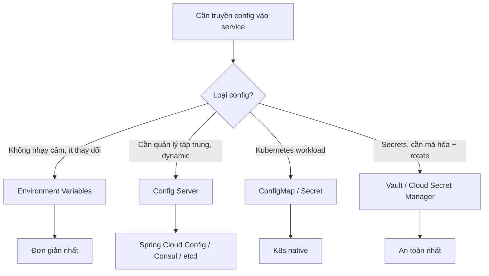
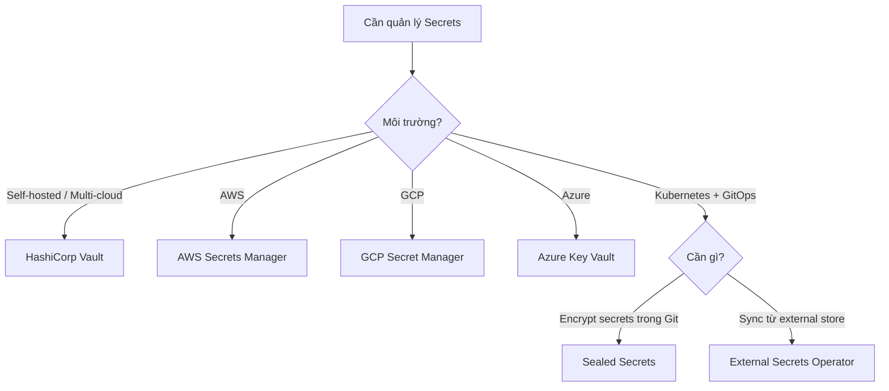

# Configuration & Secrets Management trong Microservice

## 📋 Mục lục

- [1. Giới thiệu](#1-giới-thiệu)
- [2. Thách thức quản lý Configuration trong Microservice](#2-thách-thức-quản-lý-configuration-trong-microservice)
  - [2.1. Monolith vs Microservice Configuration](#21-monolith-vs-microservice-configuration)
  - [2.2. Các loại Configuration](#22-các-loại-configuration)
- [3. External Configuration — Nguyên tắc cốt lõi](#3-external-configuration--nguyên-tắc-cốt-lõi)
  - [3.1. Tại sao phải Externalize Config?](#31-tại-sao-phải-externalize-config)
  - [3.2. The Twelve-Factor App — Config](#32-the-twelve-factor-app--config)
  - [3.3. Các cách truyền Config vào Service](#33-các-cách-truyền-config-vào-service)
- [4. Environment Variables](#4-environment-variables)
  - [4.1. Cách hoạt động](#41-cách-hoạt-động)
  - [4.2. Ưu nhược điểm](#42-ưu-nhược-điểm)
  - [4.3. Best Practices cho Environment Variables](#43-best-practices-cho-environment-variables)
- [5. Configuration Server](#5-configuration-server)
  - [5.1. Config Server là gì? Tại sao cần?](#51-config-server-là-gì-tại-sao-cần)
  - [5.2. Spring Cloud Config Server](#52-spring-cloud-config-server)
  - [5.3. Consul KV Store](#53-consul-kv-store)
  - [5.4. etcd](#54-etcd)
  - [5.5. AWS AppConfig](#55-aws-appconfig)
  - [5.6. So sánh các Config Server](#56-so-sánh-các-config-server)
- [6. Kubernetes ConfigMap & Configuration](#6-kubernetes-configmap--configuration)
  - [6.1. ConfigMap là gì?](#61-configmap-là-gì)
  - [6.2. Cách sử dụng ConfigMap](#62-cách-sử-dụng-configmap)
  - [6.3. Config Reload — Hot Reload không cần restart](#63-config-reload--hot-reload-không-cần-restart)
- [7. Secrets Management](#7-secrets-management)
  - [7.1. Config vs Secret — Khác nhau thế nào?](#71-config-vs-secret--khác-nhau-thế-nào)
  - [7.2. Vấn đề thực tế với Secrets](#72-vấn-đề-thực-tế-với-secrets)
  - [7.3. Các giải pháp Secrets Management](#73-các-giải-pháp-secrets-management)
- [8. HashiCorp Vault — Chi tiết](#8-hashicorp-vault--chi-tiết)
  - [8.1. Vault là gì?](#81-vault-là-gì)
  - [8.2. Kiến trúc Vault](#82-kiến-trúc-vault)
  - [8.3. Secret Engines](#83-secret-engines)
  - [8.4. Authentication Methods](#84-authentication-methods)
  - [8.5. Dynamic Secrets — Tính năng mạnh nhất](#85-dynamic-secrets--tính-năng-mạnh-nhất)
  - [8.6. Vault với Kubernetes](#86-vault-với-kubernetes)
- [9. AWS Secrets Manager & Parameter Store](#9-aws-secrets-manager--parameter-store)
  - [9.1. AWS Secrets Manager](#91-aws-secrets-manager)
  - [9.2. AWS Systems Manager Parameter Store](#92-aws-systems-manager-parameter-store)
  - [9.3. So sánh Secrets Manager vs Parameter Store](#93-so-sánh-secrets-manager-vs-parameter-store)
- [10. Sealed Secrets & External Secrets Operator](#10-sealed-secrets--external-secrets-operator)
  - [10.1. Vấn đề: K8s Secrets không an toàn trong Git](#101-vấn-đề-k8s-secrets-không-an-toàn-trong-git)
  - [10.2. Sealed Secrets](#102-sealed-secrets)
  - [10.3. External Secrets Operator (ESO)](#103-external-secrets-operator-eso)
- [11. Configuration Patterns](#11-configuration-patterns)
  - [11.1. Environment-per-Config](#111-environment-per-config)
  - [11.2. Feature Flags](#112-feature-flags)
  - [11.3. Config Hierarchy & Override](#113-config-hierarchy--override)
- [12. Ví dụ thực tế — E-Commerce Configuration](#12-ví-dụ-thực-tế--e-commerce-configuration)
- [13. Anti-patterns](#13-anti-patterns)
- [14. Checklist](#14-checklist)
- [15. Tổng kết](#15-tổng-kết)
- [16. Liên kết liên quan](#16-liên-kết-liên-quan)

---

## 1. Giới thiệu

Trong kiến trúc Microservice, mỗi service cần nhiều loại cấu hình khác nhau: database URL, API keys, feature flags, timeout, queue name... Với 20-50 services, mỗi service chạy trên 3-4 environments (dev, staging, prod) — quản lý configuration trở thành bài toán phức tạp.

```
TẠI SAO CONFIGURATION MANAGEMENT QUAN TRỌNG?
──────────────────────────────────────────────

  20 services × 4 environments × 10 configs mỗi service
  = 800 configuration values cần quản lý!

  ❌ KHÔNG CÓ CONFIG MANAGEMENT:
  ┌──────────────────────────────────────────────────────┐
  │  • Config hardcode trong code                        │
  │  • Mỗi lần đổi config = sửa code + rebuild + redeploy│
  │  • Dev commit DB password lên GitHub 😱              │
  │  • Staging dùng nhầm production DB 💀                │
  │  • Không biết config nào đang active ở production    │
  │  • 3h sáng thức dậy vì nhầm config timeout 🤯        │
  └──────────────────────────────────────────────────────┘

  ✅ CÓ CONFIG MANAGEMENT:
  ┌──────────────────────────────────────────────────────┐
  │  • Config tách riêng khỏi code                       │
  │  • Đổi config mà KHÔNG cần rebuild/redeploy          │
  │  • Secrets được mã hóa, rotate tự động               │
  │  • Config khác nhau theo environment                 │
  │  • Audit log: ai đổi gì, khi nào                     │
  │  • Rollback config trong 1 phút                      │
  └──────────────────────────────────────────────────────┘
```

> 📖 Tham khảo thêm: [doc 15 — Security](15-security.md) đã giới thiệu sơ về Secrets Management (section 9). Tài liệu này đi sâu hơn vào cả Configuration lẫn Secrets.

---

## 2. Thách thức quản lý Configuration trong Microservice

### 2.1. Monolith vs Microservice Configuration

| Khía cạnh | Monolith | Microservice |
|-----------|----------|-------------|
| **Số lượng config** | 1 file (application.yml) | N files, mỗi service 1 bộ config |
| **Environments** | 1 app × 4 envs = 4 config sets | N apps × 4 envs = 4N config sets |
| **Thay đổi** | Sửa 1 chỗ, deploy lại | Sửa config đúng service, đúng env |
| **Secrets** | 1 chỗ lưu | Mỗi service cần secrets riêng |
| **Consistency** | 1 codebase, dễ đồng nhất | Config rải rác, dễ bị drift |
| **Dependencies** | Trong 1 process | Service A cần biết URL Service B |

```
CẤU HÌNH RẢI RÁC TRONG MICROSERVICE
──────────────────────────────────────

  ┌──────────────┐   ┌───────────────┐   ┌───────────────┐
  │ User Service │   │ Order Service │   │Payment Service│
  │              │   │               │   │               │
  │ DB_HOST=?    │   │ DB_HOST=?     │   │ DB_HOST=?     │
  │ DB_PORT=?    │   │ DB_PORT=?     │   │ STRIPE_KEY=?  │
  │ REDIS_URL=?  │   │ KAFKA_URL=?   │   │ KAFKA_URL=?   │
  │ JWT_SECRET=? │   │ USER_SVC_URL=?│   │ ORDER_SVC_URL?│
  │ LOG_LEVEL=?  │   │ LOG_LEVEL=?   │   │ LOG_LEVEL=?   │
  └──────────────┘   └───────────────┘   └───────────────┘
         │                  │                  │
         └────── Mỗi service cần 5-20 configs ─┘
                 × 4 environments
                 = RẤT NHIỀU giá trị cần quản lý!
```

### 2.2. Các loại Configuration

```
CÁC LOẠI CONFIGURATION
────────────────────────

  ┌─────────────────────────────────────────────────────────────┐
  │  1. APPLICATION CONFIG — Cấu hình ứng dụng                  │
  │     • Server port, log level, timeout                       │
  │     • Feature flags                                         │
  │     • Pagination defaults                                   │
  │     → Thay đổi: ít, thường khi deploy                       │
  │     → Nhạy cảm: KHÔNG                                       │
  ├─────────────────────────────────────────────────────────────┤
  │  2. INFRASTRUCTURE CONFIG — Cấu hình hạ tầng                │
  │     • Database host/port                                    │
  │     • Redis URL, Kafka brokers                              │
  │     • Service discovery endpoints                           │
  │     → Thay đổi: khi hạ tầng thay đổi                        │
  │     → Nhạy cảm: THẤP (host/port không phải secret)          │
  ├─────────────────────────────────────────────────────────────┤
  │  3. SECRETS — Bí mật                                        │
  │     • Database passwords, API keys                          │
  │     • JWT signing keys, TLS certificates                    │
  │     • Encryption keys, OAuth client secrets                 │
  │     → Thay đổi: khi rotate                                  │
  │     → Nhạy cảm: RẤT CAO — cần mã hóa, access control        │
  ├─────────────────────────────────────────────────────────────┤
  │  4. DYNAMIC CONFIG — Cấu hình thay đổi runtime              │
  │     • Feature flags (bật/tắt tính năng)                     │
  │     • Rate limits, circuit breaker thresholds               │
  │     • A/B test percentages                                  │
  │     → Thay đổi: thường xuyên, KHÔNG cần redeploy            │
  │     → Nhạy cảm: THẤP                                        │
  └─────────────────────────────────────────────────────────────┘
```

---

## 3. External Configuration — Nguyên tắc cốt lõi

### 3.1. Tại sao phải Externalize Config?

**Externalize Configuration** nghĩa là tách config ra khỏi code — config không nằm trong source code, không bị build vào artifact.

**Nhưng khoan — nếu config chỉ đọc 1 lần lúc start, thì "đổi config không cần rebuild" có ý nghĩa gì?**

Câu hỏi rất tốt! Cần hiểu rõ externalize giải quyết **2 vấn đề khác nhau**:

```
EXTERNALIZE CONFIG GIẢI QUYẾT GÌ?
───────────────────────────────────

  VẤN ĐỀ 1: "ĐỔI CONFIG = PHẢI REBUILD IMAGE" (cốt lõi!)
  ──────────────────────────────────────────────────────────

  ❌ Config nằm trong code:
  ┌──────────────────────────────────────────────────────────────┐
  │  // hardcode                                                 │
  │  DB_HOST = "prod-db.example.com"                             │
  │                                                              │
  │  Đổi DB_HOST:                                                │
  │  1. Sửa source code                                          │
  │  2. Commit + push                                            │
  │  3. CI build Docker image MỚI (mất 5-10 phút)               │
  │  4. Push image lên registry                                  │
  │  5. Deploy image mới lên K8s                                 │
  │                                                              │
  │  → 20 phút cho 1 thay đổi config!                           │
  │  → Image dev ≠ image staging ≠ image prod (3 images khác nhau)│
  └──────────────────────────────────────────────────────────────┘

  ✅ Config tách riêng (externalize):
  ┌──────────────────────────────────────────────────────────────┐
  │  DB_HOST = os.getenv("DB_HOST")                              │
  │                                                              │
  │  Đổi DB_HOST:                                                │
  │  1. Sửa env var / ConfigMap                                  │
  │  2. Restart Pod (mất 10 giây)                                │
  │  → KHÔNG cần rebuild image                                   │
  │  → KHÔNG cần chạy lại CI pipeline                            │
  │  → Cùng 1 image chạy ở dev, staging, prod                   │
  └──────────────────────────────────────────────────────────────┘


  VẤN ĐỀ 2: "ĐỔI CONFIG = CÓ CẦN RESTART KHÔNG?"
  ──────────────────────────────────────────────────
  Tùy LOẠI config mà cách xử lý khác nhau:

  ┌─────────────────────────────────────────────────────────────────┐
  │                                                                 │
  │  📌 STATIC CONFIG (DB_HOST, DB_PASSWORD, KAFKA_URL...)          │
  │  → Đọc 1 LẦN lúc app start (tạo connection pool, init client) │
  │  → Đổi config → CẦN RESTART pod (nhưng KHÔNG cần rebuild!)    │
  │  → Restart pod trong K8s: rolling restart, mất ~10 giây        │
  │  → Đây là cách BÌNH THƯỜNG, hầu hết config hoạt động kiểu này │
  │                                                                 │
  │  📌 DYNAMIC CONFIG (feature flags, log level, rate limit...)    │
  │  → App đọc LẶP LẠI (poll mỗi 30s, hoặc watch realtime)       │
  │  → Đổi config → KHÔNG cần restart, app tự nhận giá trị mới    │
  │  → Cần code hỗ trợ (file watcher, config server SDK)           │
  │                                                                 │
  └─────────────────────────────────────────────────────────────────┘


  VÍ DỤ CỤ THỂ:
  ───────────────

  Đổi DB_HOST (static):
  ┌────────────┐   sửa ConfigMap   ┌────────────┐   restart pod   ┌──────────┐
  │   DevOps   │─────────────────▶ │  ConfigMap │──────────────▶  │ Pod mới  │
  │            │   (10 giây)       │            │   (10 giây)     │ đọc lại  │
  └────────────┘                   └────────────┘                 │ DB_HOST  │
                                                                  └──────────┘
  Tổng: ~20 giây (vs 20 phút nếu phải rebuild image!)


  Đổi LOG_LEVEL (dynamic):
  ┌────────────┐   sửa Config Server    ┌──────────────┐   app poll  ┌──────────┐
  │   DevOps   │──────────────────────▶ │ Config Server│────────────▶│ Pod ĐANG │
  │            │   (10 giây)            │              │  (tự động)  │ CHẠY     │
  └────────────┘                        └──────────────┘             │ đổi log  │
                                                                     │ level    │
  Tổng: ~10 giây, KHÔNG restart gì cả!                               └──────────┘
```

Tóm lại, **giá trị chính của externalize config** là:

| Không externalize | Externalize |
|-------------------|-------------|
| Đổi config = sửa code + rebuild + deploy (20 phút) | Đổi config = sửa env/ConfigMap + restart pod (20 giây) |
| Build 3 images cho dev/staging/prod | 1 image cho tất cả environments |
| Config lộ trên Git | Config tách riêng, secrets an toàn |

> 💡 **"Đổi config không cần rebuild"** ≠ "đổi config không cần restart". Static config (DB_HOST) vẫn cần restart pod — nhưng restart pod thì rất nhanh (10s), còn rebuild image thì chậm (10-20 phút). Đó là sự khác biệt lớn.

```
BUILD ONCE, DEPLOY ANYWHERE:
┌────────────┐     ┌──────────────────────────────┐
│            │     │  Dev:  DB_HOST=localhost     │
│  Docker    │────▶│  Staging: DB_HOST=staging-db │
│  Image     │     │  Prod: DB_HOST=prod-db       │
│  (1 bản)   │     │                              │
└────────────┘     └──────────────────────────────┘
```

### 3.2. The Twelve-Factor App — Config

**[The Twelve-Factor App](https://12factor.net/config)** — Factor III (Config) nói rằng:

> *"Store config in the environment"* — Lưu config trong environment, KHÔNG trong code.

```
TWELVE-FACTOR: CONFIG TEST
───────────────────────────

  Câu hỏi kiểm tra: "Nếu open-source codebase ngay bây giờ,
  có credential nào bị lộ không?"

  ❌ Nếu CÓ → config chưa được externalize đúng cách
  ✅ Nếu KHÔNG → tốt, config đã tách riêng

  Nguyên tắc:
  ┌────────────────────────────────────────────────────────┐
  │  • Config KHÁC NHAU giữa các deployment (dev/prod)     │
  │    → PHẢI externalize                                  │
  │                                                        │
  │  • Config GIỐNG NHAU giữa các deployment               │
  │    (ví dụ: routing rules trong code)                   │
  │    → Để trong code OK                                  │
  │                                                        │
  │  • Config KHÔNG BAO GIỜ group theo "environment"       │
  │    (ví dụ: file config-dev.yml, config-prod.yml)       │
  │    → Thay vào đó: dùng environment variables           │
  │    → Vì environments có thể tăng: dev, staging,        │
  │      qa, canary, prod-us, prod-eu...                   │
  └────────────────────────────────────────────────────────┘
```

### 3.3. Các cách truyền Config vào Service



| Phương pháp | Ưu điểm | Nhược điểm | Phù hợp |
|------------|---------|------------|---------|
| **Environment Variables** | Đơn giản, universal | Không dynamic, khó quản lý nhiều | Ít config, 12-factor |
| **Config Files (mount)** | Quen thuộc, structured | Cần restart để reload | Kubernetes ConfigMap |
| **Config Server** | Centralized, versioned, dynamic | Thêm dependency, SPoF | Nhiều services, cần hot-reload |
| **Vault / Secret Manager** | Encrypted, audit, rotation | Phức tạp, thêm latency | Secrets |

---

## 4. Environment Variables

### 4.1. Cách hoạt động

**Environment Variables** (biến môi trường) là cách đơn giản nhất để truyền config vào service — OS-level, mọi ngôn ngữ đều hỗ trợ.

```
ENVIRONMENT VARIABLES — FLOW
──────────────────────────────

  1. Khi chạy trực tiếp:
     $ DB_HOST=localhost DB_PORT=5432 node app.js

  2. Khi dùng Docker:
     $ docker run -e DB_HOST=prod-db -e DB_PORT=5432 my-app

  3. Khi dùng Kubernetes:
     env:
     - name: DB_HOST
       value: "prod-db"

  4. Khi dùng docker-compose:
     environment:
       DB_HOST: prod-db
       DB_PORT: 5432

  Service đọc:
  ┌──────────────────────────────────────┐
  │  // Node.js                          │
  │  const dbHost = process.env.DB_HOST; │
  │                                      │
  │  // Python                           │
  │  db_host = os.environ["DB_HOST"]     │
  │                                      │
  │  // Java (Spring Boot)               │
  │  @Value("${DB_HOST}")                │
  │  private String dbHost;              │
  └──────────────────────────────────────┘
```

### 4.2. Ưu nhược điểm

| Ưu điểm | Nhược điểm |
|---------|------------|
| Đơn giản, mọi ngôn ngữ hỗ trợ | Không structured (chỉ key=value) |
| 12-factor compliant | Khó quản lý khi nhiều vars (50+) |
| Không cần thêm dependency | Không dynamic — cần restart để đổi |
| OS-level, không phụ thuộc framework | Dễ lộ qua `ps aux`, `/proc`, logs |
| Docker/K8s hỗ trợ native | Không versioned, không audit |

### 4.3. Best Practices cho Environment Variables

```
ENV VARS BEST PRACTICES
─────────────────────────

  1. NAMING CONVENTION — Đặt tên rõ ràng
  ─────────────────────────────────────────
  ✅ PREFIX theo service:
     ORDER_DB_HOST=...
     ORDER_DB_PORT=...
     ORDER_KAFKA_BROKER=...

  ❌ KHÔNG prefix (dễ conflict):
     DB_HOST=...  ← service nào?
     PORT=...     ← cổng gì?

  2. .env FILE — Cho local development
  ──────────────────────────────────────
  # .env (KHÔNG commit lên Git!)
  DB_HOST=localhost
  DB_PORT=5432
  DB_PASSWORD=local_password

  # .env.example (commit lên Git — template)
  DB_HOST=
  DB_PORT=5432
  DB_PASSWORD=

  # .gitignore
  .env
  .env.local
  .env.*.local

  3. VALIDATE env vars khi khởi động
  ────────────────────────────────────
  Đừng để service chạy rồi mới crash vì thiếu config!

  ✅ Fail fast khi startup:
  ┌──────────────────────────────────────────────────┐
  │  required_vars = ["DB_HOST", "DB_PORT", "SECRET"]│
  │  missing = [v for v in required_vars             │
  │             if v not in os.environ]              │
  │  if missing:                                     │
  │      raise Error(f"Missing: {missing}")          │
  │      # Service KHÔNG start nếu thiếu config      │
  └──────────────────────────────────────────────────┘
```

---

## 5. Configuration Server

### 5.1. Config Server là gì? Tại sao cần?

Khi có 20+ services, quản lý env vars riêng lẻ cho từng service trở nên rối. **Config Server** là service tập trung, lưu trữ và phân phát config cho tất cả services.

```
KHÔNG CÓ vs CÓ CONFIG SERVER
──────────────────────────────

  ❌ Không có Config Server:
  ┌──────────────────────────────────────────────────────────┐
  │  Mỗi service tự quản lý config riêng                     │
  │                                                          │
  │  ┌────────┐ env vars  ┌────────┐ env vars  ┌────────┐    │
  │  │ Svc A  │           │ Svc B  │           │ Svc C  │    │
  │  │ .env   │           │ .env   │           │ .env   │    │
  │  └────────┘           └────────┘           └────────┘    │
  │                                                          │
  │  → Config rải rác, không biết config nào ở đâu           │
  │  → Đổi 1 config chung (ví dụ KAFKA_URL) = sửa 20 chỗ     │
  │  → Không version, không audit                            │
  └──────────────────────────────────────────────────────────┘

  ✅ Có Config Server:
  ┌──────────────────────────────────────────────────────────┐
  │                  ┌──────────────┐                        │
  │                  │ Config Server│                        │
  │                  │              │                        │
  │                  │ • Versioned  │                        │
  │                  │ • Encrypted  │                        │
  │                  │ • Audit log  │                        │
  │                  └──────┬───────┘                        │
  │                ┌────────┼────────┐                       │
  │                │        │        │                       │
  │           ┌────▼──┐ ┌───▼───┐ ┌──▼─────┐                 │
  │           │ Svc A │ │ Svc B │ │ Svc C  │                 │
  │           │(pull) │ │(pull) │ │(pull)  │                 │
  │           └───────┘ └───────┘ └────────┘                 │
  │                                                          │
  │  → 1 nguồn sự thật (single source of truth)              │
  │  → Đổi 1 config = tất cả services nhận được              │
  │  → Version history, rollback dễ dàng                     │
  └──────────────────────────────────────────────────────────┘
```

### 5.2. Spring Cloud Config Server

**Spring Cloud Config** là config server phổ biến nhất trong hệ sinh thái Java/Spring, lưu config trong Git repo.

```
SPRING CLOUD CONFIG — KIẾN TRÚC
─────────────────────────────────

  ┌────────────────┐      ┌──────────────────┐      ┌──────────┐
  │   Git Repo     │◄─────│  Config Server   │◄─────│ Service  │
  │                │ pull │  (Spring Cloud)  │ pull │          │
  │ config/        │      │                  │      │          │
  │  ├ app-dev.yml │      │  GET /app/dev    │      │ @Value() │
  │  ├ app-stg.yml │      │  → trả dev config│      │          │
  │  └ app-prod.yml│      │                  │      │          │
  └────────────────┘      └──────────────────┘      └──────────┘
```

**Config repo structure:**

```yaml
# Git repo: config-repo/

# order-service-dev.yml
server:
  port: 8080
spring:
  datasource:
    url: jdbc:postgresql://localhost:5432/orders
    username: dev_user
logging:
  level:
    root: DEBUG

# order-service-prod.yml
server:
  port: 8080
spring:
  datasource:
    url: jdbc:postgresql://prod-db:5432/orders
    username: prod_user
logging:
  level:
    root: WARN
```

**Service đọc config từ Config Server:**

```yaml
# bootstrap.yml trong order-service
spring:
  application:
    name: order-service
  cloud:
    config:
      uri: http://config-server:8888
      fail-fast: true          # Fail nếu không connect được Config Server
      retry:
        max-attempts: 5        # Retry 5 lần
        initial-interval: 1000 # Chờ 1s giữa mỗi retry
```

### 5.3. Consul KV Store

**Consul** (HashiCorp) không chỉ là Service Discovery (xem [doc 08](08-service-discovery.md)) mà còn có **Key-Value Store** dùng làm config server.

```
CONSUL KV — LƯU VÀ ĐỌC CONFIG
────────────────────────────────

  # Lưu config vào Consul
  $ consul kv put order-service/db/host prod-db.example.com
  $ consul kv put order-service/db/port 5432
  $ consul kv put order-service/kafka/brokers kafka-1:9092,kafka-2:9092

  # Đọc config
  $ consul kv get order-service/db/host
  prod-db.example.com

  # Đọc tất cả config của order-service
  $ consul kv get -recurse order-service/
  order-service/db/host:prod-db.example.com
  order-service/db/port:5432
  order-service/kafka/brokers:kafka-1:9092,kafka-2:9092

  # Watch — nhận thông báo khi config thay đổi
  $ consul watch -type=keyprefix -prefix=order-service/ \
      /scripts/reload-config.sh
```

**Ưu điểm Consul KV:**

- Tích hợp sẵn Service Discovery + Health Check
- Hỗ trợ **watch** — service nhận biết config thay đổi real-time
- Multi-datacenter replication
- UI dashboard quản lý config

### 5.4. etcd

**etcd** là distributed key-value store, được dùng bên trong Kubernetes để lưu cluster state. Cũng có thể dùng làm config server.

```
ETCD — CÁCH DÙNG
──────────────────

  # Lưu config
  $ etcdctl put /config/order-service/db-host "prod-db.example.com"
  $ etcdctl put /config/order-service/log-level "INFO"

  # Đọc config
  $ etcdctl get /config/order-service/db-host
  prod-db.example.com

  # Watch — nhận event khi config đổi
  $ etcdctl watch /config/order-service/ --prefix
  # → Nhận real-time notification
```

### 5.5. AWS AppConfig

**AWS AppConfig** (thuộc AWS Systems Manager) là config server managed của AWS — không cần tự vận hành server, có **safe deployment** và **feature flags** tích hợp sẵn.

```
AWS APPCONFIG — KIẾN TRÚC
───────────────────────────

  ┌──────────────────────────────────────────────────────────────┐
  │                     AWS AppConfig                            │
  │                                                              │
  │  Application: "order-service"                                │
  │  ├── Environment: "dev"                                      │
  │  │   └── Configuration Profile: "settings"                   │
  │  │       → DB_HOST=localhost, LOG_LEVEL=DEBUG                │
  │  ├── Environment: "staging"                                  │
  │  │   └── Configuration Profile: "settings"                   │
  │  │       → DB_HOST=staging-db, LOG_LEVEL=INFO                │
  │  └── Environment: "prod"                                     │
  │      └── Configuration Profile: "settings"                   │
  │          → DB_HOST=prod-db, LOG_LEVEL=WARN                   │
  │                                                              │
  │  Deployment Strategy:                                        │
  │  ├── AllAtOnce (dev)                                         │
  │  ├── Linear50PercentEvery30Seconds (staging)                 │
  │  └── Canary10Percent20Minutes (prod) ← deploy config an toàn │
  └──────────────────────────────────────────────────────────────┘
```

**Điểm đặc biệt của AppConfig: Safe deployment cho config!**

```
APPCONFIG — DEPLOY CONFIG AN TOÀN (KHÔNG CÓ Ở CÁC TOOL KHÁC!)
────────────────────────────────────────────────────────────────

  Vấn đề: Đổi config sai (ví dụ timeout=0) → TẤT CẢ pods crash!

  ❌ Config Server thường (Consul, etcd, Spring Cloud):
  ┌──────────────────────────────────────────────────────┐
  │  Đổi config → TẤT CẢ services nhận ngay lập tức      │
  │  → Config sai = 100% services lỗi cùng lúc 💀        │
  │  → Phải rollback thủ công                            │
  └──────────────────────────────────────────────────────┘

  ✅ AWS AppConfig — Canary deployment cho config:
  ┌──────────────────────────────────────────────────────┐
  │  Đổi config → AppConfig deploy từ từ:                │
  │                                                      │
  │  Phút 0:  10% instances nhận config mới              │
  │           → Monitor: error rate tăng không?          │
  │           → CloudWatch alarm kiểm tra                │
  │                                                      │
  │  Phút 10: OK → 50% instances nhận config mới         │
  │           → Monitor tiếp...                          │
  │                                                      │
  │  Phút 20: OK → 100% instances nhận config mới ✅     │
  │                                                      │
  │  NẾU error rate tăng ở bất kỳ bước nào:              │
  │  → TỰ ĐỘNG ROLLBACK về config cũ!                    │
  │  → Chỉ 10% bị ảnh hưởng, không phải 100%             │
  └──────────────────────────────────────────────────────┘
```

**Cách dùng AppConfig:**

```python
# Python — Đọc config từ AWS AppConfig

# Cách 1: AppConfig Agent (chạy cạnh app, cache local, khuyến nghị)
# Agent chạy trên localhost:2772, tự động poll + cache config
import requests

def get_config():
    # Agent chạy sẵn, app chỉ cần gọi localhost
    response = requests.get(
        "http://localhost:2772/applications/order-service"
        "/environments/prod"
        "/configurations/settings"
    )
    return response.json()

config = get_config()
# {
#   "db_host": "prod-db.example.com",
#   "log_level": "WARN",
#   "feature_new_checkout": true,
#   "rate_limit_per_minute": 100
# }


# Cách 2: SDK trực tiếp (không cần Agent)
import boto3

client = boto3.client("appconfig")

# Bắt đầu session
session = client.start_configuration_session(
    ApplicationIdentifier="order-service",
    EnvironmentIdentifier="prod",
    ConfigurationProfileIdentifier="settings"
)
token = session["InitialConfigurationToken"]

# Poll config (gọi định kỳ, mỗi 30s)
response = client.get_latest_configuration(ConfigurationToken=token)
config = json.loads(response["Configuration"].read())
token = response["NextPollConfigurationToken"]  # dùng cho lần poll tiếp
```

**Feature Flags với AppConfig:**

```json
// AppConfig Feature Flag Profile
{
  "version": "1",
  "flags": {
    "new_checkout": {
      "name": "New Checkout Flow",
      "enabled": true,
      "attributes": {
        "rollout_percentage": {
          "constraints": {
            "type": "number",
            "minimum": 0,
            "maximum": 100
          }
        }
      }
    },
    "dark_mode": {
      "name": "Dark Mode",
      "enabled": false
    }
  },
  "values": {
    "new_checkout": {
      "enabled": true,
      "rollout_percentage": 25
    },
    "dark_mode": {
      "enabled": false
    }
  }
}
```

```python
# Sử dụng Feature Flag trong code
config = get_config()

if config["flags"]["new_checkout"]["enabled"]:
    # Bật cho 25% users (rollout_percentage)
    if user_hash % 100 < config["values"]["new_checkout"]["rollout_percentage"]:
        show_new_checkout()
    else:
        show_old_checkout()
```

```
APPCONFIG — KHI NÀO DÙNG?
────────────────────────────

  ✅ Dùng AppConfig khi:
  • Đã dùng AWS (ECS, EKS, Lambda)
  • Cần safe deployment cho config (canary/rollback)
  • Cần feature flags mà không muốn thêm tool (LaunchDarkly)
  • Muốn managed service, không tự vận hành

  ❌ Không phù hợp khi:
  • Multi-cloud (AppConfig chỉ trên AWS)
  • Cần dynamic secrets (dùng Vault hoặc AWS Secrets Manager)
  • Config đơn giản, ít services (env vars đủ rồi)
```

**Tích hợp AppConfig với ECS/EKS/Lambda:**

```
APPCONFIG + AWS SERVICES
──────────────────────────

  ECS (Fargate):
  ┌───────────────────────────────────────────┐
  │  Task Definition                          │
  │  ┌─────────────────┐  ┌────────────────┐  │
  │  │  App Container  │  │ AppConfig Agent│  │
  │  │                 │  │ (sidecar)      │  │
  │  │  localhost:2772 ─▶ │ poll + cache   │  │
  │  │  get config     │  │ config mới nhất│  │
  │  └─────────────────┘  └────────────────┘  │
  └───────────────────────────────────────────┘

  Lambda:
  ┌───────────────────────────────────────────┐
  │  Lambda Function                          │
  │  ┌──────────────────┐                     │
  │  │  AppConfig       │                     │
  │  │  Lambda Extension│ ← AWS cung cấp sẵn  │
  │  │  (layer)         │    không cần setup  │
  │  │                  │                     │
  │  │  localhost:2772  │                     │
  │  └──────────────────┘                     │
  └───────────────────────────────────────────┘

  EKS:
  ┌───────────────────────────────────────────┐
  │  Pod                                      │
  │  ┌─────────────────┐  ┌────────────────┐  │
  │  │  App Container  │  │ AppConfig Agent│  │
  │  │                 │─▶│ (sidecar pod)  │  │
  │  └─────────────────┘  └────────────────┘  │
  │  hoặc dùng SDK trực tiếp trong app        │
  └───────────────────────────────────────────┘
```

### 5.6. So sánh các Config Server

| Tiêu chí | Spring Cloud Config | Consul KV | etcd | AWS AppConfig |
|----------|-------------------|-----------|------|---------------|
| **Loại** | Self-hosted | Self-hosted | Self-hosted | Managed (AWS) |
| **Backend** | Git repo | Consul cluster | etcd cluster | AWS managed |
| **Ngôn ngữ** | Chủ yếu Java/Spring | Language-agnostic | Language-agnostic | Language-agnostic |
| **Watch/Push** | Webhook + Bus | ✅ Native watch | ✅ Native watch | ✅ Agent poll + cache |
| **UI** | ❌ (cần tự build) | ✅ Consul UI | ❌ | ✅ AWS Console |
| **Safe deploy** | ❌ | ❌ | ❌ | ✅ Canary + rollback |
| **Feature flags** | ❌ | ❌ | ❌ | ✅ Built-in |
| **Encryption** | ✅ (encrypt values) | ✅ (ACL + TLS) | ✅ (TLS + RBAC) | ✅ (KMS) |
| **Vận hành** | Tự manage | Tự manage | Tự manage | AWS manage |
| **Phù hợp** | Spring Boot apps | Polyglot microservice | Kubernetes-centric | AWS workloads |
| **Giá** | Free (tự host) | Free (tự host) | Free (tự host) | Free tier + $0.0008/call |

---

## 6. Kubernetes ConfigMap & Configuration

### 6.1. ConfigMap là gì?

**ConfigMap** là Kubernetes resource để lưu non-sensitive configuration data dưới dạng key-value pairs hoặc file.

```
CONFIGMAP — HIỂU ĐƠN GIẢN
────────────────────────────

  ConfigMap giống như 1 "bảng thông báo" trong Kubernetes:
  → Bạn dán thông tin lên bảng (tạo ConfigMap)
  → Các Pod đến đọc thông tin từ bảng (mount/env)
  → Bạn thay đổi thông tin trên bảng (update ConfigMap)
  → Pod đọc lại → nhận được thông tin mới

  ⚠️ ConfigMap KHÔNG dùng cho secrets!
     → Dùng K8s Secret hoặc Vault cho sensitive data
```

### 6.2. Cách sử dụng ConfigMap

```yaml
# 1. Tạo ConfigMap
apiVersion: v1
kind: ConfigMap
metadata:
  name: order-service-config
  namespace: production
data:
  # Key-value đơn giản
  DB_HOST: "prod-db.example.com"
  DB_PORT: "5432"
  LOG_LEVEL: "INFO"
  KAFKA_BROKERS: "kafka-1:9092,kafka-2:9092"

  # Config file (multi-line)
  application.yml: |
    server:
      port: 8080
    spring:
      datasource:
        url: jdbc:postgresql://prod-db:5432/orders
    logging:
      level:
        root: INFO
```

```yaml
# 2. Sử dụng trong Pod — Environment Variables
apiVersion: apps/v1
kind: Deployment
metadata:
  name: order-service
spec:
  template:
    spec:
      containers:
      - name: order-service
        image: order-service:v1

        # Cách 1: Mount từng key
        env:
        - name: DB_HOST
          valueFrom:
            configMapKeyRef:
              name: order-service-config
              key: DB_HOST
        - name: LOG_LEVEL
          valueFrom:
            configMapKeyRef:
              name: order-service-config
              key: LOG_LEVEL

        # Cách 2: Mount TẤT CẢ keys làm env vars
        envFrom:
        - configMapRef:
            name: order-service-config

        # Cách 3: Mount làm file
        volumeMounts:
        - name: config-volume
          mountPath: /etc/config
          readOnly: true

      volumes:
      - name: config-volume
        configMap:
          name: order-service-config
          items:
          - key: application.yml
            path: application.yml
```

### 6.3. Config Reload — Hot Reload không cần restart

```
CONFIG RELOAD STRATEGIES
──────────────────────────

  Vấn đề: Đổi ConfigMap → Pod vẫn dùng config CŨ (nếu dùng env vars)!

  ┌─────────────────────────────────────────────────────────────┐
  │  Cách 1: Volume mount (tự động update)                      │
  │  → K8s tự update file trong volume sau ~1 phút              │
  │  → App cần watch file changes                               │
  │  → Không cần restart Pod                                    │
  ├─────────────────────────────────────────────────────────────┤
  │  Cách 2: Reloader (tự động restart Pod)                     │
  │  → Dùng tool "Reloader" hoặc "stakater/Reloader"            │
  │  → Khi ConfigMap đổi → tự động rolling restart Pods         │
  │  → Đơn giản, nhưng có downtime nhỏ                          │
  ├─────────────────────────────────────────────────────────────┤
  │  Cách 3: Checksum annotation                                │
  │  → Hash config vào annotation trong Deployment              │
  │  → Config đổi → hash đổi → Deployment thay đổi → rollout    │
  └─────────────────────────────────────────────────────────────┘
```

**Reloader — tự động restart khi ConfigMap đổi:**

```yaml
# Dùng Reloader annotation
apiVersion: apps/v1
kind: Deployment
metadata:
  name: order-service
  annotations:
    reloader.stakater.com/auto: "true"  # ← Tự động restart khi ConfigMap/Secret đổi
spec:
  template:
    spec:
      containers:
      - name: order-service
        envFrom:
        - configMapRef:
            name: order-service-config
```

---

## 7. Secrets Management

### 7.1. Config vs Secret — Khác nhau thế nào?

```
CONFIG vs SECRET — PHÂN BIỆT RÕ RÀNG
───────────────────────────────────────

  CONFIG (Cấu hình):                    SECRET (Bí mật):
  ┌────────────────────────────┐        ┌────────────────────────────┐
  │ DB_HOST=prod-db.example.com│        │ DB_PASSWORD=s3cret!@#$     │
  │ DB_PORT=5432               │        │ API_KEY=sk_live_abc123     │
  │ LOG_LEVEL=INFO             │        │ JWT_PRIVATE_KEY=-----BEGIN │
  │ SERVER_PORT=8080           │        │ TLS_CERT=-----BEGIN CERT   │
  │ KAFKA_BROKERS=kafka:9092   │        │ OAUTH_CLIENT_SECRET=xyz    │
  └────────────────────────────┘        └────────────────────────────┘

  → Lộ? KHÔNG SAO                       → Lộ? 💀 BIG TROUBLE
  → Ai cũng đọc được? OK                → Chỉ người cần mới đọc
  → Lưu trong Git? OK                   → Lưu trong Git? ❌ TUYỆT ĐỐI KHÔNG
  → Mã hóa? Không cần                   → Mã hóa? BẮT BUỘC
  → Audit? Nice to have                 → Audit? BẮT BUỘC
  → Rotate? Khi cần                     → Rotate? ĐỊNH KỲ

  Công cụ:                              Công cụ:
  → ConfigMap                            → Vault
  → Config Server                        → AWS Secrets Manager
  → Environment Variables                → Sealed Secrets
```

### 7.2. Vấn đề thực tế với Secrets

```
SECRETS NIGHTMARE — CÁC VẤN ĐỀ THỰC TẾ
─────────────────────────────────────────

  😱 Tình huống 1: "Oops, commit password lên GitHub"
  ┌────────────────────────────────────────────────────┐
  │  $ git add .                                       │
  │  $ git commit -m "fix config"                      │
  │  $ git push                                        │
  │                                                    │
  │  → File .env chứa DB_PASSWORD=prod_password_123    │
  │  → Push lên GitHub public repo                     │
  │  → Bot scan GitHub tìm được trong 30 GIÂY          │
  │  → Database bị hack sau 5 phút 💀                  │
  │                                                    │
  │  Xóa commit? KHÔNG ĐỦ!                             │
  │  → Git history vẫn còn                             │
  │  → Forks vẫn còn                                   │
  │  → Phải ROTATE secret ngay lập tức!                │
  └────────────────────────────────────────────────────┘

  😱 Tình huống 2: "Ai cũng biết password production"
  ┌────────────────────────────────────────────────────┐
  │  → 1 DB password, share cho 20 developers          │
  │  → 1 developer nghỉ việc → password vẫn valid      │
  │  → Không biết ai đã access DB khi nào              │
  │  → Không rotate vì "sợ service lỗi"                │
  └────────────────────────────────────────────────────┘

  😱 Tình huống 3: "Secret giống nhau ở mọi environment"
  ┌────────────────────────────────────────────────────┐
  │  Dev, staging, production dùng CÙNG API key        │
  │  → Dev gọi nhầm production API                     │
  │  → Xóa dữ liệu production 💀                       │
  └────────────────────────────────────────────────────┘
```

### 7.3. Các giải pháp Secrets Management



| Giải pháp | Loại | Dynamic Secrets | Auto Rotation | Phù hợp |
|-----------|------|:---------------:|:-------------:|---------|
| **HashiCorp Vault** | Self-hosted / Cloud | ✅ | ✅ | Multi-cloud, enterprise |
| **AWS Secrets Manager** | Cloud (AWS) | ❌ | ✅ | AWS-native workloads |
| **AWS Parameter Store** | Cloud (AWS) | ❌ | ❌ | Đơn giản, ít secrets |
| **GCP Secret Manager** | Cloud (GCP) | ❌ | ✅ | GCP workloads |
| **Azure Key Vault** | Cloud (Azure) | ❌ | ✅ | Azure workloads |
| **Sealed Secrets** | Kubernetes | ❌ | ❌ | GitOps, encrypt in Git |
| **External Secrets Operator** | Kubernetes | ❌ | ✅ (sync) | K8s + external store |

---

## 8. HashiCorp Vault — Chi tiết

### 8.1. Vault là gì?

**HashiCorp Vault** là giải pháp secrets management toàn diện nhất, cung cấp:

- **Secret storage**: Lưu trữ secrets mã hóa (AES-256-GCM)
- **Dynamic secrets**: Tạo credentials tạm thời, tự hết hạn
- **Encryption as a service**: Encrypt/decrypt mà không cần quản lý key
- **Leasing & Renewal**: Secrets có thời hạn, tự động revoke
- **Audit**: Log mọi access

### 8.2. Kiến trúc Vault

```
VAULT ARCHITECTURE
───────────────────

  ┌─────────────────────────────────────────────────────────┐
  │                      VAULT SERVER                       │
  │                                                         │
  │  ┌─────────────────────────────────────────────────┐    │
  │  │                   API Layer                     │    │
  │  │         (HTTP REST API / CLI / UI)              │    │
  │  └──────────────────────┬──────────────────────────┘    │
  │                         │                               │
  │  ┌──────────┬───────────┼───────────┬──────────┐        │
  │  │  Auth    │  Secret   │  Audit    │  System  │        │
  │  │ Methods  │ Engines   │  Devices  │  Backend │        │
  │  │          │           │           │          │        │
  │  │ • Token  │ • KV v2   │ • File    │ • Seal/  │        │
  │  │ • K8s    │ • Database│ • Syslog  │   Unseal │        │
  │  │ • AppRole│ • AWS     │ • Socket  │ • HA     │        │
  │  │ • LDAP   │ • PKI     │           │ • Raft   │        │
  │  │ • OIDC   │ • Transit │           │          │        │
  │  └──────────┴───────────┴───────────┴──────────┘        │
  │                         │                               │
  │  ┌──────────────────────▼──────────────────────────┐    │
  │  │              Storage Backend                    │    │
  │  │     (Raft / Consul / S3 / DynamoDB / etc.)      │    │
  │  │              ← ENCRYPTED →                      │    │
  │  └─────────────────────────────────────────────────┘    │
  └─────────────────────────────────────────────────────────┘
```

### 8.3. Secret Engines

```
SECRET ENGINES — CÁC LOẠI "KHO BÍ MẬT"
─────────────────────────────────────────

  1. KV (Key-Value) v2 — Lưu secret tĩnh
  ─────────────────────────────────────────
  $ vault kv put secret/order-service/db \
      username="order_user" \
      password="s3cret!@#"

  $ vault kv get secret/order-service/db
  Key         Value
  ---         -----
  username    order_user
  password    s3cret!@#

  → Có version history (v1, v2, v3...)
  → Rollback về version cũ nếu cần


  2. Database — Dynamic secrets (TẠO credentials tạm)
  ─────────────────────────────────────────────────────
  $ vault read database/creds/order-service-role
  Key              Value
  ---              -----
  lease_id         database/creds/.../abc123
  lease_duration   1h          ← Hết hạn sau 1 giờ!
  username         v-order-svc-abc123
  password         A1B2C3-random-xyz

  → Vault TẠO user/password MỚI trên DB thật
  → Sau 1 giờ → Vault TỰ ĐỘNG xóa user đó khỏi DB
  → Mỗi service instance có credentials RIÊNG


  3. PKI — Tạo TLS certificates
  ───────────────────────────────
  → Vault làm Certificate Authority (CA)
  → Tự động issue + rotate certificates
  → Dùng cho mTLS giữa services


  4. Transit — Encryption as a Service
  ──────────────────────────────────────
  → Service gửi plaintext → Vault encrypt → trả ciphertext
  → Service KHÔNG cần quản lý encryption key
  → Key rotation tự động, không ảnh hưởng data
```

### 8.4. Authentication Methods

```
VAULT AUTH METHODS — SERVICE CHỨNG MINH DANH TÍNH
───────────────────────────────────────────────────

  Vấn đề: Service cần đọc secret từ Vault,
  nhưng Vault phải biết "Service nào đang hỏi?"

  ┌──────────────────────────────────────────────────────────────┐
  │                                                              │
  │  Kubernetes Auth (phổ biến nhất cho K8s):                    │
  │  ┌──────────┐  K8s SA Token  ┌────────┐  verify  ┌────────┐  │
  │  │ Pod      │───────────────▶│ Vault  │─────────▶│ K8s API│  │
  │  │(order-svc)│  "Tôi là Pod  │        │ "Token   │        │  │
  │  │          │   order-svc    │        │  này có  │        │  │
  │  │          │   namespace    │        │  thật    │        │  │
  │  │          │   production"  │        │  không?" │        │  │
  │  └──────────┘                │        │          └────────┘  │
  │                              │        │  ✅ Xác nhận         │
  │                              │ Vault  │                      │
  │                              │ Token  │                      │
  │                              │◄───────│                      │
  │                                                              │
  │  AppRole Auth (cho CI/CD, non-K8s):                          │
  │  → Role ID (công khai) + Secret ID (bí mật, dùng 1 lần)      │
  │  → Giống username + OTP                                      │
  │                                                              │
  │  OIDC/JWT Auth (cho user access):                            │
  │  → Login bằng SSO → Vault verify JWT → cấp Vault token       │
  │                                                              │
  └──────────────────────────────────────────────────────────────┘
```

### 8.5. Dynamic Secrets — Tính năng mạnh nhất

```
DYNAMIC SECRETS — TẠI SAO LÀ "GAME CHANGER"?
──────────────────────────────────────────────

  ❌ Static Secrets (truyền thống):
  ┌──────────────────────────────────────────────────────┐
  │  1 DB password cho tất cả instances của order-service│
  │  → Dùng mãi không đổi                                │
  │  → Lộ 1 lần = attacker có access vĩnh viễn           │
  │  → Rotate = phải restart tất cả instances            │
  │  → Không biết ai dùng password khi nào               │
  └──────────────────────────────────────────────────────┘

  ✅ Dynamic Secrets (Vault):
  ┌──────────────────────────────────────────────────────┐
  │  Mỗi Pod nhận credentials RIÊNG, TẠM THỜI            │
  │                                                      │
  │  Pod 1: user=v-order-pod1-abc  pass=random1  (1h)    │
  │  Pod 2: user=v-order-pod2-def  pass=random2  (1h)    │
  │  Pod 3: user=v-order-pod3-ghi  pass=random3  (1h)    │
  │                                                      │
  │  → Mỗi Pod có credentials riêng                      │
  │  → Hết 1 giờ → Vault tự xóa user khỏi DB             │
  │  → Pod renew lease nếu cần tiếp                      │
  │  → Lộ 1 cred = chỉ ảnh hưởng 1 Pod, hết hạn sau 1h   │
  │  → Audit: biết chính xác Pod nào query gì            │
  └──────────────────────────────────────────────────────┘
```

```
DYNAMIC SECRETS FLOW — TỪNG BƯỚC
──────────────────────────────────

  Pod (order-svc)           Vault               PostgreSQL
       │                      │                      │
       │ 1. Auth (K8s token)  │                      │
       │─────────────────────▶│                      │
       │◄── Vault token ──────│                      │
       │                      │                      │
       │ 2. "Cho tôi DB creds"│                      │
       │─────────────────────▶│                      │
       │                      │ 3. CREATE ROLE       │
       │                      │    v-order-abc       │
       │                      │───────────────────▶  │
       │                      │◄── OK ─────────────  │
       │                      │                      │
       │◄── username: v-order-abc                    │
       │    password: random123                      │
       │    lease: 1h         │                      │
       │                      │                      │
       │ 4. Connect DB ─────────────────────────────▶│
       │    user=v-order-abc                         │
       │    pass=random123                           │
       │◄──────────────────────────────── Connected ─│
       │                      │                      │
       │ ... 1 hour later ... │                      │
       │                      │ 5. REVOKE ROLE       │
       │                      │    v-order-abc       │
       │                      │───────────────────▶  │
       │                      │    (tự động!)        │
```

### 8.6. Vault với Kubernetes

```yaml
# Cách 1: Vault Agent Sidecar Injector
# → Vault Agent chạy cạnh app, tự động inject secrets vào file
apiVersion: apps/v1
kind: Deployment
metadata:
  name: order-service
spec:
  template:
    metadata:
      annotations:
        vault.hashicorp.com/agent-inject: "true"
        vault.hashicorp.com/role: "order-service"

        # Inject DB credentials
        vault.hashicorp.com/agent-inject-secret-db: "database/creds/order-role"
        vault.hashicorp.com/agent-inject-template-db: |
          {{- with secret "database/creds/order-role" -}}
          export DB_USER="{{ .Data.username }}"
          export DB_PASS="{{ .Data.password }}"
          {{- end }}

        # Inject API key
        vault.hashicorp.com/agent-inject-secret-api: "secret/data/order-service/api"
        vault.hashicorp.com/agent-inject-template-api: |
          {{- with secret "secret/data/order-service/api" -}}
          export STRIPE_KEY="{{ .Data.data.stripe_key }}"
          {{- end }}

    spec:
      serviceAccountName: order-service  # K8s SA for Vault auth
      containers:
      - name: order-service
        image: order-service:v1
        command: ["sh", "-c", "source /vault/secrets/db && source /vault/secrets/api && ./app"]
```

```yaml
# Cách 2: Vault CSI Provider
# → Mount secrets làm volume, giống ConfigMap
apiVersion: secrets-store.csi.x-k8s.io/v1
kind: SecretProviderClass
metadata:
  name: vault-order-service
spec:
  provider: vault
  parameters:
    roleName: "order-service"
    vaultAddress: "http://vault:8200"
    objects: |
      - objectName: "db-password"
        secretPath: "secret/data/order-service/db"
        secretKey: "password"
      - objectName: "stripe-key"
        secretPath: "secret/data/order-service/api"
        secretKey: "stripe_key"
```

---

## 9. AWS Secrets Manager & Parameter Store

### 9.1. AWS Secrets Manager

**AWS Secrets Manager** chuyên quản lý secrets trên AWS, có tích hợp **auto-rotation** với RDS, Redshift, DocumentDB.

```
AWS SECRETS MANAGER — CÁCH HOẠT ĐỘNG
──────────────────────────────────────

  ┌──────────┐                    ┌───────────────────┐
  │ ECS Task │  GetSecretValue    │  AWS Secrets      │
  │ / Lambda │───────────────────▶│  Manager          │
  │ / EC2    │                    │                   │
  │          │◄── secret value ── │  • Encrypted (KMS)│
  │          │                    │  • Versioned      │
  │          │                    │  • Auto-rotate    │
  └──────────┘                    └───────────────────┘
```

```python
# Python — Đọc secret từ AWS Secrets Manager
import boto3
import json

def get_secret(secret_name):
    client = boto3.client("secretsmanager", region_name="ap-southeast-1")
    response = client.get_secret_value(SecretId=secret_name)
    return json.loads(response["SecretString"])

# Sử dụng
db_creds = get_secret("prod/order-service/db")
# {
#   "username": "order_user",
#   "password": "s3cret_password",
#   "host": "prod-db.cluster-abc.ap-southeast-1.rds.amazonaws.com",
#   "port": 5432
# }
```

**Auto-rotation với RDS:**

```
AUTO-ROTATION FLOW
───────────────────

  Secrets Manager             Lambda (Rotation)          RDS
       │                           │                      │
       │  1. Trigger rotation      │                      │
       │  (mỗi 30 ngày)            │                      │
       │──────────────────────────▶│                      │
       │                           │                      │
       │                           │ 2. Tạo password mới  │
       │                           │───────────────────▶  │
       │                           │    ALTER USER...     │
       │                           │◄── OK ─────────────  │
       │                           │                      │
       │◄── 3. Update secret ──────│                      │
       │    password = new_pass    │                      │
       │                           │                      │
       │  4. App đọc secret        │                      │
       │  → Tự động nhận new_pass  │                      │
       │  → KHÔNG cần restart app! │                      │
```

### 9.2. AWS Systems Manager Parameter Store

**Parameter Store** đơn giản hơn Secrets Manager, lưu cả config lẫn secrets.

```
PARAMETER STORE — CẤU TRÚC
────────────────────────────

  /myapp/
  ├── /dev/
  │   ├── db_host = "dev-db.example.com"          (String)
  │   ├── db_port = "5432"                         (String)
  │   └── db_password = "encrypted..."             (SecureString → KMS)
  ├── /staging/
  │   ├── db_host = "staging-db.example.com"
  │   └── ...
  └── /prod/
      ├── db_host = "prod-db.example.com"
      ├── db_port = "5432"
      └── db_password = "encrypted..."             (SecureString)
```

```python
# Python — Đọc parameters
import boto3

ssm = boto3.client("ssm", region_name="ap-southeast-1")

# Đọc 1 parameter
response = ssm.get_parameter(
    Name="/myapp/prod/db_host",
    WithDecryption=True  # Decrypt SecureString
)
db_host = response["Parameter"]["Value"]

# Đọc tất cả parameters theo prefix
response = ssm.get_parameters_by_path(
    Path="/myapp/prod/",
    WithDecryption=True,
    Recursive=True
)
for param in response["Parameters"]:
    print(f"{param['Name']} = {param['Value']}")
```

### 9.3. So sánh Secrets Manager vs Parameter Store

| Tiêu chí | Secrets Manager | Parameter Store |
|----------|----------------|-----------------|
| **Mục đích** | Secrets chuyên dụng | Config + Secrets |
| **Auto-rotation** | ✅ Built-in (RDS, Redshift) | ❌ Phải tự build |
| **Encryption** | ✅ Bắt buộc (KMS) | Tùy chọn (SecureString) |
| **Cross-account** | ✅ Resource policy | ✅ (qua IAM) |
| **Versioning** | ✅ Staging labels | ✅ Version numbers |
| **Giá** | ~$0.40/secret/tháng + API calls | Free (Standard) / $0.05/advanced |
| **Limit** | Unlimited | 10,000 (Standard) |
| **Phù hợp** | DB passwords, API keys | Tất cả config + secrets đơn giản |

> 💡 **Thực tế**: Dùng **Parameter Store** cho non-sensitive config (db_host, feature flags) và **Secrets Manager** cho sensitive secrets cần auto-rotation (db_password, API keys).

---

## 10. Sealed Secrets & External Secrets Operator

### 10.1. Vấn đề: K8s Secrets không an toàn trong Git

```
VẤN ĐỀ VỚI KUBERNETES SECRETS + GITOPS
─────────────────────────────────────────

  GitOps yêu cầu: TẤT CẢ resources phải ở trong Git
  (ArgoCD / FluxCD đọc Git → apply lên K8s)

  Nhưng K8s Secret chỉ base64-encoded, KHÔNG encrypted!

  apiVersion: v1
  kind: Secret
  data:
    password: cGFzc3dvcmQxMjM=    ← base64("password123")

  $ echo "cGFzc3dvcmQxMjM=" | base64 -d
  password123                      ← AI CŨNG DECODE ĐƯỢC!

  → Commit Secret YAML vào Git = commit password vào Git 💀

  Giải pháp:
  1. Sealed Secrets — encrypt Secret trước khi commit
  2. External Secrets Operator — chỉ lưu reference trong Git,
     secret nằm ở Vault/AWS
```

### 10.2. Sealed Secrets

**Sealed Secrets** (Bitnami) encrypt K8s Secret thành **SealedSecret** — chỉ controller trên cluster mới decrypt được.

```
SEALED SECRETS FLOW
────────────────────

  Developer                    Git Repo              K8s Cluster
      │                          │                       │
      │ 1. Tạo Secret bình thường│                       │
      │    (local, KHÔNG commit) │                       │
      │                          │                       │
      │ 2. kubeseal encrypt      │                       │
      │    Secret → SealedSecret │                       │
      │    (dùng public key      │                       │
      │     của cluster)         │                       │
      │                          │                       │
      │ 3. Commit SealedSecret ─▶│                       │
      │    (encrypted, an toàn!) │                       │
      │                          │ 4. ArgoCD sync        │
      │                          │────────────────────▶  │
      │                          │                       │
      │                          │    SealedSecret       │
      │                          │    Controller         │
      │                          │    decrypt            │
      │                          │    → K8s Secret       │
      │                          │    (trong cluster)    │
```

```yaml
# SealedSecret — AN TOÀN để commit vào Git
apiVersion: bitnami.com/v1alpha1
kind: SealedSecret
metadata:
  name: db-credentials
  namespace: production
spec:
  encryptedData:
    # Encrypted! Không decode được nếu không có private key
    username: AgBy3i4OJSWK+PiTySYZZA9rO43cGDEq...
    password: AgCtr8OJSWK+YtSi7KxPHnHalks9djfh...
```

### 10.3. External Secrets Operator (ESO)

**ESO** sync secrets từ external store (Vault, AWS, GCP) vào K8s Secrets — Git chỉ lưu **reference**, không lưu secret value.

```
EXTERNAL SECRETS OPERATOR — FLOW
──────────────────────────────────

  Git Repo                 K8s Cluster              External Store
      │                       │                          │
      │  ExternalSecret       │                          │
      │  (chỉ lưu reference)  │                          │
      │  "lấy secret 'db'     │                          │
      │   từ AWS Secrets Mgr" │                          │
      │──────────────────────▶│                          │
      │                       │ ESO Controller           │
      │                       │──── fetch secret ──────▶ │
      │                       │                          │
      │                       │◄── password: s3cret ──── │
      │                       │                          │
      │                       │ Tạo K8s Secret           │
      │                       │ (trong cluster,          │
      │                       │  KHÔNG trong Git)        │
```

```yaml
# SecretStore — kết nối tới external store
apiVersion: external-secrets.io/v1beta1
kind: SecretStore
metadata:
  name: aws-secrets
  namespace: production
spec:
  provider:
    aws:
      service: SecretsManager
      region: ap-southeast-1
      auth:
        jwt:
          serviceAccountRef:
            name: external-secrets-sa

---
# ExternalSecret — reference tới secret cụ thể
# AN TOÀN để commit vào Git (chỉ có reference, không có value)
apiVersion: external-secrets.io/v1beta1
kind: ExternalSecret
metadata:
  name: order-db-credentials
  namespace: production
spec:
  refreshInterval: 1h          # Sync mỗi 1 giờ
  secretStoreRef:
    name: aws-secrets
    kind: SecretStore
  target:
    name: order-db-secret      # K8s Secret sẽ được tạo
    creationPolicy: Owner
  data:
  - secretKey: username        # Key trong K8s Secret
    remoteRef:
      key: prod/order-service/db   # Secret name trong AWS
      property: username           # Field trong secret
  - secretKey: password
    remoteRef:
      key: prod/order-service/db
      property: password
```

---

## 11. Configuration Patterns

### 11.1. Environment-per-Config

```
ENVIRONMENT-PER-CONFIG PATTERN
───────────────────────────────

  Mỗi environment có config riêng, KHÔNG share:

  ┌─────────────────────────────────────────────────────┐
  │  Config Store (Vault / Config Server / K8s)         │
  │                                                     │
  │  /dev/                                              │
  │  ├── order-service/db_host = "localhost"            │
  │  ├── order-service/log_level = "DEBUG"              │
  │  └── order-service/feature_new_ui = true            │
  │                                                     │
  │  /staging/                                          │
  │  ├── order-service/db_host = "staging-db"           │
  │  ├── order-service/log_level = "INFO"               │
  │  └── order-service/feature_new_ui = true            │
  │                                                     │
  │  /prod/                                             │
  │  ├── order-service/db_host = "prod-db"              │
  │  ├── order-service/log_level = "WARN"               │
  │  └── order-service/feature_new_ui = false ← chưa bật│
  └─────────────────────────────────────────────────────┘

  Service đọc config dựa trên biến ENVIRONMENT:
  ┌──────────────────────────────────────────────────────┐
  │  env = os.getenv("ENVIRONMENT")  # "dev" / "prod"    │
  │  config = config_store.get(f"/{env}/order-service/") │
  └──────────────────────────────────────────────────────┘
```

### 11.2. Feature Flags

**Feature Flags** cho phép bật/tắt tính năng mà KHÔNG cần redeploy.

**Feature Flags lưu ở đâu?**

Trong thực tế, Feature Flags **lưu trong database** (PostgreSQL, Redis...) chứ không phải file config tĩnh. Lý do:

```
FEATURE FLAGS LƯU Ở ĐÂU?
──────────────────────────

  ❌ KHÔNG lưu trong file config / env vars:
  ┌────────────────────────────────────────────────────────┐
  │  FEATURE_NEW_UI=true     ← env var                     │
  │                                                        │
  │  Vấn đề:                                               │
  │  • Đổi flag = phải restart pod                         │
  │  • Không có UI để PM/QA tự bật/tắt                     │
  │  • Không track ai đổi, khi nào                         │
  │  • Không thể bật cho 10% users (gradual rollout)       │
  │  • Không thể bật cho user cụ thể (beta testing)        │
  └────────────────────────────────────────────────────────┘

  ✅ LƯU TRONG DATABASE (qua Feature Flag Service):
  ┌────────────────────────────────────────────────────────┐
  │                                                        │
  │  Database (PostgreSQL / Redis):                        │
  │  ┌──────────────────────────────────────────────────┐  │
  │  │  Table: feature_flags                            │  │
  │  │                                                  │  │
  │  │  name          │ enabled │ rollout │ rules       │  │
  │  │  ──────────────┼─────────┼─────────┼──────────── │  │
  │  │  new_checkout  │ true    │ 25%     │ all users   │  │
  │  │  dark_mode     │ true    │ 100%    │ premium only│  │
  │  │  beta_search   │ true    │ 100%    │ user_id IN  │  │
  │  │                │         │         │ [123, 456]  │  │
  │  │  old_payment   │ false   │ 0%      │ deprecated  │  │
  │  └──────────────────────────────────────────────────┘  │
  │                                                        │
  │  Lợi ích:                                              │
  │  • Đổi flag = update DB → app nhận NGAY (poll/push)    │
  │  • Có Admin UI để PM/QA tự bật/tắt                     │
  │  • Audit log: ai đổi gì, khi nào                       │
  │  • Gradual rollout: bật cho 10% → 50% → 100%           │
  │  • Targeting: bật cho user cụ thể, country, plan       │
  │  • KHÔNG cần restart, KHÔNG cần deploy                 │
  └────────────────────────────────────────────────────────┘
```

**Cách hoạt động trong thực tế:**

```
FEATURE FLAG SYSTEM — KIẾN TRÚC
─────────────────────────────────

  PM / QA                Feature Flag Service           Microservices
     │                         │                            │
     │  Bật "new_checkout"     │                            │
     │  cho 25% users          │                            │
     │  (qua Admin UI)         │                            │
     │────────────────────────▶│                            │
     │                         │                            │
     │                         │  UPDATE database           │
     │                         │  new_checkout:             │
     │                         │    enabled=true            │
     │                         │    rollout=25%             │
     │                         │                            │
     │                         │◄─── SDK poll (mỗi 10-30s)──│
     │                         │                            │
     │                         │──── flag values ──────────▶│
     │                         │                            │
     │                         │     Service code:          │
     │                         │     if is_enabled(         │
     │                         │       "new_checkout",      │
     │                         │       user_id):            │
     │                         │         show_new_checkout()│
     │                         │     else:                  │
     │                         │         show_old_checkout()│

  SDK bên trong service:
  ┌──────────────────────────────────────────────────────────┐
  │  1. Khi app start → SDK kết nối Feature Flag Service     │
  │  2. SDK tải TẤT CẢ flags về → cache trong memory         │
  │  3. Mỗi 10-30s → SDK poll lại → cập nhật cache           │
  │  4. Code gọi is_enabled("flag") → đọc từ memory cache    │
  │     → Rất nhanh (< 1ms), không gọi network mỗi lần       │
  │  5. PM đổi flag → SDK nhận được sau 10-30s → áp dụng     │
  └──────────────────────────────────────────────────────────┘
```

**Ví dụ với Unleash (open-source Feature Flag):**

```python
# Python — SDK Unleash
from UnleashClient import UnleashClient

client = UnleashClient(
    url="http://unleash-server:4242/api",
    app_name="order-service",
    refresh_interval=15,  # Poll mỗi 15 giây
)
client.initialize_client()

# Kiểm tra flag đơn giản
if client.is_enabled("new_checkout"):
    show_new_checkout()

# Kiểm tra flag với context (targeting theo user)
context = {"userId": "user-123", "properties": {"plan": "premium"}}
if client.is_enabled("beta_search", context):
    show_beta_search()
```

```
USE CASES CỤ THỂ
──────────────────

  1. Gradual rollout — Ra mắt tính năng từ từ:
     Ngày 1: new_checkout = 5%    (chỉ 5% users thấy)
     Ngày 3: new_checkout = 25%   (monitor, OK → tăng)
     Ngày 7: new_checkout = 100%  (ra mắt toàn bộ)

  2. Kill switch — Tắt tính năng lỗi:
     3h sáng, payment bị lỗi
     → PM vào Admin UI, tắt "new_payment" → 10 giây sau tất cả
       users quay về flow cũ
     → KHÔNG cần gọi dev, KHÔNG cần deploy

  3. Beta testing — Chỉ bật cho tester:
     beta_search: enabled=true, rules: user_id IN [123, 456, 789]
     → Chỉ 3 users này thấy tính năng mới

  4. A/B testing — So sánh 2 version:
     checkout_v2: rollout=50%
     → 50% users thấy version A, 50% thấy version B
     → Đo conversion rate → chọn version tốt hơn
```

**Các Feature Flag tools phổ biến:**

| Tool | Loại | Ưu điểm | Nhược điểm |
|------|------|---------|------------|
| **Unleash** | Open-source, self-host | Free, full control | Tự vận hành |
| **Flagsmith** | Open-source, self-host/cloud | Free tier, API-first | Community nhỏ hơn |
| **LaunchDarkly** | SaaS | Mạnh nhất, enterprise | Đắt ($10/seat/tháng+) |
| **AWS AppConfig** | AWS managed | Tích hợp AWS, safe deploy | Chỉ trên AWS |
| **ConfigCat** | SaaS | Đơn giản, giá rẻ | Ít tính năng targeting |

### 11.3. Config Hierarchy & Override

```
CONFIG HIERARCHY — THỨ TỰ ƯU TIÊN
────────────────────────────────────

  Ưu tiên CAO → THẤP:

  ┌────────────────────────────────────────┐
  │ 1. Environment Variables (cao nhất)    │  ← Override mọi thứ
  ├────────────────────────────────────────┤
  │ 2. Config Server (runtime)             │  ← Dynamic config
  ├────────────────────────────────────────┤
  │ 3. Config file (mounted)               │  ← ConfigMap / file
  ├────────────────────────────────────────┤
  │ 4. Application config (trong code)     │  ← Defaults
  └────────────────────────────────────────┘

  Ví dụ:
  • Code: LOG_LEVEL = "INFO"          (default)
  • ConfigMap: LOG_LEVEL = "DEBUG"     (override)
  • Env var: LOG_LEVEL = "ERROR"       (override cao nhất)
  → Kết quả: LOG_LEVEL = "ERROR"

  Lợi ích:
  → Dev có thể override config cục bộ
  → Ops có thể override bằng env vars trong K8s
  → Emergency: đổi env var → restart Pod → fix ngay
```

---

## 12. Ví dụ thực tế — E-Commerce Configuration

```
E-COMMERCE — CONFIGURATION ARCHITECTURE
─────────────────────────────────────────

  ┌─────────────────────────────────────────────────────────────┐
  │                    Git Repository                           │
  │                                                             │
  │  k8s/                                                       │
  │  ├── configmaps/                                            │
  │  │   ├── user-service-config.yaml    (DB_HOST, LOG_LEVEL)   │
  │  │   ├── order-service-config.yaml                          │
  │  │   └── payment-service-config.yaml                        │
  │  ├── external-secrets/                                      │
  │  │   ├── user-service-secrets.yaml   (reference → AWS)      │
  │  │   ├── order-service-secrets.yaml                         │
  │  │   └── payment-service-secrets.yaml                       │
  │  └── feature-flags/                                         │
  │      └── flags.yaml                                         │
  └───────────────────┬─────────────────────────────────────────┘
                      │ ArgoCD sync
                      ▼
  ┌─────────────────────────────────────────────────────────────┐
  │                  Kubernetes Cluster                         │
  │                                                             │
  │  ConfigMaps ──────▶ Non-sensitive config                    │
  │  ESO ──── sync ───▶ AWS Secrets Manager ──▶ K8s Secrets     │
  │  Unleash ─────────▶ Feature Flags (dynamic)                 │
  │                                                             │
  │  ┌──────────────┐  ┌──────────────┐  ┌───────────────┐      │
  │  │ User Service │  │Order Service │  │Payment Service│      │
  │  │              │  │              │  │               │      │
  │  │ Config:      │  │ Config:      │  │ Config:       │      │
  │  │  ConfigMap   │  │  ConfigMap   │  │  ConfigMap    │      │
  │  │ Secrets:     │  │ Secrets:     │  │ Secrets:      │      │
  │  │  K8s Secret  │  │  K8s Secret  │  │  K8s Secret   │      │
  │  │  (from ESO)  │  │  (from ESO)  │  │  (from ESO)   │      │
  │  │ Flags:       │  │ Flags:       │  │ Flags:        │      │
  │  │  Unleash SDK │  │  Unleash SDK │  │  Unleash SDK  │      │
  │  └──────────────┘  └──────────────┘  └───────────────┘      │
  └─────────────────────────────────────────────────────────────┘
```

---

## 13. Anti-patterns

```
CONFIGURATION ANTI-PATTERNS
─────────────────────────────

  ❌ 1. Hardcode config trong source code
     → if env == "prod": db_host = "prod-db.example.com"
     ✅ Fix: Dùng environment variables hoặc config server

  ❌ 2. Commit secrets vào Git
     → .env file với passwords, API keys
     ✅ Fix: .gitignore + pre-commit hooks (gitleaks) + Vault

  ❌ 3. Config file khác nhau cho mỗi environment
     → config-dev.yml, config-staging.yml, config-prod.yml
     → Build image khác nhau cho mỗi env
     ✅ Fix: 1 image + external config (12-factor)

  ❌ 4. Shared secrets giữa các services
     → Tất cả services dùng cùng 1 DB password
     ✅ Fix: Mỗi service có credentials riêng (Vault dynamic secrets)

  ❌ 5. Không validate config khi startup
     → Service chạy 30 phút, rồi crash vì thiếu DB_HOST
     ✅ Fix: Fail fast — validate tất cả required configs khi boot

  ❌ 6. Config drift giữa environments
     → Dev có config mà staging/prod không có → bug chỉ ở prod
     ✅ Fix: Config template giống nhau, chỉ values khác

  ❌ 7. Không có audit log cho config changes
     → Ai đổi gì? Khi nào? Tại sao? → Không biết
     ✅ Fix: Config Server/Vault có audit log built-in

  ❌ 8. Restart tất cả pods khi đổi 1 config
     → Downtime không cần thiết
     ✅ Fix: Hot reload (volume mount + file watcher) hoặc Reloader
```

---

## 14. Checklist

```
CONFIGURATION & SECRETS CHECKLIST
───────────────────────────────────

  📋 CONFIGURATION
  ☐ Config tách riêng khỏi code (externalized)
  ☐ 1 artifact, deploy mọi environment
  ☐ Naming convention rõ ràng cho config keys
  ☐ Validate required config khi startup (fail fast)
  ☐ Config versioned và có audit log
  ☐ Hot reload cho dynamic config
  ☐ Config hierarchy rõ ràng (default → file → env var)

  🔒 SECRETS
  ☐ KHÔNG BAO GIỜ commit secrets vào Git
  ☐ Pre-commit hooks chặn secrets (gitleaks/truffleHog)
  ☐ Secrets encrypted at rest (Vault/AWS Secrets Manager)
  ☐ Mỗi service có credentials riêng
  ☐ Secrets rotate định kỳ (30-90 ngày)
  ☐ Dynamic secrets khi có thể (Vault)
  ☐ Audit log cho mọi secret access

  ☸️ KUBERNETES
  ☐ ConfigMap cho non-sensitive config
  ☐ K8s Secrets encrypted at rest
  ☐ External Secrets Operator hoặc Sealed Secrets cho GitOps
  ☐ Reloader cho auto-restart khi config đổi
  ☐ RBAC giới hạn ai được đọc Secrets

  🏗️ INFRASTRUCTURE
  ☐ Config Server cho nhiều services (nếu cần)
  ☐ Feature flags cho gradual rollout
  ☐ Backup config store
  ☐ DR plan cho config/secrets store down
```

---

## 15. Tổng kết

```
CONFIGURATION & SECRETS — TÓM TẮT
────────────────────────────────────

  ┌─────────────────────────────────────────────────────────────┐
  │                                                             │
  │  NGUYÊN TẮC CỐT LÕI:                                        │
  │  ─────────────────────                                      │
  │  1. Config TÁCH RIÊNG khỏi code (externalize)               │
  │  2. Build once, deploy anywhere                             │
  │  3. Secrets PHẢI encrypted, audited, rotated                │
  │  4. Mỗi service, mỗi environment có config riêng            │
  │                                                             │
  │  CHỌN TOOL NÀO?                                             │
  │  ────────────────                                           │
  │  Config đơn giản     → Environment Variables + ConfigMap    │
  │  Config nhiều svc    → Config Server (Consul/Spring Cloud)  │
  │  Secrets             → Vault / AWS Secrets Manager          │
  │  GitOps + Secrets    → External Secrets Operator            │
  │  Feature flags       → LaunchDarkly / Unleash               │
  │                                                             │
  │  THỨ TỰ ƯU TIÊN KHI CHỌN:                                   │
  │  ──────────────────────────                                 │
  │  1. Env vars (đơn giản, bắt đầu từ đây)                     │
  │  2. ConfigMap + K8s Secrets (khi dùng K8s)                  │
  │  3. External Secrets Operator (khi cần GitOps)              │
  │  4. Vault (khi cần dynamic secrets, enterprise)             │
  │                                                             │
  └─────────────────────────────────────────────────────────────┘
```

---

## 16. Liên kết liên quan

- [01 — Microservice Overview](01-microservice-overview.md) — Tổng quan kiến trúc
- [08 — Service Discovery](08-service-discovery.md) — Consul (KV Store + Discovery)
- [12 — Containerization](12-containerization.md) — Docker environment variables
- [13 — Orchestration](13-orchestration.md) — Kubernetes ConfigMap, Secrets
- [14 — CI/CD & Deployment](14-cicd-deployment.md) — GitOps, ArgoCD
- [15 — Security](15-security.md) — Vault basics, Secrets Management overview
