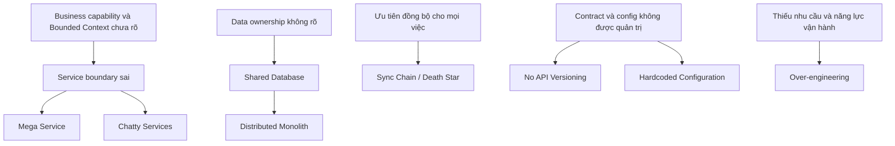
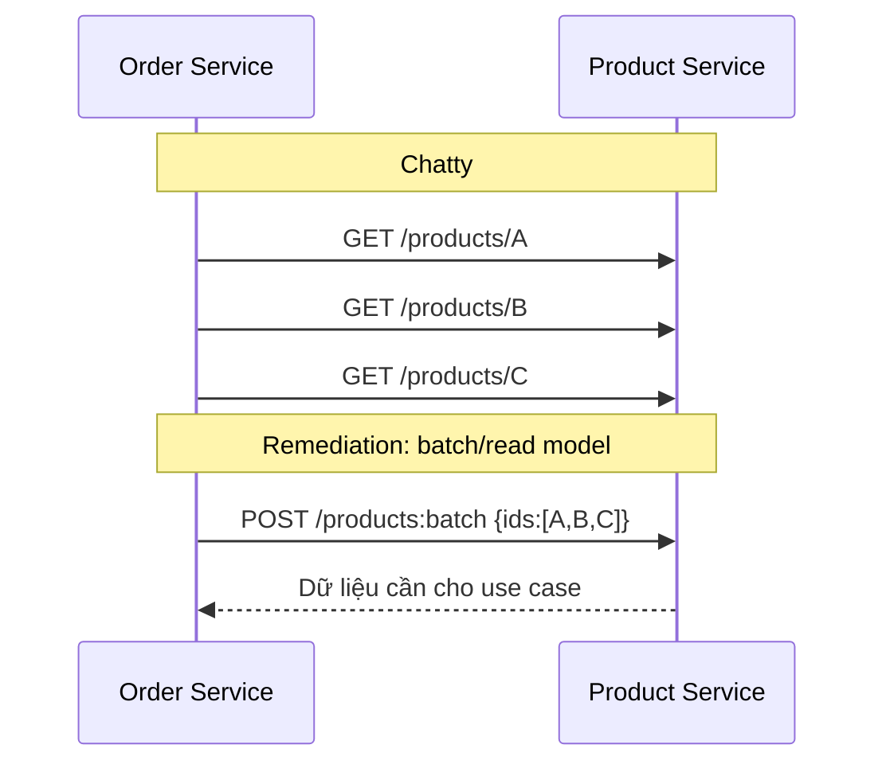
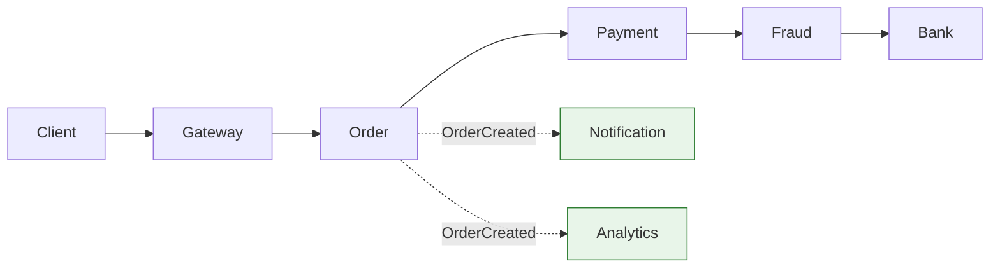

# Microservice Anti-patterns — Nhận diện, phân tích và khắc phục

## Mục lục

- [1. Mục tiêu và cách dùng tài liệu](#1-mục-tiêu-và-cách-dùng-tài-liệu)
- [2. Bản đồ anti-pattern và cách chẩn đoán](#2-bản-đồ-anti-pattern-và-cách-chẩn-đoán)
  - [2.1. Anti-pattern là gì?](#21-anti-pattern-là-gì)
  - [2.2. Phân biệt triệu chứng với nguyên nhân gốc](#22-phân-biệt-triệu-chứng-với-nguyên-nhân-gốc)
- [3. Distributed Monolith](#3-distributed-monolith)
  - [3.1. Dấu hiệu, nguyên nhân và hậu quả](#31-dấu-hiệu-nguyên-nhân-và-hậu-quả)
  - [3.2. Ví dụ và remediation](#32-ví-dụ-và-remediation)
- [4. Shared Database](#4-shared-database)
  - [4.1. Dấu hiệu, nguyên nhân và hậu quả](#41-dấu-hiệu-nguyên-nhân-và-hậu-quả)
  - [4.2. Ví dụ và remediation](#42-ví-dụ-và-remediation)
- [5. Mega Service](#5-mega-service)
  - [5.1. Dấu hiệu, nguyên nhân và hậu quả](#51-dấu-hiệu-nguyên-nhân-và-hậu-quả)
  - [5.2. Ví dụ và remediation](#52-ví-dụ-và-remediation)
- [6. Chatty Services](#6-chatty-services)
  - [6.1. Dấu hiệu, nguyên nhân và hậu quả](#61-dấu-hiệu-nguyên-nhân-và-hậu-quả)
  - [6.2. Ví dụ và remediation](#62-ví-dụ-và-remediation)
- [7. No API Versioning](#7-no-api-versioning)
  - [7.1. Dấu hiệu, nguyên nhân và hậu quả](#71-dấu-hiệu-nguyên-nhân-và-hậu-quả)
  - [7.2. Ví dụ và remediation](#72-ví-dụ-và-remediation)
- [8. Hardcoded Configuration](#8-hardcoded-configuration)
  - [8.1. Dấu hiệu, nguyên nhân và hậu quả](#81-dấu-hiệu-nguyên-nhân-và-hậu-quả)
  - [8.2. Ví dụ và remediation](#82-ví-dụ-và-remediation)
- [9. Sync Chain / Death Star Architecture](#9-sync-chain--death-star-architecture)
  - [9.1. Dấu hiệu, nguyên nhân và hậu quả](#91-dấu-hiệu-nguyên-nhân-và-hậu-quả)
  - [9.2. Ví dụ và remediation](#92-ví-dụ-và-remediation)
- [10. Over-engineering](#10-over-engineering)
  - [10.1. Dấu hiệu, nguyên nhân và hậu quả](#101-dấu-hiệu-nguyên-nhân-và-hậu-quả)
  - [10.2. Ví dụ và remediation](#102-ví-dụ-và-remediation)
- [11. Decision aid — Chọn hướng xử lý](#11-decision-aid--chọn-hướng-xử-lý)
- [12. Lộ trình cải thiện an toàn](#12-lộ-trình-cải-thiện-an-toàn)
- [13. Checklist đánh giá](#13-checklist-đánh-giá)
  - [Ranh giới và ownership](#ranh-giới-và-ownership)
  - [Contract, config và giao tiếp](#contract-config-và-giao-tiếp)
  - [Vận hành và tiến hóa](#vận-hành-và-tiến-hóa)
- [14. Tổng kết](#14-tổng-kết)
- [15. Liên kết liên quan](#15-liên-kết-liên-quan)

---

## 1. Mục tiêu và cách dùng tài liệu

**Anti-pattern** là một cách làm trông có vẻ giải quyết được vấn đề trước mắt, nhưng thường tạo ra hậu quả xấu khi hệ thống và tổ chức phát triển. Trong Microservice, nguy hiểm lớn nhất không phải số lượng service, mà là đánh mất **ranh giới nghiệp vụ, quyền sở hữu dữ liệu và khả năng thay đổi độc lập**.

Tài liệu này dùng cùng các tài liệu về [Bounded Context](02-single-responsibility-bounded-context.md), [Loose Coupling](03-loose-coupling-high-cohesion.md), [Autonomy](04-autonomy-independence.md), [decomposition](05-decomposition-strategies.md), [giao tiếp](06-inter-service-communication.md) và [data management](09-data-management.md). Mỗi mục trả lời năm câu hỏi: **dấu hiệu nào đang xuất hiện, vì sao nó hình thành, hậu quả là gì, một ví dụ cụ thể và cách remediation** (khắc phục có kiểm soát).

> Không có một ngưỡng số lượng service, API hay độ trễ đúng cho mọi hệ thống. Mọi số trong ví dụ dưới đây, nếu có, đều là **giả định minh họa**, không phải chuẩn kiến trúc.

## 2. Bản đồ anti-pattern và cách chẩn đoán



### 2.1. Anti-pattern là gì?

Một anti-pattern không đồng nghĩa với một lựa chọn luôn sai. Ví dụ, một database server dùng chung nhưng **schema, quyền truy cập và ownership tách biệt** có thể là bước chuyển tiếp hợp lý cho đội nhỏ. Nó trở thành vấn đề khi service đọc/ghi trực tiếp dữ liệu không thuộc mình và không có kế hoạch thoát ra.

Nguyên tắc chẩn đoán: đo **hành vi thay đổi** thay vì chỉ nhìn sơ đồ. Nếu thay đổi một capability buộc nhiều đội cùng sửa, cùng kiểm thử hoặc cùng deploy, ranh giới hiện tại cần được xem xét.

### 2.2. Phân biệt triệu chứng với nguyên nhân gốc

| Triệu chứng quan sát được | Có thể là anti-pattern | Câu hỏi tìm nguyên nhân gốc |
|---|---|---|
| Một release phải phối hợp nhiều service | Distributed Monolith, No API Versioning | Contract có tương thích ngược không? Có chia sẻ schema không? |
| Một request có nhiều network hop | Chatty Services, Sync Chain | Dữ liệu nào thật sự cần ngay? Boundary có đúng nghiệp vụ không? |
| Một team là điểm nghẽn của nhiều feature | Mega Service | Service đang gộp những lý do thay đổi nào? |
| Đổi URL/secret phải sửa mã nguồn | Hardcoded Configuration | Config có được tách theo môi trường và quản lý secret không? |
| Hệ thống khó vận hành dù traffic còn đơn giản | Over-engineering | Độ phức tạp có đáp ứng một yêu cầu hiện hữu, đã xác minh không? |

## 3. Distributed Monolith

**Distributed Monolith** là hệ thống được triển khai thành nhiều process/service nhưng vẫn vận hành như một monolith: phụ thuộc chặt về deploy, dữ liệu, thời điểm hoạt động hoặc implementation. Nó gánh chi phí mạng và vận hành của distributed system mà không nhận được autonomy.

### 3.1. Dấu hiệu, nguyên nhân và hậu quả

| Khía cạnh | Phân tích |
|---|---|
| **Dấu hiệu** | Một thay đổi nhỏ cần release đồng thời; service gọi trực tiếp database của nhau; contract thay đổi là nhiều consumer cùng hỏng; runbook yêu cầu khởi động service theo thứ tự; một incident downstream làm toàn bộ luồng không phục vụ được. |
| **Nguyên nhân** | Tách repo/container trước khi tách ownership; Bounded Context chưa rõ; shared library chứa domain model; giao tiếp đồng bộ dùng làm mặc định; thiếu contract test và compatibility policy. |
| **Hậu quả** | Deployment coupling làm release chậm; failure lan truyền; chi phí debug tăng vì lỗi qua mạng; team không tự chủ; hệ thống vừa khó thay đổi như monolith vừa khó quan sát như distributed system. |

### 3.2. Ví dụ và remediation

**Ví dụ:** Order, Payment và Inventory có ba codebase nhưng chung schema. Order thay đổi cột trạng thái, Payment cập nhật trực tiếp cột đó và Inventory chỉ chạy được sau khi nhận synchronous call từ Order. Bất kỳ migration nào cũng cần một release window chung.

```text
❌ Distributed Monolith
Order ──sync──> Payment ──sync──> Inventory
  │              │                  │
  └──────────── Shared schema ──────┘

✅ Ranh giới rõ hơn
Order ──OrderCreated──> Event Broker ──> Inventory
  │                                      (xử lý cục bộ)
Order DB              Payment DB              Inventory DB
```

**Remediation theo từng bước:**

1. Vẽ dependency map từ traces, schema permissions, pipeline và lịch sử thay đổi; ưu tiên một luồng có business value rõ.
2. Chỉ định một owner duy nhất cho từng API, event và tập dữ liệu; cấm truy cập trực tiếp data của owner khác bằng quyền database.
3. Đưa contract ra biên giới service: consumer-driven contract test, schema event/API tương thích ngược và quy trình deprecate.
4. Thay các bước không cần kết quả ngay bằng event hoặc queue; với bước bắt buộc đồng bộ, thêm timeout, fallback và giới hạn phạm vi call.
5. Tách deploy/migration dần theo **Expand and Contract**, không làm big-bang rewrite. Xem [04 — Autonomy](04-autonomy-independence.md) và [05 — Decomposition](05-decomposition-strategies.md).

## 4. Shared Database

**Shared Database** xảy ra khi nhiều service cùng coi một database/schema/table là implementation chung hoặc đọc/ghi trực tiếp dữ liệu của nhau. Vấn đề cốt lõi không phải nằm chung một máy chủ database, mà là **phá vỡ data ownership**.

### 4.1. Dấu hiệu, nguyên nhân và hậu quả

| Khía cạnh | Phân tích |
|---|---|
| **Dấu hiệu** | Nhiều service có credential ghi cùng bảng; migration cần hỏi nhiều team; truy vấn `JOIN` xuyên domain trong code service; không xác định được ai chịu trách nhiệm quality của một cột. |
| **Nguyên nhân** | Tách service từ monolith nhưng chưa tách dữ liệu; cần báo cáo liên domain ngay; muốn dùng transaction ACID xuyên capability; chi phí hạ tầng khiến nhóm giữ DB chung nhưng không phân quyền. |
| **Hậu quả** | Schema trở thành public contract không kiểm soát; migration rủi ro; một query/lock hoặc sự cố DB ảnh hưởng rộng; không thể chọn persistence theo nhu cầu; độc lập deploy và scale bị suy giảm. |

### 4.2. Ví dụ và remediation

**Ví dụ:** Shipping Service cập nhật `orders.shipping_status` để hiển thị tracking nhanh. Sau đó Order Service đổi cách biểu diễn status; Shipping và các báo cáo cũ bị lỗi dù API Order không thay đổi.

**Remediation:**

1. Lập inventory bảng, reader/writer và business owner. Một bảng/tập dữ liệu phải có một owner rõ ràng.
2. Chặn ghi chéo trước, sau đó chặn đọc chéo bằng role database, schema riêng hoặc database riêng tùy khả năng vận hành.
3. Cung cấp API cho query cần dữ liệu hiện thời; dùng event-carried state transfer, read model hoặc API composition cho dữ liệu đọc liên domain.
4. Thay distributed transaction bằng Saga khi chấp nhận eventual consistency; thiết kế compensating action và idempotency.
5. Khi đang migrate, dùng outbox/CDC để đồng bộ dữ liệu; đặt tiêu chí hoàn thành và thời hạn xóa đường truy cập cũ.

> Shared Database có thể là trạng thái tạm thời trong migration hoặc mô hình chi phí thấp cho nhóm nhỏ. Nó chỉ an toàn khi ownership, quyền truy cập và kế hoạch tách đã được ghi rõ. Chi tiết tại [09 — Data Management](09-data-management.md).

## 5. Mega Service

**Mega Service** (còn gọi God Service) là service ôm nhiều capability không cùng thay đổi: chẳng hạn Order vừa xử lý đơn hàng, thanh toán, kho, vận chuyển, báo cáo và thông báo. Đây là monolith thu nhỏ với biên giới sai, không đơn thuần là service có nhiều dòng mã.

### 5.1. Dấu hiệu, nguyên nhân và hậu quả

| Khía cạnh | Phân tích |
|---|---|
| **Dấu hiệu** | Tên service chung chung; endpoint và bảng dữ liệu thuộc nhiều domain; nhiều team thường xuyên sửa cùng codebase; release một thay đổi buộc regression test phần không liên quan; scale một workload làm scale cả service. |
| **Nguyên nhân** | Tách theo layer kỹ thuật thay vì business capability; hiểu domain chưa đủ; né distributed transaction; không có team ownership theo domain; sợ tạo service mới nên liên tục thêm vào service cũ. |
| **Hậu quả** | Blast radius lớn; merge conflict và queue review tăng; khó chọn scaling/storage phù hợp; tốc độ thay đổi giảm; service dần thành điểm kiểm soát trung tâm của mọi workflow. |

### 5.2. Ví dụ và remediation

**Ví dụ:** `CommerceService` tạo đơn, tính khuyến mãi, charge thẻ, giữ hàng, gọi hãng vận chuyển và gửi email. Quy tắc hoàn tiền thay đổi làm nhóm phải test cả tính phí vận chuyển và template email.

**Remediation:**

1. Tổ chức Event Storming hoặc workshop với domain expert để nhóm các event, policy và data thay đổi cùng nhau thành Bounded Context.
2. Chọn một capability có ranh giới và ownership dữ liệu rõ để tách trước, không tách theo từng class/entity.
3. Tạo contract tại biên giới mới, chuyển dần caller bằng feature flag hoặc Strangler Fig; giữ service cũ như facade tạm thời nếu cần.
4. Chuyển ownership dữ liệu trước hoặc song song với logic; tránh tạo service mới chỉ là CRUD wrapper.
5. Xác định team chịu trách nhiệm end-to-end cho từng service mới, bao gồm deploy, monitoring và on-call.

Việc tách không luôn tốt hơn: nếu hai phần luôn thay đổi, deploy và cần transaction cùng nhau, có thể chúng nên ở cùng một **modular monolith** hoặc cùng một service. Xem [02 — Bounded Context](02-single-responsibility-bounded-context.md) và [05 — Decomposition](05-decomposition-strategies.md).

## 6. Chatty Services

**Chatty Services** là tình trạng một use case tạo quá nhiều request nhỏ giữa các service, thường là N+1 call hoặc nhiều lần lấy từng phần của cùng một resource. Nó khác Sync Chain: chatty nhấn mạnh **số round-trip**, còn Sync Chain nhấn mạnh **độ sâu phụ thuộc đồng bộ**.

### 6.1. Dấu hiệu, nguyên nhân và hậu quả

| Khía cạnh | Phân tích |
|---|---|
| **Dấu hiệu** | Trace của một thao tác có nhiều call lặp lại tới cùng provider; payload rất nhỏ; caller gọi từng item trong danh sách; dashboard bị chi phối bởi latency mạng; provider bị tải bởi query lặp. |
| **Nguyên nhân** | API thiết kế theo entity thay vì use case; client không có batch endpoint; model dữ liệu cần để đọc bị phân mảnh; tách service quá nhỏ; Gateway/BFF chỉ chuyển tiếp thay vì aggregate. |
| **Hậu quả** | Latency chồng dồn và biến thiên; tốn connection/CPU; tăng điểm lỗi; provider khó scale; logic hiển thị hoặc orchestration bị phân tán sang client. |

### 6.2. Ví dụ và remediation

**Ví dụ giả định:** Trang chi tiết đơn có ba mặt hàng. Order Service gọi Product Service một lần cho từng SKU để lấy tên/ảnh, rồi gọi thêm từng SKU để lấy giá. Sáu round-trip có thể được thay bằng một query batch hoặc read model phù hợp.



**Remediation:**

1. Dùng distributed tracing để xác định call pattern, caller và dữ liệu thật sự cần; không tối ưu chỉ vì số call trông lớn.
2. Thiết kế API theo use case: batch endpoint, endpoint trả projection cần thiết, hoặc BFF aggregation cho client-facing flow.
3. Replicate dữ liệu chỉ đọc cần thiết qua event để tạo local read model; quy định source of truth và chấp nhận eventual consistency rõ ràng.
4. Cache có expiry/invalidation phù hợp khi dữ liệu được phép cũ tạm thời; không dùng cache để che giấu ownership sai.
5. Nếu hai service luôn gọi nhau để hoàn thành một capability, đánh giá lại boundary và cân nhắc gộp.

Xem thêm [06 — Inter-Service Communication](06-inter-service-communication.md) và [03 — Loose Coupling](03-loose-coupling-high-cohesion.md).

## 7. No API Versioning

**No API Versioning** là thay đổi public contract mà không có chiến lược compatibility, version, deprecation hoặc thông báo consumer. Versioning không nhất thiết luôn là `/v1`; điều bắt buộc là consumer cũ không bị phá vỡ ngoài ý muốn.

### 7.1. Dấu hiệu, nguyên nhân và hậu quả

| Khía cạnh | Phân tích |
|---|---|
| **Dấu hiệu** | Rename/xóa field làm consumer lỗi khi deploy provider; không biết ai đang gọi endpoint/event nào; API docs không có lifecycle; breaking change được xử lý bằng coordinated release. |
| **Nguyên nhân** | Xem internal API là implementation detail; không có contract registry/test; thiếu ownership của provider; không phân loại breaking và non-breaking change. |
| **Hậu quả** | Deployment coupling; rollback khó khi consumer/provider lệch version; consumer tự parse mong manh; thay đổi nhỏ thành incident liên team. |

### 7.2. Ví dụ và remediation

**Ví dụ:** Provider đổi response từ `fullName` sang `firstName` và `lastName`, đồng thời xóa `fullName`. Consumer cũ deserialize thất bại ngay sau deploy.

**Remediation:**

1. Công bố API/event như sản phẩm: owner, schema, changelog, consumer và chính sách support.
2. Ưu tiên thay đổi additive: thêm field optional/endpoint mới; consumer áp dụng **Tolerant Reader**, chỉ đọc field cần thiết và bỏ qua field chưa biết.
3. Với breaking change, dùng **Expand and Contract**: thêm contract mới, migrate consumer có quan sát usage, rồi deprecate và xóa theo kế hoạch.
4. Chọn cách biểu diễn version nhất quán (URL, header, media type hoặc version schema event); quyết định dựa trên loại API và tooling, không chỉ theo thói quen.
5. Chạy provider/consumer contract test trong CI; alert khi traffic còn dùng version sắp sunset.

```text
Phase Expand:   /orders (contract cũ) + /v2/orders (contract mới)
Phase Migrate:  consumer chuyển dần và được đo usage
Phase Contract: xóa contract cũ sau deprecation đã công bố
```

API versioning không thay thế compatibility. Tạo v2 cho mọi field mới sẽ sinh nhiều version khó vận hành; hãy version khi thay đổi thực sự breaking. Tham khảo [04 — Backward Compatibility](04-autonomy-independence.md).

## 8. Hardcoded Configuration

**Hardcoded Configuration** là đưa thông tin thay đổi theo môi trường hoặc bí mật vận hành—URL, timeout, feature flag, credential, topic name—vào source code hoặc image. Cần phân biệt **configuration** với rule nghiệp vụ: quy tắc giá/khuyến mãi thường thuộc domain, không nên biến thành biến môi trường tùy tiện.

### 8.1. Dấu hiệu, nguyên nhân và hậu quả

| Khía cạnh | Phân tích |
|---|---|
| **Dấu hiệu** | Source có hostname production, password/token, tên queue theo môi trường; đổi endpoint phải build image mới; cùng artifact không chạy được ở môi trường khác; log/issue vô tình lộ secret. |
| **Nguyên nhân** | Khởi đầu nhanh; thiếu config service hoặc secret manager; chưa phân loại config; không có validation/lifecycle cho config. |
| **Hậu quả** | Deploy tốn thời gian và dễ sai; secret lộ qua git/image/log; rollback cấu hình khó; drift giữa môi trường; không thể audit ai đổi cấu hình. |

### 8.2. Ví dụ và remediation

**Ví dụ:** Payment Service chứa `https://payment-prod.example` và API key trực tiếp trong mã. Developer muốn test staging phải sửa code, tạo build riêng, và có nguy cơ commit key.

**Remediation:**

1. Tách config theo môi trường khỏi artifact; build một artifact và inject config lúc deploy qua environment, mounted file hoặc config service.
2. Đưa secret vào secret manager; chỉ tham chiếu secret trong deployment, áp dụng least privilege, rotation và redaction log.
3. Validate config tại startup (giá trị bắt buộc, format, quan hệ timeout); fail fast với lỗi không tiết lộ secret.
4. Phân loại mutable config, feature flag và domain policy; thiết lập owner, audit trail, rollback và thời điểm refresh rõ ràng.
5. Không dùng dynamic config để né quy trình review cho thay đổi nghiệp vụ rủi ro.

```text
❌ source code: BANK_URL, API_KEY, timeout theo production
✅ artifact bất biến + config theo môi trường + secret reference có quyền tối thiểu
```

Xem [16 — Configuration & Secrets Management](16-configuration-secrets-management.md) để chọn cơ chế lưu trữ và xoay vòng secret.

## 9. Sync Chain / Death Star Architecture

**Sync Chain** là chuỗi request đồng bộ A → B → C → …, trong đó caller chờ downstream ở từng bước. **Death Star Architecture** mô tả dạng cực đoan: một service/gateway trung tâm điều phối quá nhiều service đồng bộ, thành điểm nghẽn và điểm lỗi tập trung.

### 9.1. Dấu hiệu, nguyên nhân và hậu quả

| Khía cạnh | Phân tích |
|---|---|
| **Dấu hiệu** | Trace có path sâu; latency end-to-end tăng khi thêm service; một downstream chậm làm upstream giữ connection/thread; gateway chứa business workflow; retry ở nhiều tầng tạo request storm. |
| **Nguyên nhân** | Đồng bộ là mặc định; nhầm API Gateway với business orchestrator; chưa chấp nhận eventual consistency; thiếu local read model; timeout/retry/circuit breaker không được thiết kế theo toàn chuỗi. |
| **Hậu quả** | Temporal coupling: nhiều service phải khỏe cùng lúc; cascade failure; latency là tổng các bước; central service trở thành bottleneck; khó release từng capability. |

### 9.2. Ví dụ và remediation

**Ví dụ:** Client gọi Gateway, Gateway gọi Order, Order gọi Payment, Payment gọi Fraud, Fraud gọi ngân hàng. Nếu Fraud chậm, toàn bộ checkout bị treo dù việc gửi email hay analytics không cần kết quả ngay.



**Remediation:**

1. Phân loại từng call: cần câu trả lời ngay, cần xử lý chắc chắn nhưng có thể chờ, hay chỉ là thông báo. Chỉ giữ sync ở điểm business thật sự cần quyết định tức thời.
2. Chuyển notification, analytics, indexing và công việc hậu xử lý sang queue/pub-sub; trả `202 Accepted` cùng trạng thái/polling hoặc callback cho tác vụ dài.
3. Dùng timeout budget từ ngoài vào trong, circuit breaker, bulkhead, retry có backoff và idempotency; retry chỉ ở nơi có thể xử lý an toàn.
4. Giữ Gateway ở vai trò edge concern như auth, routing và response composition; đặt workflow domain vào service/orchestrator có ownership rõ ràng khi thực sự cần.
5. Tạo local projection/cache cho read path quan trọng để giảm synchronous lookup; kiểm thử failure mode bằng cách làm downstream chậm hoặc unavailable.

Không phải mọi sync call là anti-pattern: xác thực thanh toán hoặc kiểm tra điều kiện bắt buộc có thể cần kết quả tức thời. Điều cần tránh là biến mọi hậu quả nghiệp vụ thành một chuỗi chờ đợi. Xem [06 — Inter-Service Communication](06-inter-service-communication.md) và [10 — Resilience Patterns](10-resilience-patterns.md).

## 10. Over-engineering

**Over-engineering** là áp dụng độ phức tạp kiến trúc vượt quá nhu cầu đã được chứng minh và năng lực vận hành hiện tại: tách Microservice cho mọi hàm nhỏ, dùng nhiều broker/database/service mesh/CQRS/Event Sourcing khi chưa có use case tương ứng, hoặc xây platform trước khi có consumer thật.

### 10.1. Dấu hiệu, nguyên nhân và hậu quả

| Khía cạnh | Phân tích |
|---|---|
| **Dấu hiệu** | Hệ thống có nhiều thành phần nền tảng nhưng ít business capability; team dành phần lớn thời gian vận hành tool; service chỉ bọc một thao tác CRUD; local development và incident response khó hơn giá trị feature mang lại. |
| **Nguyên nhân** | Bắt chước kiến trúc công ty lớn; dự đoán scale không có dữ liệu; tách service trước khi hiểu domain; chọn công nghệ vì mới; thiếu ownership/platform maturity. |
| **Hậu quả** | Chi phí cognitive load, CI/CD, observability, security, backup và on-call tăng; delivery chậm; bề mặt lỗi rộng; khó tuyển/đào tạo; team né thay đổi vì sợ hệ thống. |

### 10.2. Ví dụ và remediation

**Ví dụ:** Một sản phẩm mới có một đội nhỏ nhưng tách Email Validation, Email Formatting, Email Sending và Email Logging thành bốn service; thêm Kafka, service mesh và nhiều database trước khi có yêu cầu scale hay isolation. Một email flow giờ cần nhiều deploy, dashboard và failure path hơn feature thực tế.

**Remediation:**

1. Viết **decision record**: vấn đề hiện tại, lựa chọn đơn giản nhất, lợi ích kỳ vọng, chi phí vận hành và tín hiệu sẽ buộc phải nâng cấp.
2. Bắt đầu bằng modular monolith hoặc một service theo business capability khi domain, team và traffic chưa chứng minh cần phân tán.
3. Tách chỉ khi có driver rõ như ownership độc lập, scaling/failure isolation khác biệt, ranh giới domain ổn định hoặc compliance.
4. Chuẩn hóa golden path tối thiểu (logging, health check, pipeline, secret) trước khi nhân số service; không yêu cầu mọi pattern nâng cao cho mọi workload.
5. Định kỳ xóa thành phần không có consumer/giá trị, gộp nano-service và giảm tool trùng lặp.

> Đơn giản không có nghĩa là bỏ qua reliability hay security. Đơn giản là chọn mức độ phức tạp nhỏ nhất vẫn đáp ứng yêu cầu hiện tại và có đường tiến hóa khi bằng chứng thay đổi.

## 11. Decision aid — Chọn hướng xử lý

| Nếu quan sát thấy | Kiểm tra trước | Hướng xử lý ưu tiên | Tránh phản ứng vội vàng |
|---|---|---|---|
| Release phải đi cùng nhau | Shared schema? breaking contract? shared deploy pipeline? | Tách ownership, compatibility và pipeline trước | Chia repo thêm mà không đổi coupling |
| Nhiều call nhỏ tới cùng provider | Có phải N+1? Dữ liệu có cần tươi ngay? | Batch/projection/BFF/read model | Cache bừa hoặc tăng timeout |
| Một service ôm nhiều domain | Những rule nào thay đổi cùng nhau? Ai own? | Bounded Context + tách theo capability | Tách mỗi entity/class thành service |
| Cần dữ liệu liên domain | Read hay write? cần strong consistency không? | API, event projection, Saga tùy use case | JOIN trực tiếp DB khác |
| Contract sắp đổi | Có consumer nào? Có thể additive không? | Expand and Contract + contract test | Deploy breaking change đồng loạt |
| Downstream không ổn định | Bước đó có cần đồng bộ không? failure mode? | Async, timeout, circuit breaker, fallback | Retry không giới hạn ở mọi tầng |
| Muốn thêm tool/pattern mới | Nó giải quyết vấn đề nào đã đo được? Ai vận hành? | ADR + thử nghiệm nhỏ/reversible | Cài tool trước rồi tìm use case |

## 12. Lộ trình cải thiện an toàn

1. **Làm rõ hiện trạng:** thu thập service catalog, owner, dependency graph, traces, quyền DB, API/event contracts và luồng deploy.
2. **Chọn một lát cắt:** ưu tiên use case có pain cụ thể, rủi ro kiểm soát được và owner cam kết; không tái kiến trúc toàn bộ cùng lúc.
3. **Đặt safety net:** distributed tracing, metrics/error budget phù hợp, contract test, backup/migration plan, feature flag và rollback path.
4. **Thay đổi theo trình tự:** thêm contract/data path mới → chạy song song/quan sát → chuyển consumer/traffic → xóa path cũ. Đây là tinh thần Strangler Fig và Expand and Contract.
5. **Xác nhận kết quả:** so sánh coupling, failure isolation, lead time và chất lượng vận hành trước/sau bằng dữ liệu của chính hệ thống; ghi nhận trade-off còn lại.

## 13. Checklist đánh giá

### Ranh giới và ownership

- [ ] Mỗi service có business capability và owner/team chịu trách nhiệm rõ ràng.
- [ ] Không service nào đọc/ghi trực tiếp dữ liệu thuộc service khác.
- [ ] Các capability thường thay đổi cùng nhau được giữ cùng boundary; các capability độc lập có đường tách hợp lý.
- [ ] Không có service trung tâm chứa business logic của mọi domain.

### Contract, config và giao tiếp

- [ ] API/event có owner, schema/documentation, compatibility policy và deprecation path.
- [ ] Contract test phát hiện thay đổi phá vỡ consumer trước khi release.
- [ ] Config theo môi trường nằm ngoài artifact; secret không nằm trong source, image hay log.
- [ ] Call đồng bộ chỉ tồn tại khi caller cần kết quả ngay; timeout, retry và idempotency được thiết kế theo luồng.
- [ ] Read path chatty đã có batch, projection, cache hoặc boundary phù hợp thay vì nhiều lookup nhỏ.

### Vận hành và tiến hóa

- [ ] Mỗi service có logging, metrics, tracing và health signal đủ để tìm dependency/failure path.
- [ ] Có pipeline và rollback độc lập ở mức hợp lý; migration không đòi coordinated release mặc định.
- [ ] Pattern/tool mới có use case, owner vận hành, chi phí và tiêu chí thành công được ghi lại.
- [ ] Technical debt tạm thời như shared database có exit plan, owner và mốc rà soát.

## 14. Tổng kết

Microservice không được đo bằng số container mà bằng khả năng **thay đổi và vận hành độc lập**. Distributed Monolith, Shared Database, Mega Service, Chatty Services, No API Versioning, Hardcoded Configuration, Sync Chain và Over-engineering thường là các biểu hiện khác nhau của cùng một thiếu sót: ranh giới, contract, ownership hoặc trade-off chưa được làm rõ.

Hãy bắt đầu từ business capability, bảo vệ data ownership, coi contract là sản phẩm, chọn sync/async theo nhu cầu thực tế và nâng độ phức tạp dần theo bằng chứng. Một hệ thống ít service nhưng có boundary tốt thường đáng tin cậy hơn một sơ đồ nhiều service nhưng phụ thuộc lẫn nhau.

## 15. Liên kết liên quan

- [02 — Single Responsibility & Bounded Context](02-single-responsibility-bounded-context.md) — xác định ranh giới nghiệp vụ.
- [03 — Loose Coupling & High Cohesion](03-loose-coupling-high-cohesion.md) — giảm coupling và tránh God Service.
- [04 — Autonomy & Independence](04-autonomy-independence.md) — independent deployment, compatibility và team ownership.
- [05 — Decomposition Strategies](05-decomposition-strategies.md) — tách/gộp service và Strangler Fig.
- [06 — Inter-Service Communication](06-inter-service-communication.md) — sync, async, event và resilience của giao tiếp.
- [09 — Data Management](09-data-management.md) — Database per Service, Saga, Outbox và data consistency.
- [10 — Resilience Patterns](10-resilience-patterns.md) — timeout, retry, circuit breaker và bulkhead.
- [16 — Configuration & Secrets Management](16-configuration-secrets-management.md) — externalized config và secret.
- [17 — Design Patterns](17-design-patterns.md) — các pattern bổ trợ và bản tóm tắt anti-pattern.
