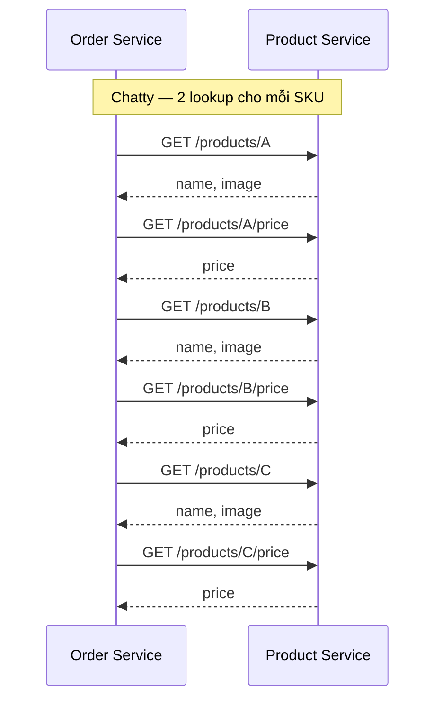
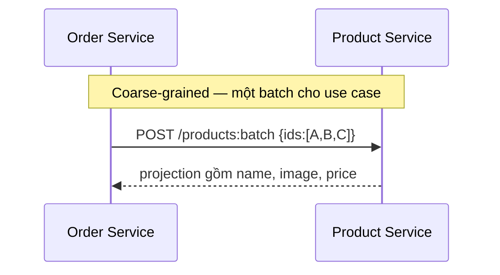

# Chatty Services — Anti-pattern trong Microservice

## Mục lục

- [Tổng quan](#tổng-quan)
  - [Chatty Services là gì](#chatty-services-là-gì)
  - [Phạm vi tài liệu](#phạm-vi-tài-liệu)
- [Nhận diện Chatty Services](#nhận-diện-chatty-services)
  - [Dấu hiệu gọi qua lại dày đặc](#dấu-hiệu-gọi-qua-lại-dày-đặc)
  - [Phân biệt với Sync Chain](#phân-biệt-với-sync-chain)
  - [Đo bằng traces metrics và logs](#đo-bằng-traces-metrics-và-logs)
- [Tác động của anti-pattern](#tác-động-của-anti-pattern)
  - [Latency và biến thiên](#latency-và-biến-thiên)
  - [Availability và failure points](#availability-và-failure-points)
  - [Resource và cost](#resource-và-cost)
  - [Coupling và khả năng thay đổi](#coupling-và-khả-năng-thay-đổi)
- [Nguyên nhân hình thành](#nguyên-nhân-hình-thành)
  - [API theo entity thay vì use case](#api-theo-entity-thay-vì-use-case)
  - [Dữ liệu đọc bị phân mảnh](#dữ-liệu-đọc-bị-phân-mảnh)
  - [Service boundary quá nhỏ](#service-boundary-quá-nhỏ)
  - [Gateway hoặc BFF chỉ chuyển tiếp](#gateway-hoặc-bff-chỉ-chuyển-tiếp)
- [Ví dụ N+1 trong trang chi tiết đơn hàng](#ví-dụ-n1-trong-trang-chi-tiết-đơn-hàng)
  - [Luồng chatty](#luồng-chatty)
  - [Luồng coarse-grained](#luồng-coarse-grained)
  - [Điều ví dụ cho thấy](#điều-ví-dụ-cho-thấy)
- [Remediation](#remediation)
  - [Bước 1: Đo call pattern và dữ liệu cần thiết](#bước-1-đo-call-pattern-và-dữ-liệu-cần-thiết)
  - [Bước 2: Thiết kế coarse-grained API](#bước-2-thiết-kế-coarse-grained-api)
  - [Bước 3: Dùng aggregation ở đúng boundary](#bước-3-dùng-aggregation-ở-đúng-boundary)
  - [Bước 4: Chuyển read path phù hợp sang async](#bước-4-chuyển-read-path-phù-hợp-sang-async)
  - [Bước 5: Dùng cache có chủ đích](#bước-5-dùng-cache-có-chủ-đích)
  - [Bước 6: Đánh giá lại service boundary](#bước-6-đánh-giá-lại-service-boundary)
- [Trade-offs và giới hạn](#trade-offs-và-giới-hạn)
  - [Bảng trade-off](#bảng-trade-off)
  - [Khi không nên tối ưu bằng mọi giá](#khi-không-nên-tối-ưu-bằng-mọi-giá)
- [Vận hành và observability](#vận-hành-và-observability)
  - [Metrics và dashboard](#metrics-và-dashboard)
  - [Distributed Tracing](#distributed-tracing)
  - [Timeout retry và partial failure](#timeout-retry-và-partial-failure)
  - [Rollout và kiểm chứng](#rollout-và-kiểm-chứng)
- [Checklist](#checklist)
  - [Nhận diện](#nhận-diện)
  - [API và data](#api-và-data)
  - [Resilience và vận hành](#resilience-và-vận-hành)
- [Liên kết liên quan](#liên-kết-liên-quan)

---

## Tổng quan

### Chatty Services là gì

**Chatty Services** là tình trạng một use case tạo ra quá nhiều request nhỏ giữa các service. Mẫu thường gặp là **N+1 call**: caller lấy một danh sách rồi gọi provider thêm một lần cho từng item, hoặc gọi nhiều lần để lấy từng phần của cùng một resource.

Ví dụ, `Order Service` có ba SKU nhưng gọi `Product Service` riêng cho từng SKU để lấy tên, ảnh và giá. Số request tăng theo số item thay vì theo một operation có ý nghĩa. Một service gọi service khác không tự động là Chatty Services. Anti-pattern xuất hiện khi nhiều round-trip nhỏ trở thành cách chính để hoàn thành cùng một use case.

Chatty Services tập trung vào **số round-trip**. Nó có thể xuất hiện cả khi các call chạy tuần tự lẫn khi chúng chạy song song. Điều này khác với **Sync Chain**, vốn nhấn mạnh độ sâu của chuỗi phụ thuộc đồng bộ. Một luồng có thể vừa chatty vừa là Sync Chain.

### Phạm vi tài liệu

Tài liệu này tập trung vào cách nhận diện call pattern dày đặc, tác động đến latency, availability và resource, sau đó chọn remediation phù hợp. Các hướng chính gồm coarse-grained API, batch API, aggregation, async read path, cache có kiểm soát và đánh giá lại service boundary.

Mục tiêu không phải là đặt một ngưỡng cứng cho số request. Mỗi hệ thống cần được đánh giá bằng traces, contract, yêu cầu về độ tươi dữ liệu và khả năng vận hành thực tế.

## Nhận diện Chatty Services

### Dấu hiệu gọi qua lại dày đặc

Các dấu hiệu sau nên được xem cùng nhau. Không nên kết luận chỉ từ một metric riêng lẻ:

| Dấu hiệu quan sát được | Câu hỏi cần kiểm tra |
|---|---|
| Một trace có nhiều call lặp lại tới cùng provider | Các call lấy những field nào? Có phải cùng một resource không? |
| Payload của từng request rất nhỏ | Có thể trả một projection phục vụ cả use case trong một response không? |
| Caller lặp qua từng item trong danh sách | Đây có phải N+1 call không? Provider có batch endpoint không? |
| Dashboard bị chi phối bởi network latency | Thời gian nằm ở network, xử lý provider hay chờ các call tuần tự? |
| Provider nhận các query lặp lại | Các consumer có cùng cần một tập dữ liệu đọc không? |
| Client phải tự gọi và ghép nhiều endpoint | API shape có đang đẩy logic hiển thị hoặc orchestration sang client không? |

**N+1 call** không chỉ là vấn đề của database query. Trong bối cảnh Microservice, mỗi vòng lặp gọi qua network có thêm thời gian chờ, serialization và xử lý ở cả caller lẫn provider.

Một dấu hiệu thực tế là số call tăng tuyến tính theo số item của một request. Ví dụ, trang có ba item tạo sáu call tới cùng provider vì mỗi item cần hai lần lookup. Con số này chỉ minh họa pattern, không phải ngưỡng để kết luận mọi hệ thống.

### Phân biệt với Sync Chain

Hai anti-pattern này liên quan nhưng không giống nhau:

| Khía cạnh | Chatty Services | Sync Chain |
|---|---|---|
| Trọng tâm | Nhiều round-trip nhỏ cho một use case | Chuỗi phụ thuộc đồng bộ có nhiều tầng |
| Hình dạng thường gặp | `A → B` lặp lại theo từng item | `A → B → C → D` |
| Rủi ro chính | Network overhead, call amplification và provider load | Temporal coupling, latency chồng dồn và failure lan truyền |
| Cách đo | Số call theo request, pattern lặp và payload | Độ sâu chain, thời gian chờ và critical path |
| Remediation tiêu biểu | Batch, projection, aggregation hoặc read model | Giảm bước sync không cần thiết, dùng async và resilience |

Một request có thể gọi cùng một provider nhiều lần nhưng không tạo chain sâu. Ngược lại, chain chỉ có vài bước vẫn có thể chậm hoặc dễ lỗi dù không có N+1. Vì vậy, cần đọc trace để xác định cả **độ rộng** (số call) và **độ sâu** (số tầng phụ thuộc).

### Đo bằng traces metrics và logs

Bắt đầu từ một use case cụ thể, chẳng hạn `GET /order-detail/{id}` hoặc một request dựng trang. Thu thập các dữ liệu sau:

1. **Distributed traces:** đếm số downstream call, provider được gọi, thứ tự call và thời gian chờ của từng span.
2. **Request metrics:** theo dõi số call trung bình theo route hoặc use case cùng latency P50, P95 và P99.
3. **Dependency metrics:** so sánh latency, error, timeout và traffic của từng provider.
4. **Logs và query data:** tìm vòng lặp theo item, payload nhỏ lặp lại hoặc cùng một query được gửi nhiều lần.
5. **Resource metrics:** quan sát connection, CPU và saturation ở caller và provider.

Phân biệt call tuần tự với call song song. Call song song có thể rút ngắn thời gian chờ của các dependency độc lập, nhưng vẫn tạo fan-out và tiêu tốn resource. Không nên tối ưu chỉ vì một trace có nhiều span; trước hết cần xác định dữ liệu đó có thật sự cần cho contract hay không.

## Tác động của anti-pattern

### Latency và biến thiên

Mỗi round-trip thêm chi phí truyền request, serialize/deserialize và xử lý ở provider. Khi các call chạy tuần tự, thời gian chờ của chúng chồng dồn vào request tổng thể. Khi các call chạy song song, thời gian vẫn bị chi phối bởi dependency chậm nhất và chi phí fan-out vẫn tăng.

Latency cũng trở nên biến thiên hơn. Chỉ một provider chậm, một connection pool cạn hoặc một query lặp bị quá tải cũng có thể làm cả use case vượt thời gian chờ. Vì vậy, cần đo latency ở từng downstream thay vì chỉ đo thời gian của request ngoài cùng.

### Availability và failure points

Mỗi call bắt buộc thêm một điểm có thể timeout hoặc trả lỗi. Nếu tất cả lookup đều cần để tạo response, một lỗi ở provider có thể làm toàn bộ use case thất bại. Nếu một phần dữ liệu chỉ bổ trợ, contract cần quy định partial failure thay vì để lỗi đó làm hỏng toàn bộ response.

Các call lặp còn tạo áp lực ngược lên provider. Khi provider chậm, caller có thể giữ nhiều request lâu hơn. Nếu retry được áp dụng ở nhiều tầng, số call tăng thêm và có thể làm tình trạng quá tải nặng hơn.

### Resource và cost

Chatty pattern tiêu tốn nhiều **connection**, CPU và thao tác serialization hơn một call có dữ liệu phù hợp. Provider phải xử lý nhiều request và query nhỏ thay vì một request batch. Caller cũng cần nhiều connection và nhiều span, log hoặc metric để theo dõi.

Vì vậy, cost ở đây không chỉ là bandwidth. Nó còn là capacity của service, connection pool, broker hoặc gateway nếu có aggregation, cùng chi phí vận hành và điều tra sự cố. Không nên cố định một con số chung; hãy so sánh resource trước và sau remediation trên chính workload của hệ thống.

### Coupling và khả năng thay đổi

Caller biết provider cung cấp dữ liệu ở mức entity hoặc field nào, biết phải gọi bao nhiêu endpoint và phải ghép response ra sao. Logic hiển thị hoặc orchestration vì thế có thể bị phân tán sang client hoặc service gọi.

Khi provider đổi cách tổ chức resource, caller có thể phải sửa nhiều call. Khi thêm một field cho một use case, team có thể tiếp tục thêm endpoint nhỏ thay vì cải thiện contract. Coupling không nhất thiết là implementation coupling, nhưng granular contract quá mức vẫn làm thay đổi và kiểm thử phức tạp hơn.

## Nguyên nhân hình thành

### API theo entity thay vì use case

API được thiết kế quanh từng entity thường cung cấp các endpoint nhỏ như `GET /products/{id}`. Cách này phù hợp cho một resource đơn lẻ, nhưng trở nên chatty khi caller cần một danh sách lớn hoặc cần nhiều projection cho cùng một màn hình.

Nếu caller biết trước toàn bộ danh sách ID, một batch endpoint hoặc projection theo use case thường phù hợp hơn việc lặp cùng một request. Contract mới vẫn phải giữ ownership ở provider và chỉ trả dữ liệu mà use case cần.

### Dữ liệu đọc bị phân mảnh

Model dữ liệu cần để đọc có thể bị tách thành nhiều service. Một màn hình phải lấy tên và ảnh từ một endpoint, giá từ endpoint khác rồi tự ghép kết quả. Tình trạng này đặc biệt dễ tạo N+1 khi mỗi item lại cần cùng tập lookup.

Nếu dữ liệu đọc không cần tươi ngay, consumer có thể nhận event và tạo **local read model** (bản sao dữ liệu tối ưu cho việc đọc). Cách này giảm lookup lặp nhưng phải nêu rõ source of truth và mức **eventual consistency** có thể chấp nhận.

### Service boundary quá nhỏ

Tách service quá nhỏ hoặc tách theo entity có thể làm một capability bị chia thành nhiều phần thường xuyên gọi qua lại. Mỗi phần có thể độc lập về process, nhưng use case vẫn phải đi qua nhiều network boundary.

Dấu hiệu mạnh là hai service luôn gọi nhau để hoàn thành cùng một business capability. Khi đó, cần đánh giá lại Bounded Context, ownership và lý do thay đổi trước khi tiếp tục thêm endpoint.

### Gateway hoặc BFF chỉ chuyển tiếp

Một API Gateway hoặc **Backend for Frontend (BFF)** có thể chỉ forward từng request từ client xuống service. Client vẫn phải thực hiện nhiều round-trip và tự ghép dữ liệu, dù đã có một entry point ở phía trước.

Ngược lại, Gateway hoặc BFF có thể làm **API Aggregation** cho một client-facing use case: gọi các dependency độc lập, thường là song song, rồi gộp response. Aggregation không được biến Gateway thành nơi chứa business rule hoặc workflow domain.

## Ví dụ N+1 trong trang chi tiết đơn hàng

### Luồng chatty

**Ví dụ giả định:** `Order Service` cần dựng trang chi tiết một order có ba item với SKU `A`, `B` và `C`. Với mỗi SKU, service gọi một lần để lấy tên và ảnh, rồi gọi thêm một lần để lấy giá.



Một request ngoài cùng tạo sáu round-trip tới cùng provider. Nếu các call được thực hiện tuần tự, latency có thể chồng dồn. Nếu được thực hiện song song, caller vẫn tạo fan-out và provider vẫn phải xử lý sáu request.

### Luồng coarse-grained

Một contract coarse-grained (có mức độ bao quát phù hợp với use case) có thể nhận nhiều ID và trả projection cần thiết trong một response:

```http
POST /products:batch
Content-Type: application/json

{
  "ids": ["A", "B", "C"],
  "fields": ["name", "image", "price"]
}
```

```json
{
  "items": [
    { "id": "A", "name": "Sản phẩm A", "image": "a.jpg", "price": 100000 },
    { "id": "B", "name": "Sản phẩm B", "image": "b.jpg", "price": 200000 },
    { "id": "C", "name": "Sản phẩm C", "image": "c.jpg", "price": 300000 }
  ]
}
```



Đây chỉ là contract minh họa. Provider cần quyết định field nào thuộc ownership của mình, cách xử lý ID không tồn tại và giới hạn batch phù hợp với khả năng vận hành.

### Điều ví dụ cho thấy

- Số `6` không phải ngưỡng để kết luận một hệ thống mắc anti-pattern. Điều quan trọng là call có lặp theo item và có thể gom theo contract hay không.
- Batch API làm giảm số round-trip, nhưng response mỗi lần có thể lớn hơn và provider phải xử lý một request nhiều dữ liệu hơn.
- Nếu `name`, `image` và `price` không cần dữ liệu mới nhất ở mỗi lần đọc, local read model hoặc cache có thể phù hợp hơn.
- Nếu nhiều client cùng cần một response tổng hợp từ nhiều domain, BFF hoặc API Gateway có thể aggregate ở edge. Điều đó không thay thế việc thiết kế contract của từng domain service.

## Remediation

### Bước 1: Đo call pattern và dữ liệu cần thiết

1. Chọn một use case có pain rõ, chẳng hạn trang chi tiết đơn hàng.
2. Dùng Distributed Tracing để xác định caller, provider, số call, thứ tự và thời gian của từng call.
3. Ghi lại field thật sự được sử dụng, yêu cầu về độ tươi dữ liệu và phần nào bắt buộc hay bổ trợ.
4. Đặt baseline cho call count, latency, error, timeout, CPU và connection ở trước remediation.

Baseline giúp phân biệt một tối ưu có hiệu quả với một thay đổi chỉ làm topology khác đi. Không nên đặt một ngưỡng số call giống nhau cho mọi use case.

### Bước 2: Thiết kế coarse-grained API

**Coarse-grained API** gom một đơn vị dữ liệu hoặc một nhóm thao tác có ý nghĩa đối với use case, thay vì buộc caller lấy từng mảnh nhỏ. Một số hình thức thường dùng:

- **Batch endpoint:** nhận danh sách ID và trả nhiều item trong một request.
- **Projection endpoint:** chỉ trả các field mà use case cần.
- **Use-case endpoint:** trả response đã được định hình cho một tác vụ đọc cụ thể.

API mới không nên chỉ là một response khổng lồ để tránh mọi lần gọi sau này. Hãy giữ projection vừa đủ, nêu rõ contract và tránh để caller phụ thuộc vào field không cần thiết. Khi batch API được thêm vào, consumer có thể chuyển dần từ endpoint cũ rồi deprecate đường N+1 sau khi đã quan sát usage.

### Bước 3: Dùng aggregation ở đúng boundary

Khi một màn hình cần dữ liệu từ nhiều service, **API Aggregation** có thể cho phép client gọi một endpoint. Gateway hoặc BFF thực hiện các call độc lập song song, gộp response và định nghĩa partial failure cho phần bắt buộc hoặc bổ trợ.

Aggregation phù hợp ở client-facing boundary vì nó giảm round-trip giữa client và hệ thống. Nó không làm mất các upstream call; lớp aggregation vẫn tạo fan-out và cần theo dõi latency, timeout, error và resource của từng dependency.

Giữ business rule ở domain service. API Gateway nên tập trung vào routing và các cross-cutting concern. BFF có thể làm response composition theo client, nhưng không nên tự tính giá, quyết định tồn kho hoặc truy cập trực tiếp database của service khác. Service-to-service call cũng không cần vòng lại qua Gateway chỉ để làm proxy.

### Bước 4: Chuyển read path phù hợp sang async

Nếu dữ liệu chỉ dùng để đọc và có thể cũ tạm thời, consumer có thể subscribe event rồi lưu một local read model. Caller đọc dữ liệu tại chỗ thay vì thực hiện nhiều synchronous lookup cho mỗi request.

Cách này cần ghi rõ:

- Service nào là **source of truth**.
- Event hoặc schema nào là contract giữa producer và consumer.
- Khoảng trễ eventual consistency có chấp nhận được không.
- Cách xử lý event duplicate, lỗi đồng bộ và xây lại read model.

Không chuyển sang async chỉ để che giấu một quyết định nghiệp vụ cần kết quả tức thời. Nếu caller cần giá hoặc điều kiện hiện tại để đưa ra quyết định, hãy giữ coupling domain cần thiết nhưng giảm số call bằng contract phù hợp.

### Bước 5: Dùng cache có chủ đích

Cache có thể giảm các lookup lặp khi dữ liệu đọc được phép cũ trong một khoảng thời gian. Cache cần có TTL, quy tắc invalidation và key phù hợp với dữ liệu; dữ liệu theo user hoặc tenant phải được phân biệt đúng quyền truy cập.

Cache không sửa được service boundary sai. Nó cũng không nên che giấu một API đang tạo N+1 call mà không có kế hoạch thay đổi contract. Theo dõi cache hit, miss và độ cũ của response để biết cache đang hỗ trợ hay chỉ làm lỗi khó nhìn thấy hơn.

### Bước 6: Đánh giá lại service boundary

Nếu hai service luôn gọi qua lại để hoàn thành cùng một capability, hãy xem lại Bounded Context và ownership. Có thể cần gộp các phần luôn thay đổi và deploy cùng nhau, hoặc tổ chức lại thành một service có cohesion cao hơn.

Ngược lại, không gộp chỉ vì một request có vài call. Domain coupling là tự nhiên khi một service cần thông tin nghiệp vụ của service khác. Quyết định gộp hay tách phải dựa trên lý do thay đổi, data ownership, khả năng scale và yêu cầu deploy độc lập.

## Trade-offs và giới hạn

### Bảng trade-off

| Hướng xử lý | Lợi ích | Chi phí hoặc rủi ro |
|---|---|---|
| **Batch API** | Giảm số round-trip và request lặp theo item | Response lớn hơn; cần quy định batch size, lỗi từng item và contract |
| **Projection hoặc use-case API** | Caller nhận đúng dữ liệu cần cho một operation | Provider phải duy trì contract theo use case và theo dõi consumer |
| **Gateway hoặc BFF aggregation** | Client chỉ cần một request; các call độc lập có thể chạy song song | Lớp aggregation phức tạp hơn, có thể thành bottleneck và vẫn phải xử lý fan-out |
| **Local read model qua async** | Giảm synchronous lookup và áp lực lên provider trong read path | Eventual consistency, event contract, retry, idempotency và tracing phức tạp hơn |
| **Cache** | Giảm request lặp cho dữ liệu đọc phù hợp | Dữ liệu có thể stale; cần TTL, invalidation và kiểm soát quyền truy cập |
| **Gộp service** | Giảm network hop và coordination cho capability luôn đi cùng nhau | Có thể mất khả năng scale hoặc deploy độc lập nếu boundary sau này ổn định |

Không có remediation nào miễn phí. Mục tiêu là thay nhiều round-trip khó kiểm soát bằng một contract, read path hoặc boundary rõ ràng hơn, với trade-off được chấp nhận theo nghiệp vụ.

### Khi không nên tối ưu bằng mọi giá

Không nên chuyển mọi call thành batch, cache hoặc event chỉ vì muốn giảm call count. Hãy cân nhắc giữ synchronous call khi:

- Caller thực sự cần dữ liệu hiện tại để quyết định bước tiếp theo.
- Call biểu diễn một domain dependency rõ ràng và không lặp theo từng item.
- Batch làm contract quá đặc thù hoặc tạo response lớn hơn khả năng xử lý của provider.
- Eventual consistency không phù hợp với invariant hoặc trải nghiệm của use case.

Một call đồng bộ hợp lý không phải là Chatty Services. Ngược lại, một API batch được gọi từ một boundary sai vẫn có thể tạo coupling khó thay đổi. Kết luận thực dụng là: đo call pattern, xác định dữ liệu cần thiết và chọn mức coarse-grained vừa đủ.

## Vận hành và observability

### Metrics và dashboard

Dashboard nên cho thấy request ngoài cùng tạo ra bao nhiêu công việc bên trong, không chỉ số request đến một service. Có thể theo dõi:

| Nhóm tín hiệu | Metric nên theo dõi | Mục đích |
|---|---|---|
| **Call amplification** | Số downstream call trên mỗi use case hoặc route | Phát hiện call tăng theo số item |
| **Fan-out** | Số dependency được gọi, tỷ lệ tuần tự/song song và fan-out duration | Biết độ rộng và critical path của request |
| **Dependency** | Latency, error, timeout và retry theo provider | Xác định provider làm request chậm hoặc lỗi |
| **Resource** | Connection, CPU, memory và saturation ở caller/provider | Thấy chi phí resource của nhiều call nhỏ |
| **Data path** | Read-model lag, cache hit/miss và batch size khi có áp dụng | Kiểm chứng remediation không tạo lỗi mới |
| **User-facing** | Request rate và latency P50/P95/P99 theo route | So sánh trải nghiệm trước và sau thay đổi |

Không đặt ngưỡng chung cho mọi workload. Một use case đọc nhiều item có thể có call count khác một use case đọc một resource; điều cần theo dõi là pattern, xu hướng và tác động đến contract.

### Distributed Tracing

Distributed Tracing là công cụ chính để nhìn thấy Chatty Services. Một trace nên trả lời được:

- Caller đã gọi provider bao nhiêu lần?
- Các call có lặp cùng một ID hoặc cùng một loại query không?
- Call nào chạy tuần tự và call nào chạy song song?
- Thời gian chờ nằm ở network, provider hay bước ghép response?
- Một retry có làm số downstream call tăng lên không?

`Trace ID` và context cần được propagate qua các call service-to-service. API Gateway có thể tạo hoặc tiếp nhận trace context ở entry point, nhưng call nội bộ giữa các service không mặc nhiên đi qua Gateway. Application hoặc Service Mesh phải tiếp tục truyền context để trace không bị đứt.

Khi trace cho thấy một caller lặp nhiều span giống nhau, hãy liên kết span đó với field và vòng lặp trong use case. Trace giúp xác định nơi cần sửa; nó không tự cho biết batch, read model hay gộp service là lựa chọn đúng.

### Timeout retry và partial failure

Mỗi downstream call cần timeout rõ ràng và request ngoài cùng cần một budget tổng thể. Timeout của một dependency không nên giữ connection lâu hơn thời gian caller còn chờ. Retry phải có giới hạn, backoff và chỉ áp dụng cho lỗi transient; mutation chỉ được retry khi contract có idempotency phù hợp.

Đừng tăng timeout để che giấu một request tạo quá nhiều call. Cũng không nên retry ở caller, gateway và provider mà không có giới hạn chung, vì retry có thể khuếch đại call pattern.

Với aggregation, contract cần phân loại dữ liệu bắt buộc và dữ liệu bổ trợ. Nếu Recommendation Service lỗi nhưng trang vẫn có thể hiển thị order, response có thể trả phần còn lại cùng trạng thái degraded theo contract. Nếu dependency là phần bắt buộc của quyết định nghiệp vụ, phải trả lỗi phù hợp thay vì biến failure thành thành công giả.

### Rollout và kiểm chứng

Một remediation an toàn có thể đi theo các phase sau:

1. Thêm batch endpoint, projection hoặc read model mà chưa xóa đường gọi cũ.
2. Chuyển một consumer hoặc một phần traffic sang đường mới.
3. So sánh call count, latency, error, timeout, CPU, connection và provider load với baseline.
4. Kiểm tra contract, dữ liệu thiếu, duplicate và partial failure trong các tình huống downstream chậm hoặc unavailable.
5. Chỉ deprecate và xóa đường N+1 sau khi usage cho thấy không còn consumer phụ thuộc.

Nếu dùng local read model hoặc cache, cần quan sát thêm read-model lag, stale response và khả năng phục hồi. Một remediation chỉ được xem là hiệu quả khi giảm được tác động đã đo mà không tạo coupling hoặc failure path khó quan sát hơn.

## Checklist

### Nhận diện

- [ ] Trace của use case đã được kiểm tra để tìm call lặp theo item hoặc cùng provider.
- [ ] Đã phân biệt số call với độ sâu Sync Chain.
- [ ] Đã ghi nhận call tuần tự, call song song và dependency chậm nhất.
- [ ] Đã đo latency, error, timeout, connection và CPU trước khi tối ưu.
- [ ] Không dùng một ngưỡng số call cố định để kết luận cho mọi use case.

### API và data

- [ ] API đã được đánh giá theo use case, không chỉ theo từng entity.
- [ ] Có batch endpoint hoặc projection khi caller cần nhiều item cùng loại.
- [ ] Response coarse-grained chỉ chứa dữ liệu cần thiết và có contract rõ.
- [ ] Aggregation nằm ở boundary phù hợp và không chứa business rule của domain khác.
- [ ] Read model hoặc cache có source of truth, TTL hoặc quy tắc invalidation rõ ràng.
- [ ] Eventual consistency và cách xử lý duplicate đã được chấp nhận khi dùng async.
- [ ] Service boundary đã được xem lại nếu các service luôn gọi qua lại cho cùng một capability.

### Resilience và vận hành

- [ ] Mỗi downstream call có timeout và request ngoài cùng có time budget.
- [ ] Retry có giới hạn, backoff và idempotency khi thao tác tạo side effect.
- [ ] Partial failure policy phân biệt dữ liệu bắt buộc với dữ liệu bổ trợ.
- [ ] Dashboard có call amplification, fan-out, dependency latency/error và resource metrics.
- [ ] Trace context được propagate qua các service-to-service call.
- [ ] Rollout có baseline, contract test, cách quan sát và kế hoạch dọn đường gọi cũ.

## Liên kết liên quan

- [Inter-Service Communication](../06-inter-service-communication.md) — lựa chọn synchronous, asynchronous và các cách giảm temporal coupling.
- [Loose Coupling và High Cohesion](../03-loose-coupling-high-cohesion.md) — coupling, cohesion và dấu hiệu service boundary cần xem lại.
- [API Gateway Pattern](../17-communication-patterns/api-gateway.md) — API Aggregation, partial failure và ranh giới giữa Gateway với service-to-service call.
- [Backend for Frontend Pattern](../17-communication-patterns/backend-for-frontend.md) — aggregation và response shape theo client.
- [Resilience Patterns](../10-resilience-patterns.md) — timeout, Retry, Circuit Breaker và Fallback cho dependency.
- [Distributed Tracing Pattern](../17-observability-patterns/distributed-tracing.md) — chẩn đoán call pattern và latency qua nhiều service.
- [Bản tổng hợp Anti-patterns](../17-anti-patterns.md) — vị trí của Chatty Services trong bản đồ anti-pattern cấp hệ thống.
