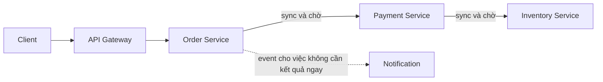

# Distributed Monolith — Anti-pattern của Microservice

## Mục lục

- [Tổng quan](#tổng-quan)
  - [Distributed Monolith là gì](#distributed-monolith-là-gì)
  - [Phạm vi của tài liệu](#phạm-vi-của-tài-liệu)
- [Nhận diện Distributed Monolith](#nhận-diện-distributed-monolith)
  - [Dấu hiệu](#dấu-hiệu)
  - [Coupling và synchronous chain](#coupling-và-synchronous-chain)
  - [Nguyên nhân gốc](#nguyên-nhân-gốc)
  - [Hậu quả](#hậu-quả)
- [Ví dụ: Order, Payment và Inventory](#ví-dụ-order-payment-và-inventory)
  - [Topology tạo ra anti-pattern](#topology-tạo-ra-anti-pattern)
  - [Điểm coupling nằm ở đâu](#điểm-coupling-nằm-ở-đâu)
  - [Một tình huống trong migration](#một-tình-huống-trong-migration)
- [Cách đo và diagnose](#cách-đo-và-diagnose)
  - [Bản đồ dependency và ownership](#bản-đồ-dependency-và-ownership)
  - [Tín hiệu từ traces, metrics và deploy](#tín-hiệu-từ-traces-metrics-và-deploy)
  - [Kiểm tra data access và contract](#kiểm-tra-data-access-và-contract)
  - [Đọc kết quả diagnosis](#đọc-kết-quả-diagnosis)
- [Remediation theo từng bước](#remediation-theo-từng-bước)
  - [Bước 1: Chọn một lát cắt có business value](#bước-1-chọn-một-lát-cắt-có-business-value)
  - [Bước 2: Tách ownership dữ liệu](#bước-2-tách-ownership-dữ-liệu)
  - [Bước 3: Đưa contract ra biên giới service](#bước-3-đưa-contract-ra-biên-giới-service)
  - [Bước 4: Giảm synchronous chain có chủ đích](#bước-4-giảm-synchronous-chain-có-chủ-đích)
  - [Bước 5: Tách deploy và migration dần](#bước-5-tách-deploy-và-migration-dần)
- [Trade-offs](#trade-offs)
- [Khi nào cần tránh](#khi-nào-cần-tránh)
  - [Không tách service chỉ vì topology](#không-tách-service-chỉ-vì-topology)
  - [Giữ synchronous khi business cần kết quả ngay](#giữ-synchronous-khi-business-cần-kết-quả-ngay)
- [Lộ trình cải thiện an toàn](#lộ-trình-cải-thiện-an-toàn)
  - [Baseline hiện trạng](#baseline-hiện-trạng)
  - [Đặt safety net](#đặt-safety-net)
  - [Chuyển từng slice và dọn đường cũ](#chuyển-từng-slice-và-dọn-đường-cũ)
  - [Tiêu chí xác nhận kết quả](#tiêu-chí-xác-nhận-kết-quả)
- [Checklist](#checklist)
- [Liên kết liên quan](#liên-kết-liên-quan)

---

## Tổng quan

### Distributed Monolith là gì

**Distributed Monolith** là hệ thống được triển khai thành nhiều process hoặc service nhưng vẫn vận hành như một monolith. Các phần của hệ thống vẫn phụ thuộc chặt vào nhau về **deployment**, dữ liệu, thời điểm hoạt động hoặc implementation.

Hệ thống như vậy phải gánh chi phí network, monitoring và vận hành của một distributed system nhưng không có được **autonomy** (khả năng phát triển, deploy và vận hành độc lập). Việc có nhiều repository, container hay process riêng chưa đủ để chứng minh rằng các service đã độc lập.

Một thay đổi capability là tín hiệu quan trọng. Nếu thay đổi đó buộc nhiều team cùng sửa, cùng kiểm thử hoặc cùng deploy, boundary hiện tại cần được xem xét lại.

> Không có một ngưỡng cố định về số lượng service, API hay latency để kết luận hệ thống là Distributed Monolith. Hãy đánh giá hành vi thay đổi, quyền sở hữu dữ liệu và failure path của hệ thống thực tế.

### Phạm vi của tài liệu

Tài liệu này tập trung vào một anti-pattern cụ thể: cách nhận diện coupling còn sót lại sau khi tách service, cách đo và chẩn đoán, remediation từng bước, trade-off và lộ trình cải thiện.

Distributed Monolith thường xuất hiện cùng **Shared Database**, **shared domain model**, **No API Versioning** hoặc **Sync Chain**. Các khái niệm đó có liên quan, nhưng tài liệu này không thay thế tài liệu tổng hợp về tất cả anti-pattern.

## Nhận diện Distributed Monolith

### Dấu hiệu

Các dấu hiệu dưới đây cần được xem cùng nhau, thay vì dùng một dấu hiệu đơn lẻ để kết luận:

| Dấu hiệu quan sát được | Coupling có thể đang tồn tại |
|---|---|
| Một thay đổi nhỏ cần release đồng thời nhiều service | **Deployment coupling** — các service không thể phát hành độc lập |
| Service đọc hoặc ghi trực tiếp database của service khác | **Data coupling** và implementation coupling qua schema |
| Thay đổi contract làm nhiều consumer hỏng cùng lúc | Contract chưa có compatibility policy hoặc deprecation path |
| Runbook yêu cầu khởi động service theo một thứ tự cố định | Các service có temporal dependency ở tầng vận hành |
| Một incident ở downstream làm toàn bộ business flow không phục vụ được | Failure lan truyền qua dependency đồng bộ |
| Nhiều service cùng import shared library chứa domain model | Thay đổi implementation buộc nhiều service rebuild hoặc deploy |
| Một team phải chờ nhiều team khác để hoàn tất một feature | Team ownership và boundary nghiệp vụ chưa rõ |

Một service gọi service khác không tự động tạo ra Distributed Monolith. Vấn đề xuất hiện khi các dependency khiến thay đổi, dữ liệu hoặc khả năng phục vụ của một service không còn độc lập một cách có ý nghĩa.

### Coupling và synchronous chain

**Coupling** là mức độ một thành phần phụ thuộc vào thành phần khác. Trong Distributed Monolith, các loại coupling thường chồng lên nhau:

- **Deployment coupling:** service A chỉ deploy được khi service B cũng được deploy hoặc kiểm thử cùng.
- **Data coupling:** service A phụ thuộc vào schema, table hoặc cột do service B sở hữu.
- **Implementation coupling:** service A phụ thuộc vào model hoặc library chứa chi tiết triển khai của service B.
- **Temporal coupling:** caller và callee phải cùng online tại đúng thời điểm vì caller chờ response đồng bộ.

**Synchronous chain** là chuỗi gọi đồng bộ `A → B → C`, trong đó mỗi caller phải chờ callee trước khi tiếp tục. Thời gian chờ của các bước nối tiếp cộng dồn. Nếu một downstream chậm hoặc unavailable, upstream có thể giữ connection và tài nguyên cho tới khi timeout.



Synchronous call vẫn phù hợp khi caller cần quyết định tức thời, chẳng hạn cần biết kết quả của một bước bắt buộc trước khi trả response. Anti-pattern nằm ở việc dùng sync làm mặc định cho mọi bước và tạo một chuỗi chờ dài, trong khi notification, analytics hoặc hậu xử lý không cần kết quả ngay.

Async communication có thể giảm **temporal coupling**, nhưng không xóa mọi coupling. Consumer vẫn phụ thuộc vào event contract, broker và semantics của event. Hệ thống cũng phải chấp nhận khả năng **eventual consistency** (các bản sao dữ liệu nhất quán sau một khoảng thời gian) và cần observability tốt hơn.

### Nguyên nhân gốc

| Nguyên nhân | Cách nó tạo ra Distributed Monolith |
|---|---|
| Tách repository hoặc container trước khi tách ownership | Topology thay đổi nhưng trách nhiệm nghiệp vụ và dữ liệu vẫn dùng chung |
| **Bounded Context** chưa rõ | Một service boundary chứa các capability có lý do thay đổi khác nhau, hoặc nhiều service vẫn phụ thuộc cùng một model |
| Shared library chứa domain model | Thay đổi model nội bộ kéo theo rebuild và release nhiều service |
| Giao tiếp đồng bộ được dùng làm mặc định | Mọi bước của workflow bị gắn vào availability và latency của nhau |
| Thiếu consumer-driven contract test | Provider không biết thay đổi nào phá consumer trước khi release |
| Thiếu compatibility và deprecation policy | Breaking change được xử lý bằng coordinated release |
| Muốn giữ transaction hoặc query xuyên capability | Service tiếp tục truy cập trực tiếp data của owner khác |

Nguyên nhân thường không phải là một quyết định kỹ thuật đơn lẻ. Đó là kết quả của việc tách hình thức trước khi làm rõ boundary, ownership, contract và cách vận hành.

### Hậu quả

- **Deployment chậm:** release phải chờ nhiều service, nhiều team hoặc một release window chung.
- **Failure lan truyền:** lỗi hoặc latency của một downstream làm hỏng các chức năng không trực tiếp có lỗi.
- **Debug khó hơn:** lỗi đi qua network, nhiều process và nhiều log thay vì nằm trong một process duy nhất.
- **Team mất autonomy:** team không tự quyết release, migration hoặc thay đổi nội bộ của service.
- **Rollback rộng:** một thay đổi nhỏ có thể cần rollback nhiều service hoặc xử lý dữ liệu ở nhiều nơi.
- **Lợi ích microservice suy giảm:** hệ thống khó thay đổi như monolith nhưng lại khó quan sát và vận hành như distributed system.

## Ví dụ: Order, Payment và Inventory

### Topology tạo ra anti-pattern

Giả sử `Order`, `Payment` và `Inventory` đã có ba codebase riêng nhưng vẫn dùng chung một schema:

```text
❌ Tách process nhưng chưa tách ownership

Order Service ──sync──> Payment Service ──sync──> Inventory Service
      │                         │                         │
      └────────────────── Shared schema ──────────────────┘
```

`Order Service` thay đổi cột trạng thái của order. `Payment Service` cập nhật trực tiếp cột đó. `Inventory Service` chỉ chạy được sau khi nhận synchronous call từ `Order Service`. Một migration schema vì thế cần một release window chung.

Topology nhiều service không tạo ra autonomy trong ví dụ này. Coupling vẫn nằm trong schema, trình tự xử lý và lịch release.

### Điểm coupling nằm ở đâu

| Lớp | Hành vi trong ví dụ | Rủi ro |
|---|---|---|
| Data | Nhiều service đọc/ghi cùng schema | Thay đổi schema phá consumer mà API có thể không đổi |
| Runtime | Order chờ Payment rồi chờ Inventory | Downstream chậm làm cả flow chậm hoặc lỗi |
| Deployment | Migration cần các service cùng tương thích | Không thể deploy một service mà không kiểm thử các service còn lại |
| Ownership | Không rõ ai chịu trách nhiệm cho cột trạng thái | Quyết định thay đổi và xử lý incident bị tranh chấp |

Điểm cần khắc phục không phải chỉ là đổi tên database hoặc chia thêm repository. Cần đưa ownership và contract về đúng biên giới service.

### Một tình huống trong migration

Trong quá trình tách Monolith, một service mới có thể được tạo ra nhưng vẫn truy cập lâu dài vào database của Monolith. Tên gọi đã tách, nhưng coupling và trách nhiệm dữ liệu vẫn dùng chung. Đây là một dạng Distributed Monolith thường gặp trong migration.

Shared database có thể là bước chuyển tiếp khi có owner, quyền truy cập giới hạn và kế hoạch thoát rõ ràng. Nếu không có các điều kiện đó, đường chuyển tiếp dễ trở thành kiến trúc lâu dài và làm mất khả năng decommission phần cũ.

## Cách đo và diagnose

### Bản đồ dependency và ownership

Đừng chẩn đoán chỉ bằng sơ đồ service. Hãy lập một **dependency map** từ các nguồn đang thể hiện hành vi thật:

1. **Distributed traces:** xác định request đi qua service nào, thứ tự nào và chờ ở đâu.
2. **Schema permissions và query logs:** tìm service nào có quyền đọc/ghi data không thuộc mình.
3. **CI/CD pipelines:** kiểm tra pipeline nào gọi pipeline khác hoặc yêu cầu một release chung.
4. **Lịch sử thay đổi:** tìm các thay đổi thường xuất hiện cùng nhau trong pull request, release hoặc migration.
5. **Service catalog:** ghi owner của từng API, event, schema và business capability.
6. **Incident và runbook:** xem một downstream incident ảnh hưởng tới bao nhiêu flow và có yêu cầu startup order hay không.

Khi lập bản đồ, mỗi mũi tên nên có loại dependency và owner rõ ràng. Một đường `Order → Payment` cần được phân biệt là API call cần kết quả ngay, event, query dữ liệu hay một dependency ẩn qua database.

### Tín hiệu từ traces, metrics và deploy

Có thể theo dõi các tín hiệu sau để so sánh trước và sau remediation. Không nên đặt một ngưỡng cứng cho mọi hệ thống.

| Tín hiệu cần đo | Cách thu thập | Điều nó giúp xác định |
|---|---|---|
| Release phải phối hợp | Lịch sử deploy, pipeline và release notes | Mức độ deployment coupling |
| Số hop đồng bộ và thời gian chờ | Distributed tracing theo từng use case | Synchronous chain, temporal coupling và bottleneck |
| Request bị ảnh hưởng khi downstream lỗi | Error rate, latency, trace và incident timeline | Phạm vi failure propagation |
| Truy cập cross-owner database | DB roles, schema permissions, query audit | Data coupling còn sót lại |
| Consumer của API/event | Contract registry, traffic usage và documentation | Rủi ro khi đổi contract và phạm vi deprecation |
| Phạm vi rollback | Runbook, deployment graph và migration plan | Một service có thể rollback riêng hay không |
| Lead time và số team tham gia một thay đổi | Lịch sử thay đổi và quy trình release | Autonomy đang tăng hay chỉ đổi topology |

**Số hop không phải mục tiêu duy nhất.** Một chain ngắn nhưng bắt buộc chờ một dependency không ổn định vẫn có thể gây failure lan truyền. Ngược lại, một call đồng bộ có boundary rõ và timeout phù hợp có thể là coupling nghiệp vụ chấp nhận được.

### Kiểm tra data access và contract

Khi nghi ngờ Distributed Monolith, kiểm tra riêng ba câu hỏi:

- **Ai là owner?** Có một team chịu trách nhiệm end-to-end cho business capability, API/event và tập dữ liệu không?
- **Ai được truy cập?** Service có đọc/ghi trực tiếp table hoặc schema của owner khác không? Credential database có quyền rộng hơn trách nhiệm không?
- **Consumer có được bảo vệ không?** API/event có schema, compatibility policy, contract test và deprecation path không?

Một database server dùng chung chưa chắc là Distributed Monolith. Separate schema, quyền truy cập giới hạn và ownership rõ có thể là lựa chọn chi phí thấp hoặc trạng thái chuyển tiếp. Ngược lại, chỉ cần một service ghi trực tiếp dữ liệu của service khác cũng đủ tạo coupling nguy hiểm dù các service đã dùng database server riêng.

### Đọc kết quả diagnosis

Một kết luận đáng tin nên dựa trên nhiều lớp bằng chứng:

- **Chỉ có nhiều synchronous calls:** trước hết kiểm tra đây là Chatty Services hoặc một workflow cần sync, chưa đủ để kết luận Distributed Monolith.
- **Chỉ có database server chung:** kiểm tra schema, permission và ownership trước; dùng chung hạ tầng không đồng nghĩa dùng chung implementation.
- **Có coordinated release, shared data và failure propagation cùng lúc:** đây là dấu hiệu mạnh rằng service đang vận hành như một Distributed Monolith.
- **Có shared library nhưng chỉ chứa utility không thuộc domain:** kiểm tra phạm vi coupling; vấn đề nghiêm trọng hơn khi library chứa domain model hoặc logic nghiệp vụ.

Kết luận cần trả lời được câu hỏi: *Nếu thay đổi một capability hoặc một downstream gặp sự cố, service còn lại có thể deploy, vận hành và phục vụ phần việc của mình trong phạm vi business cho phép không?*

## Remediation theo từng bước

### Bước 1: Chọn một lát cắt có business value

Bắt đầu từ một use case có pain cụ thể, owner cam kết và rủi ro kiểm soát được. Ưu tiên phần có coupling thấp tương đối, business value rõ hoặc có nhu cầu scale, deploy hay failure isolation riêng.

Không nên bắt đầu bằng một rewrite toàn bộ. Một dependency map và một lát cắt nhỏ giúp team kiểm chứng data migration, contract, monitoring và rollback trước khi xử lý phần khó hơn.

### Bước 2: Tách ownership dữ liệu

Chỉ định một owner duy nhất cho từng API, event và tập dữ liệu. Sau đó chuyển quyền sở hữu theo trình tự an toàn:

1. Lập inventory reader/writer, bảng, cột và credential.
2. Chặn ghi chéo trước bằng database role, schema permission hoặc policy tương đương.
3. Chuyển các truy vấn cần thiết sang API, event-carried state transfer hoặc local read model.
4. Nếu cần migrate, đồng bộ dữ liệu trong giai đoạn chuyển tiếp và đặt mốc xóa đường truy cập cũ.
5. Không để service mới truy cập lâu dài vào database của owner khác chỉ vì việc tách logic đã hoàn tất.

Mỗi service không nhất thiết phải có một database server vật lý riêng ngay từ đầu. Mục tiêu trước hết là ownership và quyền truy cập được enforce; cách triển khai có thể là database riêng, schema riêng hoặc một mô hình chuyển tiếp có kiểm soát.

### Bước 3: Đưa contract ra biên giới service

API và event cần được quản trị như contract giữa producer và consumer:

- Ghi rõ owner, schema, consumer và lifecycle.
- Dùng **consumer-driven contract test** để provider phát hiện thay đổi phá consumer trước khi release.
- Ưu tiên thay đổi additive và schema tương thích ngược.
- Với breaking change, dùng **Expand and Contract**: thêm contract mới, migrate consumer, theo dõi usage, rồi deprecate và xóa contract cũ.
- Không dùng shared domain model để che giấu việc các service đang phụ thuộc implementation của nhau.

Contract compatibility không làm mất mọi coupling. Nó biến coupling thành một dependency rõ ràng, có owner, test và thời hạn support.

### Bước 4: Giảm synchronous chain có chủ đích

Phân loại từng call trong use case:

| Câu hỏi | Hướng xử lý |
|---|---|
| Caller có cần kết quả ngay để quyết định response hoặc bước bắt buộc tiếp theo không? | Giữ synchronous nếu phù hợp, nhưng đặt timeout và giới hạn phạm vi call |
| Công việc có thể hoàn tất sau request hiện tại không? | Dùng queue hoặc event; trả trạng thái phù hợp thay vì giữ connection |
| Có nhiều consumer cần biết một fact đã xảy ra không? | Cân nhắc publish event thay vì gọi tuần tự từng consumer |
| Nhiều service luôn gọi nhau để hoàn thành cùng một capability không? | Đánh giá lại boundary; có thể cần gộp hoặc tổ chức lại service |

Với synchronous call bắt buộc, cần thiết kế timeout, fallback hoặc degraded response phù hợp. Không nên retry không giới hạn hoặc biến gateway thành nơi chứa toàn bộ business workflow.

Khi một nghiệp vụ cần consistency xuyên nhiều owner, không nên quay lại shared database chỉ để có một transaction chung. Hãy đánh giá Saga, compensating action và trạng thái eventual consistency theo yêu cầu business.

### Bước 5: Tách deploy và migration dần

Dùng **Expand and Contract** cho API và schema. Một chuỗi chuyển đổi an toàn thường là:

```text
1. Thêm contract hoặc data path mới, vẫn giữ đường cũ
2. Chạy song song và quan sát kết quả
3. Migrate consumer hoặc traffic từng phần
4. Xác nhận data, error rate và rollback path
5. Xóa quyền truy cập, route, code và schema cũ khi đã ổn định
```

Trong migration từ Monolith, **Strangler Fig** giúp chuyển từng module qua một routing facade thay vì big-bang rewrite. Tuy nhiên, routing facade chỉ điều hướng traffic; nó không tự tạo ra data boundary hoặc ownership. Những boundary đó vẫn phải được xử lý trong các bước trên.

Nếu một thay đổi cần database write và publish event, cân nhắc **Transactional Outbox** để tránh trạng thái database đã ghi nhưng event bị mất. Consumer vẫn cần idempotency và cách xử lý duplicate phù hợp.

## Trade-offs

Khắc phục Distributed Monolith không làm hệ thống trở nên đơn giản ngay lập tức. Team đang đổi một loại coupling ẩn và rủi ro khó đoán lấy một số cơ chế rõ ràng hơn nhưng cần vận hành.

| Lựa chọn | Lợi ích | Chi phí hoặc rủi ro |
|---|---|---|
| Tách data ownership | Giảm coupling schema, tăng khả năng deploy và scale độc lập | Cross-service query khó hơn; cần API, event, projection hoặc read model |
| Chuyển việc không cần kết quả ngay sang async | Giảm temporal coupling và giới hạn failure propagation | Eventual consistency, broker, retry, idempotency và tracing phức tạp hơn |
| Giữ sync cho bước bắt buộc | Dễ biểu diễn quyết định tức thời và contract response | Caller vẫn phụ thuộc availability, latency và timeout của callee |
| Contract compatibility và deprecation | Consumer có thời gian migrate; giảm coordinated release | Phải duy trì nhiều contract trong một khoảng thời gian và theo dõi usage |
| Migration từng phase | Blast radius nhỏ hơn, có thể rollback theo module | Monolith và service cùng tồn tại; cần đồng bộ dữ liệu và dọn code cũ |
| Gộp các capability luôn thay đổi cùng nhau | Giảm network hop và coordination không cần thiết | Có thể mất cơ hội scale hoặc deploy riêng nếu boundary sau này ổn định |

Async không phải là mục tiêu tự thân. Mục tiêu là chọn mức coupling phù hợp với yêu cầu business, sau đó làm cho coupling đó rõ ràng, có owner và có khả năng quan sát.

## Khi nào cần tránh

### Không tách service chỉ vì topology

Nên tránh tạo thêm service khi:

- Chưa xác định được business capability hoặc **Bounded Context** riêng.
- Các phần luôn thay đổi, deploy và cần transaction cùng nhau.
- Driver duy nhất là muốn có nhiều service hơn, không có pain đã đo về ownership, scale, failure isolation hoặc release.
- Team chưa có năng lực vận hành thêm contract, monitoring, migration và on-call.
- Service mới vẫn buộc phải đọc/ghi shared database lâu dài vì chưa có kế hoạch data boundary.

Trong các trường hợp này, một **modular monolith** với module và ownership rõ có thể là bước phù hợp hơn. Đơn giản hóa topology không có nghĩa là bỏ qua boundary; nó có thể là cách giữ boundary trong một process cho tới khi bằng chứng yêu cầu phân tán.

### Giữ synchronous khi business cần kết quả ngay

Không nên chuyển mọi call sang event chỉ để tránh từ khóa synchronous. Hãy giữ sync khi caller thực sự cần một quyết định tức thời và việc chờ đó nằm trong business contract. Thay vào đó, giới hạn chain, đặt timeout, xử lý lỗi rõ ràng và tách các side effect không bắt buộc sang async.

Nếu hệ thống chưa có observability, rollback path hoặc khả năng kiểm soát data migration, cũng nên tránh big-bang remediation. Việc thay đổi nhiều boundary cùng lúc có thể làm khó phân biệt lỗi do contract, dữ liệu, routing hay runtime.

## Lộ trình cải thiện an toàn

### Baseline hiện trạng

1. Lập service catalog gồm capability, owner, API, event, database và pipeline.
2. Vẽ dependency map từ trace, permission, query, release và incident data.
3. Ghi baseline cho coordinated release, sync hop, latency, error rate, failure impact và phạm vi rollback.
4. Chọn một use case có business value rõ và tiêu chí thành công đo được.

### Đặt safety net

Trước khi thay đổi coupling, chuẩn bị:

- distributed tracing và correlation ID để theo dõi synchronous path;
- metrics cho latency, error, traffic và saturation của các dependency;
- contract test và policy tương thích cho API/event;
- backup, migration plan, feature flag hoặc routing switch khi phù hợp;
- runbook nêu rõ cách rollback traffic, dữ liệu và cấu hình.

Safety net không thay thế thiết kế boundary. Nó làm cho một thay đổi từng bước có thể quan sát và dừng lại khi tín hiệu xấu.

### Chuyển từng slice và dọn đường cũ

Một phase remediation nên đi theo thứ tự:

1. Chọn một capability và xác định owner.
2. Tách contract và data path mới, giữ đường cũ tương thích trong thời gian chuyển tiếp.
3. Chặn access không thuộc owner và chuyển caller sang API/event phù hợp.
4. Giảm các sync call không cần response ngay; giữ lại sync call bắt buộc với timeout và fallback rõ ràng.
5. Chuyển traffic hoặc consumer từng phần, quan sát hành vi và data.
6. Khi ổn định, xóa route, quyền database, shared model, code và pipeline cũ.
7. Đo lại baseline rồi mới chọn slice tiếp theo.

Không nên coi phase hoàn tất chỉ vì service mới đã nhận traffic. Phase chỉ hoàn tất khi đường coupling cũ đã được dọn hoặc đã được ghi nhận rõ là technical debt có owner và thời hạn xử lý.

### Tiêu chí xác nhận kết quả

Một remediation có kết quả khi bằng chứng của hệ thống cho thấy:

- Service có owner và data boundary được enforce bằng quyền truy cập hoặc cơ chế tương đương.
- Consumer có contract test và không cần coordinated release cho thay đổi tương thích.
- Trace cho thấy các bước không cần kết quả ngay không còn giữ trong synchronous chain.
- Downstream incident không làm hỏng các phần không cần dependency đó, trong phạm vi business cho phép.
- Migration và rollback có thể thực hiện theo phase, không cần big-bang.
- Lead time, phạm vi deploy và chất lượng vận hành được so sánh bằng dữ liệu trước và sau.

## Checklist

- [ ] Mỗi API, event và tập dữ liệu có một owner rõ ràng.
- [ ] Không service nào đọc/ghi trực tiếp dữ liệu thuộc owner khác.
- [ ] Shared database, nếu còn trong migration, có quyền truy cập giới hạn và exit plan.
- [ ] API/event có schema, compatibility policy, consumer và deprecation path.
- [ ] Provider chạy consumer-driven contract test trước khi release.
- [ ] Trace của use case đã được kiểm tra để tìm synchronous chain và thời gian chờ.
- [ ] Call không cần kết quả ngay đã được đánh giá để chuyển sang event hoặc queue.
- [ ] Call sync bắt buộc có timeout, error contract và fallback phù hợp khi cần.
- [ ] Schema/data migration dùng Expand and Contract và có rollback path.
- [ ] Có metrics baseline cho coordinated release, latency, error rate và failure impact.
- [ ] Sau migration, quyền DB, route, shared model và code cũ được xóa hoặc có owner xử lý.

## Liên kết liên quan

- [03 — Loose Coupling & High Cohesion](../03-loose-coupling-high-cohesion.md) — các loại coupling và chất lượng boundary.
- [04 — Autonomy & Independence](../04-autonomy-independence.md) — independent deployment, compatibility và team ownership.
- [05 — Decomposition Strategies](../05-decomposition-strategies.md) — chọn boundary và tách service theo business capability.
- [06 — Inter-Service Communication](../06-inter-service-communication.md) — synchronous, asynchronous, event và temporal coupling.
- [09 — Data Management](../09-data-management.md) — database ownership, Saga và data consistency xuyên service.
- [11 — Observability & Evolvability](../11-observability-evolvability.md) — logs, metrics, traces và cách phát triển an toàn.
- [Strangler Fig Pattern](../17-decomposition-patterns/strangler-fig.md) — migration từng phase từ Monolith.
- [Event-Driven Architecture](../17-communication-patterns/event-driven-architecture.md) — event contract và giảm temporal coupling.
- [Database per Service](../17-data-patterns/database-per-service.md) — tách ownership dữ liệu.
- [Transactional Outbox](../17-data-patterns/transactional-outbox.md) — đồng bộ local transaction và event publish.
- [Distributed Tracing](../17-observability-patterns/distributed-tracing.md) — chẩn đoán dependency và synchronous chain.
- [Bản tổng hợp Anti-patterns](../17-anti-patterns.md) — các anti-pattern liên quan và cách nhìn ở cấp hệ thống.
