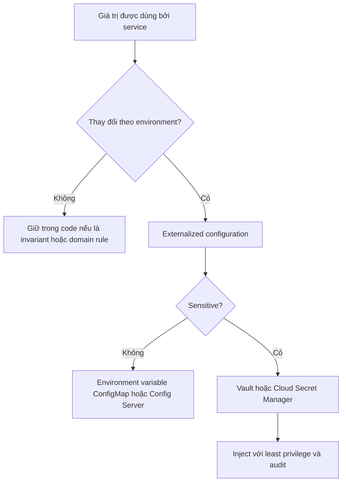
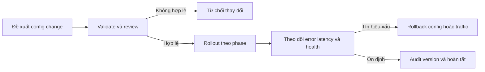

# Hardcoded Configuration — Anti-pattern của Microservice

## Mục lục

- [Tổng quan](#tổng-quan)
  - [Hardcoded Configuration là gì](#hardcoded-configuration-là-gì)
  - [Phạm vi của tài liệu](#phạm-vi-của-tài-liệu)
- [Phân biệt configuration, secret và domain rule](#phân-biệt-configuration-secret-và-domain-rule)
  - [Các nhóm configuration](#các-nhóm-configuration)
  - [Config và Secret không có cùng yêu cầu bảo vệ](#config-và-secret-không-có-cùng-yêu-cầu-bảo-vệ)
- [Dấu hiệu, nguyên nhân và hậu quả](#dấu-hiệu-nguyên-nhân-và-hậu-quả)
  - [Dấu hiệu nhận biết](#dấu-hiệu-nhận-biết)
  - [Environment drift và rủi ro security](#environment-drift-và-rủi-ro-security)
  - [Hậu quả vận hành](#hậu-quả-vận-hành)
- [Ví dụ từ hardcode đến artifact bất biến](#ví-dụ-từ-hardcode-đến-artifact-bất-biến)
  - [Endpoint và API key trong Payment Service](#endpoint-và-api-key-trong-payment-service)
  - [Nhiều environment và config drift](#nhiều-environment-và-config-drift)
- [Remediation theo từng bước](#remediation-theo-từng-bước)
  - [Bước 1 Inventory và phân loại](#bước-1-inventory-và-phân-loại)
  - [Bước 2 Externalized Configuration](#bước-2-externalized-configuration)
  - [Bước 3 Secret Management và least privilege](#bước-3-secret-management-và-least-privilege)
  - [Bước 4 Validate, audit và rollback](#bước-4-validate-audit-và-rollback)
  - [Bước 5 Rotation và refresh](#bước-5-rotation-và-refresh)
  - [Bước 6 Dynamic Configuration đúng chỗ](#bước-6-dynamic-configuration-đúng-chỗ)
- [Trade-off và vận hành](#trade-off-và-vận-hành)
  - [Chọn nơi truyền và lưu config](#chọn-nơi-truyền-và-lưu-config)
  - [Static config và dynamic config](#static-config-và-dynamic-config)
  - [Config hierarchy](#config-hierarchy)
  - [Vận hành khi config store hoặc secret thay đổi](#vận-hành-khi-config-store-hoặc-secret-thay-đổi)
- [Checklist](#checklist)
- [Liên kết liên quan](#liên-kết-liên-quan)

---

## Tổng quan

### Hardcoded Configuration là gì

**Hardcoded Configuration** là việc đưa thông tin thay đổi theo environment hoặc bí mật vận hành vào source code hoặc image. Các giá trị thường gặp gồm URL, timeout, feature flag, credential, tên queue và topic. Trong tài liệu này, **artifact** là đầu ra được build, chẳng hạn Docker image.

Ví dụ, `Payment Service` có thể chạy với endpoint khác nhau ở `dev`, `staging` và `production`. Nếu hostname được ghi trực tiếp trong code, việc đổi endpoint trở thành một thay đổi code thay vì một thay đổi deployment. Nếu API key cũng nằm trong code, cùng thay đổi đó còn tạo ra rủi ro bảo mật.

Một giá trị không phải hardcode chỉ vì nó được khai báo trong code. Hằng số thực sự giống nhau giữa mọi deployment có thể ở lại trong code. Ngược lại, configuration thay đổi theo environment nên được externalize (tách khỏi artifact). Quy tắc nghiệp vụ như cách tính giá hoặc khuyến mãi cần được phân biệt với configuration; không nên biến mọi business rule thành environment variable chỉ để tránh hardcode.

### Phạm vi của tài liệu

Tài liệu này tập trung vào cách nhận diện Hardcoded Configuration, phân tích rủi ro và remediation (khắc phục có kiểm soát). Mục tiêu là tạo ra một artifact có thể chạy ở nhiều environment, đồng thời quản lý secret với quyền truy cập, audit và rotation phù hợp.

Externalize config không đồng nghĩa với việc mọi thay đổi đều không cần restart. `DB_HOST` hoặc `DB_PASSWORD` thường được đọc một lần khi service khởi động, nên đổi giá trị có thể vẫn cần rolling restart. Lợi ích cốt lõi là không phải sửa code và rebuild image cho từng environment.

## Phân biệt configuration, secret và domain rule

### Các nhóm configuration

Phân loại trước khi chọn cơ chế lưu trữ giúp tránh dùng một giải pháp cho mọi loại giá trị:

| Nhóm | Ví dụ | Đặc điểm thay đổi | Mức nhạy cảm thường gặp |
|---|---|---|---|
| **Application configuration** | Server port, log level, timeout, pagination default | Thường đổi ít, thường gắn với deployment | Không nhạy cảm |
| **Infrastructure configuration** | Database host/port, Redis URL, Kafka broker, Service Discovery endpoint | Đổi khi hạ tầng hoặc topology thay đổi | Thấp; host/port không tự động là secret |
| **Secret** | Database password, API key, JWT signing key, TLS certificate, OAuth client secret | Đổi khi cần revoke hoặc rotate | Rất cao; cần encryption, access control và audit |
| **Dynamic configuration** | Feature flag, rate limit, Circuit Breaker threshold, A/B percentage | Có thể đổi thường xuyên trong runtime | Thường thấp, nhưng thay đổi có thể ảnh hưởng rộng |

**Feature Flags** (cờ bật/tắt tính năng) là trường hợp cần chú ý. Nếu flag được đặt trong environment variable, đổi flag thường cần restart Pod, không có sẵn audit, gradual rollout hoặc targeting. Khi cần những khả năng đó, nên dùng Feature Flag Service hoặc database với SDK có cơ chế poll/watch và cache.

### Config và Secret không có cùng yêu cầu bảo vệ

`DB_HOST`, `DB_PORT` hoặc `LOG_LEVEL` có thể được truyền qua environment variable, mounted config file, `ConfigMap` hoặc Config Server. Các giá trị này vẫn cần owner, validation và lifecycle rõ ràng, nhưng không có cùng mức bảo vệ như secret.

`DB_PASSWORD`, API key và private key không nên nằm trong source code, image, log hoặc file `.env` được commit. Chúng cần được lưu trong Vault hoặc Cloud Secret Manager (kho quản lý secret), giới hạn quyền đọc theo service và environment theo **least privilege** (chỉ cấp quyền tối thiểu cần thiết), đồng thời có audit và rotation.

> Externalized chỉ nói về vị trí và cách phân phối config. Environment variable có thể đơn giản nhưng không tự động trở thành nơi lưu secret an toàn; source về [Configuration & Secrets Management](../16-configuration-secrets-management.md) trình bày chi tiết các lựa chọn này.



## Dấu hiệu, nguyên nhân và hậu quả

### Dấu hiệu nhận biết

Một dấu hiệu đơn lẻ chưa đủ kết luận. Hãy xem source, build artifact, deployment manifest và log cùng nhau:

| Dấu hiệu quan sát được | Điều cần kiểm tra |
|---|---|
| Source có hostname production, password, token, queue hoặc topic theo environment | Giá trị này có thay đổi giữa các deployment không? Có phải secret không? |
| Có nhánh như `if env == "prod"` để chọn host hoặc credential | Environment đang bị đưa vào logic triển khai thay vì được inject từ bên ngoài |
| Đổi endpoint hoặc timeout phải sửa code và build image mới | Configuration chưa được externalize |
| `config-dev.yml`, `config-staging.yml` và `config-prod.yml` tạo ra các image khác nhau | Artifact không còn bất biến; nguy cơ drift giữa build và environment |
| Nhiều service hoặc nhiều environment dùng chung một credential | Phạm vi ảnh hưởng khi lộ secret quá rộng; ownership và access control cần xem lại |
| Log, error message hoặc issue chứa credential | Secret có thể đã bị lộ qua kênh vận hành |
| Service chạy rồi mới crash vì thiếu config | Chưa có startup validation và fail fast |
| Không biết ai đổi giá trị, đổi khi nào hoặc giá trị nào đang active | Thiếu version, audit trail và rollback path |

Nguyên nhân thường bắt đầu từ nhu cầu khởi động nhanh, thiếu Config Server hoặc Secret Manager, chưa phân loại config, hoặc chưa có validation và lifecycle cho config. Việc chuyển code sang nhiều repository mà không thay đổi cách quản lý giá trị chỉ làm anti-pattern phân tán hơn.

### Environment drift và rủi ro security

**Environment drift** là tình trạng các environment dần có bộ key, giá trị hoặc hành vi khác nhau ngoài chủ đích. Ví dụ, `dev` có một key mà `staging` không có, hoặc `staging` vô tình trỏ vào production database. Bug có thể chỉ xuất hiện khi deploy production vì các environment không còn cùng shape config.

Hardcoded config tạo ra các rủi ro chính:

- **Build drift:** mỗi environment cần một source change hoặc một image riêng. Artifact được kiểm thử ở `staging` có thể không phải artifact được chạy ở `production`.
- **Secret exposure:** secret có thể xuất hiện trong Git history, image layer, log hoặc issue. Xóa commit không xóa các bản sao trong history hoặc fork; secret đã lộ cần được rotate.
- **Blast radius lớn:** dùng chung một API key hoặc database password cho nhiều service khiến một credential bị lộ ảnh hưởng đến nhiều consumer.
- **Sai environment:** dùng cùng secret giữa `dev`, `staging` và `production` có thể cho phép một thao tác test gọi nhầm production API hoặc database.
- **Thiếu truy vết:** khi config nằm rải rác trong source và pipeline, khó xác định owner, thời điểm thay đổi và lý do thay đổi.

Externalized configuration giảm nhu cầu rebuild, nhưng chưa tự giải quyết mọi rủi ro. Environment variable vẫn cần được bảo vệ khỏi việc lộ qua process inspection hoặc log. `ConfigMap` dành cho non-sensitive data; GitOps cần Sealed Secrets hoặc External Secrets Operator thay vì commit giá trị secret.

### Hậu quả vận hành

| Hậu quả | Cách nó xuất hiện |
|---|---|
| **Deploy chậm và dễ sai** | Đổi một URL hoặc timeout phải sửa source, chạy CI, build/push image rồi deploy lại |
| **Rollback khó** | Rollback code không nhất thiết rollback đúng giá trị config đã thay đổi |
| **Drift giữa environment** | Mỗi environment có file, image hoặc key khác nhau; lỗi chỉ lộ ở một environment |
| **Security incident** | Credential bị commit, log hoặc nhúng vào image; xóa code không làm credential cũ mất hiệu lực |
| **Khó audit** | Không có một nơi ghi lại ai đổi gì, khi nào và version nào đang active |
| **Failure lan rộng** | Config sai, chẳng hạn timeout không hợp lệ, có thể làm nhiều instance lỗi nếu phân phối cùng lúc |

Không có một ngưỡng cố định về số service hoặc số config để kết luận anti-pattern. Câu hỏi thực tế là: team có thể đổi config đúng một environment, kiểm chứng, rollback và audit mà không rebuild artifact hoặc mở rộng quyền truy cập không?

## Ví dụ từ hardcode đến artifact bất biến

Tên host, giá trị timeout và key trong các ví dụ dưới đây chỉ mang tính minh họa.

### Endpoint và API key trong Payment Service

Một implementation hardcode có thể trông như sau:

```js
// ❌ Giá trị production và secret nằm trong source code
const paymentUrl = "https://payment-prod.example";
const paymentApiKey = "hardcoded-example-key";
const requestTimeoutMs = 3000;
```

Khi developer muốn test `staging`, họ phải sửa source, tạo build riêng và có nguy cơ commit key. Nếu source hoặc image bị chia sẻ, endpoint và credential cũng đi theo artifact.

Một implementation externalized chỉ đọc giá trị từ runtime:

```js
// ✅ Artifact không chứa giá trị theo environment
const paymentUrl = process.env.PAYMENT_URL;
const paymentApiKey = process.env.PAYMENT_API_KEY;
const requestTimeoutMs = Number(process.env.PAYMENT_TIMEOUT_MS ?? 3000);
```

Trong production, `PAYMENT_URL` có thể đến từ ConfigMap hoặc Config Server. `PAYMENT_API_KEY` nên được inject từ Secret Manager hoặc một cơ chế tương đương; việc đọc qua environment variable không thay thế cho access control và rotation. Code có thể giống nhau ở mọi environment, còn values được quản lý tại deployment boundary.

### Nhiều environment và config drift

```text
❌ Hardcoded hoặc build theo environment
Source + config-dev.yml       ──> image-dev
Source + config-staging.yml   ──> image-staging
Source + config-prod.yml      ──> image-prod

✅ Một artifact, config được inject khi deploy
Source ──> image: payment-service:v1
                    ├── dev:     PAYMENT_URL=dev,     secret riêng
                    ├── staging: PAYMENT_URL=staging, secret riêng
                    └── prod:    PAYMENT_URL=prod,    secret riêng
```

Mô hình thứ hai thực hiện nguyên tắc **build once, deploy anywhere**. Các environment có thể có values khác nhau nhưng dùng cùng artifact và cùng bộ key được kiểm soát. Cấu hình không nên được group trong code theo tên environment chỉ vì cách đó dễ bắt đầu; environment mới như `qa`, `canary` hoặc một region khác không nên đòi hỏi một build branch mới.

## Remediation theo từng bước

### Bước 1 Inventory và phân loại

Bắt đầu bằng việc lập inventory cho từng service:

1. Tìm các URL, hostname, timeout, feature flag, queue/topic name, credential và key đang nằm trong source, image, manifest, script hoặc log.
2. Ghi rõ owner, environment, độ nhạy cảm, nguồn sự thật và cách refresh của từng giá trị.
3. Phân loại thành application config, infrastructure config, secret, dynamic config hoặc domain rule.
4. Xác định các key bắt buộc, format hợp lệ và quan hệ giữa các giá trị. Ví dụ, database connection cần một bộ host, port và credential tương thích.
5. Kiểm tra credential có đang được share giữa service hoặc environment hay không.

`gitleaks` hoặc pre-commit hook có thể giúp chặn một số secret trước khi commit, nhưng không thay thế việc revoke và rotate secret đã lộ. Tìm kiếm tự động cũng không thay thế review image layer, deployment manifest và log.

### Bước 2 Externalized Configuration

Tách values thay đổi theo deployment khỏi source code và image. Các cách truyền thường dùng là:

- **Environment Variables:** đơn giản, phổ biến và phù hợp với nguyên tắc Config của **Twelve-Factor App** (lưu config trong environment).
- **Mounted config file:** giữ cấu trúc tốt hơn cho bộ config lớn; trong Kubernetes có thể dùng `ConfigMap` cho non-sensitive data.
- **Config Server** (dịch vụ lưu và phân phối config tập trung): cung cấp centralized storage, versioning và khả năng dynamic/watch khi số service tăng.
- **Secret reference:** deployment chỉ tham chiếu tới secret trong Vault, Cloud Secret Manager hoặc external store.

Trong local development, `.env` có thể thuận tiện nhưng không commit file này. Có thể commit `.env.example` chỉ chứa template và tên key, không chứa secret thật.

Ví dụ Kubernetes dưới đây chỉ minh họa cách tách hai loại dữ liệu:

```yaml
containers:
  - name: payment-service
    image: payment-service:v1
    env:
      - name: PAYMENT_URL
        valueFrom:
          configMapKeyRef:
            name: payment-service-config
            key: PAYMENT_URL
      - name: PAYMENT_API_KEY
        valueFrom:
          secretKeyRef:
            name: payment-service-secrets
            key: PAYMENT_API_KEY
```

`ConfigMap` không phải nơi lưu secret. Trong GitOps (quản lý deployment bằng Git), K8s Secret dạng YAML chỉ base64-encoded nên không nên commit giá trị thật. Dùng **Sealed Secrets** để encrypt trước khi commit, hoặc **External Secrets Operator** để Git chỉ chứa reference tới Vault, AWS Secrets Manager hay external store.

### Bước 3 Secret Management và least privilege

Secret cần một lifecycle khác config thông thường:

1. Lưu secret trong Vault, AWS Secrets Manager hoặc Cloud Secret Manager phù hợp với môi trường.
2. Encrypt secret at rest và giới hạn quyền đọc theo service, namespace, environment hoặc role.
3. Tạo credential riêng cho từng service và environment thay vì một password dùng chung.
4. Redact secret khỏi log, error message, issue và telemetry.
5. Ghi audit log cho mọi access và thay đổi.
6. Có quy trình revoke/rotate ngay khi secret bị commit hoặc nghi ngờ bị lộ.

**HashiCorp Vault** hỗ trợ KV secret tĩnh, version history, audit và dynamic secret. Với dynamic secret, mỗi instance có thể nhận credential riêng có lease/TTL; Vault có thể revoke credential khi lease hết hạn và service có thể renew khi cần.

Cloud Secret Manager cũng có thể hỗ trợ version và auto-rotation. AWS Secrets Manager, chẳng hạn, có tích hợp auto-rotation cho một số dịch vụ như RDS, Redshift và DocumentDB. Lựa chọn công cụ cần tính cả quyền vận hành, dependency và cách ứng dụng refresh giá trị, không chỉ khả năng lưu encrypted.

### Bước 4 Validate, audit và rollback

Service nên validate config khi startup và fail fast nếu thiếu hoặc sai giá trị bắt buộc:

- Kiểm tra key bắt buộc có tồn tại.
- Kiểm tra type, format, range và quan hệ giữa các giá trị.
- Không đưa secret vào exception, startup log hoặc health response.
- Từ chối config không hợp lệ trước khi service nhận traffic.

Config change cũng cần lifecycle như một thay đổi vận hành: owner, review, version, audit trail và rollback path. Cần biết config nào đang active ở mỗi environment, cách đưa version trước trở lại và cách xử lý khi Config Server hoặc Secret Manager không truy cập được. Backup config store và DR plan là một phần của vận hành, không phải chi tiết tùy chọn.

### Bước 5 Rotation và refresh

Rotation không chỉ là thay chuỗi trong secret store. Cần kiểm tra service nhận giá trị mới như thế nào:

- Nếu secret được đọc một lần khi startup, đổi secret thường cần restart Pod hoặc process. Rolling restart có thể tránh phải rebuild image.
- Nếu app, SDK, agent hoặc operator có cơ chế poll/watch/refresh, app có thể nhận giá trị mới mà không cần restart. Cơ chế này phải được kiểm thử với connection pool và failure path thực tế.
- Với Vault dynamic secret, service cần renew lease hoặc lấy credential mới trước khi lease hết hạn.
- Với hệ thống hỗ trợ auto-rotation, cần xác minh cả phía secret store và phía consumer đều chuyển sang version mới.
- Đặt lịch rotation định kỳ theo loại secret và policy của tổ chức. Checklist trong tài liệu nguồn nêu khoảng 30–90 ngày như một mốc tham khảo, không phải quy tắc cho mọi credential.

Nếu một key đã xuất hiện trong Git history, xóa dòng đó không đủ. Hãy coi key cũ là đã lộ, revoke/rotate ngay, rồi kiểm tra access log và nơi secret từng được phân phối.

### Bước 6 Dynamic Configuration đúng chỗ

Không phải config nào cũng cần hot reload. Hãy tách hai trường hợp:

- `DB_HOST`, `DB_PASSWORD` hoặc `KAFKA_URL` thường được dùng để khởi tạo client và connection pool. Đổi giá trị có thể cần restart, nhưng không nên cần rebuild artifact.
- `LOG_LEVEL`, rate limit hoặc Feature Flag có thể cần thay đổi trong runtime. App phải hỗ trợ poll/watch, cache và cách xử lý khi nguồn config tạm thời unavailable.

Feature Flag nên được quản lý bởi Feature Flag Service hoặc database khi cần audit, gradual rollout, targeting và kill switch. Không nên đặt một business policy rủi ro vào dynamic config chỉ để né review hoặc quy trình release. Dynamic configuration phải có owner, giới hạn quyền, validation và rollback giống các thay đổi khác.

## Trade-off và vận hành

### Chọn nơi truyền và lưu config

| Cơ chế | Điểm mạnh | Trade-off và lưu ý vận hành |
|---|---|---|
| **Environment Variables** | Đơn giản, universal, phù hợp Twelve-Factor | Không structured, khó quản lý khi có nhiều key, thường cần restart; có thể lộ qua process inspection hoặc log |
| **Mounted file hoặc ConfigMap** | Có thể giữ cấu trúc; Kubernetes hỗ trợ native | Env var không tự cập nhật trong process; file mount cần app watch hoặc cơ chế restart; `ConfigMap` chỉ dành cho non-sensitive config |
| **Config Server** | Centralized, versioned, có thể dynamic/watch | Thêm dependency và chi phí vận hành; cần kế hoạch khi config source unavailable |
| **Vault hoặc Cloud Secret Manager** | Encryption, access control, audit và rotation | Cần policy, identity, vận hành và có thể thêm latency/dependency |
| **Sealed Secrets hoặc External Secrets Operator** | Phù hợp GitOps; Git chỉ chứa encrypted data hoặc reference | Cần controller, key/external store và quy trình xử lý khi sync lỗi |

Không có cơ chế nào tự động làm config an toàn. Một `Secret` được lưu trong external store vẫn cần IAM/RBAC đúng; một environment variable được inject từ secret store vẫn cần tránh bị ghi vào log.

### Static config và dynamic config

| Loại | Ví dụ | Khi thay đổi | Điều cần thiết |
|---|---|---|---|
| **Static configuration** | Database host, password, Kafka URL | Thường đọc một lần lúc start; có thể cần rolling restart | Một artifact dùng nhiều environment, startup validation và quy trình restart an toàn |
| **Dynamic configuration** | Log level, rate limit, Feature Flag | Poll hoặc watch; có thể không cần restart | Refresh, cache, validation, audit và rollback |
| **Domain rule** | Quy tắc giá hoặc khuyến mãi | Thay đổi theo vòng đời nghiệp vụ | Ownership và review ở domain; không tùy tiện biến thành env var |

`Đổi config không cần rebuild` không đồng nghĩa với `đổi config không cần restart`. Đây là khác biệt cần ghi rõ trong runbook để tránh kỳ vọng sai khi incident xảy ra.

### Config hierarchy

Nếu một service nhận config từ nhiều nguồn, cần công bố thứ tự ưu tiên. Một hierarchy thường dùng, từ cao xuống thấp, là:

```text
1. Environment Variables      ← override cao nhất
2. Config Server               ← runtime hoặc dynamic config
3. Mounted config file         ← ConfigMap hoặc file
4. Application defaults        ← giá trị mặc định trong code
```

Ví dụ, code có `LOG_LEVEL=INFO`, ConfigMap đặt `DEBUG`, nhưng environment variable đặt `ERROR`; kết quả cuối cùng là `ERROR`. Hierarchy giúp xử lý override cục bộ và emergency change, nhưng cũng có thể tạo bất ngờ nếu không được document. Mỗi key nên có một source of truth rõ ràng và không nên bị override ở nhiều lớp mà không có lý do.

### Vận hành khi config store hoặc secret thay đổi

Một quy trình thay đổi an toàn nên có các bước sau:



- Với static config, cập nhật nguồn rồi rolling restart đúng service thay vì rebuild image.
- Với dynamic config, triển khai qua poll/watch hoặc operator và kiểm tra thời gian propagation thực tế.
- Không restart tất cả Pod khi chỉ một config cần refresh nếu file watcher, Reloader hoặc cơ chế dynamic đã đáp ứng yêu cầu.
- Khi config sai có thể làm nhiều instance lỗi, ưu tiên staged rollout, canary hoặc rollback tự động nếu công cụ hỗ trợ. AWS AppConfig trong tài liệu nguồn là ví dụ có canary deployment và rollback cho config.
- Sau thay đổi, kiểm tra error rate, latency, health signal và giá trị active. Ghi lại version, người thay đổi và kết quả.
- Nếu secret bị lộ, ưu tiên revoke/rotate trước khi dọn code; sau đó kiểm tra log, image, Git history và access audit.

## Checklist

- [ ] Config thay đổi theo environment đã được externalize khỏi source code và image.
- [ ] Một artifact có thể được deploy ở `dev`, `staging` và `production`.
- [ ] Application config, infrastructure config, secret, dynamic config và domain rule đã được phân loại.
- [ ] Secret không xuất hiện trong source, Git, image, `.env` được commit, log hoặc error response.
- [ ] Mỗi service và environment có credential phù hợp, không dùng shared secret không cần thiết.
- [ ] Secret store có encryption, access control, least privilege, audit và rotation policy.
- [ ] Secret đã lộ có quy trình revoke/rotate; xóa commit không được coi là remediation đủ.
- [ ] Required config được validate khi startup và service fail fast khi config không hợp lệ.
- [ ] Config hierarchy, source of truth và owner của từng key được document.
- [ ] Runbook ghi rõ static config cần restart hay dynamic config được refresh thế nào.
- [ ] Config change có version, review, staged rollout hoặc rollback path.
- [ ] Có backup và DR plan cho Config Server hoặc Secret Manager.
- [ ] GitOps dùng Sealed Secrets hoặc External Secrets Operator thay vì commit secret value.
- [ ] Feature Flag cần runtime control được quản lý ở Feature Flag Service hoặc database có audit phù hợp.

## Liên kết liên quan

- [16 — Configuration & Secrets Management](../16-configuration-secrets-management.md) — externalized config, ConfigMap, Vault, Cloud Secret Manager và rotation.
- [15 — Security](../15-security.md) — nguyên tắc bảo vệ secret và access control.
- [12 — Containerization](../12-containerization.md) — truyền configuration vào Docker workload.
- [13 — Orchestration](../13-orchestration.md) — Kubernetes ConfigMap, Secrets và rollout.
- [14 — CI/CD & Deployment](../14-cicd-deployment.md) — pipeline, GitOps và deployment artifact.
- [Bản tổng hợp Anti-patterns](../17-anti-patterns.md) — Hardcoded Configuration trong bức tranh anti-pattern cấp hệ thống.
