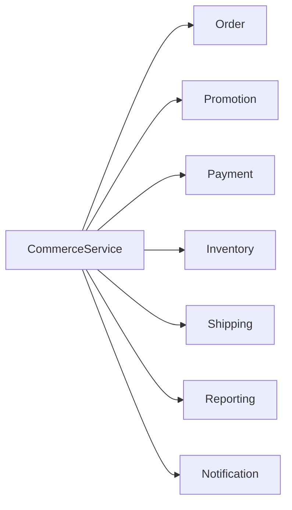
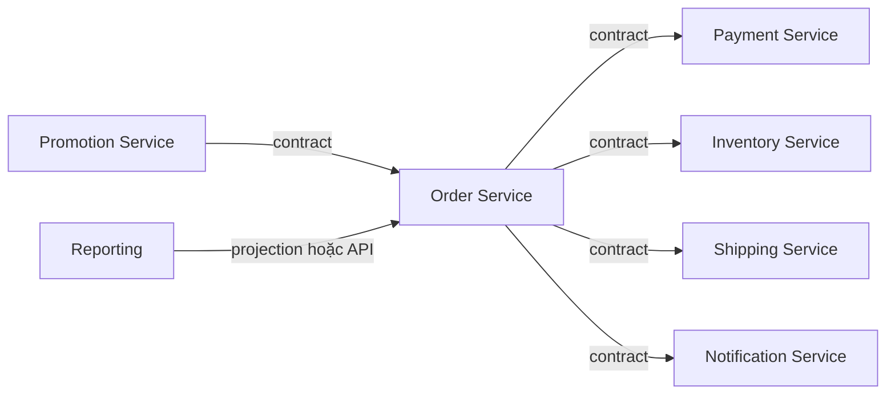
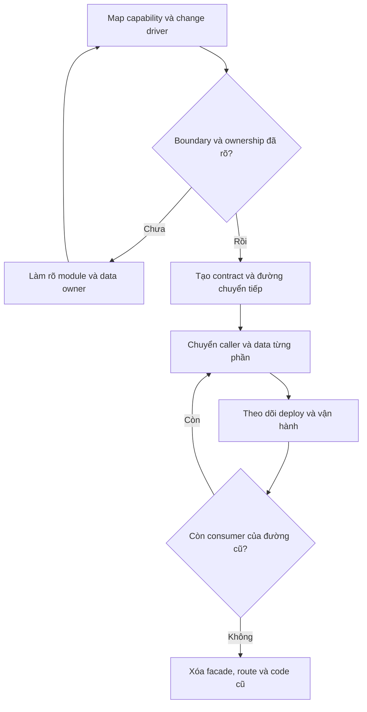

# Mega Service — Anti-pattern của Microservice

## Mục lục

- [Tổng quan](#tổng-quan)
  - [Mega Service là gì](#mega-service-là-gì)
  - [Phạm vi của tài liệu](#phạm-vi-của-tài-liệu)
- [Nhận diện Mega Service](#nhận-diện-mega-service)
  - [Dấu hiệu](#dấu-hiệu)
  - [Boundary và data ownership](#boundary-và-data-ownership)
  - [Nguyên nhân gốc](#nguyên-nhân-gốc)
  - [Hậu quả](#hậu-quả)
- [Ví dụ CommerceService](#ví-dụ-commerceservice)
  - [Topology và trách nhiệm bị trộn](#topology-và-trách-nhiệm-bị-trộn)
  - [Tác động của một thay đổi](#tác-động-của-một-thay-đổi)
  - [Một boundary hợp lý hơn](#một-boundary-hợp-lý-hơn)
- [Phân biệt monolith hợp lý với Mega Service](#phân-biệt-monolith-hợp-lý-với-mega-service)
  - [Khi modular monolith là lựa chọn phù hợp](#khi-modular-monolith-là-lựa-chọn-phù-hợp)
  - [Bảng so sánh](#bảng-so-sánh)
  - [Câu hỏi kiểm tra boundary](#câu-hỏi-kiểm-tra-boundary)
- [Remediation theo từng bước](#remediation-theo-từng-bước)
  - [Bước 1 Xác định capability và change driver](#bước-1-xác-định-capability-và-change-driver)
  - [Bước 2 Làm rõ boundary và ownership](#bước-2-làm-rõ-boundary-và-ownership)
  - [Bước 3 Chọn capability tách trước](#bước-3-chọn-capability-tách-trước)
  - [Bước 4 Tạo contract và chuyển caller](#bước-4-tạo-contract-và-chuyển-caller)
  - [Bước 5 Chuyển data ownership](#bước-5-chuyển-data-ownership)
  - [Bước 6 Tách deploy và vận hành](#bước-6-tách-deploy-và-vận-hành)
  - [Bước 7 Dọn đường cũ](#bước-7-dọn-đường-cũ)
- [Trade off và quyết định gộp hay tách](#trade-off-và-quyết-định-gộp-hay-tách)
  - [Khi tách giúp ích](#khi-tách-giúp-ích)
  - [Khi nên giữ cùng service](#khi-nên-giữ-cùng-service)
  - [Không tách theo class hoặc entity](#không-tách-theo-class-hoặc-entity)
- [Vận hành và quan sát](#vận-hành-và-quan-sát)
  - [Tín hiệu cần theo dõi](#tín-hiệu-cần-theo-dõi)
  - [Team ownership và lifecycle](#team-ownership-và-lifecycle)
  - [Failure isolation và release safety](#failure-isolation-và-release-safety)
- [Checklist](#checklist)
- [Tổng kết](#tổng-kết)
- [Liên kết liên quan](#liên-kết-liên-quan)

---

## Tổng quan

### Mega Service là gì

**Mega Service** (còn gọi là **God Service**) là một service ôm nhiều **business capability** (năng lực nghiệp vụ) có lý do thay đổi khác nhau. Ví dụ, `Order` vừa xử lý đơn hàng, thanh toán, kho, vận chuyển, báo cáo và thông báo.

Mega Service là **monolith thu nhỏ với boundary sai**. Vấn đề cốt lõi không phải service có bao nhiêu dòng mã. Một service lớn vẫn có thể hợp lý nếu các phần bên trong thuộc cùng một capability, thay đổi cùng nhau và có ownership rõ. Ngược lại, một service nhỏ vẫn có thể là Mega Service nếu nó gom các domain không liên quan.

Mục tiêu của remediation là làm rõ boundary, ownership và change driver. Không có một ngưỡng cố định về số endpoint, bảng dữ liệu hay dòng mã để kết luận một service là Mega Service.

### Phạm vi của tài liệu

Tài liệu này tập trung vào một anti-pattern cụ thể:

- nhận diện các capability bị gom sai boundary;
- phân tích dấu hiệu, nguyên nhân và hậu quả;
- phân biệt Mega Service với monolith hoặc modular monolith hợp lý;
- tách dần theo business capability khi có lý do rõ ràng;
- bảo vệ data ownership, contract và khả năng vận hành độc lập.

Các nguyên tắc về decomposition được nhắc lại ở mức cần thiết cho việc xử lý Mega Service. Chi tiết về cách chọn chiến lược phân tách nằm trong [05 — Decomposition Strategies](../05-decomposition-strategies.md).

## Nhận diện Mega Service

### Dấu hiệu

Nên xem các dấu hiệu dưới đây cùng nhau. Một dấu hiệu đơn lẻ, chẳng hạn service có nhiều endpoint, chưa đủ để kết luận.

| Dấu hiệu quan sát được | Câu hỏi chẩn đoán |
|---|---|
| Tên service chung chung như `CommerceService`, `MainService` hoặc `UtilityService` | Có thể mô tả trách nhiệm của service bằng một capability rõ ràng không? |
| Endpoint và bảng dữ liệu thuộc nhiều domain | Các endpoint và dữ liệu này có cùng một Bounded Context không? |
| Nhiều team thường xuyên sửa cùng codebase | Ai chịu trách nhiệm cuối cùng cho từng capability và từng quyết định nghiệp vụ? |
| Một thay đổi buộc phải regression test phần không liên quan | Các phần đó có thật sự thay đổi cùng nhau, hay chỉ nằm chung vì tiện? |
| Scale một workload làm scale cả service | Workload, profile tài nguyên hoặc nhu cầu storage của các capability có khác nhau không? |
| Service trở thành nơi kiểm soát trung tâm của nhiều workflow | Logic nào thuộc Order, Payment, Inventory, Shipping hoặc Notification đang bị kéo về đây? |

Một heuristic hữu ích là hỏi **service thay đổi vì những lý do nào**. Nếu câu trả lời phải liệt kê nhiều lý do nghiệp vụ độc lập, boundary hiện tại cần được xem xét.

### Boundary và data ownership

**Boundary** là ranh giới xác định phần nghiệp vụ, model và trách nhiệm mà một service chịu trách nhiệm. **Data ownership** là quyền quyết định và chịu trách nhiệm đối với một tập dữ liệu. Hai yếu tố này phải đi cùng nhau.

Service nên được tổ chức quanh business capability hoặc **Bounded Context**, không phải quanh technical layer. Khi một service vừa sở hữu trạng thái đơn hàng, vừa quyết định cách charge thẻ, giữ hàng, tạo vận đơn và gửi thông báo, các lý do thay đổi của những phần đó bị trộn vào một boundary.



Hình trên minh họa nhiều capability cùng nằm trong một deployment unit. Nó không có nghĩa mọi capability phải trở thành một service riêng ngay lập tức. Câu hỏi cần trả lời là: capability nào có model, data owner, team owner và nhịp thay đổi khác nhau?

| Khía cạnh | Boundary rõ hơn | Dấu hiệu boundary của Mega Service |
|---|---|---|
| Nghiệp vụ | Service tập trung vào một capability hoặc một context liên quan chặt | Một service chứa nhiều capability có policy và ngôn ngữ riêng |
| Dữ liệu | Có owner xác định cho từng tập dữ liệu | Nhiều domain cùng dựa vào dữ liệu do một service trung tâm quản lý |
| Thay đổi | Các rule liên quan thay đổi cùng nhau | Rule thanh toán, vận chuyển, báo cáo hoặc thông báo kéo theo nhau chỉ vì cùng codebase |
| Team | Một team chịu trách nhiệm end-to-end | Nhiều team cùng sửa nhưng không có ownership theo domain |
| Vận hành | Có thể chọn cách deploy, scale và theo dõi phù hợp với capability | Một workload hoặc incident buộc ảnh hưởng tới toàn bộ service |

### Nguyên nhân gốc

| Nguyên nhân | Cách nó tạo ra Mega Service |
|---|---|
| Tách theo layer kỹ thuật thay vì business capability | UI, business logic hoặc data access của nhiều domain bị gom vào cùng một service boundary |
| Hiểu domain chưa đủ | Các khái niệm khác nhau bị xem như một model và một trách nhiệm |
| Né distributed transaction | Nhóm giữ nhiều capability trong một service để dùng transaction cục bộ, dù các capability có change driver khác nhau |
| Không có team ownership theo domain | Một team hoặc một codebase trở thành nơi tiếp nhận mọi feature liên quan |
| Sợ tạo service mới | Feature mới liên tục được thêm vào service cũ thay vì xem xét lại boundary |

Mega Service thường hình thành dần dần. Ban đầu, việc đặt nhiều capability trong một service có thể giúp giao hàng nhanh. Anti-pattern xuất hiện khi boundary tạm thời đó không được xem xét lại dù team, domain và workload đã khác đi.

### Hậu quả

- **Blast radius lớn:** một lỗi hoặc thay đổi nhỏ có thể ảnh hưởng tới nhiều capability không liên quan trực tiếp.
- **Merge conflict và queue review tăng:** nhiều team cùng sửa một codebase, chờ review hoặc chờ release.
- **Regression rộng:** thay đổi quy tắc hoàn tiền có thể buộc kiểm thử cả vận chuyển, báo cáo và notification.
- **Scaling kém phù hợp:** workload cần nhiều tài nguyên hơn kéo theo việc scale cả service, kể cả phần không cần scale.
- **Storage khó chọn:** các capability khác nhau có thể có nhu cầu lưu trữ và truy vấn khác nhau nhưng phải dùng cùng cách triển khai.
- **Tốc độ thay đổi giảm:** mỗi thay đổi cần hiểu và kiểm tra nhiều phần không cùng domain.
- **Điểm kiểm soát trung tâm:** service dần điều phối mọi workflow và trở thành bottleneck của nhiều team.

Nói ngắn gọn, Mega Service làm giảm **high cohesion** bên trong service và làm tăng phạm vi ảnh hưởng của mỗi thay đổi. Nó có thể trông đơn giản ở sơ đồ deployment, nhưng khó thay đổi và vận hành khi hệ thống phát triển.

## Ví dụ CommerceService

### Topology và trách nhiệm bị trộn

Giả sử `CommerceService` đảm nhiệm toàn bộ luồng thương mại:

```text
┌────────────────────────────────────────────────────┐
│                  CommerceService                   │
│                                                    │
│  Order        → tạo và quản lý đơn hàng            │
│  Promotion    → tính khuyến mãi                    │
│  Payment      → charge thẻ và refund               │
│  Inventory    → giữ hàng                           │
│  Shipping     → gọi hãng vận chuyển                │
│  Reporting    → tạo báo cáo                        │
│  Notification → gửi email                          │
└────────────────────────────────────────────────────┘
```

Các trách nhiệm trên đều có thể xuất hiện trong một user journey, nhưng chúng không tự động có cùng boundary. Bảng dưới đây cho thấy các **change driver** khác nhau:

| Capability | Ví dụ thay đổi riêng | Hệ quả khi bị gom chung |
|---|---|---|
| Order | Thay đổi vòng đời hoặc trạng thái đơn | Có thể phải kiểm thử các phần thanh toán và giao vận |
| Payment | Thay cổng thanh toán hoặc quy tắc refund | Codebase và release bị ảnh hưởng rộng |
| Inventory | Thay đổi cách reserve hàng | Workload kho không thể scale riêng |
| Shipping | Thêm hãng vận chuyển hoặc cách tính phí | Regression lan sang flow không liên quan |
| Reporting | Đổi projection hoặc mẫu báo cáo | Tác vụ đọc/báo cáo cùng deployment với tác vụ giao dịch |
| Notification | Đổi template email | Một lỗi notification có thể làm release hoặc flow chính rủi ro hơn |

### Tác động của một thay đổi

Ví dụ, quy tắc hoàn tiền thay đổi. Về nghiệp vụ, thay đổi này thuộc Payment. Nhưng vì mọi capability nằm trong `CommerceService`, team có thể phải regression test cả tính phí vận chuyển và template email.

```text
Thay đổi quy tắc refund
          │
          ▼
  CommerceService phải build và release
          │
          ├── Regression: Order
          ├── Regression: Shipping
          ├── Regression: Reporting
          └── Regression: Notification
```

Đây là dấu hiệu của blast radius lớn. Không phải mọi regression đều sai; một workflow có thể thật sự liên quan nhiều capability. Vấn đề nằm ở việc các phần không liên quan bị kéo vào cùng phạm vi thay đổi chỉ vì boundary không phản ánh change driver.

### Một boundary hợp lý hơn

Sau khi xác định capability và ownership, có thể tổ chức lại thành các service hoặc module có boundary rõ hơn:



Đây là topology minh họa, không phải công thức bắt buộc. Một số tương tác cần kết quả ngay có thể dùng API đồng bộ. Side effect hoặc projection không cần phản hồi tức thời có thể dùng event hoặc queue. Cách chọn communication phải dựa trên yêu cầu business, consistency và khả năng vận hành.

Điểm quan trọng là mỗi boundary mới cần có contract, data owner và team owner. Chỉ đổi tên các module thành service mà vẫn dùng chung implementation hoặc data ownership thì chưa giải quyết được Mega Service.

## Phân biệt monolith hợp lý với Mega Service

### Khi modular monolith là lựa chọn phù hợp

**Monolith** không tự động là anti-pattern. Nếu hai phần luôn thay đổi, deploy và cần transaction cùng nhau, giữ chúng trong cùng một service hoặc một **modular monolith** có thể là lựa chọn hợp lý.

Modular monolith vẫn nên có module và boundary nội bộ rõ ràng. Các module có thể dùng chung một process, nhưng trách nhiệm, model và ownership nên được làm rõ để tránh biến nó thành một nơi chứa mọi logic.

Giữ cùng service thường phù hợp hơn khi:

- các phần thuộc cùng một business capability hoặc một context gắn kết cao;
- các business rule thường thay đổi cùng nhau;
- transaction cùng nhau là yêu cầu nghiệp vụ thật, không chỉ là cách triển khai tiện nhất;
- một team có thể own toàn bộ lifecycle;
- chưa có driver rõ ràng về independent deployment, independent scaling hoặc failure isolation.

Nói ngắn gọn: phân tán không phải là mục tiêu tự thân. Nếu boundary chưa ổn định, modular monolith có thể là bước trung gian tốt hơn việc tạo thêm một service khó vận hành.

### Bảng so sánh

| Tiêu chí | Monolith hoặc modular monolith hợp lý | Mega Service |
|---|---|---|
| Phạm vi nghiệp vụ | Một capability hoặc các module liên quan chặt | Nhiều capability có lý do thay đổi khác nhau |
| Cohesion | Phần lớn logic phục vụ cùng một mục đích | Logic bị gom vì cùng ứng dụng hoặc cùng team |
| Thay đổi | Các phần thường được thay đổi và kiểm thử cùng nhau | Thay đổi một phần kéo theo regression không liên quan |
| Ownership | Một team có thể chịu trách nhiệm end-to-end | Nhiều team cùng sửa, ownership theo domain không rõ |
| Dữ liệu | Model và data phục vụ một boundary thống nhất | Endpoint và bảng dữ liệu trải trên nhiều domain |
| Scaling và storage | Nhu cầu tài nguyên tương đối phù hợp | Một workload buộc scale hoặc chọn storage cho toàn bộ |
| Deployment | Một deployment là trade-off có chủ đích | Một deployment trở thành rào cản thay đổi |
| Hướng xử lý | Giữ boundary nội bộ và đo lại khi domain thay đổi | Làm rõ boundary, ownership rồi tách dần khi có bằng chứng |

### Câu hỏi kiểm tra boundary

Trước khi tách, hãy trả lời cụ thể các câu hỏi sau cho từng capability:

1. **Capability này phục vụ mục đích nghiệp vụ nào?**
2. **Business rule nào thay đổi cùng nhau?**
3. **Ai là owner của API, event và tập dữ liệu liên quan?**
4. **Phần này có cần transaction cùng với phần khác không?** Nếu có, đó có phải yêu cầu business đã xác minh không?
5. **Nếu tách, caller có thể giao tiếp qua contract thay vì biết implementation không?**
6. **Team có thể deploy, monitor và on-call cho boundary mới không?**

Nếu chưa trả lời được các câu hỏi này, hãy làm rõ module và domain trước. Tách theo topology khi boundary còn mơ hồ thường chỉ chuyển Mega Service thành nhiều service có coupling cao.

## Remediation theo từng bước

### Bước 1 Xác định capability và change driver

Tổ chức **Event Storming** hoặc workshop với domain expert. Nhóm các event, policy và data thường thay đổi cùng nhau thành các Bounded Context tiềm năng.

Với `CommerceService`, thay vì bắt đầu từ class hoặc table, hãy bắt đầu từ các câu hỏi:

- Đơn hàng có vòng đời và policy nào?
- Thanh toán có quy tắc charge, refund và đối soát nào?
- Kho có quy tắc reserve và release nào?
- Vận chuyển có model và trạng thái nào?
- Báo cáo và notification nhận dữ liệu từ những event nào?

Kết quả cần là một capability map và danh sách change driver. Không cần quyết định số service cuối cùng ngay trong workshop.

### Bước 2 Làm rõ boundary và ownership

Lập inventory cho endpoint, event, bảng dữ liệu, reader/writer và team đang sửa từng phần. Sau đó chỉ định owner cho từng API, event và tập dữ liệu.

Một boundary mới chỉ có ý nghĩa khi quyền sở hữu được làm rõ:

1. capability nào thuộc service hoặc module nào;
2. team nào chịu trách nhiệm về business rule;
3. service nào là source of truth cho dữ liệu;
4. consumer nào chỉ được dùng contract công khai;
5. đường truy cập cũ nào cần loại bỏ trong quá trình migrate.

Chuyển data ownership trước hoặc song song với logic. Tránh tạo service mới chỉ là **CRUD wrapper** quanh dữ liệu vẫn thuộc service cũ.

### Bước 3 Chọn capability tách trước

Chọn một capability có boundary và data ownership tương đối rõ, đồng thời có business value cụ thể khi tách. Ví dụ, nhu cầu deploy riêng, scale riêng hoặc cô lập failure có thể là driver chính.

Bắt đầu bằng một slice nhỏ giúp team kiểm chứng contract, migration, monitoring và rollback trước khi xử lý phần phức tạp hơn. Không nên rewrite toàn bộ `CommerceService` trong một lần nếu chưa có safety net.

### Bước 4 Tạo contract và chuyển caller

Đặt contract ở boundary mới. Consumer chỉ nên biết interface cần thiết, không biết class, schema nội bộ hoặc cách service triển khai.

Remediation có thể tiến hành theo trình tự sau:

1. tạo API hoặc event contract cho capability mới;
2. giữ đường cũ còn tương thích trong giai đoạn chuyển tiếp;
3. chuyển caller dần bằng feature flag, routing switch hoặc **Strangler Fig**;
4. nếu cần, giữ service cũ làm facade tạm thời;
5. chạy contract test và theo dõi consumer trước khi xóa contract cũ.

Facade chỉ là cơ chế chuyển tiếp. Nó không tự tạo ra data boundary hoặc ownership mới.

### Bước 5 Chuyển data ownership

Di chuyển logic sở hữu dữ liệu sang boundary mới. Các service khác không nên tiếp tục đọc hoặc ghi dữ liệu nội bộ của owner mới chỉ vì việc chuyển code đã hoàn tất.

Khi consumer cần dữ liệu của domain khác:

- dùng API cho dữ liệu cần hiện thời;
- dùng event hoặc read model cho dữ liệu đọc có thể cập nhật sau;
- xác định source of truth và mức eventual consistency chấp nhận được;
- nếu cần phối hợp nhiều transaction, đánh giá Saga và compensating action thay vì kéo mọi dữ liệu về một service trung tâm.

Trong migration, có thể dùng outbox hoặc CDC để đồng bộ dữ liệu chuyển tiếp. Cần đặt tiêu chí hoàn thành và thời hạn xóa đường truy cập cũ.

### Bước 6 Tách deploy và vận hành

Mỗi service mới cần có team chịu trách nhiệm end-to-end, gồm:

- code và business logic;
- API, event và compatibility policy;
- dữ liệu, schema và migration;
- CI/CD, deploy và rollback;
- logging, metrics, tracing và alert;
- monitoring và on-call.

Tách process nhưng vẫn để một team trung tâm review, release và xử lý mọi capability thì autonomy chưa thực sự được cải thiện. Ngược lại, không nên tạo service mới nếu team chưa sẵn sàng vận hành thêm lifecycle đó.

### Bước 7 Dọn đường cũ

Sau khi caller và traffic đã chuyển ổn định:

1. xác nhận data và behavior của capability mới;
2. theo dõi error rate, latency, dependency và incident;
3. xóa route, facade, quyền truy cập, code và schema cũ khi không còn consumer;
4. ghi lại technical debt còn tồn tại cùng owner và thời hạn xử lý;
5. đo lại phạm vi thay đổi và vận hành trước khi chọn slice tiếp theo.

Một phase chưa hoàn tất chỉ vì service mới đã nhận traffic. Đường coupling cũ cũng phải được dọn hoặc được quản lý như technical debt có thời hạn.



## Trade off và quyết định gộp hay tách

### Khi tách giúp ích

Tách một capability ra khỏi Mega Service có thể giúp:

- giảm blast radius của thay đổi;
- giảm merge conflict và phạm vi regression không liên quan;
- giao ownership cho team theo domain;
- chọn cách scale hoặc storage phù hợp với workload;
- tiến tới independent deployment và failure isolation khi các điều kiện cần thiết đã có.

Các lợi ích này chỉ xuất hiện khi boundary, contract và data ownership được tách thật. Chia repository hoặc container mà vẫn giữ coupling cũ không đủ.

### Khi nên giữ cùng service

Giữ hai phần cùng service có thể là lựa chọn đúng khi:

- chúng luôn thay đổi và deploy cùng nhau vì cùng một business capability;
- transaction cùng nhau là yêu cầu nghiệp vụ rõ ràng;
- việc tách sẽ tạo nhiều network call nhưng không mang lại autonomy đáng kể;
- team chưa có năng lực vận hành thêm service;
- boundary mới chưa đủ ổn định để đặt contract và ownership.

Trong trường hợp này, hãy dùng modular monolith và làm rõ module nội bộ. Khi có bằng chứng mới về scaling, deployment hoặc ownership, boundary có thể được tách bằng migration từng phase.

### Không tách theo class hoặc entity

Tách mỗi class, entity hoặc thao tác CRUD thành một service thường tạo ra các service mỏng. Business logic sau đó bị đẩy sang caller hoặc gateway, và caller phải biết quá nhiều chi tiết.

Ví dụ, không nên tách `CreateOrderService`, `ValidateOrderService` và `SaveOrderService` chỉ vì chúng là các bước kỹ thuật. Hãy xem các bước đó có cùng phục vụ vòng đời Order hay không, rồi đặt business logic ở boundary sở hữu capability đó.

Một service mới cũng không nên chỉ bọc một bảng dữ liệu mà vẫn để service khác sở hữu quy tắc nghiệp vụ. Nếu không có data ownership và capability rõ, việc tách sẽ tạo thêm distributed-system overhead mà không giải quyết Mega Service.

## Vận hành và quan sát

### Tín hiệu cần theo dõi

Không nên dùng line count hoặc một ngưỡng số endpoint cố định. Hãy theo dõi hành vi thay đổi và vận hành theo thời gian.

| Tín hiệu | Cách quan sát | Điều cần kết luận |
|---|---|---|
| Nhiều team cùng sửa | Lịch sử pull request, code ownership và review queue | Boundary hoặc ownership có đang bị trộn không |
| Regression không liên quan | Phạm vi test và file thay đổi theo capability | Các phần có thực sự change together không |
| Release chậm hoặc sợ deploy | Release history, rollback và incident sau deploy | Một deployment unit có đang tạo coupling không |
| Workload khác nhau | Metrics CPU, memory, I/O, traffic theo workload | Có nhu cầu scale hoặc storage riêng không |
| Dữ liệu nhiều domain | Service catalog, schema, reader/writer và quyền truy cập | Ai là source of truth và data owner |
| Dependency sau khi tách | Distributed tracing, latency và error path | Boundary mới có tạo coupling quá chặt không |

Các tín hiệu này dùng để so sánh trước và sau remediation. Một con số riêng lẻ không thay thế cho việc hiểu business capability và ownership.

### Team ownership và lifecycle

Team nhận ownership của service mới phải chịu trách nhiệm toàn bộ lifecycle. Điều này bao gồm thiết kế, phát triển, test, deploy, monitoring và on-call.

Ownership nên được ghi rõ cho:

- business capability và các policy chính;
- API và event contract;
- data model, schema và migration;
- dashboard, alert và runbook;
- lịch deprecate contract hoặc xóa facade.

Nếu mọi thay đổi vẫn phải đi qua một team trung tâm, service mới có thể chỉ là Mega Service được chia thành nhiều process. Mục tiêu không phải tạo nhiều team hoặc service hơn, mà là tạo boundary có owner thực sự.

### Failure isolation và release safety

Remediation nên có safety net trước khi chuyển traffic hoặc data:

- contract test để phát hiện breaking change;
- feature flag hoặc routing switch để chuyển và rollback traffic;
- metrics, logs và traces để quan sát behavior mới;
- migration plan và backup phù hợp với dữ liệu;
- runbook cho lỗi contract, dữ liệu và runtime.

Khi một phần không cần kết quả ngay, có thể cân nhắc event hoặc queue để giảm temporal coupling. Với bước cần quyết định tức thời, synchronous call vẫn có thể phù hợp; khi đó cần timeout và error handling rõ ràng. Không chuyển mọi thứ sang async chỉ vì muốn tách service.

## Checklist

- [ ] Service có thể được mô tả bằng một business capability rõ ràng.
- [ ] Các endpoint và bảng dữ liệu thuộc cùng một boundary nghiệp vụ.
- [ ] Các change driver chính đã được xác định.
- [ ] Mỗi API, event và tập dữ liệu có owner rõ ràng.
- [ ] Team owner chịu trách nhiệm end-to-end cho service hoặc module.
- [ ] Capability tách trước có business value và data boundary đủ rõ.
- [ ] Contract mới không làm consumer phải biết implementation nội bộ.
- [ ] Không tạo service mới chỉ là CRUD wrapper.
- [ ] Có kế hoạch chuyển caller, data và traffic từng phase.
- [ ] Có feature flag, rollback path hoặc routing switch phù hợp.
- [ ] Có contract test, logs, metrics, traces và runbook cần thiết.
- [ ] Có kế hoạch xóa facade, route, quyền truy cập và code cũ.
- [ ] Technical debt còn lại có owner và thời hạn xử lý.
- [ ] Đã xác minh rằng modular monolith không phải lựa chọn đơn giản và phù hợp hơn.

## Tổng kết

Mega Service không được nhận diện bằng kích thước code, mà bằng việc một service chứa nhiều capability có boundary, ownership và lý do thay đổi khác nhau. Dấu hiệu thường thấy là nhiều team cùng sửa, regression lan rộng, scale không chọn lọc và service trở thành trung tâm của mọi workflow.

Remediation an toàn bắt đầu từ business capability và Bounded Context. Hãy làm rõ ownership, chọn một slice có giá trị, tạo contract, chuyển caller và data từng bước, rồi đo lại khả năng deploy và vận hành. Nếu các phần thật sự luôn thay đổi, deploy và cần transaction cùng nhau, giữ chúng trong một modular monolith hoặc một service vẫn có thể là quyết định đúng.

## Liên kết liên quan

- [02 — Single Responsibility & Bounded Context](../02-single-responsibility-bounded-context.md) — xác định business boundary và Bounded Context.
- [03 — Loose Coupling & High Cohesion](../03-loose-coupling-high-cohesion.md) — đánh giá cohesion bên trong và coupling bên ngoài.
- [04 — Autonomy & Independence](../04-autonomy-independence.md) — independent deployment, team ownership và fault isolation.
- [05 — Decomposition Strategies](../05-decomposition-strategies.md) — phân tách theo business capability và migration strategy.
- [06 — Inter-Service Communication](../06-inter-service-communication.md) — chọn synchronous, asynchronous và event communication.
- [09 — Data Management](../09-data-management.md) — data ownership, Saga, Outbox và consistency.
- [11 — Observability & Evolvability](../11-observability-evolvability.md) — logs, metrics, traces và tiến hóa an toàn.
- [Distributed Monolith](./distributed-monolith.md) — coupling còn sót lại sau khi tách service.
- [Strangler Fig Pattern](../17-decomposition-patterns/strangler-fig.md) — chuyển traffic và capability từng phase.
- [Branch by Abstraction](../17-decomposition-patterns/branch-by-abstraction.md) — chuyển implementation trong monolith từng bước.
- [Bản tổng hợp Anti-patterns](../17-anti-patterns.md) — bản đồ các anti-pattern liên quan.
