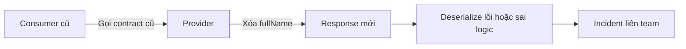
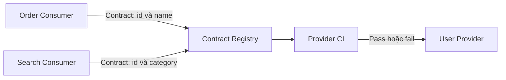
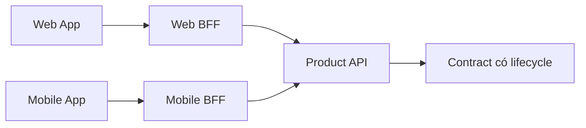

# No API Versioning — Anti-pattern của Microservice

## Mục lục

- [Tổng quan](#tổng-quan)
  - [No API Versioning là gì](#no-api-versioning-là-gì)
  - [Phạm vi của tài liệu](#phạm-vi-của-tài-liệu)
- [Nhận diện anti-pattern](#nhận-diện-anti-pattern)
  - [Dấu hiệu](#dấu-hiệu)
  - [Breaking change và hậu quả](#breaking-change-và-hậu-quả)
  - [Nguyên nhân gốc](#nguyên-nhân-gốc)
- [Ví dụ đổi API User](#ví-dụ-đổi-api-user)
  - [Cách thay đổi làm consumer bị phá vỡ](#cách-thay-đổi-làm-consumer-bị-phá-vỡ)
  - [Cách giữ contract cũ bằng adapter](#cách-giữ-contract-cũ-bằng-adapter)
- [Compatibility trước khi version](#compatibility-trước-khi-version)
  - [Phân loại thay đổi](#phân-loại-thay-đổi)
  - [Tolerant Reader](#tolerant-reader)
  - [Consumer Driven Contract Testing](#consumer-driven-contract-testing)
- [Cách biểu diễn version](#cách-biểu-diễn-version)
  - [URI versioning](#uri-versioning)
  - [Header versioning](#header-versioning)
  - [Media type versioning](#media-type-versioning)
  - [Version negotiation](#version-negotiation)
- [Deprecation và vòng đời contract](#deprecation-và-vòng-đời-contract)
  - [Expand Migrate và Contract](#expand-migrate-và-contract)
  - [Thông báo và migration guide](#thông-báo-và-migration-guide)
  - [Sunset và gỡ bỏ](#sunset-và-gỡ-bỏ)
- [Remediation theo từng bước](#remediation-theo-từng-bước)
  - [Bước 1 Lập inventory và xác định owner](#bước-1-lập-inventory-và-xác-định-owner)
  - [Bước 2 Phân loại thay đổi](#bước-2-phân-loại-thay-đổi)
  - [Bước 3 Giữ compatibility khi có thể](#bước-3-giữ-compatibility-khi-có-thể)
  - [Bước 4 Migrate breaking change theo phase](#bước-4-migrate-breaking-change-theo-phase)
  - [Bước 5 Đưa kiểm thử vào CI](#bước-5-đưa-kiểm-thử-vào-ci)
- [API Gateway và BFF](#api-gateway-và-bff)
  - [Vai trò của API Gateway](#vai-trò-của-api-gateway)
  - [Khi BFF là consumer của API](#khi-bff-là-consumer-của-api)
- [Trade offs](#trade-offs)
  - [Chi phí của nhiều version](#chi-phí-của-nhiều-version)
  - [So sánh cách biểu diễn version](#so-sánh-cách-biểu-diễn-version)
- [Vận hành và observability](#vận-hành-và-observability)
  - [Theo dõi usage theo version](#theo-dõi-usage-theo-version)
  - [Alert và rollback](#alert-và-rollback)
- [Khi nào không nên tạo version mới](#khi-nào-không-nên-tạo-version-mới)
- [Checklist](#checklist)
- [Liên kết liên quan](#liên-kết-liên-quan)

---

## Tổng quan

### No API Versioning là gì

**No API Versioning** là việc thay đổi public contract mà không có chiến lược **compatibility** (tương thích), version, **deprecation** (ngừng hỗ trợ có lộ trình) hoặc thông báo cho consumer. Contract ở đây không chỉ là API public trên Internet. Một API nội bộ cũng là contract ngay khi service khác hoặc một ứng dụng khác phụ thuộc vào nó.

Tên anti-pattern này không có nghĩa mọi endpoint phải có `/v1`. Versioning chỉ là một công cụ. Điều cần bảo vệ là consumer cũ không bị phá vỡ ngoài ý muốn khi provider thay đổi. Một thay đổi additive, chẳng hạn thêm field optional mà consumer có thể bỏ qua, có thể không cần tạo version mới.

```text
Provider và consumer có contract:

  Consumer ── phụ thuộc request/response ──> Provider
       │                                      │
       └── cần compatibility và lifecycle ───┘

Không có versioning không đồng nghĩa chỉ thiếu /v1.
Vấn đề là thay đổi contract nhưng không có cách bảo vệ consumer.
```

### Phạm vi của tài liệu

Tài liệu này tập trung vào No API Versioning: dấu hiệu, breaking change, nguyên nhân, compatibility, cách biểu diễn version, deprecation, remediation và vận hành. API và integration event đều cần được coi là contract; phần event dùng schema hoặc event version thay vì sao chép máy móc cách version của HTTP API.

Các lựa chọn ở đây là trade-off theo từng API. Đây không phải decision aid để chọn kiến trúc cho toàn bộ nhóm. Khi cần nhìn No API Versioning trong cùng các anti-pattern khác, xem [bản tổng hợp Anti-patterns](../17-anti-patterns.md).

## Nhận diện anti-pattern

### Dấu hiệu

Một dấu hiệu đơn lẻ chưa đủ kết luận. Hãy xem nó cùng lịch sử deploy, traffic và contract của hệ thống.

| Dấu hiệu quan sát được | Coupling hoặc rủi ro có thể đang tồn tại |
|---|---|
| Provider rename hoặc xóa field làm consumer lỗi sau deploy | Consumer đang phụ thuộc vào shape cũ nhưng không có compatibility guard |
| Không biết service hoặc ứng dụng nào đang gọi endpoint/event | Không có consumer inventory, contract registry hoặc ownership rõ |
| API docs không ghi lifecycle, version, deprecation hay deadline | Consumer không biết contract cũ được support đến khi nào |
| Breaking change chỉ được phát hành trong một coordinated release | Provider và consumer bị deployment coupling |
| Không có consumer-driven contract test | Provider chỉ biết contract của mình, không biết nhu cầu thực tế của consumer |
| Rollback provider làm consumer vẫn lỗi hoặc ngược lại | Provider và consumer đang chạy lệch version, không có contract chuyển tiếp |
| Consumer tự parse response theo implementation hoặc field không được công bố | Contract mong manh và thay đổi nhỏ có thể thành incident liên team |

### Breaking change và hậu quả

**Breaking change** là thay đổi khiến một consumer hợp lệ trước đó không còn gọi, parse hoặc hiểu contract theo cách đã cam kết. Không chỉ hình dạng JSON mới tạo breaking change. Ý nghĩa nghiệp vụ, validation rule và data model cũng có thể thay đổi theo cách làm hành vi cũ không còn đúng.

Các thay đổi thường có nguy cơ breaking:

- Rename hoặc xóa field, endpoint, event hoặc enum value mà consumer đang dùng.
- Đổi kiểu dữ liệu hoặc format response, chẳng hạn đổi chuỗi thành object.
- Thêm field bắt buộc nhưng không có default hợp lệ cho request cũ.
- Siết validation rule khiến request trước đây hợp lệ nay bị từ chối.
- Đổi business logic hoặc trạng thái xử lý khiến consumer cũ tạo ra data sai.
- Đổi data model đến mức contract cũ không còn ánh xạ đúng.



Hậu quả chính gồm:

- **Deployment coupling:** provider phải chờ tất cả consumer sửa xong, hoặc một release phải deploy đồng thời nhiều service.
- **Rollback khó:** rollback provider không đủ nếu consumer đã chuyển sang contract mới; chiều ngược lại cũng có thể xảy ra.
- **Lỗi runtime và failure lan truyền:** consumer lỗi ngay sau khi provider deploy, dù code của consumer không thay đổi.
- **Consumer parsing mong manh:** client có thể phụ thuộc vào field, thứ tự hoặc ý nghĩa không được quản trị như contract.
- **Sai dữ liệu hoặc sai nghiệp vụ:** giữ một contract cũ nhưng dùng logic mới không tương thích có thể nguy hiểm hơn việc công khai breaking change.

Nói ngắn gọn: breaking change không được quản lý biến một thay đổi cục bộ thành sự cố và lịch release của nhiều team.

### Nguyên nhân gốc

| Nguyên nhân | Cách nó tạo ra No API Versioning |
|---|---|
| Xem internal API là implementation detail | Provider thay đổi tự do dù service khác đã phụ thuộc vào contract |
| Không có provider owner hoặc contract registry | Không ai chịu trách nhiệm biết consumer nào bị ảnh hưởng |
| Thiếu consumer-driven contract test | Breaking change chỉ được phát hiện sau integration hoặc production |
| Không phân loại breaking và non-breaking change | Mọi thay đổi được xử lý như một lần deploy bình thường |
| Thiếu compatibility và deprecation policy | Cách duy nhất để migrate là coordinated release |
| Ưu tiên đổi code nhanh hơn lifecycle của contract | Changelog, migration guide và thời hạn support bị bỏ qua |
| Muốn đổi business logic nhưng vẫn giữ endpoint cũ bằng mọi giá | Contract cũ có thể chạy ra data không còn đúng |

Tách service hoặc tách repository không tự tạo ra API autonomy. Nếu consumer vẫn phải chờ provider hoặc cùng release, boundary hiện tại vẫn còn coupling. Xem thêm [Autonomy & Independence](../04-autonomy-independence.md).

## Ví dụ đổi API User

### Cách thay đổi làm consumer bị phá vỡ

Giả sử User Provider đang công bố response:

```http
GET /api/users/123
```

```json
{
  "id": 123,
  "fullName": "Nguyen Van A"
}
```

Order Consumer chỉ đọc `id` và `fullName`. Provider muốn chuẩn hóa dữ liệu thành `firstName` và `lastName`, rồi deploy thay đổi trực tiếp:

```json
{
  "id": 123,
  "firstName": "Nguyen",
  "lastName": "Van A"
}
```

Consumer cũ có thể fail khi deserialize nếu schema strict. Nếu serializer cho phép thiếu field, logic phía sau vẫn có thể nhận `fullName` rỗng và xử lý sai. Vấn đề không nằm ở tên field mới, mà ở việc provider xóa field cũ khi consumer chưa migrate.

```text
❌ One-step breaking change

Deploy Provider mới
        │
        ▼
fullName bị xóa ──> Consumer cũ vẫn đọc fullName ──> lỗi hoặc sai dữ liệu
```

### Cách giữ contract cũ bằng adapter

Nếu ý nghĩa nghiệp vụ của contract cũ vẫn còn đúng, provider có thể dùng adapter hoặc response mapping:

```http
GET /api/v1/users/123
```

```json
{
  "id": 123,
  "fullName": "Nguyen Van A"
}
```

```http
GET /api/v2/users/123
```

```json
{
  "id": 123,
  "firstName": "Nguyen",
  "lastName": "Van A"
}
```

Trong giai đoạn chuyển tiếp, v1 vẫn trả contract cũ và v2 trả contract mới. Consumer được migrate từng phần. Chỉ sau khi usage của v1 đã được kiểm tra và deprecation đã công bố thì provider mới xem xét gỡ v1.

Adapter không phải lúc nào cũng đúng. Nếu business logic cũ đã gây data sai hoặc không còn tương thích với invariant mới, giữ v1 có thể tạo inconsistency. Khi đó cần một breaking change có migration bắt buộc, không nên chỉ đổi tên endpoint để che vấn đề.

## Compatibility trước khi version

Versioning không thay thế compatibility. Trước khi tạo v2, hãy hỏi liệu thay đổi có thể additive, có thể giữ response cũ bằng adapter, hoặc consumer có thể dùng **Tolerant Reader** hay không.

### Phân loại thay đổi

| Loại thay đổi | Có thể giữ version cũ? | Cách xử lý và điều kiện |
|---|:---:|---|
| Thêm field optional vào response | Có | Consumer chỉ đọc field cần thiết; field mới có default hoặc có thể bỏ qua |
| Thêm endpoint mới | Có | Giữ endpoint cũ, công bố endpoint mới như một capability bổ sung |
| Đổi format response | Có thể | Giữ representation cũ qua adapter nếu provider còn đủ dữ liệu để tạo nó |
| Thêm field bắt buộc vào request | Tùy | v1 có thể tự điền default chỉ khi default đó đúng về nghiệp vụ |
| Đổi business logic | Tùy | Giữ v1 nếu logic cũ vẫn đúng; nếu giữ sẽ tạo data sai thì phải breaking |
| Đổi validation rule | Thường không | Tách contract khi request cũ hợp lệ nhưng nay phải bị từ chối |
| Đổi data model | Tùy | Chỉ giữ contract nếu mapping không làm mất ý nghĩa hoặc tạo inconsistency |
| Đổi sync flow thành async | Tùy | Cần contract mới nếu semantics của response và trạng thái xử lý thay đổi |

**Quy tắc thực tế:** nếu giữ version cũ có thể gây **data inconsistency** hoặc sai logic nghiệp vụ, không giữ nó chỉ vì sợ làm consumer bị break.

### Tolerant Reader

**Tolerant Reader** là cách consumer chỉ đọc các field mình cần và bỏ qua field chưa biết. Điều này giúp một thay đổi additive không buộc mọi consumer phải deploy ngay.

Provider thêm `phone` vào response:

```json
{
  "id": 123,
  "name": "John",
  "email": "john@example.com",
  "phone": "+84123456789"
}
```

Consumer cũ chỉ đọc `id`, `name` và `email`. Nó có thể tiếp tục hoạt động nếu serializer và contract cho phép bỏ qua field chưa biết. Tolerant Reader không cứu được việc rename, xóa field hoặc đổi ý nghĩa của field đang được đọc.

### Consumer Driven Contract Testing

**Consumer-driven contract test** để mỗi consumer mô tả chính xác phần contract mình cần. Provider chạy các contract đó trong CI trước khi deploy.



Một contract nên làm rõ ít nhất:

- request: method, path, header, query và body cần thiết;
- response: status, field, kiểu dữ liệu và error shape consumer sử dụng;
- owner/provider, consumer và thời điểm kiểm thử;
- compatibility policy và deprecation path nếu contract sẽ thay đổi.

Contract test không thay thế unit test hoặc integration test. Nó tạo một safety net ở biên giới service, nơi provider dễ bỏ sót nhu cầu của consumer nhất.

## Cách biểu diễn version

Không có một cách biểu diễn version đúng cho mọi API. Hãy chọn một cách nhất quán dựa trên loại API, consumer, tooling, caching và cách route hiện có. Dù chọn cách nào, contract vẫn phải document rõ version nào được hỗ trợ và version nào được chọn khi consumer không chỉ định.

### URI versioning

Version nằm trong resource path:

```http
GET /api/v1/users/123
GET /api/v2/users/123
```

Đây là cách dễ nhìn thấy trong log, tài liệu và rule routing. API Gateway có thể route `/api/v1/**` và `/api/v2/**` đến implementation tương ứng. Đổi lại, provider phải quản lý nhiều URI và consumer thường giữ version trong cấu hình hoặc code gọi API.

URI versioning phù hợp khi version là một contract public rõ ràng và team muốn việc chọn version xuất hiện trực tiếp trong request. Nó không làm v1 tự động tương thích; provider vẫn phải duy trì đúng semantics của v1.

### Header versioning

Version nằm trong request header, còn URI giữ ổn định:

```http
GET /api/users/123
X-API-Version: v2
```

Cách này tách version khỏi địa chỉ resource. Gateway hoặc provider có thể route theo header. Tuy nhiên, version ít hiển thị hơn trong đường dẫn; client, proxy, cache và test tool phải bảo toàn header. Contract cần quy định rõ behavior khi header bị thiếu, không hợp lệ hoặc yêu cầu một version không được hỗ trợ.

### Media type versioning

Version nằm trong media type của HTTP `Accept` hoặc `Content-Type`:

```http
GET /api/users/123
Accept: application/vnd.example.user.v2+json
```

Provider dùng content negotiation để chọn representation. Response nên xác nhận representation đã chọn:

```http
HTTP/1.1 200 OK
Content-Type: application/vnd.example.user.v2+json
```

Media type versioning giữ URI ổn định và biểu đạt rằng version là một representation của resource. Đổi lại, cách này khó thấy hơn khi đọc URL và đòi hỏi documentation, tooling cùng caching hiểu content negotiation đúng cách.

### Version negotiation

**Version negotiation** là để consumer nêu version hoặc representation mình hỗ trợ, còn provider chọn một option tương thích và nói rõ kết quả. Ví dụ:

```http
GET /api/users/123
Accept: application/vnd.example.user.v2+json, application/vnd.example.user.v1+json;q=0.8
```

Provider có thể chọn v2 nếu hỗ trợ, rồi trả `Content-Type` tương ứng. Khi response được cache theo `Accept`, cần cấu hình cache phân biệt request header đó, chẳng hạn dùng `Vary: Accept` theo khả năng của hạ tầng.

Một policy negotiation cần trả lời rõ:

- request không chỉ định version sẽ dùng default nào;
- version không được hỗ trợ sẽ trả lỗi hay có fallback nào được phép;
- provider có được âm thầm downgrade không;
- response và log ghi nhận version nào đã được chọn.

Không nên để fallback âm thầm làm consumer tưởng mình đang dùng v2 nhưng thực tế nhận semantics của v1.

Với integration event, không có URI HTTP để đặt version. Event thường cần version trong schema hoặc event type, kèm compatibility policy và schema registry phù hợp. Consumer của event cũng cần được migrate và theo dõi như consumer của API.

## Deprecation và vòng đời contract

**Deprecation** là thông báo rằng contract vẫn còn hoạt động nhưng sẽ không được support mãi mãi. Nó tạo thời gian để consumer migrate; nó không phải là việc xóa endpoint ngay khi v2 xuất hiện.

### Expand Migrate và Contract

**Expand and Contract** chia breaking change thành các phase có thể quan sát:

```text
Phase Expand
  Thêm contract mới, giữ contract cũ.
  Consumer vẫn có thể dùng v1 trong khi bắt đầu migrate sang v2.

Phase Migrate
  Chuyển consumer từng phần.
  Theo dõi usage, contract test và lỗi của cả v1 lẫn v2.

Phase Contract
  Công bố deprecation và sunset.
  Xóa v1 chỉ sau khi điều kiện support và migration đã hoàn tất.
```

Luồng này giảm nhu cầu coordinated release. Trong một thời gian, provider phải duy trì hai contract. Đó là chi phí có chủ đích để đổi lấy khả năng migrate an toàn hơn.

### Thông báo và migration guide

Một contract được quản trị như một sản phẩm cần có:

- provider owner và kênh liên hệ;
- schema hoặc OpenAPI/GraphQL/Protobuf tương ứng;
- changelog nêu field, semantics, error và behavior thay đổi;
- danh sách hoặc tín hiệu usage của consumer;
- migration guide có ví dụ request/response mới;
- mốc deprecation, deadline sunset và chính sách support;
- contract test hoặc cách consumer tự kiểm tra tương thích.

Với breaking change, thông báo trước cho các consumer team và ghi rõ deadline migrate. Không nên chỉ gửi một thông báo chung mà không có hướng dẫn ánh xạ từ field hoặc behavior cũ sang mới.

### Sunset và gỡ bỏ

Trong sunset period, provider có thể trả thông tin deprecation nếu stack hỗ trợ:

```http
Deprecation: true
Sunset: <ngày giờ HTTP hợp lệ>
```

Đồng thời log các request còn dùng contract cũ để biết consumer nào chưa migrate. Khi gần đến deadline, cần alert thay vì chờ request lỗi trong production.

Sau sunset, provider có thể tắt contract cũ và trả lỗi theo contract đã công bố, chẳng hạn `410 Gone`, hoặc proxy/adapter sang v2 nếu request cũ còn ánh xạ an toàn. Không proxy khi việc ánh xạ có thể làm sai business logic hoặc data.

## Remediation theo từng bước

### Bước 1 Lập inventory và xác định owner

1. Liệt kê API endpoint, integration event, schema và version đang tồn tại.
2. Ghi provider, consumer, team owner, traffic, môi trường và dependency trong pipeline.
3. Dùng access log, trace, contract registry, source code và event subscription để tìm consumer thật.
4. Công bố một owner chịu trách nhiệm cho schema, changelog, compatibility và deprecation.

Đừng bắt đầu bằng việc thêm `/v2` khi chưa biết ai đang dùng `/v1`. Một route mới không giải quyết được consumer ẩn.

### Bước 2 Phân loại thay đổi

So sánh contract cũ và mới ở cả ba lớp:

- **Shape:** field, type, endpoint, status và error shape.
- **Semantics:** ý nghĩa của field, trạng thái và thứ tự xử lý.
- **Data và behavior:** validation, business logic, consistency và cách xử lý async.

Đánh dấu thay đổi là additive, compatible có điều kiện hoặc breaking. Nếu logic cũ còn đúng, cân nhắc adapter. Nếu logic cũ tạo data sai, ghi nhận forced migration ngay từ đầu.

### Bước 3 Giữ compatibility khi có thể

- Ưu tiên thêm field optional hoặc endpoint mới thay vì rename/xóa ngay.
- Dùng Tolerant Reader cho consumer và chỉ đọc field cần thiết.
- Giữ response cũ bằng adapter nếu có thể tạo đúng semantics cũ.
- Đặt default cho field mới chỉ khi default hợp lệ về nghiệp vụ.
- Thêm provider/consumer contract test trước khi mở rộng traffic.

Mục tiêu không phải là giữ mọi contract mãi mãi. Mục tiêu là tránh breaking change khi không cần thiết và làm thời gian chuyển tiếp có thể đo được.

### Bước 4 Migrate breaking change theo phase

Khi thay đổi thật sự breaking, thực hiện theo trình tự:

1. Công bố contract mới, migration guide và owner.
2. Deploy provider có thể phục vụ contract mới nhưng vẫn giữ contract cũ.
3. Migrate từng consumer, chạy contract test và theo dõi usage.
4. Đánh dấu deprecation, gửi deadline và thêm Sunset signal nếu phù hợp.
5. Alert các request còn vào contract cũ.
6. Sau khi đủ điều kiện, gỡ route/schema/code cũ hoặc chuyển sang `410 Gone` theo policy.

Không dùng coordinated release làm remediation mặc định. Coordinated release chỉ che giấu coupling và khiến rollback rộng hơn.

### Bước 5 Đưa kiểm thử vào CI

Provider pipeline nên kiểm tra:

- unit và integration test cho behavior nội bộ;
- tất cả consumer-driven contract test đã đăng ký;
- schema compatibility của API hoặc event;
- response/error shape của version cũ và mới trong giai đoạn song song;
- tài liệu, changelog và deprecation metadata khi release thay đổi contract.

Consumer cũng nên test cách mình xử lý field mới, field thiếu, version không hỗ trợ và lỗi migration. CI không thay thế production observability, nhưng giúp phát hiện breaking change trước khi deploy.

## API Gateway và BFF

### Vai trò của API Gateway

API Gateway có thể route theo URI hoặc header version:

```text
Client ──> API Gateway
             ├── /api/v1/** hoặc X-API-Version: v1 ──> Provider contract cũ
             └── /api/v2/** hoặc X-API-Version: v2 ──> Provider contract mới
```

Gateway hữu ích để giữ public route ổn định, áp policy edge và chuyển traffic đến implementation tương ứng. Nó cũng có thể hỗ trợ transformation trong giai đoạn migration, nhưng transformation không thay thế việc quản lý owner, schema, consumer và deprecation.

Không nên đưa toàn bộ business logic hoặc workflow migration vào Gateway. Khi Gateway trở thành nơi biết và điều phối mọi domain, nó có thể thành một **God Service** hoặc điểm nghẽn. Service-to-service call cũng không nên vòng qua Gateway chỉ để né việc thiết kế contract nội bộ. Xem [API Gateway](../07-api-gateway.md) và [API Gateway Pattern](../17-communication-patterns/api-gateway.md).

### Khi BFF là consumer của API

**Backend for Frontend (BFF)** là một consumer thực sự của domain API. Web BFF và Mobile BFF có thể expose response shape khác nhau, nhưng mỗi BFF vẫn phải theo contract của service phía sau.



BFF có thể version public contract theo UX của client mà không buộc domain service dùng cùng hình dạng response. Tuy nhiên, BFF không xóa nhu cầu compatibility: nếu Product API rename field, cả Web BFF và Mobile BFF đều là consumer cần được kiểm tra hoặc migrate.

BFF nên chịu trách nhiệm aggregation và transformation ở presentation layer. Business rule và data ownership vẫn thuộc domain service. Xem [BFF Pattern](../17-communication-patterns/backend-for-frontend.md).

## Trade offs

### Chi phí của nhiều version

| Lựa chọn | Lợi ích | Chi phí hoặc rủi ro |
|---|---|---|
| Một contract, thay đổi additive | Ít route và ít code phải duy trì | Cần discipline về compatibility và semantics |
| Duy trì v1 và v2 song song | Consumer migrate độc lập, giảm coordinated release | Tăng code path, tài liệu, test matrix, monitoring và support |
| Breaking change có forced migration | Cho phép đổi business logic hoặc data model thật sự | Cần thông báo, migration guide, deadline và kế hoạch xử lý consumer chưa migrate |
| Version qua API Gateway hoặc BFF | Có thể tách public contract khỏi implementation phía sau | Gateway/BFF dễ tích lũy transformation và trở thành coupling mới nếu không có owner |

Tạo v2 cho mọi field mới thường làm số version tăng nhanh và khó vận hành. Ngược lại, cố giữ một version khi semantics cũ đã sai có thể gây data inconsistency. Quyết định version nên dựa trên mức độ breaking, không chỉ dựa trên thói quen đặt URL.

### So sánh cách biểu diễn version

| Cách | Ví dụ | Điểm mạnh | Trade-off chính |
|---|---|---|---|
| **URI** | `/api/v2/orders` | Dễ nhìn trong URL, docs, log và routing | Nhiều URI; version dễ bị hardcode trong consumer |
| **Header** | `X-API-Version: v2` | URI ổn định, chọn version qua request metadata | Khó nhìn hơn; proxy, cache và tool phải giữ header |
| **Media type** | `Accept: application/vnd.example.order.v2+json` | Biểu đạt version của representation | Cần content negotiation và tooling/cache phù hợp |
| **Negotiation** | `Accept` với nhiều media type | Consumer nêu khả năng hỗ trợ, provider chọn rõ ràng | Cần policy cho default, fallback, response và cache |

Không cách nào tự tạo backward compatibility. Cách biểu diễn chỉ làm version được định tuyến và quan sát như thế nào; provider vẫn phải giữ đúng contract đã công bố.

## Vận hành và observability

### Theo dõi usage theo version

Versioning chỉ an toàn khi biết contract nào đang được dùng. Nên gắn version và consumer context vào metrics, logs và traces:

| Tín hiệu | Câu hỏi cần trả lời |
|---|---|
| Request count theo version và route | Consumer còn gọi v1 ở endpoint nào? |
| Request count theo consumer hoặc BFF | Team nào cần migrate và traffic còn bao nhiêu? |
| 4xx/5xx, deserialize và schema error theo version | Contract mới có làm lỗi tăng không? |
| Latency và timeout theo version | Implementation mới có thay đổi behavior vận hành không? |
| Contract test result trong CI | Release này có phá nhu cầu của consumer nào không? |
| Request sau deprecation và trước sunset | Có consumer chưa nhận hoặc chưa hoàn thành migration không? |

API Gateway và BFF nên đưa version vào route label hoặc trace attribute, thay vì chỉ ghi một route chung. `Request ID` và `Trace ID` giúp nối request từ edge đến provider; không ghi access token, secret hoặc payload nhạy cảm vào log.

### Alert và rollback

Runbook cho một contract version nên có:

1. owner/provider và danh sách consumer hoặc nguồn usage;
2. version đang phục vụ, deprecation date và sunset date;
3. dashboard traffic, error, latency và schema failure theo version;
4. cách dừng rollout hoặc route traffic về contract cũ khi v2 có lỗi;
5. điều kiện không được rollback, chẳng hạn consumer đã gửi request chỉ v2 hiểu;
6. cách xử lý và replay request/event nếu migration đã tạo trạng thái trung gian.

Khi thay đổi có rủi ro, có thể rollout từng phần theo khả năng của hạ tầng. Sau deploy, theo dõi cả v1 và v2, không chỉ health của provider. Rollback code không đảm bảo an toàn nếu contract hoặc data đã chuyển một chiều; vì vậy Expand and Contract và compatibility test cần đi trước rollout.

## Khi nào không nên tạo version mới

Không cần tạo version mới cho mọi thay đổi. Có thể giữ version hiện tại khi:

- thêm field optional và consumer có thể bỏ qua field chưa biết;
- thêm endpoint hoặc capability mới mà không đổi semantics của contract cũ;
- provider có thể giữ response cũ bằng adapter đúng nghiệp vụ;
- field mới có default hợp lệ và request cũ vẫn có cùng ý nghĩa;
- thay đổi chỉ ở implementation nội bộ, không lộ ra contract.

Ngược lại, nên dùng contract mới hoặc forced migration khi đổi validation, data model hoặc business logic khiến hành vi cũ không còn đúng. Nguyên tắc là version khi thay đổi thật sự breaking, không phải dùng version để thay thế discipline về backward compatibility.

## Checklist

- [ ] Mỗi API và integration event có provider owner, schema và lifecycle rõ.
- [ ] Consumer inventory được xây từ code, registry, traffic, traces hoặc event subscriptions.
- [ ] Thay đổi được phân loại thành additive, compatible có điều kiện hoặc breaking.
- [ ] Field mới optional có default hợp lệ hoặc consumer có Tolerant Reader.
- [ ] Breaking change dùng Expand and Contract thay vì coordinated release mặc định.
- [ ] Có consumer-driven contract test chạy trong provider CI.
- [ ] Cách version qua URI, header hoặc media type được document nhất quán.
- [ ] Version negotiation có policy cho default, unsupported version và fallback.
- [ ] Changelog, migration guide, deprecation date và sunset date đã được công bố.
- [ ] Request còn dùng version cũ được log, đo usage và alert trước sunset.
- [ ] Gateway hoặc BFF không che giấu business logic sai bằng transformation vô thời hạn.
- [ ] Dashboard có traffic, error, latency và schema failure theo version.
- [ ] Runbook có rollback route/code, điều kiện rollback và owner xử lý migration.
- [ ] Chỉ gỡ contract cũ sau khi consumer usage và data/behavior migration đã được xác nhận.

## Liên kết liên quan

- [Autonomy & Independence](../04-autonomy-independence.md) — Backward Compatibility, Expand and Contract và Consumer-Driven Contract Testing.
- [Loose Coupling & High Cohesion](../03-loose-coupling-high-cohesion.md) — coupling và chất lượng boundary giữa service.
- [Inter-Service Communication](../06-inter-service-communication.md) — REST, gRPC, integration event và schema compatibility.
- [API Gateway](../07-api-gateway.md) — routing theo URI/header, transformation, BFF và policy ở edge.
- [Observability & Evolvability](../11-observability-evolvability.md) — logs, metrics, tracing và tiến hóa an toàn.
- [Distributed Monolith](./distributed-monolith.md) — deployment coupling và contract coupling trong hệ thống phân tán.
- [API Gateway Pattern](../17-communication-patterns/api-gateway.md) — ranh giới Gateway, routing và lifecycle ở edge.
- [BFF Pattern](../17-communication-patterns/backend-for-frontend.md) — BFF là consumer và owner của client-specific contract.
- [Event-Driven Architecture](../17-communication-patterns/event-driven-architecture.md) — integration event, event schema và compatibility.
- [Deployment Compatibility and Rollback](../29-deployment-compatibility-and-rollback.md) — compatibility và rollback trong deployment.
- [Bản tổng hợp Anti-patterns](../17-anti-patterns.md) — No API Versioning trong bản đồ anti-pattern cấp hệ thống.
