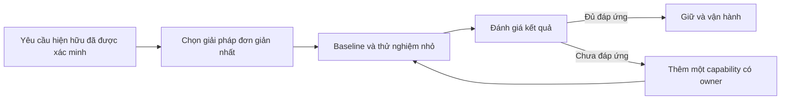

# Over-engineering — Anti-pattern của Microservice

## Mục lục

- [Tổng quan](#tổng-quan)
  - [Over-engineering là gì](#over-engineering-là-gì)
  - [Phạm vi của tài liệu](#phạm-vi-của-tài-liệu)
- [Nhận diện thiết kế quá phức tạp](#nhận-diện-thiết-kế-quá-phức-tạp)
  - [Dấu hiệu ở kiến trúc và code](#dấu-hiệu-ở-kiến-trúc-và-code)
  - [Dấu hiệu ở vận hành](#dấu-hiệu-ở-vận-hành)
  - [Premature abstraction](#premature-abstraction)
  - [Pattern hype](#pattern-hype)
  - [Không kết luận từ một con số](#không-kết-luận-từ-một-con-số)
- [Nguyên nhân và hậu quả](#nguyên-nhân-và-hậu-quả)
  - [Nguyên nhân hình thành](#nguyên-nhân-hình-thành)
  - [Hậu quả đối với delivery và vận hành](#hậu-quả-đối-với-delivery-và-vận-hành)
- [Ví dụ: Email flow của sản phẩm mới](#ví-dụ-email-flow-của-sản-phẩm-mới)
  - [Topology trước remediation](#topology-trước-remediation)
  - [Vấn đề nằm ở đâu](#vấn-đề-nằm-ở-đâu)
  - [Một hướng đơn giản hơn](#một-hướng-đơn-giản-hơn)
  - [Ví dụ premature abstraction](#ví-dụ-premature-abstraction)
- [Remediation theo từng bước](#remediation-theo-từng-bước)
  - [Bước 1 Ghi nhận vấn đề và bằng chứng](#bước-1-ghi-nhận-vấn-đề-và-bằng-chứng)
  - [Bước 2 Chọn mức triển khai nhỏ nhất phù hợp](#bước-2-chọn-mức-triển-khai-nhỏ-nhất-phù-hợp)
  - [Bước 3 Chỉ thêm complexity khi có driver rõ](#bước-3-chỉ-thêm-complexity-khi-có-driver-rõ)
  - [Bước 4 Loại bỏ hoặc gộp thành phần không còn giá trị](#bước-4-loại-bỏ-hoặc-gộp-thành-phần-không-còn-giá-trị)
  - [Bước 5 Thử nghiệm nhỏ và có đường quay lại](#bước-5-thử-nghiệm-nhỏ-và-có-đường-quay-lại)
- [YAGNI và fitness for purpose](#yagni-và-fitness-for-purpose)
  - [YAGNI không phải là bỏ qua yêu cầu](#yagni-không-phải-là-bỏ-qua-yêu-cầu)
  - [Đánh giá fitness for purpose](#đánh-giá-fitness-for-purpose)
  - [Abstraction nên xuất hiện khi nào](#abstraction-nên-xuất-hiện-khi-nào)
- [Trade-off: Đơn giản và khả năng tiến hóa](#trade-off-đơn-giản-và-khả-năng-tiến-hóa)
  - [Bảng trade-off](#bảng-trade-off)
  - [Khi complexity có thể cần thiết](#khi-complexity-có-thể-cần-thiết)
  - [Khi chưa nên thêm complexity](#khi-chưa-nên-thêm-complexity)
- [Vận hành và đánh giá định kỳ](#vận-hành-và-đánh-giá-định-kỳ)
  - [Ownership và golden path tối thiểu](#ownership-và-golden-path-tối-thiểu)
  - [Baseline và tín hiệu cần theo dõi](#baseline-và-tín-hiệu-cần-theo-dõi)
  - [Review component và dọn dẹp](#review-component-và-dọn-dẹp)
  - [Rollout và kiểm chứng](#rollout-và-kiểm-chứng)
- [Checklist](#checklist)
  - [Kiểm tra trước khi thêm pattern hoặc tool](#kiểm-tra-trước-khi-thêm-pattern-hoặc-tool)
  - [Kiểm tra khi vận hành](#kiểm-tra-khi-vận-hành)
  - [Kiểm tra khi remediation](#kiểm-tra-khi-remediation)
- [Tổng kết](#tổng-kết)
- [Liên kết liên quan](#liên-kết-liên-quan)

---

## Tổng quan

### Over-engineering là gì

**Over-engineering** là áp dụng độ phức tạp kiến trúc vượt quá nhu cầu đã được chứng minh và năng lực vận hành hiện tại. Độ phức tạp ở đây không chỉ là số dòng code. Nó còn gồm số process, broker, database, policy, pipeline, dashboard, failure path và abstraction mà team phải hiểu và duy trì.

Ví dụ thường gặp là tách Microservice cho mọi hàm nhỏ, dùng nhiều broker, database, service mesh, CQRS hoặc Event Sourcing khi chưa có use case tương ứng. Xây một platform trước khi có consumer thật cũng là một dạng over-engineering.

Một hệ thống có nhiều service hoặc nhiều tool không tự động là over-engineering. Anti-pattern xuất hiện khi chi phí của topology và cách vận hành lớn hơn giá trị mà nó tạo ra cho yêu cầu hiện hữu.

### Phạm vi của tài liệu

Tài liệu này tập trung vào cách nhận diện thiết kế quá phức tạp, **premature abstraction** (trừu tượng hóa quá sớm) và **pattern hype** (chọn pattern vì xu hướng thay vì vấn đề). Nội dung cũng trình bày nguyên nhân, hậu quả, ví dụ, remediation, YAGNI, **fitness for purpose** (mức phù hợp với mục đích), trade-off và cách vận hành, đánh giá.

Đây không phải decision aid để chọn kiến trúc ở cấp nhóm. Các câu hỏi trong tài liệu chỉ giúp đánh giá một component, pattern hoặc use case cụ thể. Xem [Bản tổng hợp Anti-patterns](../17-anti-patterns.md) khi cần bối cảnh của toàn bộ nhóm anti-pattern.

## Nhận diện thiết kế quá phức tạp

### Dấu hiệu ở kiến trúc và code

Một dấu hiệu đơn lẻ chưa đủ để kết luận. Hãy xem topology cùng business capability, lịch sử thay đổi và yêu cầu thật của hệ thống.

| Dấu hiệu quan sát được | Câu hỏi cần kiểm tra |
|---|---|
| Có nhiều thành phần platform nhưng ít business capability | Mỗi thành phần đang đáp ứng yêu cầu hiện hữu nào? |
| Một service chỉ bọc một thao tác CRUD hoặc một hàm nhỏ | Boundary này có ownership và lý do thay đổi độc lập không? |
| Nhiều broker, database hoặc lớp giao tiếp được thêm từ đầu | Có use case đã xác minh cho từng loại hạ tầng không? |
| CQRS hoặc Event Sourcing xuất hiện trước khi có nhu cầu tương ứng | Hệ thống thật sự cần read/write model khác nhau, audit trail hoặc khả năng replay nào chưa? |
| Service mesh hoặc platform được dựng trước consumer | Consumer nào đang dùng nó, và ai chịu trách nhiệm vận hành? |
| Một thay đổi đơn giản cần sửa nhiều abstraction hoặc configuration | Có thể giữ implementation cụ thể và nhỏ hơn không? |
| Thiết kế được biện minh chủ yếu bằng một quy mô tương lai giả định | Đã có dữ liệu workload hoặc yêu cầu tổ chức chứng minh điều đó chưa? |

Các dấu hiệu này thường cho thấy team đang tối ưu cho một tương lai chưa được xác nhận. Hãy đặt câu hỏi về vấn đề hiện tại trước khi đặt câu hỏi về pattern tiếp theo.

### Dấu hiệu ở vận hành

Chi phí của over-engineering thường lộ rõ hơn trong vận hành so với sơ đồ kiến trúc:

- Team dành phần lớn thời gian quản lý tool thay vì phát triển business capability.
- Local development cần khởi động nhiều dependency dù use case đang làm rất nhỏ.
- CI/CD phải build, scan, deploy và rollback nhiều thành phần cho một thay đổi cục bộ.
- Incident response cần đi qua nhiều dashboard, runbook và failure path hơn giá trị feature mang lại.
- Mỗi component có configuration, permission, backup hoặc alert riêng nhưng không có owner rõ.
- Team ngại thay đổi vì sợ ảnh hưởng tới các thành phần mà họ không hiểu hoặc không thể kiểm thử cục bộ.

Hãy tìm bằng chứng trong thời gian setup local, lịch sử deploy, phạm vi regression, thời gian xử lý incident và effort on-call. Không nên chỉ nhìn số lượng container rồi gắn nhãn anti-pattern.

### Premature abstraction

**Premature abstraction** là tạo một abstraction, framework hoặc extension point trước khi có đủ use case thực tế để biết phần nào thật sự giống nhau. Abstraction khi đó chứa các giả định về tương lai thay vì phản ánh một contract đã ổn định.

Ví dụ, một team có một luồng gửi email nhưng đã tạo generic interface cho mọi channel, plugin router, schema message đa mục đích và hàng chục configuration option. Khi use case thứ hai chưa tồn tại, team vẫn phải đọc và test toàn bộ abstraction đó cho mỗi thay đổi.

Các dấu hiệu thường gặp gồm:

- Generic interface có nhiều method không consumer nào đang dùng.
- Shared library chứa domain model hoặc policy được dự đoán cho nhiều service tương lai.
- Extension point được tạo để "sau này sẽ cần", nhưng chưa có owner hay consumer.
- Một thay đổi cụ thể phải đi qua nhiều adapter, factory hoặc configuration layer không phục vụ yêu cầu hiện tại.

Hậu quả là ý định nghiệp vụ bị che bởi indirection. Một abstraction sai còn có thể buộc các use case sau này đi theo giả định ban đầu. Remediation thường là giữ implementation cụ thể ở nơi đang có nhu cầu, rồi chỉ trích xuất abstraction khi các consumer thật sự có phần behavior ổn định cần dùng chung.

### Pattern hype

**Pattern hype** là chọn một pattern hoặc công nghệ vì nó phổ biến, mới hoặc xuất hiện trong kiến trúc của một công ty lớn, thay vì bắt đầu từ một vấn đề đã đo được. Pattern không xấu tự thân. Cách áp dụng không gắn với use case mới tạo ra anti-pattern.

| Lựa chọn bị áp dụng theo phong trào | Chi phí có thể phát sinh khi chưa có nhu cầu |
|---|---|
| Nhiều broker hoặc event pipeline | Thêm schema, retry, idempotency, monitoring và failure path |
| Service mesh | Thêm lớp network và cách debug, trong khi traffic hoặc policy chưa đòi hỏi |
| CQRS hoặc Event Sourcing | Thêm model, code path và hạ tầng mà CRUD hiện tại chưa cần |
| Platform nội bộ | Phải xây, vận hành và hỗ trợ platform trước khi có consumer thật |
| Tách Microservice cho từng hàm nhỏ | Tăng network, CI/CD, observability, security, backup và on-call |

Câu hỏi đúng không phải là "pattern này có hiện đại không?" mà là "yêu cầu nào hiện hữu buộc phải trả chi phí của pattern này?".

### Không kết luận từ một con số

Không có ngưỡng cố định về số service, số endpoint, số container hoặc số network hop để kết luận over-engineering. Bốn service có thể hợp lý nếu chúng có business capability, ownership và yêu cầu scale hoặc failure isolation khác nhau. Ngược lại, một service duy nhất cũng có thể đi kèm platform và abstraction quá phức tạp.

Hãy đánh giá đồng thời ba yếu tố:

1. **Nhu cầu:** complexity đang giải quyết yêu cầu business, reliability, security hoặc compliance nào?
2. **Bằng chứng:** yêu cầu đó đã xuất hiện trong workload, incident, ownership hoặc contract thực tế chưa?
3. **Năng lực vận hành:** team có thể build, monitor, secure, backup, rollback và on-call cho complexity đó không?

Kết luận thực dụng là: đánh giá hành vi thay đổi và vận hành của hệ thống, không đánh giá kiến trúc chỉ bằng một con số.

## Nguyên nhân và hậu quả

### Nguyên nhân hình thành

| Nguyên nhân | Cách nó tạo ra Over-engineering |
|---|---|
| Bắt chước kiến trúc của công ty lớn | Team nhận cả platform và pattern phục vụ quy mô, tổ chức hoặc compliance không giống mình |
| Dự đoán scale không có dữ liệu | Complexity được trả trước cho traffic hoặc workload chưa xuất hiện |
| Tách service trước khi hiểu domain | Boundary kỹ thuật thay thế cho business capability và ownership chưa rõ |
| Chọn công nghệ vì mới | Tool hoặc pattern trở thành mục tiêu thay vì phương tiện giải quyết vấn đề |
| Thiếu ownership hoặc platform maturity | Component được thêm vào nhưng không có người vận hành end-to-end |
| Lo sợ bỏ sót nhu cầu tương lai | Premature abstraction và extension point làm code khó hiểu ngay từ use case đầu tiên |

Các nguyên nhân này thường bắt đầu từ một ý định hợp lý như muốn chuẩn bị cho scale hoặc tránh rewrite. Vấn đề là giả định chưa được kiểm chứng lại trở thành complexity lâu dài.

### Hậu quả đối với delivery và vận hành

| Hậu quả | Cách nó xuất hiện |
|---|---|
| **Cognitive load tăng** | Developer phải hiểu thêm topology, protocol, configuration và failure mode trước khi sửa một feature |
| **CI/CD phức tạp** | Một thay đổi cần nhiều pipeline, artifact, dependency hoặc coordinated rollout |
| **Observability và security tốn công hơn** | Mỗi service hoặc tool cần log, metric, trace, policy và quyền truy cập riêng |
| **Backup và on-call mở rộng** | Nhiều data store, broker và component cần runbook, backup và người trực riêng |
| **Delivery chậm** | Thời gian vận hành hạ tầng lấn át thời gian tạo business value |
| **Bề mặt lỗi rộng hơn** | Nhiều process và dependency tạo thêm điểm failure, timeout hoặc cấu hình sai |
| **Khó tuyển và đào tạo** | Người mới phải học stack lớn trước khi hiểu capability mà họ phụ trách |
| **Team né thay đổi** | Complexity và blast radius làm mọi thay đổi trở nên đáng sợ hơn |

Over-engineering vì thế không chỉ là vấn đề thẩm mỹ của sơ đồ. Nó làm giảm tốc độ giao hàng và làm tăng chi phí để biết hệ thống đang hoạt động đúng hay không.

## Ví dụ: Email flow của sản phẩm mới

### Topology trước remediation

**Ví dụ giả định:** một sản phẩm mới do một team nhỏ phát triển. Team tách `Email Validation`, `Email Formatting`, `Email Sending` và `Email Logging` thành bốn service. Team cũng thêm Kafka, service mesh và nhiều database trước khi có dữ liệu chứng minh cần scale hoặc isolation riêng.

```text
❌ Nhiều boundary kỹ thuật cho một capability chưa cần phân tán

  Feature gửi email
         │
         ▼
  [Email Validation] ── Kafka ──> [Email Formatting]
                                      │
                                      └── Kafka ──> [Email Sending]
                                                       │
                                                       └── Kafka ──> [Email Logging]

  Mỗi service còn có pipeline, dashboard, policy và database riêng.
  Service mesh phủ lên các service dù chưa có nhu cầu network tương ứng.
```

Mỗi service trong ví dụ có thể chạy được. Nhưng một thay đổi ở email flow nay liên quan đến nhiều deployment, contract, dashboard và failure path. Team phải vận hành các thành phần đó trước khi business capability tạo ra nhu cầu tương ứng.

### Vấn đề nằm ở đâu

- Bốn boundary được tạo theo các bước kỹ thuật của một flow, chưa phải theo business capability có ownership độc lập.
- Kafka tạo thêm event contract, retry và cách xử lý failure dù chưa có yêu cầu async đã được chứng minh.
- Service mesh tạo thêm lớp vận hành và debug trong khi traffic, network policy hoặc số lượng service chưa buộc phải có nó.
- Nhiều database làm tăng backup, security và migration effort khi data boundary chưa cần tách.

Vấn đề không phải là bốn service luôn sai. Nếu `Email Sending` cần scale khác, cần cô lập failure hoặc thuộc một team owner khác, việc tách phần đó có thể có lý do. Trong ví dụ này, driver chưa được xác minh nên chi phí hiện tại vượt quá giá trị.

### Một hướng đơn giản hơn

Bắt đầu với một service hoặc **modular monolith** có boundary nội bộ rõ ràng:

```text
✅ Giữ một capability trong mức triển khai phù hợp

  Email Capability
  ├── validation
  ├── formatting
  ├── sending
  └── logging

  Một deployment unit và một pipeline đơn giản hơn.
  Thêm queue hoặc tách service sau khi có driver được đo.
```

Cách này không có nghĩa bỏ qua reliability, security hoặc health signal. Team vẫn cần một golden path tối thiểu gồm logging, health check, pipeline và secret management phù hợp.

Khi có bằng chứng rằng `Email Sending` cần scale hoặc failure isolation riêng, team có thể tách riêng capability đó. Khi đó, hãy tạo contract, owner, telemetry và đường rollback cho slice mới thay vì phân tán toàn bộ flow ngay từ đầu.

### Ví dụ premature abstraction

Một biến thể khác là xây `NotificationPlatform` ngay khi chỉ có một consumer email:

```text
❌ Platform trước consumer

  NotificationPlatform
  ├── generic message schema
  ├── plugin router cho email, SMS, push
  ├── adapter cho nhiều broker
  ├── policy engine cho mọi retry strategy
  └── hàng loạt configuration option

  Consumer hiện tại: chỉ gửi email.
```

Platform này có thể trông như một khoản đầu tư cho tương lai. Nhưng team phải duy trì contract và behavior cho các variation chưa tồn tại. Nếu giả định ban đầu sai, việc sửa platform có thể khó hơn việc sửa một email flow cụ thể.

Remediation là giữ email flow cụ thể và ghi lại nhu cầu có thể khiến platform đáng giá. Chỉ trích xuất phần dùng chung khi có consumer thật, behavior ổn định, owner rõ và chi phí hỗ trợ đã được chấp nhận.

## Remediation theo từng bước

### Bước 1 Ghi nhận vấn đề và bằng chứng

Tạo một **decision record** cho component hoặc pattern đang được cân nhắc. Record nên trả lời:

- Vấn đề hiện tại là gì, và use case nào đang chịu ảnh hưởng?
- Yêu cầu nào đã được xác minh bằng workload, incident, ownership hoặc policy?
- Lựa chọn đơn giản nhất có thể đáp ứng yêu cầu đó là gì?
- Complexity dự kiến tạo ra lợi ích nào?
- Chi phí vận hành gồm component, CI/CD, observability, security, backup và on-call là bao nhiêu effort?
- Ai là owner của component, và tín hiệu nào sẽ cho biết cần nâng cấp tiếp?

Không cần dự đoán chính xác toàn bộ tương lai. Cần làm rõ giả định hiện tại và cách kiểm chứng chúng. Một record tốt cũng nêu phương án không thêm pattern để team không mặc định chọn topology phức tạp.

### Bước 2 Chọn mức triển khai nhỏ nhất phù hợp

Khi domain, team và traffic chưa chứng minh cần phân tán, hãy bắt đầu bằng modular monolith hoặc một service theo business capability. Module nội bộ vẫn cần boundary, ownership và contract rõ để có đường tiến hóa sau này.

Lựa chọn nhỏ hơn không đồng nghĩa với bỏ qua yêu cầu bắt buộc. Nếu hệ thống cần secret management, health check, backup hoặc access control, các yêu cầu đó vẫn phải được đáp ứng. Điều cần tránh là thêm nhiều lớp hạ tầng nâng cao khi một cách triển khai đơn giản hơn đã đáp ứng cùng yêu cầu.

### Bước 3 Chỉ thêm complexity khi có driver rõ

Một component hoặc pattern có thể đáng giá khi có driver hiện hữu như:

- **Independent ownership hoặc deployment:** capability đã có team owner và cần thay đổi, release độc lập.
- **Scaling khác nhau:** workload của một capability cần scale riêng và việc scale cả deployment hiện tại tạo chi phí hoặc giới hạn rõ.
- **Failure isolation:** lỗi ở capability này cần được cô lập khỏi capability khác trong phạm vi business cho phép.
- **Boundary domain ổn định:** model và data ownership đủ rõ để đặt contract giữa các phần.
- **Compliance hoặc policy bắt buộc:** yêu cầu tổ chức hoặc pháp lý cần một control cụ thể, kể cả khi hệ thống còn nhỏ.

Mỗi driver cần một owner và tiêu chí thành công. Không nên biến các driver này thành lý do chung chung để thêm mọi pattern cùng lúc. Thêm từng capability cần thiết và đo lại sau mỗi thay đổi.

### Bước 4 Loại bỏ hoặc gộp thành phần không còn giá trị

Lập inventory cho service, broker, database, abstraction và tool hiện có. Với mỗi thành phần, ghi consumer, owner, use case, chi phí vận hành và tín hiệu thành công.

Nếu một component không còn consumer hoặc không tạo giá trị đã xác định, hãy lập kế hoạch deprecate và xóa nó. Nếu nhiều nano-service không có ownership hoặc scaling khác biệt, có thể gộp chúng về một service hoặc modular monolith. Nếu nhiều tool giải quyết cùng một concern, giảm tool trùng lặp để hạ cognitive load.

Không xóa trực tiếp một đường đang có consumer. Theo dõi usage, chuyển consumer, kiểm tra behavior và chỉ dọn path cũ khi có bằng chứng an toàn.

### Bước 5 Thử nghiệm nhỏ và có đường quay lại

Remediation cũng cần được triển khai theo phase:

1. Chọn một slice có business value và rủi ro kiểm soát được.
2. Ghi baseline về delivery, latency, error, resource và effort vận hành phù hợp với vấn đề.
3. Thử phương án đơn giản hơn hoặc thêm một component duy nhất cho slice đó.
4. Giữ đường cũ trong giai đoạn chuyển tiếp khi cần; chuẩn bị rollback cho code, traffic và configuration.
5. So sánh kết quả với baseline, gồm cả failure mode và trải nghiệm local development.
6. Chỉ deprecate, gộp hoặc xóa thành phần cũ sau khi usage và behavior đã được xác nhận.



Mục tiêu của remediation không phải là làm topology nhỏ bằng mọi giá. Mục tiêu là giảm complexity không cần thiết mà vẫn giữ khả năng đáp ứng yêu cầu đã xác minh.

## YAGNI và fitness for purpose

### YAGNI không phải là bỏ qua yêu cầu

**YAGNI** là viết tắt của *You Aren't Gonna Need It*: không xây một capability chỉ vì có thể sẽ cần trong tương lai khi chưa có bằng chứng hoặc consumer thật.

YAGNI không có nghĩa là bỏ qua security, reliability, backup hoặc compliance. Các yêu cầu đó phải được đáp ứng ngay khi chúng là yêu cầu hiện hữu. YAGNI chỉ nhắc team không trả trước chi phí cho một pattern, abstraction hoặc platform chưa có use case.

Ví dụ, một team không cần thêm Kafka chỉ vì dự đoán sẽ có nhiều email trong tương lai. Team có thể bắt đầu với flow đơn giản hơn, ghi lại tín hiệu scale hoặc async sẽ buộc phải thay đổi, rồi nâng cấp khi tín hiệu đó xuất hiện.

### Đánh giá fitness for purpose

**Fitness for purpose** là mức một giải pháp đáp ứng đúng mục đích của nó trong bối cảnh hiện tại. Một lựa chọn fit phải đáp ứng business requirement và các ràng buộc đã xác minh, đồng thời nằm trong năng lực vận hành của team.

| Câu hỏi đánh giá | Bằng chứng nên xem |
|---|---|
| Có cần scale một capability độc lập không? | Workload, resource profile và xu hướng tăng trưởng thực tế |
| Có cần failure isolation không? | Failure mode, incident impact và yêu cầu phục vụ từng capability |
| Có cần independent deployment hoặc ownership không? | Lịch sử thay đổi, release coupling và team chịu trách nhiệm |
| Có consumer thật cho platform hoặc abstraction không? | Traffic, subscription, source usage và owner đã xác nhận |
| Pattern có đáp ứng requirement riêng như audit, replay hoặc read/write khác nhau không? | Use case và policy cụ thể, không phải sơ đồ tham khảo |
| Team có thể vận hành complexity không? | Local setup, pipeline, dashboard, runbook, backup và on-call |

Không có lựa chọn nào fit chỉ vì nó phổ biến. Cũng không có lựa chọn nào fit chỉ vì nó nhỏ. Kết luận cần trả lời được cả giá trị cần đạt và chi phí để vận hành giải pháp.

### Abstraction nên xuất hiện khi nào

Abstraction nên xuất hiện khi team đã có behavior hoặc contract đủ ổn định để chia sẻ một cách có chủ đích. Trước khi trích xuất, hãy kiểm tra:

- Có ít nhất một use case cụ thể đang cần abstraction đó.
- Các consumer thật sự có behavior chung, không chỉ có tên gọi giống nhau.
- Có owner chịu trách nhiệm cho contract, compatibility và lifecycle.
- Chi phí phụ thuộc vào abstraction thấp hơn chi phí giữ các implementation cụ thể.
- Có cách kiểm thử, rollout và loại bỏ abstraction nếu giả định ban đầu không đúng.

Đừng tạo abstraction để tránh mọi duplication giả định. Một implementation cụ thể, dễ đọc và dễ thay đổi có thể fit hơn một framework tổng quát chưa có consumer.

## Trade-off: Đơn giản và khả năng tiến hóa

### Bảng trade-off

| Lựa chọn | Lợi ích | Chi phí hoặc giới hạn |
|---|---|---|
| **Một service hoặc modular monolith** | Ít network path, pipeline và dependency runtime; local development đơn giản hơn | Ít khả năng scale, deploy hoặc cô lập failure độc lập nếu boundary sau này cần tách |
| **Nhiều Microservice** | Có thể tách ownership, deployment, scaling và failure isolation theo capability | Tăng cognitive load, CI/CD, observability, security, backup, on-call và contract |
| **Broker hoặc event-driven flow** | Phù hợp với công việc không cần kết quả ngay và có thể giảm temporal coupling | Thêm event contract, eventual consistency, retry, idempotency, tracing và vận hành broker |
| **Service mesh** | Có thể chuẩn hóa network concern khi quy mô, polyglot hoặc policy thực sự đòi hỏi | Thêm lớp runtime và operational overhead; không cần thiết cho mọi topology |
| **CQRS hoặc Event Sourcing** | Có thể phù hợp khi use case thật sự cần read/write model khác nhau, audit trail hoặc khả năng replay | Tăng code path, model, storage và cách vận hành; không phù hợp làm default cho CRUD đơn giản |
| **Internal platform** | Có thể chuẩn hóa golden path cho nhiều consumer thật | Có chi phí xây dựng và hỗ trợ; xây trước consumer sẽ tạo platform chưa có giá trị chứng minh |

Không có trade-off nào biến complexity thành miễn phí. Khi thêm một pattern, hãy ghi nhận cả lợi ích mong đợi và các trách nhiệm vận hành mới.

### Khi complexity có thể cần thiết

Complexity có thể là lựa chọn đúng khi nó đáp ứng một driver đã được xác minh, chẳng hạn:

- Nhiều team cần ownership và independent deployment cho các capability có lý do thay đổi khác nhau.
- Workload hoặc failure domain khác nhau đến mức một deployment chung không còn phù hợp.
- Boundary domain và data ownership đã đủ ổn định để giao tiếp qua contract.
- Compliance hoặc security policy yêu cầu control mà cách đơn giản hơn không đáp ứng.
- Một use case hiện hữu cần asynchronous processing, audit trail, replay hoặc read/write path khác nhau.

Ngay cả khi complexity cần thiết, team vẫn phải xác định owner, consumer, chi phí, tiêu chí thành công và đường tiến hóa. Có compliance requirement không đồng nghĩa phải thêm mọi platform; chỉ thêm control cần thiết cho requirement đó.

### Khi chưa nên thêm complexity

Chưa nên thêm pattern hoặc tool khi:

- Chưa có use case, consumer hoặc failure mode thực tế cần nó.
- Lý do chính là dự đoán scale nhưng chưa có workload data.
- Boundary và data ownership còn mơ hồ.
- Team chưa có khả năng vận hành component, backup, security và on-call tương ứng.
- Một service hoặc modular monolith vẫn đáp ứng yêu cầu hiện tại với chi phí thấp hơn.
- Pattern chỉ được chọn vì công nghệ mới hoặc vì kiến trúc của một công ty khác.

Trong các trường hợp này, hãy giữ một đường triển khai cụ thể, dễ quan sát và có thể mở rộng sau. Đừng nhầm "có thể mở rộng" với việc phải xây toàn bộ extension point ngay từ ngày đầu.

## Vận hành và đánh giá định kỳ

### Ownership và golden path tối thiểu

Mỗi pattern hoặc tool được giữ lại cần có use case, owner vận hành, chi phí và tiêu chí thành công được ghi lại. Owner không chỉ chịu trách nhiệm code. Họ còn phải chịu trách nhiệm cho deploy, monitoring, security, backup, runbook và on-call trong phạm vi component.

Trước khi nhân số service hoặc pattern nâng cao, hãy chuẩn hóa **golden path tối thiểu** (đường triển khai chuẩn có ít lựa chọn nhưng đủ an toàn): logging, health check, pipeline và secret management phù hợp. Đây là nền tảng vận hành, không phải lý do để dựng thêm platform không có consumer.

Đơn giản không đồng nghĩa với bỏ qua reliability hoặc security. Đơn giản là chọn mức complexity nhỏ nhất vẫn đáp ứng các yêu cầu đó và có đường tiến hóa khi bằng chứng thay đổi.

### Baseline và tín hiệu cần theo dõi

Đánh giá over-engineering bằng cách so sánh trước và sau một thay đổi. Không đặt một ngưỡng chung cho mọi team hoặc workload.

| Tín hiệu | Cách quan sát | Điều cần biết |
|---|---|---|
| Delivery | Lead time, phạm vi release và số bước phối hợp | Complexity có làm thay đổi chậm hơn không |
| Vận hành tool | Thời gian setup, nâng cấp, xử lý alert và bảo trì | Team đang trả bao nhiêu effort cho component |
| Local development | Số dependency bắt buộc và thời gian chạy một use case | Developer có thể kiểm thử phần việc mà không dựng cả platform không |
| Incident response | Số failure path, dashboard, runbook và phạm vi ảnh hưởng | Complexity có làm chẩn đoán hoặc cô lập lỗi khó hơn không |
| Sử dụng component | Consumer thật, traffic, subscription và owner | Component có còn giá trị hoặc đã là platform không người dùng |
| Tài nguyên | CPU, memory, connection, storage hoặc broker load phù hợp | Hạ tầng thêm vào có giải quyết workload thật không |
| Thay đổi | Phần code, service và team bị kéo vào một feature | Boundary và ownership có tạo autonomy thực tế không |

Một tín hiệu xấu không tự chứng minh over-engineering. Hãy ghép các tín hiệu với yêu cầu business và lịch sử thay đổi để tìm nguyên nhân.

### Review component và dọn dẹp

Đặt lịch review component theo một khoảng thời gian phù hợp với vòng đời sản phẩm. Mỗi lần review, cập nhật:

- consumer và use case còn hoạt động;
- owner và trạng thái support;
- chi phí CI/CD, observability, security, backup và on-call;
- tiêu chí thành công đã đạt hay chưa;
- đường deprecate, gộp hoặc xóa nếu component không còn cần thiết.

Nếu tool không có consumer hoặc không đáp ứng tiêu chí thành công, hãy xem xét loại bỏ. Nếu nhiều component trùng vai trò, gộp hoặc chuẩn hóa để giảm operational surface. Việc dọn dẹp là một phần của architecture lifecycle, không phải thất bại của quyết định ban đầu.

### Rollout và kiểm chứng

Khi thêm hoặc bớt complexity, nên:

1. Chọn một use case hoặc component có owner rõ.
2. Giữ baseline và safety net phù hợp với dữ liệu, contract và runtime.
3. Rollout theo phase hoặc thử nghiệm nhỏ khi hạ tầng hỗ trợ.
4. Theo dõi delivery, error, latency, resource, incident và effort vận hành.
5. Kiểm tra cả local development và rollback, không chỉ happy path.
6. Ghi lại kết quả vào decision record rồi mới mở rộng hoặc dọn path cũ.

Remediation chỉ có giá trị khi giảm được pain đã đo mà không chuyển nó thành coupling hoặc failure path khó quan sát hơn. Nếu complexity mới không tạo ra lợi ích chứng minh được, hãy quay lại phương án đơn giản hơn.

## Checklist

### Kiểm tra trước khi thêm pattern hoặc tool

- [ ] Có một use case hoặc requirement hiện hữu được mô tả cụ thể.
- [ ] Đã có bằng chứng từ workload, incident, ownership, contract hoặc compliance.
- [ ] Lựa chọn đơn giản hơn đã được xem xét.
- [ ] Consumer, owner và lifecycle của component đã được xác định.
- [ ] Chi phí CI/CD, observability, security, backup và on-call đã được ghi nhận.
- [ ] Tiêu chí thành công và tín hiệu buộc phải nâng cấp tiếp đã được ghi lại.

### Kiểm tra khi vận hành

- [ ] Mỗi service, broker, database, platform và abstraction có owner vận hành rõ.
- [ ] Local development không cần dựng thêm dependency ngoài use case nếu không có lý do.
- [ ] Logging, health check, pipeline và secret management tối thiểu đã có.
- [ ] Dashboard, alert, runbook, backup và rollback phù hợp với component.
- [ ] Delivery, effort vận hành, incident response và resource usage được theo dõi theo thời gian.
- [ ] Consumer và usage thật của platform hoặc tool được kiểm tra định kỳ.

### Kiểm tra khi remediation

- [ ] Đã chọn một slice có business value và rủi ro kiểm soát được.
- [ ] Có baseline trước thay đổi và safety net cho code, traffic, data hoặc configuration khi cần.
- [ ] Đã thử phương án đơn giản hơn trước khi thêm pattern mới.
- [ ] Component không còn consumer được deprecate, gộp hoặc xóa có kiểm soát.
- [ ] Kết quả sau thay đổi được so sánh với baseline, gồm cả failure mode.
- [ ] Technical debt còn lại có owner, tiêu chí rà soát và thời hạn phù hợp.

## Tổng kết

Over-engineering không được nhận diện bằng số lượng service hay tool. Nó xuất hiện khi complexity vượt quá nhu cầu đã được chứng minh và năng lực vận hành hiện tại.

Hãy bắt đầu từ business capability, chọn mức triển khai nhỏ nhất vẫn đáp ứng reliability, security và các yêu cầu bắt buộc, rồi tăng complexity theo bằng chứng. Một hệ thống ít service nhưng có boundary tốt thường đáng tin cậy hơn một topology nhiều pattern mà không có use case tương ứng.

## Liên kết liên quan

- [Bản tổng hợp Anti-patterns](../17-anti-patterns.md) — bản đồ anti-pattern và decision aid ở cấp nhóm; tài liệu này không lặp lại phần đó.
- [Mega Service](./mega-service.md) — phân biệt service lớn hợp lý với boundary gộp sai nhiều capability.
- [Chatty Services](./chatty-services.md) — chi phí của service boundary quá nhỏ và nhiều network round-trip.
- [Distributed Monolith](./distributed-monolith.md) — coupling còn sót lại sau khi tách process hoặc service.
- [02 — Single Responsibility & Bounded Context](../02-single-responsibility-bounded-context.md) — xác định business boundary trước khi tách service.
- [05 — Decomposition Strategies](../05-decomposition-strategies.md) — chọn cách phân tách và lộ trình tiến hóa.
- [06 — Inter-Service Communication](../06-inter-service-communication.md) — cân nhắc synchronous, asynchronous và event communication.
- [09 — Data Management](../09-data-management.md) — trade-off của database, CQRS, Event Sourcing và consistency.
- [10 — Resilience Patterns](../10-resilience-patterns.md) — reliability và failure handling cần giữ ngay cả khi chọn kiến trúc đơn giản.
- [11 — Observability & Evolvability](../11-observability-evolvability.md) — đo vận hành và tiến hóa hệ thống.
- [17 — Design Patterns](../17-design-patterns.md) — các pattern bổ trợ và cảnh báo về việc thêm pattern quá sớm.
- [CQRS Pattern](../17-data-patterns/cqrs.md) và [Event Sourcing Pattern](../17-data-patterns/event-sourcing.md) — use case và chi phí của các pattern nâng cao.
- [Service Mesh Pattern](../17-communication-patterns/service-mesh.md) — bối cảnh nên cân nhắc service mesh thay vì dùng mặc định.
