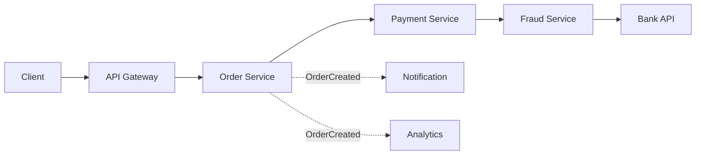
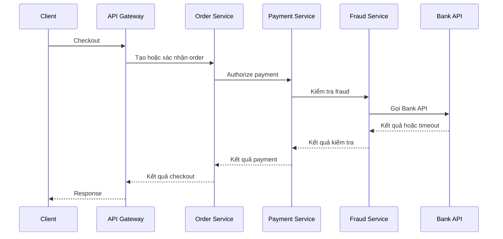
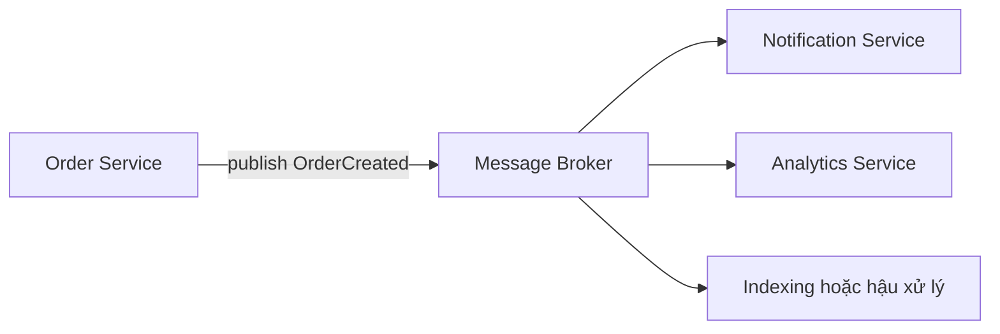
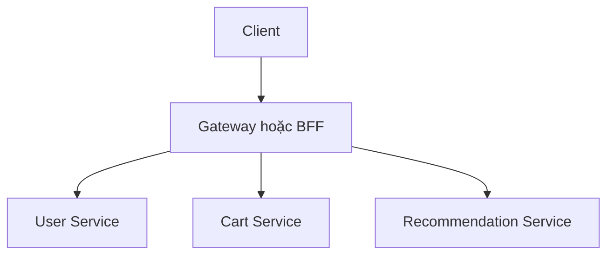

# Sync Chain / Death Star Architecture — Anti-pattern trong Microservice

## Mục lục

- [Tổng quan](#tổng-quan)
  - [Sync Chain là gì](#sync-chain-là-gì)
  - [Death Star Architecture là gì](#death-star-architecture-là-gì)
  - [Dependency graph và critical path](#dependency-graph-và-critical-path)
- [Tác động của anti-pattern](#tác-động-của-anti-pattern)
  - [Latency chồng dồn](#latency-chồng-dồn)
  - [Availability và temporal coupling](#availability-và-temporal-coupling)
  - [Cascading failure và cạn kiệt tài nguyên](#cascading-failure-và-cạn-kiệt-tài-nguyên)
  - [Bottleneck và blast radius](#bottleneck-và-blast-radius)
- [Dấu hiệu nguyên nhân và hậu quả](#dấu-hiệu-nguyên-nhân-và-hậu-quả)
  - [Dấu hiệu](#dấu-hiệu)
  - [Nguyên nhân](#nguyên-nhân)
  - [Hậu quả](#hậu-quả)
  - [Phân biệt với synchronous call hợp lý](#phân-biệt-với-synchronous-call-hợp-lý)
- [Ví dụ checkout](#ví-dụ-checkout)
  - [Luồng đồng bộ](#luồng-đồng-bộ)
  - [Khi downstream chậm hoặc unavailable](#khi-downstream-chậm-hoặc-unavailable)
  - [Phần không cần nằm trên critical path](#phần-không-cần-nằm-trên-critical-path)
- [Remediation](#remediation)
  - [Phân loại dependency trước khi thay đổi](#phân-loại-dependency-trước-khi-thay-đổi)
  - [Chuyển side effect sang async hoặc event](#chuyển-side-effect-sang-async-hoặc-event)
  - [Dùng aggregation cho read path](#dùng-aggregation-cho-read-path)
  - [Giữ call bắt buộc với timeout và Circuit Breaker](#giữ-call-bắt-buộc-với-timeout-và-circuit-breaker)
  - [Giữ workflow ở boundary có ownership](#giữ-workflow-ở-boundary-có-ownership)
  - [Migration từng bước](#migration-từng-bước)
- [Trade-offs](#trade-offs)
  - [Bảng đánh đổi](#bảng-đánh-đổi)
  - [Không dùng async hoặc aggregation máy móc](#không-dùng-async-hoặc-aggregation-máy-móc)
- [Khi nào cần tránh](#khi-nào-cần-tránh)
  - [Tránh tạo Death Star ở Gateway](#tránh-tạo-death-star-ở-gateway)
  - [Khi synchronous là lựa chọn hợp lý](#khi-synchronous-là-lựa-chọn-hợp-lý)
  - [Khi chưa nên phân tán thêm](#khi-chưa-nên-phân-tán-thêm)
- [Vận hành](#vận-hành)
  - [Observability của dependency graph](#observability-của-dependency-graph)
  - [Timeout và deadline budget](#timeout-và-deadline-budget)
  - [Circuit Breaker retry và fallback](#circuit-breaker-retry-và-fallback)
  - [Kiểm thử và rollout](#kiểm-thử-và-rollout)
  - [Runbook khi downstream chậm](#runbook-khi-downstream-chậm)
- [Checklist](#checklist)
- [Liên kết liên quan](#liên-kết-liên-quan)

---

## Tổng quan

### Sync Chain là gì

**Sync Chain** là chuỗi request đồng bộ `A → B → C → …`. Caller (service gọi) phải chờ downstream (service được gọi) trả kết quả ở từng bước trước khi tiếp tục. Mỗi network hop thêm latency và thêm một dependency có thể lỗi.

Một synchronous call không tự động là anti-pattern. Vấn đề xuất hiện khi synchronous trở thành mặc định cho mọi bước, khiến một use case có đường chờ sâu và nhiều service phải cùng khỏe để trả một response.

> Không có một ngưỡng cố định về số hop hoặc latency để kết luận mọi hệ thống đều mắc Sync Chain. Cần nhìn vào critical path, yêu cầu business, failure propagation và dữ liệu vận hành thực tế.

### Death Star Architecture là gì

**Death Star Architecture** là dạng cực đoan của Sync Chain. Một service hoặc Gateway trung tâm điều phối quá nhiều service bằng các call đồng bộ. Nó trở thành bottleneck (điểm nghẽn), điểm lỗi tập trung và nơi chứa business workflow của nhiều domain.

Tên gọi này mô tả topology có một trung tâm với rất nhiều đường phụ thuộc đi vào hoặc đi ra. Không phải cứ có một Gateway hay một orchestrator là Death Star. Anti-pattern xuất hiện khi trung tâm đó biết quá nhiều domain, phải gọi quá nhiều downstream và không còn giữ được vai trò edge hoặc workflow có ownership rõ ràng.

### Dependency graph và critical path

Một **dependency graph** là đồ thị thể hiện service nào phụ thuộc service nào. Trong graph, đường đi nối tiếp là phần caller phải chờ; các dependency tùy chọn có thể được đưa ra ngoài critical path.



Trong ví dụ trên, `Client → Gateway → Order → Payment → Fraud → Bank` là một synchronous chain. `Notification` và `Analytics` nhận `OrderCreated` theo hướng bất đồng bộ nên không nhất thiết nằm trên critical path của response checkout.

Có hai hình dạng cần phân biệt:

| Hình dạng dependency | Điều xảy ra | Rủi ro chính |
|---|---|---|
| **Nối tiếp** `A → B → C` | A chờ B, rồi B chờ C | Latency chồng dồn, temporal coupling và failure lan truyền |
| **Fan-out song song** `A → B`, `A → C` | A gọi nhiều dependency độc lập cùng lúc | Critical path bị chi phối bởi dependency chậm nhất; fan-out vẫn tiêu tốn resource |
| **Trung tâm kiểu Death Star** | Gateway hoặc service trung tâm gọi nhiều domain và chứa workflow | Bottleneck, blast radius lớn và coupling tập trung |

Số dependency ít không bảo đảm chain an toàn. Một dependency duy nhất nhưng không ổn định vẫn có thể giữ tài nguyên của caller. Ngược lại, nhiều call độc lập có thể phù hợp nếu chúng được aggregation đúng boundary, có timeout riêng và có chính sách partial failure rõ ràng.

## Tác động của anti-pattern

### Latency chồng dồn

Mỗi hop đồng bộ có thời gian truyền request, serialization hoặc deserialization và xử lý ở downstream. Với các bước nối tiếp, thời gian chờ của từng bước cộng vào thời gian của request ngoài cùng. Khi thêm service vào chain, latency end-to-end và biến thiên latency thường tăng theo.

Nếu các call chạy song song, latency không cộng toàn bộ như chain nối tiếp. Tuy vậy, response vẫn phải chờ dependency chậm nhất trong nhóm bắt buộc. Fan-out cũng tạo thêm connection, CPU và các điểm timeout.

```text
Request deadline của client
  └─ Gateway
       └─ Order Service
            └─ Payment Service
                 └─ Fraud Service
                      └─ Bank API

Mỗi tầng chỉ còn phần budget còn lại của request gốc.
```

Không nên chọn timeout riêng cho từng tầng rồi giả định tổng thời gian vẫn nằm trong SLA. Một lần retry hoặc một khoảng backoff cũng tiêu vào budget của request ngoài cùng.

### Availability và temporal coupling

**Temporal coupling** là coupling về thời gian: caller và callee phải cùng online, reachable và phản hồi trong khoảng thời gian caller chấp nhận. Trong một chain, các bước bắt buộc làm cho nhiều service phải khỏe đồng thời để caller trả kết quả.

Ví dụ, Order Service có thể không có lỗi nhưng vẫn không hoàn thành checkout khi Payment hoặc Fraud Service unavailable. Availability của flow vì thế bị giới hạn bởi từng dependency bắt buộc trên critical path. Một service phụ như Recommendation hoặc Notification không nhất thiết phải có cùng yêu cầu; đưa nó vào chain sẽ mở rộng phạm vi ảnh hưởng không cần thiết.

### Cascading failure và cạn kiệt tài nguyên

**Cascading failure** là lỗi lan truyền dây chuyền từ một dependency sang các caller và chức năng khác. Khi downstream chậm hoặc không trả response, upstream tiếp tục giữ thread, connection hoặc slot xử lý trong thời gian chờ. Nhiều request như vậy có thể làm pool cạn kiệt và khiến upstream cũng không nhận được request mới.

```text
Payment hoặc Fraud Service chậm
        │
        ├── Order Service giữ connection và thread lâu hơn
        ├── Request mới xếp hàng hoặc chờ pool
        ├── Retry ở nhiều tầng tạo thêm request
        └── Tài nguyên caller cạn kiệt → lỗi lan sang flow khác
```

Retry không có giới hạn làm failure nặng hơn. Nếu Gateway, Order và Payment đều tự retry mà không có budget chung, một request logic có thể tạo nhiều request vật lý tới dependency đã quá tải. Đây là **retry storm** (bão retry), không phải cơ chế phục hồi an toàn.

### Bottleneck và blast radius

Khi Gateway hoặc một service trung tâm chứa logic của nhiều domain, mọi request và thay đổi đều đi qua nó. Một bottleneck ở trung tâm làm nhiều capability chậm cùng lúc. Một incident ở trung tâm có blast radius lớn hơn phạm vi của một domain riêng lẻ.

Death Star còn làm giảm khả năng release độc lập. Thêm một bước workflow có thể buộc sửa và deploy trung tâm. Thay đổi ở một downstream có thể cần coordinated release nếu trung tâm không có contract tương thích. Hệ thống khi đó gánh chi phí network và vận hành của distributed system nhưng vẫn phụ thuộc tập trung như một monolith.

## Dấu hiệu nguyên nhân và hậu quả

### Dấu hiệu

Các dấu hiệu dưới đây nên được xem cùng nhau. Một call đồng bộ đơn lẻ chưa đủ để kết luận anti-pattern:

| Dấu hiệu quan sát được | Điều cần kiểm tra |
|---|---|
| Trace của một use case có path sâu qua nhiều service | Hop nào thật sự cần kết quả để quyết định bước tiếp theo? |
| Latency end-to-end tăng mỗi khi thêm service | Thời gian nằm ở downstream nào, queue nào hoặc network hop nào? |
| Downstream chậm làm upstream giữ thread hoặc connection | Pool có bị đầy, request có bị xếp hàng hoặc timeout không? |
| Gateway chứa logic gọi Order, Payment, Fraud, Inventory và Notification | Gateway đang làm edge concern hay đang điều phối business workflow? |
| Một downstream incident làm hỏng cả những phần không cần nó | Dependency đó có thể trả degraded response hoặc xử lý async không? |
| Retry xuất hiện ở Gateway, service trung gian và client | Có overall deadline, retry budget, backoff và ownership một nơi không? |
| Thêm consumer hoặc một bước mới phải sửa service trung tâm | Có thể publish event hoặc đưa workflow về boundary sở hữu nghiệp vụ không? |
| Các capability khó release riêng | Dependency graph có đi kèm coordinated deployment hoặc contract coupling không? |

Distributed Tracing là cách thực tế để xác nhận độ sâu và thứ tự của chain. Cần đọc cả span của những call bị timeout, không chỉ đếm số service xuất hiện trong sơ đồ.

### Nguyên nhân

| Nguyên nhân | Cách nó tạo ra Sync Chain hoặc Death Star |
|---|---|
| **Synchronous là mặc định** | Mọi hậu quả nghiệp vụ đều được biến thành call phải chờ, kể cả notification hoặc analytics |
| **Nhầm API Gateway với business orchestrator** | Gateway tích lũy rule và workflow của nhiều domain thay vì tập trung vào routing và policy ở edge |
| **Chưa chấp nhận eventual consistency** | Team giữ mọi bước trong một request để có cảm giác kết quả đồng thời |
| **Thiếu local read model hoặc projection** | Read path phải gọi tuần tự nhiều service để lấy dữ liệu đã có thể chuẩn bị trước |
| **Boundary quá nhỏ hoặc chưa rõ** | Một capability bị chia thành các service thường xuyên gọi qua lại |
| **Timeout, retry và Circuit Breaker không được thiết kế theo toàn chain** | Mỗi tầng có policy riêng, làm tổng thời gian vượt budget hoặc tạo retry storm |
| **Cần thêm consumer bằng direct call** | Producer phải biết và gọi tuần tự từng consumer thay vì phát một fact qua event |

Nguyên nhân thường là sự kết hợp của boundary, contract và quyết định consistency. Chỉ đổi REST sang gRPC hoặc đặt thêm một Gateway không làm chain ngắn hơn và không loại bỏ temporal coupling.

### Hậu quả

Hậu quả của anti-pattern là latency và biến thiên latency tăng, nhiều service phải cùng khỏe, failure có thể lan truyền qua các caller, và resource của upstream có thể cạn kiệt. Gateway hoặc service trung tâm cũng trở thành bottleneck, làm tăng blast radius và giảm khả năng release từng capability độc lập. Các cơ chế này được phân tích chi tiết trong [Tác động của anti-pattern](#tác-động-của-anti-pattern).

### Phân biệt với synchronous call hợp lý

Synchronous call phù hợp khi caller cần kết quả hiện tại để đưa ra quyết định tức thời và việc chờ đó nằm trong business contract. Ví dụ có thể gồm xác thực hoặc authorize payment, kiểm tra điều kiện bắt buộc của checkout hay lấy dữ liệu cần ngay để render response.

Một call sync hợp lý thường có boundary rõ, phạm vi nhỏ và failure contract có thể hiểu được. Nó trở thành Sync Chain khi các bước không cần kết quả ngay vẫn bị nối vào request, hoặc khi chain sâu đến mức một dependency phụ làm hỏng toàn bộ flow.

Sync Chain cũng khác **Chatty Services**. Chatty tập trung vào số round-trip nhỏ và lặp lại, còn Sync Chain tập trung vào độ sâu phụ thuộc đồng bộ. Một request có thể vừa chatty vừa là Sync Chain; cần xem cả chiều rộng và chiều sâu của dependency graph.

## Ví dụ checkout

### Luồng đồng bộ

Giả sử client gửi yêu cầu checkout. Gateway gọi Order Service. Order gọi Payment, Payment gọi Fraud, rồi Fraud gọi Bank API. Caller chờ kết quả từng bước:



Trong topology này, request ngoài cùng phụ thuộc vào availability và latency của cả Payment, Fraud và Bank API. Nếu mỗi bước có thêm retry, tổng thời gian còn tăng trước khi Gateway trả response.

### Khi downstream chậm hoặc unavailable

Nếu Fraud Service chậm, Payment có thể giữ request chờ. Nếu Bank API không phản hồi, Fraud giữ tài nguyên của mình trong khi Payment và Order cũng chưa thể hoàn tất. Khi traffic tăng, các request chờ có thể làm đầy pool và lan lỗi ngược lên Gateway.

Tình huống này không chứng minh rằng Order Service có bug. Nó cho thấy business outcome của checkout đang bị gắn với một chain dài và cần phân biệt:

- Bước nào là điều kiện bắt buộc để trả kết quả checkout.
- Bước nào có thể hoàn thành sau khi order đã được tạo.
- Kết quả nào có thể là `PENDING` khi external provider đã nhận request nhưng response bị mất.
- Dependency nào cần fail fast để bảo vệ caller thay vì tiếp tục chờ.

Timeout không chứng minh Bank API chưa thực hiện charge. Với payment có trạng thái chưa xác định, không được tự động charge lại bằng một operation mới; cần Idempotency Key, operation ID hoặc reconciliation theo contract của Payment Service.

### Phần không cần nằm trên critical path

Notification và Analytics thường không cần response của checkout để hoàn thành. Nếu Order Service gọi tuần tự các service này trước khi trả response, mỗi service mới sẽ thêm một dependency và một điểm lỗi cho checkout.

Một cách tách đường đi là:

```text
Checkout request
  └─ Sync: Gateway → Order → các bước bắt buộc của payment

Sau khi OrderCreated
  └─ Async: Broker → Notification
                    └─ Analytics
```

Việc chuyển sang async không có nghĩa consumer xử lý ngay lập tức hoặc producer không còn dependency nào. Hệ thống cần mô hình hóa trạng thái xử lý, retry, duplicate và eventual consistency theo contract của từng event.

## Remediation

### Phân loại dependency trước khi thay đổi

Bắt đầu từ một use case cụ thể và phân loại từng mũi tên trong trace. Không chuyển cả chain sang một transport duy nhất chỉ vì muốn giảm số hop:

| Câu hỏi cho từng call | Hướng remediation phù hợp |
|---|---|
| Caller có cần kết quả hiện tại để quyết định response hoặc bước bắt buộc tiếp theo không? | Giữ synchronous với timeout, deadline và error contract rõ |
| Công việc phải được đảm bảo xử lý nhưng có thể hoàn tất sau request không? | Dùng queue hoặc async job, trả trạng thái và cơ chế theo dõi |
| Nhiều consumer chỉ cần biết một fact đã xảy ra không? | Publish event qua Pub/Sub hoặc Event Streaming |
| Dữ liệu chỉ phục vụ read path và có thể trễ tạm thời không? | Dùng local projection, read model hoặc cache có policy rõ |
| Nhiều call chỉ phục vụ một response cho client không? | Dùng aggregation ở Gateway hoặc BFF, thường chạy các call độc lập song song |

Ghi rõ service nào là owner của business decision, API, event và dữ liệu. Phân loại này giúp giữ coupling cần thiết ở đúng chỗ thay vì chỉ làm topology ít đường hơn.

### Chuyển side effect sang async hoặc event

Các side effect như gửi notification, ghi analytics, cập nhật index hoặc hậu xử lý thường không cần nằm trong response checkout. Order Service có thể publish `OrderCreated` vào broker; các consumer tự subscribe và xử lý theo khả năng của mình.



Event fan-out giảm **temporal coupling** và giúp thêm consumer mà không cần producer gọi tuần tự consumer mới. Đổi lại, producer và consumer vẫn coupling qua event schema, broker và delivery semantics. Consumer có thể xử lý trễ, nhận duplicate hoặc gặp lỗi; vì vậy cần retry có giới hạn, idempotency và Dead Letter Queue khi phù hợp.

Nếu producer vừa ghi business state vừa publish event, cần xử lý dual write theo một contract có thể đối soát, chẳng hạn dùng **Transactional Outbox**. Với một tác vụ dài cần phản hồi sau, API có thể trả `202 Accepted` cùng trạng thái `PENDING`, cơ chế polling hoặc callback thay vì giữ HTTP connection.

### Dùng aggregation cho read path

Khi client cần dữ liệu từ nhiều service để dựng một màn hình, **API Aggregation** cho phép client gọi một endpoint. Gateway hoặc BFF gọi các dependency độc lập, thường là song song, rồi gộp response.



Aggregation giảm số round-trip giữa client và hệ thống, nhưng không xóa các upstream call. Lớp aggregation vẫn cần timeout riêng cho từng dependency, giới hạn fan-out và metrics cho latency của từng nhánh.

Trước khi triển khai, phân loại dữ liệu thành bắt buộc và bổ trợ. Nếu Recommendation Service lỗi nhưng User và Cart vẫn đủ để render trang, response có thể trả phần còn lại cùng trạng thái degraded theo contract. Không để một dependency phụ làm hỏng toàn bộ response chỉ vì aggregation không có partial failure policy.

Aggregation phù hợp cho response composition ở client-facing boundary. Không dùng Gateway hoặc BFF để tính giá, quyết định tồn kho, charge payment hoặc điều phối rollback. Những business rule đó thuộc domain service hoặc workflow component có ownership tương ứng.

### Giữ call bắt buộc với timeout và Circuit Breaker

Không phải mọi dependency đều có thể chuyển sang async. Với call cần kết quả ngay, hãy làm cho synchronous dependency có phạm vi và thời gian giới hạn:

1. Đặt **overall deadline** cho request ngoài cùng và truyền phần budget còn lại xuống các hop.
2. Đặt connection timeout, response timeout, pool timeout và per-call timeout phù hợp với từng dependency.
3. Không để timeout nội bộ dài hơn deadline còn lại của caller. Timeout chỉ giới hạn thời gian chờ; nó không rollback side effect.
4. Dùng **Circuit Breaker** riêng cho cặp caller–dependency phù hợp. Khi mạch `OPEN`, request mới fail fast hoặc đi tới fallback thay vì tiếp tục gọi downstream.
5. Chỉ retry lỗi transient, giới hạn attempts, dùng backoff và đưa retry vào overall deadline. Mutation chỉ retry khi có Idempotency Key hoặc contract idempotency tương ứng.
6. Dùng bulkhead hoặc giới hạn concurrency khi một dependency không được phép chiếm hết resource của caller.

Fallback phải có ý nghĩa nghiệp vụ. Tùy use case, caller có thể trả dữ liệu cache/degraded, đưa operation vào queue, trả trạng thái `PENDING` hoặc báo lỗi rõ ràng. Không dùng fallback để biến một business failure thành thành công giả.

### Giữ workflow ở boundary có ownership

API Gateway nên tập trung vào cross-cutting concern ở edge như Authentication, Routing, Rate Limiting, response composition có giới hạn và tracing. Gateway không nên trở thành nơi chứa workflow của Order, Payment, Fraud, Inventory và Notification cùng lúc.

Một workflow nhiều bước có state, điều kiện và compensation thực sự có thể cần một **orchestrator**. Orchestrator nên thuộc boundary hoặc team có ownership rõ, có state và contract của workflow. Đây là một trade-off: flow dễ quan sát và xử lý compensation hơn, nhưng orchestrator sẽ có coupling tập trung tới các participant.

Death Star xuất hiện khi một orchestrator hoặc Gateway không còn phục vụ một workflow có phạm vi rõ mà trở thành trung tâm của mọi capability. Khi đó, cần tách workflow theo business ownership, chuyển side effect độc lập sang event và tránh để mọi service phải đi qua một trung tâm duy nhất.

### Migration từng bước

Không nên rewrite toàn bộ dependency graph trong một lần. Một remediation an toàn có thể đi theo các phase sau:

1. Chọn một use case có pain rõ và ghi baseline từ traces, latency, timeout, error, retry và resource saturation.
2. Đánh dấu các edge là bắt buộc, bổ trợ, read-only hoặc side effect. Xác định owner và contract của từng edge.
3. Thêm event, queue, batch/projection hoặc response contract mới trong khi vẫn giữ đường cũ tương thích.
4. Chuyển một consumer, route hoặc phần traffic sang đường mới bằng feature flag hoặc rollout từng bước.
5. Kiểm tra latency, call count, failure isolation, dữ liệu pending, duplicate và hành vi fallback.
6. Deprecate rồi xóa direct call, route hoặc logic trung tâm cũ sau khi usage cho thấy không còn consumer phụ thuộc.

Nếu event được thêm vào cùng thay đổi database, xử lý Outbox và idempotent consumer trước khi mở rộng traffic. Mục tiêu không phải chỉ làm sơ đồ ngắn hơn; mục tiêu là giảm coupling thời gian và failure blast radius mà vẫn giữ business outcome đúng.

## Trade-offs

### Bảng đánh đổi

| Lựa chọn | Lợi ích | Chi phí hoặc rủi ro |
|---|---|---|
| **Giữ synchronous cho bước bắt buộc** | Dễ biểu diễn quyết định tức thời và response rõ ràng | Caller vẫn phụ thuộc availability, latency và failure contract của callee |
| **Queue hoặc event cho side effect** | Giảm temporal coupling, absorb burst và scale consumer độc lập | Eventual consistency, broker, retry, idempotency, DLQ và tracing phức tạp hơn |
| **API Aggregation** | Client chỉ cần một request; call độc lập có thể chạy song song | Gateway/BFF vẫn có fan-out, có thể thành bottleneck và phải xử lý partial failure |
| **Local read model hoặc cache** | Giảm synchronous lookup và tải lên provider | Dữ liệu có thể stale; cần source of truth, TTL, invalidation và đồng bộ |
| **Timeout và Circuit Breaker** | Fail fast, giải phóng resource và giới hạn failure propagation | Timeout quá ngắn tạo false positive; Circuit Breaker cần threshold, fallback và vận hành phù hợp |
| **Orchestrator có phạm vi rõ** | Flow, state và compensation dễ quan sát hơn | Tạo coupling tập trung giữa orchestrator và participant; scope quá rộng sẽ thành Death Star |
| **Gộp phần luôn thay đổi cùng nhau** | Giảm network hop và coordination không cần thiết | Có thể giảm khả năng scale hoặc deploy độc lập nếu boundary về sau ổn định |

Không có remediation miễn phí. Async chuyển complexity từ request call graph sang event contract và pipeline vận hành. Aggregation chuyển nhiều client round-trip thành fan-out ở một lớp trung gian. Timeout và Circuit Breaker chấp nhận fail fast hoặc trạng thái pending để bảo vệ phần còn lại của hệ thống.

### Không dùng async hoặc aggregation máy móc

Không chuyển mọi call thành event chỉ để loại bỏ chữ synchronous. Nếu caller cần giá trị hiện tại để quyết định cho phép checkout, cần authorize payment hoặc kiểm tra một invariant bắt buộc, coupling đồng bộ có thể là một phần đúng của business contract.

Cũng không gom mọi dependency vào một aggregation endpoint. Aggregation không phù hợp để che giấu workflow write nhiều bước, transaction hoặc compensation. Nếu hai phần luôn thay đổi, deploy và cần transaction cùng nhau, hãy đánh giá lại boundary trước khi tách thêm hoặc dựng thêm broker.

Nói ngắn gọn: giữ synchronous khi kết quả cần ngay, chuyển phần có thể trễ sang async, và làm rõ trade-off bằng metrics thay vì tối ưu topology theo một quy tắc cứng.

## Khi nào cần tránh

### Tránh tạo Death Star ở Gateway

Nên tránh đưa các trách nhiệm sau vào một Gateway trung tâm:

- Tính giá, áp khuyến mãi, quyết định tồn kho hoặc thay đổi trạng thái nghiệp vụ.
- Gọi tuần tự tất cả service chỉ vì Gateway là entry point.
- Điều phối rollback và compensation của mọi workflow domain.
- Retry mù các downstream mà không có deadline hoặc idempotency.
- Làm nơi duy nhất mà mọi traffic nội bộ phải đi qua dù service-to-service có boundary riêng.

Gateway có thể aggregate response cho client-facing use case. Điều đó không cho phép Gateway trở thành business orchestrator của toàn hệ thống.

### Khi synchronous là lựa chọn hợp lý

Giữ synchronous khi:

- Caller cần kết quả hiện tại để quyết định bước tiếp theo hoặc response.
- Business contract yêu cầu biết kết quả authorize payment hoặc điều kiện bắt buộc trước khi trả kết quả.
- Flow chỉ có ít dependency, boundary rõ và timeout nằm trong budget chấp nhận được.
- Eventual consistency hoặc trạng thái `PENDING` không phù hợp với invariant hoặc trải nghiệm của use case.

Trong các trường hợp này, mục tiêu không phải xóa call sync. Mục tiêu là giới hạn độ sâu, tránh đưa side effect phụ vào chain, và chuẩn bị timeout, Circuit Breaker, fallback hoặc error contract phù hợp.

### Khi chưa nên phân tán thêm

Nên thận trọng với việc thêm service hoặc broker khi:

- Chưa xác định business capability, owner hoặc contract của dependency.
- Team chưa có năng lực vận hành broker, retry, DLQ, tracing và replay.
- Lý do duy nhất là muốn có nhiều service hơn mà chưa có pain đo được về scale, ownership hoặc failure isolation.
- Một modular monolith có thể giữ boundary rõ và đáp ứng yêu cầu hiện tại đơn giản hơn.

Phân tán thêm không tự động làm chain tốt hơn. Một hệ thống có nhiều service nhưng phụ thuộc đồng bộ và cùng một trung tâm vẫn có thể là Distributed Monolith hoặc Death Star.

## Vận hành

### Observability của dependency graph

Distributed Tracing nên cho thấy request đi qua service nào, theo thứ tự nào và tiêu thời gian ở đâu. Với mỗi use case quan trọng, theo dõi ít nhất:

| Tín hiệu | Câu hỏi cần trả lời |
|---|---|
| Độ sâu chain và số hop sync | Request đang chờ bao nhiêu tầng? |
| Serial và parallel fan-out | Call nào nối tiếp, call nào độc lập? |
| Latency P50, P95, P99 theo dependency | Dependency nào tạo tail latency hoặc tiến gần timeout? |
| Error và timeout theo phase | Lỗi ở connection, pool, response hay overall deadline? |
| In-flight request, thread và connection pool | Caller có đang giữ resource vì downstream chậm không? |
| Retry count và retry rate | Một request logic đang tạo bao nhiêu request vật lý? |
| Circuit Breaker state và rejected call | Dependency nào đang bị chặn và fallback có hoạt động không? |
| Queue lag, age và DLQ nếu đã chuyển async | Consumer có xử lý kịp và có message lỗi bị bỏ quên không? |

Propagate `Request ID`, `Correlation ID` và trace context qua từng synchronous hop. Với event, giữ `event_id`, `correlation_id` và trace context phù hợp để nối request gốc với consumer. Không ghi access token, password, payment secret hoặc PII không cần thiết vào log và event payload.

### Timeout và deadline budget

Request ngoài cùng cần một **deadline** hoặc overall timeout. Mỗi hop lấy phần budget còn lại thay vì tự cấp lại toàn bộ thời gian. Ví dụ, nếu Gateway đã tiêu một phần thời gian, Order và Payment chỉ được sử dụng phần còn lại sau khi trừ local margin.

Một policy cần phân biệt connection timeout, response timeout, pool checkout timeout và overall deadline. Nếu caller đã hết deadline nhưng task hoặc query phía dưới vẫn tiếp tục, hệ thống vẫn tiêu resource cho một response không còn được sử dụng.

Timeout không phải rollback. Đặc biệt với payment, timeout có thể xảy ra sau khi Bank API đã nhận request nhưng response bị mất. Runbook phải có operation ID, Idempotency Key hoặc reconciliation để xử lý trạng thái chưa xác định.

### Circuit Breaker retry và fallback

Circuit Breaker nên được theo dõi theo cặp caller–dependency và operation phù hợp, không dùng một state chung cho các dependency không liên quan. Khi mạch `OPEN`, request mới cần fail fast, dùng fallback hoặc đưa công việc vào queue theo business contract.

Retry chỉ nên áp dụng cho lỗi transient và phải có giới hạn, backoff cùng overall deadline. Không để client, Gateway và service trung gian cùng retry vô hạn. Với side effect như charge hoặc reserve, chỉ retry khi operation có identity ổn định và consumer/provider có idempotency phù hợp.

Dashboard nên hiển thị state transition, rejected call, failure/slow-call rate, fallback rate, timeout và downstream saturation cạnh nhau. Một failure rate thấp hơn không chứng minh hệ thống khỏe hơn nếu Circuit Breaker chỉ đang từ chối nhiều request hơn.

### Kiểm thử và rollout

Kiểm thử remediation bằng failure mode thực tế, không chỉ bằng happy path:

- Làm downstream chậm, không phản hồi, không mở được connection hoặc trả `5xx`.
- Xác nhận timeout giải phóng thread, connection và pool slot ở caller.
- Xác nhận deadline được truyền xuống và task phía dưới tôn trọng cancellation khi phù hợp.
- Xác nhận retry có giới hạn và không tạo retry storm qua nhiều tầng.
- Xác nhận Circuit Breaker chuyển sang `OPEN`, fallback không gọi vòng lại dependency và `HALF-OPEN` không tạo spike.
- Xác nhận aggregation xử lý dependency phụ thất bại mà không làm hỏng phần bắt buộc.
- Xác nhận event duplicate, consumer lag, DLQ và replay không tạo side effect trùng.
- Với payment, kiểm tra timeout sau khi provider có thể đã nhận charge và kiểm tra reconciliation.

Rollout theo từng service, route hoặc phần traffic. So sánh với baseline về latency, timeout, error, resource, failure impact, queue lag và business metric trước khi xóa đường sync cũ.

### Runbook khi downstream chậm

1. Xác định `caller`, dependency, operation, instance, region và thời điểm bắt đầu.
2. Đọc trace để biết hop nào tiêu budget; phân biệt connection, pool, response và overall timeout.
3. Kiểm tra latency P95/P99, error rate, CPU, memory, thread/connection pool và số request in-flight của cả caller lẫn downstream.
4. Kiểm tra retry count, Circuit Breaker state và traffic bị rejected. Không tăng timeout hoặc mở thêm retry chỉ để làm alert biến mất.
5. Nếu dependency là phần bổ trợ, bật degraded response theo contract. Nếu là tác vụ có thể chờ, kiểm tra queue và trạng thái `PENDING`.
6. Nếu là payment hoặc side effect có kết quả chưa xác định, đối chiếu operation ID với provider trước khi cho phép xử lý lại.
7. Khôi phục hoặc giảm tải dependency theo runbook của hệ thống. Sau đó theo dõi probe, backlog và latency khi traffic quay lại.
8. Ghi lại nguyên nhân, failure path và thay đổi cần làm để chain không lặp lại cùng một blast radius.

## Checklist

- [ ] Dependency graph của các use case quan trọng đã được dựng từ traces và hành vi thật.
- [ ] Mỗi synchronous edge được đánh dấu là bắt buộc, bổ trợ, read path hoặc side effect.
- [ ] Critical path không chứa notification, analytics hoặc hậu xử lý chỉ vì tiện gọi tuần tự.
- [ ] Gateway tập trung vào edge concern; business workflow có boundary và owner rõ ràng.
- [ ] Các call bắt buộc có connection timeout, response timeout và overall deadline.
- [ ] Deadline được truyền qua các hop; timeout nội bộ không kéo dài hơn budget còn lại.
- [ ] Circuit Breaker được tách theo caller–dependency phù hợp và có fallback hoặc error contract.
- [ ] Retry có giới hạn, backoff, retry budget và idempotency cho operation có side effect.
- [ ] Dependency không ổn định không thể chiếm hết thread, connection hoặc concurrency của caller.
- [ ] Side effect có thể trễ đã được đánh giá để chuyển sang queue hoặc event.
- [ ] Event contract có owner, delivery semantics, idempotency, retry và DLQ khi cần.
- [ ] Read path phù hợp có batch, aggregation, projection, local read model hoặc cache có chủ đích.
- [ ] Aggregation có timeout riêng và partial failure policy cho dữ liệu bắt buộc/bổ trợ.
- [ ] Có trace, correlation, metrics cho chain depth, latency, timeout, retry, saturation và fallback.
- [ ] Đã fault-injection downstream chậm/unavailable và kiểm tra failure isolation.
- [ ] Migration có feature flag hoặc rollout từng bước, baseline, rollback path và kế hoạch xóa direct call cũ.

## Liên kết liên quan

- [Inter-Service Communication](../06-inter-service-communication.md) — synchronous, asynchronous và event-driven communication.
- [Event-Driven Architecture Pattern](../17-communication-patterns/event-driven-architecture.md) — temporal coupling, fan-out, event contract và vận hành consumer.
- [API Gateway Pattern](../17-communication-patterns/api-gateway.md) — API Aggregation, partial failure và ranh giới giữa Gateway với business workflow.
- [Timeout Pattern](../17-reliability-patterns/timeout.md) — timeout theo lớp, deadline propagation và time budget.
- [Circuit Breaker Pattern](../17-reliability-patterns/circuit-breaker.md) — fail fast, fallback, retry và state của Circuit Breaker.
- [Resilience Patterns](../10-resilience-patterns.md) — timeout, retry, Circuit Breaker, bulkhead và fallback ở tài liệu tổng hợp.
- [Chatty Services](./chatty-services.md) — phân biệt số round-trip với độ sâu của Sync Chain.
- [Bản tổng hợp Anti-patterns](../17-anti-patterns.md#9-sync-chain--death-star-architecture) — vị trí của anti-pattern trong bản tổng hợp.
