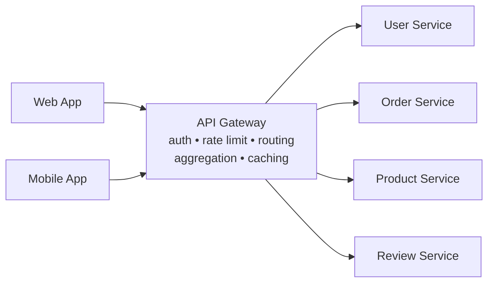
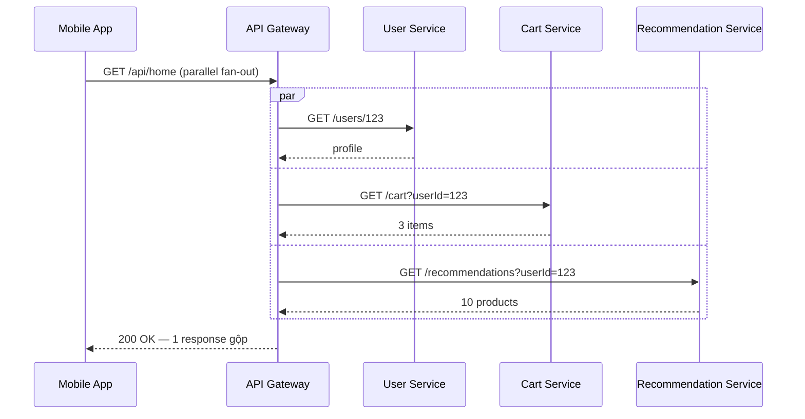
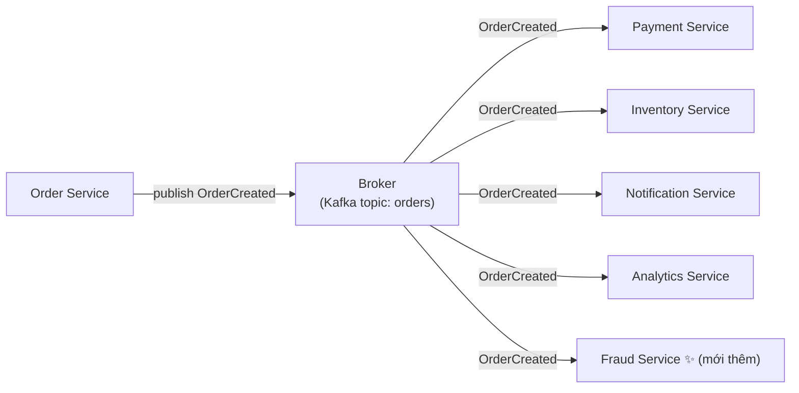
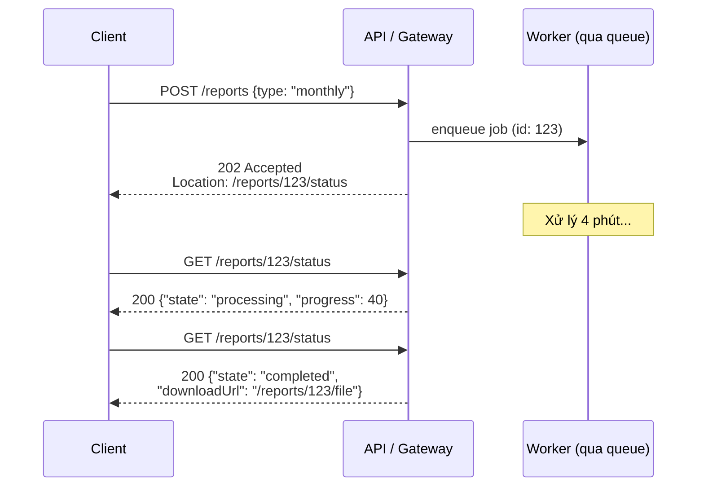
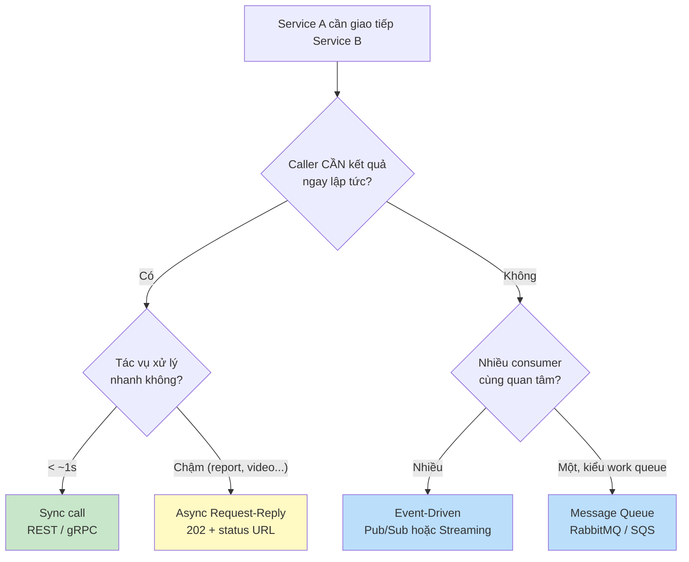

# Communication Patterns trong Microservice

## 📋 Mục lục

- [1. Giới thiệu](#1-giới-thiệu)
- [2. Bản đồ Communication Patterns](#2-bản-đồ-communication-patterns)
- [3. API Gateway Pattern](#3-api-gateway-pattern)
  - [3.1. Vấn đề giải quyết](#31-vấn-đề-giải-quyết)
  - [3.2. Cách hoạt động](#32-cách-hoạt-động)
  - [3.3. Ví dụ thực tế — Trang chủ E-Commerce](#33-ví-dụ-thực-tế--trang-chủ-e-commerce)
  - [3.4. Khi nào chọn / không chọn](#34-khi-nào-chọn--không-chọn)
  - [3.5. Trade-offs](#35-trade-offs)
  - [3.6. Lỗi thường gặp](#36-lỗi-thường-gặp)
- [4. Backend for Frontend (BFF) Pattern](#4-backend-for-frontend-bff-pattern)
  - [4.1. Vấn đề giải quyết](#41-vấn-đề-giải-quyết)
  - [4.2. Cách hoạt động](#42-cách-hoạt-động)
  - [4.3. Ví dụ thực tế — Cùng 1 sản phẩm, 3 nền tảng](#43-ví-dụ-thực-tế--cùng-1-sản-phẩm-3-nền-tảng)
  - [4.4. API Gateway vs BFF](#44-api-gateway-vs-bff)
  - [4.5. Khi nào chọn / không chọn](#45-khi-nào-chọn--không-chọn)
  - [4.6. Trade-offs](#46-trade-offs)
  - [4.7. Lỗi thường gặp](#47-lỗi-thường-gặp)
- [5. Service Mesh Pattern](#5-service-mesh-pattern)
  - [5.1. Vấn đề giải quyết](#51-vấn-đề-giải-quyết)
  - [5.2. Control Plane vs Data Plane](#52-control-plane-vs-data-plane)
  - [5.3. Ví dụ thực tế — Canary release và mTLS](#53-ví-dụ-thực-tế--canary-release-và-mtls)
  - [5.4. API Gateway vs Service Mesh](#54-api-gateway-vs-service-mesh)
  - [5.5. Khi nào chọn / không chọn](#55-khi-nào-chọn--không-chọn)
  - [5.6. Trade-offs](#56-trade-offs)
  - [5.7. Lỗi thường gặp](#57-lỗi-thường-gặp)
- [6. Event-Driven Architecture Pattern](#6-event-driven-architecture-pattern)
  - [6.1. Vấn đề giải quyết](#61-vấn-đề-giải-quyết)
  - [6.2. Cách hoạt động](#62-cách-hoạt-động)
  - [6.3. Ví dụ thực tế — Fan-out xử lý đơn hàng](#63-ví-dụ-thực-tế--fan-out-xử-lý-đơn-hàng)
  - [6.4. Choreography vs Orchestration](#64-choreography-vs-orchestration)
  - [6.5. Khi nào chọn / không chọn](#65-khi-nào-chọn--không-chọn)
  - [6.6. Trade-offs](#66-trade-offs)
  - [6.7. Lỗi thường gặp](#67-lỗi-thường-gặp)
- [7. Async Request-Reply Pattern](#7-async-request-reply-pattern)
  - [7.1. Vấn đề giải quyết](#71-vấn-đề-giải-quyết)
  - [7.2. Cách hoạt động](#72-cách-hoạt-động)
  - [7.3. Ví dụ thực tế — Xuất báo cáo](#73-ví-dụ-thực-tế--xuất-báo-cáo)
  - [7.4. Polling vs Webhook vs WebSocket](#74-polling-vs-webhook-vs-websocket)
  - [7.5. Khi nào chọn / không chọn](#75-khi-nào-chọn--không-chọn)
  - [7.6. Trade-offs](#76-trade-offs)
  - [7.7. Lỗi thường gặp](#77-lỗi-thường-gặp)
- [8. Sync vs Async — Decision Matrix](#8-sync-vs-async--decision-matrix)
  - [8.1. Decision Framework](#81-decision-framework)
  - [8.2. Decision Matrix theo tình huống](#82-decision-matrix-theo-tình-huống)
  - [8.3. Ví dụ — Kiến trúc lai cho một trang E-Commerce](#83-ví-dụ--kiến-trúc-lai-cho-một-trang-e-commerce)
- [9. Kết hợp các Patterns — Kiến trúc tổng thể](#9-kết-hợp-các-patterns--kiến-trúc-tổng-thể)
  - [9.1. Kiến trúc tham chiếu](#91-kiến-trúc-tham-chiếu)
  - [9.2. Phân định trách nhiệm giữa các lớp](#92-phân-định-trách-nhiệm-giữa-các-lớp)
  - [9.3. Lộ trình áp dụng](#93-lộ-trình-áp-dụng)
- [10. Anti-patterns giao tiếp cần tránh](#10-anti-patterns-giao-tiếp-cần-tránh)
- [11. Checklist](#11-checklist)
- [12. Tổng kết](#12-tổng-kết)
- [13. Liên kết liên quan](#13-liên-kết-liên-quan)

---

## 1. Giới thiệu

Trong kiến trúc Microservice, các service dù độc lập đến đâu vẫn phải **giao tiếp** với nhau và với client bên ngoài. **Communication Patterns** (mẫu giao tiếp) là những giải pháp đã được kiểm chứng cho câu hỏi: *dữ liệu và lệnh di chuyển giữa client ↔ service và service ↔ service theo cách nào?*

Cách giao tiếp là **quyết định thiết kế có ảnh hưởng dài hạn nhất** trong microservice — nó quyết định mức độ [coupling](03-loose-coupling-high-cohesion.md), độ sẵn sàng (availability), độ trễ (latency) và cả cách team tổ chức làm việc.

Tài liệu này tập trung vào **góc nhìn pattern**: mỗi pattern giải quyết vấn đề gì, khi nào nên/không nên chọn, trade-off là gì, lỗi thường gặp ra sao — và quan trọng nhất: **các pattern kết hợp với nhau trong một kiến trúc thực tế như thế nào**. Chi tiết triển khai từng chủ đề nằm ở các doc chuyên đề (được link ở từng phần).

> 📖 Tài liệu này thuộc nhóm chuyên sâu tách từ [17 — Design Patterns](17-design-patterns.md). Nếu bạn cần tổng quan toàn bộ các nhóm patterns (Data, Reliability, Deployment...), hãy đọc doc đó trước.

---

## 2. Bản đồ Communication Patterns

Các communication patterns thường gặp chia thành 3 lớp theo vị trí trong hệ thống:

```
┌─────────────────────────────────────────────────────────────────────┐
│                    COMMUNICATION PATTERNS MAP                        │
│                                                                     │
│  LỚP EDGE — Client vào / ra hệ thống                                │
│  ┌─────────────────┐   ┌─────────────────┐                          │
│  │  API Gateway    │   │       BFF       │                          │
│  │  (1 cổng chung) │   │ (mỗi client 1   │                          │
│  │                 │   │  backend riêng) │                          │
│  └─────────────────┘   └─────────────────┘                          │
│                                                                     │
│  LỚP INTERNAL — Service giao tiếp với service                       │
│  ┌─────────────────┐   ┌──────────────────────┐                     │
│  │ Event-Driven    │   │ Async Request-Reply  │                     │
│  │ (publish/       │   │ (202 + status URL    │                     │
│  │  subscribe)     │   │  cho tác vụ dài)     │                     │
│  └─────────────────┘   └──────────────────────┘                     │
│                                                                     │
│  LỚP INFRASTRUCTURE — Nền tảng bên dưới mọi giao tiếp               │
│  ┌─────────────────┐                                                │
│  │  Service Mesh   │  mTLS, load balancing, retry, tracing          │
│  │                 │  — không đụng vào application code             │
│  └─────────────────┘                                                │
└─────────────────────────────────────────────────────────────────────┘
```

| Pattern | Vấn đề chính giải quyết | Lớp | Doc chuyên đề |
|---------|------------------------|-----|----------------|
| **API Gateway** | Client phải gọi nhiều service, lặp lại auth/rate limiting | Edge | [07 — API Gateway](07-api-gateway.md) |
| **BFF** | Một API chung phục vụ kém mọi loại client | Edge | [07 — API Gateway, §4](07-api-gateway.md#4-bff-pattern--backend-for-frontend) |
| **Service Mesh** | Networking concerns lặp lại khác nhau ở mỗi ngôn ngữ | Infrastructure | [13 — Orchestration, §9](13-orchestration.md#9-service-mesh) |
| **Event-Driven Architecture** | Coupling và temporal coupling khi gọi trực tiếp | Internal | [06 — Inter-Service Communication, §5](06-inter-service-communication.md#5-event-driven-architecture) |
| **Async Request-Reply** | Tác vụ dài không thể giữ kết nối chờ response | Internal | [06 — Inter-Service Communication, §6.1](06-inter-service-communication.md#61-request-reply-qua-message-queue) |

> 💡 Ba lớp **không thay thế nhau** — một hệ thống lớn có thể dùng cả năm patterns cùng lúc, mỗi pattern ở đúng lớp của nó (xem [§9](#9-kết-hợp-các-patterns--kiến-trúc-tổng-thể)).

---

## 3. API Gateway Pattern

### 3.1. Vấn đề giải quyết

Không có gateway, client phải gọi **trực tiếp từng service**:

```
❌ Client gọi trực tiếp từng service:

  Mobile App
      ├── GET https://user-service:8081/api/users/123
      ├── GET https://order-service:8082/api/orders?userId=123
      ├── GET https://product-service:8083/api/products/456
      └── GET https://review-service:8084/api/reviews?productId=456

  Vấn đề:
  • Client phải biết URL TỪNG service → tight coupling
  • 4 round-trips cho 1 màn hình → chậm, tốn pin/3G
  • Mỗi service phải tự xử lý auth, rate limiting → trùng lặp
  • Service đổi URL/port → phải cập nhật TẤT CẢ clients
  • Không có điểm chung để log, monitor, trace
```

### 3.2. Cách hoạt động

**API Gateway** (cổng API) là **single entry point** (điểm vào duy nhất) giữa client và hệ thống microservice. Mọi request từ client đều đi qua gateway, gateway thực hiện các cross-cutting concerns (chức năng cắt ngang — những việc mọi request đều cần) rồi route tới service phù hợp.



| Chức năng | Mô tả | Chi tiết |
|-----------|-------|----------|
| **Request Routing** | Route theo path/host tới đúng service | [07 §3.1](07-api-gateway.md#31-request-routing) |
| **Authentication & Authorization** | Xác thực JWT/API key **một lần** tại gateway | [07 §3.3](07-api-gateway.md#33-authentication--authorization) |
| **Rate Limiting** | Giới hạn số request mỗi client, bảo vệ backend | [07 §3.4](07-api-gateway.md#34-rate-limiting--throttling) |
| **API Aggregation** | Gộp nhiều internal calls thành 1 response cho client | [07 §3.2](07-api-gateway.md#32-api-composition--aggregation) |
| **Response Transformation** | Đổi format/protocol (REST ↔ gRPC) cho client | [07 §3.7](07-api-gateway.md#37-requestresponse-transformation) |
| **SSL Termination** | TLS kết thúc ở gateway, internal gọi plaintext | [07 §7.1](07-api-gateway.md#71-ssl-termination) |

### 3.3. Ví dụ thực tế — Trang chủ E-Commerce

Trang chủ một sàn thương mại điện tử cần: profile user, giỏ hàng, gợi ý sản phẩm, thông báo. Thay vì mobile app gọi 4 API, app gọi **1 API**:



Điểm pattern-level cần chú ý: gateway gọi các service **song song** (parallel) thay vì tuần tự để giảm latency, và cần chính sách **partial failure** — nếu Recommendation Service lỗi, trả về phần còn lại kèm trường rỗng thay vì lỗi cả trang chủ:

```json
{
  "user": { "name": "An", "tier": "GOLD" },
  "cart": { "items": 3, "total": 1250000 },
  "recommendations": null,
  "_meta": { "degraded": ["recommendations"] }
}
```

### 3.4. Khi nào chọn / không chọn

| ✅ Nên dùng khi... | ❌ Không nên / chưa cần khi... |
|--------------------|-------------------------------|
| Có từ 2–3 service trở lên phía sau | Hệ thống chỉ có 1 service (gateway là lớp thừa) |
| Nhiều loại client (web, mobile, partner) | Client nội bộ duy nhất gọi 1 service trong cùng network |
| Cần áp auth, rate limiting thống nhất | Chưa có yêu cầu cross-cutting nào tại edge |
| Muốn ẩn cấu trúc nội bộ khỏi bên ngoài | Đã có Load Balancer + Ingress đủ dùng (xem [13 §4.5](13-orchestration.md#45-ingress)) |

### 3.5. Trade-offs

| Được gì | Mất gì |
|---------|--------|
| Client chỉ biết 1 URL, loose coupling với topology nội bộ | Gateway là **single point of failure** — cần chạy HA nhiều instance |
| Cross-cutting (auth, rate limit, log) viết **một lần** | Thêm 1 network hop → tăng latency nhẹ |
| Điểm tập trung để monitor, trace mọi request | Có thể trở thành **bottleneck** nếu không scale kịp |
| Aggregation giảm số round-trips cho client | Aggregation làm gateway "thông minh" quá mức (xem lỗi dưới) |

### 3.6. Lỗi thường gặp

1. **Business logic chui vào gateway** — gateway chỉ nên mỏng (thin): route, auth, transform. Logic đặt hàng, tính giá... thuộc về service. Gateway càng "thông minh", càng khó deploy độc lập → mất lợi ích của microservice.
2. **Aggregation tuần tự thay vì song song** — gọi 4 service lần lượt thay vì `par` → latency nhân 4.
3. **Không đặt timeout + circuit breaker khi gateway gọi service** — 1 service chậm kéo theo toàn bộ request chậm. Gateway cần [timeout, retry, circuit breaker](10-resilience-patterns.md) riêng cho từng downstream.
4. **Không có partial failure policy** — 1 service phụ lỗi làm sập cả aggregated response.
5. **1 gateway dùng chung cho cả external client lẫn internal service-to-service** — internal traffic nên đi đường riêng (hoặc [Service Mesh](#5-service-mesh-pattern)).

---

## 4. Backend for Frontend (BFF) Pattern

### 4.1. Vấn đề giải quyết

Một API Gateway duy nhất phục vụ **mọi loại client** dẫn đến việc thiết kế API theo "ước chung lớn nhất" — response phải chứa đủ thứ cho web, mobile, TV, IoT:

- **Over-fetching** (lấy thừa dữ liệu): mobile 4G chỉ cần tên sản phẩm + 1 thumbnail, nhưng nhận nguyên object 5KB đầy mô tả HTML, 10 ảnh, reviews.
- **Under-fetching** (phải gọi nhiều lần): web cần thêm data mà API chung không trả → phải gọi thêm nhiều endpoint.
- **Xung đột nhu cầu**: mobile cần payload nhỏ, web cần data đầy đủ, IoT cần dạng binary gọn nhất — không thể thỏa tất cả bằng 1 API.
- **Team frontend không sở hữu API mình dùng** — mọi thay đổi phải xếp hàng chờ team gateway.

### 4.2. Cách hoạt động

**BFF** (Backend for Frontend — backend dành riêng cho từng frontend): mỗi loại client có **một backend riêng**, do **team frontend đó sở hữu và phát triển**, tối ưu đúng nhu cầu của client mình.

```
┌─────────────┐  ┌──────────────┐  ┌─────────────┐
│   Web App   │  │  Mobile App  │  │  IoT Device │
└──────┬──────┘  └──────┬───────┘  └──────┬──────┘
       │                │                 │
┌──────▼──────┐  ┌──────▼───────┐  ┌──────▼──────┐
│   Web BFF   │  │  Mobile BFF  │  │   IoT BFF   │
│ (GraphQL)   │  │ (REST, gọn)  │  │ (gRPC/MQTT) │
│ Team Web    │  │ Team Mobile  │  │ Team IoT    │
└──────┬──────┘  └──────┬───────┘  └──────┬──────┘
       │                │                 │
       └────────────────┼─────────────────┘
                        │
            ┌───────────┼───────────┐
            ▼           ▼           ▼
      ┌──────────┐ ┌──────────┐ ┌──────────┐
      │ User Svc │ │Order Svc │ │Product Svc│
      └──────────┘ └──────────┘ └──────────┘
```

Điểm mấu chốt của BFF không phải là "nhiều gateway" mà là **ownership**: Web BFF do team web viết bằng Node.js, Mobile BFF do team mobile viết bằng Kotlin — mỗi team tự quyết định API hình dạng thế nào cho phù hợp client của mình.

### 4.3. Ví dụ thực tế — Cùng 1 sản phẩm, 3 nền tảng

Cùng endpoint "chi tiết sản phẩm" qua 3 BFF cho 3 nền tảng:

**Web BFF** (GraphQL — web tự chọn field):

```graphql
query { product(id: 456) { name price description gallery reviews { author rating } related } }
```

**Mobile BFF** (REST — payload gọn, ảnh đã resize):

```json
GET /mobile/products/456
{
  "n": "iPhone 15",
  "p": 29990000,
  "img": "https://cdn.../456_thumb.webp"
}
```

**IoT BFF** (gRPC + Protobuf — binary nhỏ nhất cho thiết bị yếu):

```
message ProductBrief { int64 id = 1; string name = 2; int64 price_vnd = 3; }
```

Ba BFF gọi chung các domain service phía sau — chỉ **lớp trình bày** khác nhau.

### 4.4. API Gateway vs BFF

| Tiêu chí | API Gateway | BFF |
|----------|-------------|-----|
| **Bản chất** | Hạ tầng (infrastructure) — config-driven | Application service — có code riêng |
| **Số lượng** | 1 (hoặc ít) cho toàn hệ thống | N = số loại client |
| **Ownership** | Platform/Infra team | Từng frontend team |
| **Chứa logic?** | Không — chỉ cross-cutting (auth, rate limit, route) | Có — aggregation, transformation theo client |
| **Công nghệ** | Off-the-shelf: Kong, NGINX, AWS API Gateway... | Viết như service bình thường (Node, Kotlin, Go...) |
| **Thay đổi khi...** | Thêm route/rule mới | UX của client đó thay đổi |

> 💡 Trong thực tế, gateway và BFF **đi cùng nhau**: gateway đứng ngoài cùng lo auth + rate limiting + routing `/mobile/*` → Mobile BFF; BFF lo aggregation cho mobile. Xem [07 §5.1 — Single vs Multiple Gateways](07-api-gateway.md#51-single-gateway-vs-multiple-gateways).

### 4.5. Khi nào chọn / không chọn

| ✅ Nên dùng khi... | ❌ Không nên / chưa cần khi... |
|--------------------|-------------------------------|
| Các client khác nhau rõ rệt (web vs mobile vs IoT) | Chỉ có 1 loại client |
| Team tổ chức theo frontend (web team, mobile team) | Team backend duy nhất làm hết mọi client |
| Mobile chịu băng thông/pin hạn chế, cần payload tối ưu | Response hiện tại đã đủ gọn cho mọi client |
| Tốc độ đổi UX của từng client cao, cần deploy độc lập | Sản phẩm giai đoạn đầu — 1 gateway đủ, KISS |

### 4.6. Trade-offs

| Được gì | Mất gì |
|---------|--------|
| Mỗi client có API tối ưu đúng nhu cầu — ít over/under-fetching | N BFF = N codebase phải maintain, có thể trùng logic |
| Frontend team tự chủ — không xếp hàng chờ nhau | Thêm 1 lớp service → thêm deployment, monitoring |
| Deploy BFF mobile không ảnh hưởng web | Đảm bảo nhất quán giữa các BFF là việc **của con người** |
| Phù hợp tổ chức theo team sản phẩm (Conway's Law) | Không phù hợp team nhỏ — overhead lớn hơn lợi ích |

### 4.7. Lỗi thường gặp

1. **"Universal BFF"** — gộp web + mobile vào 1 BFF "cho đỡ tốn" → quay về đúng vấn đề BFF sinh ra để giải quyết.
2. **BFF chứa business logic** — BFF là lớp trình bày (presentation layer): gộp, đổi dạng, cache. Luật nghiệp vụ (business rule) phải nằm ở domain service, nếu không đổi luật phải sửa N BFF.
3. **BFF gọi BFF** — tạo chuỗi phụ thuộc ngang không cần thiết; BFF gọi thẳng domain service.
4. **Copy-paste BFF** — 90% code giống nhau giữa các BFF → cân nhắc shared library theo hướng [27 — Shared Code Strategy](27-shared-code-strategy.md), nhưng chỉ share phần không phải business logic.

---

## 5. Service Mesh Pattern

### 5.1. Vấn đề giải quyết

Trong một hệ thống polyglot (nhiều ngôn ngữ), mọi service đều cần cùng một bộ networking concerns:

- **mTLS** (mutual TLS — TLS hai chiều, cả hai bên xác thực lẫn nhau) giữa service với service
- **Retry + Circuit Breaker** khi gọi downstream
- **Load balancing** client-side giữa các instance
- **Observability** — metrics, tracing đều cho mọi hop
- **Traffic management** — canary, A/B testing ở tầng network

Không có mesh: mỗi ngôn ngữ một bộ thư viện, mỗi team implement một kiểu — không đồng nhất, khó nâng cấp, và business code bị lẫn chuyện hạ tầng.

### 5.2. Control Plane vs Data Plane

**Service Mesh** (lưới service) tách toàn bộ networking concerns ra khỏi application code bằng cách inject (tiêm) một **sidecar proxy** (proxy phụ chạy cạnh service) vào mỗi pod:

```
┌──────────────────────────────────────────────────────────┐
│                  CONTROL PLANE                           │
│              (Istiod / Linkerd control plane)            │
│   • Cấu hình routing, policy                             │
│   • Phát hành certificate mTLS                           │
│   • Service discovery                                    │
└────────────────────────┬─────────────────────────────────┘
                         │ push config + certs
        ┌────────────────┼────────────────┐
        ▼                ▼                ▼
  ┌───────────┐    ┌───────────┐    ┌───────────┐
  │ ┌───────┐ │    │ ┌───────┐ │    │ ┌───────┐ │
  │ │Order  │ │    │ │Payment│ │    │ │Product│ │     DATA PLANE
  │ └──┬────┘ │    │ └───┬───┘ │    │ └───┬───┘ │   (sidecar proxies)
  │ ┌──▼────┐ │    │ ┌───▼───┐ │    │ ┌───▼───┐ │
  │ │Envoy  │◀├────▶│ Envoy  │◀├────▶│ Envoy  │ │   Mọi traffic đi
  │ │proxy  │ │mTLS│ │proxy  │ │mTLS│ │proxy  │ │   qua các proxy này
  │ └───────┘ │    │ └───────┘ │    │ └───────┘ │
  └───────────┘    └───────────┘    └───────────┘
```

- **Data plane** = toàn bộ sidecar proxy, trực tiếp xử lý request: mã hóa mTLS, retry, load balance, thu thập metric.
- **Control plane** = "bộ não" quản lý: nhận khai báo cấu hình (YAML), phân phát xuống các proxy, ký và luân chuyển certificate.

Application code chỉ gọi `http://payment:8080/...` như bình thường — mọi chuyện phía dưới do proxy lo. Đây chính là [Sidecar Pattern](17-structural-patterns.md) áp dụng vào networking.

### 5.3. Ví dụ thực tế — Canary release và mTLS

**Canary release** (triển khai phễu — đưa phiên bản mới cho một phần nhỏ traffic trước): muốn 5% request đi vào `payment:v2`, 95% còn lại `payment:v1`:

```
Trước khi có mesh:                   Có mesh (chỉ sửa config):
──────────────                       ──────────────────────────
Sửa code thêm header                 apiVersion: networking.istio.io/v1beta1
"canary=true" ở client?              kind: VirtualService
Thêm 1 LB riêng?                     spec:
Deploy 2 cluster?                      http:
→ Mất công, dễ sai                       - route:
                                           - destination: payment-v2
                                           weight: 5
                                           - destination: payment-v1
                                           weight: 95
```

Tương tự, bật **mTLS toàn cluster** là một dòng policy — không service nào phải đổi code, không ai phải quản lý certificate thủ công. Chi tiết Istio/Linkerd so sánh thế nào xem ở [13 §9.3–9.5](13-orchestration.md#93-istio).

### 5.4. API Gateway vs Service Mesh

Hai pattern này hay bị nhầm là thay thế nhau — thực ra chúng ở **hai lớp khác nhau**:

| Tiêu chí | API Gateway | Service Mesh |
|----------|-------------|--------------|
| **Hướng traffic** | North-South (client → hệ thống, vào/ra) | East-West (service ↔ service, ngang trong nội bộ) |
| **Vị trí** | Cạnh mép hệ thống (edge) | Phủ toàn bộ nội bộ cluster |
| **Ai dùng** | Client bên ngoài / frontend | Domain service gọi nhau |
| **Loại logic** | Auth user, rate limit, aggregation | mTLS, retry, LB, traffic shifting, service-to-service auth |
| **Số lượng** | Thường 1 (hoặc theo vùng) | Mỗi pod 1 sidecar — hàng trăm, hàng nghìn |
| **Thay thế nhau?** | ❌ Không — bổ sung cho nhau | ❌ Không — bổ sung cho nhau |

```
  Client ──▶ API Gateway ──▶ Service A ⇄ Service B ⇄ Service C
             (north-south)     └──── east-west (mesh) ────┘
```

### 5.5. Khi nào chọn / không chọn

| ✅ Nên dùng khi... | ❌ Không nên / chưa cần khi... |
|--------------------|-------------------------------|
| Nhiều service (khoảng chục trở lên), polyglot | Ít service, cùng một stack ngôn ngữ |
| Cần mTLS toàn nội bộ (compliance, tài chính, y tế) | Network nội bộ đã trusted, không yêu cầu compliance |
| Cần traffic management tinh vi (canary, fault injection) | Rolling update cơ bản đã đủ |
| Nhiều team, cần thống nhất networking policy | Team chưa vững Kubernetes — mesh cộng thêm độ phức tạp đáng kể |

> 📖 Bảng đánh giá chi tiết hơn: [13 §9.6 — Khi nào cần / không cần Service Mesh](13-orchestration.md#96-khi-nào-cần--không-cần-service-mesh)

### 5.6. Trade-offs

| Được gì | Mất gì |
|---------|--------|
| Networking concerns đồng nhất mọi ngôn ngữ, không đụng code | Mỗi pod thêm sidecar → tốn thêm CPU/RAM nhân rộng cả cluster |
| mTLS, canary, retry bật bằng config | Thêm 1 network hop tại mỗi sidecar → latency tăng nhẹ |
| Observability thống nhất (metric, trace từng hop) | Control plane là thành phần hạ tầng mới phải vận hành, nâng cấp |
| Tách hạ tầng khỏi business code | Debug khó hơn — request "biến mất" giữa app và proxy |

### 5.7. Lỗi thường gặp

1. **Adopt mesh quá sớm** — hệ thống 5 service mà bật Istio: độ phức tạp vận hành lớn hơn vấn đề nó giải quyết. Bắt đầu bằng thư viện resilience trong app, mesh khi thật sự cần.
2. **Dùng mesh thay gateway** — mesh lo East-West, không giải quyết được auth user bên ngoài, rate limiting theo client, aggregation (xem [§5.4](#54-api-gateway-vs-service-mesh)).
3. **Không cấp phát resource cho sidecar** — sidecar cũng cần CPU/RAM; quên tính trong capacity planning → pod bị throttle.
4. **Nghĩ mesh thay cho thiết kế resilience của app** — mesh retry được transient error, nhưng **bulkhead, idempotency, fallback logic** vẫn là trách nhiệm của application. Xem [10 — Resilience Patterns](10-resilience-patterns.md).
5. **Bật mTLS nhưng không có kế hoạch certificate rotation** — cert hết hạn giữa chừng làm toàn bộ traffic nội bộ chết.

---

## 6. Event-Driven Architecture Pattern

### 6.1. Vấn đề giải quyết

Giao tiếp bằng direct call (REST/gRPC) giữa các service tạo ra:

- **Temporal coupling** (coupling về thời gian) — caller và callee phải **cùng online** cùng lúc. Payment Service chết → Order Service cũng chết dù bản thân Order không có lỗi.
- **Fan-out cứng nhắc** — Order muốn báo cho Payment, Inventory, Notification, Analytics thì phải **biết và gọi đủ 4 service**. Thêm consumer thứ 5 = sửa code Order.
- **Sync chain** — chuỗi gọi đồng bộ A → B → C → D: latency cộng dồn, availability nhân giảm (chi tiết ở [§10](#10-anti-patterns-giao-tiếp-cần-tránh)).

### 6.2. Cách hoạt động

**Event-Driven Architecture** (EDA — kiến trúc hướng sự kiện): service không gọi trực tiếp nhau mà **phát event** (sự kiện — mô tả *điều gì đã xảy ra*) lên một **message broker** (trung chuyển message: Kafka, RabbitMQ...). Các service quan tâm **subscribe** (đăng ký nhận) event đó.

```
Tư duy khác biệt:

Command-Driven: "Hãy làm việc này"        Event-Driven: "Việc này ĐÃ xảy ra"
─────────────────────────────             ─────────────────────────────────
Order → gọi Payment.charge()              Order → publish OrderCreated
Order → gọi Inventory.reserve()           (Order KHÔNG biết ai lắng nghe)
Order → gọi Notification.send()
                                          Payment:    nghe event → charge
→ Order biết rõ 3 service                 Inventory:  nghe event → reserve
→ Tight coupling                         Notification: nghe event → gửi email
                                          → Loose coupling
```

Phân biệt quan trọng: **event** là *fact* quá khứ (`OrderCreated`, `PaymentCompleted`), **command** là *lệnh* hướng tới (`ChargePayment`, `ReserveStock`). Đặt tên event sai tense là dấu hiệu bạn đang "gọi hàm qua broker" chứ không thật sự event-driven. Phân tích sâu ở [06 §5](06-inter-service-communication.md#52-event-types--domain-event-vs-integration-event).

### 6.3. Ví dụ thực tế — Fan-out xử lý đơn hàng



Giá trị của pattern nằm ở consumer **Fraud Service**: thêm vào **không sửa một dòng nào** ở Order Service hay broker — chỉ cần subscribe topic. Producer và consumer không biết về nhau (loose coupling), và nếu Fraud Service đang down, event chờ trong broker, xử lý khi nó sống lại (không temporal coupling).

### 6.4. Choreography vs Orchestration

Hai cách phối hợp nhiều consumer với một workflow:

| Tiêu chí | Choreography | Orchestration |
|----------|--------------|---------------|
| **Tư duy** | Event — mỗi service tự phản ứng | Command — orchestrator ra lệnh từng bước |
| **Ai điều phối** | Không ai — flow "nổi" từ các phản ứng cục bộ | Một orchestrator nắm toàn bộ flow |
| **Coupling** | Rất loose | Tập trung vào orchestrator |
| **Flow phức tạp, có rollback** | Khó theo dõi, khó xử lý lỗi | Dễ — logic tập trung (như Saga) |
| **Thêm step mới** | Chỉ cần subscribe | Phải sửa orchestrator |

> ⚠️ Lưu ý nuance quan trọng: Orchestration **không phải** Event-Driven — nó là command-driven dù có chạy qua broker. So sánh đầy đủ: [06 §5.3](06-inter-service-communication.md#53-choreography-vs-orchestration--phân-biệt-rõ-ràng). Saga (distributed transaction dùng orchestration/choreography): [09 — Data Management](09-data-management.md).

**Nguyên tắc thực dụng**: mặc định choreography cho notify/fan-out; chuyển orchestration khi workflow nhiều bước có điều kiện, rollback và cần nhìn thấy toàn cảnh.

### 6.5. Khi nào chọn / không chọn

| ✅ Nên dùng khi... | ❌ Không nên / chưa cần khi... |
|--------------------|-------------------------------|
| Nhiều consumer quan tâm cùng một sự kiện (fan-out) | Caller **cần kết quả ngay** để tiếp tục (VD: check tồn kho trước khi đặt hàng) |
| Muốn producer không cần biết consumer là ai | Flow 2 service đơn giản, sync call dễ debug hơn hẳn |
| Chấp nhận eventual consistency (nhất quán cuối cùng) | Yêu cầu strong consistency tức thời |
| Cần absorb burst traffic (queue như bọt đệm) | Team chưa có kinh nghiệm vận hành broker |
| Cần replay/audit luồng sự kiện | — |

### 6.6. Trade-offs

| Được gì | Mất gì |
|---------|--------|
| Loose coupling — thêm/xóa consumer không đụng producer | Chỉ **eventual consistency** — state các service lệch nhau trong khoảng thời gian ngắn |
| Không temporal coupling — service down không lây chết | Debug khó — phải theo correlation ID xuyên chuỗi events |
| Scale consumer độc lập, absorb burst | Vận hành thêm hạ tầng broker (cluster Kafka không rẻ) |
| Audit trail tự nhiên | Phải xử lý duplicate: broker thường đảm bảo **at-least-once delivery** (tối thiểu một lần — có thể trùng), consumer bắt buộc **idempotent** (xử lý lại nhiều lần vẫn ra kết quả như một lần) |

### 6.7. Lỗi thường gặp

1. **God Event** — nhét cả aggregate vào 1 event khổng lồ mà mọi consumer phải parse. Event nên nhỏ, theo đúng mục đích notification; consumer cần chi tiết thì tự gọi API lấy.
2. **Command trá hình event** — đặt tên `ChargePayment` publish lên broker: vẫn là lệnh, vẫn coupling logic, cộng thêm phức tạp async.
3. **Quên Outbox Pattern** — ghi DB xong rồi publish event là **2 thao tác rời rạc** (dual write); broker chết là mất event → data inconsistency. Giải pháp: [Transactional Outbox](06-inter-service-communication.md#63-outbox-pattern).
4. **Consumer không idempotent** — at-least-once + retry = message đến 2 lần → charge tiền 2 lần. Luôn có idempotency key / dedup.
5. **Không có Dead Letter Queue** — poison message (message gây lỗi mãi) block cả consumer group. Cần [DLQ](06-inter-service-communication.md#64-dead-letter-queue) + alert.
6. **Không version event schema** — đổi field làm toàn bộ consumer cũ vỡ. Cần schema registry + quy tắc backward compatible (chỉ thêm, không xóa/đổi ý nghĩa).

---

## 7. Async Request-Reply Pattern

### 7.1. Vấn đề giải quyết

Một số thao tác **chạy lâu hơn thời gian request bình thường** — xuất báo cáo lớn, transcode video, huấn luyện model, đồng bộ batch. Nếu client giữ HTTP connection chờ:

- Connection/timeout hủy giữa chừng — client không biết tác vụ thành hay fail, thường **retry → chạy trùng tác vụ**
- Thread phía server bị chiếm giữ chờ → cạn resource
- Load Balancer/gateway timeout ngắt connection dù tác vụ vẫn chạy

### 7.2. Cách hoạt động

**Async Request-Reply** (yêu cầu–phản hồi bất đồng bộ): client gửi request, server **nhận ngay việc cần làm** và trả về ngay `202 Accepted` kèm **URL tra cứu trạng thái**. Client **poll** (hỏi vòng) URL đó cho tới khi hoàn tất:



Ba trạng thái chuẩn: `processing` → `completed` (kèm kết quả) hoặc `failed` (kèm lý do + có retry được không).

### 7.3. Ví dụ thực tế — Xuất báo cáo

```
POST /api/reports
Authorization: Bearer ...
{ "type": "monthly_sales", "month": "2025-09" }

──▶ 202 Accepted
    Location: /api/reports/9f3c/status
    Retry-After: 30          ← gợi ý client quay lại sau bao nhiêu giây

GET /api/reports/9f3c/status     (lần 1, sau 30s)
──▶ 200 { "state": "processing", "progress": 35 }

GET /api/reports/9f3c/status     (lần 2, sau 60s)
──▶ 200 { "state": "completed", "downloadUrl": "/api/reports/9f3c/file" }
```

Chi tiết pattern: `POST` tạo job phải **idempotent** (client timeout rồi retry không sinh 2 job) — dùng `Idempotency-Key` header; status cần **TTL** (hết hạn sau vài ngày); `downloadUrl` cần auth như API bình thường.

### 7.4. Polling vs Webhook vs WebSocket

Có 3 cách client nhận kết quả — pattern không quy định phải polling:

| Tiêu chí | Polling (status URL) | Webhook (callback) | WebSocket / SSE |
|----------|---------------------|--------------------|-----------------|
| **Hướng** | Client hỏi vòng | Server push về URL client đăng ký | Kênh hai chiều / stream một chiều |
| **Độ trễ nhận kết quả** | Theo chu kỳ poll | Gần tức thời | Tức thời |
| **Client phải là...** | Ai cũng được (browser, script) | Phải có endpoint công khai nhận callback | Phải giữ connection sống |
| **Server tốn kém khi...** | Nhiều client poll dày | Retry khi webhook fail | Nhiều connection dài hạn |
| **Phù hợp** | Client công khai, job thưa | B2B integration, third-party | Real-time UI (chat, dashboard) |
| **Lưu ý** | Dùng `Retry-After` + backoff | Phải ký (HMAC) để xác thực nguồn | Xem [06 §2.2 — gRPC streaming](06-inter-service-communication.md#22-grpc-http2--protobuf) |

### 7.5. Khi nào chọn / không chọn

| ✅ Nên dùng khi... | ❌ Không nên / chưa cần khi... |
|--------------------|-------------------------------|
| Tác vụ dài (vài giây trở lên, vượt timeout) | Tác vụ nhanh (< vài trăm ms) — sync đơn giản hơn |
| Client là bên thứ ba, không giữ được connection | Đã có hạ tầng push (WebSocket) và client giữ được connection |
| Cần theo dõi tiến độ (%/state) | — |

### 7.6. Trade-offs

| Được gì | Mất gì |
|---------|--------|
| Không giữ connection chờ — không timeout giữa chừng | Thêm bảng/trạng thái job phải lưu + TTL dọn dẹp |
| Client retry an toàn (idempotent theo job id) | Polling tạo traffic nền — cần `Retry-After`, backoff |
| Worker scale độc lập với API layer | Trải nghiệm "chờ" phức tạp hơn sync một chút |
| Tiến độ theo dõi được | Bảo mật status URL cần đúng cơ chế auth như API chính |

### 7.7. Lỗi thường gặp

1. **Poll dồn dập** — client poll mỗi 100ms cho job chạy 10 phút → tự DDoS chính mình. Dùng `Retry-After` + exponential backoff.
2. **POST tạo job không idempotent** — client timeout, retry → 2 job trùng, 2 lần charge. Bắt buộc `Idempotency-Key`.
3. **Trả 202 nhưng xử lý inline trong request** — chạy việc nặng ngay trong handler rồi mới trả 202: connection vẫn bị giữ, chết y như sync. Việc phải **enqueue** thật sự.
4. **Status lưu vĩnh viễn** — bảng status phình to không dọn. Đặt TTL.
5. **Status URL không kiểm quyền** — ai có link cũng xem được báo cáo của người khác (IDOR vulnerability — xem [15 — Security](15-security.md)).
6. **Webhook không xác thực chữ ký** — kẻ tấn công POST giả callback. Ký HMAC và kiểm phía nhận.

---

## 8. Sync vs Async — Decision Matrix

Đây là quyết định gốc: **caller có cần kết quả ngay để tiếp tục không?** Mọi pattern khác đều xây trên câu trả lời này.

### 8.1. Decision Framework



> 📖 Framework chi tiết hơn theo góc độ transport (REST/gRPC/Queue/PubSub): [06 §4.1](06-inter-service-communication.md#41-decision-framework)

### 8.2. Decision Matrix theo tình huống

| Tình huống | Pattern chọn | Lý do |
|------------|--------------|-------|
| Hiển thị chi tiết sản phẩm cho user đang chờ | **Sync (REST/gRPC)** | Cần data ngay để render, thao tác nhanh |
| Thanh toán thẻ, user bấm "Thanh toán" | **Sync** (+ [Circuit Breaker](10-resilience-patterns.md)) | User phải biết thành/bại ngay — không thể eventual |
| Kiểm tra tồn kho trước khi cho đặt hàng | **Sync** | Kết quả quyết định flow tiếp theo |
| Gửi email / push notification sau đơn hàng | **Event + Queue** | Không cần gửi ngay, có thể retry |
| Nhiều service phản ứng theo đơn hàng mới | **Event-Driven (Pub/Sub)** | Fan-out, producer không biết consumer |
| Đồng bộ dữ liệu sang analytics / data warehouse | **Event Streaming (Kafka)** | Cần replay, throughput cao |
| Xuất báo cáo Excel 500k dòng | **Async Request-Reply** | Quá dài cho 1 request, cần theo tiến độ |
| Xử lý ảnh/video sau khi upload | **Queue + Async Request-Reply** | Heavy processing, user check kết quả sau |
| Điều phối giao dịch nhiều bước có rollback (đơn → trả tiền → trừ kho) | **Saga (choreography hoặc orchestration)** | Workflow nhiều bước, cần compensating actions — xem [09](09-data-management.md) |

**Ba quy tắc thực dụng:**

1. **Mặc định nghiêng về async** cho mọi thứ "không cần kết quả ngay" — đó là nguồn resilience chính của microservice.
2. **Sync ở nơi user đang chờ** — nhưng mỗi sync call phải có timeout + circuit breaker, và chuỗi sync không dài quá 2–3 hop.
3. **Hỗn hợp là bình thường** — một request user có thể đi sync tới Order Service, rồi Order **publish event** cho phần còn lại (xem ví dụ dưới).

### 8.3. Ví dụ — Kiến trúc lai cho một trang E-Commerce

```
User bấm "Đặt hàng"
   │
   ▼
API Gateway ──sync──▶ Order Service ──sync──▶ Payment Service
   │                     │   │                  (user chờ kết quả
   │                     │   │                   charge → thành công/thất bại)
   │                     │   │
   │                     │   └──publish──▶ Kafka "OrderCreated" ──┬─▶ Inventory (trừ kho)
   │                     │                                       ├─▶ Notification (email)
   │                     │                                       └─▶ Analytics
   │                     │
   └──202 + status URL───┘   (nếu bước chuẩn bị đơn là tác vụ chậm:
                              client poll GET /orders/9x7/status)

Phần SYNC  = những gì user chờ thấy kết quả ngay (thanh toán)
Phần ASYNC = những gì chạy nền, trễ vài giây không sao (email, kho, thống kê)
```

---

## 9. Kết hợp các Patterns — Kiến trúc tổng thể

### 9.1. Kiến trúc tham chiếu

Một hệ thống vừa/lớn thường dùng **đồng thời** cả năm patterns, mỗi pattern ở đúng lớp:

```
                    ┌─────────┐  ┌─────────┐  ┌─────────┐
                    │ Web App │  │  Mobile │  │ Partner │
                    └────┬────┘  └────┬────┘  └────┬────┘
                         │            │            │
        LỚP EDGE ════════▼════════════▼════════════▼════════
                      ┌──────────────────────────────┐
                      │         API GATEWAY          │  auth • rate limit
                      │  (single entry point, HA)    │  routing
                      └───────┬──────────────┬───────┘
                              │              │
                     ┌────────▼───┐   ┌──────▼─────┐
                     │  Web BFF   │   │ Mobile BFF │  BFF: mỗi client
                     └────────┬───┘   └──────┬─────┘  một backend
                              │              │
        LỚP INFRASTRUCTURE ═══╪══════════════╪════════ SERVICE MESH
                       (mỗi pod có sidecar: mTLS • LB • retry • tracing)
                              │              │
                    ┌─────────▼──────────────▼─────────┐
                    │   ┌──────┐  ┌──────┐  ┌──────┐   │
                    │   │Order │  │Payment│ │Product│  │  domain services
                    │   └──┬───┘  └──────┘  └──────┘   │
                    └──────┼───────────────────────────┘
                           │ outbox → publish
                           ▼
                    ┌─────────────┐
                    │   KAFKA     │──▶ Inventory ──▶ Notification
                    │ (broker)    │──▶ Analytics
                    └─────────────┘
                           ▲
                           │ job queue (report, media)
                    ┌──────┴──────┐
                    │   Workers   │──▶ trạng thái job → status URL
                    └─────────────┘     (Async Request-Reply)
```

Đọc luồng: client → **gateway** (auth, rate limit) → **BFF** (gộp data đúng client) → gọi domain service qua **mesh** (mTLS, retry) → service **publish event** cho consumer chạy nền → tác vụ dài đi **queue + worker**, client nhận **status URL**.

### 9.2. Phân định trách nhiệm giữa các lớp

| Lớp | Pattern | Chịu trách nhiệm | KHÔNG chịu trách nhiệm |
|-----|---------|------------------|------------------------|
| Edge | API Gateway | Auth user, rate limiting, routing, SSL termination | Business logic, aggregation theo client |
| Edge | BFF | Aggregation + transformation **cho một loại client** | Business rule, giao tiếp client khác |
| Internal | Event-Driven | Fan-out, decouple producer/consumer, absorb burst | Kết quả tức thời cho caller |
| Internal | Async Request-Reply | Tác vụ dài có thể theo dõi tiến độ | Thao tác cần kết quả ngay |
| Infrastructure | Service Mesh | mTLS, LB, retry, traffic management service↔service | Auth user bên ngoài, aggregation |

Nguyên tắc: **mỗi mối quan tâm có đúng một nơi xử lý** — không nhét auth user vào mesh, không nhét business rule vào gateway, không bắt event broker trả response đồng bộ.

### 9.3. Lộ trình áp dụng

Không hệ thống nào cần đủ năm patterns từ ngày đầu. Thứ tự phổ biến (và hợp lý) để thêm từng lớp khi nỗi đau xuất hiện:

| Giai đoạn | Nỗi đau | Pattern thêm vào |
|-----------|---------|------------------|
| 1. Vài service, 1 loại client | Client gọi nhiều service rời rạc | **API Gateway** |
| 2. Nhiều service phản ứng theo same event | Sync chain bắt đầu lây lỗi | **Event-Driven** (kèm Outbox, DLQ) |
| 3. Xuất hiện tác vụ dài | Timeout, connection chết | **Async Request-Reply** |
| 4. Client đa dạng lệch nhu cầu rõ rệt | Over-fetch, tranh nhau sửa API chung | **BFF** |
| 5. Chục service trở lên, polyglot, compliance | Networking lặp lại không đồng nhất | **Service Mesh** |

> 💡 Thứ tự này là **gợi ý dựa trên nỗi đau**, không phải luật — nếu bạn có compliance requirement mTLS ngay từ đầu, mesh có thể lên trước BFF. Cái cần tránh là thêm pattern khi chưa có vấn đề để giải (xem [over-engineering](17-anti-patterns.md)).

---

## 10. Anti-patterns giao tiếp cần tránh

Các lỗi giao tiếp phổ biến nhất — nhận biết sớm để tránh [distributed monolith](17-anti-patterns.md):

| Anti-pattern | Triệu chứng | Cách khắc phục |
|--------------|-------------|----------------|
| **Sync Chain / Death Star** | A→B→C→D→E gọi đồng bộ nối dài; 1 service chậm = cả chuỗi chậm; availability nhân giảm theo số hop | Tách các bước "không cần kết quả ngay" ra event-driven ([§6](#6-event-driven-architecture-pattern)); sync tối đa 2–3 hop |
| **Chatty Services** | 1 user request tạo 20+ internal calls; latency cao vô lý | Batch API, gộp endpoint, aggregation tại BFF/Gateway |
| **Temporal Coupling** | 1 service down → service gọi nó cũng down cùng | Queue/Pub/Sub thay direct call khi có thể |
| **God Event** | Event 10KB+ chứa cả aggregate; mọi consumer parse thừa | Event nhỏ notification-style; consumer tự fetch chi tiết |
| **Command trá hình event** | Topic toàn `DoXCommand`, consumer-reply-consumer như gọi hàm | Đặt tên fact quá khứ; cân nhắc orchestration thành thật nếu cần ra lệnh |
| **Mega Gateway** | Business logic, cả aggregation phức tạp dồn vào gateway; mọi deploy đều chạm gateway | Gateway mỏng, logic đẩy về BFF/service |
| **Universal BFF** | 1 BFF cho web + mobile + IoT — API lại "ước chung lớn nhất" | Tách BFF theo client khi nhu cầu lệch rõ |
| **Polling storm** | Log toàn `GET /status` mỗi vài trăm ms; job chạy 10 phút | `Retry-After` + exponential backoff |
| **Mesh thay gateway** | Bỏ gateway, kỳ vọng sidecar lo auth user bên ngoài | Mesh = east-west, gateway = north-south (xem [§5.4](#54-api-gateway-vs-service-mesh)) |

> 📖 Anti-patterns tổng hợp toàn diện hơn (distributed monolith, shared database, mega service...): [17 — Anti-patterns](17-anti-patterns.md)

---

## 11. Checklist

**Chung (áp dụng cho mọi communication decision):**

- [ ] Đã trả lời: *caller có cần kết quả ngay không?* trước khi chọn sync/async
- [ ] Mọi sync call đều có **timeout** + **circuit breaker** + chính sách retry rõ ràng
- [ ] Mọi message/event consumer đều **idempotent** (chịu at-least-once)
- [ ] Correlation ID truyền xuyên suốt mọi hop để trace được ([11 — Observability](11-observability-evolvability.md))

**API Gateway / BFF:**

- [ ] Gateway mỏng — không chứa business logic
- [ ] Gateway chạy nhiều instance (HA), có health check
- [ ] Aggregation gọi song song + có chính sách partial failure
- [ ] BFF được sở hữu bởi đúng frontend team; không có BFF gọi BFF

**Service Mesh:**

- [ ] Chỉ adopt khi đã có nỗi đau thật (polyglot, mTLS, traffic management)
- [ ] Đã cấp phát resource cho sidecar trong capacity planning
- [ ] Có kế hoạch certificate rotation và upgrade control plane

**Event-Driven:**

- [ ] Event đặt tên fact quá khứ; payload nhỏ
- [ ] Publish event qua **Transactional Outbox** (tránh dual write)
- [ ] Có **Dead Letter Queue** + alert khi message fail liên tục
- [ ] Schema event có version + backward compatible

**Async Request-Reply:**

- [ ] `POST` tạo job hỗ trợ `Idempotency-Key`
- [ ] Response 202 có `Location` + `Retry-After`
- [ ] Status có TTL dọn dẹp; status/result URL kiểm quyền đúng
- [ ] Webhook (nếu dùng) ký HMAC và xác thực phía nhận

---

## 12. Tổng kết

| Pattern | Một câu ghi nhớ |
|---------|-----------------|
| **API Gateway** | Một cổng vào duy nhất — cross-cutting viết một lần, gateway giữ mỏng |
| **BFF** | Mỗi client một backend do chính client team sở hữu |
| **Service Mesh** | Networking xuống hạ tầng sidecar — code không đụng, nhưng đừng adopt sớm |
| **Event-Driven** | Phát sự kiện đã xảy ra, không biết ai lắng nghe — đổi immediate consistency lấy loose coupling |
| **Async Request-Reply** | `202` + status URL — việc dài thì nhận việc trước, kết quả hỏi sau |

Ba điều đọng lại:

1. **Câu hỏi gốc luôn là**: caller có cần kết quả ngay không? — từ đó suy ra mọi thứ còn lại.
2. **Patterns bổ sung nhau, không thay nhau** — gateway (north-south), mesh (east-west), event (internal fan-out), async request-reply (tác vụ dài) cùng tồn tại ở các lớp khác nhau.
3. **Thêm pattern theo nỗi đau** — mỗi pattern có cái giá của nó; hệ thống nhỏ gọn dùng ít pattern tốt hơn hệ thống "đủ pattern" mà không vấn đề nào để giải.

---

## 13. Liên kết liên quan

- [03 — Loose Coupling & High Cohesion](03-loose-coupling-high-cohesion.md) — Vì sao cách giao tiếp quyết định coupling
- [06 — Inter-Service Communication](06-inter-service-communication.md) — REST/gRPC/GraphQL, Queue/PubSub/Streaming, choreography vs orchestration
- [07 — API Gateway](07-api-gateway.md) — Gateway & BFF chuyên sâu: rate limiting, edge service, các giải pháp
- [08 — Service Discovery](08-service-discovery.md) — Client-side vs server-side discovery, registry
- [09 — Data Management](09-data-management.md) — Saga, CQRS, Event Sourcing — "bên dữ liệu" của event-driven
- [10 — Resilience Patterns](10-resilience-patterns.md) — Circuit Breaker, Retry, Bulkhead, Timeout cho mọi luồng giao tiếp
- [11 — Observability & Evolvability](11-observability-evolvability.md) — Distributed tracing, correlation ID để debug giao tiếp phân tán
- [13 — Orchestration](13-orchestration.md) — Kubernetes, Service Mesh (Istio/Linkerd) chi tiết
- [15 — Security](15-security.md) — mTLS, bảo mật API và status/webhook endpoint
- [17 — Design Patterns](17-design-patterns.md) — Bản đồ tổng thể toàn bộ nhóm patterns
