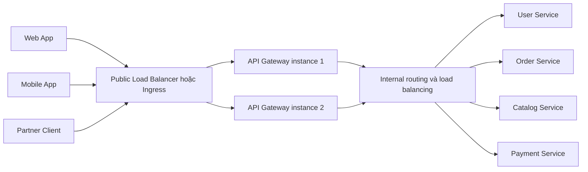
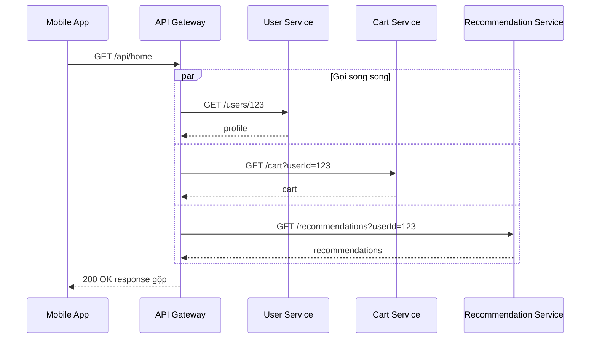

# API Gateway Pattern — Cổng vào hệ thống Microservice

## Mục lục

- [Tổng quan](#tổng-quan)
- [Vấn đề khi không có API Gateway](#vấn-đề-khi-không-có-api-gateway)
- [Cơ chế hoạt động](#cơ-chế-hoạt-động)
  - [Topology tham chiếu](#topology-tham-chiếu)
  - [Request flow](#request-flow)
- [Trách nhiệm cốt lõi của API Gateway](#trách-nhiệm-cốt-lõi-của-api-gateway)
  - [Request Routing](#request-routing)
  - [Authentication và Authorization](#authentication-và-authorization)
  - [Rate Limiting](#rate-limiting)
  - [API Aggregation](#api-aggregation)
  - [Load Balancing và Caching](#load-balancing-và-caching)
  - [Transformation TLS và CORS](#transformation-tls-và-cors)
  - [Request ID và Distributed Tracing](#request-id-và-distributed-tracing)
- [Use case E Commerce](#use-case-e-commerce)
  - [Request trang chủ](#request-trang-chủ)
  - [Chính sách partial failure](#chính-sách-partial-failure)
- [Topology và lựa chọn triển khai](#topology-và-lựa-chọn-triển-khai)
  - [Single Gateway và Multiple Gateways](#single-gateway-và-multiple-gateways)
  - [Gateway và Load Balancer](#gateway-và-load-balancer)
  - [Gateway và BFF](#gateway-và-bff)
- [Trade offs của API Gateway](#trade-offs-của-api-gateway)
- [Khi nào nên dùng và khi nào không nên dùng](#khi-nào-nên-dùng-và-khi-nào-không-nên-dùng)
- [Lỗi thường gặp](#lỗi-thường-gặp)
- [Vận hành và observability](#vận-hành-và-observability)
  - [High Availability và scaling](#high-availability-và-scaling)
  - [Timeout retry và Circuit Breaker](#timeout-retry-và-circuit-breaker)
  - [Logging metrics và tracing](#logging-metrics-và-tracing)
  - [Health check và deployment](#health-check-và-deployment)
- [Checklist triển khai](#checklist-triển-khai)
- [Liên kết liên quan](#liên-kết-liên-quan)

---

## Tổng quan

**API Gateway** là một **single entry point** (điểm vào duy nhất) giữa client bên ngoài và hệ thống Microservice. Web App, Mobile App hoặc partner gọi vào một public endpoint. Gateway tiếp nhận request, áp dụng các policy dùng chung rồi chuyển request đến service phù hợp.

Các policy dùng chung này thường được gọi là **cross-cutting concerns**. Chúng là những chức năng không thuộc riêng một domain, chẳng hạn như `Request Routing`, `Authentication`, `Rate Limiting`, logging và tracing. Gateway cũng có thể gộp response từ nhiều service hoặc chuyển đổi protocol khi use case cần.

Gateway nằm ở **edge**, tức ranh giới giữa traffic bên ngoài và mạng nội bộ. Đây là traffic **North-South** (client đi vào hoặc đi ra hệ thống). Service-to-service traffic **East-West** không nên vòng lại qua Gateway chỉ để dùng Gateway như một proxy chung.

> **Phạm vi của pattern:** Gateway nên giữ phần edge và cross-cutting concerns. Business rule như tính giá, áp mã giảm giá, giữ tồn kho hoặc quyết định trạng thái đơn hàng vẫn thuộc về domain service. Khi nhu cầu response khác nhau theo từng loại client, có thể kết hợp Gateway với [BFF](../07-api-gateway.md).

## Vấn đề khi không có API Gateway

Nếu client gọi trực tiếp từng service, topology nội bộ bị lộ ra ngoài và mỗi client phải tự biết cách kết nối đến nhiều endpoint:

```text
❌ Client gọi trực tiếp từng service:

  Mobile App
      ├── GET https://user-service:8081/api/users/123
      ├── GET https://order-service:8082/api/orders?userId=123
      ├── GET https://product-service:8083/api/products/456
      └── GET https://review-service:8084/api/reviews?productId=456
```

Cách này tạo ra một số vấn đề:

- **Tight coupling với topology:** client phải biết hostname, port và contract của từng service.
- **Nhiều round trip:** một màn hình có thể cần nhiều request độc lập. Chi phí này dễ thấy hơn trên Mobile App hoặc mạng có băng thông thấp.
- **Logic dùng chung bị lặp:** từng service hoặc từng client phải tự xử lý Authentication, Rate Limiting, CORS và một phần SSL.
- **Thay đổi khó lan truyền có kiểm soát:** service đổi URL hoặc port có thể buộc nhiều client cập nhật cùng lúc.
- **Thiếu điểm quan sát chung:** không có một nơi rõ ràng để ghi access log, đo latency và gắn request context cho traffic từ client.

Gateway không làm mất các vấn đề trong service. Nó tạo ra một ranh giới ổn định để client không phải phụ thuộc trực tiếp vào cách hệ thống được chia thành các service.

## Cơ chế hoạt động

### Topology tham chiếu

Trong môi trường production, một public endpoint thường trỏ đến một cụm Gateway thay vì một instance duy nhất. Public Load Balancer hoặc Ingress phân phối request đến các Gateway instance. Gateway sau đó route đến service discovery, internal Load Balancer hoặc trực tiếp đến service tùy hạ tầng.



Gateway có thể gọi nhiều service trong một request aggregation. Tuy nhiên, các cuộc gọi như `Order Service` gọi `Payment Service` thường là service-to-service traffic riêng. Luồng đó cần cơ chế bảo vệ và tracing ở application hoặc [Service Mesh](../13-orchestration.md), không mặc nhiên đi qua Gateway.

### Request flow

Một request đi qua Gateway thường có các bước sau:

1. **Tiếp nhận request:** Gateway nhận HTTPS request, kiểm tra method, path, header và kích thước request theo policy.
2. **Xác thực danh tính:** Gateway validate access token hoặc API key. Token không hợp lệ hoặc hết hạn bị từ chối sớm với `401 Unauthorized`.
3. **Áp dụng policy:** Gateway kiểm tra Rate Limiting, CORS và các policy edge khác.
4. **Route request:** Gateway chọn upstream dựa trên path, host, method, header hoặc API version. Nếu service có nhiều instance, request được phân phối đến một instance phù hợp.
5. **Gọi upstream:** Với route một-một, Gateway forward request. Với aggregation, Gateway fan-out đến nhiều service, thường theo kiểu song song.
6. **Trả response:** Gateway nhận response, có thể filter hoặc transform dữ liệu, ghi metrics và log rồi trả kết quả về client.

Mỗi upstream call cần có timeout rõ ràng. Aggregation cần thêm chính sách khi một downstream chậm hoặc thất bại; nếu không, một service phụ có thể làm chậm cả request chính.

## Trách nhiệm cốt lõi của API Gateway

### Request Routing

**Request Routing** là việc ánh xạ public request đến đúng service. Quy tắc route có thể dựa trên path, host, HTTP method, header hoặc query parameter.

| Public route | Upstream | Ý nghĩa |
|---|---|---|
| `/api/users/**` | User Service | Quản lý profile và user resource |
| `/api/orders/**` | Order Service | Tạo và tra cứu đơn hàng |
| `/api/products/**` | Catalog Service | Đọc product catalog |
| `/api/payments/**` | Payment Service | Thao tác thanh toán |

Client chỉ cần biết public contract. Client không cần biết service chạy ở port nào hoặc có bao nhiêu instance. Gateway cũng có thể route `/api/v2/**` đến phiên bản mới trong thời gian API migration, nhưng public contract vẫn cần được version và document rõ ràng.

### Authentication và Authorization

Gateway thường là nơi **Authentication** (xác thực danh tính) được kiểm tra đầu tiên. Ví dụ với JWT, Gateway có thể kiểm tra signature, expiration và issuer trước khi forward request. Khi policy yêu cầu, các claim phù hợp cũng được kiểm tra theo audience của API.

Sau Authentication, Gateway truyền user context đến service qua một kênh nội bộ được bảo vệ. Service vẫn phải thực hiện **Authorization** (phân quyền), nhất là kiểm tra user có được truy cập đúng resource hay không.

| Tình huống | Phản hồi điển hình | Trách nhiệm |
|---|---|---|
| Không có token hoặc token không hợp lệ | `401 Unauthorized` | Gateway hoặc lớp xác thực chung |
| Token hợp lệ nhưng không có quyền | `403 Forbidden` | Gateway policy hoặc domain service |
| User có quyền chung nhưng không sở hữu resource | Từ chối theo policy của API | Domain service |

Gateway nên loại bỏ hoặc ghi đè các identity header do client tự gửi trước khi thêm user context của chính nó. Không nên coi một header từ Internet là bằng chứng danh tính. Với traffic nội bộ có yêu cầu bảo mật cao, có thể bổ sung mTLS; việc Gateway đã validate token không tự động bảo vệ mọi service-to-service call.

### Rate Limiting

**Rate Limiting** giới hạn số request trong một khoảng thời gian để bảo vệ Gateway và backend khỏi một client hoặc một nhóm client gửi quá nhiều traffic. Key giới hạn có thể là API key, user, tenant, IP, route hoặc tier dịch vụ.

Một số chiến lược thường gặp:

| Chiến lược | Đặc điểm |
|---|---|
| **Fixed Window** | Đơn giản, nhưng có thể tạo burst ở ranh giới hai window |
| **Sliding Window** | Tính theo cửa sổ trượt nên phân bổ mượt hơn |
| **Token Bucket** | Cho phép burst có giới hạn trong khi vẫn giữ tốc độ trung bình |

Khi vượt quota, Gateway nên trả response có thể xử lý được:

```text
HTTP/1.1 429 Too Many Requests
Retry-After: 30
X-RateLimit-Limit: 100
X-RateLimit-Remaining: 0
```

Nếu Gateway chạy nhiều instance, cần xác định quota là **theo từng instance** hay **theo toàn bộ client**. Quota toàn client cần một cơ chế state dùng chung hoặc một lớp rate limiter phù hợp; nếu không, cùng một client có thể nhận hạn mức khác nhau tùy instance xử lý request.

### API Aggregation

**API Aggregation** cho phép client gọi một endpoint, còn Gateway gọi nhiều service và gộp các response. Pattern này hữu ích khi một màn hình cần dữ liệu từ nhiều domain nhưng client không cần biết topology phía sau.

Ví dụ `GET /api/home` có thể lấy profile từ User Service, giỏ hàng từ Cart Service và gợi ý từ Recommendation Service. Các call độc lập nên được thực hiện song song. Gateway cần tránh biến aggregation thành một workflow nghiệp vụ có nhiều điều kiện và rollback; phần đó thuộc domain service hoặc một pattern điều phối phù hợp.

Aggregation luôn làm tăng trách nhiệm xử lý lỗi của Gateway. Mỗi downstream nên có timeout riêng. Response cũng cần quy định rõ phần nào bắt buộc, phần nào có thể thiếu. Một response giảm chất lượng có chủ đích tốt hơn việc để một service phụ làm hỏng toàn bộ trang.

### Load Balancing và Caching

Gateway có thể phân phối request giữa nhiều instance của một service. Các thuật toán thường gặp gồm:

- **Round Robin:** luân phiên các instance.
- **Least Connections:** ưu tiên instance đang có ít connection hơn.
- **Weighted:** phân phối theo trọng số, hữu ích khi các instance có năng lực khác nhau.

Gateway cũng có thể cache response nếu sản phẩm hỗ trợ cơ chế này. Nên ưu tiên dữ liệu đọc, ít thay đổi và có thể chấp nhận TTL, chẳng hạn product catalog hoặc configuration công khai. Không nên cache mù các mutation như `POST`, `PUT`, `DELETE`, hoặc dữ liệu theo user như giỏ hàng nếu chưa thiết kế key, quyền truy cập và invalidation chính xác.

Cache cần có TTL và có thể kết hợp `ETag` hoặc `Cache-Control`. Cache không thay thế việc xác định độ tươi của dữ liệu; response cũ vẫn là lỗi nếu nghiệp vụ yêu cầu dữ liệu hiện tại.

### Transformation TLS và CORS

Gateway có thể làm các phép chuyển đổi ở biên:

- Chuyển REST/JSON ở phía client sang gRPC/Protobuf ở phía service.
- Filter trường nội bộ hoặc sensitive field trước khi trả response.
- Đổi tên hoặc rút gọn response cho một public contract đã được xác định.
- Thêm request ID, trace context hoặc header nội bộ sau khi đã kiểm tra nguồn request.

**SSL Termination** (kết thúc TLS tại Gateway) tập trung việc quản lý certificate ở một nơi và giảm phần xử lý TLS lặp lại trong các service. Nếu Gateway chuyển tiếp bằng HTTP plaintext, traffic bên trong cần nằm trong network được kiểm soát. Với yêu cầu bảo mật cao, có thể dùng mTLS giữa Gateway và service hoặc dùng Service Mesh để mã hóa traffic nội bộ.

**CORS** (Cross-Origin Resource Sharing) có thể được cấu hình tại Gateway để Browser nhận một policy thống nhất. Gateway cần chỉ cho phép origin, method và header cần thiết; không nên dùng wildcard cho các API có credentials nếu policy bảo mật không cho phép.

### Request ID và Distributed Tracing

Gateway là một entry point phù hợp để tạo `Request ID` hoặc `Correlation ID` nếu request chưa có ID. ID này được ghi vào access log và forward cho service đầu tiên. Nó giúp tìm một request cụ thể trong log, nhưng không thay thế `Trace ID` của Distributed Tracing.

Với tracing, Gateway tạo hoặc tiếp nhận trace context rồi truyền tiếp theo chuẩn như `traceparent`. OpenTelemetry có thể tự động tạo span và propagate context. Các call từ service này sang service khác không quay lại Gateway, vì vậy service hoặc Service Mesh phải tiếp tục propagate trace context.

| Dữ liệu | Mục đích | Ví dụ quan sát tại Gateway |
|---|---|---|
| Request ID | Tìm một request trong log và hỗ trợ điều tra | `X-Request-ID` |
| Trace ID | Ghép các span và tìm hop gây chậm | `traceparent` hoặc hệ thống tracing tương ứng |
| Route và upstream | Biết request được xử lý ở đâu | `/api/orders` → Order Service |

Không ghi access token, password hoặc dữ liệu thanh toán vào log. Log cần đủ context để điều tra nhưng phải che dữ liệu nhạy cảm.

## Use case E Commerce

### Request trang chủ

Trang chủ của một sàn E-Commerce cần profile user, giỏ hàng và danh sách gợi ý. Nếu Mobile App gọi từng service, ứng dụng phải quản lý nhiều request và tự ghép dữ liệu. Với API Aggregation, app gọi một endpoint:



Một response có thể có dạng:

```json
{
  "user": { "name": "An", "tier": "GOLD" },
  "cart": { "items": 3, "total": 1250000 },
  "recommendations": [
    { "id": "P100", "name": "Tai nghe không dây" }
  ],
  "_meta": { "degraded": [] }
}
```

Gateway chịu trách nhiệm gọi song song và ghép cấu trúc response. Gateway không nên tự quyết định giá, khuyến mãi hoặc điều kiện áp dụng của đơn hàng. Những quyết định đó vẫn thuộc service sở hữu domain tương ứng.

### Chính sách partial failure

**Partial failure** là tình huống một phần hệ thống thất bại trong khi các phần khác vẫn có thể trả kết quả. Gateway cần định nghĩa chính sách trước thay vì để mỗi endpoint xử lý khác nhau.

| Phần dữ liệu | Ví dụ | Cách xử lý có thể chọn |
|---|---|---|
| Bắt buộc | User context hoặc dữ liệu cần để render flow chính | Timeout hoặc lỗi downstream làm request thất bại |
| Bổ trợ | Recommendations hoặc nội dung cá nhân hóa | Trả phần còn lại, đặt trường là `null` hoặc danh sách rỗng và ghi nhận degraded state |
| Không rõ trạng thái | Downstream phản hồi quá hạn | Trả lỗi hoặc fallback theo contract, đồng thời ghi log và metric |

Ví dụ, nếu Recommendation Service lỗi, Gateway vẫn có thể trả profile và cart:

```json
{
  "user": { "name": "An", "tier": "GOLD" },
  "cart": { "items": 3, "total": 1250000 },
  "recommendations": null,
  "_meta": { "degraded": ["recommendations"] }
}
```

Đây chỉ là một response contract mẫu. Nếu Payment Service hoặc một bước bắt buộc của checkout thất bại, Gateway không được biến trạng thái đó thành thành công chỉ để giữ HTTP `200`. Partial failure phải phù hợp với ý nghĩa nghiệp vụ của endpoint.

## Topology và lựa chọn triển khai

### Single Gateway và Multiple Gateways

`Single Gateway` nói về một logical entry point, không có nghĩa hệ thống chỉ chạy một process. Logical entry point đó vẫn nên được triển khai thành nhiều instance khi cần High Availability.

| Lựa chọn | Ưu điểm | Chi phí và rủi ro |
|---|---|---|
| **Single Gateway** | Cấu hình policy tập trung, client dễ dùng, vận hành route đơn giản | Có thể thành bottleneck hoặc tạo blast radius lớn nếu mọi client phụ thuộc cùng một deployment |
| **Multiple Gateways** | Có thể tách theo client, vùng hoặc boundary; giảm ảnh hưởng chéo và tối ưu policy | Nhiều cấu hình, nhiều pipeline và nguy cơ lặp logic cần quản lý |

Multiple Gateways không tự động trở thành BFF. Nếu một Gateway chỉ route và áp dụng policy, nó vẫn là API Gateway. Khi lớp riêng cho Web hoặc Mobile do frontend team sở hữu và tối ưu response theo UX, lớp đó gần với BFF hơn.

### Gateway và Load Balancer

Gateway có thể load balance đến các instance của service, nhưng bản thân Gateway cũng cần được phân phối traffic khi có nhiều instance:

```text
Internet
   │
   ▼
┌─────────────────────────┐
│ Public Load Balancer    │  health check Gateway
│ hoặc Ingress            │
└───────────┬─────────────┘
            │
      ┌─────┴─────┐
      ▼           ▼
┌──────────┐ ┌──────────┐
│ Gateway 1│ │ Gateway 2│
└────┬─────┘ └────┬─────┘
     └──────┬─────┘
            ▼
┌─────────────────────────┐
│ Service discovery hoặc  │  route và chọn instance
│ internal Load Balancer  │
└───────────┬─────────────┘
            ▼
      Service instances
```

Public Load Balancer hoặc Ingress bảo vệ High Availability của Gateway. Internal Load Balancer, service discovery hoặc cơ chế tương đương giúp tìm và kiểm tra các upstream instance. Tách hai trách nhiệm này giúp Gateway tập trung vào route và policy thay vì tự gánh toàn bộ health check của hạ tầng.

### Gateway và BFF

Hai pattern có thể cùng xuất hiện nhưng giải quyết hai lớp vấn đề khác nhau:

| Tiêu chí | API Gateway | BFF |
|---|---|---|
| Mục tiêu chính | Một edge entry point và cross-cutting policy | API shape tối ưu cho một loại frontend |
| Ownership thường gặp | Platform hoặc Infrastructure team | Team Web, Mobile hoặc frontend tương ứng |
| Logic chính | Route, Authentication, Rate Limiting, transform có giới hạn | Aggregation và transformation theo nhu cầu client |
| Quan hệ | Có thể đứng ngoài BFF | Có thể được route từ Gateway |

Không nên đưa toàn bộ logic của nhiều BFF vào một Gateway để tránh thêm deployment. Ngược lại, không nên dùng BFF để thay thế các policy edge dùng chung nếu Gateway đã là nơi phù hợp cho chúng.

## Trade offs của API Gateway

| Lợi ích | Đánh đổi |
|---|---|
| Client chỉ biết một public URL và không phụ thuộc topology nội bộ | Thêm một network hop, nên có thể tăng latency |
| Authentication, Rate Limiting, CORS và logging có thể quản lý tập trung | Gateway có thể thành bottleneck hoặc single point of failure nếu không chạy HA |
| Aggregation giảm số round trip ở client | Fan-out làm Gateway phức tạp hơn và phải xử lý partial failure |
| Hệ thống nội bộ được che giấu khỏi client | Public API vẫn cần versioning và backward compatibility |
| SSL Termination tập trung quản lý certificate | Nếu dùng plaintext phía trong, traffic nội bộ có rủi ro khi network bị xâm nhập |
| Cache có thể giảm tải backend | Dữ liệu có thể stale và cần TTL hoặc invalidation đúng |

Nói ngắn gọn: Gateway có giá trị khi lợi ích của một edge boundary lớn hơn chi phí của một lớp network và một thành phần phải vận hành độc lập.

## Khi nào nên dùng và khi nào không nên dùng

| Nên dùng khi | Không nên hoặc chưa cần khi |
|---|---|
| Có nhiều service phía sau, thường từ 2–3 service trở lên | Hệ thống chỉ có một service và chưa có edge policy cần tập trung |
| Có nhiều loại client như Web, Mobile hoặc partner | Một client nội bộ chỉ gọi một service trong cùng network |
| Cần Authentication, Rate Limiting, CORS hoặc policy edge thống nhất | Ingress hoặc reverse proxy hiện tại đã đủ routing và TLS, không cần aggregation hay policy bổ sung |
| Muốn che giấu hostname, port và topology nội bộ | Chỉ muốn có một nơi để đặt business logic hoặc workflow phức tạp |
| Client cần một response gộp từ nhiều service | Team chưa sẵn sàng vận hành thêm HA, timeout, observability và capacity cho Gateway |

Nếu hệ thống còn nhỏ, có thể bắt đầu bằng reverse proxy hoặc Ingress có cấu hình đơn giản. Khi xuất hiện nhu cầu Authentication, quota, aggregation hoặc public API ổn định, hãy đánh giá việc mở rộng thành API Gateway thay vì thêm logic rải rác vào từng service.

## Lỗi thường gặp

1. **Đưa business logic vào Gateway:** Logic như tính giá, áp giảm giá, đặt hàng hoặc điều phối rollback khiến Gateway thành một mini monolith. Gateway nên route và áp policy; domain service sở hữu nghiệp vụ.
2. **Aggregation tuần tự:** Gọi User, Cart rồi Recommendation lần lượt làm latency cộng dồn. Các call độc lập nên chạy song song và có timeout riêng.
3. **Không đặt timeout hoặc đặt retry không kiểm soát:** Một upstream chậm có thể giữ connection quá lâu. Retry vô hạn hoặc retry đồng thời ở nhiều tầng còn có thể tạo retry storm. Chỉ retry lỗi transient, giới hạn số lần và dùng backoff phù hợp.
4. **Retry request mutation không có idempotency:** Retry `POST` tạo đơn hoặc thanh toán có thể tạo tác động lặp. Cần contract idempotency ở API trước khi cho phép retry.
5. **Không có partial failure policy:** Một Recommendation Service không quan trọng lại làm hỏng toàn bộ trang chủ. Hãy phân biệt dữ liệu bắt buộc và dữ liệu bổ trợ.
6. **Chạy một Gateway instance duy nhất:** Gateway chết sẽ chặn toàn bộ client dù các service phía sau vẫn khỏe. Cần nhiều instance, Load Balancer hoặc Ingress và health check.
7. **Dùng cùng Gateway cho external và internal traffic:** Điều này làm policy, blast radius và đường debug khó phân định. Service-to-service nên có đường đi và cơ chế resilience phù hợp riêng.
8. **Cache mọi response hoặc ghi log mọi payload:** Cache mutation và dữ liệu cá nhân có thể trả dữ liệu cũ hoặc sai người. Log nguyên token, password hoặc thông tin thanh toán tạo rủi ro bảo mật.

## Vận hành và observability

### High Availability và scaling

Gateway là đường vào chung nên cần được xem như một thành phần production độc lập:

- Chạy nhiều Gateway instance trên các failure domain phù hợp.
- Đặt Public Load Balancer hoặc Ingress ở phía trước và cấu hình health check để loại instance không sẵn sàng.
- Theo dõi request rate, latency, error rate, số connection, CPU và memory để quyết định capacity.
- Giới hạn kích thước request, dùng connection pooling hợp lý và tránh để một route chiếm hết tài nguyên của Gateway.
- Kiểm thử tải với các route aggregation. Gateway không chỉ cần chịu request trực tiếp; nó còn tạo thêm upstream calls khi fan-out.

Một public URL có thể là single entry point về mặt contract nhưng không nên là single point of failure về mặt triển khai.

### Timeout retry và Circuit Breaker

Mỗi upstream route cần có timeout rõ ràng. Gateway nên giữ một request budget tổng thể và phân bổ budget đó cho từng downstream; timeout của downstream không nên dài hơn thời gian client còn chờ.

Retry chỉ phù hợp với lỗi có khả năng tạm thời như connection reset hoặc một số lỗi `5xx`. Số lần retry phải nhỏ, có backoff và không được làm vượt request budget. Với request làm thay đổi dữ liệu, chỉ retry khi API có cơ chế idempotency rõ ràng. Xem thêm [Resilience Patterns](../10-resilience-patterns.md).

**Circuit Breaker** là proxy theo dõi lỗi và ngắt call đến upstream đang gặp vấn đề. Ở trạng thái `OPEN`, Gateway có thể fail fast hoặc trả fallback/`503 Service Unavailable`; sau một thời gian, trạng thái `HALF-OPEN` cho phép thử một số request trước khi đóng mạch lại.

Gateway Circuit Breaker chỉ bảo vệ luồng client đi qua Gateway. Nó không tự bảo vệ `Order Service` gọi trực tiếp `Payment Service`, cron job hoặc message consumer. Những luồng đó cần Circuit Breaker ở application level hoặc Service Mesh.

### Logging metrics và tracing

Gateway nên expose dữ liệu đủ để trả lời ba câu hỏi: traffic đang tăng ở đâu, request chậm ở đâu và lỗi phát sinh ở hop nào.

| Nhóm | Nên theo dõi |
|---|---|
| **Request metrics** | Request rate, status code, error rate và latency P50/P95/P99 theo route |
| **Upstream metrics** | Latency và error của từng downstream, timeout, Circuit Breaker open |
| **Policy metrics** | Số `429`, cache hit/miss và request bị từ chối bởi Authentication |
| **Resource metrics** | Active connections, connection pool, CPU, memory và saturation |
| **Structured logs** | Request ID, Trace ID, route, upstream, status, latency và lý do lỗi |
| **Distributed traces** | Span của Gateway và context được propagate đến service kế tiếp |

Log nên là structured logging để có thể lọc theo route, status hoặc `Request ID`. Cần mask token, password, PII và dữ liệu thanh toán. Dùng [Observability & Evolvability](../11-observability-evolvability.md) để thiết kế Correlation ID, metrics và Distributed Tracing xuyên các service.

### Health check và deployment

- Health check của Gateway phải phân biệt instance còn chạy với instance sẵn sàng nhận traffic.
- Upstream health check cần loại instance lỗi khỏi route, nhưng không nên biến một dependency phụ tạm thời thành lý do làm cả Gateway mất readiness nếu contract không yêu cầu.
- Khi thay đổi route hoặc policy, kiểm thử các đường thành công, `401`, `403`, `429`, timeout và upstream `5xx`.
- Có thể rollout theo canary hoặc từng nhóm Gateway instance để phát hiện lỗi policy trước khi ảnh hưởng toàn bộ traffic.
- Giữ public API backward compatible trong thời gian migration và chuẩn bị rollback cho cả binary/configuration lẫn route mapping.

## Checklist triển khai

- [ ] Public endpoint và routing rule của từng API đã được xác định.
- [ ] Client không truy cập trực tiếp internal service.
- [ ] Authentication và cách truyền user context đã được thống nhất.
- [ ] Authorization ở domain service đã được kiểm tra, không chỉ dựa vào Gateway.
- [ ] Rate Limiting có key, quota và response `429` rõ ràng.
- [ ] Mỗi upstream route có timeout và giới hạn retry.
- [ ] API Aggregation có fan-out song song và partial failure policy.
- [ ] Circuit Breaker hoặc cơ chế fail fast đã được cấu hình cho downstream phù hợp.
- [ ] Dữ liệu cache có TTL và quy tắc không cache rõ ràng.
- [ ] CORS, TLS và mTLS được chọn theo trust boundary thực tế.
- [ ] Gateway chạy nhiều instance sau Load Balancer hoặc Ingress.
- [ ] Health check loại được instance không sẵn sàng.
- [ ] Request ID, Trace ID, access log và metrics đã được kiểm tra trong staging.
- [ ] Log đã mask token, password, PII và dữ liệu thanh toán.
- [ ] Load test, canary rollout và rollback route đã được diễn tập.

## Liên kết liên quan

| Tài liệu | Liên quan |
|---|---|
| [Inter-Service Communication](../06-inter-service-communication.md) | REST, gRPC và các cách giao tiếp mà Gateway route đến |
| [API Gateway tổng quan](../07-api-gateway.md) | Chức năng, giải pháp triển khai và các biến thể của API Gateway |
| [Service Discovery](../08-service-discovery.md) | Cách tìm service instance phía sau Gateway |
| [Resilience Patterns](../10-resilience-patterns.md) | Timeout, Retry, Circuit Breaker và Fallback |
| [Observability & Evolvability](../11-observability-evolvability.md) | Structured Logging, Correlation ID, Metrics và Distributed Tracing |
| [Orchestration](../13-orchestration.md) | Ingress, Service Mesh và networking trong Kubernetes |
| [Security](../15-security.md) | JWT, OAuth2, Authorization, mTLS và CORS |
