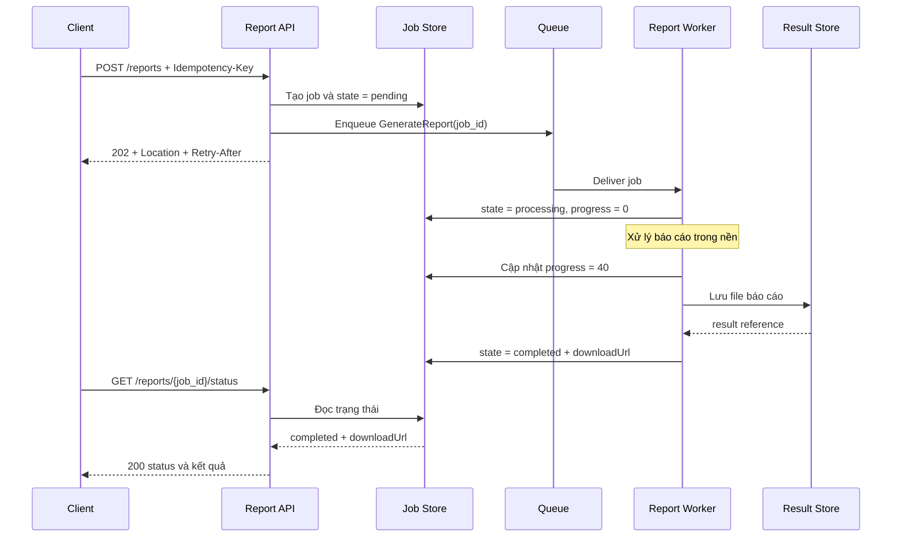
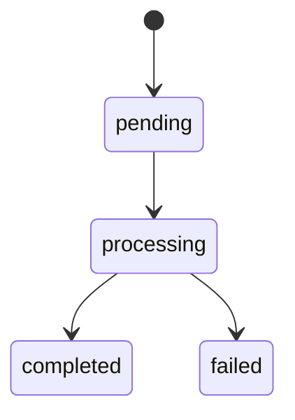

# Async Request-Reply Pattern — Yêu cầu–phản hồi bất đồng bộ

## Mục lục

- [Tổng quan](#tổng-quan)
- [Vấn đề giải quyết](#vấn-đề-giải-quyết)
  - [Tác vụ dài và timeout](#tác-vụ-dài-và-timeout)
  - [Retry có thể tạo tác vụ trùng](#retry-có-thể-tạo-tác-vụ-trùng)
- [Mô hình hoạt động](#mô-hình-hoạt-động)
  - [Các thành phần](#các-thành-phần)
  - [Luồng request và trạng thái job](#luồng-request-và-trạng-thái-job)
  - [Correlation ID và Job ID](#correlation-id-và-job-id)
  - [Queue và Worker](#queue-và-worker)
- [Contract HTTP](#contract-http)
  - [Tạo job bằng POST](#tạo-job-bằng-post)
  - [Tra cứu trạng thái](#tra-cứu-trạng-thái)
  - [Nhận kết quả](#nhận-kết-quả)
- [Use case xuất báo cáo](#use-case-xuất-báo-cáo)
  - [Luồng tạo và xử lý báo cáo](#luồng-tạo-và-xử-lý-báo-cáo)
  - [Ví dụ request và response](#ví-dụ-request-và-response)
- [Polling, Webhook và WebSocket](#polling-webhook-và-websocket)
  - [Polling](#polling)
  - [Webhook](#webhook)
  - [WebSocket và SSE](#websocket-và-sse)
- [Idempotency và Retry](#idempotency-và-retry)
  - [Idempotency khi tạo job](#idempotency-khi-tạo-job)
  - [Idempotency khi Worker xử lý](#idempotency-khi-worker-xử-lý)
  - [Retry và backoff](#retry-và-backoff)
- [Khi nào nên dùng và khi nào không nên dùng](#khi-nào-nên-dùng-và-khi-nào-không-nên-dùng)
- [Trade-offs](#trade-offs)
- [Lỗi thường gặp](#lỗi-thường-gặp)
- [Vận hành](#vận-hành)
  - [Theo dõi job và queue](#theo-dõi-job-và-queue)
  - [Observability và correlation](#observability-và-correlation)
  - [TTL và dọn dẹp dữ liệu](#ttl-và-dọn-dẹp-dữ-liệu)
  - [Runbook khi job bị kẹt hoặc lỗi](#runbook-khi-job-bị-kẹt-hoặc-lỗi)
  - [Bảo mật status và kết quả](#bảo-mật-status-và-kết-quả)
- [Checklist](#checklist)
- [Liên kết liên quan](#liên-kết-liên-quan)

---

## Tổng quan

**Async Request-Reply** (yêu cầu–phản hồi bất đồng bộ) tách thời điểm nhận request khỏi thời điểm hoàn tất xử lý. Client gửi yêu cầu tạo một tác vụ. API ghi nhận tác vụ, đưa công việc vào **queue** (hàng đợi), rồi trả về ngay một mã theo dõi. Một **Worker** (tiến trình xử lý nền) thực hiện công việc sau đó. Client tra cứu trạng thái hoặc nhận callback để lấy kết quả.

Ví dụ, một request xuất báo cáo lớn không cần giữ HTTP connection trong vài phút. API có thể trả `202 Accepted` khi đã nhận yêu cầu. Client dùng `Job ID` để biết tác vụ đang `pending`, `processing`, `completed` hay `failed`.

`202 Accepted` chỉ có nghĩa request đã được chấp nhận để xử lý. Nó không có nghĩa tác vụ đã hoàn tất. Vì vậy, Async Request-Reply khác với kiểu **fire-and-forget** (gửi rồi không có cách biết kết quả): pattern này vẫn có một contract để theo dõi trạng thái và lấy reply.

> **Phạm vi của pattern:** Queue vận chuyển công việc đến Worker, còn Job Store lưu trạng thái để client tra cứu. Hai phần này có thể dùng hạ tầng khác nhau. Pattern không bắt buộc client phải dùng Polling; Webhook, WebSocket hoặc SSE cũng có thể chuyển kết quả.

## Vấn đề giải quyết

### Tác vụ dài và timeout

Một số thao tác mất nhiều thời gian hơn request thông thường:

- Xuất báo cáo lớn.
- Transcode video.
- Huấn luyện model.
- Đồng bộ một batch dữ liệu.

Nếu xử lý đồng bộ, client phải giữ connection trong suốt thời gian chờ:

```text
❌ Xử lý đồng bộ:

Client ── POST /reports ──▶ API ──▶ xử lý vài phút
   │                         │
   │                         └─ giữ connection và request resource
   │
   └─ chờ response

Gateway hoặc Load Balancer timeout
   └─ client không biết job đã chạy đến đâu
      └─ client retry có thể tạo tác vụ thứ hai
```

Cách này tạo ra ba rủi ro chính:

- **Connection timeout:** Client, API Gateway hoặc Load Balancer có thể ngắt connection trước khi Worker hoàn tất.
- **Resource bị giữ lâu:** Request handler có thể giữ connection, thread hoặc resource liên quan trong thời gian dài.
- **Kết quả không rõ ràng:** Client timeout không chứng minh server đã hủy tác vụ. Tác vụ có thể vẫn đang chạy ở phía sau.

Async Request-Reply đưa thời gian xử lý dài ra khỏi request ban đầu:

```text
✅ Xử lý bất đồng bộ:

Client ── POST /reports ──▶ API ──▶ ghi job + enqueue
   │                         │
   ◀── 202 + status URL ─────┘

Worker xử lý trong nền
   │
Client ── GET /reports/{jobId}/status ──▶ trạng thái hoặc kết quả
```

Client chỉ chờ việc **tiếp nhận request**, không chờ toàn bộ công việc. API vẫn phải bảo đảm job được ghi nhận và có cơ chế đưa job vào queue; trả `202` không thể thay thế cho việc theo dõi phần xử lý phía sau.

### Retry có thể tạo tác vụ trùng

Giả sử server đã nhận request nhưng response bị mất do network timeout. Client không biết request có được chấp nhận hay chưa nên gửi lại:

```text
Request 1: POST /reports ──▶ Server nhận và bắt đầu job A
                            └─ response bị mất

Retry:    POST /reports ──▶ Server tạo thêm job B

Kết quả: cùng một yêu cầu tạo hai báo cáo.
```

Nếu thao tác có side effect như charge payment, gửi notification hoặc ghi file, việc trùng lặp còn có thể gây thiệt hại hoặc tốn tài nguyên. Do đó, bước tạo job phải có **idempotency** (xử lý lặp cùng một yêu cầu nhưng không tạo thêm tác động ngoài mong muốn).

## Mô hình hoạt động

### Các thành phần

| Thành phần | Vai trò | Ví dụ trong xuất báo cáo |
|---|---|---|
| **Client** | Gửi yêu cầu và theo dõi kết quả | Web App hoặc partner client |
| **API** | Xác thực request, tạo Job ID, ghi trạng thái và trả contract HTTP | `POST /api/reports` |
| **Job Store** | Lưu trạng thái, tiến độ, lỗi và thông tin kết quả của job | Bản ghi report `9f3c` |
| **Queue** | Đệm và phân phối công việc cho Worker | Message `GenerateReport` |
| **Worker** | Lấy job từ queue và thực hiện xử lý nền | Report Worker |
| **Result Store** | Lưu file hoặc kết quả lớn sau khi xử lý | Object storage hoặc file store |
| **Status/Result API** | Cho phép tra cứu trạng thái và tải kết quả | `GET /reports/9f3c/status` |

Job Store không nhất thiết phải là một database riêng. Điều quan trọng là status endpoint có một nguồn trạng thái bền vững để đọc, thay vì suy đoán từ việc message còn nằm trong queue.

### Luồng request và trạng thái job

Luồng điển hình gồm các bước sau:

1. Client gửi `POST` với thông tin tác vụ và `Idempotency-Key`.
2. API kiểm tra quyền và dữ liệu đầu vào.
3. API tạo một Job ID, ghi job ở trạng thái `pending` và chuẩn bị công việc vào queue.
4. API trả `202 Accepted`, `Location` trỏ đến status URL và có thể trả `Retry-After`.
5. Worker nhận message, chuyển job sang `processing` và cập nhật tiến độ nếu có thể đo được.
6. Worker ghi kết quả vào Result Store, rồi chuyển job sang `completed`; nếu không thể xử lý, chuyển sang `failed` cùng lý do.
7. Client Poll status URL hoặc nhận kết quả qua cơ chế push đã thống nhất.



Trạng thái là một phần của API contract. Một vòng đời thường dùng là:



| Trạng thái | Ý nghĩa | Dữ liệu nên có |
|---|---|---|
| `pending` | API đã ghi nhận job nhưng Worker chưa bắt đầu xử lý | `jobId`, thời điểm tạo, vị trí hoặc tên queue |
| `processing` | Worker đã nhận job và đang xử lý | `progress` nếu đo được, thời điểm bắt đầu, `attempt` |
| `completed` | Xử lý xong và kết quả đã sẵn sàng theo contract | `downloadUrl` hoặc result reference, thời điểm hoàn tất |
| `failed` | Không thể hoàn tất trong policy hiện tại | Error code/message an toàn, `retryable`, số lần thử |

Tên state có thể khác giữa các hệ thống. Điểm cần thống nhất là client biết state nào còn đang chạy, state nào kết thúc và cách lấy lý do khi `failed`. `progress` chỉ nên trả khi Worker có cách đo phù hợp; không nên tạo phần trăm giả khiến client hiểu sai.

### Correlation ID và Job ID

**Job ID** và **Correlation ID** có liên quan nhưng không thay thế nhau:

| ID | Phạm vi | Mục đích |
|---|---|---|
| **Job ID** | Một tác vụ được tạo bởi API | Làm identity của job, tạo status URL và liên kết với kết quả |
| **Correlation ID** | Một request hoặc logical workflow xuyên các boundary | Nối log, trace và message từ Client, API, Queue đến Worker |
| **Idempotency-Key** | Một lần submit logic của client trong thời gian được quy định | Nhận diện request retry để không tạo thêm job |

Ví dụ, một request có thể mang các metadata sau:

```http
POST /api/reports HTTP/1.1
Idempotency-Key: monthly-sales-2025-09-user-123
X-Correlation-ID: req-91ab
```

API tạo `job_id = 9f3c`. Các log của API và Worker nên chứa cả `job_id` và `correlation_id`:

```json
{
  "service": "report-worker",
  "job_id": "9f3c",
  "correlation_id": "req-91ab",
  "state": "processing",
  "attempt": 1
}
```

`Job ID` giúp tìm trạng thái của một tác vụ. `Correlation ID` giúp nối tác vụ đó với request ban đầu và các bước liên quan. Không dùng Correlation ID làm khóa idempotency nếu contract không quy định như vậy. Cũng không dùng một status URL hoặc Job ID như bằng chứng người gọi có quyền xem dữ liệu.

Correlation ID cần được truyền qua message metadata khi job đi vào queue. Worker đọc metadata đó trước khi ghi log hoặc tạo downstream call. Nếu hệ thống dùng Distributed Tracing, có thể truyền thêm trace context; Trace ID và Correlation ID vẫn có vai trò khác nhau.

### Queue và Worker

Queue là vùng đệm cho công việc. Nó cho phép API hoàn tất request sớm và Worker xử lý theo năng lực hiện tại. Worker có thể scale độc lập với API, nhưng số Worker không nên tăng vượt khả năng của Result Store hoặc downstream dependency.

Một message trong queue nên mang đủ identity và thông tin để Worker tìm được job:

```json
{
  "job_id": "9f3c",
  "job_type": "monthly_sales",
  "correlation_id": "req-91ab",
  "attempt": 1
}
```

| Mối quan tâm | API | Queue/Worker |
|---|---|---|
| Tiếp nhận request | Validate input, tạo Job ID, ghi `pending` | Không nhận trực tiếp request của client |
| Xử lý công việc | Không chạy tác vụ nặng inline | Worker thực hiện và cập nhật state |
| Trạng thái | Trả status URL và contract HTTP | Ghi `processing`, tiến độ, `completed` hoặc `failed` |
| Retry | Nhận diện request submit lặp qua `Idempotency-Key` | Retry execution theo policy, có giới hạn |
| Quan sát | Log việc tạo job và enqueue | Log attempt, duration, error và state transition |

API cần có kế hoạch xử lý khi ghi Job Store và enqueue không hoàn tất cùng lúc. Có thể dùng cơ chế retry, đối soát hoặc pattern lưu intent phù hợp với hạ tầng. Không nên đánh dấu job đã sẵn sàng nếu message không thể được đưa vào queue mà không có cách phục hồi.

Thời điểm **ACK** (acknowledgment — xác nhận đã nhận message) cũng phải được quy định. ACK quá sớm rồi Worker bị crash có thể làm job không được xử lý lại. ACK quá muộn có thể tạo redelivery; vì vậy Worker vẫn cần idempotent khi queue có at-least-once delivery.

## Contract HTTP

### Tạo job bằng POST

Request tạo job nên chứa dữ liệu nghiệp vụ, `Idempotency-Key` và Correlation ID nếu client đã có workflow cần nối:

```http
POST /api/reports HTTP/1.1
Authorization: Bearer <access-token>
Idempotency-Key: monthly-sales-2025-09-user-123
X-Correlation-ID: req-91ab
Content-Type: application/json

{
  "type": "monthly_sales",
  "month": "2025-09"
}
```

Khi API đã chấp nhận việc cần làm:

```http
HTTP/1.1 202 Accepted
Location: /api/reports/9f3c/status
Retry-After: 30
X-Correlation-ID: req-91ab
Content-Type: application/json

{
  "jobId": "9f3c",
  "state": "pending",
  "statusUrl": "/api/reports/9f3c/status"
}
```

Các header và field có thể thay đổi theo API contract, nhưng response cần cho client biết ít nhất:

- Job ID hoặc một status URL ổn định.
- Request đã được chấp nhận nhưng chưa hoàn tất.
- Khi nào nên tra cứu lại nếu dùng Polling.

Nếu client gửi lại cùng `Idempotency-Key`, mục tiêu là trả về job đã tồn tại hoặc kết quả của lần submit trước thay vì tạo job mới. API cần quy định thời gian lưu key, phạm vi theo tenant/user và cách xử lý khi cùng key đi kèm payload khác.

### Tra cứu trạng thái

Client gọi status URL để xem job còn chờ, đang chạy hay đã kết thúc:

```http
GET /api/reports/9f3c/status HTTP/1.1
Authorization: Bearer <access-token>
X-Correlation-ID: req-91ab
```

Khi job đang chờ queue:

```json
{
  "jobId": "9f3c",
  "state": "pending",
  "progress": null,
  "createdAt": "2025-09-18T10:00:00Z"
}
```

Khi Worker đang xử lý:

```json
{
  "jobId": "9f3c",
  "state": "processing",
  "progress": 40,
  "startedAt": "2025-09-18T10:00:12Z"
}
```

Khi job lỗi, status nên cho biết lỗi có thể thử lại hay không mà không làm lộ stack trace hoặc secret:

```json
{
  "jobId": "9f3c",
  "state": "failed",
  "error": {
    "code": "REPORT_SOURCE_UNAVAILABLE",
    "message": "Không thể lấy dữ liệu nguồn.",
    "retryable": true
  }
}
```

HTTP `200` của status endpoint chỉ nói request tra cứu thành công. Client vẫn phải đọc `state` để biết job đã hoàn tất hay chưa. Ngược lại, API không nên trả `completed` trước khi kết quả thực sự sẵn sàng theo contract.

### Nhận kết quả

Khi hoàn tất, status response có thể trả một URL tải riêng thay vì nhúng file lớn vào response:

```json
{
  "jobId": "9f3c",
  "state": "completed",
  "downloadUrl": "/api/reports/9f3c/file",
  "completedAt": "2025-09-18T10:04:12Z"
}
```

`downloadUrl` cần được bảo vệ như một API bình thường. Người gọi phải được kiểm tra quyền trên job và dữ liệu báo cáo. Nếu kết quả có thời hạn, contract cần nói rõ URL hoặc file sẽ còn hợp lệ bao lâu.

Status response và file download là hai request khác nhau. Client có thể nhận `completed` nhưng vẫn cần xử lý lỗi khi tải file. API nên có cách báo lỗi rõ ràng và không coi việc có một URL trên status là bằng chứng file đã được đọc thành công.

## Use case xuất báo cáo

### Luồng tạo và xử lý báo cáo

Giả sử E-Commerce có API xuất báo cáo doanh số theo tháng. Việc tổng hợp dữ liệu và tạo file có thể kéo dài hơn thời gian chờ của một HTTP request.

| Bước | Thành phần | Hành động | Trạng thái job |
|---:|---|---|---|
| 1 | Client | Gửi loại báo cáo và tháng cần xuất | Chưa tạo |
| 2 | Report API | Xác thực, tạo `jobId = 9f3c`, ghi job và enqueue | `pending` |
| 3 | Report Worker | Lấy message, đọc dữ liệu và tạo file | `processing` |
| 4 | Report Worker | Lưu file vào Result Store | `processing` |
| 5 | Report API/Worker | Ghi URL kết quả và thời điểm hoàn tất | `completed` |
| 6 | Client | Poll status hoặc nhận callback rồi tải file | `completed` |

Nếu Worker gặp lỗi tạm thời khi đọc nguồn dữ liệu, retry có thể đưa job về xử lý lại theo policy. Nếu lỗi do loại báo cáo không hợp lệ, retry không làm thay đổi kết quả; job nên kết thúc với `failed` và lý do phù hợp.

### Ví dụ request và response

Client gửi request một lần với key ổn định:

```http
POST /api/reports HTTP/1.1
Authorization: Bearer <access-token>
Idempotency-Key: report-monthly-sales-2025-09-account-123
X-Correlation-ID: req-91ab
Content-Type: application/json

{
  "type": "monthly_sales",
  "month": "2025-09"
}
```

API trả lời ngay:

```http
HTTP/1.1 202 Accepted
Location: /api/reports/9f3c/status
Retry-After: 30

{
  "jobId": "9f3c",
  "state": "pending"
}
```

Client tra cứu sau khoảng thời gian được gợi ý:

```http
GET /api/reports/9f3c/status HTTP/1.1
Authorization: Bearer <access-token>
```

```json
{
  "jobId": "9f3c",
  "state": "processing",
  "progress": 35
}
```

Sau khi Worker lưu file:

```json
{
  "jobId": "9f3c",
  "state": "completed",
  "downloadUrl": "/api/reports/9f3c/file"
}
```

Nếu response `202` bị mất, client gửi lại cùng `Idempotency-Key`. API tìm lại mapping tới `9f3c`, thay vì tạo một báo cáo tháng thứ hai. Cơ chế này chỉ bảo vệ việc tạo job tại API; Worker vẫn phải xử lý duplicate message an toàn.

## Polling, Webhook và WebSocket

Async Request-Reply không quy định một cách duy nhất để chuyển reply về client. Lựa chọn phụ thuộc vào loại client, khả năng giữ connection và yêu cầu độ trễ.

| Tiêu chí | Polling | Webhook | WebSocket hoặc SSE |
|---|---|---|---|
| **Hướng giao tiếp** | Client hỏi status URL | Server gọi callback URL của client | Server push qua connection đang mở |
| **Độ trễ nhận kết quả** | Phụ thuộc chu kỳ Polling | Gần tức thời khi callback thành công | Tức thời khi connection còn sống |
| **Điều kiện phía client** | Chỉ cần gọi HTTP | Phải có endpoint nhận callback | Phải giữ và quản lý connection |
| **Chi phí chính** | Nhiều request status nếu Polling quá dày | Retry callback khi endpoint lỗi | Nhiều connection dài hạn và reconnect |
| **Phù hợp** | Browser, script và client công khai | B2B integration hoặc third-party | UI real-time như dashboard |
| **Điểm cần bảo vệ** | `Retry-After` và backoff | HMAC signature và quyền callback | Connection lifecycle và trạng thái khi reconnect |

### Polling

**Polling** là cách client gọi status URL theo chu kỳ:

```text
POST /reports ──▶ 202 + Location: /reports/9f3c/status

sau 30 giây: GET /reports/9f3c/status ──▶ pending
sau 60 giây: GET /reports/9f3c/status ──▶ processing, progress = 40
sau đó:      GET /reports/9f3c/status ──▶ completed + downloadUrl
```

Polling dễ triển khai vì client chỉ cần HTTP và không phải mở endpoint nhận callback. Đổi lại, mỗi lần Polling tạo thêm request dù trạng thái có thể chưa đổi.

API nên trả `Retry-After` để gợi ý thời điểm tra cứu lại. Client nên kết hợp **exponential backoff** (tăng dần khoảng chờ) và giới hạn tốc độ Polling. Khi state đã là `completed` hoặc `failed`, client phải dừng Polling.

### Webhook

Với **Webhook**, client đăng ký một callback URL. Khi job `completed` hoặc `failed`, server gửi event kết quả đến URL đó:

```http
POST https://partner.example.com/hooks/report HTTP/1.1
X-Correlation-ID: req-91ab
X-Signature: sha256=...
Content-Type: application/json

{
  "jobId": "9f3c",
  "state": "completed",
  "downloadUrl": "/api/reports/9f3c/file"
}
```

Webhook phù hợp khi client là partner hoặc third-party có endpoint công khai. Endpoint nhận callback cần:

- Kiểm tra chữ ký **HMAC** (Hash-based Message Authentication Code) để xác thực nguồn gửi.
- Kiểm tra quyền và schema của payload.
- Có idempotency vì callback có thể được gửi lại sau lỗi mạng hoặc timeout.
- Trả acknowledgment rõ ràng và có policy retry khi callback thất bại.

Server vẫn nên lưu status job. Webhook có thể thất bại, client có thể tạm thời không hoạt động hoặc người nhận cần tra cứu lại sau này. `downloadUrl` trong callback cũng phải được bảo vệ như URL trong status response.

### WebSocket và SSE

**WebSocket** giữ một connection hai chiều để server push tiến độ hoặc kết quả. **SSE** (Server-Sent Events) là stream một chiều từ server đến client, phù hợp khi client chỉ cần nhận update.

Hai cách này phù hợp với UI cần cập nhật gần tức thời. Chúng yêu cầu quản lý connection dài hạn, reconnect và trường hợp client mất mạng. Khi reconnect, client nên có cách lấy lại state hiện tại từ status endpoint thay vì giả định mọi update trước đó đều đã nhận.

WebSocket hoặc SSE là kênh phát kết quả. Chúng không thay thế Job Store, idempotency và authorization. Một client mất connection vẫn cần biết job cuối cùng là `pending`, `processing`, `completed` hay `failed`.

## Idempotency và Retry

Async flow có nhiều điểm có thể retry: client retry `POST`, queue redeliver message, Worker retry dependency và server retry Webhook. Cần phân biệt từng lớp để không tạo ra tác động lặp.

| Lớp retry | Rủi ro | Cơ chế cần có |
|---|---|---|
| Client gửi lại `POST` | Tạo nhiều job cho một yêu cầu | `Idempotency-Key` và mapping key–job |
| Queue giao lại message | Worker chạy cùng job nhiều lần | Idempotent Worker hoặc dedupe theo Job ID |
| Worker gọi dependency | Tạo side effect lặp | Operation identity và contract idempotency |
| Server gửi Webhook lại | Partner nhận callback nhiều lần | Event ID/Job ID và consumer dedupe |

### Idempotency khi tạo job

`Idempotency-Key` là key do client tạo cho một lần submit logic. Khi request đầu tiên timeout nhưng server đã tạo job, request retry dùng cùng key để API tìm lại kết quả trước đó.

```text
Request 1:
  Idempotency-Key: report-monthly-sales-2025-09-account-123
  → tạo job 9f3c
  → response bị mất

Request retry với cùng key:
  Idempotency-Key: report-monthly-sales-2025-09-account-123
  → tìm thấy job 9f3c
  → không tạo job mới
```

API cần lưu mapping giữa key và job trong khoảng thời gian đủ cho client retry. Mapping nên gắn với phạm vi phù hợp như tenant hoặc user, để một client không thể dùng key của phạm vi khác. Nếu cùng key được dùng cho payload khác, API phải có contract rõ ràng; tiếp tục xử lý như một request mới là không an toàn.

`Idempotency-Key` không phải Correlation ID. Key dùng để dedupe submit, còn Correlation ID dùng để nối telemetry. Hai giá trị có thể cùng xuất hiện trong một request.

### Idempotency khi Worker xử lý

`Idempotency-Key` ở API không tự làm message trong queue idempotent. Queue có thể giao lại message khi Worker crash sau khi side effect đã xảy ra nhưng trước khi ACK. Worker cần dùng Job ID hoặc một operation identity ổn định để nhận diện lần xử lý đã được ghi nhận.

Ví dụ với report, Worker có thể kiểm tra state và result reference trước khi tạo lại file. Cách triển khai cụ thể phụ thuộc Result Store và khả năng dedupe. Với side effect như charge hoặc gửi notification, idempotency là yêu cầu bắt buộc trước khi cho phép retry tự động.

Worker cũng cần bảo vệ state transition. Một lần xử lý cũ không nên ghi đè kết quả của lần xử lý mới nếu message bị redeliver hoặc hoàn thành không đúng thứ tự. Quy tắc cập nhật phải được xác định trong Job Store contract.

### Retry và backoff

Chỉ retry lỗi **transient** (tạm thời), chẳng hạn network timeout hoặc dependency tạm unavailable. Không retry vô hạn các lỗi validation, authorization, payload sai schema hoặc loại báo cáo không tồn tại.

Một policy cơ bản gồm:

1. Phân loại lỗi có retry được hay không.
2. Giới hạn số attempt.
3. Dùng exponential backoff và jitter để tránh nhiều Worker retry cùng lúc.
4. Ghi `attempt`, lỗi cuối và thời điểm retry vào log hoặc Job Store.
5. Sau max attempts, chuyển job sang `failed` hoặc Dead Letter Queue theo khả năng của queue.

Retry ở nhiều tầng cần có giới hạn chung. Nếu client, API, queue và Worker đều retry không giới hạn, một lỗi nhỏ có thể biến thành retry storm và làm dependency quá tải. Xem thêm [Resilience Patterns](../10-resilience-patterns.md) để chọn timeout, Retry và backoff.

## Khi nào nên dùng và khi nào không nên dùng

| Nên dùng khi | Không nên hoặc chưa cần khi |
|---|---|
| Tác vụ dài, có thể vượt request timeout hoặc mất vài giây trở lên | Tác vụ nhanh, trả kết quả ngay bằng synchronous request sẽ đơn giản hơn |
| Client không thể hoặc không nên giữ connection trong thời gian xử lý | Caller cần kết quả ngay để quyết định bước tiếp theo |
| Cần theo dõi `pending`, tiến độ hoặc kết quả cuối | Yêu cầu strong consistency tức thời không cho phép trạng thái chờ |
| Muốn API và Worker scale độc lập, queue hấp thụ burst | Team chưa có khả năng vận hành queue, Job Store, retry và observability |
| Client có thể Polling hoặc nhận Webhook/push | Không có nhu cầu theo dõi và cũng không có contract kết quả rõ ràng |

Ví dụ, xuất báo cáo hoặc transcode video phù hợp vì người dùng có thể chờ theo trạng thái. Kiểm tra tồn kho ngay trước checkout thường không phù hợp nếu caller cần kết quả tức thời để quyết định cho phép thao tác tiếp theo.

Async không có nghĩa mọi request đều phải trở thành job. Chỉ đưa phần xử lý thực sự dài hoặc có thể chạy nền ra queue. Tác vụ nhanh nên giữ contract đơn giản nếu không có lý do rõ ràng để thêm Job Store và Worker.

## Trade-offs

| Lợi ích | Đánh đổi |
|---|---|
| Không giữ HTTP connection trong thời gian xử lý dài | Phải lưu Job Store, status và kết quả trong một khoảng thời gian |
| Giảm ảnh hưởng của timeout ở client, Gateway và Load Balancer | Client có trải nghiệm chờ và phải xử lý thêm state |
| Worker scale độc lập với API | Cần vận hành queue, Worker capacity và backpressure |
| Có thể hiển thị tiến độ hoặc retry trong nền | Progress không phải lúc nào cũng đo chính xác |
| `Idempotency-Key` giúp retry submit an toàn hơn | Phải thiết kế idempotency ở cả API và Worker |
| Client có nhiều cách nhận kết quả | Polling tạo traffic nền, Webhook cần bảo mật, WebSocket cần connection dài hạn |
| Có thể tách việc nặng khỏi request handler | Debug khó hơn nếu thiếu Job ID, Correlation ID và state transition log |

Pattern này chuyển complexity từ một request dài sang vòng đời của job. Giá trị chỉ xuất hiện khi hệ thống thực sự cần xử lý nền, theo dõi tiến độ hoặc hấp thụ thời gian chờ.

## Lỗi thường gặp

1. **Trả `202` nhưng vẫn xử lý inline:** Handler chạy việc nặng trước rồi mới trả response. Connection vẫn bị giữ và vấn đề timeout không được giải quyết. API phải enqueue công việc thật sự hoặc chuyển nó cho cơ chế xử lý nền.
2. **`POST` tạo job không idempotent:** Client timeout rồi retry làm sinh hai job. Bắt buộc thiết kế `Idempotency-Key` cho thao tác tạo job có thể được retry.
3. **Trả `202` trước khi job được ghi nhận:** API trả thành công nhưng không có Job Store record hoặc message không được enqueue. Client nhận status URL không thể dùng và hệ thống không có cách phục hồi.
4. **Polling quá dày:** Client gọi status mỗi 100 ms cho một job chạy nhiều phút. Dùng `Retry-After`, exponential backoff và dừng khi job ở state kết thúc.
5. **Không phân biệt `pending` với `completed`:** HTTP `200` của status request bị hiểu là job thành công. Client phải đọc field `state`.
6. **Status URL không kiểm quyền:** Ai có URL cũng xem hoặc tải báo cáo của người khác. Đây là rủi ro IDOR (Insecure Direct Object Reference); status và file đều phải authorize theo user hoặc tenant.
7. **Webhook không xác thực chữ ký:** Attacker có thể gửi callback giả làm job hoàn tất. Dùng HMAC và kiểm tra payload ở phía nhận.
8. **Retry không giới hạn hoặc retry lỗi không phù hợp:** Payload sai vẫn bị gửi đi nhiều lần, làm backlog và chi phí tăng. Chỉ retry lỗi transient, giới hạn attempt và ghi nhận job `failed` sau ngưỡng.
9. **Worker không idempotent:** Queue redelivery làm tạo file, gửi notification hoặc thực hiện side effect nhiều lần. Dedupe theo Job ID hoặc operation identity ổn định.
10. **Không truyền Correlation ID qua queue:** Log API và Worker không nối được với nhau. Ghi ID trong message metadata và bind nó vào logging context của Worker.
11. **Status lưu vĩnh viễn:** Job Store và metadata kết quả phình to theo thời gian. Đặt TTL, chính sách retention và quy trình dọn dẹp rõ ràng.

## Vận hành

### Theo dõi job và queue

Cần theo dõi cả API, Job Store, queue và Worker. Chỉ nhìn HTTP request rate sẽ không cho biết job có đang bị kẹt trong queue hay không.

| Nhóm | Tín hiệu nên theo dõi | Câu hỏi cần trả lời |
|---|---|---|
| **API** | Tỷ lệ `202`, lỗi tạo job, enqueue error, latency và idempotency replay | Request có được chấp nhận ổn định không? |
| **Job Store** | Số job theo state, tuổi job `pending` lâu nhất, processing duration | Job có bị kẹt ở một state không? |
| **Queue** | Queue depth, tuổi message cũ nhất, enqueue/dequeue error và redelivery | Backlog có tăng nhanh hơn năng lực xử lý không? |
| **Worker** | Số Worker healthy, active job, throughput, error, retry và attempt | Worker có nhận và hoàn tất job không? |
| **Result Store** | Lỗi ghi/đọc file, kích thước và thời gian lưu kết quả | `completed` có đi kèm kết quả dùng được không? |
| **Webhook/push** | Callback success, failure, retry và connection/reconnect | Client có nhận được reply không? |

Khi queue depth hoặc tuổi message tăng, có thể scale Worker trong giới hạn capacity của downstream. Không nên mở concurrency vô hạn chỉ để xóa backlog; cách đó có thể làm Result Store hoặc dependency tiếp tục quá tải.

Alert nên dựa trên SLA của từng loại job. Một báo cáo có thể chấp nhận chờ lâu hơn một tác vụ cập nhật dashboard. Vì vậy, cần theo dõi tuổi job và thời gian xử lý theo `job_type`, không chỉ dùng một ngưỡng chung.

### Observability và correlation

Mỗi log liên quan đến job nên có các field ổn định:

- `job_id`: tìm một tác vụ cụ thể.
- `correlation_id`: nối request ban đầu với message và Worker.
- `job_type`: phân loại workload.
- `state` và `attempt`: biết job đang ở bước nào và đã retry bao nhiêu lần.
- `queue` hoặc `worker`: xác định thành phần xử lý.
- `duration` và `error_code`: so sánh hiệu năng và nhóm lỗi.

Correlation ID cần đi từ HTTP header vào message metadata rồi vào logging context của Worker. Nếu Worker gọi service khác, context cũng cần được propagate theo transport tương ứng. Response API có thể echo Correlation ID để client cung cấp mã tham chiếu khi cần hỗ trợ.

Distributed Tracing có thể giúp nối các span của request tạo job và các bước xử lý sau đó. Tuy nhiên, Job ID và Correlation ID vẫn cần xuất hiện trong structured log vì trace không thay thế status nghiệp vụ.

Không đưa access token, password, dữ liệu payment hoặc PII không cần thiết vào job payload và log. Tránh đưa `correlation_id` hoặc `job_id` có cardinality cao làm label của metrics; dùng chúng để query log và trace thay vì tạo một time series cho mỗi job.

### TTL và dọn dẹp dữ liệu

Job status không nên được lưu vĩnh viễn nếu client chỉ cần tra cứu trong một khoảng thời gian. Đặt **TTL** (Time To Live — thời gian tồn tại) cho status và metadata theo nhu cầu nghiệp vụ, có thể là vài ngày đối với báo cáo tạm thời.

Cần tách ba chính sách:

1. **Status retention:** Job record còn được tra cứu trong bao lâu.
2. **Result retention:** File báo cáo còn được tải trong bao lâu.
3. **Credential/URL lifetime:** `downloadUrl` còn hợp lệ trong bao lâu.

Worker hoặc cleanup job phải xử lý các record hết hạn mà không xóa nhầm job đang `processing`. Nếu status đã hết hạn, API cần trả contract rõ ràng để client biết phải tạo yêu cầu mới hay liên hệ hỗ trợ.

TTL không thay thế authorization. Một URL còn hạn vẫn phải kiểm tra quyền truy cập; một URL khó đoán không phải là cơ chế bảo mật duy nhất.

### Runbook khi job bị kẹt hoặc lỗi

**Queue không nhận được job**

1. Kiểm tra enqueue error, quyền truy cập queue và sức khỏe broker.
2. Đối chiếu Job Store với message thực tế trong queue.
3. Nếu job đã ghi `pending` nhưng chưa enqueue, kích hoạt cơ chế retry hoặc đối soát đã được thiết kế.
4. Không tạo job mới thủ công trước khi kiểm tra `Idempotency-Key` và Job ID cũ.

**Job `pending` quá lâu**

1. Kiểm tra queue depth và tuổi message cũ nhất.
2. Kiểm tra Worker healthy, concurrency và quyền đọc queue.
3. Xác định có poison message hoặc retry loop làm cản trở queue hay không.
4. Scale Worker có kiểm soát rồi theo dõi tuổi job giảm dần.

**Job `processing` nhưng không hoàn tất**

1. Dùng `job_id` và `correlation_id` để tìm log Worker, dependency và Result Store.
2. Kiểm tra Worker có crash, timeout hoặc bị giới hạn resource không.
3. Xác định side effect đã xảy ra chưa trước khi redrive hoặc retry job.
4. Chỉ chạy lại sau khi xác nhận cơ chế idempotency có thể ngăn xử lý trùng.

**Job vào `failed` hoặc Dead Letter Queue**

1. Phân loại lỗi validation, lỗi dependency, lỗi code hoặc lỗi schema.
2. Kiểm tra `attempt`, lỗi cuối và message gốc.
3. Sửa nguyên nhân trước khi replay; không replay mù cùng một job vào queue chính.
4. Sau khi replay có kiểm soát, theo dõi state transition và kết quả cuối.

**Webhook hoặc download thất bại**

1. Kiểm tra callback status, chữ ký HMAC, DNS/network và response của endpoint nhận.
2. Với download, kiểm tra authorization, Result Store và thời hạn URL.
3. Cho phép client fallback về status endpoint khi push bị gián đoạn.
4. Không chuyển job thành `failed` chỉ vì một lần callback thất bại nếu file đã được tạo; contract cần phân biệt trạng thái xử lý và trạng thái giao kết quả.

### Bảo mật status và kết quả

Status URL và `downloadUrl` có thể chứa dữ liệu về tác vụ hoặc báo cáo. Chúng phải được bảo vệ như API chính:

- Kiểm tra Authentication và Authorization theo user, tenant hoặc owner của job.
- Không coi việc biết Job ID là đủ quyền truy cập.
- Không tin callback URL hoặc identity do client cung cấp nếu chưa validate theo contract.
- Ký Webhook bằng HMAC và xác thực chữ ký ở phía nhận.
- Giới hạn dữ liệu trả trong status; không trả stack trace, secret hoặc payload nhạy cảm.
- Ghi audit log khi tạo, tải hoặc chia sẻ kết quả nếu nghiệp vụ yêu cầu.

Bảo vệ status endpoint không chỉ là bảo vệ một URL. Nó là bảo vệ cả Job Store, Result Store, log và các callback liên quan đến cùng một job.

## Checklist

- [ ] Tác vụ dài đã được tách khỏi request handler và thực sự được enqueue.
- [ ] Response tạo job trả `202 Accepted`, Job ID hoặc `Location`, và `Retry-After` khi dùng Polling.
- [ ] Job Store có các state `pending`, `processing`, `completed` và `failed` theo contract rõ ràng.
- [ ] `Job ID`, `Correlation ID` và `Idempotency-Key` có vai trò riêng và được truyền đúng boundary.
- [ ] `POST` retry với cùng `Idempotency-Key` không tạo job trùng.
- [ ] Worker có cơ chế idempotent hoặc dedupe khi queue redeliver message.
- [ ] Retry chỉ áp dụng cho lỗi transient, có max attempts, backoff và cách xử lý job thất bại.
- [ ] Status response có progress/error/retryable phù hợp và không trả secret.
- [ ] `downloadUrl` và status endpoint kiểm tra quyền theo user hoặc tenant.
- [ ] Polling dùng `Retry-After` và exponential backoff; Webhook có HMAC; WebSocket/SSE có reconnect strategy.
- [ ] Có TTL riêng cho status, result và URL kết quả.
- [ ] Dashboard có queue depth, oldest message, pending age, processing duration, retry và DLQ.
- [ ] Runbook đã bao quát queue down, Worker down, job stuck, duplicate và callback failure.
- [ ] Đã kiểm thử timeout, client retry, queue redelivery, Worker crash, Result Store failure và unauthorized status access.

## Liên kết liên quan

| Tài liệu | Liên quan |
|---|---|
| [Communication Patterns](../17-communication-patterns.md#7-async-request-reply-pattern) | Phần pattern nguồn và vị trí của Async Request-Reply trong nhóm Communication Patterns |
| [Inter-Service Communication](../06-inter-service-communication.md#61-request-reply-qua-message-queue) | Request-Reply qua Message Queue và Correlation ID để ghép request–response |
| [Event-Driven Architecture Pattern](./event-driven-architecture.md) | Message broker, delivery semantics, idempotent consumer và Dead Letter Queue |
| [Resilience Patterns](../10-resilience-patterns.md) | Timeout, Retry, exponential backoff, idempotency và retry storm |
| [Timeout Pattern](../17-reliability-patterns/timeout.md) | Thiết kế time budget và xử lý timeout ở các boundary |
| [Correlation ID Pattern](../17-observability-patterns/correlation-id.md) | Propagation Correlation ID qua HTTP, message và structured log |
| [Security](../15-security.md) | Authentication, Authorization và bảo vệ status/webhook endpoint |
| [Transactional Outbox Pattern](../17-data-patterns/transactional-outbox.md) | Cơ chế lưu intent và đối soát khi ghi trạng thái với publish message cần tính bền vững |
