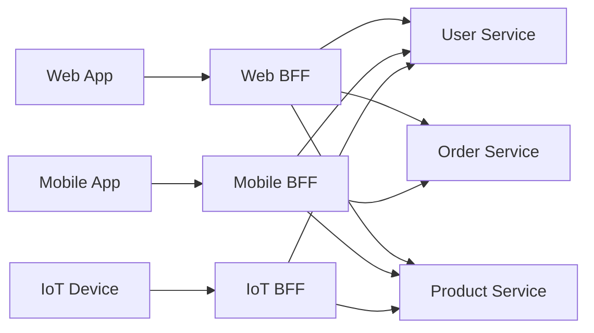
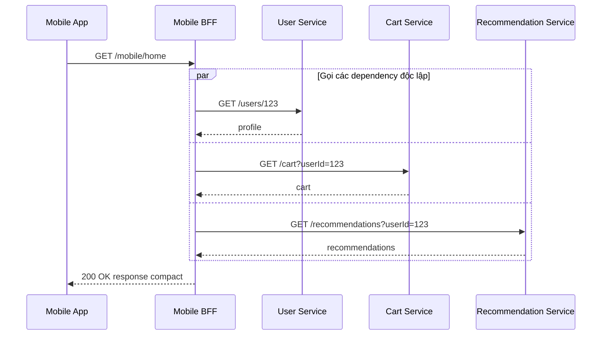
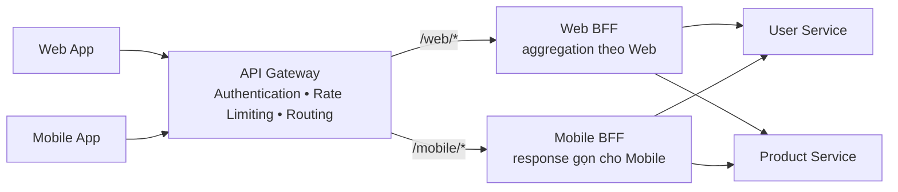

# Backend for Frontend (BFF) Pattern

## Mục lục

- [Tổng quan](#tổng-quan)
- [Vấn đề cần giải quyết](#vấn-đề-cần-giải-quyết)
  - [Over-fetching và under-fetching](#over-fetching-và-under-fetching)
  - [Xung đột nhu cầu giữa các client](#xung-đột-nhu-cầu-giữa-các-client)
- [Mô hình BFF theo client](#mô-hình-bff-theo-client)
  - [Ownership là điểm cốt lõi](#ownership-là-điểm-cốt-lõi)
  - [Topology tham chiếu](#topology-tham-chiếu)
- [Cách BFF hoạt động](#cách-bff-hoạt-động)
  - [Request flow](#request-flow)
  - [Aggregation và transformation](#aggregation-và-transformation)
  - [Ranh giới với domain service](#ranh-giới-với-domain-service)
- [Use case E Commerce đa nền tảng](#use-case-e-commerce-đa-nền-tảng)
  - [Trang chủ trên Web và Mobile](#trang-chủ-trên-web-và-mobile)
  - [Chi tiết product trên ba client](#chi-tiết-product-trên-ba-client)
  - [Xử lý partial failure](#xử-lý-partial-failure)
- [API Gateway và BFF](#api-gateway-và-bff)
  - [Khác nhau ở đâu](#khác-nhau-ở-đâu)
  - [Có thể kết hợp như thế nào](#có-thể-kết-hợp-như-thế-nào)
- [Trade-off](#trade-off)
- [Khi nào nên dùng và khi nào không nên dùng](#khi-nào-nên-dùng-và-khi-nào-không-nên-dùng)
- [Lỗi thường gặp](#lỗi-thường-gặp)
- [Vận hành và observability](#vận-hành-và-observability)
  - [High Availability và scaling](#high-availability-và-scaling)
  - [Timeout Retry và Circuit Breaker](#timeout-retry-và-circuit-breaker)
  - [Caching theo client](#caching-theo-client)
  - [Logging metrics và tracing](#logging-metrics-và-tracing)
  - [Contract và deployment](#contract-và-deployment)
- [Checklist](#checklist)
- [Liên kết liên quan](#liên-kết-liên-quan)

---

## Tổng quan

**Backend for Frontend (BFF)** là một backend dành riêng cho một loại frontend hoặc một nhóm client có cùng nhu cầu. BFF nằm ở lớp trình bày (presentation layer): nó nhận request theo contract của client, gọi các domain service cần thiết, rồi gộp hoặc chuyển đổi response thành hình dạng mà client dễ sử dụng.

BFF giải quyết một vấn đề cụ thể: một API chung thường khó tối ưu đồng thời cho Web, Mobile, TV, IoT hoặc partner. Mỗi loại client có giới hạn băng thông, cách hiển thị và tốc độ thay đổi UX khác nhau. BFF cho phép từng client có một API shape (hình dạng API) phù hợp hơn mà không buộc domain service phải biết chi tiết giao diện của client.

BFF không phải là một bản sao của domain service và cũng không phải nơi lưu business rule. BFF không nên truy cập trực tiếp database của service khác. Các quy tắc như tính giá, áp khuyến mãi, giữ tồn kho hoặc quyết định trạng thái đơn hàng vẫn thuộc về service sở hữu domain đó.

> **Ý chính:** BFF không chỉ có nghĩa là tạo nhiều gateway. Điểm phân biệt quan trọng là BFF do frontend team tương ứng sở hữu và tối ưu theo nhu cầu của client đó.

## Vấn đề cần giải quyết

Giả sử một API chung phục vụ cả Web, Mobile và một thiết bị có tài nguyên hạn chế:

```text
Web App       ─┐
Mobile App    ─┼──▶ API chung ──▶ User, Order, Product Services
IoT Device    ─┘
```

API chung phải chọn một contract mà tất cả client đều có thể dùng. Khi nhu cầu giữa các client lệch nhau, contract này thường trở thành một "ước chung lớn nhất": response chứa nhiều dữ liệu cho client này nhưng lại thiếu hoặc không phù hợp với client khác.

### Over-fetching và under-fetching

- **Over-fetching** là client nhận nhiều dữ liệu hơn cần thiết. Ví dụ, Mobile App chỉ cần tên, giá và một thumbnail của product nhưng response lại kèm mô tả dài, gallery và nhiều trường chỉ dành cho Web. Payload lớn làm tăng chi phí truyền dữ liệu và xử lý ở client.
- **Under-fetching** là một endpoint không trả đủ dữ liệu cho một màn hình. Web App phải gọi thêm User, Review hoặc Recommendation API rồi tự ghép response. Nhiều round trip làm client phức tạp hơn và có thể tăng latency.

BFF cho phép mỗi API contract trả đúng projection (phần dữ liệu được chọn) của client. Tuy nhiên, BFF vẫn phải kiểm soát số downstream call; tách BFF không tự động làm mọi request nhanh hơn.

### Xung đột nhu cầu giữa các client

Một API chung có thể gặp các xung đột sau:

| Client | Nhu cầu thường gặp | Xung đột khi dùng API chung |
|---|---|---|
| **Web App** | Nhiều trường, gallery, reviews và dữ liệu cho màn hình rộng | Cần response đầy đủ hơn Mobile |
| **Mobile App** | Payload gọn, ảnh đã resize, ít round trip trên mạng không ổn định | Không muốn nhận toàn bộ response của Web |
| **IoT hoặc thiết bị yếu** | Contract nhỏ, có thể dùng binary và ít metadata | Không phù hợp với JSON response lớn |
| **Partner** | Contract ổn định, có version và pagination rõ ràng | Không nhất thiết muốn response đã aggregate theo UX nội bộ |

Nếu một thay đổi phục vụ Mobile làm thay đổi response của Web, các client có thể phải phối hợp release. Nếu frontend team không sở hữu API shape, thay đổi UX còn phải chờ team quản lý API chung. BFF tách các nhu cầu này thành các boundary rõ hơn.

## Mô hình BFF theo client

Mỗi BFF phục vụ một loại trải nghiệm client. Các BFF có thể dùng công nghệ khác nhau và vẫn gọi chung các domain service phía sau:



Web BFF có thể dùng GraphQL để Web tự chọn field. Mobile BFF có thể dùng REST với response compact. IoT BFF có thể dùng gRPC và Protobuf để giảm kích thước message. Đây là khác biệt ở lớp trình bày; các domain service vẫn sở hữu business rule và dữ liệu của domain mình.

Không nhất thiết phải tạo một BFF cho từng endpoint hoặc từng phiên bản ứng dụng. Ranh giới nên dựa trên nhu cầu client và ownership đủ rõ để một team có thể chịu trách nhiệm cho contract, code và deployment của BFF đó.

### Ownership là điểm cốt lõi

**Ownership** là quyền chịu trách nhiệm xuyên suốt cho API shape và vòng đời của BFF. Một cách tổ chức điển hình là:

| BFF | Team sở hữu | Tối ưu cho |
|---|---|---|
| **Web BFF** | Web team | Màn hình desktop, SSR hoặc các trải nghiệm Web |
| **Mobile BFF** | Mobile team | Băng thông, pin, kích thước payload và UX trên Mobile |
| **IoT BFF** | IoT team | Thiết bị hạn chế tài nguyên và contract nhỏ |

Team sở hữu BFF có thể quyết định cách gộp dữ liệu, tên field, protocol và thời điểm release theo nhu cầu client. Team đó vẫn phải tuân thủ contract của các domain service mà BFF gọi, đồng thời phối hợp khi domain service thay đổi API.

Ownership không có nghĩa BFF được tự sao chép business rule. Nó có nghĩa team frontend chịu trách nhiệm cho lớp phục vụ frontend, còn domain team vẫn chịu trách nhiệm cho invariant (điều kiện nghiệp vụ phải luôn đúng) và dữ liệu của domain.

### Topology tham chiếu

BFF có thể là public backend trực tiếp hoặc được route từ một API Gateway. Khi có Gateway, hai lớp nên có trách nhiệm khác nhau:

```text
Client
  │
  ▼
API Gateway                 BFF
  │  auth, rate limit,       │  aggregation, transformation
  │  routing và policy edge  │  theo một client
  └───────────────▶─────────┘
                          │
                          ▼
                    Domain Services
```

Một API Gateway dùng chung có thể route `/web/*` đến Web BFF và `/mobile/*` đến Mobile BFF. BFF sau đó gọi User, Order hoặc Product Service theo use case của client. Nếu hệ thống chưa cần một lớp Gateway riêng, BFF vẫn có thể đứng ở edge; điều đó không làm BFF trở thành nơi thay thế mọi policy edge dùng chung.

## Cách BFF hoạt động

### Request flow

Với một request trang chủ Mobile, BFF có thể gọi các service độc lập song song rồi trả về một response gọn:



Một request flow điển hình gồm các bước:

1. BFF nhận public request theo contract của client. Nếu request đi qua API Gateway, BFF nhận user context đã được truyền tiếp theo cơ chế tin cậy của hệ thống.
2. BFF kiểm tra input và ánh xạ request đó thành các call đến domain service. BFF không nên tin một identity header do client tự gửi.
3. Các call độc lập được thực hiện song song. Mỗi downstream call có timeout riêng.
4. BFF gộp dữ liệu, đổi tên hoặc lọc field theo contract của client.
5. BFF trả response và ghi request context, metrics cùng trạng thái degraded nếu một phần dữ liệu không có.

BFF có thể có client-specific policy, nhưng Authentication (xác thực danh tính) và các policy edge dùng chung cần được đặt ở boundary phù hợp. Domain service vẫn phải kiểm tra Authorization (phân quyền), nhất là quyền truy cập resource cụ thể.

### Aggregation và transformation

Hai trách nhiệm thường thấy của BFF là **aggregation** và **transformation**:

- **Aggregation** là gọi nhiều service rồi ghép response cho một màn hình hoặc một use case đọc. Các call không phụ thuộc nhau nên chạy song song để tránh cộng dồn latency.
- **Transformation** là chuyển response nội bộ thành contract của client. Ví dụ gồm lọc field không cần thiết, resize image, đổi tên field, đổi protocol hoặc định dạng pagination.
- **Caching** có thể được dùng cho dữ liệu đọc phù hợp với từng client. Cache cần có TTL, key và quy tắc quyền truy cập rõ ràng.

BFF nên xử lý lỗi theo ý nghĩa của từng phần dữ liệu. Một Recommendation Service có thể là dependency bổ trợ, trong khi dữ liệu order hoặc payment cho một flow bắt buộc có thể không được phép thiếu.

| Loại xử lý | BFF có thể làm | Không nên làm ở BFF |
|---|---|---|
| Ghép response | Gộp profile, cart và recommendations | Điều phối một workflow nghiệp vụ nhiều bước |
| Đổi hình dạng | Chọn field, resize image, đổi format | Đổi ý nghĩa của business rule |
| Gọi service | Fan-out các API đọc với timeout riêng | Truy cập trực tiếp database của service |
| Fallback | Bỏ qua dữ liệu bổ trợ theo contract | Biến lỗi của bước bắt buộc thành thành công giả |
| Cache | Cache product catalog với TTL phù hợp | Cache dữ liệu user mà không phân biệt identity và quyền |

### Ranh giới với domain service

BFF là lớp thích ứng giữa client và domain service. Ranh giới nên được thể hiện bằng contract thay vì bằng việc sao chép logic:

| Quyết định | Nơi nên chịu trách nhiệm | Ví dụ |
|---|---|---|
| API shape cho Web hoặc Mobile | BFF tương ứng | Chọn field, tên field và format response |
| Gọi bao nhiêu endpoint để dựng một màn hình | BFF | Gọi User, Cart và Recommendation song song |
| Tính giá hoặc áp mã giảm giá | Domain service sở hữu nghiệp vụ | Pricing hoặc Order Service quyết định giá hợp lệ |
| Giữ tồn kho | Inventory Service | Service sở hữu reservation và invariant tồn kho |
| Ghi order hoặc payment state | Order hoặc Payment Service | BFF không ghi trực tiếp database |
| User có được truy cập resource không | Domain service, với context từ edge | Kiểm tra quyền trên order cụ thể |

Nếu cùng một business rule xuất hiện trong Web BFF và Mobile BFF, rule đó sẽ dễ lệch theo thời gian. Cách an toàn hơn là để domain service cung cấp kết quả theo contract nghiệp vụ, còn mỗi BFF chỉ chuyển kết quả thành hình dạng của client.

## Use case E Commerce đa nền tảng

Xét một trang E-Commerce có Web App, Mobile App và một thiết bị IoT cùng cần thông tin product. Ba client sử dụng cùng các domain service nhưng không nhất thiết nhận cùng response.

| Client | BFF | Mục tiêu của response |
|---|---|---|
| Web | Web BFF | Đủ dữ liệu cho gallery, reviews, related products và màn hình rộng |
| Mobile | Mobile BFF | Payload gọn, ảnh đã resize và ít call từ ứng dụng |
| IoT | IoT BFF | Product brief nhỏ, phù hợp thiết bị yếu |

### Trang chủ trên Web và Mobile

Web BFF có thể trả nhiều vùng dữ liệu cho trang chủ như hero banner, categories, featured products, recommendations, recently viewed và promotions. Mobile BFF có thể chỉ trả các vùng cần thiết, giới hạn số item và dùng thumbnail đã nén.

Ví dụ response của Web BFF:

```json
{
  "hero": { "banners": ["banner-desktop-1", "banner-desktop-2"] },
  "categories": ["Điện thoại", "Laptop", "Phụ kiện"],
  "featuredProducts": [
    { "id": "P100", "name": "Laptop A", "price": 25000000, "gallery": ["a-1", "a-2"] }
  ],
  "recommendations": [{ "id": "P200", "name": "Tai nghe B" }],
  "recentlyViewed": [{ "id": "P300", "name": "Chuột C" }],
  "promotions": [{ "id": "PROMO10", "label": "Giảm giá cuối tuần" }]
}
```

Response của Mobile BFF có thể giữ contract gọn hơn:

```json
{
  "hero": { "banners": ["banner-mobile-1"] },
  "categories": ["Điện thoại", "Laptop", "Phụ kiện"],
  "featuredProducts": [
    { "id": "P100", "name": "Laptop A", "price": 25000000, "thumbnail": "a-thumb" }
  ],
  "recommendations": [{ "id": "P200", "name": "Tai nghe B" }]
}
```

Cả hai BFF có thể gọi Product, Recommendation và Promotion Service. Sự khác nhau nằm ở số field, số item, cách định dạng và cách client sử dụng response. BFF không tự quyết định giá hay điều kiện khuyến mãi; nó lấy kết quả đã được domain service tính theo contract phù hợp.

### Chi tiết product trên ba client

Cùng product `456` có thể được expose qua ba contract:

**Web BFF** dùng GraphQL để Web tự chọn field:

```graphql
query ProductDetail {
  product(id: 456) {
    name
    price
    description
    gallery
    reviews {
      author
      rating
    }
    related
  }
}
```

**Mobile BFF** dùng REST với response compact và thumbnail:

```http
GET /mobile/products/456
```

```json
{
  "id": 456,
  "name": "iPhone 15",
  "price": 29990000,
  "thumbnail": "https://cdn.example.com/456-thumb.webp"
}
```

**IoT BFF** dùng gRPC và Protobuf với message nhỏ:

```protobuf
message ProductBrief {
  int64 id = 1;
  string name = 2;
  int64 price_vnd = 3;
}
```

Ba contract không cần giống nhau, nhưng đều phải lấy thông tin từ service sở hữu product. Khác biệt về presentation không nên tạo ra ba cách tính giá hoặc ba nguồn dữ liệu khác nhau.

### Xử lý partial failure

**Partial failure** là khi một dependency thất bại nhưng các phần còn lại vẫn có thể trả về. BFF cần xác định phần bắt buộc và phần bổ trợ trong contract:

| Phần dữ liệu | Ví dụ | Cách xử lý |
|---|---|---|
| Bắt buộc | Dữ liệu order để tiếp tục checkout | Timeout hoặc lỗi downstream làm flow thất bại theo contract |
| Bổ trợ | Recommendations trên trang chủ | Trả các phần còn lại, dùng `null` hoặc danh sách rỗng và ghi nhận degraded state |
| Có thể stale | Catalog đã cache | Trả dữ liệu cache theo TTL nếu contract cho phép, đồng thời theo dõi độ cũ |

Ví dụ, khi Recommendation Service tạm thời lỗi, Mobile BFF vẫn có thể trả profile và cart:

```json
{
  "user": { "name": "An", "tier": "GOLD" },
  "cart": { "items": 3, "total": 1250000 },
  "recommendations": null,
  "_meta": { "degraded": ["recommendations"] }
}
```

`_meta.degraded` chỉ là một response contract mẫu. Với thao tác bắt buộc như thanh toán, BFF không được trả `200 OK` như thể thành công nếu Payment Service thất bại. Mã trạng thái và nội dung lỗi phải phản ánh đúng ý nghĩa nghiệp vụ của endpoint.

## API Gateway và BFF

API Gateway và BFF cùng nằm ở phía edge nhưng giải quyết hai vấn đề khác nhau. API Gateway tập trung vào entry point và các policy dùng chung. BFF tập trung vào API shape, aggregation và transformation của một loại client.

### Khác nhau ở đâu

| Tiêu chí | API Gateway | BFF |
|---|---|---|
| **Mục tiêu chính** | Single entry point, routing và cross-cutting policy | API tối ưu cho một frontend hoặc client group |
| **Bản chất** | Thành phần hạ tầng, thường cấu hình hoặc dùng giải pháp có sẵn | Application service có code riêng |
| **Số lượng** | Thường một logical gateway hoặc một vài gateway theo boundary | Thường tương ứng với số client có nhu cầu khác biệt |
| **Ownership** | Platform hoặc Infrastructure team | Web, Mobile hoặc frontend team tương ứng |
| **Logic chính** | Authentication, Rate Limiting, routing, SSL và policy edge | Aggregation, transformation và response contract theo client |
| **Thay đổi khi** | Thêm route hoặc thay đổi policy dùng chung | UX, payload hoặc protocol của client thay đổi |
| **Có thể chứa gì** | Có thể có aggregation đơn giản, nhưng không nên thành business service | Có client-specific presentation logic, nhưng không chứa business rule |

Multiple Gateways không tự động trở thành BFF. Nếu một gateway chỉ route và áp policy mà không có ownership theo frontend và không tối ưu response theo client, nó vẫn là API Gateway.

### Có thể kết hợp như thế nào

Trong thực tế, một public API Gateway có thể đứng trước các BFF:



Gateway chịu trách nhiệm policy edge dùng chung và route request đến đúng BFF. BFF chịu trách nhiệm dựng response của Web hoặc Mobile. Service-to-service call từ BFF đến domain service không nên vòng qua Gateway chỉ để dùng Gateway như một proxy chung.

Nếu hệ thống nhỏ và chưa có policy edge phức tạp, có thể bắt đầu với một API Gateway hoặc một BFF đơn giản. Khi response của các client lệch rõ và team cần ownership riêng, mới tách thêm BFF để chi phí vận hành có lý do chính đáng.

## Trade-off

| Lợi ích | Chi phí hoặc hệ quả |
|---|---|
| Mỗi client có payload và API shape phù hợp hơn, giảm over-fetching và under-fetching | Mỗi BFF là một codebase, pipeline và deployment cần maintain |
| Frontend team tự chủ hơn về contract và tốc độ thay đổi UX | Các BFF có thể lặp phần integration hoặc transformation |
| Có thể deploy Mobile BFF mà không phải deploy Web BFF | Dependency domain dùng chung vẫn có thể ảnh hưởng nhiều BFF |
| Có thể chọn protocol phù hợp như GraphQL, REST hoặc gRPC | Team phải vận hành thêm service, monitoring, alert và capacity |
| BFF tạo boundary rõ giữa client presentation và domain service | Cần quản lý consistency của contract, error shape và auth context giữa các BFF |
| Có thể áp dụng cache hoặc fallback theo trải nghiệm client | Fan-out nhiều downstream vẫn tạo latency và rủi ro partial failure |

BFF có giá trị khi sự khác biệt giữa các client đủ lớn để bù chi phí của nhiều service. Nếu chỉ tách BFF để đổi tên một vài field trong khi mọi client cần cùng một response, thêm một deployment có thể không đáng.

## Khi nào nên dùng và khi nào không nên dùng

| Nên dùng khi | Không nên hoặc chưa cần khi |
|---|---|
| Web, Mobile, IoT hoặc partner có nhu cầu response rõ rệt khác nhau | Chỉ có một loại client hoặc mọi client dùng cùng data shape |
| Mobile cần payload nhỏ, ảnh tối ưu hoặc ít round trip | Response hiện tại đã đủ gọn và phù hợp cho các client |
| Frontend team được tổ chức riêng và có thể sở hữu BFF | Team backend duy nhất làm mọi client nhưng chưa có năng lực maintain nhiều BFF |
| UX của từng client thay đổi nhanh và cần deployment độc lập | Sản phẩm còn đơn giản, số service ít và một Gateway đã đủ |
| Có use case cần aggregation theo từng client | Không có lý do rõ ràng ngoài việc muốn đặt business logic ở một lớp mới |
| Traffic và mức độ phức tạp đủ để justify chi phí vận hành | Team chưa có kế hoạch cho HA, timeout, observability và contract management |

Một lộ trình thực dụng là bắt đầu bằng API Gateway hoặc API chung khi nhu cầu còn đơn giản. Chỉ tách BFF khi đã thấy pain cụ thể như payload không phù hợp, client phải gọi quá nhiều endpoint hoặc các team liên tục xung đột về API shape.

## Lỗi thường gặp

1. **Universal BFF:** Gộp Web, Mobile và IoT vào một BFF duy nhất để giảm số deployment. Nếu BFF lại phải có nhiều `if/else` theo client, nó đã quay về vấn đề API chung và khó thay đổi độc lập.
2. **Đưa business logic vào BFF:** BFF tự tính giá, áp khuyến mãi hoặc quyết định giữ kho. Khi luật thay đổi, mọi BFF có thể lệch nhau. Hãy để domain service sở hữu business rule.
3. **BFF gọi BFF:** Một BFF gọi sang BFF khác tạo chuỗi phụ thuộc ngang và làm ownership khó hiểu. BFF nên gọi domain service hoặc contract nội bộ phù hợp, không dùng BFF khác như domain service.
4. **Copy-paste giữa các BFF:** Nhiều BFF có thể lặp code gọi service, error mapping hoặc tracing. Có thể dùng shared library cho phần kỹ thuật ổn định, nhưng không share business logic chỉ để tránh viết lại.
5. **Aggregation tuần tự:** Gọi User, Cart rồi Recommendation lần lượt làm latency cộng dồn. Các dependency độc lập nên được gọi song song với timeout riêng.
6. **Không có timeout hoặc partial failure policy:** Một dependency bổ trợ chậm có thể giữ cả request hoặc làm hỏng toàn bộ trang. Contract cần phân biệt dữ liệu bắt buộc và dữ liệu có thể degraded.
7. **Retry mutation không có idempotency:** BFF retry `POST` tạo order hoặc charge payment có thể tạo tác động lặp. Chỉ retry khi downstream có contract idempotency và lỗi đó có thể retry an toàn.
8. **Tin identity header từ client hoặc làm lộ field nội bộ:** BFF phải loại bỏ hoặc ghi đè context không đáng tin, kiểm soát field trả ra và không đưa token, PII hoặc dữ liệu payment vào response ngoài ý muốn.
9. **Contract drift giữa các BFF:** Web, Mobile và domain service thay đổi field hoặc error shape mà không có version và kiểm thử tương thích. Mỗi BFF cần quản lý contract của mình và phối hợp migration với upstream.

## Vận hành và observability

### High Availability và scaling

BFF là một application service ở đường vào của client, vì vậy cần được vận hành như một thành phần production độc lập:

- Chạy nhiều instance của từng BFF sau Load Balancer hoặc Ingress khi cần High Availability.
- Scale Web BFF và Mobile BFF độc lập theo traffic, latency và resource của client tương ứng.
- Có liveness check để biết process còn chạy và readiness check để chỉ nhận traffic khi instance sẵn sàng.
- Theo dõi connection pool, số downstream call do mỗi request tạo ra và kích thước response. Fan-out làm capacity của BFF khác với một proxy chuyển tiếp đơn giản.
- Tách cấu hình, secret và quyền gọi service theo BFF. Mobile BFF không nên mặc nhiên có toàn bộ quyền của Web BFF chỉ vì cùng gọi một số domain service.

Một BFF có nhiều instance không loại bỏ dependency chung. Nếu Product Service chậm, nhiều BFF cùng gọi service đó vẫn có thể bị ảnh hưởng; cần timeout, giới hạn concurrency và chính sách degraded phù hợp.

### Timeout Retry và Circuit Breaker

Mỗi downstream call cần timeout rõ ràng. BFF nên có một request budget tổng thể, sau đó phân bổ budget cho các call song song. Timeout của một dependency không nên giữ connection lâu hơn thời gian client còn chờ.

**Retry** chỉ phù hợp với lỗi có khả năng tạm thời. Số lần retry phải giới hạn, có backoff và không được tạo retry storm. Với `POST`, `PUT` hoặc thao tác thanh toán, chỉ retry khi contract đã định nghĩa idempotency.

**Circuit Breaker** là cơ chế theo dõi lỗi và tạm ngắt call đến downstream đang suy giảm. Khi mạch mở, BFF có thể fail fast hoặc trả fallback cho dữ liệu bổ trợ. Circuit Breaker bảo vệ luồng đi qua BFF; nó không tự bảo vệ các luồng khác gọi domain service trực tiếp.

### Caching theo client

Cache ở BFF phải phản ánh contract và quyền truy cập của client:

- Ưu tiên dữ liệu đọc, ít thay đổi và chấp nhận được độ trễ như product catalog hoặc danh mục công khai.
- Dùng key phân biệt tenant, user và các tham số ảnh hưởng đến response nếu dữ liệu có tính cá nhân hóa.
- Đặt TTL và quy tắc invalidation rõ ràng. Cache cũ không được dùng cho một business decision yêu cầu dữ liệu hiện tại.
- Không cache mù response chứa cart, profile hoặc payment information. Nếu cần cache, phải xác định boundary bảo mật và cách loại bỏ dữ liệu.
- Theo dõi cache hit, miss, stale response và lỗi khi đọc cache. Cache lỗi không nên làm mất khả năng gọi nguồn chính nếu contract cho phép fallback.

### Logging metrics và tracing

Observability (khả năng quan sát hệ thống) giúp trả lời BFF đang chậm ở đâu, downstream nào lỗi và client nào đang bị degraded. Mỗi BFF nên dùng structured logging để có thể lọc theo route và request context.

| Nhóm tín hiệu | Nên theo dõi |
|---|---|
| **Request metrics** | Request rate, status code và latency P50/P95/P99 theo BFF và route |
| **Downstream metrics** | Latency, timeout, error, retry và Circuit Breaker state của từng service |
| **Aggregation metrics** | Số call mỗi request, fan-out duration, phần response bị degraded |
| **Payload metrics** | Kích thước request/response và lỗi serialization hoặc transformation |
| **Resource metrics** | CPU, memory, active connection và connection pool saturation |
| **Structured logs** | BFF, route, Request ID, Trace ID, upstream, status và lý do fallback |

BFF nên propagate `Request ID` và `Trace ID` sang các downstream call. `Request ID` giúp tìm một request trong log; `Trace ID` ghép các span trong Distributed Tracing (tracing phân tán). Không ghi access token, password, PII hoặc dữ liệu thanh toán nguyên dạng vào log.

### Contract và deployment

Mỗi BFF cần có contract mà client có thể dựa vào. Contract có thể được mô tả bằng OpenAPI, GraphQL schema hoặc Protobuf tùy protocol. Khi contract thay đổi:

1. Xác định field, status code và error shape nào là breaking change.
2. Giữ backward compatibility trong thời gian client migration nếu client không thể release đồng thời.
3. Kiểm tra các downstream contract và các response transformation của BFF.
4. Rollout BFF độc lập theo canary hoặc từng nhóm instance khi thay đổi có rủi ro.
5. Chuẩn bị rollback cho code, cấu hình route và version contract.

Deployment độc lập là một lợi ích của BFF, nhưng không có nghĩa có thể bỏ qua phối hợp contract. BFF team và domain team vẫn cần thống nhất cách deprecate endpoint, version field và xử lý lỗi.

## Checklist

- [ ] Nhu cầu khác biệt giữa các client đã được xác định bằng use case cụ thể.
- [ ] Mỗi BFF có frontend team hoặc owner chịu trách nhiệm rõ ràng.
- [ ] API shape, protocol và error contract của từng BFF đã được document.
- [ ] BFF chỉ làm aggregation, transformation và client-specific presentation logic.
- [ ] Business rule, invariant và ghi dữ liệu vẫn thuộc domain service.
- [ ] Không có BFF gọi BFF hoặc truy cập trực tiếp database của service khác.
- [ ] Các downstream call độc lập chạy song song và có timeout riêng.
- [ ] Retry có giới hạn, backoff và chỉ áp dụng khi mutation có idempotency phù hợp.
- [ ] Required data, optional data và partial failure policy đã được xác định.
- [ ] Cache có key, TTL, invalidation và phân quyền phù hợp với dữ liệu client.
- [ ] BFF chạy nhiều instance hoặc có kế hoạch High Availability tương ứng với mức độ quan trọng.
- [ ] Metrics, structured logs, Request ID và Trace ID đã được kiểm tra.
- [ ] Log và response không làm lộ token, PII hoặc dữ liệu payment không cần thiết.
- [ ] Contract migration, canary rollout và rollback đã được diễn tập.

## Liên kết liên quan

| Tài liệu | Liên quan |
|---|---|
| [API Gateway Pattern](./api-gateway.md) | Ranh giới giữa API Gateway và BFF, routing và policy ở edge |
| [API Gateway](../07-api-gateway.md) | Gateway, aggregation, Gateway patterns và BFF chuyên sâu |
| [Inter-Service Communication](../06-inter-service-communication.md) | REST, gRPC và các contract mà BFF gọi đến |
| [Resilience Patterns](../10-resilience-patterns.md) | Timeout, Retry, Circuit Breaker và Fallback |
| [Observability và Evolvability](../11-observability-evolvability.md) | Logging, Metrics, Correlation ID và Distributed Tracing |
| [Security](../15-security.md) | Authentication, Authorization, JWT, mTLS và bảo vệ dữ liệu |
| [Case Study E Commerce](../25-case-study-ecommerce.md) | Bối cảnh thiết kế kiến trúc E-Commerce |
