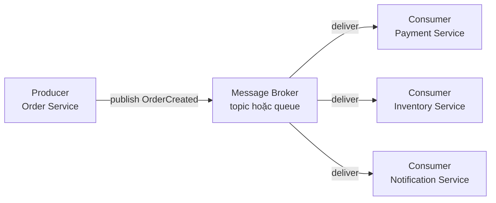
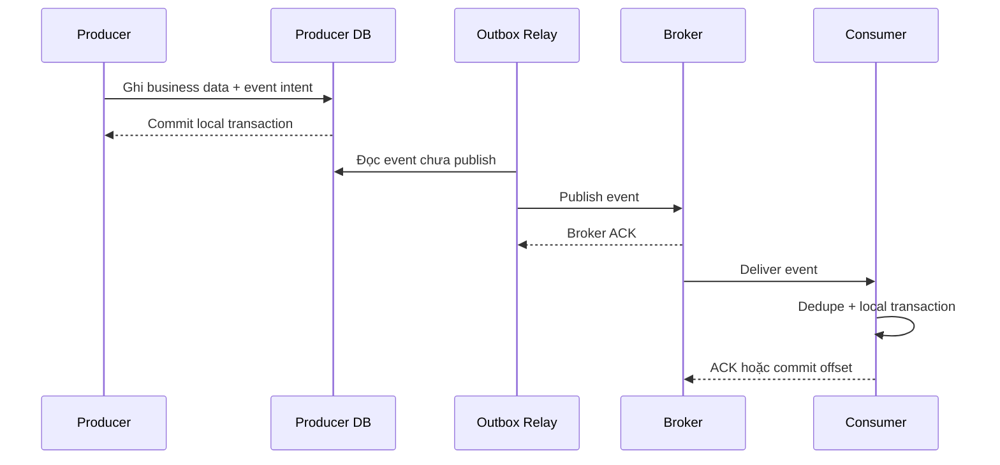
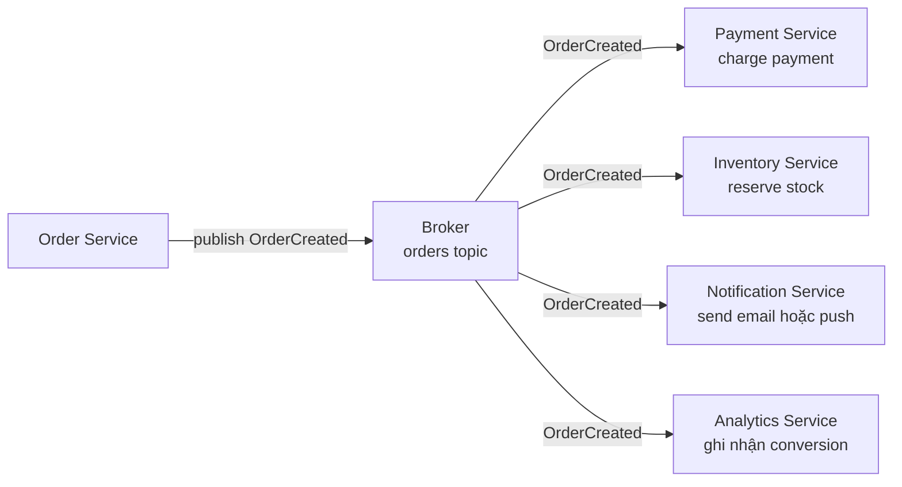
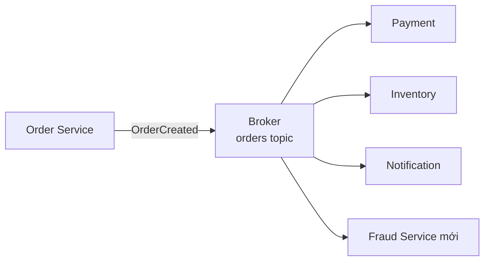
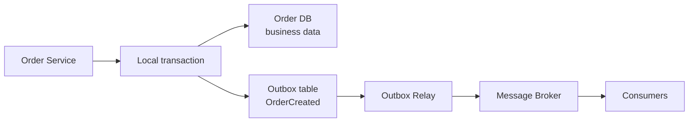
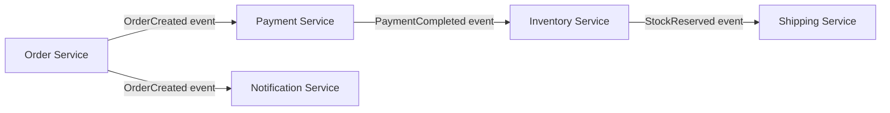
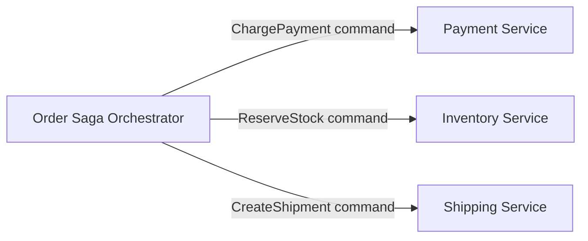

# Event-Driven Architecture Pattern — Kiến trúc hướng sự kiện

## Mục lục

- [Tổng quan](#tổng-quan)
- [Vấn đề Event-Driven Architecture giải quyết](#vấn-đề-event-driven-architecture-giải-quyết)
  - [Temporal coupling](#temporal-coupling)
  - [Fan-out và sync chain](#fan-out-và-sync-chain)
- [Mô hình hoạt động](#mô-hình-hoạt-động)
  - [Các thành phần](#các-thành-phần)
  - [Event và Command](#event-và-command)
  - [Vòng đời một event](#vòng-đời-một-event)
- [Ví dụ fan-out với Order Service](#ví-dụ-fan-out-với-order-service)
  - [Luồng OrderCreated](#luồng-ordercreated)
  - [Thêm consumer mới](#thêm-consumer-mới)
- [Delivery semantics và độ tin cậy](#delivery-semantics-và-độ-tin-cậy)
  - [At-most-once at-least-once và exactly-once](#at-most-once-at-least-once-và-exactly-once)
  - [Ordering theo aggregate](#ordering-theo-aggregate)
  - [Transactional Outbox](#transactional-outbox)
  - [Consumer idempotent retry và DLQ](#consumer-idempotent-retry-và-dlq)
- [Event schema và versioning](#event-schema-và-versioning)
  - [Domain Event và Integration Event](#domain-event-và-integration-event)
  - [Event envelope và payload](#event-envelope-và-payload)
  - [Backward compatibility](#backward-compatibility)
- [Choreography và Orchestration](#choreography-và-orchestration)
  - [Choreography](#choreography)
  - [Orchestration](#orchestration)
  - [Cách chọn giữa hai mô hình](#cách-chọn-giữa-hai-mô-hình)
- [Khi nào nên dùng và khi nào không nên dùng](#khi-nào-nên-dùng-và-khi-nào-không-nên-dùng)
- [Trade-offs](#trade-offs)
- [Lỗi thường gặp](#lỗi-thường-gặp)
- [Vận hành](#vận-hành)
  - [Observability](#observability)
  - [Scale và backpressure](#scale-và-backpressure)
  - [Retention và replay](#retention-và-replay)
  - [Runbook khi pipeline có vấn đề](#runbook-khi-pipeline-có-vấn-đề)
- [Checklist](#checklist)
- [Liên kết liên quan](#liên-kết-liên-quan)

---

## Tổng quan

**Event-Driven Architecture (EDA)** là cách các service giao tiếp bằng cách phát ra **event** (sự kiện) khi một điều gì đó đã xảy ra. Event đi qua **message broker** (hệ thống trung chuyển message), sau đó được các **consumer** (service nhận và xử lý event) đăng ký quan tâm tiếp nhận.

Ví dụ, sau khi Order Service tạo đơn, service này publish `OrderCreated`. Payment Service, Inventory Service và Notification Service tự subscribe event theo nhu cầu của mình. Order Service không cần gọi đích danh từng service.

EDA giải quyết chủ yếu hai dạng phụ thuộc:

- **Temporal coupling:** producer và consumer không bắt buộc phải cùng online tại đúng thời điểm.
- **Fan-out coupling:** producer không phải biết danh sách consumer để gọi tuần tự.

Đổi lại, các service thường phải chấp nhận **eventual consistency** (nhất quán cuối cùng). Một consumer có thể xử lý event sau producer vài mili giây, vài giây hoặc lâu hơn tùy broker và tải hệ thống.

> **Phạm vi của pattern:** EDA là pattern giao tiếp. Nó không đồng nghĩa với **Event Sourcing** (lưu toàn bộ event làm nguồn dữ liệu chính), không tự cung cấp **Saga** và cũng không tự giải quyết dual write giữa database với broker. Các vấn đề đó cần pattern và contract riêng.

## Vấn đề Event-Driven Architecture giải quyết

### Temporal coupling

Với direct call qua REST hoặc gRPC, caller thường phải giữ kết nối và chờ callee phản hồi:

```text
Order Service ──sync──▶ Payment Service
      │                       │
      │                       └─ Payment Service down
      └─ request thất bại hoặc bị timeout
```

Đây là **temporal coupling** — coupling về thời gian. Payment Service có thể không liên quan đến lỗi của Order Service, nhưng Order vẫn không thể hoàn tất request nếu payment là bước bắt buộc.

Với một event cho tác vụ có thể xử lý nền:

```text
Order Service ──publish──▶ Broker ──deliver──▶ Payment Service
       │                      │                    │
       └─ có thể trả về        └─ giữ event         └─ xử lý khi sẵn sàng
          trạng thái pending      theo policy
```

Broker tạo một vùng đệm giữa producer và consumer. Vùng đệm này không làm mất yêu cầu retry, timeout hoặc theo dõi trạng thái; nó chỉ tách thời điểm hai service phải hoạt động.

### Fan-out và sync chain

Nếu Order Service gọi trực tiếp nhiều service, mỗi consumer mới làm producer phải biết thêm một dependency:

```text
❌ Direct fan-out:

Order ──▶ Payment
      ├─▶ Inventory
      ├─▶ Notification
      └─▶ Analytics

Thêm Fraud Service → phải sửa và deploy lại Order Service.
```

Trong EDA, một event có thể được nhiều consumer nhận:

```text
✅ Event fan-out:

Order ──publish OrderCreated──▶ Broker
                                  ├─▶ Payment
                                  ├─▶ Inventory
                                  ├─▶ Notification
                                  └─▶ Analytics
```

EDA cũng giảm các **sync chain** dài như `A → B → C → D`. Tuy nhiên, không phải bước nào cũng nên chuyển thành event. Nếu caller cần kết quả ngay để quyết định bước tiếp theo, direct call có thể rõ ràng và phù hợp hơn.

## Mô hình hoạt động

### Các thành phần



| Thành phần | Vai trò | Ví dụ |
|---|---|---|
| **Producer** | Phát event sau một thay đổi hoặc business action | Order Service phát `OrderCreated` |
| **Event** | Fact mô tả điều đã xảy ra, không phải lời gọi hàm | `PaymentCompleted`, `StockReserved` |
| **Message Broker** | Nhận, lưu hoặc route message theo policy của hệ thống | Apache Kafka, RabbitMQ |
| **Topic hoặc Queue** | Kênh logic để phân loại và phân phối message | Kafka topic `orders`, RabbitMQ queue |
| **Subscription** | Khai báo event hoặc kênh mà consumer quan tâm | Notification Service subscribe `OrderCreated` |
| **Consumer** | Đọc event, áp dụng business logic local và ghi nhận kết quả | Inventory Service reserve stock |
| **Consumer group** | Nhóm các consumer instance cùng chia sẻ việc xử lý một subscription, tùy theo khả năng của broker | Các instance của Inventory Service |
| **ACK hoặc offset** | ACK (acknowledgment — xác nhận) hoặc offset ghi nhận message đã được xử lý theo semantics đã chọn | Commit offset sau local transaction |

Một topic theo mô hình **publish/subscribe** phù hợp khi nhiều consumer cùng quan tâm một event. Một queue theo mô hình work queue phù hợp khi một message chỉ cần được một worker trong nhóm xử lý. Với broker hỗ trợ consumer group như Kafka, các instance trong cùng group thường chia message, còn các group khác nhau có thể nhận bản sao độc lập theo cấu hình subscription. Cách broker thực hiện delivery, retention (thời gian giữ message) và acknowledgment phải được cấu hình rõ; không nên suy ra semantics chỉ từ tên `topic` hoặc `queue`.

### Event và Command

Phân biệt event với command giúp tránh việc gọi hàm qua broker nhưng lại gắn nhãn event:

| Tiêu chí | Event | Command |
|---|---|---|
| Ý nghĩa | Fact trong quá khứ: việc đã xảy ra | Yêu cầu một service thực hiện việc gì |
| Cách đặt tên | Past tense, thường như `OrderCreated` | Imperative, như `ChargePayment` |
| Đối tượng đích | Không nhất thiết biết consumer cụ thể | Hướng tới participant cụ thể |
| Quyền quyết định | Consumer tự quyết định có phản ứng hay không | Bên gửi hoặc orchestrator quyết định bước tiếp theo |
| Ví dụ | `PaymentCompleted` | `ReserveStockCommand` |

Order Service publish `OrderCreated` là event-driven. Một orchestrator gửi `ChargePayment` cho Payment Service là command-driven, dù message đó có thể đi qua cùng một broker.

### Vòng đời một event

Một flow điển hình gồm các bước sau:

1. Producer thực hiện business action và xác định fact cần công bố.
2. Producer tạo event contract với identity, loại event và payload phù hợp.
3. Nếu phải ghi database cùng lúc với publish, producer ghi business data và event intent trong cùng local transaction bằng [Transactional Outbox](../17-data-patterns/transactional-outbox.md).
4. Relay hoặc producer publish event tới broker. Broker xác nhận theo delivery policy đã chọn.
5. Consumer nhận event, kiểm tra schema và kiểm tra event đã được xử lý trước đó hay chưa.
6. Consumer thực hiện local transaction, áp dụng side effect (tác động nghiệp vụ như charge hoặc gửi email) và chỉ ACK sau thời điểm an toàn theo contract.
7. Lỗi tạm thời được retry. Message không xử lý được sau giới hạn retry được chuyển vào **Dead Letter Queue (DLQ)**.



Không phải mọi triển khai đều dùng Outbox Relay. Điểm cần giữ là producer không được để business state và event rơi vào hai kết quả không thể đối soát mà không có chủ ý.

## Ví dụ fan-out với Order Service

### Luồng OrderCreated

Giả sử Order Service tạo một order thành công. Event `OrderCreated` được publish vào topic `orders`:



Mỗi consumer sở hữu cách phản ứng của domain mình:

| Consumer | Phản ứng minh họa | Tính chất |
|---|---|---|
| **Payment Service** | Xử lý charge theo payment contract | Có thể là bước quan trọng, cần idempotency và đối soát |
| **Inventory Service** | Reserve item theo `orderId` và danh sách item | Có thể xử lý trễ nếu nghiệp vụ cho phép |
| **Notification Service** | Gửi email hoặc push xác nhận | Thường là side effect không nằm trên critical path |
| **Analytics Service** | Ghi nhận order vào pipeline thống kê | Thường chấp nhận eventual consistency |

Order Service chỉ công bố fact `OrderCreated`. Nó không cần biết consumer nào sẽ được thêm trong tương lai và không nên chứa logic gửi email, ghi analytics hay reserve stock của service khác.

### Thêm consumer mới

Khi thêm Fraud Service, topology có thể mở rộng như sau:



Order Service không cần sửa code để gọi Fraud Service. Tuy vậy, việc thêm consumer không phải bằng không: team vẫn phải tạo subscription, cấu hình quyền truy cập, triển khai consumer, định nghĩa cách xử lý duplicate và theo dõi lag của consumer mới.

Đây là ý nghĩa thực tế của **loose coupling**: producer không phụ thuộc vào danh sách consumer ở mức gọi trực tiếp. Consumer vẫn phụ thuộc vào event contract, broker availability và semantics của event. Vì vậy, EDA làm giảm coupling chứ không xóa mọi coupling.

## Delivery semantics và độ tin cậy

Delivery semantics mô tả broker và consumer xử lý message ra sao khi có crash, timeout hoặc retry. Semantics của transport không tự quyết định semantics của side effect nghiệp vụ.

### At-most-once at-least-once và exactly-once

| Semantics | Đặc điểm | Hệ quả thiết kế |
|---|---|---|
| **At-most-once** | Message được giao tối đa một lần; có thể mất khi lỗi trước khi xử lý | Chỉ phù hợp khi mất message chấp nhận được |
| **At-least-once** | Message được retry cho tới khi được xác nhận; có thể giao trùng | Consumer bắt buộc idempotent hoặc dedupe |
| **Exactly-once** | Mỗi message được xử lý đúng một lần trong một phạm vi được định nghĩa | Không nên hiểu là mọi external side effect tự động exactly-once |

Trong microservice, **at-least-once** là lựa chọn thực tế phổ biến vì ưu tiên không bỏ sót event. Relay có thể publish thành công rồi crash trước khi ghi nhận trạng thái đã publish. Khi chạy lại, event được publish lần nữa.

`Exactly-once` chỉ có ý nghĩa khi nói rõ phạm vi, chẳng hạn một thao tác trong transaction của một broker hoặc một database. Khi event đi qua database, broker, consumer và external API, toàn bộ chuỗi không tự trở thành exactly-once. Cách an toàn là thiết kế consumer **idempotent** để nhiều lần delivery vẫn tạo cùng kết quả nghiệp vụ.

### Ordering theo aggregate

Không phải mọi event trong hệ thống cần một thứ tự toàn cục. Yêu cầu thường gặp là các event của cùng một **aggregate** (đối tượng nghiệp vụ có identity và vòng đời riêng, ví dụ một order) phải được xử lý theo thứ tự:

```text
OrderCreated(order-123)
PaymentCompleted(order-123)
OrderCancelled(order-123)
```

Với broker có **partition** (phân đoạn logic của topic), producer có thể dùng `aggregate_id` như `orderId` làm message key để các event của cùng aggregate đi vào cùng partition. Các aggregate khác vẫn có thể được xử lý song song.

Ordering cần được thiết kế ở cả producer và consumer:

- Producer phải gắn đúng `aggregate_id` và không dùng key ngẫu nhiên cho cùng aggregate.
- Consumer không nên giả định có ordering toàn cục nếu broker chỉ đảm bảo ordering trong partition.
- Consumer cần kiểm tra state hiện tại để bỏ qua event quá cũ hoặc xử lý event đến trễ theo contract.

Nếu nghiệp vụ không yêu cầu ordering, không nên thêm cơ chế ordering toàn cục vì nó làm giảm khả năng scale mà không tạo giá trị tương ứng.

### Transactional Outbox

Khi service vừa ghi database vừa publish event, cách làm trực tiếp tạo ra **dual write** (ghi kép: hai thao tác không cùng một transaction):

```text
❌
1. INSERT order vào Order DB       ✅
2. Publish OrderCreated             ❌ Broker down → event mất

Order tồn tại nhưng Inventory không biết.
```

**Transactional Outbox** ghi business data và event intent vào cùng database transaction. Một relay riêng publish các row đã commit:



Outbox cung cấp các đảm bảo sau:

- Business data và event intent cùng commit hoặc cùng rollback trong database local.
- Nếu relay hoặc broker tạm thời lỗi, row trong outbox còn lại để retry.
- Publish vẫn là bất đồng bộ và có thể tạo duplicate khi relay crash sau publish.
- Outbox không biến database và broker thành một distributed transaction, cũng không đảm bảo consumer đã hoàn tất side effect.

Chi tiết cách chọn Polling Publisher hoặc CDC, cleanup outbox và theo dõi outbox lag nằm trong [Transactional Outbox Pattern](../17-data-patterns/transactional-outbox.md).

### Consumer idempotent retry và DLQ

**Idempotent consumer** là consumer có thể xử lý cùng một `event_id` nhiều lần mà state cuối cùng vẫn đúng. Một cách phổ biến là ghi nhận event đã xử lý trong cùng local transaction với business update:

```text
BEGIN
  Nếu (consumer_name, event_id) đã tồn tại:
      bỏ qua business update
  Nếu chưa tồn tại:
      ghi event_id vào processed_events
      áp dụng business update
COMMIT
```

Ví dụ, Inventory Service chỉ reserve stock một lần cho `event_id = evt-123`. Nếu relay gửi lại event, consumer phát hiện bản ghi dedupe và không reserve lần hai.

Retry nên được giới hạn và có backoff:

- Retry lỗi transient như network timeout hoặc broker tạm unavailable.
- Không retry vô hạn một payload sai schema hoặc một poison message.
- Với thao tác charge, refund hoặc reserve, chỉ retry khi operation có identity ổn định và contract idempotency rõ ràng.
- Sau số lần retry tối đa, chuyển message vào **DLQ** kèm `event_id`, `aggregate_id`, `event_type`, lỗi và thời điểm.

DLQ giữ poison message khỏi block pipeline chính. DLQ không phải nơi để bỏ quên message; team cần alert, điều tra nguyên nhân, sửa lỗi rồi replay có kiểm soát. Xem thêm [Dead Letter Queue](../06-inter-service-communication.md#64-dead-letter-queue).

## Event schema và versioning

Event là contract giữa producer và consumer. Loose coupling ở topology không có nghĩa consumer có thể bỏ qua schema.

### Domain Event và Integration Event

| | Domain Event | Integration Event |
|---|---|---|
| Phạm vi | Bên trong một service hoặc bounded context | Giữa các service |
| Audience | Aggregate hoặc module nội bộ | Consumer bên ngoài producer |
| Transport | Có thể in-memory | Thường qua message broker |
| Schema | Internal model, thay đổi linh hoạt hơn | Public contract, cần version và backward compatibility |
| Ví dụ | `OrderItemAdded` | `order.created.v1` |

Một domain event nội bộ có thể được dùng để tính giá hoặc validate trong Order Service. Sau khi domain state được xác nhận, service có thể phát integration event `OrderCreated` cho các service khác. Không nên đưa internal object trực tiếp ra broker rồi coi đó là public contract.

### Event envelope và payload

Một integration event thường có envelope chứa metadata và payload nghiệp vụ. Đây là mẫu minh họa, không phải schema bắt buộc cho mọi broker:

```json
{
  "event_id": "evt-8f2c",
  "event_type": "order.created",
  "schema_version": 1,
  "aggregate_id": "order-123",
  "occurred_at": "2025-09-18T10:00:00Z",
  "correlation_id": "req-91ab",
  "payload": {
    "customer_id": "customer-9",
    "items": [
      { "product_id": "product-7", "quantity": 2 }
    ],
    "total": 1250000
  }
}
```

Các trường có vai trò khác nhau:

- `event_id`: identity duy nhất để dedupe và điều tra duplicate.
- `event_type`: tên fact mà consumer đăng ký.
- `schema_version`: phiên bản contract của event.
- `aggregate_id`: identity dùng để liên kết event và giữ ordering khi cần.
- `occurred_at`: thời điểm business event xảy ra, khác với thời điểm consumer xử lý.
- `correlation_id`: nối event với request hoặc workflow ban đầu.
- `payload`: chỉ chứa dữ liệu consumer cần theo contract.

Tránh **God Event** — một payload khổng lồ chứa cả aggregate và nhiều field không liên quan. Event cho notification có thể chỉ cần `orderId`, trạng thái và thông tin hiển thị. Consumer cần dữ liệu chi tiết có thể dùng contract đọc phù hợp, thay vì buộc mọi consumer parse toàn bộ aggregate.

Không đưa password, access token hoặc dữ liệu payment nhạy cảm không cần thiết vào payload. Event thường được lưu theo retention policy và có thể tồn tại lâu hơn request gốc.

### Backward compatibility

Consumer và producer thường được deploy độc lập. Trong thời gian chuyển tiếp, consumer cũ có thể vẫn đọc event do producer phiên bản mới phát ra.

| Thay đổi | Thường tương thích ngược? | Cách xử lý |
|---|---:|---|
| Thêm field optional | Có | Consumer cũ bỏ qua field chưa biết |
| Thêm event type mới | Có | Consumer chỉ subscribe event cần thiết |
| Xóa hoặc đổi tên field | Không | Giữ field cũ trong thời gian migration hoặc tạo version mới |
| Đổi kiểu dữ liệu | Không | Tạo schema/event version mới |
| Đổi ý nghĩa của field | Không | Không tái sử dụng field cũ cho semantics mới |
| Thêm field bắt buộc | Có rủi ro | Có default hoặc phát version mới |

Quy tắc thực dụng:

1. Đặt tên integration event ở past tense, thường theo dạng `domain.action.v1`, ví dụ `order.created.v1`.
2. Ưu tiên thay đổi additive: thêm field optional thay vì xóa hoặc đổi nghĩa field cũ.
3. Dùng Schema Registry hoặc JSON Schema/Avro compatibility check khi hệ thống cần quản lý contract tập trung.
4. Kiểm thử producer với các consumer version đang chạy song song.
5. Nếu breaking change không thể tránh, phát version mới và có kế hoạch deprecate version cũ.
6. Xác định cách decode event cũ khi cần replay sau khi schema đã tiến hóa.

Schema versioning không chỉ là đổi tên topic. Consumer, retention và replay policy cũng phải hiểu version đó.

## Choreography và Orchestration

EDA thường được nhắc cùng hai cách phối hợp workflow. Cần phân biệt rõ: **Choreography** là cách phối hợp thuần event-driven; **Orchestration** là command-driven dù command có thể đi qua broker.

### Choreography

Trong **Choreography**, không có một coordinator trung tâm. Mỗi service subscribe event, thực hiện logic local và phát event tiếp theo nếu cần:



Đặc điểm:

- Producer không cần biết consumer cụ thể.
- Mỗi service tự sở hữu logic phản ứng trong domain của mình.
- Thêm consumer cho một event thường không cần sửa producer.
- Flow đơn giản như notification, analytics hoặc audit thường dễ phù hợp.
- Khi có nhiều nhánh và compensation, logic phân tán khó nhìn thấy toàn cảnh.

### Orchestration

Trong **Orchestration**, một **orchestrator** nắm state của workflow và gửi command tới từng participant:



Orchestrator biết service nào thực hiện bước nào, xử lý kết quả và quyết định bước kế tiếp hoặc compensation. Cách này giúp flow nhiều bước, điều kiện và rollback dễ quan sát hơn, nhưng tạo coupling tập trung vào orchestrator.

Orchestration không xấu và không phải là EDA. Nó là lựa chọn thực tế cho workflow cần state machine, rollback hoặc visibility cao. Chi tiết Saga và compensating transaction nằm trong [Saga Pattern](../17-data-patterns/saga.md).

### Cách chọn giữa hai mô hình

| Tiêu chí | Choreography | Orchestration |
|---|---|---|
| Tư duy | Service phản ứng với event đã xảy ra | Orchestrator gửi command cần thực hiện |
| Coordinator | Không có coordinator trung tâm | Có orchestrator giữ flow |
| Coupling | Loose ở producer, nhưng event dependency có thể phân tán | Tập trung giữa orchestrator và participant |
| Visibility | Phải nối event bằng correlation và tracing | State machine cho thấy flow ở một nơi |
| Error handling | Compensation phân tán, khó theo dõi khi flow lớn | Centralized, dễ mô tả nhánh lỗi hơn |
| Thêm consumer hoặc step | Consumer mới thường chỉ cần subscribe | Step mới thường cần sửa orchestrator |
| Phù hợp | Notify, fan-out, flow đơn giản | Workflow nhiều bước, branching, rollback |

Nguyên tắc thực dụng là dùng Choreography cho fan-out và side effect độc lập. Chuyển sang Orchestration khi việc theo dõi state, điều kiện và compensation quan trọng hơn lợi ích của flow phân tán.

## Khi nào nên dùng và khi nào không nên dùng

| Nên dùng khi | Không nên hoặc chưa cần khi |
|---|---|
| Nhiều consumer cùng quan tâm một fact | Caller cần kết quả ngay để tiếp tục flow |
| Muốn thêm consumer mà không sửa producer | Yêu cầu strong consistency tức thời giữa nhiều service |
| Chấp nhận eventual consistency và trạng thái xử lý nền | Flow chỉ có hai service và direct call dễ hiểu hơn |
| Cần absorb burst bằng broker và scale consumer độc lập | Team chưa có năng lực vận hành broker, retry và DLQ |
| Cần audit hoặc replay event theo retention policy | Event không mang giá trị cho consumer nào hoặc mất event vẫn không được theo dõi |
| Side effect như notification, analytics hoặc index update không nằm trên critical path | Chuyển một command có kết quả bắt buộc thành event chỉ để tránh viết API |

Nếu caller cần kiểm tra tồn kho để quyết định có cho phép checkout hay không, kết quả đó thường phải được lấy theo một contract đồng bộ phù hợp. Nếu sau khi order được tạo chỉ cần gửi notification và cập nhật analytics, event-driven thường phù hợp hơn.

EDA không cấm sync call. Quyết định nên dựa trên semantics của từng tương tác, không dựa trên mong muốn dùng một transport duy nhất cho toàn hệ thống.

## Trade-offs

| Lợi ích | Đánh đổi |
|---|---|
| Producer và consumer loose coupling hơn | Schema, topic và semantics vẫn là coupling cần quản lý |
| Không temporal coupling; consumer có thể phục hồi và xử lý backlog | Kết quả thường eventual consistent, không có response ngay |
| Fan-out và thêm consumer dễ hơn | Debug flow khó vì logic trải rộng qua nhiều service |
| Consumer scale độc lập và broker hấp thụ burst | Phải vận hành broker, partition/queue, retention và consumer lag |
| Có thể lưu event để audit hoặc replay | Replay có thể lặp side effect nếu consumer không idempotent |
| Service down không nhất thiết làm producer fail ngay | Message có thể trễ, duplicate, out-of-order hoặc vào DLQ |

EDA chuyển một phần độ phức tạp từ call graph sang event contract, delivery policy và vận hành pipeline. Đó là trade-off có chủ đích, không phải cách loại bỏ hoàn toàn complexity của hệ phân tán.

## Lỗi thường gặp

1. **God Event:** Nhét toàn bộ aggregate vào một event khổng lồ khiến mọi consumer phải parse nhiều field không cần. Hãy thiết kế event theo mục đích và contract của consumer.
2. **Command trá hình event:** Publish `ChargePayment` nhưng gọi đó là event. Tên imperative cho thấy message đang yêu cầu một service cụ thể hành động; hãy mô hình hóa nó như command hoặc phát event fact sau khi hành động hoàn tất.
3. **Dual write không có Outbox:** Ghi database xong rồi publish trực tiếp. Broker lỗi hoặc process crash giữa hai bước có thể làm mất event.
4. **Consumer không idempotent:** At-least-once delivery và retry có thể charge tiền, reserve stock hoặc gửi notification hai lần.
5. **Không có DLQ:** Một poison message lỗi mãi có thể giữ retry loop, làm backlog tăng hoặc block consumer.
6. **Không version event schema:** Xóa, đổi tên hoặc đổi kiểu field làm consumer cũ và event replay thất bại.
7. **Giả định event đã xử lý ngay:** Producer trả thành công trong khi consumer chưa cập nhật state. Contract cần thể hiện trạng thái pending hoặc eventual consistency khi nghiệp vụ cho phép.
8. **Không theo dõi consumer lag:** Broker vẫn nhận event nhưng consumer đã chậm hàng giờ. Không có lag metric, sự cố chỉ được phát hiện qua khiếu nại hoặc đối soát.
9. **Retry ở mọi tầng không có budget:** Producer, relay và consumer cùng retry không giới hạn có thể tạo retry storm. Cần giới hạn attempt, backoff và ownership rõ ràng.

## Vận hành

### Observability

Một event cần đủ metadata để nối được request, producer, broker và consumer. Log và trace tối thiểu nên có:

| Metadata | Mục đích |
|---|---|
| `event_id` | Tìm duplicate, retry và lịch sử xử lý một event |
| `event_type` | Phân nhóm lỗi theo contract |
| `aggregate_id` | Điều tra ordering và state của một order hoặc aggregate |
| `correlation_id` | Nối event với request hoặc workflow ban đầu |
| `traceparent` hoặc Trace ID | Nối producer span với consumer span |
| `attempt` và timestamp | Biết event đã retry bao nhiêu lần và chờ bao lâu |

Với Kafka, trace context thường nằm trong message headers. Với RabbitMQ, nó nằm trong message properties hoặc headers. Với SQS/SNS, có thể truyền qua message attributes. Consumer xử lý batch từ nhiều trace có thể cần Span Links thay vì quan hệ parent-child đơn giản.

Dashboard và alert nên theo dõi:

- Publish success/error, producer timeout và outbox lag.
- Broker throughput, partition hoặc queue health và retention gần đầy.
- Consumer processing latency, error rate và số lần retry.
- Consumer lag, tuổi của message lâu nhất và số consumer đang healthy.
- DLQ size, tốc độ tăng DLQ và tuổi message lâu nhất trong DLQ.
- Tỷ lệ duplicate hoặc dedupe hit để phát hiện relay/broker bất ổn.

Không ghi access token, password, payment secret hoặc PII không cần thiết vào event log. Payload event có thể được lưu lâu hơn thời gian sống của HTTP request nên policy bảo mật và retention phải tính cả bản sao trong broker, DLQ và hệ thống tracing.

### Scale và backpressure

**Backpressure** là cách giới hạn hoặc điều tiết tốc độ nhận message khi consumer hoặc downstream không xử lý kịp. Consumer có thể scale độc lập với producer, nhưng khả năng scale phụ thuộc broker và ordering key:

1. Theo dõi consumer lag thay vì chỉ nhìn request rate ở edge.
2. Tăng số consumer trong giới hạn partition hoặc worker concurrency mà broker hỗ trợ.
3. Dùng batch phù hợp để tăng throughput, nhưng không làm timeout xử lý hoặc phá vỡ ordering cần thiết.
4. Giới hạn concurrency và retry để downstream không bị bão hòa khi backlog được giải phóng.
5. Đặt alert khi lag hoặc tuổi message vượt SLA của từng event type.

Broker hấp thụ burst trong một khoảng thời gian, không phải là storage vô hạn. Khi consumer chậm, cần quyết định rõ giữ backlog, giảm tải producer, bỏ qua event không quan trọng hoặc chuyển message lỗi vào DLQ. Không xóa message chỉ để làm đẹp metric nếu chưa có quyết định nghiệp vụ.

### Retention và replay

Replay hữu ích khi cần rebuild projection, điều tra audit hoặc xử lý lại sau khi sửa bug. Trước khi replay:

- Xác nhận schema của event cũ vẫn decode được hoặc có migration phù hợp.
- Xác nhận consumer idempotent và side effect ngoài hệ thống có thể được dedupe.
- Xác định replay theo một consumer group hay phát lại cho toàn bộ consumer.
- Ghi nhận người thực hiện, thời điểm, phạm vi và lý do replay.
- Giữ `event_id` hoặc gắn replay metadata theo policy để điều tra không bị mất dấu.

Retention cần cân bằng giữa khả năng replay, chi phí lưu trữ và dữ liệu nhạy cảm. EDA chỉ dùng broker làm transport không có nghĩa mọi event được giữ vĩnh viễn. Nếu cần audit lâu dài, phải có chính sách archive riêng.

### Runbook khi pipeline có vấn đề

**Broker hoặc publish bị lỗi**

1. Kiểm tra producer error, network, broker health và quyền publish.
2. Nếu dùng Outbox, kiểm tra số row chưa publish và tuổi row cũ nhất.
3. Không đánh dấu outbox row là published trước khi broker xác nhận.
4. Khôi phục dependency rồi theo dõi relay retry và backlog giảm dần.

**Consumer down hoặc lag tăng**

1. Xác định consumer group, topic/queue, partition và thời điểm lag bắt đầu.
2. Kiểm tra health, error log, resource và dependency của consumer.
3. Kiểm tra event có nằm trong retention window và consumer có thể tiếp tục từ offset gần nhất không.
4. Scale consumer có kiểm soát; tránh mở concurrency lớn hơn khả năng của database hoặc downstream.

**Poison message hoặc DLQ tăng**

1. Lấy `event_id`, `event_type`, `aggregate_id`, attempt và stack trace.
2. Phân biệt lỗi dữ liệu, lỗi schema, lỗi dependency và lỗi code.
3. Sửa nguyên nhân trước khi replay; không replay mù cùng một message vào pipeline chính.
4. Replay có kiểm soát sau khi xác nhận dedupe và idempotency.

**Nghi ngờ mất hoặc duplicate event**

1. Dùng `correlation_id` và `event_id` để nối request, outbox, broker và consumer log.
2. Đối chiếu trạng thái outbox, publish acknowledgment, consumer offset và `processed_events`.
3. Kiểm tra có crash sau publish nhưng trước mark hay không; đây là nguyên nhân duplicate thường gặp.
4. Không tạo event mới hoặc chỉnh database thủ công trước khi xác định side effect đã xảy ra.

## Checklist

- [ ] Event được phân biệt rõ với Command và có tên mô tả fact đã xảy ra.
- [ ] Producer, broker, topic/queue, subscription và consumer ownership đã được xác định.
- [ ] Đã chọn delivery semantics và quy tắc ACK/offset rõ ràng.
- [ ] Consumer có `event_id` dedupe hoặc idempotency strategy cho side effect.
- [ ] Luồng ghi database và publish event đã xử lý dual write bằng Outbox khi cần.
- [ ] Đã xác định aggregate nào cần ordering và message key tương ứng.
- [ ] Event envelope có identity, version, aggregate và correlation metadata phù hợp.
- [ ] Schema có compatibility rule, versioning strategy và kế hoạch deploy song song.
- [ ] Retry có giới hạn, backoff, retry budget và DLQ.
- [ ] Có dashboard cho publish error, outbox lag, consumer lag, retry và DLQ.
- [ ] Trace context được propagate qua message metadata khi cần điều tra workflow.
- [ ] Retention, replay, archive và dữ liệu nhạy cảm đã có policy.
- [ ] Đã kiểm thử broker down, consumer crash, duplicate, out-of-order và poison message.
- [ ] Đã chọn Choreography hoặc Orchestration theo độ phức tạp của workflow, không nhầm hai khái niệm.

## Liên kết liên quan

| Tài liệu | Liên quan |
|---|---|
| [Communication Patterns](../17-communication-patterns.md#6-event-driven-architecture-pattern) | Phần pattern nguồn và vị trí của EDA trong nhóm Communication Patterns |
| [Inter-Service Communication](../06-inter-service-communication.md#51-event-driven-là-gì) | Khái niệm EDA, event types và message broker |
| [Domain Event và Integration Event](../06-inter-service-communication.md#52-event-types--domain-event-vs-integration-event) | Phân biệt event nội bộ với public event contract |
| [Choreography và Orchestration](../06-inter-service-communication.md#53-choreography-vs-orchestration--phân-biệt-rõ-ràng) | Phân biệt event-driven choreography với command-driven orchestration |
| [Transactional Outbox Pattern](../17-data-patterns/transactional-outbox.md) | Xử lý dual write, relay, ordering và idempotent consumer |
| [Dead Letter Queue](../06-inter-service-communication.md#64-dead-letter-queue) | Retry, poison message và quy trình replay |
| [Saga Pattern](../17-data-patterns/saga.md) | Workflow nhiều bước, orchestration và compensating transaction |
| [Observability và Evolvability](../11-observability-evolvability.md#42-distributed-tracing-là-gì) | Correlation, trace context và tracing qua async messaging |
| [Case Study E-Commerce](../25-case-study-ecommerce.md#39-message-broker-design-kafkasqs) | Event catalog, Kafka/SQS, retry, DLQ và schema compatibility |
