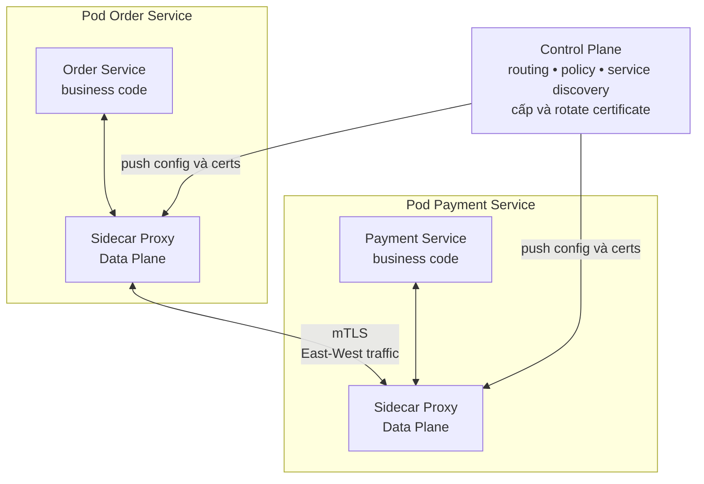
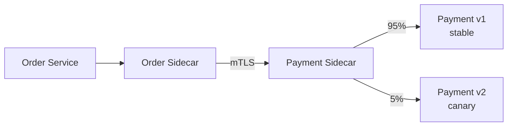

# Service Mesh Pattern — Networking cho Microservice

## Mục lục

- [Tổng quan](#tổng-quan)
- [Vấn đề Service Mesh giải quyết](#vấn-đề-service-mesh-giải-quyết)
  - [Networking concerns lặp lại](#networking-concerns-lặp-lại)
  - [Ranh giới trách nhiệm](#ranh-giới-trách-nhiệm)
- [Kiến trúc Service Mesh](#kiến-trúc-service-mesh)
  - [Data Plane và sidecar proxy](#data-plane-và-sidecar-proxy)
  - [Control Plane](#control-plane)
  - [Luồng request](#luồng-request)
- [Traffic management](#traffic-management)
  - [Routing và traffic shifting](#routing-và-traffic-shifting)
  - [Retry Load Balancing và Circuit Breaker](#retry-load-balancing-và-circuit-breaker)
- [Bảo mật giữa các service với mTLS](#bảo-mật-giữa-các-service-với-mtls)
  - [Service identity và certificate rotation](#service-identity-và-certificate-rotation)
- [Observability qua mesh](#observability-qua-mesh)
  - [Metrics và access logs](#metrics-và-access-logs)
  - [Distributed Tracing](#distributed-tracing)
- [Use case canary release](#use-case-canary-release)
  - [Luồng canary cho Payment Service](#luồng-canary-cho-payment-service)
  - [Ví dụ cấu hình Istio](#ví-dụ-cấu-hình-istio)
  - [Cách đánh giá và rollback](#cách-đánh-giá-và-rollback)
- [API Gateway và Service Mesh](#api-gateway-và-service-mesh)
  - [Hai lớp traffic khác nhau](#hai-lớp-traffic-khác-nhau)
  - [Vì sao không thay thế nhau](#vì-sao-không-thay-thế-nhau)
- [Trade-off](#trade-off)
- [Khi nào nên dùng và khi nào không nên dùng](#khi-nào-nên-dùng-và-khi-nào-không-nên-dùng)
- [Lỗi thường gặp](#lỗi-thường-gặp)
- [Vận hành Service Mesh](#vận-hành-service-mesh)
  - [Chuẩn bị và rollout](#chuẩn-bị-và-rollout)
  - [Resource và hiệu năng](#resource-và-hiệu-năng)
  - [Health Check Metrics và Alert](#health-check-metrics-và-alert)
  - [Debug và rollback](#debug-và-rollback)
- [Checklist triển khai](#checklist-triển-khai)
- [Liên kết liên quan](#liên-kết-liên-quan)

---

## Tổng quan

**Service Mesh** (lưới service) là một lớp hạ tầng chuyên quản lý giao tiếp giữa các service. Lớp này xử lý các **networking concerns** (mối quan tâm về mạng) như mã hóa, định tuyến, retry, load balancing và telemetry (các tín hiệu quan sát như metrics, logs và traces). Mục tiêu là đưa những concern dùng chung ra khỏi business code của từng service.

Service Mesh chủ yếu xử lý traffic **East-West**, tức traffic đi ngang giữa các service trong hệ thống. Traffic **North-South**, tức client bên ngoài đi vào hoặc đi ra hệ thống, thường thuộc ranh giới của [API Gateway](./api-gateway.md).

> **Phạm vi của pattern:** Service Mesh không thay domain service quyết định business rule. Nó cũng không tự thay thế Authorization ở cấp resource, idempotency, fallback hoặc Bulkhead của application. Mesh cung cấp một lớp networking nhất quán; application vẫn chịu trách nhiệm cho semantics của nghiệp vụ.

## Vấn đề Service Mesh giải quyết

### Networking concerns lặp lại

Trong một hệ thống **polyglot** (dùng nhiều ngôn ngữ), các service thường cần cùng một nhóm khả năng mạng:

| Networking concern | Khi mỗi service tự xử lý | Service Mesh hỗ trợ |
|---|---|---|
| **mTLS** | Mỗi team quản lý TLS và certificate theo một cách khác nhau | Sidecar mã hóa traffic và xác thực workload theo policy |
| **Retry và Circuit Breaker** | Mỗi ngôn ngữ dùng thư viện, giá trị và cách retry khác nhau | Proxy áp dụng policy chung cho các call phù hợp |
| **Load balancing** | Client phải biết cách chọn giữa nhiều instance | Proxy chọn endpoint theo discovery và policy |
| **Observability** | Mỗi service tự tích hợp metrics và tracing | Proxy tạo telemetry cho các hop đi qua mesh |
| **Traffic management** | Canary hoặc A/B testing cần sửa client hay load balancer | Control Plane phân phối routing policy đến proxy |
| **Service-to-service access control** | Quy tắc gọi giữa các service bị rải rác | Policy của mesh có thể giới hạn workload nào được gọi workload nào |

Ví dụ, `Order Service` viết bằng Java, `Product Service` viết bằng Node.js và `Payment Service` viết bằng Go có thể dùng ba bộ thư viện resilience và telemetry khác nhau. Hành vi khi timeout, retry hoặc ghi trace vì thế dễ lệch nhau. Khi những concern này nằm ở sidecar, application code chỉ cần gọi service theo contract của nó.

Mesh không làm mất mọi khác biệt giữa các service. Protocol, timeout theo business SLA (cam kết mức dịch vụ) và cách xử lý kết quả vẫn cần được thiết kế ở application. Mesh chỉ tạo một điểm áp dụng policy cho phần networking có thể chuẩn hóa.

### Ranh giới trách nhiệm

Bốn loại trách nhiệm sau nên được phân biệt ngay từ đầu:

| Trách nhiệm | Nơi phù hợp | Ví dụ |
|---|---|---|
| Giao tiếp giữa workload | Service Mesh | mTLS, route đến instance, retry lỗi transient |
| Identity của workload và policy gọi nhau | Mesh và platform security | `Payment Service` chỉ nhận traffic từ workload được cho phép |
| Identity của end user và API public | API Gateway hoặc application security | Validate JWT của user, rate limit theo client |
| Quyết định nghiệp vụ | Domain service | Có được thanh toán, giữ kho hoặc hoàn tiền hay không |

Một sidecar không biến một request thành giao dịch phân tán an toàn. Mesh có thể retry một call, nhưng không biết retry đó có làm charge tiền lần hai hay không. Quyết định retry mutation và cơ chế idempotency vẫn thuộc contract của application.

## Kiến trúc Service Mesh



Kiến trúc này có hai mặt phẳng:

- **Data Plane** gồm các sidecar proxy trực tiếp xử lý request và response.
- **Control Plane** là bộ phận quản lý cấu hình, identity và policy rồi phân phối chúng đến các proxy.

Trong mô hình sidecar, proxy chạy cạnh application container, thường trong cùng một Pod. Request outbound của application đi qua proxy của chính Pod đó. Proxy đích tiếp nhận request, áp policy rồi chuyển vào application đích.

### Data Plane và sidecar proxy

**Sidecar proxy** là một proxy phụ được triển khai cùng service để đại diện service xử lý traffic. Application vẫn có thể gọi một địa chỉ service thông thường, chẳng hạn `http://payment:8080`. Cơ chế mạng của mesh đưa traffic qua proxy mà không yêu cầu application tự tích hợp SDK (bộ thư viện tích hợp) của từng mesh.

Các nhiệm vụ thường nằm ở Data Plane:

| Nhiệm vụ | Proxy thực hiện | Điều cần lưu ý |
|---|---|---|
| Forward traffic | Nhận traffic outbound và inbound rồi chuyển đến đúng endpoint | Chỉ có hiệu lực khi traffic thực sự đi qua proxy |
| mTLS | Mã hóa, giải mã và xác thực certificate của workload | Cần policy trust và identity đúng |
| Routing và load balancing | Chọn route, subset hoặc instance theo cấu hình | Capability và cú pháp phụ thuộc mesh |
| Resilience policy | Có thể áp timeout, retry, outlier detection hoặc Circuit Breaker | Không retry mù request làm thay đổi dữ liệu |
| Telemetry | Ghi metrics, access log và tạo hoặc propagate trace context | Cần kết hợp với telemetry của application |

Sidecar không phải là một nơi để đặt business logic. Nếu proxy phải hiểu quy tắc giá, trạng thái đơn hàng hoặc điều kiện khuyến mãi, ranh giới của pattern đã bị phá vỡ.

### Control Plane

**Control Plane** là bộ não quản lý của mesh. Nó không xử lý business request thay application. Nó nhận cấu hình khai báo, chuyển cấu hình thành thông tin mà proxy hiểu rồi push xuống Data Plane.

Các trách nhiệm chính gồm:

1. **Quản lý routing và policy:** nhận quy tắc route, traffic split, access control và resilience.
2. **Cung cấp service discovery:** theo dõi service và endpoint để proxy biết các instance có thể nhận traffic.
3. **Cấp identity và certificate:** phát hành certificate cho workload theo trust domain của mesh.
4. **Phân phối cấu hình:** gửi thay đổi đến các sidecar liên quan để policy mới có hiệu lực.
5. **Hỗ trợ vận hành:** cung cấp trạng thái cấu hình và dữ liệu cần thiết để kiểm tra mesh.

Data Plane mới là nơi nằm trên đường đi của request. Vì vậy, cần theo dõi riêng sức khỏe của Control Plane và tình trạng đồng bộ của các proxy. Control Plane khỏe không có nghĩa mọi route ở Data Plane đã đúng; ngược lại, một proxy có thể vẫn phục vụ theo cấu hình cuối cùng trong khi Control Plane đang gặp vấn đề. Cần xác định hành vi này theo implementation trước khi đưa vào production.

Istio thường dùng **Envoy** làm proxy và `Istiod` làm Control Plane. Linkerd dùng `linkerd2-proxy` và Control Plane riêng. Chi tiết triển khai và sự khác nhau giữa hai lựa chọn nằm trong [phần Service Mesh của Orchestration](../13-orchestration.md#9-service-mesh).

### Luồng request

Với `Order Service` gọi `Payment Service`, luồng điển hình là:

1. Application của Order gọi tên service `payment` như một downstream bình thường.
2. Sidecar của Order nhận traffic outbound và tra route, endpoint cùng policy tương ứng.
3. Proxy chọn instance Payment. Nếu policy yêu cầu, hai proxy thiết lập kết nối mTLS và xác thực identity.
4. Sidecar của Payment kiểm tra traffic theo policy rồi chuyển request vào Payment application.
5. Response quay lại qua hai proxy. Mỗi hop có thể tạo metrics, access log và span.

Application không cần biết chi tiết certificate hoặc địa chỉ IP của từng Pod. Tuy nhiên, team vẫn phải kiểm tra rằng DNS, service discovery, protocol và cơ chế intercept đã được cấu hình đúng. Một request bypass sidecar sẽ không nhận được các policy mà team tưởng là đang áp dụng.

## Traffic management

**Traffic management** là việc điều khiển cách request được route và phân phối ở tầng network. Nó cho phép thay đổi đường đi của traffic mà không đưa logic routing vào từng application.

### Routing và traffic shifting

Mesh có thể route theo service, subset phiên bản hoặc trọng số. **Traffic shifting** là chuyển dần một phần traffic từ destination này sang destination khác. Các use case thường gặp gồm:

| Use case | Cách mesh hỗ trợ |
|---|---|
| **Canary release** | Chia traffic theo trọng số giữa phiên bản stable và canary |
| **A/B testing** | Chọn route khác nhau theo policy request đã định nghĩa |
| **Fault injection** | Cố ý đưa delay hoặc lỗi vào một route để kiểm tra resilience |
| **Load balancing** | Phân phối request giữa các instance của cùng service |
| **Outlier detection** | Tạm loại instance có hành vi lỗi theo policy của proxy |

Routing policy nên được lưu cùng source control và review như code. Một thay đổi trọng số có thể tác động đến toàn bộ traffic của service dù application binary không đổi. Cần kiểm tra route thực tế ở proxy, không chỉ kiểm tra file YAML trong repository.

### Retry Load Balancing và Circuit Breaker

Mesh có thể cung cấp một lớp resilience chung, nhưng policy cần có giới hạn rõ ràng:

- **Load balancing:** proxy chọn instance phù hợp thay vì để mỗi application tự cài client-side load balancer.
- **Timeout:** giới hạn thời gian chờ của downstream để một request không giữ tài nguyên vô hạn.
- **Retry:** chỉ retry lỗi transient (có khả năng tự hết), giới hạn số lần và dùng backoff. Request mutation chỉ nên retry khi contract đã có idempotency.
- **Circuit Breaker:** có thể fail fast hoặc tạm ngừng gửi đến destination đang lỗi nhiều, tùy capability của mesh.

> **Cẩn thận với nhiều tầng retry:** nếu application, sidecar và một gateway cùng retry, một request có thể tạo ra nhiều request đến downstream. Hãy phân định tầng chịu trách nhiệm retry và đặt retry budget trước khi bật policy.

Mesh không biết một `POST /payments` có an toàn để retry hay không. Nó cũng không thể tự viết fallback nghiệp vụ hoặc Bulkhead cho mọi code path. Xem [Resilience Patterns](../10-resilience-patterns.md) để thiết kế các phần application-level còn lại.

## Bảo mật giữa các service với mTLS

**mTLS** (mutual TLS) là TLS hai chiều. Cả client và server đều trình certificate để xác thực lẫn nhau, thay vì chỉ server chứng minh danh tính như TLS thông thường.

Giữa hai sidecar, mTLS cung cấp ba thuộc tính quan trọng:

- **Confidentiality:** traffic được mã hóa trên đường truyền.
- **Integrity:** bên nhận phát hiện dữ liệu bị sửa đổi.
- **Mutual authentication:** mỗi bên biết workload đối tác thông qua certificate và trust chain.

Service Mesh giúp tự động hóa phần certificate và TLS cho traffic đi qua mesh. Application code vì thế không phải tự mở rộng để quản lý certificate cho từng downstream. Tuy vậy, bật mTLS không tự động có nghĩa mọi traffic trong hệ thống đã được bảo vệ. Cần xác định workload nào tham gia mesh, traffic nào đi qua proxy và policy nào bắt buộc mTLS.

### Service identity và certificate rotation

Control Plane thường cấp certificate cho workload, phân phối identity đến proxy và thực hiện **certificate rotation** (thay certificate trước khi hết hạn). Mỗi service có identity riêng giúp policy phân biệt `Order Service` với `Payment Service`, thay vì chỉ tin network location hoặc IP.

Một quy trình bảo mật cần trả lời các câu hỏi sau:

| Câu hỏi | Điều cần xác định |
|---|---|
| Ai cấp certificate? | Control Plane, CA nội bộ (Certificate Authority — nơi ký certificate) hoặc trust system nào |
| Identity có ý nghĩa gì? | Workload, namespace, service account hoặc boundary tương ứng |
| Ai được gọi ai? | Authorization policy giữa các workload |
| Khi certificate sắp hết hạn thì sao? | Rotation tự động, metric lỗi và quy trình xử lý |
| Traffic nào nằm ngoài mesh? | Gateway, job, legacy service hoặc protocol chưa được proxy hỗ trợ |

mTLS xác thực **workload**, không thay cho Authentication của end user. Một request đến Order Service vẫn cần kiểm tra user có quyền trên order cụ thể hay không. Mesh có thể cung cấp policy ở tầng service-to-service; domain service vẫn phải kiểm tra Authorization theo tài nguyên và business rule. Tham khảo thêm [Security](../15-security.md).

## Observability qua mesh

**Observability** là khả năng suy ra trạng thái bên trong hệ thống từ các tín hiệu bên ngoài như metrics, logs và traces. Vì proxy nằm trên đường đi của service-to-service request, mesh có thể tạo một góc nhìn nhất quán cho các network hop.

### Metrics và access logs

Proxy có thể cung cấp các tín hiệu sau cho từng route hoặc destination:

| Tín hiệu | Câu hỏi trả lời được |
|---|---|
| Request rate | Traffic đang đi qua service nào và tăng ở đâu? |
| Latency theo percentile | Hop nào đang chậm, đặc biệt ở P95 hoặc P99? |
| Status code và error rate | Lỗi phát sinh ở source, proxy hay destination? |
| Retry và Circuit Breaker state | Có retry storm hoặc destination bị ngắt không? |
| mTLS và policy error | Request bị từ chối vì identity, certificate hay policy nào? |
| CPU, memory và connection | Sidecar có bị thiếu resource hoặc bão hòa connection không? |

Proxy access log giúp nhìn request ở ranh giới network. Application log vẫn cần để biết business operation đã làm gì. Không nên coi metric của proxy là thay thế cho metric nghiệp vụ như số đơn hàng hoặc số payment thành công.

Access log và trace có thể chứa path, header hoặc metadata nhạy cảm. Cần mask token, password, PII (dữ liệu nhận diện cá nhân) và thông tin payment trước khi gửi đến hệ thống log. Xem [Observability & Evolvability](../11-observability-evolvability.md) để thiết kế logging và metrics tổng thể.

### Distributed Tracing

Mesh có thể tạo span cho các proxy hop và propagate **Trace Context** qua HTTP headers hoặc gRPC metadata. Nhờ đó, trace của một request có thể cho thấy thời gian nằm ở proxy, source service hay destination service.

Để trace xuyên suốt chuỗi gọi:

1. Proxy cần tạo hoặc tiếp nhận trace context.
2. Application cần giữ và forward context khi tự tạo downstream request.
3. Các proxy tiếp theo cần đọc context và ghi span tương ứng.
4. Backend tracing cần ghép các span theo cùng Trace ID.

Nếu application không forward context, proxy vẫn có thể ghi metrics và access log, nhưng trace có thể bị đứt thành các trace riêng. Khi debug, nên kết hợp `Request ID`, `Trace ID`, route, source workload và destination workload thay vì chỉ nhìn một log của sidecar.

## Use case canary release

**Canary release** là cách đưa phiên bản mới đến một phần nhỏ traffic trước khi mở rộng cho toàn bộ người dùng. Service Mesh giúp đặt traffic split ở proxy, nên client có thể tiếp tục gọi logical service `payment` thay vì tự biết `payment:v1` hay `payment:v2`.

### Luồng canary cho Payment Service

Giả sử `Payment Service` có hai subset: `v1` là stable và `v2` là canary. Policy ban đầu đưa 95% request đến `v1` và 5% đến `v2`:



Không có mesh, quyết định chia traffic có thể phải nằm trong client, load balancer hoặc một lớp deploy khác. Những cách này đều cần phối hợp riêng để giữ route và identity nhất quán. Với mesh, route được khai báo ở Control Plane và proxy áp dụng cho traffic đi qua nó. Application của Order vẫn gọi cùng một service contract.

Canary không làm mất yêu cầu tương thích contract. `v2` phải đọc được request mà `v1` đang xử lý và response phải phù hợp với caller. Với payment, cần đặc biệt thận trọng với retry, idempotency và side effect trước khi tăng tỷ lệ traffic.

### Ví dụ cấu hình Istio

Đoạn YAML dưới đây minh họa cách Istio tách stable và canary bằng `DestinationRule`, sau đó chia traffic bằng `VirtualService`. Tên API và field cần được kiểm tra theo phiên bản Istio đang dùng; đây là policy minh họa, không phải cấu hình áp dụng cho mọi mesh.

```yaml
# VirtualService: chia traffic đến hai subset của Payment Service
apiVersion: networking.istio.io/v1beta1
kind: VirtualService
metadata:
  name: payment
spec:
  hosts:
    - payment
  http:
    - route:
        - destination:
            host: payment
            subset: stable
          weight: 95
        - destination:
            host: payment
            subset: canary
          weight: 5
---
# DestinationRule: ánh xạ subset tới version của workload
apiVersion: networking.istio.io/v1beta1
kind: DestinationRule
metadata:
  name: payment
spec:
  host: payment
  subsets:
    - name: stable
      labels:
        version: v1
    - name: canary
      labels:
        version: v2
```

Routing chỉ là một phần của canary. Cần có policy mTLS và authorization phù hợp cho cả hai subset. Nếu `v2` không nhận được traffic vì identity, endpoint hoặc policy sai, việc giảm trọng số không giải quyết được nguyên nhân.

### Cách đánh giá và rollback

Một vòng canary thực dụng có thể tiến hành theo các bước:

1. Deploy `v2` với resource, health check và contract tương thích.
2. Đưa một tỷ lệ nhỏ traffic vào `v2`.
3. So sánh error rate, latency, retry, Circuit Breaker state và metrics nghiệp vụ giữa `v1` và `v2`.
4. Nếu tín hiệu ổn định, tăng trọng số theo từng bước đã review.
5. Nếu có dấu hiệu lỗi, đưa trọng số về `v1` và giữ dữ liệu trace/log để điều tra.

Rollback route chỉ ngăn traffic mới đến canary. Nó không tự hoàn tác side effect mà `v2` đã thực hiện. Với Payment Service, cần có cơ chế idempotency và quy trình đối soát riêng cho các request đã xử lý.

## API Gateway và Service Mesh

API Gateway và Service Mesh thường cùng xuất hiện trong một hệ thống nhưng phục vụ hai hướng traffic khác nhau.

### Hai lớp traffic khác nhau

| Tiêu chí | API Gateway | Service Mesh |
|---|---|---|
| **Hướng traffic** | North-South: client đi vào hoặc đi ra hệ thống | East-West: service gọi service trong nội bộ |
| **Vị trí** | Edge, trước các service hoặc BFF | Quanh các workload tham gia mesh |
| **Đối tượng gọi** | Web, Mobile, partner hoặc client bên ngoài | Domain service và workload nội bộ |
| **Trách nhiệm chính** | Authentication user, Rate Limiting, routing public, aggregation | mTLS, workload identity, internal routing, retry, load balancing, traffic shifting |
| **Đơn vị triển khai** | Một logical gateway, thường chạy nhiều instance | Sidecar proxy theo Pod hoặc workload; Control Plane quản lý chung |
| **Business logic** | Không nên chứa business rule | Không chứa business rule |

### Vì sao không thay thế nhau

Gateway trả lời câu hỏi: **client bên ngoài đi vào hệ thống bằng contract nào?** Mesh trả lời câu hỏi: **các workload bên trong gọi nhau an toàn và có kiểm soát ra sao?**

```text
Client ── North-South ──▶ API Gateway ──▶ Service A
                                            │
                         East-West         ▼
                                      Service Mesh
                                            │
                                            ▼
                                         Service B
```

Dùng Service Mesh không tự cung cấp public API aggregation, user Authentication hoặc Rate Limiting theo tenant. Dùng API Gateway cũng không tự bảo vệ mọi call trực tiếp giữa `Service A` và `Service B`. Hai pattern bổ sung cho nhau, nhưng policy của mỗi lớp nên được giữ đúng boundary.

## Trade-off

| Lợi ích | Chi phí hoặc rủi ro |
|---|---|
| Networking policy nhất quán cho nhiều ngôn ngữ | Mỗi Pod thêm sidecar, làm tăng CPU và memory cần capacity planning |
| mTLS, traffic shifting và một số resilience policy không cần sửa application code | Mỗi proxy thêm một network hop, có thể tăng latency |
| Metrics và tracing ở các service hop dễ chuẩn hóa hơn | Control Plane là thành phần hạ tầng mới phải vận hành và nâng cấp |
| Có thể thay đổi route bằng config thay vì sửa từng client | Cấu hình sai có thể ảnh hưởng nhiều service hoặc nhiều traffic |
| Tách networking concern khỏi business code | Debug khó hơn vì request có thể lỗi ở app, sidecar, policy hoặc Control Plane |

Mesh không phải là “miễn phí” chỉ vì application code ít thay đổi. Chi phí vận hành chuyển sang proxy, policy, certificate, resource và năng lực debug. Chỉ nên áp dụng khi những lợi ích này giải quyết một pain point đã quan sát được.

## Khi nào nên dùng và khi nào không nên dùng

| Nên dùng khi | Không nên hoặc chưa cần khi |
|---|---|
| Có nhiều service, thường ở quy mô khoảng một chục service trở lên | Có ít service và các service dùng cùng một stack ngôn ngữ |
| Có nhiều team, polyglot và cần networking policy nhất quán | Team chưa vững Kubernetes hoặc chưa có người vận hành Control Plane |
| Cần mTLS cho traffic nội bộ vì compliance hoặc yêu cầu bảo mật | Network nội bộ được tin cậy và chưa có yêu cầu mTLS rõ ràng |
| Cần canary, A/B testing hoặc traffic control tinh vi ở network level | Rolling update và routing cơ bản đã đáp ứng use case |
| Cần observability nhất quán cho nhiều hop service-to-service | Chưa đo được pain point mà mesh sẽ giải quyết |

Các con số trên chỉ là heuristic, không phải ngưỡng bắt buộc. Với hệ thống nhỏ, có thể bắt đầu bằng thư viện resilience, service discovery và telemetry phù hợp. Khi số service, số ngôn ngữ hoặc yêu cầu security tăng đến mức các thư viện riêng lẻ khó giữ nhất quán, hãy đánh giá mesh. Xem thêm [khi nào cần hoặc không cần Service Mesh](../13-orchestration.md#96-khi-nào-cần--không-cần-service-mesh).

## Lỗi thường gặp

1. **Adopt mesh quá sớm:** Bật Istio cho vài service nhỏ có thể tạo thêm nhiều CRD (Custom Resource Definition — kiểu tài nguyên mở rộng của Kubernetes), proxy và quy trình vận hành hơn giá trị nhận được. Hãy bắt đầu từ pain point cụ thể.
2. **Dùng mesh thay cho API Gateway:** Mesh không xử lý public Authentication, Rate Limiting theo client hoặc API Aggregation. Internal traffic và edge traffic cần boundary riêng.
3. **Không cấp resource cho sidecar:** Sidecar cũng tiêu thụ CPU và memory. Nếu quên đưa chúng vào `requests`, `limits` và capacity planning, Pod có thể bị throttle hoặc thiếu tài nguyên.
4. **Nghĩ mesh thay cho resilience của application:** Mesh không biết business fallback, Bulkhead, idempotency hoặc compensating action. Các phần đó vẫn phải nằm ở application và domain.
5. **Bật mTLS nhưng không có kế hoạch rotation:** Certificate hết hạn, trust chain sai hoặc workload chưa được inject có thể làm traffic nội bộ thất bại hàng loạt.
6. **Retry ở mọi tầng:** Application và sidecar cùng retry không giới hạn có thể tạo retry storm. Chỉ retry lỗi transient, đặt max attempts, backoff và retry budget.
7. **Đổi routing config mà không quan sát:** Tăng trọng số canary mà không theo dõi error rate, latency và trace có thể mở rộng lỗi nhanh hơn. Mọi thay đổi route cần có rollout và rollback.
8. **Để traffic bypass sidecar:** Một workload, port hoặc protocol không đi qua proxy sẽ không nhận mTLS, policy và telemetry như dự kiến. Cần kiểm tra đường đi thực tế.
9. **Chỉ debug application:** Khi request lỗi, cần phân biệt lỗi ở application, endpoint discovery, sidecar route, mTLS handshake, authorization policy hay Control Plane. Chỉ đọc application log thường không đủ.

## Vận hành Service Mesh

### Chuẩn bị và rollout

Một kế hoạch triển khai nên đi theo các bước có thể kiểm chứng:

1. **Lập inventory traffic:** ghi lại service nào gọi service nào, protocol, volume, timeout và dependency quan trọng.
2. **Xác định boundary:** chọn namespace hoặc nhóm workload sẽ tham gia mesh. Ghi rõ traffic nào vẫn nằm ngoài mesh.
3. **Chọn implementation:** cân nhắc Istio khi cần fine-grained control và Linkerd khi ưu tiên simplicity, theo năng lực team và use case thực tế.
4. **Đo baseline:** lưu latency, error rate, CPU, memory và connection trước khi inject proxy. Nếu không có baseline, khó biết overhead hoặc policy mới gây ra điều gì.
5. **Rollout từng phần:** bắt đầu từ workload ít rủi ro, kiểm tra sidecar, service discovery, mTLS và tracing rồi mới mở rộng.
6. **Version hóa policy:** review route, mTLS và authorization policy như code. Mỗi thay đổi cần có người chịu trách nhiệm và kế hoạch rollback.
7. **Diễn tập failure:** kiểm tra timeout, certificate issue, Control Plane không đồng bộ, destination lỗi và canary rollback trong môi trường an toàn.

Không nên bật đồng thời mTLS, retry, traffic split và nhiều policy mới trên toàn cluster nếu chưa có cách cô lập nguyên nhân. Rollout nhỏ làm giảm phạm vi ảnh hưởng khi cấu hình sai.

### Resource và hiệu năng

- Đưa CPU và memory của sidecar vào `requests`, `limits` và capacity planning của từng Pod.
- Đo latency ở source application, source proxy, destination proxy và destination application để tách overhead mạng khỏi thời gian xử lý nghiệp vụ.
- Giới hạn timeout và số retry theo request budget. Backoff cần tránh việc nhiều proxy retry cùng thời điểm.
- Theo dõi connection pool, số request đồng thời, retry count và Circuit Breaker state.
- Kiểm tra các route có fan-out lớn. Một request tạo nhiều downstream call có thể làm proxy và destination bão hòa dù request rate ở edge không đổi.

Các giá trị timeout, retry và resource không nên copy nguyên từ một cluster khác. Hãy điều chỉnh theo latency baseline, SLO và đặc tính của service.

### Health Check Metrics và Alert

Nên có tín hiệu riêng cho Control Plane, Data Plane và application:

| Nhóm | Tín hiệu cần theo dõi |
|---|---|
| **Control Plane** | Availability, lỗi cấp certificate, lỗi phân phối hoặc đồng bộ cấu hình |
| **Sidecar** | Proxy ready, injection failure, listener/route không khớp |
| **Security** | mTLS handshake failure, certificate sắp hết hạn, authorization deny |
| **Traffic** | Request rate, P50/P95/P99 latency, 4xx/5xx, timeout, retry và Circuit Breaker open |
| **Resource** | CPU, memory, connection pool và network saturation của proxy |
| **Trace** | Tỷ lệ request có Trace ID đầy đủ và các span bị đứt giữa các hop |

Alert nên dựa trên baseline và SLO (mục tiêu về độ tin cậy) của hệ thống thay vì một ngưỡng chung cho mọi service. Một alert `5xx` tăng ở proxy cần được đối chiếu với application log và destination metrics trước khi kết luận service nào hỏng.

### Debug và rollback

Khi một request qua mesh bị lỗi hoặc chậm, có thể kiểm tra theo thứ tự:

1. Lấy `Request ID` hoặc `Trace ID` từ client/application log.
2. Xác định source workload, destination workload, route và phiên bản canary liên quan.
3. So sánh access log và metrics ở hai sidecar với log của hai application.
4. Kiểm tra endpoint discovery, route config, mTLS handshake và authorization policy.
5. Nếu lỗi bắt đầu sau policy change, giảm traffic hoặc rollback policy trước khi sửa nhiều biến cùng lúc.
6. Kiểm tra lại request sau rollback. Nếu side effect đã xảy ra, xử lý theo quy trình nghiệp vụ thay vì chỉ gửi lại request.

Rollback một route có thể đưa traffic về stable, nhưng không tự khôi phục certificate, dữ liệu hoặc side effect. Vì vậy, rollback cần bao gồm policy, workload version và bước đối soát phù hợp.

## Checklist triển khai

- [ ] Đã xác định các service-to-service call và traffic nằm ngoài mesh.
- [ ] Đã phân biệt rõ East-West traffic với North-South traffic.
- [ ] Đã chọn implementation dựa trên use case và năng lực vận hành.
- [ ] Đã xác định workload identity, trust boundary và authorization policy.
- [ ] mTLS đã có kế hoạch cấp, rotate và theo dõi certificate.
- [ ] Sidecar có CPU/memory `requests` và `limits` phù hợp.
- [ ] Route, traffic split, timeout và retry policy đã được version hóa.
- [ ] Retry có giới hạn, backoff và chỉ áp dụng cho operation an toàn.
- [ ] Application vẫn xử lý idempotency, fallback, Bulkhead và business rule của nó.
- [ ] Metrics, access logs và Distributed Tracing đã được kiểm tra xuyên các hop.
- [ ] Canary có health check, metrics đánh giá và rollback procedure.
- [ ] Đã kiểm thử policy deny, mTLS failure, timeout, destination failure và sidecar bypass.
- [ ] Team có runbook để debug Data Plane và Control Plane.

## Liên kết liên quan

| Tài liệu | Liên quan |
|---|---|
| [Communication Patterns](../17-communication-patterns.md#5-service-mesh-pattern) | Phần pattern nguồn và ranh giới với các communication pattern khác |
| [Orchestration](../13-orchestration.md#9-service-mesh) | Kiến trúc Service Mesh trên Kubernetes, Istio và Linkerd |
| [API Gateway Pattern](./api-gateway.md) | So sánh edge traffic và internal service-to-service traffic |
| [Structural Patterns](../17-structural-patterns.md) | Sidecar Pattern và cách tách concern khỏi application |
| [Service Discovery](../08-service-discovery.md) | Service registry, endpoint discovery và load balancing |
| [Resilience Patterns](../10-resilience-patterns.md) | Timeout, Retry, Circuit Breaker, Bulkhead và Fallback |
| [Observability và Evolvability](../11-observability-evolvability.md) | Metrics, Logging, Correlation ID và Distributed Tracing |
| [Security](../15-security.md) | mTLS, service identity, Authentication và Authorization |
