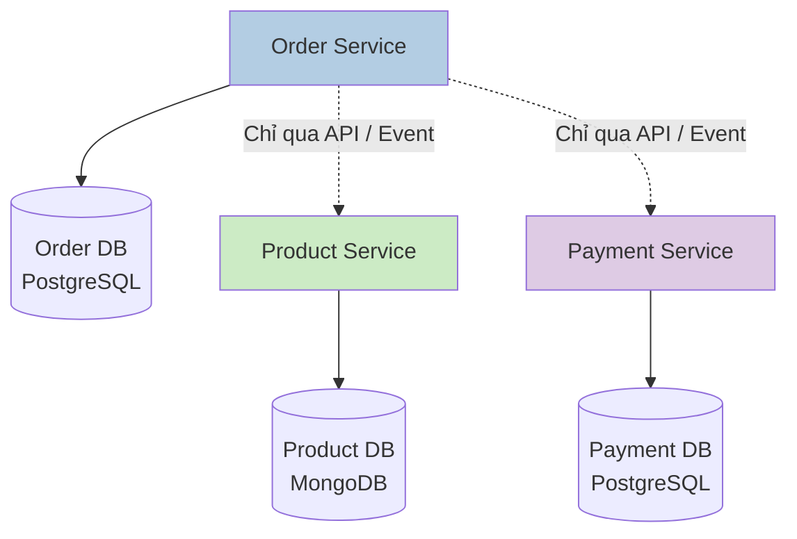
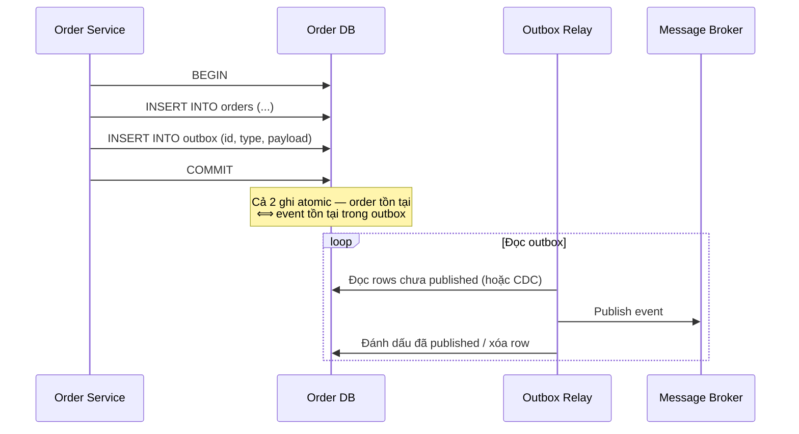
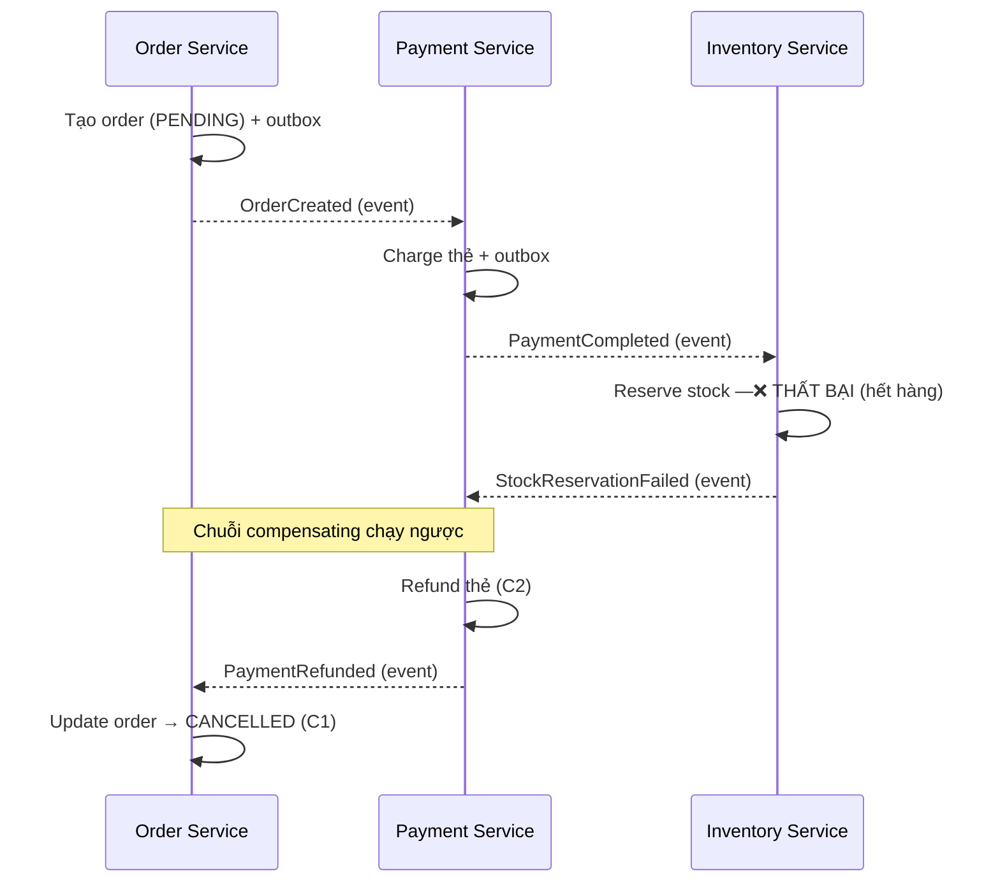
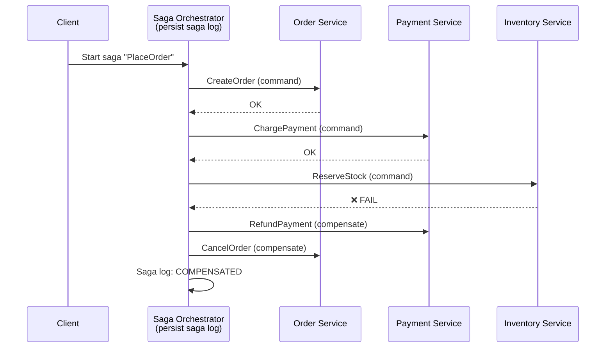
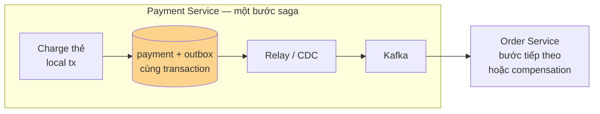
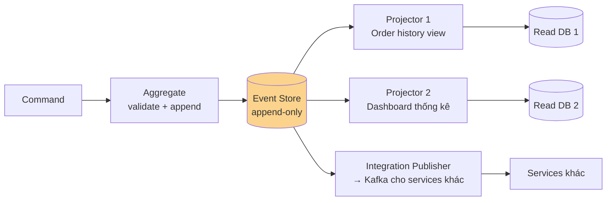
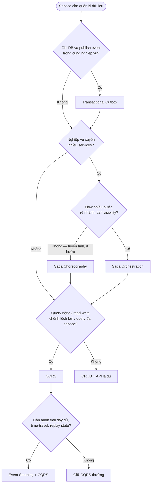

# Data Patterns trong Microservice — Chuyên sâu

## 📋 Mục lục

- [1. Giới thiệu — Data Patterns giải quyết vấn đề gì?](#1-giới-thiệu--data-patterns-giải-quyết-vấn-đề-gì)
- [2. Database per Service — Nền tảng của data ownership](#2-database-per-service--nền-tảng-của-data-ownership)
  - [2.1. Khái niệm và nguyên tắc sở hữu dữ liệu](#21-khái-niệm-và-nguyên-tắc-sở-hữu-dữ-liệu)
  - [2.2. Ba cấp độ triển khai](#22-ba-cấp-độ-triển-khai)
  - [2.3. Bốn hệ quả trực tiếp — và các pattern ra đời từ đó](#23-bốn-hệ-quả-trực-tiếp--và-các-pattern-ra-đời-từ-đó)
  - [2.4. Khi nào chọn / không nên chọn](#24-khi-nào-chọn--không-nên-chọn)
  - [2.5. Trade-off](#25-trade-off)
  - [2.6. Lỗi thường gặp](#26-lỗi-thường-gặp)
- [3. Transactional Outbox — Ghi DB và publish event một cách atomic](#3-transactional-outbox--ghi-db-và-publish-event-một-cách-atomic)
  - [3.1. Vấn đề gốc: Dual Write](#31-vấn-đề-gốc-dual-write)
  - [3.2. Cơ chế hoạt động](#32-cơ-chế-hoạt-động)
  - [3.3. Outbox Relay: Polling vs Transaction Log Tailing](#33-outbox-relay-polling-vs-transaction-log-tailing)
  - [3.4. Ví dụ use case — Order Service](#34-ví-dụ-use-case--order-service)
  - [3.5. Khi nào chọn / không nên chọn](#35-khi-nào-chọn--không-nên-chọn)
  - [3.6. Trade-off và ràng buộc vận hành](#36-trade-off-và-ràng-buộc-vận-hành)
  - [3.7. Lỗi thường gặp](#37-lỗi-thường-gặp)
- [4. Saga Pattern — Distributed transaction bằng chuỗi local transactions](#4-saga-pattern--distributed-transaction-bằng-chuỗi-local-transactions)
  - [4.1. Khái niệm cốt lõi](#41-khái-niệm-cốt-lõi)
  - [4.2. Choreography Saga — phối qua events](#42-choreography-saga--phối-qua-events)
  - [4.3. Orchestration Saga — điều phối tập trung](#43-orchestration-saga--điều-phối-tập-trung)
  - [4.4. So sánh và cách chọn](#44-so-sánh-và-cách-chọn)
  - [4.5. Vấn đề thiếu isolation và ba đối sách](#45-vấn-đề-thiếu-isolation-và-ba-đối-sách)
  - [4.6. Khi nào chọn / không nên chọn](#46-khi-nào-chọn--không-nên-chọn)
  - [4.7. Lỗi thường gặp](#47-lỗi-thường-gặp)
- [5. CQRS — Tách trách nhiệm Command và Query](#5-cqrs--tách-trách-nhiệm-command-và-query)
  - [5.1. Khái niệm](#51-khái-niệm)
  - [5.2. Ba mức độ áp dụng](#52-ba-mức-độ-áp-dụng)
  - [5.3. Đồng bộ Read Model và eventual consistency](#53-đồng-bộ-read-model-và-eventual-consistency)
  - [5.4. Ví dụ use case — Order history và product search](#54-ví-dụ-use-case--order-history-và-product-search)
  - [5.5. Khi nào chọn / không nên chọn](#55-khi-nào-chọn--không-nên-chọn)
  - [5.6. Trade-off](#56-trade-off)
  - [5.7. Lỗi thường gặp](#57-lỗi-thường-gặp)
- [6. Event Sourcing — Lưu events thay vì state](#6-event-sourcing--lưu-events-thay-vì-state)
  - [6.1. Khái niệm](#61-khái-niệm)
  - [6.2. Cơ chế hoạt động: append, replay, snapshot](#62-cơ-chế-hoạt-động-append-replay-snapshot)
  - [6.3. Ví dụ use case — Tài khoản giao dịch](#63-ví-dụ-use-case--tài-khoản-giao-dịch)
  - [6.4. Khi nào chọn / không nên chọn](#64-khi-nào-chọn--không-nên-chọn)
  - [6.5. Trade-off](#65-trade-off)
  - [6.6. Lỗi thường gặp](#66-lỗi-thường-gặp)
- [7. Kết hợp an toàn các Data Patterns](#7-kết-hợp-an-toàn-các-data-patterns)
  - [7.1. Ma trận tương tác giữa các patterns](#71-ma-trận-tương-tác-giữa-các-patterns)
  - [7.2. Saga + Outbox — cặp bắt buộc](#72-saga--outbox--cặp-bắt-buộc)
  - [7.3. Event Sourcing + CQRS — cặp kinh điển](#73-event-sourcing--cqrs--cặp-kinh-điển)
  - [7.4. CQRS từ integration events — query đa service không JOIN](#74-cqrs-từ-integration-events--query-đa-service-không-join)
  - [7.5. Kiến trúc tham chiếu — E-commerce](#75-kiến-trúc-tham-chiếu--e-commerce)
  - [7.6. Tám nguyên tắc khi kết hợp](#76-tám-nguyên-tắc-khi-kết-hợp)
- [8. Decision Guide — Chọn pattern theo tình huống](#8-decision-guide--chọn-pattern-theo-tình-huống)
  - [8.1. Decision flow](#81-decision-flow)
  - [8.2. Bảng tình huống thực tế](#82-bảng-tình-huống-thực-tế)
- [9. Lỗi thường gặp xuyên suốt](#9-lỗi-thường-gặp-xuyên-suốt)
- [10. Checklist](#10-checklist)
  - [✅ Design review — trước khi build](#design-review--trước-khi-build)
  - [✅ Operations — trước khi đi live](#operations--trước-khi-đi-live)
- [11. Tổng kết](#11-tổng-kết)
- [12. Liên kết liên quan](#12-liên-kết-liên-quan)

---

## 1. Giới thiệu — Data Patterns giải quyết vấn đề gì?

Trong một monolith, mọi thứ đơn giản về mặt dữ liệu: **một database, một transaction**. Khi `Đặt hàng` cần tạo order, trừ kho, charge thẻ — tất cả nằm trong một ACID transaction, nếu lỗi thì ROLLBACK sạch sẽ.

Khi tách thành microservices, điều đó biến mất. Order Service, Inventory Service, Payment Service — mỗi service một process, một database. **Không còn transaction duy nhất nào bao trùm tất cả.** Data Patterns (các mẫu thiết kế quản lý dữ liệu phân tán) ra đời để trả lời các câu hỏi sau:

| Câu hỏi | Pattern trả lời |
|---------|-----------------|
| Ai sở hữu dữ liệu nào? Service khác lấy dữ liệu thế nào? | **Database per Service** |
| Ghi DB xong mà event publish thất bại thì sao? | **Transactional Outbox** |
| Một nghiệp vụ chạm nhiều services, không có transaction chung? | **Saga** |
| Đọc nhiều ghi ít, query phức tạp xuyên service? | **CQRS** |
| Cần audit trail đầy đủ, tái tạo state tại mọi thời điểm? | **Event Sourcing** |

> 📖 Tài liệu này xem xét **góc nhìn pattern**: mỗi pattern là một quyết định kiến trúc, có tiêu chí chọn, trade-off, và **cách chúng tương tác với nhau**. Chi tiết nền tảng (CAP theorem, 2PC, CDC, polyglot persistence...) xem [doc 09 — Data Management](09-data-management.md); giao tiếp sync/async và event-driven xem [doc 06 — Inter-Service Communication](06-inter-service-communication.md).

```
Phụ thuộc giữa các Data Patterns (học theo thứ tự này):

  Database per Service ──tạo ra vấn đề──▶ Saga ──────cần events đáng tin──▶ Transactional Outbox
           │                                     │
           │                                     └──kết hợp──▶ CQRS ◀──giải quyết query── Event Sourcing
           └──tạo ra vấn đề query/read──▶ CQRS
```

---

## 2. Database per Service — Nền tảng của data ownership

### 2.1. Khái niệm và nguyên tắc sở hữu dữ liệu

**Database per Service** (mỗi service một database riêng) là pattern nền móng: mỗi microservice **sở hữu dữ liệu của mình** — service khác **không được phép** truy cập trực tiếp database đó, mà chỉ lấy dữ liệu qua API hoặc events.

Thuật ngữ then chốt: **data ownership** (quyền sở hữu dữ liệu) — dữ liệu thuộc về service duy nhất chịu trách nhiệm vòng đời của nó. Order data thuộc Order Service, product data thuộc Product Service.



Hai quy tắc bất di bất dịch:

1. **Chỉ service sở hữu mới ghi** dữ liệu của mình.
2. **Service khác đọc qua API hoặc nhận events** — không JOIN trực tiếp, không `SELECT` thẳng vào DB người khác.

### 2.2. Ba cấp độ triển khai

"Database riêng" không có nghĩa là bắt buộc mỗi service một DB server vật lý. Có ba cấp độ cách ly, từ lỏng đến chặt:

| Cấp độ | Cách triển khai | Cách ly | Phù hợp |
|--------|-----------------|---------|---------|
| **Private tables** | Cùng DB, cùng schema, chia bảng theo prefix (`order_orders`, `product_products`) | Chỉ dựa theo convention | MVP, team nhỏ — rủi ro dev "lỡ tay" JOIN chéo |
| **Private schema** | Cùng DB server, mỗi service một schema, phân quyền DB theo schema | Bằng permission của DB | Growth stage — cân bằng chi phí và cách ly |
| **Private database server** | Mỗi service một DB instance riêng | Hoàn toàn (cả resource lẫn fault) | Enterprise, services lớn cần scale độc lập |

> 📖 Phân tích chi tiết từng mô hình kèm ví dụ: [09 — Data Management, mục 2.2](09-data-management.md#22-các-mô-hình-triển-khai).

Nguyên tắc chọn: **bắt đầu ở cấp độ thấp nhất mà team vẫn tuân thủ được quyền sở hữu, tách dần khi pain xuất hiện**. Đừng over-engineer từ ngày đầu.

### 2.3. Bốn hệ quả trực tiếp — và các pattern ra đời từ đó

Database per Service là quyết định đúng (xem [04 — Autonomy & Independence](04-autonomy-independence.md)), nhưng nó **trả giá bằng bốn vấn đề mới**. Đây chính là lý do tồn tại của bốn pattern còn lại trong tài liệu:

```
Database per Service
        │
        ├──▶ (1) Một nghiệp vụ chạm nhiều DB
        │        → không có transaction chung
        │        → Saga Pattern (mục 4)
        │
        ├──▶ (2) Ghi DB + publish event là 2 thao tác riêng biệt
        │        → event có thể mất (dual write)
        │        → Transactional Outbox (mục 3)
        │
        ├──▶ (3) Không JOIN được giữa các DB
        │        → query xuyên service khó
        │        → CQRS + API Composition (mục 5)
        │
        └──▶ (4) Chỉ còn state hiện tại, mất lịch sử
                 → audit, debugging khó
                 → Event Sourcing (mục 6)
```

### 2.4. Khi nào chọn / không nên chọn

| ✅ Nên chọn khi | ❌ Không nên khi |
|-----------------|------------------|
| Service có bounded context rõ ràng (xem [02 — Single Responsibility](02-single-responsibility-bounded-context.md)) | Team nhỏ, một sản phẩm đơn giản — monolith module vẫn đủ |
| Các team cần deploy, scale độc lập theo service | Chỉ 1-2 dev, không có nhu cầu scale từng phần |
| Muốn polyglot persistence — mỗi service chọn DB phù hợp workload | Dữ liệu luôn được dùng chung kiểu JOIN chặt, tách ra chỉ tăng phức tạp |
| Cần tránh một schema chung làm mọi service coupling chặt nhau | Đang trong giai đoạn "shared database tạm thời" của migration Strangler Fig ([17 — Decomposition Patterns](17-decomposition-patterns.md)) |

### 2.5. Trade-off

| Được gì | Mất gì |
|---------|--------|
| Loose coupling — đổi schema không phá service khác | Mất ACID transaction xuyên service → cần Saga |
| Independent scaling (read replica, vertical scaling riêng) | Cross-service query khó → cần CQRS / API Composition |
| Polyglot persistence (SQL + NoSQL theo use case) | Nhiều DB hơn → chi phí vận hành, monitoring tăng |
| Fault isolation — DB của service này chết không kéo theo service kia | Data duplication gần như không tránh khỏi (cache, replica cục bộ) |
| Team autonomy — tự do tech stack | Toàn cục consistency trở thành eventual consistency |

### 2.6. Lỗi thường gặp

| Lỗi | Hậu quả | Khắc phục |
|-----|---------|-----------|
| Service A `SELECT` thẳng vào DB của service B | Coupling ngầm về schema; B đổi schema phá A ngầm | Bắt buộc đi qua API/event; chặn bằng network policy + DB permission |
| Giữ "shared database" mãi với lý do "tiện" | Distributed monolith — triết lý microservice sụp đổ (xem [09, mục 3](09-data-management.md#3-shared-database--anti-pattern)) | Đặt milestone tách; chỉ chấp nhận shared DB như bước chuyển tiếp |
| Sao chép dữ liệu mà không có cơ chế đồng bộ | Data drift — bản sao lỗi thời, quyết định sai | Đồng bộ bằng events + Outbox (mục 3), đo được staleness |
| Tách DB theo lớp kỹ thuật (một DB read-only chung cho reporting) thay vì theo ownership | Ai cũng phụ thuộc một DB "god" | Tách theo bounded context; reporting dùng CQRS (mục 5) |

---

## 3. Transactional Outbox — Ghi DB và publish event một cách atomic

### 3.1. Vấn đề gốc: Dual Write

**Dual Write** là tình huống service phải thực hiện hai thao tác ghi độc lập — ghi database và publish event ra message broker — mà không có transaction nào bao cả hai:

```
Dual Write — 2 thao tác, KHÔNG atomic:

  1. INSERT order vào DB          → ✅ COMMITTED
  2. Publish OrderCreated vào Kafka → ❌ broker down / app crash giữa chừng

  Kết quả: order tồn tại nhưng không service nào biết
  → Inventory không trừ kho, Payment không charge
  → "Order ma" trong hệ thống
```

Đảo thứ tự cũng hỏng: publish trước, ghi DB sau → event mồ côi cho dữ liệu không tồn tại. Đây không phải vấn đề hạ tầng HA — kể cả khi DB và Kafka đều 99.99% uptime, app vẫn có thể crash ngay giữa hai bước.

> 📖 Phân tích đầy đủ ba scenario thất bại: [09 — Data Management, mục 10.1](09-data-management.md#101-vấn-đề-dual-write).

### 3.2. Cơ chế hoạt động

**Transactional Outbox Pattern** giải quyết bằng cách đưa event vào **cùng local transaction** với business data: ghi event vào một bảng `outbox` trong database của service, rồi một process riêng (**Outbox Relay**) đọc bảng này và publish ra broker.



Cấu trúc bảng outbox điển hình:

```sql
CREATE TABLE outbox (
    id           UUID PRIMARY KEY,        -- dùng làm idempotency key cho consumer
    aggregate_id TEXT NOT NULL,           -- ví dụ order_id → dùng làm partition key
    event_type   TEXT NOT NULL,           -- 'OrderCreated', 'OrderCancelled'
    payload      JSONB NOT NULL,          -- nội dung event
    created_at   TIMESTAMPTZ NOT NULL DEFAULT now()
);
```

Điểm mấu chốt: **database local transaction là đơn vị atomic duy nhất ta có** trong kiến trúc này — Outbox tận dụng đúng nó, còn việc publish ra broker trở thành thao tác có thể retry vô hạn lần mà không mất dữ liệu.

### 3.3. Outbox Relay: Polling vs Transaction Log Tailing

Có hai cách chính để đưa event từ outbox ra broker:

| Tiêu chí | Polling Publisher | Transaction Log Tailing (CDC) |
|----------|-------------------|-------------------------------|
| Cách hoạt động | Process polling `SELECT ... WHERE published = false` định kỳ | Đọc transaction log của DB (WAL/binlog) — ví dụ phổ biến: Debezium |
| Độ trễ | Phụ thuộc polling interval (thường trăm ms → vài giây) | Gần real-time |
| Tác động lên DB | Truy vấn định kỳ tăng load, cần index cẩn thận | Gần như không chạm bảng outbox |
| Đảm bảo thứ tự | Khó khi có nhiều polling instances | Theo thứ tự ghi trong log |
| Cài đặt | Đơn giản, tự viết được | Cần hạ tầng CDC (connector, topic quản lý) |
| Phù hợp | Hệ nhỏ/vừa, traffic event thấp | Hệ lớn, cần latency thấp và ordering chặt |

> 📖 Chi tiết Outbox + CDC: [09 — Data Management, mục 10.3](09-data-management.md#103-outbox--cdc--giải-pháp-hoàn-chỉnh). Khái niệm CDC (Change Data Capture — bắt thay đổi dữ liệu bằng cách đọc log của DB) được giải thích tại [09, mục 9.2](09-data-management.md#92-change-data-capture-cdc).

### 3.4. Ví dụ use case — Order Service

Order Service sau khi nhận request đặt hàng phải: (1) tạo order, (2) phát event `OrderCreated` để Inventory Service trừ kho. Với Outbox:

1. Trong **một transaction**: `INSERT orders` + `INSERT outbox(OrderCreated)`.
2. Relay (Debezium đọc WAL) đẩy event vào topic `orders.events`, key = `order_id` (giữ thứ tự theo từng order).
3. Inventory Service consume, kiểm tra đã xử lý event id này chưa (**idempotent consumer**), rồi trừ kho.

Nếu relay chết 5 phút — không sao: event vẫn nằm trong outbox, publish lại khi relay sống. Nếu DB ghi thành công thì event **chắc chắn** sẽ đến consumer (at-least-once).

### 3.5. Khi nào chọn / không nên chọn

| ✅ Nên chọn khi | ❌ Không cần khi |
|-----------------|------------------|
| Service vừa ghi DB vừa publish event trong cùng nghiệp vụ (gần như mọi event-driven service) | Service chỉ ghi DB, không publish event gì |
| Saga chạy theo events (mục 7.2) — mất event là gãy saga | Event chỉ là notification "best-effort" mà mất cũng chấp nhận được (hiếm) |
| Consumer cần đảm bảo không bỏ sót state change | Service dùng Event Sourcing thuần — event store vừa là DB vừa là log, chỉ có một phép ghi (mục 7.3) |

### 3.6. Trade-off và ràng buộc vận hành

| Được gì | Mất gì |
|---------|--------|
| DB write + event publish luôn đồng bộ — hết "order ma" | Delivery trở thành **at-least-once** → consumer bắt buộc idempotent |
| Không cần 2PC hay distributed transaction | Thêm moving part: relay process / CDC connector cần monitor |
| Event có thể retry, không mất | Latency publish tăng nhẹ (relay async) |
| Payload event được persist — audit được event đã gửi | Bảng outbox phình to nếu không dọn — cần job cleanup rows đã published |

### 3.7. Lỗi thường gặp

| Lỗi | Hậu quả | Khắc phục |
|-----|---------|-----------|
| Consumer không idempotent | Relay publish trùng (crash sau publish, trước mark) → trừ kho 2 lần | Dedupe bằng event `id` (bảng `processed_events`) hoặc thao tác giao hoán tự nhiên |
| Không quan tâm ordering | Hai event của cùng order vào partition khác nhau → Cancel tới trước Create | Dùng `aggregate_id` làm message key (Kafka) |
| Không cleanup outbox | Bảng outbox chậm dần, backup phình | Xóa rows đã published theo retention (giữ lại để audit nếu cần) |
| Đổi schema của payload event "suông" | Consumer cũ phá vỡ khi replay/upgrade | Versioning payload (`event_type` + schema version), xem [06, mục 5.2](06-inter-service-communication.md#52-event-types--domain-event-vs-integration-event) |
| Quên monitor relay | Event kẹt outbox hàng giờ không ai biết | Alert trên outbox lag (số rows chưa published / độ tuổi row cũ nhất) |

---

## 4. Saga Pattern — Distributed transaction bằng chuỗi local transactions

### 4.1. Khái niệm cốt lõi

**Saga Pattern** thay thế một distributed transaction bằng **chuỗi local transactions** — mỗi service commit transaction của mình ngay, và nếu bước nào đó thất bại, các bước đã hoàn thành được **đảo ngược** bằng **Compensating Transaction** (giao dịch bù — transaction mới triệt tiêu hiệu ứng của transaction cũ, không phải ROLLBACK).

Khác biệt then chốt cần khắc cốt ghi tâm:

| | ACID Rollback | Compensating Transaction |
|---|---------------|--------------------------|
| Cơ chế | Undo vật lý — dữ liệu như chưa từng tồn tại | Thêm transaction mới đảo ngược hiệu ứng nghiệp vụ |
| Dữ liệu cũ | Biến mất | Vẫn còn (order `CANCELLED`, không phải order bị xóa) — có audit trail |
| Khi nào chạy | Trong cùng transaction, trước COMMIT | Sau khi local transaction đã COMMIT ở các service khác |

Saga có hai kiểu triển khai: **Choreography** (phối hợp qua events, không có ai điều phối) và **Orchestration** (một orchestrator điều phối các bước).

### 4.2. Choreography Saga — phối qua events

Mỗi service thực hiện việc của mình rồi publish event; service khác lắng nghe và tiếp tục. Không ai nắm "bức tranh toàn cảnh" — flow là hành vi nổi (emergent) của các subscriptions.



Điểm mạnh: không single point of failure, không coupling trực tiếp giữa các services (chỉ qua events). Điểm yếu: nhìn vào code của từng service **không ai biết saga toàn cục trông thế nào** — flow nằm rải rác trong các event handlers.

### 4.3. Orchestration Saga — điều phối tập trung

Một **Saga Orchestrator** (điều phối viên) nắm state machine của saga: gửi command tới từng service, nhận reply, quyết định bước tiếp hoặc kích hoạt compensation. Orchestrator phải **persist saga log** để sống sót qua crash.



> 📖 Chi tiết Saga Execution Coordinator (SEC) và saga log: [09 — Data Management, mục 6.6](09-data-management.md#66-saga-execution-coordinator-sec). Phân biệt event vs command (command hướng tới một người nhận cụ thể, event là fact đã xảy ra): [06 — Inter-Service Communication](06-inter-service-communication.md).

### 4.4. So sánh và cách chọn

| Tiêu chí | Choreography | Orchestration |
|----------|--------------|---------------|
| Coupling | Rất lỏng — chỉ qua events | Trung bình — participants phải biết orchestrator |
| Nhìn thấy flow toàn cục | Khó — rải rác trong handlers | Dễ — nằm trong orchestrator/state machine |
| Ví lưu sâu | Dễ (thêm subscription) | Phải sửa orchestrator logic |
| Single point of failure | Không có | Orchestrator (hạ bằng HA + saga log) |
| Debug/trace | Khó hơn — cần correlation id nghiêm túc | Dễ hơn — một chỗ đọc được toàn bộ trạng thái |
| Rủi ro vòng lặp events | Có — A nghe B, B nghe A | Không — orchestrator điều khiển một chiều |

**Heuristic thực dụng**: bắt đầu với Choreography khi saga ≤ 3–4 bước, tuyến tính; chuyển sang Orchestration khi số bước tăng, có rẽ nhánh, hoặc team bắt đầu "săn" xem flow đi đâu. Hai kiểu có thể phối hợp: một orchestrator lớn điều phối, các đoạn nội bộ theo choreography.

### 4.5. Vấn đề thiếu isolation và ba đối sách

Bất lợi lớn nhất của Saga **không phải** viết compensation — mà là **mất isolation (cách ly)** giữa các local transactions. Mỗi local transaction commit ngay, nên các service khác có thể **đọc được trạng thái trung gian** của saga chưa hoàn tất. Hệ quả: dirty reads (đọc order PENDING như đã hợp lệ) và lost updates (hai saga cùng sửa một bản ghi, ghi đè lẫn nhau).

Ba đối sách kinh điển:

1. **Semantic Lock** (khóa ngữ nghĩa): bước đầu tiên của saga đánh dấu bản ghi ở trạng thái "đang xử lý" (`PENDING`, `PROCESSING`) — các nghiệp vụ khác nhìn thấy flag này và xử lý đúng (chờ, từ chối). Ví dụ: order tạo ra với status `PENDING`, chỉ chuyển `CONFIRMED` khi saga hoàn tất.
2. **Commutative Operations** (phép giao hoán): thiết kế update theo kiểu cộng dồn/thứ tự không quan trọng — `stock -= 1` và `stock -= 2` chạy theo thứ tự nào cũng ra cùng kết quả, hai saga song song không phá nhau.
3. **Idempotency + Retry**: mỗi bước saga phải chạy lại được an toàn (relay/queue có thể deliver trùng — mục 3.6), compensation cũng idempotent vì có thể được trigger nhiều lần.

> Ba kỹ thuật trên là các đối sách tiêu biểu nhất; danh sách đầy đủ hơn (pessimistic view, reread value...) thuộc phạm vi [09 — Data Management, mục 6](09-data-management.md#6-saga-pattern) và tài liệu gốc về Saga của Chris Richardson (microservices.io).

### 4.6. Khi nào chọn / không nên chọn

| ✅ Nên chọn khi | ❌ Không nên khi |
|-----------------|------------------|
| Nghiệp vụ spanning nhiều services (order → payment → inventory → shipping) | Nghiệp vụ nằm trọn trong một service — local transaction là đủ, đừng tự tạo complexity |
| Chấp nhận được eventual consistency cho nghiệp vụ đó | Bắt buộc strong consistency tức thời (chuyển khoản trong cùng ngân hàng, trừ tồn kho vé số lượng rất hạn) — cân nhắc gộp service hoặc thiết kế lại |
| Mỗi bước có compensating transaction xác định được | Có bước không thể bù (gửi SMS, gọi third-party không hỗ trợ cancel) mà nghiệp vụ không chấp nhận |
| Team có năng lực vận hành event-driven infra | Hạ tầng message broker/observability chưa sẵn sàng — saga lỗi mà không trace được là thảm họa vận hành |

### 4.7. Lỗi thường gặp

| Lỗi | Hậu quả | Khắc phục |
|-----|---------|-----------|
| Thiết kế happy path trước, compensation "tính sau" | Bước giữa không bù được → gần như viết lại từ đầu | Mỗi bước saga phải định nghĩa (Tᵢ, Cᵢ) ngay từ design review |
| Quên semantic lock | User thấy order PENDING rồi đặt lại, hai saga đua nhau | Status `PENDING`/`PROCESSING` là hợp đồng với UI và service khác |
| Steps không idempotent | Retry/dupe event → charge hai lần | Idempotency key ở mọi entry point (mục 7.6) |
| Không có correlation/saga id xuyên suốt | Lỗi xảy ra, không tái dựng được chuỗi đã chạy | Gắn `saga_id` + `correlation_id` vào mọi message (xem [17 — Observability](11-observability-evolvability.md)) |
| Compensation fail im lặng | Tiền đã refund, order vẫn PENDING mãi | Compensation cũng cần retry + alert + DLQ; saga log phải monitor được trạng thái kẹt |
| Dùng saga cho mọi nghiệp vụ | Over-engineering — đơn giản hóa thành rối tiện | Chỉ saga khi thật sự xuyên service |

---

## 5. CQRS — Tách trách nhiệm Command và Query

### 5.1. Khái niệm

**CQRS** (Command Query Responsibility Segregation — phân tách trách nhiệm giữa lệnh và truy vấn) tách model **ghi** và model **đọc** thành hai đường độc lập:

- **Command** — lệnh thay đổi state (`CreateOrder`, `CancelOrder`); trả về chấp nhận/từ chối, không trả dữ liệu.
- **Query** — truy vấn chỉ đọc (`GetOrderHistory`, `SearchProducts`); không bao giờ thay đổi state.

Động lực: hai phía có **shape dữ liệu và workload khác nhau**. Write side cần ràng buộc nghiệp vụ chặt (normalized, integrity), read side cần tốc độ và hình dạng theo use case (denormalized, một bảng cho mỗi view). Gộp chung một model khiến cả hai phía phải thỏa hiệp.

### 5.2. Ba mức độ áp dụng

CQRS không phải công tắc bật/tắt — có ba mức độ tăng dần độ phức tạp:

| Mức | Tách gì | Khi nào đủ |
|-----|---------|-------------|
| **1. Tách code** | Hai module code (Command/Query handler), **cùng một DB** | Muốn code sạch, nghiệp vụ vừa phải — zero overhead hạ tầng |
| **2. Tách model** | Write model normalized + read model denormalized (view/materialized view), vẫn chung DB | Read pattern phức tạp hơn write nhiều |
| **3. Tách DB** | Write DB riêng (PostgreSQL), Read DB riêng (Elasticsearch, Redis, read replica...), đồng bộ qua events/CDC | Read/write cần scale độc lập, hoặc read model là công nghệ khác hẳn |

```
Mức 3 — hai DB, đồng bộ async:

  Command ──▶ Write Model ──▶ Write DB (PostgreSQL)
                                   │
                                   │ events / CDC  (qua Outbox!)
                                   ▼
  Query  ──▶ Read Model  ──▶ Read DB (Elasticsearch / Redis / replica)
```

> 📖 Chi tiết ba mức kèm ví dụ Product Service: [09 — Data Management, mục 7.3–7.4](09-data-management.md#73-các-mức-độ-áp-dụng-cqrs).

### 5.3. Đồng bộ Read Model và eventual consistency

Ở mức 3, read model được cập nhật **bất đồng bộ** từ events — nghĩa là nó **luôn lỗi thời một khoảng thời gian** (replication lag). Đây là eventual consistency (tính nhất quán eventual — dữ liệu cuối cùng sẽ hội tụ, nhưng không ngay lập tức).

Hệ quả thiết kế quan trọng: **sau khi command thành công, query có thể chưa thấy thay đổi**. Nếu UI đọc lại ngay và không thấy kết quả của mình, người dùng tưởng thao tác thất bại. Các cách xử lý phổ biến: UI optimistic (hiển thị kết quả từ phía client), thêm điều kiện "read-your-own-writes" (route query của chính user vừa ghi về read model đã cập nhật, hoặc đợi event tương ứng), hoặc chấp nhận độ trễ nếu nghiệp vụ cho phép.

### 5.4. Ví dụ use case — Order history và product search

Hai use case kinh điển của CQRS mức 3:

1. **Order history**: Order Service ghi vào PostgreSQL (write-optimized). Một projector consume `Order*` events, dựng read model denormalized cho trang "Lịch sử đơn hàng của tôi" (một query, không JOIN). Query tải nặng của hàng triệu user không chạm write DB.
2. **Product search**: Product Service lưu Product trong PostgreSQL; projector đẩy bản search-optimized vào Elasticsearch (full-text, facet). Write side không cần biết search engine tồn tại.

Trong cả hai ví dụ, **read model có thể rebuild từ đầu** bằng cách replay lại toàn bộ events — đây là thuộc tính "an toàn" quan trọng nhất của CQRS kết hợp events (mục 7.3).

### 5.5. Khi nào chọn / không nên chọn

| ✅ Nên chọn khi | ❌ Không nên khi |
|-----------------|------------------|
| Read/write ratio chênh lệch lớn (search, dashboard, feed) | CRUD đơn giản, read/write cân bằng |
| Query phức tạp xuyên nhiều services mà API Composition trở thành nút nghẽn | Chỉ cần query đơn giản trong một service |
| Cần read model theo công nghệ khác (Elasticsearch cho search, Redis cho cache) | Team chưa vận hành được hạ tầng sync + monitor lag |
| Chấp nhận eventual consistency cho view | UI nghiệp vụ bắt buộc đọc ngay dữ liệu vừa ghi với consistency chặt |

### 5.6. Trade-off

| Được gì | Mất gì |
|---------|--------|
| Scale đọc và ghi độc lập — xử lý read spike không ảnh hưởng write | eventual consistency ở read side (mục 5.3) |
| Read model tối ưu từng use case — query nhanh, không JOIN chằng chịt | Hai model để duy trì, hai codepath để test |
| Read model rebuildable từ events — "xóa nhầm" cũng phục hồi được | Hạ tầng phức tạp: projection, broker, thêm DB |
| Write side sạch ràng buộc nghiệp vụ, không bị query "bám" | Code duplication giữa hai model |

### 5.7. Lỗi thường gặp

| Lỗi | Hậu quả | Khắc phục |
|-----|---------|-----------|
| Áp CQRS cho mọi service | Over-engineering toàn hệ thống | CQRS là công cụ theo use case, không phải default |
| Coi read model như "source of truth" | Quyết định nghiệp vụ dựa dữ liệu stale | Business decision đọc write model; read model chỉ để hiển thị |
| Không có chiến lược rebuild read model | Read model corrupt → không có cách sửa | Thiết kế projector replayable từ đầu (đánh dấu event offset) |
| Projection fail im lặng | Read model lệch dần, không ai biết | Monitor projection lag + consistency check định kỳ |
| Đẩy business logic sang read side | Logic tách hai nơi, hai nơi cùng đúng cùng sai | Read side chỉ reshape dữ liệu, không quyết định nghiệp vụ |

---

## 6. Event Sourcing — Lưu events thay vì state

### 6.1. Khái niệm

**Event Sourcing** đảo ngược cách lưu dữ liệu thông thường: thay vì lưu **state hiện tại** (`order status = DELIVERED`), hệ thống lưu **chuỗi mọi events đã xảy ra** (`OrderCreated`, `PaymentReceived`, `OrderShipped`, `OrderDelivered`). State hiện tại được **tái tạo** bằng cách replay (phát lại) chuỗi events.

Thuật ngữ nền tảng:

- **Domain Event** — fact bất biến đã xảy ra trong nghiệp vụ, ở thì quá khứ (`OrderCreated`).
- **Event Store** — database chuyên lưu events, append-only (chỉ thêm, không sửa/xóa).
- **Aggregate** — khối nhất quán nghiệp vụ (một `Order` là một aggregate); events của cùng aggregate gom thành một stream, được đánh version tăng dần để kiểm tra concurrent write.

### 6.2. Cơ chế hoạt động: append, replay, snapshot

```
Event Stream — Order #12345 (một aggregate):

  version │ event             │ data
  ────────┼───────────────────┼─────────────────────────
    1     │ OrderCreated      │ {items, total: 1.250k}
    2     │ PaymentReceived   │ {amount: 1.250k}
    3     │ OrderShipped      │ {carrier, tracking: "VN123"}
    4     │ OrderDelivered    │ {date: 2025-06-01}

  State hiện tại = replay(v1..v4) → Order{status: DELIVERED, ...}

  Đọc state:
    • Lần đầu   : load toàn bộ stream → apply lần lượt
    • Có snapshot: load snapshot (tại v4, ví dụ) + events sau đó
    •           → nhanh hơn nhiều với stream dài

  Ghi mới:
    load state → validate → APPEND event (kiểm optimistic locking
    bằng version) → KHÔNG bao giờ UPDATE/DELETE event cũ
```

Ba thuộc tính quan trọng:

1. **Append-only** — event là fact lịch sử, bất biến; sửa sai = thêm event mới (thậm chí `OrderUncancelled`).
2. **Replay** — cùng chuỗi events luôn cho ra cùng state; muốn state tại thời điểm cũ, replay đến version đó (time travel).
3. **Snapshot** — checkpoint state định kỳ (mỗi N events) để không phải replay từ đầu — giải bài toán stream dài.

### 6.3. Ví dụ use case — Tài khoản giao dịch

Ngân hàng/quỹ là use case kinh điển: mỗi giao dịch là một event (`MoneyDeposited`, `MoneyWithdrawn`, `FeeCharged`); số dư là kết quả replay. Lợi ích trực tiếp:

- **Audit trail tự nhiên** — sổ cái chính là event log; không tách rời state và lịch sử.
- **Debugging time-travel** — "số dư của tài khoản X ngày 1/3 là bao nhiêu, do chuỗi events nào?" — trả lời được bằng replay.
- **Chức năng mới từ dữ liệu cũ** — cần thống kê "tần suất nạp tiền theo tháng"? Viết projector mới, replay toàn bộ history, không cần "có foresight lưu sẵn từ trước".

Các use case tương tự: hệ thống order lifecycle phức tạp, loyalty program, booking, blockchain-like ledger.

### 6.4. Khi nào chọn / không nên chọn

| ✅ Nên chọn khi | ❌ Không nên khi |
|-----------------|------------------|
| Cần audit trail đầy đủ, chính xác về mặt pháp lý (tài chính, y tế, legal) | CRUD thông thường — lịch sử không tạo giá trị |
| Domain là event-heavy, các chuyển trạng thái phức tạp quan trọng | State đơn giản, ít chuyển đổi |
| Cần temporal queries — state tại thời điểm bất kỳ | Chỉ cần latest state |
| Muốn từ một nguồn events dựng nhiều read models khác nhau | Team chưa có kinh nghiệm event-driven; learning curve rất đáng kể |
| Đã chấp nhận CQRS (vì ES gần như bắt buộc có CQRS — mục 7.3) | Ràng buộc xóa dữ liệu cá nhân khắt khe mà chưa có kế hoạch (mục 6.6) |

### 6.5. Trade-off

| Được gì | Mất gì |
|---------|--------|
| Audit trail hoàn hảo, không thể giả mạo lịch sử | Event store khó query — cần CQRS cho mọi view hữu ích |
| Time travel, replay, debug "tại sao state này?" | Learning curve: tư duy event, versioning, consistency |
| Một nguồn sự thật duy nhất cho nhiều read models (rebuild bất kỳ lúc nào) | Event schema evolution là bài toán thường trực (upcasting) |
| Khớp tự nhiên với event-driven architecture | Chi phí lưu trữ tăng (lưu mọi events + snapshots) |

### 6.6. Lỗi thường gặp

| Lỗi | Hậu quả | Khắc phục |
|-----|---------|-----------|
| Coi events là "notification" tùy ý sửa/sửa payload | Event immutable là hợp đồng; sửa vỡ mọi replay | Versioning + upcasting (chuyển event cũ sang schema mới khi đọc) |
| Đặt business logic trong event handlers của projector | Logic nghiệp vụ tách hai nơi, hai nơi cùng đúng cùng sai | Logic nghiệp vụ chỉ ở write side (aggregate); projector chỉ reshape |
| Không tính toán xóa dữ liệu cá nhân (GDPR right to be forgotten) | Event log lưu PII vĩnh viễn, không xóa được | Kỹ thuật crypto-shredding (mã hóa PII theo key từng user, xóa key) hoặc không đưa PII vào events |
| Rebuild state bằng cách query thẳng event store kiểu SQL | Chậm, vụn vặt, chống lại thiết kế của ES | Dựng read model qua projector, query ở read model |
| Không có snapshot với stream dài | Load state chậm dần theo số events | Snapshot định kỳ + chỉ load delta |
| Nhầm Domain Event (nội bộ, fact quá khứ) với Integration Event (chia sẻ giữa services) | Leak chi tiết nội bộ ra ngoài, coupling ngầm | Event store là của service; publish integration events riêng (mục 7.3) — xem [06, mục 5.2](06-inter-service-communication.md#52-event-types--domain-event-vs-integration-event) |

---

## 7. Kết hợp an toàn các Data Patterns

Trong thực tế, các patterns này **không đứng một mình** — sức mạnh thật sự nằm ở cách kết hợp, và cũng chính ở đó nảy sinh nhiều lỗi tinh vi nhất.

### 7.1. Ma trận tương tác giữa các patterns

| Kết hợp | Mối quan hệ | Mức độ cần thiết |
|---------|-------------|------------------|
| DB per Service → Saga | Saga khôi phục khả năng "transaction xuyên service" đã mất | Theo nhu cầu nghiệp vụ |
| DB per Service → CQRS | CQRS thay thế JOIN xuyên DB bằng read model đồng bộ | Theo nhu cầu query |
| **Outbox + Saga** | Outbox đảm bảo events của saga không mất — nền móng tin cậy | **Gần như bắt buộc** với event-driven saga |
| **Event Sourcing + CQRS** | ES không query được → CQRS build read models từ events | **Gần như bắt buộc** khi dùng ES |
| Event Sourcing thay Outbox | Event store vừa là DB vừa là event log → chỉ còn một phép ghi, không dual write | Tương đương chức năng |
| CQRS + Outbox/Integration Events | Read model đa service được nuôi bằng integration events | Kết hợp phổ biến |

### 7.2. Saga + Outbox — cặp bắt buộc

Saga dựa trên events/commands để chuyển bước. Nếu một bước ghi DB thành công nhưng event không đến được bước tiếp theo — saga **đứng hình vĩnh viễn** (order PENDING, tiền chưa refund, không ai biết). Mọi bước saga "ghi DB + phát event" vì vậy phải qua Outbox:



Checklist cho mỗi bước saga:

1. Local transaction ghi cả **business data + event/command vào outbox**.
2. Event mang `saga_id` (correlation) — trace được toàn chuỗi.
3. Consumer **idempotent** (at-least-once delivery từ relay).
4. Compensation cũng là một bước saga hoàn chỉnh: cũng qua outbox, cũng idempotent, cũng có retry + DLQ.

### 7.3. Event Sourcing + CQRS — cặp kinh điển

Event store tối ưu cho **append và replay**, không phải cho query ("tìm mọi đơn DELIVERED trong tuần" trên event store là bài toán sai). Vì vậy ES trong thực tế **luôn đi kèm CQRS**: projector consume events, dựng read models tối ưu từng use case.



Đáng chú ý projector thứ ba: event store **thay thế outbox** trong service dùng ES — event đã được persist atomic ngay khi aggregate ghi (chỉ một phép ghi, không dual write), integration publisher chỉ việc đọc stream và publish ra Kafka cho services khác. Đây là lý do bảng chọn Outbox ở mục 3.5 ghi "ES thuần → không cần outbox".

### 7.4. CQRS từ integration events — query đa service không JOIN

Database per Service cấm JOIN xuyên DB. Ba lựa chọn cho query đa service (so sánh đầy đủ tại [09, mục 9.5](09-data-management.md#95-so-sánh-các-cách-tiếp-cận)):

- **API Composition** — query aggregator gọi API nhiều services rồi ghép. Đơn giản, nhưng mỗi query tốn nhiều hop, không tốt cho query nặng/phân tích.
- **CQRS + Integration Events** — mỗi service publish integration event (qua outbox) mỗi khi data đổi; service cần query subscribe và giữ **bản sao cục bộ** denormalized sẵn cho query của mình. Query nhanh, một chỗ; đánh đổi là bản sao eventual consistent.
- **CDC** — biến đổi từ DB của service khác thành stream tương tự.

Nguyên tắc chọn: bắt đầu với API Composition; chuyển sang CQRS-from-events khi độ trễ tổng hoặc tải query vượt ngưỡng chịu đựng — cùng hướng khuyến nghị "bắt đầu đơn giản" của [09, mục 11](09-data-management.md#11-tổng-kết).

### 7.5. Kiến trúc tham chiếu — E-commerce

Sơ đồ dưới đây ghép cả năm patterns vào một hệ đặt hàng điển hình (mỗi service chỉ minh họa phần liên quan):

```
                        ┌──────────────────┐
        Commands ──────▶│   API Gateway    │◀────── Queries
                        └────┬────────┬────┘
                             │        │
              ┌──────────────▼──┐  ┌──▼──────────────────────┐
              │  Order Service  │  │ Order Query Service      │
              │  (write side)   │  │ (read side — CQRS)       │
              │                 │  │                          │
              │ PostgreSQL:     │  │ Read DB denormalized     │
              │  orders +       │  │ (order history view)     │
              │  outbox table   │  │            ▲             │
              └───────┬─────────┘  └────────────┼─────────────┘
                      │ relay (Debezium/CDC)    │ projector
                      ▼                         │
               ┌────────────┐  Order* events    │
               │   Kafka    ├───────────────────┘
               │ (broker)   │
               └─┬────────┬─┘
     OrderCreated│        │PaymentCompleted, StockReservationFailed ...
        ┌────────▼───┐ ┌──▼─────────────┐
        │  Payment   │ │   Inventory    │
        │  Service   │ │   Service      │
        │ PG + outbox│ │ Mongo + outbox │
        └────────────┘ └────────────────┘

  Nghiệp vụ "PlaceOrder" = SAGA (choreography hoặc orchestration)
  Mỗi bước saga: ghi DB + outbox (một transaction) → publish → bước tiếp
  View "Lịch sử đơn hàng" = CQRS read model từ Order* events
```

Đọc kiến trúc theo mẫu số: **DB per Service** (mỗi service một store riêng), **Outbox** (mọi publish đều atomic với ghi), **Saga** (nghiệp vụ xuyên service có compensation), **CQRS** (view đọc nhanh không chạm write side). Event Sourcing chưa xuất hiện — chỉ thêm khi một service thật sự cần audit/time-travel (ví dụ Payment Service có thể nâng cấp lên event store, khi đó outbox của service đó tự biến mất — mục 7.3).

### 7.6. Tám nguyên tắc khi kết hợp

1. **Idempotency ở mọi consumer** — at-least-once là giả định mặc định của mọi đường events (outbox relay, saga steps, projectors). Dedupe bằng event id hoặc thao tác giao hoán.
2. **Ordering theo aggregate id** — dùng id của thực thể (order_id) làm partition/message key để giữ thứ tự các events trên cùng thực thể; đừng cố giữ thứ tự toàn cục.
3. **Correlation id xuyên suốt** — `saga_id`/`correlation_id` đi cùng mọi message; không có nó, debug distributed flow là bất khả thi ([11 — Observability](11-observability-evolvability.md)).
4. **Version hóa event contracts** — payload event là API công khai; thêm field tương thích ngược, đổi kiểu phá vỡ phải lên version mới và hỗ trợ consumer cũ trong thời gian chuyển tiếp.
5. **DLQ cho mọi consumer** — poison message (fail mãi) phải rời main flow vào Dead Letter Queue kèm alert, không block pipeline ([06, mục 6.4](06-inter-service-communication.md#64-dead-letter-queue)).
6. **Monitor lag ở mọi mối nối async** — outbox lag, projection lag, consumer lag: đây là những chỉ số "data đang lệch bao xa"; alert trước khi người dùng thấy.
7. **Replayability theo thiết kế** — mọi read model và mọi consumer phải dựng lại được từ events (đánh dấu offset, projector thuần). Đây là "thoát hiểm" khi read model corrupt.
8. **Thêm pattern khi pain xuất hiện, không phải vì hay** — khởi đầu: DB per Service + Outbox + Saga đơn giản; CQRS khi query đau; Event Sourcing chỉ khi audit/temporal thật sự là yêu cầu.

---

## 8. Decision Guide — Chọn pattern theo tình huống

### 8.1. Decision flow

Các câu hỏi dưới đây độc lập — trả lời lần lượt và cộng dồn tổ hợp patterns cần dùng:



### 8.2. Bảng tình huống thực tế

| Tình huống | Tổ hợp patterns | Lý do |
|------------|-----------------|-------|
| MVP e-commerce, 3 services, nghiệp vụ đơn giản | DB per Service (private schema) + Saga choreography + Outbox | Đủ an toàn với chi phí tối thiểu |
| Đặt hàng 5+ bước: order, payment, inventory, shipping, loyalty, có retry từng bước | Saga orchestration + Outbox | Cần visibility + saga log để vận hành |
| Product search 100k+ QPS full-text | CQRS mức 3 (Elasticsearch read model) + Outbox/CDC nuôi projection | Read workload tách hẳn write |
| Hệ thống thanh dịch nội bộ ngân hàng (đối chiếu pháp lý) | Event Sourcing + CQRS | Audit trail là yêu cầu số 1 |
| Dashboard tổng hợp dữ liệu 6 services | API Composition trước; CQRS from integration events khi chậm | Bắt đầu đơn giản, nâng khi đau (mục 7.4) |
| Service nhỏ, CRUD thuần, không nghiệp vụ xuyên service | Chỉ DB per Service — không thêm pattern gì | Mọi pattern thêm đều là chi phí |

---

## 9. Lỗi thường gặp xuyên suốt

Các lỗi dưới đây không thuộc riêng pattern nào — chúng xuất hiện khi kết hợp:

| Lỗi | Biểu hiện | Nguyên tắc phòng |
|-----|-----------|------------------|
| Áp cả năm patterns cho mọi service | Hệ thống "đầy đủ pattern" nhưng không ai dám deploy | Patterns theo pain, không theo fashion (mục 7.6) |
| Nhầm eventual consistency là "bug" | Ticket liên tục: "data chưa cập nhật" dù hệ thống khỏe | Hợp đồng nội bộ ghi rõ từng view stale tối đa bao lâu; monitor lag |
| Business decision đọc read model stale | Quyết định nghiệp vụ sai (hàng bán vượt kho vì đọc bản sao cũ) | Decisions đọc write model/source of truth; read model chỉ để hiển thị |
| Thiếu idempotency ở một mắt xích | Hiếm khi lỗi — nhưng khi lỗi là trừ kho/charge đôi | Idempotency là điều kiện vào cửa của MỌI consumer, không ngoại lệ |
| Event contracts không version | Deploy song song producer/consumer mới phá consumer cũ | Schema registry / versioned event types + kế hoạch chuyển tiếp |
| Không tập dượt compensation path | Compensation chỉ chạy lần đầu sau 6 tháng — và fail | Chaos-testing saga failure định kỳ; test compensation như code production |
| Trace đứt đoạn ở ranh giới async | Lỗi saga không tái dựng được | Correlation id vào mọi message + tracing xuyên broker |

---

## 10. Checklist

### ✅ Design review — trước khi build

- [ ] Xác định rõ **data ownership** của từng service — không có bảng "dùng chung" mập mờ?
- [ ] Chọn cấp độ Database per Service phù hợp giai đoạn (tables/schema/server) và có kế hoạch tách dần?
- [ ] Mỗi nghiệp vụ xuyên service đã có **sơ đồ saga** với đầy đủ (Tᵢ, Cᵢ) cho từng bước?
- [ ] Mỗi bước "ghi DB + publish event" đều đi qua **Outbox**?
- [ ] Mọi consumer (saga step, projector, integration) **idempotent**?
- [ ] Message key = aggregate id để giữ ordering nơi cần?
- [ ] Event contracts có **version** và kế hoạch tương thích consumer cũ?
- [ ] Read model nào cần rebuild? Projector có replayable không?
- [ ] Có DLQ + alert cho từng consumer?
- [ ] Quyết định "đọc ở đâu": business decision đọc write model, hiển thị đọc read model?

### ✅ Operations — trước khi đi live

- [ ] Monitor **outbox lag**, **projection/consumer lag** — có threshold alert?
- [ ] Có alert saga kẹt (trạng thái `PENDING` quá SLA)?
- [ ] Saga log / event store có retention và dung lượng dự báo?
- [ ] Compensation path đã được test (kể cả Chaos-style: kill service giữa saga)?
- [ ] Correlation id hiển thị được trong centralized logging/tracing?
- [ ] Đã chạy thử kịch bản rebuild một read model từ events?
- [ ] Runbook cho: relay chết, broker down, poison message, read model corrupt?

---

## 11. Tổng kết

```
Cheat Sheet — Data Patterns: chọn gì cho vấn đề gì?
───────────────────────────────────────────────────

  ┌──────────────────────────────────┬────────────────────────────────┐
  │ Vấn đề                           │ Pattern                        │
  │──────────────────────────────────│────────────────────────────────│
  │ Ai owns data? Chống truy cập chéo│ Database per Service           │
  │ Ghi DB + publish bị tách rời     │ Transactional Outbox           │
  │ Transaction xuyên nhiều services │ Saga (Choreo/Orchestration)    │
  │ Query nặng, read ≠ write shape   │ CQRS (3 mức độ)                │
  │ Audit/time-travel/temporal query │ Event Sourcing (+ CQRS)        │
  │ Saga cần events không bao giờ mất│ Saga + Outbox (bắt buộc)       │
  │ ES cần query                     │ ES + CQRS (gần bắt buộc)       │
  └──────────────────────────────────┴────────────────────────────────┘

  Ba câu quyết định nhanh:
  1. Nghiệp vụ có xuyên service?    → Saga + Outbox
  2. Read có đau không?             → CQRS (mức thấp nhất đủ dùng)
  3. Có cần lịch sử pháp lý không?  → Chỉ khi CÓ: Event Sourcing
```

Con đường khuyến nghị cho hầu hết hệ thống: **Database per Service → Transactional Outbox → Saga đơn giản → CQRS khi query đau → Event Sourcing chỉ cho services thật sự cần**. Mỗi pattern là một khoản nợ phức tạp — chỉ vay khi nó mua lại được điều gì đó lớn hơn.

---

## 12. Liên kết liên quan

- [doc 09 — Data Management](09-data-management.md) — nền tảng sâu: CAP, 2PC, chi tiết từng pattern, CDC, cross-service data
- [doc 06 — Inter-Service Communication](06-inter-service-communication.md) — sync/async, event-driven, Domain vs Integration Event, DLQ
- [doc 17 — Design Patterns (tổng hợp)](17-design-patterns.md) — Data Patterns trong bối cảnh toàn cảnh các nhóm patterns
- [doc 04 — Autonomy & Independence](04-autonomy-independence.md) — vì sao data ownership là cốt lõi của autonomy
- [doc 02 — Single Responsibility & Bounded Context](02-single-responsibility-bounded-context.md) — cách xác định ranh giới dữ liệu theo domain
- [doc 10 — Resilience Patterns](10-resilience-patterns.md) — Retry, Circuit Breaker cho các lời gọi giữa services
- [doc 11 — Observability & Evolvability](11-observability-evolvability.md) — tracing, correlation id khi mọi thứ trở nên async
- [doc 25 — Case Study E-Commerce](25-case-study-ecommerce.md) — các patterns này trong một hệ thống thật
