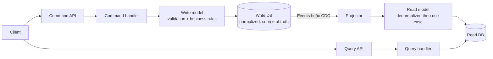
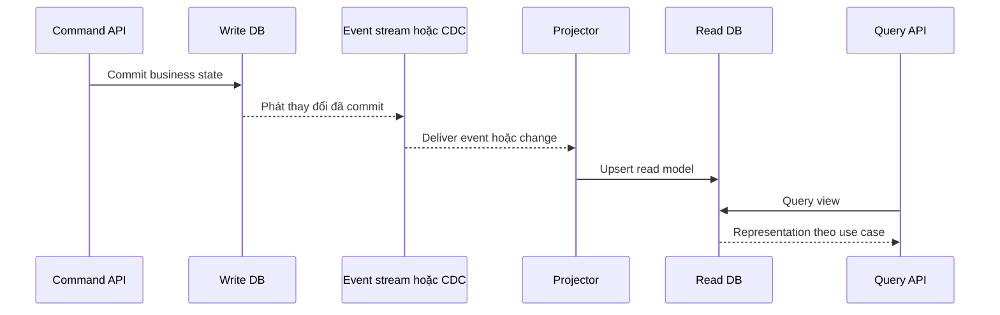
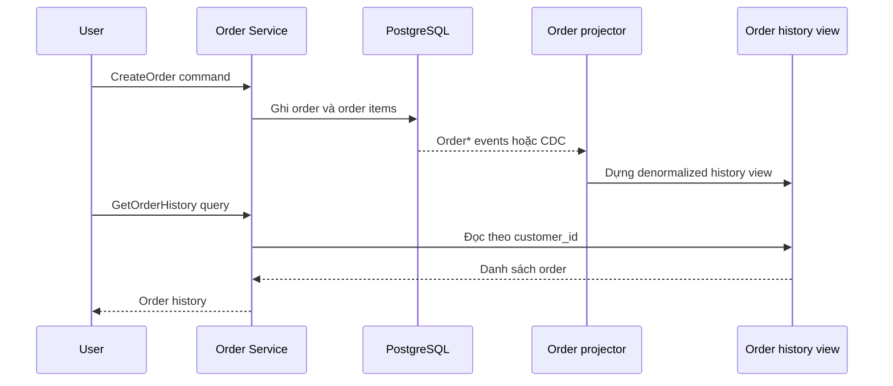

# CQRS Pattern — Tách Command và Query

## Mục lục

- [Tổng quan](#tổng-quan)
- [Command và Query separation](#command-và-query-separation)
  - [Command side](#command-side)
  - [Query side](#query-side)
  - [Vì sao tách hai phía](#vì-sao-tách-hai-phía)
- [Kiến trúc CQRS](#kiến-trúc-cqrs)
- [Ba mức độ áp dụng](#ba-mức-độ-áp-dụng)
  - [Mức 1 Tách code](#mức-1-tách-code)
  - [Mức 2 Tách model](#mức-2-tách-model)
  - [Mức 3 Tách database](#mức-3-tách-database)
  - [Phạm vi của từng mức](#phạm-vi-của-từng-mức)
- [Read model](#read-model)
  - [Read model theo use case](#read-model-theo-use-case)
  - [Source of truth và quyền sở hữu](#source-of-truth-và-quyền-sở-hữu)
- [Đồng bộ Read Model và eventual consistency](#đồng-bộ-read-model-và-eventual-consistency)
  - [Luồng đồng bộ ở mức 3](#luồng-đồng-bộ-ở-mức-3)
  - [Replication lag và read-your-own-writes](#replication-lag-và-read-your-own-writes)
  - [Projection retry và rebuild](#projection-retry-và-rebuild)
- [Use case Order history và Product search](#use-case-order-history-và-product-search)
  - [Order history](#order-history)
  - [Product search](#product-search)
  - [So sánh hai luồng](#so-sánh-hai-luồng)
- [Trade-off](#trade-off)
- [Khi nên và không nên dùng](#khi-nên-và-không-nên-dùng)
- [Lỗi thường gặp](#lỗi-thường-gặp)
- [Vận hành](#vận-hành)
  - [Theo dõi freshness và projection lag](#theo-dõi-freshness-và-projection-lag)
  - [Idempotency retry và Dead Letter Queue](#idempotency-retry-và-dead-letter-queue)
  - [Rebuild và backfill](#rebuild-và-backfill)
  - [Schema và rollout](#schema-và-rollout)
  - [Runbook khi read model bị lệch](#runbook-khi-read-model-bị-lệch)
- [Checklist](#checklist)
- [Liên kết liên quan](#liên-kết-liên-quan)

---

## Tổng quan

**CQRS** (Command Query Responsibility Segregation — phân tách trách nhiệm giữa lệnh và truy vấn) tách đường đi của thao tác **ghi** khỏi đường đi của thao tác **đọc**. Command side xử lý thay đổi state và các business rules. Query side phục vụ việc đọc, tìm kiếm hoặc tổng hợp dữ liệu.

Hai phía thường có yêu cầu khác nhau. Write model (mô hình ghi) ưu tiên validation, invariant (điều kiện nghiệp vụ phải luôn đúng) và tính toàn vẹn dữ liệu. Read model (mô hình đọc) ưu tiên hình dạng dữ liệu phù hợp với màn hình hoặc query, thường bằng cách denormalize (làm phẳng hoặc sao chép dữ liệu để đọc nhanh hơn).

CQRS không bắt buộc phải tách thành hai service hoặc hai database. Có thể bắt đầu bằng hai module trong cùng một service và cùng một database. Việc tách database chỉ là mức áp dụng cao hơn khi workload, query hoặc yêu cầu scaling cần đến nó.

CQRS cũng không đồng nghĩa với **Event Sourcing**. Write side có thể lưu state hiện tại trong database thông thường. Event Sourcing chỉ là một cách lưu dữ liệu có thể cung cấp events cho các projection.

## Command và Query separation

### Command side

**Command** là yêu cầu muốn thay đổi state, chẳng hạn `CreateOrder`, `CancelOrder` hoặc `UpdateProduct`. Command hướng tới một handler cụ thể. Handler có trách nhiệm:

- kiểm tra input và quyền thực hiện;
- áp dụng business rules và invariant;
- ghi thay đổi vào write model và write database;
- trả về kết quả chấp nhận, từ chối hoặc một identifier để theo dõi.

Command không nên được dùng như một query trá hình. Nếu client cần representation (dữ liệu hiển thị) của order sau khi tạo, client có thể nhận `order_id` rồi dùng query phù hợp, thay vì làm command handler phải phục vụ mọi hình dạng response.

Ví dụ, `CancelOrder` kiểm tra order có đang ở trạng thái cho phép hủy hay không rồi ghi trạng thái mới. Query side không được tự sửa trạng thái chỉ để làm cho màn hình hiển thị như mong muốn.

### Query side

**Query** là yêu cầu chỉ đọc, chẳng hạn `GetOrderHistory` hoặc `SearchProducts`. Query handler lấy dữ liệu từ read model và không tạo business side effect.

Read model có thể được tổ chức theo cách mà write model không thể tối ưu cùng lúc. Ví dụ, trang lịch sử order có thể cần một record đã chứa sẵn trạng thái, tổng tiền và danh sách item. Product search có thể cần một document có sẵn category và các trường phục vụ full-text search.

Query side có thể trả về nhiều hình dạng response khác nhau cho từng use case. Điều đó không làm thay đổi quyền sở hữu dữ liệu: write side vẫn là nơi xác định state nào hợp lệ.

### Vì sao tách hai phía

CRUD truyền thống thường dùng một model cho cả create, read, update và delete. Cách này đơn giản khi workload và query đơn giản. Khi read và write phát triển theo hai hướng khác nhau, một model chung buộc hai phía phải thỏa hiệp:

| Nhu cầu | Write side | Query side |
|---|---|---|
| Mục tiêu | Bảo vệ business rules và tính toàn vẹn | Trả dữ liệu nhanh theo query cụ thể |
| Hình dạng dữ liệu | Thường normalized, tách bảng để giảm lặp | Có thể denormalized, pre-join hoặc aggregate sẵn |
| Workload | Ít hơn nhưng mỗi lần ghi cần kiểm tra chặt | Có thể rất nhiều request đọc và nhiều kiểu filter |
| Cách scale | Tối ưu transaction và write path | Tối ưu index, cache hoặc read database riêng |

Nói ngắn gọn: CQRS đáng cân nhắc khi một model không thể phục vụ tốt cả tính đúng của write side lẫn hiệu năng và hình dạng của query side.

## Kiến trúc CQRS

Sơ đồ dưới đây mô tả CQRS ở mức 3, trong đó read model được cập nhật bất đồng bộ từ write side:



`Projector` là process chuyển events hoặc thay đổi dữ liệu thành bản ghi của read model. Ở mức 3, write transaction có thể commit trước khi projector cập nhật xong read database. Khoảng thời gian đó là một phần của contract consistency, không phải dấu hiệu cho thấy command đã thất bại.

Ở mức 1 và mức 2, các thành phần `Projector`, `Read DB` hoặc đường đồng bộ riêng có thể không tồn tại. Điều quan trọng của CQRS là ranh giới trách nhiệm; không phải số lượng process trong sơ đồ.

## Ba mức độ áp dụng

CQRS là một spectrum (phổ mức độ), không phải công tắc chỉ có bật hoặc tắt. Ba mức dưới đây tăng dần khả năng tối ưu nhưng cũng tăng chi phí vận hành:

| Mức | Tách gì | Đồng bộ | Lợi ích chính | Chi phí chính |
|---|---|---|---|---|
| **1. Tách code** | Command handler và Query handler, cùng model và database | Không có pipeline riêng | Tổ chức code rõ hơn, gần như không thêm hạ tầng | Chưa tối ưu được model hoặc resource theo read/write |
| **2. Tách model** | Write model và read model, vẫn cùng database | View hoặc materialized view theo cơ chế của database | Query có hình dạng phù hợp hơn | Vẫn dùng chung CPU, RAM, I/O và failure domain của database |
| **3. Tách database** | Write database và read database riêng | Events hoặc CDC qua projector | Scale độc lập và chọn storage theo use case | Eventual consistency, projection, retry và nhiều thành phần cần vận hành |

### Mức 1 Tách code

Ở mức 1, một service có hai đường code riêng:

```text
CreateOrder command  ──▶ Command handler ──▶ Write logic ──▶ Database
GetOrderHistory query ──▶ Query handler   ──▶ Read logic  ──▶ Database
```

Hai handler có thể dùng cùng entity hoặc cùng database schema. Mức này giúp business logic của command không bị trộn với logic định dạng response của query. Nó không tự tạo ra eventual consistency vì cả hai phía vẫn đọc và ghi cùng một database.

Đây là mức phù hợp khi mục tiêu trước mắt là làm rõ trách nhiệm trong code. Không nên gọi đây là scale read/write độc lập, vì resource vẫn dùng chung.

### Mức 2 Tách model

Ở mức 2, write model và read model có hình dạng khác nhau nhưng vẫn ở cùng database. Write model thường normalized để giảm duplication và giữ integrity. Read model có thể là một view hoặc materialized view đã pre-join các bảng cần thiết.

Ví dụ, write side lưu riêng `orders`, `order_items` và `products`. Query side có thể đọc một `order_history_view` đã chứa các trường mà trang lịch sử cần. Database vẫn là một resource chung, nên read spike vẫn có thể tranh CPU, RAM hoặc I/O với transaction ghi.

Materialized view có thể cần refresh theo lịch hoặc theo cơ chế của database. Nếu refresh không diễn ra trong cùng thời điểm với write, read model vẫn có thể trễ. Vì vậy, cần xác định freshness cần thiết thay vì giả định rằng "cùng database" luôn có nghĩa là mọi query nhìn thấy dữ liệu mới ngay.

### Mức 3 Tách database

Ở mức 3, write side lưu vào write database, còn query side đọc read database chuyên dụng. Ví dụ, PostgreSQL có thể phục vụ transaction và Elasticsearch có thể phục vụ full-text search. Một worker hoặc projector nhận events/CDC, biến đổi dữ liệu rồi cập nhật read database.

```text
Command ──▶ Write model ──▶ Write DB (PostgreSQL)
                                  │
                         Events hoặc CDC
                                  │
                                  ▼
Query   ──▶ Read model  ◀── Projector ──▶ Read DB (Elasticsearch / Redis / MongoDB)
```

Ưu điểm của mức 3 là mỗi phía có thể scale và chọn công nghệ phù hợp với workload của mình. Đổi lại, read database không tự động đồng bộ với write database. Hệ thống phải xử lý lag, duplicate, lỗi projector, rebuild và schema evolution.

Nếu việc ghi business data và phát event cần được bảo vệ trong cùng local transaction, có thể dùng cơ chế reliable event publishing như **Transactional Outbox**. CQRS không tự giải quyết khoảng cách giữa database và message broker.

### Phạm vi của từng mức

Có thể chọn mức thấp nhất đáp ứng được vấn đề thực tế:

1. Chọn mức 1 khi cần tách trách nhiệm trong code nhưng chưa có query hoặc workload đặc biệt.
2. Chọn mức 2 khi query cần một hình dạng dữ liệu khác, nhưng chưa cần resource hoặc storage riêng.
3. Chọn mức 3 khi read/write cần scale độc lập, read model cần technology khác hoặc pipeline đọc đã trở thành bottleneck.

Không cần tách database chỉ vì đã có `Command` và `Query` handler. Mỗi bước tách thêm đều tạo thêm schema, monitoring, retry và quy trình khôi phục cần duy trì.

## Read model

### Read model theo use case

**Read model** là representation được chuẩn bị cho một nhóm query cụ thể. Nó không nhất thiết phải giống entity ở write side và cũng không cần chứa mọi field của write database.

Một read model tốt trả lời được các câu hỏi sau:

- Query nào sử dụng nó?
- Các field nào cần được pre-compute hoặc denormalize?
- Độ trễ dữ liệu tối đa chấp nhận được là bao nhiêu?
- Có thể rebuild khi index hoặc bảng đọc bị mất hay không?

Một write model có thể nuôi nhiều read model. Ví dụ, cùng events của Order Service có thể cập nhật view lịch sử order, dashboard vận hành và một projection phục vụ notification. Mỗi projection nên phục vụ use case rõ ràng, thay vì tạo một read database "dùng cho mọi thứ".

### Source of truth và quyền sở hữu

Write model hoặc database của service sở hữu là **source of truth** cho business state. Read model là dữ liệu dẫn xuất (derived data), kể cả khi nó có nhiều field hơn hoặc query nhanh hơn.

| Câu hỏi | Nơi nên trả lời |
|---|---|
| Order có được phép hủy không? | Write side của Order Service |
| Có nên charge payment không? | Business logic và dữ liệu authoritative của Payment Service |
| Tìm product theo từ khóa nào? | Read model tối ưu search |
| Trang lịch sử order hiển thị gì? | Read model của use case lịch sử |

Không dùng một read model có thể stale để đưa ra quyết định nghiệp vụ cần dữ liệu mới nhất. Ví dụ, Product search có thể hiển thị stock cũ, nhưng bước đặt hàng vẫn phải kiểm tra lại điều kiện tại service sở hữu inventory hoặc product theo contract nghiệp vụ.

Việc read model chứa bản sao dữ liệu không chuyển quyền ownership sang query side. Projector chỉ xây dựng representation để đọc; command side mới là nơi thay đổi state hợp lệ.

## Đồng bộ Read Model và eventual consistency

### Luồng đồng bộ ở mức 3

Một pipeline mức 3 thường có các bước sau:

1. Command handler validate request và ghi state vào write database trong local transaction.
2. Hệ thống phát event hoặc cung cấp thay đổi qua CDC.
3. Projector consume event, transform payload và upsert (insert hoặc update theo cùng một identity) bản ghi vào read database.
4. Query handler đọc read model sau khi projection đã bắt kịp event tương ứng.



Ở đây, `event` hoặc change record phải đại diện cho dữ liệu mà projector cần. Nếu event chỉ chứa một phần thông tin, projector có thể phải gọi lại write service; khi đó cần đánh giá thêm network dependency và khả năng xử lý khi write service tạm thời unavailable.

### Replication lag và read-your-own-writes

**Eventual consistency** (nhất quán eventual) nghĩa là read model sẽ hội tụ về state tương ứng sau khi pipeline xử lý xong, nhưng không nhất thiết cập nhật ngay sau command. **Replication lag** hoặc **projection lag** là khoảng trễ giữa write state và read state.

Ví dụ:

| Thời điểm | Write DB | Read DB |
|---|---|---|
| `t0` command commit | Order mới ở `PENDING` | Chưa có order mới |
| `t1` event được deliver | Order vẫn ở `PENDING` | Projector đang xử lý |
| `t2` projection hoàn tất | Order là source of truth | View có order mới |

Hệ quả là command thành công nhưng query ngay sau đó có thể chưa thấy thay đổi. Đây là vấn đề **read-your-own-writes** (người dùng mong đọc lại chính thay đổi vừa ghi), cần được thể hiện trong API hoặc UI.

Các cách xử lý thường dùng:

- UI hiển thị kết quả optimistic hoặc trạng thái `PROCESSING` sau khi command được chấp nhận.
- Command trả về identifier và version; query chờ đến khi read model có version tương ứng.
- Với đường đọc bắt buộc dữ liệu mới nhất, đọc tạm từ write side hoặc service sở hữu thay vì read model bất đồng bộ.
- Chấp nhận độ trễ nếu use case chỉ cần dữ liệu gần mới nhất, chẳng hạn một số search hoặc dashboard.

Không nên trả về `CONFIRMED` chỉ để che giấu việc projection chưa hoàn tất. Hợp đồng của client cần phân biệt "command đã commit" với "read model đã cập nhật".

### Projection retry và rebuild

Projector cần xử lý các tình huống phổ biến của pipeline bất đồng bộ:

- message được giao lại sau một lần timeout;
- event đến trễ hoặc không theo thứ tự mà query đang mong đợi;
- read database tạm thời unavailable;
- projector dừng sau khi đã ghi read model nhưng chưa lưu checkpoint.

Một chiến lược an toàn thường dùng `event_id` để deduplicate và `aggregate_id` kết hợp với version để kiểm tra thứ tự khi domain yêu cầu. Retry phải có backoff và giới hạn; lỗi không thể xử lý cần được đưa vào trạng thái hoặc Dead Letter Queue có thể điều tra.

Read model nên **rebuildable**. Khi projection bị hỏng hoặc index bị xóa, hệ thống có thể replay events từ đầu hoặc từ một checkpoint phù hợp để dựng lại view. Nếu không có đủ event history, cần có kế hoạch backfill từ write database và ghi rõ giới hạn của cách này.

## Use case Order history và Product search

### Order history

Order Service có thể dùng PostgreSQL làm write database với các bảng normalized như `orders` và `order_items`. Khi order thay đổi, events như `OrderCreated`, `PaymentReceived` hoặc `OrderShipped` được đưa vào pipeline projection.

Projector dựng `order_history_view` theo đúng nhu cầu của trang "Lịch sử đơn hàng của tôi":

| Field trong read model | Mục đích |
|---|---|
| `order_id` | Định danh order |
| `status` | Hiển thị trạng thái hiện tại của order |
| `total` | Hiển thị tổng tiền |
| `items_summary` | Hiển thị item mà không phải JOIN nhiều bảng |
| `last_updated_at` | Hiển thị thời điểm cập nhật và đo freshness |

Luồng đọc không phải JOIN các bảng normalized trên mỗi request. Query tải nặng của nhiều người dùng có thể đọc read database hoặc index dành riêng cho view lịch sử, trong khi write transaction vẫn tập trung ở write side.



Ngay sau `CreateOrder`, query lịch sử có thể chưa thấy order mới. UI có thể hiển thị trạng thái đang xử lý, chờ projection theo version hoặc dùng một đường đọc phù hợp với yêu cầu freshness.

### Product search

Product Service có thể lưu product và category trong PostgreSQL. Write side kiểm tra các quy tắc như `name` bắt buộc hoặc `price > 0`, sau đó ghi dữ liệu normalized.

Một sync worker consume `ProductCreated` và các event cập nhật tương ứng, rồi denormalize thành document trong Elasticsearch. Document có thể chứa `name`, `price`, `description`, `categories` và các field search cần thiết. Query như sau có thể được phục vụ mà không JOIN nhiều bảng:

```text
GET /products?q=iphone&category=phone&sort=price
```

Elasticsearch được tối ưu cho full-text search, filtering và faceted search. Write side không cần biết chi tiết implementation của search engine; nó chỉ công bố contract thay đổi để projector sử dụng.

Read document có thể chậm hơn write state một khoảng thời gian. Vì vậy, kết quả search phù hợp để khám phá sản phẩm, nhưng một command mua hàng hoặc kiểm tra điều kiện nghiệp vụ không nên dựa duy nhất vào document có thể stale.

### So sánh hai luồng

| Đặc điểm | Order history | Product search |
|---|---|---|
| Write model | Order và item trong PostgreSQL | Product và category trong PostgreSQL |
| Read model | View denormalized theo customer và order | Document search theo từ khóa, category và facet |
| Tối ưu chính | Đọc danh sách lịch sử bằng ít query | Full-text search và filter nhanh |
| Rủi ro stale | Trạng thái order mới chưa xuất hiện | Giá hoặc stock hiển thị cũ |
| Cách kiểm tra authoritative | Order Service | Service sở hữu product/inventory theo nghiệp vụ |

Cả hai use case đều có thể rebuild read model bằng cách replay các events đã lưu, nếu event history và contract đủ để projector dựng lại representation.

## Trade-off

| Lợi ích | Chi phí hoặc giới hạn |
|---|---|
| Scale read và write độc lập ở mức 3; read spike ít ảnh hưởng hơn tới write path | Ở mức 1 và 2, resource vẫn dùng chung nên chưa có isolation về scale |
| Read model tối ưu theo từng use case, giảm JOIN và query phức tạp | Phải duy trì hai model hoặc nhiều projection, cùng các codepath tương ứng |
| Có thể chọn technology riêng như Elasticsearch cho search | Thêm read database, projector, broker hoặc CDC và chi phí vận hành |
| Write side tập trung vào validation và business rules | Read side phải chấp nhận eventual consistency và dữ liệu có thể stale |
| Projection có thể rebuild khi có event history phù hợp | Cần checkpoint, retry, idempotency, schema evolution và quy trình rebuild |
| Read model có thể làm dữ liệu phục vụ query đơn giản hơn | Dữ liệu được denormalize có thể bị duplication và cần theo dõi freshness |

CQRS không làm cho read và write trở thành một transaction xuyên hai database. Nó đổi một model phải thỏa hiệp lấy hai đường được tối ưu rõ hơn, cùng với trách nhiệm vận hành pipeline đồng bộ.

## Khi nên và không nên dùng

| Nên dùng khi | Không nên hoặc chưa cần khi |
|---|---|
| Read/write ratio chênh lệch đáng kể, chẳng hạn search, dashboard hoặc feed | CRUD đơn giản, ít query pattern và read/write tương đối cân bằng |
| Query cần filter, aggregate hoặc denormalize phức tạp | Một query đơn giản trong cùng service đã đáp ứng tốt |
| Read và write cần scale độc lập hoặc dùng technology khác nhau | Team chưa có khả năng monitor projection, xử lý lag và rebuild |
| Có nhiều read model phục vụ các use case khác nhau | Không có source event hoặc backfill đáng tin cậy khi read model hỏng |
| Nghiệp vụ chấp nhận eventual consistency cho đường đọc | Đường đọc bắt buộc phản ánh write ngay lập tức mà không có phương án đọc authoritative |
| Cần tách business rules khỏi logic định dạng dữ liệu đọc | Chỉ muốn áp dụng CQRS vì đây là pattern phổ biến, không có pain cụ thể |

Nếu chỉ cần tách trách nhiệm trong code, dùng mức 1 thay vì nhảy thẳng lên mức 3. Nếu một số query cần dữ liệu mới tuyệt đối, có thể giữ query đó ở write side và chỉ dùng read model cho các view chấp nhận được độ trễ.

## Lỗi thường gặp

| Lỗi | Hậu quả | Cách khắc phục |
|---|---|---|
| Áp dụng CQRS cho mọi service | Thêm model, pipeline và hạ tầng nhưng không giải quyết vấn đề thật | Bắt đầu từ mức nhỏ nhất và gắn CQRS với một use case cụ thể |
| Coi read model là source of truth | Business decision dựa trên dữ liệu stale | Ghi và kiểm tra invariant ở write side hoặc service sở hữu |
| Đẩy business logic sang projector | Quy tắc nghiệp vụ bị chia đôi và có thể cho kết quả khác nhau | Projector chỉ transform hoặc reshape; command side quyết định state |
| Không có chiến lược rebuild | Read model corrupt hoặc mất index nhưng không thể phục hồi | Thiết kế projector replayable và lưu checkpoint/offset |
| Projection fail im lặng | Read model lệch dần, người dùng thấy dữ liệu cũ mà không có alert | Theo dõi lag, error, retry và tuổi event chưa xử lý |
| Giả định command thành công thì query thấy ngay | UI hiển thị "không tạo được" dù write đã commit | Công khai trạng thái xử lý, version hoặc chính sách read-your-own-writes |
| Projector không idempotent | Duplicate event tạo bản ghi hoặc side effect lặp | Dedupe theo `event_id`, kiểm tra version và thiết kế upsert an toàn |
| Không version event hoặc read schema | Deploy producer/projector mới làm consumer cũ hoặc replay bị lỗi | Duy trì contract tương thích và có kế hoạch rollout/read index mới |

## Vận hành

### Theo dõi freshness và projection lag

**Freshness** là độ mới của dữ liệu mà người dùng đọc được. Có thể đo freshness bằng timestamp hoặc version cuối cùng đã áp dụng vào read model. **Projection lag** là khoảng cách giữa write side và vị trí projector đã xử lý.

Dashboard và alert nên bao phủ ít nhất:

| Tín hiệu | Điều cần phát hiện |
|---|---|
| Projection lag và tuổi event chưa xử lý lâu nhất | Read model có vượt SLA freshness hay không |
| Số event đang chờ, tốc độ consume và checkpoint | Projector có theo kịp write rate hay đang tụt lại |
| Tỷ lệ lỗi, retry và message trong DLQ | Lỗi transient hay poison event kéo dài |
| Read database latency, error và storage | Query side có đang suy giảm hoặc hết resource không |
| Timestamp/version mới nhất của từng read model | View nào stale hơn các view còn lại |
| Kết quả consistency check định kỳ | Có bản ghi mất, thừa hoặc sai mapping hay không |

Threshold phải gắn với SLA của từng use case. Search sản phẩm có thể chịu một khoảng trễ khác với một view mà người dùng cần thấy trạng thái order sau khi thao tác.

### Idempotency retry và Dead Letter Queue

Projector nên xử lý delivery theo hướng **at-least-once**: cùng event có thể được giao lại sau timeout hoặc crash. Dùng `event_id` để deduplicate khi cần. Với events của cùng aggregate, có thể dùng `aggregate_id` và version để phát hiện event cũ hoặc đến sai thứ tự.

Retry chỉ phù hợp với lỗi tạm thời như network timeout hoặc read database unavailable. Retry cần backoff và giới hạn số lần. Event không thể xử lý sau policy nên đi vào **Dead Letter Queue (DLQ)** hoặc trạng thái lỗi có metadata đủ để điều tra.

DLQ không phải nơi để bỏ quên dữ liệu. Mỗi message nên giữ `event_id`, `aggregate_id`, `event_type`, lỗi, số lần thử và thời điểm. Sau khi nguyên nhân được sửa, replay phải được kiểm soát và projector phải idempotent trước khi thực hiện.

### Rebuild và backfill

Một quy trình rebuild read model an toàn thường gồm:

1. Tạo bảng hoặc index mới độc lập với read model đang phục vụ traffic.
2. Replay event history theo thứ tự cần thiết hoặc backfill từ write database nếu event history không đủ.
3. Chạy projector cho phần event mới phát sinh trong lúc rebuild để bắt kịp write side.
4. Kiểm tra số lượng bản ghi, version cuối, một số mẫu dữ liệu và các invariant hiển thị.
5. Chuyển query sang read model mới sau khi freshness đạt ngưỡng đã định nghĩa.
6. Giữ lại read model cũ trong khoảng thời gian cần thiết để rollback hoặc điều tra theo retention policy.

Replay cần tương thích với schema event hiện tại. Nếu event cũ có payload khác, projector cần versioning hoặc bước chuyển đổi rõ ràng. Không nên sửa thủ công hàng loạt read model mà không ghi lại nguồn và cách tái tạo, vì lần rebuild sau có thể xóa mất phần sửa đó.

### Schema và rollout

Write schema, event schema và read schema có vòng đời khác nhau. Khi thay đổi projection:

- thêm field theo hướng projector và consumer cũ vẫn chạy được;
- version event khi thay đổi kiểu dữ liệu hoặc semantics theo hướng breaking;
- triển khai projector có thể đọc cả schema cũ và mới trong giai đoạn chuyển tiếp;
- tạo index hoặc bảng read model mới rồi backfill trước khi chuyển traffic;
- ghi version hoặc checkpoint để biết read model đang phản ánh đến đâu.

Read model là derived data nên có thể thay đổi hình dạng theo use case. Tuy nhiên, khả năng thay đổi này không có nghĩa có thể bỏ qua contract của events hoặc dữ liệu mà projector cần để rebuild.

### Runbook khi read model bị lệch

Khi người dùng báo query trả dữ liệu cũ hoặc sai, điều tra theo thứ tự:

1. Xác định read model, `aggregate_id` hoặc query cụ thể bị ảnh hưởng.
2. Đọc source of truth ở write side để biết state authoritative hiện tại.
3. Kiểm tra event tương ứng đã được phát hay chưa, và projector đã xử lý đến checkpoint nào.
4. Phân biệt lỗi ở producer, event stream, projector hay read database.
5. Nếu chỉ là lỗi transient, retry theo policy với cùng identity; không tạo thêm command làm duplicate business action.
6. Nếu projection corrupt, rebuild một read model mới hoặc replay phần bị thiếu.
7. Kiểm tra freshness, version và kết quả query sau khi khôi phục; ghi lại nguyên nhân và thao tác đã thực hiện.

Không dùng read model để kết luận write transaction đã thất bại. Cũng không đánh dấu projector đã xử lý chỉ để làm giảm lag trên dashboard, vì cách đó có thể biến dữ liệu có thể replay thành dữ liệu mất vĩnh viễn.

## Checklist

- [ ] Đã xác định rõ command nào thay đổi state và query nào chỉ đọc.
- [ ] Business rules và invariant chỉ nằm ở write side hoặc service sở hữu.
- [ ] Đã chọn mức 1, 2 hoặc 3 dựa trên pain thực tế, không dựa trên tên pattern.
- [ ] Mỗi read model có use case, owner, field cần thiết và freshness SLA rõ ràng.
- [ ] Write model được xác định là source of truth; read model được coi là derived data.
- [ ] Luồng events hoặc CDC, checkpoint và cách xử lý khi pipeline dừng đã được mô tả.
- [ ] Projector có idempotency, retry có backoff và policy cho DLQ.
- [ ] Đã định nghĩa hành vi read-your-own-writes cho các command quan trọng.
- [ ] Có kế hoạch replay, rebuild hoặc backfill khi read model mất hoặc corrupt.
- [ ] Event schema và read schema có versioning, rollout và tương thích phù hợp.
- [ ] Có dashboard/alert cho freshness, projection lag, error, retry, DLQ và read DB health.
- [ ] Đã kiểm thử duplicate, out-of-order, timeout, projector restart và rebuild.

## Liên kết liên quan

- [Data Management — CQRS](../09-data-management.md#7-cqrs--command-query-responsibility-segregation) — phần nền tảng về CQRS, ba mức độ áp dụng và Product Service.
- [Data Management — Cross-Service Data](../09-data-management.md#9-cross-service-data--lấy-data-từ-service-khác) — CDC, Event-Carried State Transfer, API Composition và các cách lấy dữ liệu xuyên service.
- [Database per Service Pattern](database-per-service.md) — data ownership và các giới hạn của truy vấn xuyên database.
- [Transactional Outbox Pattern](transactional-outbox.md) — reliable event publishing khi write database cần phát event.
- [Inter-Service Communication](../06-inter-service-communication.md#5-event-driven-architecture) — events, message broker và giao tiếp bất đồng bộ.
- [Observability & Evolvability](../11-observability-evolvability.md) — metrics, logging và tracing để theo dõi projection.
