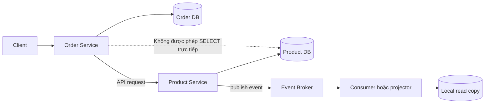

# Database per Service Pattern

## Mục lục

- [Tổng quan](#tổng-quan)
- [Data ownership và ranh giới truy cập](#data-ownership-và-ranh-giới-truy-cập)
  - [Nguyên tắc sở hữu dữ liệu](#nguyên-tắc-sở-hữu-dữ-liệu)
  - [Ví dụ ranh giới dữ liệu](#ví-dụ-ranh-giới-dữ-liệu)
- [Kiến trúc và luồng truy cập](#kiến-trúc-và-luồng-truy-cập)
- [Các cấp độ triển khai](#các-cấp-độ-triển-khai)
  - [Private tables](#private-tables)
  - [Private schema](#private-schema)
  - [Private database server](#private-database-server)
  - [Cách chọn cấp độ](#cách-chọn-cấp-độ)
- [Hệ quả của việc tách database](#hệ-quả-của-việc-tách-database)
  - [Transaction xuyên service](#transaction-xuyên-service)
  - [Truy vấn xuyên service](#truy-vấn-xuyên-service)
  - [Đồng bộ bản sao dữ liệu](#đồng-bộ-bản-sao-dữ-liệu)
  - [Lịch sử và audit trail](#lịch-sử-và-audit-trail)
- [Use case Order Service](#use-case-order-service)
  - [Luồng đặt hàng](#luồng-đặt-hàng)
  - [Quyết định sở hữu và bản sao](#quyết-định-sở-hữu-và-bản-sao)
- [Trade-off](#trade-off)
- [Khi nên và không nên dùng](#khi-nên-và-không-nên-dùng)
- [Lỗi thường gặp](#lỗi-thường-gặp)
- [Vận hành](#vận-hành)
  - [Phân quyền và network isolation](#phân-quyền-và-network-isolation)
  - [Migration và backup](#migration-và-backup)
  - [Theo dõi dữ liệu và xử lý sự cố](#theo-dõi-dữ-liệu-và-xử-lý-sự-cố)
- [Checklist](#checklist)
- [Liên kết liên quan](#liên-kết-liên-quan)

## Tổng quan

**Database per Service** là pattern trong đó mỗi microservice sở hữu dữ liệu phục vụ bounded context (ranh giới nghiệp vụ có mô hình và quy tắc riêng) của mình. Service sở hữu dữ liệu chịu trách nhiệm ghi, kiểm tra các invariant (điều kiện nghiệp vụ phải luôn đúng) và quản lý vòng đời của schema. Service khác không truy cập trực tiếp database đó; chúng dùng API hoặc nhận events (các sự kiện đã xảy ra) do service sở hữu phát ra.

Trong monolith, nhiều module thường dùng chung một database và có thể tham gia cùng một ACID transaction. ACID là nhóm thuộc tính giúp transaction có tính nguyên tử, nhất quán, độc lập và bền vững. Khi tách thành microservices, mỗi service có process và data boundary riêng. Database per Service làm ranh giới này rõ ràng hơn, nhưng cũng khiến các transaction và truy vấn xuyên service không còn được xử lý như một thao tác local duy nhất.

Pattern này không bắt buộc mỗi service phải có một database server vật lý riêng. `Private tables`, `Private schema` và `Private database server` là ba mức cách ly có thể dùng tùy giai đoạn. Dù chọn mức nào, **data ownership** vẫn là nguyên tắc cốt lõi: dữ liệu phải có một service chịu trách nhiệm chính.

## Data ownership và ranh giới truy cập

### Nguyên tắc sở hữu dữ liệu

**Data ownership** là quyền sở hữu dữ liệu trong suốt vòng đời của nó. Ví dụ, Order Service sở hữu order data, Product Service sở hữu product data và Payment Service sở hữu payment data.

Có hai quy tắc cần giữ nhất quán:

1. **Chỉ service sở hữu mới được ghi dữ liệu.** Service đó quyết định schema, validation và các thay đổi hợp lệ của dữ liệu.
2. **Service khác chỉ đọc qua API hoặc events.** Không dùng `SELECT` trực tiếp, không tạo foreign key hoặc `JOIN` xuyên database của service khác.

API phù hợp khi caller cần hỏi dữ liệu hiện tại và chấp nhận một request tới service sở hữu. Events phù hợp khi service khác cần biết một thay đổi đã xảy ra để cập nhật xử lý hoặc bản sao cục bộ. Cả hai cách đều giữ quyền kiểm soát schema ở service sở hữu. API contract hoặc event contract là thỏa thuận về request, response hoặc payload mà các service có thể dựa vào.

Bản sao cục bộ, cache hoặc read model (mô hình dữ liệu tối ưu cho việc đọc) không làm service nhận bản sao trở thành owner. Owner vẫn là nơi quyết định dữ liệu nào hợp lệ và là source of truth (nguồn dữ liệu được tin cậy) cho dữ liệu đó. Bản sao cần có cơ chế đồng bộ và cách đo độ cũ (staleness) rõ ràng.

### Ví dụ ranh giới dữ liệu

| Service | Dữ liệu sở hữu | Service khác cần làm gì khi cần dữ liệu? |
|---|---|---|
| Order Service | Order, order item và trạng thái order | Gọi API hoặc nhận event từ Order Service |
| Product Service | Product catalog và product data | Gọi Product API hoặc duy trì bản sao cục bộ |
| Inventory Service | Tồn kho và trạng thái reservation | Gửi request tới Inventory API |
| Payment Service | Payment attempt và trạng thái thanh toán | Gọi Payment API, không đọc payment DB |

Tên bảng và các trường trong bảng là chi tiết nội bộ của service. Ví dụ, Product Service có thể đổi schema catalog mà không buộc Order Service phải biết cách lưu trữ bên trong. Hai service vẫn phải phối hợp qua contract API hoặc event contract đã thống nhất.

## Kiến trúc và luồng truy cập

Sơ đồ dưới đây minh họa một service ghi database của chính nó. Khi cần dữ liệu của service khác, nó đi qua service đó hoặc qua event broker để xây dựng bản sao cục bộ; không có mũi tên nào đi thẳng vào database của service khác.

Có thể đọc sơ đồ theo ba quy tắc:

- `Order Service` ghi order vào `Order DB`; `Product Service` ghi product vào `Product DB`.
- Nếu Order Service cần dữ liệu hiện tại của product, request đi tới Product Service qua API.
- Nếu một consumer cần query riêng, consumer có thể dựng bản sao từ events. Bản sao đó phục vụ use case của consumer và không thay thế owner.

## Các cấp độ triển khai

"Database riêng" mô tả ranh giới sở hữu, không nhất thiết mô tả một máy chủ vật lý. Ba cấp độ dưới đây đi từ cách ly lỏng tới cách ly chặt:

| Cấp độ | Cách triển khai | Cách ly chính | Phù hợp |
|---|---|---|---|
| **Private tables** | Cùng database và cùng schema; phân vùng bằng tên bảng hoặc prefix như `order_orders`, `product_products` | Convention và kỷ luật của team | MVP hoặc team nhỏ |
| **Private schema** | Cùng database server; mỗi service có một schema và quyền DB riêng | Database permission theo schema | Giai đoạn tăng trưởng, cần cân bằng chi phí và cách ly |
| **Private database server** | Mỗi service dùng một database instance/server riêng | Tách resource và failure domain (phạm vi cùng chịu một lỗi) ở mức cao hơn | Enterprise hoặc service cần scale độc lập |

### Private tables

Ở mức `Private tables`, các service dùng chung database và schema, nhưng mỗi service chỉ thao tác trên nhóm bảng của mình. Prefix như `order_` hoặc `product_` giúp nhận diện ranh giới.

Mức này có chi phí hạ tầng thấp và dễ bắt đầu. Tuy nhiên, database vẫn có khả năng cho phép một developer hoặc một credential truy cập bảng của service khác. Vì vậy, ranh giới chủ yếu dựa vào convention, review và quy trình. Chỉ cần một truy vấn `JOIN` chéo là coupling về schema có thể xuất hiện mà không được thể hiện trong contract của service.

### Private schema

Ở mức `Private schema`, các service vẫn dùng chung database server nhưng mỗi service có schema riêng, chẳng hạn `order_service.orders` và `product_service.products`. Database grants có thể giới hạn credential của Order Service trong schema order.

Mức này tạo một hàng rào kỹ thuật rõ hơn `Private tables` mà chưa cần vận hành nhiều database server. Tuy vậy, các service vẫn có thể chia sẻ tài nguyên và failure domain của cùng database server. Đây là cách ly schema, không phải cách ly hoàn toàn về resource.

### Private database server

Ở mức `Private database server`, mỗi service dùng một database instance riêng. Các instance có thể dùng công nghệ khác nhau nếu workload (kiểu tải dữ liệu) phù hợp, ví dụ PostgreSQL cho Order Service và MongoDB cho Product Service.

Mức này cho phép service kiểm soát resource, scaling, backup và lịch bảo trì độc lập hơn. Nó cũng tăng số lượng database cần cấp credential, backup, monitor và xử lý sự cố. "Server riêng" không có nghĩa phải là một máy vật lý; điều quan trọng là database instance và quyền truy cập được tách theo service.

### Cách chọn cấp độ

Bắt đầu ở cấp độ thấp nhất mà team vẫn thực thi được data ownership. Khi xuất hiện pain rõ ràng, có thể tách dần:

1. Dùng `Private tables` khi mục tiêu trước mắt là xác lập ownership và workload còn nhỏ.
2. Chuyển sang `Private schema` khi cần DB permissions rõ hơn nhưng vẫn muốn chia sẻ resource.
3. Dùng `Private database server` khi service cần scale, bảo trì hoặc chịu failure độc lập hơn.

Đây không phải lộ trình bắt buộc cho mọi hệ thống. Một service nhỏ có thể không cần database instance riêng; ngược lại, một service có yêu cầu cách ly cao có thể bắt đầu ở mức chặt hơn. Không nên tách hạ tầng chỉ vì tên pattern, nhưng cũng không nên dùng chi phí thấp làm lý do bỏ qua quyền sở hữu.

## Hệ quả của việc tách database

Database per Service giải quyết coupling trực tiếp về dữ liệu, nhưng tạo ra các bài toán mới. Đây là những hệ quả cần đưa vào thiết kế ngay từ đầu.

### Transaction xuyên service

Một ACID transaction chỉ bao phủ local database transaction của service đang thực thi. Khi một nghiệp vụ cần cập nhật Order DB, Inventory DB và Payment DB, không còn một transaction duy nhất để `COMMIT` hoặc `ROLLBACK` tất cả thay đổi.

Vì vậy, mỗi service cần xác định trạng thái local và cách xử lý khi bước ở service khác thất bại. Dữ liệu có thể đi qua các trạng thái trung gian thay vì chuyển đổi đồng thời. Chi tiết về cơ chế phối hợp nghiệp vụ xuyên service thuộc phạm vi của các pattern khác; với Database per Service, điều quan trọng là không giả vờ rằng một transaction local bao trùm được database bên ngoài.

### Truy vấn xuyên service

Không có `JOIN` trực tiếp giữa các database, nên một màn hình cần dữ liệu từ nhiều bounded context phải chọn cách đọc phù hợp:

- **API Composition:** một lớp gọi API của nhiều service rồi ghép kết quả.
- **Bản sao cục bộ:** nhận thay đổi và lưu dạng denormalized (làm phẳng dữ liệu cho truy vấn) theo đúng use case cần query.

API Composition thường dễ bắt đầu nhưng thêm network hop và phụ thuộc vào trạng thái của nhiều service. Bản sao cục bộ giúp query tại một nơi, nhưng dữ liệu có thể cũ trong một khoảng thời gian. Câu hỏi cần trả lời là caller cần dữ liệu hiện tại tuyệt đối hay chấp nhận freshness (độ mới của dữ liệu) có độ trễ.

Điểm không thay đổi trong cả hai cách: query phải đi qua contract được công bố hoặc qua bản sao đã được đồng bộ, không quay lại đọc bảng nội bộ của service khác.

### Đồng bộ bản sao dữ liệu

Data duplication thường xuất hiện khi cache, read model hoặc một service cần giữ dữ liệu phục vụ use case của nó. Sao chép không sai nếu bản sao có mục đích rõ ràng và không được nhầm là source of truth.

Một bản sao cần xác định:

- event hoặc cơ chế nào cập nhật nó;
- độ trễ tối đa chấp nhận được;
- cách phát hiện bản sao bị stale hoặc drift;
- cách rebuild hoặc đồng bộ lại khi consumer ngừng xử lý.

Nếu không có các câu trả lời này, bản sao sẽ trở thành một database thứ hai không có owner rõ ràng. Dữ liệu hiển thị có thể lỗi thời, còn business decision có thể dựa trên giá trị không còn đúng.

### Lịch sử và audit trail

Database per Service xác định **ai sở hữu state**, nhưng tự nó không tạo ra lịch sử đầy đủ của mọi thay đổi. Một database lưu state hiện tại có thể không trả lời được dữ liệu đã thay đổi qua những bước nào.

Nếu domain cần audit trail, temporal query (truy vấn state tại một thời điểm trong quá khứ) hoặc khả năng tái tạo state tại một thời điểm, cần thiết kế thêm cơ chế lưu lịch sử phù hợp. Cơ chế đó vẫn phải nằm trong ranh giới của service sở hữu; service khác không được tự xây audit bằng cách đọc các bảng nội bộ.

## Use case Order Service

Xét một hệ thống e-commerce có Order Service, Product Service, Inventory Service và Payment Service. Mỗi service sở hữu database riêng theo bounded context:

| Database | Ví dụ dữ liệu local | Ai được ghi? |
|---|---|---|
| Order DB | Order, item và trạng thái xử lý | Order Service |
| Product DB | Catalog và thông tin product | Product Service |
| Inventory DB | Tồn kho và reservation | Inventory Service |
| Payment DB | Payment attempt và trạng thái giao dịch | Payment Service |

Khi client đặt hàng, Order Service không chèn order vào Product DB, không trừ tồn kho bằng một `UPDATE` trên Inventory DB và không đánh dấu thanh toán trong Payment DB. Mỗi thay đổi phải được gửi tới service sở hữu tương ứng.

### Luồng đặt hàng

Một luồng minh họa có thể diễn ra như sau:

1. Client gửi request tới Order Service.
2. Order Service kiểm tra dữ liệu mà nó sở hữu và ghi order vào Order DB.
3. Khi cần thông tin product hiện tại, Order Service gọi Product API hoặc đọc bản sao cục bộ đã có. Nó không truy vấn Product DB.
4. Yêu cầu xử lý tồn kho và thanh toán được gửi tới các service sở hữu. Mỗi service ghi kết quả vào database của mình.
5. Order Service cập nhật trạng thái order dựa trên các phản hồi hoặc events đã nhận.

Trạng thái order có thể là `PENDING` trong lúc các service khác chưa hoàn tất. Đây là dấu hiệu minh họa rằng hệ thống không còn một transaction ACID chung, không phải lỗi cần che giấu bằng cách cấp quyền truy cập chéo database.

### Quyết định sở hữu và bản sao

Giả sử trang lịch sử order cần hiển thị tên product. Có hai câu hỏi cần tách biệt:

- Trang cần tên product hiện tại hay giá trị gắn với order tại thời điểm mua?
- Query có chấp nhận gọi Product Service hay cần phản hồi nhanh từ Order Service?

Nếu cần dữ liệu hiện tại, Order Service có thể gọi Product API. Nếu cần query nhanh hoặc cần giữ thông tin phục vụ lịch sử order, team có thể thiết kế dữ liệu local tương ứng và xác định cách cập nhật nó. Quyết định này phải dựa trên semantics của use case, không dựa trên việc database nào dễ truy cập hơn.

Dù chọn cách nào, Product Service vẫn là owner của product catalog. Order Service chỉ sở hữu dữ liệu đã được ghi vào Order DB cho mục đích của order; hai khái niệm không nên bị trộn thành một bảng dùng chung.

## Trade-off

| Lợi ích | Chi phí hoặc hệ quả |
|---|---|
| **Loose coupling:** service có thể thay đổi schema nội bộ mà không buộc service khác `JOIN` vào schema đó | Mất ACID transaction xuyên service; nghiệp vụ liên service cần xử lý trạng thái và lỗi riêng |
| **Independent scaling:** workload của các service có thể được điều chỉnh riêng khi resource đã được tách phù hợp | Nhiều database hơn làm tăng chi phí vận hành, backup, monitoring và credential |
| **Polyglot persistence** (dùng nhiều loại database): mỗi service có thể chọn SQL hoặc NoSQL phù hợp workload | Team phải vận hành nhiều công nghệ và hiểu các đặc tính khác nhau |
| **Fault isolation:** database instance của service này gặp lỗi không nhất thiết làm database instance khác dừng theo | Ở `Private tables` hoặc `Private schema`, các service vẫn chia sẻ failure domain của database server |
| **Team autonomy:** team sở hữu service tự quản lý schema và cách lưu trữ | Query xuyên service khó hơn và thường cần API Composition hoặc bản sao cục bộ |
| Ranh giới ownership rõ hơn | Nếu đồng bộ bản sao bất đồng bộ, dữ liệu toàn cục có thể chỉ đạt eventual consistency trong một khoảng thời gian |

Database per Service không làm mọi dữ liệu trở nên nhất quán ngay lập tức. Nó đổi một dạng coupling khó thấy trong shared schema lấy các contract và luồng đồng bộ phải thiết kế rõ ràng hơn.

## Khi nên và không nên dùng

| Nên dùng khi | Chưa nên dùng đầy đủ khi |
|---|---|
| Service có bounded context rõ ràng | Team rất nhỏ và sản phẩm đơn giản; module trong monolith vẫn đáp ứng được |
| Các team cần deploy hoặc scale từng service độc lập | Chỉ có một hoặc hai developer và chưa có nhu cầu scale từng phần |
| Workload khác nhau khiến polyglot persistence có giá trị | Dữ liệu luôn được dùng chung bằng các `JOIN` chặt; tách ra chỉ tăng complexity |
| Cần tránh shared schema làm các service coupling chặt | Đang ở bước chuyển tiếp của migration và chưa có milestone tách ownership |
| Có thể thiết lập API, event contract, phân quyền và vận hành cho từng owner | Chưa có cách xác định owner, backup, khôi phục hoặc đồng bộ dữ liệu |

Trong trường hợp chưa cần tách database, có thể bắt đầu bằng module và ownership logic trong một monolith. Điều đó tránh việc tạo nhiều moving parts trước khi bounded context và nhu cầu độc lập thực sự rõ ràng.

## Lỗi thường gặp

| Lỗi | Hậu quả | Khắc phục |
|---|---|---|
| Service A `SELECT` trực tiếp vào DB của service B | Coupling ngầm vào schema; B đổi schema có thể phá A | Dùng API hoặc events; giới hạn bằng network policy và DB permission |
| Giữ shared database mãi vì "tiện" | Các service phụ thuộc cùng schema và hình thành distributed monolith | Xác định milestone tách ownership; chỉ xem shared DB là bước chuyển tiếp có chủ đích |
| Sao chép dữ liệu nhưng không có cơ chế đồng bộ | Data drift: bản sao lỗi thời và dẫn tới quyết định sai | Dùng events hoặc cơ chế đồng bộ phù hợp, đồng thời đo staleness |
| Tách database theo lớp kỹ thuật, chẳng hạn một reporting DB chung cho mọi service | Một database "god" trở thành dependency mới; ownership không rõ | Tách theo bounded context; tạo read model theo nhu cầu reporting thay vì cho mọi service đọc chung |

## Vận hành

### Phân quyền và network isolation

Mỗi service nên có credential (thông tin xác thực) riêng và chỉ được cấp quyền trên database, schema hoặc bảng mà nó sở hữu. Với `Private schema`, DB permission có thể ngăn truy cập nhầm schema. Với `Private database server`, network policy và credential boundary bổ sung thêm lớp cách ly.

Ở `Private tables`, database vẫn có thể cho phép credential nhìn thấy toàn bộ bảng. Khi chưa thể tách schema hoặc server, cần bù bằng review query, convention rõ ràng và kiểm tra quyền truy cập thường xuyên. Không nên cấp quyền đọc toàn bộ database chỉ vì một service cần một vài trường từ service khác; hãy thiết kế API hoặc bản sao cho use case đó.

### Migration và backup

Schema migration phải do team sở hữu service quản lý. Service khác không nên chạy migration thay hoặc phụ thuộc vào thứ tự nội bộ của migration đó. Khi thay đổi schema, cần kiểm tra các API và event contract đang công bố để tránh biến thay đổi nội bộ thành breaking change.

Backup và restore cũng cần gắn với data owner. Với mỗi database, cần biết dữ liệu nào được backup, thời điểm backup gần nhất và quy trình restore. Nếu có bản sao cục bộ, cần xác định bản sao đó có thể rebuild hay phải backup riêng. Nên kiểm tra restore định kỳ thay vì chỉ giả định rằng file backup có thể dùng được.

### Theo dõi dữ liệu và xử lý sự cố

Các chỉ số nên được theo dõi theo từng database owner gồm:

| Tín hiệu | Điều cần phát hiện |
|---|---|
| Connection error, query error và latency | Service không truy cập được database của mình hoặc database đang suy giảm |
| Dung lượng, tốc độ tăng trưởng và resource usage | Database sắp hết resource hoặc một workload ảnh hưởng workload khác |
| Tuổi bản ghi chưa đồng bộ và replication/projection lag (độ trễ giữa owner và bản sao) | Bản sao cục bộ đã stale quá lâu, nếu hệ thống có bản sao |
| Data drift giữa owner và bản sao | Consumer không xử lý thay đổi hoặc mapping dữ liệu bị lỗi |
| Kết quả backup và lần restore kiểm thử gần nhất | Không thể khôi phục khi xảy ra sự cố |

Khi database của một service gặp sự cố, ưu tiên dùng degraded mode (chế độ giảm chức năng có chủ đích), retry (thử lại) hoặc quy trình khôi phục đã định nghĩa. Không nên chữa cháy bằng cách cho service khác truy cập thẳng database đang gặp lỗi, vì cách đó biến sự cố tạm thời thành coupling lâu dài và khó kiểm soát.

Nếu bản sao bị lệch, cần xác định owner, khoảng thời gian stale và cách đồng bộ lại. Các log nên ghi service, entity hoặc aggregate identifier (mã của nhóm dữ liệu cần nhất quán) và thời điểm cập nhật để có thể truy nguyên mà không cần mở quyền đọc chéo database.

## Checklist

- [ ] Mỗi nhóm dữ liệu có đúng một service chịu trách nhiệm ownership.
- [ ] Chỉ owner được ghi và thay đổi invariant của dữ liệu.
- [ ] Không có `SELECT`, `JOIN` hoặc foreign key trực tiếp giữa database của các service.
- [ ] API hoặc event contract đã được xác định cho các nhu cầu truy cập liên service.
- [ ] Cấp độ `Private tables`, `Private schema` hoặc `Private database server` phù hợp với giai đoạn và mức cách ly cần thiết.
- [ ] Mọi bản sao cục bộ có mục đích, cơ chế đồng bộ và ngưỡng staleness.
- [ ] Team biết dữ liệu nào là source of truth và dữ liệu nào chỉ là bản sao.
- [ ] Mỗi database có credential, backup, restore procedure và người chịu trách nhiệm rõ ràng.
- [ ] Dashboard và alert bao phủ health của database cùng độ trễ đồng bộ nếu có.
- [ ] Quy trình xử lý sự cố không yêu cầu mở quyền truy cập trực tiếp vào database của service khác.

## Liên kết liên quan

- [Data Management](../09-data-management.md) — các mô hình database, shared database và những hệ quả của dữ liệu phân tán.
- [Autonomy & Independence](../04-autonomy-independence.md) — lý do data boundary hỗ trợ khả năng tự chủ của service.
- [Single Responsibility và Bounded Context](../02-single-responsibility-bounded-context.md) — cơ sở để xác định ranh giới ownership.
- [Inter-Service Communication](../06-inter-service-communication.md) — API, events và contract dùng khi service cần phối hợp.
