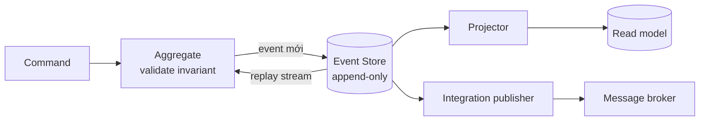
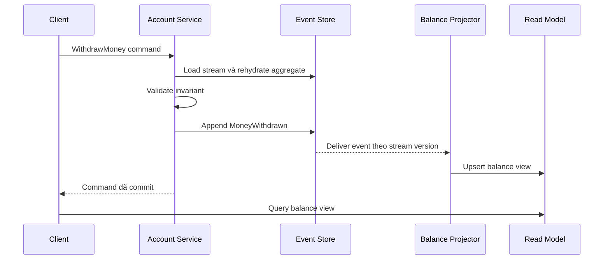
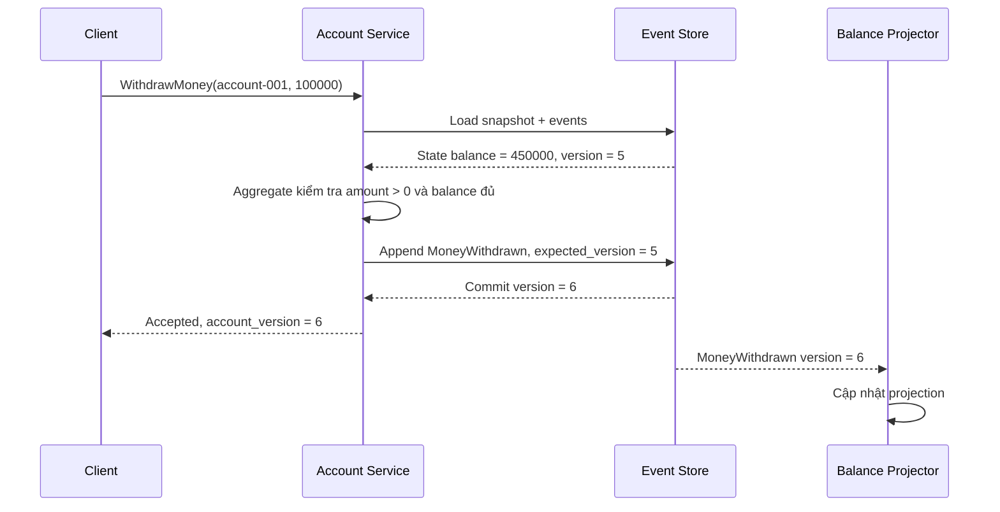

# Event Sourcing Pattern — Lưu events thay vì state

## Mục lục

- [Tổng quan](#tổng-quan)
- [Event Sourcing là gì?](#event-sourcing-là-gì)
  - [State hiện tại và lịch sử](#state-hiện-tại-và-lịch-sử)
  - [Các khái niệm cốt lõi](#các-khái-niệm-cốt-lõi)
- [Phân biệt với Event Notification và CQRS](#phân-biệt-với-event-notification-và-cqrs)
  - [Event Sourcing và Event Notification](#event-sourcing-và-event-notification)
  - [Event Sourcing và CQRS](#event-sourcing-và-cqrs)
  - [Ranh giới Domain Event và Integration Event](#ranh-giới-domain-event-và-integration-event)
- [Cơ chế hoạt động](#cơ-chế-hoạt-động)
  - [Append event vào stream](#append-event-vào-stream)
  - [Replay để dựng state](#replay-để-dựng-state)
  - [Snapshot cho stream dài](#snapshot-cho-stream-dài)
  - [Aggregate và optimistic concurrency](#aggregate-và-optimistic-concurrency)
- [Projection và read model](#projection-và-read-model)
  - [Projector biến events thành view](#projector-biến-events-thành-view)
  - [Replay và rebuild projection](#replay-và-rebuild-projection)
  - [Eventual consistency và source of truth](#eventual-consistency-và-source-of-truth)
- [Use case Tài khoản giao dịch](#use-case-tài-khoản-giao-dịch)
  - [Event stream minh họa](#event-stream-minh-họa)
  - [Luồng nạp và rút tiền](#luồng-nạp-và-rút-tiền)
  - [Audit trail và time travel](#audit-trail-và-time-travel)
- [Schema evolution](#schema-evolution)
  - [Version event contract](#version-event-contract)
  - [Upcasting và replay an toàn](#upcasting-và-replay-an-toàn)
  - [Triển khai projection qua nhiều phiên bản](#triển-khai-projection-qua-nhiều-phiên-bản)
- [Trade-off](#trade-off)
- [Khi nên và không nên dùng](#khi-nên-và-không-nên-dùng)
- [Lỗi thường gặp](#lỗi-thường-gặp)
- [Vận hành](#vận-hành)
  - [Theo dõi event store và append](#theo-dõi-event-store-và-append)
  - [Theo dõi projection](#theo-dõi-projection)
  - [Backup, restore và replay](#backup-restore-và-replay)
  - [Bảo mật, PII và retention](#bảo-mật-pii-và-retention)
  - [Runbook khi projection hoặc replay lỗi](#runbook-khi-projection-hoặc-replay-lỗi)
- [Checklist](#checklist)
- [Liên kết liên quan](#liên-kết-liên-quan)

---

## Tổng quan

Trong cách lưu dữ liệu thông thường, database giữ **state hiện tại** của entity. Ví dụ, bảng `orders` có thể chỉ còn một dòng với `status = DELIVERED`. Cách này dễ đọc và phù hợp với nhiều CRUD application, nhưng các lần chuyển trạng thái trước đó có thể không còn đủ thông tin để tái dựng.

**Event Sourcing** dùng chuỗi các **event** đã xảy ra làm **event log bất biến** (immutable event log) và nguồn dữ liệu chính cho một aggregate. Thay vì ghi đè state sau mỗi thay đổi, hệ thống append (ghi nối tiếp) một event vào event stream. State hiện tại được tính lại bằng cách replay (phát lại và áp dụng lần lượt) các event trong stream.

Ví dụ, một order có thể có các event `OrderCreated`, `PaymentReceived`, `OrderShipped` và `OrderDelivered`. State `DELIVERED` là kết quả của chuỗi đó, không phải bản ghi duy nhất được cập nhật nhiều lần.



Event Sourcing giải quyết bài toán lưu **lịch sử nghiệp vụ có ý nghĩa**, không chỉ bài toán phát message. Event store, projection và các contract liên quan cần được thiết kế như một hệ thống lưu trữ lâu dài.

## Event Sourcing là gì?

### State hiện tại và lịch sử

So sánh một entity lưu state với cùng entity dùng Event Sourcing:

| Cách tiếp cận | Dữ liệu authoritative | Câu hỏi trả lời tốt | Giới hạn chính |
|---|---|---|---|
| Lưu state hiện tại | Một bản ghi state sau cùng | "Bây giờ order đang ở trạng thái nào?" | Không tự giữ đủ các bước đã xảy ra |
| Event Sourcing | Chuỗi event bất biến của aggregate | "Điều gì đã xảy ra, theo thứ tự nào, state ở version nào?" | Cần replay hoặc projection để đọc thuận tiện |

Một event phải mô tả **fact đã xảy ra**, thường dùng tên ở thì quá khứ như `MoneyDeposited` hoặc `OrderCancelled`. Nó không nên chỉ là một lệnh như `WithdrawMoney`, vì command là yêu cầu cần kiểm tra còn event là kết quả đã được chấp nhận và ghi nhận.

Event Sourcing không có nghĩa mọi bản sao state đều bị cấm. Snapshot và read model vẫn có thể được lưu để tối ưu hiệu năng. Điểm khác biệt là các bản sao đó là dữ liệu dẫn xuất; event stream mới là nguồn có thẩm quyền để rehydrate aggregate và rebuild các view.

### Các khái niệm cốt lõi

| Thuật ngữ | Ý nghĩa |
|---|---|
| **Event** | Fact nghiệp vụ đã xảy ra, bất biến sau khi được commit; ví dụ `PaymentReceived`. |
| **Event Store** | Storage lưu event theo stream, thường hỗ trợ append theo thứ tự và đọc lại theo version. |
| **Event stream** | Chuỗi event của một aggregate, có sequence/version tăng dần. |
| **Aggregate** | Ranh giới nhất quán nghiệp vụ; aggregate xử lý command và quyết định event nào hợp lệ. |
| **Projection** | Dữ liệu dẫn xuất được tính từ event stream cho một mục đích đọc cụ thể. |
| **Projector** | Process hoặc module đọc events rồi cập nhật projection. |
| **Snapshot** | Checkpoint state tại một version, dùng để giảm số event phải replay. |

Một event record thường có các trường nhận diện và truy nguyên tương tự sau:

```json
{
  "event_id": "evt-8f2c",
  "aggregate_id": "account-001",
  "aggregate_type": "TradingAccount",
  "sequence": 2,
  "event_type": "MoneyDeposited",
  "schema_version": 1,
  "occurred_at": "2025-06-01T10:00:05Z",
  "data": {
    "amount": 1000000,
    "currency": "VND"
  }
}
```

`event_id` nhận diện một event duy nhất. `aggregate_id` xác định stream cần đọc hoặc append. `sequence` giúp kiểm tra thứ tự và phát hiện concurrent write. Metadata như `correlation_id`, actor hoặc request context có thể được lưu theo chính sách audit, nhưng không nên đưa secret vào event record.

## Phân biệt với Event Notification và CQRS

Ba khái niệm này thường xuất hiện cạnh nhau vì đều dùng từ *event* hoặc thường được triển khai cùng nhau. Chúng trả lời ba câu hỏi khác nhau:

- **Event Sourcing:** hệ thống lưu lịch sử thay đổi của state như thế nào?
- **Event Notification:** hệ thống thông báo cho consumer rằng một thay đổi đã xảy ra như thế nào?
- **CQRS:** trách nhiệm xử lý command và query được tách ra sao?

Không phải mọi hệ thống phát event đều là Event Sourcing. Ngược lại, một hệ thống dùng Event Sourcing vẫn cần quyết định riêng cách công bố integration event cho service khác.

### Event Sourcing và Event Notification

**Event Notification** là cách phát một thông báo sau khi state thay đổi. Notification có thể chỉ chứa `order_id` và loại thay đổi, để consumer gọi API lấy thêm dữ liệu. Nó cũng có thể được lưu lâu và replay nếu transport hỗ trợ retention. Tuy nhiên, khả năng replay và vai trò source of truth không phải thuộc tính bắt buộc của notification.

| Khía cạnh | Event Sourcing | Event Notification |
|---|---|---|
| Mục tiêu | Lưu lịch sử để rehydrate aggregate và dựng lại state | Báo cho consumer biết state đã thay đổi |
| Nơi authoritative | Event stream của aggregate | Database state của service sở hữu |
| Nội dung | Cần đủ semantics để áp dụng lại cho aggregate và các projection đã cam kết | Có thể tối thiểu, chẳng hạn chỉ có identifier và loại thay đổi |
| Replay | Là khả năng cốt lõi của thiết kế | Chỉ có nếu broker hoặc storage giữ retention phù hợp |
| Sửa sai nghiệp vụ | Append event điều chỉnh mới, không đổi event cũ | Service sở hữu quyết định cách sửa state và phát notification tiếp theo |

Ví dụ, `OrderUpdated(order_id = O-123)` có thể là một notification hợp lệ nhưng không đủ để rebuild lịch sử giá, trạng thái thanh toán và thời điểm giao hàng. Event Sourcing cần các event có semantics rõ hơn, chẳng hạn `PaymentReceived` và `OrderDelivered`, nếu các projection cần những sự kiện đó.

### Event Sourcing và CQRS

**CQRS** (Command Query Responsibility Segregation — phân tách trách nhiệm giữa lệnh và truy vấn) tách đường xử lý thay đổi state khỏi đường phục vụ dữ liệu đọc. CQRS có thể dùng database state thông thường; Event Sourcing không tự động yêu cầu hai database hoặc một read API riêng.

Trong thực tế, Event Sourcing thường đi cùng projection và CQRS vì event store tối ưu cho append và replay, không tối ưu cho mọi query như "100 order mới nhất có status `SHIPPED`". Projector có thể đọc stream rồi tạo read model denormalized theo từng use case.

| Khái niệm | Quyết định chính | Có thể dùng độc lập không? |
|---|---|---|
| Event Sourcing | Cách lưu state và lịch sử của aggregate | Có thể dùng mà chưa tách hẳn command/query, dù query thực tế thường cần projection |
| CQRS | Cách tách trách nhiệm command và query | Có; write side có thể lưu current state trong CRUD database |
| Projection | Cách tạo dữ liệu dẫn xuất để đọc | Có thể xây từ Event Sourcing, CDC hoặc integration events |

Nói ngắn gọn: CQRS là ranh giới trách nhiệm, còn Event Sourcing là chiến lược persistence. Dùng CQRS không đồng nghĩa đã dùng Event Sourcing. Dùng Event Sourcing cũng không làm cho một read model trở thành source of truth.

### Ranh giới Domain Event và Integration Event

**Domain Event** là fact trong domain, thường phục vụ logic nội bộ của một service hoặc aggregate. **Integration Event** là contract được công bố cho service khác. Hai loại event có thể liên quan nhưng không nên mặc định là cùng một schema.

Event store nên thuộc quyền sở hữu của service chứa aggregate. Khi cần giao tiếp ra ngoài, service có thể chọn và ánh xạ các domain event thành integration event có contract ổn định. Cách này tránh việc chi tiết nội bộ của aggregate trở thành coupling ngầm với consumer.

Ví dụ:

```text
Nội bộ Account Service:
  MoneyDeposited
  DepositValidated
  BalanceRecalculated

Contract ra ngoài:
  AccountCredited { account_id, amount, currency, sequence }
```

`MoneyDeposited` và `AccountCredited` có thể mô tả cùng một thay đổi ở hai phạm vi khác nhau. Integration event cần versioning, quyền truy cập và chính sách tương thích riêng; không nên sửa event lịch sử chỉ để làm vừa lòng một consumer.

## Cơ chế hoạt động

### Append event vào stream

Khi nhận command, aggregate được rehydrate từ snapshot gần nhất và các event sau snapshot. Aggregate kiểm tra invariant (điều kiện nghiệp vụ phải luôn đúng), rồi trả về các event mới nếu command hợp lệ.

Luồng ghi khái quát:

```text
1. Load snapshot và phần event còn thiếu của aggregate.
2. Rehydrate aggregate bằng cách apply từng event theo sequence.
3. Gọi command handler trên aggregate.
4. Nếu invariant hợp lệ, tạo một hoặc nhiều event mới.
5. Append các event với expected version của stream.
6. Commit event store; chỉ khi thành công mới coi thay đổi đã được ghi nhận.
```

Pseudo-code minh họa:

```text
stream = eventStore.load(account_id)
account = Account.rehydrate(stream.snapshot, stream.events)

new_events = account.handle(command)

if new_events is not empty:
    eventStore.append(
        aggregate_id = account_id,
        expected_version = stream.version,
        events = new_events
    )
```

Event store không `UPDATE` event cũ để thể hiện state mới. Nếu giao dịch bị hoàn tác về mặt nghiệp vụ, hệ thống ghi event mới như `PaymentRefunded` hoặc `MoneyTransferReversed`. Lịch sử charge hoặc transfer ban đầu vẫn tồn tại để có thể đối soát.

### Replay để dựng state

**Replay** là đọc event stream theo sequence và áp dụng từng event vào aggregate hoặc projection. Hàm `apply` nên deterministic (cùng input và cùng thứ tự thì cho cùng state) và không tạo side effect bên ngoài. Gửi email hoặc gọi payment provider trong lúc replay có thể lặp side effect, nên những hành động đó phải nằm ngoài logic rehydration.

Ví dụ, replay stream của order có thể tạo state như sau:

```text
OrderCreated       -> status = PENDING
PaymentReceived    -> status = PAID
OrderShipped       -> status = SHIPPED
OrderDelivered     -> status = DELIVERED
```

Replay đến version cụ thể cho phép xem state tại một mốc lịch sử. Với stream của một aggregate, sequence là cơ sở ordering đáng tin cậy hơn việc suy đoán thứ tự từ timestamp. Replay từ đầu cũng cho phép kiểm tra snapshot hoặc projection có khớp với nguồn hay không.

### Snapshot cho stream dài

Nếu aggregate có hàng nghìn event, việc replay toàn bộ stream cho mỗi command hoặc lần đọc sẽ làm tăng latency. **Snapshot** lưu state dẫn xuất tại một sequence cụ thể, sau đó chỉ replay phần event mới hơn.

```text
Event stream:  E1 ── E2 ── ... ── E9000 ── E9001 ── ... ── E10000
                                      │
                                      └─ Snapshot { state, version: 9000 }

Rehydrate hiện tại:
  load snapshot version 9000
  replay E9001 ... E10000
  kết quả = state ở version 10000
```

Snapshot cần lưu tối thiểu state và version mà state đó đại diện. Snapshot là cache/checkpoint, không phải lịch sử chính. Khi snapshot hỏng hoặc logic snapshot thay đổi, hệ thống phải có thể xóa và dựng lại snapshot từ event stream.

Tần suất snapshot phụ thuộc vào kích thước stream, latency mục tiêu và chi phí lưu trữ. Không có một giá trị `N` đúng cho mọi domain; nên đo replay latency trước khi chọn ngưỡng.

### Aggregate và optimistic concurrency

Aggregate là nơi áp dụng invariant cho một nhóm dữ liệu cần thay đổi nhất quán. Mỗi aggregate thường có một stream riêng, ví dụ `account-001` hoặc `order-123`. Việc giữ stream theo aggregate giúp event store kiểm tra thứ tự và giới hạn phạm vi contention (tranh chấp ghi).

**Optimistic concurrency** (kiểm soát đồng thời lạc quan) dùng expected version để phát hiện hai command cùng đọc một version rồi cùng append. Ví dụ:

| Tác nhân | Version đã đọc | Thao tác |
|---|---:|---|
| Command A | 7 | Append thành công, stream lên version 8 |
| Command B | 7 | Bị từ chối vì expected version 7 không còn hiện tại |

Command B không nên ghi đè kết quả của A. Service cần load lại stream, đánh giá command theo state mới rồi quyết định retry hay trả lỗi nghiệp vụ. Concurrency conflict khác với event store bị hỏng; không nên che giấu conflict bằng cách bỏ qua kiểm tra version.

## Projection và read model

### Projector biến events thành view

Event stream là nguồn tốt cho append và replay nhưng không phải lúc nào cũng là nơi phù hợp để query trực tiếp. **Projection** là một biểu diễn dẫn xuất được xây dựng cho một câu hỏi cụ thể. Một event stream có thể nuôi nhiều projection:

| Projection | Câu hỏi phục vụ |
|---|---|
| `account_balance_view` | Số dư hiện tại của từng tài khoản là bao nhiêu? |
| `transaction_history_view` | Tài khoản đã nạp, rút và chuyển tiền như thế nào? |
| `monthly_fee_summary` | Phí phát sinh theo tháng là bao nhiêu? |

Projector đọc events, transform dữ liệu và ghi projection. Projector không nên quyết định invariant của aggregate. Ví dụ, projector có thể tính cột `balance`, nhưng không được tự chấp nhận một lệnh rút tiền chỉ vì read model đang hiển thị đủ số dư.



Một command có thể đã commit trước khi projector cập nhật xong read model. Vì vậy, response của command và dữ liệu query cần có contract rõ về trạng thái xử lý và độ mới.

### Replay và rebuild projection

Projection nên replayable (có thể dựng lại) từ event history. Khi bảng đọc hoặc search index bị xóa, có thể tạo một projection mới, replay events rồi chuyển traffic sau khi kiểm tra kết quả.

Một projector an toàn thường có các đặc tính sau:

- lưu checkpoint hoặc offset cho vị trí đã xử lý;
- dùng `event_id` và/hoặc aggregate version để xử lý delivery trùng;
- upsert theo identity ổn định thay vì tạo record mới mỗi lần retry;
- có retry với backoff cho lỗi tạm thời;
- đưa event không thể xử lý vào trạng thái điều tra hoặc Dead Letter Queue (DLQ);
- ghi nhận schema version để biết code hiện tại có thể replay event nào.

Replay cần phân biệt **rebuild** với **reprocess side effect**. Dựng lại một read model là thao tác dẫn xuất có thể lặp. Gửi email, charge tiền hoặc gọi API bên ngoài trong projector sẽ không an toàn nếu cùng event được replay nhiều lần.

### Eventual consistency và source of truth

Khi projection được cập nhật bất đồng bộ, read model có thể chậm hơn event stream một khoảng thời gian. Đây là **eventual consistency** (nhất quán eventual): read model sẽ hội tụ nếu projector xử lý hết events, nhưng không nhất thiết phản ánh event vừa append ngay lập tức.

| Thời điểm | Event stream | `account_balance_view` |
|---|---|---|
| `t0` | Đã append `MoneyDeposited`, version 12 | Vẫn ở version 11 |
| `t1` | Vẫn ở version 12 | Projector đang xử lý |
| `t2` | Version 12 | Đã cập nhật số dư tương ứng |

Event stream và aggregate write side là source of truth cho business decision. Projection chỉ là derived data (dữ liệu dẫn xuất). Nếu command `WithdrawMoney` cần kiểm tra số dư, service phải rehydrate aggregate từ event stream hoặc dùng state authoritative tương đương, không dựa duy nhất vào read model có thể stale.

Nếu UI cần **read-your-own-writes** (đọc lại chính thay đổi vừa ghi), API có thể trả `aggregate_id` và version đã commit, cho phép client chờ projection đạt version đó. Với use case cần dữ liệu mới tuyệt đối, có thể đọc từ write side thay vì ép projection bất đồng bộ phải trả lời ngay.

## Use case Tài khoản giao dịch

Tài khoản giao dịch là ví dụ phù hợp khi lịch sử nạp, rút, chuyển tiền và phí quan trọng không kém số dư hiện tại. Mục tiêu của ví dụ là minh họa cách replay; quy tắc pháp lý, settlement và đối soát thực tế cần được thiết kế riêng.

### Event stream minh họa

Giả sử `TradingAccount` có stream `account-001`:

| Sequence | Event | Data chính | Balance sau khi replay |
|---:|---|---|---:|
| 1 | `AccountOpened` | `{owner_id: "user-7"}` | `0 VND` |
| 2 | `MoneyDeposited` | `{amount: 1.000.000, currency: "VND"}` | `1.000.000 VND` |
| 3 | `MoneyWithdrawn` | `{amount: 200.000, currency: "VND"}` | `800.000 VND` |
| 4 | `MoneyTransferredOut` | `{amount: 300.000, to: "account-002"}` | `500.000 VND` |
| 5 | `FeeCharged` | `{amount: 50.000, reason: "monthly_fee"}` | `450.000 VND` |

State hiện tại không được tính bằng cách sửa một dòng `balance = 450000`. Nó là kết quả của `apply` lần lượt từ sequence 1 đến 5. Nếu cần biết số dư ngay trước lần chuyển tiền, replay đến sequence 3 và nhận `800.000 VND`.

### Luồng nạp và rút tiền

Một command `WithdrawMoney(account_id = account-001, amount = 100000)` có thể đi qua các bước sau:



Nếu số tiền rút lớn hơn số dư, aggregate từ chối command và **không append** `MoneyWithdrawn`. Nếu hai lệnh rút cùng đọc version 5, chỉ một lệnh có thể append với `expected_version = 5`; lệnh còn lại phải load lại state trước khi quyết định.

Event `MoneyTransferReversed` hoặc `FeeRefunded` có thể điều chỉnh một giao dịch đã được ghi nhận. Cách này giữ được cả giao dịch ban đầu và điều chỉnh sau đó, giúp quá trình đối soát biết điều gì đã thực sự xảy ra.

### Audit trail và time travel

Event stream cung cấp một audit trail tự nhiên cho câu hỏi nghiệp vụ:

- tài khoản được mở khi nào và bởi actor nào;
- giao dịch nào làm tăng hoặc giảm số dư;
- phí hoặc giao dịch đảo ngược được ghi nhận lúc nào;
- số dư ở một sequence lịch sử là bao nhiêu.

Một projection mới như `monthly_deposit_summary` có thể replay toàn bộ history để tính thống kê mà không cần dự đoán mọi báo cáo ngay từ ngày đầu. Đây là giá trị của việc giữ event có semantics thay vì chỉ phát notification kiểu "row đã đổi".

Tuy nhiên, append-only không tự động đồng nghĩa với **audit hợp pháp** hoặc chống giả mạo tuyệt đối. Chất lượng audit còn phụ thuộc vào quyền ghi/xóa, access log, backup, kiểm soát schema, đồng bộ thời gian và quy trình điều tra. Event store cần được bảo vệ như dữ liệu quan trọng, không nên cấp quyền sửa trực tiếp cho ứng dụng hoặc người vận hành nếu không có kiểm soát.

## Schema evolution

Event stream thường tồn tại lâu hơn một phiên bản application. Vì vậy, schema evolution (tiến hóa schema) phải được xem là một phần của thiết kế, không phải việc dọn dẹp sau khi deploy.

### Version event contract

Mỗi event nên có `event_type` ổn định và một cách nhận biết schema version. Có thể thêm field mới nếu semantics cũ vẫn giữ nguyên và consumer cũ có thể bỏ qua hoặc dùng giá trị mặc định phù hợp.

Ví dụ schema version 1:

```json
{
  "event_type": "MoneyDeposited",
  "schema_version": 1,
  "data": {
    "amount": 1000000
  }
}
```

Nếu thêm currency mà không làm thay đổi ý nghĩa event, producer có thể phát schema mới theo quy tắc tương thích:

```json
{
  "event_type": "MoneyDeposited",
  "schema_version": 2,
  "data": {
    "amount": 1000000,
    "currency": "VND"
  }
}
```

Nếu thay đổi semantics, đơn vị tiền hoặc quy tắc tính theo cách làm consumer cũ hiểu sai, không nên chỉ đổi payload dưới cùng một version. Có thể tạo event type/version mới và hỗ trợ cả dạng cũ trong giai đoạn chuyển tiếp.

Không sửa payload lịch sử để làm cho nó trông giống schema hiện tại. Việc đó làm mất khả năng biết event gốc đã ghi gì và có thể khiến cùng một stream cho kết quả khác sau mỗi lần đọc.

### Upcasting và replay an toàn

**Upcasting** là bước chuyển đổi event schema cũ thành dạng nội bộ mà code hiện tại hiểu được khi đọc. Ví dụ, `MoneyDeposited` version 1 không có `currency`, còn upcaster bổ sung giá trị mặc định đã được domain chấp nhận trước khi `apply` chạy.

```text
Event lưu trong store (v1)
        │
        ▼
Upcaster: v1 -> canonical v2
        │
        ▼
Aggregate.apply(canonical event)
```

Upcaster nên deterministic, có test cho từng version và không làm mất thông tin gốc. Nếu không thể suy ra field mới một cách an toàn, cần giữ event cũ với code xử lý riêng hoặc thực hiện migration có kiểm soát; không nên đoán dữ liệu chỉ để replay chạy qua.

Khi thay đổi logic `apply`, cần kiểm tra các stream cũ và so sánh state trước/sau thay đổi. Một thay đổi code có thể làm replay hiện tại khác với state đã được dùng trong production. Schema version giải quyết hình dạng payload, nhưng không tự giải quyết thay đổi semantics của business rule.

### Triển khai projection qua nhiều phiên bản

Khi một projection cần thay đổi hình dạng, cách triển khai an toàn thường là tạo read model hoặc index mới thay vì sửa trực tiếp model đang phục vụ:

1. Viết projector mới có thể đọc schema cũ và mới, hoặc dùng upcaster chung.
2. Tạo bảng/index version mới độc lập với projection đang phục vụ traffic.
3. Replay event history vào projection mới.
4. Theo dõi events mới phát sinh trong lúc backfill để projection bắt kịp.
5. So sánh số lượng bản ghi, version cuối và một số mẫu dữ liệu.
6. Chuyển query sang projection mới khi freshness đạt ngưỡng đã định nghĩa.
7. Giữ projection cũ trong khoảng thời gian cần thiết cho rollback hoặc điều tra.

Checkpoint phải ghi rõ projection đang phản ánh đến version nào. Không đánh dấu checkpoint vượt qua event chưa xử lý chỉ để giảm lag trên dashboard, vì lần rebuild sau sẽ không biết phần dữ liệu đó bị bỏ qua.

## Trade-off

| Lợi ích | Chi phí hoặc giới hạn |
|---|---|
| Giữ được lịch sử nghiệp vụ theo thứ tự, thuận tiện cho audit và điều tra | Event store khó query như bảng state; các view hữu ích thường cần projection |
| Có thể xem state tại version hoặc thời điểm lịch sử bằng replay | Replay tốn CPU/I/O khi stream dài; cần snapshot và kiểm soát latency |
| Có thể rebuild nhiều read model từ một nguồn events | Mỗi projector cần checkpoint, retry, idempotency và quy trình rebuild |
| Sửa sai bằng event điều chỉnh mà không xóa dấu vết ban đầu | Schema evolution và thay đổi semantics là trách nhiệm dài hạn |
| Aggregate tập trung invariant và kiểm soát concurrent write bằng version | Tư duy event và việc thiết kế event contract có learning curve cao |
| Event stream phù hợp với các domain có nhiều chuyển trạng thái quan trọng | Storage tăng vì giữ mọi event, metadata và snapshot |
| Read model có thể phục vụ nhiều query khác nhau | Projection bất đồng bộ có thể tạo eventual consistency và dữ liệu stale |
| Lịch sử có thể hỗ trợ time travel và chức năng mới | PII trong event khó xóa; retention và privacy cần được thiết kế trước |

Event Sourcing không làm query, consistency hoặc compliance trở nên tự động. Nó đổi sự đơn giản của việc cập nhật một row lấy khả năng truy nguyên, replay và trách nhiệm vận hành dài hạn.

## Khi nên và không nên dùng

| Nên dùng khi | Không nên hoặc chưa cần khi |
|---|---|
| Lịch sử đầy đủ là một phần giá trị nghiệp vụ, chẳng hạn giao dịch tài chính, ledger hoặc order lifecycle phức tạp | CRUD đơn giản chỉ cần latest state và không có nhu cầu temporal query |
| Cần trả lời "ai làm gì, lúc nào và state đã đi qua những bước nào?" | Một `audit_log` đơn giản đã đủ cho yêu cầu điều tra |
| Cần xem lại state tại version hoặc thời điểm trong quá khứ | Entity ít thay đổi, stream nhỏ và chi phí replay không tạo thêm giá trị |
| Muốn xây nhiều projection hoặc thêm báo cáo từ history đã lưu | Team chưa sẵn sàng vận hành event store, schema version, projection và replay |
| Domain có event và transition quan trọng, cần bảo toàn semantics của từng thay đổi | Chưa có kế hoạch xử lý PII, retention hoặc yêu cầu xóa dữ liệu cá nhân |
| Business chấp nhận đầu tư vào test deterministic replay và quy trình khôi phục | Chỉ muốn dùng Event Sourcing vì hệ thống đã có message broker hoặc CQRS |

Hầu hết application không cần Event Sourcing. Nếu chỉ cần biết state hiện tại và một vài dòng audit về người sửa, state database kèm audit table thường đơn giản hơn. Chỉ chọn Event Sourcing khi lịch sử event thực sự quan trọng với business và team có thể vận hành nó.

## Lỗi thường gặp

| Lỗi | Hậu quả | Cách khắc phục |
|---|---|---|
| Sửa hoặc xóa event cũ để "sửa dữ liệu" | Replay sau này cho kết quả khác; audit trail mất continuity | Append event điều chỉnh như `PaymentRefunded` hoặc `TransferReversed` |
| Thiết kế event như notification tối thiểu | Không đủ dữ liệu để rehydrate aggregate hoặc rebuild projection | Xác định semantics và dữ liệu cần cho từng consumer/replay trước khi chốt contract |
| Đặt business logic trong projector | Read model có thể đưa ra state khác aggregate | Aggregate xử lý command và invariant; projector chỉ transform/reshape |
| Bỏ qua `expected_version` khi append | Hai command có thể ghi đè hoặc làm sai thứ tự nghiệp vụ | Kiểm tra optimistic concurrency theo aggregate version |
| Không có snapshot cho stream dài | Mỗi command phải replay quá nhiều event, latency tăng dần | Snapshot định kỳ, lưu version và kiểm tra khả năng rebuild |
| Đổi schema hoặc semantics mà không version | Stream cũ không replay được hoặc consumer hiểu sai payload | Version event, upcasting và triển khai tương thích qua giai đoạn chuyển tiếp |
| Query trực tiếp event store cho mọi màn hình | Query chậm, logic đọc rải rác và phụ thuộc event history | Dựng projection/read model theo use case |
| Projector không idempotent hoặc không lưu checkpoint | Retry tạo dữ liệu trùng hoặc restart làm mất vị trí xử lý | Dedupe theo `event_id`, kiểm tra sequence và persist checkpoint |
| Replay gây side effect bên ngoài | Rebuild projection có thể charge, gửi email hoặc gọi API lặp lại | Tách `apply` thuần khỏi side effect; replay chỉ cập nhật dữ liệu dẫn xuất |
| Phát domain event nội bộ như public contract | Consumer phụ thuộc chi tiết aggregate, thay đổi nội bộ trở thành breaking change | Ánh xạ sang Integration Event có schema và version riêng |
| Nghĩ append-only tự động bảo đảm audit pháp lý | Người có quyền trực tiếp vẫn có thể làm sai hoặc xóa storage; thiếu bằng chứng vận hành | RBAC, access log, backup bất biến phù hợp và quy trình audit độc lập |
| Lưu PII hoặc secret không có kế hoạch retention | Không thể đáp ứng yêu cầu bảo mật/xóa dữ liệu mà không ảnh hưởng replay | Whitelist field, tokenization/crypto-shredding và đánh giá tác động lên projection |

## Vận hành

Event Sourcing là một chiến lược lưu trữ dài hạn. Vận hành không chỉ là giữ event store còn sống; cần chứng minh rằng event có thể append đúng thứ tự, projection theo kịp và history có thể restore/replay khi có sự cố.

### Theo dõi event store và append

Nên theo dõi tối thiểu:

| Tín hiệu | Điều cần phát hiện |
|---|---|
| Append latency và append error | Event store hoặc network đang làm chậm command |
| Tỷ lệ optimistic concurrency conflict | Aggregate bị contention cao hoặc command bị retry không phù hợp |
| Số event và tốc độ tăng theo aggregate/type | Storage, backup và replay có nguy cơ vượt kế hoạch |
| Độ dài stream và replay latency | Aggregate nào cần snapshot hoặc cần xem lại ranh giới |
| Snapshot age, snapshot failure và version snapshot | Rehydrate có đang phải replay quá nhiều event hay dùng checkpoint lỗi thời không |
| Event store storage, connection và replication health | Nguy cơ không ghi được hoặc mất khả năng phục vụ |
| Correlation/causation metadata khi điều tra | Có nối được command, event và projection tương ứng hay không |

Optimistic concurrency conflict có thể là tình huống bình thường ở aggregate có nhiều ghi đồng thời. Alert nên dựa trên tỷ lệ và SLA, không coi mọi conflict đơn lẻ là lỗi hạ tầng. Ngược lại, append error hoặc stream version gap cần được điều tra vì có thể làm mất khả năng thay đổi aggregate.

### Theo dõi projection

Dashboard của mỗi projection nên bao phủ:

- projection lag và tuổi event chưa xử lý lâu nhất;
- checkpoint/version cuối cùng theo stream hoặc partition;
- throughput, retry, processing latency và lỗi theo event type;
- số message trong DLQ hoặc trạng thái cần can thiệp;
- freshness của read model mà người dùng đang truy vấn;
- consistency check định kỳ giữa một mẫu aggregate và projection;
- thời gian dự kiến để hoàn tất một lần replay hoặc rebuild.

Threshold phải gắn với use case. Một báo cáo cuối ngày có thể chịu lag lâu hơn view số dư hoặc trạng thái giao dịch. Không nên đánh dấu projector đã xử lý event chỉ để làm giảm metric lag.

### Backup, restore và replay

Event store là nguồn để phục hồi aggregate và dựng lại projection, nên quy trình backup cần kiểm tra cả event history lẫn snapshot:

1. Xác định retention của event, metadata và snapshot.
2. Backup event store theo policy phù hợp với yêu cầu khôi phục.
3. Kiểm tra restore trên môi trường tách biệt, không chỉ kiểm tra file backup tồn tại.
4. Replay một số stream mẫu và so sánh state với dữ liệu authoritative đã được biết.
5. Thử rebuild một projection mới từ đầu hoặc từ checkpoint.
6. Đo thời gian khôi phục để biết RTO thực tế có đáp ứng mục tiêu hay không.

Không chỉnh sửa trực tiếp event store trong lúc xử lý sự cố. Nếu một event đã ghi sai, cần dùng quy trình correction có audit hoặc upcaster theo semantics của domain. Nếu lỗi nằm ở projector, rebuild derived data thay vì sửa event lịch sử để che lỗi hiển thị.

### Bảo mật, PII và retention

Event thường tồn tại lâu và có thể được đọc lại bởi nhiều projection. Trước khi ghi event, cần xác định field nào thực sự cần cho aggregate và báo cáo:

- không đưa password, access token, secret hoặc dữ liệu thanh toán nhạy cảm vào payload;
- hạn chế PII, dùng identifier/token thay cho dữ liệu gốc khi có thể;
- cấp quyền đọc event store theo service/role và ghi access audit;
- mã hóa storage, backup và đường truyền theo yêu cầu của hệ thống;
- xác định retention, archive và quy trình xử lý yêu cầu xóa dữ liệu cá nhân.

**Crypto-shredding** có thể mã hóa PII bằng key riêng rồi hủy key khi cần xóa. Kỹ thuật này cần được đánh giá cùng khả năng replay: projection phụ thuộc vào PII đã hủy có thể không dựng lại nguyên vẹn. Vì vậy, privacy requirement phải được đưa vào event schema và projection design từ đầu, không đợi đến lúc event store đã chứa dữ liệu không thể thay thế.

### Runbook khi projection hoặc replay lỗi

Khi người dùng thấy read model sai hoặc projection bị dừng, điều tra theo thứ tự:

1. Xác định `aggregate_id`, projection, event type và version bị ảnh hưởng.
2. Đọc event stream authoritative và snapshot tương ứng; không kết luận từ read model.
3. Kiểm tra checkpoint, lag, retry, DLQ và log của projector.
4. Nếu lỗi là transient, retry theo policy với cùng `event_id`; xác nhận projector idempotent trước khi replay.
5. Nếu snapshot lỗi, dựng lại snapshot từ event stream rồi kiểm tra state ở version tương ứng.
6. Nếu projection corrupt, tạo projection/index mới, replay history và so sánh kết quả trước khi chuyển traffic.
7. Nếu event cũ không đọc được do schema, sửa upcaster hoặc projector tương thích; không sửa payload lịch sử tùy ý.
8. Kiểm tra freshness và consistency sau khôi phục, sau đó ghi lại nguyên nhân, version và thao tác đã thực hiện.

Khi append bị từ chối vì concurrent write, load lại stream và đánh giá command theo state mới. Không retry mù bằng cách append cùng event lần nữa, vì command có thể không còn hợp lệ sau thay đổi của aggregate.

## Checklist

- [ ] Event stream được xác định là source of truth của aggregate, còn snapshot và projection là dữ liệu dẫn xuất.
- [ ] Event mô tả fact nghiệp vụ rõ ràng, bất biến và có `event_id`, aggregate identity cùng sequence/version.
- [ ] Aggregate xử lý command, kiểm tra invariant và append với `expected_version`.
- [ ] Logic `apply` deterministic và không tạo side effect bên ngoài khi replay.
- [ ] Có snapshot strategy cho stream dài và snapshot lưu version chính xác.
- [ ] Mỗi projection có use case, owner, checkpoint, freshness target và cách rebuild.
- [ ] Projector có idempotency, retry có backoff và policy cho DLQ.
- [ ] Đã định nghĩa hành vi khi command đã commit nhưng projection chưa bắt kịp.
- [ ] Event type/schema có versioning, upcasting và kế hoạch rollout tương thích.
- [ ] Domain Event nội bộ được phân biệt với Integration Event công bố ra ngoài.
- [ ] Không có PII, secret hoặc dữ liệu không cần thiết trong event payload; retention đã được duyệt.
- [ ] Có backup, restore test, replay test và quy trình correction có audit.
- [ ] Có metric/alert cho append, concurrency conflict, stream growth, snapshot, projection lag, DLQ và storage.
- [ ] Đã kiểm thử duplicate, out-of-order, timeout, projector restart, schema cũ và rebuild.

## Liên kết liên quan

- [Data Management — Event Sourcing](../09-data-management.md#8-event-sourcing) — nền tảng về event stream, nguyên tắc immutable, snapshot và CQRS.
- [CQRS Pattern](cqrs.md) — command/query separation, read model, projection lag và rebuild.
- [Inter-Service Communication — Domain Event và Integration Event](../06-inter-service-communication.md#52-event-types--domain-event-vs-integration-event) — ranh giới event nội bộ và contract giữa các service.
- [Transactional Outbox Pattern](transactional-outbox.md) — reliable event publishing khi service cần phát integration event từ state database.
- [Database per Service Pattern](database-per-service.md) — data ownership và ranh giới event store của service.
- [Observability & Evolvability](../11-observability-evolvability.md) — logging, metrics, tracing và versioning hỗ trợ vận hành projection.
