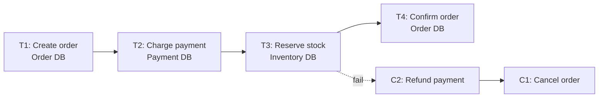
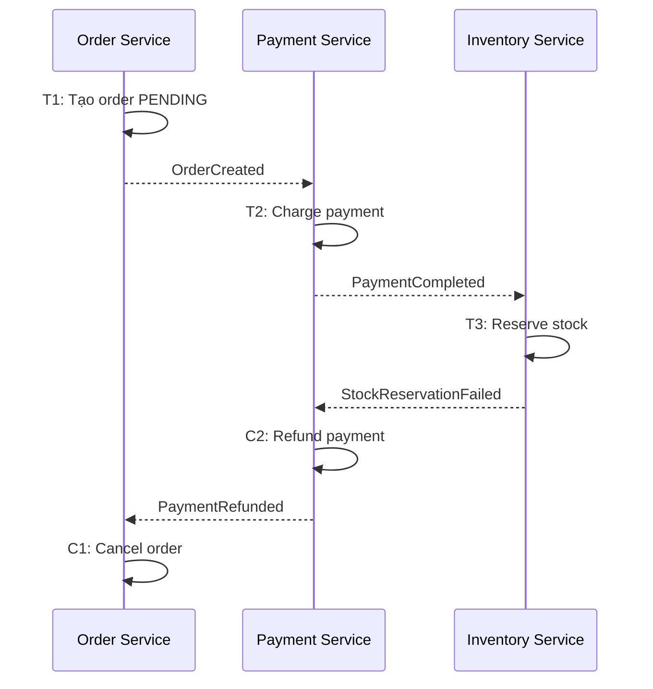
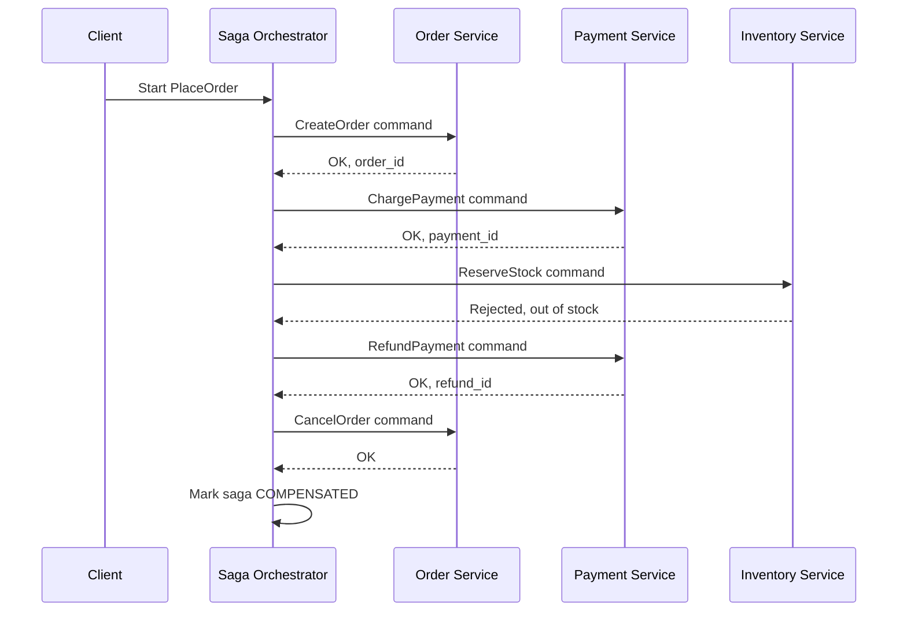
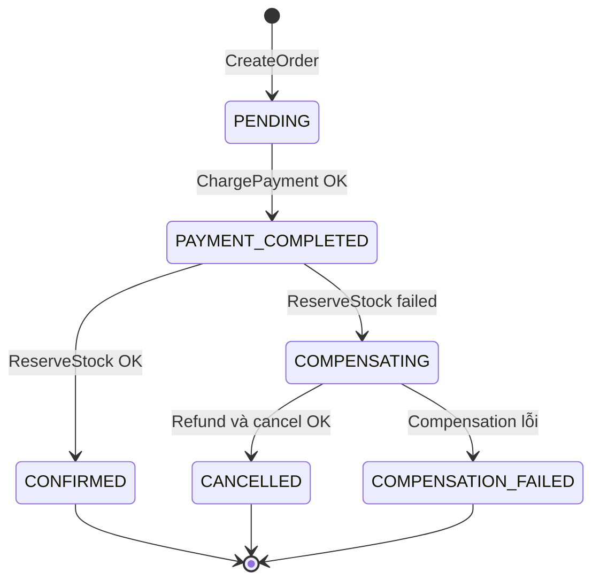

# Saga Pattern — Distributed Transaction bằng chuỗi Local Transactions

## Mục lục

- [Tổng quan](#tổng-quan)
- [Local transaction và ranh giới của Saga](#local-transaction-và-ranh-giới-của-saga)
  - [Từ distributed transaction đến Saga](#từ-distributed-transaction-đến-saga)
  - [Luồng thành công và thất bại](#luồng-thành-công-và-thất-bại)
- [Compensating action](#compensating-action)
  - [Compensation không phải rollback](#compensation-không-phải-rollback)
  - [Thiết kế cặp transaction và compensation](#thiết-kế-cặp-transaction-và-compensation)
  - [Bước không thể bù](#bước-không-thể-bù)
- [Choreography Saga](#choreography-saga)
  - [Luồng qua events](#luồng-qua-events)
  - [Điểm mạnh và giới hạn của Choreography](#điểm-mạnh-và-giới-hạn-của-choreography)
- [Orchestration Saga](#orchestration-saga)
  - [Luồng qua commands](#luồng-qua-commands)
  - [Saga log và khả năng phục hồi](#saga-log-và-khả-năng-phục-hồi)
  - [Điểm mạnh và giới hạn của Orchestration](#điểm-mạnh-và-giới-hạn-của-orchestration)
- [So sánh Choreography và Orchestration](#so-sánh-choreography-và-orchestration)
- [Consistency và isolation](#consistency-và-isolation)
  - [Eventual consistency và trạng thái trung gian](#eventual-consistency-và-trạng-thái-trung-gian)
  - [Semantic Lock](#semantic-lock)
  - [Commutative Operations](#commutative-operations)
  - [Idempotency và retry](#idempotency-và-retry)
- [Use case Order Service](#use-case-order-service)
  - [Luồng đặt hàng thành công](#luồng-đặt-hàng-thành-công)
  - [Khi Inventory Service từ chối](#khi-inventory-service-từ-chối)
  - [Trạng thái cần công khai](#trạng-thái-cần-công-khai)
- [Trade-off](#trade-off)
- [Khi nên và không nên dùng](#khi-nên-và-không-nên-dùng)
- [Lỗi thường gặp](#lỗi-thường-gặp)
- [Vận hành](#vận-hành)
  - [Theo dõi saga đang chạy](#theo-dõi-saga-đang-chạy)
  - [Retry, timeout và DLQ](#retry-timeout-và-dlq)
  - [Correlation và tracing](#correlation-và-tracing)
  - [Kiểm thử compensation](#kiểm-thử-compensation)
  - [Runbook khi saga bị kẹt](#runbook-khi-saga-bị-kẹt)
- [Checklist](#checklist)
- [Liên kết liên quan](#liên-kết-liên-quan)

---

## Tổng quan

Trong một monolith, nghiệp vụ `PlaceOrder` có thể tạo order, trừ tiền và giữ hàng trong cùng một **ACID transaction**. Khi các phần này nằm ở Order Service, Payment Service và Inventory Service, mỗi service có process và database riêng. Không còn một transaction duy nhất bao phủ mọi thay đổi.

**Saga Pattern** thay thế distributed transaction bằng một chuỗi **local transactions** (transaction chỉ bao phủ database của một service). Mỗi bước commit thay đổi của mình. Nếu bước sau thất bại, hệ thống chạy **compensating action** (hành động bù) để đảo ngược hiệu ứng nghiệp vụ của những bước đã hoàn tất.

Saga không tạo ra một `ROLLBACK` chung cho nhiều database. Kết quả cuối cùng có thể là `CONFIRMED` hoặc `CANCELLED`, và các trạng thái đó đều được ghi nhận bởi những transaction riêng.

> Saga phù hợp khi nghiệp vụ chấp nhận có trạng thái trung gian và eventual consistency. Nếu một invariant bắt buộc đúng tức thời trên nhiều service, cần xem xét lại ranh giới service hoặc cách thiết kế nghiệp vụ trước khi chọn Saga.

## Local transaction và ranh giới của Saga

### Từ distributed transaction đến Saga

Một **distributed transaction** cố gắng commit hoặc rollback nhiều resource như một đơn vị. Saga không làm điều đó. Saga chia workflow thành các transaction độc lập, sau đó dùng kết quả của mỗi bước để quyết định bước tiếp theo.

Ví dụ với nghiệp vụ đặt hàng:

| Bước | Local transaction | Kết quả nghiệp vụ |
|---|---|---|
| `T1` | Order Service tạo order | Order ở trạng thái `PENDING` |
| `T2` | Payment Service charge thanh toán | Payment ở trạng thái đã charge |
| `T3` | Inventory Service reserve hàng | Reservation được tạo |
| `T4` | Order Service xác nhận order | Order chuyển sang `CONFIRMED` |

`T1` chỉ bảo vệ dữ liệu trong Order DB. `T2` chỉ bảo vệ dữ liệu trong Payment DB. Việc `T1` đã commit không có nghĩa `T2`, `T3` và `T4` sẽ chắc chắn thành công.

### Luồng thành công và thất bại

Trên happy path, các local transaction lần lượt hoàn tất. Khi một bước thất bại, compensation thường chạy theo thứ tự ngược với những bước đã commit:



Nếu `T3` thất bại, `T1` và `T2` vẫn đã commit. Saga không xóa lịch sử của hai transaction đó. Nó thực hiện `C2` để refund payment rồi `C1` để chuyển order sang `CANCELLED`, nếu đó là quy tắc của nghiệp vụ.

Mỗi bước cần có kết quả rõ ràng: thành công, thất bại có thể retry, thất bại cần compensation, hoặc thất bại cần can thiệp thủ công. Một workflow chỉ mô tả happy path chưa phải là một Saga hoàn chỉnh.

## Compensating action

### Compensation không phải rollback

**Rollback** của ACID transaction hoàn tác các ghi chưa commit trong cùng database. **Compensating action** là một transaction hoặc hành động nghiệp vụ mới, chạy sau khi transaction trước đó đã commit.

| | ACID rollback | Compensating action |
|---|---|---|
| Thời điểm | Trước khi transaction kết thúc | Sau khi local transaction đã commit |
| Phạm vi | Một transaction và resource của nó | Có thể chạy ở service khác |
| Dữ liệu lịch sử | Thay đổi chưa commit biến mất | Transaction ban đầu vẫn có audit trail |
| Ví dụ | `INSERT order` rồi rollback | `UPDATE order SET status = 'CANCELLED'` |

Vì compensation là transaction mới, nó có thể thất bại, bị retry hoặc cần một quy trình xử lý riêng. Nó cũng không nhất thiết khôi phục state về đúng byte như trước. Ví dụ `ChargePayment` thường được bù bằng `RefundPayment`; bản ghi charge và refund đều có thể tồn tại để đối soát.

### Thiết kế cặp transaction và compensation

Trong design review, mô tả mỗi bước thành một cặp `(Tᵢ, Cᵢ)` ngay từ đầu:

| Service | Transaction `Tᵢ` | Compensation `Cᵢ` |
|---|---|---|
| Order Service | Tạo order với `PENDING` | Hủy order, chuyển `CANCELLED` |
| Payment Service | Charge số tiền của order | Refund số tiền đã charge |
| Inventory Service | Reserve một hoặc nhiều item | Release reservation |
| Shipping Service | Tạo shipment | Hủy shipment nếu provider cho phép |
| Notification Service | Gửi thông báo xác nhận | Gửi thông báo hủy; không thể thu hồi email đã gửi |

Compensation phải dựa trên kết quả thực tế của transaction. Nếu `T2` đã commit nhưng response bị timeout, không được đoán rằng `T2` thất bại rồi charge lại một cách mù quáng. Cần truy vấn hoặc đối chiếu theo identity của bước trước, sau đó mới retry hoặc compensate.

### Bước không thể bù

Một số side effect không có phép đảo ngược hoàn toàn:

- Email hoặc SMS đã gửi không thể được gửi ngược lại. Hành động phù hợp có thể là gửi thông báo đính chính.
- External API chỉ có thể được bù nếu provider hỗ trợ cancel hoặc refund.
- Một hành động vật lý bên ngoài hệ thống có thể không được hoàn tác ngay.

Nếu nghiệp vụ không chấp nhận các giới hạn này, không nên đưa side effect đó vào Saga mà không có thỏa thuận rõ ràng về trạng thái cuối cùng. Đừng gọi một bước là "reversible" chỉ vì đã viết một endpoint mang tên `cancel`.

## Choreography Saga

### Luồng qua events

**Choreography** phối hợp Saga qua events. Mỗi service lắng nghe event, thực hiện local transaction của mình và phát event tiếp theo. Không có coordinator trung tâm nắm toàn bộ flow.

Event diễn tả một fact đã xảy ra, chẳng hạn `OrderCreated` hoặc `PaymentCompleted`. Service nhận event tự quyết định có phản ứng hay không dựa trên contract của nó.



Producer không cần biết toàn bộ consumer. Tuy nhiên, logic của một Saga bị phân tán giữa các event handler. Muốn hiểu vì sao order bị hủy, người vận hành phải nối được các event và local transaction theo cùng một Saga.

### Điểm mạnh và giới hạn của Choreography

| Điểm mạnh | Giới hạn |
|---|---|
| Không cần thêm một orchestrator trung tâm | Không có một nơi duy nhất cho thấy toàn bộ flow |
| Service giao tiếp qua events, giảm phụ thuộc gọi trực tiếp | Logic compensation nằm rải rác trong nhiều handler |
| Thêm một consumer cho event có thể không cần sửa producer | Dễ hình thành dependency vòng giữa các event handler |
| Phù hợp flow ít bước và tuyến tính | Debug, thay đổi thứ tự và kiểm soát lỗi khó hơn khi Saga lớn |

Choreography thường dễ bắt đầu với Saga khoảng 3–4 bước và ít nhánh. Đây là heuristic, không phải giới hạn kỹ thuật. Khi flow có nhiều nhánh, nhiều compensation hoặc cần xem trạng thái toàn cục thường xuyên, mô hình phân tán có thể trở nên khó vận hành.

## Orchestration Saga

### Luồng qua commands

**Orchestration** dùng một **Saga Orchestrator** (bộ điều phối Saga) để giữ state machine và quyết định bước tiếp theo. Orchestrator gửi command đến participant cụ thể, nhận kết quả, rồi chuyển Saga sang state tiếp theo hoặc gửi command compensation.

Command mang ý nghĩa "hãy thực hiện việc này" và hướng tới một service cụ thể. Cách phối hợp này là command-driven, dù command có thể được truyền qua HTTP, RPC hoặc message broker.



Orchestrator nhìn thấy flow ở một chỗ và có thể mô tả rõ các nhánh thành công, timeout và compensation. Đổi lại, nó phải biết participant nào nhận command và contract của từng participant.

### Saga log và khả năng phục hồi

Orchestrator cần persist state thay vì chỉ giữ state trong memory. Một Saga log có thể lưu các thông tin sau:

| Trường | Mục đích |
|---|---|
| `saga_id` | Nhận diện một lần chạy duy nhất của workflow |
| `step` | Bước hiện tại hoặc bước cuối đã xử lý |
| `status` | `IN_PROGRESS`, `FAILED`, `COMPENSATING`, `COMPENSATED` hoặc trạng thái tương đương |
| `timestamp` | Đo thời gian ở từng bước và phát hiện timeout |
| `data` | `order_id`, `payment_id`, lỗi hoặc dữ liệu cần cho compensation |

Khi orchestrator crash và khởi động lại, nó đọc Saga log, tìm các Saga chưa ở trạng thái kết thúc, rồi quyết định retry bước hiện tại hoặc tiếp tục compensation. Persistent state giúp tránh mất dấu workflow, nhưng không tự làm participant idempotent. Cùng một command vẫn có thể được gửi lại sau timeout.

### Điểm mạnh và giới hạn của Orchestration

| Điểm mạnh | Giới hạn |
|---|---|
| Toàn bộ flow và nhánh lỗi nằm trong state machine dễ đọc | Orchestrator trở thành dependency trung tâm của workflow |
| Dễ biết Saga đang ở bước nào | Orchestrator coupling với các participant và command contract |
| Centralized error handling và compensation | Cần thêm component, persistent state và cơ chế HA phù hợp |
| Phù hợp flow nhiều bước, nhiều nhánh hoặc cần visibility cao | Thêm hoặc đổi bước thường phải cập nhật orchestrator |

Orchestration không làm participant mất quyền sở hữu dữ liệu. Order Service vẫn kiểm tra invariant của Order DB, Payment Service vẫn chịu trách nhiệm payment data, và orchestrator chỉ điều phối các kết quả qua contract.

## So sánh Choreography và Orchestration

| Tiêu chí | Choreography | Orchestration |
|---|---|---|
| Coordinator | Không có coordinator trung tâm | Có Saga Orchestrator |
| Cách chuyển bước | Service phản ứng với event | Orchestrator gửi command và xử lý kết quả |
| Visibility | Logic phân tán, cần correlation và tracing | Flow tập trung trong state machine |
| Coupling | Loose hơn ở producer, nhưng event dependencies có thể tăng | Coupling tập trung giữa orchestrator và participant |
| Compensation | Compensating events/handlers phân tán | Orchestrator quyết định và gửi compensation |
| Failure của coordinator | Không có coordinator riêng để dừng flow | Cần HA và persistent state để tránh Saga bị kẹt |
| Phù hợp | Flow ít bước, tuyến tính, ít nhánh | Flow nhiều bước, branching hoặc cần visibility cao |

Không có lựa chọn đúng cho mọi Saga. Hãy chọn dựa trên số bước, mức độ branching, khả năng quan sát và năng lực vận hành. Đừng chọn Choreography chỉ để tránh một component; cũng đừng chọn Orchestration chỉ vì state machine trông dễ đọc hơn mà không tính chi phí coupling.

## Consistency và isolation

### Eventual consistency và trạng thái trung gian

Mỗi local transaction có thể đạt consistency trong database của service đó. Saga không cung cấp **global isolation** giữa các local transaction. Vì vậy, service khác có thể nhìn thấy trạng thái đã commit ở một bước trong khi các bước sau chưa hoàn tất.

Ví dụ trong lúc Saga đặt hàng đang chạy:

| Order DB | Payment DB | Inventory DB |
|---|---|---|
| `PENDING` | `CHARGED` | Chưa có reservation |

Đây là **eventual consistency**: các state sẽ hội tụ theo workflow nếu các bước tiếp tục thành công hoặc compensation hoàn tất. `PENDING` phải là trạng thái hợp lệ trong contract của Order Service, không phải một lỗi cần che giấu bằng cách trả về `CONFIRMED` sớm.

> Trạng thái trung gian đã commit không phải `dirty read` theo nghĩa database isolation, vì dữ liệu không còn uncommitted. Vấn đề ở đây là thiếu isolation ở cấp workflow: các service khác thấy được một phần tiến trình trước khi Saga kết thúc.

### Semantic Lock

**Semantic Lock** (khóa ngữ nghĩa) dùng trạng thái nghiệp vụ để báo rằng dữ liệu đang được một Saga xử lý. Order có thể được tạo với `PENDING` hoặc `PROCESSING`; các nghiệp vụ khác đọc trạng thái này và chờ, từ chối hoặc áp dụng quy tắc riêng thay vì coi order đã hoàn tất.

Ví dụ:

1. Order Service tạo order với `status = PENDING`.
2. Payment và Inventory xử lý các bước của Saga.
3. Chỉ khi mọi bước cần thiết thành công, Order Service chuyển sang `CONFIRMED`.
4. Nếu có lỗi, order chuyển sang `CANCELLED` hoặc trạng thái compensation phù hợp.

Semantic Lock không phải database lock kéo dài giữa nhiều service. Nó là một quy ước mà API và business logic phải cùng tôn trọng.

### Commutative Operations

**Commutative Operations** là các phép cập nhật mà kết quả không phụ thuộc vào thứ tự thực hiện, khi semantics của domain cho phép. Ví dụ, các thay đổi dạng cộng dồn có thể được thiết kế để hai update độc lập không ghi đè nhau chỉ vì đến khác thứ tự.

Kỹ thuật này giảm phụ thuộc vào ordering toàn cục, nhưng không tự bảo vệ mọi invariant. Phép `stock -= 1` có thể có tính giao hoán về mặt số học, nhưng vẫn cần quy tắc đảm bảo stock không âm và không oversell. Chỉ dùng phép giao hoán khi đã xác định rõ invariant nào được bảo vệ ở đâu.

### Idempotency và retry

Delivery và command trong hệ phân tán có thể được retry. **Idempotency** nghĩa là xử lý lại cùng một bước không tạo thêm side effect sai.

Mỗi bước nên có identity ổn định, chẳng hạn `saga_id` kết hợp với tên bước hoặc một idempotency key do participant quản lý. Participant có thể kiểm tra identity đó trước khi charge, reserve hoặc refund lần nữa. Compensation cũng phải idempotent vì chính compensation có thể timeout sau khi đã thành công.

Ví dụ, Payment Service nhận lại `RefundPayment(saga_id = S-001, payment_id = P-123)`. Nếu refund cho `S-001` đã hoàn tất, service trả lại kết quả cũ hoặc trạng thái đã biết thay vì tạo thêm một refund mới.

Idempotency không thay thế việc xác định trạng thái hợp lệ. Consumer vẫn cần kiểm tra event hoặc command có đúng bước hiện tại hay đã quá cũ, đồng thời xử lý message đến trùng hoặc sai thứ tự theo contract.

## Use case Order Service

Giả sử một hệ thống e-commerce có Order Service, Payment Service và Inventory Service. Mỗi service chỉ ghi database của mình. Nghiệp vụ `PlaceOrder` cần tạo order, charge payment, reserve stock rồi xác nhận order.

### Luồng đặt hàng thành công

| Thứ tự | Service | Local transaction hoặc kết quả |
|---:|---|---|
| 1 | Order Service | `CreateOrder` với `status = PENDING` |
| 2 | Payment Service | `ChargePayment` và trả về `payment_id` |
| 3 | Inventory Service | `ReserveStock` và trả về reservation |
| 4 | Order Service | `ConfirmOrder`, chuyển `PENDING` thành `CONFIRMED` |

Với Choreography, mỗi kết quả có thể được công bố thành event để service kế tiếp phản ứng. Với Orchestration, orchestrator gửi command cho từng service và lưu kết quả vào Saga log. Trong cả hai mô hình, mỗi service vẫn thực hiện local transaction riêng.

### Khi Inventory Service từ chối

Nếu Inventory Service không đủ hàng ở bước 3, Payment đã có thể ở trạng thái `CHARGED`. Saga xử lý như sau:

1. Inventory Service trả về `StockReservationFailed` hoặc kết quả lỗi tương đương.
2. Payment Service chạy `RefundPayment` cho payment đã charge.
3. Order Service chạy `CancelOrder` và giữ audit trail của order.
4. Nếu refund hoặc cancel thất bại, Saga chuyển sang trạng thái đang compensation hoặc cần xử lý, thay vì báo `CONFIRMED` hay coi workflow đã kết thúc thành công.



Điểm quan trọng là `CANCELLED` không có nghĩa các transaction trước đó chưa từng xảy ra. Payment charge và refund vẫn cần được đối soát bằng các identity tương ứng.

### Trạng thái cần công khai

Client và các service liên quan cần biết các trạng thái có thể xuất hiện trong thời gian Saga chạy. Một contract tối thiểu có thể phân biệt:

- `PENDING`: order đã được tạo nhưng các bước liên service chưa hoàn tất.
- `CONFIRMED`: các bước cần thiết đã thành công.
- `CANCELLED`: nghiệp vụ đã kết thúc theo hướng hủy sau khi compensation cần thiết hoàn tất.
- `COMPENSATING` hoặc `COMPENSATION_FAILED`: hệ thống đang bù hoặc cần can thiệp.

Tên trạng thái thực tế phụ thuộc domain. Điều cần tránh là dùng cùng một trạng thái cho "đang chờ", "đã xác nhận" và "đang khắc phục", vì UI và support sẽ không thể diễn giải đúng kết quả.

## Trade-off

| Lợi ích | Chi phí hoặc giới hạn |
|---|---|
| Không cần distributed lock hoặc 2PC để phối hợp các local database | Không có atomic commit/rollback chung giữa các service |
| Giữ được data ownership và autonomy của từng service | Eventual consistency và trạng thái trung gian phải trở thành một phần của contract |
| Có thể xử lý lỗi bằng compensation thay vì để dữ liệu dở dang vô thời hạn | Cần viết, test và vận hành compensation cho từng bước |
| Orchestration cho visibility tốt; Choreography giảm coordinator trung tâm | Choreography khó debug khi flow lớn; Orchestration tạo dependency trung tâm |
| Các bước có thể retry khi dependency tạm thời lỗi | Retry tạo duplicate nếu participant không idempotent |
| Audit trail phản ánh charge, refund, cancel hoặc release đã xảy ra | Compensation không phải lúc nào cũng đảo ngược side effect bên ngoài hoàn toàn |

Saga đổi một bài toán transaction phân tán lấy một workflow nghiệp vụ có trạng thái, retry và reconciliation. Đó là trade-off có chủ đích, không phải cách làm cho nhiều database trở thành một database duy nhất.

## Khi nên và không nên dùng

| Nên dùng khi | Không nên hoặc chưa cần khi |
|---|---|
| Một nghiệp vụ thực sự trải qua nhiều service và database | Nghiệp vụ nằm trọn trong một service; local transaction đã đủ |
| Business chấp nhận `PENDING`, eventual consistency và một khoảng thời gian xử lý | Nghiệp vụ bắt buộc strong consistency tức thời trên nhiều resource |
| Mỗi bước đã xác định được compensation và trạng thái cuối | Có side effect không thể bù mà business không chấp nhận rủi ro |
| Team có thể vận hành retry, state tracking, logging và alert | Chưa có khả năng quan sát hoặc xử lý Saga bị kẹt |
| Cần phối hợp nhiều bước có thể thất bại độc lập | Đang thêm Saga chỉ vì nhiều service có liên quan, dù workflow không cần transaction liên service |

Khi yêu cầu consistency quá chặt, các lựa chọn có thể là gộp phần dữ liệu cần invariant chung vào một service, thay đổi workflow để giảm ranh giới transaction hoặc dùng cơ chế khác phù hợp với hệ thống. Không nên mặc định Saga là giải pháp cho mọi lỗi đồng bộ dữ liệu.

## Lỗi thường gặp

| Lỗi | Hậu quả | Cách khắc phục |
|---|---|---|
| Thiết kế happy path trước rồi mới nghĩ compensation | Có bước không thể bù, phải thay đổi thiết kế muộn | Xác định cặp `(Tᵢ, Cᵢ)` và failure path trong design review |
| Gọi compensation là rollback hoặc xóa dữ liệu | Mất audit trail và hiểu sai trạng thái thực tế | Dùng transaction mới, lưu trạng thái `CANCELLED` hoặc trạng thái bù phù hợp |
| Retry charge/refund/reserve mà không có idempotency | Charge hoặc refund nhiều lần | Dùng identity ổn định cho Saga và từng bước; lưu kết quả đã xử lý |
| Coi `PENDING` là lỗi hoặc coi mọi order đã tạo là hợp lệ | Service khác đọc state trung gian rồi thực hiện hành động sai | Định nghĩa Semantic Lock và công khai state transition |
| Orchestrator giữ state trong memory | Crash làm mất vị trí của Saga, workflow bị kẹt | Persist Saga log và khôi phục các Saga chưa kết thúc |
| Choreography không có quy ước event rõ ràng | Event handler tạo dependency vòng, khó biết ai tiếp tục flow | Giữ event contract và ownership của từng transition rõ ràng |
| Compensation thất bại nhưng không alert | Tiền đã charge, order hoặc reservation ở trạng thái không rõ | Retry có backoff, ghi trạng thái lỗi, alert và có runbook xử lý |
| Không truyền `saga_id` hoặc `correlation_id` | Không nối được các log và message của một workflow | Gắn identity vào command, event, log và trace context |
| Không xử lý timeout và message đến trùng hoặc sai thứ tự | Saga đứng ở trạng thái không xác định hoặc thực hiện bước cũ | Xác định timeout policy, kiểm tra state hiện tại và thiết kế handler idempotent |
| Dùng Saga cho nghiệp vụ đơn service | Thêm complexity mà không giải quyết vấn đề thật | Giữ local transaction khi không có ranh giới service cần phối hợp |

## Vận hành

### Theo dõi saga đang chạy

Mỗi lần chạy cần được truy vấn theo `saga_id`. Với Orchestration, Saga log là nguồn chính để biết bước cuối. Với Choreography, cần nối các log và message của từng service bằng cùng identity.

Nên theo dõi ít nhất:

| Tín hiệu | Điều cần phát hiện |
|---|---|
| Số Saga đang `IN_PROGRESS` hoặc `COMPENSATING` | Backlog workflow đang tăng hay không |
| Tuổi của Saga lâu nhất ở mỗi state | Saga nào vượt SLA và có nguy cơ bị kẹt |
| Thời gian từng step | Participant hoặc dependency nào tạo bottleneck |
| Tỷ lệ step failure và compensation | Failure path có xảy ra bất thường không |
| Tỷ lệ compensation thất bại | Có nguy cơ cần reconciliation hoặc can thiệp thủ công |
| Số lần retry và message trong DLQ | Dependency lỗi tạm thời hay message có vấn đề lâu dài |

Ngưỡng alert phải dựa trên SLA của nghiệp vụ. Một order có thể chấp nhận `PENDING` trong vài giây, nhưng không nên để cùng trạng thái đó kéo dài hàng giờ mà không có cảnh báo.

### Retry, timeout và DLQ

Retry phù hợp với lỗi tạm thời như network timeout hoặc participant tạm unavailable. Retry cần có số lần tối đa và backoff để không làm lỗi lan rộng. Sau khi vượt policy, message hoặc Saga cần chuyển sang trạng thái có thể điều tra, chẳng hạn DLQ hoặc `COMPENSATION_FAILED`.

Khi retry một command:

1. Dùng cùng identity của Saga và step để participant nhận biết lần xử lý lặp.
2. Kiểm tra kết quả trước đó nếu request trước timeout.
3. Chỉ đánh dấu step thành công sau khi có kết quả được xác nhận.
4. Ghi lại nguyên nhân, số lần thử và thời điểm thử.

DLQ không phải nơi để bỏ quên Saga. Message trong DLQ cần có `saga_id`, step, participant, lỗi và dữ liệu đủ để replay có kiểm soát sau khi nguyên nhân được sửa.

### Correlation và tracing

Gắn `saga_id` vào mọi command, event, log và bản ghi Saga log. Gắn `correlation_id` để nối Saga với request ban đầu hoặc một workflow cấp trên. Với async messaging, trace context nên được truyền trong message metadata nếu hạ tầng tracing hỗ trợ.

Một log có thể chứa:

```text
saga_id       = S-001
correlation_id = req-91ab
step          = ReserveStock
status        = FAILED
aggregate_id  = order-123
```

`Saga ID` giúp tìm một lần chạy cụ thể. `Correlation ID` giúp nối workflow với request và các hoạt động liên quan. Không ghi dữ liệu thanh toán nhạy cảm vào log chỉ để thuận tiện điều tra.

### Kiểm thử compensation

Compensation ít khi chạy trên happy path nên cần được kiểm thử như code production. Tối thiểu nên có các kịch bản:

- Mỗi step thất bại ngay sau khi step trước đã commit.
- Timeout sau khi participant đã thực hiện thành công.
- Message hoặc command được giao trùng.
- Orchestrator hoặc participant crash rồi restart.
- Compensation thành công sau retry.
- Compensation tiếp tục thất bại và chuyển sang trạng thái cần can thiệp.
- Event đến trễ hoặc không đúng thứ tự trong Choreography.

Có thể dùng failure injection hoặc chaos test ở mức phù hợp để kiểm tra Saga không bị mất trạng thái khi một service dừng giữa workflow. Kết quả kiểm thử cần xác nhận cả state cuối, side effect và audit trail.

### Runbook khi saga bị kẹt

Khi alert cho thấy Saga vượt SLA:

1. Tìm `saga_id` và xác định state, step cuối cùng cùng thời điểm bắt đầu.
2. Kiểm tra local state ở participant: transaction đã commit, bị rollback hay kết quả chỉ bị mất do timeout.
3. Kiểm tra message hoặc command tương ứng, số lần retry và DLQ.
4. Phân biệt lỗi dependency tạm thời với lỗi dữ liệu hoặc contract không thể retry.
5. Retry bằng cùng identity nếu operation idempotent; không tự ý tạo một Saga mới để "thử lại" một side effect chưa đối soát.
6. Nếu compensation không thể tự hồi phục, chuyển sang trạng thái cần xử lý và ghi lại thao tác thủ công.
7. Đối soát Order, Payment và Inventory trước khi đóng Saga; không chỉ dựa vào một response lỗi.

Không nên sửa trực tiếp database của participant để làm cho Saga log trông như đã hoàn tất. Nếu cần thao tác thủ công, phải có command hoặc quy trình được audit để giữ nhất quán giữa state nghiệp vụ và lịch sử xử lý.

## Checklist

- [ ] Đã xác định rõ workflow nào thực sự xuyên nhiều service và database.
- [ ] Mỗi bước local transaction có cặp `(Tᵢ, Cᵢ)` và failure path tương ứng.
- [ ] Compensation được mô tả là transaction/hành động mới, không phải ACID rollback.
- [ ] Đã thống nhất các trạng thái trung gian như `PENDING`, `PROCESSING` hoặc `COMPENSATING`.
- [ ] API và service khác không coi trạng thái trung gian là `CONFIRMED`.
- [ ] Đã chọn Choreography hoặc Orchestration dựa trên độ phức tạp và visibility cần thiết.
- [ ] Orchestrator có persistent Saga log nếu dùng Orchestration.
- [ ] Mọi step và compensation đều có idempotency strategy.
- [ ] Có policy cho timeout, retry, backoff, DLQ và trạng thái cần can thiệp.
- [ ] Message và log có `saga_id`, `correlation_id` cùng thông tin step.
- [ ] Có metric và alert cho Saga quá hạn, compensation failure và DLQ.
- [ ] Đã kiểm thử crash, duplicate, timeout, out-of-order và compensation failure.

## Liên kết liên quan

- [Data Management — Saga Pattern](../09-data-management.md#6-saga-pattern) — nền tảng về distributed transaction, Choreography, Orchestration và Saga log.
- [Inter-Service Communication — Choreography và Orchestration](../06-inter-service-communication.md#53-choreography-vs-orchestration--phân-biệt-rõ-ràng) — phân biệt event, command và cách phối hợp workflow.
- [Transactional Outbox Pattern](./transactional-outbox.md) — reliable event publishing khi Saga dùng giao tiếp bất đồng bộ.
- [Observability & Evolvability](../11-observability-evolvability.md) — Correlation ID, logging và distributed tracing.
- [Resilience Patterns](../10-resilience-patterns.md) — Retry và các cơ chế xử lý lỗi giữa service.
