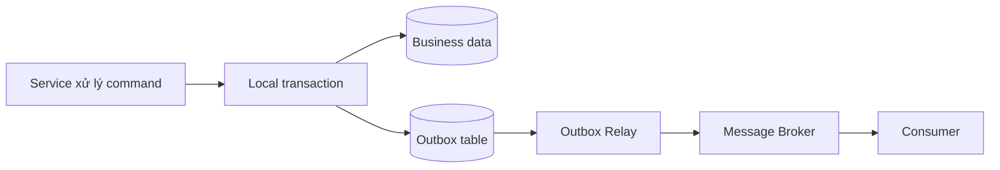
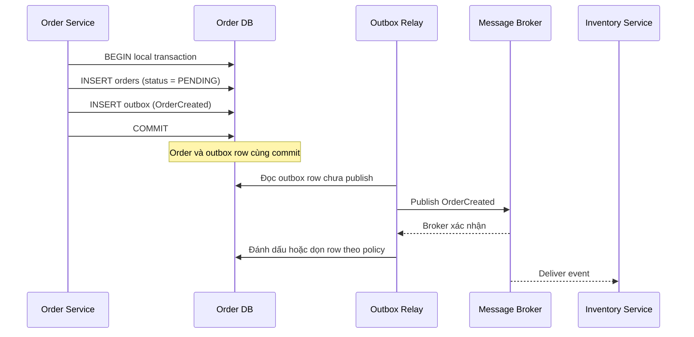

# Transactional Outbox Pattern

## Mục lục

- [Tổng quan](#tổng-quan)
- [Vấn đề Dual Write](#vấn-đề-dual-write)
  - [Ba cách Dual Write thất bại](#ba-cách-dual-write-thất-bại)
  - [HA không thay thế tính atomic](#ha-không-thay-thế-tính-atomic)
- [Cơ chế hoạt động](#cơ-chế-hoạt-động)
  - [Ghi business data và outbox trong local transaction](#ghi-business-data-và-outbox-trong-local-transaction)
  - [Cấu trúc bản ghi outbox](#cấu-trúc-bản-ghi-outbox)
  - [Ranh giới đảm bảo](#ranh-giới-đảm-bảo)
- [Outbox Relay](#outbox-relay)
  - [Polling Publisher](#polling-publisher)
  - [Transaction Log Tailing và CDC](#transaction-log-tailing-và-cdc)
  - [So sánh và cách chọn](#so-sánh-và-cách-chọn)
- [Ordering và Idempotency](#ordering-và-idempotency)
  - [Ordering theo aggregate](#ordering-theo-aggregate)
  - [Idempotent consumer](#idempotent-consumer)
  - [Retry và Dead Letter Queue](#retry-và-dead-letter-queue)
- [Use case Order Service](#use-case-order-service)
  - [Luồng tạo order](#luồng-tạo-order)
  - [Khi relay hoặc broker tạm thời lỗi](#khi-relay-hoặc-broker-tạm-thời-lỗi)
- [Trade-off](#trade-off)
- [Khi nên và không nên dùng](#khi-nên-và-không-nên-dùng)
- [Lỗi thường gặp](#lỗi-thường-gặp)
- [Vận hành](#vận-hành)
  - [Theo dõi relay và outbox lag](#theo-dõi-relay-và-outbox-lag)
  - [Cleanup và retention](#cleanup-và-retention)
  - [Schema, bảo mật và tracing](#schema-bảo-mật-và-tracing)
  - [Runbook khi event bị kẹt](#runbook-khi-event-bị-kẹt)
- [Checklist](#checklist)
  - [Design review](#design-review)
  - [Trước khi đi live](#trước-khi-đi-live)
- [Liên kết liên quan](#liên-kết-liên-quan)

---

## Tổng quan

**Transactional Outbox Pattern** giải quyết bài toán service phải ghi **business data** vào database và phát một **event** (sự kiện đã xảy ra) tới message broker trong cùng một nghiệp vụ. Pattern này lưu event vào bảng `outbox` trong database của chính service, cùng với business data. Hai bản ghi được ghi trong cùng một **local transaction** (transaction chỉ bao phủ database local).

Sau khi transaction commit, một process riêng gọi là **Outbox Relay** đọc các row trong `outbox` và publish event tới broker. Relay có thể thử lại việc publish khi broker hoặc network tạm thời lỗi.



Outbox làm cho việc **lưu business state và lưu ý định phát event** atomic trong phạm vi database local. Nó không biến database và broker thành một distributed transaction, không đảm bảo exactly-once delivery và không thay thế việc consumer xử lý duplicate.

> Phạm vi của pattern này là reliable event publishing: event không bị mất chỉ vì ứng dụng crash giữa lúc ghi database và publish. Bài toán transaction xuyên nhiều service vẫn cần một thiết kế nghiệp vụ riêng.

## Vấn đề Dual Write

**Dual Write** (ghi kép) là việc một service thực hiện hai thao tác ghi độc lập:

1. Ghi thay đổi nghiệp vụ vào database.
2. Publish event thông báo thay đổi đó tới message broker.

Nếu hai thao tác không nằm trong cùng một transaction, không có thời điểm nào đảm bảo cả hai cùng thành công hoặc cùng thất bại.

### Ba cách Dual Write thất bại

Ví dụ, Order Service cần tạo order và phát `OrderCreated` để Inventory Service bắt đầu xử lý tồn kho:

```text
Dual Write — hai thao tác không atomic:

  1. INSERT order vào Order DB
  2. Publish OrderCreated vào broker
```

| Thứ tự hoặc sự cố | Kết quả | Hệ quả |
|---|---|---|
| Database commit trước, broker publish thất bại | Order tồn tại nhưng event không đến consumer | Inventory hoặc Payment không biết order mới |
| Publish trước, database ghi thất bại | Consumer nhận event nhưng order không tồn tại | Xuất hiện event mồ côi hoặc "order ma" |
| Ứng dụng crash giữa hai bước | Một bước đã hoàn tất, bước còn lại không được thực hiện | Kết quả phụ thuộc đúng vào thời điểm crash |

Đảo thứ tự hai thao tác không giải quyết được vấn đề. Ví dụ, `OrderCreated` đã đến broker nhưng `INSERT orders` thất bại vì vi phạm `unique constraint`; consumer vẫn có thể bắt đầu xử lý một order không tồn tại.

### HA không thay thế tính atomic

**High Availability (HA)** giảm khả năng database hoặc broker ngừng phục vụ. Nó không bảo vệ khoảng thời gian giữa hai lời gọi từ application.

Ngay cả khi database và Kafka đều hoạt động ổn định, các tình huống sau vẫn có thể xảy ra:

- Network giữa application và broker timeout trong khi database vẫn commit.
- Pod bị kill hoặc process crash sau khi database commit.
- Application publish event trước rồi mới phát hiện business transaction không thể commit.

Nói ngắn gọn:

| Cơ chế | Giải quyết |
|---|---|
| **HA** | Hạ tầng tiếp tục phục vụ khi một instance hoặc thành phần gặp lỗi |
| **Transactional Outbox** | Business data và event intent được lưu cùng local transaction |

Outbox không thay thế HA, và HA cũng không thay thế Outbox.

## Cơ chế hoạt động

### Ghi business data và outbox trong local transaction

Khi xử lý command, service ghi business data và event vào cùng database transaction:



Nếu `INSERT orders` thành công nhưng `INSERT outbox` thất bại, local transaction bị rollback và order cũng không được commit. Ngược lại, nếu business validation thất bại trước khi commit, không có event nào được lưu để relay.

Sau khi commit, relay hoạt động bất đồng bộ. Vì vậy request tạo order có thể trả thành công trước khi Inventory Service nhận được `OrderCreated`. Khoảng trễ này là một phần của eventual consistency và cần được chấp nhận trong contract nghiệp vụ.

### Cấu trúc bản ghi outbox

Một bảng outbox điển hình có thể bắt đầu với các trường sau:

```sql
CREATE TABLE outbox (
    id           UUID PRIMARY KEY,
    aggregate_id TEXT NOT NULL,
    event_type   TEXT NOT NULL,
    payload      JSONB NOT NULL,
    created_at   TIMESTAMPTZ NOT NULL DEFAULT now()
);
```

Ý nghĩa của các trường:

| Trường | Vai trò |
|---|---|
| `id` | Định danh duy nhất của event; consumer có thể dùng làm idempotency key |
| `aggregate_id` | Định danh aggregate, chẳng hạn `order_id`; thường được dùng làm message key |
| `event_type` | Loại event, chẳng hạn `OrderCreated` hoặc `OrderCancelled` |
| `payload` | Dữ liệu consumer cần để xử lý event |
| `created_at` | Thời điểm event được ghi vào outbox |

Polling implementation thường bổ sung `published_at`, `status` hoặc thông tin số lần retry. CDC có thể đọc thay đổi trực tiếp từ transaction log, nên cách đánh dấu hoặc cleanup phụ thuộc vào connector và retention policy.

Payload là một event contract. Nếu consumer cũ vẫn phải chạy trong lúc producer nâng cấp, schema payload cần có version hoặc quy tắc thay đổi tương thích ngược.

### Ranh giới đảm bảo

Outbox phân chia hệ thống thành hai chặng với mức đảm bảo khác nhau:

| Chặng | Điều Outbox đảm bảo | Điều vẫn phải thiết kế |
|---|---|---|
| Business data + outbox row | Hai ghi cùng commit hoặc cùng rollback trong local transaction | Database phải sẵn sàng để transaction commit |
| Outbox row + relay | Row còn đó để relay retry sau khi relay hoặc broker hồi phục | Relay cần health check, retry và quyền truy cập broker |
| Relay + broker | Relay cố gắng publish event bất đồng bộ | Có thể publish trùng khi crash sau publish nhưng trước khi ghi nhận kết quả |
| Broker + consumer | Message có thể được giao theo chính sách broker | Consumer phải idempotent và xử lý retry/DLQ |

Vì vậy, mục tiêu thực tế là **at-least-once delivery**: event không bị bỏ qua một cách im lặng, nhưng consumer có thể nhận cùng event nhiều lần. Outbox không cung cấp exactly-once cho toàn bộ chuỗi.

## Outbox Relay

**Outbox Relay** là thành phần đọc event đã được commit trong outbox và đưa event tới broker. Hai cách phổ biến là polling bảng outbox và Transaction Log Tailing qua CDC.

### Polling Publisher

**Polling Publisher** truy vấn bảng outbox theo chu kỳ:

```text
1. Đọc các row chưa publish.
2. Publish payload tới broker.
3. Chỉ sau khi broker xác nhận, đánh dấu row đã publish hoặc xóa theo retention policy.
4. Nếu publish thất bại, giữ row để retry.
```

Polling dễ triển khai và phù hợp với hệ thống nhỏ hoặc traffic event thấp. Tuy nhiên, mỗi lần polling tạo thêm query lên database. Bảng outbox cần index phù hợp trên các cột dùng để tìm row chưa publish và relay cần giới hạn batch để tránh một lần đọc quá lớn.

Khi có nhiều relay instance, cần cơ chế claim hoặc locking để hạn chế nhiều instance cùng xử lý một row. Dù có cơ chế này, crash sau khi broker đã nhận event nhưng trước khi row được đánh dấu vẫn có thể tạo duplicate. Vì vậy, locking không thay thế idempotency của consumer.

Polling interval cũng tạo ra độ trễ tối thiểu giữa lúc transaction commit và lúc event được publish. Interval ngắn giảm latency nhưng tăng query load; interval dài giảm load nhưng làm outbox lag tăng.

### Transaction Log Tailing và CDC

**Transaction Log Tailing** đọc transaction log của database, chẳng hạn WAL hoặc binlog, thay vì liên tục query bảng outbox. **Change Data Capture (CDC)** là cách bắt các thay đổi đó; Debezium là một ví dụ thường dùng trong hệ sinh thái này.

Với Outbox + CDC, luồng chính là:

1. Service commit business data và outbox row trong cùng transaction.
2. CDC connector phát hiện thay đổi trong transaction log.
3. Connector chuyển outbox row thành event trên broker.
4. Consumer nhận event từ topic tương ứng.

Ưu điểm chính là độ trễ thường thấp hơn polling và giảm số query định kỳ lên database. Đổi lại, team phải vận hành connector, transaction log, topic quản lý và cơ chế khôi phục khi connector gặp lỗi.

Transaction log có thứ tự ghi riêng, nhưng ordering cuối cùng còn phụ thuộc cách connector ánh xạ event và cách broker phân partition. Không nên suy ra rằng CDC tự động tạo ordering toàn cục cho mọi aggregate.

### So sánh và cách chọn

| Tiêu chí | Polling Publisher | Transaction Log Tailing (CDC) |
|---|---|---|
| Cách hoạt động | Query row chưa publish theo chu kỳ | Đọc WAL/binlog và capture thay đổi |
| Độ trễ | Phụ thuộc polling interval | Thường gần real-time hơn |
| Tác động lên database | Có query định kỳ; cần index và batch hợp lý | Ít query trực tiếp vào bảng outbox hơn |
| Ordering | Cần phối hợp nhiều poller và message key | Có thứ tự trong log; broker/partition vẫn cần được thiết kế |
| Độ phức tạp | Thấp, có thể tự viết | Cao hơn, cần CDC connector và hạ tầng đi kèm |
| Phù hợp | Hệ nhỏ hoặc traffic event thấp | Hệ lớn, latency thấp hoặc cần pipeline CDC |

Không có lựa chọn mặc định cho mọi hệ thống. Bắt đầu bằng polling nếu độ trễ vài trăm mili giây đến vài giây chấp nhận được và team muốn ít moving parts. Cân nhắc CDC khi query polling tạo tải đáng kể hoặc latency publish cần thấp hơn.

## Ordering và Idempotency

Outbox thường đi cùng hai yêu cầu xử lý ở phía broker và consumer:

- **Ordering**: các event của cùng một aggregate phải được xử lý theo thứ tự nghiệp vụ.
- **Idempotency**: xử lý lại một event không được tạo thêm side effect sai.

Hai yêu cầu này bổ sung cho nhau. Ordering giảm lỗi do trạng thái đến sai thứ tự; idempotency bảo vệ hệ thống khi relay hoặc broker giao trùng.

### Ordering theo aggregate

Không phải mọi event trong toàn hệ thống cần có một thứ tự toàn cục. Mục tiêu thường là giữ thứ tự cho các event của cùng aggregate, ví dụ:

```text
OrderCreated(order-123)
PaymentCompleted(order-123)
OrderCancelled(order-123)
```

Khi dùng Kafka hoặc broker có khái niệm partition, dùng `aggregate_id` làm message key để các event của cùng order đi vào cùng partition. Các aggregate khác có thể được xử lý song song.

Ordering vẫn cần được kiểm tra ở cả hai phía:

- Producer phải tạo event với `aggregate_id` đúng và không chọn key ngẫu nhiên cho cùng aggregate.
- Relay nhiều instance không được tự ý phát các event của cùng aggregate theo thứ tự khác nhau.
- Consumer không nên giả định ordering toàn cục nếu broker chỉ đảm bảo ordering trong một partition.

Nếu nghiệp vụ không yêu cầu thứ tự, không nên thêm cơ chế ordering toàn cục chỉ vì muốn đơn giản hóa quan sát. Thứ tự cần được xác định theo semantics của aggregate.

### Idempotent consumer

Consumer **idempotent** là consumer có thể nhận cùng `event_id` nhiều lần mà state cuối cùng vẫn đúng. Đây là điều kiện cần vì relay có thể crash sau khi broker nhận event nhưng trước khi relay lưu trạng thái đã publish.

Một cách phổ biến là lưu các event đã xử lý trong bảng `processed_events`. Business update và việc ghi nhận event nên nằm trong cùng local transaction của consumer:

```text
BEGIN
  Nếu (consumer_name, event_id) đã tồn tại:
      bỏ qua business update
  Nếu chưa tồn tại:
      ghi (consumer_name, event_id)
      áp dụng business update
COMMIT
```

Ví dụ, Inventory Service chỉ trừ tồn kho khi `event_id` của `OrderCreated` chưa được ghi nhận trước đó. Nếu cùng event được giao lại, consumer phát hiện bản ghi dedupe và không trừ kho lần thứ hai.

Ngoài dedupe bằng event ID, một số operation có thể được thiết kế để retry an toàn theo idempotency key riêng. Không nên giả định rằng mọi `UPDATE`, charge hoặc gọi external API đều an toàn khi lặp lại.

### Retry và Dead Letter Queue

Relay nên retry lỗi có khả năng tạm thời, chẳng hạn broker hoặc network timeout. Consumer cũng cần retry lỗi transient, nhưng phải giới hạn số lần và có backoff để tránh làm backlog tăng nhanh hơn.

**Dead Letter Queue (DLQ)** chứa message không thể xử lý sau chính sách retry. DLQ giúp một poison message không chặn mãi pipeline chính. Message trong DLQ cần đi kèm `event_id`, `aggregate_id`, `event_type`, lý do lỗi và thời điểm để có thể điều tra hoặc replay có kiểm soát.

Chi tiết về event-driven communication và DLQ xem [Inter-Service Communication](../06-inter-service-communication.md#64-dead-letter-queue).

## Use case Order Service

Xét luồng e-commerce trong đó Order Service sở hữu Order DB và Inventory Service sở hữu Inventory DB. Order Service cần tạo order và phát `OrderCreated`; nó không ghi trực tiếp vào Inventory DB.

### Luồng tạo order

| Bước | Thành phần | Thao tác |
|---:|---|---|
| 1 | Order Service | Nhận request tạo order và kiểm tra dữ liệu local |
| 2 | Order DB | Trong một transaction, ghi order với `status = PENDING` |
| 3 | Outbox table | Trong chính transaction đó, ghi event `OrderCreated` với `aggregate_id = order_id` |
| 4 | Outbox Relay | Poll hoặc nhận thay đổi qua CDC rồi publish vào topic `orders.events` |
| 5 | Inventory Service | Consume event, dedupe theo `event_id`, rồi xử lý reservation theo contract của Inventory Service |

Payload minh họa:

```json
{
  "id": "evt-8f2c",
  "type": "OrderCreated",
  "schema_version": 1,
  "aggregate_id": "order-123",
  "payload": {
    "customer_id": "customer-9",
    "total": 1250000,
    "items": [
      { "product_id": "product-7", "quantity": 2 }
    ]
  }
}
```

`id` là event identity, còn `aggregate_id` là identity của order. Hai giá trị này có vai trò khác nhau: `id` giúp dedupe event; `aggregate_id` giúp giữ ordering theo order.

### Khi relay hoặc broker tạm thời lỗi

Nếu relay chết trong năm phút sau khi Order DB commit, `OrderCreated` vẫn nằm trong outbox. Khi relay hoạt động lại, nó có thể đọc row và retry publish. Đây là lý do event không bị mất chỉ vì process relay tạm thời không chạy.

Nếu relay publish thành công rồi crash trước khi đánh dấu row, event có thể được publish lại sau khi restart. Inventory Service phải coi delivery là at-least-once và bỏ qua lần giao trùng bằng `event_id`.

Nếu local transaction rollback, cả order và outbox row đều không tồn tại. Không có event hợp lệ nào được phát cho một order chưa commit.

Outbox không làm cho Inventory Service xử lý đồng bộ với request tạo order. Trong khoảng thời gian relay hoặc consumer chưa xử lý, order có thể ở trạng thái `PENDING`. Trạng thái và thời gian chờ chấp nhận được cần được xác định trong nghiệp vụ.

## Trade-off

| Lợi ích | Chi phí hoặc giới hạn |
|---|---|
| Business data và event intent được commit atomic trong một local transaction | Không atomic với message broker; publication vẫn bất đồng bộ |
| Tránh phải dùng 2PC hoặc distributed transaction cho hai thao tác này | Thêm bảng outbox và thêm relay hoặc CDC connector cần vận hành |
| Row đã commit có thể được retry khi relay hoặc broker tạm thời lỗi | Delivery là at-least-once, nên duplicate là tình huống bình thường |
| Payload event được persist, thuận tiện cho điều tra theo retention policy | Bảng outbox tăng kích thước nếu không cleanup hoặc archive |
| Có thể chọn polling đơn giản hoặc CDC gần real-time | Polling tạo database load; CDC có learning curve và hạ tầng phức tạp hơn |
| Giảm nguy cơ order tồn tại nhưng event bị mất | Vẫn cần HA cho database, broker, relay và cơ chế quan sát lag |

Outbox chỉ giải quyết việc **lưu thay đổi và ý định publish cùng nhau**. Nó không đảm bảo consumer đã hoàn tất side effect, không tự xử lý compensation và không biến một workflow nhiều service thành một transaction ACID duy nhất.

## Khi nên và không nên dùng

| Nên dùng khi | Không nên hoặc chưa cần khi |
|---|---|
| Service vừa ghi business data vừa cần publish event trong cùng nghiệp vụ | Service chỉ ghi database và không phát event |
| Consumer hoặc workflow không được bỏ sót state change | Notification là best-effort và mất event vẫn chấp nhận được |
| Event được dùng để cập nhật service khác, projection hoặc bắt đầu xử lý tiếp theo | Chỉ publish event, không có business data local cần đồng bộ |
| Muốn thay thế dual write đơn giản mà không dùng 2PC | Cần atomic giữa database và một external API; outbox chỉ lưu intent, không rollback được lời gọi đã gửi |
| Team có thể vận hành relay/CDC, broker, retry và monitor lag | Chưa có khả năng vận hành message broker hoặc không thể xử lý duplicate |
| Event Sourcing thuần đã dùng event store làm phép ghi duy nhất và có cơ chế phát stream phù hợp | Thêm outbox chỉ theo công thức mà chưa xác định rõ hai hệ thống nào cần atomic |

Nếu event chỉ là một thông báo không quan trọng, có thể không cần chi phí của outbox. Nếu event điều khiển thay đổi nghiệp vụ ở service khác, hãy coi mất event là lỗi cần thiết kế trước thay vì dựa vào một lệnh publish trực tiếp sau `COMMIT`.

## Lỗi thường gặp

| Lỗi | Hậu quả | Cách khắc phục |
|---|---|---|
| Ghi database rồi gọi broker trực tiếp, không ghi outbox trong cùng transaction | Crash giữa hai bước làm mất event | Ghi business data và outbox row trong một local transaction |
| Publish trước khi transaction business commit | Consumer nhận event cho dữ liệu không tồn tại | Chỉ tạo event trong outbox của transaction chứa business write |
| Đánh dấu row đã publish trước khi broker xác nhận | Broker lỗi sau đó làm mất event | Chỉ mark sau khi publish thành công; vẫn cần idempotent consumer |
| Consumer không dedupe theo `event_id` | Relay retry làm charge hoặc trừ kho nhiều lần | Lưu `processed_events` hoặc dùng idempotency key ở consumer |
| Không dùng `aggregate_id` làm message key khi ordering cần thiết | Event của cùng order có thể đến sai thứ tự | Giữ cùng aggregate trong cùng partition hoặc cơ chế ordering tương đương |
| Nhiều poller cùng xử lý row mà không có claim/locking | Publish trùng và khó kiểm soát tải database | Dùng cơ chế claim phù hợp, giới hạn batch và thiết kế consumer idempotent |
| Không cleanup outbox | Bảng chậm dần, backup và storage phình to | Đặt retention, archive hoặc xóa row đã publish theo policy |
| Đổi payload event không version | Consumer cũ hoặc replay flow bị phá vỡ | Version schema, thêm field tương thích ngược và có kế hoạch chuyển tiếp |
| Không monitor relay và tuổi row cũ nhất | Event kẹt nhiều giờ nhưng không ai biết | Alert trên outbox lag, oldest unpublished row, retry và DLQ |
| Đưa secret hoặc dữ liệu không cần thiết vào payload | Dữ liệu nhạy cảm bị lưu lâu hơn dự kiến | Whitelist field, bảo vệ quyền truy cập và áp dụng retention phù hợp |

## Vận hành

### Theo dõi relay và outbox lag

**Outbox lag** là độ trễ giữa lúc event được ghi vào outbox và lúc relay xử lý được event. Không nên chỉ theo dõi số row; một row cũ nhất nằm kẹt lâu thường quan trọng hơn một backlog mới vừa tăng.

Dashboard nên có các tín hiệu sau:

| Tín hiệu | Câu hỏi cần trả lời |
|---|---|
| Số row chưa publish | Backlog hiện tại là bao nhiêu? |
| Tuổi của row chưa publish lâu nhất | Event nào đã chờ quá SLA? |
| Publish success/failure và số lần retry | Broker hoặc network có đang lỗi không? |
| Health và throughput của relay | Relay còn đọc và xử lý row không? |
| CDC connector lag nếu dùng CDC | Connector có theo kịp transaction log không? |
| Broker publish error và consumer lag | Event đã tới broker nhưng consumer có bị kẹt không? |
| Số message trong DLQ | Có poison message cần điều tra không? |

Alert nên dựa trên ngưỡng gắn với SLA của nghiệp vụ. Một hệ thống notification có thể chịu lag lâu hơn một event dùng để cập nhật trạng thái order, vì vậy không nên dùng một threshold cứng cho mọi event type.

### Cleanup và retention

Outbox là storage tạm thời hoặc audit storage tùy policy. Cần xác định rõ:

- Row nào được coi là đã publish thành công.
- Giữ payload trong bao lâu sau khi publish.
- Có cần archive để điều tra hay không.
- CDC connector hoặc relay đã không còn cần row trước khi cleanup hay chưa.
- Cách cleanup theo batch để không tạo transaction xóa quá lớn.

Không xóa row đang chờ publish chỉ để làm giảm số backlog trên dashboard. Nếu cần giữ audit trail, có thể giữ row lâu hơn hoặc archive theo retention policy. Nếu không cần audit, chỉ cleanup row đã xử lý sau khoảng thời gian đủ để replay hoặc điều tra theo policy của hệ thống.

### Schema, bảo mật và tracing

Event payload là contract giữa producer và consumer. Khi thay đổi schema:

- Thêm field mới theo cách consumer cũ có thể bỏ qua.
- Đổi kiểu hoặc semantics theo hướng breaking change thì tạo schema/event version mới.
- Kiểm thử producer với consumer version đang được deploy song song.
- Xác định payload nào được phép replay sau khi schema đã thay đổi.

Outbox lưu payload trong database và có thể tồn tại lâu hơn request gốc. Chỉ đưa các field consumer cần vào payload. Không lưu password, token hoặc dữ liệu thanh toán nhạy cảm; áp dụng quyền truy cập database và encryption theo policy của hệ thống.

Log của service và relay nên có các trường để nối một event qua nhiều chặng:

```text
 event_id       = evt-8f2c
 aggregate_id   = order-123
 event_type     = OrderCreated
 correlation_id = req-91ab
 attempt        = 2
```

`event_id` giúp tìm duplicate, `aggregate_id` giúp điều tra ordering, còn `correlation_id` giúp nối event với request ban đầu. Xem thêm [Observability & Evolvability](../11-observability-evolvability.md).

### Runbook khi event bị kẹt

Khi alert cho thấy outbox lag tăng hoặc row cũ nhất vượt SLA, điều tra theo thứ tự:

1. Kiểm tra database của service có kết nối và transaction mới có commit được không.
2. Kiểm tra relay có đang chạy, có đọc được row và có bị lỗi claim/locking không.
3. Nếu dùng CDC, kiểm tra connector health, lỗi quyền truy cập và độ trễ transaction log.
4. Kiểm tra broker, quyền publish, network timeout và lỗi acknowledgment.
5. Phân biệt backlog ở relay với backlog ở consumer bằng consumer lag và DLQ.
6. Sau khi dependency hồi phục, để relay retry theo policy và theo dõi oldest row giảm dần.
7. Nếu cần replay thủ công, giữ nguyên `event_id`, ghi lại thao tác và xác nhận consumer có idempotency trước khi replay.

Không nên xóa hoặc đánh dấu hàng loạt các row đang kẹt chỉ để làm sạch metric. Cách đó có thể biến một backlog có thể phục hồi thành event bị mất vĩnh viễn.

## Checklist

### Design review

- [ ] Business data và outbox row nằm trong cùng database và cùng local transaction.
- [ ] Transaction rollback không để lại business data hoặc event intent nửa vời.
- [ ] Mỗi event có `event_id` duy nhất, `event_type`, `aggregate_id` và payload contract rõ ràng.
- [ ] Đã xác định event nào cần ordering theo aggregate và message key tương ứng.
- [ ] Consumer có dedupe/idempotency; side effect lặp lại không gây charge hoặc update sai.
- [ ] Đã chọn Polling Publisher hoặc CDC dựa trên latency, tải database và năng lực vận hành.
- [ ] Retry, backoff, DLQ và cách replay đã được mô tả.
- [ ] Event schema có versioning và kế hoạch tương thích khi deploy song song.
- [ ] Payload không chứa secret hoặc dữ liệu nhạy cảm không cần thiết.

### Trước khi đi live

- [ ] Có dashboard và alert cho outbox count, oldest row age, relay health và publish failure.
- [ ] Có metric CDC connector lag hoặc polling throughput tùy cách triển khai.
- [ ] Có alert consumer lag và DLQ, không chỉ alert ở producer.
- [ ] Có retention/cleanup policy và kiểm tra dung lượng outbox định kỳ.
- [ ] Đã thử restart relay sau khi database commit nhưng trước khi publish.
- [ ] Đã thử tình huống publish thành công rồi relay crash để xác nhận consumer dedupe.
- [ ] Runbook đã kiểm tra quyền database, broker, connector và network.
- [ ] Log có `event_id`, `aggregate_id`, `correlation_id` và không ghi dữ liệu nhạy cảm.

## Liên kết liên quan

- [Data Management — Transactional Outbox](../09-data-management.md#10-transactional-outbox-pattern) — nền tảng về Dual Write, Outbox và CDC.
- [Inter-Service Communication — Outbox Pattern](../06-inter-service-communication.md#63-outbox-pattern) — Outbox trong bối cảnh giao tiếp bất đồng bộ và message broker.
- [Inter-Service Communication — Dead Letter Queue](../06-inter-service-communication.md#64-dead-letter-queue) — xử lý message không thể consume sau nhiều lần retry.
- [Observability & Evolvability](../11-observability-evolvability.md) — logging, metrics, tracing và Correlation ID.
