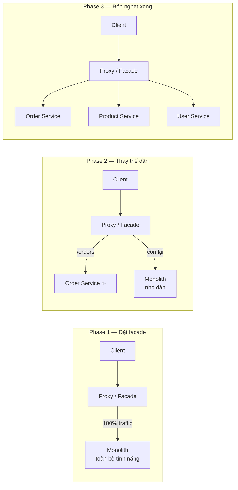
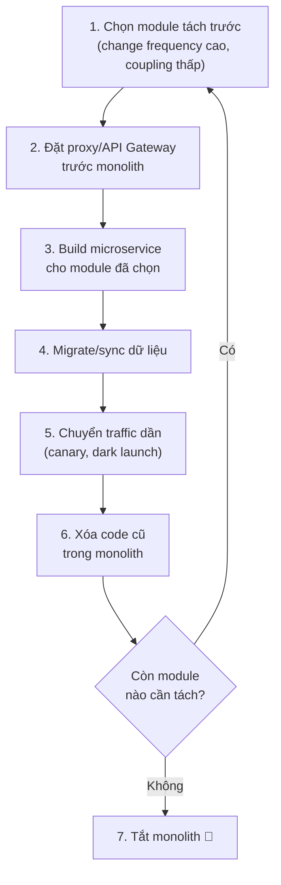
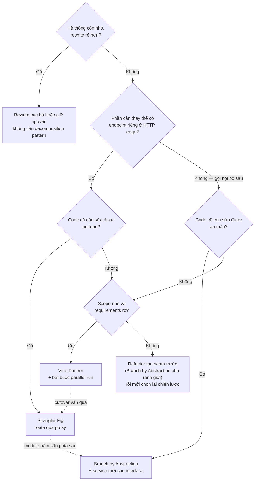
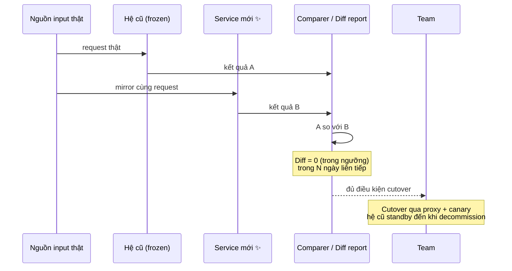

# Decomposition Patterns — Tách dần Monolith sang Microservice

## 📋 Mục lục

- [1. Giới thiệu](#1-giới-thiệu)
  - [1.1. Decomposition Patterns là gì](#11-decomposition-patterns-là-gì)
  - [1.2. Phân biệt với Decomposition Strategies](#12-phân-biệt-với-decomposition-strategies)
  - [1.3. Vì sao không Big Bang Rewrite](#13-vì-sao-không-big-bang-rewrite)
  - [1.4. Bản đồ các Decomposition Patterns](#14-bản-đồ-các-decomposition-patterns)
- [2. Strangler Fig Pattern](#2-strangler-fig-pattern)
  - [2.1. Ý tưởng](#21-ý-tưởng)
  - [2.2. Cách hoạt động từng bước](#22-cách-hoạt-động-từng-bước)
  - [2.3. Ví dụ use case — E-Commerce migration](#23-ví-dụ-use-case--e-commerce-migration)
  - [2.4. Khi nào chọn và khi nào tránh](#24-khi-nào-chọn-và-khi-nào-tránh)
  - [2.5. Trade-offs](#25-trade-offs)
  - [2.6. Lỗi thường gặp](#26-lỗi-thường-gặp)
- [3. Branch by Abstraction](#3-branch-by-abstraction)
  - [3.1. Ý tưởng](#31-ý-tưởng)
  - [3.2. Cách hoạt động từng bước](#32-cách-hoạt-động-từng-bước)
  - [3.3. Ví dụ use case — thay Payment module từ trong monolith](#33-ví-dụ-use-case--thay-payment-module-từ-trong-monolith)
  - [3.4. Khi nào chọn và khi nào tránh](#34-khi-nào-chọn-và-khi-nào-tránh)
  - [3.5. Trade-offs](#35-trade-offs)
  - [3.6. Lỗi thường gặp](#36-lỗi-thường-gặp)
- [4. Vine Pattern](#4-vine-pattern)
  - [4.1. Ý tưởng](#41-ý-tưởng)
  - [4.2. Cách hoạt động từng bước](#42-cách-hoạt-động-từng-bước)
  - [4.3. Ví dụ use case — viết lại Billing service song song](#43-ví-dụ-use-case--viết-lại-billing-service-song-song)
  - [4.4. Khi nào chọn và khi nào tránh](#44-khi-nào-chọn-và-khi-nào-tránh)
  - [4.5. Trade-offs](#45-trade-offs)
  - [4.6. Lỗi thường gặp](#46-lỗi-thường-gặp)
- [5. Bảng chọn chiến lược migration](#5-bảng-chọn-chiến-lược-migration)
  - [5.1. So sánh Big Bang, Strangler Fig, Branch by Abstraction, Vine](#51-so-sánh-big-bang-strangler-fig-branch-by-abstraction-vine)
  - [5.2. Chọn theo tình huống cụ thể](#52-chọn-theo-tình-huống-cụ-thể)
  - [5.3. Decision flow](#53-decision-flow)
- [6. Kết hợp các Decomposition Patterns](#6-kết-hợp-các-decomposition-patterns)
  - [6.1. Strangler Fig kết hợp Branch by Abstraction](#61-strangler-fig-kết-hợp-branch-by-abstraction)
  - [6.2. Strangler Fig kết hợp Feature Toggle và Canary](#62-strangler-fig-kết-hợp-feature-toggle-và-canary)
  - [6.3. Đồng bộ dữ liệu khi migrate](#63-đồng-bộ-dữ-liệu-khi-migrate)
  - [6.4. Vine kết hợp Parallel Run](#64-vine-kết-hợp-parallel-run)
  - [6.5. Bảng tổng hợp các kết hợp](#65-bảng-tổng-hợp-các-kết-hợp)
- [7. Checklist migration an toàn](#7-checklist-migration-an-toàn)
  - [7.1. Trước khi bắt đầu](#71-trước-khi-bắt-đầu)
  - [7.2. Trong khi migrate](#72-trong-khi-migrate)
  - [7.3. Sau mỗi phase](#73-sau-mỗi-phase)
- [8. Tổng kết](#8-tổng-kết)
- [9. Liên kết liên quan](#9-liên-kết-liên-quan)

---

## 1. Giới thiệu

### 1.1. Decomposition Patterns là gì

**Decomposition Patterns** (mẫu phân tách) là nhóm các pattern trả lời câu hỏi: **làm thế nào để chuyển một hệ thống Monolith sang Microservice (hoặc tách một service lớn thành nhiều service nhỏ) mà không phải dừng hệ thống, không rewrite toàn bộ, và không đánh mất khả năng rollback?**

Trong khi các nhóm pattern khác của Microservice (Data, Communication, Reliability, Deployment...) giải quyết vấn đề **vận hành** hệ thống phân tán, thì Decomposition Patterns giải quyết vấn đề **quá trình chuyển đổi** — giai đoạn mong manh nhất của một chương trình microservice hóa, nơi hệ thống cũ và mới phải **sống chung** trong một khoảng thời gian dài.

Ba pattern cốt lõi của nhóm:

| Pattern | Câu hỏi nó trả lời |
|---------|-------------------|
| **Strangler Fig** | Làm sao thay thế monolith **từng phần từ bên ngoài vào**, bằng cách điều hướng traffic? |
| **Branch by Abstraction** | Làm sao thay thế một component **từ bên trong codebase**, mà cả team vẫn merge vào main hàng ngày? |
| **Vine Pattern** | Làm sao **viết lại một khối chức năng hoàn toàn mới** song song với hệ cũ, rồi cắt dần sang? |

### 1.2. Phân biệt với Decomposition Strategies

Tài liệu [05 — Decomposition Strategies](05-decomposition-strategies.md) trả lời câu hỏi **"tách theo ranh giới nào?"** (Business Capability, Subdomain DDD, Use Case, Volatility...). Tài liệu này trả lời câu hỏi **"tách bằng cách nào, theo quy trình nào?"**.

```
Decomposition Strategies          Decomposition Patterns
(ChỌN ranh giới — WHAT/WHERE)     (THỰC HIỆN chuyển đổi — HOW)
──────────────────────────        ──────────────────────────
Business Capability               Strangler Fig
Subdomain (DDD)                   Branch by Abstraction
Use Case / User Story             Vine Pattern
Volatility / Team                 + Kỹ thuật hỗ trợ: Feature Toggle,
                                   Event Interception, Parallel Run...

        Ranh giới đúng + Quy trình đúng = Migration thành công
        Ranh giới SAI  → tách xong vẫn là Distributed Monolith
        Quy trình SAI  → downtime, mất dữ liệu, không rollback được
```

Hai tài liệu bổ trợ nhau: trước khi áp dụng bất kỳ pattern nào trong tài liệu này, bạn cần đã xác định được **bounded context** rõ ràng (xem [02 — Single Responsibility & Bounded Context](02-single-responsibility-bounded-context.md)) và chọn được module ưu tiên tách theo các tiêu chí trong [05 — Decomposition Strategies](05-decomposition-strategies.md).

### 1.3. Vì sao không Big Bang Rewrite

**Big Bang Rewrite** — viết lại toàn bộ hệ thống mới rồi switch một lần — là phương án đối lập mà mọi Decomposition Pattern đều cố tránh:

```
Big Bang Rewrite                    Incremental Migration (các pattern)
────────────────────                ─────────────────────────────────────
Viết hệ mới 100%                    Tách từng phần, mỗi phần chạy thật
    │                               ─────────────────────────────
    │ (tháng, năm...)               Part 1 live → verify → Part 2 live
    ▼                                   → verify → ...
Switch một lần                          │
    │                                   ▼
    ├── Thất bại = mất tất cả       Luôn có giá trị giao sau từng phần
    ├── Hệ cũ vẫn phải sửa bug      Fail nhỏ, rollback được từng phần
    │   (double work)               Hệ cũ nhỏ dần theo thời gian
    └── Requirements thay đổi
        trong lúc viết lại
```

Các lý do cốt lõi khiến big bang rewrite nguy hiểm:

1. **Moving target** — trong lúc đội viết hệ mới (có thể nhiều tháng, nhiều năm), business vẫn thay đổi trên hệ cũ. Đến khi hệ mới xong, nó đã lỗi thời so với requirements hiện tại.
2. **Double work** — hệ cũ vẫn phải fix bug, vẫn phải chạy production, trong khi toàn bộ effort phát triển dồn sang hệ mới.
3. **All-or-nothing** — không có cách nào verify hệ mới với traffic thật trước ngày switch. Mọi vấn đề ẩn đều bùng phát cùng một lúc.
4. **Không thể dừng giữa chừng** — nếu dự án hết ngân sách hoặc business đổi hướng, bạn không có gì để bàn giao.

> 💡 Joel Spolsky (trong bài luận kinh điển *"Things You Should Never Do"* về vụ rewrite Netscape) gọi big-bang rewrite là một trong những sai lầm tệ nhất mà một công ty phần mềm có thể mắc phải. [05 — Decomposition Strategies](05-decomposition-strategies.md#5-strangler-fig-pattern) cũng nhấn mạnh kết luận tương tự.

### 1.4. Bản đồ các Decomposition Patterns

Mỗi pattern can thiệp vào **một tầng khác nhau** của hệ thống — đây chính là chìa khóa để chọn đúng pattern (chi tiết ở [mục 5](#5-bảng-chọn-chiến-lược-migration)):

```
┌─────────────────────────────────────────────────────────────────────┐
│                    DECOMPOSITION PATTERNS MAP                       │
│                                                                     │
│  TẦNG CAN THIỆP        PATTERN              TRÁCH nhiệm chính       │
│  ──────────────        ────────              ────────────────       │
│                                                                     │
│  Routing (edge)        Strangler Fig        Điều hướng traffic      │
│  ─────────────         ─────────────        giữa monolith và        │
│  Client → [Proxy/API Gateway]              service mới              │
│              ├──▶ Microservice ✨                                   │
│              └──▶ Monolith (còn lại)                                 │
│                                                                     │
│  Code (bên trong       Branch by            Thay implementation     │
│  monolith)             Abstraction          sau một interface,      │
│  ─────────────         ──────────           caller không cần biết   │
│  Caller → [Interface] ──┬─▶ Old Impl                               │
│                         └─▶ New Impl → Service mới ✨               │
│                                                                     │
│  Song song             Vine Pattern          Viết mới hoàn toàn     │
│  (codebase mới)        ────────────          chạy cạnh hệ cũ,       │
│  ───────────           Monolith (frozen) ⟷   compare rồi cutover    │
│                        New Service ✨ (parallel run)                 │
│                                                                     │
│  KỸ THUẬT HỖ TRỢ (dùng kèm bất kỳ pattern nào):                     │
│  Feature Toggle · Canary · Dark Launching · Parallel Run            │
│  Event Interception · Asset Capture · Anti-corruption Layer         │
└─────────────────────────────────────────────────────────────────────┘
```

Ba pattern này **không loại trừ nhau** — một chương trình migration thực tế gần như luôn kết hợp nhiều pattern cùng lúc (xem [mục 6](#6-kết-hợp-các-decomposition-patterns)).

---

## 2. Strangler Fig Pattern

### 2.1. Ý tưởng

**Strangler Fig** (cây đa bóp nghẹt) là pattern migrate **từng bước** từ monolith sang microservice: đặt một lớp điều hướng (routing facade — thường là proxy hoặc API Gateway) phía trước monolith, sau đó **từng chức năng được dịch chuyển sang service mới** và traffic của chức năng đó được rẽ sang service mới. Monolith bị "bóp nghẹt" dần cho đến khi có thể tắt hẳn.

Tên pattern do **Martin Fowler** đặt (bài viết *Strangler Application*, 2004), lấy từ loại **cây strangler fig** (một loại cây leo nhiệt đới): hạt cây đa nảy mầm trên cành cây chủ, rễ khí mọc dần bao quanh thân cây chủ, dần dần thay thế hoàn toàn cây chủ — trong khi **suốt quá trình đó, cây chủ vẫn sống**.



Nguyên tắc sống còn: **hệ cũ và hệ mới cùng chạy production trong suốt quá trình chuyển đổi**, mỗi thay đổi đều nhỏ, đo lường được và rollback được.

### 2.2. Cách hoạt động từng bước



Chi tiết từng bước:

**Bước 1 — Chọn module tách trước.** Ưu tiên module thay đổi thường xuyên (high change frequency), ít phụ thuộc phần còn lại (low coupling), có business value rõ (scale riêng, deploy riêng), có boundary dữ liệu gọn. **Không** bắt đầu bằng module phức tạp nhất. Tiêu chí chọn chi tiết xem [05 — Decomposition Strategies](05-decomposition-strategies.md#7-quy-trình-phân-tách-step-by-step).

**Bước 2 — Đặt proxy trước monolith.** Giai đoạn này proxy **chỉ forward 100% request về monolith** — chưa thay đổi hành vi gì. Mục đích duy nhất: tạo ra **một điểm rẽ nhánh traffic** cho tương lai, và cho client làm quen với một entry point duy nhất (tránh tình trạng client gọi thẳng vào monolith, vô hiệu hóa khả năng strangling).

**Bước 3 — Build service mới** cho module đã chọn: implement đầy đủ chức năng, có API contract, monitoring, health check như một service production thực thụ.

**Bước 4 — Migrate hoặc sync dữ liệu** (phần khó nhất — xem [mục 6.3](#63-đồng-bộ-dữ-liệu-khi-migrate)).

**Bước 5 — Chuyển traffic dần.** Proxy route theo nhiều chiều:

| Chiều chuyển | Cách làm | Ví dụ |
|--------------|----------|-------|
| **Theo path** | Endpoint nào sẵn sàng thì route endpoint đó | `/orders/*` → Order Service; còn lại → monolith |
| **Theo % traffic** | Chuyển 1% → 5% → 25% → 50% → 100% | Canary routing (xem [14 — CI/CD](14-cicd-deployment.md)) |
| **Theo nhóm user** | Internal users trước, rồi customer thật | `X-User-Group: beta` → service mới |
| **Theo loại request** | Read (GET) trước, write (POST/PUT) sau | Giảm rủi ro sớm vì read dễ rollback hơn |

```yaml
# Ví dụ minh họa — routing rule tại proxy/API Gateway
routes:
  - path: /api/v1/orders/**
    destination: order-service        # service mới ✨
    canary:
      weight: 5                       # 5% traffic sang service mới
      fallback: monolith              # 95% còn lại về monolith
  - path: /api/v1/**                  # mọi phần khác
    destination: monolith
```

**Bước 6 — Xóa code cũ** trong monolith ngay khi traffic đã chuyển 100% và ổn định. **Không để code "chết" nằm lại** — code không xóa vẫn phải compile, test, maintain.

**Bước 7 — Lặp lại** cho đến khi monolith rỗng và bị tắt. Nếu sau nhiều phase monolith chỉ còn những phần không đáng tách, quyết định dừng và giữ lại như một "core service" cũng là một kết quả hợp lệ — miễn là đó là **quyết định có chủ đích**, không phải bỏ dở.

### 2.3. Ví dụ use case — E-Commerce migration

Một monolith e-commerce gồm `User | Product | Order | Payment | Inventory | Search` dùng chung một PostgreSQL. Kế hoạch strangling minh họa (timeline chỉ mang tính ví dụ):

```
Phase 1: Tách Search trước
  Lý do chọn: coupling thấp nhất, cần scale riêng lúc sale,
  và công nghệ phù hợp hơn (search engine thay vì SQL LIKE)
  Data sync: monolith publish event → Search service consume & index

Phase 2: Tách User/Auth
  Lý do: tái sử dụng cho SSO/OAuth2 của các app khác trong công ty

Phase 3: Tách Payment
  Lý do: compliance (PCI-DSS) — cần môi trường bảo mật riêng

Phase 4: Tách Order + Inventory cùng lúc
  Lý do: hai module coupling cao với nhau — tách riêng từng cái
  sẽ tạo nhiều call qua lại tạm thời; tách cùng đợt gọn hơn

Phase 5: Tách Product, decommission monolith
```

Sau mỗi phase: proxy route được mở rộng sang service mới, code cũ bị xóa, monolith nhỏ dần. Nếu Phase 3 (Payment) gặp vấn đề nghiêm trọng, team có thể **đóng băng kế hoạch** mà vẫn giữ nguyên mọi giá trị của Phase 1–2 — điều big bang rewrite không thể làm được.

> 💡 Kế hoạch chi tiết từng bước với đầy đủ lý do chọn module nằm ở [05 — Decomposition Strategies, mục 5.3](05-decomposition-strategies.md#53-ví-dụ-thực-tế--migrate-e-commerce-monolith).

### 2.4. Khi nào chọn và khi nào tránh

**Chọn Strangler Fig khi:**

- Monolith **đang chạy production và không được phép downtime** — hầu hết các hệ thống thật.
- Hệ thống **lớn**, không thể rewrite trong một release window.
- Đội ngũ **không thể dồn toàn lực** cho rewrite (phải vừa maintain, vừa develop feature).
- Có thể đặt proxy/API Gateway trước hệ thống (mọi traffic vào qua một entry point kiểm soát được).
- Muốn **rút ra giá trị từng phần**: mỗi module tách xong là một độc lập deploy/scale ngay.
- Cần khả năng **dừng giữa chừng** theo ưu tiên business thay đổi.

**Tránh / cân nhắc lại khi:**

- Codebase nhỏ, vài người phát triển, thời gian rewrite ngắn — chi phí dựng proxy + chạy song song có thể **cao hơn** rewrite.
- Monolith là "big ball of mud" không có ranh giới module nào rõ — mỗi "lá" bóc ra đều kéo theo cả búi dependency; cần refactor tạo seam trước (kết hợp Branch by Abstraction) hoặc cân nhắc Vine cho từng khối.
- Không kiểm soát được entry point (client cũ hardcode gọi thẳng monolith, không thể chèn proxy) — phải giải quyết tầng network trước.
- Lãnh đạo/khách hàng cần "một lần xong" và không chấp nhận trạng thái hai hệ thống song song tồn tại lâu — khi đó phải quản lý kỳ vọng hoặc chọn Vine với scope chặt.
- Toàn bộ tính năng chỉ tương tác qua **một database dùng chung** và không có cách nào tách data — tách service mà vẫn dùng chung DB là mượn hình thức microservice (xem [Distributed Monolith](17-anti-patterns.md)).

### 2.5. Trade-offs

| Ưu điểm | Nhược điểm |
|---------|------------|
| Rủi ro thấp — mỗi thay đổi nhỏ, rollback theo từng phần | Phải duy trì **hai hệ thống song song** trong thời gian dài (monolith + services) |
| Không downtime cho client — proxy che giấu quá trình chuyển đổi | Data consistency giữa hai hệ phức tạp, dễ sai |
| Business chạy bình thường trong suốt migration | Proxy layer thêm latency và một điểm lỗi mới |
| Team học dần microservice qua từng module, không cần thành thạo ngay | Tổng thời gian dài hơn big-bang *nếu* big-bang thành công |
| Có giá trị giao sau từng phase, có thể dừng bất kỳ lúc nào | Đòi hỏi kỷ luật: xóa code cũ, không cho phép "tạm để đó" |
| Kiến trúc cuối cùng được kiểm chứng bằng traffic thật ngay từ đầu | Trạng thái "nửa nạc nửa mỡ" kéo dài mãi nếu không có kế hoạch kết thúc |

### 2.6. Lỗi thường gặp

| Lỗi | Hậu quả | Cách tránh |
|-----|---------|------------|
| Tách module phức tạp/nhiều dependency nhất trước | Phase đầu sa lầy, cả chương trình mất niềm tin | Tách module coupling thấp trước để luyện quy trình |
| Service mới **dùng chung database** với monolith | Distributed monolith — tách tên nhưng không tách trách nhiệm | Mỗi service có DB riêng; sync qua event/API (xem [09 — Data Management](09-data-management.md)) |
| Không có chiến lược sync dữ liệu, "tách xong tính tiếp" | Service mới có dữ liệu thiếu/sai, phải revert khẩn cấp | Thiết kế data migration ngay ở bước 3 ([mục 6.3](#63-đồng-bộ-dữ-liệu-khi-migrate)) |
| Chuyển 100% traffic ngay khi service mới xong | Lỗi ẩn bùng phát trên toàn user | Canary + dark launching + so sánh kết quả trước khi tăng % |
| Quên xóa code cũ trong monolith | Monolith không nhỏ đi, vẫn tốn công maintain và deploy | "Xóa code cũ" là một bước bắt buộc, có checklist riêng |
| Client gọi thẳng monolith, bypass proxy | Traffic không kiểm soát được, strangling vô hiệu | Freeze các entry point cũ, ép mọi traffic qua proxy |
| Không đo lường so sánh old/new | Không biết service mới chậm hơn/sai hơn cho tới khi quá muộn | Metrics + correlation ID + so sánh kết quả song song (xem [11 — Observability](11-observability-evolvability.md)) |
| Không có kế hoạch kết thúc | "Half-strangled" vĩnh viễn — tốn chi phí hai hệ thống mãi mãi | Định nghĩa điều kiện decommission monolith ngay từ đầu |

---

## 3. Branch by Abstraction

### 3.1. Ý tưởng

**Branch by Abstraction** (tách nhánh bằng lớp trừu tượng) là kỹ thuật thay thế **một component bên trong codebase** một cách từ từ: tạo một **abstraction layer** (interface/facade) bọc lấy component sắp bị thay thế, đưa toàn bộ caller gọi qua abstraction đó, rồi swap implementation từ cũ sang mới — tất cả diễn ra **trên main branch**, không cần branch Git dài hạn.

> ⚠️ **Hiểu lầm phổ biến nhất**: "Branch" ở đây **không phải Git branch**. Nhánh được nói đến là **nhánh rẽ implementation nằm sau abstraction** — code cũ và code mới cùng tồn tại trong main branch, phân tách nhau bằng cấu hình/feature flag. Đây là kỹ thuật gắn với tư tưởng **Continuous Delivery** và **trunk-based development** (được biết đến rộng rãi qua cuốn *Continuous Delivery* của Jez Humble & David Farley và các bài viết của Paul Hammant).

Strangler Fig thao tác ở **tầng routing bên ngoài** (HTTP, proxy). Branch by Abstraction thao tác ở **tầng code bên trong** — dùng khi phần cần thay thế **không tương ứng với một endpoint** để route, mà là một module/class nằm sâu mà nhiều chỗ gọi trực tiếp.

### 3.2. Cách hoạt động từng bước

```
Phase 0 — Trước: caller gọi trực tiếp implementation cũ
┌────────────────────────────────────────────┐
│ Caller A ──┐                               │
│ Caller B ──┼──▶ ┌───────────────────────┐  │
│ Caller C ──┘    │ LegacyPaymentModule   │  │
│                 │ (code cũ, cần thay)   │  │
│                 └───────────────────────┘  │
└────────────────────────────────────────────┘

Phase 1 — Tạo abstraction, implementation cũ đứng sau nó
┌────────────────────────────────────────────┐
│ Caller A ──┐                               │
│ Caller B ──┼──▶ ┌───────────────────────┐  │
│ Caller C ──┘    │ «interface»           │  │
│                 │ PaymentProcessor      │  │
│                 └──────────┬────────────┘  │
│                            ▼               │
│                 ┌───────────────────────┐  │
│                 │ LegacyPaymentModule   │  │
│                 └───────────────────────┘  │
└────────────────────────────────────────────┘

Phase 2 — Refactor từng caller qua abstraction (mỗi bước đều deploy được)
┌────────────────────────────────────────────┐
│ Caller A ──▶ PaymentProcessor ◀── Caller B  │
│ Caller C ──▶ PaymentProcessor (đang dở)     │
└────────────────────────────────────────────┘

Phase 3 — Thêm implementation mới; feature flag quyết định chạy impl nào
┌────────────────────────────────────────────┐
│             PaymentProcessor               │
│                 ┌──────┴──────┐            │
│        flag = old     flag = new           │
│                 ▼            ▼             │
│      ┌──────────────┐  ┌────────────────┐  │
│      │ Legacy Impl  │  │ New Impl       │  │
│      │              │  │ → gọi Payment  │  │
│      │              │  │   Service ✨    │  │
│      └──────────────┘  └────────────────┘  │
└────────────────────────────────────────────┘

Phase 4 — Chuyển flag dần (theo %, theo cohort), verify từng bước

Phase 5 — Dọn dẹp: xóa Legacy Impl, xóa luôn abstraction nếu không còn cần
┌────────────────────────────────────────────┐
│ Caller A/B/C ──▶ New Impl ──▶ Payment Svc  │
└────────────────────────────────────────────┘
```

Các nguyên tắc quan trọng:

1. **Mọi phase đều deployable** — không có "big merge", không có tháng-long lock. Phase 1, 2 không thay đổi hành vi; Phase 3 thêm code mới nhưng flag mặc định tắt.
2. **Refactor caller theo từng phần một** — caller nào chưa xong vẫn gọi code cũ qua abstraction; đây là lý do pattern dùng được cho codebase hàng trăm call sites.
3. **Switch bằng configuration, không bằng deploy** — dùng feature flag; bật cho 1% traffic, verify, tăng dần, rollback = tắt flag (xem [Feature Toggle trong 14 — CI/CD](14-cicd-deployment.md)).
4. **Thiết kế abstraction theo capability mới**, không "chụp ảnh" interface cũ — nếu interface mới chỉ là bản sao method-by-method của code cũ, service mới sẽ bị khóa chặt vào legacy design.
5. **Kế hoạch dọn dẹp ngay từ đầu** — implementation cũ và bản thân abstraction đều là nợ tạm thời; ghi rõ điều kiện và thời hạn xóa.

Với những abstraction lớn, có thể dùng biến thể **breaker/router**: interface tách thành nhiều method, mỗi method route độc lập (`getBalance` đã sang impl mới, `chargeCard` vẫn ở impl cũ) — cho phép thay thế từng tính năng, không phải cả khối một lần.

### 3.3. Ví dụ use case — thay Payment module từ trong monolith

Trong một monolith Java/Node, `OrderController`, `RefundJob` và `SubscriptionRenewal` đều gọi trực tiếp class `LegacyPaymentGateway` (gọi thẳng SDK của cổng thanh toán, chưa tách service). Team muốn đưa payment vào một Payment Service riêng để phục vụ compliance — nhưng module này **không có endpoint HTTP riêng** trong monolith để proxy route được: nó được gọi từ bên trong. → Strangler Fig (tầng routing) không tác nghiệp được → dùng Branch by Abstraction.

```java
// Bước 1 — Abstraction mô tả CAPABILITY, không copy interface cũ
public interface PaymentProcessor {
    PaymentResult charge(PaymentRequest request);
    RefundResult refund(String transactionId, Money amount);
}

// Implementation cũ — bọc lại code hiện có, chưa đổi logic
public class LegacyPaymentAdapter implements PaymentProcessor { ... }

// Implementation mới — gọi Payment Service (đã được build song song)
public class PaymentServiceClient implements PaymentProcessor { ... }

// Caller không biết gì về hai implementation
public class OrderController {
    private final PaymentProcessor payment;   // inject theo flag
    ...
}
```

Trình tự triển khai thực tế:

1. Tạo `PaymentProcessor`, để `LegacyPaymentAdapter` implement nó — deploy, không đổi hành vi.
2. Sửa từng caller (OrderController → RefundJob → SubscriptionRenewal) inject interface thay vì class cụ thể — mỗi caller là một PR, deploy độc lập.
3. Build Payment Service mới + `PaymentServiceClient`; flag `payment.use_new_service` mặc định `false`.
4. Bật flag cho internal account → so sánh kết quả (log both, diff response) → tăng dần → 100%.
5. Xóa `LegacyPaymentAdapter` và các SDK cũ khỏi monolith; sau một thời gian ổn định, thu gọn interface nếu cần.

Kết quả: cả quá trình **không có ngày "big release" nào cả** — chỉ có hàng loạt deploy nhỏ, mỗi deploy đều an toàn và rollback được trong phút.

### 3.4. Khi nào chọn và khi nào tránh

**Chọn Branch by Abstraction khi:**

- Phần cần thay thế nằm **sâu trong codebase**, được gọi nội bộ từ nhiều chỗ — không có endpoint để route từ proxy.
- Team thực hành **trunk-based development**, muốn mọi thay đổi merge vào main liên tục, không tạo long-lived branch.
- Cần thay thế **từ từ**: vừa refactor caller, vừa build implementation mới song song.
- Áp dụng được cho nhiều loại thay đổi: bóc module sang service mới, đổi thư viện/SDK, đổi ORM, thay một external provider — bất cứ chỗ nào có "một thứ bị nhiều chỗ gọi".

**Tránh / cân nhắc lại khi:**

- Phần cần thay thế **chính là một nhóm HTTP endpoint** ở biên hệ thống — Strangler Fig qua proxy đơn giản hơn nhiều, không cần sửa code caller.
- Chỉ có **một hai call site** — refactor trực tiếp rẻ hơn chi phí dựng abstraction + flag + dọn dẹp.
- Caller **không kiểm soát được** (code của team khác, hệ bên ngoài, code generated) — không thể đưa họ gọi qua abstraction.
- Team **không thể deploy thường xuyên** — bản chất pattern là chuỗi release nhỏ liên tục; deploy quý một lần thì lợi thế biến mất.
- Abstraction bị thiết kế theo interface cũ (xem lỗi thường gặp bên dưới) — khi đó pattern chỉ giúp "kéo dài tuổi thọ" cho thiết kế legacy.

### 3.5. Trade-offs

| Ưu điểm | Nhược điểm |
|---------|------------|
| Thay thế từ từ, mọi bước deploy được, không big-bang merge | Thêm **indirection tạm thời** — code phình ra trong giai đoạn chuyển tiếp |
| Không long-lived branch → tránh "merge hell" | Cần **kỷ luật dọn dẹp**: implementation cũ + abstraction phải bị xóa, dễ trở thành nợ vĩnh viễn |
| Trước tác được với phần nằm sâu trong code (nơi Strangler Fig bất lực) | Refactor hàng loạt caller tốn thời gian với codebase lớn |
| Kết hợp tự nhiên với feature flag → rollback tức thời | Abstraction phải "đủ rộng" cho hai implementation — thiết kế sai là phải làm lại |
| Áp dụng cho nhiều loại thay thế, không chỉ tách service | Giai đoạn hai implementation song song = gấp đôi surface test |

### 3.6. Lỗi thường gặp

| Lỗi | Hậu quả | Cách tránh |
|-----|---------|------------|
| Hiểu "branch" là Git branch, tạo branch dài hạn | Mất hoàn toàn lợi thế của pattern, merge hell quay lại | Toàn bộ thay đổi trên main, tách bằng flag |
| Thiết kế interface = bản sao method của code cũ | Service mới bị khóa vào legacy design, khó evolve | Abstract theo **capability/intent** (charge, refund), không theo implementation |
| Quên xóa implementation cũ sau khi chuyển xong | Nợ kép: abstraction + code chết cùng tồn tại mãi | Đặt deadline dọn dẹp ngay trong kế hoạch; checklist phase cuối |
| Quản lý flag thủ công bằng file config deploy kèm code | Bật/tắt chậm, rollback chậm | Dùng feature flag platform/config server (xem [16 — Configuration](16-configuration-secrets-management.md)) |
| Switch 100% ngay không có giai đoạn verify | Lỗi runtime trên toàn traffic | Bật theo cohort/%, log-and-compare trước khi full |
| Không test cả hai implementation trong giai đoạn song song | Impl mới fail ở case mà impl cũ xử lý được | Contract test chung cho cả hai impl |
| Để abstraction "rò rỉ" chi tiết của hệ cũ (exception riêng, kiểu dữ liệu riêng của SDK cũ) | Caller vẫn phụ thuộc legacy qua cửa sau | Abstraction chỉ exposes domain concept của chính nó |

---

## 4. Vine Pattern

### 4.1. Ý tưởng

**Vine Pattern** là cách tiếp cận **viết một khối chức năng hoàn toàn mới từ đầu** (dựa trên requirements đã biết) chạy **song song** với phần tương ứng trong monolith — thay vì cố bóc nhánh từng phần code ra khỏi monolith như Strangler Fig, hay swap từng implementation như Branch by Abstraction.

```
Strangler Fig:   bóc từ monolith ra  →  monolith nhỏ dần
Branch by Abst.: thay ruột bên trong →  cùng codebase, đổi implementation
Vine Pattern:    mọc song song       →  codebase MỚI, không đụng code cũ
```

Vì không phải "giải phẫu" monolith, Vine phù hợp với những khu vực mà code cũ **không đáng hoặc không thể sửa** — nhưng đổi lại rủi ro chuyển sang phía **thiếu hiểu biết về hệ thống cũ** (behavior ẩn, edge case chìm), nên bắt buộc phải chạy parallel và so sánh trước khi cutover.

> 💡 **Lưu ý về tên gọi**: "Strangler Fig" và "Branch by Abstraction" là tên được chuẩn hóa rộng rãi. "Vine Pattern" thì không — một số tài liệu khác dùng hình ảnh "vine" (cây leo) để chỉ chính Strangler Fig (vì strangler fig cũng là một loại cây leo). Trong bộ tài liệu này, **Vine Pattern được hiểu theo nghĩa: viết mới song song (parallel rebuild)** — phân biệt rõ với Strangler Fig (bóc dần) để dùng khi so sánh chiến lược ở [mục 5](#5-bảng-chọn-chiến-lược-migration).

### 4.2. Cách hoạt động từng bước

```
Bước 1 — CHỐT SCOPE
   Chọn MỘT functional area có boundary rõ, viết lại được độc lập.
   Scope phải nhỏ — đây là điều kiện sống còn của Vine.

Bước 2 — ĐÓNG BĂN MONOLITH (freeze)
   Phần cũ NGỪNG nhận feature mới. Bug fix critical vẫn cho phép,
   mọi thay đổi khác chuyển sang codebase mới.

Bước 3 — BUILD SERVICE MỚI theo requirements hiện tại
   Thiết kế data model mới, API mới, test mới.
   Không sao chép thiết kế cũ khi không có lý do.

Bước 4 — PARALLEL RUN (giai đoạn quyết định thành bại)
   Cả hai cùng nhận input thật; kết quả mới được so sánh với cũ.
   Diff rate = 0 (hoặc trong ngưỡng chấp nhận) mới được sang bước 5.

Bước 5 — BACKFILL + CUTOVER dữ liệu
   Chuyển dữ liệu lịch sử, chuyển traffic qua service mới
   (thường vẫn qua proxy như Strangler Fig để canary/rollback).

Bước 6 — DECOMMISSION phần cũ
   Tắt hẳn phần monolith tương ứng — hoặc để "frozen" nếu vẫn
   cần cho mục đích tra cứu có thời hạn.
```

Điểm khác biệt về quản trị rủi ro: Strangler Fig rủi ro dồn vào **mỗi lần chuyển traffic** (nhưng nhỏ, lặp lại nhiều lần); Vine rủi ro dồn vào **một cutover lớn** — nên giai đoạn parallel run chính là cơ chế bù rủi ro, không được coi là tùy chọn.

### 4.3. Ví dụ use case — viết lại Billing service song song

Một hệ thống quản lý khách sạn có module Billing viết trên nền code kế thừa: không unit test, không ai hiểu hết flow, logic chia tách nằm rải rác giữa stored procedure và code. Team cần bổ sung mô hình pricing mới (dynamic pricing theo mùa) mà code cũ không chịu được.

**Phân tích lựa chọn:**

- Strangler Fig bóc Billing ra? — Billing nằm sâu, được gọi trực tiếp từ Reservation, Housekeeping, Report... không có endpoint riêng để proxy route.
- Branch by Abstraction? — phải refactor được code cũ qua interface; nhưng code cũ không có test, sửa một chỗ gãy ba chỗ, rủi ro refactoring cao.
- **Vine** — viết Billing service mới với data model và pricing engine mới; hệ cũ đóng băng.

```
┌───────────────────────────────────────────────────────────────┐
│ GIAI ĐOẠN PARALLEL RUN                                        │
│                                                               │
│   Reservation ──▶ Monolith Billing (FROZEN) ──▶ Invoice A     │
│        │                                    ──▶ Report        │
│        │                                                      │
│        └────▶ (mirror input) ──▶ Billing Service ✨           │
│                                    └──▶ Invoice B             │
│                                                               │
│   Comparer: so sánh A vs B từng ngày                          │
│   ├── Diff ≠ 0 → điều tra: bug mới? hay behavior ẩn của cũ?   │
│   └── Diff = 0 trong N ngày liên tiếp → đủ điều kiện cutover  │
└───────────────────────────────────────────────────────────────┘
```

Điều thú vị thường xảy ra: các khác biệt giữa A và B không luôn là bug của hệ mới — một phần là **behavior ẩn của hệ cũ** (rounding riêng, miễn phí đặc biệt cho khách VIP cũ...) mà không ai còn nhớ. Parallel run chính là công cụ **khai quật requirements bị lãng quên**. Sau khi cutover, mô hình pricing mới chỉ code trong Billing Service — monolith không bao giờ phải biết.

### 4.4. Khi nào chọn và khi nào tránh

**Chọn Vine Pattern khi:**

- Code khu vực đó **không thể sửa an toàn** — không test, không tài liệu, người hiểu đã rời đi, chi phí refactoring cao hơn viết lại.
- **Scope nhỏ và requirements tương đối rõ ràng, ổn định** — không phải vùng business thay đổi mỗi tháng.
- Cần thay đổi **luôn cả data model / tech stack** (SQL phẳng → event-driven, stored procedure → service code) — bóc từng phần không mang lại lợi thế.
- Có **yêu cầu cắt khối theo thời hạn** (compliance, end-of-life platform) — Vine cho tiến độ dễ dự đoán hơn khi code cũ không thể kéo dài.
- Monolith quá tệ đến mức mọi con đường "giải phẫu" đều đắt hơn "mọc cây mới".

**Tránh / cân nhắc lại khi:**

- **Scope lớn hoặc mơ hồ** — Vine khi đó biến tướng thành big-bang rewrite trá hình, hội đủ mọi rủi ro ở [mục 1.3](#13-vì-sao-không-big-bang-rewrite).
- Không ai còn đủ **domain knowledge** để biết hệ cũ làm gì — parallel run sẽ không kết thúc được vì không thể phân xử các khác biệt.
- Hệ cũ vẫn **thay đổi liên tục** — target di chuyển; code mới mãi đuổi theo behavior mới của code cũ.
- Không có năng lực vận hành song song hai hệ (cost infra, monitor, on-call).
- Chỉ cần tách bớt để giảm deploy friction — khi đó Strangler Fig phần "dễ bóc" là đủ, không cần viết lại.

### 4.5. Trade-offs

| Ưu điểm | Nhược điểm |
|---------|------------|
| Không phải giải phẫu code cũ rủi ro cao — viết trên nền sạch | Rủi ro **bỏ sót behavior ẩn** của hệ cũ (edge case không ai nhớ) |
| Thiết kế mới ngay từ đầu — data model, API, tech stack hiện đại | Phải parallel run + so sánh kết quả: tốn infra và công sức phân tích diff |
| Tốc độ phát triển ban đầu nhanh (không vác di sản code) | **Backfill dữ liệu lịch sử** phức tạp, cần idempotent và có thể chạy lại |
| Tiến độ dễ dự đoán khi scope chốt rõ | Scope creep là sát thủ số một — dễ phình thành rewrite toàn bộ |
| Hệ cũ freeze → ít bug mới phát sinh từ vùng này | Hai hệ song song tăng chi phí vận hành trong suốt giai đoạn chuyển tiếp |
| Không xung đột code với các team đang sửa monolith | Cutover vẫn là một bước lớn — cần proxy + canary để giảm rủi ro |

### 4.6. Lỗi thường gặp

| Lỗi | Hậu quả | Cách tránh |
|-----|---------|------------|
| Scope creep — "tiện tay viết lại luôn cả phần kề bên" | Trở thành big-bang rewrite không ai gọi tên | Chốt scope bằng văn bản, mọi mở rộng phải qua quyết định riêng |
| Cutover không parallel run | Behavior ẩn bùng phát trên production | Parallel run với ngưỡng diff được định trước là điều kiện bắt buộc |
| Coi mọi khác biệt là "bug của hệ mới" | Vô tình xóa behavior có chủ đích của hệ cũ (khuyến mãi cũ, rounding...) | Điều tra từng diff; cập nhật requirements chứ không chỉ sửa code |
| Backfill chạy một lần rồi thôi, không retry/verify | Dữ liệu lệch giữa hai hệ khi phải chạy lại sau lỗi | Thiết kế backfill idempotent, có báo cáo đối chiếu số liệu |
| Không có kế hoạch decommission hệ cũ | "Tạm giữ thế giới cũ để phòng khi cần" → song song vĩnh viễn | Đặt ngày tắt và tiêu chí kích hoạt tắt ngay khi bắt đầu |
| Đóng băng hệ cũ trên giấy nhưng vẫn merge feature vào đó | Hai hệ cùng evolve, parallel run không bao giờ hội tụ | Freeze thật sự — quy trình review chặn thay đổi ngoài bug fix critical |
| Không có proxy trước cutover | Không canary, không rollback nhanh khi sai | Cutover vẫn đi qua routing layer như Strangler Fig |

---

## 5. Bảng chọn chiến lược migration

### 5.1. So sánh Big Bang, Strangler Fig, Branch by Abstraction, Vine

| Tiêu chí | Big Bang Rewrite | Strangler Fig | Branch by Abstraction | Vine Pattern |
|----------|------------------|---------------|----------------------|--------------|
| **Tư duy** | Viết lại toàn bộ, switch một lần | Bóc dần từ ngoài vào qua routing | Đổi ruột từ trong qua interface | Viết mới song song rồi cutover |
| **Tầng can thiệp** | Codebase mới hoàn toàn | Proxy/API Gateway (HTTP edge) | Code bên trong monolith | Codebase mới cho một khối |
| **Hệ cũ trong quá trình chuyển** | Chạy đến ngày switch | Nhỏ dần từng phase | Vẫn chạy, đổi impl sau interface | Đóng băng (frozen) |
| **Rủi ro** | Rất cao | Thấp | Thấp | Trung bình — cao |
| **Giá trị đầu tiên** | Chỉ ở cuối dự án | Sau module đầu tiên | Sau lần switch đầu | Nhanh — nếu scope nhỏ |
| **Downtime** | Có (cửa sổ chuyển đổi) | Không | Không | Không (chỉ cutover có kiểm soát) |
| **Rollback** | Rất khó (một điểm không trở lại) | Theo từng module/phase | Tắt feature flag | Về proxy quay lại hệ cũ (trước khi decommission) |
| **Data migration** | Một lần, khổng lồ | Từng phần + sync song song | Có thể giữ nguyên ở bước đầu | Backfill + parallel run |
| **Yêu cầu tổ chức** | Đội riêng, dài hạn, kỳ vọng "big release" | Kỷ luật chạy song song lâu dài | Deploy liên tục, trunk-based | Kỷ luật freeze + phân tích diff |
| **Phù hợp quy mô hệ thống** | Nhỏ (thật sự nhỏ) | Lớn, phức tạp, còn evolve | Trung bình — lớn, code còn sửa được | Khối nhỏ, code cũ không sửa được |

### 5.2. Chọn theo tình huống cụ thể

| Tình huống | Chiến lược nên dùng | Lý do |
|-----------|---------------------|-------|
| Monolith lớn, đang chạy production, cần tách dần không downtime | **Strangler Fig** | Rủi ro thấp nhất, giá trị từng phần |
| Module cần tách nằm sâu, nhiều class gọi nội bộ, không có endpoint riêng | **Branch by Abstraction** (+ service mới phía sau) | Proxy không route được tầng internal call |
| Cần tách một nhóm endpoint rõ ràng (`/search/*`) | **Strangler Fig** | Route theo path là trường hợp chuẩn |
| Code khu vực đó không thể sửa an toàn (không test, không hiểu, lỗi thời) | **Vine** + parallel run | Refactor/phân tích code cũ đắt hơn viết mới |
| Muốn đổi thư viện/ORM/provider bên trong nhưng vẫn một codebase | **Branch by Abstraction** | Chính là use case gốc của kỹ thuật này |
| Đội nhỏ, codebase nhỏ, feature freeze được vài tuần | Cân nhắc **rewrite cục bộ** (hoặc không tách) | Chi phí vận hành pattern > lợi ích |
| Cần dịch chuyển traffic theo % + rollback nhanh cho mọi bước | Pattern nào thì cũng cần **Feature Toggle + Canary** | Cơ chế vận hành dùng kèm mọi pattern |
| Đồng bộ data giữa monolith và service mới | **Event Interception / Asset Capture** | Kỹ thuật hỗ trợ (mục 6.3) |
| Service mới cần validate với traffic thật trước khi nhận trách nhiệm | **Dark Launching / Parallel Run** | So sánh kết quả trước khi rủi ro thật |
| Monolith không có ranh giới module nào rõ | Refactor tạo seam trước (BbA) rồi mới strangling | Bóc khi không có vết cắt = xé cả khối |

### 5.3. Decision flow



Ba lưu ý khi đọc flow:

1. Các kết quả **không loại trừ nhau** — cùng một chương trình migration có thể đồng thời: strangling phần ngoài (proxy), branch-by-abstraction phần sâu, vine cho một khối chết.
2. Câu hỏi "code cũ còn sửa được an toàn?" thường trả lời bằng: có test không? có người hiểu không? refactor nhỏ có dính lỗi không?
3. Với mọi nhánh, **cơ chế vận hành** (toggle, canary, monitoring, data sync) là bắt buộc — xem [mục 6](#6-kết-hợp-các-decomposition-patterns).

---

## 6. Kết hợp các Decomposition Patterns

### 6.1. Strangler Fig kết hợp Branch by Abstraction

Đây là cặp phổ biến nhất: proxy lo phần **endpoint nhìn thấy từ ngoài**, abstraction lo phần **cuộc gọi nội bộ còn sót lại**.

Tình huống điển hình — tách Order module:

```
Bước 1 — Proxy route /orders/** → Order Service (Strangler, tầng ngoài)

Bước 2 — Nhưng bên trong monolith, các module khác (Report, Marketing...)
        vẫn gọi trực tiếp OrderService class (gọi nội bộ, không qua HTTP!)

        Report module ──▶ OrderService class ──▶ cùng DB

Bước 3 — Branch by Abstraction cho phần nội bộ này:

        Report module ──▶ IOrderService ──┬─▶ OldOrderService (legacy)
                                         └─▶ OrderServiceClient
                                              → gọi Order Service qua API ✨

Bước 4 — Xóa OldOrderService + bảng orders khỏi monolith
```

> 💡 Nguyên tắc: **một khi module đã được tách thành service, mọi truy cập còn lại trong monolith phải đi qua abstraction (rồi dần qua API/event của service)** — không để hai đường tiếp cận dữ liệu cùng sống mãi.

### 6.2. Strangler Fig kết hợp Feature Toggle và Canary

Proxy quyết định traffic đi đâu — quyết định đó nên là **feature flag**, không phải config hardcode trong lần deploy:

| Khả năng có được | Nhờ cơ chế | Chi tiết |
|------------------|------------|----------|
| Bật/tắt route không deploy lại | Feature flag tại proxy | [16 — Configuration](16-configuration-secrets-management.md) |
| Chuyển 1% → 5% → 50% traffic | Canary / weighted routing | [14 — CI/CD](14-cicd-deployment.md) |
| Service mới "chạy thật" nhưng kết quả bị bỏ (so sánh ngầm) | Dark launching | [05 — Decomposition Strategies](05-decomposition-strategies.md#54-kỹ-thuật-hỗ-trợ-strangler-fig) |
| Rollback trong vài phút | Tắt flag, traffic về monolith | [10 — Resilience](10-resilience-patterns.md) cho hành vi khi service mới lỗi |
| So sánh old/new cùng request | Correlation ID + shadow logging | [11 — Observability](11-observability-evolvability.md) |

### 6.3. Đồng bộ dữ liệu khi migrate

Phần khó nhất của mọi decomposition pattern: **dữ liệu không thể "route" như traffic** — nó phải nhất quán ở cả hai nơi trong giai đoạn chuyển tiếp.

| Kỹ thuật | Cách hoạt động | Khi nào dùng |
|----------|----------------|--------------|
| **Event Interception** | Monolith publish event mỗi khi data đổi; service mới subscribe và cập nhật bản sao của mình | Service mới cần **đọc** data của monolith (search index, read model) |
| **Asset Capture** | Service mới nhận trách nhiệm **ghi** trước; monolith còn đọc từ data cũ trong giai đoạn chuyển | Migrate data lớn không thể chuyển một lần; tách trách nhiệm write/read |
| **Dual-write có kiểm soát** | Cả hai cùng ghi, có cơ chế đối soát (reconciliation) | Giai đoạn ngắn, có job đối chiếu — không dual-write "trần" không đối soát |
| **Backfill + CDC** | Copy dữ liệu lịch sử một lần, rồi stream thay đổi (Change Data Capture) giữ hai phía hội tụ | Vine cutover; dịch chuyển bảng lớn |

Nguyên tắc bất di bất dịch: **ngăn service mới và monolith cùng ghi một bảng trong shared database dài hạn** — đó là con đường ngắn nhất tới Distributed Monolith và mất khả năng decommission (chi tiết data patterns: [09 — Data Management](09-data-management.md); Transactional Outbox để publish event đáng tin cậy: [17 — Data Patterns](17-data-patterns.md)).

### 6.4. Vine kết hợp Parallel Run

Với Vine, parallel run **không phải tùy chọn** mà là cơ chế kiểm soát rủi ro cốt lõi:



### 6.5. Bảng tổng hợp các kết hợp

| Kết hợp | Giải quyết vấn đề gì | Ở đâu trong tài liệu |
|---------|----------------------|----------------------|
| Strangler Fig + Branch by Abstraction | Module có cả endpoint ngoài lẫn caller nội bộ sâu | [6.1](#61-strangler-fig-kết-hợp-branch-by-abstraction) |
| Strangler Fig + Feature Toggle/Canary | Chuyển traffic có kiểm soát, rollback nhanh | [6.2](#62-strangler-fig-kết-hợp-feature-toggle-và-canary) |
| Strangler/Vine + Event Interception/CDC | Đồng bộ data hai chiều trong chuyển tiếp | [6.3](#63-đồng-bộ-dữ-liệu-khi-migrate) |
| Vine + Parallel Run + Dark Launching | Kiểm chứng hệ mới trước cutover lớn | [6.4](#64-vine-kết-hợp-parallel-run) |
| Branch by Abstraction + Contract Test | Hai implementation cùng tuân theo cùng hành vi | [3.6](#36-lỗi-thường-gặp) |
| Decomposition + Anti-corruption Layer | Service mới không nhiễm model của hệ cũ | [02 — Bounded Context](02-single-responsibility-bounded-context.md) |

---

## 7. Checklist migration an toàn

### 7.1. Trước khi bắt đầu

```
□ Chọn đúng module đầu tiên (change frequency cao, coupling thấp,
  boundary data rõ) — xem 05-decomposition-strategies.md
□ Đo baseline: latency, error rate, throughput hiện tại của module
□ Có entry point kiểm soát được (proxy/API Gateway) trước monolith
□ Thiết kế chiến lược data migration/sync từ đầu (không "tính sau")
□ Định nghĩa điều kiện kết thúc: khi nào monolith bị tắt?
□ Định nghĩa điều kiện dừng: khi nào cho phép đóng băng chương trình?
□ Chốt cách rollback cho từng bước chuyển traffic
□ Quyết định pattern chính theo decision flow (mục 5.3)
   và các pattern phụ (mục 6) bằng văn bản
```

### 7.2. Trong khi migrate

```
□ Service mới có monitoring, health check, correlation ID
   ngang tầm service production bình thường
□ Dark launch / canary trước mỗi lần tăng traffic
□ Log-and-compare kết quả old/new cho các flow quan trọng
□ Feature flag điều khiển routing — không hardcode trong deploy
□ Circuit breaker + timeout cho mọi call qua lại
   giữa monolith và service mới
□ Dữ liệu hai phía có job đối soát (reconciliation) định kỳ
□ Bảng trạng thái migration được cập nhật sau mỗi phase
   (module nào đã tách, đang tách, còn lại)
```

### 7.3. Sau mỗi phase

```
□ Code cũ của module vừa tách đã XÓA khỏi monolith
  (không phải chỉ "không dùng")
□ Test monolith cập nhật — không còn test chạy vào code đã xóa
□ Docs/API reference cập nhật theo service mới
□ Người gọi nội bộ còn sót đã chuyển qua API/event của service mới
□ Vận hành/on-call cập nhật: service mới vào pager, runbook
□ Kinh nghiệm phase này ghi lại — quy trình phase sau tốt hơn
```

---

## 8. Tổng kết

```
┌─────────────────────────────────────────────────────────────────────┐
│              DECOMPOSITION PATTERNS — KEY TAKEAWAYS                 │
│                                                                     │
│  1. MIGRATE DẦN, KHÔNG BIG BANG                                     │
│     Mọi pattern trong nhóm này tồn tại để thay big-bang rewrite     │
│     bằng chuỗi thay đổi nhỏ, đo được, rollback được.                │
│                                                                     │
│  2. CHỌN PATTERN THEO TẦNG CAN THIỆP                                │
│     • Endpoint ngoài, route được  → Strangler Fig (proxy)           │
│     • Component sâu, caller nội bộ → Branch by Abstraction          │
│     • Code không sửa được, scope nhỏ→ Vine + parallel run           │
│                                                                     │
│  3. "BRANCH" KHÔNG PHẢI GIT BRANCH                                  │
│     Branch by Abstraction rẽ implementation sau interface,         │
│     mọi thứ vẫn merge vào main hàng ngày.                           │
│                                                                     │
│  4. DATA LÀ PHẦN KHÓ NHẤT                                           │
│     Traffic route được ngay; dữ liệu phải sync, đối soát,           │
│     backfill — và tuyệt đối tránh shared database dài hạn.          │
│                                                                     │
│  5. CÁC PATTERN KẾT HỢP NHAU, KHÔNG LOẠI TRỪ NHAU                   │
│     Strangler + BbA + Toggle + Canary + Event Interception          │
│     là bộ hay gặp nhất của một chương trình migration thật.         │
│                                                                     │
│  6. CÓ KẾ HOẠCH KẾT THÚC                                            │
│     "Half-strangled monolith" chạy mãi là thất bại không ai         │
│     thừa nhận. Điều kiện tắt monolith định nghĩa từ ngày đầu.       │
└─────────────────────────────────────────────────────────────────────┘
```

---

## 9. Liên kết liên quan

- [01 — Microservice Overview](01-microservice-overview.md) — Tổng quan kiến trúc Microservice
- [02 — Single Responsibility & Bounded Context](02-single-responsibility-bounded-context.md) — Xác định ranh giới service trước khi tách
- [03 — Loose Coupling & High Cohesion](03-loose-coupling-high-cohesion.md) — Nguyên tắc thiết kế ranh giới
- [05 — Decomposition Strategies](05-decomposition-strategies.md) — Chọn ranh giới tách: Business Capability, DDD, quy trình 6 bước, kế hoạch e-commerce chi tiết
- [06 — Inter-Service Communication](06-inter-service-communication.md) — Service mới gọi/nhận gọi bằng gì sau khi tách
- [07 — API Gateway](07-api-gateway.md) — Xây dựng routing facade cho Strangler Fig
- [09 — Data Management](09-data-management.md) — Saga, CQRS, Event Sourcing và đồng bộ dữ liệu phân tán
- [10 — Resilience Patterns](10-resilience-patterns.md) — Circuit Breaker, Retry cho các call qua lại giữa hai hệ
- [11 — Observability & Evolvability](11-observability-evolvability.md) — Correlation ID, tracing khi so sánh old/new
- [14 — CI/CD & Deployment](14-cicd-deployment.md) — Feature Toggle, Canary, Blue-Green
- [16 — Configuration & Secrets Management](16-configuration-secrets-management.md) — Quản lý feature flag an toàn
- [17 — Design Patterns](17-design-patterns.md) — Bản đồ tổng thể tất cả các nhóm pattern trong Microservice
