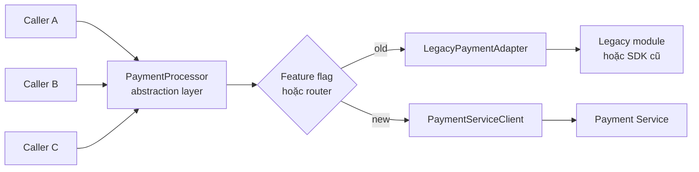

# Branch by Abstraction Pattern

## Mục lục

- [Tổng quan](#tổng-quan)
  - [Branch by Abstraction là gì](#branch-by-abstraction-là-gì)
  - [Branch không phải Git branch](#branch-không-phải-git-branch)
  - [Phạm vi của pattern](#phạm-vi-của-pattern)
- [Kiến trúc và cơ chế hoạt động](#kiến-trúc-và-cơ-chế-hoạt-động)
  - [Abstraction layer đứng ở đâu](#abstraction-layer-đứng-ở-đâu)
  - [Trạng thái trước khi tách](#trạng-thái-trước-khi-tách)
  - [Trạng thái sau khi thêm abstraction layer](#trạng-thái-sau-khi-thêm-abstraction-layer)
  - [Triển khai song song](#triển-khai-song-song)
  - [Chuyển implementation bằng feature flag](#chuyển-implementation-bằng-feature-flag)
  - [Nguyên tắc thiết kế abstraction](#nguyên-tắc-thiết-kế-abstraction)
- [Các bước migration](#các-bước-migration)
  - [Xác định capability và baseline](#xác-định-capability-và-baseline)
  - [Tạo abstraction và adapter cho code cũ](#tạo-abstraction-và-adapter-cho-code-cũ)
  - [Đưa từng caller qua abstraction](#đưa-từng-caller-qua-abstraction)
  - [Xây dựng implementation mới song song](#xây-dựng-implementation-mới-song-song)
  - [Kiểm thử và đối chiếu hai implementation](#kiểm-thử-và-đối-chiếu-hai-implementation)
  - [Rollout và chuyển traffic nội bộ](#rollout-và-chuyển-traffic-nội-bộ)
  - [Dọn dẹp sau migration](#dọn-dẹp-sau-migration)
- [Ví dụ use case thay Payment module](#ví-dụ-use-case-thay-payment-module)
  - [Bối cảnh](#bối-cảnh)
  - [Thiết kế abstraction](#thiết-kế-abstraction)
  - [Trình tự triển khai](#trình-tự-triển-khai)
  - [Xử lý side effect của payment](#xử-lý-side-effect-của-payment)
- [Trade-offs](#trade-offs)
- [Khi nào nên dùng và khi nào nên tránh](#khi-nào-nên-dùng-và-khi-nào-nên-tránh)
  - [Nên dùng khi](#nên-dùng-khi)
  - [Nên tránh hoặc cân nhắc lại khi](#nên-tránh-hoặc-cân-nhắc-lại-khi)
- [Lỗi thường gặp](#lỗi-thường-gặp)
- [Vận hành](#vận-hành)
  - [Quản lý feature flag và rollback](#quản-lý-feature-flag-và-rollback)
  - [Quan sát và đối chiếu](#quan-sát-và-đối-chiếu)
  - [Tiêu chí hoàn tất và decommission](#tiêu-chí-hoàn-tất-và-decommission)
- [Liên kết liên quan](#liên-kết-liên-quan)

## Tổng quan

### Branch by Abstraction là gì

**Branch by Abstraction** (tách nhánh bằng lớp trừu tượng) là kỹ thuật thay thế dần một component bên trong codebase. Team tạo một **abstraction layer** — thường là interface, port hoặc facade — rồi đưa các caller gọi qua lớp này. Implementation cũ và implementation mới cùng tồn tại phía sau abstraction trong một khoảng thời gian chuyển tiếp.

Khi implementation mới sẵn sàng, một router hoặc feature flag quyết định caller nào dùng implementation nào. Vì việc chuyển đổi diễn ra bằng các thay đổi nhỏ trên `main`, team không cần tạo một Git branch dài hạn hay chờ một lần merge lớn.

Pattern này đặc biệt hữu ích khi phần cần thay thế nằm sâu trong Monolith. Phần đó có thể là một module, class, thư viện, ORM hoặc external provider được nhiều nơi gọi trực tiếp. Nó không nhất thiết tương ứng với một HTTP endpoint để proxy hoặc API Gateway điều hướng.

### Branch không phải Git branch

Từ **branch** trong tên pattern chỉ nhánh rẽ của implementation nằm sau abstraction. Nó không chỉ một Git branch.

```text
Caller ──▶ Abstraction layer ──┬──▶ Implementation cũ
                               └──▶ Implementation mới
```

Các thay đổi vẫn được merge vào `main` theo từng bước nhỏ. Feature flag hoặc cấu hình runtime điều khiển nhánh thực thi. Đây là cách tiếp cận phù hợp với **trunk-based development** và Continuous Delivery.

### Phạm vi của pattern

Branch by Abstraction tập trung vào việc thay thế **bên trong codebase**. Pattern không tự giải quyết data migration, data ownership hay topology của toàn bộ hệ thống. Những vấn đề đó cần được thiết kế cùng boundary của component và cách service mới giao tiếp với phần còn lại.

Một abstraction tốt giúp caller không biết implementation nằm trong Monolith, dùng một SDK khác hay gọi tới một service qua network. Caller chỉ phụ thuộc vào capability mà nó cần. Xem thêm [Bounded Context](../02-single-responsibility-bounded-context.md) và [Decomposition Strategies](../05-decomposition-strategies.md) khi xác định boundary.

## Kiến trúc và cơ chế hoạt động

### Abstraction layer đứng ở đâu

Abstraction layer nằm giữa caller và các implementation. Nó định nghĩa contract ở cấp domain, còn adapter chịu trách nhiệm chuyển contract đó sang API của code cũ hoặc service mới.



Trong sơ đồ này, `PaymentProcessor` không nói caller phải dùng SDK nào. `LegacyPaymentAdapter` giữ hành vi cũ trong giai đoạn đầu. `PaymentServiceClient` chuyển cùng capability đó sang Payment Service khi flag được bật.

### Trạng thái trước khi tách

Trước migration, nhiều caller thường giữ dependency trực tiếp tới implementation cụ thể:

```text
OrderController ────────┐
RefundJob ──────────────┼──▶ LegacyPaymentGateway
SubscriptionRenewal ───┘
```

Mỗi caller biết quá nhiều chi tiết của component cũ. Vì vậy, thay component đồng nghĩa với việc sửa nhiều call site cùng lúc. Nếu một caller bị bỏ sót, hệ thống vẫn có thể đi qua implementation cũ sau khi team tưởng rằng migration đã hoàn tất.

### Trạng thái sau khi thêm abstraction layer

Bước đầu tiên là bọc component cũ sau contract mới. Hành vi runtime chưa thay đổi:

```text
OrderController ────────┐
RefundJob ──────────────┼──▶ PaymentProcessor ──▶ LegacyPaymentAdapter
SubscriptionRenewal ───┘
```

Ở trạng thái này, abstraction chưa tạo ra service mới. Nó chỉ tạo seam — điểm nối có thể kiểm soát — để các bước sau được triển khai mà không sửa toàn bộ caller trong một lần.

### Triển khai song song

“Song song” trong Branch by Abstraction có hai nghĩa cần phân biệt:

| Lớp | Điều xảy ra | Không nên hiểu là |
|---|---|---|
| Source và deployment | Code cũ, abstraction và code mới có thể cùng được build, test và deploy | Tạo một Git branch dài hạn rồi trì hoãn merge |
| Runtime | Router chọn implementation theo flag, cohort hoặc loại request | Mọi request đều thực thi cả hai implementation |
| Verification | Team so sánh kết quả ở nơi an toàn trước khi mở rộng | Gọi hai lần một thao tác có side effect như `charge` |

Với thao tác đọc hoặc xử lý không có side effect, có thể chạy **shadow** implementation mới và đối chiếu kết quả. Với thao tác ghi, cần tránh thực thi cùng một side effect hai lần. Có thể dùng sandbox, contract test, dry-run nếu hệ thống hỗ trợ, hoặc chỉ chuyển một cohort có kiểm soát.

Vì vậy, triển khai hai implementation không đồng nghĩa với việc phải gửi mọi request production tới cả hai. Mục tiêu là giữ cả hai đường chạy sẵn sàng, rồi kích hoạt implementation mới theo một cách có thể quan sát và rollback.

### Chuyển implementation bằng feature flag

Feature flag đặt quyết định chuyển đổi ở runtime thay vì gắn cứng vào một lần deploy. Ví dụ:

```yaml
payment:
  use_new_service: false
```

Khi flag là `false`, abstraction dùng implementation cũ. Khi flag được bật cho một cohort, các caller thuộc cohort đó đi qua implementation mới. Rollout có thể bắt đầu với internal account, sau đó tới nhóm beta, một tỷ lệ nhỏ traffic và cuối cùng là toàn bộ traffic.

Trong pattern này, “traffic” thường là **luồng gọi nội bộ** từ các caller tới component. Đây không nhất thiết là traffic HTTP đi qua API Gateway. Nếu implementation mới gọi một service qua network, feature flag vẫn nằm ở caller hoặc composition root để quyết định đường gọi.

Việc bật flag nên không phụ thuộc vào deploy code nếu hệ thống có feature flag platform hoặc config server. Mỗi thay đổi cần được audit, có owner và có cách tắt nhanh. Xem thêm [Configuration và Secrets Management](../16-configuration-secrets-management.md).

### Nguyên tắc thiết kế abstraction

- **Mô tả capability hoặc intent:** dùng các khái niệm như `charge` và `refund`, thay vì sao chép mọi method nội bộ của component cũ.
- **Dùng kiểu dữ liệu thuộc domain:** caller không nên nhận exception, enum hoặc object chỉ tồn tại trong SDK cũ.
- **Giữ contract đủ ổn định:** cả implementation cũ và mới phải có thể đáp ứng contract, hoặc phải nêu rõ khác biệt trong contract.
- **Đặt boundary cho lỗi và timeout:** abstraction cần quy định caller nhận lỗi nghiệp vụ nào và lỗi hạ tầng nào.
- **Giới hạn phạm vi:** abstraction càng lớn càng khó thay implementation. Chỉ đưa vào capability thuộc component đang migration.
- **Định nghĩa ngày dọn dẹp:** implementation cũ, flag và adapter là nợ tạm thời nếu không có lý do giữ lại.

Nếu abstraction chỉ là bản sao method-by-method của legacy API, implementation mới sẽ bị khóa vào cách thiết kế cũ. Nói ngắn gọn: abstract theo điều caller cần, không theo cách component cũ đang làm.

## Các bước migration

### Xác định capability và baseline

Chọn một capability hoặc component có boundary đủ rõ. Trước khi viết abstraction, lập danh sách:

- tất cả caller trực tiếp và gián tiếp;
- input, output, error và timeout hiện tại;
- các side effect như ghi database, gọi provider hoặc phát event;
- dữ liệu mà implementation cần đọc hoặc ghi;
- metrics hiện có để làm baseline cho implementation cũ;
- điều kiện được phép tăng traffic và điều kiện phải rollback.

Ví dụ, với Payment module cần phân biệt `charge` và `refund`. Hai thao tác này có side effect và quy tắc rollback khác nhau, dù cùng thuộc một capability lớn.

### Tạo abstraction và adapter cho code cũ

Tạo interface hoặc port mô tả capability. Sau đó viết adapter để bọc implementation cũ mà không đổi hành vi. Đặt implementation cũ làm mặc định và deploy bước này trước.

```text
PaymentProcessor       ← contract mới
        ▲
        │
LegacyPaymentAdapter   ← gọi code hoặc SDK cũ
```

Nếu bước này làm thay đổi kết quả nghiệp vụ, team chưa có một seam an toàn. Hãy dừng rollout, tìm khác biệt và sửa contract hoặc adapter trước khi chuyển caller.

### Đưa từng caller qua abstraction

Sửa từng caller để nhận abstraction qua dependency injection hoặc một composition root. Không cần chờ mọi caller hoàn tất mới deploy. Caller đã được sửa sẽ đi qua adapter cũ; caller chưa sửa vẫn là mục tiêu cần tìm và chuyển tiếp.

Sau mỗi thay đổi, kiểm tra:

- không còn reference trực tiếp tới class hoặc SDK cũ trong caller đã chuyển;
- response và mapping lỗi vẫn tương đương khi flag dùng implementation cũ;
- test của caller vẫn chạy qua contract mới;
- code mới có thể merge và deploy độc lập.

Thực hiện inventory bằng tìm kiếm code và review dependency. Đừng chỉ dựa vào danh sách caller được nhớ từ tài liệu cũ.

### Xây dựng implementation mới song song

Build implementation mới sau khi abstraction và phần lớn caller đã ổn định. Implementation mới có thể là:

- adapter cho thư viện hoặc provider mới;
- client gọi một service riêng;
- module được viết lại trong cùng Monolith;
- implementation dùng data store hoặc công nghệ khác.

Nếu implementation mới gọi service qua network, cần chuẩn bị API contract, authentication, timeout, error mapping và dữ liệu cần thiết. Flag của implementation mới mặc định tắt để việc deploy code không tự động chuyển trách nhiệm production.

### Kiểm thử và đối chiếu hai implementation

Hai implementation cần cùng được kiểm tra theo contract chung. Tối thiểu nên có:

- contract test cho input, output và error;
- unit test cho từng adapter;
- integration test với dependency thật hoặc test double phù hợp;
- test cho timeout, retry, duplicate request và lỗi dependency;
- kiểm tra đối chiếu với các case đại diện từ implementation cũ.

Với kết quả không có side effect, có thể log hoặc so sánh old/new trên cùng input. Với thao tác ghi, chỉ đối chiếu phần có thể kiểm tra an toàn. Không nhân đôi side effect chỉ để có một response thứ hai.

### Rollout và chuyển traffic nội bộ

Bật implementation mới theo phạm vi nhỏ. Một trình tự minh họa là:

1. Bật cho internal account hoặc test cohort.
2. Kiểm tra metrics, log và kết quả nghiệp vụ.
3. Mở rộng tới cohort kế tiếp hoặc tỷ lệ nhỏ, chẳng hạn `1% → 5% → 25%`.
4. Giữ mỗi mốc đủ lâu để quan sát loại request có độ trễ hoặc chu kỳ xử lý khác nhau.
5. Chỉ chuyển lên `100%` khi tiêu chí ổn định và rollback đã được kiểm tra.

Flag nên chọn cohort ổn định để cùng một user hoặc account không bị chuyển qua lại giữa hai implementation ngoài chủ ý. Với write traffic, cần xác định rõ implementation nào là nơi ghi nhận chính trong từng phase.

### Dọn dẹp sau migration

Sau khi implementation mới nhận toàn bộ traffic trong khoảng thời gian ổn định đã thống nhất:

- xóa `LegacyAdapter` và reference trực tiếp tới SDK hoặc module cũ;
- xóa flag, router và config không còn dùng;
- xóa credential, dependency và dashboard chỉ phục vụ code cũ;
- kiểm tra các job, consumer hoặc script có thể vẫn gọi đường cũ;
- giữ abstraction nếu nó là domain port có giá trị lâu dài; nếu không, xóa nó cùng implementation cũ;
- cập nhật ownership, runbook và sơ đồ dependency.

Một migration chưa hoàn tất nếu implementation cũ vẫn phải được compile, deploy hoặc on-call mà không có lý do được ghi nhận.

## Ví dụ use case thay Payment module

### Bối cảnh

Trong một Monolith Java hoặc Node, `OrderController`, `RefundJob` và `SubscriptionRenewal` gọi trực tiếp `LegacyPaymentGateway`. Component này gọi SDK của cổng thanh toán và chưa có HTTP endpoint riêng trong Monolith.

Team muốn đưa payment vào một **Payment Service** riêng để đáp ứng yêu cầu compliance và có boundary vận hành độc lập. Vì các caller gọi module từ bên trong, không thể chỉ đặt proxy ở edge rồi route một endpoint có sẵn. Branch by Abstraction tạo seam ở đúng vị trí caller đang phụ thuộc.

### Thiết kế abstraction

Contract nên biểu đạt capability của domain thay vì chi tiết SDK:

```java
public interface PaymentProcessor {
    PaymentResult charge(PaymentRequest request);
    RefundResult refund(String transactionId, Money amount);
}

public final class LegacyPaymentAdapter implements PaymentProcessor {
    @Override
    public PaymentResult charge(PaymentRequest request) {
        return legacyPaymentGateway.charge(request);
    }

    @Override
    public RefundResult refund(String transactionId, Money amount) {
        return legacyPaymentGateway.refund(transactionId, amount);
    }
}

public final class PaymentServiceClient implements PaymentProcessor {
    @Override
    public PaymentResult charge(PaymentRequest request) {
        return paymentService.charge(request);
    }

    @Override
    public RefundResult refund(String transactionId, Money amount) {
        return paymentService.refund(transactionId, amount);
    }
}
```

Các kiểu `PaymentRequest`, `PaymentResult`, `RefundResult` và `Money` thuộc contract của Monolith hoặc một package dùng chung có kiểm soát. Chúng không nên làm lộ kiểu request, exception hoặc response riêng của SDK cũ.

Caller chỉ phụ thuộc vào `PaymentProcessor`:

```java
public final class OrderController {
    private final PaymentProcessor paymentProcessor;

    public OrderController(PaymentProcessor paymentProcessor) {
        this.paymentProcessor = paymentProcessor;
    }

    public PaymentResult placeOrder(PaymentRequest request) {
        return paymentProcessor.charge(request);
    }
}
```

Một factory hoặc router ở composition root có thể chọn implementation theo flag:

```text
payment.use_new_service = false
        │
        ├── false → LegacyPaymentAdapter
        └── true  → PaymentServiceClient
```

### Trình tự triển khai

1. Tạo `PaymentProcessor` và để `LegacyPaymentAdapter` implement contract. Deploy với implementation cũ làm mặc định.
2. Chuyển `OrderController`, `RefundJob` rồi `SubscriptionRenewal` sang inject `PaymentProcessor`. Mỗi caller có thể là một thay đổi nhỏ, độc lập.
3. Build Payment Service và `PaymentServiceClient`. Giữ `payment.use_new_service` ở `false` trong lúc kiểm thử.
4. Chạy contract test và integration test cho cả hai implementation. Kiểm tra riêng các case decline, timeout, duplicate request và refund.
5. Bật flag cho internal account hoặc cohort nhỏ. Đối chiếu kết quả, latency và trạng thái giao dịch.
6. Tăng phạm vi theo từng mốc. Nếu tín hiệu vượt ngưỡng, tắt flag cho cohort bị ảnh hưởng và điều tra trước khi tiếp tục.
7. Khi implementation mới ổn định ở `100%`, xóa adapter, SDK và flag cũ theo kế hoạch decommission.

Quá trình này không cần một “big release”. Mỗi bước thay đổi đều có thể được merge và deploy riêng, trong khi flag giữ quyền kiểm soát implementation đang nhận trách nhiệm.

### Xử lý side effect của payment

`charge` và `refund` là thao tác ghi có side effect. Không được gửi cùng một request production tới cả gateway cũ và Payment Service chỉ để so sánh hai response, vì có thể tạo giao dịch hoặc hoàn tiền hai lần.

Một cách kiểm chứng an toàn hơn là kết hợp các biện pháp sau, tùy khả năng của hệ thống:

- dùng sandbox hoặc test provider cho integration test;
- dùng dry-run hoặc shadow validation nếu implementation mới hỗ trợ mà không tạo giao dịch;
- bảo đảm request có idempotency key và xử lý duplicate rõ ràng;
- chuyển một cohort nhỏ với một hệ thống là nơi ghi nhận chính;
- đối chiếu transaction status, amount và kết quả nghiệp vụ sau khi request hoàn tất;
- chuẩn bị quy trình reconcile khi hai hệ thống có trạng thái khác nhau.

Tắt feature flag chỉ chuyển các request tiếp theo về implementation cũ. Nó không tự hoàn tác một giao dịch đã thành công ở Payment Service. Rollback của payment luôn phải xem xét cả side effect và dữ liệu giao dịch.

## Trade-offs

| Ưu điểm | Nhược điểm và chi phí |
|---|---|
| Thay thế từ từ; mỗi bước có thể build, test và deploy | Thêm indirection và nhiều lớp adapter trong giai đoạn chuyển tiếp |
| Không cần long-lived Git branch, giảm nguy cơ merge hell | Phải refactor nhiều caller nếu component có nhiều call site |
| Xử lý được component nằm sâu trong codebase, nơi routing ở edge không tác động tới | Hai implementation cùng tồn tại nên surface kiểm thử và vận hành lớn hơn |
| Feature flag cho phép rollout theo cohort và tắt implementation mới nhanh | Flag, router và implementation cũ dễ trở thành nợ kỹ thuật nếu không dọn |
| Có thể áp dụng cho service extraction, đổi SDK, ORM hoặc external provider | Abstraction thiết kế sai có thể khóa implementation mới vào legacy design |
| Caller phụ thuộc vào capability ổn định thay vì chi tiết triển khai | Implementation mới gọi network có thể thêm latency và failure mode mới |

## Khi nào nên dùng và khi nào nên tránh

### Nên dùng khi

- Component nằm sâu trong codebase và được nhiều caller nội bộ sử dụng.
- Team kiểm soát được source của caller và có thể đưa chúng qua abstraction.
- Team có khả năng merge và deploy các thay đổi nhỏ thường xuyên.
- Có thể mô tả contract chung cho implementation cũ và mới.
- Cần thay implementation theo từng cohort, có quan sát và rollback rõ ràng.
- Mục tiêu là đổi thư viện, SDK, ORM, external provider hoặc bóc component thành service riêng.

### Nên tránh hoặc cân nhắc lại khi

- Phần cần thay thế đã là một nhóm HTTP endpoint rõ ràng ở edge; routing facade có thể phù hợp hơn việc sửa mọi caller nội bộ.
- Chỉ có một hoặc hai call site; refactor trực tiếp có thể đơn giản và ít nợ hơn.
- Caller nằm ngoài quyền kiểm soát, là code generated hoặc thuộc hệ thống bên ngoài.
- Team không có khả năng deploy thường xuyên, quản lý feature flag hoặc quan sát hai implementation.
- Implementation cũ và mới có semantics khác nhau đến mức không thể chia sẻ một contract rõ ràng.
- Thao tác có side effect không có idempotency, sandbox hoặc quy trình reconcile đủ an toàn để rollout.

## Lỗi thường gặp

| Lỗi | Hậu quả | Cách phòng tránh |
|---|---|---|
| Hiểu `branch` là Git branch | Tạo long-lived branch và quay lại merge hell | Giữ thay đổi trên `main`; branch chỉ nằm sau abstraction |
| Thiết kế interface như bản sao method của code cũ | Implementation mới bị khóa vào legacy design | Abstract theo capability và intent của domain |
| Bỏ sót một caller hoặc job | Một phần traffic vẫn đi qua code cũ sau cutover | Inventory bằng tìm kiếm code, dependency graph và telemetry |
| Chuyển caller sang interface nhưng để lộ type hoặc exception của SDK cũ | Caller vẫn phụ thuộc legacy qua cửa sau | Chuẩn hóa domain type và error contract tại adapter |
| Flag mặc định bật hoặc được quản lý thủ công trong file deploy | Deploy code mới vô tình đổi behavior; rollback chậm | Mặc định dùng old, flag có audit, owner và kill switch |
| Bật `100%` ngay sau khi deploy implementation mới | Lỗi ẩn ảnh hưởng toàn bộ traffic | Rollout theo cohort hoặc tỷ lệ nhỏ, có baseline |
| Gọi hai implementation cho cùng payment write | Duplicate charge hoặc refund | Chỉ shadow khi không có side effect; dùng idempotency và reconcile |
| Chỉ test implementation mới | Case mà code cũ xử lý được có thể bị mất | Contract test chung và test riêng cho từng adapter |
| Không đặt deadline dọn dẹp | Adapter, SDK cũ và flag tồn tại vĩnh viễn | Ghi tiêu chí decommission ngay khi mở migration |
| Coi tắt flag là rollback toàn bộ trạng thái | Giao dịch đã ghi ở service mới không được đối soát | Tách rollback traffic khỏi reconcile dữ liệu và side effect |

## Vận hành

### Quản lý feature flag và rollback

Feature flag là một thành phần vận hành, không chỉ là một biến boolean trong code. Mỗi flag nên có owner, mô tả phạm vi, giá trị mặc định, thời hạn và lịch sử thay đổi. Quyền bật flag production cần được kiểm soát và audit.

Runbook cho một lần rollout nên gồm:

1. Xác nhận implementation mới healthy và baseline của implementation cũ đã được ghi nhận.
2. Chọn cohort hoặc tỷ lệ nhỏ; ghi lại config trước khi thay đổi.
3. Bật flag, theo dõi metrics trong khoảng thời gian đã thống nhất.
4. Nếu ổn định, tăng tới mốc tiếp theo. Nếu không, dừng tăng traffic và tắt flag cho phạm vi bị ảnh hưởng.
5. Với write operation, kiểm tra request đang xử lý, idempotency key và trạng thái giao dịch trước khi route tiếp về implementation cũ.
6. Ghi lại nguyên nhân, quyết định rollback và dữ liệu cần reconcile.

Rollback bằng flag chỉ thay đổi các request tiếp theo. Không xem đó là cơ chế hoàn tác code hoặc dữ liệu. Với Payment, cần có quy trình xử lý giao dịch ở trạng thái `pending`, `succeeded` hoặc `unknown`.

### Quan sát và đối chiếu

Dashboard nên phân biệt ít nhất `implementation`, `release` và `cohort` để so sánh old/new. Các tín hiệu cần theo dõi gồm:

- success rate, error rate và các lỗi nghiệp vụ;
- latency, timeout và lỗi kết nối tới dependency;
- tỷ lệ retry hoặc duplicate request;
- kết quả đối chiếu giữa hai contract khi có thể thực hiện an toàn;
- với Payment: tỷ lệ charge/refund thành công, provider decline, amount mismatch và giao dịch chưa xác định;
- log có `correlation ID`, request ID và transaction ID mà không ghi secret hoặc dữ liệu nhạy cảm không cần thiết.

Thiết lập ngưỡng cảnh báo trước khi tăng traffic. Một implementation có latency tốt nhưng trả sai trạng thái nghiệp vụ vẫn chưa đủ điều kiện nhận thêm traffic. Xem thêm [Observability và Evolvability](../11-observability-evolvability.md).

### Tiêu chí hoàn tất và decommission

Có thể coi migration hoàn tất khi:

- implementation mới nhận `100%` traffic trong khoảng ổn định đã thống nhất;
- không còn caller, job hoặc script hợp lệ gọi trực tiếp implementation cũ;
- contract, error mapping, data ownership và side effect đã được xác nhận;
- rollback và reconcile đã được diễn tập hoặc có hướng dẫn thực tế;
- implementation cũ, SDK, credential, flag và config không còn dùng đã được xóa;
- monitoring, alert, ownership và runbook trỏ tới topology mới.

Nếu abstraction vẫn là domain port có giá trị cho các implementation tương lai, có thể giữ nó có chủ đích. Nếu abstraction chỉ tồn tại để migration, hãy xóa nó sau khi `LegacyPaymentAdapter` đã được decommission.

## Liên kết liên quan

- [02 — Single Responsibility và Bounded Context](../02-single-responsibility-bounded-context.md)
- [05 — Decomposition Strategies](../05-decomposition-strategies.md)
- [07 — API Gateway](../07-api-gateway.md)
- [09 — Data Management](../09-data-management.md)
- [11 — Observability và Evolvability](../11-observability-evolvability.md)
- [14 — CI/CD và Deployment](../14-cicd-deployment.md)
- [16 — Configuration và Secrets Management](../16-configuration-secrets-management.md)
- [17 — Decomposition Patterns](../17-decomposition-patterns.md#3-branch-by-abstraction)
