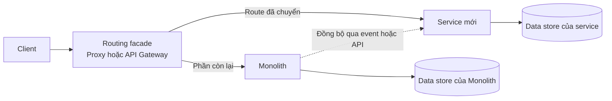

# Strangler Fig Pattern

## Mục lục

- [Tổng quan](#tổng-quan)
  - [Strangler Fig là gì](#strangler-fig-là-gì)
  - [Nguyên tắc cốt lõi](#nguyên-tắc-cốt-lõi)
- [Routing và topology](#routing-và-topology)
  - [Topology ban đầu](#topology-ban-đầu)
  - [Topology trong quá trình chuyển đổi](#topology-trong-quá-trình-chuyển-đổi)
  - [Topology sau khi hoàn tất](#topology-sau-khi-hoàn-tất)
- [Các bước migration](#các-bước-migration)
  - [Chọn module đầu tiên](#chọn-module-đầu-tiên)
  - [Đặt routing facade](#đặt-routing-facade)
  - [Xây dựng service mới](#xây-dựng-service-mới)
  - [Chuẩn bị và đồng bộ dữ liệu](#chuẩn-bị-và-đồng-bộ-dữ-liệu)
  - [Chuyển traffic theo từng phase](#chuyển-traffic-theo-từng-phase)
  - [Xóa code cũ và lặp lại](#xóa-code-cũ-và-lặp-lại)
- [Các lựa chọn routing](#các-lựa-chọn-routing)
  - [Route theo path](#route-theo-path)
  - [Route theo tỷ lệ và cohort](#route-theo-tỷ-lệ-và-cohort)
  - [Route theo loại request](#route-theo-loại-request)
  - [Ví dụ routing rule](#ví-dụ-routing-rule)
  - [Fallback và rollback](#fallback-và-rollback)
- [Ví dụ migration E Commerce](#ví-dụ-migration-e-commerce)
  - [Bối cảnh](#bối-cảnh)
  - [Lộ trình minh họa](#lộ-trình-minh-họa)
  - [Xử lý khi một phase gặp vấn đề](#xử-lý-khi-một-phase-gặp-vấn-đề)
- [Trade-offs](#trade-offs)
- [Khi nào nên dùng và khi nào nên tránh](#khi-nào-nên-dùng-và-khi-nào-nên-tránh)
- [Lỗi thường gặp](#lỗi-thường-gặp)
- [Vận hành và tiêu chí hoàn tất](#vận-hành-và-tiêu-chí-hoàn-tất)
  - [Quan sát và đo lường](#quan-sát-và-đo-lường)
  - [Runbook cho mỗi lần tăng traffic](#runbook-cho-mỗi-lần-tăng-traffic)
  - [Decommission monolith](#decommission-monolith)
- [Liên kết liên quan](#liên-kết-liên-quan)

## Tổng quan

### Strangler Fig là gì

**Strangler Fig** (cây đa bóp nghẹt) là một pattern để migrate **từng phần** từ Monolith sang Microservice. Một lớp điều hướng, thường là **proxy** hoặc **API Gateway**, được đặt trước Monolith. Khi một chức năng đã có service mới, lớp này chuyển traffic của chức năng đó sang service mới.

Tên gọi này được Martin Fowler dùng trong bài viết *Strangler Application* (2004). Hình ảnh ẩn dụ là cây strangler fig mọc bao quanh cây chủ. Trong migration, service mới dần thay thế từng phần của Monolith trong khi hệ cũ vẫn tiếp tục phục vụ phần chưa được chuyển đổi.

Strangler Fig không phải là một lần rewrite toàn bộ. Mỗi phase cần tạo ra một thay đổi nhỏ, có thể đo lường và có đường rollback rõ ràng.

### Nguyên tắc cốt lõi

- **Một entry point có thể kiểm soát:** client đi qua routing facade thay vì gọi trực tiếp vào Monolith.
- **Chuyển đổi tăng dần:** chỉ chuyển một module hoặc một nhóm endpoint đã sẵn sàng trong mỗi phase.
- **Hai hệ thống cùng tồn tại:** Monolith phục vụ phần còn lại, còn service mới nhận phần traffic đã được route.
- **Đo lường trước khi tăng traffic:** health check, monitoring và so sánh old/new giúp phát hiện sai khác sớm.
- **Rollback theo từng phần:** khi phase mới có vấn đề, chỉ đưa route của phần đó về Monolith thay vì hoàn tác toàn bộ migration.
- **Dọn dẹp sau khi chuyển:** code cũ và route cũ phải được xóa khi traffic đã ổn định; nếu không, Monolith sẽ không thực sự nhỏ đi.

> **Điểm cần nhớ:** routing facade chỉ tạo điểm rẽ nhánh traffic. Nó không tự tạo ra boundary dữ liệu hay trách nhiệm nghiệp vụ rõ ràng. Những boundary đó vẫn phải được xác định trước khi build service mới.

## Routing và topology

Routing facade che giấu quá trình chuyển đổi với client. Trong giai đoạn chuyển tiếp, nó phân biệt request nào đi vào service mới và request nào vẫn đi vào Monolith.



### Topology ban đầu

Trước migration, client thường gọi trực tiếp vào Monolith. Bước đầu tiên của Strangler Fig là đặt proxy hoặc API Gateway trước Monolith, nhưng chưa thay đổi hành vi xử lý request.

Trong phase này, facade forward 100% traffic về Monolith. Mục tiêu là tạo một entry point ổn định để có thể thêm route mới về sau. Nếu client vẫn bypass facade và gọi thẳng Monolith, team sẽ không kiểm soát được traffic cần chuyển.

### Topology trong quá trình chuyển đổi

Khi một module sẵn sàng, facade thêm route tới service tương ứng. Những route chưa được chuyển vẫn đi vào Monolith. Client không cần biết request của mình đang được phục vụ bởi hệ cũ hay hệ mới.

Service mới và Monolith cùng chạy production trong giai đoạn này. Vì vậy, route, data synchronization và monitoring phải được xem là một phần của thiết kế migration, không phải việc làm sau khi deploy.

### Topology sau khi hoàn tất

Khi tất cả module cần tách đã được chuyển và ổn định, facade có thể route các chức năng còn lại tới các service mới. Monolith chỉ được tắt sau khi đã xác nhận không còn route hoặc client hợp lệ nào phụ thuộc vào nó.

Monolith còn lại cũng có thể được giữ như một **core service** nếu đó là quyết định có chủ đích. Kết quả này khác với trạng thái migration bị bỏ dở mà không có tiêu chí kết thúc.

## Các bước migration

### Chọn module đầu tiên

Ưu tiên một module có các đặc điểm sau:

- **Change frequency cao:** module thường xuyên thay đổi và có lợi ích rõ khi deploy độc lập.
- **Coupling thấp:** module ít phụ thuộc vào phần còn lại của Monolith.
- **Business value rõ:** có nhu cầu scale riêng, deploy riêng hoặc áp dụng công nghệ phù hợp hơn.
- **Data boundary gọn:** có thể xác định dữ liệu nào thuộc trách nhiệm của service mới.

Không nên bắt đầu bằng module phức tạp nhất. Một module có boundary tương đối rõ giúp team kiểm chứng cách routing, đồng bộ dữ liệu và vận hành trước khi xử lý các phần khó hơn.

Việc xác định boundary nên đi cùng việc chọn chiến lược phân tách trong [05 — Decomposition Strategies](../05-decomposition-strategies.md) và kiểm tra [Bounded Context](../02-single-responsibility-bounded-context.md).

### Đặt routing facade

Đặt proxy hoặc [API Gateway](../07-api-gateway.md) trước Monolith. Ban đầu, facade chỉ forward 100% request về hệ cũ.

Ở phase này cần kiểm tra:

- mọi client hợp lệ đã sử dụng entry point mới;
- các entry point cũ không còn bypass routing facade;
- request, response, authentication và error handling vẫn giữ hành vi tương đương;
- facade có log route và có thể thay đổi rule mà không cần sửa client.

Đây là một bước chuẩn bị topology. Không nên coi việc đặt facade là đã hoàn thành migration một module.

### Xây dựng service mới

Build service mới cho module đã chọn với boundary và API contract rõ ràng. Service cần được chuẩn bị như một thành phần production, bao gồm:

- API contract mà facade có thể route tới;
- health check để xác định service có sẵn sàng nhận traffic hay không;
- monitoring và log đủ để so sánh với hành vi của Monolith;
- cách xử lý dữ liệu và lỗi đã được xác định trước khi chuyển traffic.

Service mới chỉ nên nhận traffic khi chức năng tương ứng đã có khả năng vận hành độc lập ở mức cần thiết của phase.

### Chuẩn bị và đồng bộ dữ liệu

Data migration là phần khó và cần được thiết kế trước khi chuyển traffic. Hãy xác định dữ liệu nào thuộc service mới, dữ liệu nào vẫn thuộc Monolith và cách truyền các thay đổi trong giai đoạn hai hệ thống cùng chạy.

Một hướng tiếp cận mục tiêu là service mới sở hữu data store của mình và nhận thay đổi qua event hoặc API. Việc để service mới truy cập lâu dài vào cùng database với Monolith tạo ra **Distributed Monolith**: tên gọi đã tách nhưng coupling và trách nhiệm dữ liệu vẫn còn dùng chung.

Tối thiểu cần kiểm tra:

- dữ liệu ban đầu đã được migrate hoặc backfill;
- các thay đổi mới được đồng bộ trong thời gian chuyển tiếp;
- số liệu hoặc kết quả nghiệp vụ giữa hai hệ thống có thể đối chiếu;
- quy trình xử lý khi đồng bộ trễ hoặc thất bại đã được ghi lại.

Xem thêm [09 — Data Management](../09-data-management.md) để chọn mô hình sở hữu và đồng bộ dữ liệu phù hợp.

### Chuyển traffic theo từng phase

Không chuyển 100% traffic ngay khi service mới vừa deploy. Có thể bắt đầu bằng một nhóm nhỏ hoặc một tỷ lệ nhỏ, quan sát kết quả, rồi tăng dần.

Một chuỗi canary minh họa là `1% → 5% → 25% → 50% → 100%`. Các mốc cụ thể cần dựa trên mức độ rủi ro và tín hiệu monitoring của hệ thống.

Trong giai đoạn đầu, có thể dùng **dark launch** để quan sát service mới trước khi nó trở thành nơi trả response chính. Với read request, chuyển trước thường dễ kiểm chứng và rollback hơn write request. Write request cần đặc biệt chú ý đến duplicate side effect và tính nhất quán dữ liệu.

### Xóa code cũ và lặp lại

Sau khi traffic đã chuyển 100% và ổn định theo tiêu chí đã thống nhất, xóa code tương ứng khỏi Monolith. Không nên để code chết nằm lại, vì code đó vẫn có thể phải compile, test và maintain.

Sau đó lặp lại quy trình với module tiếp theo. Nếu phần còn lại không đáng tách hoặc không có boundary phù hợp, có thể dừng tại một Monolith nhỏ hơn với quyết định giữ nó như core service.

## Các lựa chọn routing

### Route theo path

Khi module tương ứng với một nhóm endpoint rõ ràng, route theo path là lựa chọn trực tiếp nhất. Ví dụ, `/api/v1/orders/**` có thể đi tới `Order Service`, còn các path khác vẫn đi vào Monolith.

Rule cụ thể nên được đặt trước catch-all rule. Nếu `/api/v1/**` được đánh giá trước `/api/v1/orders/**`, request order có thể bị route nhầm về Monolith.

### Route theo tỷ lệ và cohort

**Canary routing** chuyển một tỷ lệ traffic nhỏ sang service mới. Tỷ lệ có thể tăng theo từng mốc sau khi các chỉ số và kết quả nghiệp vụ ổn định.

**Cohort routing** chuyển theo một nhóm user cụ thể. Ví dụ, internal users hoặc nhóm beta có thể được chuyển trước customer còn lại. Cách này giúp giới hạn phạm vi ảnh hưởng khi cần thử nghiệm.

### Route theo loại request

Có thể chuyển GET trước POST hoặc PUT. Read request thường dễ quan sát và rollback hơn vì không tạo thay đổi nghiệp vụ.

Với write request, cần xác định rõ hệ nào là nơi ghi nhận chính. Fallback về Monolith không tự hoàn tác một write đã thành công ở service mới.

### Ví dụ routing rule

Đoạn YAML dưới đây chỉ minh họa cách cấu hình tại proxy hoặc API Gateway:

```yaml
routes:
  - path: /api/v1/orders/**
    destination: order-service
    canary:
      weight: 5
      fallback: monolith
  - path: /api/v1/**
    destination: monolith
```

Trong ví dụ này, 5% traffic của `/api/v1/orders/**` đi tới `order-service`. Traffic còn lại của path đó và mọi path khác vẫn đi vào Monolith. Tên field thực tế phụ thuộc vào proxy hoặc API Gateway được sử dụng.

### Fallback và rollback

Khi service mới có lỗi, giảm `weight` về 0 hoặc đưa route về Monolith là một rollback ở tầng traffic. Cách này phù hợp nhất khi dữ liệu và side effect của hai hệ thống vẫn có thể duy trì nhất quán.

Rollback route không đồng nghĩa với rollback dữ liệu. Nếu service mới đã ghi dữ liệu, team cần xử lý trạng thái dữ liệu trước khi tiếp tục tăng traffic. Vì vậy, kế hoạch rollback phải được thử và ghi rõ cho từng module, đặc biệt trước khi bật write traffic.

## Ví dụ migration E Commerce

### Bối cảnh

Giả sử một hệ thống E-Commerce đang chạy dưới dạng Monolith với các module `User`, `Product`, `Order`, `Payment`, `Inventory` và `Search`. Các module cùng sử dụng một PostgreSQL.

Mục tiêu là tách dần các module mà không dừng business. Lộ trình dưới đây chỉ là kế hoạch minh họa; thứ tự thực tế cần dựa trên coupling, data boundary và business value của hệ thống.

### Lộ trình minh họa

| Phase | Phần được tách | Lý do minh họa | Routing và dữ liệu |
|---|---|---|---|
| 1 | `Search` | Coupling thấp, có nhu cầu scale trong đợt sale, phù hợp với search engine hơn SQL `LIKE` | Route các request search tới service mới; Monolith publish event để service consume và index |
| 2 | `User` và `Auth` | Có thể tái sử dụng cho SSO hoặc OAuth2 của các ứng dụng khác | Mở route sau khi dữ liệu và contract sẵn sàng |
| 3 | `Payment` | Cần môi trường bảo mật riêng cho yêu cầu compliance như PCI-DSS | Canary với nhóm nhỏ trước khi mở rộng write traffic |
| 4 | `Order` và `Inventory` | Hai module coupling cao; tách trong cùng một phase có thể giảm các call tạm thời giữa chúng | Xác định rõ data ownership và thứ tự chuyển route |
| 5 | `Product` | Hoàn thiện phần còn lại theo boundary đã xác định | Sau khi các route ổn định, xem xét decommission Monolith |

Sau mỗi phase, facade được mở rộng để route tới service mới và code cũ tương ứng được xóa. Monolith vì thế nhỏ dần thay vì chờ một lần switch duy nhất.

### Xử lý khi một phase gặp vấn đề

Nếu phase `Payment` gặp vấn đề nghiêm trọng, team có thể đóng băng phase đó và đưa traffic của phần đang thử nghiệm về route cũ khi điều kiện dữ liệu cho phép. Các giá trị đã hoàn tất ở phase `Search` và `User` vẫn có thể được giữ lại.

Đây là lợi ích của migration theo từng phase: một phase thất bại không bắt buộc phải hủy toàn bộ các phần đã ổn định. Sau khi điều tra metrics, log và sai khác dữ liệu, team mới quyết định sửa service, thay đổi kế hoạch hoặc dừng module đó.

## Trade-offs

| Lợi ích | Chi phí và rủi ro |
|---|---|
| Mỗi thay đổi nhỏ hơn và có thể rollback theo module | Phải vận hành Monolith và các service song song trong thời gian dài |
| Client có thể tiếp tục dùng một entry point; khi topology phù hợp, migration không cần downtime | Data consistency giữa hai hệ thống khó kiểm soát |
| Business tiếp tục chạy trong khi migration diễn ra | Routing facade thêm latency và thêm một điểm cần vận hành |
| Team học và kiểm chứng Microservice qua từng module | Tổng thời gian có thể dài hơn một big-bang rewrite nếu rewrite đó thực sự thành công |
| Có giá trị sau từng phase và có thể dừng theo ưu tiên business | Nếu không dọn dẹp, code cũ và route cũ trở thành nợ kỹ thuật |
| Kiến trúc mới được kiểm chứng bằng traffic thật | Trạng thái nửa Monolith, nửa service có thể kéo dài nếu thiếu tiêu chí kết thúc |

## Khi nào nên dùng và khi nào nên tránh

**Nên dùng Strangler Fig khi:**

- Monolith đang chạy production và cần hạn chế hoặc tránh downtime.
- Hệ thống đủ lớn để rewrite toàn bộ trong một release window là rủi ro.
- Team cần vừa maintain hệ cũ vừa giao feature mới.
- Có thể kiểm soát entry point bằng proxy hoặc API Gateway.
- Business cần nhận giá trị sau từng module và có khả năng dừng giữa chừng.

**Nên tránh hoặc cân nhắc lại khi:**

- Codebase nhỏ, team nhỏ và rewrite cục bộ rẻ hơn việc dựng rồi vận hành thêm routing facade.
- Monolith là một **big ball of mud** không có boundary rõ. Khi đó cần tạo seam hoặc refactor trước thay vì cố bóc một module kéo theo toàn bộ dependency.
- Client không thể chuyển khỏi entry point cũ hoặc không thể chèn facade vào network path.
- Tổ chức không chấp nhận giai đoạn hai hệ thống cùng tồn tại lâu.
- Các service không thể có data boundary riêng và buộc phải dùng chung database lâu dài.

## Lỗi thường gặp

| Lỗi | Hậu quả | Cách phòng tránh |
|---|---|---|
| Chọn module phức tạp hoặc coupling cao làm phase đầu | Phase đầu sa lầy và làm giảm niềm tin vào migration | Bắt đầu với module coupling thấp, có business value và boundary dữ liệu rõ |
| Service mới dùng chung database với Monolith | Tạo Distributed Monolith; trách nhiệm dữ liệu vẫn bị ghép chặt | Thiết kế data ownership riêng và đồng bộ qua event hoặc API |
| Chưa có kế hoạch migrate hoặc sync dữ liệu | Service mới thiếu hoặc sai dữ liệu khi nhận traffic | Hoàn thành kế hoạch dữ liệu trước khi chuyển route |
| Chuyển 100% traffic ngay sau deploy | Lỗi ẩn ảnh hưởng toàn bộ user | Dùng canary, dark launch và tăng tỷ lệ theo từng mốc |
| Quên xóa code cũ | Monolith không nhỏ đi và vẫn tốn chi phí maintain | Đưa xóa code cũ vào điều kiện hoàn tất của phase |
| Client gọi thẳng vào Monolith | Facade không kiểm soát được traffic | Ép mọi entry point hợp lệ đi qua routing facade |
| Không so sánh old và new | Chỉ phát hiện sai khác sau khi đã chuyển quá nhiều traffic | Dùng metrics, correlation ID và đối chiếu kết quả |
| Không có kế hoạch kết thúc | Trạng thái half-strangled trở thành vĩnh viễn | Định nghĩa tiêu chí decommission hoặc quyết định giữ core service ngay từ đầu |

## Vận hành và tiêu chí hoàn tất

### Quan sát và đo lường

Trước mỗi lần tăng traffic, cần có baseline của route đang chạy trên Monolith. Khi canary chạy, theo dõi riêng destination và version để phân biệt lỗi của facade, service mới và hệ cũ.

Các tín hiệu cần có ít nhất gồm:

- request success và error rate;
- latency của request;
- health check của service mới;
- kết quả nghiệp vụ hoặc sai khác response khi có thể so sánh;
- log có `correlation ID` để lần theo một request qua facade, Monolith và service mới.

Metrics và log không thay thế cho việc kiểm tra dữ liệu. Một route có latency tốt vẫn có thể trả kết quả sai nếu data synchronization chưa hoàn tất. Xem thêm [11 — Observability & Evolvability](../11-observability-evolvability.md).

### Runbook cho mỗi lần tăng traffic

1. Xác nhận service mới healthy, API contract không đổi ngoài phạm vi phase và data synchronization không có lỗi chưa xử lý.
2. Chọn phạm vi tăng traffic: một path, một cohort, một tỷ lệ hoặc một loại request.
3. Bắt đầu ở tỷ lệ nhỏ, chẳng hạn 1% hoặc 5% tùy rủi ro.
4. So sánh metrics, log và kết quả nghiệp vụ với baseline của Monolith.
5. Nếu các tín hiệu nằm trong ngưỡng đã thống nhất, tăng lên mốc tiếp theo.
6. Nếu có lỗi, đưa weight về 0 hoặc route về Monolith khi an toàn, sau đó đóng băng phase để điều tra.
7. Ghi lại quyết định, metrics và thay đổi routing trước khi tiếp tục.

Canary là một cơ chế vận hành, không phải bằng chứng rằng service mới đúng. Chỉ tăng traffic khi cả hành vi, dữ liệu và khả năng rollback đã được kiểm tra.

### Decommission monolith

Chỉ decommission Monolith sau khi đã xác nhận:

- các route của module đã chuyển 100% và ổn định theo khoảng thời gian đã thống nhất;
- không còn client hoặc job hợp lệ nào bypass facade để gọi code cũ;
- data ownership, đồng bộ dữ liệu và quy trình đối chiếu đã hoàn tất;
- code cũ, route cũ và cấu hình không còn dùng đã được xóa;
- monitoring, alert và runbook đã trỏ tới topology mới.

Nếu vẫn còn phần nghiệp vụ chưa có lợi ích rõ khi tách, hãy ghi nhận Monolith còn lại là core service có chủ đích. Không nên tắt hệ cũ chỉ để đạt mục tiêu hình thức khi trách nhiệm của phần còn lại chưa được thay thế.

## Liên kết liên quan

- [02 — Single Responsibility và Bounded Context](../02-single-responsibility-bounded-context.md)
- [05 — Decomposition Strategies](../05-decomposition-strategies.md)
- [07 — API Gateway](../07-api-gateway.md)
- [09 — Data Management](../09-data-management.md)
- [11 — Observability và Evolvability](../11-observability-evolvability.md)
- [14 — CI/CD và Deployment Strategies](../14-cicd-deployment.md)
