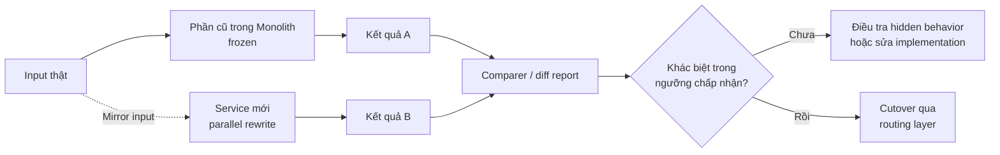

# Vine Pattern — Viết lại song song và cutover có kiểm soát

## Mục lục

- [Tổng quan](#tổng-quan)
  - [Vine Pattern là gì](#vine-pattern-là-gì)
  - [Phạm vi và thuật ngữ](#phạm-vi-và-thuật-ngữ)
- [Mô hình hoạt động](#mô-hình-hoạt-động)
  - [Parallel rewrite và trạng thái frozen](#parallel-rewrite-và-trạng-thái-frozen)
  - [Các giai đoạn](#các-giai-đoạn)
  - [Parallel run và điều kiện cutover](#parallel-run-và-điều-kiện-cutover)
- [Routing và đồng bộ dữ liệu](#routing-và-đồng-bộ-dữ-liệu)
  - [Routing trước và trong cutover](#routing-trước-và-trong-cutover)
  - [Backfill và đồng bộ các thay đổi](#backfill-và-đồng-bộ-các-thay-đổi)
  - [Rollback không đồng nghĩa với rollback dữ liệu](#rollback-không-đồng-nghĩa-với-rollback-dữ-liệu)
- [Ví dụ: viết lại Billing service](#ví-dụ-viết-lại-billing-service)
  - [Bối cảnh](#bối-cảnh)
  - [Phân tích lựa chọn](#phân-tích-lựa-chọn)
  - [Parallel run và phân tích khác biệt](#parallel-run-và-phân-tích-khác-biệt)
  - [Cutover và decommission](#cutover-và-decommission)
- [Trade-offs](#trade-offs)
- [Khi nào nên dùng và khi nào nên tránh](#khi-nào-nên-dùng-và-khi-nào-nên-tránh)
  - [Nên dùng khi](#nên-dùng-khi)
  - [Nên tránh hoặc cân nhắc lại](#nên-tránh-hoặc-cân-nhắc-lại)
- [Lỗi thường gặp](#lỗi-thường-gặp)
- [Vận hành](#vận-hành)
  - [Baseline và quan sát](#baseline-và-quan-sát)
  - [Runbook rollout và rollback](#runbook-rollout-và-rollback)
  - [Tiêu chí hoàn tất và decommission](#tiêu-chí-hoàn-tất-và-decommission)
- [Liên kết liên quan](#liên-kết-liên-quan)

---

## Tổng quan

### Vine Pattern là gì

**Vine Pattern** là cách viết lại một **functional area** — một khu vực chức năng có boundary rõ — trong một codebase hoặc service mới, rồi cho nó chạy **song song** với phần tương ứng trong Monolith. Sau khi hai hệ thống được kiểm chứng bằng input và kết quả thực tế, team chuyển traffic sang phần mới và decommission phần cũ.

Vine không cố giải phẫu từng lớp trong code cũ. Nó tạo một implementation mới dựa trên requirements hiện tại. Cách này đặc biệt hữu ích khi code cũ không có test, thiếu tài liệu hoặc đã trở nên quá rủi ro để refactor.

Rủi ro vì thế không biến mất mà thay đổi vị trí. Team phải tìm và phân loại những **hidden behavior** — hành vi ẩn — như quy tắc rounding hoặc một ngoại lệ nghiệp vụ mà tài liệu không ghi lại. **Parallel run** (chạy song song) là cơ chế để phát hiện các hành vi đó trước cutover, không phải một bước tùy chọn.

### Phạm vi và thuật ngữ

Tên gọi **Vine Pattern** không được chuẩn hóa thống nhất trong mọi tài liệu. Một số tài liệu dùng hình ảnh *vine* để nói về Strangler Fig. Trong bộ tài liệu này, Vine được dùng theo nghĩa **parallel rebuild**: viết mới một khối chức năng rồi chuyển sang sau khi so sánh với hệ cũ.

Ba cách tiếp cận khác nhau ở nơi đặt thay đổi:

- **Strangler Fig:** tạo nhánh ở tầng routing bên ngoài để thay từng endpoint hoặc module; Monolith nhỏ dần.
- **Branch by Abstraction:** tạo abstraction bên trong codebase rồi đổi implementation phía sau abstraction; “branch” ở đây không phải Git branch.
- **Vine Pattern:** tạo codebase hoặc service mới cho một functional area, giữ phần cũ ở trạng thái `frozen`, chạy hai đường song song rồi cutover.

Vine không đồng nghĩa với việc tạo một Git branch dài hạn. “Song song” nói về hai implementation và topology runtime trong giai đoạn chuyển đổi. Scope vẫn cần được chốt nhỏ để tránh biến Vine thành một Big Bang Rewrite trá hình.

## Mô hình hoạt động

### Parallel rewrite và trạng thái frozen

Team chọn một functional area có boundary đủ rõ để viết độc lập. Phần tương ứng trong Monolith được **freeze**: không nhận feature mới trong thời gian migration. Bug fix nghiêm trọng vẫn có thể được thực hiện, nhưng mọi thay đổi khác nên chuyển sang codebase mới.

Trong lúc đó, service mới có thể thiết kế lại data model, API, test và technology stack theo requirements hiện tại. Không sao chép thiết kế cũ chỉ vì nó đang tồn tại. Tuy nhiên, mọi khác biệt hành vi cần được giải thích bằng requirements hoặc một quyết định nghiệp vụ có chủ đích.



Sơ đồ chỉ thể hiện việc so sánh logic. Với thao tác có side effect, không nên gửi một input production tới cả hai hệ thống nếu điều đó có thể tạo ra hai lần charge, ghi dữ liệu hoặc phát event. Khi đó cần dùng sandbox, dry-run, shadow validation, idempotency hoặc một writer được chỉ định cho từng phase.

### Các giai đoạn

1. **Chốt scope.** Chọn một functional area nhỏ, có boundary rõ và có thể viết lại độc lập. Scope là hàng rào quan trọng nhất chống scope creep.
2. **Đóng băng phần cũ.** Ghi rõ thay đổi nào bị chặn và quy trình xử lý critical bug. Nếu phần cũ và phần mới cùng tiếp tục nhận feature, kết quả sẽ khó hội tụ.
3. **Xây dựng service mới.** Thiết kế data model, API, test và các integration cần thiết theo requirements hiện tại. Chuẩn bị health check, monitoring và ownership như một thành phần production.
4. **Chạy parallel run.** Cho hai phía nhận cùng một logical input theo cách an toàn. Lưu kết quả đủ để comparer đối chiếu các trường nghiệp vụ quan trọng.
5. **Backfill và cutover.** Chuyển dữ liệu lịch sử, xác nhận dữ liệu mới đã hội tụ, rồi chuyển traffic qua routing layer theo từng phạm vi có thể quan sát.
6. **Decommission phần cũ.** Sau thời gian ổn định đã thống nhất, tắt đường cũ và xóa code không còn dùng. Có thể giữ phần cũ ở chế độ frozen hoặc read-only trong thời hạn rõ ràng nếu còn nhu cầu tra cứu.

Strangler Fig thường phân tán rủi ro qua nhiều lần chuyển traffic nhỏ. Vine thường tập trung nhiều rủi ro hơn ở một lần cutover của functional area. Vì vậy, parallel run và kế hoạch rollback phải được thiết kế ngay từ đầu.

### Parallel run và điều kiện cutover

Parallel run không chỉ kiểm tra service mới có trả HTTP `200`. Comparer cần đối chiếu **kết quả nghiệp vụ**: số tiền, dòng chi tiết, trạng thái, quy tắc thuế, rounding hoặc các trường khác có ý nghĩa với functional area.

Không phải mọi khác biệt đều là bug. Một khác biệt có thể là:

- lỗi trong implementation mới;
- hidden behavior có chủ đích của hệ cũ nhưng chưa được tài liệu hóa;
- dữ liệu đầu vào hoặc thời điểm đọc dữ liệu khác nhau;
- thay đổi nghiệp vụ đã được requirements mới cho phép.

Mỗi khác biệt cần được phân loại, ghi lại quyết định và phản ánh vào requirements hoặc code. Không nên chỉ sửa service mới cho giống hệ cũ mà không hiểu lý do của khác biệt.

Trước khi cutover, tối thiểu cần xác nhận:

- scope đã freeze và danh sách ngoại lệ của hệ cũ đã có owner;
- input tương đương được gửi tới hai phía hoặc có lý do rõ ràng nếu không thể;
- các khác biệt quan trọng đã về `0` hoặc nằm trong ngưỡng được chấp nhận;
- backfill và đồng bộ thay đổi không còn lỗi chưa xử lý;
- routing có thể chuyển theo cohort hoặc tỷ lệ nhỏ;
- rollback traffic, xử lý side effect và reconcile dữ liệu đã được kiểm tra.

Nếu requirements mới cố ý thay đổi hành vi, điều kiện cutover không nhất thiết là mọi output phải giống hệt. Khi đó cần tách rõ invariant phải giữ nguyên và khác biệt đã được phê duyệt.

## Routing và đồng bộ dữ liệu

### Routing trước và trong cutover

Trong parallel run, phần cũ thường vẫn là nơi trả response chính. Input có thể được mirror tại một boundary kiểm soát được, còn kết quả của service mới chỉ dùng cho validation. Đừng coi việc service mới nhận được bản sao input là nó đã trở thành nơi xử lý chính.

Đến cutover, cần đưa caller qua một **routing layer** có thể chọn Monolith hoặc service mới. Routing layer có thể là proxy/API Gateway nếu functional area có endpoint ở edge, hoặc một facade/router ở tầng ứng dụng nếu các caller trước đây gọi code nội bộ trực tiếp.

Các cách giới hạn phạm vi chuyển đổi gồm:

- **Theo path:** route nhóm endpoint Billing đã sẵn sàng.
- **Theo cohort:** chuyển internal users hoặc một nhóm beta trước.
- **Theo tỷ lệ:** tăng dần từ tỷ lệ nhỏ sau khi kiểm tra metrics và kết quả.
- **Theo loại request:** có thể kiểm tra read trước write khi semantics cho phép.

Ví dụ minh họa tại proxy hoặc API Gateway:

```yaml
routes:
  - path: /api/v1/billing/**
    destination: billing-service
    canary:
      weight: 5
      fallback: monolith
  - path: /api/v1/**
    destination: monolith
```

Đây chỉ là cấu hình minh họa; field thực tế phụ thuộc vào proxy hoặc API Gateway. Với caller nội bộ không có endpoint, team vẫn phải tạo một điểm gọi có thể kiểm soát. Nếu caller tiếp tục gọi thẳng code cũ, việc đổi route ở edge sẽ không bảo vệ được cutover.

### Backfill và đồng bộ các thay đổi

Data migration không thể được xử lý giống routing traffic. Vì data model mới có thể khác model cũ, backfill cần có mapping, quy tắc transform và cách kiểm tra kết quả.

Một trình tự thường cần có là:

1. **Backfill dữ liệu lịch sử:** sao chép và transform dữ liệu cần thiết từ nguồn cũ sang data store của service mới.
2. **Bắt thay đổi phát sinh trong lúc backfill:** dùng event, API, CDC hoặc cơ chế tương đương phù hợp với topology để service mới không bị tụt lại.
3. **Đối chiếu:** kiểm tra số lượng, tổng giá trị, trạng thái và các invariant nghiệp vụ; theo dõi lag và record lỗi.
4. **Chốt data ownership:** xác định hệ nào là nơi ghi nhận chính trước và sau cutover. Không để hai hệ cùng sở hữu một bảng trong thời gian dài.

Backfill nên **idempotent** — chạy lại cùng input không làm dữ liệu bị nhân đôi — và có thể retry. Một lần chạy xong không đủ bằng chứng dữ liệu đã đúng; cần báo cáo đối chiếu và quy trình xử lý record thất bại.

Trong giai đoạn chuyển tiếp, dual-write chỉ nên được dùng khi có owner, cơ chế đối soát và phương án xử lý lỗi rõ ràng. Shared database hoặc dual-write không có reconciliation sẽ làm mất boundary mà Vine cần tạo ra.

### Rollback không đồng nghĩa với rollback dữ liệu

Đưa route trở lại Monolith chỉ ảnh hưởng các request tiếp theo. Nó không tự hoàn tác một invoice, một event hoặc một bản ghi đã được service mới ghi thành công.

Trước khi chuyển write traffic, cần xác định:

- service nào là writer chính trong từng phase;
- side effect nào có thể đã xảy ra khi rollback;
- cách xử lý transaction ở trạng thái `pending`, `succeeded` hoặc `unknown`;
- cách reconcile dữ liệu trước khi bật service mới lại hoặc chuyển hẳn về hệ cũ.

Giữ phần cũ ở trạng thái standby có thể giúp rollback routing nhanh hơn, nhưng không thay thế cho kế hoạch reconcile. Chỉ decommission hệ cũ sau khi team không còn cần khả năng quay lại và đã hoàn tất xử lý dữ liệu liên quan.

## Ví dụ: viết lại Billing service

### Bối cảnh

Một hệ thống quản lý khách sạn có module Billing nằm trong code kế thừa. Module này không có unit test đầy đủ. Logic bị chia giữa stored procedure và application code, nên không ai nắm hết flow. `Reservation`, `Housekeeping` và `Report` gọi Billing từ bên trong Monolith.

Team cần bổ sung pricing theo mùa — **dynamic pricing** — nhưng cấu trúc cũ không phù hợp với thay đổi này. Billing cũng không có endpoint riêng để đặt proxy ở edge rồi route trực tiếp như một nhóm API độc lập.

### Phân tích lựa chọn

- **Strangler Fig:** không giải quyết trực tiếp các cuộc gọi nội bộ từ `Reservation`, `Housekeeping` và `Report` nếu chúng tiếp tục gọi class hoặc module cũ. Cần tạo thêm một boundary có thể route.
- **Branch by Abstraction:** có thể tạo interface, nhưng việc đưa code cũ không có test qua abstraction có nguy cơ làm hỏng các flow chưa hiểu rõ. Chi phí và rủi ro refactor cao.
- **Vine Pattern:** viết `Billing Service` mới với data model và pricing engine mới, trong khi Billing cũ được freeze. Input thật được dùng để so sánh hai kết quả trước cutover.

Lựa chọn Vine chỉ hợp lý vì scope Billing đã được chốt và team có thể xác định output cần kiểm chứng. Nếu không có người đủ hiểu domain để phân xử khác biệt, việc viết service mới sẽ không tự làm giảm rủi ro.

### Parallel run và phân tích khác biệt

Trong parallel run, logical input từ flow đặt phòng hoặc các flow liên quan được gửi tới Billing cũ và được mirror tới Billing Service mới theo cách không nhân đôi side effect.

```text
┌───────────────────────────────────────────────────────────────┐
│                         PARALLEL RUN                          │
│                                                               │
│  Reservation ──▶ Monolith Billing (FROZEN) ──▶ Invoice A     │
│       │                                      ──▶ Report       │
│       │                                                       │
│       └──── mirror input ──▶ Billing Service ──▶ Invoice B   │
│                                                               │
│  Comparer: đối chiếu A và B theo từng flow                    │
│  Diff ≠ 0 → điều tra implementation hoặc hidden behavior     │
│  Diff trong ngưỡng đã chấp nhận → đủ điều kiện xem xét switch │
└───────────────────────────────────────────────────────────────┘
```

Comparer cần xem các trường có ý nghĩa nghiệp vụ, chẳng hạn line item, amount, discount, thuế, rounding và trạng thái invoice. Nếu Billing Service thực hiện pricing theo requirements mới, các khác biệt được chủ đích cho phép phải được ghi rõ thay vì bị coi là lỗi.

Một số diff có thể phơi bày behavior ẩn của Billing cũ. Ví dụ, hệ cũ có thể rounding theo một quy tắc riêng hoặc áp dụng miễn phí cho một nhóm khách VIP từ lâu. Team phải điều tra từng diff để quyết định đó là bug, behavior cần giữ hay behavior cần thay đổi.

Parallel run vì thế vừa kiểm chứng implementation mới, vừa giúp khai quật requirements bị lãng quên. Không nên kết thúc phase chỉ vì service mới chạy ổn về mặt kỹ thuật.

### Cutover và decommission

Sau khi các kết quả quan trọng ổn định, team backfill invoice hoặc dữ liệu Billing lịch sử sang data store mới. Báo cáo đối chiếu cần xác nhận dữ liệu đã transform đúng và các thay đổi trong lúc backfill không bị bỏ sót.

Tiếp theo, đưa các flow Billing qua router hoặc facade. Bắt đầu với cohort hoặc tỷ lệ nhỏ, quan sát metrics và kết quả invoice, rồi mới mở rộng. Monolith Billing vẫn được giữ ở trạng thái frozen/standby để rollback routing khi điều kiện dữ liệu cho phép.

Khi Billing Service nhận toàn bộ traffic trong khoảng ổn định đã thống nhất:

- dừng mirror và comparer sau khi các báo cáo cuối đã được lưu;
- chuyển toàn bộ caller còn lại khỏi code Billing cũ;
- xóa route, dependency và code cũ không còn dùng;
- cập nhật ownership, dashboard, alert và runbook;
- nếu còn nhu cầu tra cứu, giữ phần cũ ở chế độ read-only với thời hạn decommission rõ ràng.

## Trade-offs

| Ưu điểm | Nhược điểm và rủi ro |
|---|---|
| Không phải refactor sâu một codebase khó hiểu; service mới được viết trên nền sạch | Có thể bỏ sót hidden behavior và edge case của hệ cũ |
| Có thể thiết kế lại data model, API và technology stack | Parallel run, comparer và hai môi trường làm tăng chi phí hạ tầng và vận hành |
| Tốc độ viết ban đầu nhanh khi scope đã rõ | Backfill dữ liệu lịch sử phức tạp, cần idempotent, retry và verify |
| Phần cũ được freeze nên requirements ít trôi hơn | Cutover vẫn là một bước lớn, đặc biệt với write và side effect |
| Không phải chia sẻ từng thay đổi với code cũ trong quá trình viết mới | Scope creep dễ biến migration thành Big Bang Rewrite trá hình |
| Có thể đáp ứng yêu cầu thay đổi lớn như data model hoặc technology stack | Hai hệ thống cùng tồn tại cho tới khi decommission, làm tăng chi phí on-call |

## Khi nào nên dùng và khi nào nên tránh

### Nên dùng khi

- Khu vực cần tách **không thể sửa an toàn**: thiếu test, thiếu tài liệu, không còn người hiểu đầy đủ hoặc refactor nhỏ cũng có thể kéo theo nhiều lỗi.
- Scope nhỏ, boundary rõ và requirements tương đối ổn định trong thời gian viết lại.
- Cần thay đổi cả data model hoặc technology stack, nên việc bóc từng phần khỏi thiết kế cũ không đem lại nhiều lợi ích.
- Có thời hạn phải rời platform cũ hoặc đáp ứng một yêu cầu compliance cụ thể.
- Team có thể vận hành hai hệ thống, xây comparer và phân xử các khác biệt trong parallel run.

### Nên tránh hoặc cân nhắc lại

- Scope lớn hoặc mơ hồ. Khi đó Vine dễ trở thành Big Bang Rewrite mà không có điểm giao giá trị rõ ràng.
- Không còn domain knowledge để biết output nào của hệ cũ là đúng. Parallel run sẽ tạo ra diff nhưng không có cách quyết định.
- Hệ cũ vẫn thay đổi liên tục. Code mới sẽ phải đuổi theo một target luôn di chuyển, dù phần cũ được gọi là frozen.
- Không có năng lực vận hành song song về hạ tầng, monitoring, data sync hoặc on-call.
- Chỉ cần giảm deploy friction hoặc tách một nhóm endpoint đã rõ. Trong trường hợp đó, một cách tiếp cận ít thay đổi hơn có thể phù hợp hơn Vine.

## Lỗi thường gặp

| Lỗi | Hậu quả | Cách phòng tránh |
|---|---|---|
| Scope creep, tiện tay viết lại cả phần kề bên | Vine phình thành rewrite toàn hệ thống | Chốt scope bằng văn bản; mọi mở rộng cần một quyết định riêng |
| Cutover mà không có parallel run | Hidden behavior chỉ lộ ra trên production | Đặt parallel run và ngưỡng diff là điều kiện bắt buộc |
| Coi mọi diff là bug của service mới | Vô tình xóa behavior có chủ đích như rounding hoặc ưu đãi cũ | Điều tra, phân loại và ghi lại quyết định cho từng diff |
| Backfill chạy một lần, không retry hoặc verify | Dữ liệu thiếu và không biết record nào lệch | Thiết kế backfill idempotent, có retry, báo cáo đối chiếu và xử lý lỗi |
| Mirror cùng một write có side effect tới hai hệ thống | Duplicate invoice, event hoặc giao dịch | Dùng sandbox, dry-run, idempotency hoặc chỉ định một writer chính |
| Freeze chỉ nằm trên giấy | Hai hệ cùng evolve, parallel run không hội tụ | Chặn feature mới bằng quy trình review; chỉ cho critical bug fix có owner |
| Không có routing layer trước cutover | Không canary và rollback traffic nhanh được | Đưa caller qua proxy, facade hoặc router có thể kiểm soát |
| Không có kế hoạch decommission | Hai hệ thống phải vận hành vĩnh viễn | Đặt ngày mục tiêu, điều kiện hoàn tất và owner ngay khi bắt đầu |

## Vận hành

### Baseline và quan sát

Trước parallel run, ghi baseline của phần cũ để có điểm so sánh. Dashboard nên phân biệt ít nhất hệ cũ/hệ mới, release và cohort hoặc route. Các tín hiệu cần theo dõi gồm:

- success rate, error rate, latency và timeout của mỗi phía;
- kết quả nghiệp vụ và tỷ lệ diff theo loại input;
- tiến độ backfill, data lag, số record lỗi và trạng thái reconcile;
- tỷ lệ retry, duplicate request hoặc side effect không mong muốn;
- chi phí tài nguyên và lỗi dependency của service mới;
- log có `correlation ID` hoặc transaction ID để lần theo cùng một input, nhưng không ghi secret hay dữ liệu nhạy cảm không cần thiết.

Ngưỡng chấp nhận phải được thống nhất trước khi tăng traffic. Latency tốt không chứng minh invoice hoặc dữ liệu đã đúng. Ngược lại, một diff đã được requirements phê duyệt không nhất thiết là lý do rollback.

### Runbook rollout và rollback

1. Xác nhận phần cũ vẫn frozen đúng chính sách và service mới healthy.
2. Kiểm tra backfill, đồng bộ thay đổi và danh sách record chưa reconcile.
3. Chọn phạm vi rollout: một cohort, một tỷ lệ, một path hoặc một loại request. Ghi lại routing config hiện tại.
4. Chuyển một phạm vi nhỏ qua router, theo dõi metrics, diff report và side effect.
5. Nếu tín hiệu nằm trong ngưỡng, tăng lên mốc tiếp theo theo thời gian quan sát đã thống nhất.
6. Nếu có lỗi, dừng tăng traffic và đưa request tiếp theo về hệ cũ khi việc đó an toàn. Giữ phase ở trạng thái frozen để điều tra.
7. Kiểm tra dữ liệu và các side effect đã phát sinh. Reconcile trước khi bật lại service mới hoặc tiếp tục cutover.

Tắt route mới chỉ là rollback traffic. Nó không khôi phục tự động các invoice, bản ghi hoặc event đã được ghi ở service mới.

### Tiêu chí hoàn tất và decommission

Có thể xem phase hoàn tất khi:

- service mới nhận `100%` traffic trong khoảng ổn định đã thống nhất;
- các diff quan trọng đã được sửa hoặc được requirements phê duyệt;
- data ownership, backfill, đồng bộ thay đổi và reconcile đã có kết quả xác nhận;
- không còn caller, job hoặc script hợp lệ gọi phần cũ ngoài các đường read-only được ghi nhận;
- rollback không còn là nhu cầu bắt buộc, hoặc đã có thời điểm hết hạn rõ ràng;
- mirror, comparer, route tạm thời, dependency và credential chỉ phục vụ hệ cũ đã được tắt hoặc xóa;
- monitoring, alert, ownership và runbook đã trỏ tới topology mới.

Nếu cần giữ Monolith Billing để tra cứu, hãy giới hạn nó ở chế độ frozen/read-only và ghi rõ ngày review hoặc decommission. Giữ hệ cũ vô thời hạn chỉ vì “phòng khi cần” biến giai đoạn song song thành chi phí thường trực.

## Liên kết liên quan

- [02 — Single Responsibility và Bounded Context](../02-single-responsibility-bounded-context.md) — xác định boundary trước khi viết lại.
- [05 — Decomposition Strategies](../05-decomposition-strategies.md) — chọn functional area và boundary phù hợp.
- [07 — API Gateway](../07-api-gateway.md) — routing facade khi cutover ở HTTP edge.
- [09 — Data Management](../09-data-management.md) — data ownership, backfill và đồng bộ dữ liệu.
- [11 — Observability và Evolvability](../11-observability-evolvability.md) — metrics, log và correlation ID.
- [14 — CI/CD và Deployment](../14-cicd-deployment.md) — canary và rollout có kiểm soát.
- [16 — Configuration và Secrets Management](../16-configuration-secrets-management.md) — quản lý routing hoặc feature flag.
- [17 — Decomposition Patterns](../17-decomposition-patterns.md#4-vine-pattern) — phần tổng quan của nhóm pattern.
