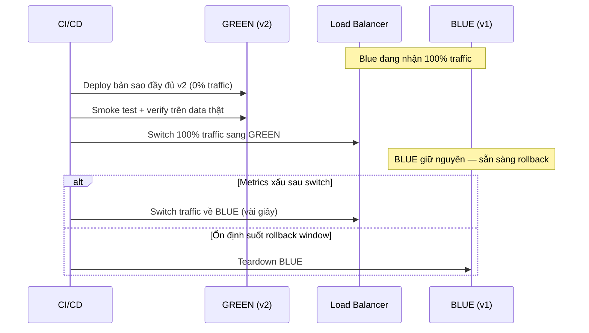
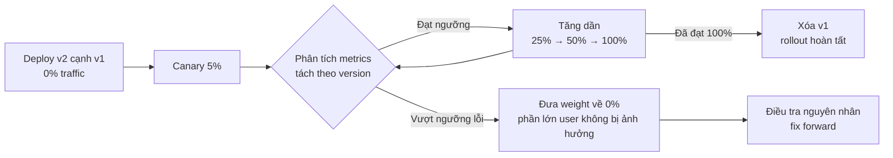
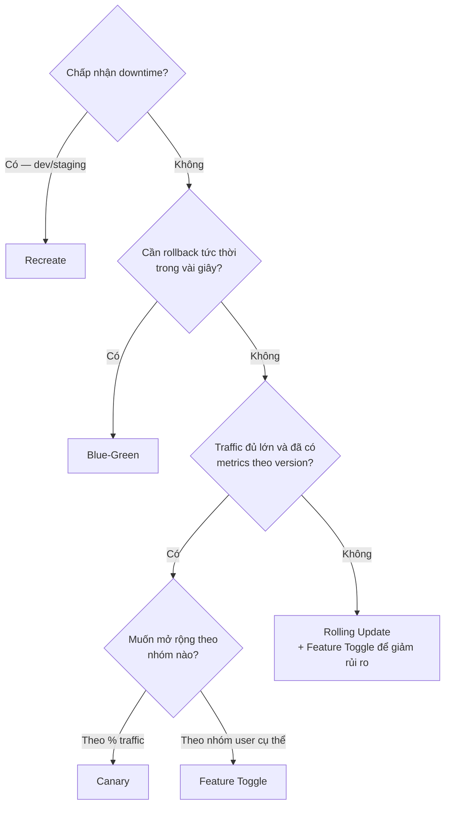
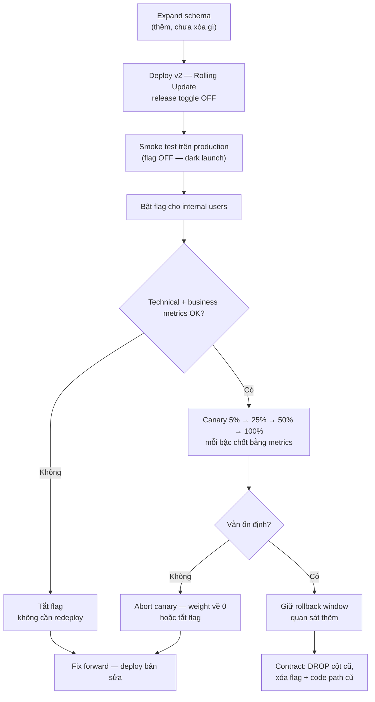

# Deployment Patterns trong Microservice

## 📋 Mục lục

- [1. Giới thiệu](#1-giới-thiệu)
  - [1.1. Deployment Pattern là gì](#11-deployment-pattern-là-gì)
  - [1.2. Deploy và Release — hai việc khác nhau](#12-deploy-và-release--hai-việc-khác-nhau)
  - [1.3. Bản đồ các Deployment Patterns](#13-bản-đồ-các-deployment-patterns)
- [2. Nguyên tắc chung của mọi deployment pattern](#2-nguyên-tắc-chung-của-mọi-deployment-pattern)
- [3. Rolling Update — pattern nền](#3-rolling-update--pattern-nền)
  - [3.1. Cách hoạt động](#31-cách-hoạt-động)
  - [3.2. Ý nghĩa với compatibility](#32-ý-nghĩa-với-compatibility)
  - [3.3. Khi nào chọn và khi nào không](#33-khi-nào-chọn-và-khi-nào-không)
- [4. Blue-Green Deployment](#4-blue-green-deployment)
  - [4.1. Cách hoạt động](#41-cách-hoạt-động)
  - [4.2. Ví dụ và use case](#42-ví-dụ-và-use-case)
  - [4.3. Khi nào chọn và khi nào không](#43-khi-nào-chọn-và-khi-nào-không)
  - [4.4. Trade-offs](#44-trade-offs)
  - [4.5. Lỗi thường gặp](#45-lỗi-thường-gặp)
- [5. Canary Deployment](#5-canary-deployment)
  - [5.1. Cách hoạt động](#51-cách-hoạt-động)
  - [5.2. Ví dụ và use case](#52-ví-dụ-và-use-case)
  - [5.3. Khi nào chọn và khi nào không](#53-khi-nào-chọn-và-khi-nào-không)
  - [5.4. Trade-offs](#54-trade-offs)
  - [5.5. Lỗi thường gặp](#55-lỗi-thường-gặp)
- [6. Feature Toggle](#6-feature-toggle)
  - [6.1. Khái niệm — tách deploy khỏi release](#61-khái-niệm--tách-deploy-khỏi-release)
  - [6.2. Bốn loại toggle](#62-bốn-loại-toggle)
  - [6.3. Ví dụ và use case](#63-ví-dụ-và-use-case)
  - [6.4. Khi nào chọn và khi nào không](#64-khi-nào-chọn-và-khi-nào-không)
  - [6.5. Trade-offs](#65-trade-offs)
  - [6.6. Lỗi thường gặp — flag debt](#66-lỗi-thường-gặp--flag-debt)
- [7. So sánh các pattern](#7-so-sánh-các-pattern)
  - [7.1. Bảng so sánh tổng hợp](#71-bảng-so-sánh-tổng-hợp)
  - [7.2. Cây quyết định](#72-cây-quyết-định)
- [8. Rollback — kế hoạch thoát hiểm](#8-rollback--kế-hoạch-thoát-hiểm)
  - [8.1. Rollback trong từng pattern](#81-rollback-trong-từng-pattern)
  - [8.2. Rollback code chưa phải rollback hệ thống](#82-rollback-code-chưa-phải-rollback-hệ-thống)
  - [8.3. Rollback window](#83-rollback-window)
- [9. Quan sát rollout — Rollout Observability](#9-quan-sát-rollout--rollout-observability)
  - [9.1. Metrics cần có khi rollout](#91-metrics-cần-có-khi-rollout)
  - [9.2. Phân biệt version trong telemetry](#92-phân-biệt-version-trong-telemetry)
  - [9.3. Auto rollback dựa trên metrics](#93-auto-rollback-dựa-trên-metrics)
- [10. Tương thích nhiều version](#10-tương-thích-nhiều-version)
  - [10.1. Mỗi pattern đòi hỏi compatibility gì](#101-mỗi-pattern-đòi-hỏi-compatibility-gì)
  - [10.2. API compatibility](#102-api-compatibility)
  - [10.3. Database và Expand-Contract](#103-database-và-expand-contract)
  - [10.4. Event và message](#104-event-và-message)
  - [10.5. Cache, session và configuration](#105-cache-session-và-configuration)
- [11. Kết hợp các pattern](#11-kết-hợp-các-pattern)
  - [11.1. Feature Toggle cùng Canary](#111-feature-toggle-cùng-canary)
  - [11.2. Blue-Green cùng Expand-Contract](#112-blue-green-cùng-expand-contract)
  - [11.3. Canary cùng Service Mesh và API Gateway](#113-canary-cùng-service-mesh-và-api-gateway)
  - [11.4. Trình tự một release an toàn](#114-trình-tự-một-release-an-toàn)
- [12. Ví dụ thực tế — release Order Service v2](#12-ví-dụ-thực-tế--release-order-service-v2)
- [13. Checklist](#13-checklist)
  - [13.1. Trước release](#131-trước-release)
  - [13.2. Trong rollout](#132-trong-rollout)
  - [13.3. Khi rollback](#133-khi-rollback)
  - [13.4. Sau rollout](#134-sau-rollout)
- [14. Tổng kết](#14-tổng-kết)
- [15. Liên kết liên quan](#15-liên-kết-liên-quan)

---

## 1. Giới thiệu

> 📖 Tài liệu này tách và mở rộng mục *Deployment Patterns* trong [17 — Design Patterns](17-design-patterns.md) thành một tài liệu học độc lập. Trọng tâm ở đây là **góc nhìn pattern**: mỗi pattern giải quyết vấn đề gì, khi nào chọn hoặc không chọn, trade-off ra sao, và chúng **phối hợp với nhau** thế nào trong một release thực tế. Chi tiết pipeline CI/CD nằm ở [14 — CI/CD & Deployment](14-cicd-deployment.md); chi tiết compatibility và rollback nằm ở [29 — Deployment Compatibility & Rollback](29-deployment-compatibility-and-rollback.md).

### 1.1. Deployment Pattern là gì

**Deployment Pattern** (mẫu triển khai) là chiến lược kiểm soát quá trình đưa một version mới của service vào production: thay thế instance theo thứ tự nào, chuyển **traffic** (lượng request từ người dùng) sang bản mới như thế nào, làm sao biết bản mới an toàn, và thoát hiểm ra sao nếu có lỗi.

Với monolith, deployment là sự kiện hiếm và lớn. Với microservice, mỗi service được **deploy độc lập** (xem [04 — Autonomy & Independence](04-autonomy-independence.md)), nhiều team có thể release nhiều lần trong ngày — nghĩa là rủi ro deployment lặp lại liên tục. Deployment pattern chính là cách biến mỗi lần release từ "cầu nguyện 🙏" thành quy trình có kiểm soát, có đo đạc và có lối thoát.

Một deployment pattern phải trả lời được 6 câu hỏi:

| # | Câu hỏi | Từ khóa |
|---|---------|---------|
| 1 | Thay thế instance theo thứ tự nào? | Recreate, Rolling, song song |
| 2 | Traffic chuyển sang bản mới thế nào? | Switch 100%, tăng dần theo %, theo nhóm user |
| 3 | Làm sao biết bản mới an toàn? | Smoke test, metrics, business KPI |
| 4 | Nếu sai thì quay lại thế nào? | Rollback tốc độ bao lâu |
| 5 | Tốn bao nhiêu resource? | 1×, 1.x×, 2× |
| 6 | Hai version phải tương thích với nhau tới mức nào? | Backward compatibility, N-1 |

Hai khái niệm xuyên suốt tài liệu:

- **Downtime** — khoảng thời gian service không phục vụ được request. Mục tiêu của hầu hết pattern là **zero downtime** (không gián đoạn).
- **Blast radius** (bán kính phát nổ) — phạm vi ảnh hưởng nếu bản mới có lỗi: toàn bộ user, 50% user, hay chỉ 5% user.

### 1.2. Deploy và Release — hai việc khác nhau

- **Deployment** (triển khai): đưa artifact (Docker image, binary) chạy lên một environment.
- **Release** (phát hành): mở tính năng đó cho người dùng thật.

Trong cách làm truyền thống, hai việc này xảy ra cùng một lúc — deploy xong là user thấy tính năng mới ngay. Các deployment pattern hiện đại **tách rời hai trục này**:

| Trục | Kiểm soát bằng | Công cụ điển hình |
|------|----------------|-------------------|
| Deploy khi nào, chạy version nào | Hạ tầng (infrastructure) | Kubernetes Deployment, Service selector, Service Mesh |
| Release cho ai, bao nhiêu % | Ứng dụng (application) hoặc routing | Feature Toggle, canary weight, header routing |

Blue-Green và Canary kiểm soát release ở **tầng hạ tầng** (chuyển traffic). Feature Toggle kiểm soát release ở **tầng ứng dụng** (chọn code path). Khi hai tầng kết hợp, bạn có thể deploy code mới "im lặng" rồi bật dần — nội dung của [mục 11](#11-kết-hợp-các-pattern).

### 1.3. Bản đồ các Deployment Patterns

```
┌─────────────────────────────────────────────────────────────────────┐
│                   DEPLOYMENT PATTERNS MAP                           │
│                                                                     │
│  TẦNG HẠ TẦNG — điều khiển traffic giữa các version                │
│  ┌───────────┐ ┌───────────┐ ┌───────────┐ ┌───────────┐ ┌───────┐ │
│  │ Recreate  │ │  Rolling  │ │Blue-Green │ │  Canary   │ │ A/B   │ │
│  │ Update    │ │  Update   │ │           │ │           │ │       │ │
│  │───────────│ │───────────│ │───────────│ │───────────│ │───────│ │
│  │ Tắt cũ,   │ │ Thay từng │ │ 2 môi     │ │ % traffic │ │ Theo  │ │
│  │ bật mới   │ │ pod một   │ │ trường,   │ │ tăng dần  │ │ điều  │ │
│  │ (downtime)│ │ (mặc định)│ │ switch 1 lần│ │ theo metrics│ │ kiện │ │
│  └───────────┘ └───────────┘ └───────────┘ └───────────┘ └───────┘ │
│                                                                     │
│  TẦNG ỨNG DỤNG — điều khiển hành vi trong code                     │
│  ┌──────────────────────────────────────────────────────────────┐  │
│  │ Feature Toggle — deploy trước, release sau (per user / %)     │  │
│  └──────────────────────────────────────────────────────────────┘  │
│                                                                     │
│  3 MỐI QUAN TÂM CHUNG (mục 8, 9, 10)                                │
│  ┌───────────────┐ ┌───────────────┐ ┌───────────────────────┐     │
│  │ Rollback      │ │ Quan sát      │ │ Tương thích nhiều     │     │
│  │ kế hoạch      │ │ rollout theo  │ │ version (API, DB,     │     │
│  │ thoát hiểm    │ │ version       │ │ event, cache, config) │     │
│  └───────────────┘ └───────────────┘ └───────────────────────┘     │
└─────────────────────────────────────────────────────────────────────┘
```

---

## 2. Nguyên tắc chung của mọi deployment pattern

Dù chọn pattern nào, các nguyên tắc sau luôn áp dụng:

1. **Immutable artifact** — image/build phải bất biến, đánh dấu bằng version hoặc digest (`order-service:v2.1.0`, `order-service@sha256:...`). Không bao giờ deploy tag `latest`: không biết chính xác đang chạy gì thì không rollback reproducible được (xem [12 — Containerization](12-containerization.md)).
2. **Readiness trước traffic** — instance mới phải vượt qua health check (readiness probe) rồi mới nhận request. Nếu không, pattern nào cũng có thể route traffic vào một pod chưa sẵn sàng (xem [13 — Orchestration](13-orchestration.md)).
3. **Release nhỏ và thường xuyên** — nhiều bản nhỏ dễ debug và dễ rollback hơn một bản lớn. Bản càng lớn, càng nhiều thay đổi chồng lấn, lỗi càng khó cô lập.
4. **Tương thích N-1 là mặc định, không phải tùy chọn** — mọi pattern ở tài liệu này đều có khoảng thời gian hai version cùng tồn tại. Version mới phải hoạt động được với dữ liệu và client của version cũ (chi tiết ở [mục 10](#10-tương-thích-nhiều-version) và [29](29-deployment-compatibility-and-rollback.md)).
5. **Rollback plan phải có TRƯỚC khi deploy** — nếu không trả lời được "làm sao quay lại", release chưa sẵn sàng. Nguyên tắc vàng từ [29](29-deployment-compatibility-and-rollback.md): *nếu rollback image về v1 ngay bây giờ, v1 có đọc được database, event, cache, config và dữ liệu mà v2 vừa tạo không?*
6. **Đo đạc được theo version** — log, metrics, trace phải phân biệt được request thuộc version nào, nếu không mọi quyết định rollout chỉ là phỏng đoán (chi tiết ở [mục 9](#9-quan-sát-rollout--rollout-observability)).

---

## 3. Rolling Update — pattern nền

Trước khi đến Blue-Green và Canary, cần nắm **Rolling Update** — chiến lược mặc định của Kubernetes và là "pattern nền" mà các pattern khác xây dựng lên trên. Chi tiết cấu hình đầy đủ nằm ở [14 — CI/CD & Deployment](14-cicd-deployment.md) và [13 — Orchestration](13-orchestration.md).

### 3.1. Cách hoạt động

**Rolling Update** thay thế instance cũ bằng instance mới **từng cái một**: tạo pod v2 → đợi pod v2 ready → tắt một pod v1 → lặp lại đến khi toàn bộ là v2.

```
Bước 0:   [v1] [v1] [v1]          ← 0% v2
Bước 1:   [v1] [v1] [v1] [v2🟡]   ← v2 khởi động, chưa nhận traffic
Bước 2:   [v1] [v1] [v2✅]        ← v2 ready, 1 pod v1 bị thay
Bước 3:   [v1] [v2] [v2]
Bước 4:   [v2] [v2] [v2] ✅        ← rollout hoàn tất
```

Điểm kiểm soát chính trên Kubernetes: `maxSurge` (tối đa thêm bao nhiêu pod mới trong lúc rollout) và `maxUnavailable` (cho phép giảm bao nhiêu pod sẵn sàng — đặt `0` để zero downtime), cùng `readinessProbe` để quyết định khi nào pod mới được nhận traffic. Rollback bằng `kubectl rollout undo` — nhưng phải **rolling ngược từng pod**, nên chậm hơn switch traffic (vài phút thay vì vài giây).

### 3.2. Ý nghĩa với compatibility

Đây là lý do Rolling Update quan trọng về mặt khái niệm: **trong suốt quá trình rollout, v1 và v2 cùng phục vụ request và cùng ghi shared state** (database, cache, queue). User A có thể được phục vụ bởi v1, User B bởi v2 — cùng lúc, trên cùng một service.

Hệ quả:

- v2 phải đọc được cả dữ liệu do v1 ghi và ngược lại (**N-1 compatibility hai chiều** trong cửa sổ rollout).
- Đây chính là gốc rễ của mọi yêu cầu compatibility trong [mục 10](#10-tương-thích-nhiều-version) — không phải yêu cầu riêng của pattern "cao cấp" nào.

Blue-Green và Canary không xóa bỏ yêu cầu này; chúng chỉ **kiểm soát tốt hơn** việc ai rơi vào version nào và bao lâu.

### 3.3. Khi nào chọn và khi nào không

| Nên chọn Rolling Update | Nên cân nhắc pattern khác |
|-------------------------|---------------------------|
| Đa số service thông thường, API backward compatible | Cần rollback **tức thời** trong vài giây → Blue-Green |
| Muốn đơn giản, tiết kiệm resource (chỉ thêm 1-2 pod tạm) | Muốn quyết định **dựa trên dữ liệu từng phần** trước khi mở rộng → Canary |
| Thay đổi nhỏ, rủi ro thấp, deploy thường xuyên | Hai version không thể cùng ghi chung dữ liệu → Feature Toggle (deploy "im lặng") hoặc tách thành nhiều release nhỏ hơn |
| Đã có readiness probe và rollback command đã test | Chấp nhận được downtime, muốn đơn giản tuyệt đối (dev/staging) → Recreate |

> ⚠️ Lỗi ngầm của Rolling Update: vì "mặc định chạy được", team thường quên rằng rollback của nó **chậm** (rolling ngược từng pod). Với service có SLA ngặt, hãy đo thử thời gian rollback trước khi cần đến nó thật.

---

## 4. Blue-Green Deployment

### 4.1. Cách hoạt động

**Blue-Green Deployment** chạy **hai môi trường giống hệt nhau**: Blue (đang phục vụ production) và Green (bản mới). Green được deploy đầy đủ và test khi **chưa nhận traffic nào**, sau đó traffic được **chuyển 100% trong một thao tác** (switch). Blue được giữ nguyên để rollback.



Thuộc tính định danh của Blue-Green:

- **Không bao giờ lẫn version trên đường request** — tại mọi thời điểm, 100% user đang trên cùng một version (khác Rolling Update và Canary).
- Nhưng hai environment **vẫn cùng tồn tại song song** — và thường **dùng chung database, cache, queue** → compatibility vẫn bắt buộc (xem [29, mục 5](29-deployment-compatibility-and-rollback.md)).

Trên Kubernetes, cách làm phổ biến là hai Deployment (blue/green) cùng tồn tại và switch bằng cách đổi `selector` của Service — chi tiết YAML ở [14, mục 4.3](14-cicd-deployment.md):

```bash
# Switch traffic: Blue → Green (và rollback là lệnh đảo ngược)
kubectl patch service order-service \
  -p '{"spec":{"selector":{"version":"green"}}}'
```

### 4.2. Ví dụ và use case

**Use case 1 — Service critical cần rollback trong vài giây.** Payment Service được thay đổi logic xử lý lỗi. Team không chấp nhận kịch bản `rollout undo` mất vài phút trong lúc user bị lỗi giao dịch. Blue-Green cho phép: deploy Green, test đầy đủ, switch; nếu tỉ lệ lỗi tăng, switch về Blue tức thì.

**Use case 2 — Release kèm database migration mở rộng.** v2 cần cột mới `full_name`. Schema được expand trước ([mục 10.3](#103-database-và-expand-contract)), Green deploy và **chạy thử với database production thật** (smoke test đọc/ghi) trước khi nhận bất kỳ user nào — điều Rolling Update không làm được, vì pod v2 nhận traffic ngay khi ready.

**Use case 3 — Nâng cấp nền tảng.** Đổi runtime (Java 17 → Java 21), đổi base image, đổi cấu hình JVM — những thay đổi "toàn bộ process" không có khái niệm tương thích từng phần. Blue-Green là lựa chọn tự nhiên.

> 💡 **Smoke test** — bộ test nhanh chạy ngay sau deploy để xác nhận chức năng cốt lõi còn hoạt động (login, tạo đơn, thanh toán). Với Blue-Green, smoke test chạy trên Green *trước* khi switch — đây là lợi thế lớn nhất của pattern này.

### 4.3. Khi nào chọn và khi nào không

| Nên chọn Blue-Green | Không nên chọn Blue-Green |
|---------------------|---------------------------|
| Service critical, cần rollback tức thời | Resource gấp đôi không khả thi (cluster nhỏ, service nặng RAM/CPU) |
| Muốn test bản mới với production-like **trước khi** nhận user | Thay đổi schema mang tính breaking mà không thể expand-contract được — Blue không rollback được dù switch có nhanh (xem [29, mục 5.1](29-deployment-compatibility-and-rollback.md)) |
| Thay đổi "cả process" (runtime, config lớn) không có khái niệm chạy lẫn version | Service stateful khó nhân đôi (local disk, connection dài hạn) |
| Tần suất release thấp-medium, mỗi lần release đáng đầu tư 2× resource | Hàng chục service deploy nhiều lần/ngày — chi phí 2× và overhead switch khiến Canary/Rolling hợp lý hơn |

### 4.4. Trade-offs

| Được | Đổi bằng |
|------|----------|
| Rollback tức thời (switch traffic về Blue, vài giây) | **Gấp đôi resource** trong suốt rollback window |
| Không lẫn version trên đường request | Switch vẫn là "all-at-once": 100% user đổi version **cùng một lúc** — không có giai đoạn học dần theo metrics như Canary |
| Test đầy đủ bản mới trước khi nhận traffic | Hai môi trường phải giống nhau thật sự (config, secrets, env vars) — lệch cấu hình là nguồn lỗi kinh điển |
| Thời điểm switch rõ ràng, dễ lý luận về trạng thái hệ thống | Database dùng chung vẫn phải compatible với cả Blue lẫn Green |

### 4.5. Lỗi thường gặp

1. **Tưởng Blue-Green giải quyết mọi thứ.** Nó chỉ rollback *traffic và code*. Database đã migrate, message đã publish, payment đã charge không tự quay lại — cần compatibility + compensation ([mục 8.2](#82-rollback-code-chưa-phải-rollback-hệ-thống), [29, mục 5](29-deployment-compatibility-and-rollback.md)).
2. **Teardown Blue quá sớm.** Sáng switch, chiều xóa Blue; tối phát hiện bug về dữ liệu → không còn gì để switch về. Giữ Blue đến khi hết rollback window.
3. **Bỏ qua smoke test trên Green với production-like data.** Green "up" không có nghĩa là "đúng" — test trên staging data dễ dàng tạo ảo giác an toàn.
4. **Không drain connection/session khi switch.** Request đang xử lý dở trên Blue bị cắt khi teardown ngay sau switch; cần graceful shutdown và giữ Blue sống đủ lâu ([29, mục 4.4](29-deployment-compatibility-and-rollback.md)).
5. **Lệch config giữa hai môi trường.** Green thiếu một biến môi trường của production → lỗi chỉ xuất hiện sau switch, đúng lúc 100% user đã ở trên Green.

---

## 5. Canary Deployment

### 5.1. Cách hoạt động

**Canary Deployment** (triển khai "chim bồ câu mỏ" — đặt tên theo con chim cảnh báo khí ga trong hầm mỏ) đưa version mới cho **một phần nhỏ traffic** (ví dụ 5%), theo dõi metrics, rồi **tăng dần** nếu ổn: 5% → 25% → 50% → 100%. Nếu metrics xấu, dừng tăng và đưa weight về 0 — phần lớn user không bao giờ chạm vào bản lỗi.

Đây là biểu hiện của **Progressive Delivery** — triển khai tiến dần: mở rộng rủi ro theo từng bước, mỗi bước được chốt bằng **dữ liệu thực tế trên production** thay vì bằng niềm tin vào test suite.



Khác biệt then chốt so với Rolling Update: Rolling Update tăng tỉ lệ v2 theo **tốc độ thay pod** (thường vài phút, gần như tự động chạy hết), còn Canary tăng theo **cổng metrics** — mỗi bậc % chỉ mở khi bậc trước chứng minh an toàn. Thời gian rollout vì vậy dài hơn (có thể hàng giờ), đổi lấy blast radius nhỏ nhất và quyết định dựa trên dữ liệu.

Trên hạ tầng, canary thường làm bằng traffic splitting: Istio `VirtualService` với `weight`, hoặc công cụ tự động hóa như Flagger đọc metrics và tăng/giảm weight theo rule — ví dụ cấu hình chi tiết ở [14, mục 4.4](14-cicd-deployment.md).

### 5.2. Ví dụ và use case

**Use case 1 — Service traffic cao, thay đổi rủi ro lớn.** Order Service đổi thuật toán tính phí shipping. Với 1 triệu request/ngày, 5% traffic vẫn là đủ dữ liệu để phát hiện tỉ lệ lỗi tăng. Rollout: 1 giờ ở 5% so sánh error rate và trung bình phí tính được giữa hai version → tăng 25% → 50% → 100%, mỗi bậc một cổng metrics.

**Use case 2 — Thay đổi dependency hạ tầng.** Đổi từ HTTP/1.1 sang gRPC, hoặc đổi thư viện kết nối database — lỗi thường chỉ hiện dưới tải thật. Canary 5% trong giờ cao điểm phát hiện connection leak mà staging không bao giờ tái hiện được.

**Use case 3 — Gating theo business metrics.** Không chỉ theo error rate: canary của checkout flow theo dõi cả "tỉ lệ hoàn tất đơn hàng" và "giá trị đơn trung bình". Technical metrics xanh nhưng business metrics đỏ (ví dụ nút thanh toán mới làm user bỏ giỏ hàng) → dừng rollout.

```yaml
# Ý tưởng traffic splitting với Istio — chi tiết đầy đủ xem doc 14
http:
  - route:
      - destination: { host: order-service, subset: stable }
        weight: 95
      - destination: { host: order-service, subset: canary }
        weight: 5      # tăng dần khi metrics đạt ngưỡng
```

### 5.3. Khi nào chọn và khi nào không

| Nên chọn Canary | Không nên chọn Canary |
|-----------------|------------------------|
| Traffic đủ lớn để % nhỏ có ý nghĩa (5% là hàng trăm-nghìn request/ngày) | Traffic quá nhỏ — 5% của 100 request/ngày không đủ dữ liệu kết luận |
| Có monitoring **phân tách theo version** | Không có metrics theo version → canary thành mù: không biết lỗi đến từ bản nào |
| Muốn quyết định rollout bằng dữ liệu, không bằng niềm tin | Thay đổi bắt buộc hai version không cùng ghi được chung dữ liệu |
| Thay đổi rủi ro cao: thuật toán, dependency, hiệu năng | Không thể chấp nhận v1/v2 lẫn lộn theo request (xem lưu ý session bên dưới) |
| Có hạ tầng traffic splitting (Service Mesh, LB) hoặc sẵn sàng xây | Cần release khẩn và không có thời gian theo dõi từng bậc % |

> ⚠️ **Session và request lẫn version:** nếu request của cùng một user lần đầu rơi vào v2, lần sau vào v1 (không có session affinity), trải nghiệm có thể không nhất quán. Cân nhắc sticky routing theo user id, hoặc chấp nhận hai version phải tương thích đủ tốt để điều này vô hại.

### 5.4. Trade-offs

| Được | Đổi bằng |
|------|------------|
| Blast radius nhỏ nhất — lỗi chỉ chạm vài % user | Thời gian rollout dài (từng bậc % + thời gian quan sát) |
| Quyết định dựa trên dữ liệu thật của production | Yêu cầu hạ tầng: traffic splitting + metrics phân version + quy trình promote/abort |
| Phát hiện được lỗi chỉ xuất hiện dưới tải thật | v1 và v2 cùng ghi shared state **trong thời gian dài** → yêu cầu compatibility khắt khe hơn Rolling Update |
| Tích hợp tự động hóa được (auto-promote/auto-rollback) | Phức tạp vận hành cao nhất trong các pattern hạ tầng — cần owner và alerting rõ ràng |

### 5.5. Lỗi thường gặp

1. **So sánh metrics canary với trung bình toàn cục.** Phải so v2 với nhóm v1 *cùng thời điểm, cùng loại traffic* — so với trung bình cả ngày sẽ che mất sai khác theo giờ cao/thấp điểm.
2. **Chỉ theo dõi HTTP 5xx.** Bản mới có thể trả 200 đều đặn nhưng ghi sai dữ liệu, chậm đi 200ms, hoặc làm giảm tỉ lệ hoàn tất đơn hàng. Luôn thêm business metrics ([29, mục 11](29-deployment-compatibility-and-rollback.md)).
3. **Tăng % quá nhanh.** Ở 5% được 5 phút rồi nhảy thẳng 100% — mất toàn bộ ý nghĩa canary; lỗi trễ (memory leak, connection leak) cần thời gian mới lộ.
4. **Bỏ qua idempotency và dữ liệu ghi lẫn.** v2 đã ghi dữ liệu theo format mới; khi abort canary, v1 vẫn phải đọc được phần dữ liệu đó — nếu không, abort chính là gây ra sự cố ([mục 10](#10-tương-thích-nhiều-version)).
5. **Không định nghĩa trước ngưỡng abort.** Đến lúc metrics xấu mới tranh luận "5.2% error rate có tính là xấu không?" — ngưỡng phải được thống kê và cấu hình **trước** khi rollout.
6. **Không có quyền hạn/rõ ràng ai bấm abort.** Cán bộ trực ca cần biết mình được quyền dừng rollout mà không phải chờ phê duyệt.

---

## 6. Feature Toggle

### 6.1. Khái niệm — tách deploy khỏi release

**Feature Toggle** (hay **Feature Flag** — cờ tính năng) là kỹ thuật bọc code path mới trong một điều kiện có thể bật/tắt lúc runtime, **không cần deploy lại**:

```java
if (featureFlags.isEnabled("new-checkout-flow", userId)) {
    return newCheckoutService.process(order);   // code mới — đã deploy từ lâu
} else {
    return legacyCheckoutService.process(order); // code cũ — vẫn chạy
}
```

Điều này đảo ngược quan hệ deploy/release: code mới có thể nằm **trên production từ nhiều ngày** dưới trạng thái OFF (**dark launch** — "triển khai ngầm": code đã chạy trên production nhưng chưa lộ ra user), rồi bật cho từng nhóm user. Muốn "rollback" một tính năng? Tắt flag — tính bằng giây, không cần redeploy.

Feature Toggle còn là **kill switch** (công tắc ngắt khẩn cấp): tính năng mới có dấu hiệu lỗi dưới tải thật, tắt flag lập tức thay vì rollback cả image — trong khi phần còn lại của bản deploy (bug fixes khác) vẫn được giữ lại.

> 💡 Feature Toggle là pattern duy nhất trong tài liệu này hoạt động ở **tầng ứng dụng** — không cần hạ tầng traffic splitting. Đây cũng là lý do nó phối hợp cực tốt với Canary: xem [mục 11.1](#111-feature-toggle-cùng-canary).

### 6.2. Bốn loại toggle

Không phải flag nào cũng như nhau. Phân loại đúng quyết định vòng đời và cách quản trị:

| Loại toggle | Mục đích | Thời gian sống | Ai quản lý |
|-------------|----------|----------------|------------|
| **Release toggle** | Ẩn tính năng chưa hoàn thiện hoặc mất nhiều ngày mới xong, bật dần khi sẵn sàng | Ngắn (ngày–tuần) | Team phát triển |
| **Experiment toggle** | A/B testing — đo phản ứng theo nhóm user | Ngắn–trung bình (tuần) | Team sản phẩm |
| **Ops toggle** | Kill switch, tắt nhanh tính năng rủi ro khi sự cố | Dài (tháng–năm) | Team vận hành |
| **Permission toggle** | Bật tính năng theo quyền: premium, beta, doanh nghiệp | Dài (vĩnh viễn) | Team sản phẩm |

Nguyên tắc: **toggle sống càng lâu, càng phải có owner, audit log và default an toàn.** Release toggle phải có "hạn sử dụng" — đây là con dao hai lưỡi, xem [mục 6.6](#66-lỗi-thường-gặp--flag-debt).

### 6.3. Ví dụ và use case

**Use case 1 — Trunk-based development.** Team theo **trunk-based development** (mọi người merge vào nhánh chính liên tục, không dùng long-lived branch). Tính năng "so sánh giá" cần 3 tuần code. Cách làm: merge code dở mỗi ngày vào main, bọc trong release toggle `compare-price` mặc định OFF. Code lên production liên tục (được test, được giám sát), không có nhánh dài gây conflict, và không bao giờ có "big bang merge" cuối tuần thứ 3.

**Use case 2 — Rollout theo phần trăm user.** Luồng thanh toán mới bật theo `userId % 100 < 5` → 5% user, sau đó 50%, sau đó 100% — đây là canary **theo user** thay vì theo instance: cùng một pod phục vụ cả user cũ lẫn mới.

**Use case 3 — Kill switch khi provider gặp sự cố.** Payment Service mới gọi thêm một cổng thanh toán dự phòng. Khi cổng đó sập, ops toggle `fallback-payment-gateway` = OFF để quay về hành vi cũ trong vài giây — không cần rollback, không cần họp. (Tương thích với Circuit Breaker tự động ở [10 — Resilience Patterns](10-resilience-patterns.md): toggle là phím tắt thủ công, circuit breaker là phản xạ tự động.)

**Use case 4 — Giải phóng rủi ro cho schema change.** v2 đã deploy, schema đã expand, nhưng logic ghi theo format mới chưa nên bật ngay: dùng toggle giữ code path cũ cho tới khi backfill xong — đúng trình tự Expand-Contract ở [mục 10.3](#103-database-và-expand-contract).

### 6.4. Khi nào chọn và khi nào không

| Nên dùng Feature Toggle | Không nên lạm dụng |
|------------------------|--------------------|
| Tính năng lớn code dở, muốn merge liên tục | Thay đổi nhỏ vô hại (đổi text, sửa bug đơn giản) — flag tạo overhead vô nghĩa |
| Muốn rollback hành vi **không cần redeploy** | Thay đổi thuần kỹ thuật user không bao giờ "thấy" |
| Rollout theo nhóm user / % user | Đội chưa có quy trình dọn flag và test cả ON lẫn OFF |
| Cần kill switch cho dependency rủi ro | Dùng flag làm "configuration thật" (giá trị timeout, ngưỡng batch size...) — đó là việc của config management ([16 — Configuration & Secrets Management](16-configuration-secrets-management.md)) |
| Trộn nhiều tính năng trong một bản deploy lớn | — |

### 6.5. Trade-offs

| Được | Đổi bằng |
|------|----------|
| "Rollback" tính năng trong vài giây, không redeploy | Code phình to: mỗi flag thêm nhánh rẽ, đọc code khó hơn |
| Deploy tách rời release — release theo lịch sản phẩm, deploy theo nhịp kỹ thuật | **Tổ hợp test tăng theo 2^n** với n flag phụ thuộc nhau — phải test cả ON lẫn OFF |
| Trunk-based development khả thi, không long-lived branch | Rủi ro **flag debt**: flag cũ không xóa, code path chết không ai dám chạm |
| Kiểm soát fine-grained theo từng user | Trạng thái runtime phụ thuộc hệ thống flag — flag sai tại thời điểm sai = sự cố với "tính năng sai" |

### 6.6. Lỗi thường gặp — flag debt

**Flag debt** (nợ flag): flag được tạo dễ dàng nhưng không bao giờ bị xóa, tích tụ thành hàng trăm nhánh rẽ chết trong codebase. Đây là anti-pattern phổ biến nhất của Feature Toggle. Nguyên tắc quản lý (nhất quán với [29, mục 7](29-deployment-compatibility-and-rollback.md)):

1. **Mỗi release toggle có ngày đáo hạn** — ví dụ "xóa sau 2 tuần khi đã bật 100%". Đánh ticket xóa flag ngay khi tạo flag.
2. **Xóa flag = xóa code path cũ** khi flag đã ON ổn định quá rollback window. Giữ mã cũ thêm "phòng hờ" vô thời hạn chính là nuôi flag debt.
3. **Test cả ON và OFF** cho mọi flag — đặc biệt trong pipeline CI; flag chỉ được test một trạng thái là bom nổ chậm.
4. **Default an toàn** — flag mới default OFF; nếu hệ thống flag gặp lỗi, service vẫn chạy theo hành vi cũ.
5. **Audit log** mọi thay đổi flag: ai bật, khi nào, flag nào — sự cố 3 giờ sáng thường bắt đầu bằng một câu hỏi "ai vừa tắt flag này?".
6. **Đừng để flag quyết định cả thứ không phải việc của nó** — cấu hình vận hành là việc của config system, không phải của một flag sống vĩnh viễn.

---

## 7. So sánh các pattern

### 7.1. Bảng so sánh tổng hợp

| Tiêu chí | Recreate | Rolling Update | Blue-Green | Canary | Feature Toggle |
|----------|:--------:|:--------------:|:----------:|:------:|:--------------:|
| Downtime | ❌ Có | ✅ Không | ✅ Không | ✅ Không | ✅ Không |
| v1 + v2 cùng chạy | Không | Có (ngắn) | Có (2 môi trường) | Có (dài) | Có (2 code path) |
| Blast radius nếu lỗi | 100% | 100% (mở dần theo pod) | 100% (sau switch) | **Nhỏ nhất** (theo %) | Theo % user của flag |
| Tốc độ rollback | Chậm (redeploy) | Vài phút (rollout undo) | **Vài giây** (switch) | Nhanh (weight → 0) | **Gần tức thời** (tắt flag) |
| Resource thêm | 0 | ~1.x× | **2×** | ~1.x× | 1× |
| Yêu cầu compatibility | Thấp nhất | N-1 hai chiều | Green↔Blue qua shared state | N-1 kéo dài + metrics so sánh | 2 code path cùng schema |
| Độ phức tạp | ⭐ | ⭐⭐ | ⭐⭐⭐ | ⭐⭐⭐⭐ | ⭐⭐⭐ (quản trị) |
| Phù hợp | Dev/staging, batch | Default cho đa số service | Critical, cần rollback tức thời | Traffic lớn, data-driven | Tách deploy/release, kill switch |

Ba điểm cần nhấn mạnh khi đọc bảng:

1. **"v1 + v2 cùng chạy" chỉ khác nhau về mức độ kiểm soát** — không pattern nào (trừ Recreate) miễn được compatibility. Khác biệt là *ai* rơi vào version nào và *trong bao lâu*.
2. **Rollback nhanh nhất nằm ở Feature Toggle và Blue-Green** nhưng bản chất khác nhau: toggle quay lại *hành vi cũ* (code cũ vẫn nằm trong image), Blue-Green quay lại *code cũ* (instance cũ vẫn chạy).
3. **Các pattern không loại trừ nhau** — một release thật thường kết hợp Rolling + Toggle + Canary. Chi tiết ở [mục 11](#11-kết-hợp-các-pattern).

### 7.2. Cây quyết định



Ba câu hỏi phụ thực tế trước khi chốt:

- **Thay đổi này có chạm shared state không?** (schema, event format, cache format) — nếu có, compatibility plan ([mục 10](#10-tương-thích-nhiều-version)) mới là yếu tố quyết định rủi ro, chứ không phải traffic pattern.
- **Team có đủ năng lực vận hành pattern không?** Canary không có monitoring theo version là tự gây hại; Blue-Green không có quy trình config đồng bộ là bom nổ chậm.
- **Rollout này cần nhanh hay cần chắc?** Hotfix gấp → Rolling + toggle OFF phần rủi ro. Thay đổi cốt lõi business → Canary từng bậc.

---

## 8. Rollback — kế hoạch thoát hiểm

> Rollback không phải "kế hoạch B khi có thời gian nghĩ" — nó là một phần của thiết kế release. Pattern deployment nào bạn chọn, cụ thể hóa cách rollback của nó.

### 8.1. Rollback trong từng pattern

| Pattern | Cơ chế rollback | Tốc độ | Ghi chú |
|---------|-----------------|--------|---------|
| Recreate | Redeploy image v1 | Chậm | Phải build/start lại toàn bộ |
| Rolling Update | `kubectl rollout undo` — rolling ngược từng pod | Vài phút | Trong lúc rollback, v1/v2 lại cùng tồn tại |
| Blue-Green | Switch traffic về environment cũ | **Vài giây** | Blue phải còn nguyên vẹn — đừng teardown sớm |
| Canary | Đưa canary weight về 0 | Nhanh | Dữ liệu v2 đã ghi vẫn ở lại — vẫn cần compatibility |
| Feature Toggle | Tắt flag | **Gần tức thời** | Không redeploy; giữ lại phần khác của bản deploy |

### 8.2. Rollback code chưa phải rollback hệ thống

Một release thay đổi nhiều thứ cùng lúc, và `rollout undo` chỉ chạm được **code**. Phân loại năm lớp rollback (chi tiết đầy đủ ở [29, mục 1 và 6](29-deployment-compatibility-and-rollback.md)):

| Loại rollback | Ý nghĩa | Ví dụ |
|---------------|---------|-------|
| **Deployment rollback** | Đưa traffic/process về code cũ | `rollout undo`, switch Blue-Green, tắt flag |
| **Schema rollback** | Đưa cấu trúc database về cũ | Down migration — thường **không nên** làm vội |
| **Data rollback** | Sửa dữ liệu đã ghi sai | Backfill ngược, reconciliation job |
| **Business compensation** | Hành động bù nghiệp vụ | Refund payment đã charge, release inventory |
| **Infrastructure rollback** | Đưa hạ tầng về revision cũ | Revert Terraform/IaC |

Hai nguyên tắc sống còn:

1. **Thường rollback code nhưng GIỮ schema mở rộng** rồi fix forward (deploy bản sửa), thay vì down migration phá dữ liệu đã ghi theo format mới.
2. **Side effect bên ngoài không thể "roll back", chỉ có thể "bù"** — thẻ đã charge thì refund, email đã gửi thì không thu hồi được. Cần idempotency key và compensating action ([09 — Data Management](09-data-management.md) về Saga).

### 8.3. Rollback window

**Rollback window** là khoảng thời gian sau release mà bạn **còn có thể quay về version cũ một cách an toàn** — nghĩa là mọi thứ version cũ cần (cột DB cũ, event format cũ, config cũ, code path cũ) vẫn còn nguyên và tương thích.

```
Trục thời gian của một release
───────────────────────────────────────────────────────────────────▶
 │ deploy v2   │ rollout xong   │ quan sát thêm        │ window ĐÓNG
 │ (v1+v2 chạy)│ (100% v2)      │                      │
 ├─────────────┴────────────────┴──────────────────────┴─────────────┤
 │ rollback window MỞ:                                              │
 │  • giữ cột DB cũ, không DROP                                     │
 │  • giữ event version cũ                                          │
 │  • giữ config cũ, không xóa                                      │
 │  • giữ flag (chưa xóa code path cũ)                              │
 └──────────────────────────────────────────────────────────────────┘
Sau khi window đóng → "contract": xóa cột cũ, xóa event cũ,
xóa config cũ, xóa flag + code path chết
```

Quy tắc: **mọi thao tác destructive (DROP COLUMN, xóa API cũ, xóa flag) chỉ chạy SAU khi rollback window đóng.** Lỗi kinh điển là deploy v2 buổi sáng, DROP cột cũ buổi trưa, chiều phát hiện bug — giờ không còn đường về v1 nữa (ví dụ end-to-end chi tiết ở [29, mục 9](29-deployment-compatibility-and-rollback.md)).

---

## 9. Quan sát rollout — Rollout Observability

Pattern nào cũng cần "mắt" — không có observability theo version thì Canary vô nghĩa, Blue-Green switch mù, và rollback quyết định bằng cảm tính. Nền tảng metrics/tracing/logging nằm ở [11 — Observability & Evolvability](11-observability-evolvability.md); mục này tập trung vào góc nhìn rollout.

### 9.1. Metrics cần có khi rollout

| Nhóm | Metric | Câu hỏi nó trả lời |
|------|--------|--------------------|
| Technical — RED | **Rate** (request/giây theo version) | v2 có nhận traffic như kỳ vọng? |
| | **Errors** (error rate, 5xx) | v2 lỗi nhiều hơn v1 bao nhiêu? |
| | **Duration** (latency p95/p99) | v2 có chậm hơn không? |
| Technical — saturation | CPU, memory, connection pool, queue lag | v2 có rò rỉ/khóa tài nguyên không? |
| Business | Tỉ lệ hoàn tất đơn hàng, payment success rate, doanh thu/giờ | v2 có "chạy đúng" nhưng **kết quả kinh doanh tệ hơn** không? |
| Data quality | Số bản ghi reconcile mismatch, số message vào DLQ | v2 có ghi dữ liệu lệch format không? |

Nguyên tắc:

- **Định nghĩa ngưỡng TRƯỚC rollout** — ví dụ "error rate v2 ≤ error rate v1 + 0.5%; p99 ≤ 500ms; order success rate không giảm > 1%". Không có ngưỡng trước = tranh luận lúc đang cháy.
- **Smoke test ngay sau deploy** trước khi mở traffic thêm (Blue-Green có lợi thế dứt điểm ở bước này vì smoke test chạy trên Green trước khi switch; với Rolling/Canary, smoke test chạy ở bậc % đầu tiên).
- Business metrics thường **chậm hơn** technical metrics (user cần thời gian bỏ giỏ hàng) — cân nhắc thời gian quan sát ở bậc % cao đủ dài.

### 9.2. Phân biệt version trong telemetry

Mọi tín hiệu phải mang theo định danh version:

```
Log entry:      {"service": "order", "version": "v2.1.0", "commit": "a1b2c3d", ...}
Metric label:   http_requests_total{version="v2.1.0", status="200"}
Trace attr:     span.attributes["deployment.version"] = "v2.1.0"
```

- Dashboard chia theo version label — so v1 và v2 **cùng khung giờ**, không so với trung bình lịch sử.
- **Correlation ID** xuyên suốt các service giúp truy vết một request đi qua pod v2 nào, v1 nào ([11, mục 2.4](11-observability-evolvability.md)).
- Trong log luôn ghi cả **image digest** — khi điều tra, "v2" là một dải commit; digest mới chính xác từng bản chạy.

### 9.3. Auto rollback dựa trên metrics

Bước tiến hóa của Canary: để máy quyết định promote/abort theo metrics. Công cụ như Flagger (mô tả ở [14, mục 4.4](14-cicd-deployment.md)) chạy vòng phân tích: mỗi `interval`, kiểm tra metric gate (ví dụ success rate ≥ 99%, p99 ≤ 500ms) → đạt thì tăng `stepWeight`, vượt `threshold` lần fail thì **tự động đưa weight về 0**.

| Auto rollback phù hợp khi | Nên giữ quyết định con người khi |
|---------------------------|----------------------------------|
| Metrics kỹ thuật tin cậy, đã chạy ổn định lâu | Business metrics phức tạp, cần ngữ cảnh |
| Thay đổi lặp lại, tần suất cao (base image, dependency bump) | Release kèm schema migration lần đầu |
| Blast radius mỗi bậc nhỏ | Ảnh hưởng pháp lý/tài chính lớn (billing, compliance) |
| Team có runbook cho trường hợp auto-abort | Chưa ai trực ca hiểu hệ thống flag/canary |

Ngay cả khi auto rollback bật, **alert phải rõ ràng** — "canary order-service đã abort ở bước 25%, lý do: success rate 97.8% < 99%" — để con người điều tra sau, không phải phát hiện từ ticket của bộ phận CSKH.

---

## 10. Tương thích nhiều version

> Mục này là bản tóm lược dưới góc nhìn pattern. Phân tích đầy đủ từng lớp (API, DB, event, cache, config, side effect) với ví dụ end-to-end nằm ở [29 — Deployment Compatibility & Rollback](29-deployment-compatibility-and-rollback.md).

### 10.1. Mỗi pattern đòi hỏi compatibility gì

| Pattern | Hai thứ gì cùng tồn tại | Yêu cầu compatibility |
|---------|------------------------|------------------------|
| Rolling Update | Pod v1 + pod v2, cùng nhận request | N-1 hai chiều trong cửa sổ rollout (vài phút) |
| Blue-Green | Hai environment, thường **chung một database** | Green đọc được data do Blue ghi; **và nếu rollback** — Blue đọc được data do Green đã ghi |
| Canary | Pod hai version, cùng ghi shared state | Như Rolling Update nhưng **kéo dài hàng giờ** + cần so sánh được hành vi hai version |
| Feature Toggle | Hai code path **trong cùng một process** | Code path mới và cũ cùng đọc/ghi một schema trong toàn bộ vòng đời flag |

Kết luận rút ra: **càng kiểm soát traffic tinh vi, yêu cầu compatibility càng kéo dài** — không phải ngắn lại. Blue-Green và Canary làm giảm rủi ro, không miễn trừ bài kiểm tra.

### 10.2. API compatibility

Nguyên tắc cho API contract giữa các service (chi tiết [29, mục 2.1](29-deployment-compatibility-and-rollback.md) và [04 — Autonomy & Independence](04-autonomy-independence.md)):

- **An toàn:** thêm endpoint, thêm response field, thêm optional request field — consumer cũ bỏ qua field lạ.
- **Nguy hiểm:** xóa/đổi tên field, đổi kiểu, và nguy hiểm nhất là **đổi semantics** (`price` từ USD sang cents — JSON vẫn hợp lệ, nghĩa đã đổi).
- **Breaking change phải đi nhiều phase:** Expand (giữ v1, thêm v2) → Migrate (chuyển từng consumer) → Contract (xóa v1 sau khi không còn consumer). Không xóa API v1 ngay khi v2 vừa deploy — consumer cũ vẫn tồn tại trong toàn bộ rollback window.

### 10.3. Database và Expand-Contract

**Expand-Contract** là pattern migration schema thành nhiều bước nhỏ để schema cũ và mới cùng tồn tại:

```
1. EXPAND      ADD COLUMN full_name NULL        ← v1 vẫn chạy bình thường
2. DEPLOY      v2 đọc full_name, fallback       ← v1 + v2 cùng chạy
   (compatible)  customer_name; ghi cả hai
3. BACKFILL    UPDATE ... SET full_name =       ← job riêng, theo batch,
               customer_name                      có checkpoint
4. SWITCH READ v2 đọc primary full_name
5. CONTRACT    DROP COLUMN customer_name        ← CHỈ SAU khi rollback
                                                window đóng
```

Ba quy tắc gắn với deployment patterns:

- Migration chạy **trước** khi deploy code mới dùng nó, như **job độc lập** (không để mỗi pod tự chạy, tránh race).
- Trong rollback window: **giữ schema mở rộng, chỉ rollback code** — v1 vẫn đọc được các cột cũ của nó.
- Toàn bộ giai đoạn 1→4, cả Blue-Green lẫn Canary/ Rolling đều phụ thuộc vào tính chất "v1 và v2 cùng sống được với schema này". Chi tiết từng bước và ví dụ `customer_name` → `full_name`: [29, mục 3 và 9](29-deployment-compatibility-and-rollback.md).

### 10.4. Event và message

Trong kiến trúc event-driven, message v2 có thể đã nằm trong queue khi bạn muốn rollback (chi tiết [29, mục 2.3](29-deployment-compatibility-and-rollback.md), và event versioning ở [06 — Inter-Service Communication](06-inter-service-communication.md)):

- Version hóa event khi format/semantics đổi: `order.created.v1` và `order.created.v2` cùng tồn tại trong giai đoạn chuyển tiếp.
- Consumer phải **bỏ qua field không biết** và **idempotent** (xử lý lại message nhiều lần không tạo side effect hai lần).
- Message đã publish không thể "thu hồi" bằng rollback — nếu đã tạo side effect sai, cần **compensating event** (bù trừ) theo hướng Saga ở [09 — Data Management](09-data-management.md).
- DLQ (Dead Letter Queue) cô lập message không parse được — đừng để một message lạ làm consumer crash lặp vô hạn trong lúc đang rollout.

### 10.5. Cache, session và configuration

- **Cache:** hai version ghi cùng key theo format khác nhau là dạng sự cố rollback kinh điển. Giải pháp: cache key có version (`user:v2:123`), hoặc invalidate toàn bộ khi đổi format, và không bao giờ coi cache là source of truth.
- **Session:** rollout không nên logout toàn bộ user. Nếu đổi session format, cho hai version cùng đọc được trong giai đoạn chuyển tiếp.
- **Config:** config cũng là một contract — **thêm config mới trước, xóa config cũ sau** rollback window. Xóa config mà pod v1 vẫn cần → v1 crash đúng lúc rollback (kịch bản ở [29, mục 2.5](29-deployment-compatibility-and-rollback.md)); nguyên tắc chung về external config ở [16 — Configuration & Secrets Management](16-configuration-secrets-management.md).

---

## 11. Kết hợp các pattern

Trong thực tế, các deployment pattern **bổ trợ chứ không cạnh tranh**. Dưới đây là các tổ hợp phổ biến nhất.

### 11.1. Feature Toggle cùng Canary

Hai trục của việc "release dần":

- **Canary thuần (hạ tầng):** % *request* đi đến pod v2 — user A hôm nay vào v2, mai có thể về v1.
- **Toggle + canary (ứng dụng):** % *user* có flag ON — user B luôn thấy tính năng mới ở mọi request, trên bất kỳ pod nào (pod nào cũng chứa cả hai code path).

Tổ hợp này cho phép **dark launch**: deploy code mới hoàn toàn (flag OFF, 0% user), quan sát rằng bản deploy "vô hình" này không gây lỗi gì (memory, dependency, config), rồi bật flag cho internal users → 1% → 10% → 100%. Khi có vấn đề: tắt flag, không chạm đến hạ tầng traffic chút nào.

> ⚠️ Với dark launch, đoạn code mới "chạy thử" phải **không tạo side effect** khi OFF — đừng ghi DB theo format mới hay charge ai đó chỉ vì "code đã deploy".

### 11.2. Blue-Green cùng Expand-Contract

Trình tự an toàn cho release kèm schema change:

1. **Expand schema** (thêm cột, chưa xóa gì).
2. Deploy **Green** với code tương thích cả schema cũ lẫn mới; smoke test Green trên database thật.
3. **Switch** traffic sang Green; **Blue giữ nguyên** — vẫn đọc được schema (vì chưa có gì bị xóa).
4. Quan sát hết rollback window; nếu ổn → **Contract** (xóa cột cũ) và teardown Blue.

Nếu Green lỗi ở bước 3: switch về Blue tức thì — Blue vẫn chạy được vì schema chỉ mở rộng, không phá. Đây chính là lý do Blue-Green **không thay thế** Expand-Contract mà **cần** nó (phân tích sâu ở [29, mục 5.1](29-deployment-compatibility-and-rollback.md)).

### 11.3. Canary cùng Service Mesh và API Gateway

Canary cần khả năng split traffic ở hạ tầng, và hai ứng viên tự nhiên:

- **Service Mesh** (Istio, Linkerd): split theo `weight` giữa subset stable/canary, áp dụng cho cả traffic north-south lẫn east-west (giữa các service) — xem [13 — Orchestration](13-orchestration.md).
- **API Gateway**: split theo header/cookie/user-group tại biên — cùng cơ chế với A/B testing; xem [07 — API Gateway](07-api-gateway.md).

Lưu ý phối hợp: khi service A đang canary sang v2, chính service A gọi downstream B cũng nên cân nhắc gửi traffic đi qua tỉ lệ tương ứng — nếu A-v2 chỉ xảy ra khi B cũng v2, bạn đã vô tình tạo **distributed monolith** (các service phải deploy đồng loạt — anti-pattern ở [17 — Design Patterns](17-design-patterns.md)). Nguyên tắc: mỗi service phải hoạt động với downstream ở N-1.

Một tổ hợp khác đáng nhắc: **Strangler Fig** ([05 — Decomposition Strategies](05-decomposition-strategies.md)) chuyển traffic từ monolith sang service mới từng route — về bản chất là canary theo *tính năng* thay vì theo version của cùng một service.

### 11.4. Trình tự một release an toàn

Kết hợp tất cả, một release "chuẩn" cho thay đổi rủi ro cao thường trông như sau:



Đọc theo trục rủi ro: mỗi bước chỉ mở rộng rủi ro **sau khi** bước trước chứng minh an toàn, và mỗi bước đều có lối thoát (tắt flag / hạ weight / rollback image) đã được định nghĩa trước.

---

## 12. Ví dụ thực tế — release Order Service v2

**Bối cảnh:** Order Service (e-commerce) cần release v2 với hai thay đổi: (a) luồng checkout mới cho phép lưu nhiều địa chỉ giao, (b) đổi schema: `customer_name` → `full_name`. Service xử lý ~500K request/ngày, có Service Mesh (Istio), Grafana dashboard theo version, và hệ thống feature flag nội bộ.

```
Ngày 0          Ngày 1               Ngày 2-3              Ngày 5         Ngày 12
────────────────────────────────────────────────────────────────────────────────▶
EXPAND DB       DEPLOY v2            CANARY                100%           CONTRACT
ADD COLUMN      (Rolling, flag OFF)  flag 1% → 5% → 25%    traffic        DROP customer_name
full_name       dark launch          theo weight Istio     giữ v1         xóa flag
                + smoke test         gates: error rate,    quan sát       + code path cũ
                internal test        p99, order success
                                     ──────── rollback window ────────▶ đóng
```

Diễn biến từng giai đoạn và pattern đảm nhiệm việc gì:

| Giai đoạn | Việc làm | Pattern / kỹ thuật đảm nhiệm | Lối thoát nếu sai |
|-----------|----------|-------------------------------|-------------------|
| Ngày 0 | `ADD COLUMN full_name NULL` bằng migration job | Expand-Contract ([10.3](#103-database-và-expand-contract)) | Không cần — additive, vô hại với v1 |
| Ngày 1 | Deploy v2: pod mới chứa cả code path cũ/mới, flag `multi-address` OFF | Rolling Update + Feature Toggle ([6](#6-feature-toggle)) | `rollout undo` — v1 không bị ảnh hưởng vì schema chỉ mở rộng |
| Ngày 1 | Smoke test + cho 50 nhân viên nội bộ bật flag | Dark launch ([11.1](#111-feature-toggle-cùng-canary)) | Tắt flag — 0 user ngoài bị ảnh hưởng |
| Ngày 2-3 | Istio weight 1% → 5% → 25%; mỗi bậc so sánh error rate, p99, **order success rate** giữa hai version | Canary + Rollout Observability ([9](#9-quan-sát-rollout--rollout-observability)) | Weight về 0 + tắt flag; dữ liệu v2 đã ghi (full_name có giá trị) vẫn đọc được bởi v1 nhờ dual-write |
| Ngày 5 | 100% traffic, giữ pod v1 và flag qua cuối tuần | Rollback window ([8.3](#83-rollback-window)) | Switch weight về 0 + flag OFF — vài giây |
| Ngày 12 | Xác nhận không còn nhu cầu quay về: `DROP COLUMN customer_name`, xóa flag và code path cũ, teardown pod v1 | Contract + flag cleanup ([6.6](#66-lỗi-thường-gặp--flag-debt)) | Từ đây rollback về v1 không còn khả thi — cố ý và có chủ đích |

Điểm mấu chốt: **không có bước nào trong ví dụ này "chọn một pattern duy nhất"** — Rolling Update đưa code lên, Feature Toggle tách release khỏi deploy, Canary kiểm soát rủi ro theo dữ liệu, Expand-Contract giữ cho mọi lối thoát mở tới ngày 12.

---

## 13. Checklist

### 13.1. Trước release

- [ ] Artifact immutable: image tag version/digest rõ ràng, không `latest`.
- [ ] Trả lời được: *rollback về v1 ngay bây giờ, v1 đọc được mọi thứ v2 ghi không?*
- [ ] Migration (nếu có): backward compatible, chạy như job độc lập, đã test trên dữ liệu gần giống production, có backup/PITR đã kiểm tra restore.
- [ ] Chọn pattern có chủ đích dựa [cây quyết định 7.2](#72-cây-quyết-định) — không phải "mặc định team vẫn dùng".
- [ ] Định nghĩa ngưỡng promote/abort TRƯỚC: error rate, p99, business metrics.
- [ ] Metrics phân tách theo version đã có dashboard; alert đã cấu hình.
- [ ] Smoke test sau deploy đã tự động hóa.
- [ ] Ai được quyền abort rollout — rõ ràng, không cần phê duyệt lúc cháy.
- [ ] Rollback đã tập diễn trên staging (không chỉ trên giấy).

### 13.2. Trong rollout

- [ ] Pod mới chỉ nhận traffic sau khi vượt readiness probe.
- [ ] Mỗi bậc % (canary) hoặc mỗi switch (blue-green) được chốt bằng metrics thực tế, không phải thời gian đếm ngược.
- [ ] So sánh v2 với v1 cùng khung giờ — không so với trung bình lịch sử.
- [ ] Theo dõi cả business metrics và data quality (reconcile mismatch, DLQ), không chỉ HTTP status.
- [ ] Graceful shutdown / connection draining cho pod bị thay thế.
- [ ] Không chạy thao tác destructive nào (DROP, xóa API cũ) trong lúc rollout đang mở.

### 13.3. Khi rollback

- [ ] Phân loại lỗi trước khi hành động: code? feature behavior? schema? data? event? side effect? (bảng ở [29, mục 8.2](29-deployment-compatibility-and-rollback.md))
- [ ] Rollback **code/traffic** theo cơ chế của pattern: switch / undo / weight→0 / tắt flag.
- [ ] GIỮ schema mở rộng — không down migration giữa lúc sự cố.
- [ ] Kiểm tra side effect đã phát sinh trong thời gian v2 chạy: payment cần refund? inventory cần release? (compensation)
- [ ] Sau khi traffic ổn định: kiểm tra pod v1 healthy, error rate giảm, queue lag về bình thường.

### 13.4. Sau rollout

- [ ] Quan sát đủ lâu qua rollback window trước khi contract.
- [ ] Contract đúng trình tự: DROP cột cũ, xóa event version cũ, xóa config cũ — mỗi bước một PR riêng, có thể revert.
- [ ] Xóa flag và code path cũ; đóng ticket dọn flag.
- [ ] Teardown environment dự phòng (Blue pod, canary subset).
- [ ] Post-incident/retro nếu có abort: ngưỡng metrics có bắt đúng không? thời gian mỗi bậc có đủ không?

---

## 14. Tổng kết

```
┌─────────────────────────────────────────────────────────────────────┐
│              DEPLOYMENT PATTERNS — KEY TAKEAWAYS                    │
│                                                                     │
│  1. Deployment pattern trả lời 6 câu hỏi: thứ tự thay thế,          │
│     traffic, kiểm chứng an toàn, rollback, resource, compatibility. │
│                                                                     │
│  2. Deploy ≠ Release. Blue-Green/Canary tách hai việc ở tầng        │
│     hạ tầng; Feature Toggle tách ở tầng ứng dụng.                   │
│                                                                     │
│  3. Không pattern nào miễn trừ compatibility — chúng chỉ            │
│     kiểm soát tốt hơn ai rơi vào version nào và trong bao lâu.      │
│     Càng kiểm soát tinh vi, yêu cầu N-1 càng kéo dài.               │
│                                                                     │
│  4. Rolling Update là pattern nền và là gốc rễ của yêu cầu          │
│     N-1. Blue-Green đổi tốc độ rollback thành vài giây.             │
│     Canary đổi quyết định rollout thành data-driven.                │
│     Feature Toggle đổi rollback thành "tắt công tắc".               │
│                                                                     │
│  5. Rollback code chưa phải rollback hệ thống: 5 lớp rollback       │
│     (deployment/schema/data/compensation/infrastructure) khác nhau. │
│     Thường: rollback code, GIỮ schema mở rộng, fix forward.         │
│                                                                     │
│  6. Rollback window là khái niệm trung tâm: destructive change      │
│     (DROP, xóa API, xóa flag) chỉ chạy sau khi window đóng.         │
│                                                                     │
│  7. Observability theo version là điều kiện sống còn — Canary       │
│     không có metrics phân version là tự gây hại.                    │
│                                                                     │
│  8. Các pattern phối hợp với nhau: Rolling + Toggle + Canary        │
│     + Expand-Contract trong cùng một release là chuyện bình thường. │
└─────────────────────────────────────────────────────────────────────┘
```

---

## 15. Liên kết liên quan

- [17 — Design Patterns](17-design-patterns.md) — Chương tổng hợp tất cả pattern groups (tài liệu này tách chuyên đề Deployment từ đó)
- [14 — CI/CD & Deployment](14-cicd-deployment.md) — Chi tiết từng chiến lược với cấu hình Kubernetes/Istio/Flagger, GitOps, pipeline design
- [29 — Deployment Compatibility & Rollback](29-deployment-compatibility-and-rollback.md) — Phân tích sâu compatibility (API, DB, event, cache, config) và quy trình rollback
- [13 — Orchestration](13-orchestration.md) — Kubernetes Deployment, probes, rolling update và rollback ở tầng hạ tầng
- [12 — Containerization](12-containerization.md) — Immutable artifact và đóng gói container
- [11 — Observability & Evolvability](11-observability-evolvability.md) — Metrics, logging, distributed tracing làm nền cho rollout observability
- [10 — Resilience Patterns](10-resilience-patterns.md) — Circuit Breaker, health check — phản xạ tự động đi cùng kill switch thủ công
- [07 — API Gateway](07-api-gateway.md) — Routing theo header/user group cho A/B và canary tại biên
- [06 — Inter-Service Communication](06-inter-service-communication.md) — Event versioning và giao tiếp giữa các service
- [09 — Data Management](09-data-management.md) — Saga và compensating transaction cho side effect không rollback được
- [16 — Configuration & Secrets Management](16-configuration-secrets-management.md) — External config — nguyên tắc thêm trước, xóa sau
- [05 — Decomposition Strategies](05-decomposition-strategies.md) — Strangler Fig: chuyển traffic từng phần khi tách service khỏi monolith
- [04 — Autonomy & Independence](04-autonomy-independence.md) — Independent deployment và backward compatibility giữa các team
