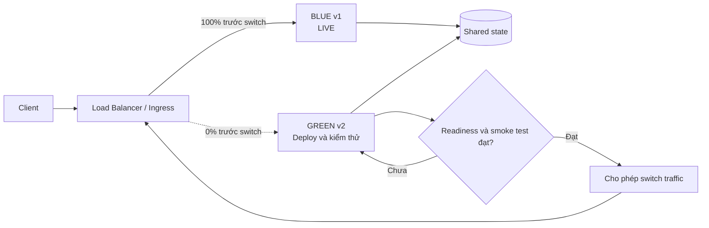

# Blue-Green Deployment Pattern

## Mục lục

- [Tổng quan](#tổng-quan)
- [Mô hình hai môi trường](#mô-hình-hai-môi-trường)
  - [Blue và Green](#blue-và-green)
  - [Trạng thái traffic](#trạng-thái-traffic)
- [Quy trình triển khai](#quy-trình-triển-khai)
  - [Deploy Green trước khi nhận traffic](#deploy-green-trước-khi-nhận-traffic)
  - [Readiness và kiểm tra trước switch](#readiness-và-kiểm-tra-trước-switch)
  - [Switch traffic](#switch-traffic)
- [Compatibility và shared state](#compatibility-và-shared-state)
  - [Database và schema](#database-và-schema)
  - [API event cache và configuration](#api-event-cache-và-configuration)
- [Rollback](#rollback)
  - [Switch về Blue](#switch-về-blue)
  - [Giới hạn của rollback](#giới-hạn-của-rollback)
- [Use case thực tế](#use-case-thực-tế)
  - [Payment Service critical](#payment-service-critical)
  - [Nâng cấp runtime](#nâng-cấp-runtime)
- [Trade-off](#trade-off)
- [Khi nên và không nên dùng](#khi-nên-và-không-nên-dùng)
- [Lỗi thường gặp](#lỗi-thường-gặp)
- [Quan sát rollout](#quan-sát-rollout)
  - [Metrics theo environment và version](#metrics-theo-environment-và-version)
  - [Telemetry và ngưỡng quyết định](#telemetry-và-ngưỡng-quyết-định)
- [Checklist](#checklist)
  - [Trước switch](#trước-switch)
  - [Sau switch](#sau-switch)
- [Liên kết liên quan](#liên-kết-liên-quan)

---

## Tổng quan

**Blue-Green Deployment** là chiến lược chạy song song hai environment tương đương cho cùng một service. **Blue** là environment đang phục vụ production. **Green** là environment chứa version mới và được chuẩn bị trước khi nhận traffic production.

Green được deploy đầy đủ, kiểm tra readiness và chạy smoke test khi chưa nhận traffic production. Khi Green đạt điều kiện, Load Balancer, Ingress hoặc Service routing chuyển traffic sang Green trong một thao tác. Blue vẫn được giữ lại trong **rollback window** — khoảng thời gian mà việc quay về version cũ còn an toàn.

Pattern này tách hai thời điểm: đưa version mới lên một environment và cho user sử dụng version đó. Nhờ vậy, team có thể kiểm tra Green trước khi switch và chuyển routing về Blue nhanh nếu metrics sau switch xấu. Tuy nhiên, switch nhanh chỉ xử lý đường đi của request; nó không tự hoàn tác database, message hoặc side effect bên ngoài.

## Mô hình hai môi trường

### Blue và Green

Hai environment cần tương đương về capacity, image, configuration, secrets, network policy và cách kết nối dependency. “Giống nhau” không nhất thiết có nghĩa là dùng hai database độc lập. Mô hình phổ biến là Blue và Green cùng truy cập shared state, chẳng hạn database, cache hoặc queue.



Blue và Green có thể là hai Kubernetes `Deployment`, hai target group phía sau Load Balancer hoặc hai nhóm task của cùng một service. Điều quan trọng là routing có thể chọn đúng một environment đang live, còn environment kia vẫn được khởi động và kiểm tra độc lập.

### Trạng thái traffic

| Thời điểm | Blue | Green | Mục tiêu |
|---|---:|---:|---|
| Trước deploy | 100% traffic | Chưa có | Blue tiếp tục phục vụ production. |
| Green đã sẵn sàng | 100% traffic | 0% traffic | Deploy và kiểm tra Green mà không đưa user vào version mới. |
| Sau switch | 0% traffic mới | 100% traffic mới | Green phục vụ production; Blue được giữ để rollback. |
| Hết rollback window | Có thể teardown | 100% traffic | Chỉ dọn Blue sau khi đã xác nhận release ổn định. |

Con số trên mô tả routing của request mới. Request đang xử lý, connection dài hoặc session trên Blue cần được **drain** (ngừng nhận request mới và chờ xử lý xong) trước khi Blue bị dừng.

## Quy trình triển khai

### Deploy Green trước khi nhận traffic

Một quy trình Blue-Green có thể gồm các bước sau:

1. Xác định Blue đang live và artifact của Green là immutable, có version hoặc image digest cụ thể.
2. Chuẩn bị schema hoặc contract tương thích trước khi khởi động Green nếu release có thay đổi shared state.
3. Deploy đầy đủ replica của version mới vào Green.
4. Kiểm tra configuration, secrets, network policy, dependency và capacity của Green.
5. Chờ mọi instance Green đạt readiness.
6. Chạy smoke test và kiểm tra các đường đi cốt lõi trên Green khi chưa switch traffic.
7. Định nghĩa ngưỡng tiếp tục, dừng và rollback trước khi switch.
8. Switch routing sang Green, theo dõi metrics và giữ Blue trong rollback window.
9. Khi release ổn định, chỉ contract schema hoặc teardown Blue sau thời điểm đã thống nhất.

Nếu Green không đạt readiness hoặc smoke test thất bại, không switch traffic. Blue vẫn là environment live và nguyên nhân có thể được điều tra mà chưa ảnh hưởng user production.

### Readiness và kiểm tra trước switch

**Readiness probe** là health check cho biết instance đã đủ điều kiện nhận request. Process khởi động thành công chưa có nghĩa là service đã sẵn sàng. Green có thể vẫn đang nạp configuration, mở connection pool hoặc chờ dependency.

Readiness của Green nên kiểm tra điều kiện cần cho request chính, chẳng hạn:

- Application đã khởi động với đúng image và configuration.
- Dependency bắt buộc có thể truy cập.
- Database connection pool và các resource cần thiết đã sẵn sàng.
- Instance không ở trạng thái drain hoặc maintenance.

Readiness chỉ trả lời **“instance có thể nhận request không?”**. Nó không chứng minh logic nghiệp vụ đúng. Vì vậy, cần thêm smoke test cho các đường đi quan trọng như login, tạo đơn hoặc thanh toán. Nếu test có ghi dữ liệu hoặc tạo side effect, phải dùng dữ liệu và cơ chế kiểm thử đã được kiểm soát; không nên charge payment hoặc tạo giao dịch thật chỉ để xác nhận Green đã chạy.

Green cũng cần được kiểm tra với data và dependency gần production. Nếu Green có background worker, consumer hoặc scheduled job, cần xác định rõ chúng có được chạy trước switch hay không để tránh xử lý message hoặc tạo side effect ngoài dự kiến.

### Switch traffic

Routing thường trỏ tới label, target group hoặc backend của environment đang live. Ví dụ trên Kubernetes, hai `Deployment` dùng cùng label `app` nhưng khác `version`; `Service` chỉ chọn một version tại một thời điểm:

```yaml
apiVersion: v1
kind: Service
metadata:
  name: order-service
spec:
  selector:
    app: order-service
    version: blue       # Đổi thành green khi switch
```

Lệnh dưới đây minh họa việc đổi selector sang Green. Tên label thực tế phải khớp với manifest của service và cần giữ lại các selector khác nếu hệ thống có sử dụng:

```bash
kubectl patch service order-service \
  --type=merge \
  -p '{"spec":{"selector":{"app":"order-service","version":"green"}}}'
```

Sau switch, Load Balancer hoặc Ingress có thể cần thời gian propagation. Blue không nên bị teardown ngay khi lệnh routing hoàn tất. Hãy cho connection và in-flight request được drain, đồng thời theo dõi Green qua metrics theo version.

## Compatibility và shared state

Blue không nhận traffic mới sau switch, nhưng Blue và Green vẫn cùng tồn tại. Green có thể đọc dữ liệu Blue đã ghi trước đó. Nếu cần rollback, Blue phải đọc và xử lý được dữ liệu Green đã tạo trong thời gian Green live.

Vì vậy, Blue-Green không loại bỏ yêu cầu **N-1 compatibility**. Khi hai environment dùng chung state, compatibility phải bao phủ cả chiều Green đọc dữ liệu cũ và chiều Blue đọc dữ liệu do Green tạo.

### Database và schema

Mô hình an toàn cho thay đổi schema là **Expand-Contract**:

```text
1. Expand: thêm full_name, chưa xóa customer_name.
2. Deploy Green: đọc full_name, fallback về customer_name; ghi theo cách Blue vẫn đọc được.
3. Backfill và kiểm tra dữ liệu.
4. Switch traffic sang Green, giữ Blue và schema cũ trong rollback window.
5. Contract: chỉ xóa customer_name sau khi không còn cần rollback.
```

Không nên rename hoặc drop column mà Blue vẫn sử dụng trước khi deploy Green. Nếu Green đã ghi status hoặc data format mà Blue không hiểu, switch về Blue có thể làm lỗi nghiệp vụ dù routing rollback thành công.

Hai database riêng cũng không tự làm rollback an toàn. Sau khi Green nhận write, Blue database có thể bị stale. Muốn switch ngược cần đồng bộ, reconcile dữ liệu hoặc có cơ chế xử lý write phát sinh trước khi quay lại Blue. Chi tiết về các trường hợp shared state nằm trong [Deployment Compatibility & Rollback](../29-deployment-compatibility-and-rollback.md).

### API event cache và configuration

| Contract hoặc state | Điều cần giữ trong thời gian Blue và Green cùng tồn tại |
|---|---|
| API | Ưu tiên thay đổi additive; không xóa, đổi tên, đổi kiểu hoặc đổi semantics của field mà version cũ còn dùng. |
| Event và message | Consumer của Blue phải chịu được message do Green tạo; message đã publish không thể được thu hồi bằng switch routing. |
| Cache và session | Hai version phải đọc được format dùng chung, hoặc sử dụng key/session có version và chiến lược invalidate phù hợp. |
| Configuration và secrets | Thêm giá trị mới trước, giữ giá trị cũ trong rollback window; hai environment phải nhận đúng bộ cấu hình production. |
| External side effect | Payment, inventory, email hoặc request tới provider cần idempotency và compensation; switch về Blue không hoàn tác hành động đã xảy ra. |

Ví dụ, Green có thể publish `order.created.v2` trước khi phát hiện lỗi. Việc switch về Blue chỉ đổi nơi nhận request mới. Message đã nằm trong queue hoặc đã được consumer xử lý vẫn cần được xử lý bằng compatibility, DLQ, reconciliation hoặc compensating action phù hợp.

## Rollback

### Switch về Blue

Nếu error rate, latency hoặc business metric của Green vượt ngưỡng đã định nghĩa, cơ chế rollback của Blue-Green là đổi routing về Blue. Blue phải còn healthy và chưa bị teardown.

Ví dụ rollback selector về Blue:

```bash
kubectl patch service order-service \
  --type=merge \
  -p '{"spec":{"selector":{"app":"order-service","version":"blue"}}}'
```

Sau switch ngược:

1. Xác nhận routing mới đã tới Blue.
2. Theo dõi readiness, error rate, latency và business metrics của Blue.
3. Giữ Green để điều tra, hoặc cô lập Green theo runbook của hệ thống.
4. Kiểm tra dữ liệu, queue, cache và side effect phát sinh trong lúc Green phục vụ.

Switch thường nhanh hơn việc thay lại từng instance, nhưng thời gian thực tế phụ thuộc propagation của routing, connection draining và readiness của Blue. Không nên coi “một lệnh patch” là bảo đảm rollback hoàn tất trong một số giây cố định.

### Giới hạn của rollback

Rollback routing chỉ đưa request mới về code cũ. Nó không tự:

- Down migration database hoặc khôi phục dữ liệu đã ghi.
- Xóa message đã publish hoặc hoàn tác event đã được consumer xử lý.
- Làm mất cache incompatibility một cách an toàn.
- Refund payment, release inventory hoặc thu hồi email đã gửi.
- Đồng bộ ngược một database riêng đã nhận write từ Green.

Trong rollback window, giữ Blue, schema mở rộng, event/config cũ và các code path cần thiết. Chỉ teardown Blue hoặc thực hiện thao tác destructive sau khi metrics ổn định, dữ liệu đã được kiểm tra và team xác nhận không còn cần switch ngược.

## Use case thực tế

### Payment Service critical

Payment Service đang chạy version v1 trên Blue. Team chuẩn bị version v2 với thay đổi trong logic xử lý lỗi. Do payment là đường đi critical, team muốn kiểm tra đầy đủ version mới trước khi cho user thật sử dụng và cần một đường quay lại nhanh nếu tỉ lệ lỗi tăng.

Quy trình:

1. Deploy toàn bộ v2 lên Green với cùng configuration và secrets cần thiết.
2. Chờ tất cả instance Green đạt readiness.
3. Chạy smoke test cho các đường đi login, tạo payment request và xử lý lỗi bằng test data an toàn.
4. Switch 100% traffic sang Green.
5. Theo dõi payment success rate, error rate, p95/p99 latency và các failure ở provider.
6. Nếu metrics vượt ngưỡng, switch về Blue và điều tra các payment hoặc transaction đã phát sinh trên Green.

Blue-Green giúp việc đổi routing nhanh, nhưng không biến payment đã charge thành payment chưa charge. Nếu workflow đã tạo side effect, runbook cần có idempotency, reconciliation hoặc compensation riêng.

### Nâng cấp runtime

Team cần đổi runtime từ Java 17 sang Java 21, thay base image và điều chỉnh cấu hình JVM. Đây là thay đổi ảnh hưởng toàn bộ process, khó chia nhỏ thành các instance tương thích từng phần.

Green có thể chạy runtime mới với đầy đủ replica để kiểm tra startup, readiness, dependency và hiệu năng cơ bản trước switch. Nếu Green không đạt yêu cầu, Blue tiếp tục phục vụ mà không cần thay đổi runtime đang chạy. Nếu Green ổn định, team switch routing và giữ Blue đủ lâu để rollback khi cần.

## Trade-off

| Giá trị nhận được | Chi phí hoặc rủi ro phải chấp nhận |
|---|---|
| Có thể kiểm tra đầy đủ Green trước khi nhận traffic production. | Cần duy trì hai environment và thường tốn khoảng 2× resource trong rollback window. |
| Switch traffic và rollback code nhanh qua cùng một điểm routing. | Switch là thay đổi toàn bộ: sau switch, lỗi của Green có thể ảnh hưởng toàn bộ traffic mới. |
| Blue và Green có trạng thái rõ ràng, dễ xác định environment live. | Hai environment phải đồng bộ configuration, secrets, network policy và dependency. |
| Không route request mới vào Green khi Green chưa sẵn sàng. | Readiness không phát hiện mọi lỗi logic, data quality hoặc business regression. |
| Phù hợp với thay đổi runtime hoặc process lớn. | Shared database, cache, queue và side effect vẫn đòi hỏi compatibility hai chiều. |

## Khi nên và không nên dùng

| Nên dùng khi | Nên cân nhắc cách khác hoặc đổi thiết kế khi |
|---|---|
| Service critical cần rollback code nhanh qua traffic switch. | Cluster hoặc service không thể chịu chi phí resource cho hai environment đầy đủ. |
| Muốn test version mới trước khi user production nhận request. | Schema có breaking change và không thể dùng Expand-Contract. |
| Thay đổi runtime, base image hoặc configuration của toàn bộ process. | Service stateful phụ thuộc local disk hoặc connection dài hạn khó chuyển và drain. |
| Tần suất release thấp đến trung bình, mỗi release đáng đầu tư environment thứ hai. | Có rất nhiều service release nhiều lần mỗi ngày và overhead duy trì Blue-Green quá lớn. |
| Đã có routing, readiness, observability và runbook switch được kiểm tra. | Chưa thể xác định environment nào đang live hoặc không có metrics tách theo version. |

Blue-Green phù hợp nhất khi tốc độ rollback và khả năng kiểm tra trước switch quan trọng hơn chi phí resource. Nếu compatibility của shared state chưa được giải quyết, việc có hai environment không làm release trở nên an toàn tự động.

## Lỗi thường gặp

| Lỗi | Hậu quả | Cách phòng tránh |
|---|---|---|
| Nghĩ Green “up” nghĩa là Green đúng. | Lỗi business chỉ xuất hiện sau switch khi toàn bộ traffic mới vào Green. | Chờ readiness và chạy smoke test cho đường đi cốt lõi với dữ liệu an toàn. |
| Green lệch configuration, secrets hoặc environment variables so với Blue. | Lỗi chỉ lộ ra khi switch; rollback routing không xử lý nguyên nhân cấu hình. | Kiểm tra parity bằng manifest/config review và log version rõ ràng. |
| Switch khi chưa phải mọi instance Green đều ready. | Một phần request đi vào pod chưa có dependency hoặc connection pool cần thiết. | Chỉ switch sau khi readiness của toàn bộ capacity Green đạt. |
| Teardown Blue ngay sau switch. | Mất environment có thể dùng để rollback khi bug xuất hiện muộn. | Giữ Blue qua rollback window và chỉ dọn sau khi đã kiểm tra dữ liệu, metrics. |
| Cắt connection hoặc session đang xử lý trên Blue. | In-flight request bị gián đoạn hoặc transaction/message bị xử lý nửa chừng. | Đưa Blue về trạng thái không nhận request mới, drain connection và graceful shutdown. |
| Thực hiện migration destructive cùng lúc với switch. | Blue không đọc được schema mới hoặc không thể chạy khi switch ngược. | Dùng Expand-Contract; trì hoãn `DROP`, rename và contract đến sau rollback window. |
| Cho rằng switch về Blue hoàn tác được side effect. | Payment, inventory hoặc message đã tạo vẫn còn trạng thái mới. | Dùng idempotency, reconciliation và compensating action theo từng nghiệp vụ. |

## Quan sát rollout

### Metrics theo environment và version

Dashboard cần phân biệt Blue và Green, hoặc ít nhất phân biệt `environment`, `version` và image digest. Trước switch, metrics của Green chủ yếu phản ánh readiness và smoke test. Sau switch, cần so sánh Green với baseline của Blue trong cùng khung thời gian.

| Nhóm | Tín hiệu nên theo dõi | Câu hỏi cần trả lời |
|---|---|---|
| Routing | Tỉ lệ request tới Blue/Green và thời điểm propagation. | Traffic đã thực sự chuyển tới đúng environment chưa? |
| Request | Rate, HTTP 5xx và lỗi nghiệp vụ theo version. | Green có lỗi nhiều hơn Blue không? |
| Latency | p95 và p99 theo version. | Green có chậm hơn hoặc có đuôi latency bất thường không? |
| Saturation | CPU, memory, connection pool và queue lag. | Green có rò rỉ hoặc khóa tài nguyên không? |
| Business | Payment success rate, order success rate hoặc KPI chính của service. | Request có thể trả 200 nhưng kết quả nghiệp vụ có giảm không? |
| Data quality | DLQ, parse error, reconciliation mismatch và duplicate event. | Green có tạo state hoặc message mà hệ thống khác không xử lý được không? |

### Telemetry và ngưỡng quyết định

Telemetry nên mang định danh environment, version, commit hoặc image digest:

```text
Log:    {"service":"order-service","environment":"green","version":"v2.1.0","image_digest":"sha256:..."}
Metric: http_requests_total{service="order-service",environment="green",status="500"}
Trace:  deployment.environment = "green"
        deployment.version = "v2.1.0"
```

Trước switch, thống nhất ngưỡng abort và người có quyền switch về Blue. Ví dụ minh họa từ rollout metrics là error rate của Green không vượt quá baseline Blue quá `0.5%`, p99 không vượt `500ms`, và order success rate không giảm quá `1%`. Đây không phải ngưỡng chung cho mọi service; cần điều chỉnh theo SLO, baseline và business risk của hệ thống.

Alert phải chỉ rõ environment và lý do, chẳng hạn: `green order-service error rate vượt baseline sau switch`. Nếu chỉ xem metric tổng của service, team có thể không biết lỗi đến từ Green hay từ dependency dùng chung.

## Checklist

### Trước switch

- [ ] Blue đang healthy và routing hiện tại đã được xác nhận.
- [ ] Artifact Green là immutable, có version hoặc image digest cụ thể.
- [ ] Green có đủ replica, capacity, configuration, secrets và dependency.
- [ ] Readiness của toàn bộ instance Green đã đạt.
- [ ] Smoke test và kiểm tra contract đã chạy trên Green với dữ liệu an toàn.
- [ ] Database, API, event, cache, session và configuration có kế hoạch compatibility.
- [ ] Routing switch và switch ngược đã được kiểm tra trên environment phù hợp.
- [ ] Ngưỡng tiếp tục, abort và owner quyết định đã được thống nhất.

### Sau switch

- [ ] Đã xác nhận traffic mới tới Green và connection trên Blue được drain an toàn.
- [ ] Dashboard tách được metrics theo environment/version.
- [ ] Theo dõi technical metrics, business metrics và data quality.
- [ ] Giữ Blue và contract cũ trong rollback window.
- [ ] Kiểm tra side effect, queue và dữ liệu trước khi teardown Blue.
- [ ] Chỉ thực hiện destructive migration hoặc xóa config cũ sau khi rollback window đóng.

## Liên kết liên quan

- [17 — Deployment Patterns](../17-deployment-patterns.md) — tài liệu nhóm chứa nội dung tổng hợp về Blue-Green và các deployment pattern khác.
- [14 — CI/CD & Deployment](../14-cicd-deployment.md) — pipeline, Kubernetes `Service` selector và cấu hình deployment.
- [29 — Deployment Compatibility & Rollback](../29-deployment-compatibility-and-rollback.md) — compatibility của database, event, cache, configuration và side effect.
- [13 — Orchestration](../13-orchestration.md) — readiness probe, graceful shutdown và connection draining.
- [11 — Observability & Evolvability](../11-observability-evolvability.md) — metrics, logging và distributed tracing.
- [09 — Data Management](../09-data-management.md) — Saga, compensation và Transactional Outbox.
- [16 — Configuration & Secrets Management](../16-configuration-secrets-management.md) — quản lý configuration và secrets trong quá trình chuyển version.
