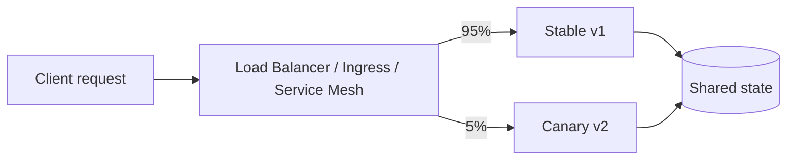
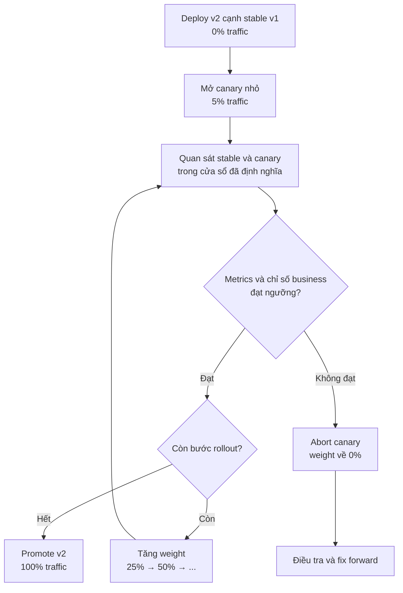

# Canary Deployment Pattern

## Mục lục

- [Tổng quan](#tổng-quan)
- [Mô hình traffic splitting](#mô-hình-traffic-splitting)
  - [Stable và canary](#stable-và-canary)
  - [Cohort và tính ổn định của routing](#cohort-và-tính-ổn-định-của-routing)
- [Quy trình progressive rollout](#quy-trình-progressive-rollout)
  - [Chuẩn bị version mới](#chuẩn-bị-version-mới)
  - [Các bước tăng traffic](#các-bước-tăng-traffic)
  - [Cổng metrics trước mỗi bước](#cổng-metrics-trước-mỗi-bước)
- [Compatibility và shared state](#compatibility-và-shared-state)
  - [Vì sao cửa sổ tương thích kéo dài](#vì-sao-cửa-sổ-tương-thích-kéo-dài)
  - [Các lớp contract cần kiểm tra](#các-lớp-contract-cần-kiểm-tra)
  - [Expand Contract cho database](#expand-contract-cho-database)
  - [Session và side effect](#session-và-side-effect)
- [Use case thực tế](#use-case-thực-tế)
  - [Order Service đổi thuật toán tính phí](#order-service-đổi-thuật-toán-tính-phí)
  - [Thay đổi dependency dưới tải thực](#thay-đổi-dependency-dưới-tải-thực)
- [Quan sát rollout](#quan-sát-rollout)
  - [Metrics kỹ thuật business và data quality](#metrics-kỹ-thuật-business-và-data-quality)
  - [Phân tách telemetry theo version và cohort](#phân-tách-telemetry-theo-version-và-cohort)
  - [Auto promote và auto abort](#auto-promote-và-auto-abort)
- [Abort và rollback canary](#abort-và-rollback-canary)
  - [Đưa weight về 0](#đưa-weight-về-0)
  - [Giới hạn của rollback code](#giới-hạn-của-rollback-code)
- [Trade-off](#trade-off)
- [Khi nên và không nên dùng](#khi-nên-và-không-nên-dùng)
- [Lỗi thường gặp](#lỗi-thường-gặp)
- [Checklist](#checklist)
  - [Trước rollout](#trước-rollout)
  - [Trong rollout](#trong-rollout)
  - [Khi abort](#khi-abort)
  - [Sau rollout](#sau-rollout)
- [Liên kết liên quan](#liên-kết-liên-quan)

---

## Tổng quan

**Canary Deployment** đưa version mới vào production với một phần nhỏ traffic trước khi mở rộng cho toàn bộ traffic. Version đang phục vụ chính được gọi là **stable**; version mới được gọi là **canary**. Team quan sát hành vi của hai version, rồi tăng dần tỷ lệ traffic khi các cổng metrics đạt ngưỡng đã định nghĩa.

Tên gọi *Canary* xuất phát từ hình ảnh con chim canary từng được dùng như dấu hiệu cảnh báo khí độc trong hầm mỏ. Trong deployment, canary có vai trò cảnh báo sớm: nếu version mới có lỗi, **blast radius** (phạm vi user bị ảnh hưởng) được giới hạn ở nhóm traffic đang đi vào canary thay vì toàn bộ user.

Canary là một hình thức **Progressive Delivery** (phát hành tiến dần). Mỗi bước rollout mở rộng rủi ro một ít và được chốt bằng dữ liệu thật trên production. Ví dụ một lộ trình có thể là `5% → 25% → 50% → 100%`. Nếu metrics xấu, team dừng promotion và đưa canary về `0%` traffic.

Canary kiểm soát đường đi của request, không tự giải quyết compatibility của database, event, cache hoặc side effect bên ngoài. Vì stable và canary thường cùng tồn tại trong thời gian dài, các contract dùng chung phải được thiết kế để cả hai version cùng hoạt động.

## Mô hình traffic splitting

### Stable và canary

**Traffic splitting** là cơ chế tại Load Balancer, Ingress, Service Mesh hoặc một router khác để phân request giữa stable và canary. Ở bước đầu, router có thể gửi `95%` traffic tới stable v1 và `5%` tới canary v2.



Tỷ lệ trong sơ đồ là quyết định routing của hạ tầng. Team cần kiểm tra metrics routing để xác nhận traffic thực tế đã đến đúng subset. Stable và canary cũng phải có định danh rõ ràng trong service discovery hoặc routing rule; nếu không, metrics và rollback sẽ khó xác định đúng version.

Với Istio, `VirtualService` có thể đặt `weight` cho hai subset. `DestinationRule` bên dưới chỉ là phần minh họa để gắn subset với label version; tên label thực tế phải khớp manifest của service:

```yaml
apiVersion: networking.istio.io/v1beta1
kind: VirtualService
metadata:
  name: order-service
spec:
  hosts:
    - order-service
  http:
    - route:
        - destination:
            host: order-service
            subset: stable
          weight: 95
        - destination:
            host: order-service
            subset: canary
          weight: 5

---
apiVersion: networking.istio.io/v1beta1
kind: DestinationRule
metadata:
  name: order-service
spec:
  host: order-service
  subsets:
    - name: stable
      labels:
        version: v1
    - name: canary
      labels:
        version: v2
```

Traffic splitting không bắt buộc phải dùng Istio. Load Balancer hoặc API Gateway cũng có thể cung cấp weighted routing hay routing theo header, cookie và nhóm user. Chi tiết cấu hình Kubernetes, Istio và Flagger nằm trong [14 — CI/CD & Deployment](../14-cicd-deployment.md).

### Cohort và tính ổn định của routing

**Cohort** là nhóm request hoặc user được áp dụng cùng một rule routing để team có thể quan sát và so sánh. Cohort nhỏ nhất trong weighted canary thường là hai nhóm `stable` và `canary`. Khi đọc metrics, cần so sánh hai nhóm trong cùng khung thời gian và với loại traffic tương đương.

Cách chọn cohort ảnh hưởng trực tiếp đến trải nghiệm user:

| Cách chia cohort | Đặc điểm | Điểm cần kiểm tra |
|---|---|---|
| Weight trên từng request | Router chia traffic theo tỷ lệ stable/canary. Hai request liên tiếp của cùng user có thể đi tới hai version khác nhau. | API và session phải chịu được việc request lẫn version. |
| Sticky routing theo user hoặc session | Một user được giữ trong cùng nhóm trong thời gian rollout. | Cần định danh user hoặc cơ chế sticky phù hợp; phải xử lý khi user đổi thiết bị hoặc mất session. |
| Header, cookie hoặc region | Một nhóm cụ thể, chẳng hạn internal users hoặc một region, được route theo điều kiện. | Rule phải được ghi nhận trong telemetry và metrics phải tách riêng cho cohort đó. |

Nếu session hoặc workflow dài không chịu được việc một user đổi version giữa các request, hãy cân nhắc sticky routing theo `userId`. Sticky routing chỉ giúp giữ user trong một cohort; nó không thay thế compatibility giữa stable và canary khi chúng cùng dùng database, cache hoặc queue.

## Quy trình progressive rollout

Một canary rollout cần có điểm bắt đầu, các cổng quyết định và lối thoát. Flow dưới đây mô tả một lộ trình điển hình:



### Chuẩn bị version mới

Trước khi mở traffic, cần chuẩn bị cả version mới và khả năng quan sát rollout:

1. **Đóng gói artifact immutable.** Image hoặc binary phải có version hoặc image digest cụ thể, không dùng tag mơ hồ như `latest`.
2. **Deploy canary cạnh stable.** Canary phải khởi động độc lập nhưng chưa nhận traffic production khi chưa đạt readiness.
3. **Kiểm tra readiness.** Readiness probe cho biết instance đã đủ điều kiện nhận request, nhưng không chứng minh business logic đúng.
4. **Chạy smoke test an toàn.** Kiểm tra các đường đi cốt lõi với dữ liệu kiểm soát. Không tạo payment thật hoặc side effect không cần thiết chỉ để xác nhận canary đã chạy.
5. **Xác nhận compatibility.** API, database, event, cache, session và configuration phải hỗ trợ thời gian stable và canary cùng tồn tại.
6. **Chuẩn bị dashboard và ngưỡng.** Dashboard phải tách được stable/canary. Ngưỡng promote, hold và abort phải được thống nhất trước rollout, cùng với người có quyền abort.

### Các bước tăng traffic

Các mốc dưới đây là ví dụ. Tỷ lệ và thời gian quan sát cần dựa trên traffic, rủi ro của thay đổi và độ trễ của business metrics; không phải mọi service đều dùng cùng một lịch trình.

| Giai đoạn | Traffic minh họa | Mục tiêu |
|---|---:|---|
| Chuẩn bị | `0%` canary | Deploy v2, kiểm tra readiness, configuration và smoke test trước khi route user. |
| Bước đầu | `5%` canary | Phát hiện lỗi request, latency, resource hoặc business với blast radius nhỏ. |
| Mở rộng | `25%` rồi `50%` | Tăng lượng dữ liệu quan sát sau khi bước trước đạt ngưỡng. |
| Hoàn tất | `100%` canary | Xác nhận v2 đã nhận toàn bộ traffic và stable vẫn được giữ trong rollback window. |

Mỗi bước nên có một cửa sổ quan sát đủ để phát hiện cả lỗi tức thời và lỗi trễ. Memory leak hoặc connection leak có thể không lộ ra sau vài phút. Ngược lại, service có traffic thấp có thể cần thời gian dài hơn để thu thập đủ dữ liệu. Kết luận thực tế là: quyết định promote bằng metrics và ngữ cảnh traffic, không chỉ bằng một bộ đếm thời gian.

### Cổng metrics trước mỗi bước

Trước khi tăng `weight`, thực hiện cùng một chuỗi kiểm tra:

1. **Kiểm tra routing.** Xác nhận tỷ lệ request thực tế đến đúng stable và canary.
2. **So sánh cùng thời điểm.** Đối chiếu canary với stable trong cùng khung giờ và với loại traffic tương đương, không đối chiếu với trung bình của cả ngày.
3. **Đọc technical metrics.** Kiểm tra error rate, latency, CPU, memory, connection pool và queue lag theo version.
4. **Đọc business metrics (chỉ số nghiệp vụ).** Kiểm tra KPI chính như order success rate, payment success rate hoặc tỷ lệ hoàn tất flow.
5. **Kiểm tra data quality.** Tìm parse error, message vào DLQ (Dead Letter Queue), duplicate event hoặc reconciliation mismatch nếu service có các tín hiệu này.
6. **Chốt quyết định.** Promote khi các ngưỡng đạt; giữ nguyên weight để điều tra khi dữ liệu chưa đủ; abort khi vượt ngưỡng đã định nghĩa.

## Compatibility và shared state

### Vì sao cửa sổ tương thích kéo dài

**Shared state** là trạng thái được nhiều instance hoặc service cùng sử dụng, chẳng hạn database, cache, queue, event bus và session store. Trong canary, stable v1 và canary v2 thường cùng đọc và ghi shared state trong nhiều bậc rollout.

Vì vậy, cần **N-1 compatibility hai chiều** (tương thích qua lại giữa v1 và v2) trong rollback window: v2 đọc được dữ liệu và contract mà v1 đang dùng, đồng thời v1 vẫn đọc được dữ liệu hoặc message mà v2 đã tạo. Canary có thể giữ hai version cùng tồn tại hàng giờ, nên cửa sổ tương thích thường kéo dài hơn một Rolling Update ngắn.

Traffic splitting làm giảm blast radius của lỗi code. Nó không làm cho dữ liệu v2 tự trở nên an toàn với v1. Nếu v2 ghi format mà v1 không hiểu, việc đưa canary về `0%` có thể khiến stable lỗi khi đọc dữ liệu mới.

### Các lớp contract cần kiểm tra

| Lớp | Quy tắc khi stable và canary cùng tồn tại |
|---|---|
| API contract | Ưu tiên thay đổi additive. Không xóa, đổi tên, đổi kiểu hoặc đổi semantics của field mà version cũ còn dùng. |
| Database schema và data | Thêm cấu trúc trước, deploy code tương thích, rồi mới contract sau rollback window. v1 phải đọc được data do v2 ghi trong giai đoạn chuyển tiếp. |
| Event và message | Version hóa event khi format hoặc semantics thay đổi. Consumer cần bỏ qua field chưa biết và xử lý message idempotent. Message đã publish vẫn có thể nằm trong queue sau khi abort. |
| Cache | Dùng cache key có version hoặc chiến lược invalidate phù hợp nếu hai version không đọc chung được format. Cache không được coi là source of truth. |
| Session | Giữ khả năng đọc session cũ và mới, hoặc dùng sticky routing khi workflow yêu cầu trải nghiệm nhất quán. |
| Configuration và secrets | Thêm giá trị mới trước, giữ giá trị cũ cho stable qua rollback window, rồi mới xóa sau. |
| External side effect | Payment, inventory, email và request tới provider cần idempotency (xử lý lặp an toàn), reconciliation hoặc compensating action. Đổi weight không thu hồi được side effect đã xảy ra. |

Nếu một thay đổi không thể cho stable và canary cùng đọc ghi shared state, đừng cố giải quyết bằng cách tăng rollout nhanh hơn. Hãy tách thay đổi thành các phase compatible hoặc dùng cách tách deploy khỏi release như Feature Toggle khi phù hợp.

### Expand Contract cho database

**Expand-Contract** là cách thay đổi schema theo các bước để version cũ và mới cùng sống được. Với ví dụ đổi `customer_name` thành `full_name`, trình tự có thể là:

```text
1. EXPAND: thêm full_name dạng nullable, chưa xóa customer_name.
2. DEPLOY: v2 đọc full_name và fallback về customer_name; ghi theo cách v1 vẫn đọc được.
3. BACKFILL: điền dữ liệu full_name theo batch và kiểm tra kết quả.
4. CANARY: mở traffic từng bước, tiếp tục theo dõi dữ liệu và metrics.
5. CONTRACT: chỉ xóa customer_name sau khi rollback window đóng.
```

Migration nên chạy như một job độc lập trước khi code mới sử dụng schema. Không nên để mỗi pod tự chạy migration lúc startup, vì nhiều pod có thể chạy đồng thời và tạo trạng thái khó đoán.

Trong rollback window, giữ schema mở rộng và các contract cũ. `DROP COLUMN`, xóa event version cũ hoặc xóa configuration mà stable còn cần đều là thao tác destructive; chỉ thực hiện sau khi team xác nhận không còn cần quay về version cũ. Phân tích đầy đủ về compatibility và rollback nằm trong [29 — Deployment Compatibility & Rollback](../29-deployment-compatibility-and-rollback.md).

### Session và side effect

Một request của cùng user có thể lần lượt đi tới stable rồi canary nếu routing chỉ dùng weight trên request. Nếu flow có session hoặc nhiều bước, hai version cần hiểu cùng session format. Nếu không thể bảo đảm điều đó, dùng sticky routing hoặc thiết kế lại contract trước rollout.

Canary cũng có thể tạo side effect thật ngay cả khi chỉ nhận một phần traffic. Ví dụ, canary có thể charge payment, trừ inventory, publish event hoặc gửi request tới provider. Khi abort, các hành động này không biến mất. Hãy dùng idempotency key, reconciliation và compensating action phù hợp với nghiệp vụ; với smoke test, ưu tiên dữ liệu kiểm thử không tạo giao dịch thật.

## Use case thực tế

### Order Service đổi thuật toán tính phí

Order Service của một hệ thống e-commerce xử lý khoảng `1 triệu request/ngày` và thay đổi thuật toán tính phí shipping. Đây là thay đổi có thể làm tăng lỗi hoặc làm thay đổi kết quả business dù HTTP request vẫn trả `200`. Giả sử hệ thống có Istio và dashboard tách metrics theo version.

Với traffic này, `5%` tạo ra một cohort đủ lớn để nhóm quan sát error rate và hành vi tính phí trước khi mở rộng. Một rollout minh họa:

| Giai đoạn | Việc thực hiện | Dữ liệu cần xem |
|---|---|---|
| Chuẩn bị | Deploy v2 cạnh v1, kiểm tra readiness và smoke test an toàn. | Image digest, dependency, log khởi động và lỗi readiness. |
| `5%` | Giữ canary ở 5% trong một cửa sổ quan sát, ví dụ một giờ. | Error rate, p99 latency và giá shipping trung bình của các cohort tương đương. |
| `25%` rồi `50%` | Chỉ tăng weight sau khi bước trước đạt ngưỡng. | Error rate, saturation và order success rate theo stable/canary. |
| `100%` | Promote v2, tiếp tục giữ contract và khả năng quay về stable trong rollback window. | Business metrics trễ, data quality, queue và side effect. |

Nếu order success rate giảm hoặc error rate của canary vượt ngưỡng, team dừng promotion và đưa weight về `0%`. Sau đó cần kiểm tra các order hoặc dữ liệu mà v2 đã tạo; việc route request về v1 không tự sửa chúng.

### Thay đổi dependency dưới tải thực

Một service có thể đổi từ HTTP/1.1 sang gRPC hoặc đổi thư viện kết nối database. Các lỗi như connection leak có thể chỉ xuất hiện dưới tải thật mà staging không tái hiện được.

Canary một phần traffic trong giờ cao điểm giúp team quan sát connection pool, memory, latency và error rate của v2 bên cạnh stable. Nếu dependency mới gây bất thường, abort canary giới hạn số request chịu ảnh hưởng và giữ stable phục vụ phần traffic còn lại. Đây vẫn là lý do để kiểm tra compatibility và side effect trước: lỗi hạ tầng không miễn trừ các yêu cầu của shared state.

## Quan sát rollout

### Metrics kỹ thuật business và data quality

Một dashboard rollout nên tách stable và canary theo version, đồng thời hiển thị baseline (mức tham chiếu) trong cùng khung thời gian:

| Nhóm | Tín hiệu nên theo dõi | Câu hỏi cần trả lời |
|---|---|---|
| Routing | Tỷ lệ request tới stable/canary và thời điểm routing propagation. | Weight đã được áp dụng đúng chưa? |
| Request | Rate, HTTP 5xx và lỗi nghiệp vụ theo version. | Canary có lỗi nhiều hơn stable không? |
| Latency | p95 và p99 theo version. Đây là mốc thời gian mà 95% hoặc 99% request hoàn thành trong giới hạn đó. | Canary có chậm hơn hoặc có đuôi latency bất thường không? |
| Saturation | CPU, memory, connection pool và queue lag. | Version mới có rò rỉ hoặc khóa tài nguyên không? |
| Business | Order success rate, payment success rate, tỷ lệ hoàn tất flow hoặc KPI chính. | Request có thể trả 200 nhưng kết quả nghiệp vụ có giảm không? |
| Data quality | Reconciliation mismatch, parse error, DLQ và duplicate event. | Canary có tạo state hoặc message mà hệ thống khác không xử lý được không? |

Technical metrics thường phát hiện lỗi nhanh hơn business metrics. Người dùng cần thời gian để bỏ giỏ hàng hoặc hoàn tất một flow. Vì vậy, mỗi bậc traffic cần cửa sổ quan sát phù hợp với độ trễ của KPI quan trọng nhất.

Ngưỡng phải được định nghĩa trước rollout. Ví dụ minh họa có thể là error rate của canary không cao hơn stable quá `0.5%`, p99 không vượt `500ms`, và order success rate không giảm quá `1%`. Đây không phải ngưỡng dùng chung cho mọi service; hãy điều chỉnh theo SLO (mục tiêu mức độ dịch vụ), baseline và business risk.

### Phân tách telemetry theo version và cohort

Mọi **telemetry** (dữ liệu quan sát từ log, metrics và trace) cần chỉ ra request thuộc version nào và, khi cần, thuộc cohort nào. Image digest giúp truy ra artifact chính xác hơn một version label:

```text
Log:    {"service":"order-service","version":"v2.1.0","cohort":"canary","image_digest":"sha256:..."}
Metric: http_requests_total{service="order-service",version="v2.1.0",cohort="canary",status="500"}
Trace:  deployment.version = "v2.1.0"
        deployment.cohort = "canary"
```

Dashboard nên cho phép đặt stable và canary cạnh nhau, không chỉ xem tổng của service. Log nên có request hoặc correlation ID để truy vết request qua các service. Khi so sánh, dùng cùng khung giờ và cùng loại traffic; nếu không, chênh lệch có thể đến từ cohort chứ không phải từ version.

Alert cũng phải nêu rõ bước rollout và lý do, chẳng hạn: `canary order-service abort ở 25%: success rate 97.8% < 99%`. Thông báo này giúp người trực ca biết phải dừng promotion, điều tra version nào và kiểm tra side effect nào.

### Auto promote và auto abort

Công cụ như Flagger có thể chạy vòng phân tích theo `interval`, tăng `stepWeight` khi metrics đạt và abort khi số lần kiểm tra thất bại vượt `threshold`. Một phần cấu hình minh họa:

```yaml
analysis:
  interval: 1m
  threshold: 5
  maxWeight: 50
  stepWeight: 10
  metrics:
    - name: request-success-rate
      thresholdRange:
        min: 99
      interval: 1m
    - name: request-duration
      thresholdRange:
        max: 500
      interval: 1m
```

Trong ví dụ này, công cụ kiểm tra mỗi phút, tăng traffic theo từng bước, và ngừng rollout sau tối đa năm lần kiểm tra thất bại. Các con số chỉ là cấu hình minh họa; chúng phải được điều chỉnh theo SLO và đặc tính traffic của service.

Auto abort phù hợp hơn khi metrics kỹ thuật đáng tin cậy, thay đổi lặp lại và blast radius mỗi bước nhỏ. Với business metrics phức tạp, schema migration lần đầu hoặc ảnh hưởng pháp lý và tài chính lớn, người có trách nhiệm vẫn cần quyết định. Dù tự động hay thủ công, runbook phải nêu rõ ai được abort và sau abort cần kiểm tra những gì.

## Abort và rollback canary

### Đưa weight về 0

Trong canary, rollback traffic thường bắt đầu bằng việc **abort** rollout và đưa canary weight về `0%`. Stable nhận lại traffic theo routing rule. Trình tự nên được chuẩn bị và diễn tập trước release:

1. Dừng auto-promotion hoặc controller đang tăng weight.
2. Đặt canary về `0%` và stable về tỷ lệ phục vụ tương ứng.
3. Xác nhận routing thực tế đã trở về stable, không chỉ kiểm tra cấu hình.
4. Theo dõi error rate, latency và business metrics của stable sau khi traffic quay về.
5. Drain request đang xử lý trên canary, giữ log và artifact để điều tra.
6. Kiểm tra database, queue, cache, event và side effect mà canary đã tạo.
7. Fix forward hoặc deploy bản đã sửa sau khi xác định nguyên nhân.

Ví dụ phần route sau khi abort có thể biểu diễn như sau:

```yaml
route:
  - destination:
      host: order-service
      subset: stable
    weight: 100
  - destination:
      host: order-service
      subset: canary
    weight: 0
```

Tên trường và cách cập nhật phụ thuộc controller hoặc platform đang dùng. Điều cần bảo đảm là traffic mới không tiếp tục đi vào canary và stable vẫn healthy.

### Giới hạn của rollback code

Đưa weight về `0%` chỉ thay đổi nơi request mới được route. Nó không tự:

- Xóa database record hoặc hoàn tác schema migration.
- Thu hồi message đã publish hoặc event đã consumer xử lý.
- Xóa cache theo format mới một cách an toàn.
- Refund payment, release inventory hoặc thu hồi email đã gửi.
- Đồng bộ ngược dữ liệu nếu canary dùng một state store khác.

Vì vậy, rollback code phải đi cùng compatibility và kiểm tra side effect. Trong rollback window, giữ schema mở rộng, contract cũ, event version cũ và configuration mà stable cần. Chỉ contract hoặc xóa canary sau khi metrics, dữ liệu và business impact đã được kiểm tra. Quy trình rollback nhiều lớp nằm trong [29 — Deployment Compatibility & Rollback](../29-deployment-compatibility-and-rollback.md); trang này chỉ tập trung vào điểm đặc thù của canary là abort traffic theo weight.

## Trade-off

| Giá trị nhận được | Chi phí hoặc rủi ro phải chấp nhận |
|---|---|
| Blast radius nhỏ: lỗi ban đầu chỉ ảnh hưởng cohort đang đi vào canary. | Rollout lâu hơn vì mỗi bậc cần thời gian quan sát và phân tích. |
| Quyết định dựa trên dữ liệu production thay vì chỉ dựa vào test suite. | Cần traffic splitting, metrics phân version và quy trình promote/abort rõ ràng. |
| Có thể phát hiện lỗi chỉ xuất hiện dưới tải thật. | Cần thêm resource cho canary subset; chi phí không bằng không. |
| Có thể tự động hóa promote và abort theo các cổng metrics. | Vận hành phức tạp hơn khi metrics không đáng tin cậy hoặc business flow có độ trễ. |
| Có thể kết hợp với Service Mesh, API Gateway hoặc Feature Toggle. | Stable và canary cùng ghi shared state lâu hơn, nên compatibility và side effect khó quản lý hơn. |

Canary đổi tốc độ và độ đơn giản lấy khả năng học từ traffic thật. Nếu team không có metrics phân tách theo version, phần “học” bị mất và canary trở thành một rollout phức tạp nhưng mù thông tin.

## Khi nên và không nên dùng

| Nên dùng Canary khi | Nên cân nhắc cách khác hoặc đổi thiết kế khi |
|---|---|
| Traffic đủ lớn để một phần nhỏ như 5% tạo ra dữ liệu có ý nghĩa. | Traffic quá nhỏ, chẳng hạn 5% của 100 request/ngày, không đủ cơ sở kết luận nhanh. |
| Có dashboard và alert tách stable/canary theo version. | Không thể xác định lỗi thuộc version nào. |
| Thay đổi có rủi ro cao về algorithm, dependency hoặc performance. | Hai version không thể cùng đọc ghi shared state trong rollback window. |
| Muốn quyết định rollout bằng metrics technical và business. | Không thể chấp nhận request của một user lẫn giữa hai version và cũng không có sticky routing hoặc compatibility phù hợp. |
| Đã có Load Balancer, Service Mesh hoặc routing layer hỗ trợ traffic splitting. | Release khẩn không có thời gian quan sát từng bậc hoặc chưa có owner trực tiếp abort. |

Canary phù hợp khi team có khả năng vận hành theo dữ liệu. Nếu điều kiện đó chưa có, hãy giải quyết observability và contract trước thay vì chỉ thêm một routing rule.

## Lỗi thường gặp

| Lỗi | Hậu quả | Cách phòng tránh |
|---|---|---|
| So sánh canary với trung bình toàn cục hoặc trung bình cả ngày. | Khác biệt theo giờ và loại traffic che mất regression của v2. | So stable và canary cùng thời điểm, cùng loại traffic và cùng cohort phù hợp. |
| Chỉ theo dõi HTTP 5xx. | Request vẫn trả `200` nhưng business KPI, data quality hoặc latency xấu đi. | Thêm error nghiệp vụ, p95/p99, saturation, business metrics và data quality. |
| Tăng weight quá nhanh hoặc quan sát quá ngắn. | Memory leak, connection leak hoặc business metric trễ chưa kịp lộ ra. | Đặt cửa sổ quan sát theo rủi ro và độ trễ của metrics; chỉ tăng khi gate đạt. |
| Bỏ qua idempotency và dữ liệu ghi lẫn. | Stable không đọc được data/event do canary tạo; retry có thể tạo side effect trùng. | Thiết kế N-1 compatibility, version hóa event và kiểm tra write path trước rollout. |
| Không định nghĩa ngưỡng abort trước release. | Team tranh luận khi sự cố đang xảy ra và trì hoãn quyết định. | Ghi ngưỡng promote/hold/abort, baseline và người có quyền abort trong runbook. |
| Không kiểm tra session và cohort consistency. | Một user đổi version giữa các bước của cùng workflow và thấy hành vi không nhất quán. | Dùng sticky routing khi cần hoặc bảo đảm hai version cùng hiểu session và contract. |
| Chạy smoke test có side effect thật. | Test canary tạo payment, order hoặc message ngoài dự kiến. | Dùng test data an toàn, idempotency và cơ chế kiểm soát side effect. |
| Abort nhưng không kiểm tra state đã tạo. | Weight về `0%` nhưng dữ liệu, queue hoặc payment lỗi vẫn tiếp tục ảnh hưởng hệ thống. | Sau abort, kiểm tra shared state, side effect, DLQ và reconciliation trước khi fix forward. |

## Checklist

### Trước rollout

- [ ] Artifact canary là immutable và có version hoặc image digest rõ ràng.
- [ ] Stable và canary có readiness probe, configuration, secrets và dependency cần thiết.
- [ ] Traffic splitting đã route đúng subset trong môi trường phù hợp.
- [ ] Cohort strategy đã rõ: weight theo request, sticky theo user/session hoặc routing theo điều kiện.
- [ ] API, database, event, cache, session và configuration có kế hoạch compatibility hai chiều.
- [ ] Dashboard và alert tách được metrics theo version và cohort.
- [ ] Ngưỡng promote, hold và abort được định nghĩa trước, cùng với owner quyết định.
- [ ] Smoke test không tạo side effect production ngoài dự kiến.
- [ ] Abort, drain và fix-forward procedure đã được kiểm tra.

### Trong rollout

- [ ] Xác nhận traffic thực tế khớp weight trước khi đánh giá metrics.
- [ ] Mỗi bậc `5% → 25% → 50% → 100%` chỉ mở sau khi gate trước đạt.
- [ ] So sánh stable và canary cùng thời điểm và cùng loại traffic.
- [ ] Theo dõi technical metrics, business metrics và data quality.
- [ ] Theo dõi session consistency, connection draining và side effect.
- [ ] Không chạy `DROP`, xóa event/config cũ hoặc thao tác destructive trong rollback window.

### Khi abort

- [ ] Dừng auto-promotion và đưa canary weight về `0%`.
- [ ] Xác nhận routing mới thực sự trở về stable.
- [ ] Theo dõi stable sau khi nhận lại traffic.
- [ ] Drain request đang xử lý trên canary và giữ artifact, log, trace để điều tra.
- [ ] Kiểm tra database, cache, queue, event, DLQ và side effect đã phát sinh.
- [ ] Giữ schema mở rộng và contract cũ; fix forward thay vì rollback mù các thay đổi destructive.

### Sau rollout

- [ ] Quan sát v2 ở `100%` đủ lâu qua rollback window.
- [ ] Xác nhận business metrics và data quality ổn định, không chỉ HTTP metrics.
- [ ] Chỉ contract schema, xóa event/config cũ hoặc dọn stable sau khi không còn cần rollback.
- [ ] Teardown canary subset sau khi routing và connection đã được drain an toàn.
- [ ] Nếu có abort, ghi lại nguyên nhân, bước weight, metrics và thời gian phản ứng để cải thiện rollout sau.

## Liên kết liên quan

- [17 — Deployment Patterns](../17-deployment-patterns.md) — tài liệu nhóm chứa nội dung tổng hợp về Canary và các deployment pattern khác.
- [14 — CI/CD & Deployment](../14-cicd-deployment.md) — cấu hình traffic splitting với Kubernetes, Istio và Flagger.
- [13 — Orchestration](../13-orchestration.md) — readiness probe, Service Mesh và graceful shutdown.
- [29 — Deployment Compatibility & Rollback](../29-deployment-compatibility-and-rollback.md) — phân tích đầy đủ về API, database, event, cache, configuration và side effect.
- [11 — Observability & Evolvability](../11-observability-evolvability.md) — metrics, logging và distributed tracing.
- [07 — API Gateway](../07-api-gateway.md) — routing theo header hoặc nhóm user ở edge.
- [09 — Data Management](../09-data-management.md) — Saga, compensation và Transactional Outbox.
- [06 — Inter-Service Communication](../06-inter-service-communication.md) — API contract và event versioning giữa các service.
- [16 — Configuration & Secrets Management](../16-configuration-secrets-management.md) — quản lý configuration trong thời gian chuyển version.
- [04 — Autonomy & Independence](../04-autonomy-independence.md) — independent deployment và backward compatibility.
