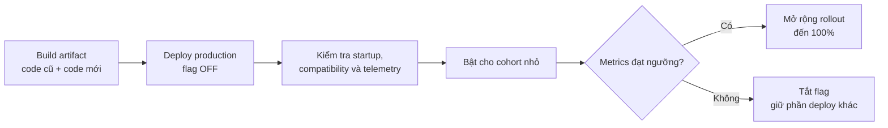
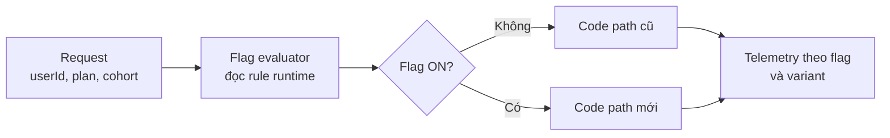

# Feature Toggle Pattern

## Mục lục

- [Tổng quan](#tổng-quan)
- [Tách deploy khỏi release](#tách-deploy-khỏi-release)
  - [Deploy và release là hai thời điểm khác nhau](#deploy-và-release-là-hai-thời-điểm-khác-nhau)
  - [Đánh giá flag tại runtime](#đánh-giá-flag-tại-runtime)
- [Các loại toggle](#các-loại-toggle)
  - [Release toggle](#release-toggle)
  - [Experiment toggle](#experiment-toggle)
  - [Ops toggle](#ops-toggle)
  - [Permission toggle](#permission-toggle)
- [Targeting và rollout](#targeting-và-rollout)
  - [Chọn cohort](#chọn-cohort)
  - [Rollout theo phần trăm](#rollout-theo-phần-trăm)
  - [Các cổng kiểm tra khi rollout](#các-cổng-kiểm-tra-khi-rollout)
- [Vòng đời của flag](#vòng-đời-của-flag)
  - [Định nghĩa flag trước khi viết code](#định-nghĩa-flag-trước-khi-viết-code)
  - [Implement và kiểm thử hai trạng thái](#implement-và-kiểm-thử-hai-trạng-thái)
  - [Deploy ở trạng thái OFF](#deploy-ở-trạng-thái-off)
  - [Bật có kiểm soát và quan sát](#bật-có-kiểm-soát-và-quan-sát)
  - [Hoàn tất và dọn flag](#hoàn-tất-và-dọn-flag)
- [Use case thực tế](#use-case-thực-tế)
  - [Trunk-based development với tính năng so sánh giá](#trunk-based-development-với-tính-năng-so-sánh-giá)
  - [Rollout checkout theo nhóm user](#rollout-checkout-theo-nhóm-user)
  - [Kill switch cho payment gateway](#kill-switch-cho-payment-gateway)
  - [Giữ business path cũ trong schema change](#giữ-business-path-cũ-trong-schema-change)
- [Trade-off](#trade-off)
- [Khi nên và không nên dùng](#khi-nên-và-không-nên-dùng)
- [Lỗi thường gặp](#lỗi-thường-gặp)
- [Flag debt](#flag-debt)
  - [Dấu hiệu của flag debt](#dấu-hiệu-của-flag-debt)
  - [Cách phòng ngừa và xử lý](#cách-phòng-ngừa-và-xử-lý)
- [Checklist](#checklist)
  - [Trước khi deploy](#trước-khi-deploy)
  - [Trong rollout](#trong-rollout)
  - [Khi hoàn tất](#khi-hoàn-tất)
- [Liên kết liên quan](#liên-kết-liên-quan)

---

## Tổng quan

**Feature Toggle** (hay **Feature Flag** — cờ tính năng) là kỹ thuật đặt một điều kiện trước code path (nhánh xử lý) để có thể bật hoặc tắt behavior (hành vi) mới tại **runtime**, tức là khi service đang chạy, mà không cần deploy lại.

```java
if (featureFlags.isEnabled("new-checkout-flow", userId)) {
    return newCheckoutService.process(order);   // Code path mới
} else {
    return legacyCheckoutService.process(order); // Code path cũ
}
```

Khi flag ở trạng thái `OFF`, service tiếp tục dùng code path cũ. Khi flag là `ON` cho một context (ngữ cảnh) cụ thể, chẳng hạn `userId` hoặc gói dịch vụ, context đó dùng code path mới. Vì cả hai path có thể nằm trong cùng artifact, team có thể đưa code lên production trước rồi mới quyết định thời điểm phát hành behavior mới.

Feature Toggle không thay thế kiểm thử, compatibility hoặc observability. Nó chỉ thêm một điểm điều khiển ở tầng ứng dụng. Nếu code path mới đã ghi dữ liệu, publish message hoặc tạo side effect, việc tắt flag sau đó không tự hoàn tác những hành động đã xảy ra.

## Tách deploy khỏi release

### Deploy và release là hai thời điểm khác nhau

- **Deployment** (triển khai) là đưa artifact, chẳng hạn Docker image hoặc binary, lên một environment.
- **Release** (phát hành) là mở behavior của artifact đó cho user thật.

Trong cách làm truyền thống, deploy xong thường đồng nghĩa với release ngay. Feature Toggle tách hai thời điểm này:

| Thời điểm | Việc xảy ra | Vai trò của flag |
|---|---|---|
| Build và deploy | Artifact chứa code path cũ và mới được đưa lên production. | Flag mới thường `OFF`. |
| Kiểm tra sau deploy | Team kiểm tra startup, dependency, configuration và telemetry. | Behavior mới chưa mở cho user ngoài phạm vi kiểm soát. |
| Release | Bật flag cho một cohort (nhóm user có cùng rule). | Flag quyết định caller dùng path nào. |
| Mở rộng | Tăng phạm vi từ nhóm nhỏ tới toàn bộ user. | Giữ khả năng dừng ở từng mốc. |



Trạng thái `OFF` này thường được gọi là **dark launch** (triển khai ngầm): code đã có mặt trên production nhưng behavior mới chưa được phát hành rộng. Dark launch giúp kiểm tra artifact và đường tích hợp trước khi mở feature. Nếu muốn thực sự chạy thử code path mới để so sánh kết quả, cần giới hạn cohort và tránh side effect không thể hoàn tác.

### Đánh giá flag tại runtime

Một flag có thể được đọc từ Feature Flag Service hoặc một hệ thống dynamic configuration. Cách lưu trữ, cache và thời gian refresh phụ thuộc implementation; không nên mặc định rằng mọi thay đổi đều được áp dụng tức thời.



**Flag evaluator** là phần quyết định giá trị của flag dựa trên key và context. Nên đặt việc đánh giá ở một abstraction dùng chung thay vì rải các chuỗi key và điều kiện riêng lẻ trong nhiều module. Khi hệ thống flag không truy cập được nguồn cấu hình, behavior fallback phải được định nghĩa trước. Với release toggle mới, default về behavior cũ thường là lựa chọn an toàn hơn.

## Các loại toggle

Phân loại flag ngay từ khi tạo giúp chọn đúng owner, thời gian sống và cách dọn dẹp. Bốn loại thường gặp là:

| Loại toggle | Mục đích | Thời gian sống thường gặp | Owner chính |
|---|---|---|---|
| **Release toggle** | Ẩn behavior chưa hoàn thiện hoặc cần nhiều ngày mới sẵn sàng. | Ngắn, thường ngày đến tuần. | Team phát triển. |
| **Experiment toggle** | Thử nghiệm hoặc A/B testing để đo phản ứng của các nhóm user. | Ngắn đến trung bình, thường vài tuần. | Team sản phẩm. |
| **Ops toggle** | Kill switch để tắt nhanh behavior rủi ro trong production. | Dài, có thể tháng đến năm. | Team vận hành. |
| **Permission toggle** | Bật behavior theo quyền hoặc nhóm như premium, beta, enterprise. | Dài hoặc lâu dài. | Team sản phẩm. |

Toggle sống càng lâu càng cần owner, audit log và lịch review rõ ràng. `Release toggle` và `Experiment toggle` nên có ngày đáo hạn ngay khi được tạo.

### Release toggle

**Release toggle** giữ một tính năng chưa hoàn thiện ở trạng thái `OFF` trong khi các phần code đã sẵn sàng được merge và deploy. Khi acceptance criteria đạt, team có thể bật dần tính năng rồi xóa flag cùng code path cũ.

Ví dụ: `compare-price` ẩn tính năng so sánh giá trong lúc team vẫn tiếp tục merge code vào nhánh chính.

### Experiment toggle

**Experiment toggle** chọn các nhóm user khác nhau để đo behavior hoặc trải nghiệm. Đây là loại phù hợp với A/B testing, nhưng cần ghi nhận cohort và variant trong telemetry để kết quả giữa các nhóm có thể được diễn giải đúng.

Ví dụ: `new-checkout-flow` cho nhóm A thấy flow mới và nhóm B tiếp tục thấy flow cũ trong thời gian thử nghiệm đã định nghĩa.

### Ops toggle

**Ops toggle** là **kill switch** — công tắc ngắt khẩn cấp cho behavior có rủi ro vận hành. Người trực ca có thể tắt một dependency hoặc capability đang gây lỗi mà không cần rollback toàn bộ artifact.

Ops toggle có thể tồn tại lâu hơn release toggle, nhưng vẫn cần owner, quyền thay đổi và audit log. “Dài hạn” không có nghĩa là được bỏ mặc.

### Permission toggle

**Permission toggle** bật behavior theo entitlement hoặc quyền của user, chẳng hạn chỉ mở capability cho tài khoản premium, beta tester hoặc khách hàng enterprise. Loại này có thể là một phần lâu dài của product policy, vì vậy cần review khi quyền hoặc gói dịch vụ thay đổi.

## Targeting và rollout

**Targeting** là áp dụng rule để quyết định user hoặc request nào nhận `ON`. **Rollout** là quá trình mở rộng phạm vi `ON` theo từng mốc thay vì bật cho tất cả ngay lập tức.

### Chọn cohort

Một **cohort** là nhóm user hoặc request được áp dụng cùng một rule. Có thể chọn cohort dựa trên:

| Cách targeting | Ví dụ | Lưu ý |
|---|---|---|
| Allowlist | Internal users hoặc beta testers cụ thể. | Dễ kiểm tra, nhưng cần quản lý danh sách. |
| Thuộc tính user | `plan=premium`, region hoặc nhóm doanh nghiệp. | Context phải được truyền nhất quán tới evaluator. |
| Permission | User có entitlement cho capability. | Phù hợp với Permission toggle. |
| Phần trăm user | Một tỷ lệ user được chọn theo định danh ổn định. | Cần bucket ổn định để user không đổi behavior giữa các request. |

Có thể xếp rule theo thứ tự dễ kiểm tra, chẳng hạn allowlist nội bộ trước, điều kiện permission sau, rồi mới tới rollout theo phần trăm. Thứ tự thực tế phải được ghi trong contract của flag để team sản phẩm, phát triển và vận hành hiểu cùng một behavior.

Nếu workflow có nhiều bước, nên giữ một user trong cùng cohort trong thời gian rollout hoặc bảo đảm code path cũ và mới cùng hiểu session, API và shared state. Sticky assignment chỉ giữ tính nhất quán của nhóm; nó không thay thế compatibility.

### Rollout theo phần trăm

Rollout theo phần trăm nên dựa trên một identity ổn định thay vì random lại ở mỗi request. Pseudocode dưới đây chỉ là minh họa cho cách phân bucket:

```text
bucket = stableHash(userId) % 100
enabled = bucket < rolloutPercentage
```

Với `rolloutPercentage = 5`, khoảng mục tiêu là 5% user theo rule trên. Cùng một `userId` sẽ tiếp tục rơi vào cùng bucket khi tỷ lệ không đổi, nên nhiều request trong một workflow không bị đổi path ngẫu nhiên. Khi dùng identity khác, cần kiểm tra identity đó có ổn định qua session, thiết bị và các service liên quan hay không.

Một lộ trình minh họa:

1. `OFF` cho toàn bộ user để xác nhận artifact đã sẵn sàng.
2. `ON` cho internal users hoặc beta cohort.
3. Mở `5%`, giữ đủ lâu để đọc metrics.
4. Tăng lên `25%`, `50%` rồi `100%` khi từng cổng đạt.

Các con số và thời gian trên là ví dụ. Mốc phù hợp phụ thuộc traffic, rủi ro của behavior và độ trễ của business metrics.

### Các cổng kiểm tra khi rollout

Trước mỗi lần tăng phạm vi, nên kiểm tra cùng một nhóm tín hiệu:

- **Routing và exposure:** request thực tế có nhận đúng variant `ON` hoặc `OFF` không.
- **Technical metrics:** error rate, latency, timeout, CPU, memory và lỗi dependency.
- **Business metrics:** order success rate, payment success rate, conversion hoặc KPI chính của flow.
- **Data quality:** duplicate event, parse error, DLQ hoặc reconciliation mismatch nếu behavior có ghi state.
- **Session và side effect:** cùng user có bị đổi path giữa các bước không; payment, inventory hoặc message có bị tạo ngoài dự kiến không.
- **Ngưỡng quyết định:** promote, hold và disable đã được định nghĩa trước, cùng với người có quyền dừng rollout.

Telemetry nên có ít nhất `flag key`, variant hoặc trạng thái `ON/OFF`, version artifact và correlation ID ở nơi phù hợp. Không nên log dữ liệu user nhạy cảm chỉ để phân biệt cohort.

## Vòng đời của flag

Một flag không chỉ là một biến boolean. Nó có vòng đời từ lúc được thiết kế, đưa lên production, mở rộng, rồi được gỡ bỏ hoặc chuyển sang chế độ quản trị lâu dài.

```text
Planned → Implemented → Deployed OFF → Rolling out
                                      ↓
                         Fully enabled → Retired / Removed
```

### Định nghĩa flag trước khi viết code

Mỗi flag nên có metadata tối thiểu:

- key có tên rõ nghĩa và không trùng flag khác;
- mục đích và behavior mà flag kiểm soát;
- loại toggle: release, experiment, ops hoặc permission;
- owner chịu trách nhiệm quyết định thay đổi và dọn dẹp;
- default ở từng environment và behavior fallback khi nguồn flag lỗi;
- context dùng để targeting, chẳng hạn `userId`, plan hoặc cohort;
- metrics cần theo dõi, ngưỡng mở rộng và điều kiện dừng;
- ngày đáo hạn hoặc ngày review;
- ticket hoặc tiêu chí cụ thể để xóa flag nếu đây là flag tạm thời.

Việc ghi metadata trước khi code giúp tránh tình trạng một flag được tạo nhanh nhưng không ai biết nó tồn tại để làm gì hoặc khi nào phải xóa.

### Implement và kiểm thử hai trạng thái

Đặt việc đánh giá flag tại một boundary rõ ràng, rồi giữ code path cũ và mới có thể kiểm thử độc lập. CI cần kiểm tra ít nhất:

- behavior khi flag `OFF`;
- behavior khi flag `ON`;
- context nằm ngoài cohort được chọn;
- giá trị flag bị thiếu hoặc nguồn flag không sẵn sàng;
- các interaction quan trọng nếu nhiều flag cùng ảnh hưởng một flow.

Nếu có `n` flag độc lập và mỗi flag có hai trạng thái, không gian tổ hợp lý thuyết có thể tăng tới `2^n`. Vì vậy, không nên tạo nhiều flag phụ thuộc nhau mà không ghi rõ các tổ hợp cần hỗ trợ.

### Deploy ở trạng thái OFF

Đưa artifact lên production với release flag `OFF` để tách deploy khỏi release. Ở bước này cần xác nhận:

- service khởi động với đúng configuration và dependency;
- code path mới không phá build, startup hoặc compatibility;
- dashboard và alert có thể phân biệt version, flag và variant;
- request ở trạng thái `OFF` không tạo side effect của behavior mới;
- smoke test dùng dữ liệu an toàn, không charge payment hoặc tạo giao dịch thật ngoài dự kiến.

Nếu cần chạy code mới để quan sát, dùng read-only, dry-run, sandbox hoặc một cohort được kiểm soát khi hệ thống hỗ trợ. “Đã deploy” không đồng nghĩa với “có thể thực thi mọi side effect”.

### Bật có kiểm soát và quan sát

Bật flag theo từng mốc đã định nghĩa: internal users, beta cohort, phần trăm nhỏ rồi mở rộng. Sau mỗi mốc:

1. Xác nhận exposure thực tế khớp rule.
2. So sánh technical và business metrics của `ON` với baseline phù hợp.
3. Kiểm tra data quality và side effect.
4. Giữ nguyên mốc nếu dữ liệu chưa đủ.
5. Tắt phạm vi bị ảnh hưởng nếu vượt ngưỡng đã thống nhất.

Mọi thay đổi flag production cần có audit log: ai thay đổi, thay đổi key nào, phạm vi nào, lúc nào và lý do gì. Tắt flag chỉ chuyển các request tiếp theo về behavior khác; nó không tự hoàn tác payment đã charge, event đã publish hoặc dữ liệu đã ghi.

### Hoàn tất và dọn flag

Khi release hoặc experiment đã ổn định qua khoảng thời gian đã thống nhất:

1. Đánh dấu flag đã hoàn tất và xác nhận không còn cần path cũ.
2. Xóa điều kiện flag cùng code path cũ, test chỉ dành cho path cũ và cấu hình không còn dùng.
3. Cập nhật registry, tài liệu và dashboard liên quan.
4. Giữ audit history cần thiết để truy vết thay đổi.

Ops toggle và Permission toggle có thể cần tồn tại lâu dài. Với hai loại này, thay vì đặt ngày xóa bắt buộc, hãy đặt owner, mục đích, quyền thay đổi và lịch review. Với release toggle, không nên giữ code cũ vô thời hạn chỉ vì “có thể cần lại”.

## Use case thực tế

### Trunk-based development với tính năng so sánh giá

Team dùng **trunk-based development** (merge thường xuyên vào nhánh chính, không duy trì long-lived branch). Tính năng `compare-price` cần khoảng ba tuần để hoàn thiện.

Cách làm:

1. Merge từng phần code vào `main` dưới release toggle `compare-price`.
2. Đặt default là `OFF` để user chưa thấy behavior dở dang.
3. Deploy và kiểm tra artifact liên tục trên production.
4. Khi tính năng đạt tiêu chí, bật cho internal users rồi mở rộng.
5. Sau khi ổn định, xóa flag và code path cũ.

Cách này tránh một lần merge lớn ở cuối ba tuần. Nó cũng giữ cho việc deploy kỹ thuật và quyết định release sản phẩm là hai thao tác riêng.

### Rollout checkout theo nhóm user

Luồng checkout mới dùng flag `new-checkout-flow`. Service chứa cả flow cũ và flow mới trong cùng artifact. Flag evaluator chọn path theo `userId` và rollout percentage.

Một rollout minh họa:

| Giai đoạn | Target | Điều cần theo dõi |
|---|---|---|
| Dark launch | `OFF` cho user ngoài nhóm kiểm thử. | Startup, dependency, error và không có side effect ngoài dự kiến. |
| Beta | Internal users hoặc beta cohort. | Error rate, latency và phản hồi flow. |
| `5%` | Bucket user ổn định. | Checkout success rate, payment success rate và lỗi nghiệp vụ. |
| `50%` rồi `100%` | Mở rộng sau từng cổng metrics. | Business metrics trễ, data quality và session consistency. |

Cùng một pod có thể phục vụ cả user `ON` và `OFF`. Vì vậy, hai code path phải cùng hiểu schema, session và contract trong thời gian flag còn tồn tại.

### Kill switch cho payment gateway

Payment Service thêm một cổng thanh toán dự phòng và đặt behavior đó sau ops toggle `fallback-payment-gateway`. Khi provider mới gặp sự cố, team vận hành tắt flag để các request tiếp theo quay về behavior cũ trong khi giữ lại các thay đổi khác của artifact.

Đây là phím tắt thủ công ở tầng ứng dụng. **Circuit Breaker** có thể tự động ngắt dependency khi lỗi liên tục, còn ops toggle cung cấp một quyết định vận hành rõ ràng khi team cần tắt capability theo chủ đích. Cả hai đều không tự xử lý giao dịch đã ở trạng thái `pending` hoặc side effect đã xảy ra; Payment vẫn cần idempotency, reconciliation hoặc compensation phù hợp.

### Giữ business path cũ trong schema change

Order Service chuyển dần từ `customer_name` sang `full_name`. Schema được expand trước bằng cách thêm `full_name` nhưng chưa xóa `customer_name`.

Feature Toggle có thể giữ logic ghi theo format mới ở trạng thái `OFF` trong lúc backfill:

```text
1. Expand: thêm full_name dạng nullable.
2. Deploy: code mới đọc full_name, fallback về customer_name.
3. Giữ flag OFF cho logic ghi mới; code vẫn tương thích với path cũ.
4. Backfill và kiểm tra dữ liệu.
5. Bật flag sau khi dữ liệu và metrics đạt điều kiện.
6. Dọn flag và contract schema sau thời điểm không còn cần path cũ.
```

Flag chỉ điều khiển thời điểm mở business path. Nó không thay thế kế hoạch Expand-Contract hoặc kiểm tra data compatibility.

## Trade-off

| Giá trị nhận được | Chi phí hoặc rủi ro phải chấp nhận |
|---|---|
| Tách deploy khỏi release, cho phép deploy thường xuyên hơn mà chưa mở behavior mới. | Mỗi flag thêm một nhánh logic và làm code khó đọc hơn. |
| Có thể tắt một behavior trong vài giây mà không redeploy toàn bộ artifact. | Tắt flag không hoàn tác dữ liệu, message hoặc external side effect đã phát sinh. |
| Rollout theo user, cohort hoặc phần trăm thay vì bật toàn bộ. | Cần evaluator, context ổn định, audit log và quy trình vận hành. |
| Trunk-based development không phải chờ một big-bang merge. | Code path cũ phải được duy trì và kiểm thử trong thời gian flag còn tồn tại. |
| Có kill switch cho dependency hoặc capability rủi ro. | Nhiều flag phụ thuộc nhau làm tăng tổ hợp test; với `n` flag hai trạng thái, tổ hợp lý thuyết có thể tới `2^n`. |

Feature Toggle đem lại điểm điều khiển linh hoạt, nhưng cũng kéo dài thời gian hai behavior cùng tồn tại. Lợi ích chỉ rõ ràng khi team có owner, metrics và kỷ luật dọn flag.

## Khi nên và không nên dùng

| Nên dùng Feature Toggle khi | Không nên lạm dụng khi |
|---|---|
| Tính năng lớn cần nhiều commit hoặc nhiều ngày mới hoàn thiện. | Thay đổi nhỏ và vô hại như sửa text, nơi một flag chỉ tạo thêm overhead. |
| Cần merge liên tục theo trunk-based development nhưng chưa muốn release behavior. | Thay đổi thuần kỹ thuật mà user không quan sát được và không cần chọn behavior. |
| Muốn rollout theo internal users, beta cohort, permission hoặc phần trăm user. | Team chưa có cách test cả `ON` và `OFF`, quan sát rollout hoặc dọn flag. |
| Cần kill switch cho dependency hoặc behavior có rủi ro. | Dùng flag để chứa timeout, batch size hoặc giá trị configuration vận hành; hãy dùng config management phù hợp. |
| Cần giữ business path cũ trong lúc schema hoặc data đang được chuyển tiếp. | Hai path không thể cùng tồn tại với schema, session hoặc side effect mà cũng chưa có kế hoạch compatibility. |

Flag không phải là cách biến một breaking change thành compatible. Nếu cả hai path không thể cùng sống an toàn, cần tách thay đổi thành các phase compatible trước.

## Lỗi thường gặp

| Lỗi | Hậu quả | Cách phòng tránh |
|---|---|---|
| Default flag khiến behavior mới bật ngoài dự kiến. | Deploy vô tình trở thành release cho toàn bộ user. | Ghi rõ default và fallback; release toggle mới thường bắt đầu ở `OFF`. |
| Lưu flag trong file hoặc environment variable phải restart để thay đổi. | Không còn khả năng điều khiển runtime hoặc rollout theo cohort. | Dùng Feature Flag Service hoặc dynamic configuration nếu yêu cầu là bật/tắt runtime; xem [Configuration & Secrets Management](../16-configuration-secrets-management.md). |
| Dùng random mới ở mỗi request để chọn phần trăm user. | Một user có thể thấy path cũ rồi path mới giữa cùng workflow. | Bucket theo identity ổn định và ghi nhận cohort trong telemetry. |
| Chỉ test một trạng thái `ON` hoặc `OFF`. | Một path không được kiểm thử trở thành lỗi ẩn; interaction giữa nhiều flag càng khó đoán. | Test cả hai trạng thái và các context quan trọng trong CI. |
| Dark launch vẫn ghi dữ liệu mới, publish message hoặc charge payment. | Tạo side effect thật trước khi behavior được release; tắt flag không xóa được side effect. | Dùng read-only, dry-run, sandbox hoặc cohort có kiểm soát; thiết kế idempotency và reconciliation. |
| Không có owner, audit log hoặc ngày review. | Không biết ai đổi flag, vì sao flag tồn tại và khi nào cần dọn. | Gắn metadata, phân quyền thay đổi và lưu lịch sử. |
| Dùng flag cho timeout, batch size hoặc configuration chung. | Flag trở thành một config system khó quản lý, trộn lẫn với business behavior. | Tách feature flag khỏi configuration management. |
| Nghĩ tắt flag là rollback toàn bộ hệ thống. | Dữ liệu, event, cache hoặc external side effect vẫn có thể ở trạng thái mới. | Tách việc chuyển behavior khỏi xử lý data và side effect; dùng reconciliation hoặc compensation khi cần. |
| Không gắn variant vào metrics và log. | Không thể biết lỗi thuộc cohort `ON` hay `OFF`. | Theo dõi flag key, variant, version và correlation ID ở tín hiệu cần thiết. |

## Flag debt

**Flag debt** (nợ flag) là tình trạng flag tạm thời không được xóa sau khi mục đích ban đầu đã kết thúc. Flag debt tích tụ thành các nhánh code cũ, test dư thừa và những rule mà không ai chắc còn được dùng hay không.

Flag debt khác với flag dài hạn có chủ đích. Ops toggle và Permission toggle có thể cần tồn tại lâu dài, nhưng vẫn phải có owner, audit và lịch review. Flag tạm thời không có kế hoạch kết thúc mới là nguồn nợ chính.

### Dấu hiệu của flag debt

- Flag release đã `ON` toàn bộ nhưng vẫn còn code path cũ.
- Ngày đáo hạn đã qua và không còn người xác nhận mục đích của flag.
- Không biết flag được dùng ở service hoặc module nào.
- Một thay đổi nhỏ phải đọc nhiều flag lồng nhau mới hiểu behavior.
- Test và dashboard vẫn giữ các variant không còn được release.
- Team ngại xóa flag vì không biết behavior nào sẽ thay đổi.

### Cách phòng ngừa và xử lý

1. **Đặt owner và loại flag khi tạo.** Loại flag quyết định thời gian sống và cách review.
2. **Ghi ngày đáo hạn cho release và experiment toggle.** Tạo ticket xóa flag ngay trong cùng kế hoạch thay đổi.
3. **Theo dõi trạng thái tập trung.** Registry nên có key, mục đích, owner, default, trạng thái rollout, lần thay đổi gần nhất và ngày review.
4. **Xóa flag cùng code path cũ.** Khi behavior đã `ON` ổn định qua thời gian đã thống nhất, xóa điều kiện, path cũ và test chỉ dành cho path đó.
5. **Giữ audit history nhưng không giữ code chết.** Lịch sử thay đổi hữu ích cho điều tra; nó không phải lý do để giữ nhánh runtime cũ.
6. **Review Ops và Permission toggle định kỳ.** Nếu mục đích, owner hoặc policy đã thay đổi, cập nhật hoặc retire flag.
7. **Kiểm tra flag quá hạn.** Có thể cảnh báo trong quy trình review hoặc CI, nhưng quyết định xóa vẫn cần hiểu context của service.

Nguyên tắc thực tế là: mỗi flag tạm thời phải có một câu trả lời rõ ràng cho “khi nào xóa?”. Nếu chưa trả lời được, chưa nên tạo flag.

## Checklist

### Trước khi deploy

- [ ] Đã xác định loại toggle, mục đích, owner và ngày đáo hạn hoặc ngày review.
- [ ] Đã ghi default, fallback khi nguồn flag lỗi và context dùng cho targeting.
- [ ] Code path `ON` và `OFF` đều có test.
- [ ] API, schema, event, cache, session và side effect có kế hoạch compatibility nếu hai path cùng tồn tại.
- [ ] Dashboard có thể phân biệt flag, variant, version và các metrics chính.
- [ ] Ngưỡng promote, hold và disable đã được thống nhất.
- [ ] Dark launch không tạo side effect production ngoài dự kiến.

### Trong rollout

- [ ] Xác nhận artifact đã deploy nhưng flag đang ở trạng thái dự kiến.
- [ ] Bật theo thứ tự cohort nhỏ → phần trăm tăng dần → toàn bộ user.
- [ ] Identity và bucket của user ổn định giữa các request.
- [ ] So sánh technical metrics, business metrics và data quality ở từng mốc.
- [ ] Ghi audit log cho mọi thay đổi flag production.
- [ ] Có người được quyền dừng rollout và biết cách tắt đúng phạm vi.
- [ ] Khi disable, kiểm tra dữ liệu, message và side effect đã phát sinh.

### Khi hoàn tất

- [ ] Behavior mới ổn định qua khoảng thời gian đã thống nhất.
- [ ] Release hoặc experiment flag đã được xóa cùng code path cũ và test dư thừa.
- [ ] Registry, tài liệu, dashboard và alert đã được cập nhật.
- [ ] Ops hoặc Permission toggle còn lại có owner và lịch review.
- [ ] Không còn flag quá hạn mà chưa có quyết định xử lý.

## Liên kết liên quan

- [17 — Deployment Patterns](../17-deployment-patterns.md) — tài liệu nhóm chứa nội dung tổng hợp về Feature Toggle và các deployment pattern khác.
- [14 — CI/CD & Deployment](../14-cicd-deployment.md) — CI/CD, deployment strategy và post-deploy verification.
- [16 — Configuration & Secrets Management](../16-configuration-secrets-management.md) — dynamic configuration và Feature Flags.
- [10 — Resilience Patterns](../10-resilience-patterns.md) — Circuit Breaker và các pattern chịu lỗi có thể phối hợp với Ops toggle.
- [11 — Observability & Evolvability](../11-observability-evolvability.md) — metrics, logging và tracing cho rollout.
- [29 — Deployment Compatibility & Rollback](../29-deployment-compatibility-and-rollback.md) — compatibility của schema, event, cache, configuration và side effect.
- [Canary Deployment Pattern](./canary.md) — rollout theo traffic ở tầng hạ tầng để tham khảo khi kết hợp với Feature Toggle.
