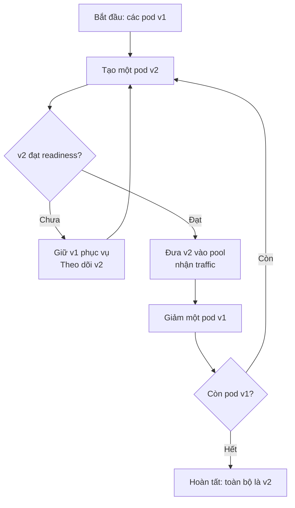

# Rolling Update Pattern

## Mục lục

- [Tổng quan](#tổng-quan)
- [Cơ chế rollout](#cơ-chế-rollout)
  - [Trình tự thay thế instance](#trình-tự-thay-thế-instance)
  - [Vai trò của maxSurge và maxUnavailable](#vai-trò-của-maxsurge-và-maxunavailable)
  - [Readiness và thời điểm nhận traffic](#readiness-và-thời-điểm-nhận-traffic)
- [Compatibility trong cửa sổ rollout](#compatibility-trong-cửa-sổ-rollout)
  - [Vì sao v1 và v2 phải cùng tương thích](#vì-sao-v1-và-v2-phải-cùng-tương-thích)
  - [Các lớp shared state cần kiểm tra](#các-lớp-shared-state-cần-kiểm-tra)
- [Use case thực tế](#use-case-thực-tế)
  - [Release Order Service v2](#release-order-service-v2)
- [Trade-off](#trade-off)
- [Khi nên và không nên dùng](#khi-nên-và-không-nên-dùng)
- [Lỗi thường gặp](#lỗi-thường-gặp)
- [Rollback](#rollback)
  - [Cách rollback Rolling Update](#cách-rollback-rolling-update)
  - [Giới hạn của rollback code](#giới-hạn-của-rollback-code)
- [Quan sát rollout](#quan-sát-rollout)
  - [Metrics cần theo dõi](#metrics-cần-theo-dõi)
  - [Phân biệt version trong telemetry](#phân-biệt-version-trong-telemetry)
- [Checklist](#checklist)
  - [Trước rollout](#trước-rollout)
  - [Trong rollout](#trong-rollout)
  - [Sau rollout](#sau-rollout)
- [Liên kết liên quan](#liên-kết-liên-quan)

---

## Tổng quan

**Rolling Update** là Deployment Pattern thay thế các instance đang chạy bằng instance của version mới theo từng đợt nhỏ. Instance là một bản chạy của service, chẳng hạn một Kubernetes pod. Trong thời gian chuyển đổi, instance v1 và v2 cùng phục vụ request.

Mục tiêu của pattern là giữ service tiếp tục phục vụ khi rollout. Pattern này phù hợp với các service có API backward compatible và có thể chạy song song nhiều version trong một khoảng thời gian ngắn. Nó không tự bảo đảm zero downtime nếu readiness, capacity hoặc dependency của service chưa được chuẩn bị đúng.

Rolling Update thường là lựa chọn nền cho một service thông thường vì chỉ cần thêm một phần resource tạm thời. Đổi lại, team phải thiết kế compatibility giữa v1 và v2, đồng thời chấp nhận rollback diễn ra theo từng instance thay vì chuyển traffic trong một thao tác.

## Cơ chế rollout

Controller bắt đầu bằng việc tạo instance v2, chờ instance đó sẵn sàng, rồi mới giảm số instance v1. Quy trình lặp lại cho tới khi không còn instance v1.



### Trình tự thay thế instance

Ví dụ service có ba replica, một rollout có thể được hiểu như sau:

| Bước | Trạng thái minh họa | Ý nghĩa |
|---|---|---|
| 0 | `[v1] [v1] [v1]` | Toàn bộ traffic đi tới v1. |
| 1 | `[v1] [v1] [v1] [v2]` | Tạo v2; v2 chưa nhận traffic khi chưa đạt readiness. |
| 2 | `[v1] [v1] [v2]` | v2 đã ready; một instance v1 được thay thế. |
| 3 | `[v1] [v2] [v2]` | Lặp lại cùng quy trình với instance v1 còn lại. |
| 4 | `[v2] [v2] [v2]` | Rollout hoàn tất. |

Trong bước 1, số pod tạm thời có thể vượt số replica mong muốn. Khi v2 không đạt readiness, controller cần giữ v1 và không tiếp tục giảm v1 theo cách làm mất capacity phục vụ. Vì vậy, một rollout bị kẹt ở readiness vẫn có thể giữ version cũ phục vụ request, nhưng cần được điều tra thay vì bỏ qua.

### Vai trò của maxSurge và maxUnavailable

Hai tham số thường dùng để điều khiển tốc độ và capacity của Rolling Update:

| Tham số | Ý nghĩa | Đánh đổi chính |
|---|---|---|
| `maxSurge` | Số instance v2 tối đa được tạo vượt số replica mong muốn trong lúc rollout. | Giá trị lớn giúp tạo v2 nhanh hơn nhưng cần thêm CPU, memory và quota. |
| `maxUnavailable` | Số hoặc tỷ lệ instance được phép không sẵn sàng trong lúc thay thế. | Giá trị lớn có thể rollout nhanh hơn nhưng làm giảm capacity phục vụ tạm thời. |

Đặt `maxUnavailable: 0` thể hiện mục tiêu không chủ động giảm số instance sẵn sàng. Cấu hình này vẫn cần đủ capacity cho `maxSurge`, readiness đúng và quá trình dừng instance cũ an toàn. Nếu cluster không còn resource, rollout có thể chờ vì không tạo được pod v2.

Không nên chọn giá trị chỉ dựa trên tốc độ. Hãy kiểm tra số replica tối thiểu, lưu lượng giờ cao điểm, giới hạn resource và thời gian khởi động thực tế của service trước khi chốt cấu hình.

### Readiness và thời điểm nhận traffic

**Readiness probe** là health check cho biết một instance đã sẵn sàng nhận request hay chưa. Container khởi động thành công chưa có nghĩa là service đã sẵn sàng. Ứng dụng có thể vẫn đang nạp configuration, mở connection pool hoặc hoàn tất bước khởi tạo cần thiết.

Rolling Update chỉ nên đưa v2 vào pool nhận traffic sau khi readiness probe đạt. Readiness nên phản ánh khả năng phục vụ đường đi chính của service, không chỉ kiểm tra process còn sống. Nếu probe trả `ready` quá sớm, request có thể đi vào pod chưa có dependency hoặc configuration cần thiết.

Readiness cũng không chứng minh v2 xử lý nghiệp vụ đúng. Sau khi v2 nhận traffic, cần tiếp tục dùng metrics, log và trace để kiểm tra hành vi thực tế. Đây là ranh giới quan trọng:

- Readiness trả lời: **instance có thể nhận request không?**
- Observability trả lời: **instance có đang xử lý request đúng và ổn định không?**

## Compatibility trong cửa sổ rollout

**Compatibility** là khả năng các version khác nhau tiếp tục làm việc với cùng contract và shared state. Shared state là dữ liệu được nhiều instance cùng sử dụng, như database, cache, queue hoặc session.

Trong Rolling Update, cửa sổ v1 và v2 cùng tồn tại bắt đầu khi pod v2 đầu tiên nhận traffic và kết thúc khi pod v1 cuối cùng được thay thế. Kế hoạch migration và release phải giữ cho hai version hoạt động được trong toàn bộ cửa sổ này.

### Vì sao v1 và v2 phải cùng tương thích

Một request có thể đi tới v1, request kế tiếp có thể đi tới v2. Đồng thời, v1 và v2 có thể cùng đọc và ghi một shared state. Vì vậy, compatibility không chỉ có nghĩa là v2 đọc được dữ liệu cũ. Trong giai đoạn rollout, v1 cũng phải tiếp tục đọc được dữ liệu mà v2 tạo ra.

Đây là yêu cầu **N-1 compatibility hai chiều**:

1. v2 đọc được dữ liệu và request contract mà v1 đang sử dụng.
2. v1 đọc được dữ liệu và message mà v2 tạo ra.
3. Việc rollback v2 không làm v1 lỗi vì format mới đã được ghi vào shared state.

Ví dụ, nếu v2 đổi `customer_name` thành `full_name` và xóa ngay cột cũ, pod v1 còn lại có thể lỗi khi đọc dữ liệu. Readiness của pod v2 vẫn có thể xanh, nhưng rollout khi đó không an toàn.

### Các lớp shared state cần kiểm tra

| Lớp | Rủi ro khi v1 và v2 cùng chạy | Cách chuẩn bị cho rollout |
|---|---|---|
| API contract | Xóa, đổi tên, đổi kiểu hoặc đổi semantics của field làm consumer cũ xử lý sai. | Ưu tiên thay đổi additive; giữ field cũ trong thời gian chuyển tiếp và migrate consumer trước khi xóa. |
| Database schema | v1 và v2 đọc các cột khác nhau hoặc ghi format không tương thích. | Dùng **Expand-Contract**: thêm trước, deploy code tương thích, rồi chỉ xóa sau khi rollback window đóng. |
| Event và message | Message v2 có thể còn trong queue khi rollback về v1. | Version hóa event khi format hoặc semantics thay đổi; consumer bỏ qua field chưa biết và xử lý message idempotent. |
| Cache và session | Hai version ghi cùng key hoặc đọc session theo hai format khác nhau. | Dùng cache key có version khi cần; giữ khả năng đọc session cũ và mới trong giai đoạn chuyển tiếp. |
| Configuration | Xóa config cũ trong khi pod v1 vẫn cần nó có thể làm rollback thất bại. | Thêm config mới trước, giữ config cũ qua rollback window và xóa sau cùng. |

Một ví dụ Expand-Contract cho `customer_name` và `full_name`:

```text
1. Expand: thêm cột full_name, chưa xóa customer_name.
2. Deploy v2: đọc full_name, fallback về customer_name; ghi theo cách v1 vẫn đọc được.
3. Rollout: để v1 và v2 cùng chạy, theo dõi compatibility và metrics.
4. Contract: chỉ xóa customer_name sau khi rollback window đã đóng.
```

Migration nên chạy như một job độc lập trước khi deploy code sử dụng schema mới. Không nên để mỗi pod tự chạy migration, vì nhiều pod có thể khởi động cùng lúc và tạo race condition.

## Use case thực tế

### Release Order Service v2

Order Service của một hệ thống e-commerce cần thêm tên đầy đủ của khách hàng. Version v2 dùng cột `full_name`, còn v1 vẫn đọc `customer_name`. Team chọn Rolling Update vì thay đổi có thể triển khai theo các bước tương thích và service cần tiếp tục phục vụ request.

| Giai đoạn | Việc thực hiện | Điều kiện tiếp tục |
|---|---|---|
| Chuẩn bị schema | Thêm `full_name` dưới dạng nullable; chưa xóa `customer_name`. | v1 vẫn đọc và ghi được schema hiện tại. |
| Deploy v2 | Đưa image v2 lên theo từng pod. Pod mới chỉ nhận traffic sau readiness. | Pod v2 ready và v1 vẫn còn đủ capacity. |
| Cùng tồn tại | v2 đọc `full_name` với fallback về `customer_name`, đồng thời ghi dữ liệu theo format v1 có thể đọc. | Error rate, latency và order success rate không xấu hơn ngưỡng đã định nghĩa. |
| Hoàn tất | Sau rollback window, xác nhận không còn nhu cầu quay về v1 rồi mới contract schema. | Đã kiểm tra dữ liệu, consumer và kế hoạch dọn cột cũ. |

Use case này cho thấy Rolling Update không chỉ là thay image. Schema, readiness, compatibility và observability phải được chuẩn bị cùng release. Nếu v2 lỗi trong giai đoạn cùng tồn tại, team có thể rollback code mà không cần down migration ngay giữa sự cố.

## Trade-off

| Giá trị nhận được | Chi phí hoặc rủi ro phải chấp nhận |
|---|---|
| Service có thể tiếp tục phục vụ trong quá trình thay instance. | Zero downtime vẫn phụ thuộc vào readiness, capacity, graceful shutdown và dependency. |
| Chỉ cần thêm resource tạm thời theo `maxSurge`, thay vì giữ một môi trường đầy đủ song song. | Cluster phải có đủ CPU, memory và quota cho pod mới. |
| Có thể dùng cho các release nhỏ, thường xuyên và dễ tự động hóa. | v1 và v2 cùng tồn tại làm việc debug, session và shared state phức tạp hơn. |
| Readiness giúp tránh đưa pod chưa sẵn sàng vào traffic. | Readiness không phát hiện mọi lỗi logic hoặc lỗi business. |
| Có thể dừng việc thay thế khi pod mới không ready. | Rollback cũng diễn ra theo từng pod, thường chậm hơn một thao tác chuyển traffic. |

Rolling Update không cô lập hoàn toàn lỗi theo một nhóm user. Khi một pod v2 đã ready, request được route tới pod đó có thể chịu ảnh hưởng của lỗi logic v2. Vì vậy, readiness và versioned observability cần đi cùng nhau.

## Khi nên và không nên dùng

| Nên dùng khi | Nên chuẩn bị chiến lược khác hoặc thay đổi thiết kế khi |
|---|---|
| API và shared state đã backward compatible. | Thay đổi là breaking change và v1/v2 không thể cùng đọc ghi dữ liệu. |
| Service stateless hoặc đã có cách graceful shutdown và handoff rõ ràng. | Request dài, session hoặc state cục bộ không thể chuyển tiếp an toàn khi instance bị thay. |
| Release nhỏ, rủi ro thấp đến vừa và được thực hiện thường xuyên. | Cần quay lại version cũ trong vài giây nhưng rollback rolling mất nhiều thời gian hơn SLA cho phép. |
| Đã có readiness probe, capacity cho surge và rollback command đã được kiểm tra. | Cluster không đủ resource cho `maxSurge`, hoặc chưa biết cách xác định version đang chạy. |
| Team có metrics theo version và ngưỡng abort đã thống nhất trước rollout. | Không thể phân biệt lỗi của v1 và v2 trong log, metrics hoặc trace. |

Nếu thay đổi chưa tương thích, hãy tách thành các bước additive trước. Đừng dùng tốc độ của Rolling Update để che giấu một contract chưa có kế hoạch chuyển tiếp.

## Lỗi thường gặp

| Lỗi | Hậu quả | Cách phòng tránh |
|---|---|---|
| Readiness probe chỉ kiểm tra process sống. | Pod v2 nhận request khi configuration hoặc dependency chưa sẵn sàng. | Kiểm tra điều kiện cần cho đường đi chính và thử readiness trong môi trường gần production. |
| Đặt `maxSurge` cao hơn capacity thực tế. | Pod v2 không được schedule; rollout chờ hoặc kéo dài. | Tính resource theo số replica, quota và lưu lượng thực tế trước rollout. |
| Đặt `maxUnavailable` quá cao. | Capacity phục vụ giảm trong lúc thay pod. | Chọn giới hạn theo SLA; dùng `0` khi cần duy trì số instance sẵn sàng và cluster đủ capacity cho surge. |
| Deploy schema hoặc event breaking cùng image v2. | v1 lỗi khi đọc dữ liệu hoặc message do v2 tạo ra; rollback code không còn an toàn. | Dùng Expand-Contract, version hóa event và giữ contract cũ trong rollback window. |
| Dùng artifact không immutable như `latest`. | Không xác định được image nào đang chạy và rollback không reproducible. | Gắn version hoặc image digest cho artifact. |
| Terminate pod cũ ngay khi pod mới ready. | Request đang xử lý hoặc connection dài có thể bị gián đoạn. | Dùng graceful shutdown và connection draining phù hợp với service. |
| Không gắn version vào telemetry. | Không biết lỗi, latency hoặc business regression đến từ version nào. | Gắn version và image digest vào log, metrics, trace; so sánh hai version cùng thời điểm. |
| Chưa thử rollback trước release. | Lệnh, image cũ hoặc quyền truy cập có thể không dùng được khi sự cố xảy ra. | Diễn tập trên môi trường phù hợp và đo thời gian rollback thực tế. |

## Rollback

### Cách rollback Rolling Update

Rollback của Rolling Update là một rollout theo chiều ngược lại. Controller đưa specification về revision trước, sau đó thay pod v2 bằng pod v1 từng bước. Đây không phải thao tác chuyển traffic tức thời.

Với Kubernetes, lệnh cơ bản là:

```bash
kubectl rollout undo deployment/<deployment-name>
kubectl rollout status deployment/<deployment-name>
```

Trình tự xử lý nên rõ ràng trước khi deploy:

1. Dừng việc promote hoặc triển khai revision tiếp theo.
2. Xác nhận revision v1 và image artifact cũ vẫn tồn tại.
3. Chạy `kubectl rollout undo` để bắt đầu rolling ngược.
4. Theo dõi readiness, error rate, latency và business metrics trong lúc v1 quay lại.
5. Kiểm tra shared state và side effect mà v2 đã tạo; rollback image không tự xóa dữ liệu hoặc thu hồi message đã publish.

Thời gian rollback phụ thuộc vào thời gian pull image, khởi động pod, readiness, capacity và tình trạng dependency. Vì rollback thay từng pod, hãy đo thời gian thực tế thay vì giả định nó hoàn tất trong vài giây.

### Giới hạn của rollback code

`rollout undo` chủ yếu đưa deployment về image hoặc revision cũ. Nó không tự thực hiện các hành động sau:

- Hoàn tác schema migration hoặc dữ liệu đã ghi.
- Thu hồi message đã publish vào queue.
- Hoàn tác side effect bên ngoài, chẳng hạn payment đã charge hoặc email đã gửi.
- Khôi phục configuration đã bị xóa.

Trong sự cố, thông thường nên rollback code nhưng giữ schema đã expand, rồi fix forward bằng một version tương thích. Down migration vội vàng có thể làm mất dữ liệu mà v2 đã ghi và khiến v1 không thể phục hồi.

**Rollback window** là khoảng thời gian mà việc quay lại v1 vẫn an toàn. Trong window này, không thực hiện thao tác destructive như `DROP COLUMN`, xóa API cũ, xóa event version cũ hoặc xóa config mà v1 cần. Chỉ contract sau khi metrics ổn định, dữ liệu đã được kiểm tra và team xác nhận không còn cần rollback.

## Quan sát rollout

### Metrics cần theo dõi

Readiness chỉ là điều kiện để bắt đầu nhận traffic. Nó không chứng minh version mới đang hoạt động đúng. Dashboard rollout nên phân biệt v1 và v2, đồng thời theo dõi technical metrics và business metrics.

| Nhóm | Tín hiệu nên theo dõi | Câu hỏi cần trả lời |
|---|---|---|
| Rollout | Số pod desired, ready, unavailable và tiến độ thay revision. | Rollout có tiến triển hay đang bị kẹt? |
| Request | Rate và error rate theo version, gồm HTTP 5xx và lỗi nghiệp vụ. | v2 có lỗi nhiều hơn v1 không? |
| Latency | p95 và p99, tức thời gian mà 95% hoặc 99% request hoàn thành trong giới hạn đó. | v2 có chậm hơn hoặc có đuôi latency bất thường không? |
| Saturation | CPU, memory, connection pool và queue lag theo version. | v2 có dùng tài nguyên quá mức hoặc rò rỉ connection không? |
| Business | Order success rate, payment success rate hoặc metric chính của service. | Request trả 200 nhưng kết quả kinh doanh có giảm không? |
| Data quality | Reconciliation mismatch, số message vào DLQ và lỗi parse message. | v2 có ghi dữ liệu lệch hoặc tạo message không consumer được không? |

Trước rollout, hãy định nghĩa ngưỡng tiếp tục, dừng và rollback dựa trên baseline của service. So sánh v2 với v1 trong cùng khung thời gian và cùng loại traffic. So sánh với trung bình của cả ngày có thể che giấu thay đổi do giờ cao điểm.

### Phân biệt version trong telemetry

**Telemetry** là dữ liệu quan sát được tạo từ log, metrics và distributed trace. Mỗi tín hiệu nên mang định danh version và, khi có thể, image digest để truy ra đúng artifact:

```text
Log:    {"service":"order-service","version":"v2.1.0","image_digest":"sha256:...","request_id":"..."}
Metric: http_requests_total{service="order-service",version="v2.1.0",status="500"}
Trace:  deployment.version = "v2.1.0"
```

- Dùng dashboard tách v1 và v2 thay vì chỉ xem tổng của service.
- Dùng cùng một khung thời gian khi so sánh error rate và latency.
- Ghi image digest vì một version label có thể chưa đủ để xác định artifact cụ thể.
- Dùng `request_id` hoặc correlation ID để truy vết request qua nhiều service.

Nếu không thể trả lời lỗi đang thuộc v1 hay v2, team chưa có đủ thông tin để quyết định tiếp tục rollout hay rollback một cách đáng tin cậy.

## Checklist

### Trước rollout

- [ ] Image được gắn version hoặc digest; không dùng tag mơ hồ như `latest`.
- [ ] Readiness probe đã được kiểm tra với điều kiện khởi động và dependency thực tế.
- [ ] `maxSurge`, `maxUnavailable` và capacity đã được tính theo số replica và lưu lượng.
- [ ] API, database, event, cache, session và configuration có kế hoạch compatibility hai chiều.
- [ ] Migration additive đã chạy trước code mới nếu v2 cần schema mới.
- [ ] Rollback command, revision và quyền truy cập đã được kiểm tra.
- [ ] Dashboard và alert có thể tách metrics theo version.
- [ ] Ngưỡng tiếp tục, dừng và rollback đã được thống nhất trước release.

### Trong rollout

- [ ] Chỉ pod đã đạt readiness mới nhận traffic.
- [ ] Theo dõi tiến độ thay pod và xử lý ngay khi rollout bị kẹt.
- [ ] So sánh v1 và v2 trong cùng khung thời gian.
- [ ] Theo dõi technical metrics, business metrics và data quality.
- [ ] Pod cũ có graceful shutdown và connection draining phù hợp.
- [ ] Không thực hiện thao tác destructive trong rollback window.

### Sau rollout

- [ ] Xác nhận toàn bộ pod v2 ready và metrics ổn định.
- [ ] Giữ contract, schema và configuration cũ qua rollback window.
- [ ] Kiểm tra dữ liệu, queue và side effect trước khi contract.
- [ ] Chỉ xóa field, API, event hoặc config cũ sau khi đã xác nhận không cần rollback.
- [ ] Ghi lại thời gian rollout và rollback thực tế để cải thiện lần sau.

## Liên kết liên quan

- [17 — Deployment Patterns](../17-deployment-patterns.md) — phần tổng hợp chứa nội dung nguồn của pattern này.
- [13 — Orchestration](../13-orchestration.md) — Kubernetes Deployment, probes và cơ chế orchestration.
- [14 — CI/CD & Deployment](../14-cicd-deployment.md) — pipeline và cấu hình deployment.
- [11 — Observability & Evolvability](../11-observability-evolvability.md) — metrics, logging và distributed tracing.
- [09 — Data Management](../09-data-management.md) — schema migration, Saga và compensation cho side effect.
- [06 — Inter-Service Communication](../06-inter-service-communication.md) — API và event giữa các service.
- [16 — Configuration & Secrets Management](../16-configuration-secrets-management.md) — quản lý configuration trong quá trình chuyển version.
- [04 — Autonomy & Independence](../04-autonomy-independence.md) — independent deployment và backward compatibility.
