# Design Patterns trong Microservice — Tổng hợp

## 📋 Mục lục

- [1. Giới thiệu](#1-giới-thiệu)
- [2. Structural Patterns — Nhóm cấu trúc](#2-structural-patterns--nhóm-cấu-trúc)
  - [2.1. Sidecar Pattern](#21-sidecar-pattern)
  - [2.2. Ambassador Pattern](#22-ambassador-pattern)
  - [2.3. Adapter Pattern](#23-adapter-pattern)
  - [2.4. So sánh Sidecar vs Ambassador vs Adapter](#24-so-sánh-sidecar-vs-ambassador-vs-adapter)
- [3. Decomposition Patterns — Nhóm phân tách](#3-decomposition-patterns--nhóm-phân-tách)
  - [3.1. Strangler Fig Pattern](#31-strangler-fig-pattern)
  - [3.2. Branch by Abstraction](#32-branch-by-abstraction)
  - [3.3. Vine Pattern](#33-vine-pattern)
- [4. Data Patterns — Nhóm quản lý dữ liệu](#4-data-patterns--nhóm-quản-lý-dữ-liệu)
  - [4.1. Database per Service](#41-database-per-service)
  - [4.2. Saga Pattern](#42-saga-pattern)
  - [4.3. CQRS](#43-cqrs)
  - [4.4. Event Sourcing](#44-event-sourcing)
  - [4.5. Transactional Outbox](#45-transactional-outbox)
- [5. Communication Patterns — Nhóm giao tiếp](#5-communication-patterns--nhóm-giao-tiếp)
  - [5.1. API Gateway / BFF](#51-api-gateway--bff)
  - [5.2. Service Mesh](#52-service-mesh)
  - [5.3. Event-Driven Architecture](#53-event-driven-architecture)
  - [5.4. Async Request-Reply](#54-async-request-reply)
- [6. Reliability Patterns — Nhóm đảm bảo độ tin cậy](#6-reliability-patterns--nhóm-đảm-bảo-độ-tin-cậy)
  - [6.1. Circuit Breaker](#61-circuit-breaker)
  - [6.2. Retry with Backoff](#62-retry-with-backoff)
  - [6.3. Bulkhead](#63-bulkhead)
  - [6.4. Timeout](#64-timeout)
  - [6.5. Health Check / Heartbeat](#65-health-check--heartbeat)
- [7. Deployment Patterns — Nhóm triển khai](#7-deployment-patterns--nhóm-triển-khai)
  - [7.1. Blue-Green Deployment](#71-blue-green-deployment)
  - [7.2. Canary Deployment](#72-canary-deployment)
  - [7.3. Feature Toggle](#73-feature-toggle)
- [8. Observability Patterns — Nhóm quan sát](#8-observability-patterns--nhóm-quan-sát)
  - [8.1. Log Aggregation](#81-log-aggregation)
  - [8.2. Distributed Tracing](#82-distributed-tracing)
  - [8.3. Health Check API](#83-health-check-api)
  - [8.4. Correlation ID](#84-correlation-id)
- [9. Anti-patterns — Những sai lầm cần tránh](#9-anti-patterns--những-sai-lầm-cần-tránh)
  - [9.1. Distributed Monolith](#91-distributed-monolith)
  - [9.2. Shared Database](#92-shared-database)
  - [9.3. Mega Service](#93-mega-service)
  - [9.4. Chatty Services](#94-chatty-services)
  - [9.5. No API Versioning](#95-no-api-versioning)
  - [9.6. Hardcoded Configuration](#96-hardcoded-configuration)
  - [9.7. Sync Chain / Death Star Architecture](#97-sync-chain--death-star-architecture)
  - [9.8. Over-engineering — Microservice cho mọi thứ](#98-over-engineering--microservice-cho-mọi-thứ)
- [10. Decision Matrix — Chọn Pattern nào?](#10-decision-matrix--chọn-pattern-nào)
- [11. Ví dụ thực tế — E-Commerce Platform](#11-ví-dụ-thực-tế--e-commerce-platform)
- [12. Checklist](#12-checklist)
- [13. Tổng kết](#13-tổng-kết)
- [14. Liên kết liên quan](#14-liên-kết-liên-quan)

---

## 1. Giới thiệu

Trong kiến trúc Microservice, **Design Patterns** (mẫu thiết kế) là những giải pháp đã được chứng minh cho các vấn đề phổ biến. Khác với design patterns trong OOP (Gang of Four), các patterns ở đây tập trung vào **hệ thống phân tán** — cách service giao tiếp, quản lý dữ liệu, đảm bảo độ tin cậy, và triển khai.

```
┌─────────────────────────────────────────────────────────────────────┐
│                MICROSERVICE DESIGN PATTERNS MAP                     │
│                                                                     │
│  ┌──────────────┐  ┌──────────────┐  ┌──────────────┐               │
│  │  Structural  │  │Decomposition │  │     Data     │               │
│  │  ──────────  │  │  ──────────  │  │  ──────────  │               │
│  │  Sidecar     │  │  Strangler   │  │  DB per Svc  │               │
│  │  Ambassador  │  │  Branch by   │  │  Saga        │               │
│  │  Adapter     │  │  Abstraction │  │  CQRS        │               │
│  │              │  │  Vine        │  │  Event Source│               │
│  └──────────────┘  └──────────────┘  └──────────────┘               │
│                                                                     │
│  ┌──────────────┐  ┌──────────────┐  ┌──────────────┐               │
│  │Communication │  │ Reliability  │  │ Deployment   │               │
│  │  ──────────  │  │  ──────────  │  │  ──────────  │               │
│  │  API Gateway │  │  Circuit Brk │  │  Blue-Green  │               │
│  │  Service Mesh│  │  Retry       │  │  Canary      │               │
│  │  Event-Driven│  │  Bulkhead    │  │  Feature Tog │               │
│  │  Async Reply │  │  Timeout     │  │              │               │
│  └──────────────┘  └──────────────┘  └──────────────┘               │
│                                                                     │
│  ┌──────────────┐  ┌──────────────┐                                 │
│  │Observability │  │Anti-patterns │                                 │
│  │  ──────────  │  │  ──────────  │                                 │
│  │  Log Aggreg  │  │  Dist Mono   │                                 │
│  │  Dist Tracing│  │  Shared DB   │                                 │
│  │  Health Check│  │  Mega Svc    │                                 │
│  │  Correl. ID  │  │  Chatty Svc  │                                 │
│  └──────────────┘  └──────────────┘                                 │
└─────────────────────────────────────────────────────────────────────┘
```

> 💡 Tài liệu này **tổng hợp** tất cả patterns đã được nhắc đến ở các doc trước, đồng thời bổ sung thêm **Sidecar, Ambassador, Adapter** và **Anti-patterns** chi tiết.

---

## 2. Structural Patterns — Nhóm cấu trúc

Structural Patterns giải quyết vấn đề **tổ chức và mở rộng** service mà không thay đổi code chính. Chúng đặc biệt hữu ích khi cần thêm cross-cutting concerns (logging, monitoring, networking) mà không muốn couple vào business logic.

### 2.1. Sidecar Pattern

**Sidecar Pattern** là mẫu thiết kế trong đó một container phụ (sidecar) được triển khai **cùng Pod / cùng host** với container chính (primary), chia sẻ cùng network namespace và storage.

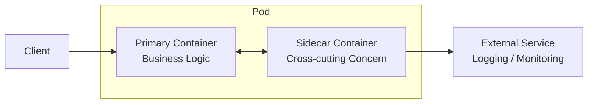

#### Cách hoạt động

1. Primary container chạy **business logic** (ví dụ: Order Service)
2. Sidecar container chạy **chức năng hỗ trợ** (ví dụ: log shipping, proxy, monitoring)
3. Cả hai chia sẻ **cùng network** (localhost) và có thể chia sẻ **volume**
4. Sidecar có **lifecycle riêng** — có thể cập nhật/restart độc lập

#### Use cases phổ biến

| Use case | Sidecar làm gì | Ví dụ tool |
|----------|----------------|------------|
| **Service Mesh proxy** | Xử lý mTLS, load balancing, routing | Envoy (Istio), Linkerd-proxy |
| **Log collection** | Thu thập log từ file, gửi tới central log | Fluentd, Filebeat |
| **Monitoring agent** | Thu thập metrics, health check | Prometheus exporter, Datadog agent |
| **Config watcher** | Watch config changes, reload config | Consul Template, Vault Agent |
| **Certificate management** | Auto-renew TLS certificates | cert-manager, Vault Agent |

#### Ví dụ: Envoy Sidecar trong Istio

```yaml
# Kubernetes Pod với Envoy sidecar (Istio auto-inject)
apiVersion: v1
kind: Pod
metadata:
  name: order-service
  labels:
    app: order-service
  annotations:
    sidecar.istio.io/inject: "true"  # Istio tự inject Envoy sidecar
spec:
  containers:
    # Primary container — business logic
    - name: order-service
      image: myapp/order-service:v1.2
      ports:
        - containerPort: 8080
      env:
        - name: DB_HOST
          value: "order-db.default.svc"

    # Sidecar container — log shipper
    - name: log-shipper
      image: fluent/fluentd:v1.16
      volumeMounts:
        - name: shared-logs
          mountPath: /var/log/app

  volumes:
    - name: shared-logs
      emptyDir: {}
```

#### Ưu nhược điểm

| Ưu điểm | Nhược điểm |
|----------|------------|
| Tách biệt concerns — business logic không bị ảnh hưởng | Tăng resource consumption (CPU, RAM) |
| Polyglot — sidecar có thể dùng ngôn ngữ khác service chính | Tăng complexity trong deployment |
| Reusable — cùng sidecar cho nhiều services | Latency tăng nhẹ (proxy hop) |
| Independent lifecycle — update sidecar không cần redeploy service | Debugging khó hơn |

---

### 2.2. Ambassador Pattern

**Ambassador Pattern** là một biến thể đặc biệt của Sidecar, trong đó sidecar đóng vai trò **proxy đại diện** cho primary container khi giao tiếp với **bên ngoài**. Ambassador xử lý các cross-cutting concerns liên quan đến **outbound network**: retry, circuit breaker, routing, TLS.

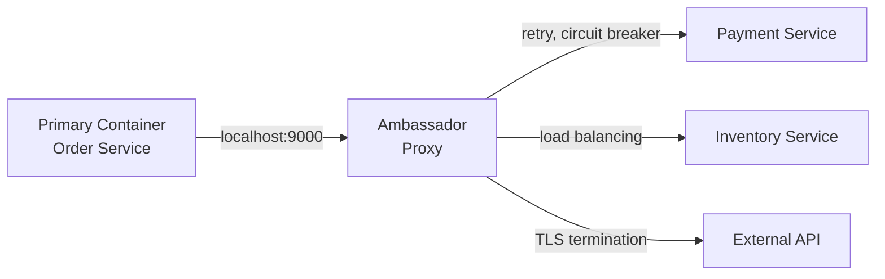

#### Sự khác biệt với Sidecar thông thường

| Tiêu chí | Sidecar (chung) | Ambassador |
|----------|-----------------|-----------|
| Hướng giao tiếp | Bất kỳ (inbound/outbound) | Chủ yếu **outbound** |
| Vai trò | Hỗ trợ chung (logging, monitoring...) | **Proxy đại diện** cho service chính |
| Chức năng chính | Đa dạng | Retry, circuit breaking, routing, TLS |
| Ví dụ | Fluentd, Prometheus exporter | Envoy, HAProxy, custom proxy |

#### Use cases

1. **Retry & Circuit Breaker**: Ambassador tự retry khi downstream fail, mở circuit breaker khi lỗi quá nhiều
2. **Client-side load balancing**: Phân tải request tới nhiều instance của downstream service
3. **Protocol translation**: Service gọi HTTP, ambassador chuyển sang gRPC
4. **Routing**: Route tới different versions (A/B testing, canary)
5. **TLS offloading**: Service giao tiếp plaintext với ambassador, ambassador mã hóa TLS ra ngoài

#### Ví dụ: Ambassador cho Legacy Service

```
┌─────────────────────────────────────────────┐
│ Pod                                         │
│                                             │
│  ┌───────────────┐    ┌──────────────────┐  │
│  │ Legacy App    │    │   Ambassador     │  │
│  │ (Java 8)      │    │   (Envoy)        │  │
│  │               │    │                  │  │
│  │ Gọi HTTP      │───▶│ • Retry 3 lần    │──────▶ Payment API (gRPC)
│  │ localhost:9000│    │ • Circuit Break  │
│  │               │    │ • HTTP → gRPC    │──────▶ Inventory API (HTTPS)
│  │               │    │ • TLS terminate  │
│  └───────────────┘    └──────────────────┘  │
│                                             │
└─────────────────────────────────────────────┘
```

> 💡 Ambassador đặc biệt hữu ích khi bạn có **legacy service** không thể thêm retry/circuit breaker vào code, hoặc muốn **standardize** cách tất cả services giao tiếp ra ngoài.

---

### 2.3. Adapter Pattern

**Adapter Pattern** trong Microservice là sidecar chịu trách nhiệm **chuẩn hóa output** từ primary container sang format chuẩn mà hệ thống bên ngoài yêu cầu. Adapter hoạt động ở **hướng outbound** — nhận data từ service chính và **transform** trước khi gửi đi.

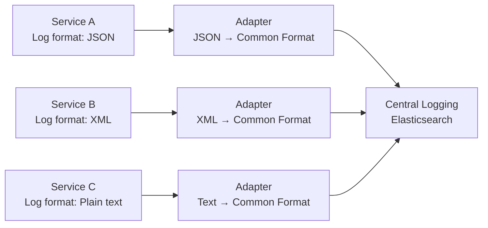

#### Sự khác biệt chính

| Tiêu chí | Sidecar (chung) | Ambassador | Adapter |
|----------|-----------------|-----------|---------|
| Mục đích | Hỗ trợ chung | Proxy outbound | **Chuẩn hóa output** |
| Hướng | Bất kỳ | Outbound requests | Outbound data/metrics |
| Ví dụ | Logging, cert mgmt | Retry, routing | Format conversion |
| Khi nào dùng | Cross-cutting concerns | Quản lý network calls | Heterogeneous systems |

#### Use cases

1. **Log format standardization**: Nhiều services viết log khác format → adapter chuẩn hóa về JSON structured logging
2. **Monitoring adapter**: Service expose metrics dạng custom → adapter chuyển sang Prometheus format
3. **Protocol adapter**: Service xuất data dạng CSV → adapter chuyển sang JSON cho downstream
4. **Legacy integration**: Hệ thống cũ output dạng SOAP XML → adapter chuyển sang REST JSON

#### Ví dụ: Prometheus Monitoring Adapter

```yaml
apiVersion: v1
kind: Pod
metadata:
  name: legacy-payment
spec:
  containers:
    # Primary — legacy service expose metrics qua JMX
    - name: payment-service
      image: legacy/payment:v3.1
      ports:
        - containerPort: 8080   # App port
        - containerPort: 9010   # JMX port

    # Adapter — chuyển JMX metrics sang Prometheus format
    - name: prometheus-adapter
      image: bitnami/jmx-exporter:latest
      ports:
        - containerPort: 9404   # Prometheus scrape endpoint
      args:
        - "9404"
        - "/config/jmx-config.yaml"
      volumeMounts:
        - name: jmx-config
          mountPath: /config

  volumes:
    - name: jmx-config
      configMap:
        name: jmx-exporter-config
```

```
┌──────────────────────────────────────────────────────┐
│ Pod: legacy-payment                                  │
│                                                      │
│  ┌─────────────────┐      ┌──────────────────────┐   │
│  │ Payment Service │      │   Adapter            │   │
│  │ (Legacy Java)   │      │   (JMX Exporter)     │   │
│  │                 │      │                      │   │
│  │  JMX metrics ───┼─────▶│  JMX → Prometheus    │   │
│  │  (port 9010)    │      │  format              │──────▶ Prometheus
│  │                 │      │  /metrics (9404)     │        (scrape)
│  └─────────────────┘      └──────────────────────┘   │
│                                                      │
└──────────────────────────────────────────────────────┘
```

---

### 2.4. So sánh Sidecar vs Ambassador vs Adapter

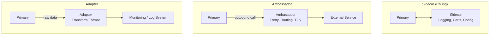

| Tiêu chí | Sidecar | Ambassador | Adapter |
|----------|---------|-----------|---------|
| **Mục đích** | Tổng quát — thêm chức năng hỗ trợ | Proxy cho outbound communication | Chuẩn hóa output data |
| **Hướng chính** | Cả inbound & outbound | Outbound requests | Outbound data |
| **Chức năng** | Logging, certs, config watch | Retry, circuit break, routing | Format conversion |
| **Ví dụ tool** | Fluentd, Vault Agent | Envoy, HAProxy | JMX Exporter, Fluentd |
| **Khi nào dùng** | Cần thêm cross-cutting concern | Cần quản lý outbound network | Cần chuẩn hóa data output |

> 💡 **Thực tế**: Ba patterns này thường **chồng lấp** nhau. Envoy vừa là Sidecar, vừa là Ambassador. Fluentd vừa là Sidecar, vừa có thể là Adapter. Quan trọng là **hiểu intent** — bạn đang giải quyết vấn đề gì.

---

## 3. Decomposition Patterns — Nhóm phân tách

Decomposition Patterns giải quyết vấn đề **chuyển từ Monolith sang Microservice** hoặc **tách service lớn thành nhỏ hơn**.

> 📖 Chi tiết đầy đủ xem [05 — Decomposition Strategies](05-decomposition-strategies.md)

### 3.1. Strangler Fig Pattern

**Strangler Fig** (cây bóp nghẹt) là chiến lược chuyển đổi **dần dần** từ Monolith sang Microservice, bằng cách **tạo service mới bao quanh** hệ thống cũ, từng bước thay thế tính năng cho đến khi monolith bị "bóp nghẹt" hoàn toàn.

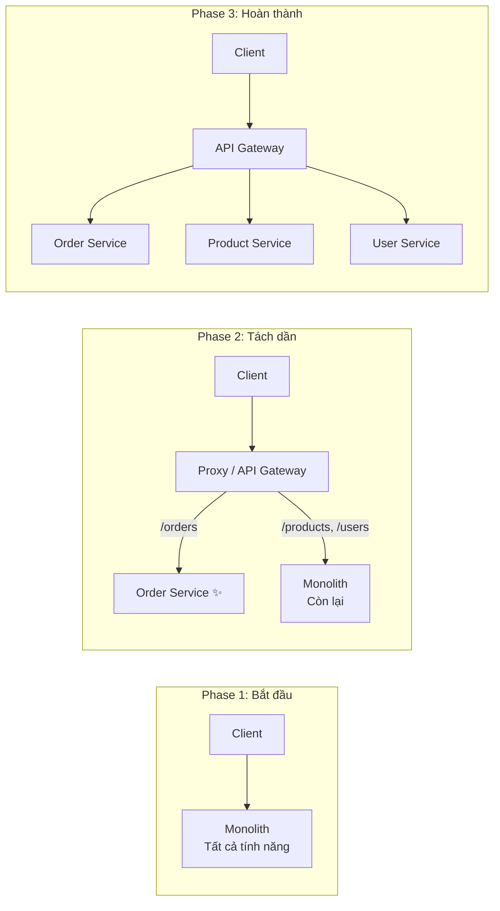

**Quy trình:**
1. Đặt proxy/API Gateway trước monolith
2. Viết feature mới dưới dạng microservice
3. Chuyển feature cũ sang microservice (từng cái một)
4. Route traffic qua proxy: feature mới → microservice, feature cũ → monolith
5. Lặp lại cho đến khi monolith trống

**Khi nào dùng**: Hệ thống monolith lớn, cần chuyển đổi mà **không downtime**, đội ngũ không đủ để rewrite toàn bộ.

### 3.2. Branch by Abstraction

**Branch by Abstraction** là kỹ thuật tạo **abstraction layer** (interface) trước component cần thay thế, sau đó swap implementation từ cũ sang mới mà không ảnh hưởng caller.

```
Phase 1: Tạo abstraction
┌─────────────────────────────────┐
│ Caller                          │
│   │                             │
│   ▼                             │
│ ┌─────────────────────┐         │
│ │ Interface / Abstract│         │
│ │ PaymentProcessor    │         │
│ └──────────┬──────────┘         │
│            │                    │
│   ┌────────▼──────────┐         │
│   │ Old Implementation│         │
│   │ (Legacy Payment)  │         │
│   └───────────────────┘         │
└─────────────────────────────────┘

Phase 2: Thêm new implementation + feature flag
┌─────────────────────────────────┐
│ Caller                          │
│   │                             │
│   ▼                             │
│ ┌─────────────────────┐         │
│ │ PaymentProcessor    │         │
│ └──┬──────────────┬───┘         │
│    │              │             │
│ ┌──▼──────┐  ┌────▼────────┐    │
│ │ Old Impl│  │ New Impl    │    │
│ │ (10%)   │  │ (90%) ✨    │    │
│ └─────────┘  └─────────────┘    │
└─────────────────────────────────┘

Phase 3: Xóa old implementation
┌─────────────────────────────────┐
│ Caller                          │
│   │                             │
│   ▼                             │
│ ┌──────────────────────┐        │
│ │ New Implementation   │        │
│ │ (Payment Service)    │        │
│ └──────────────────────┘        │
└─────────────────────────────────┘
```

**Khi nào dùng**: Khi cần thay thế **internal component** trong cùng codebase, muốn test new implementation trước khi commit hoàn toàn.

### 3.3. Vine Pattern

**Vine Pattern** là cách tiếp cận tạo **service hoàn toàn mới** song song với monolith, không cố gắng tách từ monolith mà **viết lại** từ đầu dựa trên requirements.

| Tiêu chí | Strangler Fig | Branch by Abstraction | Vine |
|----------|--------------|----------------------|------|
| Approach | Tách dần từ monolith | Swap implementation | Viết mới song song |
| Risk | Thấp | Thấp | Trung bình - Cao |
| Speed | Chậm, từng bước | Trung bình | Nhanh nếu scope nhỏ |
| Khi nào | Monolith lớn, cần ổn định | Component replacement | Feature mới, scope rõ ràng |

---

## 4. Data Patterns — Nhóm quản lý dữ liệu

> 📖 Chi tiết đầy đủ xem [09 — Data Management](09-data-management.md)

### 4.1. Database per Service

Mỗi microservice **sở hữu database riêng**, không service nào được truy cập trực tiếp database của service khác.

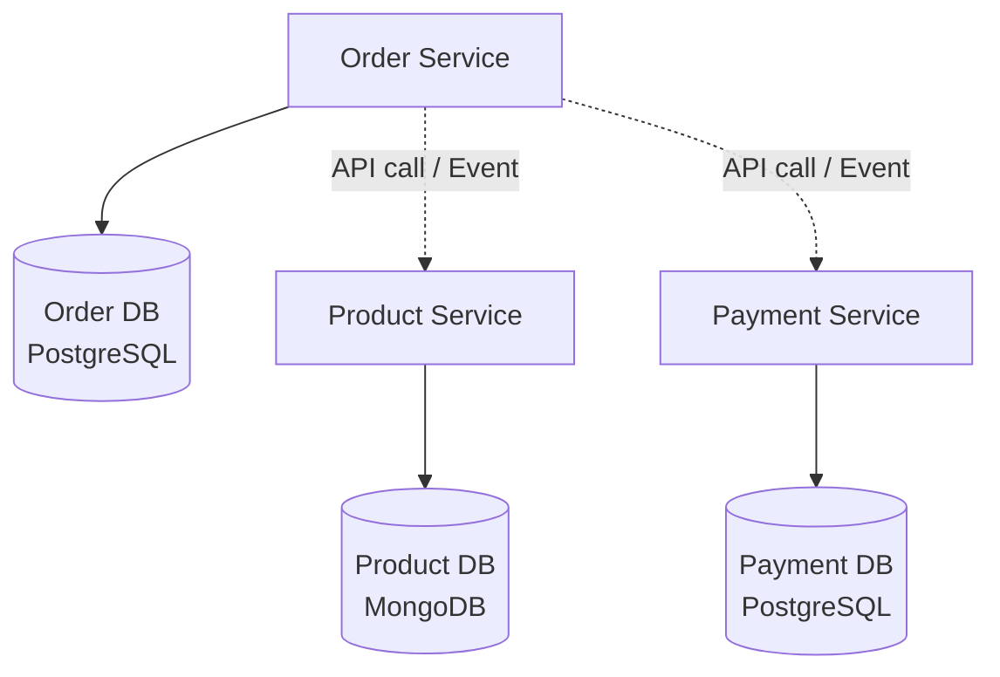

**Lợi ích**: Loose coupling, polyglot persistence, independent scaling, independent deployment.

**Thách thức**: Distributed transactions, data consistency, cross-service queries → giải quyết bằng Saga, CQRS.

### 4.2. Saga Pattern

**Saga** quản lý distributed transaction bằng chuỗi local transactions, mỗi transaction có **compensating transaction** tương ứng để rollback.

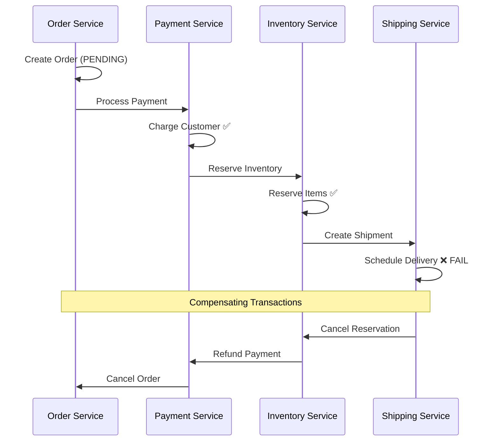

Hai loại Saga:

| Loại | Cách hoạt động | Ưu điểm | Nhược điểm |
|------|---------------|----------|------------|
| **Choreography** | Service tự publish event, service khác listen | Đơn giản, loose coupling | Khó theo dõi flow, cyclic dependency |
| **Orchestration** | Có Saga Orchestrator điều phối | Dễ theo dõi, logic tập trung | Single point of failure, coupling |

### 4.3. CQRS

**CQRS** (Command Query Responsibility Segregation) tách model **ghi** (Command) và model **đọc** (Query) thành hai hệ thống riêng biệt.

```
┌──────────────────────────────────────────────────────┐
│                      CQRS                            │
│                                                      │
│   COMMAND SIDE              QUERY SIDE               │
│   ───────────              ──────────                │
│                                                      │
│   ┌───────────┐            ┌───────────┐             │
│   │ Command   │            │ Query     │             │
│   │ Handler   │            │ Handler   │             │
│   └─────┬─────┘            └─────┬─────┘             │
│         │                        │                   │
│   ┌─────▼──────┐            ┌────▼──────┐            │
│   │ Write DB   │───Event───▶│ Read DB   │            │
│   │(Normalized │            │(Optimized │            │
│   │ PostgreSQL)│            │ for reads)│            │
│   └────────────┘            └───────────┘            │
│                                                      │
└──────────────────────────────────────────────────────┘
```

**Khi nào dùng**: Read/Write ratio chênh lệch lớn, cần optimize query phức tạp, kết hợp Event Sourcing.

### 4.4. Event Sourcing

Thay vì lưu **state hiện tại**, lưu **tất cả events** đã xảy ra. State hiện tại được tái tạo bằng cách replay events.

```
┌──────────────────────────────────────────────┐
│ Event Store cho Order #12345                 │
│                                              │
│ Event 1: OrderCreated      {items: [...]}    │
│ Event 2: PaymentReceived   {amount: 500}     │
│ Event 3: ItemShipped       {tracking: "TX1"} │
│ Event 4: ItemDelivered     {date: "2025-03"} │
│                                              │
│ Current State = replay(Event1..Event4)       │
│ → Order{status: DELIVERED, amount: 500, ...} │
└──────────────────────────────────────────────┘
```

**Lợi ích**: Audit trail đầy đủ, time-travel debugging, rebuild state.

**Thách thức**: Event store lớn, schema evolution, eventual consistency.

### 4.5. Transactional Outbox

**Transactional Outbox** đảm bảo **atomic** giữa việc update database và publish event — giải quyết dual-write problem.

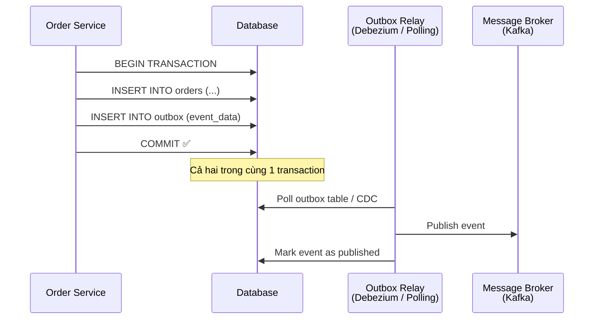

**Cách hoạt động:**
1. Service ghi data **và** event vào cùng database, trong cùng transaction
2. **Outbox Relay** (polling hoặc CDC — Change Data Capture) đọc outbox table
3. Relay publish event tới message broker
4. Đảm bảo **at-least-once delivery** — consumer cần idempotent

---

## 5. Communication Patterns — Nhóm giao tiếp

> 📖 Chi tiết xem [06 — Inter-Service Communication](06-inter-service-communication.md), [07 — API Gateway](07-api-gateway.md)

### 5.1. API Gateway / BFF

**API Gateway** là single entry point cho tất cả client, xử lý routing, authentication, rate limiting, response aggregation.

**BFF** (Backend for Frontend) là biến thể trong đó mỗi loại client (web, mobile, IoT) có **gateway riêng**, tối ưu response cho từng platform.

```
┌─────────────┐  ┌──────────────┐  ┌──────────────┐
│   Web App   │  │  Mobile App  │  │   IoT Device │
└──────┬──────┘  └──────┬───────┘  └──────┬───────┘
       │                │                 │
┌──────▼──────┐  ┌──────▼───────┐  ┌──────▼───────┐
│  Web BFF    │  │ Mobile BFF   │  │  IoT BFF     │
│  (GraphQL)  │  │ (REST slim)  │  │ (MQTT/gRPC)  │
└──────┬──────┘  └──────┬───────┘  └──────┬───────┘
       │                │                 │
       └────────────────┼─────────────────┘
                        │
            ┌───────────┼───────────┐
            ▼           ▼           ▼
     ┌──────────┐ ┌──────────┐ ┌───────────┐
     │ Order Svc│ │ User Svc │ │Product Svc│
     └──────────┘ └──────────┘ └───────────┘
```

### 5.2. Service Mesh

**Service Mesh** là infrastructure layer chuyên xử lý **service-to-service communication** — mTLS, load balancing, observability, traffic management — mà không cần thay đổi application code.

```
┌──────────────────────────────────────────────────┐
│                 Control Plane                    │
│        (Istiod / Linkerd Control Plane)          │
│  ┌───────────┐  ┌────────────┐  ┌───────────┐    │
│  │ Config    │  │ Certificate│  │ Service   │    │
│  │ Discovery │  │ Authority  │  │ Discovery │    │
│  └───────────┘  └────────────┘  └───────────┘    │
└───────────────────────┬──────────────────────────┘
                        │ push config
        ┌───────────────┼───────────────┐
        ▼               ▼               ▼
  ┌───────────┐   ┌───────────┐   ┌───────────┐
  │ ┌───────┐ │   │ ┌───────┐ │   │ ┌───────┐ │
  │ │Svc A  │ │   │ │Svc B  │ │   │ │Svc C  │ │
  │ └───┬───┘ │   │ └───┬───┘ │   │ └───┬───┘ │
  │     │     │   │     │     │   │     │     │
  │ ┌───▼───┐ │   │ ┌───▼───┐ │   │ ┌───▼───┐ │
  │ │Envoy  │◀├──▶│ │Envoy  │◀├──▶│ │Envoy  │ │
  │ │Proxy  │ │   │ │Proxy  │ │   │ │Proxy  │ │
  │ └───────┘ │   │ └───────┘ │   │ └───────┘ │
  └───────────┘   └───────────┘   └───────────┘
      Data Plane (sidecar proxies)
```

> 📖 Chi tiết xem [13 — Orchestration](13-orchestration.md) — phần Service Mesh

### 5.3. Event-Driven Architecture

Services giao tiếp qua **events** thay vì direct calls. Producer publish event, Consumer subscribe và xử lý.

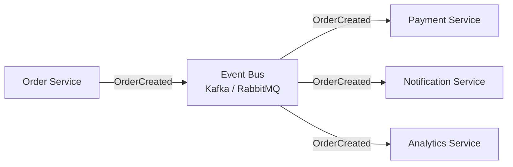

**Lợi ích**: Loose coupling, scalability, eventual consistency, audit trail.

### 5.4. Async Request-Reply

Khi cần response từ async operation nhưng không muốn block caller.

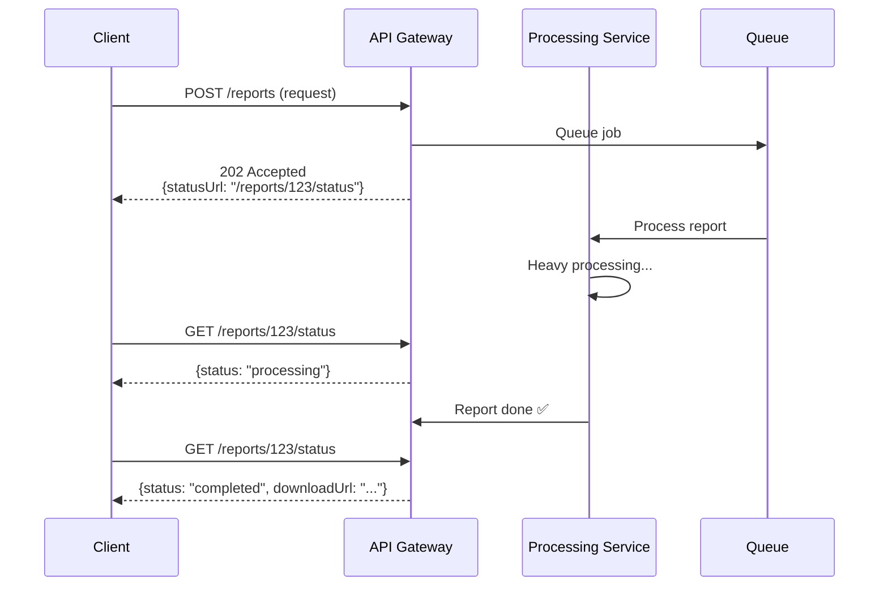

**Khi nào dùng**: Long-running operations (report generation, video processing, batch jobs).

---

## 6. Reliability Patterns — Nhóm đảm bảo độ tin cậy

> 📖 Chi tiết đầy đủ xem [10 — Resilience Patterns](10-resilience-patterns.md)

### 6.1. Circuit Breaker

Ngắt mạch khi downstream service liên tục fail, tránh **cascade failure**.

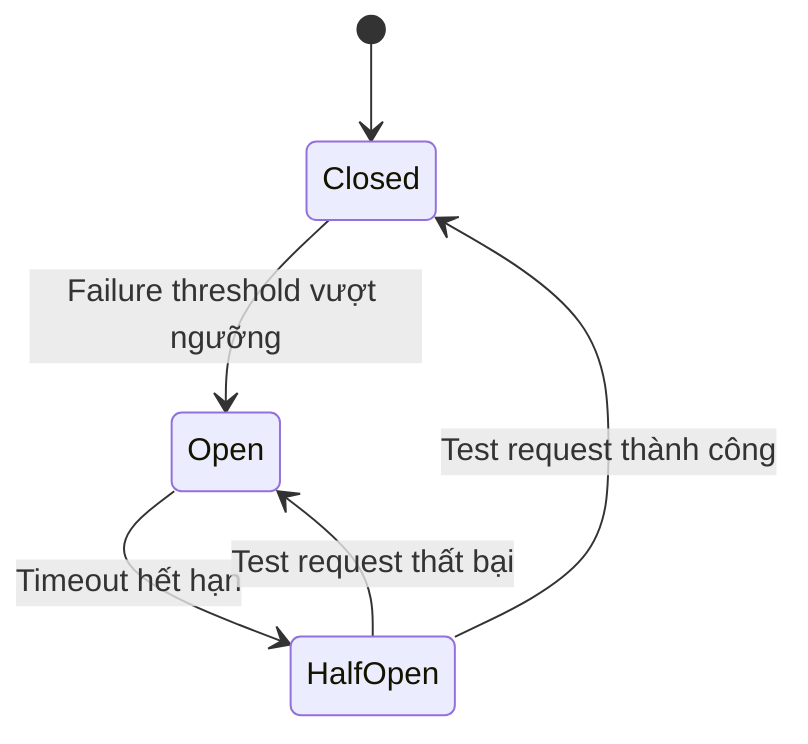

| State | Hành vi |
|-------|---------|
| **Closed** | Request đi bình thường, đếm failures |
| **Open** | Block tất cả requests, trả về fallback ngay lập tức |
| **Half-Open** | Cho phép 1 test request để kiểm tra service đã recover chưa |

### 6.2. Retry with Backoff

Tự động retry request khi gặp **transient failure**, với khoảng cách tăng dần (exponential backoff) + jitter.

```
Retry 1: wait 1s    + random(0, 500ms)
Retry 2: wait 2s    + random(0, 500ms)
Retry 3: wait 4s    + random(0, 500ms)
Retry 4: wait 8s    + random(0, 500ms)  ← max retries reached, give up
```

**Quan trọng**: Chỉ retry cho **transient errors** (503, timeout, network error). Không retry cho **permanent errors** (400, 404, 422).

### 6.3. Bulkhead

Cô lập resources giữa các consumers để failure ở một nơi **không ảnh hưởng** nơi khác — giống các khoang chống chìm trên tàu.

```
┌──────────────────────────────────────────────┐
│                Order Service                 │
│                                              │
│  ┌──────────────┐    ┌──────────────────┐    │
│  │ Thread Pool 1│    │ Thread Pool 2    │    │
│  │ (Payment API)│    │ (Inventory API)  │    │
│  │ max: 20      │    │ max: 10          │    │
│  │ ████████░░   │    │ ██░░░░░░░░       │    │
│  └──────────────┘    └──────────────────┘    │
│                                              │
│  Payment API chậm     Inventory API          │
│  → chỉ pool 1 bị     → không bị ảnh hưởng    │
│    exhausted                                 │
└──────────────────────────────────────────────┘
```

### 6.4. Timeout

Đặt **thời gian chờ tối đa** cho mọi external call. Không bao giờ để một call chờ vô hạn.

```
Client → API Gateway (timeout: 30s)
  → Order Service (timeout: 10s)
    → Payment Service (timeout: 5s)
      → Bank API (timeout: 3s)

Rule: Outer timeout > Sum of inner timeouts
```

### 6.5. Health Check / Heartbeat

Mỗi service expose **health endpoint** để orchestrator (K8s) hoặc load balancer biết service có healthy không.

```json
// GET /health
{
  "status": "UP",
  "checks": {
    "database": { "status": "UP", "responseTime": "12ms" },
    "redis": { "status": "UP", "responseTime": "3ms" },
    "downstream-payment": { "status": "DEGRADED", "responseTime": "2500ms" }
  },
  "uptime": "72h 15m",
  "version": "1.2.3"
}
```

---

## 7. Deployment Patterns — Nhóm triển khai

> 📖 Chi tiết đầy đủ xem [14 — CI/CD & Deployment](14-cicd-deployment.md)

### 7.1. Blue-Green Deployment

Chạy **hai môi trường giống nhau** (Blue = hiện tại, Green = mới). Khi Green ready, switch traffic.

```
Before switch:
┌─────────┐         ┌───────────────┐
│  Users  │────────▶│ Blue (v1.0) ✅│
└─────────┘         └───────────────┘
                    ┌───────────────┐
                    │Green (v1.1) 🧪│  ← testing
                    └───────────────┘

After switch:
┌─────────┐         ┌───────────────┐
│  Users  │────────▶│Green (v1.1) ✅│
└─────────┘         └───────────────┘
                    ┌───────────────┐
                    │ Blue (v1.0) 💤│  ← standby / rollback
                    └───────────────┘
```

### 7.2. Canary Deployment

Triển khai phiên bản mới cho **một phần nhỏ traffic** (1-5%), monitor, rồi tăng dần.

```
Phase 1:  █░░░░░░░░░  5% → v2.0 (canary)
          █████████░  95% → v1.0 (stable)

Phase 2:  ████░░░░░░  30% → v2.0
          ██████░░░░  70% → v1.0

Phase 3:  ██████████  100% → v2.0 ✅
```

### 7.3. Feature Toggle

Bật/tắt tính năng bằng **configuration**, không cần deploy lại.

```
if (featureFlags.isEnabled("new-checkout-flow", userId)) {
    // New checkout flow
    return newCheckoutService.process(order);
} else {
    // Old checkout flow
    return legacyCheckoutService.process(order);
}
```

| Loại toggle | Thời gian sống | Ví dụ |
|------------|---------------|-------|
| **Release toggle** | Ngắn (tuần) | Incomplete feature, gradual rollout |
| **Experiment toggle** | Ngắn-Trung bình | A/B testing |
| **Ops toggle** | Dài | Circuit breaker, kill switch |
| **Permission toggle** | Dài | Premium features, beta access |

---

## 8. Observability Patterns — Nhóm quan sát

> 📖 Chi tiết đầy đủ xem [11 — Observability & Evolvability](11-observability-evolvability.md)

### 8.1. Log Aggregation

Thu thập logs từ tất cả services về **một nơi tập trung** để search, filter, analyze.

```
┌───────────┐  ┌───────────┐  ┌───────────┐
│ Service A │  │ Service B │  │ Service C │
│ (logs)    │  │ (logs)    │  │ (logs)    │
└─────┬─────┘  └──────┬────┘  └───────┬───┘
      │               │               │
      └───────────────┼───────────────┘
                      ▼
              ┌───────────────┐
              │ Log Aggregator│
              │ (ELK / Loki)  │
              └───────┬───────┘
                      ▼
              ┌───────────────┐
              │   Dashboard   │
              │   (Kibana /   │
              │    Grafana)   │
              └───────────────┘
```

### 8.2. Distributed Tracing

Theo dõi **một request xuyên suốt** nhiều services, mỗi service thêm span vào trace.

```
Trace ID: abc-123
├── Span 1: API Gateway (15ms)
│   ├── Span 2: Order Service (45ms)
│   │   ├── Span 3: Inventory Service (20ms)
│   │   └── Span 4: Payment Service (120ms)
│   │       └── Span 5: Bank API (95ms)
│   └── Span 6: Notification Service (8ms)
Total: 188ms
```

**Tools**: Jaeger, Zipkin, OpenTelemetry, AWS X-Ray.

### 8.3. Health Check API

Expose endpoint chuẩn (`/health`, `/ready`, `/live`) cho orchestrator kiểm tra:

| Endpoint | Mục đích | K8s Probe |
|----------|----------|-----------|
| `/health/live` | Service còn sống? | Liveness probe |
| `/health/ready` | Service sẵn sàng nhận traffic? | Readiness probe |
| `/health/startup` | Service đã khởi động xong? | Startup probe |

### 8.4. Correlation ID

Gắn **ID duy nhất** cho mỗi request từ client, truyền qua tất cả services để liên kết logs và traces.

```
Client → API Gateway (X-Correlation-ID: req-789)
  → Order Service (logs with correlation_id: req-789)
    → Payment Service (logs with correlation_id: req-789)
    → Inventory Service (logs with correlation_id: req-789)
```

```json
// Structured log entry
{
  "timestamp": "2025-03-15T10:30:45Z",
  "level": "INFO",
  "service": "payment-service",
  "correlation_id": "req-789",
  "message": "Payment processed successfully",
  "amount": 150.00,
  "order_id": "ORD-456"
}
```

---

## 9. Anti-patterns — Những sai lầm cần tránh

Anti-patterns là các mẫu thiết kế **sai lầm phổ biến** khi triển khai Microservice. Nhận biết chúng sớm giúp tránh technical debt nghiêm trọng.

### 9.1. Distributed Monolith

**Vấn đề**: Tách thành nhiều services nhưng chúng vẫn **phụ thuộc chặt** nhau — deploy phải deploy cùng lúc, thay đổi một service phải thay đổi nhiều services khác.

```
❌ Distributed Monolith
┌──────────┐     ┌──────────┐     ┌──────────┐
│ Service A│────▶│ Service B│────▶│ Service C│
│          │◀────│          │◀────│          │
└──────────┘     └──────────┘     └──────────┘
Shared DB, sync calls, tight coupling
→ Có nhược điểm của cả Monolith VÀ Microservice

✅ True Microservice
┌──────────┐     ┌──────────┐     ┌──────────┐
│ Service A│     │ Service B│     │ Service C│
│  ┌────┐  │     │  ┌────┐  │     │  ┌────┐  │
│  │ DB │  │     │  │ DB │  │     │  │ DB │  │
│  └────┘  │     │  └────┘  │     │  └────┘  │
└──────────┘     └──────────┘     └──────────┘
Async events, independent deployment, own data
```

**Dấu hiệu nhận biết:**
- Deploy service A → phải deploy B và C cùng lúc
- Thay đổi API service A → phải sửa code ở B, C, D
- Nhiều services dùng chung database
- Team không thể làm việc độc lập

**Cách khắc phục:**
- Áp dụng [Database per Service](#41-database-per-service)
- Chuyển sync calls → async events
- Định nghĩa rõ API contracts, sử dụng API versioning
- Bounded Context rõ ràng — xem [02 — Bounded Context](02-single-responsibility-bounded-context.md)

### 9.2. Shared Database

**Vấn đề**: Nhiều services đọc/ghi **cùng một database** → coupling chặt ở data layer.

```
❌ Shared Database Anti-pattern
┌───────────┐  ┌───────────┐  ┌───────────┐
│ Order Svc │  │Product Svc│  │ User Svc  │
└─────┬─────┘  └──────┬────┘  └───────┬───┘
      │               │               │
      └───────────────┼───────────────┘
                      ▼
              ┌───────────────┐
              │  Shared DB    │
              │ ┌──────┬─────┐│
              │ │orders│prods││
              │ ├──────┼─────┤│
              │ │users │ ... ││
              │ └──────┴─────┘│
              └───────────────┘

Vấn đề:
• Service A thay đổi schema → Service B, C bị break
• Không thể scale DB cho riêng 1 service
• Tight coupling qua database schema
```

**Hậu quả:**
- Schema change = coordinated deployment across teams
- Performance bottleneck — 1 slow query ảnh hưởng tất cả
- Không thể dùng polyglot persistence

### 9.3. Mega Service

**Vấn đề**: Service quá lớn, làm quá nhiều việc — thực chất là **monolith đội lốt microservice**.

```
❌ Mega Service
┌──────────────────────────────────────┐
│         "Order Service"              │
│                                      │
│  • Tạo order                         │
│  • Quản lý payment                   │
│  • Quản lý inventory                 │
│  • Gửi notification                  │
│  • Generate reports                  │
│  • Quản lý user profiles             │
│  • Xử lý refunds                     │
│  • Shipping tracking                 │
│                                      │
│  50+ API endpoints                   │
│  200+ database tables                │
│  Team: 15 developers                 │
└──────────────────────────────────────┘

✅ Properly decomposed
┌──────────┐ ┌──────────┐ ┌──────────┐ ┌──────────┐
│ Order Svc│ │Payment   │ │Inventory │ │Notif Svc │
│ 5 APIs   │ │Svc 4 APIs│ │Svc 3 APIs│ │3 APIs    │
│ 10 tables│ │8 tables  │ │6 tables  │ │4 tables  │
│ 3 devs   │ │2 devs    │ │2 devs    │ │2 devs    │
└──────────┘ └──────────┘ └──────────┘ └──────────┘
```

**Dấu hiệu**: Service có > 20 API endpoints, > 50 database tables, team > 8 người, deployment time > 30 phút.

### 9.4. Chatty Services

**Vấn đề**: Services gọi nhau **quá nhiều lần** để hoàn thành một operation → latency cao, network overhead lớn.

```
❌ Chatty — 6 network calls cho 1 order
Client → Order Service
  → User Service: GET /users/123           (20ms)
  → User Service: GET /users/123/address   (15ms)
  → Product Service: GET /products/456     (25ms)
  → Product Service: GET /products/456/stock (20ms)
  → Pricing Service: GET /price/456        (30ms)
  → Tax Service: GET /tax?amount=100       (25ms)
Total: 135ms + overhead

✅ Better — Batch / aggregate calls
Client → Order Service
  → User Service: GET /users/123?include=address      (25ms)
  → Product Service: GET /products/456?include=stock,price (30ms)
  → Tax Service: GET /tax?amount=100                   (25ms)
Total: 80ms
```

**Cách khắc phục:**
- Batch API calls — gộp nhiều requests thành 1
- API Gateway aggregation
- Cache data cần thiết
- Sử dụng events thay vì sync calls
- Xem lại service boundaries — có thể boundaries sai

### 9.5. No API Versioning

**Vấn đề**: Thay đổi API mà **không version** → break tất cả consumers.

```
❌ Không versioning
POST /api/orders
{
  "customer": "John",        // đổi thành customer_id
  "total": 100               // đổi type thành string
}
→ Tất cả consumers bị break ngay lập tức

✅ Có versioning
POST /api/v1/orders   ← vẫn hoạt động cho consumers cũ
POST /api/v2/orders   ← API mới, consumers mới dùng
```

**Strategies:**
- URL versioning: `/api/v1/orders`, `/api/v2/orders`
- Header versioning: `Accept: application/vnd.myapp.v2+json`
- Backward compatible changes: chỉ **thêm** fields, không xóa/đổi

### 9.6. Hardcoded Configuration

**Vấn đề**: Config (URLs, credentials, feature flags) được **hardcode trong code** → phải rebuild/redeploy để thay đổi.

```
❌ Hardcoded
const DB_HOST = "prod-db.internal.company.com";
const PAYMENT_API_KEY = "sk_live_abc123";
const MAX_RETRY = 3;

✅ Externalized
const DB_HOST = process.env.DB_HOST;
const PAYMENT_API_KEY = vault.getSecret("payment/api-key");
const MAX_RETRY = configServer.get("order-service.max-retry");
```

> 📖 Chi tiết xem [16 — Configuration & Secrets Management](16-configuration-secrets-management.md)

### 9.7. Sync Chain / Death Star Architecture

**Vấn đề**: Request phải đi qua **chuỗi dài synchronous calls** → latency cộng dồn, bất kỳ service nào fail thì toàn bộ chain fail.

```
❌ Sync Chain (Death Star)
Client → A → B → C → D → E → F
                              │
Latency = sum(A..F)          │ E fails
Availability = A × B × C × D × E × F   ← rất thấp!

Nếu mỗi service có 99.5% uptime:
0.995^6 = 97.0% ← chỉ còn 97% availability!

✅ Better: Event-Driven + Async
Client → A ──publish──▶ Event Bus
                           │
                     ┌─────┼─────┐
                     ▼     ▼     ▼
                     B     C     D  (consume independently)
```

**Hậu quả:**
- Latency = tổng latency tất cả services trong chain
- Availability giảm theo cấp số nhân
- Debugging cực khó — lỗi ở service nào?
- Cascading failure — 1 service chậm → toàn bộ chain chậm

### 9.8. Over-engineering — Microservice cho mọi thứ

**Vấn đề**: Áp dụng microservice khi **không cần thiết** — đội nhỏ, product mới, domain chưa rõ.

```
❌ Over-engineering cho startup 3 người
┌──────┐ ┌──────┐ ┌──────┐ ┌──────┐ ┌──────┐
│Auth  │ │User  │ │Email │ │Notif │ │Config│
└──────┘ └──────┘ └──────┘ └──────┘ └──────┘
┌──────┐ ┌──────┐ ┌──────┐ ┌──────┐ ┌──────┐
│Order │ │Cart  │ │Promo │ │Pay   │ │Ship  │
└──────┘ └──────┘ └──────┘ └──────┘ └──────┘
+ Kafka + K8s + Istio + ELK + Vault + ...
→ 3 người maintain 10 services + infrastructure 🤯

✅ Start simple
┌──────────────────────────────────────┐
│           Modular Monolith           │
│  ┌──────┐ ┌──────┐ ┌──────┐          │
│  │ Auth │ │ Order│ │ Pay  │          │
│  │Module│ │Module│ │Module│          │
│  └──────┘ └──────┘ └──────┘          │
│       Well-defined boundaries        │
└──────────────────────────────────────┘
→ Tách thành microservice khi CẦN (scale, team lớn)
```

**Nguyên tắc:**
- **Monolith first** — bắt đầu đơn giản, tách khi cần
- Microservice có ý nghĩa khi: team > 8 người, cần scale riêng từng phần, cần deploy độc lập
- Domain phải **rõ ràng** trước khi tách — boundaries sai sẽ rất đắt để sửa

---

## 10. Decision Matrix — Chọn Pattern nào?

### Theo loại vấn đề

| Vấn đề cần giải quyết | Pattern phù hợp | Tham khảo |
|----------------------|-----------------|-----------|
| Thêm cross-cutting concern (logging, proxy) | **Sidecar** | [§2.1](#21-sidecar-pattern) |
| Quản lý outbound calls (retry, routing) | **Ambassador** | [§2.2](#22-ambassador-pattern) |
| Chuẩn hóa output format | **Adapter** | [§2.3](#23-adapter-pattern) |
| Chuyển từ monolith → microservice | **Strangler Fig** | [§3.1](#31-strangler-fig-pattern) |
| Distributed transaction | **Saga** | [§4.2](#42-saga-pattern) |
| Read-heavy workload | **CQRS** | [§4.3](#43-cqrs) |
| Audit trail, event replay | **Event Sourcing** | [§4.4](#44-event-sourcing) |
| Atomic write + publish event | **Transactional Outbox** | [§4.5](#45-transactional-outbox) |
| Single entry point cho clients | **API Gateway / BFF** | [§5.1](#51-api-gateway--bff) |
| Service-to-service networking | **Service Mesh** | [§5.2](#52-service-mesh) |
| Ngăn cascade failure | **Circuit Breaker + Bulkhead** | [§6.1](#61-circuit-breaker), [§6.3](#63-bulkhead) |
| Zero-downtime deployment | **Blue-Green / Canary** | [§7.1](#71-blue-green-deployment), [§7.2](#72-canary-deployment) |
| Debug distributed system | **Distributed Tracing + Correlation ID** | [§8.2](#82-distributed-tracing), [§8.4](#84-correlation-id) |

### Theo giai đoạn phát triển

```
┌─────────────────────────────────────────────────────────────────────┐
│                 PATTERN ADOPTION TIMELINE                           │
│                                                                     │
│  Early Stage          Growth Stage          Mature Stage            │
│  (1-3 services)       (5-15 services)       (20+ services)          │
│  ─────────────        ────────────────      ──────────────          │
│                                                                     │
│  ✅ DB per Service    ✅ Saga                ✅ CQRS                │
│  ✅ API Gateway       ✅ Circuit Breaker     ✅ Event Sourcing      │
│  ✅ Health Check      ✅ Distributed Tracing ✅ Service Mesh        │
│  ✅ Correlation ID    ✅ Log Aggregation     ✅ Transactional Outbox│
│  ✅ Retry + Timeout   ✅ Canary Deployment   ✅ Strangler Fig       │
│  ✅ Feature Toggle    ✅ BFF                 ✅ Adapter Pattern     │
│                       ✅ Sidecar             ✅ Ambassador          │
│                       ✅ Bulkhead                                   │
│                                                                     │
└─────────────────────────────────────────────────────────────────────┘
```

---

## 11. Ví dụ thực tế — E-Commerce Platform

Tổng hợp tất cả patterns áp dụng vào một hệ thống E-Commerce:

```
┌─────────────────────────────────────────────────────────────────────────────┐
│                        E-Commerce Platform                                  │
│                                                                             │
│  ┌──────────────────────────────────────────────────────────────────────┐   │
│  │                      API Gateway / BFF                               │   │
│  │              (Rate Limiting, Auth, Routing)                          │   │
│  └────────┬──────────┬──────────┬────────────┬───────────┬──────────────┘   │
│           │          │          │            │           │                  │
│  ┌────────▼───┐ ┌────▼─────┐ ┌──▼───────┐ ┌──▼──────┐ ┌──▼────────────┐     │
│  │ Order Svc  │ │ Product  │ │ Payment  │ │ User    │ │ Notification  │     │
│  │            │ │ Svc      │ │ Svc      │ │ Svc     │ │ Svc           │     │
│  │ ┌────────┐ │ │┌────────┐│ │┌────────┐│ │┌───────┐│ │               │     │
│  │ │Envoy   │ │ ││Envoy   ││ ││Envoy   ││ ││Envoy  ││ │  ┌─────────┐  │     │
│  │ │Sidecar │ │ ││Sidecar ││ ││Sidecar ││ ││Sidecar││ │  │Adapter  │  │     │
│  │ └────────┘ │ │└────────┘│ │└────────┘│ │└───────┘│ │  │(Format) │  │     │
│  │            │ │          │ │          │ │         │ │  └─────────┘  │     │
│  │ ┌────────┐ │ │┌────────┐│ │┌────────┐│ │┌──────┐ │ │               │     │
│  │ │  DB    │ │ ││  DB    ││ ││  DB    ││ ││  DB  │ │ │               │     │
│  │ │Postgres│ │ ││MongoDB ││ ││Postgres││ ││Postgr│ │ │               │     │
│  │ │Postgres│ │ ││MongoDB ││ ││Postgres││ ││Postgr│ │ │               │     │
│  │ └────────┘ │ │└────────┘│ │└────────┘│ │└──────┘ │ │               │     │
│  └────────────┘ └──────────┘ └──────────┘ └─────────┘ └───────────────┘     │
│           │          │          │          │                │               │
│  ─────────┴──────────┴──────────┴──────────┴────────────────┘               │
│                    Event Bus (Kafka)                                        │
│                                                                             │
│  Patterns sử dụng:                                                          │
│  ─────────────────                                                          │
│  ✅ API Gateway / BFF        — Entry point, routing                         │
│  ✅ Service Mesh (Envoy)     — mTLS, load balancing (Sidecar)               │
│  ✅ Database per Service     — Polyglot persistence                         │
│  ✅ Event-Driven (Kafka)     — Async communication                          │
│  ✅ Saga (Orchestration)     — Order → Payment → Inventory                  │
│  ✅ Circuit Breaker          — Payment Service calls Bank API               │
│  ✅ Transactional Outbox     — Order Service publish events                 │
│  ✅ CQRS                     — Product catalog (write) / search (read)      │
│  ✅ Adapter                  — Notification format standardization          │
│  ✅ Distributed Tracing      — Jaeger + OpenTelemetry                       │
│  ✅ Canary Deployment        — Gradual rollout qua Istio                    │
│  ✅ Feature Toggle           — New checkout flow A/B test                   │
│  ✅ Correlation ID           — Request tracking cross services              │
│                                                                             │
└─────────────────────────────────────────────────────────────────────────────┘
```

### Flow chi tiết: Đặt hàng

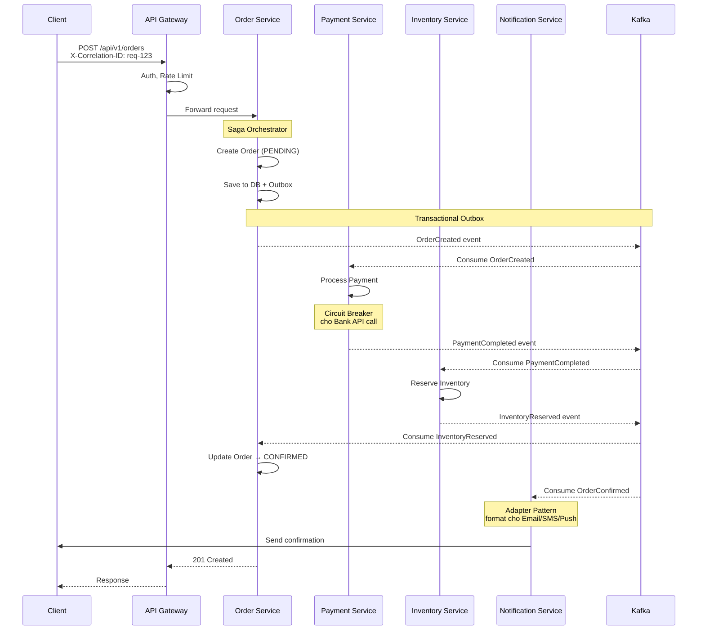

---

## 12. Checklist

### ✅ Design Review Checklist

```
STRUCTURAL
─────────
□ Cross-cutting concerns tách ra sidecar (không mix vào business logic)?
□ Outbound calls qua ambassador/proxy (có retry, circuit breaker)?
□ Heterogeneous output được chuẩn hóa qua adapter?

DATA
────
□ Mỗi service có database riêng?
□ Distributed transactions dùng Saga (không dùng 2PC)?
□ Event publish atomic với DB write (Transactional Outbox)?
□ CQRS cho read-heavy scenarios?

COMMUNICATION
─────────────
□ Prefer async/event-driven over sync calls?
□ Không có sync chain > 3 services?
□ API versioning strategy?
□ API Gateway cho external clients?

RELIABILITY
───────────
□ Circuit breaker cho external/downstream calls?
□ Timeout cho MỌI external call?
□ Retry with exponential backoff + jitter?
□ Bulkhead isolation cho critical paths?
□ Health check endpoints (liveness + readiness)?

OBSERVABILITY
─────────────
□ Structured logging với correlation ID?
□ Distributed tracing (OpenTelemetry)?
□ Centralized log aggregation?
□ Metrics + alerting?

DEPLOYMENT
──────────
□ Independent deployment (không cần coordinated release)?
□ Blue-Green hoặc Canary deployment?
□ Feature toggles cho risky features?
□ Rollback strategy?

ANTI-PATTERNS — TRÁNH
─────────────────────
□ Không phải distributed monolith?
□ Không shared database?
□ Không mega service (< 10 APIs, < 30 tables)?
□ Không chatty services?
□ Không hardcoded config?
□ Không over-engineering?
```

---

## 13. Tổng kết

```
┌─────────────────────────────────────────────────────────────────────┐
│                   MICROSERVICE PATTERNS SUMMARY                     │
│                                                                     │
│  KEY TAKEAWAYS                                                      │
│  ═════════════                                                      │
│                                                                     │
│  1. Không có silver bullet — mỗi pattern có trade-offs              │
│                                                                     │
│  2. Start simple → add patterns khi CẦN                             │
│     Monolith → Modular Monolith → Microservice                      │
│                                                                     │
│  3. Anti-patterns quan trọng hơn patterns                           │
│     Biết cái KHÔNG nên làm > Biết cái nên làm                       │
│                                                                     │
│  4. Pattern categories:                                             │
│     • Structural:    Sidecar, Ambassador, Adapter                   │
│     • Decomposition: Strangler Fig, Branch by Abstraction           │
│     • Data:          DB per Service, Saga, CQRS, Event Sourcing     │
│     • Communication: API Gateway, Service Mesh, Event-Driven        │
│     • Reliability:   Circuit Breaker, Retry, Bulkhead, Timeout      │
│     • Deployment:    Blue-Green, Canary, Feature Toggle             │
│     • Observability: Log Aggregation, Tracing, Correlation ID       │
│                                                                     │
│  5. Kết hợp patterns — chúng bổ trợ lẫn nhau:                       │
│     Saga + Transactional Outbox + Event-Driven                      │
│     Service Mesh (Sidecar) + Circuit Breaker + mTLS                 │
│     CQRS + Event Sourcing                                           │
│     API Gateway + BFF + Canary Deployment                           │
│                                                                     │
└─────────────────────────────────────────────────────────────────────┘
```

---

## 14. Liên kết liên quan

- [01 — Microservice Overview](01-microservice-overview.md) — Tổng quan kiến trúc Microservice
- [02 — Single Responsibility & Bounded Context](02-single-responsibility-bounded-context.md) — Xác định ranh giới service
- [03 — Loose Coupling & High Cohesion](03-loose-coupling-high-cohesion.md) — Nguyên tắc thiết kế
- [05 — Decomposition Strategies](05-decomposition-strategies.md) — Chi tiết Strangler Fig, DDD
- [06 — Inter-Service Communication](06-inter-service-communication.md) — REST, gRPC, Event-Driven
- [07 — API Gateway](07-api-gateway.md) — API Gateway, BFF
- [09 — Data Management](09-data-management.md) — Saga, CQRS, Event Sourcing chi tiết
- [10 — Resilience Patterns](10-resilience-patterns.md) — Circuit Breaker, Retry, Bulkhead
- [11 — Observability & Evolvability](11-observability-evolvability.md) — Logging, Tracing, Metrics
- [13 — Orchestration](13-orchestration.md) — Kubernetes, Service Mesh
- [14 — CI/CD & Deployment](14-cicd-deployment.md) — Blue-Green, Canary, GitOps
- [16 — Configuration & Secrets Management](16-configuration-secrets-management.md) — External Config, Vault
