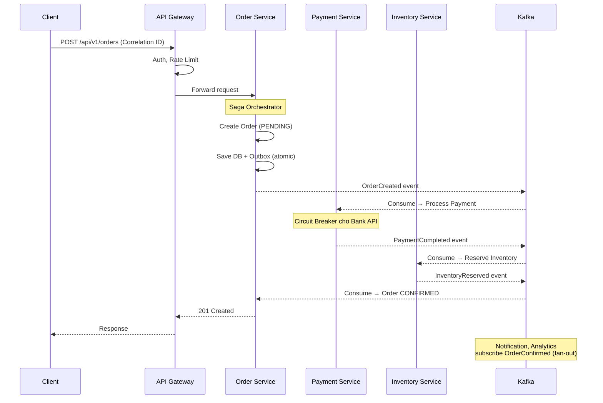

# Design Patterns trong Microservice — Bản đồ & Decision Guide

## 📋 Mục lục

- [1. Giới thiệu](#1-giới-thiệu)
- [2. Bản đồ 8 nhóm pattern](#2-bản-đồ-8-nhóm-pattern)
- [3. Decision Matrix — Chọn pattern nào?](#3-decision-matrix--chọn-pattern-nào)
  - [3.1. Theo loại vấn đề](#31-theo-loại-vấn-đề)
  - [3.2. Theo giai đoạn phát triển](#32-theo-giai-đoạn-phát-triển)
- [4. Ví dụ kết hợp — E-Commerce Platform](#4-ví-dụ-kết-hợp--e-commerce-platform)
- [5. Checklist tổng hợp](#5-checklist-tổng-hợp)
- [6. Liên kết liên quan](#6-liên-kết-liên-quan)

---

## 1. Giới thiệu

Trong kiến trúc Microservice, **Design Patterns** (mẫu thiết kế) là những giải pháp đã được chứng minh cho các vấn đề phổ biến của **hệ thống phân tán** — cách service giao tiếp, quản lý dữ liệu, đảm bảo độ tin cậy, triển khai và quan sát hệ thống. Khác với design patterns trong OOP (Gang of Four), các pattern ở đây hoạt động ở cấp độ **kiến trúc và hạ tầng**, không phải cấp độ class.

Tài liệu này là **trang chỉ mục (index) và cẩm nang ra quyết định** cho toàn bộ nhóm pattern:

- **Bản đồ 8 nhóm pattern** — mỗi nhóm một tài liệu chuyên sâu riêng ([mục 2](#2-bản-đồ-8-nhóm-pattern))
- **Decision matrix** — tra nhanh "gặp vấn đề X thì dùng pattern nào" ([mục 3](#3-decision-matrix--chọn-pattern-nào))
- **Ví dụ kết hợp** — cả 8 nhóm cùng xuất hiện trong một hệ thống E-Commerce ([mục 4](#4-ví-dụ-kết-hợp--e-commerce-platform))
- **Checklist** — rà soát trước khi build và trước khi go-live ([mục 5](#5-checklist-tổng-hợp))

> 💡 Đọc trang này để **định hướng**, rồi vào tài liệu chuyên sâu của nhóm pattern cần dùng. Mỗi tài liệu chuyên sâu có criteria chọn/tránh, trade-offs, lỗi thường gặp và checklist riêng.

---

## 2. Bản đồ 8 nhóm pattern

```
┌─────────────────────────────────────────────────────────────────────┐
│                MICROSERVICE DESIGN PATTERNS MAP                     │
│                                                                     │
│  ┌──────────────┐  ┌──────────────┐  ┌──────────────┐               │
│  │  Structural  │  │Decomposition │  │     Data     │               │
│  └──────────────┘  └──────────────┘  └──────────────┘               │
│  ┌──────────────┐  ┌──────────────┐  ┌──────────────┐               │
│  │Communication │  │ Reliability  │  │ Deployment   │               │
│  └──────────────┘  └──────────────┘  └──────────────┘               │
│  ┌──────────────┐  ┌──────────────┐                                 │
│  │Observability │  │Anti-patterns │                                 │
│  └──────────────┘  └──────────────┘                                 │
└─────────────────────────────────────────────────────────────────────┘
```

| Nhóm | Câu hỏi trung tâm | Patterns chính | Tài liệu |
|------|--------------------|-----------------|----------|
| **Structural** | Tổ chức cross-cutting concern quanh service như thế nào? | Sidecar, Ambassador, Adapter | [17 — Structural Patterns](17-structural-patterns.md) |
| **Decomposition** | Tách dần monolith sang microservice bằng quy trình nào? | Strangler Fig, Branch by Abstraction, Vine | [17 — Decomposition Patterns](17-decomposition-patterns.md) |
| **Data** | Sở hữu và đồng bộ dữ liệu giữa các service ra sao? | Database per Service, Transactional Outbox, Saga, CQRS, Event Sourcing | [17 — Data Patterns](17-data-patterns.md) |
| **Communication** | Dữ liệu và lệnh di chuyển giữa client ↔ service thế nào? | API Gateway, BFF, Service Mesh, Event-Driven, Async Request-Reply | [17 — Communication Patterns](17-communication-patterns.md) |
| **Reliability** | Phòng thủ sai lỗi và chống cascading failure ra sao? | Timeout, Retry with Backoff, Circuit Breaker, Bulkhead, Health Check | [17 — Reliability Patterns](17-reliability-patterns.md) |
| **Deployment** | Release an toàn, rollback được, không downtime? | Rolling Update, Blue-Green, Canary, Feature Toggle | [17 — Deployment Patterns](17-deployment-patterns.md) |
| **Observability** | Thấy được và debug được hệ thống phân tán? | Log Aggregation, Distributed Tracing, Correlation ID, Health Check API | [17 — Observability Patterns](17-observability-patterns.md) |
| **Anti-patterns** | Sai lầm nào cần nhận diện sớm và khắc phục thế nào? | Distributed Monolith, Shared Database, Mega Service, Chatty Services, Sync Chain... | [17 — Anti-patterns](17-anti-patterns.md) |

**Gợi ý thứ tự đọc** theo bối cảnh:

- **Đang học từ đầu** — đọc theo thứ tự nhóm: Decomposition → Data → Communication → Reliability → Deployment → Observability → Structural → Anti-patterns.
- **Đang gặp vấn đề cụ thể** — tra [Decision Matrix](#3-decision-matrix--chọn-pattern-nào) rồi nhảy thẳng tới nhóm tương ứng.
- **Đang review kiến trúc** — đọc [Anti-patterns](17-anti-patterns.md) trước (chẩn đoán bệnh), rồi dùng [Checklist](#5-checklist-tổng-hợp) ở trang này để rà.

---

## 3. Decision Matrix — Chọn pattern nào?

### 3.1. Theo loại vấn đề

| Vấn đề cần giải quyết | Pattern phù hợp | Tài liệu |
|----------------------|-----------------|----------|
| Thêm cross-cutting concern (logging, proxy, monitoring) mà không đụng code chính | **Sidecar** | [Structural](17-structural-patterns.md) |
| Quản lý outbound calls (retry, connection pooling, routing ra bên ngoài) | **Ambassador** | [Structural](17-structural-patterns.md) |
| Chuẩn hóa interface/output giữa service với hệ thống bên ngoài | **Adapter** | [Structural](17-structural-patterns.md) |
| Migrate monolith → microservice từng bước, không big-bang | **Strangler Fig / Branch by Abstraction / Vine** | [Decomposition](17-decomposition-patterns.md) |
| Service cần DB riêng nhưng phải đồng bộ dữ liệu với service khác | **Database per Service + Saga/Outbox** | [Data](17-data-patterns.md) |
| Distributed transaction (không dùng 2PC) | **Saga** | [Data](17-data-patterns.md) |
| Read-heavy workload, read model khác write model | **CQRS** | [Data](17-data-patterns.md) |
| Cần audit trail, replay state | **Event Sourcing** | [Data](17-data-patterns.md) |
| Ghi DB + publish event phải atomic (tránh dual write) | **Transactional Outbox** | [Data](17-data-patterns.md) |
| Single entry point, cross-cutting tại edge cho client | **API Gateway / BFF** | [Communication](17-communication-patterns.md) |
| Networking service-to-service (mTLS, LB, retry) đồng nhất mọi ngôn ngữ | **Service Mesh** | [Communication](17-communication-patterns.md) |
| Fan-out cho nhiều consumer, producer không biết ai lắng nghe | **Event-Driven Architecture** | [Communication](17-communication-patterns.md) |
| Tác vụ dài hơn timeout của request | **Async Request-Reply** | [Communication](17-communication-patterns.md) |
| Ngăn cascading failure khi downstream lỗi | **Circuit Breaker + Bulkhead + Timeout** | [Reliability](17-reliability-patterns.md) |
| Xử lý lỗi tạm thời (network blip) an toàn | **Retry with Backoff + Jitter** | [Reliability](17-reliability-patterns.md) |
| Phát hiện instance chết chủ động | **Health Check / Heartbeat** | [Reliability](17-reliability-patterns.md) |
| Zero-downtime deployment, release có kiểm soát | **Blue-Green / Canary / Rolling Update** | [Deployment](17-deployment-patterns.md) |
| Tách deploy khỏi release, tắt tính năng không cần deploy lại | **Feature Toggle** | [Deployment](17-deployment-patterns.md) |
| Debug luồng request xuyên qua nhiều service | **Distributed Tracing + Correlation ID** | [Observability](17-observability-patterns.md) |
| Tập trung log từ mọi service | **Log Aggregation** | [Observability](17-observability-patterns.md) |
| Hệ thống "trông có vẻ microservice" nhưng vẫn coupling chặt | **Anti-patterns — chẩn đoán & khắc phục** | [Anti-patterns](17-anti-patterns.md) |

### 3.2. Theo giai đoạn phát triển

Không hệ thống nào cần đủ pattern từ ngày đầu — thêm pattern **khi nỗi đau xuất hiện**, không phải để "đủ bộ":

```
┌─────────────────────────────────────────────────────────────────────┐
│                 PATTERN ADOPTION TIMELINE                           │
│                                                                     │
│  Early Stage          Growth Stage          Mature Stage            │
│  (1-3 services)       (5-15 services)       (20+ services)          │
│  ─────────────        ────────────────      ──────────────          │
│                                                                     │
│  ✅ DB per Service    ✅ Saga                ✅ CQRS                │
│  ✅ API Gateway       ✅ Circuit Breaker     ✅ Event Sourcing      │
│  ✅ Health Check      ✅ Distributed Tracing ✅ Service Mesh        │
│  ✅ Correlation ID    ✅ Log Aggregation     ✅ Transactional Outbox│
│  ✅ Retry + Timeout   ✅ Canary Deployment   ✅ Strangler Fig       │
│  ✅ Feature Toggle    ✅ BFF                 ✅ Adapter Pattern     │
│                       ✅ Sidecar             ✅ Ambassador          │
│                       ✅ Bulkhead                                   │
│                                                                     │
└─────────────────────────────────────────────────────────────────────┘
```

> ⚠️ Thêm pattern quá sớm chính là một anti-pattern ([over-engineering](17-anti-patterns.md)). Mỗi pattern có cái giá vận hành riêng — hệ thống nhỏ gọn dùng ít pattern thường tốt hơn hệ thống "đủ pattern" mà không có vấn đề nào để giải.

---

## 4. Ví dụ kết hợp — E-Commerce Platform

Một sàn thương mại điện tử điển hình dùng **đồng thời cả 8 nhóm pattern**, mỗi pattern ở đúng tầng của nó:

```
┌─────────────────────────────────────────────────────────────────────┐
│                        E-Commerce Platform                          │
│                                                                     │
│   Web / Mobile ──▶ API Gateway ──▶ Web BFF / Mobile BFF             │
│                    (auth, rate limit)  (aggregation theo client)    │
│                                              │                      │
│         ┌────────────┬────────────┬─────────┼────────────┐         │
│         ▼            ▼            ▼         ▼            ▼         │
│   Order Service  Product Svc  Payment Svc  User Svc  Notification  │
│   [sidecar proxy mỗi pod — mTLS, retry]     [Adapter chuẩn hóa     │
│         │            │            │         │       Email/SMS/Push]│
│      [PostgreSQL]  [MongoDB]  [PostgreSQL] [PostgreSQL]            │
│         │                                                          │
│         └──── Outbox ───▶ Kafka (Event Bus) ◀─────────────────────┘│
│                                │                                   │
│                    Inventory / Notification / Analytics subscribe   │
└─────────────────────────────────────────────────────────────────────┘
```

### Flow "Đặt hàng" — các pattern phối hợp


```mermaid
sequenceDiagram
    participant C as Client
    participant GW as API Gateway
    participant O as Order Service
    participant P as Payment Service
    participant I as Inventory Service
    participant K as Kafka

    C->>GW: POST /api/v1/orders (Correlation ID)
    GW->>GW: Auth, Rate Limit
    GW->>O: Forward request

    Note over O: Saga Orchestrator
    O->>O: Create Order (PENDING)
    O->>O: Save DB + Outbox (atomic)

    O-->>K: OrderCreated event
    K-->>P: Consume → Process Payment
    Note over P: Circuit Breaker cho Bank API
    P-->>K: PaymentCompleted event

    K-->>I: Consume → Reserve Inventory
    I-->>K: InventoryReserved event

    K-->>O: Consume → Order CONFIRMED
    O-->>GW: 201 Created
    GW-->>C: Response

    Note over K: Notification, Analytics<br/>subscribe OrderConfirmed (fan-out)
```

### Bảng phân công pattern

| Pattern | Nơi dùng trong hệ thống | Nhóm |
|---------|------------------------|------|
| API Gateway + BFF | Entry point duy nhất; aggregation riêng cho web/mobile | [Communication](17-communication-patterns.md) |
| Service Mesh (sidecar proxy) | mTLS, load balancing, retry giữa các service | [Structural](17-structural-patterns.md) / [Communication](17-communication-patterns.md) |
| Database per Service | Mỗi service một DB (PostgreSQL, MongoDB — polyglot) | [Data](17-data-patterns.md) |
| Transactional Outbox | Order ghi DB + publish event một cách atomic | [Data](17-data-patterns.md) |
| Saga (orchestration) | Đặt hàng → thanh toán → trừ kho, có compensation | [Data](17-data-patterns.md) |
| Event-Driven (Kafka) | Fan-out OrderConfirmed cho Notification, Analytics | [Communication](17-communication-patterns.md) |
| Circuit Breaker + Timeout | Payment gọi Bank API — ngân hàng chậm không kéo chết hệ thống | [Reliability](17-reliability-patterns.md) |
| Adapter | Notification chuẩn hóa format Email/SMS/Push | [Structural](17-structural-patterns.md) |
| Canary + Feature Toggle | Rollout checkout flow mới cho 5% traffic | [Deployment](17-deployment-patterns.md) |
| Distributed Tracing + Correlation ID | Theo dõi request xuyên suốt gateway → services → events | [Observability](17-observability-patterns.md) |
| Strangler Fig | Lộ trình tách dần từ monolith cũ của hệ thống | [Decomposition](17-decomposition-patterns.md) |

> 📖 Case study đầy đủ từ đề bài → phân tích domain → decompose → chọn pattern: [25 — Case Study: E-Commerce Platform](25-case-study-ecommerce.md).

---

## 5. Checklist tổng hợp

Rà nhanh theo từng nhóm — chi tiết hơn xem checklist cuối mỗi tài liệu chuyên sâu.

**Design review — trước khi build:**

- [ ] Ranh giới service theo bounded context rõ (không tách theo tech layer)?
- [ ] Mỗi service có database riêng; không shared database dài hạn?
- [ ] Mọi luồng "ghi DB + publish event" đi qua Transactional Outbox?
- [ ] Caller cần kết quả ngay mới dùng sync; còn lại async/event?
- [ ] Không sync chain dài quá 2–3 hop?
- [ ] Mọi external call có timeout + circuit breaker; retry có backoff + jitter và idempotent?
- [ ] API có versioning strategy; event schema có version + backward compatible?
- [ ] Mọi service deploy độc lập; release tách khỏi deploy (toggle/canary)?
- [ ] Structured log + correlation ID + distributed tracing xuyên suốt mọi hop?

**Operations — trước khi đi live:**

- [ ] Health check (liveness + readiness) cho mọi service; probe đúng semantic?
- [ ] Alert cho circuit breaker mở, consumer lag, DLQ, saga kẹt?
- [ ] Rollback đã test: traffic về version cũ, flag tắt, dữ liệu tương thích?
- [ ] Runbook cho các kịch bản: broker down, poison message, cascading failure?
- [ ] Đã rà [anti-patterns](17-anti-patterns.md): distributed monolith, mega service, chatty services, hardcoded config, over-engineering?

---

## 6. Liên kết liên quan

**Bộ tài liệu pattern (nhóm 17):**

- [17 — Structural Patterns](17-structural-patterns.md) — Sidecar, Ambassador, Adapter
- [17 — Decomposition Patterns](17-decomposition-patterns.md) — Strangler Fig, Branch by Abstraction, Vine
- [17 — Data Patterns](17-data-patterns.md) — Database per Service, Outbox, Saga, CQRS, Event Sourcing
- [17 — Communication Patterns](17-communication-patterns.md) — API Gateway, BFF, Service Mesh, Event-Driven, Async Request-Reply
- [17 — Reliability Patterns](17-reliability-patterns.md) — Timeout, Retry, Circuit Breaker, Bulkhead, Health Check
- [17 — Deployment Patterns](17-deployment-patterns.md) — Rolling, Blue-Green, Canary, Feature Toggle, Rollback
- [17 — Observability Patterns](17-observability-patterns.md) — Log Aggregation, Distributed Tracing, Correlation ID, Health Check API
- [17 — Anti-patterns](17-anti-patterns.md) — Distributed Monolith, Shared Database, Mega Service...

**Các doc chuyên đề liên quan:**

- [05 — Decomposition Strategies](05-decomposition-strategies.md) — Chọn ranh giới tách (Business Capability, DDD)
- [06 — Inter-Service Communication](06-inter-service-communication.md) — REST/gRPC/GraphQL, Queue/PubSub chi tiết
- [07 — API Gateway](07-api-gateway.md) — Gateway & BFF chuyên sâu
- [09 — Data Management](09-data-management.md) — CAP theorem, CDC, nền tảng data patterns
- [10 — Resilience Patterns](10-resilience-patterns.md) — Chi tiết cài đặt timeout, retry, circuit breaker
- [11 — Observability & Evolvability](11-observability-evolvability.md) — Logs, Metrics, Traces nền tảng
- [13 — Orchestration](13-orchestration.md) — Kubernetes, Service Mesh (Istio/Linkerd)
- [14 — CI/CD & Deployment](14-cicd-deployment.md) — Pipeline, deployment strategies
- [25 — Case Study: E-Commerce Platform](25-case-study-ecommerce.md) — Toàn bộ patterns trong một hệ thống thật
- [28 — Cheat Sheet](28-cheat-sheet.md) — Bảng tra nhanh các quyết định
