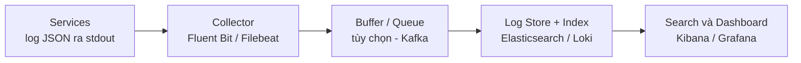
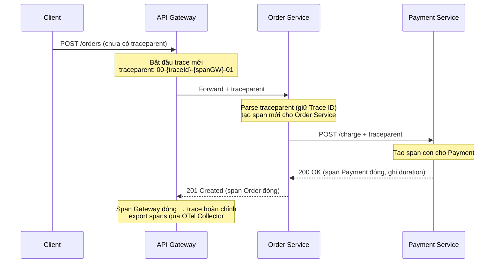
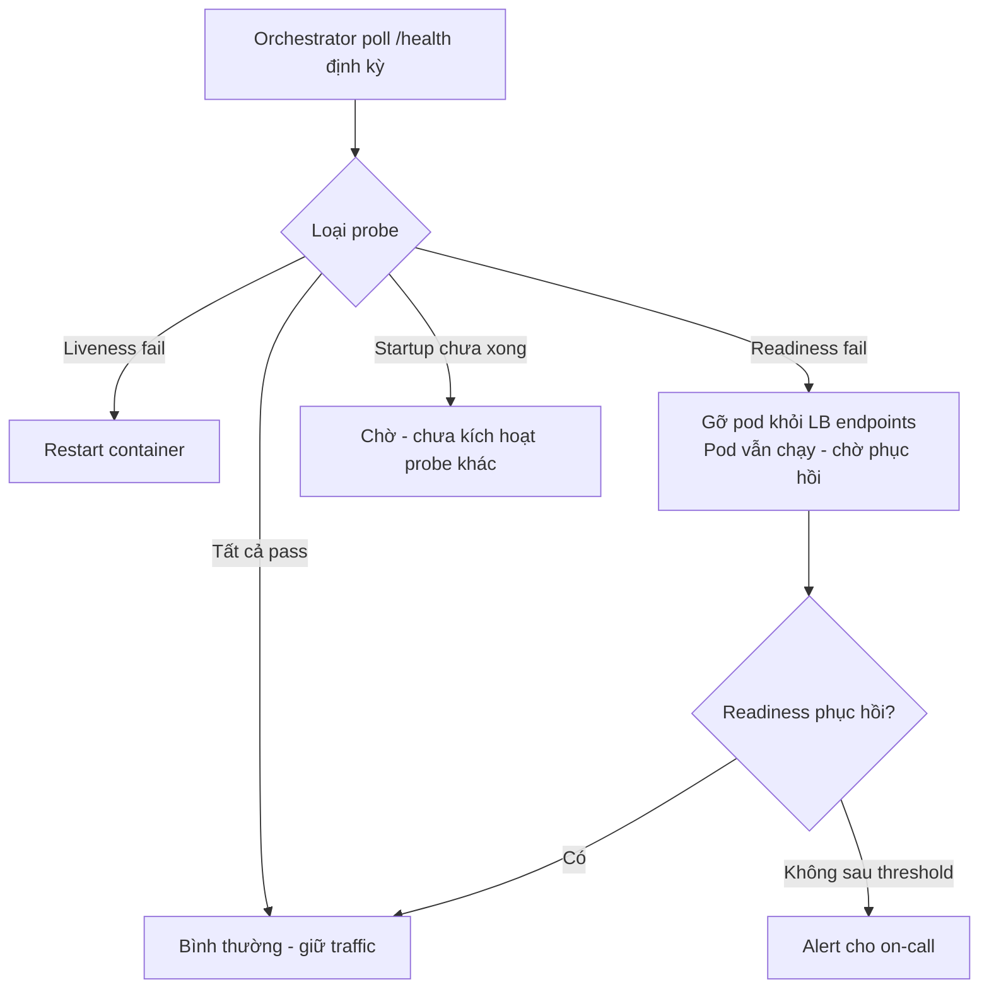
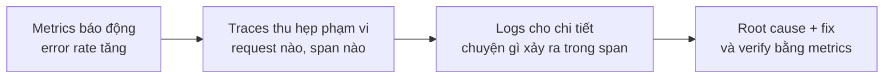
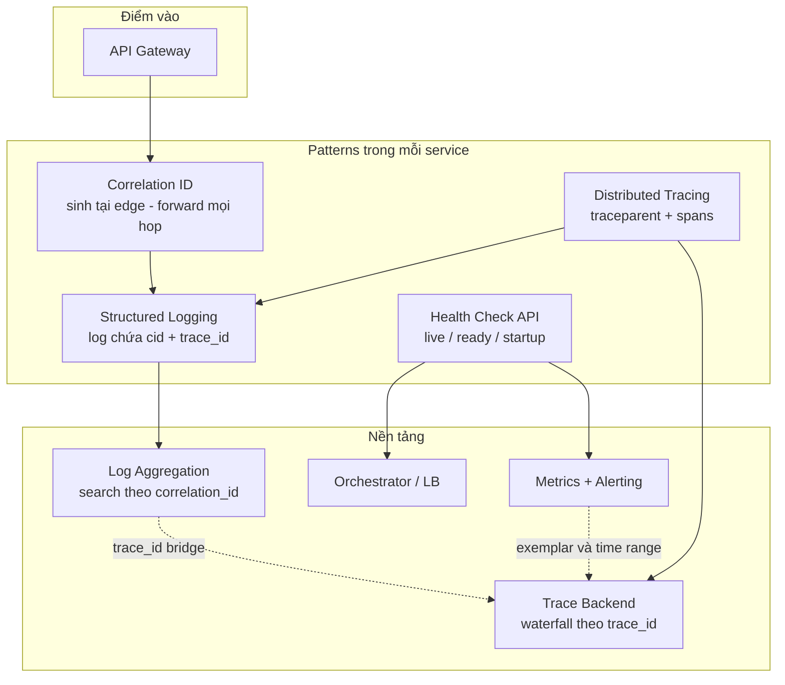
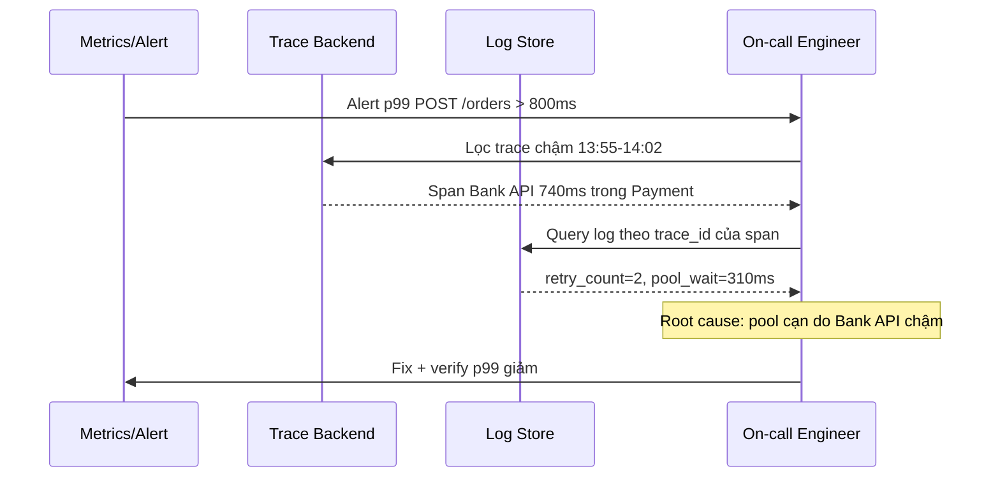
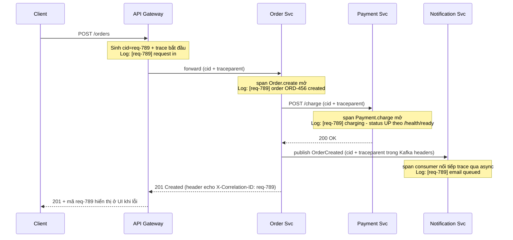

# Observability Patterns — Pattern quan sát hệ thống Microservice

## 📋 Mục lục

- [1. Giới thiệu](#1-giới-thiệu)
  - [1.1. Vì sao cần Observability Patterns?](#11-vì-sao-cần-observability-patterns)
  - [1.2. Observability Pattern là gì?](#12-observability-pattern-là-gì)
  - [1.3. Bốn pattern cốt lõi](#13-bốn-pattern-cốt-lõi)
- [2. Bức tranh toàn cảnh — Observability pipeline](#2-bức-tranh-toàn-cảnh--observability-pipeline)
- [3. Log Aggregation Pattern](#3-log-aggregation-pattern)
  - [3.1. Vấn đề](#31-vấn-đề)
  - [3.2. Giải pháp](#32-giải-pháp)
  - [3.3. Ví dụ thực tế](#33-ví-dụ-thực-tế)
  - [3.4. Trade-offs](#34-trade-offs)
  - [3.5. Khi nào chọn — khi nào không](#35-khi-nào-chọn--khi-nào-không)
  - [3.6. Lỗi thường gặp](#36-lỗi-thường-gặp)
- [4. Distributed Tracing Pattern](#4-distributed-tracing-pattern)
  - [4.1. Vấn đề](#41-vấn-đề)
  - [4.2. Giải pháp](#42-giải-pháp)
  - [4.3. Ví dụ thực tế](#43-ví-dụ-thực-tế)
  - [4.4. Trade-offs](#44-trade-offs)
  - [4.5. Khi nào chọn — khi nào không](#45-khi-nào-chọn--khi-nào-không)
  - [4.6. Lỗi thường gặp](#46-lỗi-thường-gặp)
- [5. Correlation ID Pattern](#5-correlation-id-pattern)
  - [5.1. Vấn đề](#51-vấn-đề)
  - [5.2. Giải pháp](#52-giải-pháp)
  - [5.3. Ví dụ thực tế](#53-ví-dụ-thực-tế)
  - [5.4. Correlation ID vs Trace ID](#54-correlation-id-vs-trace-id)
  - [5.5. Trade-offs](#55-trade-offs)
  - [5.6. Khi nào chọn — khi nào không](#56-khi-nào-chọn--khi-nào-không)
  - [5.7. Lỗi thường gặp](#57-lỗi-thường-gặp)
- [6. Health Check API Pattern](#6-health-check-api-pattern)
  - [6.1. Vấn đề](#61-vấn-đề)
  - [6.2. Giải pháp](#62-giải-pháp)
  - [6.3. Ví dụ thực tế](#63-ví-dụ-thực-tế)
  - [6.4. Trade-offs](#64-trade-offs)
  - [6.5. Khi nào chọn — khi nào không](#65-khi-nào-chọn--khi-nào-không)
  - [6.6. Lỗi thường gặp](#66-lỗi-thường-gặp)
- [7. Kết hợp patterns — Liên kết Logs, Metrics, Traces](#7-kết-hợp-patterns--liên-kết-logs-metrics-traces)
  - [7.1. Ba trụ cột bổ trợ nhau](#71-ba-trụ-cột-bổ-trợ-nhau)
  - [7.2. Bản đồ tương tác giữa các pattern](#72-bản-đồ-tương-tác-giữa-các-pattern)
  - [7.3. Ví dụ: quy trình debug một sự cố](#73-ví-dụ-quy-trình-debug-một-sự-cố)
- [8. Kiểm soát Cardinality và dữ liệu nhạy cảm](#8-kiểm-soát-cardinality-và-dữ-liệu-nhạy-cảm)
  - [8.1. Cardinality là gì?](#81-cardinality-là-gì)
  - [8.2. Đặt dữ liệu high-cardinality ở đâu](#82-đặt-dữ-liệu-high-cardinality-ở-đâu)
  - [8.3. Dữ liệu nhạy cảm trong telemetry](#83-dữ-liệu-nhạy-cảm-trong-telemetry)
  - [8.4. Quy tắc thực hành](#84-quy-tắc-thực-hành)
- [9. Decision Guide — Chọn pattern nào?](#9-decision-guide--chọn-pattern-nào)
  - [9.1. Theo vấn đề cần giải quyết](#91-theo-vấn-đề-cần-giải-quyết)
  - [9.2. Theo giai đoạn phát triển](#92-theo-giai-đoạn-phát-triển)
- [10. Ví dụ tổng hợp — Observability cho E-Commerce](#10-ví-dụ-tổng-hợp--observability-cho-e-commerce)
- [11. Checklist](#11-checklist)
  - [Correlation ID](#correlation-id)
  - [Log Aggregation](#log-aggregation)
  - [Distributed Tracing](#distributed-tracing)
  - [Health Check API](#health-check-api)
  - [Quản trị telemetry](#quản-trị-telemetry)
- [12. Tổng kết](#12-tổng-kết)
- [13. Liên kết liên quan](#13-liên-kết-liên-quan)

---

## 1. Giới thiệu

> 📖 Tài liệu này là phần tách chuyên sâu của mục *Observability Patterns* trong [17 — Design Patterns](17-design-patterns.md). Chi tiết về từng công cụ (Prometheus, Grafana, Jaeger, ELK, OpenTelemetry...) nằm ở [11 — Observability & Evolvability](11-observability-evolvability.md); tài liệu này tập trung vào **góc nhìn pattern**: vấn đề → giải pháp → trade-off → cách các pattern phối hợp với nhau.

Trong một hệ thống Monolith, khi có sự cố bạn mở **một** log file, đọc **một** stack trace và thường là tìm ra nguyên nhân. Trong hệ thống Microservice, một request có thể đi qua 5–15 services, mỗi service chạy nhiều bản sao (replica) trên nhiều node khác nhau. Câu hỏi *"lỗi ở đâu? chậm ở đâu? service này có còn sống không?"* trở thành bài toán riêng — và **Observability Patterns** là các giải pháp đã được kiểm chứng cho bài toán đó.

**Observability** (khả năng quan sát) là khả năng hiểu trạng thái bên trong của hệ thống chỉ dựa vào dữ liệu đầu ra của chính hệ thống đó — logs, metrics, traces. **Telemetry** (dữ liệu đo từ xa) là tập hợp các tín hiệu mà mỗi service phát ra để phục vụ việc này.

### 1.1. Vì sao cần Observability Patterns?

Bắt đầu bằng hình ảnh thực tế khi **không có** observability:

```
❌ KHÔNG CÓ OBSERVABILITY

User:        "Đặt hàng của tôi bị lỗi!"
Developer:   "Để tôi tra cứu..."
             → 12 services × 5 pods mỗi service = 60 nơi chứa log
             → Không biết các log entry nào thuộc về request này
             → Mỗi service một format log, một máy chủ khác nhau
             → SSH từng máy, grep thủ công
Kết quả:     2 giờ điều tra, vẫn chưa chắc nguyên nhân ở service nào

✅ CÓ OBSERVABILITY

User:        "Mình thấy mã lỗi req-789 trên màn hình"
Developer:   Search "req-789" trên hệ thống log tập trung
             → Thấy toàn bộ hành trình request qua 5 services
             → Trace cho thấy Payment Service chờ Bank API 2.5 giây
             → Log trong span đó cho thấy connection timeout
Kết quả:     5 phút tìm ra nguyên nhân, biết chính xác chỗ cần sửa
```

Đây không phải cường điệu: trong hệ phân tán, **không có pattern quan sát thì gần như không debug được** — vì dữ liệu cần thiết nằm rải rác và không nối với nhau.

### 1.2. Observability Pattern là gì?

Một **Observability Pattern** là một giải pháp kiến trúc có cấu trúc cố định (thành phần, luồng dữ liệu, trách nhiệm) cho một bài toán quan sát hệ thống cụ thể. Giống các pattern nhóm khác ([Structural](17-structural-patterns.md), [Resilience](10-resilience-patterns.md)...), mỗi pattern trả lời được:

1. **Vấn đề** — bài toán cụ thể trong hệ thống phân tán
2. **Giải pháp** — cấu trúc và các thành phần của pattern
3. **Trade-offs** — cái giá phải trả khi áp dụng
4. **Khi nào chọn / không chọn** — điều kiện áp dụng
5. **Tương tác** — pattern này bổ trợ những pattern nào

> 💡 **Phân biệt với tài liệu 11**: Doc [11 — Observability & Evolvability](11-observability-evolvability.md) đi sâu vào **ba trụ cột** (Logging, Metrics, Tracing) và cách cấu hình công cụ. Tài liệu này xem mỗi giải pháp quan sát như một **pattern** — nhấn mạnh vào **quyết định lựa chọn** và **tương tác giữa các pattern**, tránh lặp lại chi tiết công cụ.

### 1.3. Bốn pattern cốt lõi

| Pattern | Vấn đề giải quyết | Câu hỏi trả lời | Kết quả chính |
|---------|-------------------|-----------------|---------------|
| **[Log Aggregation](#3-log-aggregation-pattern)** | Log rải rác trên nhiều máy, nhiều container | *"Chuyện gì đã xảy ra?"* | Một nơi tập trung để search / filter / phân tích log |
| **[Distributed Tracing](#4-distributed-tracing-pattern)** | Không biết request đi qua đâu, tốn thời gian ở đâu | *"Request đi qua những service nào và chậm ở đâu?"* | Trace dạng waterfall của toàn bộ hành trình request |
| **[Correlation ID](#5-correlation-id-pattern)** | Không nối được các log entry của cùng một request | *"Log entries nào thuộc về cùng một request?"* | Chuỗi ID xuyên suốt nối log của mọi service |
| **[Health Check API](#6-health-check-api-pattern)** | Không biết service còn sống / sẵn sàng hay không | *"Service này có nhận được traffic không?"* | Tín hiệu tự động cho orchestrator & load balancer |

Bốn pattern này không thay thế nhau — chúng **phối hợp**: Correlation ID là "chất kết dính" cho Log Aggregation, Distributed Tracing cho góc nhìn thời gian, và Health Check API là tín hiệu cho hạ tầng điều phối. Mục [7](#7-kết-hợp-patterns--liên-kết-logs-metrics-traces) phân tích sự phối hợp này chi tiết.

---

## 2. Bức tranh toàn cảnh — Observability pipeline

Trước khi đi vào từng pattern, hãy nhìn toàn cảnh: telemetry sinh ra ở service, được thu gom, lưu trữ, và tiêu thụ bởi con người hoặc hệ thống tự động.

```
┌──────────────────────────────────────────────────────────────────────────┐
│                     OBSERVABILITY — BỨC TRANH TOÀN CẢNH                  │
│                                                                          │
│  TELEMETRY SOURCES (mỗi service phát ra dữ liệu)                         │
│  ┌─────────────┐  ┌─────────────┐  ┌─────────────┐                       │
│  │ Order Svc   │  │ Payment Svc │  │   ... Svc   │                       │
│  │ • log JSON  │  │ • log JSON  │  │ • log JSON  │   Mỗi request mang   │
│  │ • OTel SDK  │  │ • OTel SDK  │  │ • OTel SDK  │   theo Correlation   │
│  │ • /health   │  │ • /health   │  │ • /health   │   ID + traceparent   │
│  └──────┬──────┘  └──────┬──────┘  └──────┬──────┘                       │
│         │                │                │                              │
│         ▼                ▼                ▼                              │
│  ┌─────────────────────────────────────────────────┐                     │
│  │        COLLECTORS (thu gom, xử lý, chuyển tiếp) │                     │
│  │   Fluent Bit / OTel Collector / Prometheus      │                     │
│  └────────┬───────────────┬───────────────┬────────┘                     │
│           ▼               ▼               ▼                              │
│  ┌─────────────┐  ┌─────────────┐  ┌─────────────┐                       │
│  │ LOG STORE   │  │ TRACE STORE │  │ METRICS DB  │  LƯU TRỮ &           │
│  │ Loki / ES   │  │ Jaeger/Tempo│  │ Prometheus  │  TRUY VẤN            │
│  └──────┬──────┘  └──────┬──────┘  └──────┬──────┘                       │
│         └────────────────┼────────────────┘                              │
│                          ▼                                               │
│         ┌────────────────────────┐   ┌──────────────────┐                │
│         │ Dashboards / Search    │   │ Alerting         │                │
│         │ Kibana / Grafana       │   │ Alertmanager     │                │
│         └────────────────────────┘   └──────────────────┘                │
│                                                                          │
│  Orchestrator (K8s) ──poll──▶ /health ──▶ restart pod / gỡ traffic       │
└──────────────────────────────────────────────────────────────────────────┘
```

Ba thành phần quan trọng của pipeline:

| Thành phần | Trách nhiệm | Pattern liên quan |
|------------|-------------|-------------------|
| **Telemetry sources** | Service phát log, trace, metrics và expose health endpoint | Cả 4 pattern — nguồn dữ liệu |
| **Collectors** | Thu gom, chuẩn hóa, buffer, chuyển tiếp dữ liệu | Log Aggregation, Distributed Tracing |
| **Storage + Consumption** | Lưu trữ, tìm kiếm, dashboard, alert, hành động tự động | Log Aggregation, Health Check (orchestrator poll) |

> 💡 **Nguyên tắc quan trọng**: observability hiệu quả nhất khi **các loại dữ liệu nối được với nhau** — log chứa `correlation_id` và `trace_id`, metric có thể dẫn tới trace (exemplar). Chính Correlation ID và trace context tạo ra các "cầu nối" này. Chi tiết ở [mục 7](#7-kết-hợp-patterns--liên-kết-logs-metrics-traces).

---

## 3. Log Aggregation Pattern

### 3.1. Vấn đề

Mỗi microservice chạy trong container riêng, trên node riêng. Log của chúng:

- **Rải rác** ở hàng chục nơi: stdout của container, file trên node, volume riêng
- **Dễ mất**: container chết → filesystem của nó biến mất (ephemeral)
- **Khác format**: service A log JSON, service B log plain text
- **Không nối nhau**: không biết entry nào thuộc cùng một request

Khi có sự cố, việc phải SSH từng máy chạy `grep` là không khả thi về thời gian — và bất khả thi về mặt toán học khi số service lớn.

### 3.2. Giải pháp

**Log Aggregation** (tổng hợp log) đưa toàn bộ log về **một nền tảng tập trung** với pipeline chuẩn:



Các thành phần của pattern:

| Thành phần | Vai trò | Ví dụ công cụ |
|------------|---------|---------------|
| **Application logging** | Ghi **structured log** (thường là JSON) ra `stdout` | Structured logging library của từng ngôn ngữ |
| **Collector / Shipper** | Đọc log từ container/node, gắn metadata (service, pod, node), chuyển đi | Fluent Bit, Fluentd, Filebeat |
| **Buffer** (tùy chọn) | Chống mất log khi backend quá tải hoặc chết | Kafka, queue của collector |
| **Log Store** | Lưu trữ + đánh index để tìm kiếm nhanh | Elasticsearch, Loki, ClickHouse |
| **Search / Visualization** | Giao diện query, dashboard, cảnh báo dựa trên log | Kibana, Grafana |

**Điểm quyết định — triển khai collector theo kiểu nào?**

| Cách triển khai | Cách hoạt động | Ưu | Nhược |
|-----------------|----------------|-----|-------|
| **DaemonSet** (mỗi node 1 agent) | Agent đọc log của mọi container trên node đó | Tiết kiệm resource, không đụng Pod spec | Cần quyền đọc log node; khó customize theo service |
| **Sidecar** (mỗi Pod 1 agent) | Agent chạy cạnh container chính trong cùng Pod | Customize được theo service, đọc được file log riêng | Tốn resource nhân lên theo số Pod |
| **In-app library** | App tự gửi log thẳng ra backend | Không cần agent | App couple với backend; mất log nếu backend nghẽn |

> 🍎 DaemonSet là lựa chọn phổ biến nhất; Sidecar dùng khi service có nhu cầu đặc biệt (đọc file log riêng, cần parse phức tạp). Xem thêm [12 — Containerization](12-containerization.md) và [13 — Orchestration](13-orchestration.md).

**Structured log — điều kiện tiên quyết**: Log Aggregation chỉ phát huy giá trị khi log là **structured logging** (log có cấu trúc) — mỗi entry là một bản ghi có field rõ ràng thay vì câu văn tự do:

```json
{
  "timestamp": "2025-03-15T10:30:45.123Z",
  "level": "ERROR",
  "service": "payment-service",
  "version": "1.4.2",
  "correlation_id": "req-789",
  "trace_id": "4bf92f3577b34da6a3ce929d0e0e4736",
  "message": "Charge failed",
  "order_id": "ORD-456",
  "error_type": "GatewayTimeout",
  "duration_ms": 2503
}
```

Với entry như trên, bạn có thể query `service=payment-service AND correlation_id=req-789 AND level=ERROR` — điều không thể làm với plain text log.

### 3.3. Ví dụ thực tế

**Use case: điều tra đơn hàng ORD-456 thất bại**

Khách báo hỗ trợ với mã lỗi `req-789` (được trả về ở response — xem [Correlation ID](#5-correlation-id-pattern)). Developer:

1. Mở Kibana, query `correlation_id: req-789`
2. Thấy 7 log entries theo thứ tự thời gian: API Gateway → Order Service → Payment Service (ERROR `GatewayTimeout`) → Order Service (rollback)
3. Kết luận trong vài phút: thanh toán thất bại do timeout kết nối tới Bank API, đơn đã được rollback đúng quy trình

**Use case: chính sách retention (thời gian giữ log)**

Một hệ thống e-commerce sinh ra lượng log lớn (minh họa: vài chục GB/ngày). Nhóm vận hành chọn chiến lược phân lớp:

| Lớp | Thời gian giữ | Nơi lưu | Mục đích |
|-----|---------------|---------|----------|
| Hot | 7–30 ngày | Elasticsearch / Loki | Debug hàng ngày |
| Warm / Cold | 6–12 tháng | Object storage (S3...) | Điều tra sự cố lâu, đối chiếu |
| Audit log | Theo quy định (có thể nhiều năm) | WORM storage | Tuân thủ, pháp lý |

Retention là một phần của pattern — không có chính sách retention, chi phí lưu trữ sẽ phình to không kiểm soát.

### 3.4. Trade-offs

| Ưu điểm | Nhược điểm |
|---------|------------|
| Tìm kiếm log toàn hệ thống trong vài giây | Chi phí hạ tầng đáng kể (storage, index, vận hành) |
| Log tồn tại cả khi container chết | Index quá nhiều field → chi phí và độ trễ tăng |
| Đa đội ngũ dùng chung một nguồn sự thật | Cần kỷ luật structured logging từ mọi team |
| Nền tảng cho alert dựa trên log | Log nhạy cảm tập trung một nơi → trở thành mục tiêu bảo mật |

Điểm cần cân nhắc lớn nhất là **chi phí**: Elasticsearch đánh index tốn CPU/storage tỷ lệ với số field được index; Loki rẻ hơn nhờ chỉ index label và nén nội dung log, truy vấn chậm hơn khi phải scan. Lựa chọn backend phụ thuộc budget, volume và yêu cầu tốc độ query — so sánh chi tiết nằm ở [11 — Observability & Evolvability](11-observability-evolvability.md).

### 3.5. Khi nào chọn — khi nào không

**✅ Nên áp dụng khi:**

- Có ≥ 3–5 services chạy trên nhiều node/cluster — log thủ công không còn khả thi
- Cần debug nhanh khi on-call (trực xử lý sự cố), có quy trình hỗ trợ khách hàng cần tra cứu log
- Có yêu cầu audit / tuân thủ về lưu log

**❌ Nên chờ / không cần khi:**

- Hệ thống 1–2 services, 1 máy chủ: log JSON ra file + công cụ đơn giản là đủ, đừng vội vận hành một cụm ELK
- Team chưa thống nhất structured logging — **hãy làm structured logging trước**, platform sau (log không cấu trúc đổ vào ELK vẫn không query được)
- Đang ở giai đoạn PoC — đầu tư này không trả được nợ ở giai đoạn đó

> 💡 **Thứ tự đúng**: Structured logging + Correlation ID ở mức ứng dụng **trước** → sau đó mới xây platform aggregation. Platform không cứu được log rác.

### 3.6. Lỗi thường gặp

| Lỗi | Hậu quả | Cách tránh |
|-----|---------|------------|
| Log plain text tự do | Không query theo field được | Chuẩn hóa structured JSON từ service đầu tiên |
| Ghi log ra file trong container rồi quên rotation | Node đầy ổ đĩa → sập cả node | Log ra `stdout`, để kubelet/container runtime quản lý vòng đời |
| Không có retention | Chi phí storage tăng vô hạn | Định nghĩa vòng đời log (hot → cold → xóa) ngay từ đầu |
| Ghi DEBUG ở production | Volume log bùng nổ, nhiễu, tốn tiền | Đặt log level qua config, có thể đổi không cần deploy — xem [16 — Configuration & Secrets Management](16-configuration-secrets-management.md) |
| Stack trace bị tách thành nhiều entry | Mất nửa sau của lỗi | Dùng multiline parser ở collector hoặc ghi exception thành một field |
| Dùng label cardinality cao ở Loki (user_id, order_id) | Số stream bùng nổ, hiệu năng giảm | Label chỉ chứa chiều có tập giá trị hữu hạn (service, env) — xem [mục 8](#8-kiểm-soát-cardinality-và-dữ-liệu-nhạy-cảm) |
| Log dữ liệu nhạy cảm (token, thẻ, PII) | Rò rỉ dữ liệu, vi phạm quy định | Masking ở nguồn + scrub ở pipeline — xem [mục 8.3](#83-dữ-liệu-nhạy-cảm-trong-telemetry) |
| Log không có correlation_id | Vẫn phải mò khi điều tra | Bắt buộc mọi entry có `correlation_id` — xem [mục 5](#5-correlation-id-pattern) |

> 📖 Best practices logging chi tiết (log levels, structured logging, ELK stack, các lựa chọn thay thế) xem [11 — Observability & Evolvability](11-observability-evolvability.md).

---

## 4. Distributed Tracing Pattern

### 4.1. Vấn đề

Monitoring từng service riêng lẻ có thể cho thấy *"mọi service đều bình thường"* — nhưng khách hàng vẫn phàn nàn chậm. Tại sao? Vì thiếu góc nhìn **end-to-end**:

- Một request đi qua Gateway → Order → Inventory → Payment → Bank API. Tổng thời gian nằm ở **chuỗi** các bước, không nằm ở service nào riêng lẻ.
- Không có cách nào biết **thứ tự** và **quan hệ** giữa các bước khi mỗi service chỉ thấy "mình xử lý x KB request trong N ms".
- Với async messaging, lịch sử request còn bị "cắt" giữa các consumer group.

Câu hỏi pattern này trả lời: *"Request này đã đi qua đâu, từng bước tốn bao lâu, và bước nào là điểm nghẽn?"*

### 4.2. Giải pháp

**Distributed Tracing** (truy vết phân tán) ghi lại hành trình của một request xuyên suốt nhiều service thành một **trace** (vết) gồm nhiều **span** (đoạn):

- **Trace** — toàn bộ hành trình của một request, mang một Trace ID duy nhất
- **Span** — một đoạn đo lường trong trace (một HTTP call, một DB query, một lần publish message), có thời điểm bắt đầu/kết thúc và thuộc tính (attributes)
- **Context Propagation** (lan truyền ngữ cảnh) — cơ chế truyền Trace ID + Span ID hiện hành sang service kế tiếp qua header

**Luồng của pattern:**



**Các thành phần của pattern:**

| Thành phần | Vai trò | Ví dụ |
|------------|---------|-------|
| **Instrumentation** (trang bị đo lường) | Tạo span tại các điểm quan trọng: HTTP inbound/outbound, DB call, publish/consume message | OpenTelemetry SDK (auto-instrumentation + manual span) |
| **Context Propagation** | Truyền trace context qua chuẩn chung | W3C Trace Context (`traceparent` header) |
| **Collector** | Nhận spans, xử lý, quyết định sampling, export | OpenTelemetry Collector |
| **Trace backend** | Lưu trace, dựng cây span, giao diện phân tích | Jaeger, Zipkin, Grafana Tempo, AWS X-Ray |

> 📖 Cấu trúc header `traceparent`, các field của trace context và cách OpenTelemetry hoạt động được giải thích chi tiết ở [11 — Observability & Evolvability](11-observability-evolvability.md).

**Sampling (lấy mẫu)** — vì không phải hệ thống nào cũng giữ được 100% trace:

| Chiến lược | Quyết định ở đâu | Ưu | Nhược |
|------------|------------------|-----|-------|
| **Head sampling** | Đầu trace (service đầu tiên) — quyết định ngay khi request đến | Đơn giản, tiết kiệm bandwidth ngay từ nguồn | Không giữ được "toàn bộ trace lỗi" một cách có chủ đích theo kết quả cuối |
| **Tail sampling** | Cuối trace (collector) — quyết định sau khi trace hoàn chỉnh | Có thể giữ 100% trace lỗi/chậm, chỉ bỏ bớt trace bình thường | Cần hạ tầng collector có state, phức tạp hơn |

Thực tế phổ biến: head sampling đơn giản ở giai đoạn đầu; chuyển sang tail sampling (ví dụ giữ mọi trace có error + 1% trace bình thường) khi traffic lớn.

### 4.3. Ví dụ thực tế

**Use case: thanh toán chậm, không service nào "có lỗi"**

Dashboard metrics cho thấy p99 của `POST /orders` tăng vọt nhưng mọi service riêng lẻ đều xanh. Mở một trace chậm ngẫu nhiên:

```
Trace ID: 4bf92f3577b34da6a3ce929d0e0e4736      Tổng: 245ms (p99 vốn ~90ms)
│
├─ 00:00.000  POST /api/v1/orders                    [API Gateway]      8ms
├─ 00:00.008  OrderService.create                    [Order Service]  220ms
│   ├─ 00:00.010  InventoryService.reserve           [Inventory Svc]   18ms
│   ├─ 00:00.030  PaymentService.charge              [Payment Svc]    180ms
│   │   └─ 00:00.035  POST /v1/charges               [Bank API]       165ms  ⚠️
│   └─ 00:00.214  Saga: persist order                [Order Service]    6ms
└─ 00:00.245  201 → client
```

Waterfall cho thấy ngay: 165ms nằm ở span gọi Bank API bên trong Payment Service — service nào cũng "hoạt động bình thường" theo metrics, nhưng **quan hệ cha–con** trong trace lộ ra điểm nghẽn. Kéo theo đó, log của span này (`trace_id` trùng khớp) cho thấy số retry tăng — nguyên nhân cuối là network giữa cụm app và Bank API.

**Giá trị phụ: dependency map.** Sau một thời gian thu thập, trace backend vẽ được bản đồ service nào gọi service nào, với tần suất bao nhiêu — tài liệu sống cho kiến trúc hệ thống.

### 4.4. Trade-offs

| Ưu điểm | Nhược điểm |
|---------|------------|
| Góc nhìn end-to-end duy nhất cho hệ nhiều service | Overhead nhỏ nhưng có thật (CPU, bộ nhớ, mạng cho spans) |
| Xác định điểm nghẽn chính xác đến từng span | Cần instrumentation nhất quán ở **mọi** service — một hop đứt là mất trace |
| Dependency map tự sinh | Chi phí lưu trữ trace tăng theo traffic → cần sampling |
| Hoạt động cho cả async (message header) | Đòi hỏi team hiểu chuẩn (W3C Trace Context, OpenTelemetry) |

Điểm trade-off đặc trưng: giá trị của trace **tăng theo số service** mà request đi qua — với 2 services, một file log + stopwatch vẫn đủ; với 12 services, tracing gần như bắt buộc.

### 4.5. Khi nào chọn — khi nào không

**✅ Nên áp dụng khi:**

- Hệ thống có ≥ 5 services, request đi qua nhiều hop (đặc biệt có cả sync + async)
- Đang gặp vấn đề latency khó gán cho service nào, hoặc có external dependency (Bank API, third-party)
- Cần dependency map để phục vụ đánh giá tác động khi thay đổi kiến trúc

**❌ Nên chờ / không cần khi:**

- Monolith hoặc 1–2 services: APM (Application Performance Monitoring) cấp ứng dụng là đủ
- Traffic rất thấp hoặc hệ thống nội bộ ít quan trọng vận hành
- **Chưa có ai sẽ đọc trace** — instrumentation mà không tiêu thụ là lãng phí; bắt đầu từ metrics + logs trước

> 💡 **Chi phí của việc trì hoãn**: gắn OpenTelemetry auto-instrumentation từ đầu (gần như "miễn phí" khi đã dùng framework phổ biến) rẻ hơn nhiều so với quay lại trang bị đo lường cho 20 services sau này. Ngay cả khi chưa dựng backend trace, hãy để SDK phát trace context — đó là nền cho Correlation ID và tương lai.

### 4.6. Lỗi thường gặp

| Lỗi | Hậu quả | Cách tránh |
|-----|---------|------------|
| Một hop không forward `traceparent` (code gọi HTTP client thuần không qua instrumentation) | Trace đứt làm hai — không thấy được toàn hành trình | Dùng thư viện HTTP/messaging đã được auto-instrument; thêm test kiểm tra context đi qua mọi hop |
| Chỉ instrument HTTP, bỏ qua message broker và DB | Trace thiếu các bước tốn thời gian nhất | Bao gồm messaging (Kafka header) và DB call trong instrumentation |
| Head sampling 100% ở traffic rất cao | Chi phí backend trace bùng nổ | Sampling có chủ đích; cân nhắc tail sampling giữ trace lỗi |
| Span không có attributes (không biết là operation gì) | Trace có nhưng vô dụng khi đọc | Chuẩn hóa attributes: `operation`, `peer.service`, `status`, `order_id`... |
| Coi tracing là thay thế của logging | Mất chi tiết ngữ cảnh khi điều tra | Tracing trả lời "ở đâu/bao lâu", log trả lời "chuyện gì" — dùng cả hai và nối bằng `trace_id` |
| Không đưa `trace_id` vào log entry | Không nhảy được từ trace sang log và ngược lại | Log cả `trace_id` lẫn `correlation_id` ở mọi entry |
| Bỏ qua sampling khi traffic tăng 10 lần | Trace backend chết đúng lúc cần nhất | Kế hoạch sampling + giám sát sức khỏe của chính hệ thống observability |

---

## 5. Correlation ID Pattern

### 5.1. Vấn đề

Log Aggregation giúp **tìm** log — nhưng tìm bằng gì? Khi một request đi qua 5 services sinh ra 20 log entries, không có gì nói cho bạn biết 20 entries đó **thuộc về cùng một request**. Thời điểm xảy ra là manh mối yếu: cùng một giây có hàng nghìn request khác đang chạy xen kẽ.

Vấn đề trở nên trầm trọng hơn với async: Notification Service consume message 30 giây sau khi Order Service publish — log của hai service cách nhau cả khoảng thời gian và có thể nằm ở hai cluster khác nhau.

### 5.2. Giải pháp

**Correlation ID** (ID tương quan) gắn một **ID duy nhất cho mỗi request** ở điểm vào đầu tiên và truyền ID đó xuyên suốt toàn bộ hành trình — qua HTTP header, qua message header — để mọi log entry của cùng một request đều mang chung một chuỗi kết nối.

**Năm quy tắc của pattern:**

1. **Sinh ở edge** (điểm vào đầu tiên): API Gateway sinh Correlation ID nếu client không cung cấp (dạng UUID)
2. **Chuẩn hóa header**: thống nhất một tên header nội bộ — thường `X-Correlation-ID` hoặc `X-Request-ID` — dùng cho **toàn hệ thống**
3. **Ghi vào mọi log entry**: mỗi service parse header và đưa vào structured log tự động qua logging context
4. **Forward khi gọi ra ngoài**: HTTP call → thêm header; publish message → thêm vào message properties/headers
5. **Trả về cho client**: echo trong response header (và đưa vào thông báo lỗi) để bộ phận hỗ trợ tra cứu

**Middleware giả mã** (pseudocode — ngôn ngữ bất kỳ):

```
function correlationIdMiddleware(req, res, next):
    cid = req.getHeader("X-Correlation-ID")
    if cid is null OR not isValidUuid(cid):      // không tin input từ client một cách mù quáng
        cid = generateUuid()
    loggingContext.set("correlation_id", cid)     // mọi log entry sau đó tự động kèm cid
    res.setHeader("X-Correlation-ID", cid)        // echo về client
    next()
```

**Truyền qua async messaging** — Correlation ID đi vào message header thay vì HTTP header:

```json
// Kafka message headers
{
  "X-Correlation-ID": "req-789",
  "traceparent": "00-4bf92f3577b34da6a3ce929d0e0e4736-00f067aa0ba902b7-01"
}
```

Consumer parse headers này và bind vào logging context của mình — nhờ vậy log của consumer (dù xử lý muộn 30 giây) vẫn nối được với log của producer.

### 5.3. Ví dụ thực tế

**Use case: hỗ trợ khách hàng không cần engineer**

Khách đặt hàng thất bại, màn hình lỗi hiển thị mã `req-789` (lấy từ Correlation ID). Khách tạo ticket kèm mã này. Bộ phận hỗ trợ (không cần quyền truy cập server) chuyển mã cho on-call engineer; engineer query `correlation_id: req-789` và thấy ngay toàn bộ dòng thời gian:

```
10:30:45.101  api-gateway        INFO   request received POST /orders
10:30:45.118  order-service      INFO   creating order ORD-456
10:30:45.130  inventory-service  INFO   reserved 2 items
10:30:47.635  payment-service    ERROR  GatewayTimeout calling Bank API
10:30:47.640  order-service      INFO   order rolled back (compensated)
```

Không đoán mò, không SSH. Mã lỗi `req-789` cũng chính là cầu nối giữa thế giới con người (ticket, email hỗ trợ) và thế giới telemetry.

**Use case: đếm tác động của một sự cố** — query đếm số correlation ID lỗi trong khoảng 10:25–10:35 cho biết chính xác bao nhiêu request bị ảnh hưởng (thay vì ước lượng), phục vụ báo cáo sự cố.

### 5.4. Correlation ID vs Trace ID

Đây là điểm gây nhiễu nhất trong thực tế. Hai ID **không phải là một**, phục vụ mục đích khác nhau:

| Tiêu chí | Correlation ID | Trace ID |
|----------|----------------|----------|
| Ai tạo | API Gateway hoặc client (một UUID) | Tracing SDK, tự động theo chuẩn W3C |
| Truyền bằng gì | `X-Correlation-ID` (convention nội bộ) | `traceparent` header (chuẩn W3C) |
| Mục đích chính | **Tìm log**, tra cứu hỗ trợ, nối ticket ↔ telemetry | **Phân tích hiệu năng**, dựng waterfall, tìm điểm nghẽn |
| Ai dùng | Developer, bộ phận hỗ trợ, khách hàng (mã lỗi) | Trace backend (Jaeger, Tempo...), phân tích tự động |
| Cấu trúc | UUID dạng người-đọc-được (req-789, 36 ký tự...) | 128-bit hex, không thiết kế để "đọc" |
| Có cần client gửi trước | Không bắt buộc (gateway sinh nếu thiếu) | Không — client không cần biết |

**Khuyến nghị thực chiến — dùng cả hai và nối chúng:**

```json
{
  "correlation_id": "req-789",
  "trace_id": "4bf92f3577b34da6a3ce929d0e0e4736",
  "level": "ERROR",
  "service": "payment-service",
  "message": "GatewayTimeout calling Bank API"
}
```

Log entry chứa cả hai → tìm log bằng `correlation_id` (từ ticket khách hàng), rồi nhảy sang trace bằng `trace_id` để xem hình. Đây chính là "cầu nối" được mô tả ở [mục 7](#7-kết-hợp-patterns--liên-kết-logs-metrics-traces).

### 5.5. Trade-offs

| Ưu điểm | Nhược điểm |
|---------|------------|
| Overhead gần bằng 0 (một chuỗi ~36 ký tự) | Đòi hỏi **kỷ luật đồng bộ** toàn hệ thống — một service quên forward là chuỗi đứt |
| Lợi ích ngay cả với hệ thống 2 services | Header do client cung cấp cần validate (tránh log injection) |
| Là cầu nối người–máy (ticket ↔ log) | Không cho biết thời gian từng bước (đó là việc của tracing) |
| Làm việc cho cả sync và async | Cần chuẩn hóa tên header từ đầu — đổi tên về sau tốn synchronization lớn |

Đây là pattern **rẻ nhất** trong bốn pattern — gần như không có lý do gì để không có nó.

### 5.6. Khi nào chọn — khi nào không

**✅ Nên áp dụng khi:** luôn — ngay từ service **đầu tiên**. Đây là nền móng cho mọi hoạt động debug sau này, chi phí implement chỉ là một middleware nhỏ ở gateway + một logging context ở mỗi service.

**⚠️ Lưu ý thực tế (không phải "không chọn" mà là rủi ro cần biết):**

- Hệ thống legacy không thể sửa để forward header → chuỗi Correlation ID sẽ đứt ở đó; đánh dấu rõ "vùng mù" này trên bản đồ kiến trúc
- Nếu đã có Distributed Tracing đầy đủ với `trace_id` trong mọi log, một số tổ chức dùng luôn `trace_id` như correlation key — hợp lệ, miễn là **nhất quán** và có cơ chế trả mã về client

### 5.7. Lỗi thường gặp

| Lỗi | Hậu quả | Cách tránh |
|-----|---------|------------|
| Service trung gian sinh ID mới thay vì forward | Chuỗi đứt giữa dòng — điều tra lạc hướng | Sinh ID **chỉ** ở edge; middleware chỉ forward |
| Không truyền qua message broker | Phía consumer mất gốc, không nối được producer | Đưa vào message headers và bind lại ở consumer |
| Chỉ ghi Correlation ID ở *một số* log entry | Vẫn phải lục lọi thủ công | Bind vào logging context (tự động có ở mọi entry) |
| Nhiều tên header khác nhau (`X-Request-ID`, `X-Correlation-Id`...) giữa các team | Không tìm thấy log dù ID đúng | Chuẩn hóa một tên duy nhất ở API Gateway / internal guideline |
| Tin header client gửi vào mà không validate (chứa ký tự lạ, xuống dòng) | Log injection — giả mạo entry gây nhiễu điều tra | Validate format (UUID) rồi mới dùng; structured JSON cũng giúp escape |
| Không trả Correlation ID về client | Mất cầu nối ticket ↔ telemetry | Echo header + hiển thị mã ở thông báo lỗi |
| Không nối với `trace_id` | Có log nhưng không nhảy sang trace được | Log cả hai field ở mọi entry |

---

## 6. Health Check API Pattern

### 6.1. Vấn đề

Trong hệ thống phân tán, **"process đang chạy" không đồng nghĩa "sẵn sàng phục vụ"**:

- Process sống nhưng đang khởi động, cache chưa nạp xong → nhận request là lỗi
- Process sống nhưng mất kết nối database → mọi request sẽ fail
- Process sống nhưng "treo" (deadlock, infinite loop) → không phục vụ được nhưng cũng không chết

Con người không thể theo dõi hàng trăm pod này — orchestrator (Kubernetes) và load balancer cần một **tín hiệu chuẩn hóa, tự động** để quyết định: pod này có được nhận traffic không? Có cần thay thế (restart) không?

### 6.2. Giải pháp

**Health Check API** (API kiểm tra sức khỏe) yêu cầu mỗi service expose các endpoint chuẩn trả về trạng thái của chính nó. Ba loại quan trọng nhất (theo thuật ngữ Kubernetes probe — *đầu dò*):

| Endpoint | Câu hỏi | Kubernetes probe | Hệ quả khi fail |
|----------|---------|------------------|-----------------|
| `/health/live` (liveness) | Process còn "sống" và không bị treo? | Liveness probe | Pod bị **restart** |
| `/health/ready` (readiness) | Sẵn sàng nhận traffic **ngay bây giờ**? | Readiness probe | Pod bị **gỡ khỏi Service endpoints** (không nhận request mới, không restart) |
| `/health/startup` (startup) | App đã khởi động xong chưa? | Startup probe | Chặn liveness/readiness chạy quá sớm trong lúc boot |

**Luồng quyết định của orchestrator:**



**Ví dụ response deep check** (health endpoint trả chi tiết trạng thái dependencies):

```json
// GET /health/ready — HTTP 503 khi NOT_READY
{
  "status": "DEGRADED",
  "checks": {
    "database":  { "status": "UP",        "latency_ms": 12 },
    "redis":     { "status": "UP",        "latency_ms": 3 },
    "kafka":     { "status": "UP",        "latency_ms": 8 },
    "downstream-payment": { "status": "DEGRADED", "latency_ms": 2500 }
  },
  "version": "1.4.2",
  "uptime_seconds": 259716
}
```

**Ví dụ cấu hình Kubernetes probes:**

```yaml
apiVersion: apps/v1
kind: Deployment
metadata:
  name: order-service
spec:
  template:
    spec:
      containers:
        - name: order-service
          image: myapp/order-service:1.4.2
          livenessProbe:
            httpGet: { path: /health/live, port: 8080 }
            initialDelaySeconds: 10
            periodSeconds: 10
            failureThreshold: 3
          readinessProbe:
            httpGet: { path: /health/ready, port: 8080 }
            periodSeconds: 5
            failureThreshold: 2
          startupProbe:
            httpGet: { path: /health/startup, port: 8080 }
            periodSeconds: 5
            failureThreshold: 30   # chấp nhận boot tới 150s
```

**Shallow vs Deep check** — quyết định thiết kế quan trọng nhất của pattern này:

| Kiểu check | Kiểm tra gì | Dùng cho | Lý do |
|------------|-------------|----------|-------|
| **Shallow** (nhạt) | Process phản hồi được, không treo, bộ nhớ ổn | **Liveness** | Liveness fail → restart; nếu check deps sâu ở đây, một deps chết sẽ gây restart hàng loạt pod không có lỗi |
| **Deep** (sâu) | Kèm trạng thái dependencies: DB, queue, downstream | **Readiness** | Đúng ngữ nghĩa: "không sẵn sàng phục vụ thì tạm gỡ traffic, đừng restart oan" |

> 💡 Pattern này là **mắt xích tự phục hồi** (self-healing): Health Check + orchestrator thay thể instance hỏng mà không cần can thiệp con người — phối hợp chặt với [10 — Resilience Patterns](10-resilience-patterns.md). Chi tiết probes trên Kubernetes xem [13 — Orchestration](13-orchestration.md).

### 6.3. Ví dụ thực tế

**Use case 1: app boot chậm bị restart vòng lặp (missing startup probe)**

Order Service mới cần ~60s nạp cache lúc khởi động. Chỉ có liveness probe với `initialDelaySeconds: 10` → probe fail khi đang boot → kubelet restart → lại fail → **crash loop**, không bao giờ lên được. Thêm startup probe (cho phép tới 150s) → pod boot an toàn, liveness chỉ kích hoạt sau khi startup pass.

**Use case 2: database sự cố — gỡ traffic thay vì restart (đúng dùng readiness)**

PostgreSQL của Payment Service nặng đột xuất. Readiness (deep check) trả fail → pod bị gỡ khỏi Service endpoints → khách tạm thấy lỗi "thử lại sau" từ các route phụ thuộc, **nhưng pod không bị restart**. Khi DB phục hồi, readiness pass → pod tự quay lại endpoints. Nếu ta đặt deep check ở **liveness**, Kubernetes sẽ restart toàn bộ pod Payment — hành động vừa vô ích (lỗi ở DB) vừa nguy hiểm (restart storm).

### 6.4. Trade-offs

| Ưu điểm | Nhược điểm |
|---------|------------|
| Orchestrator tự động phát hiện + thay thế instance hỏng | Deep check gọi thật tới deps → tốn tài nguyên khi được poll liên tục |
| Phân biệt được "chưa sẵn sàng" và "chết" — tránh restart oan | Thiết kế sai (deep liveness) gây restart storm — hậu quả lớn |
| Là dữ liệu cho trạng thái deployment (canary, rollout) | Endpoint暴露 thông tin nội bộ (version, deps) — cần kiểm soát truy cập |
| Chuẩn hóa — mọi service theo cùng contract | Tăng nhẹ phức tạp triển khai (thêm cấu hình probe) |

### 6.5. Khi nào chọn — khi nào không

**✅ Nên áp dụng khi:**

- Service chạy trên orchestrator (Kubernetes, Nomad, ECS...) — probe là điều kiện để traffic management hoạt động đúng
- Service đứng sau load balancer cần được gỡ tự động khi không sẵn sàng
- Có progressive delivery (canary, blue-green) — readiness là cơ chế điều hướng traffic — xem [14 — CI/CD & Deployment](14-cicd-deployment.md)

**❌ Không cần / giảm nhẹ khi:**

- Batch job chạy xong thoát: không cần readiness (không serve traffic), có thể chỉ cần cơ chế báo "còn chạy / đã xong"
- CLI tool, worker one-shot: health endpoint không mang lại giá trị

Giống Correlation ID, đây là pattern nên có **từ service đầu tiên** — hầu hết framework (Spring Boot Actuator, ASP.NET health checks, FastAPI...) đều hỗ trợ sẵn gần như miễn phí.

### 6.6. Lỗi thường gặp

| Lỗi | Hậu quả | Cách tránh |
|-----|---------|------------|
| Deep check (check deps) đặt ở **liveness** | Downstream chết → restart hàng loạt pod lành bệnh — **restart storm** | Liveness shallow; readiness mới deep |
| Luôn trả 200 (`{"status":"DOWN"}` trong body nhưng HTTP 200) | Orchestrator coi như healthy, không hành động | Trạng thái phải thể hiện qua **HTTP status code** (200/503) |
| Health endpoint yêu cầu authentication phức tạp | Kubelet/LB gọi không được → probe luôn fail | Probe endpoint nội bộ, không auth (hoặc theo cơ chế probe của hạ tầng), không expose ra public |
| Deep check gọi DB mỗi lần poll mà không cache | 50 pods × poll mỗi 5s = tải lớn lên chính deps đang cần nghỉ | Cache kết quả check vài giây; đây là hợp lệ trade-off |
| Không có startup probe cho app boot chậm | Crash loop lúc deploy | Startup probe với failureThreshold × periodSeconds ≥ thời gian boot |
| Health endpoint expose chi tiết ra public internet | Rò rỉ thông tin kiến trúc nội bộ | Chi tiết deps chỉ trả ở mạng nội bộ; public chỉ thấy 200/503 |
| Readiness phụ thuộc cả dịch vụ **không bắt buộc** (metric exporter chết → NOT_READY) | Giảm khả năng phục vụ không cần thiết | Readiness chỉ gồm deps mà request thực sự cần để xử lý |

---

## 7. Kết hợp patterns — Liên kết Logs, Metrics, Traces

### 7.1. Ba trụ cột bổ trợ nhau

Giá trị lớn nhất không nằm ở từng pattern riêng lẻ mà ở **khả năng nhảy từ tín hiệu này sang tín hiệu khác** khi điều tra:



**Các "cầu nối" tạo bởi patterns:**

| Từ → Đến | Liên kết qua | Pattern nào cung cấp |
|----------|--------------|----------------------|
| Metrics → Traces | Service + time range; hoặc **exemplar** (mẫu tham chiếu nối một mẫu metric với trace cụ thể) | Distributed Tracing + Metrics |
| Traces → Logs | `trace_id` có trong log entries của span | Distributed Tracing + Log Aggregation |
| Logs → Traces | Log entry chứa `trace_id` → mở trace tương ứng | Correlation ID + Tracing |
| Logs (service A) → Logs (service B) | `correlation_id` chung | **Correlation ID** + Log Aggregation |
| Khách hàng / ticket → Logs | Mã lỗi hiển thị cho khách = Correlation ID | Correlation ID |
| Metrics → Hành động hạ tầng | Health metric + alert → orchestrator thay thế instance | Health Check API |

### 7.2. Bản đồ tương tác giữa các pattern



Đọc bản đồ này thành ba câu kết luận thiết kế:

1. **Correlation ID là chất kết dính**: không có nó, Log Aggregation chỉ là kho log rời rạc; có nó, mọi log entry nối thành một câu chuyện.
2. **`trace_id` trong log là cầu logs ↔ traces**: chi phí bằng một field nhưng mở ra được luồng điều tra hai chiều.
3. **Health Check là pattern duy nhất tác động ngược lại hạ tầng**: dữ liệu của nó không (chỉ) để người đọc — orchestrator hành động tự động dựa trên nó.

### 7.3. Ví dụ: quy trình debug một sự cố

**Tình huống**: 14:02, alert `p99 latency của POST /orders > 800ms` (metrics) bắn tới on-call.

```
BƯỚC 1 — METRICS (thu hẹp)
   Alert chỉ đến service và thời gian: Order Service, từ 13:55.
   Dashboard cho thấy error rate không tăng → không phải lỗi, là chậm.
   Error rate theo endpoint bình thường, chỉ p99 tăng → một nhánh request chậm.

BƯỚC 2 — TRACES (định vị)
   Lọc trace chậm của POST /orders quanh 13:55–14:02.
   Waterfall cho thấy span PaymentService.charge chiếm 90% thời gian,
   và bên trong nó là span POST /v1/charges tới Bank API: 740ms (bình thường ~120ms).
   → Điểm nghẹt: phụ thuộc bên ngoài qua Payment Service.

BƯỚC 3 — LOGS (chi tiết nguyên nhân)
   Từ trace_id của span đó, query log: correlation_id=req-789, trace_id=4bf9...
   Log cho thấy: retry_count=2, connection_pool_wait_ms=310.
   → Thread/connection pool cạn vì Bank API trả chậm, request xếp hàng chờ pool.

BƯỚC 4 — HÀNH ĐỘNG + VERIFY
   Chứng cứ rõ ràng → tăng timeout budget + circuit breaker cho Bank API
   (xem 10 - Resilience Patterns), thêm connection pool metric.
   Sau deploy, p99 về ~150ms. Alert ngừng. Viết postmortem kèm trace minh chứng.
```



> 💡 Không có pattern nào trong bốn pattern là thừa trong luồng trên: metrics **phát hiện**, tracing **định vị**, logs **chứng minh**, và health check giữ hệ thống sống trong lúc sự cố chưa được sửa.

---

## 8. Kiểm soát Cardinality và dữ liệu nhạy cảm

Hai chủ đề "trái tim" của quản trị telemetry: **cardinality** quyết định chi phí và hiệu năng hệ thống quan sát; **dữ liệu nhạy cảm** quyết định rủi ro pháp lý và bảo mật. Cả hai phải được thiết kế từ đầu — sửa sau rất đắt.

### 8.1. Cardinality là gì?

**Cardinality** (độ đa dạng giá trị) là số lượng giá trị duy nhất mà một thuộc tính có thể nhận. Ví dụ:

- `status_code` → cardinality thấp (~10 giá trị: 200, 404, 500...)
- `endpoint` → cardinality trung bình (vài trăm route)
- `user_id`, `order_id`, `email` → **cardinality rất cao** (hàng triệu giá trị, tăng mãi)

Vấn đề nằm ở **metrics**: mỗi tổ hợp label duy nhất tạo ra một **time series** (chuỗi thời gian) riêng trong TSDB (Time Series Database — cơ sở dữ liệu chuỗi thời gian). Ví dụ minh họa bằng số học giả định:

```
Metric: http_requests_total{service, endpoint, status_code, user_id}

service      = 20 services
endpoint     = 50 endpoints/service
status_code  = 10 mã
user_id      = 1.000.000 người dùng hoạt động

→ 20 × 50 × 10 × 1.000.000 = 10 TỶ time series  💥
(Chỉ cần bỏ user_id: 20 × 50 × 10 = 10.000 series — hoàn toàn ổn)
```

Không có hệ TSDB nào chịu nổi tổ hợp thứ nhất. Đây là **lỗi thiết kế cardinality** — dạng sự cố "âm thầm": hệ thốngobservability từ từ chậm rồi chết, đúng lúc bạn cần nó nhất.

**Mức chịu đựng của từng loại telemetry:**

| Loại telemetry | Chịu cardinality cao? | Lý do |
|----------------|-----------------------|-------|
| **Metrics** | ❌ Rất kém | Mỗi tổ hợp label = series phải lưu liên tục, scrape đều đặn — chi phí nhân theo tổ hợp |
| **Logs** | ✅ Tốt | Chỉ lưu khi có sự kiện; index theo field chọn lọc; không "trả giá trước" |
| **Traces** | ✅ Khá tốt | Attributes có cardinality cao chỉ ảnh hưởng truy vấn sau này, không tạo series liên tục |

### 8.2. Đặt dữ liệu high-cardinality ở đâu

Nguyên tắc: **chiều có tập giá trị hữu hạn → label/field metrics; dữ liệu nhiều giá trị → logs và trace attributes.**

**Ví dụ — sai và đúng:**

```
❌ SAI — user_id làm metric label (Prometheus)
http_requests_total{service="order", endpoint="/orders", user_id="u-12345"}
→ Mỗi user một series → cardinality bùng nổ

✅ ĐÚNG — metrics chỉ giữ chiều hữu hạn
http_requests_total{service="order", endpoint="/orders", status="500"}
→ Vài nghìn series, tổng hợp được error rate theo endpoint

✅ ĐÚNG — user_id sống trong log
{"correlation_id":"req-789","user_id":"u-12345","status":500,...}
→ Vẫn trace được từng user khi cần, không phá metrics

✅ ĐÚNG — và trong trace attribute
span.attribute("order.id" = "ORD-456")
→ Trace UI lọc được theo order cụ thể
```

Cùng logic áp cho **Loki labels** (chỉ dùng label như `service`, `env`, `level` — đừng đặt `user_id` làm label) và cho **field đánh index ở Elasticsearch** (index những field cần filter, để phần lại là text thường).

### 8.3. Dữ liệu nhạy cảm trong telemetry

Telemetry sao chép dữ liệu khắp nơi: từ service → collector → backend → dashboard → đôi khi cả bên thứ ba. Mọi điểm dừng là một điểm rò rỉ tiềm năng.

**Không bao giờ đưa vào telemetry** (bất kỳ hoàn cảnh nào):

- Mật khẩu, API key, access token, session cookie
- Số thẻ đầy đủ (PAN), CVV, dữ liệu ngân hàng
- Nội dung header `Authorization`

**PII** (Personally Identifiable Information — thông tin định danh cá nhân) cần hạn chế: email, số điện thoại, địa chỉ, CMND/CCCD, IP đầy đủ...

**Ví dụ — masking (che dữ liệu) ở nguồn, trước và sau:**

```json
// ❌ TRƯỚC - log request payload thô
{
  "message": "payment request",
  "card_number": "4111111111111111",
  "cvv": "123",
  "user_email": "nguyen.van.a@example.com"
}

// ✅ SAU - masking + redaction (loại bỏ)
{
  "message": "payment request",
  "card_number": "****-****-****-1111",
  "cvv": "[REDACTED]",
  "user_email": "nguyen.van.a@***.com"
}
```

**Ba lớp phòng thủ:**

| Lớp | Cơ chế | Ghi chú |
|-----|--------|---------|
| 1. Ở nguồn (app) | Structured logging middleware loại bỏ/mask field nhạy cảm; whitelist field được phép log thay vì blacklist | Lớp hiệu quả nhất — dữ liệu bẩn không bao giờ rời service |
| 2. Ở pipeline (collector) | Rule scrub tại Logstash/Fluentd/OTel Collector | Phòng vệ sâu cho lỗi lách qua lớp 1 |
| 3. Tại lưu trữ | Retention policy, kiểm soát truy cập (RBAC), audit log lượt đọc, mã hóa | Giảm phạm vi khi sự cố xảy ra; phục vụ yêu cầu xóa dữ liệu (ví dụ quyền của chủ dữ liệu theo GDPR) |

> 📖 Quản lý secret đúng cách (không để key rơi vào log từ config) xem [16 — Configuration & Secrets Management](16-configuration-secrets-management.md); phân quyền và bảo mật hạ tầng xem [15 — Security](15-security.md).

### 8.4. Quy tắc thực hành

- **Metrics label**: chỉ dùng chiều có tập giá trị hữu hạn và có ngân sách rõ ràng (ví dụ: tổng số series mỗi service < 10.000 — con số cụ thể tùy hệ thống, quan trọng là **có giới hạn được theo dõi**)
- **High-cardinality data** (`user_id`, `order_id`, `email`) → log field / trace attribute, không vào metric label
- **Sampling trace** theo traffic: giữ 100% trace lỗi, lấy mẫu trace bình thường
- **Whitelist field log** ở middleware — không log request/response body mặc định
- **Retention phân lớp** cho cả log, trace, metrics; có kế hoạch xóa tự động
- **RBAC + audit** truy cập backend observability — nó chứa bản sao dữ liệu nhạy cảm của cả hệ thống
- **Kiểm tra định kỳ**: dashboard số series/mỗi service, query tìm pattern nhạy cảm trong log mẫu

---

## 9. Decision Guide — Chọn pattern nào?

### 9.1. Theo vấn đề cần giải quyết

| Vấn đề | Pattern | Tham khảo |
|--------|---------|-----------|
| Log rải rác, không tìm được khi có sự cố | **Log Aggregation** | [§3](#3-log-aggregation-pattern) |
| Request chậm nhưng không biết service nào gây ra | **Distributed Tracing** | [§4](#4-distributed-tracing-pattern) |
| Không nối được log của các service với nhau | **Correlation ID** (thường đi cùng Log Aggregation) | [§5](#5-correlation-id-pattern) |
| Khách hàng báo lỗi, cần tra cứu nhanh từ mã ticket | **Correlation ID** (echo về client) | [§5.3](#53-ví-dụ-thực-tế) |
| Pod crash loop lúc deploy app boot chậm | **Health Check API** (startup probe) | [§6.3](#63-ví-dụ-thực-tế) |
| Phụ thuộc DB chết, muốn gỡ traffic thay vì restart | **Health Check API** (readiness deep) | [§6.2](#62-giải-pháp) |
| Điều tra sự cố mất quá lâu, nhiều hệ thống rời rạc | **Cả bốn** — với các cầu nối `correlation_id`/`trace_id` | [§7](#7-kết-hợp-patterns--liên-kết-logs-metrics-traces) |
| Chi phí hệ thống quan sát tăng đột biến | Kiểm soát cardinality + sampling + retention | [§8](#8-kiểm-soát-cardinality-và-dữ-liệu-nhạy-cảm) |

### 9.2. Theo giai đoạn phát triển

```
┌─────────────────────────────────────────────────────────────────────┐
│              OBSERVABILITY ADOPTION TIMELINE                        │
│                                                                     │
│  EARLY (1-3 services)      GROWTH (5-15)        MATURE (20+)        │
│  ─────────────────         ──────────────       ─────────────       │
│  ✅ Structured logging     ✅ Log platform       ✅ Tail sampling    │
│     (JSON ra stdout)         (ELK / Loki)       ✅ Exemplars nối    │
│  ✅ Correlation ID         ✅ Metrics +            metric ↔ trace   │
│     từ service đầu tiên       alerting          ✅ SLO-based        │
│  ✅ Health Check API       ✅ Tracing auto-        alerting          │
│     (live/ready)              instrumented      ✅ Govern telemetry │
│  ✅ OTel SDK gắn sẵn       ✅ Sampling cơ bản     (cardinality,      │
│     (dù chưa có               cho trace            PII, retention)  │
│     backend trace)         ✅ Cardinality budget                     │
│                                                                     │
│  NGUYÊN TẮC: TÍCH LŨY DẦN — mỗi pattern nền là điều kiện cho        │
│  pattern kế tiếp phát huy giá trị. Không có bước "nhảy cóc".        │
└─────────────────────────────────────────────────────────────────────┘
```

**Ba lưu ý ra quyết định:**

1. **Correlation ID và Health Check API luôn rẻ** — áp dụng ngay từ đầu, kể cả hệ thống nhỏ; đây là hai pattern có ROI (return on investment — lợi tức đầu tư) nhanh nhất
2. **Log Aggregation có chi phí vận hành thật** — chỉ dựng platform khi volume service và nhu cầu debug thực sự đòi hỏi; structured logging trước, platform sau
3. **Tracing trả giá theo độ phủ** — giá trị tăng theo số service có instrumentation; gắn SDK sớm để không phải "quay lại trang bị" toàn hệ thống sau này

**⚠️ Tránh over-engineering**: với hệ thống 2 services của team 3 người, stack đầy đủ ELK + Jaeger + Grafana + Alertmanager là gánh nặng vận hành lớn hơn giá trị mang lại. Bắt đầu với structured log + correlation ID + health check + metrics đơn giản, mở rộng khi hệ thống mở rộng.

---

## 10. Ví dụ tổng hợp — Observability cho E-Commerce

Áp cả bốn pattern vào hệ thống e-commerce quen thuộc từ [17 — Design Patterns](17-design-patterns.md):

```
┌─────────────────────────────────────────────────────────────────────┐
│              E-COMMERCE — OBSERVABILITY VIEW                        │
│                                                                     │
│   Client                                                            │
│     │  X-Correlation-ID (echo về client = mã tra cứu hỗ trợ)        │
│     ▼                                                               │
│   ┌──────────────┐   sinh Correlation ID + trace đầu tiên           │
│   │ API Gateway  │   log: cid, trace_id, route, latency             │
│   └──────┬───────┘                                                 │
│          │ traceparent + cid trên MỌI hop                          │
│   ┌──────▼───────────────────────────────────────────────┐          │
│   │                                                      │          │
│   │  ┌────────┐  ┌────────┐  ┌────────┐  ┌────────────┐  │          │
│   │  │ Order  │  │Payment │  │Invent- │  │Notification│  │          │
│   │  │ Svc    │  │ Svc    │  │ory Svc │  │ Svc        │  │          │
│   │  └────────┘  └────────┘  └────────┘  └────────────┘  │          │
│   │  Mỗi service:                                        │          │
│   │   • log JSON (cid + trace_id trong mọi entry)        │          │
│   │   • OTel SDK spans (HTTP + Kafka + DB)               │          │
│   │   • /health/live (shallow) + /health/ready (deep)    │          │
│   │   • metrics RED (rate, errors, duration)             │          │
│   └──────────────────────────────────────────────────────┘          │
│          │                          ▲ poll /health                  │
│          ▼                          │                               │
│   ┌───────────────┐          ┌──────────────┐                       │
│   │ OTel Collector│          │ Kubernetes   │──restart / gỡ traffic │
│   │ + Fluent Bit  │          │ (probes)     │                       │
│   └───────┬───────┘          └──────────────┘                       │
│           │                                                          │
│   ┌───────▼────────────────────────────────────────────┐            │
│   │ Loki (log)   Tempo (trace)   Prometheus (metrics)  │            │
│   │          → Grafana: search + dashboard + alert     │            │
│   └────────────────────────────────────────────────────┘            │
└─────────────────────────────────────────────────────────────────────┘
```

**Một request đặt hàng đi qua hệ thống này:**



**Kết quả vận hành** — mọi sự cố đều có đường điều tra ngắn:

| Tình huống | Đường điều tra | Thời gian (thay vì) |
|------------|----------------|---------------------|
| Khách báo lỗi `req-789` | Search `correlation_id` → 5 entries → xong | Vài phút (thay vì hàng giờ SSH) |
| p99 tăng bất thường | Alert metrics → trace chậm → span nghẽn | Phút (thay vì "hỏi thăm" từng team) |
| Pod không sẵn sàng | Readiness fail → LB tự gỡ → alert | Tự động (không đợi khách báo) |
| Nghi log chứa PII | Scrub pipeline + audit truy cập | Kiểm tra được (thay vì mù) |

---

## 11. Checklist

### Correlation ID

- [ ] Middleware sinh/forward Correlation ID ở **mọi** service (gateway sinh, các service chỉ forward)
- [ ] Tên header thống nhất toàn hệ thống (`X-Correlation-ID`)
- [ ] Correlation ID tự động có trong **mọi** log entry (logging context, không gọi thủ công)
- [ ] Truyền qua message broker headers (async)
- [ ] Echo về client + hiển thị ở thông báo lỗi
- [ ] Validate format ID từ client (chống log injection)
- [ ] Log entry chứa cả `correlation_id` và `trace_id`

### Log Aggregation

- [ ] Structured logging (JSON) toàn hệ thống, schema field cơ bản thống nhất (`timestamp`, `level`, `service`, `message`, `correlation_id`, `trace_id`)
- [ ] Log ra `stdout`, không tự quản lý file + rotation trong container
- [ ] Collector DaemonSet (hoặc sidecar khi cần) triển khai trên mọi node
- [ ] Retention phân lớp đã định nghĩa (hot/cold/xóa)
- [ ] Log level điều khiển được qua config, không cần redeploy
- [ ] Multiline exception gom thành một entry
- [ ] Không log dữ liệu nhạy cảm (có whitelist field + scrub pipeline)

### Distributed Tracing

- [ ] OpenTelemetry SDK (auto-instrumentation) ở mọi service
- [ ] `traceparent` được truyền qua **mọi** hop — kể cả message broker và job async
- [ ] Span có attributes chuẩn (`operation`, `peer.service`, error fields)
- [ ] Sampling có chủ đích (kế hoạch cho traffic tăng; cân nhắc tail sampling giữ trace lỗi)
- [ ] `trace_id` xuất hiện trong log entries
- [ ] Có người/team thực sự tiêu thụ trace (query trong incident drill)

### Health Check API

- [ ] `liveness` — shallow (chỉ kiểm tra chính process, không check deps)
- [ ] `readiness` — deep (DB, queue, downstream bắt buộc) và đúng ngữ nghĩa gỡ traffic
- [ ] `startup` probe cho app boot chậm
- [ ] Trạng thái phản ánh qua HTTP status code (200/503), không chỉ body
- [ ] Probe không yêu cầu auth; chi tiết deep-check không expose ra public
- [ ] Cache kết quả dependency check để tránh tải poll

### Quản trị telemetry

- [ ] Ngân sách cardinality metrics có giới hạn và được giám sát
- [ ] High-cardinality data chỉ nằm ở log/trace, không ở metric label
- [ ] RBAC + audit truy cập backend observability
- [ ] Đã chạy ít nhất một "diễn tập điều tra" (game day) theo luồng metrics → trace → log

---

## 12. Tổng kết

```
┌─────────────────────────────────────────────────────────────────────┐
│                OBSERVABILITY PATTERNS — KEY TAKEAWAYS               │
│                                                                     │
│  1. Bốn pattern, bốn câu hỏi khác nhau — không thay thế nhau:       │
│     • Log Aggregation  → "Chuyện gì đã xảy ra?"                     │
│     • Distributed Tracing → "Request đi đâu, chậm ở đâu?"           │
│     • Correlation ID   → "Entries nào cùng một request?"            │
│     • Health Check API → "Service có sẵn sàng phục vụ không?"       │
│                                                                     │
│  2. Giá trị thật nằm ở CẦU NỐI:                                     │
│     correlation_id nối log↔ticket, trace_id nối log↔trace,          │
│     health check nối telemetry↔hành động của hạ tầng.               │
│                                                                     │
│  3. Rẻ trước, đắt sau:                                              │
│     Correlation ID + Health Check + structured logging ngay từ      │
│     service đầu tiên; platform (ELK/Jaeger) khi hệ thống đủ lớn.    │
│                                                                     │
│  4. Observability là hệ thống cần được GOVERN:                      │
│     cardinality có ngân sách, PII có masking, dữ liệu có retention  │
│     và truy cập có audit — nếu không, chính nó thành sự cố.         │
│                                                                     │
│  5. Đo lường bằng thời gian điều tra:                               │
│     mục tiêu không phải "có đủ công cụ", mà là rút ngắn khoảng      │
│     từ alert → root cause xuống vài phút.                           │
└─────────────────────────────────────────────────────────────────────┘
```

---

## 13. Liên kết liên quan

- [11 — Observability & Evolvability](11-observability-evolvability.md) — Chi tiết ba trụ cột, công cụ (Prometheus, Grafana, Jaeger, Zipkin, OpenTelemetry, ELK) và best practices
- [17 — Design Patterns](17-design-patterns.md) — Chương tổng hợp mà tài liệu này tách từ đó; xem các nhóm pattern khác
- [10 — Resilience Patterns](10-resilience-patterns.md) — Circuit Breaker, Retry, Timeout; health check là mắt xích self-healing của nhóm này
- [13 — Orchestration](13-orchestration.md) — Kubernetes probes, Service Mesh observability, DaemonSet/sidecar trên K8s
- [07 — API Gateway](07-api-gateway.md) — Gateway là điểm sinh Correlation ID và trace; rate limiting, routing
- [06 — Inter-Service Communication](06-inter-service-communication.md) — HTTP/gRPC/messaging: các "hop" mà trace context phải vượt qua
- [14 — CI/CD & Deployment](14-cicd-deployment.md) — Readiness gate, canary analysis dựa trên metrics/health
- [12 — Containerization](12-containerization.md) — Log driver, chuẩn log stdout của container
- [16 — Configuration & Secrets Management](16-configuration-secrets-management.md) — Quản lý log level động, secret không rơi vào telemetry
- [15 — Security](15-security.md) — Phân quyền, bảo vệ endpoint và dữ liệu observability
- [22 — AWS Observability](22-aws-observability.md) — Bản triển khai các pattern này trên AWS (CloudWatch, X-Ray...)
