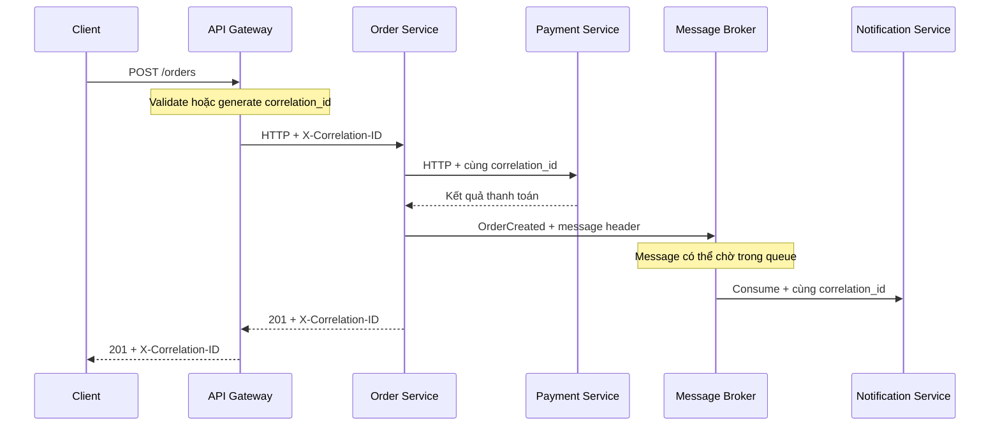

# Correlation ID Pattern

## Mục lục

- [Tổng quan](#tổng-quan)
- [Vấn đề](#vấn-đề)
- [Mô hình các loại ID](#mô-hình-các-loại-id)
  - [Request ID](#request-id)
  - [Correlation ID](#correlation-id)
  - [Trace ID](#trace-id)
- [Giải pháp và quy tắc thiết kế](#giải-pháp-và-quy-tắc-thiết-kế)
  - [Sinh và kiểm tra ID ở edge](#sinh-và-kiểm-tra-id-ở-edge)
  - [Propagation qua HTTP](#propagation-qua-http)
  - [Propagation qua message](#propagation-qua-message)
  - [Logging context](#logging-context)
  - [Trả ID về client](#trả-id-về-client)
- [Use case E-Commerce](#use-case-e-commerce)
  - [Request đặt hàng qua HTTP](#request-đặt-hàng-qua-http)
  - [Sự kiện OrderCreated qua message](#sự-kiện-ordercreated-qua-message)
  - [Tra cứu hỗ trợ khách hàng](#tra-cứu-hỗ-trợ-khách-hàng)
- [Correlation ID và Trace ID](#correlation-id-và-trace-id)
- [Trade-off](#trade-off)
- [Khi nào nên dùng và khi nào chưa cần](#khi-nào-nên-dùng-và-khi-nào-chưa-cần)
  - [Nên dùng](#nên-dùng)
  - [Chưa cần mở rộng](#chưa-cần-mở-rộng)
- [Cardinality và privacy](#cardinality-và-privacy)
  - [Kiểm soát cardinality](#kiểm-soát-cardinality)
  - [Bảo vệ privacy và security](#bảo-vệ-privacy-và-security)
- [Vận hành](#vận-hành)
  - [Contract và naming](#contract-và-naming)
  - [Kiểm tra propagation](#kiểm-tra-propagation)
  - [Theo dõi và quyền truy cập](#theo-dõi-và-quyền-truy-cập)
  - [Checklist](#checklist)
- [Lỗi thường gặp](#lỗi-thường-gặp)
- [Liên kết liên quan](#liên-kết-liên-quan)

## Tổng quan

**Correlation ID** (ID tương quan) là một định danh do ứng dụng dùng để nối các log entry và sự kiện thuộc về cùng một request hoặc một luồng xử lý. ID được tạo hoặc tiếp nhận ở điểm vào, sau đó được giữ nguyên khi request đi qua các service khác.

Pattern này không cần một trace backend. Chỉ cần các service thống nhất cách truyền ID và đưa ID vào structured log là engineer đã có thể tìm các sự kiện liên quan trong Log Aggregation. Khi hệ thống có Distributed Tracing, Correlation ID và `trace_id` nên cùng xuất hiện trong log để hỗ trợ hai cách điều tra khác nhau.

> Tài liệu này tập trung vào Correlation ID như một pattern độc lập: phạm vi của các loại ID, propagation qua HTTP và message, logging context, và các vấn đề vận hành. Phần tổng hợp các pattern observability nằm trong [17 — Observability Patterns](../17-observability-patterns.md).

## Vấn đề

Trong hệ thống Microservice, một request có thể đi qua API Gateway, Order Service, Inventory Service và Payment Service. Mỗi service tạo nhiều log entry. Nếu các entry không có định danh chung, việc lọc theo thời gian hoặc tên service chỉ cho một phỏng đoán.

```text
10:30:45.101  order-service      INFO  creating order ORD-456
10:30:45.102  order-service      INFO  validating payment
10:30:45.103  order-service      INFO  calling inventory-service
10:30:45.104  order-service      INFO  calling payment-service
```

Cùng thời điểm đó có thể có hàng nghìn request khác đang chạy. Timestamp không đủ để chứng minh bốn entry trên thuộc cùng một request.

Async messaging làm bài toán khó hơn. Order Service có thể publish một message, còn Notification Service chỉ consume message sau 30 giây hoặc chạy trên cluster khác. Không có metadata được truyền kèm message, log của producer và consumer không có cầu nối đáng tin cậy.

**Log Aggregation** giải quyết nơi lưu và tìm log. Correlation ID giải quyết khóa liên kết để tìm đúng các log entry của cùng một request hoặc luồng xử lý. Hai phần này bổ trợ nhau, như mô tả trong [Log Aggregation Pattern](./log-aggregation.md).

## Mô hình các loại ID

Các tên `request_id`, `correlation_id` và `trace_id` thường xuất hiện cạnh nhau nhưng không có cùng vai trò. Trước khi chọn header, team cần thống nhất ID nào có phạm vi nào.

### Request ID

**Request ID** thường là định danh của một request tại một boundary cụ thể. Một số hệ thống dùng header `X-Request-ID` làm khóa liên kết xuyên suốt các service; khi đó nó thực hiện vai trò của Correlation ID.

Tên `X-Request-ID` tự nó không quy định ID phải được giữ qua mọi hop. Vì vậy, contract nội bộ cần nói rõ ID này là local request ID hay là correlation key của toàn bộ luồng. Không nên để mỗi team tự suy diễn từ tên header.

### Correlation ID

**Correlation ID** là định danh của một request hoặc một luồng logic được truyền xuyên qua các boundary mà hệ thống đã quy định. Trong tài liệu này:

- Header transport chuẩn minh họa là `X-Correlation-ID`.
- Field trong structured log là `correlation_id`.
- UUID là một format phổ biến; một opaque ID như `req-789` chỉ là ví dụ dễ đọc.
- Một service downstream không tự đổi ID nếu inbound context còn hợp lệ.

`X-Request-ID` cũng có thể được chọn thay cho `X-Correlation-ID`. Điều quan trọng là chỉ chọn một convention cho toàn hệ thống và duy trì cùng semantics giữa HTTP, message và log.

### Trace ID

**Trace ID** là định danh do Distributed Tracing sử dụng để gom các span của một trace. Với W3C Trace Context, trace context thường đi qua HTTP bằng `traceparent`; message broker có thể truyền cùng context qua message metadata.

Trace ID cho phép trace backend dựng quan hệ span và phân tích duration. Nó không tự động bảo đảm mọi log đều có cùng field, cũng không phải lúc nào cũng là mã thuận tiện để bộ phận hỗ trợ trao đổi với khách hàng. Chi tiết mô hình trace, span và W3C Trace Context nằm trong [Distributed Tracing Pattern](./distributed-tracing.md).

## Giải pháp và quy tắc thiết kế

Một triển khai Correlation ID có năm quy tắc liên kết với nhau:

1. **Sinh hoặc xác nhận ở edge**: điểm vào đầu tiên chọn một ID hợp lệ.
2. **Dùng một tên header và một schema**: tất cả team hiểu cùng một contract.
3. **Bind vào logging context**: mọi log entry của request tự động nhận `correlation_id`.
4. **Forward qua từng transport**: HTTP dùng header; message dùng headers, properties hoặc attributes của broker.
5. **Trả lại cho client**: response echo ID để hỗ trợ tra cứu khi cần.



ID được giữ nguyên trong các hop của cùng luồng. Việc giữ ID không có nghĩa là mọi operation có cùng thời lượng hoặc cùng một span; đó là trách nhiệm của tracing.

### Sinh và kiểm tra ID ở edge

Gateway hoặc service đầu tiên nhận request là nơi quyết định ID. Nếu client không gửi ID, hệ thống sinh một ID mới. Nếu client gửi, hệ thống chỉ sử dụng giá trị đó sau khi kiểm tra theo contract.

Các thuộc tính nên được quy định trong contract gồm:

- Format được chấp nhận, chẳng hạn UUID hoặc opaque ID có tập ký tự cho phép.
- Độ dài tối đa.
- Cách xử lý header bị thiếu, rỗng, sai format hoặc chứa newline.
- Có giữ ID do client cung cấp hay luôn thay bằng ID do edge sinh.
- Boundary nào được xem là điểm vào mới khi không có inbound context.

Pseudocode dưới đây minh họa nguyên tắc validate trước khi đưa giá trị vào log:

```text
function correlationIdMiddleware(req, res, next):
    incoming = req.getHeader("X-Correlation-ID")

    if incoming is not null AND isValidCorrelationId(incoming):
        cid = incoming
    else:
        cid = generateUuid()

    loggingContext.set("correlation_id", cid)
    res.setHeader("X-Correlation-ID", cid)

    try:
        next()
    finally:
        loggingContext.clear()
```

`isValidCorrelationId` có thể kiểm tra UUID hoặc format opaque ID đã được phê duyệt. Ví dụ `req-789` trong tài liệu chỉ giúp người đọc nhận ra ID; hệ thống thực tế phải dùng đúng format đã thống nhất.

Downstream service không nên sinh ID mới khi đã nhận được ID hợp lệ. Nếu một message hoặc request nội bộ thật sự là điểm vào mới và không có ID, component đó có thể sinh ID mới nhưng cần ghi nhận đây là một flow mới, thay vì giả vờ nối với flow cũ.

### Propagation qua HTTP

Với HTTP, Correlation ID nằm trong request header. Service nhận request đọc header trước khi thực hiện business logic, bind ID vào logging context, rồi forward nguyên giá trị khi gọi service kế tiếp.

```http
POST /orders HTTP/1.1
Host: api.example.test
X-Correlation-ID: req-789
Content-Type: application/json
```

Một outgoing call trong cùng flow giữ cùng ID:

```http
POST /payments/charge HTTP/1.1
Host: payment-service
X-Correlation-ID: req-789
Content-Type: application/json
```

Response nên echo ID để client hoặc hệ thống hỗ trợ lưu lại:

```http
HTTP/1.1 201 Created
X-Correlation-ID: req-789
Content-Type: application/json
```

Header này là metadata liên kết, không phải authorization credential. Gateway vẫn cần giới hạn các header được forward theo contract nội bộ và không đưa giá trị chưa validate vào log text tự do.

### Propagation qua message

HTTP header không đi cùng message broker một cách tự nhiên. Producer phải ghi Correlation ID vào message headers, properties hoặc attributes; consumer đọc metadata đó và bind lại vào logging context trước khi xử lý message.

Ví dụ metadata của một Kafka message có thể là:

```json
{
  "X-Correlation-ID": "req-789",
  "traceparent": "00-4bf92f3577b34da6a3ce929d0e0e4736-00f067aa0ba902b7-01"
}
```

`X-Correlation-ID` là phần của pattern này. `traceparent` là trace context tùy chọn, được thêm khi hệ thống có Distributed Tracing. Hai metadata có thể cùng đi trong message nhưng không thay thế vai trò của nhau.

Consumer vẫn dùng cùng Correlation ID dù message được xử lý muộn hơn thời điểm publish. Khi consumer publish một message tiếp theo trong cùng logical flow, policy của hệ thống cần quy định có tiếp tục forward ID hay bắt đầu một flow mới. Quyết định này phải nhất quán để query không tạo ra các chuỗi liên kết bất ngờ.

Nếu message không có ID hợp lệ, consumer không thể khẳng định nó thuộc request nào. Có thể sinh một ID cho lần xử lý đó và đánh dấu đây là context được tạo ở consumer; không nên tự đoán ID từ nội dung nghiệp vụ.

### Logging context

**Logging context** là vùng ngữ cảnh gắn với request hoặc task hiện tại. Logging library đọc context này khi tạo mỗi log entry, nhờ vậy developer không phải truyền `correlation_id` thủ công qua từng hàm.

Một structured log entry có thể gồm cả Correlation ID và Trace ID:

```json
{
  "timestamp": "2025-03-15T10:30:47.635Z",
  "level": "ERROR",
  "service": "payment-service",
  "correlation_id": "req-789",
  "trace_id": "4bf92f3577b34da6a3ce929d0e0e4736",
  "message": "GatewayTimeout calling Bank API",
  "order_id": "ORD-456"
}
```

Context phải được gắn trước log đầu tiên của request và được dọn khi request hoặc message handler kết thúc. Cách cài đặt phụ thuộc runtime, chẳng hạn request scope, thread-local hoặc async context. Không nên dùng một biến global dùng chung cho mọi request, vì các request đồng thời có thể ghi đè context của nhau.

Tối thiểu, các log entry phát sinh trong một request cần có `correlation_id`, kể cả log ở nhánh lỗi. Các field nghiệp vụ như `order_id` chỉ thêm khi cần cho điều tra; Correlation ID không thay thế cho các field mô tả sự kiện.

### Trả ID về client

Response header `X-Correlation-ID` tạo cầu nối giữa client và telemetry. Khi request lỗi, UI hoặc API error response có thể hiển thị một mã tham chiếu ngắn để khách hàng đưa vào ticket.

Mã trả về không nên chứa PII hoặc thông tin bí mật. Nó chỉ là khóa tra cứu; quyền xem log vẫn phải được kiểm soát ở công cụ hỗ trợ và Log Store. Không dùng Correlation ID làm token xác thực hoặc căn cứ duy nhất để cấp quyền.

## Use case E-Commerce

### Request đặt hàng qua HTTP

Giả sử khách hàng gọi `POST /orders`. API Gateway nhận request, tạo `req-789` vì request chưa có ID hợp lệ, rồi forward ID qua các service:

```text
Client
  └─ POST /orders
     └─ API Gateway       correlation_id=req-789
        └─ Order Service  correlation_id=req-789
           ├─ Inventory Service  correlation_id=req-789
           └─ Payment Service    correlation_id=req-789
```

Các log entry có thể tạo thành một dòng thời gian có thể query:

```text
10:30:45.101  api-gateway        INFO   request received POST /orders       cid=req-789
10:30:45.118  order-service      INFO   creating order ORD-456             cid=req-789
10:30:45.130  inventory-service  INFO   reserved 2 items                   cid=req-789
10:30:47.635  payment-service    ERROR  GatewayTimeout calling Bank API     cid=req-789
10:30:47.640  order-service      INFO   order rolled back (compensated)     cid=req-789
```

Query theo `correlation_id=req-789` cho thấy request đã đi qua những service nào. Nó chưa cho biết mỗi bước mất bao lâu; muốn phân tích latency, engineer dùng `trace_id` và trace backend nếu tracing đã được bật.

### Sự kiện OrderCreated qua message

Sau khi ghi nhận order, Order Service publish sự kiện `OrderCreated` cho Notification Service. Producer đưa `req-789` vào message header. Notification Service extract header khi consume và ghi log với cùng ID:

```text
Order Service
  └─ publish OrderCreated
     └─ message header: X-Correlation-ID=req-789
        └─ Message Broker
           └─ Notification Service
              └─ consume OrderCreated, correlation_id=req-789
```

Nếu message nằm trong queue 30 giây, khoảng cách timestamp giữa hai service không làm ID thay đổi. Engineer vẫn có thể query một ID để thấy cả producer và consumer, miễn là producer, broker integration và consumer đều giữ metadata.

### Tra cứu hỗ trợ khách hàng

Màn hình lỗi có thể hiển thị mã tham chiếu `req-789`. Khách hàng đưa mã này vào ticket. On-call query:

```text
correlation_id: req-789
```

Kết quả cho thấy lỗi ở Payment Service và hành động rollback ở Order Service. Bộ phận hỗ trợ không cần tự SSH vào từng node; họ chỉ cần chuyển đúng mã cho người có quyền truy cập hệ thống log.

Correlation ID cũng có thể hỗ trợ ước lượng phạm vi ảnh hưởng. Khi đếm request lỗi, nên đếm **distinct `correlation_id`** trong time range thay vì đếm tổng số log entry, vì một request có thể tạo nhiều entry lỗi hoặc retry.

## Correlation ID và Trace ID

Hai ID có thể cùng xuất hiện trong một log entry nhưng phục vụ hai câu hỏi khác nhau:

| Tiêu chí | Correlation ID | Trace ID |
|---|---|---|
| Câu hỏi chính | Các log hoặc sự kiện nào thuộc cùng một request/flow? | Request đã đi qua span nào và mỗi bước mất bao lâu? |
| Nguồn tạo | Edge hoặc component nhận flow đầu tiên | Tracing SDK hoặc hệ thống tracing |
| Transport thường dùng | Header convention như `X-Correlation-ID`; message headers | W3C `traceparent`; message metadata tương ứng |
| Người dùng chính | Developer, on-call, bộ phận hỗ trợ | Trace backend và engineer phân tích hiệu năng |
| Dữ liệu hiển thị | Một khóa tra cứu có thể trả cho client | Định danh 128-bit dùng để gom spans |
| Có thay thế nhau không? | Không tự dựng waterfall | Không tự làm mọi log có correlation key |

Khuyến nghị thực tế là ghi cả hai field khi hệ thống có tracing:

```json
{
  "correlation_id": "req-789",
  "trace_id": "4bf92f3577b34da6a3ce929d0e0e4736",
  "service": "payment-service",
  "level": "ERROR",
  "message": "GatewayTimeout calling Bank API"
}
```

Engineer có thể bắt đầu từ mã trong ticket để tìm log theo `correlation_id`, sau đó dùng `trace_id` trong log để mở waterfall. Một số tổ chức dùng `trace_id` làm correlation key khi tracing đã đầy đủ. Cách này hợp lệ nếu được áp dụng nhất quán, được ghi vào log ở mọi hop cần thiết và có cơ chế trả mã về client.

## Trade-off

| Lợi ích | Cái giá phải trả |
|---|---|
| Nối log của nhiều service bằng một query đơn giản | Mọi service và transport phải tuân thủ cùng contract |
| Overhead dữ liệu nhỏ, thường chỉ thêm một chuỗi ID vào context và log | Vẫn có chi phí storage và index khi log volume lớn |
| Có ích ngay cả khi chưa triển khai trace backend | Không cho biết duration, parent–child hay điểm nghẽn |
| Hoạt động cho cả HTTP đồng bộ và message bất đồng bộ | Một hop quên forward sẽ tạo vùng mù trong dòng điều tra |
| Là cầu nối giữa ticket hỗ trợ và telemetry | ID do client gửi phải được validate; tên header đổi về sau gây khó đồng bộ |

Correlation ID thường là một middleware và một logging context nhỏ, nên chi phí triển khai thấp. Giá trị của nó phụ thuộc vào tính nhất quán hơn là vào công cụ lưu trữ cụ thể. Pattern này không thay thế structured logging, Log Aggregation hoặc Distributed Tracing.

## Khi nào nên dùng và khi nào chưa cần

### Nên dùng

- Ngay từ service hoặc boundary đầu tiên có request cần điều tra.
- Khi một request đi qua nhiều service, replica hoặc cluster.
- Khi bộ phận hỗ trợ cần đưa mã tham chiếu từ client vào ticket.
- Khi flow có cả HTTP và async messaging.
- Khi team muốn nối Log Aggregation với Distributed Tracing mà không bắt người dùng biết chi tiết tracing.

Đây thường là pattern nên có sớm. Bắt đầu bằng header contract, middleware ở edge và logging context ở từng service; sau đó kiểm tra propagation ở các boundary quan trọng.

### Chưa cần mở rộng

“Không cần” ở đây nghĩa là chưa cần **một Correlation ID riêng**, không phải bỏ định danh khỏi log:

- Monolith hoặc hệ thống chỉ có một service có thể dùng local request ID trong structured log nếu chưa có nhu cầu liên service.
- Hệ thống đã có Distributed Tracing đầy đủ, `trace_id` đã được ghi vào mọi log cần thiết và đã có cơ chế trả mã về client có thể dùng `trace_id` như correlation key.
- Batch job hoặc worker không nhận request upstream nên tạo execution ID ở điểm bắt đầu; không nên gán một Correlation ID giả chỉ để làm đẹp log.
- Legacy service không thể forward header: vẫn có thể log ID ở các phần sửa được, nhưng phải đánh dấu rõ nơi propagation bị đứt.

Trong phần lớn hệ thống Microservice, việc trì hoãn Correlation ID chỉ để chờ Distributed Tracing đầy đủ khiến giai đoạn debug ban đầu khó hơn. Nếu dùng một ID duy nhất thay cho hai ID, cần ghi lại quyết định đó thành contract vận hành.

## Cardinality và privacy

### Kiểm soát cardinality

**Cardinality** là số lượng giá trị duy nhất của một field. Correlation ID thường có cardinality cao vì mỗi request có thể có một giá trị khác nhau.

High-cardinality ID phù hợp để tìm một log request cụ thể, nhưng không phù hợp làm metric label hoặc Loki label. Nếu dùng ID làm label, số time series hoặc log stream có thể tăng theo số request và làm hệ thống lưu trữ khó vận hành.

```text
# Không nên: correlation_id tạo một series mới cho từng request
http_requests_total{service="order", correlation_id="req-789"}

# Nên: metric dùng chiều có tập giá trị hữu hạn
http_requests_total{service="order", status="500"}

# Correlation ID nằm trong structured log để query khi cần
{"service":"order", "correlation_id":"req-789", "level":"ERROR"}
```

Ở Log Store, có thể cấu hình `correlation_id` như một field phục vụ tìm kiếm nếu backend cần điều đó. Cần theo dõi kích thước index, retention và quyền query thay vì đưa ID vào mọi hệ thống telemetry một cách mặc định.

### Bảo vệ privacy và security

Correlation ID nên là opaque ID, không mã hóa email, số điện thoại, địa chỉ, access token hoặc dữ liệu nghiệp vụ nhạy cảm. Header có thể được trả về client và xuất hiện trong ticket, nên không được coi là secret.

Các biện pháp cần có:

| Lớp | Thực hành |
|---|---|
| **Ở edge** | Validate format, giới hạn độ dài, loại bỏ giá trị có newline hoặc ký tự không được phép |
| **Ở application** | Whitelist field trong log; không đưa request/response body, token hoặc credential vào log chỉ vì có Correlation ID |
| **Ở pipeline** | Scrub hoặc redact dữ liệu nhạy cảm nếu application ghi nhầm |
| **Ở Log Store** | RBAC, audit log truy cập, mã hóa và retention phù hợp |
| **Ở client/support** | Dùng ID làm mã tham chiếu, không dùng làm credential hoặc bypass authorization |

Structured JSON giúp escape ký tự trong giá trị, nhưng không thay thế validation. Validation vẫn cần xảy ra trước khi giá trị được bind vào context hoặc xuất hiện trong log.

## Vận hành

### Contract và naming

Một contract đơn giản giúp các team không tạo nhiều biến thể khó query:

| Vị trí | Convention minh họa | Quy tắc |
|---|---|---|
| HTTP request | `X-Correlation-ID` | Edge tạo hoặc xác nhận; downstream forward |
| HTTP response | `X-Correlation-ID` | Echo ID để client lưu mã tham chiếu |
| Message metadata | `X-Correlation-ID` | Producer inject; consumer extract |
| Structured log | `correlation_id` | Tự động thêm vào mọi entry trong flow |
| Trace bridge | `trace_id` | Ghi cùng log khi hệ thống có tracing |

Tên `X-Request-ID` cũng có thể được chọn, nhưng không nên để service A dùng `X-Correlation-ID` còn service B chờ `X-Request-ID`. Nếu cần đổi tên, nên hỗ trợ migration có thời hạn và xác định rõ header canonical.

Contract cũng cần ghi rõ:

- Ai sở hữu việc sinh ID và validation ở từng ingress.
- ID có được giữ từ client hay luôn được thay tại trust boundary.
- Message nào tiếp tục flow cũ và message nào bắt đầu flow mới.
- Format log và cách support query theo ID.
- Cách xử lý khi ID bị thiếu hoặc invalid.

### Kiểm tra propagation

Kiểm tra pattern ở các boundary thay vì chỉ kiểm tra middleware của một service:

1. Gửi request có ID hợp lệ qua Gateway và xác nhận ID không đổi ở từng HTTP hop.
2. Gửi request không có hoặc có ID invalid và xác nhận edge sinh ID mới theo contract.
3. Cho producer publish message, rồi xác nhận consumer đọc đúng message metadata và bind ID trước log đầu tiên.
4. Kiểm tra nhánh timeout, exception, retry và rollback vẫn có `correlation_id`.
5. Gửi concurrent requests và xác nhận log của request này không nhận context của request khác.
6. Dùng một mã thật để diễn tập query trong Log Store từ đầu tới cuối.

Khi thay đổi HTTP client, gateway, message library hoặc service mesh, chạy lại các kiểm tra propagation. Một trace hoặc một log mẫu nhìn có vẻ đúng chưa chứng minh mọi boundary đều được cấu hình đúng.

### Theo dõi và quyền truy cập

Nên theo dõi sức khỏe của chính pattern bằng các tín hiệu đơn giản:

- Tỷ lệ request hoặc log entry thiếu `correlation_id`.
- Tỷ lệ header invalid bị thay bằng ID mới.
- Số flow bị đứt tại từng boundary HTTP hoặc message.
- Khả năng tìm được một ID tổng hợp trong thời gian điều tra.
- Tỷ lệ log có cả `correlation_id` và `trace_id` ở service đã bật tracing.

Mã tham chiếu chỉ hữu ích khi log còn trong retention và người điều tra có quyền query. Vì vậy, policy cần quy định thời gian lưu log, quyền truy cập theo team và quy trình xử lý ticket chứa Correlation ID. Không mở toàn bộ Log Store chỉ vì muốn hỗ trợ tra cứu một mã.

### Checklist

- [ ] Có một header canonical và một field log canonical.
- [ ] Edge sinh hoặc validate ID trước business logic.
- [ ] Downstream giữ nguyên ID hợp lệ, không tự sinh lại ở mỗi hop.
- [ ] HTTP client forward header.
- [ ] Message producer/consumer forward và bind metadata.
- [ ] Logging context tự động thêm ID vào log thành công và log lỗi.
- [ ] Context được clear khi request hoặc message handler kết thúc.
- [ ] Response trả `X-Correlation-ID` để client/support lưu mã tham chiếu.
- [ ] Log có `trace_id` khi hệ thống đã bật Distributed Tracing.
- [ ] ID không xuất hiện trong metric label, không chứa PII và không được dùng như secret.
- [ ] Có test cho missing/invalid ID, concurrent request, HTTP hop và message hop.
- [ ] Có RBAC, audit và retention phù hợp cho nơi lưu log.

## Lỗi thường gặp

| Lỗi | Hậu quả | Cách tránh |
|---|---|---|
| Service trung gian sinh ID mới dù inbound ID hợp lệ | Dòng điều tra bị đứt giữa các service | Chỉ sinh ở edge hoặc tại entrypoint thật sự không có context |
| Chọn nhiều tên header (`X-Request-ID`, `X-Correlation-Id`...) | Query một tên không thấy log của service dùng tên khác | Chọn một canonical header và ghi thành internal contract |
| Không forward qua message broker | Log producer và consumer không nối được | Đưa ID vào message headers/properties/attributes và test consumer |
| Chỉ thêm ID vào một vài log entry | Engineer vẫn phải ghép log thủ công | Bind ID vào logging context ngay sau khi extract |
| Dùng biến global cho logging context | Request đồng thời có thể ghi nhầm ID của nhau | Dùng request-scoped hoặc async-safe context và clear sau handler |
| Tin nguyên giá trị client gửi mà không validate | Ký tự lạ hoặc newline gây log injection và nhiễu query | Validate format, giới hạn độ dài và dùng structured logging |
| Không echo ID về response | Client/support không có mã để đưa vào ticket | Trả `X-Correlation-ID` ở success và error response phù hợp |
| Coi Correlation ID là Trace ID | Có khóa tìm log nhưng không có waterfall, hoặc ngược lại | Dùng đúng mục đích; ghi cả hai field nếu có tracing |
| Dùng ID làm metric/Loki label | Cardinality tăng theo request, làm query và storage khó vận hành | Giữ ID trong log field; label/metric chỉ dùng chiều hữu hạn |
| Ghi PII, token hoặc credential vào log cùng ID | Mã tham chiếu nối tới dữ liệu nhạy cảm trong nhiều hệ thống | Whitelist field, redact ở application/pipeline và giới hạn quyền truy cập |
| Không đánh dấu legacy boundary bị đứt | Tin rằng correlation là end-to-end dù thực tế có vùng mù | Ghi nhận boundary, thêm adapter hoặc nêu rõ giới hạn điều tra |

## Liên kết liên quan

- [Log Aggregation Pattern](./log-aggregation.md) — structured logging và tìm log theo `correlation_id`.
- [Distributed Tracing Pattern](./distributed-tracing.md) — `trace_id`, `traceparent`, span và phân tích latency.
- [17 — Observability Patterns](../17-observability-patterns.md) — tài liệu tổng hợp nguồn của pattern.
- [11 — Observability & Evolvability](../11-observability-evolvability.md) — Logging, Metrics, Tracing và OpenTelemetry.
- [06 — Inter-Service Communication](../06-inter-service-communication.md) — HTTP, gRPC và message boundary.
- [15 — Security](../15-security.md) — kiểm soát truy cập và bảo vệ dữ liệu observability.
- [16 — Configuration & Secrets Management](../16-configuration-secrets-management.md) — tránh để secret rơi vào telemetry.
