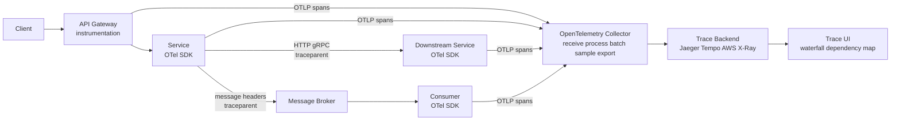
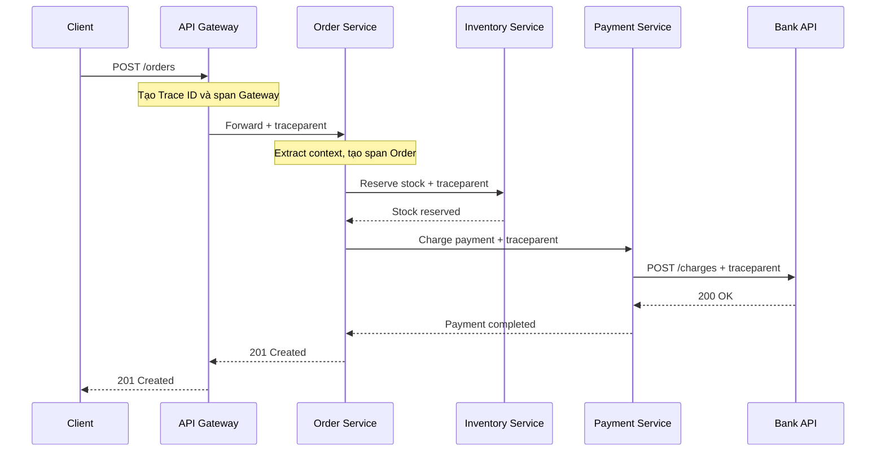

# Distributed Tracing Pattern

## Mục lục

- [Tổng quan](#tổng-quan)
- [Vấn đề](#vấn-đề)
- [Mô hình trace và span](#mô-hình-trace-và-span)
  - [Trace](#trace)
  - [Span](#span)
  - [Trace context](#trace-context)
  - [Context propagation qua các hop](#context-propagation-qua-các-hop)
- [Kiến trúc và pipeline tracing](#kiến-trúc-và-pipeline-tracing)
  - [Các thành phần](#các-thành-phần)
  - [Luồng dữ liệu](#luồng-dữ-liệu)
- [Instrumentation và dữ liệu trong span](#instrumentation-và-dữ-liệu-trong-span)
  - [Auto instrumentation và manual instrumentation](#auto-instrumentation-và-manual-instrumentation)
  - [Attributes events và links](#attributes-events-và-links)
- [Sampling](#sampling)
  - [Head based sampling](#head-based-sampling)
  - [Tail based sampling](#tail-based-sampling)
  - [Chính sách sampling thực tế](#chính-sách-sampling-thực-tế)
- [Use case E-Commerce](#use-case-e-commerce)
  - [Request đặt hàng](#request-đặt-hàng)
  - [Request có async messaging](#request-có-async-messaging)
  - [Cách đọc waterfall](#cách-đọc-waterfall)
- [Trade off](#trade-off)
- [Khi nào nên dùng và khi nào chưa cần](#khi-nào-nên-dùng-và-khi-nào-chưa-cần)
  - [Nên dùng khi](#nên-dùng-khi)
  - [Chưa cần mở rộng khi](#chưa-cần-mở-rộng-khi)
- [Cardinality và dữ liệu nhạy cảm](#cardinality-và-dữ-liệu-nhạy-cảm)
  - [Kiểm soát cardinality](#kiểm-soát-cardinality)
  - [Bảo vệ dữ liệu nhạy cảm](#bảo-vệ-dữ-liệu-nhạy-cảm)
- [Vận hành](#vận-hành)
  - [Kiểm tra context và độ đầy đủ của trace](#kiểm-tra-context-và-độ-đầy-đủ-của-trace)
  - [Theo dõi collector và trace backend](#theo-dõi-collector-và-trace-backend)
  - [Retention và chi phí](#retention-và-chi-phí)
  - [Checklist vận hành](#checklist-vận-hành)
- [Lỗi thường gặp](#lỗi-thường-gặp)
- [Liên kết liên quan](#liên-kết-liên-quan)

---

## Tổng quan

**Distributed Tracing** (truy vết phân tán) ghi lại hành trình của một request hoặc một luồng xử lý khi nó đi qua nhiều service. Hành trình này được biểu diễn bằng một **trace** gồm nhiều **span**. Mỗi span đo một operation cụ thể, chẳng hạn HTTP call, database query hoặc một lần publish message.

Pattern này trả lời ba câu hỏi mà metrics của từng service thường không trả lời được:

- Request đã đi qua những service và dependency nào?
- Mỗi bước bắt đầu, kết thúc và mất bao lâu?
- Bước nào đang tạo ra latency hoặc lỗi?

Distributed Tracing bổ sung cho Logs và Metrics, không thay thế chúng. Trace cho biết **ở đâu** và **bao lâu**; log thường cho biết **chuyện gì đã xảy ra**; metrics cho thấy **xu hướng và phạm vi ảnh hưởng**.

> Tài liệu này tập trung vào Distributed Tracing như một pattern: mô hình dữ liệu, context propagation, pipeline, sampling và vận hành. Chi tiết theo từng sản phẩm nằm trong [11 — Observability & Evolvability](../11-observability-evolvability.md).

## Vấn đề

Trong hệ thống Microservice, một request có thể đi qua API Gateway, Order Service, Inventory Service, Payment Service và một external dependency. Metrics của từng service có thể vẫn ở mức bình thường, trong khi tổng thời gian trả response đã tăng mạnh.

Ví dụ, dashboard chỉ cho biết `POST /orders` có p99 tăng từ khoảng 90 ms lên 245 ms. Dashboard chưa cho biết thời gian đó nằm ở database, Payment Service hay Bank API. Với asynchronous messaging, phần xử lý còn có thể tiếp tục sau khi request HTTP ban đầu đã kết thúc, nên việc chỉ nhìn timestamp của từng service càng khó hơn.

Nếu không có quan hệ giữa các bước, engineer phải ghép các log rời rạc bằng thời gian, service và các giả định. Khi traffic đồng thời cao, cách ghép này dễ nhầm request này với request khác. Distributed Tracing tạo ra một định danh và cấu trúc parent–child để tái dựng hành trình đó.

## Mô hình trace và span

### Trace

**Trace** là tập hợp các span cùng mô tả một hành trình xử lý và cùng mang một **Trace ID**. Trace ID giữ nguyên trong suốt hành trình để trace backend có thể gom các span lại.

Một trace có thể có dạng cây đơn giản:

```text
Trace ID: 4bf92f3577b34da6a3ce929d0e0e4736
└─ API Gateway: POST /orders
   └─ Order Service: createOrder
      ├─ Inventory Service: reserve
      └─ Payment Service: charge
         └─ Bank API: POST /charges
```

Các span con giúp thể hiện quan hệ gọi nhau. Trong async messaging, trace có thể có khoảng trống giữa lúc producer publish message và consumer xử lý message. Nếu một consumer xử lý nhiều message cùng lúc, **Span Links** có thể phù hợp hơn việc ép tất cả message vào một parent duy nhất.

### Span

**Span** là một đoạn đo lường có thời điểm bắt đầu và kết thúc. Span thường đại diện cho một operation có ý nghĩa với việc điều tra, như:

- HTTP hoặc gRPC server request và client call.
- Database query.
- Publish hoặc consume message.
- Một business operation quan trọng như `PaymentService.charge`.

Một span thường chứa `trace_id`, `span_id`, `parent_span_id`, tên operation, `service.name`, duration, status và các metadata liên quan. `Span ID` chỉ định span hiện tại; `Parent Span ID` giúp backend dựng quan hệ với span cha.

Trace ID và Span ID không phải là dữ liệu nghiệp vụ. Chúng là metadata để nối và phân tích telemetry. Việc thêm `order.id` hoặc business attribute khác chỉ nên thực hiện khi nó thực sự giúp điều tra và phù hợp với chính sách dữ liệu.

### Trace context

**Trace context** là ngữ cảnh cần được truyền từ operation hiện tại sang operation kế tiếp. Theo [W3C Trace Context](https://www.w3.org/TR/trace-context/), HTTP thường truyền ngữ cảnh bằng `traceparent` và có thể kèm `tracestate`:

```text
traceparent: 00-4bf92f3577b34da6a3ce929d0e0e4736-00f067aa0ba902b7-01
tracestate: vendor1=value1
```

Cấu trúc khái quát của `traceparent` là:

```text
{version}-{trace-id}-{parent-span-id}-{trace-flags}
```

- `version`: phiên bản của format.
- `trace-id`: định danh của toàn bộ trace; theo W3C là một giá trị 128-bit.
- `parent-span-id`: Span ID của operation gửi request.
- `trace-flags`: cờ điều khiển, trong đó `01` thường biểu thị context được chọn để sample.
- `tracestate`: metadata tùy chọn dành cho vendor hoặc hệ thống tracing.

Khi Service A gọi Service B, Service B giữ nguyên Trace ID nhưng tạo Span ID mới cho operation của mình. Khi Service B gọi Service C, context outgoing sẽ mang Span ID của B làm parent của operation kế tiếp. Application không nên tự nối chuỗi ID bằng quy ước riêng nếu SDK đã hỗ trợ W3C Trace Context.

### Context propagation qua các hop

**Context Propagation** (lan truyền ngữ cảnh) là việc extract context ở đầu vào và inject context ở đầu ra. Một hop đúng thường có chuỗi bước sau:

1. Service nhận request hoặc message và extract context từ transport.
2. SDK tạo server, consumer hoặc process span mới dưới context vừa extract.
3. Khi gọi service khác hoặc publish message, SDK inject context hiện tại vào transport kế tiếp.
4. Service hoặc consumer kế tiếp extract context và tiếp tục tạo span.
5. Span được đóng với duration, status và thông tin lỗi nếu có.

Context phải đi qua đúng loại metadata của từng transport:

| Transport | Vị trí truyền context | Lưu ý |
|---|---|---|
| **HTTP / REST** | HTTP headers như `traceparent`, `tracestate` | Mỗi outgoing call tạo một span client; service nhận tạo span server |
| **gRPC** | gRPC metadata | Cần instrumentation ở cả client và server |
| **Kafka** | Message headers | Consumer có thể xử lý sau một khoảng thời gian chờ trong queue |
| **RabbitMQ** | Message properties hoặc headers | Producer và consumer phải dùng cùng chuẩn propagation |
| **SQS / SNS** | Message attributes | Cần bảo đảm context không bị loại bỏ khi message được chuyển tiếp |

Với async messaging, thời gian message nằm trong queue không phải là thời gian CPU của consumer. Waterfall cần thể hiện khoảng trống này để engineer phân biệt **queue delay** với **processing time**. Consumer xử lý batch từ nhiều trace có thể dùng Span Links để liên kết nhiều context.

## Kiến trúc và pipeline tracing

Pipeline tracing có hai luồng khác nhau:

- **Request path**: trace context đi cùng HTTP, gRPC hoặc message để nối các span.
- **Telemetry path**: các span được SDK export tới Collector, sau đó tới trace backend để lưu và truy vấn.



Context propagation không thay thế việc export span. Một service có thể truyền `traceparent` thành công nhưng vẫn mất trace nếu SDK, Collector hoặc backend không nhận được span. Vì vậy cần kiểm tra cả request path và telemetry path.

### Các thành phần

| Thành phần | Vai trò | Ví dụ |
|---|---|---|
| **Instrumentation** | Tạo span tại inbound/outbound request, database, message và business operation | OpenTelemetry auto-instrumentation hoặc manual span |
| **SDK và exporter** | Quản lý context, tạo ID, đo thời gian và gửi span ra ngoài | OpenTelemetry SDK, OTLP exporter |
| **OpenTelemetry Collector** | Nhận, batch, xử lý, sampling khi cần và chuyển tiếp span | OTel Collector |
| **Trace backend** | Lưu span, dựng cây trace và phục vụ truy vấn | Jaeger, Zipkin, Grafana Tempo, AWS X-Ray |
| **Trace UI** | Hiển thị waterfall, search trace và dependency map | Jaeger UI, Grafana |

Instrumentation tạo span trong application. Collector không tự biết nghiệp vụ nếu application không tạo ra span và attributes tương ứng. Trace backend cũng không thể khôi phục một hop mà service đã không forward context hoặc không export span.

### Luồng dữ liệu

1. Request vào Gateway. SDK tiếp tục context có sẵn hoặc tạo Trace ID và span đầu tiên nếu request chưa có context hợp lệ.
2. Mỗi service tạo span cho operation của mình. Khi gọi ra ngoài, SDK inject context vào header hoặc message metadata.
3. SDK export các span tới OTel Collector, thường qua OTLP trong kiến trúc minh họa.
4. Collector nhận span, áp dụng processor như batch hoặc sampling theo cấu hình, rồi export sang trace backend.
5. Backend ghép các span theo Trace ID và quan hệ parent–child hoặc links.
6. Engineer mở Trace UI để xem duration, status, attributes và dependency giữa các service.

Các bước trên mô tả pipeline của tracing, không phải pipeline Observability tổng thể. Logs và Metrics có thể có pipeline riêng nhưng nên giữ `trace_id` để liên kết khi điều tra.

## Instrumentation và dữ liệu trong span

### Auto instrumentation và manual instrumentation

**Auto instrumentation** (trang bị đo lường tự động) dùng integration của SDK để tạo span cho các thư viện phổ biến như HTTP client/server, gRPC hoặc database driver. Cách này giúp phủ các boundary kỹ thuật mà không phải chèn code ở mọi lời gọi.

**Manual instrumentation** (trang bị đo lường thủ công) cần cho business operation hoặc bước mà auto instrumentation không hiểu, chẳng hạn `reserveInventory`, `chargePayment` hoặc `validateOrder`. Manual span nên biểu diễn một operation có thể đọc được trong waterfall, không phải mọi hàm nội bộ nhỏ.

Một service E-Commerce có thể bắt đầu như sau:

| Điểm đo lường | Loại span phù hợp | Dữ liệu nên có |
|---|---|---|
| Gateway nhận `POST /orders` | Server span | Route, status, duration |
| Order Service gọi Payment Service | Client span | `peer.service`, operation, status |
| Payment Service gọi Bank API | Client span | Dependency, timeout hoặc retry event |
| Order Service ghi database | Database client span | Database system, operation đã được redaction |
| Order Service publish `OrderCreated` | Producer span | Messaging system, destination |
| Notification Service consume message | Consumer hoặc process span | Messaging system, destination, queue delay nếu backend hỗ trợ |

Sau khi bật auto instrumentation, vẫn cần kiểm tra propagation ở từng transport. Một thư viện có span HTTP nhưng không inject context vào client hoặc message thì trace vẫn có thể bị đứt.

### Attributes events và links

Các field dưới đây giúp trace có giá trị khi đọc. Tên field cụ thể cần thống nhất theo SDK và semantic conventions của nền tảng đang dùng:

| Loại dữ liệu | Mục đích | Ví dụ |
|---|---|---|
| **Attributes** | Mô tả operation và dependency | `http.method`, `http.status_code`, `peer.service`, `db.system`, `messaging.destination` |
| **Events** | Ghi một thời điểm đáng chú ý trong vòng đời span | `payment.retry`, `order.validated` |
| **Links** | Liên kết span với context khác khi không có một parent duy nhất | Consumer xử lý batch nhiều message |
| **Status** | Cho biết kết quả của operation | `OK`, `ERROR` hoặc trạng thái tương đương |

Một span minh họa có thể có dạng:

```json
{
  "trace_id": "4bf92f3577b34da6a3ce929d0e0e4736",
  "span_id": "a1b2c3d4e5f6a7b8",
  "parent_span_id": "00f067aa0ba902b7",
  "operation_name": "POST /api/orders",
  "service_name": "order-service",
  "start_time": "2025-03-15T10:30:45.050Z",
  "end_time": "2025-03-15T10:30:45.270Z",
  "duration_ms": 220,
  "status": "OK",
  "kind": "SERVER",
  "attributes": {
    "http.method": "POST",
    "http.status_code": 201,
    "peer.service": "payment-service",
    "order.id": "ORD-456"
  },
  "events": [
    {
      "name": "payment.retry",
      "attributes": { "retry.attempt": 2, "error": "timeout" }
    }
  ]
}
```

Phần lớn ID, timestamp và metadata kỹ thuật có thể do SDK hoặc auto instrumentation thu thập. Developer chủ yếu bổ sung business attributes và events cần thiết. Attributes không nên biến thành nơi sao chép toàn bộ request hoặc response body.

## Sampling

Tracing mọi request có thể tạo ra lượng span lớn, làm tăng bandwidth, storage và công sức truy vấn. **Sampling** (lấy mẫu) quyết định trace nào được giữ lại ở backend. Sampling phải được xem cùng volume, yêu cầu điều tra và budget của hệ thống.

### Head based sampling

**Head based sampling** quyết định ở đầu trace, thường khi request đầu tiên tới Gateway hoặc service đầu tiên. Quyết định được truyền qua trace context để các hop dùng cùng cờ sampling.

| Ưu điểm | Hạn chế |
|---|---|
| Đơn giản và giảm lượng telemetry ngay từ nguồn | Chưa biết kết quả cuối của request nên có thể bỏ qua trace sau đó mới phát hiện lỗi hoặc latency cao |
| Phù hợp để bắt đầu với policy dễ hiểu | Tỷ lệ sample cố định có thể không bao phủ đều các loại request quan trọng |

Head sampling phù hợp khi cần kiểm soát volume đơn giản. Ở traffic rất cao, không nên bật 100% chỉ vì muốn đầy đủ dữ liệu mà chưa tính capacity của Collector và backend.

### Tail based sampling

**Tail based sampling** trì hoãn quyết định cho tới khi Collector đã nhận đủ phần cần thiết của trace. Collector có thể giữ lại trace sau khi đánh giá status, duration hoặc thuộc tính của toàn bộ trace.

| Ưu điểm | Hạn chế |
|---|---|
| Có thể ưu tiên trace lỗi hoặc trace chậm được phát hiện ở cuối hành trình | Collector cần state để chờ và ghép span; yêu cầu vận hành phức tạp hơn |
| Có thể bỏ bớt trace bình thường sau khi xem kết quả | Collector cần đủ resource và cấu hình phù hợp với thời gian hoàn thành của trace |

Tail sampling không làm cho mọi trace tự động được giữ lại. Nó chỉ cho phép policy dựa trên kết quả cuối thay vì quyết định ngay ở đầu request.

### Chính sách sampling thực tế

Một policy minh họa khi traffic tăng là giữ trace có `ERROR`, giữ trace vượt ngưỡng latency, và lấy một tỷ lệ nhỏ trace bình thường. Tỷ lệ và ngưỡng phải được điều chỉnh theo volume, SLO, khả năng lưu trữ và nhu cầu điều tra; không có một con số đúng cho mọi hệ thống.

Có thể bắt đầu bằng head sampling vì cách triển khai đơn giản. Khi cần ưu tiên trace lỗi hoặc chậm nhưng chỉ biết được kết quả sau nhiều hop, tail sampling ở Collector phù hợp hơn. Dù chọn cách nào, cần giám sát tỷ lệ sample thực tế và xác nhận rằng trace lỗi vẫn xuất hiện trong backend.

## Use case E-Commerce

### Request đặt hàng

Giả sử người dùng gọi `POST /orders`. Gateway tạo trace nếu request chưa có `traceparent`, sau đó context được truyền qua Order Service, Inventory Service và Payment Service:



Waterfall minh họa của cùng request:

```text
Trace ID: 4bf92f3577b34da6a3ce929d0e0e4736    Tổng: 245ms
│
├─ 00:00.000  POST /api/v1/orders                  [API Gateway]     8ms
├─ 00:00.008  OrderService.create                  [Order Service] 220ms
│   ├─ 00:00.010  InventoryService.reserve         [Inventory Svc]  18ms
│   ├─ 00:00.030  PaymentService.charge            [Payment Svc]   180ms
│   │   └─ 00:00.035  POST /v1/charges             [Bank API]      165ms
│   └─ 00:00.214  Saga: persist order              [Order Service]   6ms
└─ 00:00.245  201 → client
```

Các duration lồng nhau không nên được cộng máy móc: span `OrderService.create` đã bao gồm thời gian của các span con. Trong ví dụ, Bank API là nơi cần kiểm tra trước vì span con này chiếm phần lớn thời gian của Payment Service. Log có cùng `trace_id` có thể bổ sung chi tiết như số lần retry hoặc lỗi timeout.

### Request có async messaging

Sau khi tạo order, Order Service có thể publish `OrderCreated` lên Kafka để Notification Service xử lý. Producer inject trace context vào message header; consumer extract context khi đọc message:

```text
Order Service
└─ Span: publish OrderCreated
   └─ Kafka header: traceparent = 00-{trace-id}-{producer-span-id}-01

             Message chờ trong queue
             ───── khoảng trống thời gian ─────

Notification Service
└─ Span: consume OrderCreated
   └─ Span: queue hoặc process message
```

Khoảng trống giữa hai span là queue delay, không phải thời gian Notification Service chạy. Nếu consumer xử lý một batch chứa nhiều message, mỗi message có thể đến từ một trace khác nhau; dùng Span Links để liên kết các context thay vì chọn một message làm parent duy nhất.

Context được nối đúng giúp trace cho thấy cả phần synchronous và asynchronous. Tuy nhiên, trace backend phải hỗ trợ cách backend đó biểu diễn gap hoặc links; UI có thể hiển thị chúng khác nhau.

### Cách đọc waterfall

Khi điều tra một request chậm, đọc từ span gốc xuống các span con:

1. Xác định tổng duration và status của root span.
2. Tìm child span chiếm thời gian lớn nhất hoặc có status lỗi.
3. Mở tiếp các span con của dependency đó để phân biệt thời gian chờ mạng, retry, database hoặc queue.
4. Dùng `trace_id` để chuyển sang log tương ứng nếu cần message hoặc stack trace chi tiết.
5. Đối chiếu với metrics để biết trace này là cá biệt hay đại diện cho xu hướng rộng hơn.

Trace cũng có thể cung cấp dependency map theo các service đã được instrument. Đây là dữ liệu hỗ trợ hiểu quan hệ gọi nhau; nó không thay thế tài liệu kiến trúc hoặc hợp đồng API.

## Trade off

| Lợi ích | Cái giá phải trả |
|---|---|
| Có một góc nhìn end-to-end cho request qua nhiều service | SDK và exporter tạo thêm CPU, memory và network overhead |
| Xác định latency hoặc lỗi tới từng span và dependency | Cần instrumentation và propagation nhất quán ở mọi hop |
| Hỗ trợ cả HTTP, gRPC và async messaging | Team phải thống nhất W3C Trace Context, OpenTelemetry và semantic conventions |
| Có thể dựng dependency map từ dữ liệu thực tế | Storage và query cost tăng theo traffic, số span, attributes và retention |
| Nối trace với log giúp điều tra sâu hơn | Span attributes và events có thể mở rộng phạm vi dữ liệu nhạy cảm |

Giá trị của tracing thường tăng khi request đi qua nhiều service hoặc external dependency. Với monolith hoặc hệ thống chỉ có một vài service, APM cấp ứng dụng hoặc logs và metrics có thể đáp ứng nhu cầu trước mắt. Tracing vẫn phải được thiết kế để không làm ảnh hưởng đường xử lý khi Collector hoặc backend tạm thời không sẵn sàng.

## Khi nào nên dùng và khi nào chưa cần

### Nên dùng khi

- Request đi qua khoảng 5 service trở lên hoặc có nhiều hop sync và async.
- Có latency khó gán cho một service, database hoặc external dependency.
- Cần biết dependency nào bị ảnh hưởng khi thay đổi kiến trúc.
- Có on-call hoặc team sẽ thực sự đọc trace trong quá trình điều tra.
- Cần nối một lỗi cụ thể từ Gateway tới các service và message consumer liên quan.

### Chưa cần mở rộng khi

- Hệ thống là monolith hoặc chỉ có 1–2 service và APM cấp ứng dụng đã đủ cho nhu cầu hiện tại.
- Traffic thấp, hệ thống nội bộ ít quan trọng và chưa có nhu cầu phân tích liên service.
- Team chưa có người tiêu thụ trace. Instrumentation không được đọc hoặc không được dùng để ra quyết định sẽ tạo thêm chi phí mà chưa đem lại giá trị.

Nếu chưa dựng trace backend, vẫn nên thống nhất cách truyền trace context ở các boundary quan trọng khi chi phí triển khai phù hợp. Việc này giữ nền tảng để bật backend và mở rộng instrumentation sau này, nhưng không nên bật một pipeline lưu trữ lớn trước khi biết ai sẽ sử dụng dữ liệu.

## Cardinality và dữ liệu nhạy cảm

### Kiểm soát cardinality

**Cardinality** là số lượng giá trị duy nhất của một attribute. `service.name`, `environment` và `status` thường có tập giá trị hữu hạn. `user_id`, `order_id` và email có thể có rất nhiều giá trị.

Traces chịu attributes có cardinality cao tốt hơn metrics theo nghĩa chúng không tạo một time series mới cho mỗi giá trị. Tuy vậy, mỗi attribute vẫn làm span lớn hơn và có thể làm tăng chi phí storage, index và query của trace backend. Vì vậy, không nên đưa mọi field từ request vào span chỉ vì trace backend có thể lưu chúng.

```text
❌ Không dùng user_id làm metric label
http_requests_total{service="order", user_id="u-12345"}

✅ Giữ metric ở chiều hữu hạn và dùng trace attribute khi thật sự cần
http_requests_total{service="order", status="500"}
span.attribute("order.id", "ORD-456")
```

`order.id` hoặc `user.id` trong trace có thể giúp tìm một request cụ thể, nhưng cần giới hạn nơi được phép query và thời gian lưu. Khi một identifier không cần cho điều tra, bỏ nó khỏi span là lựa chọn an toàn và tiết kiệm hơn.

### Bảo vệ dữ liệu nhạy cảm

Trace được export từ application tới Collector và backend. Attributes, events hoặc database statement có thể vô tình chứa payload, token hoặc PII. Không đưa các dữ liệu sau vào span hoặc event:

- Password, API key, access token, session cookie.
- Số thẻ đầy đủ, CVV và dữ liệu ngân hàng.
- Nội dung `Authorization` header.

PII (Personally Identifiable Information — thông tin định danh cá nhân) như email, số điện thoại, địa chỉ, CMND/CCCD và IP đầy đủ cũng cần được hạn chế. Không ghi request hoặc response body vào span theo mặc định nếu không có lý do, policy và quyền truy cập phù hợp.

Nên áp dụng ba lớp phòng thủ:

| Lớp | Cơ chế | Mục tiêu |
|---|---|---|
| **Ở application** | Whitelist attributes được phép; mask hoặc loại bỏ field nhạy cảm trước khi tạo span | Dữ liệu không cần thiết không rời service |
| **Ở Collector** | Scrub hoặc redact attributes và events theo rule | Chặn dữ liệu lọt qua lớp application |
| **Tại trace backend** | RBAC, audit log truy cập, mã hóa và retention | Giảm phạm vi tác động nếu telemetry bị lộ |

Whitelisting thường an toàn hơn việc chỉ blacklist một danh sách field, vì payload và field mới có thể xuất hiện sau này. Quản lý secret để secret không rơi vào telemetry được mô tả thêm trong [16 — Configuration & Secrets Management](../16-configuration-secrets-management.md).

## Vận hành

### Kiểm tra context và độ đầy đủ của trace

Một trace đẹp trên UI chưa chứng minh mọi request đều được nối đúng. Nên kiểm tra theo boundary:

- Tạo test cho HTTP và gRPC để xác nhận Trace ID được giữ nguyên và Span ID được thay đổi ở hop kế tiếp.
- Tạo test cho producer và consumer để xác nhận `traceparent` không bị mất trong message headers hoặc attributes.
- Gửi một synthetic request qua Gateway, Order, Payment và consumer; kiểm tra trace có đủ span, status và duration.
- Kiểm tra cả nhánh timeout và exception. Span lỗi phải được đóng và có status hoặc event đủ để điều tra.
- Xác nhận `service.name`, version và environment nhất quán để không trộn các replica hoặc deployment khác nhau.
- Nếu dùng Logs, ghi `trace_id` vào structured log để có thể nhảy từ trace sang log. Correlation ID là một định danh khác, phục vụ việc tra cứu request và hỗ trợ khách hàng.

Một hop không forward context tạo ra trace bị đứt. Hãy kiểm tra propagation sau mỗi lần thay đổi HTTP client, message library, gateway hoặc service mesh.

### Theo dõi collector và trace backend

Collector và trace backend cũng là thành phần production cần được giám sát. Các tín hiệu cần theo dõi gồm:

| Tín hiệu | Câu hỏi vận hành |
|---|---|
| Span nhận vào, export thành công và span bị drop | Có chênh lệch giữa số span application gửi và backend nhận không? |
| Queue, buffer và backpressure của Collector | Collector có đang chờ backend hoặc sắp đầy buffer không? |
| Export error và retry | Backend hoặc network có từ chối telemetry không? |
| Ingestion và query latency của backend | Engineer có thể tìm trace đúng lúc cần điều tra không? |
| Storage growth và retention | Chi phí có tăng theo volume ngoài dự kiến không? |
| Tỷ lệ sampling và số trace lỗi được giữ lại | Policy có đang bỏ mất trace chậm hoặc lỗi không? |

Khi backend tạm thời không sẵn sàng, cần biết rõ policy của exporter và Collector: retry trong bao lâu, buffer tối đa bao nhiêu và khi đầy sẽ drop dữ liệu nào. Không nên coi telemetry là đáng tin mà không đo chính pipeline của nó.

### Retention và chi phí

Chi phí tracing tăng theo số request, số span trên mỗi trace, kích thước attributes/events và thời gian lưu. Một policy tracing nên trả lời được:

- Trace nào cần tìm kiếm nhanh trong hot storage?
- Trace bình thường được sample hoặc hết hạn khi nào?
- Trace lỗi hoặc trace phục vụ điều tra được giữ lâu hơn theo tiêu chí nào?
- Khi nào dữ liệu được xóa tự động?
- Ai được phép thay đổi sampling, retention và quyền truy cập?

Nên bắt đầu bằng một budget rõ ràng cho volume span và storage. Khi traffic tăng, điều chỉnh sampling có chủ đích thay vì để backend nhận 100% trace không giới hạn. Retention của trace cần phù hợp với yêu cầu điều tra, chi phí và policy dữ liệu của tổ chức.

### Checklist vận hành

- [ ] Mọi inbound và outbound HTTP hoặc gRPC đều extract/inject trace context đúng chuẩn.
- [ ] Message producer và consumer truyền context qua metadata của broker.
- [ ] Database, messaging và external dependency quan trọng có span phù hợp.
- [ ] Mỗi span có operation, service metadata, duration và status đủ dùng.
- [ ] `trace_id` được ghi trong log khi cần liên kết trace với log.
- [ ] Attributes và events không chứa secret, token, PAN, CVV hoặc payload nhạy cảm.
- [ ] Sampling policy có mục tiêu, có người sở hữu và được kiểm tra bằng trace lỗi thực tế.
- [ ] Collector có retry, buffer và cảnh báo khi export lỗi hoặc queue tăng.
- [ ] Trace backend có RBAC, audit, retention và theo dõi storage.
- [ ] Có synthetic test hoặc integration test kiểm tra propagation sau các hop quan trọng.

## Lỗi thường gặp

| Lỗi | Hậu quả | Cách tránh |
|---|---|---|
| Một hop không forward `traceparent` | Trace bị đứt thành nhiều phần, không thấy toàn bộ hành trình | Dùng HTTP hoặc messaging instrumentation đã hỗ trợ propagation; thêm test cho từng hop |
| Mỗi service tự tạo Trace ID mới | Các span của cùng request trở thành nhiều trace không liên quan | Extract context trước, chỉ tạo trace mới ở root khi không có context hợp lệ |
| Chỉ instrument HTTP, bỏ qua message broker hoặc database | Trace thiếu đúng bước có thể tạo queue delay hoặc latency | Instrument producer, consumer và database call quan trọng |
| Head sampling 100% khi traffic cao | Collector, backend và storage bị quá tải | Đặt sampling policy; cân nhắc tail sampling để ưu tiên trace lỗi hoặc chậm |
| Span không có operation hoặc attributes hữu ích | Có trace nhưng không biết span đại diện cho bước nào | Chuẩn hóa operation, `peer.service`, status và business event cần thiết |
| Ép batch consumer dùng một parent duy nhất | Quan hệ nhân quả bị mô tả sai khi batch chứa nhiều trace | Dùng Span Links cho các context được xử lý trong batch |
| Ghi toàn bộ request body hoặc secret vào span | Rò rỉ dữ liệu, tăng kích thước telemetry và rủi ro tuân thủ | Whitelist field, redaction ở application và Collector |
| Coi tracing là thay thế cho logging | Mất stack trace và message chi tiết khi điều tra | Dùng trace cho vị trí/thời gian, log cho nội dung sự kiện; nối bằng `trace_id` |
| Không ghi `trace_id` vào log | Không chuyển được từ waterfall sang log | Thêm `trace_id` vào structured log context của service |
| Không theo dõi Collector và backend | Mất telemetry đúng lúc sự cố xảy ra | Alert trên drop, export error, queue, ingestion và storage |
| Không điều chỉnh sampling khi traffic tăng | Trace backend quá tải hoặc query không dùng được | Review volume, retention và policy cùng lúc với tăng trưởng traffic |

## Liên kết liên quan

- [11 — Observability & Evolvability](../11-observability-evolvability.md) — Khái niệm tracing, OpenTelemetry, Jaeger, sampling và cách liên kết ba trụ cột.
- [Log Aggregation Pattern](./log-aggregation.md) — Tập trung log và nối `trace_id` với structured log.
- [17 — Observability Patterns](../17-observability-patterns.md) — Tài liệu tổng hợp nguồn của pattern này.
- [Correlation ID Pattern](../17-observability-patterns.md#5-correlation-id-pattern) — Định danh phục vụ tra cứu log và hỗ trợ khách hàng, khác với Trace ID.
- [06 — Inter-Service Communication](../06-inter-service-communication.md) — HTTP, gRPC và messaging là các boundary cần truyền context.
- [10 — Resilience Patterns](../10-resilience-patterns.md) — Timeout, Retry và Circuit Breaker có thể được phân tích qua các span dependency.
- [15 — Security](../15-security.md) — Phân quyền và bảo vệ dữ liệu observability.
- [16 — Configuration & Secrets Management](../16-configuration-secrets-management.md) — Tránh để secret rơi vào telemetry.
- [22 — AWS Observability](../22-aws-observability.md) — Triển khai observability trên AWS, gồm AWS X-Ray.
