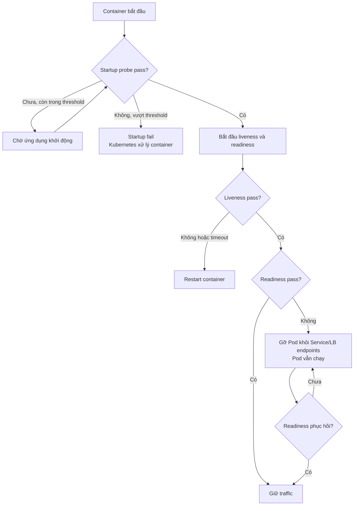

# Health Check API Pattern — Kiểm tra sức khỏe service

## Mục lục

- [Tổng quan](#tổng-quan)
- [Vấn đề](#vấn-đề)
- [Mô hình liveness readiness và startup](#mô-hình-liveness-readiness-và-startup)
  - [Liveness](#liveness)
  - [Readiness](#readiness)
  - [Startup](#startup)
  - [So sánh ba loại probe](#so-sánh-ba-loại-probe)
- [Endpoint contract](#endpoint-contract)
  - [Nguyên tắc contract chung](#nguyên-tắc-contract-chung)
  - [Ba endpoint cốt lõi](#ba-endpoint-cốt-lõi)
  - [Shallow và deep check](#shallow-và-deep-check)
- [Kiểm tra dependencies](#kiểm-tra-dependencies)
  - [Chọn dependency cần kiểm tra](#chọn-dependency-cần-kiểm-tra)
  - [Tổng hợp trạng thái](#tổng-hợp-trạng-thái)
  - [Kiểm soát tải của dependency checks](#kiểm-soát-tải-của-dependency-checks)
- [Tích hợp Kubernetes và Load Balancer](#tích-hợp-kubernetes-và-load-balancer)
  - [Kubernetes probes](#kubernetes-probes)
  - [Cấu hình probes minh họa](#cấu-hình-probes-minh-họa)
  - [Load Balancer và Service Discovery](#load-balancer-và-service-discovery)
- [Use case E-Commerce](#use-case-e-commerce)
  - [App khởi động chậm](#app-khởi-động-chậm)
  - [Database tạm thời lỗi](#database-tạm-thời-lỗi)
- [Trade-off](#trade-off)
- [Khi nào nên dùng và khi nào không nên dùng](#khi-nào-nên-dùng-và-khi-nào-không-nên-dùng)
  - [Nên dùng](#nên-dùng)
  - [Không cần đủ ba endpoint](#không-cần-đủ-ba-endpoint)
- [Lỗi thường gặp](#lỗi-thường-gặp)
- [Vận hành](#vận-hành)
  - [Hiệu chỉnh probe](#hiệu-chỉnh-probe)
  - [Kiểm thử contract](#kiểm-thử-contract)
  - [Bảo vệ endpoint](#bảo-vệ-endpoint)
  - [Theo dõi và rollout](#theo-dõi-và-rollout)
  - [Checklist](#checklist)
- [Liên kết liên quan](#liên-kết-liên-quan)

---

## Tổng quan

**Health Check API** (API kiểm tra sức khỏe) là một contract HTTP để service công bố trạng thái của chính nó. **Probe** (đầu dò) từ Kubernetes, Load Balancer hoặc Service Discovery gọi endpoint này định kỳ. Hạ tầng dùng kết quả để quyết định có tiếp tục gửi traffic, chờ service khởi động hoặc restart instance hay không.

Điểm quan trọng của pattern là tách ba câu hỏi khác nhau:

- Process có còn phản hồi và không bị treo không?
- Service có sẵn sàng nhận traffic ngay lúc này không?
- Ứng dụng đã khởi động xong để hai phép kiểm tra trên có ý nghĩa chưa?

Health Check API chỉ cung cấp tín hiệu. Orchestrator hoặc Load Balancer mới thực hiện hành động như gỡ Pod khỏi endpoints hay restart container. Vì vậy, một endpoint đúng contract có thể giúp self-healing hoạt động an toàn, còn endpoint thiết kế sai có thể làm outage lan rộng.

> **Phạm vi:** Tài liệu này tập trung vào Health Check API như một pattern độc lập: semantics của endpoint, dependency checks, probe configuration và vận hành. Phần tổng hợp các Observability Patterns nằm trong [17 — Observability Patterns](../17-observability-patterns.md).

## Vấn đề

Trong hệ thống phân tán, **process đang chạy không đồng nghĩa với service đang phục vụ được**. Một process có thể còn tồn tại trong khi:

- Ứng dụng đang khởi động và cache chưa nạp xong.
- Kết nối tới database bị mất, khiến các request chính đều thất bại.
- Thread hoặc event loop bị deadlock, nên process không xử lý request dù chưa thoát.

Nếu Load Balancer không biết trạng thái thật, nó vẫn route request vào instance lỗi. Nếu Kubernetes chỉ có một phép kiểm tra không phân biệt ngữ nghĩa, cùng một lỗi có thể dẫn tới hành động sai:

- Restart một Pod chỉ vì database tạm thời không sẵn sàng.
- Gửi traffic vào Pod đang boot và tạo ra lỗi cho user.
- Để Pod bị treo tiếp tục nằm trong vòng traffic vì process chưa chết.

Health Check API biến những trạng thái này thành tín hiệu chuẩn hóa. Tín hiệu đó cho phép hạ tầng chọn **chờ**, **ngừng gửi traffic** hoặc **restart** thay vì đoán từ việc process còn tồn tại.

## Mô hình liveness readiness và startup

Ba loại probe thường được dùng cùng nhau nhưng có trách nhiệm khác nhau. `Startup` bảo vệ giai đoạn boot. Sau khi startup thành công, `Liveness` và `Readiness` trả lời hai câu hỏi độc lập.



### Liveness

**Liveness** trả lời câu hỏi: *process còn sống và có thể phản hồi không?* Endpoint liveness nên là **shallow check** (kiểm tra nông). Nó chỉ kiểm tra phần nội bộ cần để biết process không bị treo, chẳng hạn HTTP server còn phản hồi.

Ví dụ endpoint pass:

```http
GET /health/live HTTP/1.1
Host: order-service:8080

HTTP/1.1 200 OK
Content-Type: application/json

{"status":"UP"}
```

Khi liveness fail, Kubernetes có thể restart container. Vì vậy, liveness không nên phụ thuộc trực tiếp vào database, Redis, Kafka hoặc downstream service. Một dependency dùng chung có thể tạm thời lỗi trong khi process và các Pod khác vẫn có thể phục hồi. Đặt deep check vào liveness sẽ biến lỗi dependency thành nhiều lần restart không cần thiết.

### Readiness

**Readiness** trả lời câu hỏi: *service có sẵn sàng nhận traffic ngay bây giờ không?* Endpoint readiness có thể dùng **deep check** (kiểm tra sâu) đối với những dependency bắt buộc cho traffic mà Pod đang phục vụ.

Khi readiness fail, Kubernetes gỡ Pod khỏi Service endpoints. Load Balancer cũng có thể ngừng chọn target đó nếu nó đang gọi cùng endpoint. Pod không bị restart chỉ vì readiness fail; nó có cơ hội giữ process và tự chuyển lại trạng thái ready khi dependency phục hồi.

Ví dụ response khi Payment Service không sẵn sàng:

```http
GET /health/ready HTTP/1.1
Host: payment-service:8080

HTTP/1.1 503 Service Unavailable
Content-Type: application/json

{
  "status": "DEGRADED",
  "checks": {
    "database": { "status": "UP", "latency_ms": 12 },
    "redis": { "status": "UP", "latency_ms": 3 },
    "downstream-payment": { "status": "DOWN", "latency_ms": 2500 }
  },
  "version": "1.4.2",
  "uptime_seconds": 259716
}
```

`503` trong ví dụ là tín hiệu máy đọc được. Field `status` và `checks` giúp con người điều tra, nhưng không được dùng để thay thế HTTP status code.

### Startup

**Startup** trả lời câu hỏi: *ứng dụng đã khởi động xong chưa?* Endpoint này dành cho app có thời gian boot dài, chẳng hạn app cần nạp cache lớn hoặc hoàn tất initialization trước khi phục vụ.

Trong Kubernetes, khi `startupProbe` chưa pass, `livenessProbe` và `readinessProbe` chưa được kích hoạt theo vòng đời bình thường của chúng. Nhờ đó, liveness không restart app chỉ vì app vẫn đang boot. Nếu startup không pass trong số lần thử cho phép, Kubernetes xử lý container theo cấu hình probe, thường dẫn tới restart.

Endpoint startup chỉ nên trả pass sau khi trạng thái khởi động mà service yêu cầu đã hoàn tất. Nếu endpoint trả `200` ngay khi process vừa bind port, nó không còn bảo vệ được phần initialization chậm.

### So sánh ba loại probe

| Probe | Câu hỏi | Kiểu kiểm tra | Khi pass | Khi fail | Consumer điển hình |
|---|---|---|---|---|---|
| **Startup** | App đã khởi động xong chưa? | Trạng thái initialization và boot | Cho phép probe khác bắt đầu | Chờ tiếp hoặc xử lý container sau threshold | Kubernetes |
| **Liveness** | Process còn phản hồi không? | Shallow, không phụ thuộc dependency ngoài | Giữ container chạy | Restart container | Kubernetes |
| **Readiness** | Có nhận traffic được ngay không? | Deep vừa đủ, gồm dependency bắt buộc | Giữ Pod trong endpoints | Gỡ khỏi endpoints, không restart | Kubernetes, Load Balancer, Service Discovery |

Một service có thể expose cả ba endpoint nhưng mỗi endpoint phải có semantics riêng. Không nên dùng cùng một deep check cho cả liveness và readiness chỉ để giảm số handler cần viết.

## Endpoint contract

### Nguyên tắc contract chung

Path trong tài liệu là convention minh họa. Kubernetes và Load Balancer không bắt buộc service phải dùng đúng `/health/live`, `/health/ready` hay `/health/startup`; manifest hoặc target configuration sẽ trỏ tới path cụ thể. Điều cần giữ ổn định là semantics, HTTP status và cách xử lý khi dependency thay đổi.

Một contract tối thiểu nên quy định:

1. **Method và path:** thường là `GET` với path nội bộ ổn định.
2. **HTTP status:** `200` khi trạng thái tương ứng đạt yêu cầu; status lỗi như `503` khi chưa sẵn sàng.
3. **Thời gian phản hồi:** handler phải nhanh và có giới hạn thời gian. Probe không nên chờ một request business dài.
4. **Response schema:** body có thể chứa `status` và các check cần thiết để con người đọc.
5. **Không side effect:** health check không tạo order, publish message hoặc thay đổi dữ liệu nghiệp vụ.
6. **Quyền truy cập:** probe phải gọi được mà không phụ thuộc vào flow Authentication phức tạp; endpoint chi tiết nên ở mạng nội bộ.
7. **Thông tin trả về:** không chứa password, token, connection string hoặc dữ liệu nhạy cảm.

HTTP status là phần contract dành cho máy. Một response `200` với body `{"status":"DOWN"}` vẫn bị coi là healthy bởi nhiều probe nếu probe chỉ dựa vào status code.

### Ba endpoint cốt lõi

| Endpoint convention | `200 OK` có nghĩa | Khi không đạt | Dữ liệu nên trả | Dùng cho |
|---|---|---|---|---|
| `GET /health/live` | Process phản hồi và không ở trạng thái treo đã biết | Non-2xx hoặc timeout | `status` đơn giản | Liveness probe |
| `GET /health/ready` | Service có thể nhận loại traffic mà Pod đang phục vụ | `503 Service Unavailable` hoặc timeout | Trạng thái dependency bắt buộc và lý do tổng quát | Readiness probe, Load Balancer |
| `GET /health/startup` | Initialization đã hoàn tất | Non-2xx hoặc timeout trong lúc boot | Trạng thái startup đơn giản | Startup probe |

Một số framework dùng path như `/actuator/health/liveness` và `/actuator/health/readiness`. Các path đó vẫn phù hợp nếu được ghi vào contract và mapping Kubernetes. Không nên để mỗi service tự chọn tên mà không cập nhật manifest và tài liệu vận hành.

Nếu cần một endpoint tổng hợp cho operator, có thể thêm `GET /health` với các check chi tiết. Endpoint tổng hợp không tự thay thế ba semantics trên. Đặc biệt, không nên dùng một endpoint tổng hợp deep làm liveness chỉ vì nó đã tồn tại.

Response chi tiết là một schema minh họa, không phải format bắt buộc cho mọi framework:

```json
{
  "status": "UP",
  "version": "2.1.0",
  "uptime_seconds": 309720,
  "checks": {
    "database": {
      "status": "UP",
      "latency_ms": 5
    },
    "redis": {
      "status": "UP",
      "latency_ms": 2
    },
    "kafka": {
      "status": "DEGRADED",
      "detail": "1/3 brokers unreachable"
    }
  }
}
```

`version`, `uptime_seconds`, `latency_ms` và `detail` chỉ nên xuất hiện khi chúng hữu ích cho vận hành và không làm lộ thông tin nhạy cảm. Response public, nếu bắt buộc phải có, nên tối giản hơn response nội bộ.

### Shallow và deep check

Đây là quyết định thiết kế quan trọng nhất của Health Check API:

| Kiểu check | Kiểm tra | Endpoint phù hợp | Vì sao |
|---|---|---|---|
| **Shallow** | Process hoặc event loop còn phản hồi; handler không bị treo | Liveness | Liveness fail sẽ restart container, nên không được biến lỗi dependency thành restart hàng loạt |
| **Deep** | Dependency cần cho việc phục vụ: database, cache, queue hoặc downstream | Readiness | Readiness fail chỉ gỡ traffic, cho service cơ hội phục hồi mà không restart oan |

Shallow không có nghĩa là bỏ qua mọi lỗi nội bộ. Nó có nghĩa là kiểm tra đúng câu hỏi *"process còn sống không?"* thay vì mô phỏng toàn bộ một request nghiệp vụ.

Deep cũng không có nghĩa là phải gọi tất cả dependency trong mọi lần poll. Chỉ kiểm tra dependency mà service thật sự cần để nhận traffic. Nếu một dependency chỉ phục vụ chức năng phụ, lỗi của nó không nhất thiết phải làm toàn bộ service `NOT_READY`.

## Kiểm tra dependencies

### Chọn dependency cần kiểm tra

Readiness cần phản ánh khả năng phục vụ thực tế, không phải một danh sách mọi thành phần mà service từng biết tới. Có thể phân loại như sau:

| Dependency | Câu hỏi cần trả lời | Ảnh hưởng readiness |
|---|---|---|
| Database chính | Request chính có đọc hoặc ghi dữ liệu được không? | Fail nếu service không thể phục vụ mà không có database |
| Cache bắt buộc | Service có phụ thuộc cache để xử lý đúng không? | Fail nếu cache là điều kiện bắt buộc; nếu chỉ là tối ưu thì cần policy khác |
| Message broker | Service có cần broker để hoàn tất contract đang nhận không? | Fail nếu không thể phục vụ đúng semantics khi broker down |
| Downstream service | Request được route vào Pod có cần downstream đó không? | Chỉ fail khi dependency là điều kiện cần cho traffic mà readiness đại diện |
| Dependency tùy chọn | Tính năng phụ có thể tắt hoặc dùng fallback không? | Không nên tự động fail toàn service nếu service vẫn phục vụ đúng contract chính |

Ví dụ, nếu Order Service vẫn phục vụ được chức năng tra cứu đơn khi Payment Service lỗi, readiness của Order Service không nên fail chỉ vì Payment Service không ready. Ngược lại, Payment Service có thể cần database riêng để xử lý mọi request thanh toán.

Contract nên ghi rõ dependency nào là **required** và dependency nào là **optional**. Nếu không có quy ước này, một team có thể thêm một exporter hoặc một API phụ vào deep check rồi vô tình gỡ toàn bộ traffic chính.

### Tổng hợp trạng thái

Một cách tổng hợp đơn giản là:

- Tất cả dependency required pass → readiness trả `200`.
- Một dependency required fail hoặc timeout → readiness trả `503`.
- Dependency optional fail → service vẫn có thể trả `200` nếu business contract cho phép; body có thể mô tả `DEGRADED` để operator biết.

Tên trạng thái trong body như `UP`, `DOWN` và `DEGRADED` là convention. Team cần định nghĩa rõ trạng thái nào đi cùng HTTP status nào. Không được để một service trả `DEGRADED` với `200` trong khi service khác dùng `DEGRADED` với `503` mà không nói rõ khác biệt.

Check dependency nên trả kết quả đủ để điều tra nhưng không trả secret. Có thể ghi tên dependency, trạng thái và latency; không trả connection string, host nội bộ đầy đủ hoặc credential.

### Kiểm soát tải của dependency checks

Readiness thường bị poll liên tục. Một deep check gọi database hoặc downstream trong mỗi lần poll có thể tạo thêm tải đúng lúc dependency đang gặp sự cố. Ví dụ, `50` Pod poll mỗi `5` giây đã tạo khoảng `10` lần gọi mỗi giây cho một loại check, chưa tính retry và nhiều dependency.

Các biện pháp kiểm soát gồm:

- Dùng check nhẹ, chẳng hạn kiểm tra connection hoặc một operation đọc nhỏ thay vì chạy query nghiệp vụ lớn.
- Đặt timeout riêng cho từng dependency để một dependency chậm không giữ request health quá lâu.
- Cache kết quả check trong vài giây khi độ tươi tuyệt đối không cần thiết. Đây là trade-off hợp lệ giữa độ trễ phát hiện và tải lên dependency.
- Không thực hiện mutation, publish message hoặc gọi operation có side effect trong health handler.
- Giám sát cả latency và lỗi của health endpoint, vì health check cũng là traffic thật.

Cache không nên làm cho service tiếp tục nhận traffic quá lâu sau một lỗi đã rõ ràng. Thời gian cache cần phù hợp với yêu cầu phát hiện lỗi và chu kỳ probe.

## Tích hợp Kubernetes và Load Balancer

### Kubernetes probes

Kubernetes dùng ba loại probe với hành động khác nhau:

| Probe Kubernetes | Endpoint nên trỏ tới | Khi fail |
|---|---|---|
| `livenessProbe` | Endpoint shallow như `/health/live` | Kubelet restart container sau ngưỡng fail |
| `readinessProbe` | Endpoint readiness như `/health/ready` | Pod bị gỡ khỏi Service endpoints; container vẫn chạy |
| `startupProbe` | Endpoint startup như `/health/startup` | Kubelet tiếp tục chờ trong thời gian cho phép; vượt ngưỡng thì xử lý container theo policy |

`startupProbe` bảo vệ app boot chậm. Khi startup chưa pass, liveness và readiness không nên kết luận app đã hỏng chỉ vì app chưa hoàn tất initialization. Khi startup pass, hai probe còn lại tiếp tục phản ánh trạng thái runtime.

### Cấu hình probes minh họa

Manifest dưới đây dùng các endpoint của contract ở trên:

```yaml
apiVersion: apps/v1
kind: Deployment
metadata:
  name: order-service
spec:
  template:
    spec:
      containers:
        - name: order-service
          image: myapp/order-service:1.4.2
          livenessProbe:
            httpGet:
              path: /health/live
              port: 8080
            initialDelaySeconds: 10
            periodSeconds: 10
            timeoutSeconds: 3
            failureThreshold: 3
          readinessProbe:
            httpGet:
              path: /health/ready
              port: 8080
            periodSeconds: 5
            timeoutSeconds: 3
            failureThreshold: 2
          startupProbe:
            httpGet:
              path: /health/startup
              port: 8080
            periodSeconds: 5
            timeoutSeconds: 3
            failureThreshold: 30
```

Trong ví dụ, `failureThreshold × periodSeconds` của startup là `30 × 5 = 150` giây theo cách tính nominal. Khoảng thời gian thực tế còn phụ thuộc việc probe bắt đầu khi nào và timeout. Con số này phải lớn hơn thời gian boot cần thiết của app trong môi trường tương ứng.

Các tham số không có giá trị đúng cho mọi service:

- `periodSeconds` quyết định tần suất kiểm tra.
- `timeoutSeconds` giới hạn thời gian chờ một lần gọi.
- `failureThreshold` xác định số lần fail liên tiếp trước khi Kubernetes hành động.
- `initialDelaySeconds` trì hoãn probe sau khi container bắt đầu; nó không thay thế hoàn toàn `startupProbe` cho app có boot time biến động.

Nếu timeout quá ngắn hoặc threshold quá thấp, một lần GC, network jitter hoặc tải đột biến có thể tạo false positive. Nếu quá rộng, hạ tầng phát hiện lỗi chậm hơn. Hãy hiệu chỉnh từ dữ liệu startup và latency thực tế thay vì sao chép con số mẫu.

### Load Balancer và Service Discovery

Load Balancer cần biết target có nhận traffic được hay không. Vì vậy, health check của Load Balancer thường nên trỏ vào readiness semantics, không phải liveness semantics:

```text
Load Balancer / Kubernetes Service
  ├── Pod 1 — /health/ready → 200 ──► nhận traffic
  ├── Pod 2 — /health/ready → 503 ──► tạm thời không nhận traffic
  └── Pod 3 — timeout        ──► tạm thời không nhận traffic
```

Cách một Load Balancer đánh dấu target, số lần retry và thời gian đưa target trở lại phụ thuộc vào sản phẩm. Contract của service vẫn phải dùng HTTP status nhất quán để hạ tầng có thể phân biệt ready và not ready.

Service Discovery cũng có thể gọi health endpoint để giữ hoặc loại instance khỏi registry. Tuy nhiên, cơ chế active check, heartbeat, TTL và cách cập nhật registry phụ thuộc vào công cụ. Không nên dùng liveness endpoint cho routing nếu mục tiêu thực sự là kiểm tra khả năng nhận traffic.

Khi một endpoint có response chi tiết, chỉ expose phần chi tiết trong mạng nội bộ. Target health của Load Balancer hoặc registry thường chỉ cần tín hiệu pass/fail; public client không cần biết topology và trạng thái từng broker.

## Use case E-Commerce

### App khởi động chậm

Order Service cần khoảng `60` giây để nạp cache khi deploy version mới. Nếu chỉ cấu hình liveness với `initialDelaySeconds: 10`, Kubernetes có thể gọi liveness khi app chưa hoàn tất boot. Probe fail, container bị restart, rồi container mới lại bắt đầu từ đầu và tiếp tục fail.

Kết quả là một **crash loop**: app có thể boot được nếu được chờ đủ lâu, nhưng không bao giờ có cơ hội chạy đủ lâu để pass probe.

Cách sửa là tách startup khỏi liveness:

1. `/health/startup` chỉ trả `200` sau khi initialization cần thiết hoàn tất.
2. `startupProbe` cho phép khoảng thời gian lớn hơn thời gian boot dự kiến, chẳng hạn `30 × 5` giây trong manifest minh họa.
3. `/health/live` vẫn shallow để sau khi boot xong, Kubernetes có thể phát hiện deadlock hoặc process không còn phản hồi.
4. `/health/ready` chỉ trả `200` khi Pod thực sự có thể nhận traffic.

Startup probe không làm app nhanh hơn. Nó chỉ ngăn liveness kết luận quá sớm rằng app đã hỏng.

### Database tạm thời lỗi

PostgreSQL của Payment Service bị chậm hoặc mất kết nối tạm thời. Readiness deep check phát hiện database không đáp ứng và trả `503`.

Kubernetes hoặc Load Balancer tạm thời gỡ Pod khỏi endpoints. Pod vẫn chạy, giữ cơ hội reconnect khi database phục hồi. Khi readiness trở lại `200`, Pod có thể được đưa vào endpoints theo hành vi của hạ tầng.

Nếu cùng deep check đó được đặt vào liveness, tất cả Pod Payment có thể lần lượt bị restart trong khi nguyên nhân nằm ở PostgreSQL. Restart không sửa được dependency đang lỗi và có thể tạo **restart storm**. Phân biệt readiness với liveness giúp hành động phù hợp hơn: **gỡ traffic khi chưa phục vụ được, chỉ restart khi chính process không còn recover được**.

## Trade-off

| Lợi ích | Cái giá phải trả |
|---|---|
| Orchestrator tự động phát hiện instance lỗi và có thể thay thế nó | Cần cấu hình probe, endpoint và threshold nhất quán ở từng service |
| Phân biệt được “chưa sẵn sàng” với “đã chết”, tránh restart oan | Deep check gọi dependency thường xuyên, tạo thêm CPU, network và tải lên dependency |
| Readiness hỗ trợ Load Balancer, Service Discovery và progressive rollout | Semantics sai, đặc biệt deep liveness, có thể gây restart storm hoặc gỡ nhầm traffic |
| Contract chuẩn hóa cách service công bố trạng thái | Endpoint chi tiết có thể expose version, dependency và topology nội bộ |
| Có tín hiệu tự động cho self-healing | Timeout hoặc threshold không phù hợp có thể tạo flapping giữa ready và not ready |

Giá trị của pattern nằm ở việc hành động của hạ tầng khớp với loại lỗi. Liveness nên trả lời một câu hỏi hẹp để restart có cơ sở. Readiness có thể rộng hơn nhưng vẫn phải giới hạn vào dependency cần thiết cho traffic. Không nên thêm deep check chỉ vì muốn response health “đầy đủ” hơn.

## Khi nào nên dùng và khi nào không nên dùng

### Nên dùng

- Service chạy trên Kubernetes, Nomad, ECS hoặc một orchestrator có cơ chế probe.
- Service đứng sau Load Balancer và cần tự động gỡ instance không sẵn sàng.
- Hệ thống có nhiều replica, nơi con người không thể theo dõi từng process.
- Ứng dụng có thời gian boot dài, cache warm-up hoặc initialization nhiều bước.
- Có progressive delivery như canary hoặc blue-green và readiness được dùng làm điều kiện đưa instance vào traffic.
- Service có dependency bắt buộc mà trạng thái của dependency ảnh hưởng trực tiếp đến khả năng phục vụ.

Health Check API nên được thiết kế từ service đầu tiên có traffic qua orchestrator hoặc Load Balancer. Bắt đầu với contract nhỏ: liveness shallow, readiness đúng dependency và startup khi boot chậm. Không cần biến endpoint thành một dashboard đầy đủ ngay từ đầu.

### Không cần đủ ba endpoint

“Không cần đủ ba endpoint” không có nghĩa là bỏ mọi cơ chế kiểm tra trạng thái. Có thể giảm contract trong các trường hợp sau:

- **Batch job chạy xong rồi thoát:** không nhận traffic liên tục nên readiness không có nhiều ý nghĩa. Job status hoặc exit code phù hợp hơn.
- **CLI tool hoặc worker one-shot:** health endpoint không giúp Load Balancer route request; có thể dùng trạng thái execution nếu cần theo dõi.
- **Ứng dụng đơn giản không nằm sau orchestrator hoặc Load Balancer:** một endpoint đơn giản có thể đủ cho monitoring nội bộ; ba semantics chỉ đáng thêm khi có consumer cần chúng.
- **Dependency chỉ phục vụ chức năng phụ:** không nên thêm dependency đó vào readiness nếu service vẫn đáp ứng contract chính bằng fallback.

Nếu service về sau được đưa vào Kubernetes hoặc đặt sau Load Balancer, việc có contract live/ready/startup rõ ràng từ sớm sẽ giảm thay đổi lúc triển khai. Mức độ chi tiết của endpoint vẫn nên tỷ lệ với nhu cầu vận hành thực tế.

## Lỗi thường gặp

| Lỗi | Hậu quả | Cách tránh |
|---|---|---|
| Đặt deep check vào **liveness** | Database hoặc downstream lỗi làm nhiều Pod lành bệnh bị restart; có thể tạo restart storm | Liveness shallow; readiness mới kiểm tra dependency cần thiết |
| Luôn trả `200` dù body có `status: DOWN` | Kubernetes hoặc Load Balancer coi target là healthy và tiếp tục gửi traffic | Dùng HTTP status thể hiện pass/fail; readiness không sẵn sàng trả `503` |
| Dùng một endpoint deep cho cả ba probe | App boot chậm bị fail sớm hoặc dependency tạm thời lỗi làm container bị restart | Tách semantics startup, liveness và readiness |
| Health endpoint yêu cầu Authentication phức tạp | Kubelet hoặc Load Balancer không gọi được; probe luôn fail | Đặt endpoint trong mạng nội bộ và dùng cơ chế truy cập mà probe hỗ trợ |
| Gọi database mỗi lần poll mà không cache hoặc giới hạn | Health check tạo tải lên chính dependency đang gặp sự cố | Check nhẹ, timeout rõ ràng và cân nhắc cache kết quả vài giây |
| Không có startup probe cho app boot chậm | Container rơi vào crash loop lúc deploy | Đặt startup budget lớn hơn thời gian boot cần thiết |
| Readiness phụ thuộc cả dependency không bắt buộc | Một tính năng phụ lỗi làm toàn service bị gỡ khỏi traffic | Chỉ đưa dependency cần cho request thực tế vào readiness |
| Expose chi tiết dependency ra Internet | Lộ version, topology hoặc trạng thái hệ thống nội bộ | Giới hạn network; public chỉ trả trạng thái tối giản nếu thật sự cần |
| Timeout hoặc threshold quá chặt | Probe flapping, Pod liên tục ra vào endpoints hoặc bị restart oan | Hiệu chỉnh từ latency và startup time thực tế; kiểm tra fail liên tiếp |
| Health handler chạy query nghiệp vụ hoặc có side effect | Probe chậm, làm thay đổi dữ liệu hoặc tạo thêm message | Dùng operation đọc nhẹ, không mutation và có giới hạn thời gian |
| Đổi path hoặc semantics nhưng không đổi manifest | Probe gọi sai endpoint hoặc hiểu sai trạng thái sau deploy | Quản lý endpoint contract cùng với cấu hình orchestrator và Load Balancer |

## Vận hành

### Hiệu chỉnh probe

Probe là một phần của production configuration, không chỉ là vài dòng YAML thêm vào cuối Deployment. Khi hiệu chỉnh, cần xem xét:

- Đo thời gian boot thực tế của version mới trong môi trường tương ứng. `startupProbe` phải cho đủ thời gian để app hoàn tất initialization bình thường.
- Đo latency bình thường của chính health handler. `timeoutSeconds` cần đủ rộng cho một lần xử lý bình thường nhưng vẫn có giới hạn.
- Chọn `periodSeconds` và `failureThreshold` để phân biệt lỗi kéo dài với một lần network jitter ngắn.
- Giữ liveness shallow dù readiness có deep check.
- Xác định dependency required và optional bằng contract của service, không thêm tùy ý theo từng implementation detail.
- Review lại probe khi thay đổi cache warm-up, connection pool, database hoặc downstream dependency.

Công thức `failureThreshold × periodSeconds` chỉ là ước lượng thời gian probe cho phép. `initialDelaySeconds`, `timeoutSeconds` và thời điểm bắt đầu probe cũng ảnh hưởng hành vi thực tế. Vì vậy, không nên coi một con số mẫu là SLO chung cho mọi service.

### Kiểm thử contract

Kiểm thử cần bao phủ cả HTTP response lẫn hành động mà hạ tầng sẽ thực hiện:

| Tình huống | Kết quả mong đợi |
|---|---|
| App chưa hoàn tất boot | Startup chưa pass; liveness/readiness không bị dùng để kết luận quá sớm |
| App boot xong và dependency required hoạt động | Startup, liveness và readiness đều pass theo contract |
| Process bị treo hoặc không thể phản hồi | Liveness timeout hoặc fail để orchestrator có thể restart |
| Database required mất kết nối | Readiness trả `503`; Pod bị gỡ traffic nhưng không bị restart chỉ vì lỗi này |
| Dependency optional tạm thời lỗi | Kết quả theo policy; không gỡ toàn service nếu service vẫn phục vụ contract chính |
| Endpoint bị đổi path | Manifest, Load Balancer và test contract phải phát hiện mapping không còn đúng |
| Nhiều Pod được poll đồng thời | Health handler không tạo tải bất thường hoặc dùng nhầm context giữa các request |

Nên có một synthetic request hoặc integration test đi qua vòng đời `starting → ready → not ready → ready`. Sau khi đổi HTTP server, framework, service mesh hoặc dependency client, chạy lại kiểm tra vì các thay đổi đó có thể ảnh hưởng timeout và khả năng probe gọi tới endpoint.

### Bảo vệ endpoint

Health endpoint thường được gọi từ mạng nội bộ, nhưng response vẫn có thể chứa thông tin hữu ích cho người tấn công. Có thể áp dụng các lớp bảo vệ sau:

- Chỉ cho phép kubelet, Load Balancer, Service Discovery hoặc mạng vận hành truy cập endpoint chi tiết.
- Không trả connection string, credential, access token, password hoặc payload nghiệp vụ.
- Cân nhắc tách endpoint probe tối giản khỏi endpoint diagnostics chi tiết.
- Nếu public endpoint là yêu cầu bắt buộc, chỉ trả trạng thái tổng quát và không expose danh sách dependency.
- Không dùng Health Check API làm cơ chế Authentication hoặc Authorization cho business API.

Endpoint không nên yêu cầu flow login dành cho user nếu chính probe không thể thực hiện flow đó. Kiểm soát network và policy của hạ tầng cần được thiết kế cùng với contract endpoint.

### Theo dõi và rollout

Cần theo dõi sức khỏe của pattern, không chỉ trạng thái mà endpoint trả về. Các tín hiệu hữu ích gồm:

- Số lần liveness, readiness và startup probe fail.
- Thời gian Pod ở trạng thái not ready và số lần chuyển qua lại ready/not ready.
- Số lần container restart hoặc crash loop.
- Latency của health handler và latency riêng của từng dependency check.
- Dependency nào thường xuyên khiến readiness fail.
- Tỷ lệ Pod ready trong khi rollout hoặc canary.

Readiness có thể làm cổng traffic cho rollout. Trước khi đưa version mới vào traffic, hạ tầng cần thấy Pod pass readiness; trong rollout, readiness fail phải khiến traffic được điều chỉnh theo policy của hạ tầng thay vì tiếp tục gửi request vào Pod lỗi. Chi tiết chiến lược deployment nằm trong [14 — CI/CD & Deployment](../14-cicd-deployment.md).

Alert nên phân biệt một lần fail ngắn với readiness fail kéo dài hoặc restart tăng liên tục. Một probe fail đơn lẻ có thể là transient error; chuỗi fail kéo dài cần được đưa tới on-call với context về service, version và dependency liên quan.

### Checklist

- [ ] Có contract rõ cho `liveness`, `readiness` và `startup` khi service cần cả ba.
- [ ] Liveness là shallow check, không phụ thuộc database, cache, queue hoặc downstream.
- [ ] Readiness chỉ kiểm tra dependency required cho traffic thực tế.
- [ ] Startup phản ánh initialization đã hoàn tất, không chỉ việc process vừa bind port.
- [ ] `200` và `503` được dùng nhất quán; không chỉ trả trạng thái trong JSON body.
- [ ] Health handler nhanh, có timeout và không có side effect nghiệp vụ.
- [ ] Dependency check không tạo tải lớn; đã cân nhắc cache, retry và polling frequency.
- [ ] Kubernetes, Load Balancer hoặc Service Discovery trỏ đúng endpoint và semantics.
- [ ] App boot chậm đã có startup budget đủ lớn.
- [ ] Endpoint chi tiết chỉ ở mạng nội bộ và không chứa secret hoặc thông tin nhạy cảm.
- [ ] Đã kiểm thử các trạng thái starting, ready, not ready, dependency failure và recovery.
- [ ] Theo dõi probe failure, restart, not-ready duration và dependency health trong rollout.

## Liên kết liên quan

- [17 — Observability Patterns](../17-observability-patterns.md) — tài liệu tổng hợp nguồn của pattern này.
- [11 — Observability & Evolvability](../11-observability-evolvability.md#6-health-check--readiness) — liveness, readiness, startup và thiết kế health endpoint ở phần nền tảng.
- [13 — Orchestration](../13-orchestration.md#6-health-check--self-healing) — Kubernetes probes và self-healing.
- [10 — Resilience Patterns](../10-resilience-patterns.md#81-health-check) — Health Check ở góc nhìn resilience và phối hợp với các pattern chống lỗi.
- [08 — Service Discovery](../08-service-discovery.md#33-health-check) — active health check, heartbeat và registry.
- [12 — Containerization](../12-containerization.md#63-health-check) — health check ở tầng container.
- [14 — CI/CD & Deployment](../14-cicd-deployment.md) — readiness trong rollout và progressive delivery.
