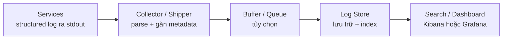

# Log Aggregation Pattern

## Mục lục

- [Tổng quan](#tổng-quan)
- [Vấn đề](#vấn-đề)
- [Kiến trúc và pipeline](#kiến-trúc-và-pipeline)
  - [Các thành phần](#các-thành-phần)
  - [Cách triển khai Collector](#cách-triển-khai-collector)
- [Structured logging](#structured-logging)
  - [Schema tối thiểu](#schema-tối-thiểu)
  - [Ví dụ một log entry](#ví-dụ-một-log-entry)
  - [Liên kết với Correlation ID và Trace ID](#liên-kết-với-correlation-id-và-trace-id)
- [Use case E-Commerce](#use-case-e-commerce)
  - [Điều tra đơn hàng thất bại](#điều-tra-đơn-hàng-thất-bại)
  - [Retention phân lớp](#retention-phân-lớp)
- [Trade-off](#trade-off)
- [Khi nào nên dùng và khi nào chưa cần](#khi-nào-nên-dùng-và-khi-nào-chưa-cần)
  - [Nên dùng khi](#nên-dùng-khi)
  - [Chưa cần mở rộng khi](#chưa-cần-mở-rộng-khi)
- [Cardinality và dữ liệu nhạy cảm](#cardinality-và-dữ-liệu-nhạy-cảm)
  - [Kiểm soát cardinality](#kiểm-soát-cardinality)
  - [Bảo vệ dữ liệu nhạy cảm](#bảo-vệ-dữ-liệu-nhạy-cảm)
- [Vận hành](#vận-hành)
  - [Retention và chi phí](#retention-và-chi-phí)
  - [Độ tin cậy của pipeline](#độ-tin-cậy-của-pipeline)
  - [Checklist vận hành](#checklist-vận-hành)
- [Lỗi thường gặp](#lỗi-thường-gặp)
- [Liên kết liên quan](#liên-kết-liên-quan)

## Tổng quan

**Log Aggregation** (tổng hợp log) đưa log từ nhiều service về một nền tảng tập trung để lưu trữ, tìm kiếm, lọc và phân tích. Pattern này giải quyết việc log bị phân tán trong hệ thống Microservice; nó không thay thế Distributed Tracing hay Correlation ID.

Trong một hệ thống nhỏ, đọc log trên một máy chủ có thể là đủ. Khi một request đi qua nhiều service và nhiều replica, log cần được thu gom theo một cách nhất quán. Nền tảng tập trung giúp on-call tìm các sự kiện liên quan mà không phải truy cập từng node.

> Log Aggregation chỉ tạo ra một nơi tìm kiếm chung. Muốn truy vấn theo `service`, `level` hay `correlation_id`, mỗi service vẫn phải phát log có cấu trúc và metadata phù hợp.

## Vấn đề

Trong hệ thống Microservice, log thường gặp bốn vấn đề:

- **Phân tán**: log nằm ở `stdout` của container, file trên node hoặc volume riêng của từng instance.
- **Dễ mất**: filesystem của container thường mang tính ephemeral (tạm thời). Khi container bị thay thế, log chỉ còn nếu đã được thu gom ra ngoài.
- **Không đồng nhất**: service này ghi JSON, service khác ghi plain text; tên field và log level cũng có thể khác nhau.
- **Khó nối chuỗi**: nếu log không có trường định danh chung, các entry của cùng một request bị trộn với request khác xảy ra cùng thời điểm.

Khi có sự cố, việc SSH vào từng máy rồi chạy `grep` không mở rộng được theo số service, replica và node. Vấn đề cần giải quyết không chỉ là **lưu log**, mà còn là làm cho log có thể được tìm kiếm và sử dụng trong điều tra.

## Kiến trúc và pipeline

Một pipeline Log Aggregation thường đi từ application tới collector, qua lớp lưu trữ, rồi tới giao diện truy vấn:



`Buffer / Queue` là lớp tùy chọn. Nó có thể giúp pipeline chịu được lúc backend tạm thời quá tải hoặc gián đoạn, nhưng cần cấu hình dung lượng, retry và chính sách khi đầy; không nên xem nó là bảo đảm mất log bằng không.

### Các thành phần

| Thành phần | Vai trò | Ví dụ |
|---|---|---|
| **Application logging** | Tạo structured log, thường ghi ra `stdout` | Logging library của ngôn ngữ hoặc framework |
| **Collector / Shipper** | Đọc log từ container hoặc node, parse, gắn metadata như service, pod, node rồi chuyển tiếp | Fluent Bit, Fluentd, Filebeat |
| **Buffer / Queue** | Tạm giữ dữ liệu khi đích nhận chậm hoặc tạm thời không sẵn sàng | Kafka, queue tích hợp trong collector |
| **Log Store** | Lưu log và tổ chức dữ liệu để truy vấn | Elasticsearch, Loki, ClickHouse |
| **Search / Visualization** | Cung cấp query, dashboard và cảnh báo dựa trên log | Kibana, Grafana |

Collector nên bổ sung metadata hạ tầng ở một nơi thống nhất. Nhờ vậy, người điều tra có thể lọc theo `service`, `pod`, `node` hoặc `environment` mà không yêu cầu application tự biết mọi thông tin triển khai.

### Cách triển khai Collector

Có ba cách triển khai phổ biến. Lựa chọn phụ thuộc vào nơi log xuất hiện, mức độ tùy biến cần thiết và chi phí vận hành:

| Cách triển khai | Cách hoạt động | Ưu điểm | Hạn chế |
|---|---|---|---|
| **DaemonSet** | Một agent trên mỗi node đọc log của các container trên node đó | Tiết kiệm resource hơn so với một agent cho mỗi Pod; không phải sửa từng Pod spec | Cần quyền đọc log của node; khó tùy biến riêng cho từng service |
| **Sidecar** | Một agent chạy cạnh container chính trong cùng Pod | Phù hợp khi service ghi file riêng hoặc cần parser đặc thù | Resource tăng theo số Pod; cấu hình và vận hành phức tạp hơn |
| **In-app library** | Application tự gửi log trực tiếp tới backend | Không cần agent riêng | Application bị phụ thuộc vào backend; backend nghẽn có thể ảnh hưởng việc ghi log |

Trong môi trường Kubernetes, **DaemonSet** thường là điểm bắt đầu hợp lý. Dùng **Sidecar** khi service có nhu cầu đặc biệt mà agent cấp node không xử lý được. Với container, ưu tiên ghi ra `stdout` để container runtime hoặc nền tảng orchestration quản lý vòng đời log thay vì tự tạo file mà không có rotation.

## Structured logging

**Structured logging** (ghi log có cấu trúc) biểu diễn mỗi sự kiện dưới dạng bản ghi có field rõ ràng, thay vì chỉ nối các đoạn text tự do. JSON là một định dạng thường dùng, nhưng điều quan trọng hơn là schema ổn định và dễ truy vấn.

Ví dụ, hai thông điệp sau chứa cùng ý nghĩa nhưng khả năng truy vấn khác nhau:

```text
# Plain text
ERROR Charge failed for order ORD-456 after 2503ms
```

```json
{
  "level": "ERROR",
  "service": "payment-service",
  "order_id": "ORD-456",
  "error_type": "GatewayTimeout",
  "duration_ms": 2503,
  "message": "Charge failed"
}
```

Ở dạng có cấu trúc, backend có thể lọc theo `service`, `level`, `order_id` hoặc `error_type` mà không phải đoán vị trí của từng giá trị trong câu text. Application nên giữ `message` dễ đọc cho con người, đồng thời đưa dữ liệu dùng để lọc và phân tích vào field riêng.

### Schema tối thiểu

Không cần mọi log entry có cùng một tập field mở rộng. Tuy nhiên, các field nền tảng nên được thống nhất giữa các service:

| Field | Mục đích |
|---|---|
| `timestamp` | Sắp xếp sự kiện theo thời gian; nên có timezone rõ ràng |
| `level` | Phân biệt `DEBUG`, `INFO`, `WARN`, `ERROR` |
| `service` | Xác định service phát sinh log |
| `environment` hoặc metadata tương đương | Phân biệt production, staging và môi trường khác |
| `message` | Mô tả ngắn gọn, dễ đọc |
| `correlation_id` | Nối các log entry của cùng một request hoặc luồng xử lý |
| `trace_id` | Cầu nối từ log sang Distributed Tracing khi hệ thống có tracing |
| `version` | Đối chiếu log với phiên bản đang chạy |

Các field theo nghiệp vụ như `order_id`, `error_type` và `duration_ms` chỉ nên được thêm khi có ý nghĩa cho sự kiện. Schema cần được ghi thành guideline dùng chung; nếu mỗi team đặt tên khác nhau, việc query liên service sẽ khó hơn.

### Ví dụ một log entry

Ví dụ dưới đây mô tả một lỗi thanh toán. Các giá trị chỉ mang tính minh họa:

```json
{
  "timestamp": "2025-03-15T10:30:45.123Z",
  "level": "ERROR",
  "service": "payment-service",
  "environment": "production",
  "version": "1.4.2",
  "correlation_id": "req-789",
  "trace_id": "4bf92f3577b34da6a3ce929d0e0e4736",
  "message": "Charge failed",
  "order_id": "ORD-456",
  "error_type": "GatewayTimeout",
  "duration_ms": 2503
}
```

Một query tương ứng có thể là:

```text
service=payment-service AND correlation_id=req-789 AND level=ERROR
```

Cú pháp query thực tế phụ thuộc Log Store. Ý chính là các tiêu chí quan trọng đã là field, không bị chôn trong một chuỗi text.

`Stack trace` cần được giữ thành một field của cùng event hoặc được collector gom bằng `multiline parser`. Nếu mỗi dòng exception bị tách thành một entry, thông tin chẩn đoán có thể bị thiếu hoặc bị trộn với log của request khác.

### Liên kết với Correlation ID và Trace ID

`correlation_id` thường phục vụ việc tìm tất cả log thuộc một request. `trace_id` phục vụ việc mở trace và xem quan hệ, thời lượng giữa các span. Hai field có mục đích khác nhau nhưng có thể cùng xuất hiện trong mọi log entry.

```json
{
  "correlation_id": "req-789",
  "trace_id": "4bf92f3577b34da6a3ce929d0e0e4736",
  "service": "payment-service",
  "level": "ERROR",
  "message": "GatewayTimeout calling Bank API"
}
```

Nhờ đó, mã `req-789` từ ticket hỗ trợ có thể dẫn tới log; từ `trace_id` trong log, engineer có thể chuyển sang giao diện tracing để xem waterfall. Chi tiết thiết kế Correlation ID nằm trong [Correlation ID Pattern](../17-observability-patterns.md#5-correlation-id-pattern), còn Distributed Tracing được mô tả trong [Distributed Tracing Pattern](../17-observability-patterns.md#4-distributed-tracing-pattern).

## Use case E-Commerce

### Điều tra đơn hàng thất bại

Giả sử khách hàng nhận mã `req-789` khi đơn `ORD-456` thất bại. Mã này được trả về từ edge và được ghi vào log xuyên suốt request. On-call có thể:

1. Mở giao diện Log Store và giới hạn time range quanh thời điểm lỗi.
2. Query `correlation_id: req-789`.
3. Đọc các entry theo thứ tự thời gian và lọc thêm theo `service` hoặc `level` nếu cần.
4. Đối chiếu lỗi ở `payment-service` với các entry trước và sau đó của `order-service`.

Một chuỗi log có thể cho thấy:

```text
10:30:45.101  api-gateway        INFO   request received POST /orders
10:30:45.118  order-service      INFO   creating order ORD-456
10:30:45.130  inventory-service  INFO   reserved 2 items
10:30:47.635  payment-service    ERROR  GatewayTimeout calling Bank API
10:30:47.640  order-service      INFO   order rolled back (compensated)
```

Kết quả điều tra là một dòng thời gian duy nhất: lời gọi tới Bank API timeout, sau đó Order Service ghi nhận rollback. Log Aggregation không tự kết luận nguyên nhân; nó cung cấp các sự kiện tập trung để engineer kiểm chứng giả thuyết.

### Retention phân lớp

Một hệ thống E-Commerce có thể sinh lượng log lớn, chẳng hạn vài chục GB mỗi ngày. Một chính sách phân lớp minh họa có thể là:

| Lớp | Thời gian giữ minh họa | Nơi lưu | Mục đích |
|---|---:|---|---|
| **Hot** | 7–30 ngày | Elasticsearch hoặc Loki | Debug và tra cứu hàng ngày |
| **Warm / Cold** | 6–12 tháng | Object storage như S3 | Điều tra sự cố cũ và đối chiếu |
| **Audit log** | Theo yêu cầu tuân thủ | WORM storage hoặc kho được bảo vệ | Audit và mục đích pháp lý |

Các mốc trên không phải mặc định cho mọi tổ chức. Chúng cần được điều chỉnh theo volume, yêu cầu truy vấn, nghĩa vụ lưu trữ và chính sách dữ liệu.

## Trade-off

| Lợi ích | Cái giá phải trả |
|---|---|
| Tìm kiếm log của nhiều service trong một giao diện | Cần hạ tầng lưu trữ, index và vận hành riêng |
| Log vẫn có thể được tra cứu sau khi container chết | Pipeline vẫn có thể mất dữ liệu nếu collector hoặc backend không được giám sát, retry và buffer phù hợp |
| Nhiều team dùng chung một nguồn dữ liệu điều tra | Cần kỷ luật về schema, log level và metadata |
| Có nền tảng cho dashboard hoặc alert dựa trên log | Log tập trung có thể chứa dữ liệu nhạy cảm và trở thành mục tiêu bảo mật |
| Dễ lọc theo field khi dùng structured logging | Index quá nhiều field làm tăng chi phí lưu trữ và có thể làm query chậm hơn |

Backend cũng có những đánh đổi khác nhau. Elasticsearch thường đánh index các field để truy vấn; càng nhiều field được index thì chi phí CPU và storage càng cần được cân nhắc. Loki tập trung index label và nén nội dung log; cách này có thể giảm lượng index, nhưng một query cần scan nhiều nội dung có thể chậm hơn. Lựa chọn phụ thuộc vào volume, kiểu query, budget và năng lực vận hành của team.

## Khi nào nên dùng và khi nào chưa cần

### Nên dùng khi

- Có khoảng 3–5 service trở lên chạy trên nhiều node hoặc cluster, khiến việc đọc log thủ công không còn thực tế.
- On-call cần điều tra nhanh hoặc bộ phận hỗ trợ cần tra cứu theo mã request.
- Có yêu cầu audit, đối chiếu sự cố hoặc lưu log theo chính sách tuân thủ.
- Nhiều team cần cùng tìm kiếm một nguồn log với schema và quyền truy cập được quản lý.

### Chưa cần mở rộng khi

- Hệ thống chỉ có 1–2 service trên một máy chủ. Structured JSON và công cụ log đơn giản có thể đủ; chưa nhất thiết phải vận hành một cụm ELK.
- Team chưa thống nhất structured logging. Hãy chuẩn hóa schema và Correlation ID trước, vì nền tảng tập trung không biến plain text thành dữ liệu có cấu trúc một cách đáng tin cậy.
- Hệ thống mới ở giai đoạn PoC và chưa có nhu cầu điều tra liên service. Có thể bắt đầu nhỏ rồi mở rộng khi volume hoặc yêu cầu vận hành tăng.

Thứ tự thực tế nên là: **structured logging và Correlation ID ở application trước, Log Aggregation sau**. Khi đã có platform, vẫn cần tiếp tục quản lý schema, retention, cardinality và dữ liệu nhạy cảm.

## Cardinality và dữ liệu nhạy cảm

### Kiểm soát cardinality

**Cardinality** là số lượng giá trị duy nhất của một field. `service`, `environment` và `level` thường có tập giá trị hữu hạn. `user_id`, `order_id` và `email` có thể có hàng triệu giá trị.

Với Log Aggregation, rủi ro thể hiện khác nhau theo backend:

- Trong Loki, đặt field có cardinality cao làm label có thể tạo ra quá nhiều stream và làm giảm hiệu năng.
- Trong Log Store có cơ chế index, index mọi field động làm tăng kích thước index, chi phí và thời gian query.
- Dữ liệu high-cardinality vẫn hữu ích cho điều tra, nhưng nên giữ ở log field hoặc trace attribute thay vì biến thành chiều phân mảnh của index hoặc label.

Ví dụ với Loki:

```text
# Không nên: user_id tạo stream riêng cho từng người dùng
{service="order", env="production", user_id="u-12345"}

# Nên: label là các chiều có tập giá trị hữu hạn
{service="order", env="production", level="ERROR"}
```

`user_id` hoặc `order_id` vẫn có thể nằm trong nội dung structured log để query khi cần. Quy tắc là chỉ chọn các field cần lọc thường xuyên để làm label hoặc index, thay vì đánh index mọi dữ liệu.

### Bảo vệ dữ liệu nhạy cảm

Log được sao chép qua application, collector, backend và dashboard. Mỗi điểm dừng đều là một nơi cần kiểm soát. Không đưa các dữ liệu sau vào log:

- Password, API key, access token và session cookie.
- Số thẻ đầy đủ, CVV và dữ liệu ngân hàng.
- Nội dung `Authorization` header.

PII (Personally Identifiable Information — thông tin định danh cá nhân) như email, số điện thoại, địa chỉ, CMND/CCCD và IP đầy đủ cũng cần được hạn chế. Không log request hoặc response body theo mặc định nếu không có lý do rõ ràng.

Ví dụ masking và redaction:

```json
{
  "message": "payment request",
  "card_number": "[REDACTED]",
  "cvv": "[REDACTED]",
  "user_email": "nguyen.van.a@***.com"
}
```

Nên dùng ba lớp phòng thủ:

| Lớp | Cơ chế | Mục tiêu |
|---|---|---|
| **Ở application** | Whitelist field được phép log; mask hoặc loại bỏ field nhạy cảm | Dữ liệu bẩn không rời service |
| **Ở pipeline** | Scrub rule tại collector hoặc processor | Chặn lỗi lọt qua lớp application |
| **Tại storage** | RBAC, audit log truy cập, mã hóa và retention | Giảm phạm vi tác động khi có sự cố |

Whitelist thường an toàn hơn việc chỉ blacklist một danh sách field, vì field nhạy cảm mới có thể được thêm vào payload mà không được nhớ để cập nhật blacklist.

## Vận hành

### Retention và chi phí

Retention (thời gian lưu giữ) cần được định nghĩa trước khi volume tăng. Một policy vận hành nên trả lời được:

- Log nào cần tìm kiếm nhanh trong Log Store hot?
- Khi nào log được chuyển sang warm hoặc cold storage?
- Khi nào log hết hạn và bị xóa tự động?
- Audit log có yêu cầu lưu lâu hơn hoặc lưu trong WORM storage không?
- Ai được phép thay đổi policy và ai chịu trách nhiệm kiểm tra việc tuân thủ?

Nên theo dõi ingestion volume, kích thước storage/index, tốc độ tăng trưởng và độ trễ query. Log level cũng nên điều khiển được qua configuration để giảm volume trong production mà không phải mặc định ghi `DEBUG` hoặc sửa code cho từng service.

### Độ tin cậy của pipeline

Một pipeline có thể được vận hành theo các nguyên tắc sau:

1. Ghi log ra `stdout` trong container và để runtime hoặc collector quản lý việc thu gom.
2. Cấu hình retry, buffer và chính sách khi queue đầy ở collector.
3. Theo dõi collector bị nghẽn, queue tăng, log bị drop và backend không nhận dữ liệu.
4. Gom `Stack trace` thành một event bằng `multiline parser` hoặc một field exception.
5. Kiểm tra quyền đọc log của DaemonSet, quyền ghi vào backend và quyền truy vấn theo team.
6. Thử query bằng `correlation_id` trong một diễn tập điều tra để xác nhận log đi xuyên suốt các service.

Buffer giúp giảm nguy cơ mất log khi backend tạm thời không sẵn sàng, nhưng queue hữu hạn vẫn có thể đầy. Vì vậy, sức khỏe của chính pipeline Log Aggregation cũng cần được giám sát.

### Checklist vận hành

- [ ] Mọi service ghi structured log với schema field nền tảng thống nhất.
- [ ] Log container đi ra `stdout`; file log có rotation phù hợp nếu service bắt buộc phải dùng file.
- [ ] Collector chạy trên toàn bộ node cần thu gom log.
- [ ] Metadata `service`, `environment`, `pod` và `node` được gắn nhất quán.
- [ ] Đã cấu hình retry, buffer và cảnh báo khi collector hoặc backend bị nghẽn.
- [ ] Stack trace nhiều dòng được gom thành một event.
- [ ] Retention hot, warm/cold và audit đã được ghi thành policy.
- [ ] Log level production có thể điều chỉnh qua configuration.
- [ ] Label và field index có giới hạn cardinality rõ ràng.
- [ ] Secret, token, PAN, CVV và PII không xuất hiện trong log mẫu.
- [ ] Backend có RBAC, audit truy cập và mã hóa phù hợp.
- [ ] On-call đã thử tra cứu một request thật bằng `correlation_id`.

## Lỗi thường gặp

| Lỗi | Hậu quả | Cách tránh |
|---|---|---|
| Ghi plain text tự do | Không lọc ổn định theo field | Chuẩn hóa structured JSON và schema chung |
| Ghi file trong container nhưng không có rotation | Node đầy ổ đĩa, ảnh hưởng các workload khác | Ưu tiên `stdout`; nếu cần file thì cấu hình rotation và theo dõi dung lượng |
| Không có retention | Storage tăng không giới hạn | Đặt lifecycle hot → cold → xóa ngay từ đầu |
| Ghi `DEBUG` liên tục ở production | Volume tăng, query nhiễu và chi phí cao | Điều khiển log level qua configuration |
| Stack trace bị tách thành nhiều entry | Mất ngữ cảnh hoặc thiếu phần cuối của lỗi | Dùng `multiline parser` hoặc ghi exception thành một field |
| Dùng `user_id` hoặc `order_id` làm Loki label | Số stream tăng mạnh, hiệu năng giảm | Giữ chúng trong log field; label dùng chiều hữu hạn |
| Index mọi field động | Index phình to, chi phí và độ trễ tăng | Chỉ index field phục vụ query thường xuyên |
| Log token, thẻ hoặc PII | Rò rỉ dữ liệu và rủi ro tuân thủ | Whitelist ở nguồn, scrub ở pipeline, RBAC ở storage |
| Không ghi `correlation_id` | Không nối được log của cùng một request | Bind ID vào logging context và kiểm tra xuyên service |

## Liên kết liên quan

- [11 — Observability & Evolvability](../11-observability-evolvability.md) — Logging, metrics, tracing và các lựa chọn công cụ.
- [12 — Containerization](../12-containerization.md) — Log driver và quy ước `stdout` của container.
- [13 — Orchestration](../13-orchestration.md) — DaemonSet, Sidecar và vận hành trên Kubernetes.
- [15 — Security](../15-security.md) — Phân quyền và bảo vệ dữ liệu observability.
- [16 — Configuration & Secrets Management](../16-configuration-secrets-management.md) — Điều khiển log level và tránh để secret rơi vào telemetry.
- [17 — Observability Patterns](../17-observability-patterns.md) — Tài liệu tổng hợp nguồn của pattern này.
- [Correlation ID Pattern](../17-observability-patterns.md#5-correlation-id-pattern) — Nối log của cùng request và trả mã tra cứu về client.
- [Distributed Tracing Pattern](../17-observability-patterns.md#4-distributed-tracing-pattern) — Nối `trace_id` với hành trình và thời lượng của request.
