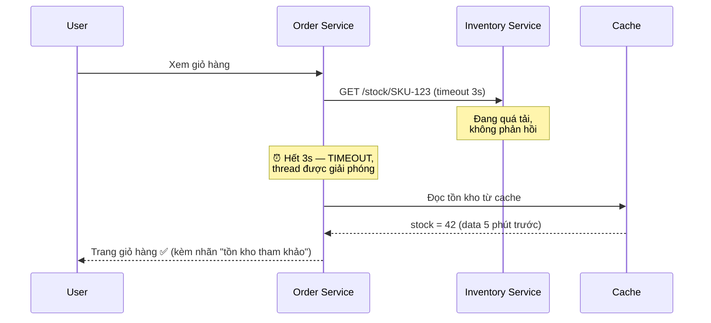
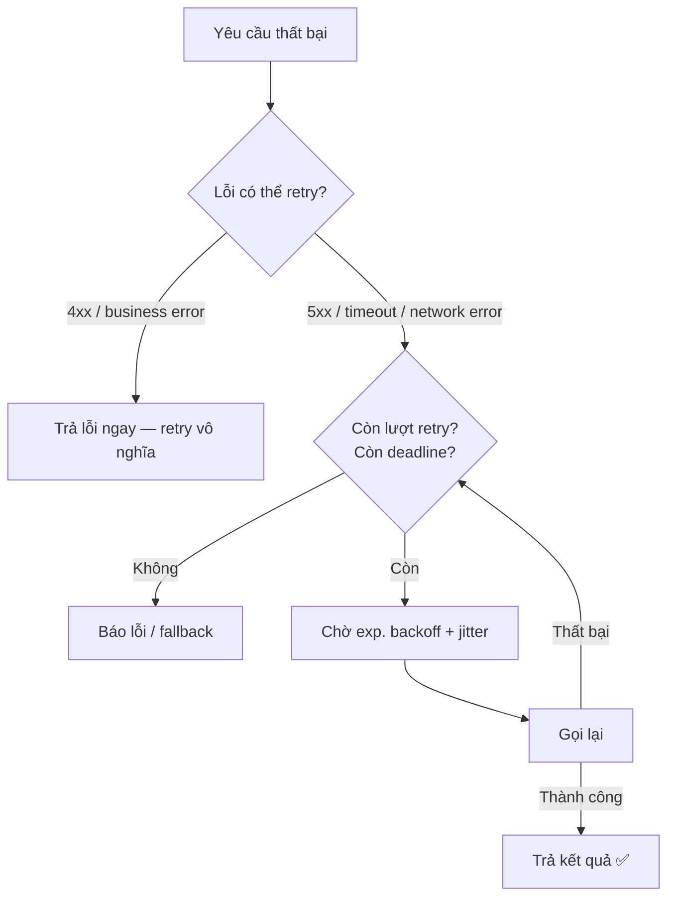
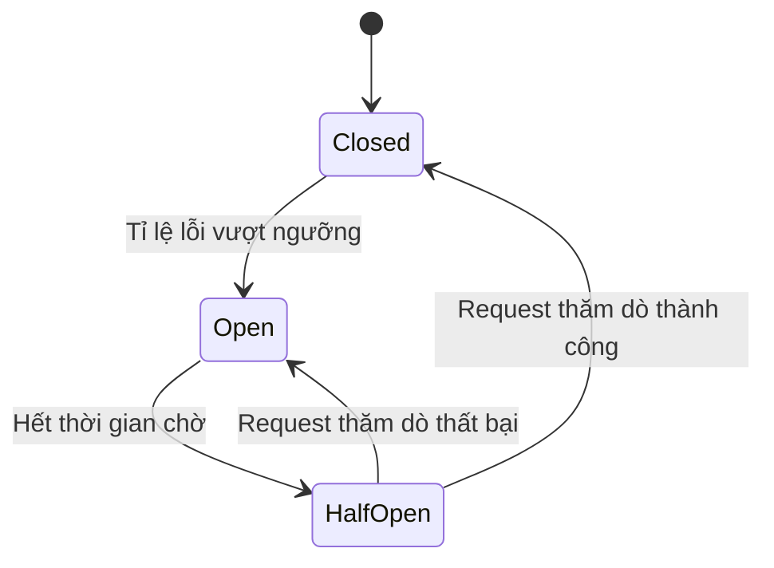
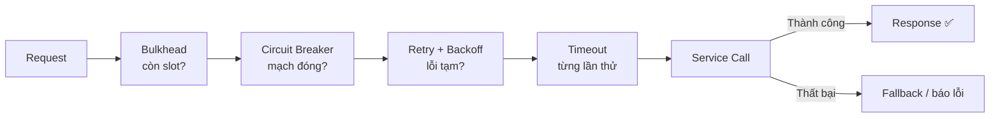

# Reliability Patterns — Đảm bảo độ tin cậy trong Microservice

> 💡 Tài liệu này là **chuyên đề độc lập** về Reliability Patterns, tách và mở rộng từ mục "Reliability Patterns" trong [17 — Design Patterns](17-design-patterns.md). Tài liệu tập trung vào **góc nhìn pattern — quyết định lựa chọn và cách các pattern phối hợp với nhau**; chi tiết cài đặt từng pattern (công thức tính timeout, thuật toán jitter, cấu hình threshold...) xem [10 — Resilience Patterns](10-resilience-patterns.md).

## 📋 Mục lục

- [1. Giới thiệu](#1-giới-thiệu)
  - [1.1. Reliability và Resilience — hai khái niệm dễ nhầm](#11-reliability-và-resilience--hai-khái-niệm-dễ-nhầm)
  - [1.2. Cascading Failure — vì sao một service lỗi kéo sập cả hệ thống](#12-cascading-failure--vì-sao-một-service-lỗi-kéo-sập-cả-hệ-thống)
  - [1.3. Tài liệu này nói gì và không nói gì](#13-tài-liệu-này-nói-gì-và-không-nói-gì)
- [2. Bức tranh toàn cảnh — 5 pattern trụ cột](#2-bức-tranh-toàn-cảnh--5-pattern-trụ-cột)
  - [2.1. Mỗi pattern trả lời câu hỏi gì?](#21-mỗi-pattern-trả-lời-câu-hỏi-gì)
  - [2.2. Bảng so sánh nhanh](#22-bảng-so-sánh-nhanh)
  - [2.3. Bản đồ phòng thủ theo lớp](#23-bản-đồ-phòng-thủ-theo-lớp)
- [3. Timeout — nền tảng của mọi lớp phòng thủ](#3-timeout--nền-tảng-của-mọi-lớp-phòng-thủ)
  - [3.1. Vấn đề cần giải quyết](#31-vấn-đề-cần-giải-quyết)
  - [3.2. Cách hoạt động](#32-cách-hoạt-động)
  - [3.3. Ví dụ thực tế](#33-ví-dụ-thực-tế)
  - [3.4. Khi nào chọn — khi nào không](#34-khi-nào-chọn--khi-nào-không)
  - [3.5. Trade-offs](#35-trade-offs)
  - [3.6. Lỗi thường gặp](#36-lỗi-thường-gặp)
- [4. Retry with Backoff và Jitter — xử lý lỗi tạm thời](#4-retry-with-backoff-và-jitter--xử-lý-lỗi-tạm-thời)
  - [4.1. Vấn đề cần giải quyết](#41-vấn-đề-cần-giải-quyết)
  - [4.2. Cách hoạt động](#42-cách-hoạt-động)
  - [4.3. Ví dụ thực tế](#43-ví-dụ-thực-tế)
  - [4.4. Khi nào chọn — khi nào không](#44-khi-nào-chọn--khi-nào-không)
  - [4.5. Trade-offs](#45-trade-offs)
  - [4.6. Lỗi thường gặp](#46-lỗi-thường-gặp)
- [5. Circuit Breaker — ngắt mạch chống Cascading Failure](#5-circuit-breaker--ngắt-mạch-chống-cascading-failure)
  - [5.1. Vấn đề cần giải quyết](#51-vấn-đề-cần-giải-quyết)
  - [5.2. Cách hoạt động](#52-cách-hoạt-động)
  - [5.3. Ví dụ thực tế](#53-ví-dụ-thực-tế)
  - [5.4. Khi nào chọn — khi nào không](#54-khi-nào-chọn--khi-nào-không)
  - [5.5. Trade-offs](#55-trade-offs)
  - [5.6. Lỗi thường gặp](#56-lỗi-thường-gặp)
- [6. Bulkhead — cô lập tài nguyên](#6-bulkhead--cô-lập-tài-nguyên)
  - [6.1. Vấn đề cần giải quyết](#61-vấn-đề-cần-giải-quyết)
  - [6.2. Cách hoạt động](#62-cách-hoạt-động)
  - [6.3. Ví dụ thực tế](#63-ví-dụ-thực-tế)
  - [6.4. Khi nào chọn — khi nào không](#64-khi-nào-chọn--khi-nào-không)
  - [6.5. Trade-offs](#65-trade-offs)
  - [6.6. Lỗi thường gặp](#66-lỗi-thường-gặp)
- [7. Health Check / Heartbeat — phát hiện sự cố chủ động](#7-health-check--heartbeat--phát-hiện-sự-cố-chủ-động)
  - [7.1. Vấn đề cần giải quyết](#71-vấn-đề-cần-giải-quyết)
  - [7.2. Cách hoạt động](#72-cách-hoạt-động)
  - [7.3. Ví dụ thực tế](#73-ví-dụ-thực-tế)
  - [7.4. Khi nào chọn — khi nào không](#74-khi-nào-chọn--khi-nào-không)
  - [7.5. Trade-offs](#75-trade-offs)
  - [7.6. Lỗi thường gặp](#76-lỗi-thường-gặp)
  - [7.7. Health Check và Circuit Breaker — hai cơ chế phát hiện bổ trợ nhau](#77-health-check-và-circuit-breaker--hai-cơ-chế-phát-hiện-bổ-trợ-nhau)
- [8. Phối hợp các pattern — thứ tự, tương tác và Retry Storm](#8-phối-hợp-các-pattern--thứ-tự-tương-tác-và-retry-storm)
  - [8.1. Thứ tự phối hợp chuẩn](#81-thứ-tự-phối-hợp-chuẩn)
  - [8.2. Circuit Breaker bọc ngoài Retry — quy tắc số 1](#82-circuit-breaker-bọc-ngoài-retry--quy-tắc-số-1)
  - [8.3. Timeout propagation và Deadline budget](#83-timeout-propagation-và-deadline-budget)
  - [8.4. Retry Storm — nguyên nhân và cách tránh](#84-retry-storm--nguyên-nhân-và-cách-tránh)
- [9. Ví dụ tổng hợp — Order Service](#9-ví-dụ-tổng-hợp--order-service)
  - [9.1. Bối cảnh và yêu cầu](#91-bối-cảnh-và-yêu-cầu)
  - [9.2. Quyết định cấu hình cho từng dependency](#92-quyết-định-cấu-hình-cho-từng-dependency)
  - [9.3. Kịch bản sự cố — hệ thống phản ứng thế nào](#93-kịch-bản-sự-cố--hệ-thống-phản-ứng-thế-nào)
- [10. Decision Matrix — chọn và không chọn pattern nào](#10-decision-matrix--chọn-và-không-chọn-pattern-nào)
  - [10.1. Chọn theo tình huống](#101-chọn-theo-tình-huống)
  - [10.2. Khi nào KHÔNG dùng](#102-khi-nào-không-dùng)
  - [10.3. Lộ trình áp dụng từng bước](#103-lộ-trình-áp-dụng-từng-bước)
- [11. Ma trận lỗi thường gặp](#11-ma-trận-lỗi-thường-gặp)
- [12. Checklist](#12-checklist)
- [13. Tổng kết](#13-tổng-kết)
- [14. Liên kết liên quan](#14-liên-kết-liên-quan)

---

## 1. Giới thiệu

Trong hệ thống phân tán, **lỗi không phải ngoại lệ — nó là trạng thái bình thường**. Các giả định sai lầm kinh điển về hệ phân tán (*Eight Fallacies of Distributed Computing*) bắt đầu bằng: *"The network is reliable"* — nhưng thực tế network thì đứt, service thì chậm, instance thì bị kill bất ngờ. Reliability Patterns là bộ công cụ để hệ thống Microservice **vẫn đứng vững khi các thành phần xung quanh hỏng**.

### 1.1. Reliability và Resilience — hai khái niệm dễ nhầm

| Khái niệm | Tiếng Việt | Ý nghĩa | Câu hỏi đặc trưng |
|-----------|-----------|---------|-------------------|
| **Reliability** | Độ tin cậy | Hệ thống thực hiện đúng chức năng, đúng cam kết trong một khoảng thời gian | "Hệ thống sẵn sàng bao nhiêu % thời gian?" |
| **Resilience** | Khả năng chịu lỗi | Hệ thống **tiếp tục hoạt động ở mức chấp nhận được** khi một phần hệ thống gặp sự cố, và tự hồi phục | "Khi Payment Service chết, checkout còn chạy không?" |

Hai khái niệm này liên quan nhau như **mục tiêu và phương tiện**: bạn đạt Reliability (thường đo bằng uptime, error rate, SLO) một phần nhờ xây dựng Resilience. Các pattern trong tài liệu này chính là những "viên gạch" Resilience hướng tới Reliability.

Một số thuật ngữ sẽ dùng xuyên suốt:

| Thuật ngữ | Giải thích |
|-----------|-----------|
| **Transient failure** | Lỗi **tạm thời**, tự hồi phục sau ít lâu (network blip, timeout thoáng qua) — ứng viên cho Retry |
| **Persistent failure** | Lỗi **kéo dài**, không tự hết (service chết, bug deploy hỏng) — ứng viên cho Circuit Breaker + Health Check |
| **Cascading Failure** | **Lỗi lan truyền dây chuyền** — một service hỏng kéo các service gọi nó hỏng theo |
| **Fail fast** | **Thất bại nhanh** — khi biết chắc sẽ lỗi, trả lỗi ngay thay vì chờ đợi lãng phí tài nguyên |
| **Idempotency** | Tính chất "thực hiện nhiều lần vẫn cho cùng kết quả" — điều kiện tiên quyết để Retry an toàn |

### 1.2. Cascading Failure — vì sao một service lỗi kéo sập cả hệ thống

Trong Monolith, một tiến trình lỗi thì cả ứng dụng dừng — đơn giản. Trong Microservice, nguy hiểm hơn: **lỗi lan truyền** qua các cuộc gọi đồng bộ (synchronous calls):

```
┌─────────────────────────────────────────────────────────────┐
│                  CASCADING FAILURE                          │
│                                                             │
│  User ──▶ API Gateway ──▶ Order Service ──▶ Payment ❌ DOWN │
│                             │                               │
│                             ▼                               │
│                    Threads chờ Payment vô hạn              │
│                             │                               │
│                             ▼                               │
│                    Order Service ❌ DOWN                    │
│                             │                               │
│                             ▼                               │
│                    API Gateway ❌ DOWN ──▶ TOÀN HỆ THỐNG SẬP│
└─────────────────────────────────────────────────────────────┘
```

Có 3 con đường chính để lỗi lan truyền — và mỗi pattern trong tài liệu này chặn một con đường:

| Con đường lan truyền | Cơ chế | Pattern chặn đứng |
|----------------------|--------|-------------------|
| **Chờ đợi vô hạn** | Thread/connection bị giữ mãi khi downstream không phản hồi | **Timeout** |
| **Quá tải phản ứng** | Caller retry, gọi liên tục vào service đang quá tải | **Circuit Breaker**, Retry đúng cách |
| **Cạn kiệt tài nguyên dùng chung** | Một dependency "ngốn" hết thread pool / connection pool của caller | **Bulkhead** |

Ngoài ra **Health Check** xử lý bài toán ngược: phát hiện instance đã chết để **ngừng gửi traffic tới nó**.

### 1.3. Tài liệu này nói gì và không nói gì

| Nội dung | Có trong tài liệu này? |
|----------|------------------------|
| Circuit Breaker, Retry with Backoff + Jitter, Bulkhead, Timeout, Health Check / Heartbeat — bản chất, ví dụ, lựa chọn, trade-offs | ✅ Trọng tâm |
| Thứ tự phối hợp các pattern, Retry Storm, timeout budget | ✅ Trọng tâm (mục 8) |
| Công thức tính timeout theo P99, thuật toán jitter chi tiết, cấu hình từng thông số Circuit Breaker | ❌ → [10 — Resilience Patterns](10-resilience-patterns.md) |
| Rate Limiter, Fallback, Load Shedding, Chaos Engineering | ❌ → [10 — Resilience Patterns](10-resilience-patterns.md) |
| Health Check ở tầng Service Discovery (heartbeat TTL, registry...) | ❌ Chi tiết → [08 — Service Discovery](08-service-discovery.md#33-health-check) |
| Probe + Health Endpoint ở tầng observability | ❌ Chi tiết → [11 — Observability](11-observability-evolvability.md#6-health-check--readiness) |

---

## 2. Bức tranh toàn cảnh — 5 pattern trụ cột

### 2.1. Mỗi pattern trả lời câu hỏi gì?

Cách dễ nhất để không nhầm lẫn giữa các pattern: mỗi pattern trả lời **một câu hỏi khác nhau** trong chuỗi gọi từ service A sang service B:

| Pattern | Câu hỏi trả lời |
|---------|-----------------|
| **Timeout** | "Tôi chờ service B tối đa bao lâu thì bỏ cuộc?" |
| **Retry** | "Bỏ cuộc xong, có đáng thử lại không? Thử lại lúc nào?" |
| **Circuit Breaker** | "Có nên **ngừng hẳn** gọi service B khi nó liên tục lỗi?" |
| **Bulkhead** | "Việc gọi service B được phép tiêu **bao nhiêu** tài nguyên của tôi?" |
| **Health Check** | "Service B (hoặc instance nào của nó) còn sống để nhận traffic không?" |

Một cách nhìn khác — **theo trục thời gian của sự cố**:

```
Thời lượng sự cố          Pattern phù hợp
───────────────────────────────────────────────────────────
Milliseconds → giây       Timeout, Retry        (lỗi thoáng qua)
Giây → phút               Circuit Breaker       (lỗi kéo dài)
Phút trở lên              Health Check          (thay instance / re-route)
Mọi lúc                   Bulkhead              (giới hạn thiệt hại tối đa)
```

### 2.2. Bảng so sánh nhanh

| | Timeout | Retry | Circuit Breaker | Bulkhead | Health Check |
|---|---------|-------|-----------------|----------|--------------|
| **Vấn đề** | Chờ vô hạn | Lỗi tạm thời | Lỗi kéo dài | Cạn tài nguyên dùng chung | Instance chết / zombie |
| **Cơ chế** | Hủy call khi quá hạn | Thử lại có khoảng chờ | Ngắt mạch khi lỗi vượt ngưỡng | Chia nhỏ tài nguyên (pool/semaphore) | Endpoint/heartbeat báo trạng thái |
| **Ai được bảo vệ** | **Caller** (giải phóng thread/connection) | Caller (tăng tỉ lệ thành công) | Caller **và** callee (bớt tải khi callee quá tải) | Caller (các nghiệp vụ khác vẫn chạy) | Toàn hệ thống (traffic tránh instance hỏng) |
| **Chi phí chính** | Gần như bằng 0 | Tăng latency + nhân lượng request | Cấu hình nhạy, có thể chặn oan | Chia nhỏ tài nguyên, tốn ops | Overhead kiểm tra định kỳ |
| **Độ phức tạp** | Thấp | Trung bình | Trung bình | Trung bình – cao | Thấp – trung bình |
| **Có thể đứng một mình?** | ✅ Nên có trước tiên | ⚠️ Cần idempotency | ⚠️ Cần fallback đi kèm | ⚠️ Cần sizing hợp lý | ✅ Nên có từ sớm |

### 2.3. Bản đồ phòng thủ theo lớp

```
┌───────────────────────────────────────────────────────────────────────┐
│                        RELIABILITY DEFENSE MAP                        │
│                                                                       │
│  TẦNG PHÁT HIỆN (góc nhìn hạ tầng)                                   │
│  Health Check / Heartbeat ──▶ Discovery / Load Balancer / K8s         │
│        ▲ probe hoặc heartbeat        │ ngừng route tới instance hỏng  │
│        │                              ▼                               │
│  ─────────────────────────────────────────────────────────────────    │
│  TẦNG PHÒNG THỦ CỤC BỘ (bên trong MỖI caller, cho MỖI dependency)    │
│                                                                       │
│  Request ─▶ Bulkhead ─▶ Circuit Breaker ─▶ Retry ─▶ Timeout ─▶ Call  │
│             (còn slot?)   (mạch đóng?)      (lỗi    (chờ quá  │      │
│                                                      tạm?)    lâu?) │
│                                                                       │
│  Sau cùng: Fallback / fail fast khi mọi lớp phòng thủ đã từ chối      │
│  (Fallback chi tiết: xem doc 10)                                     │
└───────────────────────────────────────────────────────────────────────┘
```

> 💡 **Điểm mấu chốt**: các pattern không thay thế nhau mà **xếp lớp**. Mỗi lớp chỉ kích hoạt khi lớp trong hơn không giải quyết được. Phần phối hợp chi tiết ở [mục 8](#8-phối-hợp-các-pattern--thứ-tự-tương-tác-và-retry-storm).

---

## 3. Timeout — nền tảng của mọi lớp phòng thủ

### 3.1. Vấn đề cần giải quyết

**Timeout** (thời gian chờ tối đa) là cam kết: "Nếu service đích không phản hồi trong X ms/giây, tôi **hủy** cuộc gọi và đi tiếp". Không có Timeout, một cuộc gọi có thể chờ **vô hạn** — và mỗi cuộc gọi đang chờ đang giữ một thread, một connection, một ô nhớ:

```
KHÔNG có Timeout:
  Payment Service treo
    → mỗi request tới Payment chiếm 1 thread của Order Service, mãi mãi
    → thread pool (200 threads) đầy sau 200 requests
    → Order Service tê liệt dù code của nó không hề có lỗi ❌

CÓ Timeout (3 giây):
  Payment Service treo
    → mỗi request chỉ giữ thread tối đa 3 giây
    → thread được trả lại, Order Service vẫn phục vụ các request khác ✅
    → lỗi được chuyển sang xử lý (retry / fallback / báo lỗi)
```

⚠️ Lưu ý thực tế đáng ngạc nhiên: **không phải HTTP client nào cũng bật timeout mặc định**. Chẳng hạn `http.DefaultClient` của Go **không có timeout** — nếu bạn không chủ động set, bạn đang để mọi call chờ vô hạn. Luôn kiểm tra default của thư viện mình dùng.

### 3.2. Cách hoạt động

Một cuộc gọi network có **nhiều giai đoạn**, mỗi giai đoạn cần timeout riêng:

| Loại | Áp dụng cho | Ý nghĩa |
|------|-------------|---------|
| **Connection Timeout** | Thiết lập kết nối TCP | Không kết nối nổi trong X giây → hủy (service chết hoặc network đứt) |
| **Read / Response Timeout** | Chờ phản hồi sau khi đã gửi | Hủy nếu không nhận được response kịp hạn |
| **Idle Timeout** | Connection trong pool không hoạt động | Đóng connection "ủ độc" để tránh request rơi vào connection chết |
| **Overall / Request Timeout** | Toàn bộ request, **bao gồm cả các lần retry** | Ngăn tổng thời gian phình to do Retry (xem [8.3](#83-timeout-propagation-và-deadline-budget)) |

Nguyên tắc chọn giá trị:

1. **Dựa trên dữ liệu, không đoán mò**: lấy **P99 latency** (độ trễ mà 99% request nhanh hơn) của dependency, nhân hệ số an toàn ~1.5, cộng thêm network overhead. Công thức chi tiết + ví dụ từng loại service: xem [10 — Resilience Patterns, mục 2.3](10-resilience-patterns.md#23-cách-chọn-giá-trị-timeout).
2. **Timeout phải giảm dần theo chiều sâu gọi**: tầng ngoài ≥ tổng timeout các tầng trong, nếu không tầng trong đang làm việc vô ích vì caller đã bỏ cuộc từ lâu (chi tiết: [8.3](#83-timeout-propagation-và-deadline-budget)).

### 3.3. Ví dụ thực tế

Use case: **Order Service hiển thị trang giỏ hàng cần số tồn kho từ Inventory Service**. Inventory thỉnh thoảng quá tải lúc flash-sale.



Kết quả so sánh:

| | Không có Timeout | Có Timeout + cache fallback |
|---|------------------|----------------------------|
| Khi Inventory quá tải | Thread Order Service bị giữ vô hạn → sập dần | Mỗi request chỉ "mất" đúng 3s |
| Trải nghiệm user | Treo, spinner mãi | Vẫn xem được giỏ hàng, data tồn kho hơi cũ |
| Inventory Service | Càng thêm tải | Được "nghỉ" bớt traffic |

### 3.4. Khi nào chọn — khi nào không

| Tình huống | Khuyến nghị |
|------------|-------------|
| Mọi cuộc gọi network (HTTP, gRPC, DB, cache...) | ✅ **Luôn luôn** set timeout — không có ngoại lệ |
| Gọi hàm in-process / in-memory trong cùng service | ⏭️ Không cần (không chặn trên network) |
| Consumer đọc message từ queue | ⚠️ Timeout có hình thức khác: ack timeout / redelivery limit — xem [09 — Data Management](09-data-management.md) |
| Fire-and-forget (gửi event, không cần phản hồi) | ✅ Vẫn cần **send timeout** — publish vào broker cũng là network call |

Timeout là pattern **rẻ nhất, đơn giản nhất, nên áp dụng đầu tiên** — mọi pattern khác (Retry, Circuit Breaker) đều dựa trên tín hiệu timeout để ra quyết định.

### 3.5. Trade-offs

| Lựa chọn | Được | Mất |
|----------|------|-----|
| Timeout **ngắn** (gần P99) | Phản ứng nhanh, giữ tài nguyên tốt, fail fast | Bỏ cuộc oan các request hợp lệ nhưng chậm → lỗi giả, kích hoạt retry/fallback không cần thiết |
| Timeout **dài** | Ít lỗi giả, khoan dung với GC pause / spike | Thread bị giữ lâu, user chờ lâu, sự cố lan rộng hơn |
| Timeout **cố định cho mọi dependency** | Đơn giản, dễ quản lý | Sai lầm hệ thống: Bank API 5s và User Service 200ms không thể chung một con số |
| **Adaptive timeout** (tự điều chỉnh theo latency thực tế) | Bám sát hành vi thật của dependency | Phức tạp hơn, cần infrastructure đo lường |

### 3.6. Lỗi thường gặp

1. **Tin vào default của thư viện** — nhiều HTTP client/DB driver không có timeout mặc định hoặc default rất dài.
2. **Chỉ set read timeout, quên connection timeout** — request vẫn treo ở bước bắt tay TCP.
3. **Các tầng đặt timeout không ăn khớp** — Client 5s nhưng chuỗi bên trong tổng cộng 20s → các tầng trong làm việc vô ích.
4. **Retry không nằm trong overall budget** — timeout 3s/lần × retry 3 lần = user chờ 9s+ dù SLA chỉ cho 5s (giải pháp: [8.3](#83-timeout-propagation-và-deadline-budget)).
5. **Copy một con số timeout cho mọi dependency** — bỏ qua sự khác biệt latency giữa DB nội bộ, service nội bộ và API bên thứ ba.
6. **Quên timeout cho connection pool checkout** — lấy connection từ pool cũng cần timeout, nếu không "hàng đợi lấy connection" chính là chỗ treo.

---

## 4. Retry with Backoff và Jitter — xử lý lỗi tạm thời

### 4.1. Vấn đề cần giải quyết

Một phần lớn lỗi trong hệ phân tán là **transient** — mạng khựng nửa giây, connection bị reset, service đang rolling update đổi instance. Nếu caller **tự thử lại một cách lịch sự**, rất nhiều request sẽ thành công mà không cần ai can thiệp. **Retry** (thử lại) chuyển lỗi tạm thời thành "trễ một chút" — nhưng chỉ khi làm đúng cách, vì retry làm sai chính là nguyên nhân của [Retry Storm](#84-retry-storm--nguyên-nhân-và-cách-tránh).

### 4.2. Cách hoạt động

Một **Retry Policy** đúng là trả lời được 4 câu hỏi:

| Câu hỏi | Trả lời đúng |
|---------|--------------|
| **Retry lỗi nào?** | Chỉ **transient errors**: 5xx (502/503/504), timeout, connection reset, network unreachable. **Không retry** 4xx (400, 401, 403, 404) — sai input thì thử lại bao nhiêu cũng sai |
| **Thử lại bao nhiêu lần?** | Thường **2–3 lần** là đủ. Không giới hạn = tự sát |
| **Chờ bao lâu giữa các lần?** | **Exponential Backoff** (khoảng chờ nhân đôi dần) + **Jitter** (nhiễu ngẫu nhiên) — xem dưới |
| **Tổng thời gian bỏ ra?** | Toàn bộ chuỗi retry phải nằm trong **overall deadline** của request (xem [8.3](#83-timeout-propagation-và-deadline-budget)) |

**Backoff** (khoảng chờ giãn cách): thay vì retry liên tục ngay lập tức, chờ một khoảng tăng dần — 1s, 2s, 4s... — để service đích có thời gian hồi phục.

**Jitter** (nhiễu ngẫu nhiên): cộng thêm một khoảng **ngẫu nhiên** vào delay. Lý do: khi service lỗi, hàng trăm client cũng timeout **cùng lúc** và sẽ retry **cùng lúc** (hiện tượng **Thundering Herd** — bầy đàn giậm chân), đè chết service đúng lúc nó đang cố hồi phục. Jitter phá tan sự đồng bộ này:

```
KHÔNG có Jitter — retry đồng loạt:
  t=0s    100 clients gọi  → lỗi
  t=1s    100 clients retry lần 1 → vẫn lỗi (vừa bị đập thêm)
  t=2s    100 clients retry lần 2 → service sập hẳn ❌

CÓ Jitter — retry phân tán:
  t=0s        100 clients gọi → lỗi
  t≈0.3–1.3s  ~100 clients retry rải rác → một phần thành công
  t≈1.5–3.5s  phần còn lại retry → service hồi phục dần ✅
```

So sánh các chiến lược delay:

| Chiến lược | Delay các lần | Ưu điểm | Nhược điểm |
|------------|---------------|---------|------------|
| **Immediate** | 0, 0, 0... | Nhanh nhất khi lỗi thật sự thoáng qua | Đập thêm tải vào service đang khó chịu |
| **Fixed** | 1s, 1s, 1s... | Đơn giản | Vẫn đồng loạt (thundering herd) |
| **Exponential Backoff** | 1s, 2s, 4s... | Nhẹ dần cho service | Các client vẫn retry **cùng nhịp** với nhau |
| **Exp. Backoff + Jitter** ✅ | random quanh 1s, 2s, 4s... | Phân tán đều, khuyến nghị | Nhỉnh hơn một chút khi cài đặt |

> 📖 Các biến thể jitter (Full / Equal / Decorrelated) và bảng ví dụ số: xem [10 — Resilience Patterns, mục 3.3](10-resilience-patterns.md#33-exponential-backoff-với-jitter).

**Điều kiện tiên quyết — Idempotency**: Retry chỉ an toàn khi operation là **idempotent** (chạy nhiều lần cho cùng kết quả). `GET`, `PUT`, `DELETE` thường idempotent; `POST /payments` thì **không** — retry trúng lúc response bị mất có thể **trừ tiền hai lần**. Giải pháp chuẩn là **Idempotency Key**: client gửi kèm một key duy nhất, server nhận ra key trùng thì trả kết quả cũ thay vì xử lý lại. Chi tiết: [10 — Resilience Patterns, mục 3.4](10-resilience-patterns.md#34-idempotency--điều-kiện-tiên-quyết).

### 4.3. Ví dụ thực tế

Use case: **mobile app đồng bộ giỏ hàng lên Order Service qua mạng 4G yếu** — lỗi mạng thoáng qua rất phổ biến.



Timeline cụ thể (base delay 1s, full jitter, max 3 retries, deadline 10s):

```
t=0.0s   Gọi lần 1        → ❌ connection reset (lỗi mạng thoáng qua)
t=0.6s   Retry 1 (jitter) → ❌ timeout 1s
t=2.1s   Retry 2 (jitter) → ❌ 503 (service đang khởi động lại instance)
t=4.4s   Retry 3 (jitter) → ✅ 200 OK

→ User chỉ thấy request "chậm 4.4 giây" thay vì thấy lỗi ❌
→ Nếu lần 3 vẫn lỗi → dừng hẳn, không retry lần 4
```

### 4.4. Khi nào chọn — khi nào không

| Nên dùng Retry khi... | KHÔNG nên retry khi... |
|------------------------|------------------------|
| Lỗi là **transient** (5xx, timeout, mạng) | Lỗi **permanent** (4xx, validation, business error) |
| Operation **idempotent** hoặc có Idempotency Key | Non-idempotent mà không kiểm soát được trùng lặp (trừ tiền, tạo đơn...) |
| Caller **còn deadline** để dành cho retry | Đường critical path có SLA latency gắt (vd API đồng bộ < 1s) |
| Retry **có giới hạn và có jitter** | Chuỗi gọi nhiều tầng mà **mọi tầng đều retry** (→ Retry Storm, xem [8.4](#84-retry-storm--nguyên-nhân-và-cách-tránh)) |
| Dependency có dư địa hồi phục khi gặp lỗi nhẹ | Dependency đang quá tải nghiêm trọng — khi đó nên **backoff hẳn** (Circuit Breaker) thay vì thử thêm |

### 4.5. Trade-offs

| Được | Mất |
|------|-----|
| Tự chữa lỗi tạm thời → tăng availability, giảm ticket sự cố | **Tăng tail latency** (P99) — request xui phải chờ qua chuỗi backoff |
| Che đi nhiễu mạng thường xuyên cho user | **Nhân tải cho downstream** khi có sự cố — retry "chưa đúng lúc" làm sự cố tệ hơn |
| Cơ chế đơn giản, hầu hết thư viện có sẵn | Có thể **che giấu vấn đề gốc**: lỗi lặp lại liên tục trông như "bình thường" nếu ai đó bật retry mà không monitor |
| Kết hợp tốt với Circuit Breaker (xem [8.2](#82-circuit-breaker-bọc-ngoài-retry--quy-tắc-số-1)) | Chi phí **idempotency** phải xử lý thêm phía server |

### 4.6. Lỗi thường gặp

1. **Retry lỗi 4xx** — retry đăng nhập sai mật khẩu, payload invalid... chỉ thêm tải, không bao giờ thành công.
2. **Không có jitter** — hàng nghìn client retry đồng nhịp, đè chết service đúng lúc nó hồi phục (thundering herd).
3. **Retry ở mọi tầng của chuỗi gọi** — tải nhân theo cấp số nhân (Retry Storm, mục [8.4](#84-retry-storm--nguyên-nhân-và-cách-tránh)).
4. **Retry non-idempotent operation** không có Idempotency Key → thanh toán/đặt hàng trùng.
5. **Không retry budget / không giới hạn tổng quãng thời gian** — chuỗi retry dài hơn cả SLA của user request.
6. **Bỏ qua header `Retry-After`** — khi server trả 429/503 kèm `Retry-After: 30`, client nên tôn trọng thay vì tự tính backoff.
7. **Không quan sát kết quả retry** — không có metric retry success/failure → không biết retry đang cứu hệ thống hay đang âm thầm làm hại.

---

## 5. Circuit Breaker — ngắt mạch chống Cascading Failure

### 5.1. Vấn đề cần giải quyết

Retry trả lời "thử lại một chút". Nhưng khi dependency lỗi **kéo dài** (deploy hỏng, DB chết, quá tải nghiêm trọng), retry chỉ làm tình hình tệ hơn. Tệ hơn nữa: **mỗi cuộc gọi thất bại vẫn tốn tài nguyên của caller** (chờ hết timeout mới biết lỗi). Với 1.000 RPS và timeout 3s, caller vẫn đốt 3.000 giây-tài nguyên mỗi giây cho một service đã chết.

**Circuit Breaker** (bộ ngắt mạch — tên lấy từ cầu dao điện) trả lời câu hỏi ngược: *"Khi nào nên NGỪNG gọi hẳn, và thử lại từ bao giờ?"*. Logic: theo dõi tỉ lệ lỗi của dependency; khi lỗi vượt ngưỡng → **mở mạch** — mọi request bị từ chối **ngay lập tức** (fail fast) mà không tốn network call; định kỳ cho một vài request "thăm dò" qua để biết khi nào dependency hồi phục.

### 5.2. Cách hoạt động



| Trạng thái | Hành vi | Chuyển tiếp |
|------------|---------|-------------|
| 🟢 **CLOSED** (mạch đóng) | Request đi bình thường; đếm success/failure trong sliding window | Sang **OPEN** khi tỉ lệ lỗi vượt ngưỡng |
| 🔴 **OPEN** (mạch mở) | **Từ chối mọi request ngay lập tức** (< 1ms), trả fallback/lỗi — không tốn network | Sang **HALF-OPEN** sau thời gian chờ (vd 30–60s) |
| 🟡 **HALF-OPEN** (mạch hở) | Cho **một số ít** request thăm dò đi qua | Sang **CLOSED** nếu thăm dò thành công; ngược lại về **OPEN** |

Các thông số chính (failure rate threshold, minimum calls, sliding window, slow-call rate...) và giá trị khởi điểm: xem [10 — Resilience Patterns, mục 4.4](10-resilience-patterns.md#44-cấu-hình-circuit-breaker). Đáng chú ý: Circuit Breaker hiện đại không chỉ đếm **lỗi**, mà cả **chậm** — nếu gần như mọi call đều chậm quá ngưỡng (slow call rate cao), mạch cũng nên mở, vì "chậm đến mức vô dụng" cũng là một dạng thất bại.

### 5.3. Ví dụ thực tế

Use case: **Payment Service gọi Bank API bên thứ ba** — nằm ngoài tầm kiểm soát của team bạn.

```
t=0s    🟢 CLOSED — Bank API ổn: 200ms/call, tỉ lệ lỗi ~0%
t=10s   Bank API bắt đầu lỗi: timeout, timeout, 500...
        Sliding window: 5/6 call thất bại = 83% > ngưỡng 50%
t=30s   🔴 OPEN — mọi request tới Bank bị reject trong < 1ms
        → Payment Service trả "payment pending, sẽ xử lý sau"
        → tự động đưa payment vào queue xử lý khi mạch đóng lại
t=90s   🟡 HALF-OPEN — cho 3 request thăm dò qua
        → 3/3 thành công, Bank đã hồi phục
t=91s   🟢 CLOSED — traffic trở lại bình thường
```

Điểm quan trọng: trong 60 giây mạch mở, caller **không tốn một network call nào** cho Bank API — so với kịch bản không có CB: hàng nghìn call chờ timeout 5s, thread pool cạn, Payment Service chết theo Bank. Chi tiết timeline đầy đủ: [10 — Resilience Patterns, mục 4.5](10-resilience-patterns.md#45-ví-dụ-thực-tế--payment-service-gọi-bank-api).

### 5.4. Khi nào chọn — khi nào không

| Nên dùng Circuit Breaker khi... | KHÔNG nên dùng khi... |
|----------------------------------|------------------------|
| Dependency **remote** trong đường gọi đồng bộ (HTTP/gRPC/DB) | Gọi in-process / in-memory — không có "mạch" để ngắt |
| Dependency từng có lịch sử ngừng phục vụ kéo dài (deploy, bên thứ 3) | Dependency hỏng **tức thời, tự hồi phục trong tích tắc** — Retry là đủ, CB chỉ thêm phức tạp |
| Caller có **phương án** khi mạch mở: fallback, queue, degraded mode | Không có fallback nào → user vẫn thấy lỗi, CB chỉ đổi loại lỗi họ thấy |
| Muốn bảo vệ **cả hai phía**: caller khỏi treo, callee khỏi bị dập thêm khi đang yếu | Dùng CB **thay thế** Health Check — hai cái phát hiện hai loại vấn đề khác nhau (xem [7.7](#77-health-check-và-circuit-breaker--hai-cơ-chế-phát-hiện-bổ-trợ-nhau)) |
| Chuỗi gọi dài (A→B→C), cần chặn lỗi lan truyền ngược về A | CB cho **mọi dependency không phân biệt** — chỉ cần thiết cho dependency thực sự quan trọng/chuẩn yếm |

### 5.5. Trade-offs

| Được | Mất |
|------|-----|
| Fail fast: không tốn tài nguyên chờ một service đã chết | **Chặn oan (false positive)**: threshold quá nhạy → mạch mở khi service chỉ trầy xước nhẹ |
| Bảo vệ callee khỏi thêm tải khi đang hồi phục | Cấu hình **nhạy cảm với traffic pattern**: ngưỡng hợp lý lúc 10 RPS có thể sai lúc 1.000 RPS |
| Tự động "half-open" thăm dò → tự hồi phục không cần con người | **Half-open spike**: khi mạch vừa đóng, một đống traffic dồn vào có thể đánh ngã service lần nữa |
| Trạng thái mạch là tín hiệu tuyệt vời cho monitoring/alerting | State phân tán: mỗi instance của caller giữ CB riêng → tổng traffic thăm dò nhân theo số instance; còn nếu chia sẻ state qua Redis thì thêm một dependency nữa |
| Cuộc gọi bị từ chối có thể chuyển sang **async queue** xử lý sau | Người dùng thấy lỗi **sớm hơn, cứng hơn** — cần thiết kế UX cho tình huống mạch mở |

### 5.6. Lỗi thường gặp

1. **Mở mạch mà không có fallback** — Circuit Breaker biến "lỗi chậm" thành "lỗi nhanh", nhưng user vẫn thấy lỗi. CB phát huy sức mạnh khi đi kèm fallback/degraded mode (xem [10](10-resilience-patterns.md#71-fallback-là-gì)).
2. **Một CB dùng chung cho nhiều dependency** — Bank API chết lại kéo mạch chặn cả Email API. CB phải **mỗi cặp caller–dependency một cái**.
3. **Không monitor trạng thái CB** — mạch mở chính là incident đang diễn ra; không dashboard/alert cho CB state là mù bão.
4. **Threshold + minimum calls lệch nhau** — minimum calls quá thấp (vd 5) khiến 3 lỗi đầu tiên của buổi sáng đã mở mạch.
5. **Half-open cho quá nhiều request thăm dò qua** — mất tác dụng "nhỏ giọt" của half-open.
6. **Quên rằng CB đếm cả slow call** hoặc ngược lại chỉ đếm error — cấu hình slow-call threshold sai khiến service "chậm chết" không bao giờ mở mạch.

---

## 6. Bulkhead — cô lập tài nguyên

### 6.1. Vấn đề cần giải quyết

Tên pattern lấy từ **vách ngăn chống chìm của tàu thủy** (bulkhead = vách ngăn): thân tàu được chia thành các khoang kín nước — một khoang thủng, nước chỉ ngập khoang đó, tàu vẫn nổi.

Trong Microservice, vấn đề tương tự: các dependency **dùng chung một kho tài nguyên** của caller (thread pool, connection pool). Một dependency chậm sẽ **rút cạn kho chung**, khiến các dependency khỏe cũng bị "ngập" theo:

```
KHÔNG có Bulkhead — Order Service dùng chung 200 threads:
  ├── Payment Service chậm (30s/call) ──▶ chiếm 190 threads
  ├── Inventory Service (nhanh)        ──▶ không còn thread để gọi ❌
  └── Notification Service (nhanh)     ──▶ không còn thread để gọi ❌
  → Toàn bộ Order Service tê liệt vì MỘT dependency chậm

CÓ Bulkhead — chia kho riêng cho từng dependency:
  ├── Payment Pool:      max 100 threads → Payment chậm chỉ đầy pool này
  ├── Inventory Pool:    max 60 threads  → vẫn chạy ✅
  └── Notification Pool: max 40 threads  → vẫn chạy ✅
  → Chỉ tính năng thanh toán bị ảnh hưởng, phần còn lại của service sống
```

Điểm khác biệt với Timeout/CB: hai pattern kia xử lý **một cuộc gọi** (chờ bao lâu, thử lại bao nhiêu, chặn lúc nào); Bulkhead xử lý **phân bổ tài nguyên** — giới hạn **mức tối đa thiệt hại**.

### 6.2. Cách hoạt động

Bulkhead không chỉ là "chia thread pool" — bất kỳ tài nguyên nào cũng cô lập được:

| Mức cô lập | Cách làm | Ví dụ |
|------------|----------|-------|
| **Thread Pool** | Mỗi dependency một pool riêng | Payment pool 100 threads, Inventory pool 60 threads |
| **Connection Pool** | Mỗi DB/service một connection pool riêng | Order DB 20 conn, Product DB 10 conn |
| **Semaphore** | Giới hạn số concurrent calls bằng counter (không tạo thread riêng) | Tối đa 50 request đồng thời tới Payment |
| **Container / Pod** | Tách process, đặt resource limits riêng | Pod Payment có CPU/RAM limit riêng — không "ăn" node của Pod Order |
| **Cluster / Region** | Tách hạ tầng cho nhóm service quan trọng | Payment chạy cluster riêng, không chung với batch jobs |

Hai cách cài đặt phổ biến nhất trong ứng dụng:

| | Thread Pool Bulkhead | Semaphore Bulkhead |
|---|----------------------|--------------------|
| Cách hoạt động | Mỗi dependency một thread pool thật | Dùng chung thread pool của caller, chỉ **đếm** số lượng concurrent |
| Mức cô lập | Hoàn toàn (task chờ/block không lan sang pool khác) | Một phần (vẫn dùng chung thread) |
| Overhead | Cao hơn (nhiều thread, context switch) | Thấp |
| Phù hợp | Blocking I/O (HTTP client blocking, JDBC) | Non-blocking / async stack |

> 📖 Chi tiết so sánh và khi nào chọn loại nào: [10 — Resilience Patterns, mục 5.3](10-resilience-patterns.md#53-các-loại-bulkhead).

### 6.3. Ví dụ thực tế

Use case: **Order Service gọi 3 dependency với mức độ quan trọng khác nhau**:

```
┌────────────────────────────────────────────────────────────┐
│                     ORDER SERVICE                          │
│                                                            │
│   Request handler (200 threads)                           │
│        │                                                   │
│   ┌────┴─────────┬──────────────┬───────────────┐          │
│   ▼              ▼              ▼               ▼          │
│ ┌──────────┐ ┌──────────┐ ┌──────────┐ ┌──────────────┐    │
│ │ Payment  │ │Inventory│ │ Shipping │ │ Notification │    │
│ │ pool     │ │ pool    │ │ pool     │ │ pool         │    │
│ │ 100 thrd │ │ 60 thrd │ │ 40 thrd  │ │ 20 thrd      │    │
│ │ CRITICAL │ │ CRITICAL│ │ MEDIUM   │ │ LOW          │    │
│ └────┬─────┘ └────┬─────┘ └────┬─────┘ └──────┬───────┘    │
│      ▼            ▼           ▼               ▼            │
│  Payment Svc  Inventory Svc  Shipping Svc  Notif Svc       │
└────────────────────────────────────────────────────────────┘

Sự cố: Payment Service chậm 30s/call
→ Payment pool đầy → request thanh toán bị từ chối/treo trong pool
→ Inventory (60), Shipping (40), Notif (20) pool không hề hấn gì
→ User vẫn xem hàng, thêm giỏ hàng, nhận mail — chỉ checkout bị chặn
```

Và một ví dụ Bulkhead ở tầng hạ tầng (Kubernetes) — cô lập bằng resource limits:

```yaml
apiVersion: v1
kind: Pod
metadata:
  name: payment-service
spec:
  containers:
    - name: payment
      image: myapp/payment:v2.1
      resources:
        requests: { cpu: "250m", memory: "256Mi" }
        limits:   { cpu: "500m", memory: "512Mi" }
# → Payment memory leak thì chỉ Pod Payment bị OOMKill,
#   không kéo sập cả node cùng các Pod khác chạy chung
```

### 6.4. Khi nào chọn — khi nào không

| Nên dùng Bulkhead khi... | Không cần / không đáng khi... |
|--------------------------|-------------------------------|
| Service gọi **nhiều dependency có criticality khác nhau** (quan trọng + không quan trọng trộn lẫn) | Service chỉ có 1–2 dependency, traffic nhỏ — chia nhỏ tài nguyên chỉ thêm phức tạp |
| Từng thấy sự cố "một dependency chậm → tê liệt toàn service" | Đã cô lập ở tầng khác (pod/cluster riêng với resource limits) và caller là async non-blocking |
| Muốn **phân bổ ưu tiên**: nghiệp vụ quan trọng luôn có tài nguyên dự trữ | Tài nguyên dư dả thái quá so với load — bulkhead gần như không bao giờ chạm ngưỡng |
| Caller chạy blocking I/O, thread pool là tài nguyên khan hiếm | Không đo được concurrency thật của dependency → sizing bulkhead bằng phỏng đoán |

### 6.5. Trade-offs

| Được | Mất |
|------|-----|
| Thiệt hại bị giới hạn trong một "khoang" — các chức năng khác vẫn sống | **Chia nhỏ tài nguyên**: tổng capacity phải chia ra, lúc rảnh các pool không "mượn" được nhau → hiệu suất tối đa thấp hơn dùng chung |
| Chủ động **từ chối sớm** (pool đầy = tín hiệu rõ ràng để load shed/fallback) | **Sizing khó**: pool to = phí tài nguyên, pool nhỏ = từ chối oan lúc cao điểm; cần đo concurrency thực tế |
| Kết hợp tự nhiên với Circuit Breaker (pool đầy + tỉ lệ lỗi cao → hai tín hiệu bổ trợ) | Thêm cấu hình, thêm thông số phải vận hành và giám sát |
| Áp dụng được ở nhiều tầng (app → container → cluster) | Bulkhead sai tầng (chia thread pool nhưng dùng chung connection) vẫn để lọt nước vào "khoang kề" |

### 6.6. Lỗi thường gặp

1. **Tưởng đã bulkhead nhưng pool vẫn dùng chung** — chia thread pool mà quên chia connection pool; kết quả: connection pool tới DB vẫn là "khoang hở".
2. **Bulkhead không đi kèm timeout** — request vào pool rồi chờ vô hạn trong pool = khoang kín nhưng khoang đó vẫn rút cạn vĩnh viễn.
3. **Pool sizing không dựa trên đo lường** — chọn con số đẹp (50, 100) thay vì P95/P99 concurrency thật của từng dependency.
4. **Không giám sát saturation** — không có metric "pool đầy bao nhiêu %" thì không bao giờ biết bulkhead đang từ chối oan hay đang cứu hệ thống.
5. **Cô lập tất cả như nhau** — dependency LOW priority nên có pool nhỏ/nông hơn; coi trọng tất cả đồng đều là không cô lập gì cả.
6. **Quên hành vi khi pool đầy** — request bị từ chối sẽ đi đâu? Cần định nghĩa rõ: fallback, trả 429/503, hay queue.

---

## 7. Health Check / Heartbeat — phát hiện sự cố chủ động

### 7.1. Vấn đề cần giải quyết

Các pattern trên xử lý "service **trả lời tệ**". Health Check xử lý trường hợp khác: **instance đã chết hoặc "zombie"** (process còn chạy nhưng không phục vụ được). Nếu hạ tầng không biết instance hỏng, Load Balancer vẫn route traffic vào nó → user ngẫu nhiên bị lỗi, không đều, khó debug. Health Check / Heartbeat là **hệ thống phát hiện sự cố chủ động**: định kỳ xác nhận "instance này còn phục vụ được không", để hệ thống tự loại instance hỏng khỏi vòng quay.

### 7.2. Cách hoạt động

Hai mô hình phát hiện, hai hướng Initiator:

| | **Heartbeat** (push) | **Active Health Check** (pull) |
|---|----------------------|-------------------------------|
| Ai chủ động | Service **tự báo** "tôi còn sống" cho registry định kỳ (vd mỗi 30s) | Registry/LB **chủ động gọi** health endpoint của service (vd mỗi 10s) |
| Phát hiện chết khi nào | Hết TTL mà không nhận được heartbeat (vd 90s) | Response lỗi / timeout / HTTP != 200 |
| Điểm mạnh | Đơn giản, service tự quản lý vòng đời | Kiểm tra được **chất lượng phục vụ thật** (gọi được DB không, response trong bao lâu) |
| Điểm yếu | "Còn sống" ≠ "phục vụ được" — process có thể gửi heartbeat trong khi request lỗi hết | Tạo tải nhỏ nhưng đều đặn lên mọi instance |
| Ví dụ điển hình | Eureka heartbeat; Consul ephemeral node | Consul HTTP check; K8s probe; ALB target group check |

Chi tiết hai mô hình trong ngữ cảnh Service Discovery: xem [08 — Service Discovery, mục 3.3](08-service-discovery.md#33-health-check).

Với orchestrator như Kubernetes, health check được chuẩn hóa thành 3 loại **probe**, mỗi loại trả lời một câu hỏi và có **hành động khác nhau khi thất bại**:

| Probe | Câu hỏi | Khi FAIL thì xảy ra gì |
|-------|---------|------------------------|
| **Liveness** | Process còn "sống" không (không deadlock, không treo)? | Kubelet **restart container** |
| **Readiness** | Instance **sẵn sàng nhận traffic** chưa (load xong config, connect được DB)? | Pod bị **rút khỏi Endpoints** của Service — không nhận traffic, nhưng **không restart** |
| **Startup** | App khởi động xong chưa (dành cho app boot chậm)? | Chặn hai probe kia chạy cho đến khi thành công — tránh restart oan lúc đang boot |

> 💡 **Nguyên tắc thực hành quan trọng**: Liveness chỉ nên kiểm tra **bản thân process** (health nhẹ, ít dependency). Readiness mới là chỗ kiểm tra dependency cần thiết để phục vụ (DB, cache, downstream). Nếu liveness phụ thuộc vào DB — khi DB chậm 30s, **toàn bộ Pod của bạn bị restart đồng loạt** (restart storm), biến một sự cố đơn lẻ thành thảm họa.

### 7.3. Ví dụ thực tế

Endpoint readiness tổng hợp trạng thái các dependency:

```json
// GET /health/ready → 200 khi tất cả UP, 503 khi có DOWN
{
  "status": "DEGRADED",
  "checks": {
    "database":        { "status": "UP",        "latency": "12ms" },
    "redis":           { "status": "UP",        "latency": "3ms" },
    "payment-service": { "status": "DEGRADED",  "latency": "2500ms" }
  },
  "version": "1.4.2",
  "uptime": "72h 15m"
}
```

Cấu hình probe tương ứng trên Kubernetes:

```yaml
# Pod của Order Service
livenessProbe:            # trả lời: process sống không?
  httpGet: { path: /health/live, port: 8080 }
  periodSeconds: 10
  failureThreshold: 3     # 3 lần liên tiếp fail → restart container

readinessProbe:           # trả lời: nhận traffic được không?
  httpGet: { path: /health/ready, port: 8080 }
  periodSeconds: 5
  failureThreshold: 2     # fail → rút khỏi Service endpoints (KHÔNG restart)

startupProbe:             # trả lời: boot xong chưa?
  httpGet: { path: /health/startup, port: 8080 }
  periodSeconds: 5
  failureThreshold: 30    # cho phép tối đa 150s để khởi động
```

Vòng phản hồi khi một instance hỏng:

```
Instance #3 của Payment Service rơi vào trạng thái treo
   │
   ▼ readiness probe fail (2 lần)
K8s rút instance #3 khỏi Service Endpoints
   │
   ▼
Traffic chỉ còn vào instance #1, #2 (healthy)
   │
   ▼ liveness probe fail (3 lần) — process thật sự treo
Kubelet restart container #3
   │
   ▼ startup + readiness pass
Instance #3 quay lại Endpoints, nhận traffic lại
→ Toàn bộ tự động, không ai phải vào can thiệp lúc 3h sáng
```

> 📖 Thiết kế health endpoint chi tiết hơn (nên check gì, không nên check gì): [11 — Observability, mục 6.2](11-observability-evolvability.md#62-health-check-endpoint-design).

### 7.4. Khi nào chọn — khi nào không

| Tình huống | Khuyến nghị |
|------------|-------------|
| Chạy trên orchestrator (Kubernetes, ECS, Nomad...) hoặc sau LB | ✅ **Bắt buộc** — không có probe/check thì orchestrator mù về sức khỏe instance |
| Chọn heartbeat vs active check | Theo registry đang dùng: Eureka hướng heartbeat, Consul hướng active check, K8s hướng probe — xem [08](08-service-discovery.md#33-health-check) |
| Health "nông" (process + event loop) vs "sâu" (kiểm cả DB, downstream) | Liveness → nông. Readiness → sâu vừa đủ cho việc phục vụ request |
| Đang ở môi trường dev/prototype | Có thể hoãn — nhưng health endpoint thường là ít dòng code nhất trong toàn bộ tài liệu này, cứ làm từ sớm |
| Dùng health check **thay** circuit breaker | ❌ Không thay được — xem [7.7](#77-health-check-và-circuit-breaker--hai-cơ-chế-phát-hiện-bổ-trợ-nhau) |

### 7.5. Trade-offs

| Được | Mất |
|------|-----|
| Tự động loại instance hỏng khỏi traffic — giảm lỗi "ngẫu nhiên" cho user | **Thời gian phát hiện vs chi phí**: check dày (5s) phát hiện nhanh nhưng tốn tải; check thưa (60s) rẻ nhưng traffic vẫn đổ vào instance chết thêm nhiều giây |
| Rolling update / scale an toàn: instance chưa sẵn sàng không nhận traffic | **Health check nặng trở thành gánh nặng**: 50 instances × mỗi instance probe dependency mỗi 5s = chính là một cơn mưa request vào DB |
| Là nền cho auto-scaling, self-healing, zero-downtime deploy | **Deep check tạo coupling**: health endpoint gọi DB/dependency → dependency chậm làm readiness fail hàng loạt → dịch vụ tự rút mình khỏi LB (tự gây outage) |
| Cần zombie detection: process sống mà không phục vụ | Liveness sai thiết kế (check dependency sâu) → restart storm |

### 7.6. Lỗi thường gặp

1. **Liveness check dependency sâu** → DB chậm 30s, cả cụm Pod restart đồng loạt, nhận định sai nguyên nhân sự cố.
2. **Chỉ có liveness, không có readiness** → deploy bản mới, traffic đổ vào Pod chưa load xong → lỗi cho user ngay lúc rollout.
3. **Health endpoint luôn trả 200 cứng** ("zombie friendly") → process treo vẫn "healthy", traffic vẫn đổ vào.
4. **Health check gọi thẳng DB mỗi lần probe** mà không cache kết quả vài giây — biến health check thành DDoS nhẹ lên chính dependency của mình.
5. **Failure threshold / period quá khắc nghiệt** — 1 lần fail là rút khỏi LB; service GC pause 2s cũng đủ sảy chân.
6. **Không phân biệt exit code / HTTP code** — health trả 200 kèm body `{"status": "DOWN"}` mà checker chỉ nhìn status code → phát hiện muộn.

### 7.7. Health Check và Circuit Breaker — hai cơ chế phát hiện bổ trợ nhau

Đây là cặp dễ bị nhầm là thay thế nhau. Chúng phát hiện **hai loại vấn đề khác nhau, ở hai tầng khác nhau**:

| | **Circuit Breaker** | **Health Check / Heartbeat** |
|---|---------------------|------------------------------|
| Ai phát hiện | **Caller** — từ trải nghiệm gọi thật của mình | **Hạ tầng** (LB, orchestrator, registry) — từ probe định kỳ |
| Phát hiện gì | Dependency **trả lời tệ** (lỗi nhiều, chậm nhiều) — kể cả khi mọi instance vẫn "sống" | Instance **không phục vụ được** (chết, zombie, chưa sẵn sàng) |
| Hành động | Caller fail fast, không gửi request (per caller–dependency) | Hạ tầng ngừng route traffic tới instance hỏng (mọi caller) |
| Phạm vi | Mỗi cặp caller → dependency một CB | Mỗi instance một trạng thái |
| Ví dụ bắt được | "Payment deploy bản mới, 80% request timeout nhưng process vẫn chạy" | "Pod Payment OOMKill, process không còn" |

Ví dụ cho thấy cần cả hai: Payment Service deploy một bản có memory leak nhẹ — process vẫn sống, health check vẫn xanh ✅, nhưng latency tăng dần và lỗi tăng dần. Circuit Breaker của Order Service **bắt được** tình huống này (tỉ lệ lỗi/slow-call tăng), health check thì không. Ngược lại: Pod chết hẳn — CB của caller sẽ mở sau vài call thất bại, nhưng chính health check mới **loại hẳn instance chết** khỏi Endpoints và kích hoạt restart, healed tận gốc.

---

## 8. Phối hợp các pattern — thứ tự, tương tác và Retry Storm

### 8.1. Thứ tự phối hợp chuẩn

Các pattern không hoạt động rời rạc — chúng tạo thành **một chuỗi phòng thủ** trong caller, và **thứ tự trong chuỗi quyết định tính đúng đắn**:



Lý do của từng vị trí:

| Vị trí | Pattern | Vì sao ở đó |
|--------|---------|-------------|
| 1 | **Bulkhead** | Trước khi tiêu **bất kỳ** tài nguyên nào: hết slot cho dependency này → từ chối ngay, không thông qua các lớp sau (một request "đáng ngờ" không đáng để tiêu một thread) |
| 2 | **Circuit Breaker** | Mạch mở → fail fast **ngay lập tức**, không tốn một lần retry nào vào mạch đang mở (retry khi mạch OPEN là vô nghĩa — xem 8.2) |
| 3 | **Retry** | Chỉ chạy khi CB xác nhận "mạch còn đóng" — chỉ retry những lỗi thoáng qua, với backoff + jitter |
| 4 | **Timeout** | Bọc **mỗi lần thử** (per-try timeout) — không để một lần thử chờ vô hạn |
| 5 | **Fallback** | Khi mọi lớp đã từ chối/bỏ cuộc — trả phương án dự phòng thay vì lỗi trần |

> 💡 Tầng ngoài cùng có thể thêm **Rate Limiter** (giới hạn tần suất vào hệ thống) — nằm ngoài phạm vi tài liệu này, xem [10 — Resilience Patterns, mục 6.2](10-resilience-patterns.md#62-các-thuật-toán-rate-limiting).

### 8.2. Circuit Breaker bọc ngoài Retry — quy tắc số 1

Đây là quy tắc phối hợp **phạm phải nhiều nhất**: Retry phải nằm **bên trong** Circuit Breaker (CB bọc ngoài), không phải ngược lại.

```
❌ SAI — Retry bọc ngoài Circuit Breaker:
  Request
   └─ Retry lần 1 ─▶ CB ghi nhận 1 failure
   └─ Retry lần 2 ─▶ CB ghi nhận thêm 1 failure
   └─ Retry lần 3 ─▶ CB ghi nhận thêm 1 failure
  → MỘT request thật bị CB đếm thành 3 failures!
  → Tỉ lệ lỗi bị thổi phồng → mạch mở SỚM và OAN
  → Request khác bị reject dù service chưa thực sự tệ

✅ ĐÚNG — Circuit Breaker bọc ngoài Retry:
  Request ─▶ CB (mạch đóng, cho qua)
              └─ Retry lần 1, 2, 3 ... đều thất bại
           ─▶ CB ghi nhận 1 failure (cả chuỗi retry = 1 kết quả)
  → Số liệu phản ánh đúng số request thật sự thất bại
```

Ngoài việc đếm đúng, thứ tự này còn tạo ra hành vi hợp lý: khi mạch **OPEN**, request bị chặn **trước khi** Retry kịp chạy — hệ thống không tốn công retry vào một dependency đã bị tuyên bố ngừng phục vụ.

Chi tiết luồng đi từng bước kèm ví dụ: [10 — Resilience Patterns, mục 4.6](10-resilience-patterns.md#46-circuit-breaker--retry--kết-hợp).

### 8.3. Timeout propagation và Deadline budget

Ba quy tắc về timeout khi các service gọi nhau theo chuỗi:

**Quy tắc 1 — Timeout giảm dần theo chiều sâu gọi** (tầng ngoài ≥ tổng tầng trong):

```
Client (timeout 30s)
  └─▶ API Gateway (10s)
        └─▶ Order Service (5s)
              └─▶ Payment Service (3s)
                    └─▶ Bank API (2s)

Mọi tầng bên trong Bank API làm việc vô nghĩa nếu tổng vượt 30s của Client.
Nếu đặt ngược (Client 5s nhưng Bank 8s) → Client đã bỏ cuộc,
Order/Payment vẫn đang ngẫm cứu gọi Bank: lãng phí tài nguyên + kết quả rơi vô.
```

**Quy tắc 2 — Chuỗi retry phải nằm trong overall deadline**:

```
Per-try timeout: 2s | Max retries: 3 | Overall deadline: 10s

  Try 1 (0s → 2s)   ❌ timeout
  backoff 0.5s
  Try 2 (2.5s → 4.5s) ❌ timeout
  backoff 1s
  Try 3 (5.5s → 7.5s) ❌ timeout
  → Hết budget? Còn 2.5s... nhưng đã hết lượt retry → dừng, fallback ✅

Nếu KHÔNG có overall deadline:
  Try 1 (2s) + Try 2 (2s) + ... + Try 5 (2s) = 10s+ chờ đợi
  → user đã rời đi từ lâu, hệ thống vẫn bận
```

**Quy tắc 3 — Truyền deadline xuống tầng dưới** thay vì mỗi tầng tự đặt timeout mù:

- **gRPC** hỗ trợ **deadline propagation** chuẩn: deadline được truyền trong metadata của mọi call, tầng trong biết chính xác "còn bao nhiêu thời gian của request gốc" và **tự hủy** khi hết hạn — tránh làm việc vô ích.
- Với REST, chưa có chuẩn chung được áp dụng rộng rãi — team thường tự truyền deadline qua header và các tầng trong tôn trọng nó.

```
Deadline propagation (gRPC-style):
Client gửi lúc t=0, deadline = t+5s
  └─▶ Service A (nhận t+0.2s, còn 4.8s) — thấy deadline thấp, chỉ làm phần việc cần thiết
        └─▶ Service B (nhận t+3.5s, còn 1.5s)
              └─▶ Còn 1.5s cho cả DB query → B set DB timeout 1.4s thay vì 3s mặc định
```

### 8.4. Retry Storm — nguyên nhân và cách tránh

**Retry Storm** (bão retry): khi nhiều tầng trong chuỗi gọi **đều bật retry**, lưu lượng tăng theo **cấp số nhân** đúng lúc hệ thống đang yếu nhất — retry vốn là phản ứng tự vệ, nhưng dùng sai lại thành đòn kết liễu.

```
Chuỗi 3 tầng, mỗi tầng retry tối đa 3 lần:

  1 request từ user
    └─ Gateway retry 3 ─▶ Order
          └─ Order retry 3 ─▶ Payment
                └─ Payment retry 3 ─▶ Database

  Lưu lượng đổ vào Database = 3 × 3 × 3 = 27 requests / 1 request thật (×27)

  1.000 users đồng thời giỏ hàng → 27.000 requests dồn vào DB
  — đúng khoảnh khắc DB đang quá tải và mọi tầng đang "tự cứu".
```

Công thức khuếch đại: mỗi tầng gửi tối đa `r + 1` cuộc gọi cho một request thật (1 lần đầu + `r` lần retry), nên đáy chuỗi nhận tối đa `(r + 1)^depth` cuộc gọi. Với 3 tầng, mỗi tầng retry 3 lần: `4³ = 64` cuộc gọi cho một request thật — sơ đồ trên chỉ đếm phần retry nên ra 27, còn tính cả lần gọi đầu thì là 64. Dù đếm theo cách nào, tải vẫn **nhân lên hàng chục lần**, và tất cả dồn vào đúng khoảnh khắc hệ thống đang yếu nhất — đó mới là kẻ thù.

Năm lớp phòng chống, xếp theo mức can thiệp:

| Lớp | Giải pháp | Cơ chế |
|-----|-----------|--------|
| **Thiết kế** | **Chỉ retry ở MỘT tầng** (thường tầng ngoài cùng hoặc tầng gần dependency nhất) | Loại bỏ hoàn toàn hiệu ứng nhân cấp số nhân — quy tắc đơn giản nhất và hiệu quả nhất |
| **Thiết kế** | Đổi **sync call → async queue** khi không cần kết quả ngay | Message broker điều phối lại (redelivery + backoff), san bằng đỉnh tải; xem [06 — Inter-Service Communication](06-inter-service-communication.md) |
| **Cấu hình** | **Retry budget** — chỉ cho phép một tỉ lệ nhỏ traffic được retry (vd ≤ 20%) | Giới hạn vĩnh viễn phần tải retry thêm vào, kể cả khi mọi client cùng muốn retry |
| **Cấu hình** | Max retries nhỏ (2–3) + **backoff + jitter** + overall deadline | Hạn chế số lần, giãn cách, phá đồng bộ, cắt chuỗi khi quá hạn |
| **Runtime** | **Circuit Breaker + Load Shedding** | Khi dependency quá tải thật sự: CB ngắt mạch, Load Shedding chủ động rơi bỏ tải thấp ưu tiên — bảo vệ phần còn lại |
| **Ký kết** | Phân loại lỗi **retryable vs non-retryable** và truyền thông tin này giữa các tầng | Lỗi business (4xx) không bị tầng dưới "tự ái" retry lại; tôn trọng `Retry-After` khi server yêu cầu chờ |

> 💡 Nhận biết dấu hiệu Retry Storm trên monitoring: error rate tăng **kèm** request rate tăng bất thường ở đáy chuỗi, P99 latency của mọi tầng phình to cùng lúc, và đồ thị request có dạng "sóng" (mỗi đỉnh là một nhịp retry đồng loạt — dấu hiệu thiếu jitter).

---

## 9. Ví dụ tổng hợp — Order Service

### 9.1. Bối cảnh và yêu cầu

**Order Service** của một sàn thương mại điện tử gọi 3 dependency:

| Dependency | Vai trò | Đặc điểm |
|------------|---------|----------|
| **Payment Service** | Trừ tiền, xác nhận thanh toán | Critical — nhưng có cơ chế hoàn tiền (compensate), chạy async được |
| **Inventory Service** | Kiểm tra/ghim tồn kho | Critical — cần kết quả trước khi xác nhận đơn |
| **Notification Service** | Gửi email/xác nhận đơn | Không critical — chậm một chút không ai chết |

Yêu cầu: khi **một dependency** gặp sự cố, phần còn lại của hệ thống đặt hàng **không được sập theo**.

### 9.2. Quyết định cấu hình cho từng dependency

Đây là bản "bảng quyết định" — cách tư duy khi áp 5 pattern vào một dependency cụ thể:

| | Payment | Inventory | Notification |
|---|----------|-----------|--------------|
| **Timeout** | 5s (P99 của Payment ≈ 1.5s × hệ số) | 2s (service nội bộ nhanh) | 2s |
| **Retry** | 1 lần, có Idempotency Key (tiền không được trừ 2 lần!) | 2 lần + jitter (read là idempotent) | **0 lần** — fire & forget, fail thì đưa vào queue gửi lại |
| **Circuit Breaker** | ✅ threshold 40%, mở mạch → đưa payment vào **queue xử lý sau** | ✅ threshold 50%, mở mạch → fallback đọc tồn kho **cache** | ✅ threshold 60% (dễ tính) — bỏ qua, email gửi sau |
| **Bulkhead** | Pool 100 threads (CRITICAL) | Pool 60 threads (CRITICAL) | Pool 20 threads (LOW) |
| **Health Check** | Readiness của Order Service **không** fail chỉ vì Payment readiness fail — Order vẫn nhận request xem đơn, tra cứu | Tương tự — chỉ check dependency **cần để phục vụ request thực tế** | Như trên |
| **Fallback khi thất bại** | Đơn ở trạng thái `PENDING_PAYMENT`, queue xử lý sau, báo user "đơn đã ghi nhận" | Hiển thị "tồn kho tham khảo" từ cache + nhãn cảnh báo | Ghi event, worker gửi bù sau |

Ba quan sát rút ra:

- **Không cấu hình "đồng phục"** — cùng một pattern cho 3 dependency nhưng 3 bộ giá trị khác nhau, dựa trên criticality, idempotency và latency của từng bên.
- **Dependency càng quan trọng, retry càng kén** — Payment chỉ retry 1 lần và phải có Idempotency Key; Inventory thoải mái hơn; Notification không retry đồng bộ chút nào.
- **Bulkhead phân bổ theo ưu tiên** — CRITICAL được đảm bảo tài nguyên, LOW bị "hy sinh" trước khi hệ thống thiếu hụt.

### 9.3. Kịch bản sự cố — hệ thống phản ứng thế nào

Giả sử **Payment Service deploy bản hỏng, P99 tăng vọt lên 30s**:

```
t+0s    Payment bắt đầu chậm. Các call Order→Payment timeout 5s
t+5s    Retry 1 (có idempotency key) — vẫn timeout
t+6s    Circuit Breaker ghi nhận failure liên tục, tỉ lệ lỗi vượt 40%
        └─▶ 🔴 MẠCH MỞ: mọi call Payment bị reject < 1ms
        └─▶ Fallback: đơn chuyển PENDING_PAYMENT, đưa vào queue
t+7s    Bulkhead: Payment pool (100 threads) trống lại,
        Inventory + Notification pool hoạt động bình thường ✅
t+7s+   User vẫn: xem hàng ✅ thêm giỏ ✅ đặt hàng ✅ (thanh toán xử lý sau)
        Email xác nhận vẫn gửi ✅
t+300s  Payment deploy rollback xong
        └─▶ CB HALF-OPEN: 3 request thăm dò qua ✓
        └─▶ 🟢 MẠCH ĐÓNG, worker retry queue PENDING_PAYMENT
        └─▶ Đơn "khất" được thanh toán, user nhận email hoàn tất
```

Kịch bản tương tự với đầy đủ chú giải: [10 — Resilience Patterns, mục 9.2](10-resilience-patterns.md#92-ví-dụ-tổng-hợp--order-service). Điều đáng chú ý không phải là "Payment lỗi được tha thứ" — mà là **phạm vi thiệt hại**: chỉ tính năng thanh toán bị ảnh hưởng tạm thời, mọi chức năng khác sống nguyên. Đó chính là mục tiêu của cả 5 pattern phối hợp.

---

## 10. Decision Matrix — chọn và không chọn pattern nào

### 10.1. Chọn theo tình huống

| Tình huống | Pattern ưu tiên | Vì sao |
|------------|-----------------|--------|
| Request treo vô hạn, thread đầy | **Timeout** | Nền tảng — không có nó mọi pattern khác không có tín hiệu để quyết định |
| Lỗi mạng thoáng qua, service tự hồi phục sau vài giây | **Retry + Backoff + Jitter** | Chữa được "trầy xước" mà không cần ai vào cuộc |
| Dependency lỗi kéo dài (phút trở lên), từng gây sập caller | **Circuit Breaker + Fallback** | Ngừng tiêu tài nguyên cho thứ đã chết; cho callee không gian hồi phục |
| Một dependency chậm → toàn service tê liệt | **Bulkhead** | Giới hạn phạm vi thiệt hại theo "khoang" |
| LB vẫn gửi traffic vào instance chết / deploy lỗi | **Health Check / Heartbeat** | Hạ tầng tự loại node hỏng khỏi vòng quay |
| Bão retry khi có sự cố | Retry budget + chỉ retry 1 tầng + CB | Mục [8.4](#84-retry-storm--nguyên-nhân-và-cách-tránh) |
| Chuỗi gọi nhiều tầng, làm việc vô ích khi caller đã bỏ cuộc | Deadline propagation | Mục [8.3](#83-timeout-propagation-và-deadline-budget) |
| Cần tăng overall availability cho feature phụ | Fallback / Graceful Degradation | Xem [10 — Resilience Patterns](10-resilience-patterns.md#72-các-chiến-lược-fallback) |

### 10.2. Khi nào KHÔNG dùng

"Không dùng" quan trọng ngang "khi nào dùng" — lạm dụng pattern cũng là anti-pattern:

| Pattern | Dấu hiệu KHÔNG nên dùng (hoặc không cần) |
|---------|-------------------------------------------|
| **Timeout** | Gần như không có — chỉ lưu ý gọi in-process thì không cần; và đừng đặt timeout "khi nhớ", hãy làm mặc định cho mọi external call |
| **Retry** | Operation non-idempotent không kiểm soát được trùng; lỗi 4xx; SLA latency không cho phép; mọi tầng trong chuỗi đều đã retry |
| **Circuit Breaker** | Gọi in-memory; dependency chưa từng lỗi kéo dài; không có fallback — CB khi đó chỉ đổi "lỗi chậm" thành "lỗi nhanh" cho user |
| **Bulkhead** | Service nhỏ, ít dependency, tài nguyên thừa — chi phí ops và sizing không đáng; đã cô lập ở tầng hạ tầng |
| **Health Check** | Không chạy sau orchestrator/LB nào (hiếm); liveness sâu dependency — trường hợp này nên **bỏ bớt** chứ không thêm |

### 10.3. Lộ trình áp dụng từng bước

Nếu bắt đầu từ con số 0, áp dụng theo thứ tự **chi phí tăng dần, giá trị tăng dần**:

```
Bước 0 ── Không gì cả: "service nào sống thì sống"
   │
Bước 1 ── TIMEOUT cho mọi external call
   │       → chi phí gần 0, loại được nguy hiểm chết người nhất (treo vô hạn)
   │
Bước 2 ── RETRY đúng cách: chỉ transient, 2–3 lần, backoff + jitter,
   │       idempotency key cho mọi POST quan trọng
   │
Bước 3 ── CIRCUIT BREAKER + FALLBACK cho dependency quan trọng nhất
   │       + dashboard theo dõi trạng thái mạch
   │
Bước 4 ── BULKHEAD khi service có ≥ 3 dependency quan trọng
   │       hoặc từng bị "một dependency chậm → toàn service tê"
   │
Bước 5 ── Đầy đủ: health check sâu đúng chỗ, deadline propagation,
           retry budget, observability cho từng pattern, chaos test
```

Nguyên tắc: **đừng nhảy cóc sang pattern "thời thượng" (CB, bulkhead) khi chưa có timeout** — giống mặc áo giáp mà quên mũ: nền tảng yếu thì lớp ngoài vô nghĩa.

---

## 11. Ma trận lỗi thường gặp

Tổng hợp nhanh — chi tiết từng lỗi ở mục tương ứng:

| Pattern | Lỗi phổ biến nhất | Hệ quả | Mục chi tiết |
|---------|-------------------|--------|---------------|
| Timeout | Tin default của thư viện (nhiều client không có timeout) | Treo vô hạn, thread cạn kiệt | [3.6](#36-lỗi-thường-gặp) |
| Timeout | Các tầng đặt timeout không ăn khớp | Tầng trong làm việc vô ích | [3.6](#36-lỗi-thường-gặp) |
| Retry | Retry 4xx / non-idempotent | Thêm tải vô nghĩa; trừ tiền 2 lần | [4.6](#46-lỗi-thường-gặp) |
| Retry | Không jitter | Thundering herd — retry đồng loạt đè chết service | [4.6](#46-lỗi-thường-gặp) |
| Retry | Retry ở mọi tầng | Retry Storm — tải nhân cấp số nhân | [4.6](#46-lỗi-thường-gặp), [8.4](#84-retry-storm--nguyên-nhân-và-cách-tránh) |
| Circuit Breaker | CB mà không fallback | User vẫn thấy lỗi, chỉ nhanh hơn | [5.6](#56-lỗi-thường-gặp) |
| Circuit Breaker | Một CB cho nhiều dependency | Dependency này chết kéo mạch chặn dependency kia | [5.6](#56-lỗi-thường-gặp) |
| Circuit Breaker | Không monitor trạng thái mạch | Mạch mở = incident đang chạy mà không ai biết | [5.6](#56-lỗi-thường-gặp) |
| Bulkhead | Chia thread pool nhưng dùng chung connection pool | Vẫn để lọt "nước" sang khoang kề | [6.6](#66-lỗi-thường-gặp) |
| Bulkhead | Pool sizing không đo đạc | Từ chối oan lúc cao điểm | [6.6](#66-lỗi-thường-gặp) |
| Health Check | Liveness check dependency sâu | Restart storm khi DB chậm | [7.6](#76-lỗi-thường-gặp) |
| Health Check | Health endpoint trả 200 cứng | Zombie nhận traffic | [7.6](#76-lỗi-thường-gặp) |
| Phối hợp | Retry bọc ngoài CB | Tỉ lệ lỗi thổi phồng, mạch mở oan | [8.2](#82-circuit-breaker-bọc-ngoài-retry--quy-tắc-số-1) |
| Phối hợp | Retry không nằm trong overall deadline | User chờ lâu hơn SLA | [8.3](#83-timeout-propagation-và-deadline-budget) |

---

## 12. Checklist

### Timeout

- [ ] **Mọi** external call (HTTP, gRPC, DB, cache, broker) đều có timeout tường minh
- [ ] Connection timeout và read timeout được set riêng
- [ ] Giá trị dựa trên P99 latency của dependency (có đo lường), không đoán mò
- [ ] Timeout giảm dần theo chiều sâu chuỗi gọi (outer ≥ inner)
- [ ] Lấy connection từ pool cũng có timeout

### Retry

- [ ] Danh sách lỗi retryable được định nghĩa rõ (5xx/timeout/network; **không** 4xx)
- [ ] Max retries giới hạn (2–3), có exponential backoff **và jitter**
- [ ] Operation non-idempotent có Idempotency Key
- [ ] Toàn bộ chuỗi retry nằm trong overall deadline
- [ ] Tôn trọng `Retry-After` từ server
- [ ] Có metric tỉ lệ retry và tỉ lệ retry-thành-công
- [ ] Chỉ retry ở đúng một tầng trong chuỗi gọi (thiết kế đã tránh Retry Storm)

### Circuit Breaker

- [ ] Mỗi cặp caller–dependency một CB riêng
- [ ] Có fallback / degraded mode khi mạch mở (không chỉ trả lỗi)
- [ ] Threshold, minimum calls, open-duration được chọn theo traffic thật
- [ ] Slow-call rate được tính đến, không chỉ error rate
- [ ] Trạng thái CB được export ra monitoring + alert khi mạch mở
- [ ] CB bọc **ngoài** Retry (không ngược lại)

### Bulkhead

- [ ] Đã chia cả thread pool **và** connection pool (không chỉ một loại)
- [ ] Sizing dựa trên concurrency đo được, phân bổ theo criticality
- [ ] Pool có timeout; hành vi khi pool đầy đã được định nghĩa (fallback/429)
- [ ] Có metric saturation (pool đầy bao nhiêu %, tần suất)

### Health Check / Heartbeat

- [ ] Có đủ liveness (nông) và readiness (kiểm dependency cần phục vụ)
- [ ] Liveness **không** phụ thuộc dependency bên ngoài
- [ ] Health endpoint trả đúng HTTP status code (503 khi không sẵn sàng)
- [ ] Kết quả dependency check được cache ngắn hạn, không dập DB mỗi probe
- [ ] Threshold/period khoan dung với GC pause và spike ngắn

### Phối hợp & vận hành

- [ ] Thứ tự Bulkhead → CB → Retry → Timeout đã được kiểm chứng trong code/config
- [ ] Deadline được truyền xuống các tầng dưới (gRPC deadline hoặc header)
- [ ] Không có hai tầng liền nhau cùng bật retry không kiểm soát
- [ ] Sự cố giả định (dependency chậm/chết) đã được diễn tập trong chaos test hoặc ít nhất game day — xem [10 — Chaos Engineering](10-resilience-patterns.md#84-chaos-engineering)

---

## 13. Tổng kết

| Pattern | Câu hỏi một dòng | Mặc định an toàn khi chưa biết bắt đầu từ đâu |
|---------|------------------|-----------------------------------------------|
| **Timeout** | "Chờ tối đa bao lâu?" | Mọi external call đều có, dựa trên P99 × ~1.5 |
| **Retry** | "Có đáng thử lại không?" | 2–3 lần, chỉ transient, backoff + jitter, cần idempotency |
| **Circuit Breaker** | "Có nên ngừng gọi hẳn?" | Mỗi cặp caller–dependency một CB, luôn kèm fallback |
| **Bulkhead** | "Cho phép tiêu bao nhiêu tài nguyên?" | Chia theo criticality: CRITICAL giữ tài nguyên, LOW hy sinh trước |
| **Health Check** | "Instance nào còn sống?" | Liveness nông, readiness sâu vừa phải, đúng HTTP code |

Bốn nguyên tắc xuyên suốt:

1. **Lỗi là trạng thái bình thường** — thiết kế cho sự cố, đừng thiết kế cho ngày nắng đẹp.
2. **Fail fast hơn là chết chậm** — từ chối nhanh, giữ tài nguyên, hồi phục sớm.
3. **Mỗi pattern chặn một con đường lan truyền** — chúng thay nhau chứ không thay thế nhau.
4. **Pattern không vận hành được nếu không đo lường được** — CB state, retry rate, pool saturation, probe result đều phải lên dashboard.

---

## 14. Liên kết liên quan

- [10 — Resilience Patterns](10-resilience-patterns.md) — Chuyên đề "anh em" của tài liệu này: công thức timeout theo P99, thuật toán jitter, cấu hình Circuit Breaker, Rate Limiter, Fallback, Load Shedding, Chaos Engineering
- [17 — Design Patterns](17-design-patterns.md) — Bản tổng hợp tất cả pattern groups (Structural, Decomposition, Data, Communication, Reliability, Deployment, Observability, Anti-patterns)
- [08 — Service Discovery](08-service-discovery.md) — Health Check / Heartbeat ở tầng registry: heartbeat TTL, active check, cách Eureka/Consul/K8s xử lý instance hỏng
- [11 — Observability & Evolvability](11-observability-evolvability.md) — Liveness vs Readiness vs Startup probes, thiết kế health endpoint, monitoring cho các pattern
- [06 — Inter-Service Communication](06-inter-service-communication.md) — Sync vs async: đổi gọi đồng bộ sang message broker là một cách "trị" Retry Storm ở gốc
- [07 — API Gateway](07-api-gateway.md) — Tầng gateway thường là nơi đặt timeout tổng và rate limiting cho toàn hệ thống
- [09 — Data Management](09-data-management.md) — Saga, Transactional Outbox: đối tác của retry ở nghiệp vụ phân tán (xử lý lại an toàn)
- [13 — Orchestration](13-orchestration.md) — Service Mesh (Istio, Linkerd): đặt Circuit Breaker/timeout/mTLS ở tầng sidecar thay vì code ứng dụng
- [14 — CI/CD & Deployment](14-cicd-deployment.md) — Health check là nền của rolling update / blue-green / canary
- [21 — AWS Resilience](21-aws-resilience.md) — Các pattern resilience trên hạ tầng AWS
- [25 — Case Study: E-Commerce](25-case-study-ecommerce.md) — Bối cảnh thực tế cho các ví dụ Order/Payment trong tài liệu này
