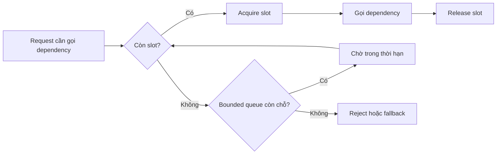
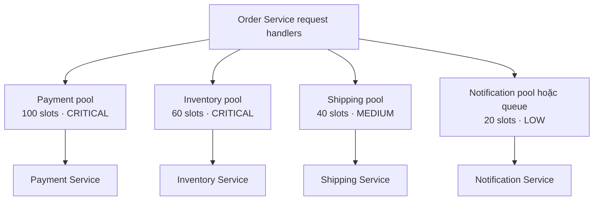

# Bulkhead Pattern — Cô lập tài nguyên

## Mục lục

- [Tổng quan](#tổng-quan)
  - [Bulkhead Pattern là gì](#bulkhead-pattern-là-gì)
  - [Failure mode cần ngăn chặn](#failure-mode-cần-ngăn-chặn)
  - [Bulkhead không phải là gì](#bulkhead-không-phải-là-gì)
- [Mô hình cô lập tài nguyên](#mô-hình-cô-lập-tài-nguyên)
  - [Resource partitioning](#resource-partitioning)
  - [Concurrency limit](#concurrency-limit)
  - [Pool queue và thread partitioning](#pool-queue-và-thread-partitioning)
  - [Rejection và backpressure](#rejection-và-backpressure)
- [Cách thiết kế Bulkhead](#cách-thiết-kế-bulkhead)
  - [Xác định ranh giới cô lập](#xác-định-ranh-giới-cô-lập)
  - [Chọn Thread Pool hay Semaphore](#chọn-thread-pool-hay-semaphore)
  - [Sizing capacity và queue](#sizing-capacity-và-queue)
  - [Định nghĩa hành vi khi hết slot](#định-nghĩa-hành-vi-khi-hết-slot)
- [Ví dụ Order Service](#ví-dụ-order-service)
  - [Bối cảnh](#bối-cảnh)
  - [Phân vùng theo dependency](#phân-vùng-theo-dependency)
  - [Kịch bản Payment Service chậm](#kịch-bản-payment-service-chậm)
  - [Xử lý request bị từ chối](#xử-lý-request-bị-từ-chối)
- [Khi nào nên dùng và khi nào không nên dùng](#khi-nào-nên-dùng-và-khi-nào-không-nên-dùng)
  - [Nên dùng khi](#nên-dùng-khi)
  - [Chưa cần hoặc không đáng khi](#chưa-cần-hoặc-không-đáng-khi)
- [Trade-offs](#trade-offs)
- [Lỗi thường gặp](#lỗi-thường-gặp)
- [Vận hành](#vận-hành)
  - [Metrics và tracing](#metrics-và-tracing)
  - [Sizing và điều chỉnh](#sizing-và-điều-chỉnh)
  - [Kiểm thử sự cố](#kiểm-thử-sự-cố)
  - [Runbook khi bulkhead bão hòa](#runbook-khi-bulkhead-bão-hòa)
- [Checklist](#checklist)
- [Liên kết liên quan](#liên-kết-liên-quan)

## Tổng quan

### Bulkhead Pattern là gì

**Bulkhead** nghĩa là vách ngăn chống chìm trong thân tàu. Tàu được chia thành nhiều khoang kín nước để khi một khoang bị thủng, nước không tràn sang toàn bộ con tàu.

Trong Microservice, Bulkhead Pattern chia tài nguyên hữu hạn của caller (service gọi) thành các phần độc lập. Mỗi dependency hoặc nhóm workload chỉ được sử dụng phần tài nguyên đã cấp cho nó. Khi một dependency chậm, phần tài nguyên của dependency đó có thể bị bão hòa mà không lập tức lấy hết tài nguyên dành cho các đường xử lý khác.

Bulkhead không làm dependency khỏe lại. Nó giới hạn **blast radius** (phạm vi ảnh hưởng) để một sự cố cục bộ không biến thành sự cố của toàn bộ caller.

### Failure mode cần ngăn chặn

Giả sử Order Service có một thread pool dùng chung với 200 threads. Payment Service bị chậm và mỗi call mất khoảng 30 giây. Các request gọi Payment sẽ giữ worker lâu hơn bình thường. Nếu chúng chiếm gần hết pool, các request gọi Inventory hoặc Notification cũng không còn worker để chạy.

```text
KHÔNG có Bulkhead — dùng chung 200 threads:
  ├── Payment Service chậm (30s/call) ──▶ chiếm 190 threads
  ├── Inventory Service (nhanh)        ──▶ không còn thread để gọi ❌
  └── Notification Service (nhanh)     ──▶ không còn thread để gọi ❌
  → Toàn bộ Order Service tê liệt vì một dependency chậm

CÓ Bulkhead — chia pool theo dependency:
  ├── Payment Pool:      tối đa 100 threads → chỉ khoang Payment đầy
  ├── Inventory Pool:    tối đa 60 threads  → vẫn có tài nguyên ✅
  └── Notification Pool: tối đa 40 threads  → vẫn có tài nguyên ✅
  → Thiệt hại tập trung ở Payment; các luồng khác vẫn có cơ hội hoạt động
```

| Cách tổ chức tài nguyên | Khi Payment chậm | Ảnh hưởng tới dependency khác |
|---|---|---|
| **Pool dùng chung** | Payment giữ dần toàn bộ worker hoặc connection | Có thể bị đói tài nguyên dù bản thân dependency vẫn khỏe |
| **Pool được phân vùng** | Chỉ partition dành cho Payment tiến tới saturation | Các partition khác giữ được capacity đã dành riêng |

**Saturation** là trạng thái tài nguyên đã gần hoặc chạm giới hạn sử dụng. Bulkhead biến saturation của một dependency thành tín hiệu cục bộ thay vì để nó âm thầm làm cạn kho tài nguyên dùng chung.

### Bulkhead không phải là gì

- Bulkhead **không phải Timeout**. Timeout giới hạn caller chờ một call bao lâu; Bulkhead giới hạn bao nhiêu call được chiếm tài nguyên cùng lúc. Một task đã vào pool mà không có timeout vẫn có thể giữ slot vô hạn.
- Bulkhead **không phải Circuit Breaker**. Circuit Breaker quyết định khi nào ngừng gọi dependency đang lỗi; Bulkhead quyết định dependency được phép tiêu bao nhiêu tài nguyên của caller.
- Bulkhead **không phải Rate Limiter**. Concurrency limit giới hạn số operation đang chạy; Rate Limiter giới hạn số request trong một khoảng thời gian.
- Bulkhead **không đảm bảo request thành công**. Khi capacity đã hết, từ chối có kiểm soát là một kết quả hợp lệ của thiết kế.
- Chia thread pool nhưng vẫn dùng chung connection pool hoặc queue không tạo ra cô lập đầy đủ. Phải kiểm tra từng resource mà request có thể chiếm.

> **Nguyên tắc:** cô lập đúng tài nguyên khan hiếm, giới hạn thời gian chờ slot và định nghĩa rõ chuyện xảy ra khi partition đầy.

## Mô hình cô lập tài nguyên

### Resource partitioning

**Resource partitioning** là chia một kho tài nguyên thành các partition có giới hạn riêng. Ranh giới có thể đặt ở tầng ứng dụng hoặc tầng hạ tầng:

| Mức cô lập | Cách làm | Ví dụ |
|---|---|---|
| **Thread Pool** | Dùng executor riêng cho từng dependency hoặc workload | Payment pool 100 threads, Inventory pool 60 threads |
| **Connection Pool** | Dùng pool connection riêng cho database hoặc service cần tách biệt | Order DB 20 connections, Product DB 10 connections |
| **Semaphore** | Dùng counter để giới hạn số call đồng thời mà không tạo thread riêng | Tối đa 50 request cùng lúc tới Payment |
| **Queue** | Dùng hàng đợi có giới hạn riêng cho dependency hoặc priority | Queue Notification không được chiếm chỗ của checkout |
| **Container hoặc Pod** | Đặt process và resource limit riêng | Payment Pod có giới hạn CPU và memory riêng |
| **Cluster hoặc Region** | Tách hạ tầng cho workload quan trọng | Payment không dùng chung cluster với batch job |

Cô lập ở tầng dưới không tự động thay thế cô lập ở tầng trên. Resource limit của Pod bảo vệ CPU và memory của process, nhưng không giới hạn số request đồng thời tới Payment. Ngược lại, semaphore ở ứng dụng không ngăn một memory leak làm đầy container. Hãy xác định resource nào có thể cạn kiệt ở mỗi tầng.

### Concurrency limit

**Concurrency limit** là giới hạn số operation đang *in-flight* (đã bắt đầu nhưng chưa kết thúc) tại cùng một thời điểm. Ví dụ, Bulkhead cho phép tối đa 50 call đồng thời tới Payment. Call thứ 51 phải chờ trong giới hạn hoặc bị từ chối.

Concurrency khác với Rate Limiter:

| Cơ chế | Giới hạn | Ví dụ câu hỏi |
|---|---|---|
| **Concurrency limit** | Số operation đang chạy | “Hiện có bao nhiêu call tới Payment?” |
| **Rate Limiter** | Số request trong một khoảng thời gian | “Trong một giây có bao nhiêu request được bắt đầu?” |

Một concurrency limit có thể bảo vệ dependency khỏi việc phải xử lý quá nhiều operation đồng thời. Nó cũng tạo một điểm rõ ràng để áp dụng backpressure khi không còn slot.



Nếu chờ slot, queue hoặc dependency không có giới hạn thời gian, concurrency limit chỉ đổi chỗ giữ tài nguyên. Vì vậy, acquisition timeout và request timeout vẫn là một phần của thiết kế Bulkhead.

### Pool queue và thread partitioning

Có ba thành phần thường bị nhầm lẫn:

1. **Pool** giữ resource có thể được cấp phát, chẳng hạn worker hoặc connection.
2. **Queue** giữ task đang chờ được xử lý.
3. **Thread** thực thi task. Chia thread pool có thể cô lập worker, nhưng không tự cô lập mọi connection, memory hoặc thread ở request handler.

Các lựa chọn phổ biến trong ứng dụng:

| | Thread Pool Bulkhead | Semaphore Bulkhead |
|---|---|---|
| Cách hoạt động | Mỗi dependency có một thread pool hoặc executor riêng | Dùng thread pool hiện có và chỉ đếm số call đồng thời |
| Mức cô lập | Cao hơn ở lớp worker; task của pool này không chiếm worker pool kia | Một phần; vẫn dùng tài nguyên chung của caller |
| Overhead | Cao hơn vì có thêm thread và context switch | Thấp hơn vì không tạo thread riêng |
| Phù hợp | Blocking I/O như HTTP client blocking hoặc JDBC | Non-blocking hoặc async stack |
| Điều phải kiểm tra thêm | Connection pool, queue và thread của request handler | Không được block event loop khi chờ semaphore |

**Thread Pool Bulkhead** phù hợp khi một thao tác blocking cần worker riêng. Queue của mỗi executor nên có giới hạn. Nếu queue vô hạn, task vẫn tích tụ và memory có thể cạn dù số thread đã được giới hạn.

**Semaphore Bulkhead** phù hợp khi framework đã có async hoặc non-blocking execution. Semaphore chỉ đếm slot; nó không tạo ra ranh giới CPU, connection hay memory. Khi acquisition không thành công, caller cần reject hoặc chờ bất đồng bộ trong một thời hạn thay vì block event loop.

Connection pool cũng cần được xem như một partition độc lập. Nếu Payment có thread pool riêng nhưng các task vẫn tranh chấp một connection pool chung, sự cố vẫn có thể lan qua resource đó.

### Rejection và backpressure

**Rejection** là việc từ chối một task vì partition đã hết slot hoặc queue đã đầy. Đây không nhất thiết là bug. Nó là tín hiệu cho caller rằng hệ thống không nên nhận thêm work ở đường đó.

**Backpressure** là cơ chế truyền tín hiệu quá tải ngược về phía phát sinh work. Với synchronous call, backpressure thường là chờ có giới hạn rồi fail fast. Với asynchronous workflow, backpressure có thể là giới hạn tốc độ producer, giới hạn queue hoặc chuyển task sang xử lý sau.

Khi partition đầy, có thể chọn một hành vi theo business contract:

| Tình huống | Hành vi có thể chọn | Lưu ý |
|---|---|---|
| Call đồng bộ còn ít thời gian | Từ chối ngay hoặc chờ bounded | Không giữ request vô hạn trong queue |
| Dữ liệu có thể cũ hoặc không bắt buộc | Fallback hoặc degraded mode | Không biến dữ liệu thiếu thành dữ liệu sai |
| Nghiệp vụ có thể hoàn tất sau | Đưa vào asynchronous queue | Queue cũng phải bounded và có cơ chế quan sát |
| Nghiệp vụ bắt buộc dependency phản hồi | Trả lỗi theo API contract, thường là lỗi quá tải hoặc tạm thời | Không giả vờ thành công khi side effect chưa xảy ra |
| Work không còn giá trị | Load shed hoặc bỏ task theo policy | Phải phân biệt task có thể bỏ và task bắt buộc |

HTTP status như `429` hoặc `503` chỉ là ví dụ; status và response body phải theo contract của API. Điều quan trọng là client không được biến một rejection có chủ đích thành một vòng retry vô hạn.

## Cách thiết kế Bulkhead

### Xác định ranh giới cô lập

Bắt đầu từ đường đi của một request thay vì bắt đầu bằng một con số pool:

1. Liệt kê dependency mà service gọi, gồm HTTP, gRPC, database, cache và message broker.
2. Xác định resource mỗi call có thể giữ: worker, connection, semaphore slot, memory và queue entry.
3. Phân loại criticality (mức quan trọng) của workload. Checkout Payment và gửi Notification không nhất thiết có cùng mức ưu tiên.
4. Chọn partition theo dependency hoặc workload có đặc tính latency và SLA tương tự. Không cần tạo một pool riêng cho mọi endpoint nếu các endpoint thực sự dùng chung contract và capacity.
5. Kiểm tra resource dùng chung ở các lớp khác. Một thread pool riêng nhưng connection pool chung vẫn còn điểm nghẽn chung.
6. Ghi rõ giới hạn, acquisition timeout, queue policy và hành vi khi đầy trong configuration và runbook.

Ranh giới cô lập nên tương ứng với nơi failure có thể tạo ra blast radius. Nếu một dependency được gọi bởi nhiều use case có priority khác nhau, có thể cần partition theo priority thay vì chỉ theo hostname.

### Chọn Thread Pool hay Semaphore

Chọn cơ chế theo execution model của service:

- Chọn **Thread Pool Bulkhead** cho blocking I/O khi worker dành riêng giúp một dependency không chiếm worker của dependency khác.
- Chọn **Semaphore Bulkhead** cho non-blocking hoặc async stack khi chỉ cần giới hạn số operation in-flight và không muốn tạo thêm thread.
- Nếu một framework hỗ trợ cả hai, kiểm tra cách nó xử lý queue, cancellation và timeout khi acquire. Tên cấu hình giống nhau không có nghĩa hành vi runtime giống nhau.
- Không xem Thread Pool Bulkhead là cô lập toàn hệ thống. Request handler, connection pool, CPU và memory có thể vẫn là resource chung.

> **Điểm cần nhớ:** Semaphore có overhead thấp hơn nhưng mức cô lập thấp hơn. Thread pool cô lập worker tốt hơn nhưng phải trả chi phí vận hành thread và vẫn cần giới hạn các resource phía sau.

### Sizing capacity và queue

**Sizing** là xác định capacity cho từng partition. Không nên chọn các số tròn như `50` hoặc `100` chỉ vì dễ nhớ. Hãy dùng dữ liệu của workload:

- Đo concurrency thực tế theo dependency và operation, gồm P95/P99 khi tải bình thường và tải cao.
- Theo dõi latency, timeout, error rate và số call in-flight của downstream.
- Đối chiếu capacity của caller với giới hạn thread, connection, CPU và memory ở các lớp khác.
- Dành capacity phù hợp cho workload critical, thay vì chia đều cho mọi dependency.
- Kiểm thử burst và dependency chậm trước khi dùng giá trị trong production.

Capacity lớn không luôn tốt hơn. Pool quá lớn có thể dồn thêm tải vào dependency đang yếu. Pool quá nhỏ có thể tạo rejection dù dependency vẫn còn khả năng phục vụ. Kết quả đo và hành vi khi đạt ngưỡng quan trọng hơn một preset chung.

Queue có thể hấp thụ một burst ngắn, nhưng queue không làm work biến mất. Queue nên có:

- giới hạn độ dài;
- thời gian chờ tối đa hoặc TTL của task;
- policy khi đầy;
- metric về độ sâu và tuổi task;
- cơ chế hủy task đã hết deadline.

Queue vô hạn thường chỉ trì hoãn failure và làm latency, memory hoặc số work pending tăng dần. Nói ngắn gọn: ưu tiên queue bounded và reject có chủ đích hơn là giữ mọi request cho tới khi toàn hệ thống cạn tài nguyên.

### Định nghĩa hành vi khi hết slot

Thiết kế phải trả lời bốn câu hỏi trước khi bật Bulkhead:

1. Request chờ slot tối đa bao lâu?
2. Khi queue đầy, task bị reject, fallback, chuyển sang async hay trả lỗi nào?
3. Ai chịu trách nhiệm xử lý một task bị reject? Caller, producer hay một workflow sau đó?
4. Khi task kết thúc, timeout hoặc bị hủy, slot có luôn được release không?

Tách các trường hợp sau trong telemetry và contract:

- **Acquisition rejected:** không lấy được slot, dependency chưa được gọi.
- **Queued then executed:** task đã chờ rồi mới chạy.
- **Dependency failed:** đã lấy slot và call tới dependency nhưng call thất bại.
- **Deadline exceeded:** request hết budget trong lúc chờ hoặc đang thực thi.

Việc phân biệt này giúp operator biết nên điều chỉnh Bulkhead, dependency hay timeout. Đừng tự động retry mọi `Acquisition rejected`; làm vậy có thể đưa thêm task vào đúng partition đang đầy.

## Ví dụ Order Service

### Bối cảnh

Order Service phục vụ các request xem giỏ hàng và checkout. Một request có thể cần gọi nhiều dependency:

- **Payment Service:** quan trọng đối với checkout.
- **Inventory Service:** quan trọng để xác nhận tồn kho.
- **Shipping Service:** cần cho việc tính phí hoặc lựa chọn giao hàng.
- **Notification Service:** thường có thể xử lý sau, tùy business contract.

Payment và Inventory có thể có criticality cao, trong khi Notification có thể được tách thành asynchronous workflow. Các partition dưới đây chỉ là số minh họa để thể hiện cách phân bổ, không phải giá trị cấu hình mặc định.

### Phân vùng theo dependency



Cách phân vùng này tạo các giới hạn riêng:

| Dependency | Capacity minh họa | Priority | Khi partition đầy |
|---|---:|---|---|
| Payment Service | 100 threads hoặc slots | Critical | Checkout fail fast hoặc chuyển `PENDING_PAYMENT` nếu contract hỗ trợ |
| Inventory Service | 60 threads hoặc slots | Critical | Không giữ request vô hạn; trả lỗi theo contract nếu không thể xác nhận |
| Shipping Service | 40 threads hoặc slots | Medium | Có thể dùng degraded response nếu phí giao hàng có phương án khác |
| Notification Service | 20 threads hoặc queue entries | Low | Ưu tiên enqueue bounded hoặc xử lý sau; không để chiếm slot checkout |

Một request handler có thể vẫn là resource chung của Order Service. Vì vậy, ngoài các partition theo dependency, cần theo dõi thread của handler, connection pool và memory. App-level Bulkhead chỉ giải quyết những resource mà nó thực sự kiểm soát.

Bulkhead cũng có thể được bổ sung ở tầng container. Ví dụ sau đặt resource request và limit cho Payment Pod:

```yaml
apiVersion: v1
kind: Pod
metadata:
  name: payment-service
spec:
  containers:
    - name: payment
      image: myapp/payment:v2.1
      resources:
        requests: { cpu: "250m", memory: "256Mi" }
        limits:   { cpu: "500m", memory: "512Mi" }
```

Nếu process vượt memory limit trong kịch bản memory leak, container có thể bị `OOMKill` thay vì tiếp tục dùng memory vô hạn của node. Resource limit ở Pod không thay thế concurrency limit trong ứng dụng và cũng không bảo vệ khỏi mọi sự cố ở node.

### Kịch bản Payment Service chậm

Giả sử Payment Service mất khoảng 30 giây cho mỗi call:

```text
1. Các call Payment giữ slot của Payment pool lâu hơn bình thường.
2. Payment pool đạt giới hạn; call mới không được phép vào vô hạn.
3. Caller chờ trong acquisition timeout ngắn hoặc nhận rejection.
4. Inventory, Shipping và Notification vẫn sử dụng partition riêng của chúng.
5. Checkout bị ảnh hưởng theo đúng contract; các chức năng không phụ thuộc Payment vẫn có cơ hội phục vụ.
```

Nếu không có Bulkhead, các call Payment chậm sẽ tiếp tục chiếm pool dùng chung. Chúng có thể làm request xem hàng hoặc gửi notification không còn worker. Nếu Bulkhead có nhưng không có Timeout, 100 slot Payment vẫn có thể bị giữ vô hạn. Vì vậy, mọi call trong partition cần có giới hạn thời gian riêng và phải release slot khi kết thúc hoặc bị hủy. Chi tiết về giới hạn chờ xem [Timeout Pattern](./timeout.md).

Payment là side effect quan trọng. Khi call bị timeout hoặc bị từ chối trước khi biết kết quả, Order Service không nên tự đánh dấu đơn là đã thanh toán. Nó cần trả lỗi hoặc trạng thái chờ theo business contract. Nếu workflow cho phép xử lý lại, operation phải có cách xác định request trước đó để tránh tạo charge trùng.

### Xử lý request bị từ chối

Bulkhead rejection cần có policy theo loại nghiệp vụ:

| Workload | Khi không lấy được slot | Kết quả cần bảo đảm |
|---|---|---|
| Checkout cần Payment | Fail fast hoặc trả trạng thái pending đã được định nghĩa | Không báo “đã thanh toán” khi chưa có kết quả xác nhận |
| Đọc Inventory trong màn hình giỏ hàng | Trả lỗi hoặc dữ liệu fallback nếu business cho phép | Gắn rõ dữ liệu tham khảo nếu dữ liệu có thể cũ |
| Tính Shipping | Degraded response hoặc yêu cầu thử lại theo contract | Không giữ worker vô thời hạn |
| Gửi Notification | Đưa vào queue bounded hoặc xử lý lại sau | Không để notification chiếm tài nguyên của checkout |

Client có thể nhận `429`, `503` hoặc một mã nghiệp vụ riêng tùy API contract. Dù chọn mã nào, response nên cho biết đây là quá tải hoặc kết quả tạm thời khi phù hợp. Retry phía client phải có giới hạn; nếu mọi client retry ngay sau rejection, Bulkhead sẽ mất tác dụng và áp lực quay lại caller.

## Khi nào nên dùng và khi nào không nên dùng

### Nên dùng khi

- Service gọi nhiều dependency có criticality khác nhau và các call đang tranh chấp thread, connection hoặc queue.
- Đã quan sát failure mode “một dependency chậm làm cạn resource chung” hoặc saturation của pool.
- Caller dùng blocking I/O, khiến một call chậm có thể giữ worker lâu.
- Cần dành capacity tối thiểu cho nghiệp vụ quan trọng khi workload ít quan trọng tăng đột biến.
- Có thể đo concurrency và có contract rõ ràng cho rejection, fallback hoặc asynchronous processing.
- Muốn đặt ranh giới ở nhiều tầng, từ application pool tới container hoặc cluster, vì các tầng có resource khác nhau.

### Chưa cần hoặc không đáng khi

- Service chỉ có một hoặc hai dependency, traffic nhỏ và chưa có dấu hiệu tranh chấp resource. Chia nhiều pool trong trường hợp này có thể thêm cấu hình mà chưa đem lại lợi ích rõ ràng.
- Workload đã non-blocking, ít resource chung và đã được cô lập phù hợp ở tầng hạ tầng. Vẫn cần kiểm tra xem connection, CPU hoặc queue có còn dùng chung không.
- Không thể đo concurrency, không biết capacity của downstream hoặc chưa quyết định hành vi khi partition đầy. Khi đó, con số Bulkhead sẽ chỉ là phỏng đoán.
- Tài nguyên dư dả và partition gần như không bao giờ chạm ngưỡng. Nên cân nhắc chi phí vận hành trước khi thêm một lớp giới hạn.
- Chỉ muốn dùng Bulkhead để che một dependency quá tải mà không có kế hoạch xử lý rejection, timeout và resource saturation.

“Không cần” không có nghĩa là được phép chờ vô hạn. Mọi external call vẫn cần timeout và hành vi failure rõ ràng; Bulkhead chỉ nên được thêm khi có ranh giới resource cần bảo vệ.

## Trade-offs

| Lợi ích | Chi phí hoặc rủi ro |
|---|---|
| Giới hạn blast radius của một dependency chậm hoặc lỗi | Tổng capacity phải chia ra; partition rảnh không luôn cho partition khác mượn được |
| Giữ capacity cho workload critical | Cần quyết định priority và tránh chia không đều theo phỏng đoán |
| Pool hoặc queue đầy tạo tín hiệu rõ ràng để fail fast, fallback hoặc load shed | User có thể thấy lỗi sớm hơn; UX và API contract phải xử lý rejection |
| Giảm khả năng một call giữ cạn resource chung | Thêm pool, semaphore, queue và thông số cần vận hành |
| Có thể cô lập ở app, container hoặc cluster | Cô lập sai tầng vẫn để lọt resource chung như connection pool hoặc node |
| Bảo vệ caller khỏi việc nhận thêm work không thể xử lý | Pool quá nhỏ gây rejection oan; pool quá lớn có thể dồn tải sang dependency |

Bulkhead không tạo thêm capacity. Nó đổi một phần hiệu suất tối đa trong trường hợp mọi pool đều rảnh lấy khả năng dự đoán và giới hạn thiệt hại khi một partition gặp sự cố. Hãy chọn trade-off này khi isolation có giá trị hơn việc tận dụng toàn bộ pool chung.

## Lỗi thường gặp

1. **Tưởng đã cô lập nhưng resource vẫn dùng chung.** Chia thread pool mà quên connection pool, queue hoặc giới hạn ở downstream vẫn để lại “khoang hở”.
2. **Không đi kèm Timeout và cancellation.** Slot đã cấp mà task chờ vô hạn sẽ làm partition đầy vĩnh viễn. Khi caller hủy, phải kiểm tra task và call bên dưới có dừng và release slot không.
3. **Chọn capacity bằng con số đẹp.** Pool `50` hoặc `100` không có ý nghĩa nếu không dựa trên concurrency, latency, traffic và capacity của dependency.
4. **Dùng queue vô hạn.** Queue chỉ trì hoãn failure, đồng thời có thể làm memory, queue age và latency tăng dần.
5. **Không định nghĩa hành vi khi pool đầy.** Request bị từ chối sẽ fallback, trả lỗi, chuyển sang queue hay bỏ? Nếu chưa có câu trả lời, Bulkhead chưa hoàn chỉnh.
6. **Cấp capacity như nhau cho mọi dependency.** Workload `LOW` có thể chiếm tài nguyên đáng lẽ dành cho Payment nếu không có priority và partition phù hợp.
7. **Không theo dõi saturation.** Không có metric về in-flight, queue depth, wait time và rejection thì không biết pool đang cứu hệ thống hay đang từ chối oan.
8. **Retry vô hạn sau khi bị rejection.** Client retry ngay có thể liên tục lấp đầy partition. Rejection cần được phân loại và retry phải có giới hạn.
9. **Chỉ đặt limit ở tầng hạ tầng.** CPU và memory limit của Pod không thay thế giới hạn concurrent call hoặc bounded queue ở ứng dụng.
10. **Tạo quá nhiều partition.** Chia nhỏ mọi endpoint làm capacity bị phân mảnh và tăng chi phí vận hành. Chỉ tách khi workload có resource, priority hoặc failure mode khác nhau.

## Vận hành

### Metrics và tracing

Bulkhead chỉ hữu ích khi operator nhìn thấy từng partition. Nên tách dữ liệu theo `caller`, `dependency`, `operation` và `partition`:

| Nhóm tín hiệu | Câu hỏi cần trả lời |
|---|---|
| **In-flight và capacity** | Có bao nhiêu slot đang dùng trên tổng số slot? |
| **Saturation** | Partition đầy trong bao lâu và với tần suất nào? |
| **Queue depth và queue age** | Work đang chờ bao nhiêu, task lâu nhất đã chờ bao lâu? |
| **Acquisition wait** | Thời gian bị tiêu trong lúc chờ slot là bao nhiêu? |
| **Rejection rate** | Rejection xảy ra ở partition nào và vì hết slot hay queue đầy? |
| **Dependency latency, error và timeout** | Pool đầy do downstream chậm hay do capacity của caller không phù hợp? |
| **Thread, connection, CPU và memory** | Resource chung nào vẫn đang là điểm nghẽn ngoài Bulkhead? |
| **Business outcome** | Checkout bị fail, pending hay thành công; notification bị trễ bao lâu? |

Tên metric là ví dụ và có thể thay đổi theo hệ thống. Các field hữu ích trong log hoặc span gồm `bulkhead_name`, `dependency`, `operation`, `max_concurrency`, `in_flight`, `queue_depth`, `wait_ms`, `rejected` và `rejection_reason`. Tạo span riêng cho bước acquire giúp phân biệt thời gian chờ slot với thời gian gọi dependency.

Không gộp `acquisition rejected` với `dependency error`. Ở trường hợp đầu, dependency chưa được gọi; ở trường hợp sau, request đã tiêu tài nguyên và đã nhận một failure từ downstream. Hai tình huống cần hướng điều tra khác nhau.

### Sizing và điều chỉnh

Khi review capacity, so sánh ít nhất ba nhóm dữ liệu:

1. Concurrency và queue age của từng partition.
2. P95/P99 latency, timeout và error rate của dependency.
3. Thread, connection, CPU, memory và traffic của caller.

Nếu tăng pool chỉ làm downstream chậm hơn hoặc error rate cao hơn, capacity mới không giải quyết được nguyên nhân. Nếu rejection tăng trong khi downstream còn capacity và caller còn resource, có thể partition đang quá nhỏ. Mọi điều chỉnh nên được rollout có kiểm soát và so sánh với baseline trước thay đổi.

Sau khi dependency hồi phục, không nên đẩy toàn bộ queue hoặc traffic vào ngay một lúc. Hãy để hệ thống tiếp nhận work trong giới hạn đã kiểm chứng và quan sát lại saturation. Với queue có task đã hết deadline, cần loại bỏ hoặc hủy theo policy thay vì cố xử lý mọi task cũ.

### Kiểm thử sự cố

Kiểm thử Bulkhead cần kiểm tra cả partition bị sự cố và các partition không bị sự cố:

- Làm Payment Service chậm khoảng 30 giây để làm đầy Payment pool.
- Làm queue đầy và xác nhận policy rejection hoặc fallback được kích hoạt.
- Gửi burst traffic để kiểm tra bounded wait, queue age và acquisition timeout.
- Hủy request trong lúc chờ slot và trong lúc call đang chạy; xác nhận slot, thread và connection được release.
- Kiểm tra Inventory, Shipping và Notification vẫn có thể chạy khi Payment bão hòa.
- Kiểm tra workload `LOW` không thể chiếm hết capacity dành cho nghiệp vụ `CRITICAL`.
- Kiểm tra client không tạo retry loop sau `Acquisition rejected`.
- Nếu có resource limit ở Pod, kiểm tra hành vi khi process chạm CPU hoặc memory limit.

Fault injection nên xác nhận cả response, telemetry và resource sau sự cố. Một test chỉ thấy API trả lỗi nhưng không đo việc release slot thì chưa chứng minh Bulkhead hoạt động đúng.

### Runbook khi bulkhead bão hòa

1. Xác định partition, dependency, operation và instance nào đang bão hòa.
2. Phân biệt thời gian chờ acquire, queue đầy và call đã vào dependency nhưng phản hồi chậm.
3. Đối chiếu downstream latency, error, timeout với thread, connection, CPU, memory và queue của caller.
4. Bảo vệ workload critical: giảm hoặc tạm dừng workload tùy chọn, dùng fallback đã được phê duyệt hoặc chuyển phần có thể xử lý sau sang queue bounded.
5. Không chỉ tăng capacity hoặc timeout để xóa metric rejection. Kiểm tra giới hạn thật của downstream và resource ở các tầng khác.
6. Sau khi nguyên nhân được xử lý, khôi phục traffic từng bước và theo dõi saturation, rejection, latency cùng business outcome.
7. Ghi lại capacity, queue policy và nguyên nhân trong configuration hoặc runbook để lần sau không phải sizing lại bằng phỏng đoán.

## Checklist

- [ ] Đã liệt kê dependency và resource mà mỗi call có thể chiếm.
- [ ] Đã xác định ranh giới partition theo dependency, workload hoặc priority phù hợp.
- [ ] Đã chọn Thread Pool hoặc Semaphore theo execution model.
- [ ] Đã kiểm tra connection pool, request-handler thread, CPU, memory và queue dùng chung.
- [ ] Concurrency limit dựa trên dữ liệu đo lường và load test, không phải con số tùy ý.
- [ ] Queue có giới hạn độ dài, thời gian chờ và policy khi đầy.
- [ ] Acquisition timeout và request timeout được cấu hình tường minh.
- [ ] Cancellation luôn release slot, worker và connection.
- [ ] Hành vi khi hết slot đã được định nghĩa: reject, fallback, degraded mode hoặc async.
- [ ] API không báo thành công giả khi side effect như payment chưa được xác nhận.
- [ ] Rejection được phân biệt với lỗi từ dependency và không tạo retry loop vô hạn.
- [ ] Có metrics về in-flight, capacity, saturation, queue, wait time và rejection.
- [ ] Có tracing để biết thời gian tiêu ở acquire hay ở downstream call.
- [ ] Đã kiểm thử một dependency chậm, queue đầy, burst traffic và cancellation.
- [ ] Đã kiểm tra workload không quan trọng không chiếm capacity của workload critical.
- [ ] Có runbook cho saturation và quy trình điều chỉnh capacity có kiểm soát.

## Liên kết liên quan

- [17 — Reliability Patterns](../17-reliability-patterns.md) — phần tổng hợp về các reliability pattern và phạm vi phối hợp cấp nhóm.
- [10 — Resilience Patterns](../10-resilience-patterns.md#53-các-loại-bulkhead) — các loại Bulkhead và phần giải thích chi tiết hơn.
- [Timeout Pattern](./timeout.md) — giới hạn thời gian chờ pool, connection, response và request.
- [06 — Inter-Service Communication](../06-inter-service-communication.md) — lựa chọn synchronous và asynchronous communication.
- [09 — Data Management](../09-data-management.md) — queue, workflow và các cơ chế xử lý bất đồng bộ liên quan.
- [11 — Observability & Evolvability](../11-observability-evolvability.md) — metrics, logging, tracing và health endpoint.
- [13 — Orchestration](../13-orchestration.md) — resource limit, container và các lớp orchestration.
- [16 — Configuration & Secrets Management](../16-configuration-secrets-management.md) — quản lý configuration theo environment.
