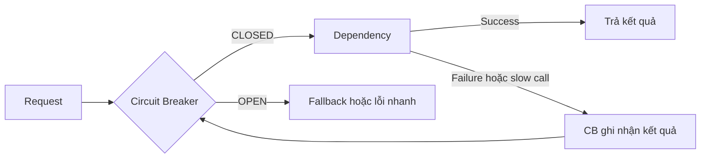
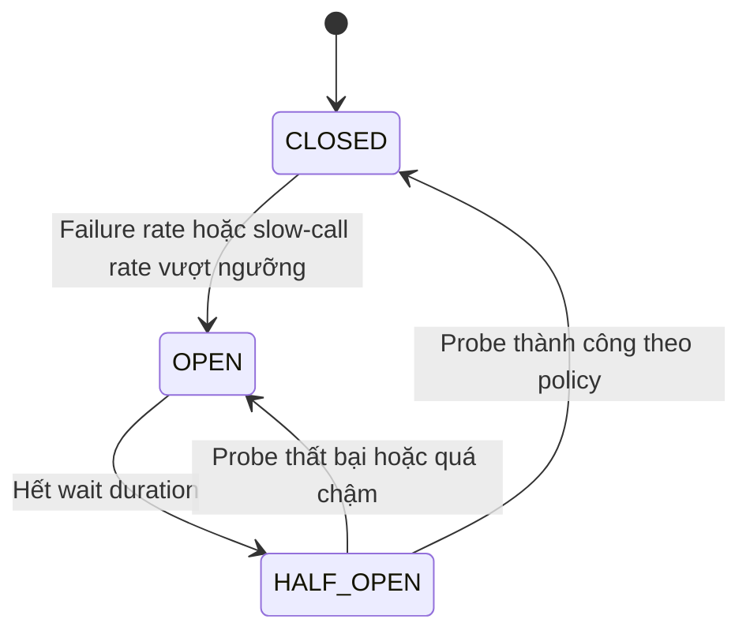
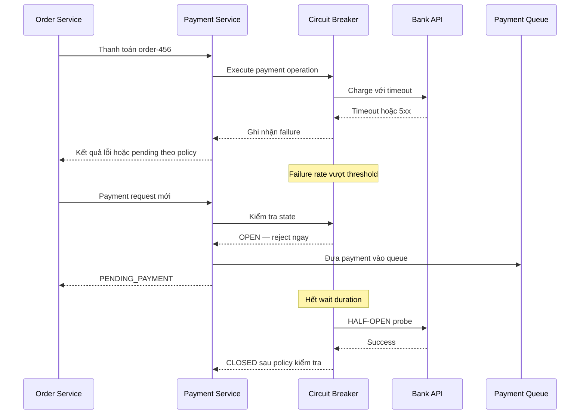

# Circuit Breaker Pattern — Ngắt mạch chống Cascading Failure

## Mục lục

- [Tổng quan](#tổng-quan)
  - [Circuit Breaker là gì](#circuit-breaker-là-gì)
  - [Failure mode cần ngăn chặn](#failure-mode-cần-ngăn-chặn)
  - [Phạm vi của tài liệu](#phạm-vi-của-tài-liệu)
- [Cách hoạt động](#cách-hoạt-động)
  - [State machine](#state-machine)
  - [CLOSED](#closed)
  - [OPEN](#open)
  - [HALF-OPEN](#half-open)
  - [Điều kiện mở mạch](#điều-kiện-mở-mạch)
  - [Failure rate threshold](#failure-rate-threshold)
  - [Fallback khi mạch mở](#fallback-khi-mạch-mở)
- [Tương tác với timeout và retry](#tương-tác-với-timeout-và-retry)
  - [Circuit Breaker bọc ngoài Retry](#circuit-breaker-bọc-ngoài-retry)
  - [Timeout mỗi lần thử và deadline tổng](#timeout-mỗi-lần-thử-và-deadline-tổng)
  - [Khi retry có side effect](#khi-retry-có-side-effect)
- [Use case Payment Service](#use-case-payment-service)
  - [Bối cảnh](#bối-cảnh)
  - [Luồng khi Bank API lỗi kéo dài](#luồng-khi-bank-api-lỗi-kéo-dài)
  - [Kết quả payment chưa xác định](#kết-quả-payment-chưa-xác-định)
- [Trade-offs](#trade-offs)
- [Khi nào nên dùng và khi nào không nên dùng](#khi-nào-nên-dùng-và-khi-nào-không-nên-dùng)
  - [Nên dùng khi](#nên-dùng-khi)
  - [Không nên dùng khi](#không-nên-dùng-khi)
- [Lỗi thường gặp](#lỗi-thường-gặp)
- [Vận hành](#vận-hành)
  - [Metrics cần theo dõi](#metrics-cần-theo-dõi)
  - [Logging và tracing](#logging-và-tracing)
  - [Alerting và runbook](#alerting-và-runbook)
  - [Kiểm thử và rollout](#kiểm-thử-và-rollout)
- [Checklist](#checklist)
- [Liên kết liên quan](#liên-kết-liên-quan)

---

## Tổng quan

### Circuit Breaker là gì

**Circuit Breaker** (bộ ngắt mạch) là một lớp kiểm soát nằm giữa **caller** (service gọi) và **callee** (service được gọi). Nó ghi nhận kết quả các call tới một dependency. Khi dependency lỗi hoặc chậm vượt ngưỡng, Circuit Breaker ngừng gửi thêm request trong một khoảng thời gian.

Khi mạch mở, request bị **fail fast** (thất bại nhanh) thay vì tiếp tục chờ một dependency đang không phục vụ được. Caller có thể trả lỗi theo contract, chuyển sang **fallback** (phương án dự phòng), hoặc đưa công việc vào queue để xử lý sau.



Circuit Breaker không sửa được dependency và cũng không hoàn tác side effect đã xảy ra. Mục tiêu của nó là giới hạn việc caller tiếp tục tiêu tài nguyên cho một dependency đang lỗi, từ đó giảm nguy cơ **Cascading Failure** (lỗi lan truyền dây chuyền).

### Failure mode cần ngăn chặn

Ví dụ, Order Service gọi Payment Service với timeout 30 giây. Khi Payment Service bị treo, mỗi request tới Payment vẫn giữ thread và connection trong thời gian dài. Đủ nhiều request sẽ làm tài nguyên của Order Service cạn kiệt, dù bản thân Order Service chưa có lỗi.

```text
Không có Circuit Breaker:
  Payment Service chậm hoặc không phản hồi
      │
      ├── Order Service tiếp tục gửi request
      ├── Mỗi request chờ đến khi timeout
      ├── Thread và connection bị giữ
      └── Caller quá tải → lỗi lan sang các chức năng khác

Có Circuit Breaker:
  Dependency bắt đầu trả lỗi hoặc chậm
      │
      ├── CB ghi nhận kết quả trong sliding window
      ├── Khi vượt threshold, CB chuyển sang OPEN
      ├── Request mới bị từ chối ngay
      └── Caller giữ tài nguyên cho các chức năng còn lại
```

Circuit Breaker đặc biệt hữu ích với dependency remote trong đường gọi đồng bộ. Với lỗi chỉ thoáng qua, retry có giới hạn có thể đã đủ. Với lỗi kéo dài, việc tiếp tục retry thường chỉ tạo thêm tải.

### Phạm vi của tài liệu

Tài liệu này tập trung vào một Circuit Breaker cho **một cặp caller–dependency**: state machine, threshold, fallback, tương tác với timeout/retry, use case Payment Service và vận hành. Các quyết định phối hợp nhiều reliability pattern ở cấp hệ thống thuộc tài liệu tổng hợp [17 — Reliability Patterns](../17-reliability-patterns.md).

> Các con số trong ví dụ là điểm khởi đầu minh họa, không phải preset áp dụng cho mọi traffic pattern. Cần đo lường và kiểm thử trước khi đưa vào production.

## Cách hoạt động

### State machine

Một Circuit Breaker thường có ba trạng thái: `CLOSED`, `OPEN` và `HALF-OPEN`.



Circuit Breaker bắt đầu ở `CLOSED`. Khi mạch `OPEN` đủ lâu, nó không tự cho toàn bộ traffic quay lại ngay. Nó chuyển sang `HALF-OPEN` để dùng một số request thăm dò, rồi quyết định đóng lại hoặc mở tiếp.

### CLOSED

Ở trạng thái `CLOSED`, request được phép đi tới dependency như bình thường. Circuit Breaker vẫn ghi nhận success, failure và có thể cả slow call trong một **sliding window** (cửa sổ trượt) theo số lượng call hoặc theo thời gian.

Khi kết quả trong window vượt failure threshold hoặc slow-call threshold, Circuit Breaker chuyển sang `OPEN`. Các request đang chạy thường hoàn tất theo timeout và retry policy hiện tại; trạng thái mới chủ yếu áp dụng cho request tiếp theo.

### OPEN

Ở trạng thái `OPEN`, Circuit Breaker từ chối request mới ngay tại caller. Request không tạo thêm network call tới dependency. Caller cần chọn hành vi theo business contract: dùng cache, trả degraded response, đưa công việc vào queue, hoặc trả lỗi có mã rõ ràng.

Mạch ở `OPEN` trong một **wait duration**. Khoảng chờ này cho dependency có cơ hội hồi phục mà không bị traffic mới dồn vào. Hết thời gian chờ, Circuit Breaker chuyển sang `HALF-OPEN`.

### HALF-OPEN

Ở trạng thái `HALF-OPEN`, Circuit Breaker chỉ cho một số ít request **probe** (thăm dò) đi qua. Mục đích là kiểm tra dependency đã phục hồi, không phải mở toàn bộ traffic ngay lập tức.

- Probe thành công theo policy thì mạch chuyển về `CLOSED`.
- Probe thất bại hoặc vẫn quá chậm thì mạch quay lại `OPEN` và bắt đầu một wait duration mới.
- Số probe cần được giới hạn. Nếu cho quá nhiều request đi qua cùng lúc, half-open có thể tạo một spike đúng lúc dependency còn yếu.

### Điều kiện mở mạch

Circuit Breaker không nên mở chỉ vì một call lỗi trong một hệ thống có traffic lớn hoặc vì một lỗi business không thể sửa bằng cách gọi lại. Policy cần xác định rõ:

1. Kết quả nào được tính là failure: timeout, connection error, HTTP 5xx hoặc lỗi tương đương.
2. Kết quả nào được tính là slow call.
3. Cần tối thiểu bao nhiêu call trước khi đánh giá.
4. Cửa sổ đánh giá là theo số call hay theo thời gian.
5. Bao nhiêu probe được phép khi `HALF-OPEN`.

Lỗi do input hoặc business rule thường không nên làm mở mạch cho dependency, vì retry request đó cũng không làm input đúng hơn. Việc phân loại phải khớp với contract của client và dependency.

### Failure rate threshold

**Failure rate threshold** là tỷ lệ failure mà Circuit Breaker cho phép trước khi mở mạch. Một cách tính minh họa là:

```text
failure rate = số failure trong sliding window / tổng số call được ghi nhận trong window
```

Chỉ tính tỷ lệ sau khi đạt **minimum calls**. Nếu traffic quá thấp mà không có minimum calls, một vài lỗi đầu tiên có thể mở mạch oan. Nếu minimum calls quá cao so với traffic thực tế, Circuit Breaker có thể phản ứng chậm.

| Tham số | Vai trò | Điểm khởi đầu tham khảo |
|---|---|---|
| **Failure Rate Threshold** | Tỷ lệ failure để chuyển sang `OPEN` | 50% |
| **Minimum Calls** | Số call tối thiểu trước khi đánh giá | 10–20 call |
| **Sliding Window** | Phạm vi dữ liệu dùng để tính tỷ lệ | 10 call hoặc 10 giây |
| **Wait Duration in OPEN** | Thời gian tạm ngừng request mới | 30–60 giây |
| **Permitted Calls in HALF-OPEN** | Số probe tối đa | 3–5 call |
| **Slow Call Duration** | Thời gian từ đó một call bị coi là quá chậm | 2–5 giây |
| **Slow Call Rate Threshold** | Tỷ lệ slow call để mở mạch | 80% |

Các giá trị trên được lấy từ ví dụ cấu hình trong tài liệu resilience tổng quát. Chúng cần được đối chiếu với latency, RPS và mức độ quan trọng của dependency. Một threshold phù hợp ở 10 RPS có thể không phù hợp ở 1.000 RPS.

Circuit Breaker hiện đại có thể theo dõi cả **slow-call rate**. Một dependency không trả lỗi nhưng hầu như luôn phản hồi sau thời gian caller không còn chấp nhận được vẫn gây lãng phí tài nguyên. Tuy nhiên, slow-call duration phải khớp với timeout và SLA; đặt ngưỡng quá thấp sẽ tạo false positive.

### Fallback khi mạch mở

Circuit Breaker chỉ quyết định **không gọi dependency**. Nó không tự biết nên trả dữ liệu gì. Fallback là phần xử lý kết quả `OPEN`, timeout hoặc retry đã hết lượt.

| Hành vi fallback | Khi phù hợp | Ví dụ |
|---|---|---|
| **Dữ liệu cũ hoặc degraded response** | Dữ liệu phụ có thể chấp nhận stale | Hiển thị trạng thái gần nhất đã cache |
| **Xử lý bất đồng bộ** | Nghiệp vụ có thể hoàn tất sau | Đưa payment vào queue để worker xử lý |
| **Lỗi rõ ràng và fail fast** | Không được phép đoán hoặc trì hoãn kết quả | Trả mã lỗi cho thao tác bắt buộc phải đồng bộ |

Fallback không nên gọi lại chính dependency đang bị Circuit Breaker chặn. Nó cũng không nên che giấu mọi failure bằng một response thành công giả. Contract cần nói rõ dữ liệu là stale, payment là `PENDING`, hay thao tác đã thất bại.

## Tương tác với timeout và retry

Circuit Breaker, timeout và retry giải quyết ba câu hỏi khác nhau trong cùng một call:

| Cơ chế | Câu hỏi |
|---|---|
| **Timeout** | Một lần thử được phép chờ tối đa bao lâu? |
| **Retry** | Có nên thử lại lỗi tạm thời không? |
| **Circuit Breaker** | Khi dependency liên tục lỗi, có nên ngừng gọi hẳn không? |

### Circuit Breaker bọc ngoài Retry

Khi dùng cả hai, Circuit Breaker nên bọc ngoài Retry:

```text
Request
  └─ Circuit Breaker
       ├─ Nếu OPEN → fallback hoặc lỗi ngay
       └─ Nếu CLOSED → Retry có giới hạn
            └─ Timeout cho từng lần gọi dependency
```

Một request logic có thể có ba attempt. Nếu cả ba attempt thất bại, Circuit Breaker nên ghi nhận **một kết quả failure của request logic**, thay vì coi đó là ba request độc lập. Cách này giúp failure rate phản ánh số operation thật sự thất bại và tránh mở mạch quá sớm.

Ngược lại, nếu Retry bọc ngoài Circuit Breaker, mỗi lần retry lại kiểm tra và đi qua CB. Một request thật có thể bị tính thành nhiều failure, đồng thời retry vẫn tiếp tục tạo áp lực lên dependency khi policy đã muốn ngắt mạch.

Khi Circuit Breaker ở `OPEN`, retry không được chạy. Retry vào một dependency mà CB đã chặn chỉ làm tăng latency và số lần xử lý không cần thiết.

### Timeout mỗi lần thử và deadline tổng

Mỗi attempt cần có một **per-try timeout** để không chờ vô hạn. Toàn bộ chuỗi attempt và backoff cũng cần nằm trong **overall deadline** của request gốc.

```text
Overall deadline của request: 10s
  ├── Attempt 1: tối đa 2s
  ├── Backoff: 0.5s
  ├── Attempt 2: tối đa 2s
  ├── Backoff: 1s
  └── Attempt 3: tối đa 2s

Nếu hết deadline trước khi đủ attempt:
  → dừng retry
  → ghi nhận kết quả cho Circuit Breaker
  → chạy fallback hoặc trả lỗi theo contract
```

Timeout quá dài làm Circuit Breaker phản ứng muộn. Timeout quá ngắn lại có thể coi request hợp lệ là failure và mở mạch oan. Giá trị thật cần dựa trên latency đo được của dependency và budget của request. Xem thêm [Timeout Pattern](./timeout.md) về các lớp timeout và deadline propagation.

### Khi retry có side effect

Timeout hoặc Circuit Breaker không chứng minh rằng dependency chưa thực hiện side effect. Bank API có thể đã nhận lệnh charge nhưng response bị mất trên đường về.

Với operation như `POST /payments`:

- Chỉ retry khi operation có **Idempotency Key** ổn định cho cùng một payment intent.
- Không tạo key mới cho mỗi attempt của cùng một operation.
- Nếu kết quả vẫn chưa xác định, giữ trạng thái `PENDING_PAYMENT` hoặc trạng thái tương đương thay vì tự động charge lại.
- Có `operation ID` để đối chiếu với provider và thực hiện reconciliation khi cần.

Circuit Breaker bảo vệ tài nguyên và traffic. Nó không thay thế idempotency, reconciliation hoặc contract trạng thái của nghiệp vụ payment.

## Use case Payment Service

### Bối cảnh

Payment Service gọi **Bank API** bên thứ ba để authorize hoặc charge một payment. Bank API nằm ngoài quyền kiểm soát của team và có thể gặp lỗi deploy, timeout hoặc quá tải.

Giả sử Circuit Breaker của Payment Service có policy minh họa:

- Failure Rate Threshold: `50%`.
- Sliding window: các call gần đây.
- Wait duration ở `OPEN`: khoảng `60s`.
- `HALF-OPEN`: cho `3` probe.
- Timeout của một call tới Bank API: `5s`.

Các con số này chỉ nhằm minh họa state transition. Production cần dùng latency và traffic thực tế.

### Luồng khi Bank API lỗi kéo dài



Một timeline cụ thể theo ví dụ trong tài liệu nguồn:

```text
t=0s    CLOSED — Bank API phản hồi bình thường khoảng vài trăm ms

t=10s   Bank API bắt đầu timeout và trả 500
        Sliding window có 5/6 call failure = khoảng 83%
        83% > failure threshold 50% → chuyển sang OPEN

t=30s   OPEN — request mới bị reject nhanh, không gọi Bank API
        Payment Service trả PENDING_PAYMENT và có thể đưa operation vào queue

t=90s   HALF-OPEN — cho 3 probe đi qua
        3/3 probe thành công → Bank API có dấu hiệu hồi phục

t=91s   CLOSED — traffic trở lại theo policy của Circuit Breaker
```

Trong thời gian `OPEN`, Payment Service không tiêu thêm một network call nào cho Bank API từ các request bị chặn. Tài nguyên của Payment Service được dành cho các request khác, còn fallback quyết định payment sẽ được báo, trì hoãn hay xử lý bất đồng bộ.

### Kết quả payment chưa xác định

Có hai tình huống khác nhau cần phân biệt:

| Tình huống | Ý nghĩa | Hành vi an toàn hơn |
|---|---|---|
| Không kết nối được Bank API | Có thể lệnh chưa tới provider | Có thể retry theo policy nếu có Idempotency Key |
| Bank API timeout sau khi nhận lệnh | Không biết charge đã hoàn tất hay chưa | Không charge mù lần nữa; tra cứu hoặc reconciliation |

Vì vậy, fallback `PENDING_PAYMENT` không có nghĩa là payment chắc chắn chưa được xử lý. Nó chỉ nói rằng Payment Service chưa có kết quả cuối cùng trong thời gian của request đồng bộ. Worker hoặc quy trình reconciliation cần cập nhật trạng thái sau khi có kết quả đáng tin cậy từ provider.

## Trade-offs

| Lợi ích | Chi phí hoặc rủi ro |
|---|---|
| **Fail fast** và không tiếp tục giữ thread/connection cho dependency đã lỗi | User nhận lỗi hoặc trạng thái pending sớm hơn; cần thiết kế UX và API contract |
| Giảm request mới tới callee đang quá tải, tạo cơ hội hồi phục | Threshold quá nhạy có thể tạo **false positive** và chặn request hợp lệ |
| Tự chuyển sang `HALF-OPEN` để thăm dò, không cần người đóng mạch thủ công | Half-open cho quá nhiều probe có thể tạo spike và làm dependency lỗi lại |
| State của mạch là tín hiệu rõ cho monitoring và alerting | Mỗi instance caller có thể giữ state riêng; tổng số probe tăng theo số instance |
| Có thể kết hợp với fallback hoặc queue để giữ một phần chức năng | Fallback có thể stale, tăng độ phức tạp hoặc làm business flow eventual consistent |
| Giảm tác động của một dependency lên caller | Cấu hình phụ thuộc traffic pattern; cùng một threshold không phù hợp cho mọi dependency |

Circuit Breaker là một trade-off có chủ đích: chấp nhận từ chối một số request để tránh chờ lâu và làm hỏng thêm phần còn lại. Nếu nghiệp vụ không chịu được kết quả bị trì hoãn hoặc fallback không tồn tại, cần cân nhắc kỹ trước khi mở mạch ở đường gọi đó.

## Khi nào nên dùng và khi nào không nên dùng

### Nên dùng khi

- Caller gọi một dependency **remote** qua HTTP, gRPC hoặc một boundary network tương tự.
- Dependency có khả năng lỗi kéo dài, chậm kéo dài hoặc từng gây cạn tài nguyên ở caller.
- Caller có fallback, degraded mode, queue hoặc một lỗi được định nghĩa rõ khi mạch mở.
- Muốn bảo vệ callee khỏi traffic mới trong lúc callee đang hồi phục.
- Có thể đo lường failure rate, slow-call rate và hành vi recovery để hiệu chỉnh threshold.

### Không nên dùng khi

- Gọi hàm in-process hoặc dữ liệu in-memory. Ở đó không có network dependency để Circuit Breaker ngắt.
- Lỗi luôn là lỗi input hoặc business error. Retry và mở mạch không làm request sai trở nên đúng.
- Dependency chỉ gặp lỗi tức thời và retry có giới hạn đã xử lý đủ. Thêm Circuit Breaker có thể không đáng với chi phí vận hành.
- Không có fallback và việc đổi lỗi chậm thành lỗi nhanh không mang lại giá trị cho user. Khi đó cần xác định contract trước khi thêm CB.
- Dùng một Circuit Breaker chung cho nhiều dependency không liên quan. Một Bank API lỗi không nên làm Email API bị chặn theo.
- Dùng Circuit Breaker để thay thế Health Check. CB nhìn từ trải nghiệm của một caller; Health Check/registry nhìn trạng thái instance ở tầng hạ tầng.

Trong các trường hợp cần Circuit Breaker, nên tạo state riêng cho từng cặp caller–dependency và từng operation có failure semantics khác nhau khi cần. Không nên bật cùng một policy cho mọi outbound call chỉ vì thư viện hỗ trợ sẵn.

## Lỗi thường gặp

| Lỗi | Hệ quả | Cách phòng tránh |
|---|---|---|
| **Mở mạch nhưng không có fallback** | Chỉ biến lỗi chậm thành lỗi nhanh; user vẫn không biết phải làm gì | Định nghĩa degraded response, queue hoặc error contract trước khi bật CB |
| **Một CB dùng chung cho nhiều dependency** | Bank API lỗi kéo theo các dependency khỏe cũng bị reject | Tách CB theo cặp caller–dependency |
| **Không đặt timeout** | Mỗi failure vẫn chờ quá lâu trước khi CB có thể ghi nhận | Đặt per-try timeout và overall deadline |
| **Retry bọc ngoài Circuit Breaker** | Một request logic có thể bị tính thành nhiều failure; retry vẫn gây tải khi CB muốn chặn | Dùng CB bọc ngoài Retry |
| **Không có minimum calls phù hợp** | Traffic thấp hoặc vài lỗi đầu tiên làm mở mạch oan | Đặt minimum calls cùng sliding window dựa trên traffic thật |
| **Cho quá nhiều probe ở HALF-OPEN** | Dependency vừa hồi phục bị dồn traffic và lỗi lại | Giới hạn permitted calls và mở traffic dần theo policy |
| **Chỉ đếm error, bỏ qua slow call** | Dependency chậm đến mức vô dụng nhưng CB không mở | Định nghĩa slow-call duration/rate phù hợp với timeout và SLA |
| **Threshold không theo traffic pattern** | Cấu hình phù hợp ở tải này nhưng phản ứng sai ở tải khác | Kiểm thử với traffic thấp, bình thường và cao |
| **Không monitor state** | Mạch mở hoặc flapping nhưng team không có tín hiệu điều tra | Export state transition, rejected calls, failure và fallback metrics |
| **Coi timeout payment là thất bại chắc chắn** | Retry charge có thể tạo duplicate hoặc trừ tiền hai lần | Dùng Idempotency Key, operation ID và reconciliation |
| **Dùng fallback để che mọi lỗi** | Incident bị che giấu, dữ liệu stale hoặc trạng thái sai kéo dài | Gắn trạng thái fallback rõ ràng và alert theo business impact |

## Vận hành

### Metrics cần theo dõi

Dashboard nên phân biệt ít nhất `caller`, `dependency`, `operation` và instance. Các metrics cốt lõi gồm:

| Nhóm metrics | Câu hỏi cần trả lời |
|---|---|
| **State transition** | Mạch chuyển `CLOSED → OPEN` khi nào, vì threshold nào? |
| **Thời gian ở OPEN** | Mạch ở `OPEN` bao lâu và có mở lại liên tục không? |
| **Allowed và rejected calls** | Bao nhiêu request đi tới dependency, bao nhiêu request bị fail fast? |
| **Failure/slow-call rate** | Tỷ lệ failure và slow call trong window có khớp với state không? |
| **HALF-OPEN probe** | Probe thành công, thất bại hoặc timeout bao nhiêu lần? |
| **Fallback** | Fallback được dùng bao nhiêu lần và có thành công không? |
| **Payment pending** | Có bao nhiêu payment chờ xử lý và queue age đang tăng hay giảm? |
| **Downstream latency** | Dependency chậm do latency thật, network, hay caller bị saturation? |

State `OPEN` không tự động có nghĩa là dependency đã chết hoàn toàn. Nó là tín hiệu rằng trải nghiệm của caller trong window hiện tại không đạt policy. Vì vậy, dashboard cần đặt metrics Circuit Breaker cạnh latency, error rate và saturation của dependency.

### Logging và tracing

Mỗi lần chuyển state nên ghi các thông tin đủ để giải thích quyết định:

- `caller`, `dependency`, `operation` và instance.
- State trước và sau, thời điểm chuyển state.
- `failure_rate`, `slow_call_rate`, `minimum_calls` và sliding window đang dùng.
- Lý do mở mạch: timeout, connection error, 5xx hoặc slow call.
- `wait_duration`, số probe được phép và kết quả probe.
- `fallback_type`, `operation_id` và `correlation_id` nếu có.

Trong distributed trace, cần thấy span bị reject bởi Circuit Breaker khác với span đã gửi request tới dependency. Không ghi card/payment data nhạy cảm vào log chỉ để điều tra state. Với request bị reject hàng loạt, metrics và state transition log thường hữu ích hơn việc ghi một log đầy đủ cho từng request.

### Alerting và runbook

Alert nên dựa trên tác động, không chỉ dựa trên một lần state transition:

1. Xác định caller, dependency, operation, instance và thời điểm mạch bắt đầu mở.
2. Kiểm tra failure rate, slow-call rate, timeout phase và số request bị reject.
3. Đối chiếu với latency, error rate, saturation, deploy hoặc sự cố network của dependency.
4. Kiểm tra fallback có trả đúng contract không. Với payment, kiểm tra số payment `PENDING_PAYMENT`, queue lag và operation ID.
5. Nếu dependency đã hồi phục, quan sát probe và transition về `CLOSED` thay vì mở traffic thủ công ngay.
6. Nếu mạch flapping, xem lại wait duration, threshold, minimum calls, slow-call duration và nguyên nhân downstream.
7. Sau khi xử lý, so sánh metrics trước và sau thay đổi; không chỉ nhìn vào việc alert đã tắt.

Với nhiều instance, state thường nằm trong từng instance caller. Dashboard tổng hợp phải tránh kết luận rằng toàn hệ thống đã `OPEN` chỉ từ một instance, đồng thời vẫn phải phát hiện khi nhiều instance cùng mở mạch.

### Kiểm thử và rollout

Nên kiểm thử Circuit Breaker bằng các failure mode riêng biệt:

- Dependency trả 5xx liên tục.
- Dependency không mở được connection.
- Dependency không trả response trước per-try timeout.
- Dependency trả response hợp lệ nhưng chậm hơn slow-call duration.
- Traffic thấp, traffic bình thường và traffic burst để kiểm tra minimum calls.
- Mạch `OPEN` thực sự fail fast và không tạo network call mới.
- `HALF-OPEN` chỉ cho số probe đã cấu hình, rồi quay lại `OPEN` khi probe thất bại.
- Fallback trả đúng trạng thái, không gọi vòng lại dependency và không làm mất operation.
- Payment timeout sau khi provider có thể đã nhận side effect; kiểm tra Idempotency Key và reconciliation.

Rollout threshold và wait duration theo từng bước. Theo dõi đồng thời state, rejected calls, fallback rate, tail latency và business metric. Không đánh giá cấu hình chỉ bằng việc failure rate của caller giảm, vì Circuit Breaker có thể đang từ chối nhiều request hơn.

## Checklist

- [ ] Circuit Breaker được tách riêng cho từng cặp caller–dependency phù hợp.
- [ ] Policy định nghĩa rõ failure, slow call và lỗi không được tính vào failure rate.
- [ ] Có `failure rate threshold`, `minimum calls` và `sliding window`.
- [ ] Có `wait duration` ở `OPEN` và giới hạn probe ở `HALF-OPEN`.
- [ ] Có per-try timeout và overall deadline cho call có retry.
- [ ] Circuit Breaker bọc ngoài Retry; khi `OPEN` thì retry không chạy.
- [ ] Có fallback, degraded response, queue hoặc lỗi rõ ràng khi mạch mở.
- [ ] Fallback không gọi lại dependency đang bị chặn.
- [ ] Operation có side effect dùng Idempotency Key và có cách reconciliation khi trạng thái chưa xác định.
- [ ] Slow-call rate được xem xét cùng failure rate khi phù hợp.
- [ ] Có metrics cho state, rejected calls, probe, failure, slow call và fallback.
- [ ] Có logs/traces giải thích lý do transition mà không lộ dữ liệu nhạy cảm.
- [ ] Đã kiểm thử `CLOSED`, `OPEN`, `HALF-OPEN`, recovery và flapping.
- [ ] Đã kiểm tra behavior trên traffic thấp, bình thường và burst.

## Liên kết liên quan

- [17 — Reliability Patterns](../17-reliability-patterns.md#5-circuit-breaker--ngắt-mạch-chống-cascading-failure) — phần tổng hợp chứa Circuit Breaker và các pattern cùng nhóm.
- [10 — Resilience Patterns](../10-resilience-patterns.md#4-circuit-breaker) — cấu hình Circuit Breaker, sliding window và ví dụ Payment Service.
- [Timeout Pattern](./timeout.md) — các lớp timeout, deadline propagation và time budget.
- [Retry with Backoff và Jitter](../17-reliability-patterns.md#4-retry-with-backoff-và-jitter--xử-lý-lỗi-tạm-thời) — phân loại lỗi retry, backoff, jitter và idempotency.
- [Health Check và Circuit Breaker](../17-reliability-patterns.md#77-health-check-và-circuit-breaker--hai-cơ-chế-phát-hiện-bổ-trợ-nhau) — phân biệt tín hiệu từ caller với health signal của hạ tầng.
