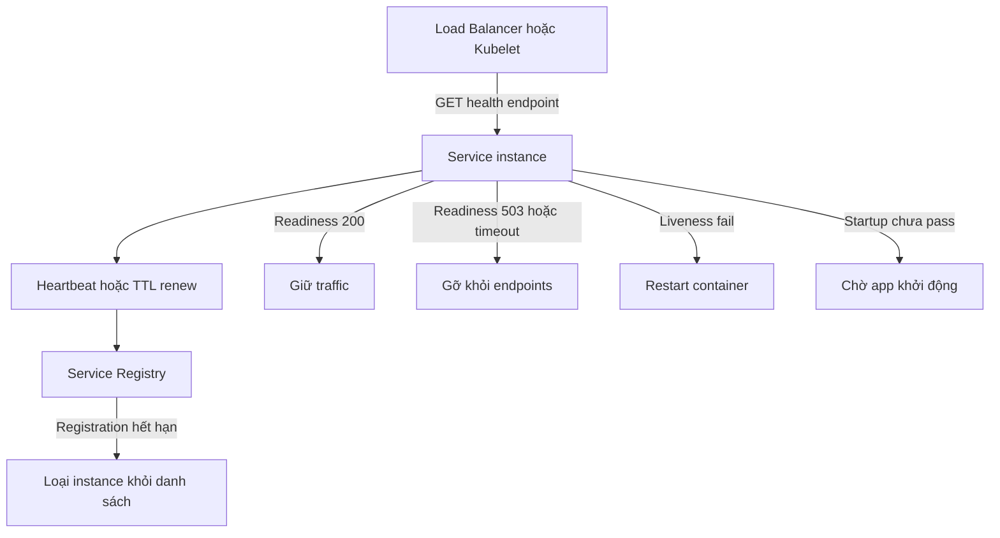
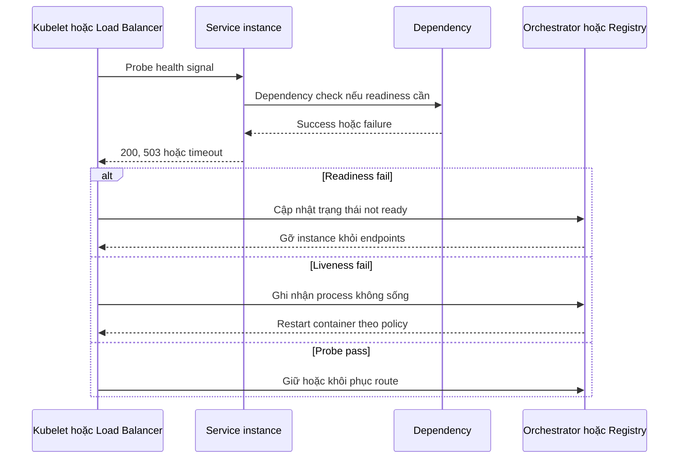

# Health Check / Heartbeat Pattern — Phát hiện sự cố chủ động

## Mục lục

- [Tổng quan](#tổng-quan)
  - [Mục tiêu reliability](#mục-tiêu-reliability)
  - [Health Check Heartbeat và Health Check API](#health-check-heartbeat-và-health-check-api)
  - [Phạm vi và ranh giới](#phạm-vi-và-ranh-giới)
- [Vấn đề cần giải quyết](#vấn-đề-cần-giải-quyết)
  - [Instance chết và zombie](#instance-chết-và-zombie)
  - [Failure detection và hành động tương ứng](#failure-detection-và-hành-động-tương-ứng)
- [Hai mô hình phát hiện](#hai-mô-hình-phát-hiện)
  - [Heartbeat push và TTL](#heartbeat-push-và-ttl)
  - [Active health check pull](#active-health-check-pull)
  - [So sánh heartbeat và active health check](#so-sánh-heartbeat-và-active-health-check)
  - [Kết hợp các tín hiệu](#kết-hợp-các-tín-hiệu)
- [Liveness Readiness và Startup ở góc reliability](#liveness-readiness-và-startup-ở-góc-reliability)
  - [Liveness](#liveness)
  - [Readiness](#readiness)
  - [Startup](#startup)
  - [Nguyên tắc shallow và deep check](#nguyên-tắc-shallow-và-deep-check)
- [Dependency checks](#dependency-checks)
  - [Dependency required và optional](#dependency-required-và-optional)
  - [Tổng hợp trạng thái](#tổng-hợp-trạng-thái)
  - [Kiểm soát tải của dependency checks](#kiểm-soát-tải-của-dependency-checks)
- [Luồng failure detection](#luồng-failure-detection)
  - [Từ tín hiệu đến hành động](#từ-tín-hiệu-đến-hành-động)
  - [Thời gian phát hiện và flapping](#thời-gian-phát-hiện-và-flapping)
- [Kubernetes và Load Balancer](#kubernetes-và-load-balancer)
  - [Kubernetes probes](#kubernetes-probes)
  - [Cấu hình probes minh họa](#cấu-hình-probes-minh-họa)
  - [Load Balancer và Service Discovery](#load-balancer-và-service-discovery)
- [Use case E Commerce](#use-case-e-commerce)
  - [Instance Payment bị treo](#instance-payment-bị-treo)
  - [Ứng dụng khởi động chậm](#ứng-dụng-khởi-động-chậm)
  - [Database tạm thời lỗi](#database-tạm-thời-lỗi)
- [Trade-offs](#trade-offs)
- [Khi nào nên dùng và khi nào không nên dùng](#khi-nào-nên-dùng-và-khi-nào-không-nên-dùng)
  - [Nên dùng](#nên-dùng)
  - [Không nên dùng hoặc nên giảm nhẹ](#không-nên-dùng-hoặc-nên-giảm-nhẹ)
- [Lỗi thường gặp](#lỗi-thường-gặp)
- [Vận hành](#vận-hành)
  - [Hiệu chỉnh check và probe](#hiệu-chỉnh-check-và-probe)
  - [Kiểm thử failure mode](#kiểm-thử-failure-mode)
  - [Metrics và alerting](#metrics-và-alerting)
  - [Bảo vệ health endpoint](#bảo-vệ-health-endpoint)
  - [Runbook khi instance bị đánh dấu unhealthy](#runbook-khi-instance-bị-đánh-dấu-unhealthy)
  - [Checklist](#checklist)
- [Phân biệt với Health Check API trong Observability](#phân-biệt-với-health-check-api-trong-observability)
- [Liên kết liên quan](#liên-kết-liên-quan)

---

## Tổng quan

**Health Check / Heartbeat** là pattern tạo ra tín hiệu để hạ tầng biết một service instance có còn hoạt động và có nên tiếp tục nhận traffic hay không. Tín hiệu có thể do instance tự gửi tới registry hoặc do registry, Load Balancer hay orchestrator chủ động kiểm tra.

Pattern này không chỉ hỏi process có còn tồn tại. Nó nối một kết quả kiểm tra với hành động reliability cụ thể:

- Instance chưa sẵn sàng thì tạm thời không nhận request mới.
- Instance bị treo hoặc ở trạng thái không thể tự phục hồi thì được restart.
- Instance đã chết hoặc không còn renew registration thì bị loại khỏi danh sách route.

### Mục tiêu reliability

Trong hệ thống Microservice, một instance có thể lỗi mà các instance khác vẫn hoạt động. Mục tiêu của pattern là giới hạn traffic đi vào instance đó và để hạ tầng tự phản ứng thay vì chờ người vận hành phát hiện thủ công.

```text
┌─────────────────────────────────────────────────────────────┐
│                    HEALTH SIGNAL                            │
│                                                             │
│  Instance ── heartbeat hoặc health response ──▶ Hạ tầng     │
│                                                     │       │
│                    ┌────────────────────────────────┘       │
│                    ▼                                        │
│       Route traffic / loại khỏi endpoints / restart         │
└─────────────────────────────────────────────────────────────┘
```

Health signal cần phản ánh đúng câu hỏi mà consumer đang cần. Load Balancer cần biết có nên route request. Kubelet cần biết container có cần restart. Registry cần biết registration còn hiệu lực. Một tín hiệu duy nhất không nhất thiết trả lời đúng cả ba câu hỏi.

### Health Check Heartbeat và Health Check API

Các thuật ngữ này có liên quan nhưng không đồng nghĩa:

| Thuật ngữ | Bản chất | Consumer thường gặp |
|---|---|---|
| **Heartbeat** | Instance chủ động gửi một tín hiệu định kỳ để chứng minh registration còn sống | Service Registry, cơ chế TTL |
| **Health Check** | Một phép kiểm tra trạng thái instance, có thể là push hoặc pull | Registry, Load Balancer, orchestrator |
| **Health Check API** | Contract endpoint để consumer gọi và đọc kết quả kiểm tra | Kubernetes probe, Load Balancer, operator |
| **Liveness / Readiness / Startup** | Các semantics khác nhau của health signal trong vòng đời container | Kubernetes |

Heartbeat thường chỉ chứng minh process còn có thể gửi tín hiệu tới registry. Active Health Check gọi vào endpoint để kiểm tra khả năng phục vụ theo contract. Vì vậy, một instance có thể heartbeat bình thường nhưng vẫn `not ready`.

### Phạm vi và ranh giới

Tài liệu này tập trung vào Health Check / Heartbeat như một **reliability pattern**: chọn tín hiệu, phát hiện failure, quyết định route hoặc restart, và vận hành failure detection.

- Phần [Health Check API Pattern](../17-observability-patterns/health-check-api.md) đi sâu hơn vào endpoint contract, HTTP status, response schema, shallow/deep check, bảo vệ endpoint và kiểm thử API.
- [Service Discovery](../08-service-discovery.md#33-health-check) tập trung vào heartbeat, TTL, active check và cách registry quản lý instance.
- [Kubernetes](../13-orchestration.md#6-health-check--self-healing) tập trung vào hành động của `livenessProbe`, `readinessProbe` và `startupProbe`.
- [Circuit Breaker](./circuit-breaker.md) nhìn từ caller và các call thực tế tới dependency. Health Check nhìn từ hạ tầng và trạng thái của từng instance. Một pattern không thay thế pattern kia.

Chi tiết phối hợp toàn bộ Reliability Patterns thuộc [17 — Reliability Patterns](../17-reliability-patterns.md#7-health-check--heartbeat--phát-hiện-sự-cố-chủ-động), không lặp lại trong trang này.

## Vấn đề cần giải quyết

### Instance chết và zombie

**Instance chết** là process đã thoát, container bị kill hoặc instance không còn renew registration. **Zombie** là process vẫn tồn tại nhưng không còn phục vụ đúng, chẳng hạn HTTP server bị treo, thread pool cạn hoặc dependency bắt buộc không thể truy cập.

```text
Không có health signal:
  Instance lỗi ──▶ Registry/LB chưa biết ──▶ traffic vẫn route vào instance lỗi
                                  └──────▶ user nhận lỗi ngẫu nhiên

Có health signal:
  Instance lỗi ──▶ probe hoặc TTL fail ──▶ hạ tầng ngừng route / restart phù hợp
```

Nếu chỉ nhìn process còn tồn tại, hạ tầng có thể giữ một zombie trong vòng traffic. Nếu mọi failure đều dẫn tới restart, một lỗi dependency dùng chung có thể tạo restart storm dù các process vẫn có khả năng phục hồi.

### Failure detection và hành động tương ứng

**Failure detection** là quá trình biến một dấu hiệu lỗi thành quyết định có giới hạn phạm vi. Cùng một dấu hiệu `503` có thể dẫn tới việc gỡ instance khỏi endpoints, nhưng không nên tự động dẫn tới restart nếu process vẫn hoạt động và chỉ dependency đang lỗi.

| Trạng thái được phát hiện | Tín hiệu phù hợp | Hành động reliability |
|---|---|---|
| Process không phản hồi hoặc bị deadlock | Liveness probe fail | Orchestrator có thể restart container |
| Target không phản hồi với active check | Active check timeout | Load Balancer hoặc registry gỡ route theo policy |
| Process còn chạy nhưng chưa thể nhận traffic | Readiness fail | Gỡ instance khỏi Service hoặc Load Balancer endpoints |
| App chưa hoàn tất initialization | Startup chưa pass | Chờ trong startup budget; không kết luận liveness quá sớm |
| Instance không renew registration | Heartbeat hoặc TTL hết hạn | Registry đánh dấu `DOWN` hoặc xóa registration |
| Một dependency của caller trả lời tệ | Call thực tế của caller | Circuit Breaker và timeout xử lý ở tầng caller |

Điểm mấu chốt là **hành động phải khớp với tầng phát hiện**. Health Check không nên được dùng để giả lập mọi request business, còn Circuit Breaker không phải là cơ chế thay thế việc loại một instance đã chết khỏi registry.

## Hai mô hình phát hiện

### Heartbeat push và TTL

Trong mô hình **Heartbeat push**, service chủ động gửi ping hoặc renew registration tới Service Registry theo chu kỳ. Registry giữ registration trong một **TTL** (*Time-To-Live*, thời gian hiệu lực). Nếu không nhận được heartbeat trước khi TTL hết, registry đánh dấu instance `DOWN` hoặc loại instance khỏi danh sách.

```text
Payment Service ── heartbeat mỗi 30s ──▶ Eureka / Registry
       │
       └── crash hoặc mất kết nối
                    │
                    ▼
        Không renew trước TTL khoảng 90s
                    │
                    ▼
        Registry đánh dấu instance DOWN
```

Các con số trên chỉ là ví dụ minh họa từ mô hình nguồn. Interval và TTL cần được chọn cùng nhau. TTL quá ngắn dễ loại nhầm instance vì một lần network jitter. TTL quá dài khiến entry cũ tiếp tục tồn tại và traffic có thể bị route sai lâu hơn.

Heartbeat có ưu điểm là protocol đơn giản và registry không cần gọi vào mọi endpoint. Nó phù hợp để phát hiện process đã chết hoặc không còn khả năng liên lạc với registry. Tuy nhiên, process vẫn có thể gửi heartbeat trong khi database connection pool đã cạn hoặc request business đều thất bại.

### Active health check pull

Trong mô hình **Active Health Check**, registry, Load Balancer hoặc orchestrator chủ động gọi health endpoint của instance theo chu kỳ. Consumer đọc HTTP status, timeout và semantics của endpoint để quyết định instance có healthy hay không.

```text
Registry / Load Balancer
        │ GET /health/ready mỗi 10s
        ▼
Payment Service instance
        ├── 200 OK ──▶ giữ instance trong vòng route
        ├── 503     ──▶ tạm thời gỡ instance khỏi traffic
        └── timeout ─▶ coi là không healthy theo policy
```

Active check có thể kiểm tra trạng thái phục vụ thực tế, gồm những dependency bắt buộc. Đổi lại, nó tạo ra một lượng polling đều đặn lên mọi instance. Nếu endpoint thực hiện deep check nặng ở mỗi lần poll, chính health system có thể làm tăng tải lên database hoặc downstream đang gặp sự cố.

### So sánh heartbeat và active health check

| Tiêu chí | Heartbeat push | Active health check pull |
|---|---|---|
| Ai chủ động | Service gửi tín hiệu tới registry | Registry, Load Balancer hoặc orchestrator gọi service |
| Phát hiện chính | Process không còn renew hoặc mất liên lạc với registry | Endpoint lỗi, timeout hoặc trạng thái không đạt contract |
| Điểm mạnh | Đơn giản, registry không cần poll liên tục | Thấy được readiness và một phần chất lượng phục vụ |
| Giới hạn | Process có thể heartbeat dù request business đã hỏng | Tạo tải polling và phụ thuộc vào thiết kế endpoint |
| Ví dụ | Eureka heartbeat, Consul TTL hoặc ephemeral registration | Consul HTTP check, Kubernetes probe, ALB target check |
| Hành động điển hình | Đánh dấu hoặc xóa registration stale | Gỡ route, giữ `not ready`, hoặc restart tùy loại probe |

Không có lựa chọn chung tốt hơn trong mọi hệ thống. Heartbeat phù hợp với lifecycle của registration. Active check phù hợp với quyết định route traffic. Khi công cụ hỗ trợ cả hai, có thể dùng mỗi tín hiệu cho một mục tiêu thay vì ép một tín hiệu trả lời mọi câu hỏi.

### Kết hợp các tín hiệu

Một triển khai có thể kết hợp:

- Heartbeat hoặc TTL để registry phát hiện instance không còn renew.
- Readiness để Load Balancer hoặc Service loại instance chưa phục vụ được.
- Liveness để orchestrator restart process bị treo.
- Startup để bảo vệ thời gian initialization.



Các tín hiệu có thể cùng quan sát một instance nhưng không nên có cùng semantics. Đặc biệt, readiness fail không nên tự động được diễn giải thành liveness fail.

## Liveness Readiness và Startup ở góc reliability

Trong Kubernetes, ba probe có quan hệ với ba hành động khác nhau. Ở góc reliability, khác biệt quan trọng nhất không nằm ở tên endpoint mà ở **hậu quả khi tín hiệu fail**.

### Liveness

**Liveness** trả lời: *process còn sống và có thể phản hồi không?* Khi liveness fail, kubelet có thể restart container.

Liveness nên là **shallow check**. Nó có thể kiểm tra HTTP server, event loop hoặc một trạng thái nội bộ cho biết process không bị deadlock. Nó không nên gọi database, Redis, Kafka hoặc downstream chỉ để chứng minh process còn sống.

Ví dụ, PostgreSQL tạm thời không kết nối được. Nếu liveness phụ thuộc PostgreSQL, tất cả Pod có thể fail cùng lúc rồi bị restart. Restart không sửa được database đang lỗi và còn có thể tạo restart storm. Trong trường hợp này, readiness mới là tín hiệu phù hợp để tạm ngừng route traffic.

### Readiness

**Readiness** trả lời: *instance có sẵn sàng nhận loại traffic mà nó đang phục vụ ngay bây giờ không?* Khi readiness fail, Kubernetes gỡ Pod khỏi Service endpoints nhưng không restart container chỉ vì failure đó.

Readiness có thể kiểm tra các dependency bắt buộc, chẳng hạn database chính hoặc downstream cần thiết cho request. Nếu service vẫn có thể phục vụ contract chính khi một dependency tùy chọn lỗi, dependency đó không nên tự động làm readiness fail toàn service.

Readiness cũng có thể fail trong lúc deploy, warm-up cache, pool chưa sẵn sàng hoặc app đang overloaded theo policy đã định. Khi trạng thái phục hồi, instance có thể được đưa lại vào endpoints.

### Startup

**Startup** trả lời: *ứng dụng đã hoàn tất initialization chưa?* Probe này dành cho app boot chậm, chẳng hạn app cần nạp cache hoặc hoàn tất nhiều bước initialization trước khi phục vụ.

Khi `startupProbe` chưa pass, Kubernetes chờ theo `failureThreshold` và `periodSeconds` trước khi xử lý container. Liveness và readiness không nên kết luận app đã hỏng chỉ vì app vẫn đang boot. Nếu startup không pass trong budget, container được xử lý theo policy của orchestrator, thường là restart.

Startup không làm app khởi động nhanh hơn. Nó chỉ tạo đủ thời gian để liveness không restart một app hợp lệ nhưng boot chậm.

### Nguyên tắc shallow và deep check

| Loại check | Kiểm tra | Probe phù hợp | Hậu quả khi fail |
|---|---|---|---|
| **Shallow** | Process hoặc event loop còn phản hồi | Liveness | Có thể restart container |
| **Deep vừa đủ** | Dependency required cho loại traffic cụ thể | Readiness | Gỡ instance khỏi endpoints, không restart chỉ vì dependency |
| **Startup state** | Initialization đã hoàn tất | Startup | Chờ thêm hoặc xử lý container sau startup budget |

Shallow không có nghĩa là bỏ qua mọi lỗi nội bộ. Nó có nghĩa là chỉ kiểm tra điều cần thiết cho câu hỏi “process còn sống không?”. Deep cũng không có nghĩa là gọi tất cả dependency trong mỗi poll. Check phải được giới hạn theo business contract và khả năng phục vụ thật.

## Dependency checks

### Dependency required và optional

Readiness nên phản ánh **khả năng phục vụ**, không phải danh sách mọi thành phần mà service từng kết nối. Trước khi đưa dependency vào readiness, cần xác định request nào thật sự cần dependency đó.

| Dependency | Khi nào là required | Khi nào có thể optional |
|---|---|---|
| Database chính | Request chính không thể đọc hoặc ghi đúng nếu database down | Hiếm; chỉ khi service có fallback đã được định nghĩa |
| Cache | Cache là điều kiện để xử lý đúng hoặc đáp ứng contract | Cache chỉ là tối ưu và service có thể đọc nguồn chính |
| Message broker | Service không thể hoàn tất semantics nhận hoặc phát message khi broker down | Nghiệp vụ có thể ghi nhận và enqueue lại theo workflow khác |
| Downstream service | Loại traffic đang xét cần downstream để trả kết quả đúng | Chỉ phục vụ tính năng phụ hoặc có degraded mode |

Ví dụ, Order Service có thể vẫn phục vụ tra cứu đơn khi Payment Service lỗi. Readiness của Order Service không nên fail chỉ vì Payment Service không ready nếu traffic tra cứu không cần Payment. Ngược lại, Payment Service có thể cần database riêng để xử lý mọi request thanh toán.

Nên ghi rõ danh sách `required` và `optional` trong service contract. Nếu không, một dependency phụ như metrics exporter có thể vô tình làm toàn bộ service bị gỡ khỏi traffic.

### Tổng hợp trạng thái

Một policy tổng hợp đơn giản là:

- Tất cả dependency `required` pass thì readiness trả `200`.
- Một dependency `required` fail hoặc timeout thì readiness trả `503 Service Unavailable`.
- Dependency `optional` fail thì service có thể vẫn trả `200` nếu business contract cho phép; body có thể ghi `DEGRADED` để operator biết.

HTTP status là tín hiệu dành cho máy. Body giúp con người điều tra nhưng không thay thế status code.

```http
GET /health/ready HTTP/1.1
Host: payment-service:8080

HTTP/1.1 503 Service Unavailable
Content-Type: application/json

{
  "status": "DEGRADED",
  "checks": {
    "database": { "status": "UP", "latency_ms": 12 },
    "redis": { "status": "UP", "latency_ms": 3 },
    "bank-api": { "status": "DOWN", "latency_ms": 2500 }
  }
}
```

Schema trên là ví dụ. Không trả password, token, connection string hoặc topology nội bộ. Nếu một endpoint tổng hợp trả `200` nhưng body chứa `status: DOWN`, nhiều probe vẫn coi instance healthy vì chỉ đọc HTTP status.

### Kiểm soát tải của dependency checks

Health endpoint thường bị gọi định kỳ từ nhiều consumer. Một deep check gọi database hoặc downstream trong mỗi poll có thể tạo tải thêm đúng lúc dependency cần được giảm tải.

Các biện pháp kiểm soát:

- Dùng operation đọc nhẹ thay vì query nghiệp vụ lớn.
- Đặt timeout riêng cho từng dependency để một dependency chậm không giữ health request vô hạn.
- Cache kết quả check trong vài giây khi độ tươi tuyệt đối không cần thiết.
- Không retry nhiều lần trong health handler. Polling bên ngoài đã tạo đủ nhịp kiểm tra.
- Không mutation, publish message hoặc tạo side effect trong health check.
- Theo dõi latency của chính health endpoint và từng dependency check.

Ví dụ, `50` Pod poll mỗi `5` giây đã tạo khoảng `10` lần gọi mỗi giây cho một loại check, chưa tính nhiều dependency. Đây là phép tính minh họa để thấy polling có thể thành traffic đáng kể; tần suất và số instance thực tế cần được đo trong hệ thống.

Cache quá lâu có thể làm instance tiếp tục nhận traffic sau khi dependency đã hỏng. Cache quá ngắn hoặc không cache có thể làm dependency bị poll liên tục. Hãy chọn theo yêu cầu phát hiện failure và tải mà dependency chịu được.

## Luồng failure detection

### Từ tín hiệu đến hành động

Một luồng xử lý reliability điển hình có thể được đọc theo bốn bước:

1. Consumer thực hiện heartbeat hoặc gọi health endpoint.
2. Consumer áp dụng timeout, số lần fail liên tiếp và policy trạng thái.
3. Hạ tầng thay đổi route hoặc vòng đời instance theo đúng semantics.
4. Metrics và alerting ghi nhận để operator biết tín hiệu có phản ánh outage thật hay không.



Probe chỉ là tín hiệu. Kubelet, Load Balancer hoặc Registry mới là component thực hiện restart, gỡ route hoặc cập nhật registration. Vì vậy, cần kiểm tra cả endpoint lẫn hành động của consumer trong integration test.

### Thời gian phát hiện và flapping

Thời gian phát hiện phụ thuộc vào nhiều yếu tố:

- `periodSeconds` hoặc heartbeat interval quyết định khoảng cách giữa các lần kiểm tra.
- `timeoutSeconds` quyết định một lần kiểm tra được chờ bao lâu.
- `failureThreshold` hoặc TTL quyết định cần bao nhiêu failure trước khi hành động.
- Recovery policy quyết định instance quay lại traffic nhanh hay chậm.

Kiểm tra càng dày và threshold càng thấp thì phản ứng nhanh hơn, nhưng dễ nhạy với network jitter, GC pause hoặc spike ngắn. Kiểm tra thưa và threshold lớn giảm false positive nhưng kéo dài thời gian traffic đi vào instance lỗi.

**Flapping** là trạng thái instance liên tục chuyển giữa `ready` và `not ready`. Nó có thể làm route thay đổi liên tục và khiến rollout không ổn định. Hãy theo dõi số lần chuyển trạng thái, not-ready duration và nguyên nhân cụ thể thay vì chỉ nhìn tỷ lệ pass cuối cùng.

Các giá trị `30s`, `90s`, `10s`, `5s` và các threshold trong tài liệu là ví dụ từ các scenario nguồn. Không dùng chúng như preset chung cho mọi service.

## Kubernetes và Load Balancer

### Kubernetes probes

Kubernetes chuẩn hóa ba câu hỏi thành ba loại probe:

| Probe | Câu hỏi | Khi fail |
|---|---|---|
| `livenessProbe` | Process còn sống và không bị treo không? | Kubelet có thể restart container |
| `readinessProbe` | Pod có sẵn sàng nhận traffic không? | Pod bị gỡ khỏi Service endpoints, không restart chỉ vì readiness |
| `startupProbe` | App đã khởi động xong chưa? | Kubelet chờ trong startup budget hoặc xử lý container sau threshold |

`startupProbe` bảo vệ app boot chậm. Sau khi startup pass, liveness và readiness mới thực hiện vai trò runtime của chúng theo cấu hình. Một endpoint deep duy nhất cho cả ba probe làm mất ý nghĩa của các hành động khác nhau.

### Cấu hình probes minh họa

Manifest dưới đây dùng các endpoint minh họa ở trên. Các giá trị chỉ là điểm bắt đầu để kiểm thử, không phải cấu hình mặc định cho mọi service.

```yaml
apiVersion: apps/v1
kind: Deployment
metadata:
  name: order-service
spec:
  template:
    spec:
      containers:
        - name: order-service
          image: myapp/order-service:1.4.2
          livenessProbe:
            httpGet:
              path: /health/live
              port: 8080
            periodSeconds: 10
            timeoutSeconds: 3
            failureThreshold: 3
          readinessProbe:
            httpGet:
              path: /health/ready
              port: 8080
            periodSeconds: 5
            timeoutSeconds: 3
            failureThreshold: 2
          startupProbe:
            httpGet:
              path: /health/startup
              port: 8080
            periodSeconds: 5
            timeoutSeconds: 3
            failureThreshold: 30
```

Trong ví dụ, startup budget nominal là `30 × 5 = 150` giây, chưa tính mọi chi tiết thời điểm probe bắt đầu và timeout. Budget phải lớn hơn thời gian boot bình thường của app trong môi trường tương ứng.

Một readiness check fail hai lần không có cùng ý nghĩa với liveness fail ba lần. Liveness có thể dẫn tới restart. Readiness chỉ nên thay đổi membership của Pod trong endpoints. Khi kiểm thử, cần xác nhận đúng hành động này thay vì chỉ kiểm tra HTTP response.

### Load Balancer và Service Discovery

Load Balancer thường nên dùng readiness semantics để quyết định có route request tới target hay không:

```text
Load Balancer / Kubernetes Service
  ├── Pod 1 — /health/ready → 200 ──► nhận traffic
  ├── Pod 2 — /health/ready → 503 ──► tạm thời không nhận traffic
  └── Pod 3 — timeout        ──► tạm thời không nhận traffic
```

Liveness không phải lúc nào cũng là health check phù hợp cho routing. Một process có thể vẫn phản hồi endpoint liveness nhưng chưa có database connection cần thiết cho request. Ngược lại, readiness fail không nhất thiết có nghĩa process cần restart.

Service Discovery có thể dùng heartbeat, TTL hoặc active health check tùy công cụ. Cách registry đánh dấu `DOWN`, xóa entry và đưa instance trở lại phụ thuộc implementation. Contract của service vẫn cần nhất quán về HTTP status và semantics.

Readiness cũng là một cổng an toàn cho rolling update, canary hoặc blue-green deployment: version mới chỉ nên nhận traffic sau khi pass readiness. Chiến lược deployment chi tiết nằm trong [14 — CI/CD & Deployment](../14-cicd-deployment.md).

## Use case E Commerce

### Instance Payment bị treo

Payment Service có ba replica. Instance `#3` vẫn còn process nhưng không xử lý request đúng. Luồng failure detection có thể diễn ra như sau:

```text
Instance #3 của Payment Service bị treo
        │
        ▼
Readiness probe fail 2 lần
        │
        ▼
Kubernetes gỡ instance #3 khỏi Service endpoints
        │
        ▼
Traffic chỉ đi vào instance #1 và #2
        │
        ▼
Liveness probe fail 3 lần vì process thật sự không phản hồi
        │
        ▼
Kubelet restart container #3
        │
        ▼
Startup và readiness pass
        │
        ▼
Instance #3 quay lại endpoints
```

Readiness giới hạn lỗi nhìn thấy từ user trước. Liveness và restart xử lý vòng đời instance sau khi xác định process thật sự không còn recover được. Nếu instance chỉ mất kết nối database nhưng HTTP server vẫn phản hồi, policy phù hợp thường là readiness `503` và chờ recovery, không phải restart hàng loạt Pod.

### Ứng dụng khởi động chậm

Một version mới của Order Service cần khoảng `60` giây để nạp cache. Nếu liveness bắt đầu kiểm tra sau `10` giây mà không có startup probe, app có thể fail khi vẫn đang boot. Kubelet restart container, rồi container mới lại bắt đầu boot từ đầu. Vòng lặp đó khiến app không bao giờ có cơ hội hoàn tất initialization.

Cấu hình startup probe với budget đủ lớn giúp tách hai giai đoạn:

1. `/health/startup` chỉ pass sau khi initialization cần thiết hoàn tất.
2. Liveness chỉ kiểm tra process sau khi startup pass.
3. Readiness chỉ giữ Pod trong endpoints khi Pod thực sự nhận traffic được.

Startup probe không thay thế readiness. App có thể boot xong nhưng vẫn `not ready` vì database hoặc dependency bắt buộc chưa sẵn sàng.

### Database tạm thời lỗi

PostgreSQL của Payment Service tạm thời không đáp ứng. Readiness deep check phát hiện database required không thể phục vụ và trả `503`.

Kubernetes hoặc Load Balancer tạm thời gỡ Pod khỏi endpoints. Pod không bị restart chỉ vì database đang lỗi. Khi database phục hồi, readiness trả `200` và Pod có thể trở lại endpoints theo policy của hạ tầng.

Nếu deep check được đặt vào liveness, mọi Pod Payment có thể bị restart trong khi nguyên nhân nằm ở PostgreSQL. Restart không sửa dependency đang lỗi và có thể tạo restart storm. Phân biệt readiness với liveness giúp hành động đúng: **gỡ traffic khi chưa phục vụ được, chỉ restart khi chính process không còn recover được**.

## Trade-offs

| Lợi ích | Cái giá hoặc rủi ro |
|---|---|
| Tự động loại instance lỗi khỏi traffic | Cần triển khai endpoint, registry hoặc probe nhất quán ở nhiều service |
| Phân biệt `not ready` với process chết | Semantics sai có thể gây restart storm hoặc gỡ nhầm toàn bộ traffic |
| Hỗ trợ self-healing, scale và rollout an toàn | Polling tạo thêm CPU, network và tải lên dependency |
| Phát hiện zombie mà chỉ nhìn process không thấy | Health check quá nông có thể bỏ sót lỗi phục vụ; quá sâu lại tạo coupling |
| Threshold giúp tránh phản ứng với một failure ngắn | Threshold quá chặt gây flapping; quá rộng làm phát hiện chậm |
| Response chi tiết hỗ trợ điều tra | Có thể lộ version, dependency hoặc topology nội bộ nếu expose sai |

Trade-off trung tâm là **tốc độ phát hiện so với chi phí và false positive**. Health signal cần đủ nhẹ để chạy thường xuyên, nhưng đủ có ý nghĩa để hành động route hoặc restart không trở thành nguồn outage mới.

## Khi nào nên dùng và khi nào không nên dùng

### Nên dùng

- Service chạy sau Kubernetes, ECS, Nomad hoặc orchestrator có cơ chế health signal.
- Service đứng sau Load Balancer và cần tự động gỡ target không sẵn sàng.
- Service có nhiều replica, IP hoặc registration thay đổi khi scale và deploy.
- Cần rolling update, canary hoặc blue-green mà instance mới chỉ được nhận traffic sau khi pass readiness.
- Registry hỗ trợ heartbeat hoặc TTL và cần loại registration stale.
- App có boot time biến động, cache warm-up hoặc initialization nhiều bước.
- Service có dependency required mà failure của dependency ảnh hưởng trực tiếp tới loại traffic đang nhận.

Bắt đầu với contract nhỏ: liveness shallow, readiness kiểm tra dependency required vừa đủ, và startup khi boot chậm. Chỉ thêm deep check khi có consumer và hành động rõ ràng cho kết quả đó.

### Không nên dùng hoặc nên giảm nhẹ

- **Batch job, CLI hoặc worker one-shot:** không nhận traffic liên tục nên readiness thường không có ý nghĩa. Job status, exit code hoặc worker lease phù hợp hơn.
- **Ứng dụng không nằm sau orchestrator, registry hoặc Load Balancer:** có thể chỉ cần một endpoint nội bộ đơn giản nếu có consumer thật sự cần.
- **Liveness phụ thuộc database hoặc downstream:** không nên dùng cách này; chuyển dependency check sang readiness.
- **Dependency tùy chọn được đưa vào readiness bắt buộc:** nếu service vẫn đáp ứng contract chính, không nên tự gỡ toàn bộ service.
- **Dùng Health Check thay Circuit Breaker:** Health Check loại instance ở tầng hạ tầng; Circuit Breaker fail fast theo trải nghiệm của từng caller và dependency.
- **Không có hành động khi check fail:** nếu không route, restart, alert hoặc cập nhật registry nào tiêu thụ tín hiệu, việc thêm check chỉ tạo overhead.

“Không cần đủ ba endpoint” không có nghĩa là được phép để external call chờ vô hạn. Timeout và failure handling vẫn thuộc trách nhiệm của client và service.

## Lỗi thường gặp

| Lỗi | Hậu quả | Cách tránh |
|---|---|---|
| Đặt deep check vào **liveness** | Database hoặc downstream lỗi làm nhiều Pod lành bệnh bị restart | Liveness shallow; readiness kiểm tra dependency required |
| Chỉ có liveness, không có readiness | Pod đang boot hoặc chưa kết nối dependency vẫn nhận traffic | Tách readiness và dùng nó cho route |
| Dùng cùng một deep endpoint cho cả startup, liveness và readiness | Boot chậm hoặc dependency tạm thời lỗi dẫn tới hành động sai | Tách semantics và endpoint hoặc handler |
| Health endpoint luôn trả `200` dù body có `DOWN` | Probe coi instance healthy và vẫn route traffic | Dùng HTTP status nhất quán, thường `503` khi not ready |
| Heartbeat được xem là bằng chứng service phục vụ tốt | Zombie vẫn còn trong registry | Kết hợp active check hoặc readiness khi cần kiểm tra khả năng phục vụ |
| Gọi database mỗi lần poll mà không giới hạn | Health check tạo tải lên dependency đang gặp sự cố | Check nhẹ, timeout rõ và cân nhắc cache ngắn hạn |
| `periodSeconds`, TTL hoặc threshold quá chặt | Một jitter ngắn làm instance flapping hoặc bị loại oan | Hiệu chỉnh từ latency, startup time và failure liên tiếp |
| Không có startup probe cho app boot chậm | Container rơi vào crash loop trước khi boot xong | Dùng startup budget lớn hơn thời gian boot bình thường |
| Health endpoint yêu cầu Authentication phức tạp | Kubelet hoặc Load Balancer không gọi được | Đặt endpoint trong mạng nội bộ và dùng cơ chế probe hỗ trợ |
| Expose response chi tiết ra public Internet | Lộ version, dependency, topology hoặc dữ liệu nhạy cảm | Tách probe endpoint khỏi diagnostics; không trả secret |
| Đổi path hoặc semantics nhưng không đổi manifest | Probe gọi sai hoặc hiểu sai trạng thái sau deploy | Version contract cùng cấu hình hạ tầng và test |
| Chỉ kiểm tra response mà không kiểm tra hành động hạ tầng | Endpoint đúng nhưng route hoặc restart không hoạt động | Integration test với registry, Load Balancer hoặc Kubernetes |

## Vận hành

### Hiệu chỉnh check và probe

Health check là production configuration, không phải vài dòng YAML mặc định. Khi hiệu chỉnh:

- Đo thời gian boot thực tế của từng version và môi trường. Startup budget phải đủ cho initialization bình thường.
- Đo latency của health handler và từng dependency check. `timeoutSeconds` cần đủ rộng cho trạng thái bình thường nhưng vẫn có giới hạn.
- Chọn `periodSeconds`, heartbeat interval, TTL và `failureThreshold` cùng nhau.
- Giữ liveness shallow dù readiness có deep check.
- Phân loại dependency `required` và `optional` theo business contract.
- Kiểm tra cách hạ tầng xử lý timeout, HTTP `503`, registration hết TTL và recovery.
- Review lại cấu hình khi thay đổi cache warm-up, connection pool, database, downstream hoặc service mesh.

Công thức `failureThreshold × periodSeconds` chỉ là ước lượng nominal. `timeoutSeconds`, thời điểm bắt đầu probe và behavior của consumer cũng ảnh hưởng thời gian thực tế. Không dùng một con số mẫu như SLO chung.

### Kiểm thử failure mode

Kiểm thử cần bao phủ response, trạng thái và hành động của hạ tầng:

| Tình huống | Kết quả cần xác nhận |
|---|---|
| App đang boot | Startup chưa pass; liveness không restart sớm |
| App boot xong, dependency required hoạt động | Các probe pass theo contract |
| Process bị deadlock hoặc không phản hồi | Liveness fail để orchestrator có thể restart |
| Database required mất kết nối | Readiness `503`; Pod bị gỡ traffic nhưng không restart chỉ vì lỗi này |
| Dependency optional lỗi | Service vẫn phục vụ contract chính hoặc chuyển degraded mode theo policy |
| Heartbeat không renew | Registry đánh dấu hoặc xóa registration sau TTL theo policy |
| Nhiều consumer poll đồng thời | Health handler không tạo tải bất thường hoặc giữ resource vô hạn |
| Endpoint đổi path | Manifest, Load Balancer và contract test phát hiện mapping sai |
| Dependency phục hồi | Readiness pass lại và route được khôi phục có kiểm soát |

Nên kiểm thử vòng đời `starting → ready → not ready → ready` và thực hiện fault injection có giới hạn cho dependency chậm, instance bị kill và network timeout. Sau khi đổi HTTP server, framework, client hoặc service mesh, chạy lại contract test.

### Metrics và alerting

Theo dõi health signal theo `service`, `instance`, `version`, `consumer` và dependency khi có thể:

| Nhóm tín hiệu | Câu hỏi cần trả lời |
|---|---|
| Probe fail và timeout | Instance nào fail, fail ở probe nào và trong bao lâu? |
| Ready ratio | Có bao nhiêu replica đang nhận traffic? |
| Not-ready duration | Instance bị gỡ route lâu hay chỉ chớp nhoáng? |
| State transition và flapping | Instance chuyển ready/not ready bao nhiêu lần? |
| Container restart và crash loop | Liveness hoặc startup có dẫn tới restart lặp lại không? |
| Health endpoint latency | Handler hay dependency check nào đang chậm? |
| Heartbeat renew và TTL expiry | Registration nào stale hoặc mất renew? |
| Dependency check result | Dependency nào thường xuyên làm readiness fail? |

Alert nên phân biệt một lần fail ngắn với readiness fail kéo dài, tỷ lệ replica ready giảm hoặc restart tăng liên tục. Khi rollout, theo dõi ready ratio cùng error rate và latency của traffic thật. Health signal xanh không chứng minh mọi business request đều thành công.

### Bảo vệ health endpoint

Health endpoint thường được gọi từ mạng nội bộ nhưng vẫn có thể tiết lộ thông tin hữu ích cho người tấn công:

- Chỉ cho phép kubelet, Load Balancer, Service Discovery hoặc mạng vận hành truy cập endpoint chi tiết.
- Không trả password, token, connection string, credential hoặc payload nghiệp vụ.
- Tách endpoint probe tối giản khỏi endpoint diagnostics chi tiết nếu operator cần nhiều thông tin hơn.
- Nếu public endpoint là bắt buộc, chỉ trả trạng thái tổng quát và không expose danh sách dependency.
- Không dùng Health Check API làm cơ chế Authentication hoặc Authorization cho business API.

Endpoint probe không nên phụ thuộc vào flow login phức tạp nếu consumer hạ tầng không thể thực hiện flow đó. Network policy và quyền truy cập cần được thiết kế cùng contract endpoint.

### Runbook khi instance bị đánh dấu unhealthy

1. Xác định `service`, `instance`, `version`, region, consumer và thời điểm bắt đầu.
2. Xác định tín hiệu fail là heartbeat hết TTL, readiness `503`, liveness timeout hay startup chưa pass.
3. Kiểm tra response phase, health handler latency, dependency required và resource saturation của instance.
4. So sánh với các replica khác để phân biệt lỗi cục bộ với lỗi dependency dùng chung.
5. Nếu chỉ readiness fail do dependency, giữ process để chờ recovery và tránh restart hàng loạt.
6. Nếu liveness hoặc startup fail do process không recover được, để orchestrator restart theo policy; không restart thủ công hàng loạt trước khi xác định phạm vi.
7. Kiểm tra registry hoặc Load Balancer đã gỡ instance và traffic có chuyển sang replica khỏe chưa.
8. Sau recovery, xác nhận startup, readiness, ready ratio, error rate và flapping đã trở lại bình thường.
9. Ghi lại nguyên nhân, thời gian phát hiện và thay đổi cấu hình để review threshold hoặc dependency policy.

### Checklist

- [ ] Đã xác định consumer của từng health signal: registry, Load Balancer hay orchestrator.
- [ ] Heartbeat, TTL và renewal policy được cấu hình tường minh khi dùng registry.
- [ ] Liveness là shallow check và không phụ thuộc database, cache, queue hoặc downstream.
- [ ] Readiness chỉ kiểm tra dependency `required` cho loại traffic thực tế.
- [ ] Startup phản ánh initialization hoàn tất, không chỉ việc process bind port.
- [ ] HTTP status thể hiện pass/fail; không chỉ dựa vào JSON body.
- [ ] Health handler nhanh, có timeout và không có side effect nghiệp vụ.
- [ ] Dependency check có polling frequency, cache hoặc giới hạn tải phù hợp.
- [ ] Kubernetes, Load Balancer và Service Discovery trỏ đúng path và semantics.
- [ ] Threshold, period, timeout và startup budget đã được hiệu chỉnh từ dữ liệu thực tế.
- [ ] Đã kiểm thử starting, ready, not ready, process failure, dependency failure và recovery.
- [ ] Theo dõi probe failure, ready ratio, not-ready duration, restart và flapping.
- [ ] Endpoint chi tiết ở mạng nội bộ và không chứa secret hoặc thông tin nhạy cảm.
- [ ] Có runbook phân biệt route removal với restart và heartbeat expiry.
- [ ] Health Check không được dùng như Circuit Breaker hoặc thay thế timeout của external call.

## Phân biệt với Health Check API trong Observability

Hai tài liệu cùng nói về health nhưng ở hai góc nhìn khác nhau:

| Tài liệu này | [Health Check API trong Observability](../17-observability-patterns/health-check-api.md) |
|---|---|
| Tập trung vào reliability outcome: phát hiện instance lỗi, route, registration và restart | Tập trung vào contract của endpoint: path, HTTP status, schema và cách expose dữ liệu |
| So sánh heartbeat push với active check pull | Đi sâu vào thiết kế shallow/deep endpoint, dependency check và response |
| Giải thích vì sao liveness, readiness và startup phải có hành động khác nhau | Mô tả cấu hình probe, kiểm thử contract, bảo vệ endpoint và vận hành API |
| Dùng để quyết định hạ tầng nên làm gì khi tín hiệu fail | Dùng để chuẩn hóa cách service phát ra tín hiệu cho consumer |

Một service cần cả hai góc nhìn: endpoint phải có contract rõ để consumer đọc đúng, còn hạ tầng phải gắn kết quả đó với hành động reliability đúng. Không nên sao chép một deep health endpoint vào liveness chỉ vì endpoint đó đã tồn tại.

## Liên kết liên quan

- [17 — Reliability Patterns](../17-reliability-patterns.md#7-health-check--heartbeat--phát-hiện-sự-cố-chủ-động) — phần tổng hợp về Health Check / Heartbeat và các reliability pattern cùng nhóm.
- [Health Check API Pattern](../17-observability-patterns/health-check-api.md) — endpoint contract, response status/schema, dependency checks và vận hành API.
- [08 — Service Discovery](../08-service-discovery.md#33-health-check) — heartbeat, TTL, active check và registry.
- [10 — Resilience Patterns](../10-resilience-patterns.md#81-health-check) — Health Check ở góc nhìn resilience.
- [11 — Observability & Evolvability](../11-observability-evolvability.md#6-health-check--readiness) — liveness, readiness, startup và thiết kế health endpoint ở phần nền tảng.
- [13 — Orchestration](../13-orchestration.md#6-health-check--self-healing) — Kubernetes probes và self-healing.
- [14 — CI/CD & Deployment](../14-cicd-deployment.md) — readiness trong rolling update và progressive delivery.
- [Circuit Breaker Pattern](./circuit-breaker.md) — cơ chế fail fast từ caller, không thay thế health signal của hạ tầng.
