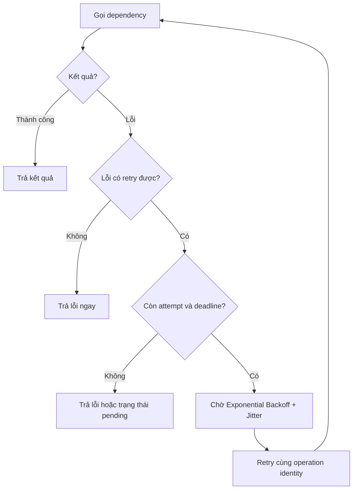

# Retry with Backoff và Jitter Pattern — xử lý lỗi tạm thời

## Mục lục

- [Tổng quan](#tổng-quan)
  - [Retry Pattern giải quyết vấn đề gì](#retry-pattern-giải-quyết-vấn-đề-gì)
  - [Transient failure và giới hạn của Retry](#transient-failure-và-giới-hạn-của-retry)
- [Cách hoạt động](#cách-hoạt-động)
  - [Retry policy cần quyết định gì](#retry-policy-cần-quyết-định-gì)
  - [Luồng xử lý](#luồng-xử-lý)
- [Exponential Backoff](#exponential-backoff)
  - [Khoảng chờ tăng dần](#khoảng-chờ-tăng-dần)
  - [Ví dụ timeline](#ví-dụ-timeline)
- [Jitter](#jitter)
  - [Vì sao cần Jitter](#vì-sao-cần-jitter)
  - [Full Jitter](#full-jitter)
- [Retryable và non-retryable errors](#retryable-và-non-retryable-errors)
- [Retry budget và overall deadline](#retry-budget-và-overall-deadline)
  - [Giới hạn attempts và thời gian](#giới-hạn-attempts-và-thời-gian)
  - [Retry budget kiểm soát traffic](#retry-budget-kiểm-soát-traffic)
- [Idempotency và Idempotency Key](#idempotency-và-idempotency-key)
  - [Operation idempotent](#operation-idempotent)
  - [Khi kết quả chưa xác định](#khi-kết-quả-chưa-xác-định)
- [Use case Payment provider](#use-case-payment-provider)
  - [Bối cảnh](#bối-cảnh)
  - [Luồng retry an toàn](#luồng-retry-an-toàn)
  - [Khi provider không hỗ trợ Idempotency Key](#khi-provider-không-hỗ-trợ-idempotency-key)
- [Trade-offs](#trade-offs)
- [Khi nào nên dùng và không nên dùng](#khi-nào-nên-dùng-và-không-nên-dùng)
  - [Nên dùng khi](#nên-dùng-khi)
  - [Không nên dùng khi](#không-nên-dùng-khi)
- [Lỗi thường gặp](#lỗi-thường-gặp)
- [Vận hành](#vận-hành)
  - [Metrics và tracing](#metrics-và-tracing)
  - [Logging và phân loại kết quả](#logging-và-phân-loại-kết-quả)
  - [Kiểm thử và rollout](#kiểm-thử-và-rollout)
  - [Runbook khi retry tăng](#runbook-khi-retry-tăng)
- [Checklist](#checklist)
- [Liên kết liên quan](#liên-kết-liên-quan)

---

## Tổng quan

### Retry Pattern giải quyết vấn đề gì

**Retry** là việc caller (service gọi) thực hiện lại một request sau khi lần gọi trước thất bại. Pattern này phù hợp với lỗi có khả năng tự biến mất trong thời gian ngắn, chẳng hạn một lần `connection reset` khi dependency đang chuyển instance.

Retry không có nghĩa là gọi cho đến khi thành công. Mỗi lần gọi thêm đều làm tăng latency và traffic tới dependency. Một policy hữu ích phải giới hạn số lần thử, khoảng chờ và tổng thời gian mà request được phép sử dụng.

### Transient failure và giới hạn của Retry

**Transient failure** là lỗi tạm thời, có thể tự hồi phục sau một khoảng ngắn. Ví dụ gồm network hiccup, timeout thoáng qua, connection reset hoặc dependency trả `502`, `503`, `504` trong lúc rolling update. Ngược lại, lỗi validation, quyền truy cập hoặc bug logic thường không thay đổi chỉ vì gọi lại.

| Loại sự cố | Ví dụ | Hướng xử lý mặc định |
|---|---|---|
| **Transient failure** | Connection reset, timeout, `502`, `503`, `504` | Có thể retry nếu operation an toàn và còn budget |
| **Persistent failure** | Service chết lâu, deploy lỗi, dependency quá tải kéo dài | Không retry liên tục; dừng theo policy và xử lý theo contract |
| **Permanent hoặc business error** | Payload sai, validation fail, quyền không hợp lệ | Trả lỗi ngay; retry không làm input đúng hơn |

Retry chỉ tạo thêm cơ hội thành công. Nó không sửa nguyên nhân gốc như cấu hình sai, schema không tương thích hoặc dependency đã ngừng phục vụ. Nếu lỗi kéo dài, việc retry thiếu giới hạn có thể biến một sự cố thành thêm tải cho cả hai phía.

## Cách hoạt động

### Retry policy cần quyết định gì

Một **Retry Policy** cần trả lời rõ các câu hỏi sau trước khi được bật trong production:

| Câu hỏi | Quyết định cần có |
|---|---|
| **Lỗi nào được retry?** | Phân loại theo error type, HTTP status, timeout và contract của dependency. Không mặc định retry mọi lỗi `5xx` hoặc mọi exception. |
| **Operation có an toàn không?** | Xác nhận operation là idempotent hoặc có `Idempotency Key` trước khi lặp lại side effect. |
| **Thử lại bao nhiêu lần?** | Định nghĩa rõ `max attempts` hoặc `max retries`. Hai cách đếm này không giống nhau. |
| **Chờ giữa các lần thế nào?** | Dùng **Exponential Backoff** có giới hạn và thêm **Jitter** để tránh các caller retry đồng thời. |
| **Còn thời gian không?** | Kiểm tra `overall deadline` trước cả khi chờ backoff và trước khi bắt đầu attempt mới. |
| **Khi hết lượt thì làm gì?** | Trả lỗi cuối cùng, trả trạng thái chưa xác định hoặc chuyển sang workflow khác theo contract nghiệp vụ. |

Một policy tối giản có thể được diễn đạt bằng pseudocode sau:

```text
attempts = 0

while attempts < max_attempts:
    result = call_dependency(per_try_timeout)

    if result.success:
        return result

    if not is_retryable(result.error):
        return result.error

    if no_remaining_attempt_or_deadline():
        return result.error_or_pending_state

    delay = exponential_backoff_with_jitter(attempts)
    wait(min(delay, remaining_budget()))
    attempts += 1

return final_failure
```

Đây là khung logic, không phải cấu hình cố định cho mọi hệ thống. `per_try_timeout` giới hạn một lần gọi; `overall deadline` giới hạn cả chuỗi gọi và thời gian chờ.

### Luồng xử lý



Nếu server gửi `Retry-After`, client nên tôn trọng khoảng chờ đó thay vì tự retry sớm hơn. Khoảng chờ vẫn phải nằm trong `overall deadline`; một header không thể cấp thêm thời gian cho request đã hết hạn.

## Exponential Backoff

### Khoảng chờ tăng dần

**Exponential Backoff** làm khoảng chờ giữa các lần retry tăng dần, thay vì gửi lại liên tục. Với `n = 0` cho lần retry đầu tiên, một công thức làm điểm khởi đầu là:

```text
delay_n = min(max_delay, base_delay × 2^n)
```

Ví dụ `base_delay = 1s` và `max_delay = 30s`:

| Lần retry | Delay trước khi thêm Jitter |
|---:|---:|
| 1 | 1s |
| 2 | 2s |
| 3 | 4s |
| 4 | 8s |
| 5 | 16s |
| 6 trở đi | 30s, đã chạm giới hạn |

`max_delay` ngăn khoảng chờ tăng vô hạn. Các giá trị `base_delay`, `max_delay` và số lần retry phải được đối chiếu với latency, SLA và deadline của operation. Backoff làm giảm áp lực tức thời lên dependency, nhưng nếu mọi caller dùng cùng một nhịp cố định thì chúng vẫn có thể retry đồng loạt.

### Ví dụ timeline

Timeline dưới đây dùng `base delay = 1s`, **Full Jitter**, tối đa `3 retries` và `overall deadline = 10s`. Các mốc jitter chỉ là ví dụ; lần chạy khác có thể cho thời điểm khác.

```text
t=0.0s   Attempt 1       → connection reset
         Chọn delay ngẫu nhiên trong khoảng [0s, 1s] → 0.6s

t=0.6s   Retry 1         → timeout
         Chọn delay ngẫu nhiên trong khoảng [0s, 2s] → 1.5s

t=2.1s   Retry 2         → 503 Service Unavailable
         Chọn delay ngẫu nhiên trong khoảng [0s, 4s] → 2.3s

t=4.4s   Retry 3         → 200 OK

→ Request thành công ở t=4.4s.
→ Nếu Retry 3 vẫn thất bại, policy dừng và không tự tạo Retry 4.
```

Người dùng có thể thấy request chậm hơn khi retry cứu được lỗi. Đổi lại, caller tránh được việc từ bỏ ngay trước một lỗi mạng ngắn. Nếu tổng thời gian còn lại không đủ cho một attempt hợp lý, dừng retry sẽ đúng hơn là bắt đầu một request chắc chắn vượt deadline.

## Jitter

### Vì sao cần Jitter

**Jitter** là thành phần ngẫu nhiên trong khoảng chờ. Nó phá sự đồng bộ giữa các caller cùng nhận lỗi tại một thời điểm.

Không có Jitter, 100 client có thể cùng gọi ở `t=0`, cùng retry ở `t=1s`, rồi cùng retry ở `t=2s`. Đây là hiện tượng **Thundering Herd**: dependency vừa bắt đầu hồi phục lại nhận thêm một đợt tải đồng loạt.

```text
Không có Jitter:
  t=0s       100 clients gọi  → lỗi
  t=1s       100 clients retry → tiếp tục dồn tải
  t=2s       100 clients retry → dependency có thể quá tải hơn

Có Jitter:
  t=0s       100 clients gọi  → lỗi
  t≈0.3–1.3s các client retry rải rác
  t≈1.5–3.5s các client còn lại retry rải rác
```

Jitter không làm lỗi biến mất và không thay thế giới hạn số lần thử. Nó chỉ phân tán thời điểm retry để dependency có cơ hội xử lý tải đều hơn.

### Full Jitter

Với **Full Jitter**, client chọn ngẫu nhiên một giá trị từ `0` tới exponential delay đã tính:

```text
temp_delay = min(max_delay, base_delay × 2^attempt)
delay = random(0, temp_delay)
```

Đây là chiến lược được khuyến nghị trong phần pattern nguồn vì dễ hiểu và giúp các client không giữ cùng một nhịp. Khi cài đặt, cần dùng bộ sinh số ngẫu nhiên phù hợp với runtime và vẫn áp dụng `max_delay` cùng `remaining_budget`.

So sánh nhanh:

| Chiến lược | Khoảng chờ | Đặc điểm |
|---|---|---|
| **Immediate** | `0, 0, 0...` | Nhanh nhưng dễ đập thêm tải vào dependency đang lỗi |
| **Fixed Delay** | `1s, 1s, 1s...` | Đơn giản nhưng caller vẫn có thể retry đồng loạt |
| **Exponential Backoff** | `1s, 2s, 4s...` | Giãn tải dần nhưng chưa phá đồng bộ |
| **Exponential Backoff + Jitter** | Ngẫu nhiên quanh các mốc tăng dần | Phân tán caller; phù hợp cho hệ thống phân tán |

## Retryable và non-retryable errors

Không nên quyết định chỉ dựa trên HTTP status. Cần xem cả operation, khả năng dependency hồi phục, `Retry-After` và nguy cơ lặp side effect.

| Error hoặc response | Mặc định | Lưu ý |
|---|---|---|
| Connection reset, network unreachable tạm thời | Có thể retry | Chỉ retry nếu operation an toàn và còn deadline |
| Connection hoặc read timeout | Có thể retry | Nếu request đã được gửi, kết quả side effect có thể chưa rõ |
| `502`, `503`, `504` | Có thể retry | Xác nhận contract; lỗi `5xx` lặp lại có thể là lỗi persistent |
| `429 Too Many Requests` | Có điều kiện | Tôn trọng `Retry-After` hoặc rate policy của server; không retry vô hạn |
| `400 Bad Request` hoặc validation error | Không retry | Gọi lại không làm payload hợp lệ hơn |
| `401`, `403` | Không retry theo policy này | Cần xử lý authentication/authorization riêng nếu contract có cơ chế refresh |
| `404 Not Found` | Thường không retry | Chỉ xem xét khi dependency công bố rõ behavior eventual consistency |
| `409 Conflict` | Tùy contract | Có thể là business conflict cần xử lý, không phải transient failure mặc định |
| Business error | Không retry | Ví dụ hạn mức thanh toán không đủ hoặc trạng thái đơn không hợp lệ |

Một `500` có thể là lỗi tạm thời hoặc bug cố định. Vì vậy, bảng trên chỉ xác định ứng viên; policy thực tế cần dựa trên contract và telemetry của dependency. Nếu không chứng minh được lần gọi sau có khả năng thành công, trả lỗi sớm sẽ an toàn hơn.

## Retry budget và overall deadline

### Giới hạn attempts và thời gian

`Max attempts` giới hạn số lần gọi tổng cộng. `Max retries` chỉ đếm số lần gọi thêm sau attempt đầu tiên. Ví dụ, `3 attempts` tương đương một lần gọi ban đầu và hai lần retry; còn `3 retries` có thể tạo tổng cộng bốn lần gọi.

`Overall deadline` phải bao phủ thời gian xử lý ban đầu, `per-try timeout`, backoff và mọi attempt. Ví dụ:

```text
Overall deadline: 10s
Attempt 1: tối đa 2s → timeout
Backoff: 0.5s
Attempt 2: tối đa 2s → timeout
Backoff: 1.0s
Attempt 3: tối đa 2s → timeout

→ Dừng theo giới hạn attempts; không dùng phần budget còn lại để retry vô hạn.
```

Một policy nên tính thời gian còn lại trước khi chờ và trước khi gọi dependency:

```text
remaining_budget = original_deadline - now
local_timeout = min(per_try_cap, remaining_budget - safety_margin)
```

Nếu `remaining_budget` không đủ cho `local_timeout` tối thiểu hoặc cho một response có ý nghĩa, caller nên dừng và trả kết quả theo contract. Không có `overall deadline`, nhiều `per-try timeout` cộng với backoff có thể làm user chờ lâu hơn SLA.

### Retry budget kiểm soát traffic

**Retry budget** giới hạn lượng traffic được phép tạo thêm bởi retry. Đây là budget ở cấp traffic hoặc policy, khác với time budget của một request. Ví dụ, một hệ thống có thể quy định chỉ một phần traffic, chẳng hạn `20%` request, được phép phát sinh retry trong một khoảng theo dõi.

Hai loại giới hạn bổ sung cho nhau:

| Giới hạn | Bảo vệ khỏi |
|---|---|
| `Max attempts` mỗi request | Một request thử quá nhiều lần |
| `Overall deadline` mỗi request | Một request giữ tài nguyên quá lâu |
| `Retry budget` theo traffic | Toàn bộ caller tạo quá nhiều request phụ khi dependency gặp sự cố |

Khi retry budget cạn, request mới nên trả lỗi hoặc trạng thái theo contract thay vì cố vượt budget. Dashboard cần tách original request và retry request để biết retry đang giúp phục hồi hay đang khuếch đại sự cố.

## Idempotency và Idempotency Key

### Operation idempotent

Một operation là **idempotent** khi thực hiện nhiều lần vẫn tạo cùng một kết quả cuối cùng trên resource. Idempotency nói về side effect, không chỉ về việc response của các lần gọi có giống hệt nhau hay không.

| Operation | Đánh giá thường gặp | Rủi ro khi retry |
|---|---|---|
| `GET /users/123` | Idempotent | Thường an toàn, nếu endpoint không có side effect ẩn |
| `PUT /users/123` | Idempotent | Nhiều lần set cùng một state vẫn cho cùng state |
| `DELETE /users/123` | Thường idempotent về state | Response lần hai có thể là `404`, dù resource đã bị xóa |
| `POST /orders` | Không idempotent mặc định | Có thể tạo nhiều order |
| `POST /payments` | Không idempotent mặc định | Có thể charge nhiều lần |
| Cập nhật số dư theo kiểu cộng thêm | Không idempotent | Có thể cộng side effect nhiều lần |

HTTP method chỉ là tín hiệu ban đầu. Contract và implementation mới quyết định operation có retry an toàn hay không.

### Khi kết quả chưa xác định

Timeout sau khi request đã được gửi không chứng minh server chưa thực hiện operation. Server có thể đã commit side effect nhưng response bị mất trên đường về. Đây là lý do retry một `POST /payments` với key mới có thể tạo giao dịch trùng.

**Idempotency Key** là định danh duy nhất cho một business operation. Client hoặc service tạo key một lần, rồi gửi lại **cùng key** trong mọi lần retry. Provider hoặc service nhận request phải hỗ trợ contract tương ứng: khi thấy key đã xử lý, nó trả lại kết quả đã lưu hoặc trạng thái của operation thay vì thực hiện side effect lần nữa.

```text
Operation: charge order-123
Idempotency-Key: pay_order-123

Attempt 1: POST /payments với pay_order-123 → provider xử lý
           Response bị timeout
Attempt 2: POST /payments với pay_order-123 → provider nhận ra key trùng
           → trả kết quả cũ hoặc trạng thái hiện tại

Không được tạo key mới cho Attempt 2 của cùng operation.
```

Nếu provider không hỗ trợ Idempotency Key hoặc không có cách tra trạng thái, không nên tự động retry một side effect chưa rõ kết quả. Hãy giữ operation ở trạng thái chờ, đối soát hoặc yêu cầu workflow nghiệp vụ xử lý tiếp.

## Use case Payment provider

### Bối cảnh

**Payment Service** gọi một Payment provider bên ngoài để charge một order. Network có thể lỗi tạm thời, provider có thể trả `503`, hoặc response có thể bị mất sau khi provider đã nhận charge.

Operation này nằm trên đường critical của checkout và có side effect tài chính. Vì vậy, Retry chỉ được bật khi provider hỗ trợ `Idempotency Key` hoặc có cơ chế tương đương để tra cứu cùng operation.

### Luồng retry an toàn

```mermaid
sequenceDiagram
    participant O as Order Service
    participant P as Payment Service
    participant B as Payment provider

    O->>P: Charge order-123, Idempotency-Key = pay_order-123
    P->>B: POST /payments với cùng key
    B-->>P: Timeout hoặc response bị mất
    Note over P: Kết quả chưa xác định; còn retry budget
    P->>B: Retry POST /payments với cùng key
    B-->>P: Trả kết quả đã lưu hoặc kết quả hiện tại
    P-->>O: Thành công, thất bại hoặc pending theo contract
```

Policy cho use case này có thể được đọc theo từng kết quả:

| Tình huống | Hành vi phù hợp |
|---|---|
| Connection reset trước khi biết request có tới provider | Có thể retry với cùng key nếu còn budget |
| Timeout sau khi request đã gửi | Không suy luận là chưa charge; retry cùng key hoặc tra status |
| Provider trả `503` | Có thể retry có giới hạn, có backoff/jitter và tôn trọng `Retry-After` |
| Provider trả lỗi thẻ hoặc business error | Không retry tự động; trả lỗi nghiệp vụ |
| Hết deadline nhưng status chưa rõ | Trả `PENDING_PAYMENT` hoặc trạng thái tương đương, rồi reconciliation theo contract |

Mục tiêu của Retry ở đây không phải che mọi lỗi payment. Mục tiêu là thử lại lỗi hạ tầng có khả năng tạm thời mà không biến một operation thành nhiều charge.

### Khi provider không hỗ trợ Idempotency Key

Nếu provider không hỗ trợ key, Payment Service không thể chứng minh một request retry sẽ không tạo charge thứ hai. Trong trường hợp đó:

- Không blind retry một `POST` đã có thể được provider nhận.
- Lưu `operation ID` và trạng thái `pending` để phân biệt request đang chờ kết quả.
- Dùng status API, webhook hoặc reconciliation nếu provider cung cấp một cơ chế xác định kết quả.
- Chuyển sang xử lý bất đồng bộ hoặc yêu cầu thao tác nghiệp vụ phù hợp thay vì gửi charge mới ngay lập tức.

Timeout hoặc `5xx` chỉ cho biết caller chưa nhận được kết quả đáng tin cậy. Nó không phải bằng chứng rằng tiền chưa bị trừ.

## Trade-offs

| Lợi ích | Chi phí hoặc rủi ro |
|---|---|
| Tự phục hồi nhiều transient failure, giảm lỗi do network hiccup | Tăng `tail latency` vì request phải chờ thêm các attempt và backoff |
| Cải thiện cơ hội thành công mà không cần can thiệp thủ công | Tăng traffic tới dependency trong lúc dependency đang yếu |
| Dễ tích hợp vì nhiều client có Retry Policy sẵn | Cần cấu hình error classification, deadline, budget và observability |
| Backoff + Jitter làm traffic retry phân tán hơn | Delay ngẫu nhiên khiến thời điểm hoàn tất không cố định |
| Idempotency cho phép retry side effect có kiểm soát | Cần thay đổi contract và lưu/tra kết quả operation |
| Có thể che latency hoặc lỗi gốc nếu chỉ nhìn error rate cuối cùng | Phải theo dõi cả attempt đầu, attempt retry và kết quả cuối |

Nói ngắn gọn: Retry đổi thêm một phần latency và traffic để lấy cơ hội vượt qua lỗi tạm thời. Nếu không có giới hạn hoặc không kiểm soát side effect, chi phí này có thể lớn hơn lợi ích.

## Khi nào nên dùng và không nên dùng

### Nên dùng khi

- Lỗi có khả năng tự hồi phục như connection reset, timeout thoáng qua, `502`, `503` hoặc `504`.
- Operation là idempotent hoặc đã có `Idempotency Key` được service/provider thực thi đúng contract.
- Caller còn đủ `overall deadline` cho một attempt mới và khoảng backoff.
- Dependency có khả năng hồi phục khi được giảm nhịp gọi trong thời gian ngắn.
- Policy có `max attempts`, `max delay`, Jitter, retry budget và metrics để kiểm chứng hiệu quả.

### Không nên dùng khi

- Lỗi là validation, authentication, authorization hoặc business error có tính cố định.
- Operation có side effect và không có Idempotency Key hay cơ chế tra trạng thái.
- SLA của đường gọi quá gắt để chờ thêm attempt; khi đó fail fast hoặc workflow bất đồng bộ có thể phù hợp hơn.
- Dependency đang quá tải nghiêm trọng nhưng policy không có backoff, budget hoặc tín hiệu `Retry-After`.
- Mục tiêu chỉ là che một bug hoặc làm giảm error rate trên dashboard mà không xử lý nguyên nhân gốc.

Không nên hiểu phần này là “không bao giờ retry”. Kết luận cần dựa trên loại lỗi, tính an toàn của operation, deadline và khả năng kiểm soát traffic retry.

## Lỗi thường gặp

| Lỗi triển khai | Hệ quả | Cách phòng tránh |
|---|---|---|
| Retry mọi `4xx` hoặc mọi exception | Tăng tải nhưng lỗi input/business vẫn không đổi | Phân loại retryable và non-retryable theo contract |
| Retry ngay không có backoff | Đập thêm request vào dependency đang lỗi | Dùng Exponential Backoff |
| Có backoff nhưng không có Jitter | Nhiều client vẫn retry cùng nhịp | Dùng Full Jitter hoặc chiến lược Jitter có giới hạn |
| Retry operation non-idempotent không có key | Tạo order hoặc charge trùng | Dùng Idempotency Key, status query hoặc reconciliation |
| Nhầm `3 retries` với `3 attempts` | Tạo nhiều request hơn dự kiến | Ghi rõ cách đếm trong cấu hình và tài liệu |
| Không có `overall deadline` | Backoff và nhiều attempt làm vượt SLA | Tính `remaining_budget` trước mỗi lần chờ/call |
| Không có retry budget ở cấp traffic | Sự cố tạo thêm Retry Storm cho dependency | Theo dõi và giới hạn tỷ lệ request được retry |
| Bỏ qua `Retry-After` | Retry sớm hơn yêu cầu của server | Tôn trọng header trong giới hạn deadline |
| Tạo Idempotency Key mới cho mỗi retry | Provider không nhận ra cùng operation | Tạo một key ổn định cho toàn bộ operation |
| Chỉ đo lỗi cuối cùng | Không biết retry đang cứu hay làm hại hệ thống | Tách metrics attempt đầu, retry và kết quả sau retry |

## Vận hành

### Metrics và tracing

Dashboard và trace nên phân biệt request ban đầu với các attempt retry. Tối thiểu nên theo dõi theo `caller`, `dependency`, `operation` và loại lỗi:

| Tín hiệu | Câu hỏi cần trả lời |
|---|---|
| Retry rate và số attempt trung bình | Bao nhiêu request phát sinh call phụ? |
| Success-after-retry rate | Retry có thực sự cứu transient failure không? |
| Failure-after-final-attempt rate | Bao nhiêu request vẫn thất bại sau khi đã tiêu retry budget? |
| Latency trước và sau khi tính retry | P95/P99 có tăng do backoff không? |
| Thời gian backoff thực tế | Delay có bị cap hoặc bị deadline cắt không? |
| Retry theo status/error type | Dependency trả lỗi nào nhiều nhất? |
| Retry budget exhausted | Traffic retry có chạm giới hạn không? |
| Payment pending và duplicate suppression | Có operation nào chưa rõ kết quả hoặc bị provider từ chối vì key trùng không? |

Mỗi attempt nên có span hoặc field nhận diện attempt, ví dụ `attempt`, `is_retry`, `retry_reason`, `backoff_ms`, `deadline_remaining_ms` và `idempotency_key_id`. Không ghi full payment credential hoặc secret vào log; chỉ ghi định danh đã được che/mã hóa theo policy bảo mật.

### Logging và phân loại kết quả

Log cần tách ít nhất ba kết quả: thành công ở attempt đầu, thành công sau retry và thất bại sau khi hết policy. Với timeout, ghi rõ request đã được gửi hay chỉ thất bại ở bước connection nếu client cung cấp thông tin này.

Một log hoặc span hữu ích thường có `caller`, `dependency`, `operation`, `error_type`, `http_status`, `attempt`, `max_attempts`, `remaining_budget_ms` và outcome cuối. Dùng cùng `correlation ID` và `operation ID` để đối chiếu với provider, đặc biệt trong Payment flow.

### Kiểm thử và rollout

Kiểm thử từng failure mode thay vì chỉ test một response `500`:

- Inject connection reset, DNS/network failure tạm thời và read timeout.
- Cho dependency trả `502`, `503`, `504`, `429` kèm `Retry-After`.
- Xác nhận `400`, `401`, `403`, validation và business error không bị retry ngoài policy.
- Kiểm tra delay tăng đúng, có cap, có Jitter và không vượt `overall deadline`.
- Gửi nhiều caller đồng thời để kiểm tra retry traffic không dồn thành một đợt.
- Với Payment, mô phỏng provider đã nhận charge nhưng response bị mất; xác nhận retry cùng key không tạo charge mới.
- Kiểm tra khi retry budget cạn thì hệ thống trả đúng lỗi hoặc trạng thái theo contract.

Khi rollout, bắt đầu với phạm vi nhỏ và theo dõi retry rate, success-after-retry, tail latency, downstream saturation cùng business metric. Không tăng `max retries` chỉ để làm giảm error rate nếu chưa biết dependency đang chịu thêm bao nhiêu tải.

### Runbook khi retry tăng

1. Xác định `caller`, dependency, operation, region và thời điểm retry tăng.
2. Tách error type: network, timeout, `5xx`, `429` hay business error.
3. So sánh original request rate với retry request rate và retry budget đã dùng.
4. Kiểm tra latency, saturation, connection pool và thay đổi deploy/configuration ở dependency.
5. Đọc `Retry-After` và distributed trace để biết caller có retry sớm hoặc tiêu hết deadline không.
6. Kiểm tra policy gần đây: số attempt, backoff cap, Jitter và điều kiện retry.
7. Với Payment, đối soát operation ID và trạng thái provider trước khi cho phép xử lý lại.
8. Khắc phục nguyên nhân hoặc giảm traffic có kiểm soát; không chỉ tăng số lần retry để che triệu chứng.

## Checklist

- [ ] Đã định nghĩa transient, persistent và permanent/business error cho operation.
- [ ] Có danh sách retryable và non-retryable errors theo contract.
- [ ] Phân biệt rõ `max attempts` và `max retries`.
- [ ] Có Exponential Backoff, `max_delay` và Jitter.
- [ ] Tôn trọng `Retry-After` khi server trả về.
- [ ] Có `per-try timeout` và `overall deadline` bao phủ cả backoff.
- [ ] Có retry budget ở cấp request và cấp traffic phù hợp.
- [ ] Operation idempotent hoặc có Idempotency Key ổn định qua các lần retry.
- [ ] Có cách xử lý khi side effect đã xảy ra nhưng response bị mất.
- [ ] Có metrics, tracing và log tách attempt đầu với retry.
- [ ] Đã kiểm thử lỗi mạng, timeout, `5xx`, `429`, business error và deadline hết hạn.
- [ ] Payment có status query, webhook hoặc reconciliation khi provider hỗ trợ.
- [ ] Rollout có theo dõi tail latency, downstream saturation và business outcome.

## Liên kết liên quan

- [17 — Reliability Patterns](../17-reliability-patterns.md) — tài liệu tổng hợp về nhóm Reliability Patterns.
- [Timeout Pattern](./timeout.md) — giới hạn mỗi attempt, pool wait và overall deadline.
- [10 — Resilience Patterns](../10-resilience-patterns.md) — phần chi tiết về Retry, Jitter và Idempotency.
- [06 — Inter-Service Communication](../06-inter-service-communication.md) — các lựa chọn giao tiếp giữa service.
- [09 — Data Management](../09-data-management.md) — workflow, trạng thái và xử lý bất đồng bộ liên quan tới side effect.
- [11 — Observability & Evolvability](../11-observability-evolvability.md) — metrics, logging và distributed tracing.
