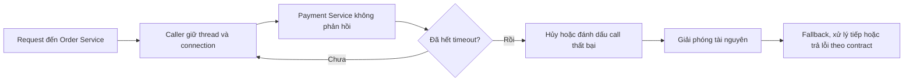
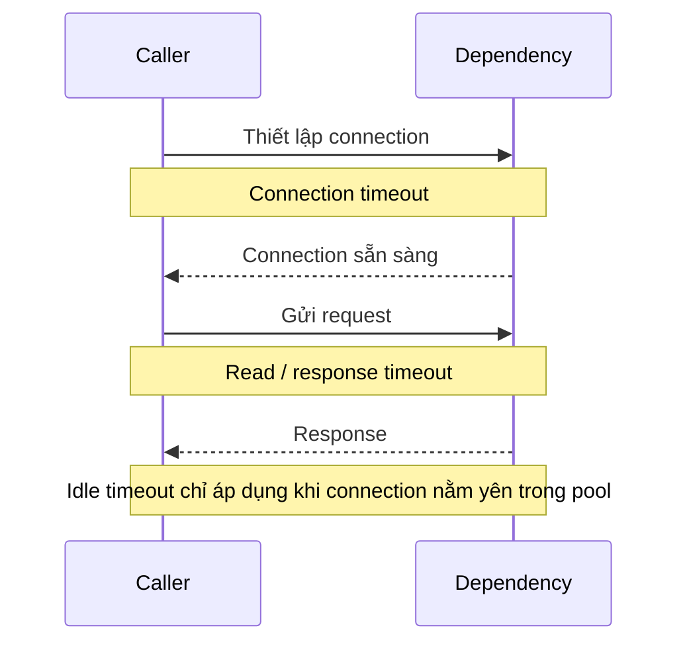
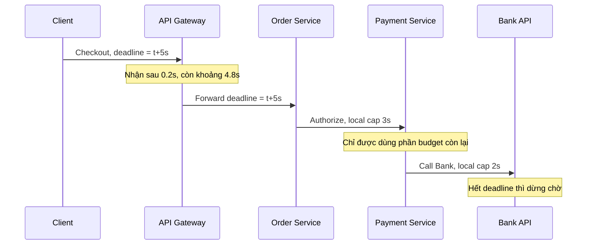
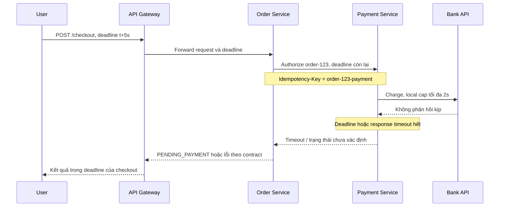

# Timeout Pattern — Giới hạn thời gian chờ

## Mục lục

- [Tổng quan](#tổng-quan)
  - [Timeout Pattern là gì](#timeout-pattern-là-gì)
  - [Failure mode cần ngăn chặn](#failure-mode-cần-ngăn-chặn)
  - [Timeout không phải là gì](#timeout-không-phải-là-gì)
- [Các lớp timeout](#các-lớp-timeout)
  - [Timeout ở ranh giới request](#timeout-ở-ranh-giới-request)
  - [Timeout ở lớp kết nối và response](#timeout-ở-lớp-kết-nối-và-response)
  - [Timeout của pool và resource](#timeout-của-pool-và-resource)
  - [Timeout cho database và message broker](#timeout-cho-database-và-message-broker)
  - [Thứ tự các lớp timeout](#thứ-tự-các-lớp-timeout)
- [Cách chọn giá trị timeout](#cách-chọn-giá-trị-timeout)
  - [Đo latency thay vì đoán](#đo-latency-thay-vì-đoán)
  - [Công thức làm điểm khởi đầu](#công-thức-làm-điểm-khởi-đầu)
  - [Giá trị phải theo dependency](#giá-trị-phải-theo-dependency)
- [Deadline propagation và time budget](#deadline-propagation-và-time-budget)
  - [Deadline và budget khác nhau thế nào](#deadline-và-budget-khác-nhau-thế-nào)
  - [Truyền deadline xuống service](#truyền-deadline-xuống-service)
  - [Đưa retry vào budget tổng](#đưa-retry-vào-budget-tổng)
- [Use case Order và Payment](#use-case-order-và-payment)
  - [Bối cảnh](#bối-cảnh)
  - [Luồng checkout có deadline](#luồng-checkout-có-deadline)
  - [Khi Payment hết thời gian chờ](#khi-payment-hết-thời-gian-chờ)
- [Trade-offs](#trade-offs)
- [Khi nào nên dùng và khi nào không nên dùng](#khi-nào-nên-dùng-và-khi-nào-không-nên-dùng)
  - [Nên dùng khi](#nên-dùng-khi)
  - [Không nên áp dụng theo cách này](#không-nên-áp-dụng-theo-cách-này)
- [Lỗi thường gặp](#lỗi-thường-gặp)
- [Vận hành](#vận-hành)
  - [Metrics và tracing](#metrics-và-tracing)
  - [Runbook khi timeout tăng](#runbook-khi-timeout-tăng)
  - [Kiểm thử và rollout](#kiểm-thử-và-rollout)
- [Checklist](#checklist)
- [Liên kết liên quan](#liên-kết-liên-quan)

---

## Tổng quan

### Timeout Pattern là gì

**Timeout** là thời gian chờ tối đa cho một thao tác. Khi thời gian này hết, caller (service gọi) dừng chờ, hủy hoặc đánh dấu call thất bại theo contract, rồi giải phóng tài nguyên cho request khác.

Trong Microservice, mọi cuộc gọi đi qua network đều có thể bị chậm hoặc không trả lời. Timeout biến trạng thái “chờ không biết đến bao giờ” thành một kết quả có giới hạn thời gian. Đây là nền tảng để caller fail fast hoặc chuyển sang cách xử lý khác.



Timeout chỉ bảo vệ thời gian chờ của caller. Nó không tự làm cho dependency (service phụ thuộc) khỏe lại. Nó cũng không tự hoàn tác một side effect đã được dependency thực hiện.

### Failure mode cần ngăn chặn

Failure mode là cách một sự cố biến thành thiệt hại lớn hơn. Với Timeout Pattern, failure mode chính là dependency không trả response nhưng caller vẫn giữ tài nguyên:

```text
KHÔNG có timeout:
  Payment Service bị treo
      │
      ├── Request mới tiếp tục chiếm thread của Order Service
      ├── Connection pool bị giữ hoặc đầy dần
      └── Thread pool cạn kiệt → Order Service cũng không nhận request mới

CÓ timeout:
  Payment Service bị treo
      │
      ├── Mỗi call chỉ được chờ trong giới hạn đã định
      ├── Call hết hạn được hủy hoặc trả lỗi
      └── Thread và connection được trả lại → phần còn lại vẫn có cơ hội hoạt động
```

| Failure mode | Điều xảy ra | Timeout giới hạn ở đâu |
|---|---|---|
| **Connection không thiết lập được** | Network đứt, endpoint không reachable hoặc service không nhận kết nối | Giai đoạn thiết lập connection |
| **Downstream im lặng** | Request đã gửi nhưng không có response | Read hoặc response timeout |
| **Downstream quá chậm** | Response cuối cùng có thể đến nhưng vượt SLA của caller | Per-request timeout hoặc deadline |
| **Chờ resource nội bộ** | Caller chờ thread, connection hoặc semaphore trống | Pool checkout hoặc acquisition timeout |
| **Caller đã bỏ cuộc** | Client đã hết thời gian nhưng service bên trong vẫn làm việc | Deadline propagation và cancellation |

Một timeout nên tạo ra tín hiệu có thể phân loại. `connection timeout`, `read timeout`, `pool timeout` và `overall deadline exceeded` thường dẫn tới các hướng điều tra khác nhau, dù đều có thể xuất hiện dưới dạng lỗi “timeout”.

### Timeout không phải là gì

- Timeout **không phải** là cam kết service luôn phản hồi trước giá trị đó. Đây là giới hạn caller chấp nhận chờ.
- Timeout **không phải** là cơ chế rollback. Với thanh toán, timeout có thể xảy ra sau khi Bank API đã nhận và xử lý request nhưng response bị mất.
- Timeout **không thay thế** cho việc đo latency, xử lý overload hoặc thiết kế asynchronous workflow khi thao tác không phù hợp với request đồng bộ.
- Timeout **không đảm bảo** server tự dừng ngay. Muốn dừng việc không còn cần thiết, các lớp bên dưới phải tôn trọng cancellation hoặc deadline.

> **Nguyên tắc:** mọi external call cần một giới hạn chờ tường minh. Đừng suy luận rằng thư viện có default an toàn nếu chưa kiểm tra tài liệu và cấu hình runtime của nó.

## Các lớp timeout

Một request đi qua nhiều lớp. Cài một timeout ở HTTP client không tự động giới hạn thời gian lấy connection từ pool, chạy query trong database hoặc chờ broker xác nhận. Tên tham số thay đổi theo thư viện, nhưng trách nhiệm cần được phân biệt rõ.

### Timeout ở ranh giới request

| Lớp | Phạm vi | Mục đích |
|---|---|---|
| **Client hoặc edge timeout** | Toàn bộ thời gian client, Ingress hoặc API Gateway chờ response | Không để request ngoài hệ thống chờ vô hạn |
| **Service handler timeout** | Thời gian handler của service xử lý một request | Dừng việc xử lý không còn giá trị sau khi deadline hết |
| **Overall hoặc request timeout** | Toàn bộ call từ lúc bắt đầu đến lúc kết thúc, bao gồm backoff và các lần thử | Giữ tổng thời gian trong SLA hoặc deadline của request gốc |

`Overall timeout` là lớp quan trọng nhất khi một call có retry hoặc đi qua nhiều bước. Nếu chỉ đặt `read timeout` cho từng lần gọi, tổng thời gian vẫn có thể tăng vượt thời gian người dùng chấp nhận.

### Timeout ở lớp kết nối và response

| Loại | Áp dụng cho | Khi hết thời gian |
|---|---|---|
| **Connection timeout** | Thiết lập kết nối TCP tới endpoint | Dừng khi không tạo được connection trong giới hạn; không tiếp tục chờ handshake vô hạn |
| **Read hoặc response timeout** | Chờ response sau khi request đã được gửi | Dừng chờ nếu downstream không trả dữ liệu kịp hạn |
| **Idle timeout** | Connection nhàn rỗi trong pool | Đóng connection đã không hoạt động để tránh giữ connection cũ quá lâu |



`Idle timeout` không phải là response timeout. Nó không nên được dùng để giới hạn một request đang chạy. Ngược lại, nếu chỉ đặt response timeout mà bỏ qua connection timeout, caller vẫn có thể bị treo ngay từ bước thiết lập connection.

### Timeout của pool và resource

Caller thường phải chờ resource trước khi thực hiện network call. Các hàng đợi này cũng cần giới hạn:

- **Thread pool hoặc executor:** thời gian chờ một worker để chạy task.
- **Connection pool:** thời gian chờ lấy connection HTTP hoặc database.
- **Semaphore hoặc bulkhead slot:** thời gian chờ quyền thực hiện một số lượng call đồng thời.
- **Queue nội bộ:** thời gian một công việc được phép nằm trong hàng đợi trước khi bị từ chối hoặc chuyển hướng.

Nếu pool checkout không có timeout, request có thể treo ở hàng đợi dù downstream chưa được gọi. Vì vậy, sơ đồ “call timeout” chưa đủ để chứng minh service được bảo vệ khỏi cạn kiệt tài nguyên.

### Timeout cho database và message broker

Database, cache và message broker cũng là external dependency nếu chúng nằm ngoài process của caller:

| Dependency | Timeout cần quan tâm | Ghi chú |
|---|---|---|
| **Database** | Pool checkout, query hoặc command, transaction và commit | Giới hạn theo thao tác; không để một query giữ connection vô hạn |
| **Cache** | Connection và read/write operation | Cache timeout cần đi cùng chính sách khi cache không sẵn sàng |
| **Message broker** | Kết nối, publish và chờ broker acknowledge | Fire-and-forget vẫn cần giới hạn thời gian gửi |
| **Queue consumer** | Ack deadline, visibility timeout hoặc redelivery timeout | Đây là cơ chế của message delivery, không đồng nhất với HTTP request timeout |

Giá trị và tên cấu hình phụ thuộc driver hoặc client. Điểm cần giữ nhất quán là mọi thao tác chờ network hoặc resource đều có giới hạn và có hành vi khi hết hạn.

### Thứ tự các lớp timeout

Một request đi sâu qua hệ thống có thể có cấu trúc như sau:

```text
Client deadline: t + 10s
  └─ API Gateway request timeout: tối đa 8s
       └─ Order Service handler: tối đa 5s
            └─ Payment client overall call: tối đa 3s
                 ├─ Connection timeout: tối đa 1s
                 └─ Bank API response timeout: tối đa 2s
```

Các con số trên chỉ là ví dụ minh họa. Quy tắc cần giữ là lớp bên trong không được tiếp tục làm việc lâu hơn phần thời gian còn lại của request gốc. Một timeout cục bộ cũng không nên lớn hơn deadline mà caller đã truyền xuống.

## Cách chọn giá trị timeout

### Đo latency thay vì đoán

**Percentile** (phân vị) mô tả vị trí của một request trong phân bố latency:

- **P50** là mốc mà khoảng một nửa request nhanh hơn.
- **P95** là mốc mà khoảng 95% request nhanh hơn.
- **P99** là mốc mà khoảng 99% request nhanh hơn; phần còn lại là tail latency.

Dùng P99 làm cơ sở giúp timeout không quá sát với request điển hình. Tuy nhiên, percentile chỉ hữu ích khi đo đúng operation, payload, environment và trạng thái tải tương ứng. Một con số lấy từ dev không nên được áp thẳng cho production.

### Công thức làm điểm khởi đầu

Tài liệu nguồn dùng công thức sau để tạo giá trị khởi đầu:

```text
Timeout = P99 latency × 1.5 + network overhead
```

Hệ số `1.5` là buffer cho dao động như GC pause hoặc CPU spike. `network overhead` dành cho thời gian truyền qua mạng và khác nhau theo topology. Công thức này là điểm bắt đầu để kiểm chứng, không phải một giá trị đúng cho mọi hệ thống.

Ví dụ, nếu **Payment Service** có P99 là `1.5s` và network overhead ước tính `0.1s`:

```text
Timeout = 1.5s × 1.5 + 0.1s
        = 2.35s
        → Có thể làm tròn thành 3s sau khi kiểm thử
```

Khi chọn giữa các mốc đo, không nên dùng P50 vì có thể timeout oan nhiều request hợp lệ. Cũng không nên dùng max làm giá trị mặc định vì một outlier có thể khiến mọi request phải chờ quá lâu. P99 là cơ sở thực tế hơn, nhưng vẫn cần đối chiếu với SLA và business requirement.

### Giá trị phải theo dependency

Không có một timeout chung cho mọi dependency. User Service nội bộ, Payment Service và Report Service có workload và latency khác nhau. Một bảng minh họa từ các profile khác nhau:

| Dependency | P99 minh họa | Timeout gợi ý minh họa |
|---|---:|---:|
| User Service nội bộ | 150ms | 300–500ms |
| Payment Service | 1.5s | Khoảng 3s |
| Report Service | 10s | Khoảng 15s |
| External Bank API | 5s | Khoảng 8–10s |

Các giá trị này không phải preset. Mỗi team cần:

1. Đo P50, P95, P99 và timeout rate theo operation.
2. Tách latency của connection, queue, server processing và response nếu có thể.
3. Đặt timeout riêng cho từng dependency hoặc nhóm operation có cùng đặc tính.
4. Kiểm thử dưới tải và trong các tình huống dependency chậm hoặc không phản hồi.
5. Đặt giới hạn tối đa để một cấu hình sai không biến thành request chờ vô hạn.

**Adaptive timeout** có thể tự điều chỉnh theo latency gần đây. Cách này bám sát hành vi thực tế hơn nhưng cần telemetry, giới hạn min/max và cơ chế tránh timeout dao động theo một spike ngắn. Khi chưa có dữ liệu đủ tốt, timeout tĩnh được đo lường và review định kỳ dễ vận hành hơn.

## Deadline propagation và time budget

### Deadline và budget khác nhau thế nào

**Deadline** là thời điểm tuyệt đối mà request gốc phải kết thúc. **Time budget** là phần thời gian còn lại tính từ thời điểm hiện tại đến deadline đó.

Ví dụ, request bắt đầu tại `t=0` với deadline `t+5s`. Khi tới Order Service ở `t=0.2s`, budget còn khoảng `4.8s`. Service không nên tự coi mình có thêm 5 giây mới; nó phải dùng phần budget còn lại.

Một cách diễn đạt cho policy cục bộ là:

```text
remaining_budget = original_deadline - now

Nếu remaining_budget <= local_margin:
  fail fast hoặc trả kết quả theo contract, không gọi dependency mới

local_timeout = min(local_cap, remaining_budget - local_margin)
```

`local_cap` bảo vệ một dependency cụ thể. `remaining_budget` bảo vệ toàn bộ request. Hai giới hạn này bổ sung cho nhau; không nên dùng `local_cap` để kéo dài deadline của request gốc.

### Truyền deadline xuống service

Deadline propagation truyền thời hạn của request qua các hop thay vì để mỗi service đặt timeout độc lập. Với gRPC, deadline có thể được truyền trong metadata của call. Với REST, team thường quy ước một header deadline hoặc remaining budget riêng và yêu cầu mọi tầng tôn trọng nó.



Khi tự định nghĩa header cho REST, contract cần thống nhất đơn vị thời gian, format, cách xử lý giá trị thiếu hoặc không hợp lệ và giới hạn tối đa ở mỗi boundary. Service bên trong không nên âm thầm reset deadline về một timeout dài hơn.

Deadline propagation có giá trị nhất khi đi cùng cancellation. Nếu Order Service đã hết deadline nhưng Payment Service vẫn tiếp tục query Bank hoặc database, hệ thống vẫn tiêu tài nguyên cho một response không còn được dùng. Mỗi client hoặc framework cần được kiểm tra để biết khi timeout xảy ra thì nó chỉ trả lỗi cho caller hay thực sự hủy operation bên dưới.

### Đưa retry vào budget tổng

`Per-try timeout` giới hạn một lần thử. `Overall deadline` giới hạn toàn bộ chuỗi, gồm thời gian xử lý ban đầu, backoff và các lần thử lại.

Ví dụ có ba lần thử tổng cộng, mỗi lần tối đa `2s`, backoff giữa các lần là `0.5s` rồi `1s`, trong overall deadline `10s`:

```text
Try 1: 0s    → 2.0s   timeout
Backoff:     0.5s
Try 2: 2.5s  → 4.5s   timeout
Backoff:     1.0s
Try 3: 5.5s  → 7.5s   timeout

→ Dừng theo giới hạn attempts; phần budget còn lại không tự tạo thêm lần thử
```

Nếu không có overall deadline, việc cộng nhiều per-try timeout có thể khiến user chờ lâu hơn SLA. Số lần thử cũng cần được định nghĩa rõ: “3 retries” có thể được hiểu là ba lần retry sau lần đầu, còn “3 attempts” là tổng cộng ba lần gọi.

**Retry budget** là khái niệm khác với time budget. Time budget giới hạn thời gian của một request. Retry budget giới hạn số lượng hoặc tỷ lệ traffic được phép tạo thêm request retry, ví dụ một policy có thể chỉ cho một phần traffic retry. Hai budget nên được theo dõi riêng.

Với operation có side effect như `POST /payments`, timeout không chứng minh operation chưa chạy. Nếu policy cho phép retry, request phải có **Idempotency Key** để server nhận ra cùng một operation. Nếu trạng thái vẫn không chắc chắn, cần reconciliation hoặc workflow xử lý trạng thái pending thay vì tự động gửi một lệnh charge mới.

## Use case Order và Payment

### Bối cảnh

Một luồng checkout có các boundary sau:

```text
User / Client
      │ deadline của request
      ▼
API Gateway
      │ forward deadline còn hiệu lực
      ▼
Order Service
      │ authorize payment
      ▼
Payment Service
      │ gọi provider bên ngoài
      ▼
Bank API
```

Order Service cần phản hồi trong thời gian người dùng chấp nhận. Payment Service lại phụ thuộc vào Bank API có latency biến động và nằm ngoài quyền kiểm soát của team. Vì vậy, mỗi lớp cần có giới hạn riêng nhưng vẫn phải tôn trọng deadline của checkout.

### Luồng checkout có deadline



Ví dụ cấu hình trong một profile đã đo lường có thể là:

| Boundary | Giới hạn minh họa | Ý nghĩa |
|---|---:|---|
| Client hoặc Gateway | 5s | Thời gian tổng user chấp nhận cho checkout |
| Order handler | Tối đa phần budget còn lại | Không xử lý sau khi request gốc đã hết hạn |
| Order → Payment | Local cap 3s | Giới hạn call tới Payment, nhưng vẫn lấy `min(cap, remaining)` |
| Payment → Bank | Local cap 2s | Không để Bank giữ Payment vô hạn |
| Pool checkout | Nhỏ hơn budget còn lại | Không tiêu toàn bộ thời gian chỉ để chờ resource |

Các con số chỉ minh họa cách phân bổ. Giá trị thật phải dựa trên P99, SLO và contract của từng operation. Nếu Gateway chỉ còn `1.5s`, Payment không được tự cấp thêm `3s`, và Bank cũng không được nhận một timeout độc lập dài hơn phần còn lại.

### Khi Payment hết thời gian chờ

Timeout ở Bank API có thể có nhiều ý nghĩa:

1. Request chưa tới Bank vì lỗi connection.
2. Bank đã nhận request nhưng chưa xử lý xong.
3. Bank đã xử lý charge nhưng response bị mất trên đường về.

Vì vậy, Order Service không nên suy luận đơn giản rằng “timeout = chắc chắn chưa trừ tiền”. Hành vi tiếp theo phải dựa trên contract Payment:

- Dùng cùng `Idempotency Key` nếu một lần thử lại là an toàn.
- Trả trạng thái `PENDING_PAYMENT` hoặc trạng thái tương đương khi kết quả chưa xác định và nghiệp vụ cho phép xử lý sau.
- Ghi nhận đủ correlation hoặc operation ID để Payment Service đối chiếu với Bank.
- Dùng reconciliation khi provider có thể trả trạng thái cuối cùng qua API hoặc cơ chế khác.

Timeout giúp checkout không giữ request vô hạn. Nó không tự quyết định business outcome của một payment chưa rõ trạng thái.

## Trade-offs

| Lựa chọn | Lợi ích | Chi phí hoặc rủi ro |
|---|---|---|
| **Timeout ngắn** | Fail fast, giải phóng thread và connection sớm | Request hợp lệ nhưng chậm có thể bị timeout oan; tăng lỗi giả hoặc fallback |
| **Timeout dài** | Khoan dung hơn với spike và request chậm | User chờ lâu; tài nguyên bị giữ lâu; sự cố dễ lan sang caller |
| **Một giá trị cho mọi dependency** | Đơn giản để cấu hình | Không phản ánh khác biệt giữa service nội bộ, database, report hoặc Bank API |
| **Timeout theo dependency và operation** | Phù hợp latency và SLA thực tế | Nhiều cấu hình hơn, cần ownership và review |
| **Chỉ có per-try timeout** | Dễ thêm vào HTTP client | Tổng thời gian có retry hoặc backoff vẫn có thể vượt SLA |
| **Per-try + overall deadline** | Kiểm soát cả một lần gọi và toàn bộ request | Cần truyền deadline, tính budget và xử lý cancellation |
| **Timeout tĩnh** | Dễ hiểu, dễ debug và rollout | Có thể không theo kịp thay đổi latency dài hạn |
| **Adaptive timeout** | Bám sát telemetry gần đây | Phức tạp; spike hoặc dữ liệu nhiễu có thể làm giá trị dao động |

Nói ngắn gọn: timeout ngắn bảo vệ hệ thống tốt hơn nhưng có thể giảm tỉ lệ thành công của request chậm hợp lệ. Timeout dài giảm lỗi giả nhưng kéo dài thời gian giữ tài nguyên. Chọn giá trị dựa trên dữ liệu và kiểm tra lại bằng metrics, không chọn theo một con số quen thuộc.

## Khi nào nên dùng và khi nào không nên dùng

### Nên dùng khi

- Gọi HTTP, gRPC, database, cache hoặc message broker qua network.
- Lấy connection từ pool, chờ thread hoặc chờ semaphore trước khi gọi dependency.
- Gửi event theo kiểu fire-and-forget; thao tác publish vẫn là một network call cần giới hạn thời gian gửi.
- Chạy sau API Gateway, Ingress, Load Balancer hoặc một service khác có deadline của request gốc.
- Thực hiện synchronous call mà user hoặc upstream có SLA rõ ràng.

Timeout nên là default bắt buộc ở lớp client hoặc adapter cho external call. Mỗi dependency vẫn có thể ghi đè bằng profile riêng sau khi đã đo latency.

### Không nên áp dụng theo cách này

| Tình huống | Cách tiếp cận phù hợp hơn |
|---|---|
| Hàm in-process hoặc thao tác in-memory không chờ network | Không cần network timeout; nếu là vòng lặp CPU dài thì thiết kế cancellation riêng |
| Job xử lý dài hơn request đồng bộ | Đẩy thành asynchronous job, theo dõi trạng thái và dùng lease/ack timeout của worker |
| Consumer đọc message từ queue | Dùng visibility timeout, ack deadline hoặc redelivery policy của broker |
| Muốn sửa lỗi service quá tải bằng cách tăng timeout | Đo saturation và latency; xem lại capacity, queueing hoặc chuyển workflow sang async |
| Chỉ đặt timeout để thay thế idempotency hoặc reconciliation | Giữ timeout, nhưng bổ sung cơ chế bảo vệ side effect và xác định trạng thái |

“Không nên” ở đây không có nghĩa là bỏ mọi giới hạn thời gian. Nó có nghĩa là không dùng HTTP request timeout như một cơ chế duy nhất cho loại công việc có vòng đời khác.

## Lỗi thường gặp

| Lỗi | Hệ quả | Cách phòng tránh |
|---|---|---|
| **Tin vào default của thư viện** | Call có thể chờ vô hạn; một số client không bật timeout mặc định, như `http.DefaultClient` của Go | Kiểm tra tài liệu, đặt timeout tường minh và test khi dependency không phản hồi |
| **Chỉ đặt read timeout** | Request vẫn có thể treo ở bước thiết lập connection | Tách connection timeout và response timeout |
| **Quên timeout của pool checkout** | Request chờ thread hoặc connection vô hạn trước khi downstream được gọi | Đặt acquisition timeout nhỏ hơn budget còn lại |
| **Chỉ có per-try timeout** | Retry và backoff cộng dồn vượt SLA | Bọc cả chuỗi bằng overall request timeout hoặc deadline |
| **Outer timeout ngắn hơn inner timeout** | Tầng trong tiếp tục làm việc sau khi caller đã bỏ cuộc | Propagate deadline và tính `min(local cap, remaining budget)` |
| **Một con số cho mọi dependency** | Service nhanh bị chờ quá lâu hoặc service chậm bị timeout oan | Đo P99 theo dependency và operation |
| **Nhầm idle timeout với response timeout** | Connection nhàn rỗi hoặc request đang chạy bị xử lý sai | Ghi rõ timeout nào áp dụng cho lifecycle nào |
| **Coi timeout payment là thất bại chắc chắn** | Retry charge có thể tạo duplicate hoặc trừ tiền hai lần | Idempotency Key, operation ID và reconciliation |
| **Timeout chỉ trả lỗi nhưng không cancellation** | Server, query hoặc task bên dưới vẫn tiếp tục tiêu tài nguyên | Kiểm tra cancellation propagation ở từng client và handler |
| **Không phân loại timeout trong telemetry** | Không biết lỗi xảy ra ở connection, response, pool hay overall budget | Ghi phase, dependency, operation và deadline còn lại |
| **Copy cấu hình mà không kiểm thử** | Giá trị quá ngắn gây lỗi giả hoặc giá trị quá dài che giấu sự cố | Load test, fault injection và rollout theo từng bước |

## Vận hành

### Metrics và tracing

Timeout chỉ có giá trị vận hành khi team biết nó xảy ra ở đâu và vì sao. Dashboard nên tách ít nhất theo `caller`, `dependency`, `operation` và `timeout phase`.

| Nhóm tín hiệu | Câu hỏi cần trả lời |
|---|---|
| **Request rate và timeout rate** | Timeout tăng do traffic tăng hay do dependency chậm? |
| **P50, P95, P99 latency** | Timeout có đang cắt vào tail latency của request hợp lệ không? |
| **Connection timeout và response timeout** | Vấn đề ở network/endpoint hay ở xử lý phía server? |
| **Pool wait và pool saturation** | Request có hết budget trong hàng đợi resource trước khi gọi downstream không? |
| **Deadline remaining** | Các hop bên trong nhận được bao nhiêu thời gian còn lại? |
| **Cancellation và in-flight work** | Khi caller hết hạn, task bên dưới có thực sự dừng không? |
| **Payment operation status** | Có payment nào timeout nhưng sau đó provider vẫn hoàn tất không? |

Log hoặc span có thể ghi các field kỹ thuật như `timeout_type`, `configured_timeout_ms`, `deadline_remaining_ms`, `caller`, `dependency`, `operation` và `attempt`. Không nên gộp mọi lỗi thành một thông báo chung `request timeout`, vì như vậy sẽ mất thông tin để phân biệt connection, pool và downstream latency.

Khi so sánh với SLO, xem cả timeout rate và latency percentile. Một timeout rate thấp nhưng P99 tăng mạnh vẫn có thể báo hiệu dependency đang tiến gần ngưỡng. Ngược lại, tăng timeout để làm timeout rate giảm không chứng minh hệ thống khỏe hơn; request chỉ có thể đang chờ lâu hơn.

### Runbook khi timeout tăng

Khi alert cho thấy timeout tăng, điều tra theo thứ tự từ phạm vi gần caller tới dependency:

1. **Xác định scope:** dependency, operation, replica, region và thời điểm bắt đầu.
2. **Kiểm tra phase:** connection, pool checkout, response, database query hay overall deadline.
3. **So sánh latency:** xem P95/P99 của downstream cùng thời điểm, không chỉ xem error rate.
4. **Kiểm tra saturation:** thread pool, connection pool, CPU, memory, queue lag và số request đang in-flight.
5. **Đối chiếu thay đổi gần đây:** deploy, configuration, route, certificate, network policy hoặc traffic spike.
6. **Đọc distributed trace:** xác định hop nào tiêu hết budget và các tầng bên trong có còn chạy sau deadline không.
7. **Với Payment:** kiểm tra operation ID hoặc trạng thái provider trước khi cho phép xử lý lại.
8. **Khôi phục có kiểm soát:** rollback hoặc giảm tải theo runbook của hệ thống; không chỉ tăng timeout để che triệu chứng.

Nếu timeout xảy ra ở pool checkout, tăng timeout của downstream không giải quyết được hàng đợi nội bộ. Nếu timeout xảy ra ở response và P99 của dependency tăng, cần điều tra dependency hoặc capacity trước khi nới giá trị. Mọi thay đổi timeout nên được ghi lại cùng baseline và kết quả sau rollout.

### Kiểm thử và rollout

Nên kiểm thử từng failure mode thay vì chỉ kiểm tra response chậm thông thường:

- Dependency không mở được connection.
- Connection mở được nhưng không trả response.
- Response chậm hơn per-try timeout.
- Pool không còn slot và caller phải chờ acquisition.
- Request gốc hết deadline giữa một chuỗi nhiều hop.
- Caller bị hủy nhưng task ở service hoặc database vẫn đang chạy.
- Payment timeout sau khi provider có thể đã nhận side effect.

Test phải xác nhận cả kết quả nhìn thấy ở caller và tài nguyên phía sau: thread/connection có được trả lại không, query có bị hủy không, deadline có được truyền xuống không và cùng một payment có bị xử lý trùng không. Khi thay đổi cấu hình production, triển khai theo từng bước và theo dõi timeout rate, tail latency, saturation cùng business metric liên quan.

## Checklist

- [ ] Mọi external call qua HTTP, gRPC, database, cache và broker có timeout tường minh.
- [ ] Connection timeout và read/response timeout được phân biệt.
- [ ] Pool checkout, semaphore hoặc queue acquisition cũng có giới hạn chờ.
- [ ] Có overall request timeout bao phủ thời gian xử lý và mọi backoff/attempt.
- [ ] Giá trị được chọn từ P99 latency, network overhead, SLA và dữ liệu load test.
- [ ] Timeout được cấu hình theo dependency hoặc operation, không sao chép một con số cho tất cả.
- [ ] Gateway, service handler và downstream tôn trọng cùng deadline của request gốc.
- [ ] REST deadline header hoặc gRPC deadline có contract về format, đơn vị và giá trị không hợp lệ.
- [ ] Cancellation được kiểm tra ở HTTP client, handler, query và task bên dưới.
- [ ] Payment hoặc side effect không coi timeout là bằng chứng chắc chắn operation chưa chạy.
- [ ] Có Idempotency Key hoặc reconciliation cho operation có thể retry.
- [ ] Metrics tách được timeout phase, caller, dependency và operation.
- [ ] Có trace để biết hop nào tiêu hết budget.
- [ ] Đã test dependency treo, connection fail, pool đầy, deadline hết hạn và cancellation.
- [ ] Runbook nêu rõ cách điều tra và không chỉ tăng timeout để che lỗi.

## Liên kết liên quan

- [17 — Reliability Patterns](../17-reliability-patterns.md) — phần tổng hợp chứa Timeout và các reliability pattern liên quan.
- [10 — Resilience Patterns](../10-resilience-patterns.md) — công thức chọn timeout theo P99, Deadline, Retry, Idempotency và các pattern chịu lỗi bổ trợ.
- [06 — Inter-Service Communication](../06-inter-service-communication.md) — lựa chọn synchronous và asynchronous communication.
- [07 — API Gateway](../07-api-gateway.md) — timeout tổng và boundary ở lớp Gateway.
- [09 — Data Management](../09-data-management.md) — Saga, Transactional Outbox và xử lý workflow phân tán.
- [11 — Observability & Evolvability](../11-observability-evolvability.md) — metrics, logging, tracing và health endpoint.
- [13 — Orchestration](../13-orchestration.md) — readiness, graceful shutdown và các lớp hạ tầng liên quan.
- [16 — Configuration & Secrets Management](../16-configuration-secrets-management.md) — quản lý timeout configuration theo environment.
